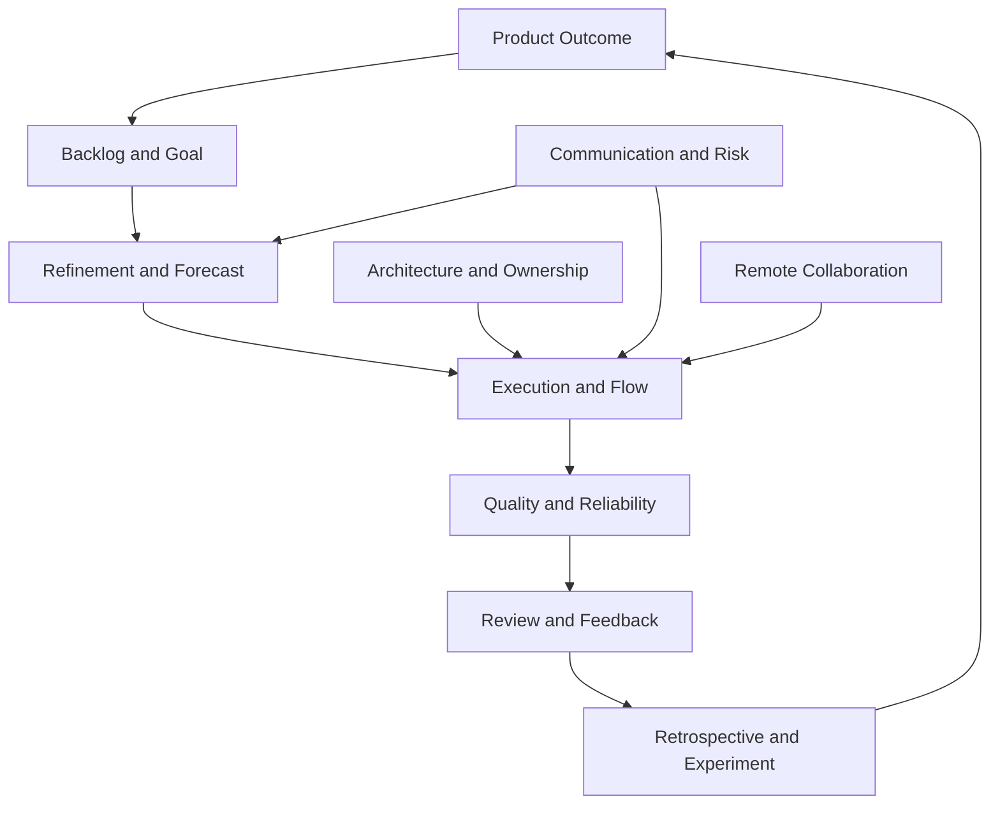

# Part 042 — Competency Map, Learning Path, Evidence Portfolio, Practice Drills, and Long-Term Growth

## Positioning

Scrum mastery untuk senior engineer bukan kemampuan menghafal event, accountabilities, dan artifacts.

Mastery berarti mampu menggunakan Scrum dan engineering practices untuk:

- meningkatkan product learning;
- memperbaiki delivery flow;
- menjaga quality dan reliability;
- mengelola uncertainty;
- memfasilitasi keputusan;
- dan membangun team yang tidak bergantung pada satu individu.

> **Core thesis:** senior engineer yang menguasai Scrum mampu menghubungkan product outcome, delivery system, technical architecture, operations, dan human collaboration dalam satu operating model yang empiris.

---

## 1. What Scrum Mastery Means for a Senior Engineer

Scrum mastery is the ability to:

- understand purpose, not only mechanics;
- inspect evidence;
- adapt behavior;
- maintain transparency;
- and improve the system responsibly.

It is not:

- becoming the Scrum Master;
- owning all ceremonies;
- or policing process.

---

## 2. The Senior Engineer Scrum Operating Model



---

## 3. Mastery Domains

The mastery map includes:

1. Agile and Scrum fundamentals.
2. Product and backlog thinking.
3. Story quality and slicing.
4. Estimation and forecasting.
5. Sprint execution and flow.
6. Review and retrospective.
7. Engineering work and business risk.
8. Defects and incidents.
9. Dependencies and stakeholder communication.
10. Remote-first collaboration.
11. Ownership and mentorship.
12. Architecture and delivery quality.
13. Metrics and anti-patterns.
14. Onboarding and continuous growth.

---

## 4. Mastery Levels

A useful progression:

### Level 1 — Aware

Understands terminology and purpose.

### Level 2 — Contributor

Applies practices with guidance.

### Level 3 — Independent

Operates reliably in normal situations.

### Level 4 — Enabler

Improves team capability and decisions.

### Level 5 — System Leader

Influences cross-team systems without centralizing authority.

---

## 5. Evidence-Based Mastery

Mastery should be evidenced through:

- decisions improved;
- risks surfaced earlier;
- flow improved;
- quality protected;
- knowledge distributed;
- and outcomes delivered.

Not through certificates or vocabulary alone.

---

# Domain 1 — Agile and Scrum Fundamentals

## 6. Level 1 — Aware

Can explain:

- empiricism;
- transparency;
- inspection;
- adaptation;
- Scrum Team;
- events;
- artifacts;
- commitments.

---

## 7. Level 2 — Contributor

Can:

- participate effectively in events;
- use Sprint Goal;
- update plan;
- and keep work transparent.

---

## 8. Level 3 — Independent

Can:

- distinguish Scrum purpose from ceremony;
- adapt scope while preserving goal;
- and identify process anti-patterns.

---

## 9. Level 4 — Enabler

Can:

- help team restore event purpose;
- coach self-management;
- and design small improvement experiments.

---

## 10. Level 5 — System Leader

Can:

- identify organizational impediments;
- align Scrum with product and engineering systems;
- and prevent cargo-cult adoption.

---

## 11. Evidence Examples

- Daily Scrum shifts from status to replanning.
- Review produces backlog decisions.
- Retrospective actions close.
- Sprint Goal guides scope.

---

# Domain 2 — Product and Backlog Thinking

## 12. Level 1 — Aware

Understands:

- Product Goal;
- Product Backlog;
- outcome versus output;
- and ordering.

---

## 13. Level 2 — Contributor

Can:

- clarify problem;
- ask for customer context;
- and make engineering work visible.

---

## 14. Level 3 — Independent

Can:

- translate technical consequence;
- support ordering;
- and identify hidden backlog work.

---

## 15. Level 4 — Enabler

Can:

- improve backlog quality;
- connect product evidence to engineering choices;
- and challenge feature-only thinking.

---

## 16. Level 5 — System Leader

Can:

- align roadmap, engineering risk, and operational constraints;
- and improve product-engineering decision systems.

---

## 17. Evidence Examples

- debt item framed with recurring cost.
- reliability work ordered before risky rollout.
- Product Goal used in trade-off.
- stale backlog reduced.

---

# Domain 3 — Story Quality and Slicing

## 18. Level 1 — Aware

Understands:

- story;
- acceptance criteria;
- examples;
- and vertical slicing.

---

## 19. Level 2 — Contributor

Can:

- add examples;
- identify missing failure behavior;
- and clarify out-of-scope.

---

## 20. Level 3 — Independent

Can:

- slice by workflow, rule, actor, risk, and rollout;
- and avoid horizontal incomplete layers.

---

## 21. Level 4 — Enabler

Can:

- facilitate example mapping;
- teach slicing;
- and reduce batch size.

---

## 22. Level 5 — System Leader

Can:

- improve organizational slicing patterns;
- and connect architecture boundaries to product slices.

---

## 23. Evidence Examples

- multi-level approval split into meaningful slices.
- one risk validated before full implementation.
- story enters Sprint with manageable unknowns.

---

# Domain 4 — Estimation and Forecasting

## 24. Level 1 — Aware

Understands:

- effort;
- complexity;
- uncertainty;
- risk;
- and capacity.

---

## 25. Level 2 — Contributor

Can:

- participate in estimation;
- explain assumptions;
- and compare reference stories.

---

## 26. Level 3 — Independent

Can:

- estimate to Done;
- use ranges and confidence;
- and account for dependency and unplanned work.

---

## 27. Level 4 — Enabler

Can:

- improve estimation conversation;
- introduce probabilistic thinking;
- and prevent velocity misuse.

---

## 28. Level 5 — System Leader

Can:

- design decision-oriented forecasting;
- align portfolio expectations;
- and challenge false precision.

---

## 29. Evidence Examples

- estimate disagreement exposes legacy compatibility risk.
- forecast includes assumptions and confidence.
- velocity removed from team comparison.

---

# Domain 5 — Sprint Execution and Flow

## 30. Level 1 — Aware

Understands:

- Sprint Goal;
- WIP;
- blocked work;
- and Daily Scrum.

---

## 31. Level 2 — Contributor

Can:

- update work transparently;
- surface blockers;
- and swarm when needed.

---

## 32. Level 3 — Independent

Can:

- manage aging work;
- replan scope;
- and protect the goal.

---

## 33. Level 4 — Enabler

Can:

- improve review flow;
- introduce WIP policy;
- and reduce queues.

---

## 34. Level 5 — System Leader

Can:

- identify cross-team constraints;
- and improve flow across boundaries.

---

## 35. Evidence Examples

- review latency decreases.
- carry-over reduces through slicing and WIP control.
- mid-Sprint scope adaptation is explicit.

---

# Domain 6 — Sprint Review and Retrospective

## 36. Level 1 — Aware

Understands:

- Review as inspection and adaptation;
- Retrospective as improvement.

---

## 37. Level 2 — Contributor

Can:

- demo behavior and limitations;
- provide retro observations;
- and participate in actions.

---

## 38. Level 3 — Independent

Can:

- classify feedback;
- adapt backlog;
- perform system analysis;
- and own experiments.

---

## 39. Level 4 — Enabler

Can:

- improve Review narrative;
- facilitate blameless analysis;
- and increase follow-through.

---

## 40. Level 5 — System Leader

Can:

- connect stakeholder learning and organizational improvement;
- and remove systemic barriers to adaptation.

---

## 41. Evidence Examples

- Review generates product decision.
- retro experiment has baseline and outcome.
- partial and invisible work is shown honestly.

---

# Domain 7 — Engineering Work and Business Risk

## 42. Level 1 — Aware

Recognizes:

- debt;
- reliability;
- security;
- observability;
- and migration work.

---

## 43. Level 2 — Contributor

Can:

- make engineering work visible;
- and state technical consequence.

---

## 44. Level 3 — Independent

Can:

- frame risk;
- present options;
- and recommend mitigation.

---

## 45. Level 4 — Enabler

Can:

- improve engineering backlog quality;
- and help Product Owner order non-feature work.

---

## 46. Level 5 — System Leader

Can:

- align technical risk with roadmap and business decisions;
- and create shared risk policy.

---

## 47. Evidence Examples

- runtime upgrade planned before end-of-support deadline.
- observability item linked to support outcome.
- residual risk explicitly accepted.

---

# Domain 8 — Defects and Incidents

## 48. Level 1 — Aware

Understands:

- defect;
- severity;
- priority;
- incident;
- and hotfix.

---

## 49. Level 2 — Contributor

Can:

- provide reproduction;
- classify impact;
- and follow incident roles.

---

## 50. Level 3 — Independent

Can:

- lead technical triage;
- choose containment;
- and produce CAPA.

---

## 51. Level 4 — Enabler

Can:

- improve incident readiness;
- distribute response knowledge;
- and reduce recurrence.

---

## 52. Level 5 — System Leader

Can:

- align reliability policy with delivery;
- and improve cross-team incident systems.

---

## 53. Evidence Examples

- incident detected earlier.
- secondary owner executes recovery.
- repeat incident reduced through systemic CAPA.

---

# Domain 9 — Dependencies and Stakeholders

## 54. Level 1 — Aware

Understands:

- dependency types;
- ownership;
- needed-by date;
- and escalation.

---

## 55. Level 2 — Contributor

Can:

- record dependency;
- identify provider and consumer;
- and communicate status.

---

## 56. Level 3 — Independent

Can:

- define readiness evidence;
- create fallback;
- and negotiate scope.

---

## 57. Level 4 — Enabler

Can:

- reduce recurring dependencies;
- improve escalation quality;
- and facilitate cross-team decisions.

---

## 58. Level 5 — System Leader

Can:

- reshape decision and dependency systems;
- and influence architecture/team boundaries.

---

## 59. Evidence Examples

- dependency is deferred before false Sprint commitment.
- cross-team contract becomes additive.
- escalation produces explicit decision.

---

# Domain 10 — Remote-First Collaboration

## 60. Level 1 — Aware

Understands:

- async versus sync;
- timezone;
- durable context;
- and meeting purpose.

---

## 61. Level 2 — Contributor

Can:

- write async updates;
- create handoffs;
- and participate in remote workshops.

---

## 62. Level 3 — Independent

Can:

- design decision-ready notes;
- pair remotely;
- and coordinate across timezones.

---

## 63. Level 4 — Enabler

Can:

- reduce meeting load;
- improve remote onboarding;
- and create distributed knowledge systems.

---

## 64. Level 5 — System Leader

Can:

- design remote operating models;
- and improve global collaboration without surveillance.

---

## 65. Evidence Examples

- decision latency falls.
- meeting hours decrease without worse blockers.
- onboarding survives timezone boundaries.

---

# Domain 11 — Ownership and Mentorship

## 66. Level 1 — Aware

Understands:

- ownership;
- delegation;
- mentoring;
- and quality bar.

---

## 67. Level 2 — Contributor

Can:

- close loops;
- give specific feedback;
- and support others.

---

## 68. Level 3 — Independent

Can:

- delegate with guardrails;
- mentor through real work;
- and own end-to-end outcomes.

---

## 69. Level 4 — Enabler

Can:

- distribute review and incident ownership;
- and raise shared quality standards.

---

## 70. Level 5 — System Leader

Can:

- build a team that does not depend on one senior;
- and develop future technical leaders.

---

## 71. Evidence Examples

- multiple reviewers can approve safely.
- mentee owns design and demo.
- senior absence does not stop delivery.

---

# Domain 12 — Architecture and Delivery Quality

## 72. Level 1 — Aware

Understands:

- boundaries;
- quality attributes;
- compatibility;
- and failure modes.

---

## 73. Level 2 — Contributor

Can:

- identify architecture risk;
- and contribute to design review.

---

## 74. Level 3 — Independent

Can:

- write ADR;
- design migration;
- and plan rollout/recovery.

---

## 75. Level 4 — Enabler

Can:

- build guardrails;
- reduce coupling;
- and delegate architecture decisions.

---

## 76. Level 5 — System Leader

Can:

- align architecture, team topology, product strategy, and delivery systems.

---

## 77. Evidence Examples

- coordinated release removed through compatibility.
- architecture fitness check automated.
- one approval gate replaced by guardrail.

---

# Domain 13 — Metrics and Anti-Patterns

## 78. Level 1 — Aware

Understands:

- WIP;
- cycle time;
- quality;
- reliability;
- and Goodhart's Law.

---

## 79. Level 2 — Contributor

Can:

- read dashboards;
- and identify obvious metric misuse.

---

## 80. Level 3 — Independent

Can:

- define metrics;
- interpret distributions;
- and design balanced signals.

---

## 81. Level 4 — Enabler

Can:

- improve metric governance;
- retire vanity metrics;
- and restore Scrum purpose.

---

## 82. Level 5 — System Leader

Can:

- align organizational incentives with product and system outcomes.

---

## 83. Evidence Examples

- metric target replaced with diagnostic portfolio.
- red status becomes safe.
- dashboard produces actual decisions.

---

# Domain 14 — Onboarding and Continuous Growth

## 84. Level 1 — Aware

Understands the need for:

- product;
- domain;
- architecture;
- delivery;
- and operational learning.

---

## 85. Level 2 — Contributor

Can:

- create learning maps;
- and complete a safe first contribution.

---

## 86. Level 3 — Independent

Can:

- build a 30–60–90 plan;
- and onboard others.

---

## 87. Level 4 — Enabler

Can:

- turn onboarding friction into system improvement;
- and create distributed learning paths.

---

## 88. Level 5 — System Leader

Can:

- design sustainable capability development across teams.

---

## 89. Evidence Examples

- time to meaningful contribution improves.
- onboarding does not depend on one buddy.
- critical knowledge has secondary owners.

---

## 90. Mastery Self-Assessment

Use a table:

| Domain | Current Level | Evidence | Gap | Next Practice |
|---|---:|---|---|---|
| Refinement | 3 | Facilitated slicing | Weak domain examples | Lead example mapping |
| Flow | 2 | Tracks blockers | No baseline | Run flow review |
| Incidents | 3 | Technical lead once | No role distribution | Tabletop with secondary lead |
| Mentoring | 2 | PR feedback | No growth plan | Create mentoring contract |

---

## 91. Evidence Portfolio

A mastery portfolio can include:

- backlog item before/after;
- story slicing example;
- risk brief;
- dependency record;
- ADR;
- incident postmortem;
- experiment canvas;
- metric definition;
- meeting decision summary;
- and mentoring evidence.

Sensitive internal details should be protected.

---

## 92. Evidence versus Claim

Weak:

> I improved team delivery.

Stronger:

> Reviewer rotation reduced median first-response time from 2.8 days to 0.9 day over two Sprints without increased escaped defects.

---

## 93. Portfolio Categories

### Product

- outcome hypothesis;
- backlog adaptation;
- stakeholder feedback.

### Delivery

- flow improvement;
- forecast;
- scope negotiation.

### Engineering

- design decision;
- reliability;
- migration;
- and quality.

### Leadership

- mentoring;
- delegation;
- facilitation;
- and conflict resolution.

---

## 94. Practice Drills

Mastery grows through repetition.

Possible drills:

- rewrite vague story;
- slice large capability;
- estimate with uncertainty;
- create risk brief;
- run blocker triage;
- write ADR;
- conduct incident tabletop;
- facilitate retrospective;
- and mentor through PR.

---

## 95. Daily Practice

Small habits:

- ask one outcome question;
- identify one assumption;
- make one decision durable;
- reduce one queue;
- and give one specific feedback.

---

## 96. Weekly Practice

Possible weekly cadence:

- inspect aging work;
- review one metric;
- update one risk;
- mentor one person;
- and close one improvement action.

---

## 97. Sprint Practice

Each Sprint:

- improve one backlog item;
- validate one assumption;
- review one operational signal;
- participate in one feedback loop;
- and inspect one team-system behavior.

---

## 98. Quarterly Practice

Each quarter:

- reassess mastery map;
- select one system-level capability;
- gather evidence;
- and update learning plan.

---

## 99. Deliberate Practice

Deliberate practice needs:

- specific skill;
- challenging task;
- immediate feedback;
- and reflection.

Example:

> Practice giving a one-minute risk brief in three stakeholder contexts and request feedback on clarity.

---

## 100. Reflection Journal

Use:

```text
Situation:
Decision:
Assumption:
Outcome:
What I learned:
What I would repeat:
What I would change:
```

---

## 101. Decision Journal

For important decisions:

- context;
- options;
- confidence;
- recommendation;
- and expected outcome.

Review later.

This improves judgment.

---

## 102. Failure Review

Choose one failure and inspect:

- system condition;
- your decision;
- communication;
- and missed evidence.

Avoid self-blame or self-protection.

---

## 103. Feedback Sources

Seek feedback from:

- Product Owner;
- engineers;
- QA;
- Scrum Master;
- Engineering Manager;
- support;
- and cross-team partners.

Different roles see different impact.

---

## 104. 360-Degree Questions

Ask:

```text
Where do I create clarity?
Where do I create delay?
What do people still wait for me to decide?
What should I delegate?
Where is my communication unclear?
What team capability should I help build?
```

---

## 105. Mentoring as Mastery Evidence

A senior engineer's mastery is partly visible through others.

Evidence:

- someone else can lead review;
- someone else can diagnose;
- someone else can facilitate;
- and someone else can make sound decisions.

---

## 106. Mastery without Bottleneck

The maturity test:

> Does the team become more capable when you contribute, or merely more dependent?

---

## 107. T-Shaped and Comb-Shaped Growth

A senior engineer needs:

- deep technical expertise;
- broad product and delivery understanding;
- and multiple secondary depths.

Comb-shaped growth supports cross-functional influence.

---

## 108. Domain Depth

Build depth in:

- product rules;
- customer variations;
- critical state;
- and operational failure.

Technology depth without domain depth limits senior impact.

---

## 109. Architecture Depth

Develop capability in:

- boundaries;
- contracts;
- data;
- failure;
- migration;
- and delivery.

---

## 110. Product Depth

Understand:

- customer outcome;
- roadmap;
- value;
- and trade-off.

---

## 111. Operational Depth

Understand:

- observability;
- incident;
- recovery;
- support;
- and reliability.

---

## 112. Human-System Depth

Understand:

- incentives;
- safety;
- conflict;
- mentoring;
- and organizational decision flow.

---

## 113. Mastery Anti-Patterns

### Certification-only mastery

Terminology without behavior.

### Ceremony ownership

Senior runs every Scrum event.

### Architecture authority

Every decision waits.

### Metric obsession

Numbers replace judgment.

### Hero expertise

Only one person can solve critical problems.

### Process cynicism

Rejecting Scrum instead of improving misuse.

### Permanent learner mode

Never taking responsibility.

### Premature leadership

Changing systems without context.

---

## 114. Senior Engineer Archetypes to Avoid

### The Firefighter

Valued only during crisis.

### The Gatekeeper

All reviews and decisions go through them.

### The Framework Purist

Context ignored.

### The Silent Expert

Knowledge not shared.

### The Process Cynic

Complains but does not experiment.

### The Architecture Tourist

Creates target states without migration.

### The Productivity Optimizer

Measures local activity, ignores system outcome.

---

## 115. Healthy Senior Engineer Archetype

A healthy senior engineer:

- understands product;
- reasons about risk;
- communicates clearly;
- delivers;
- teaches;
- improves systems;
- and steps back when others can lead.

---

## 116. Long-Term Learning Path

A suggested sequence:

### Quarter 1

- product/domain;
- Scrum and delivery flow;
- team relationships.

### Quarter 2

- architecture and reliability;
- cross-team dependency;
- and mentoring.

### Quarter 3

- product outcome and metrics;
- organizational influence;
- and incident leadership.

### Quarter 4

- system-level improvement;
- platform or topology;
- and strategic technical leadership.

Adapt based on context.

---

## 117. 12-Month Mastery Plan Template

```md
## Product and Domain Goal

## Technical Depth Goal

## Delivery-System Goal

## Reliability Goal

## Mentoring Goal

## Cross-Team Influence Goal

## Evidence

## Quarterly Checkpoints
```

---

## 118. Mastery Backlog

Maintain a small ordered list of:

- skills;
- experiments;
- and evidence opportunities.

Do not create a huge learning catalog.

---

## 119. Learning Item Template

```text
Capability:
Why it matters:
Current gap:
Practice opportunity:
Mentor/partner:
Evidence:
Review date:
```

---

## 120. Finding Practice Opportunities

Use real work:

- upcoming migration;
- incident tabletop;
- refinement challenge;
- dependency;
- and cross-team design.

Avoid waiting for perfect training.

---

## 121. Community of Practice

Participate in communities for:

- architecture;
- Java;
- reliability;
- testing;
- and Agile delivery.

Contribute learning back to the team.

Avoid turning communities into hidden governance.

---

## 122. Teaching as Learning

Teach:

- one mental model;
- one incident lesson;
- one pattern;
- or one tool.

Teaching exposes gaps in understanding.

---

## 123. Reading Strategy

Use reading to solve current problems.

A balanced reading portfolio:

- Scrum;
- product;
- flow;
- architecture;
- distributed systems;
- reliability;
- leadership;
- and domain.

---

## 124. Experiment Strategy

Use experiments to validate:

- process;
- architecture;
- and collaboration assumptions.

Learning through production-like evidence is stronger than opinion.

---

## 125. Internal Verification as a Habit

Maintain a verification mindset:

- what is general practice;
- what is team-specific;
- what is customer-specific;
- and what is formally governed.

Never infer internal CSG process from generic guidance.

---

## 126. Mastery Review Questions

Quarterly, ask:

```text
Which outcomes improved?
Which decisions became faster?
Which risks are visible earlier?
Which knowledge is less concentrated?
Which process can be removed?
Where am I still the bottleneck?
What should I learn next?
```

---

## 127. Promotion or Performance Evidence

Use outcome narratives:

```text
Context:
Challenge:
Your role:
Decision:
Actions:
Evidence:
Team leverage:
Long-term impact:
```

Avoid only listing projects.

---

## 128. Impact Narrative Example

```text
Context:
Cross-team event changes caused repeated release delay.

Action:
Introduced additive contract pattern, consumer matrix, and contract tests.

Evidence:
Coordinated release dependency was removed for two subsequent changes.

Team leverage:
Three engineers can now own contract evolution using the documented guardrail.
```

---

## 129. Mastery Scorecard

A qualitative scorecard:

| Area | Signal | Evidence | Next Step |
|---|---|---|---|
| Product | Goal-oriented decisions | Review adaptation | Learn outcome metrics |
| Flow | WIP and aging used | Review queue experiment | Cross-team flow |
| Quality | Risk-based evidence | Fewer regressions | Security depth |
| Reliability | Incident learning | CAPA completed | Error-budget policy |
| Leadership | Delegation | Secondary reviewers | Mentor design owner |

---

## 130. Do Not Collapse to One Score

A single mastery score hides:

- uneven strengths;
- context;
- and learning priorities.

Use domain-level evidence.

---

## 131. Personal Operating Principles

Possible principles:

1. Start with the product problem.
2. Separate fact from assumption.
3. Make work and risk visible.
4. Prefer small reversible changes.
5. Show evidence.
6. Close the loop.
7. Teach the reasoning.
8. Reduce dependency on yourself.
9. Protect quality and sustainable pace.
10. Verify internal context.

---

## 132. Scrum Event Mastery Checklist

### Planning

- goal-first;
- risk-aware;
- capacity-realistic;
- and scope-flexible.

### Daily Scrum

- flow-focused;
- blocker-owned;
- and adaptive.

### Review

- evidence-based;
- stakeholder-engaged;
- and backlog-adaptive.

### Retrospective

- blameless;
- system-focused;
- and action-complete.

---

## 133. Engineering Mastery Checklist

- technical work visible;
- failure modes considered;
- compatibility preserved;
- observability included;
- migration staged;
- rollout controlled;
- and recovery tested.

---

## 134. Leadership Mastery Checklist

- communication clear;
- decision owner known;
- mentoring active;
- delegation meaningful;
- ownership distributed;
- conflict handled respectfully;
- and senior bottleneck reduced.

---

## 135. Product Collaboration Mastery Checklist

- Product Goal understood;
- customer outcome clear;
- risk translated;
- scope negotiable;
- feedback captured;
- and technical options explained.

---

## 136. Flow Mastery Checklist

- WIP visible;
- aging inspected;
- queues measured;
- blocker triggers explicit;
- critical work swarmed;
- and experiments reviewed.

---

## 137. Reliability Mastery Checklist

- user-facing SLI understood;
- incident roles known;
- containment and recovery clear;
- CAPA tracked;
- runbooks tested;
- and repeat incidents reviewed.

---

## 138. Remote Mastery Checklist

- async context durable;
- timezone handoffs complete;
- meeting purpose clear;
- decisions recorded;
- focus time protected;
- and after-hours boundaries respected.

---

## 139. Internal Verification Checklist

### Scrum practice

- How does the team interpret each event?
- Which commitments are meaningful?
- What differs from standard Scrum guidance?
- What governance sits outside Scrum?

### Product and domain

- Which workflows are critical?
- Which terms are team-specific?
- What customer commitments exist?
- What outcomes matter most?

### Engineering

- What quality standards are mandatory?
- What architecture guardrails exist?
- How are APIs/events evolved?
- How are incidents handled?

### Leadership

- What is expected at senior level?
- How is mentoring evaluated?
- What decision rights exist?
- How is technical influence measured?

### Metrics

- Which metrics are trusted?
- Which are targets?
- Are teams compared?
- What gaming risk exists?

### Growth

- What internal learning resources exist?
- Which communities of practice exist?
- Who can mentor you?
- What evidence matters for progression?

---

## 140. Practical Exercises

### Exercise 1 — Full self-assessment

Rate all 14 mastery domains and attach evidence.

### Exercise 2 — Evidence portfolio

Build a portfolio with one artifact per major domain.

### Exercise 3 — Bottleneck audit

Identify where people still wait for you.

### Exercise 4 — 12-month plan

Create quarterly goals with evidence.

### Exercise 5 — Teaching plan

Select one topic to teach and one person to mentor.

### Exercise 6 — Operating principles

Write and refine your personal senior-engineer principles.

### Exercise 7 — Practice calendar

Schedule daily, weekly, Sprint, and quarterly deliberate practice.

---

## 141. Series Completion Checklist

You have completed the series when you can:

- explain Scrum purpose and empiricism;
- collaborate on Product Goal and Product Backlog;
- write and slice work effectively;
- estimate and forecast with uncertainty;
- manage Sprint flow;
- conduct evidence-based Review and Retrospective;
- make engineering work visible;
- frame business risk;
- triage defects and incidents;
- manage dependencies;
- communicate and escalate clearly;
- work effectively in remote teams;
- mentor and distribute ownership;
- reason architecturally;
- use metrics safely;
- detect Scrum theater;
- and build a credible 30–60–90 plan.

---

## 142. Final Capstone

Design a capstone using one real or representative initiative.

Include:

1. Product problem.
2. Product Goal connection.
3. Backlog breakdown.
4. Story slices.
5. Acceptance and quality attributes.
6. Estimation assumptions.
7. Sprint Goal.
8. Dependency register.
9. Risk brief.
10. Architecture decision.
11. Test and observability plan.
12. Rollout and recovery.
13. Sprint Review evidence.
14. Retrospective experiment.
15. Metrics and guardrails.
16. Ownership-distribution plan.
17. Internal Verification Checklist.

---

## 143. Capstone Example: Quote Approval to Order Submission

### Product outcome

Pilot tenant can approve and submit a quote safely.

### Thin slices

- one-level approval;
- audit;
- order submission;
- idempotency;
- support diagnostics.

### Risks

- legacy event consumer;
- duplicate retry;
- tenant authorization;
- and test-environment readiness.

### Evidence

- contract tests;
- failure simulation;
- trace;
- pilot metric;
- and stakeholder feedback.

### Improvement

- reviewer rotation;
- dependency readiness;
- and secondary incident owner.

---

## 144. Final Senior Engineer Operating Model

```text
Understand product.
Map the system.
Make work visible.
Clarify the goal.
Expose uncertainty.
Slice for learning.
Protect quality.
Manage flow.
Communicate risk.
Facilitate decisions.
Inspect outcomes.
Improve the system.
Teach others.
Distribute ownership.
Step back.
```

---

## 145. Key Takeaways

1. Scrum mastery is purpose-driven, not ceremony-driven.
2. Senior engineers connect product, delivery, architecture, operations, and people.
3. Mastery should be evidenced through outcomes.
4. Growth is multidimensional.
5. Metrics must remain diagnostic.
6. Technical leadership should distribute authority.
7. Reliability and recovery are part of product delivery.
8. Remote work requires deliberate system design.
9. Continuous mastery requires practice, feedback, and reflection.
10. The strongest senior engineer leaves the team less dependent on them.

---

## 146. References

Conceptual baseline:

- The Scrum Guide.
- General product management, flow, probabilistic forecasting, reliability, incident-management, and software-architecture practices.
- Senior engineering, technical leadership, mentoring, psychological safety, and organizational-design concepts.

These concepts do not describe internal CSG processes.
