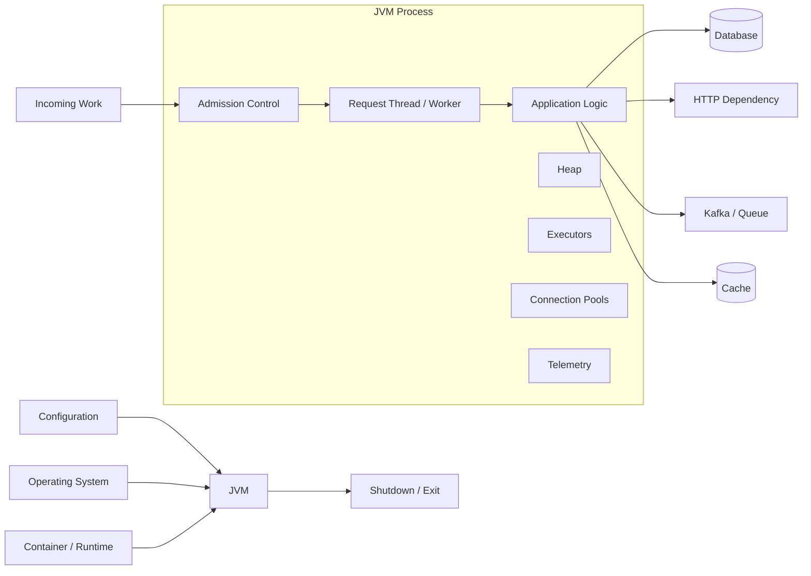
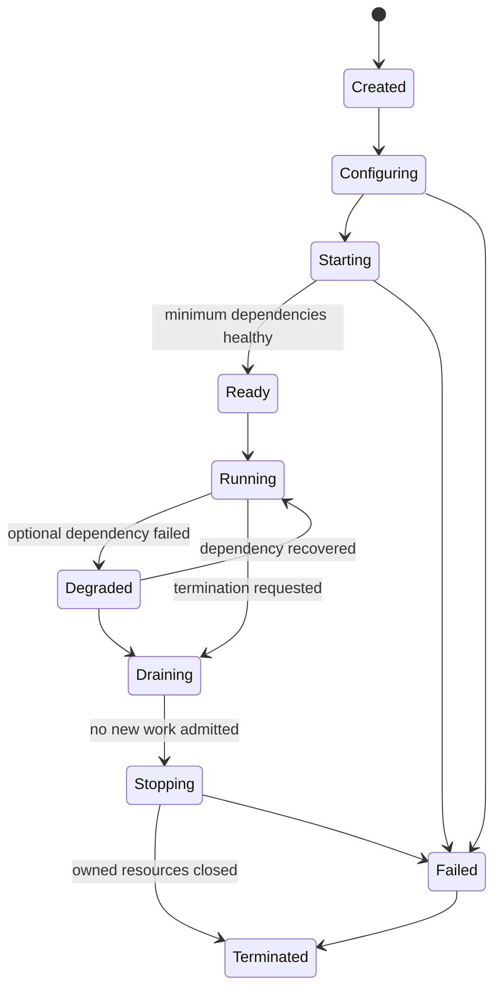
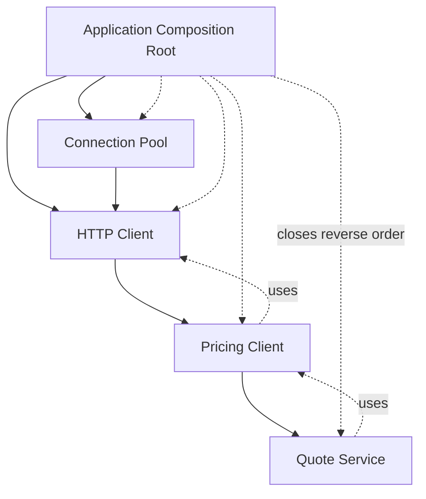

# Part 001 — Java 17+ Mental Model for Long-Running Backend Services

> Fokus part ini bukan menghafal sintaks Java. Fokusnya adalah membentuk model mental tentang **process yang hidup lama, memiliki resource terbatas, menerima pekerjaan concurrent, berinteraksi dengan sistem eksternal, dan harus gagal serta berhenti secara terkendali**.

## Daftar Isi

1. [Target kompetensi](#target-kompetensi)
2. [Model mental utama](#model-mental-utama)
3. [Dari source code ke process production](#dari-source-code-ke-process-production)
4. [Lifecycle service](#lifecycle-service)
5. [State taxonomy](#state-taxonomy)
6. [Object lifecycle dan ownership](#object-lifecycle-dan-ownership)
7. [External resource dan `AutoCloseable`](#external-resource-dan-autocloseable)
8. [Concurrency dan Java Memory Model](#concurrency-dan-java-memory-model)
9. [Executor, queue, dan bounded concurrency](#executor-queue-dan-bounded-concurrency)
10. [Cancellation, interruption, deadline, dan timeout](#cancellation-interruption-deadline-dan-timeout)
11. [Exception dan failure boundary](#exception-dan-failure-boundary)
12. [Java 17 language features untuk backend](#java-17-language-features-untuk-backend)
13. [Memory model operasional JVM](#memory-model-operasional-jvm)
14. [Garbage collection mental model](#garbage-collection-mental-model)
15. [Class loading dan static initialization](#class-loading-dan-static-initialization)
16. [Time, clock, dan determinism](#time-clock-dan-determinism)
17. [Startup, readiness, draining, dan graceful shutdown](#startup-readiness-draining-dan-graceful-shutdown)
18. [Reference service skeleton](#reference-service-skeleton)
19. [Failure-model matrix](#failure-model-matrix)
20. [Debugging playbook](#debugging-playbook)
21. [PR review checklist](#pr-review-checklist)
22. [Trade-off yang harus dipahami senior engineer](#trade-off-yang-harus-dipahami-senior-engineer)
23. [Internal verification checklist](#internal-verification-checklist)
24. [Latihan verifikasi](#latihan-verifikasi)
25. [Ringkasan](#ringkasan)
26. [Referensi resmi](#referensi-resmi)

---

## Target kompetensi

Setelah menyelesaikan part ini, Anda harus mampu:

- melihat service Java sebagai **resource-owning concurrent process**, bukan sekadar kumpulan class;
- membedakan state lokal, request-scoped, process-scoped, external, dan distributed;
- menentukan siapa yang membuat, menggunakan, membagikan, dan menutup suatu resource;
- mengenali race condition, visibility bug, unbounded queue, thread leak, connection leak, dan shutdown leak;
- membedakan exception sebagai sinyal pemrograman, kegagalan dependency, invalid input, cancellation, dan process-fatal condition;
- menggunakan Java 17 features untuk memperjelas invariant dan contract;
- menilai dampak heap, native memory, thread stack, direct buffer, class metadata, dan GC terhadap service;
- mereview kode Java dari sisi lifecycle, concurrency, failure propagation, dan operability.

---

## Model mental utama

Sebuah backend service dapat dimodelkan sebagai:

```text
Service = Process
        + Configuration
        + Dependency Graph
        + Owned Resources
        + Work Admission
        + Concurrency Model
        + State
        + External Interactions
        + Failure Policy
        + Shutdown Policy
        + Telemetry
```

Kesalahan umum adalah memandang service sebagai:

```text
Controller -> Service -> Repository
```

Model tersebut terlalu sempit. Ia tidak menjawab:

- Siapa yang membuat connection pool?
- Berapa banyak request yang dapat diterima bersamaan?
- Apa yang terjadi ketika downstream lambat?
- Apakah executor memiliki queue tak terbatas?
- Siapa yang menghentikan Kafka consumer, scheduler, HTTP client, dan thread pool?
- Apa yang terjadi pada request yang sedang berjalan saat pod dihentikan?
- Apakah retry memperbesar beban ketika dependency sudah gagal?
- Apakah state yang disimpan di field aman diakses concurrent?

### Invariant tingkat service

Untuk service production, beberapa invariant generik adalah:

1. **Tidak menerima traffic sebelum dependency minimum siap.**
2. **Tidak menerima pekerjaan baru setelah proses masuk fase draining.**
3. **Setiap resource yang dibuat memiliki owner dan close path.**
4. **Concurrency harus bounded pada setiap antrean penting.**
5. **Timeout harus ada pada setiap interaksi yang dapat menunggu tanpa batas.**
6. **Cancellation tidak boleh diabaikan secara diam-diam.**
7. **Shared mutable state harus memiliki synchronization policy.**
8. **Kegagalan satu request tidak boleh mengorupsi state request lain.**
9. **Kegagalan satu dependency tidak boleh otomatis menjadi kegagalan cascading.**
10. **Shutdown harus menghasilkan state eksternal yang konsisten atau dapat direkonsiliasi.**

### Diagram boundary utama



---

## Dari source code ke process production

### Layer 1 — Source code

Source code mendefinisikan:

- type dan behavior;
- dependency antar-object;
- synchronization policy;
- error-handling policy;
- lifecycle callback;
- serialization contract;
- resource acquisition dan release.

Source code **tidak otomatis menjamin** bahwa resource akan cukup, shutdown akan benar, atau concurrency aman.

### Layer 2 — Bytecode dan class files

Compiler menghasilkan `.class` bytecode. Compatibility dipengaruhi oleh:

- target Java release;
- library API yang dipakai saat compile;
- classpath/module path saat runtime;
- generated code;
- annotation processing;
- bytecode instrumentation agent.

Build berhasil tidak berarti runtime compatible. Contoh:

- compile menggunakan Java 21 tetapi runtime Java 17;
- API tersedia saat compile, tetapi implementation tidak tersedia saat runtime;
- dua versi library menghasilkan `NoSuchMethodError`;
- class yang sama dimuat oleh classloader berbeda.

### Layer 3 — JVM

JVM bertanggung jawab terhadap:

- class loading dan linking;
- bytecode execution;
- JIT compilation;
- heap management;
- garbage collection;
- thread scheduling integration dengan OS;
- native interfaces;
- runtime diagnostics.

JVM tidak mengetahui business invariant Anda. GC dapat membersihkan object Java yang tidak reachable, tetapi tidak dapat dipercaya untuk menutup transaction, socket, file descriptor, atau lease terdistribusi tepat waktu.

### Layer 4 — Operating system

OS memiliki resource nyata:

- process dan thread;
- CPU scheduling;
- virtual memory;
- socket;
- file descriptor;
- filesystem;
- network interface;
- DNS resolver behavior;
- signal;
- clock.

Java abstraction tetap berakhir pada resource OS. `InputStream`, socket client, file channel, dan database connection memiliki konsekuensi di luar heap.

### Layer 5 — Runtime atau container

Pada service enterprise, process dapat dijalankan oleh:

- standalone Java main process;
- embedded HTTP server;
- Servlet container;
- Jakarta EE application server;
- Docker/container runtime;
- Kubernetes workload.

Detail runtime akan dibahas di part berikutnya. Pada tahap ini, pahami prinsip berikut:

> Selalu tanyakan siapa yang memiliki process lifecycle, thread pool, classloader, request dispatch, dependency graph, dan shutdown hook.

---

## Lifecycle service

Lifecycle ideal bukan hanya `main()` lalu loop selamanya.



### Created

Process atau application object baru dibuat. Belum ada jaminan konfigurasi valid.

### Configuring

- membaca configuration;
- melakukan parsing;
- menerapkan precedence;
- memvalidasi mandatory value;
- membentuk typed configuration.

**Failure policy:** gagal cepat untuk invariant yang wajib. Jangan melanjutkan dengan nilai kosong atau fallback berbahaya.

### Starting

- membuat executor;
- membuat connection pool;
- membangun HTTP clients;
- mendaftarkan resource/provider;
- memulai consumer atau scheduler;
- melakukan warmup minimum;
- memeriksa dependency yang wajib.

### Ready

Service boleh menerima traffic ketika:

- listener aktif;
- routing siap;
- mandatory configuration valid;
- dependency minimum tersedia atau ada degraded mode yang aman;
- migration requirement terpenuhi;
- resource pool dapat digunakan.

**Process hidup tidak sama dengan service siap.**

### Running

Service menerima dan memproses pekerjaan. Pada fase ini harus ada:

- admission control;
- bounded concurrency;
- timeout;
- observability;
- overload behavior;
- failure isolation.

### Draining

- menolak pekerjaan baru atau menghapus readiness;
- menyelesaikan pekerjaan yang sedang berjalan sampai batas waktu;
- menghentikan poll loop atau scheduler agar tidak mengambil pekerjaan baru.

### Stopping

Resource ditutup dengan urutan terbalik dari dependency:

```text
Stop producers of work
-> stop accepting requests
-> drain in-flight work
-> stop consumers/schedulers
-> close clients/pools
-> flush telemetry if required
-> terminate executors
-> exit process
```

### Terminated

Tidak ada non-daemon thread penting yang tertinggal dan process dapat keluar.

---

## State taxonomy

Tidak semua state memiliki risiko yang sama.

| Jenis state | Contoh | Lifetime | Risiko utama |
|---|---|---:|---|
| Local variable | hasil parsing, loop index | satu invocation | rendah; tetap perhatikan object yang direferensikan |
| Immutable object | record konfigurasi | selama direferensikan | stale snapshot jika configuration berubah |
| Request state | authenticated principal, correlation ID | satu request | bocor ke request lain melalui singleton/ThreadLocal |
| Thread-local state | MDC, formatter cache | selama thread hidup | leak karena thread pool memakai ulang thread |
| Object instance state | field pada service/resource | lifetime object | race condition jika object shared |
| Process-local state | in-memory cache, registry | lifetime process | hilang saat restart, tidak konsisten antar-replica |
| External durable state | PostgreSQL row | lintas restart | transaction, locking, schema compatibility |
| External ephemeral state | Redis key dengan TTL | tergantung expiry/failover | stale data, expiry race, split ownership |
| Message-log state | Kafka offset/event | retention period | duplicate, ordering, replay |
| Distributed workflow state | process instance | dapat sangat lama | versioning, compensation, reconciliation |

### Pertanyaan review untuk setiap state

1. Siapa owner-nya?
2. Siapa yang boleh menulis?
3. Siapa yang boleh membaca?
4. Berapa lama state hidup?
5. Apakah state harus bertahan setelah restart?
6. Apakah state harus sama di semua replica?
7. Apa consistency model-nya?
8. Bagaimana state dibersihkan?
9. Apa yang terjadi jika update hanya selesai sebagian?
10. Apakah state mengandung tenant, PII, atau secret?

### Process-local state bukan distributed state

Contoh salah:

```java
public final class QuoteSequence {
    private final AtomicLong sequence = new AtomicLong();

    public long next() {
        return sequence.incrementAndGet();
    }
}
```

Ini thread-safe dalam satu process, tetapi:

- setiap replica memiliki sequence sendiri;
- sequence kembali nol saat restart;
- tidak dapat menjamin uniqueness global;
- failover mengubah urutan;
- autoscaling menambah producer sequence baru.

**Thread-safe bukan berarti distributed-safe.**

---

## Object lifecycle dan ownership

### Ownership rule

Untuk setiap object yang memiliki resource atau background activity, harus jelas:

```text
creator -> owner -> users -> close initiator -> close order
```

Contoh resource-owning objects:

- `ExecutorService`;
- database connection pool;
- HTTP client dengan connection pool;
- Kafka producer/consumer;
- Redis client;
- scheduler;
- file watcher;
- telemetry exporter;
- server listener.

### Dependency graph dan close order

Misalkan:

```text
QuoteService
  -> PricingClient
      -> HttpClient
          -> ConnectionPool
```

Jika `QuoteService` tidak membuat `HttpClient`, ia biasanya **tidak boleh menutupnya**. Owner harus berada pada composition root.



### Constructor injection sebagai ownership signal

```java
public final class QuoteService {
    private final PricingClient pricingClient;
    private final QuoteRepository repository;

    public QuoteService(
            PricingClient pricingClient,
            QuoteRepository repository) {
        this.pricingClient = Objects.requireNonNull(pricingClient);
        this.repository = Objects.requireNonNull(repository);
    }
}
```

Keuntungan:

- dependency wajib terlihat;
- object valid setelah constructor selesai;
- test dapat menyediakan dependency;
- mengurangi hidden global lookup;
- mempermudah reasoning lifecycle.

### Hindari resource creation di business method

Buruk:

```java
public Quote loadQuote(UUID id) {
    var executor = Executors.newFixedThreadPool(8);
    // submit task...
    return ...;
}
```

Masalah:

- thread pool dibuat per call;
- ownership tidak jelas;
- tidak ada shutdown;
- jumlah thread dapat tumbuh tanpa batas;
- telemetry dan naming sulit.

Lebih baik: executor dibuat sekali pada composition root dan diinjeksi melalui abstraction yang jelas.

---

## External resource dan `AutoCloseable`

Garbage collector hanya mengelola reachability object. External resource membutuhkan release deterministik.

### Try-with-resources

```java
public byte[] read(Path path) throws IOException {
    try (InputStream input = Files.newInputStream(path)) {
        return input.readAllBytes();
    }
}
```

`AutoCloseable` memastikan `close()` dipanggil ketika block selesai, termasuk ketika exception terjadi.

### Suppressed exception

Jika body dan `close()` sama-sama gagal, exception dari close menjadi suppressed:

```java
try (var resource = openResource()) {
    doWork(resource);
} catch (Exception ex) {
    for (Throwable suppressed : ex.getSuppressed()) {
        // log only through approved structured logging policy
    }
    throw ex;
}
```

Jangan mengabaikan suppressed exception saat debugging resource corruption atau flush failure.

### Borrowed resource versus owned resource

Database connection dari pool biasanya:

- pool adalah resource berumur panjang;
- `Connection` adalah borrowed handle;
- `Connection.close()` mengembalikan handle ke pool, bukan menutup physical connection secara langsung;
- application shutdown menutup pool.

### Resource scope table

| Resource | Umumnya dibuat | Umumnya ditutup | Catatan |
|---|---|---|---|
| JDBC `Connection` | per transaction/request | setelah unit of work | gunakan try-with-resources atau transaction manager |
| HTTP client | application startup | application shutdown | jangan buat per request |
| Kafka producer | application startup | application shutdown | thread-safe pada client standar; verifikasi wrapper |
| Kafka consumer | consumer worker | worker shutdown | biasanya tidak dibagikan lintas poll thread |
| Executor | application/component startup | component/application shutdown | tentukan bounded queue dan rejection policy |
| Input stream upload | request pipeline | request completion | ownership dapat berada pada runtime; verifikasi contract |
| Temporary file | request/job | success/failure cleanup | siapkan janitor/reconciliation bila process crash |

### Finalizer bukan lifecycle management

Jangan mendesain resource cleanup dengan mengandalkan finalization atau GC timing. External resource harus memiliki explicit close path.

---

## Concurrency dan Java Memory Model

### Tiga kategori bug concurrency

1. **Atomicity** — operasi majemuk disela thread lain.
2. **Visibility** — thread tidak melihat update thread lain.
3. **Ordering** — compiler/JIT/CPU dapat melakukan ordering yang berbeda sepanjang aturan memory model tetap dipenuhi.

### Contoh check-then-act race

```java
if (!cache.containsKey(key)) {
    cache.put(key, load(key));
}
```

Dua thread dapat memanggil `load(key)` bersamaan. Gunakan operasi atomic yang sesuai, tetapi pahami bahwa `computeIfAbsent` juga memiliki constraint: mapping function sebaiknya tidak melakukan blocking panjang atau recursive update pada map yang sama.

### `final` dan safe construction

Gunakan field `final` untuk dependency dan immutable state:

```java
public final class Price {
    private final BigDecimal amount;
    private final Currency currency;

    public Price(BigDecimal amount, Currency currency) {
        this.amount = amount;
        this.currency = currency;
    }
}
```

`final` membantu menjelaskan bahwa reference tidak berubah setelah construction. Namun object yang direferensikan masih dapat mutable.

### Immutable object

Record cocok untuk value carrier sederhana:

```java
public record Money(BigDecimal amount, Currency currency) {
    public Money {
        Objects.requireNonNull(amount);
        Objects.requireNonNull(currency);
        if (amount.scale() > currency.getDefaultFractionDigits()) {
            throw new IllegalArgumentException("Unsupported currency scale");
        }
    }
}
```

Tetap lakukan defensive copy untuk collection mutable:

```java
public record QuoteSnapshot(List<QuoteLine> lines) {
    public QuoteSnapshot {
        lines = List.copyOf(lines);
    }
}
```

### `volatile`

`volatile` berguna untuk visibility dan ordering pada satu variable, bukan atomicity operasi majemuk.

```java
private volatile boolean stopping;
```

Ini dapat menjadi flag sederhana. Namun:

```java
volatile int count;
count++;
```

`count++` tidak atomic.

### Atomics

Gunakan `AtomicInteger`, `AtomicLong`, atau `AtomicReference` ketika invariant dapat dimodelkan sebagai atomic state transition tunggal.

```java
private final AtomicReference<State> state =
        new AtomicReference<>(State.STARTING);

public boolean markReady() {
    return state.compareAndSet(State.STARTING, State.READY);
}
```

Jika invariant melibatkan beberapa field, lock atau immutable aggregate sering lebih jelas.

### Locks

Lock berguna ketika:

- beberapa update harus atomic sebagai satu invariant;
- data structure bukan concurrent;
- operasi harus memiliki mutual exclusion.

PR reviewer harus menanyakan:

- apa yang dilindungi lock?
- apakah semua access mengikuti lock yang sama?
- berapa lama lock dipegang?
- apakah ada network/database call saat lock dipegang?
- apakah lock ordering dapat menyebabkan deadlock?
- apakah interrupt/cancellation dihormati?

### Concurrent collections bukan solusi universal

`ConcurrentHashMap` membuat operasi map tertentu thread-safe. Ia tidak otomatis membuat object value di dalamnya immutable atau membuat multi-map transaction atomic.

### Thread confinement

State yang hanya digunakan satu thread lebih mudah direasoning daripada state yang dibagikan. Contoh:

- Kafka consumer biasanya memiliki single-thread poll ownership;
- mutable parser dapat dibuat per invocation;
- request builder tidak disimpan sebagai singleton.

### Publication

Object yang dibuat satu thread dan digunakan thread lain harus dipublikasikan melalui mekanisme aman, misalnya:

- final field dari object yang dikonstruksi dengan benar;
- synchronized block;
- volatile reference;
- concurrent queue;
- executor task submission;
- static initialization yang benar.

---

## Executor, queue, dan bounded concurrency

### Executor adalah capacity boundary

Executor bukan sekadar cara menjalankan task secara asynchronous. Ia mendefinisikan:

```text
capacity = worker count + queue capacity + rejection policy
```

### Bahaya unbounded queue

```java
Executors.newFixedThreadPool(32);
```

Convenience factory ini menggunakan queue yang secara praktis tidak bounded. Jika producer lebih cepat daripada consumer:

- queue terus bertambah;
- latency meningkat;
- object tertahan di heap;
- GC pressure meningkat;
- process dapat kehabisan memory;
- caller tidak memperoleh sinyal overload.

### Explicit bounded executor

```java
AtomicLong threadNumber = new AtomicLong();
ThreadFactory threadFactory = runnable -> {
    Thread thread = new Thread(runnable);
    thread.setName("pricing-worker-" + threadNumber.incrementAndGet());
    thread.setUncaughtExceptionHandler((t, ex) ->
            System.err.println("Uncaught failure in " + t.getName() + ": " + ex));
    return thread;
};

ThreadPoolExecutor executor = new ThreadPoolExecutor(
        16,
        16,
        0L,
        TimeUnit.MILLISECONDS,
        new ArrayBlockingQueue<>(256),
        threadFactory,
        new ThreadPoolExecutor.AbortPolicy()
);
```

### Rejection policy adalah bagian dari API

Ketika executor penuh, pilihan meliputi:

- reject cepat;
- caller-runs;
- drop task tertentu;
- replace/coalesce task;
- block producer secara bounded;
- persist task ke durable queue.

Jangan memilih `CallerRunsPolicy` tanpa memahami dampaknya. Ia memindahkan pekerjaan ke caller dan dapat menjadi backpressure sederhana, tetapi juga dapat:

- memblokir request thread;
- memperpanjang latency;
- menyebabkan timeout chain;
- menjalankan task pada context yang tidak diharapkan.

### Little’s Law sebagai intuition

Secara kasar:

```text
concurrency ≈ throughput × average latency
```

Jika throughput 200 request/detik dan downstream rata-rata 250 ms:

```text
required in-flight concurrency ≈ 200 × 0.25 = 50
```

Ini bukan rumus sizing final, tetapi membantu menjelaskan mengapa latency downstream meningkatkan kebutuhan concurrency dan queue.

### Unbounded task creation

Buruk:

```java
items.forEach(item -> executor.submit(() -> process(item)));
```

Untuk satu juta item, satu juta task dapat berada di queue. Gunakan chunking, bounded producer, semaphore, stream processing, atau work queue yang benar.

---

## Cancellation, interruption, deadline, dan timeout

### Konsep berbeda

- **Timeout:** batas waktu menunggu satu operasi.
- **Deadline:** waktu absolut ketika keseluruhan pekerjaan harus selesai.
- **Cancellation:** permintaan agar pekerjaan berhenti.
- **Interruption:** mekanisme cooperative cancellation pada Java thread.

### Interruption bersifat cooperative

`Thread.interrupt()` tidak membunuh thread secara paksa. Ia:

- mengatur interrupted status;
- membuat beberapa blocking method melempar `InterruptedException`;
- hanya efektif jika kode memeriksa atau meresponsnya.

### Jangan menelan interruption

Buruk:

```java
try {
    queue.take();
} catch (InterruptedException ex) {
    // ignored
}
```

Lebih baik:

```java
try {
    queue.take();
} catch (InterruptedException ex) {
    Thread.currentThread().interrupt();
    throw new ProcessingCancelledException("Worker interrupted", ex);
}
```

Atau, jika method memang bagian dari worker loop, keluar secara terkendali.

### Deadline propagation

Misalkan request memiliki budget 2 detik:

```text
Gateway budget:       2000 ms
Application overhead:  100 ms
Database budget:       500 ms
Pricing budget:        700 ms
Serialization reserve: 100 ms
Safety margin:         600 ms
```

Jangan memberikan timeout 2 detik pada setiap downstream call secara berurutan. Total latency dapat melampaui budget caller.

### Ambiguous outcome

Timeout tidak selalu berarti operasi gagal. Contoh:

1. Service mengirim `POST /orders`.
2. Downstream berhasil commit order.
3. Response hilang atau terlambat.
4. Caller mengalami timeout.

Retry tanpa idempotency dapat membuat duplicate order. Karena itu timeout, retry, idempotency, dan reconciliation harus didesain bersama.

### Cancellation cleanup

Ketika pekerjaan dibatalkan:

- rollback transaction jika masih aktif;
- jangan publish event dari state yang belum committed;
- release borrowed resources;
- hapus temporary file jika aman;
- jangan menghapus evidence yang dibutuhkan reconciliation;
- rekam telemetry dengan klasifikasi `cancelled`, bukan selalu `failed`.

---

## Exception dan failure boundary

### Exception taxonomy

| Kategori | Contoh | Umumnya ditangani di mana |
|---|---|---|
| Invalid input | format UUID salah | API boundary |
| Validation failure | quantity negatif | validation/domain boundary |
| Business rejection | quote expired | domain/API mapping |
| Not found | quote tidak ada | repository/domain/API mapping |
| Conflict | optimistic version mismatch | transaction/API mapping |
| Dependency unavailable | database down | infrastructure/resilience layer |
| Timeout | downstream deadline exceeded | client/resilience/API boundary |
| Cancellation | request disconnected/shutdown | worker/request lifecycle |
| Programming defect | `NullPointerException` karena invariant rusak | fail request, alert, fix code |
| Process-fatal | corrupted runtime assumption, unrecoverable startup | terminate/restart process |

### Checked versus unchecked bukan taxonomy operasional

`IOException` checked dan `IllegalStateException` unchecked tidak otomatis menentukan apakah error dapat di-retry atau harus dikirim sebagai HTTP 500.

Taxonomy yang lebih berguna:

- siapa yang dapat memperbaiki?
- apakah retry aman?
- apakah outcome sudah committed?
- apakah error bersifat request-local atau process-wide?
- apakah caller perlu detail untuk mengambil keputusan?
- apakah error mengandung data sensitif?

### Jangan menangkap `Exception` terlalu awal

Buruk:

```java
try {
    return repository.save(quote);
} catch (Exception ex) {
    return null;
}
```

Ini:

- menghilangkan failure type;
- membuat caller tidak dapat membedakan not-found, conflict, atau outage;
- mengubah error menjadi `NullPointerException` di tempat lain;
- merusak observability.

### Wrap dengan context, jangan duplikasi noise

```java
try {
    return pricingClient.calculate(request);
} catch (PricingTimeoutException ex) {
    throw new QuotePricingUnavailableException(
            "Pricing timed out for quote " + request.quoteId(),
            ex
    );
}
```

Jangan memasukkan PII, token, atau full payload ke exception message.

### Error logging ownership

Jika setiap layer mencatat exception yang sama, satu failure menghasilkan banyak log identik. Tentukan layer yang:

- menambahkan context;
- memutuskan severity;
- melakukan final logging;
- memetakan response;
- meningkatkan metric.

---

## Java 17 language features untuk backend

### Records

Gunakan untuk value carrier dengan identity berbasis state, terutama:

- request/response DTO;
- typed configuration;
- domain value object sederhana;
- command/query object;
- immutable event metadata.

```java
public record CreateQuoteCommand(
        UUID customerId,
        List<CreateQuoteLine> lines,
        Instant requestedAt
) {
    public CreateQuoteCommand {
        Objects.requireNonNull(customerId);
        lines = List.copyOf(lines);
        Objects.requireNonNull(requestedAt);
        if (lines.isEmpty()) {
            throw new IllegalArgumentException("Quote must contain at least one line");
        }
    }
}
```

**Trade-off:** record tidak otomatis menjadikan nested object immutable.

### Sealed classes dan interfaces

Gunakan ketika closed hierarchy adalah bagian dari invariant:

```java
public sealed interface PricingResult
        permits PriceCalculated, PriceRejected, PricingUnavailable {
}

public record PriceCalculated(Money total) implements PricingResult {}
public record PriceRejected(String code) implements PricingResult {}
public record PricingUnavailable(String dependency) implements PricingResult {}
```

Keuntungan:

- state space eksplisit;
- exhaustive reasoning lebih mudah;
- mencegah implementation tak dikenal masuk diam-diam.

Jangan gunakan sealed hierarchy jika plugin eksternal memang harus dapat menambah implementation.

### Pattern matching untuk `instanceof`

```java
if (result instanceof PriceRejected rejected) {
    return handleRejection(rejected.code());
}
```

Mengurangi cast noise, tetapi bukan pengganti polymorphism ketika behavior memang milik subtype.

### Switch expressions

```java
String message = switch (status) {
    case DRAFT -> "Quote is editable";
    case SUBMITTED -> "Quote is awaiting approval";
    case ACCEPTED -> "Quote is accepted";
    case EXPIRED -> "Quote has expired";
};
```

Gunakan exhaustive switch untuk closed state. Hindari `default` bila tujuannya agar compiler memaksa handling state baru.

### Text blocks

Berguna untuk:

- SQL test fixture;
- JSON/XML test payload;
- template kecil;
- documentation example.

```java
String json = """
        {
          "quoteId": "q-123",
          "status": "DRAFT"
        }
        """;
```

Jangan menjadikan text block sebagai alasan menyimpan query kompleks tanpa abstraction atau validation.

### `var`

Gunakan ketika type tetap jelas dari right-hand side:

```java
var quote = repository.findById(id);
```

Hindari jika type penting untuk memahami contract:

```java
var result = execute(); // result apa?
```

### `Optional`

Cocok sebagai return type untuk absence yang normal:

```java
Optional<Quote> findById(UUID id);
```

Hindari sebagai:

- field entity/DTO tanpa alasan kuat;
- method parameter;
- pengganti error taxonomy;
- container yang langsung di-`get()`.

### Defensive null policy

Pilih convention yang jelas:

- null dilarang secara default;
- validate di boundary;
- gunakan type/value object untuk state penting;
- jangan menyebarkan nullable state tanpa annotation atau contract.

---

## Memory model operasional JVM

### Heap

Menyimpan object Java yang reachable. Risiko:

- allocation rate tinggi;
- object retention;
- unbounded collections/queues;
- cache tanpa eviction;
- payload besar;
- duplicate representation;
- leak karena listener/static map.

### Thread stack

Setiap platform thread membutuhkan stack. Banyak thread dapat menghabiskan memory meskipun heap masih tersedia.

Risiko:

- thread pool terlalu besar;
- thread leak;
- recursive call menyebabkan `StackOverflowError`;
- stack size terlalu besar memperkecil jumlah thread yang dapat dibuat.

### Metaspace

Menyimpan class metadata. Growth dapat berasal dari:

- banyak class/generated proxy;
- repeated classloader creation;
- hot redeployment leak;
- dynamic code generation;
- instrumentation.

### Direct/native buffers

Library networking, NIO, compression, database driver, atau serialization dapat menggunakan native/direct memory di luar Java heap.

### Native memory lain

- JVM code cache;
- GC structures;
- thread structures;
- JNI allocations;
- mapped files;
- TLS/native libraries.

### RSS lebih besar daripada heap

Jangan menyimpulkan memory leak hanya dari heap, dan jangan menyimpulkan memory aman hanya karena heap rendah.

```text
Process memory ≈ heap
               + metaspace
               + thread stacks
               + direct buffers
               + code cache
               + GC/native structures
               + native libraries
               + memory-mapped regions
```

### `OutOfMemoryError` bukan satu jenis failure

Kemungkinan message meliputi:

- Java heap space;
- Metaspace;
- unable to create native thread;
- direct buffer memory;
- GC overhead limit exceeded.

Diagnosis harus membaca pesan dan evidence, bukan hanya label OOM.

---

## Garbage collection mental model

### Apa yang GC lakukan

GC mereklamasi memory object yang tidak lagi reachable menurut object graph JVM.

### Apa yang GC tidak lakukan

GC tidak menjamin:

- response latency tertentu;
- external resource ditutup tepat waktu;
- cache tidak tumbuh;
- queue tidak overload;
- process memory berada di bawah container limit;
- object besar tidak menyebabkan pressure;
- kode bebas leak.

### Throughput versus latency

Collector memiliki trade-off:

- throughput;
- pause time;
- CPU overhead;
- memory overhead;
- workload suitability.

Java 17 menyediakan beberapa collector termasuk Serial, Parallel, G1, dan ZGC. Pilihan collector harus berdasarkan workload dan evidence, bukan preferensi umum.

### Allocation rate dan retention

Dua aplikasi dengan live heap sama dapat memiliki behavior berbeda:

- aplikasi A membuat sedikit object berumur panjang;
- aplikasi B membuat jutaan object sementara per detik.

Aplikasi B dapat memiliki GC CPU lebih tinggi meskipun live set sama.

### GC tuning order

Urutan reasoning yang lebih aman:

1. pastikan tidak ada unbounded growth;
2. ukur allocation rate dan live set;
3. periksa object retention;
4. periksa pause, CPU, dan throughput;
5. periksa container/host memory;
6. baru evaluasi collector dan flags.

Jangan memulai dengan menambahkan heap tanpa memahami penyebab retention.

---

## Class loading dan static initialization

### Class lifecycle singkat

```text
Load -> Link -> Initialize -> Use -> Unload with classloader
```

Static initializer berjalan ketika class diinisialisasi, bukan semata-mata saat file tersedia.

### Bahaya static initialization

```java
public final class GlobalClient {
    static final RemoteClient CLIENT = createClientFromEnvironment();
}
```

Masalah:

- initialization tersembunyi;
- configuration dibaca terlalu awal;
- sulit dites;
- failure muncul sebagai `ExceptionInInitializerError`;
- close ownership tidak jelas;
- class loading order memengaruhi behavior.

### Static mutable state

```java
private static final Map<String, Object> CACHE = new HashMap<>();
```

Risiko:

- race condition;
- cross-test contamination;
- cross-tenant leakage;
- lifecycle mengikuti classloader, bukan request;
- sulit dikonfigurasi dan diobservasi.

### Classpath failure patterns

| Error | Makna umum |
|---|---|
| `ClassNotFoundException` | loader diminta memuat class tetapi tidak menemukannya |
| `NoClassDefFoundError` | class pernah diharapkan tersedia tetapi definition tidak dapat digunakan/ditemukan |
| `NoSuchMethodError` | compile dan runtime library tidak kompatibel |
| `NoSuchFieldError` | binary incompatibility pada field |
| `ClassCastException` dengan nama class sama | dapat terjadi karena classloader berbeda |
| `ServiceConfigurationError` | `ServiceLoader` metadata/provider invalid |
| `ExceptionInInitializerError` | static initialization gagal |

### Dependency hygiene

- lock versi melalui dependency management;
- hindari duplicate implementation;
- periksa transitive dependencies;
- gunakan dependency tree;
- jangan menambahkan jar hanya untuk “menghilangkan error” tanpa memahami owner API-nya.

---

## Time, clock, dan determinism

Time adalah dependency.

Buruk:

```java
public boolean isExpired(Quote quote) {
    return quote.expiresAt().isBefore(Instant.now());
}
```

Lebih testable:

```java
public final class QuoteExpiryPolicy {
    private final Clock clock;

    public QuoteExpiryPolicy(Clock clock) {
        this.clock = Objects.requireNonNull(clock);
    }

    public boolean isExpired(Quote quote) {
        return !quote.expiresAt().isAfter(clock.instant());
    }
}
```

Test:

```java
Clock fixedClock = Clock.fixed(
        Instant.parse("2026-01-01T00:00:00Z"),
        ZoneOffset.UTC
);
```

### Monotonic versus wall clock

- `Instant.now()`/wall clock untuk timestamp domain dan audit;
- `System.nanoTime()` untuk mengukur elapsed duration;
- jangan menghitung timeout dari perubahan wall clock karena clock dapat dikoreksi.

### Temporal consistency

Dalam satu operation, pertimbangkan mengambil “now” sekali:

```java
Instant now = clock.instant();
validateEffectiveWindow(request, now);
createAuditEntry(now);
```

Ini menghindari boundary berubah di tengah operation.

---

## Startup, readiness, draining, dan graceful shutdown

### Startup ordering

Contoh dependency graph:

```text
Configuration
  -> Telemetry
  -> Connection pools / clients
  -> Repositories
  -> Application services
  -> HTTP resources
  -> Server listener
  -> Background consumers
```

Tidak semua sistem membutuhkan urutan persis ini, tetapi startup harus deterministik.

### Readiness

Readiness menjawab:

> Apakah instance ini saat ini boleh menerima pekerjaan baru?

Jangan mengikat readiness pada semua dependency opsional. Jika satu reporting dependency down tetapi quote creation tetap aman, service mungkin dapat berjalan degraded.

### Liveness

Liveness menjawab:

> Apakah process masih mampu membuat progress, atau perlu direstart?

Jangan membuat liveness gagal hanya karena database mengalami gangguan singkat. Restart massal dapat memperburuk outage.

### Graceful shutdown implementation

```java
public final class ApplicationRuntime implements AutoCloseable {
    private final AtomicBoolean acceptingWork = new AtomicBoolean(true);
    private final ExecutorService workerPool;
    private final AutoCloseable server;
    private final AutoCloseable connectionPool;

    public ApplicationRuntime(
            ExecutorService workerPool,
            AutoCloseable server,
            AutoCloseable connectionPool) {
        this.workerPool = workerPool;
        this.server = server;
        this.connectionPool = connectionPool;
    }

    public boolean isAcceptingWork() {
        return acceptingWork.get();
    }

    @Override
    public void close() throws Exception {
        acceptingWork.set(false);

        Exception failure = null;

        try {
            server.close();
        } catch (Exception ex) {
            failure = ex;
        }

        workerPool.shutdown();
        try {
            if (!workerPool.awaitTermination(20, TimeUnit.SECONDS)) {
                workerPool.shutdownNow();
                if (!workerPool.awaitTermination(5, TimeUnit.SECONDS)) {
                    System.err.println("Worker pool did not terminate");
                }
            }
        } catch (InterruptedException ex) {
            workerPool.shutdownNow();
            Thread.currentThread().interrupt();
            if (failure == null) {
                failure = ex;
            } else {
                failure.addSuppressed(ex);
            }
        }

        try {
            connectionPool.close();
        } catch (Exception ex) {
            if (failure == null) {
                failure = ex;
            } else {
                failure.addSuppressed(ex);
            }
        }

        if (failure != null) {
            throw failure;
        }
    }
}
```

Ini hanya contoh konsep. Pada runtime container-managed, container mungkin menjadi owner sebagian resource. Jangan menutup resource yang dimiliki container.

### Shutdown deadline

Graceful shutdown tetap harus bounded. Jika total platform termination grace 30 detik, application tidak dapat mengalokasikan 60 detik untuk setiap subsystem.

### Shutdown race

Perhatikan race berikut:

1. readiness masih true;
2. termination dimulai;
3. request baru diterima;
4. connection pool sudah ditutup;
5. request gagal secara tidak terkendali.

Urutan shutdown harus mengurangi work admission sebelum dependency ditutup.

---

## Reference service skeleton

Contoh ini menunjukkan composition root tanpa framework DI. Tujuannya agar lifecycle terlihat.

```java
public final class Main {
    public static void main(String[] args) {
        int exitCode = 0;

        try {
            AppConfig config = AppConfig.load(System.getenv());
            config.validate();

            try (Application application = Application.start(config)) {
                Runtime.getRuntime().addShutdownHook(
                        new Thread(application::requestShutdown, "shutdown-hook")
                );
                application.awaitTermination();
            }
        } catch (ConfigurationException ex) {
            System.err.println("Invalid configuration: " + ex.getMessage());
            exitCode = 2;
        } catch (Throwable fatal) {
            fatal.printStackTrace(System.err);
            exitCode = 1;
        }

        System.exit(exitCode);
    }
}
```

```java
public final class Application implements AutoCloseable {
    private final CountDownLatch terminated = new CountDownLatch(1);
    private final AtomicBoolean closing = new AtomicBoolean();
    private final ExecutorService executor;
    private final DatabasePool databasePool;
    private final HttpServer server;

    private Application(
            ExecutorService executor,
            DatabasePool databasePool,
            HttpServer server) {
        this.executor = executor;
        this.databasePool = databasePool;
        this.server = server;
    }

    public static Application start(AppConfig config) {
        ExecutorService executor = createExecutor(config);
        DatabasePool databasePool = DatabasePool.open(config.database());

        try {
            QuoteRepository repository = new JdbcQuoteRepository(databasePool);
            QuoteService quoteService = new QuoteService(repository, Clock.systemUTC());
            HttpServer server = HttpServer.start(config.http(), quoteService);
            return new Application(executor, databasePool, server);
        } catch (RuntimeException ex) {
            databasePool.close();
            executor.shutdownNow();
            throw ex;
        }
    }

    public void requestShutdown() {
        if (closing.compareAndSet(false, true)) {
            try {
                close();
            } catch (Exception ex) {
                ex.printStackTrace(System.err);
            } finally {
                terminated.countDown();
            }
        }
    }

    public void awaitTermination() throws InterruptedException {
        try {
            terminated.await();
        } catch (InterruptedException ex) {
            requestShutdown();
            Thread.currentThread().interrupt();
            throw ex;
        }
    }

    @Override
    public void close() throws Exception {
        server.close();
        executor.shutdown();
        databasePool.close();
    }
}
```

### Hal yang harus dikritik dari skeleton

- Apakah `close()` idempotent?
- Apakah server benar-benar berhenti menerima request sebelum pool ditutup?
- Apakah in-flight request didrain?
- Apakah `databasePool.close()` boleh dipanggil jika startup parsial?
- Apakah shutdown hook memblokir terlalu lama?
- Siapa owner executor?
- Apakah background workers sudah dihentikan?
- Apakah telemetry di-flush?
- Bagaimana exit code dikonsumsi platform?

Tujuan skeleton bukan menjadi template final, tetapi melatih lifecycle reasoning.

---

## Failure-model matrix

| Failure | Gejala | Evidence utama | Risiko | Respons desain |
|---|---|---|---|---|
| Unbounded queue | latency dan heap meningkat | queue depth, heap histogram | OOM, timeout cascade | bounded queue, rejection/load shedding |
| Thread leak | thread count terus naik | thread dump, thread metrics | native OOM, context switching | lifecycle ownership, executor reuse |
| Lost interrupt | shutdown lambat/hang | thread dump, code inspection | pod force-killed, partial work | restore interrupt atau exit loop |
| Connection leak | pool exhausted | pool metrics, stack traces | request stall | try-with-resources, leak detection |
| Static-state race | inconsistent output | concurrency test, logs | cross-request corruption | immutable state, synchronization |
| Static init failure | startup crash | `ExceptionInInitializerError` | unavailable instance | move initialization to explicit startup |
| Classpath mismatch | `NoSuchMethodError` | dependency tree, runtime jars | startup/runtime failure | dependency governance |
| Heap leak | old-gen/live set naik | heap dump, GC logs | OOM | ownership, eviction, listener cleanup |
| Native-memory growth | RSS naik, heap stabil | NMT, OS metrics | OOMKilled | inspect direct buffers, threads, native libs |
| Slow dependency | worker saturation | traces, pool/queue metrics | cascading failure | timeout, bulkhead, load shedding |
| Shutdown race | request gagal saat deploy | deployment timeline, logs | partial operations | drain before closing dependencies |
| Clock misuse | expiry/price wrong | timestamps, timezone data | business correctness | UTC, `Clock`, explicit effective windows |

---

## Debugging playbook

### 1. Tentukan failure scope

- satu request;
- satu tenant;
- satu instance;
- semua replica;
- satu dependency;
- satu region/environment;
- hanya setelah deployment;
- hanya saat load tinggi.

### 2. Susun timeline

Gunakan timestamp yang konsisten:

```text
T0 deployment/startup
T1 readiness true
T2 first error
T3 queue/thread/pool saturation
T4 dependency degradation
T5 restart/rollback
```

### 3. Ambil evidence sebelum restart bila aman

- thread dump;
- heap histogram atau heap dump sesuai policy;
- GC logs;
- process RSS dan memory breakdown;
- executor queue depth;
- connection pool stats;
- request rate dan latency;
- error samples;
- dependency timing;
- build/runtime version;
- configuration fingerprint tanpa secret.

### 4. Thread dump questions

- banyak thread `BLOCKED` pada lock yang sama?
- banyak thread `WAITING` pada queue kosong?
- request threads menunggu downstream yang sama?
- scheduler task tidak pernah selesai?
- deadlock terdeteksi?
- non-daemon thread mencegah exit?
- thread name cukup informatif?

### 5. Heap questions

- object type apa yang mendominasi?
- siapa retention path-nya?
- queue/list/map mana yang terus tumbuh?
- apakah cache memiliki bound?
- apakah payload diduplikasi?
- apakah listener/reference tidak dilepas?

### 6. Classpath questions

```bash
mvn dependency:tree
mvn dependency:tree -Dverbose
jar tf application.jar
java -version
```

Verifikasi runtime artifact, bukan hanya local build.

### 7. Reproduce dengan invariant kecil

Alih-alih mereplikasi seluruh production:

- reproduksi concurrent update pada satu component;
- buat executor queue kecil;
- paksa downstream delay;
- trigger interruption;
- jalankan startup dengan missing configuration;
- panggil close dua kali;
- jalankan test dengan fixed clock.

---

## PR review checklist

### Lifecycle dan ownership

- [ ] Apakah setiap resource memiliki creator dan owner yang jelas?
- [ ] Apakah close path tersedia pada success, failure, cancellation, dan partial startup?
- [ ] Apakah close order merupakan kebalikan dari dependency order?
- [ ] Apakah resource application-scoped dibuat ulang per request?
- [ ] Apakah kode menutup resource yang sebenarnya dimiliki container/framework?

### State

- [ ] Apakah field mutable diakses oleh lebih dari satu thread?
- [ ] Apakah process-local state keliru dianggap global/distributed?
- [ ] Apakah collection disalin defensif?
- [ ] Apakah static mutable state benar-benar diperlukan?
- [ ] Apakah tenant/request state dapat bocor ke request lain?

### Concurrency

- [ ] Apakah executor dan queue bounded?
- [ ] Apakah rejection policy eksplisit?
- [ ] Apakah blocking I/O terjadi pada pool yang tepat?
- [ ] Apakah lock scope minimal?
- [ ] Apakah network/database call terjadi saat lock dipegang?
- [ ] Apakah interruption dan cancellation dipertahankan?

### Error handling

- [ ] Apakah exception dipetakan berdasarkan semantics, bukan checked/unchecked semata?
- [ ] Apakah catch block menelan error?
- [ ] Apakah retry aman terhadap ambiguous outcome?
- [ ] Apakah message/log mengandung PII atau secret?
- [ ] Apakah exception yang sama dilog berulang di banyak layer?

### Time dan determinism

- [ ] Apakah `Clock` dapat diinjeksi untuk logic temporal?
- [ ] Apakah elapsed time memakai monotonic clock?
- [ ] Apakah timezone/UTC policy eksplisit?
- [ ] Apakah boundary expiry dan effective date diuji?

### Operability

- [ ] Apakah thread/resource diberi nama yang dapat didiagnosis?
- [ ] Apakah queue/pool memiliki metric?
- [ ] Apakah startup failure memberikan pesan yang actionable?
- [ ] Apakah shutdown bounded?
- [ ] Apakah perubahan menambah memory/concurrency footprint?

---

## Trade-off yang harus dipahami senior engineer

### Immutability versus allocation

Immutability menyederhanakan concurrency dan reasoning, tetapi dapat menambah object allocation atau copy. Optimalkan hanya setelah ada evidence bahwa allocation menjadi bottleneck.

### Shared pool versus isolated pool

Shared pool:

- resource-efficient;
- lebih mudah dikelola;
- tetapi satu workload dapat memonopoli pool.

Isolated pool:

- bulkhead lebih baik;
- sizing lebih eksplisit;
- tetapi menambah thread, memory, dan complexity.

### Fail fast versus degraded mode

Fail fast tepat jika invariant wajib tidak terpenuhi. Degraded mode tepat jika feature opsional dapat dinonaktifkan secara aman. Degraded mode tanpa explicit contract sering menghasilkan silent corruption.

### Exception richness versus abstraction leakage

Preserve enough context untuk diagnosis dan policy, tetapi jangan membuat API layer bergantung langsung pada exception vendor database/HTTP client.

### Local cache versus consistency

Local cache cepat dan sederhana, tetapi:

- berbeda antar-replica;
- hilang saat restart;
- invalidation sulit;
- tenant isolation harus eksplisit.

### Synchronous simplicity versus asynchronous complexity

Async tidak otomatis lebih cepat. Ia bermanfaat untuk concurrency tertentu, tetapi menambah:

- context propagation;
- cancellation complexity;
- error aggregation;
- executor ownership;
- debugging difficulty.

---

## Internal verification checklist

> Jangan mengasumsikan poin berikut. Verifikasi melalui repository, build files, deployment configuration, observability, PR lama, onboarding, atau diskusi dengan team.

### Java dan build baseline

- [ ] Java source/target/release version.
- [ ] JDK vendor untuk local, CI, dan production.
- [ ] Maven Toolchains atau build-image JDK.
- [ ] Apakah runtime Java sama dengan compile Java.
- [ ] Preview features digunakan atau dilarang.
- [ ] Annotation processors dan generated code.

### JVM runtime

- [ ] GC yang digunakan.
- [ ] Heap sizing flags.
- [ ] Native-memory diagnostics policy.
- [ ] Heap dump dan error-file path.
- [ ] GC log configuration.
- [ ] JVM agents untuk telemetry/security.

### Concurrency

- [ ] Daftar executor dan owner-nya.
- [ ] Thread count, queue capacity, dan rejection policy.
- [ ] Shared/common pool usage.
- [ ] Scheduler inventory.
- [ ] Blocking versus non-blocking execution policy.
- [ ] Context propagation wrapper.

### Resource lifecycle

- [ ] HTTP clients dan connection pools.
- [ ] JDBC pools.
- [ ] Kafka/RabbitMQ/Redis clients.
- [ ] Background threads.
- [ ] Startup order.
- [ ] Shutdown order dan timeout.
- [ ] Partial-startup cleanup.

### State dan correctness

- [ ] Static mutable state.
- [ ] In-memory caches.
- [ ] Singleton mutable components.
- [ ] Request/tenant state propagation.
- [ ] `ThreadLocal` usage.
- [ ] Clock/timezone convention.

### Engineering standards

- [ ] Java coding standard.
- [ ] Nullability convention.
- [ ] Exception taxonomy.
- [ ] Logging/redaction rules.
- [ ] Static-analysis tools.
- [ ] Concurrency testing approach.
- [ ] Production debugging access dan restrictions.

---

## Latihan verifikasi

### Latihan 1 — Resource inventory

Pilih satu service. Buat tabel:

| Resource | Dibuat oleh | Digunakan oleh | Scope | Ditutup oleh | Shutdown timeout |
|---|---|---|---|---|---|
| JDBC pool | ? | ? | application | ? | ? |
| HTTP client | ? | ? | application | ? | ? |
| Executor | ? | ? | component/application | ? | ? |

Setiap tanda tanya adalah knowledge gap yang harus ditutup.

### Latihan 2 — State inventory

Cari semua:

- `static` mutable field;
- `ThreadLocal`;
- `ExecutorService` creation;
- `new Thread`;
- `ScheduledExecutorService`;
- cache/map singleton;
- shutdown hook;
- classes implementing `AutoCloseable`.

Klasifikasikan ownership dan failure mode.

### Latihan 3 — Interruption test

Buat test worker yang diblokir pada queue, interrupt thread, lalu pastikan:

- worker keluar;
- interrupted status ditangani dengan benar;
- resource dibersihkan;
- test tidak meninggalkan thread.

### Latihan 4 — Partial startup

Paksa dependency ketiga gagal saat startup. Pastikan dua dependency pertama yang sudah dibuat ditutup.

### Latihan 5 — Overload

Gunakan queue kecil dan task lambat. Verifikasi behavior saat queue penuh:

- reject;
- block;
- caller-runs;
- metric dan log yang dihasilkan.

---

## Ringkasan

Model mental inti Part 001:

```text
Java backend service
  bukan hanya object graph,
  tetapi process yang:
    memiliki lifecycle,
    memiliki resource terbatas,
    menerima kerja concurrent,
    memegang dan memindahkan state,
    berinteraksi dengan dependency,
    harus mengontrol overload,
    harus mempertahankan cancellation,
    harus menghasilkan evidence,
    dan harus berhenti secara deterministik.
```

Sebelum masuk ke JAX-RS, Anda harus selalu mampu menjawab:

1. Siapa owner resource?
2. Berapa concurrency maksimum?
3. Apa queue dan rejection policy?
4. Apa timeout dan cancellation policy?
5. State berada di mana dan consistency-nya apa?
6. Bagaimana failure dipropagasikan?
7. Bagaimana service startup, ready, drain, dan shutdown?
8. Evidence apa yang tersedia saat asumsi gagal?

---

## Referensi resmi

- [Oracle Java SE 17 — Java Language Changes](https://docs.oracle.com/en/java/javase/17/language/java-language-changes.html)
- [Oracle Java SE 17 — Record Classes](https://docs.oracle.com/en/java/javase/17/language/records.html)
- [Oracle Java SE 17 — Sealed Classes and Interfaces](https://docs.oracle.com/en/java/javase/17/language/sealed-classes-and-interfaces.html)
- [Oracle Java SE 17 API — AutoCloseable](https://docs.oracle.com/en/java/javase/17/docs/api/java.base/java/lang/AutoCloseable.html)
- [Oracle Java SE 17 API — Thread](https://docs.oracle.com/en/java/javase/17/docs/api/java.base/java/lang/Thread.html)
- [Oracle Java SE 17 API — InterruptedException](https://docs.oracle.com/en/java/javase/17/docs/api/java.base/java/lang/InterruptedException.html)
- [Oracle Java SE 17 — Garbage Collection Tuning Guide](https://docs.oracle.com/en/java/javase/17/gctuning/)
- [Oracle Java SE 17 — Available Collectors](https://docs.oracle.com/en/java/javase/17/gctuning/available-collectors.html)

