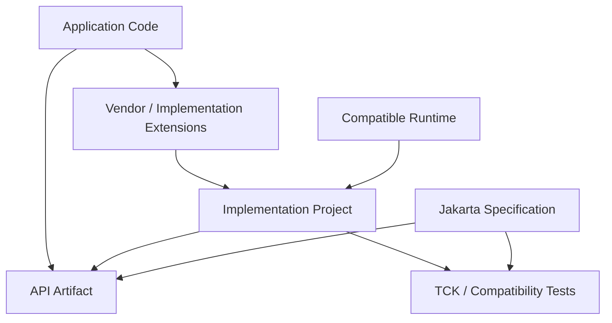
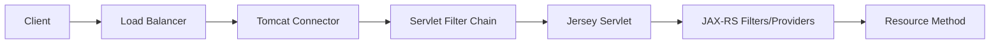
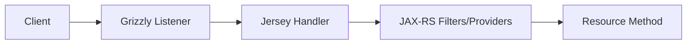
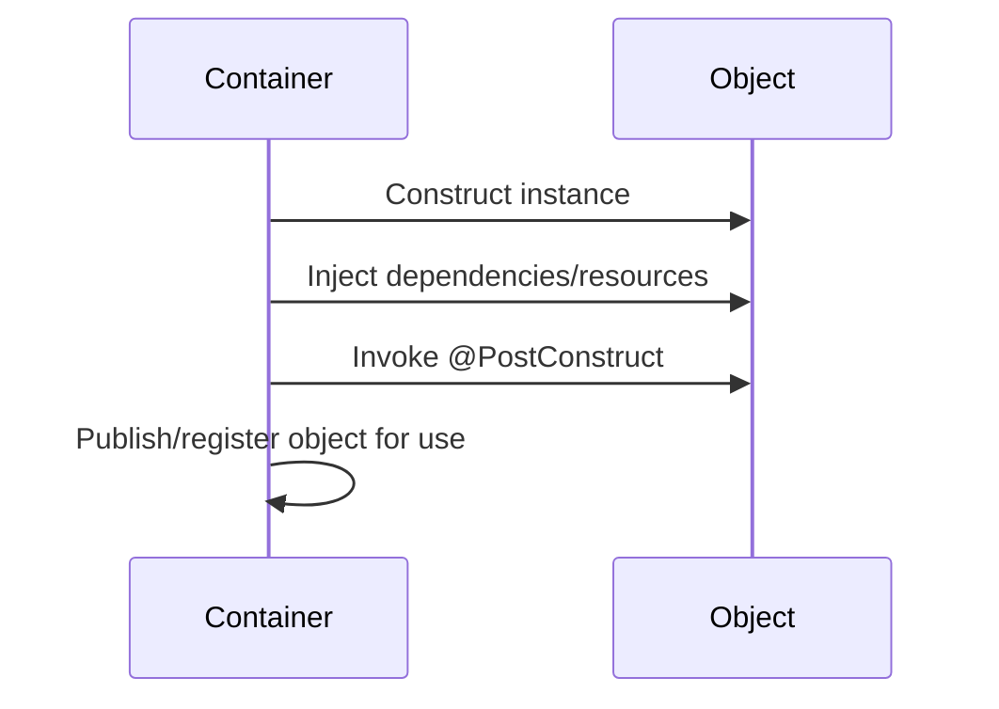
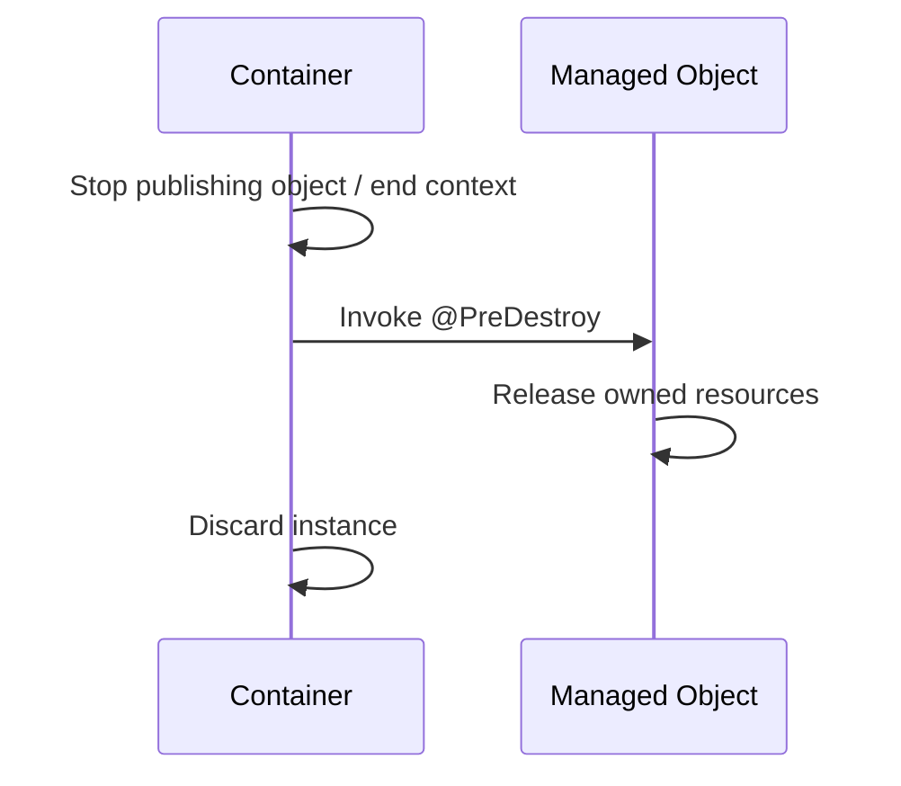

# Part 002 — Java SE, Jakarta Platform, Namespace, and Jakarta Annotation

> Part ini membangun vocabulary yang wajib dimiliki sebelum membaca codebase Jakarta/JAX-RS. Banyak kesalahan diagnosis terjadi karena istilah **API, specification, implementation, container, runtime, application server, dan library** diperlakukan seolah-olah sama.

## Daftar Isi

1. [Target kompetensi](#target-kompetensi)
2. [Model mental: contract versus mechanism](#model-mental-contract-versus-mechanism)
3. [Java SE versus Jakarta EE](#java-se-versus-jakarta-ee)
4. [Specification, API, implementation, TCK, dan compatible runtime](#specification-api-implementation-tck-dan-compatible-runtime)
5. [Platform, profile, dan individual specification](#platform-profile-dan-individual-specification)
6. [Jakarta REST bukan server HTTP](#jakarta-rest-bukan-server-http)
7. [Runtime taxonomy](#runtime-taxonomy)
8. [Namespace migration dari `javax.*` ke `jakarta.*`](#namespace-migration-dari-javaxx-ke-jakartax)
9. [Version compatibility reasoning](#version-compatibility-reasoning)
10. [Maven dependency model untuk Jakarta](#maven-dependency-model-untuk-jakarta)
11. [Annotation sebagai declarative metadata](#annotation-sebagai-declarative-metadata)
12. [Jakarta Annotations overview](#jakarta-annotations-overview)
13. [`@PostConstruct` dan initialization lifecycle](#postconstruct-dan-initialization-lifecycle)
14. [`@PreDestroy` dan cleanup lifecycle](#predestroy-dan-cleanup-lifecycle)
15. [`@Priority` dan ordering contract](#priority-dan-ordering-contract)
16. [`@Resource` dan container-managed resource](#resource-dan-container-managed-resource)
17. [Nullability, generated code, security, dan datasource annotations](#nullability-generated-code-security-dan-datasource-annotations)
18. [Container-managed versus application-managed objects](#container-managed-versus-application-managed-objects)
19. [Portable versus implementation-specific code](#portable-versus-implementation-specific-code)
20. [Annotation discovery dan reflection](#annotation-discovery-dan-reflection)
21. [Migration playbook `javax` ke `jakarta`](#migration-playbook-javax-ke-jakarta)
22. [Failure-model matrix](#failure-model-matrix)
23. [Debugging playbook](#debugging-playbook)
24. [PR review checklist](#pr-review-checklist)
25. [Trade-off yang harus dipahami senior engineer](#trade-off-yang-harus-dipahami-senior-engineer)
26. [Internal verification checklist](#internal-verification-checklist)
27. [Latihan verifikasi](#latihan-verifikasi)
28. [Ringkasan](#ringkasan)
29. [Referensi resmi](#referensi-resmi)

---

## Target kompetensi

Setelah menyelesaikan part ini, Anda harus mampu:

- membedakan Java SE, Jakarta EE Platform, Jakarta EE profiles, dan individual Jakarta specifications;
- menjelaskan perbedaan specification document, API artifact, implementation, runtime, container, dan application server;
- menentukan apakah sebuah import berasal dari Java SE, Jakarta standard, Jersey, HK2, CDI, Servlet, atau library eksternal;
- mengenali bahwa annotation hanya memiliki efek jika ada runtime/specification yang mendefinisikan dan memprosesnya;
- menggunakan lifecycle annotations secara aman tanpa mengaburkan resource ownership;
- menilai compatibility berdasarkan **seluruh stack version**, bukan satu dependency saja;
- merencanakan migration `javax.*` ke `jakarta.*` sebagai ecosystem migration, bukan sekadar search-and-replace;
- menyusun internal verification checklist sebelum menyimpulkan runtime CSG Quote & Order.

---

## Model mental: contract versus mechanism

Gunakan pemisahan berikut:

```text
Specification = contract tertulis
API           = Java types yang mengekspos contract
Implementation= kode yang menjalankan contract
Runtime       = environment yang merakit implementation dan lifecycle
Application   = kode bisnis yang memakai API/extension
```

Contoh konseptual:

```text
Jakarta REST specification
  -> jakarta.ws.rs API
      -> Jersey implementation
          -> Grizzly / Servlet / application server runtime
              -> application resource classes
```

Namun kombinasi lain mungkin:

```text
Jakarta REST specification
  -> jakarta.ws.rs API
      -> RESTEasy implementation
          -> Servlet container / Jakarta EE runtime
```

Karena itu:

> Menemukan import `jakarta.ws.rs.Path` tidak membuktikan bahwa implementation-nya Jersey.

Demikian pula:

> Menemukan Jersey dependency tidak otomatis membuktikan runtime menggunakan Grizzly; Jersey dapat berjalan di Servlet container atau runtime lain.

### Contract chain



### Pertanyaan inti saat membaca dependency

Untuk setiap artifact atau annotation, tanyakan:

1. Ini standard API atau implementation?
2. Siapa yang memprosesnya?
3. Apakah processor tersedia dalam runtime aktual?
4. Siapa yang memiliki lifecycle object yang dianotasi?
5. Apakah behavior portable?
6. Apa versi specification dan implementation yang kompatibel?
7. Apakah dependency harus dipaketkan atau disediakan runtime?

---

## Java SE versus Jakarta EE

## Java SE

Java Platform, Standard Edition menyediakan fondasi bahasa dan runtime seperti:

- Java language;
- JVM;
- collections;
- concurrency utilities;
- I/O dan NIO;
- networking dasar;
- JDBC API;
- cryptography;
- time API;
- compiler dan tooling APIs;
- standard JVM tools.

Contoh package Java SE:

```java
java.lang
java.util
java.util.concurrent
java.time
java.io
java.nio
java.net
java.sql
javax.net.ssl
```

Perhatikan bahwa Java SE masih memiliki beberapa package `javax.*`, misalnya `javax.net.ssl`. Migrasi Jakarta **tidak berarti semua package `javax.*` di dunia Java berubah menjadi `jakarta.*`**.

## Jakarta EE

Jakarta EE adalah kumpulan specification enterprise Java yang membangun contract di atas Java SE. Contohnya:

- Jakarta RESTful Web Services;
- Jakarta Servlet;
- Jakarta Contexts and Dependency Injection;
- Jakarta Inject;
- Jakarta Validation;
- Jakarta Persistence;
- Jakarta Transactions;
- Jakarta Security;
- Jakarta JSON Binding;
- Jakarta JSON Processing;
- Jakarta XML Binding;
- Jakarta WebSocket;
- Jakarta Concurrency;
- Jakarta Messaging.

### Java SE application

Java SE application dapat menggunakan Jakarta specification tertentu secara standalone jika:

- API dependency tersedia;
- implementation tersedia;
- bootstrap dan lifecycle yang diperlukan disediakan aplikasi/library;
- specification memang mendukung Java SE mode atau implementation menyediakan extension.

### Jakarta EE application

Dalam Jakarta EE runtime, container dapat menyediakan:

- component discovery;
- dependency injection;
- lifecycle callback;
- transaction integration;
- naming/resource injection;
- security integration;
- Servlet runtime;
- JAX-RS implementation;
- managed concurrency;
- deployment model.

### Perbedaan penting

| Pertanyaan | Java SE process | Jakarta EE container/runtime |
|---|---|---|
| Siapa membuat object aplikasi? | kode aplikasi/framework | container dan/atau aplikasi |
| Siapa mengelola injection? | library/bootstrap aplikasi | CDI/container/implementation |
| Siapa memanggil lifecycle callback? | aplikasi/library | container sesuai contract |
| Siapa menyediakan JAX-RS implementation? | dependency aplikasi/runtime embedded | runtime compatible biasanya menyediakan |
| Siapa mengelola transaction? | aplikasi/library | container atau application-managed |
| Siapa menutup resource? | explicit owner aplikasi | container untuk resource container-owned; aplikasi untuk resource app-owned |

---

## Specification, API, implementation, TCK, dan compatible runtime

## Specification

Specification document mendefinisikan contract normatif:

- type dan annotation;
- required behavior;
- lifecycle;
- integration points;
- portability rules;
- error conditions;
- optional dan mandatory features.

Specification bukan tutorial dan bukan source code implementation.

## API artifact

API artifact berisi Java types yang digunakan application untuk compile.

Contoh konseptual:

```xml
<dependency>
  <groupId>jakarta.ws.rs</groupId>
  <artifactId>jakarta.ws.rs-api</artifactId>
  <version>...</version>
</dependency>
```

API jar biasanya berisi:

- annotations;
- interfaces;
- abstract classes;
- exception types;
- helper/value types.

API jar saja umumnya tidak cukup untuk menjalankan behavior.

Contoh: memiliki `jakarta.ws.rs-api` memungkinkan compile `@Path`, tetapi tidak otomatis membuat HTTP server, route scanner, serializer, atau request dispatcher.

## Implementation

Implementation menjalankan specification. Untuk Jakarta REST, contoh implementation termasuk Jersey dan implementation lain.

Implementation dapat memiliki:

- internal engine;
- bootstrap API;
- provider discovery;
- integration module;
- vendor-specific annotations;
- vendor properties;
- monitoring extension;
- dependency injection integration.

## TCK

Technology Compatibility Kit menguji apakah implementation memenuhi requirement specification tertentu. TCK bukan pengganti application test dan tidak menjamin:

- performance cocok untuk workload Anda;
- semua extension vendor kompatibel;
- konfigurasi deployment benar;
- aplikasi bebas bug;
- seluruh integration topology aman.

## Compatible implementation/runtime

Sebuah product/runtime dapat dinyatakan compatible terhadap suatu platform atau profile version setelah memenuhi proses compatibility yang berlaku.

Prinsip senior-level:

> Jangan menyebut runtime “Jakarta EE compatible” hanya karena ia menyediakan beberapa library Jakarta.

Runtime ringan yang menyediakan Jersey, CDI, dan JSON-B belum tentu merupakan implementation lengkap Jakarta EE Platform.

---

## Platform, profile, dan individual specification

### Jakarta EE Platform

Platform mendefinisikan kumpulan specification yang harus tersedia dan aturan integrasinya.

### Web Profile

Web Profile adalah subset platform yang berfokus pada web application capabilities. Detail exact composition bergantung version platform.

### Core Profile

Core Profile ditujukan untuk runtime footprint lebih kecil dan use case tertentu. Jangan berasumsi semua specification dari full platform tersedia.

### Individual specification

Aplikasi dapat menggunakan individual specification tanpa full platform, misalnya:

```text
Java SE
+ Jersey
+ Jakarta REST API
+ JSON provider
+ chosen DI integration
+ embedded server
```

### Mengapa distinction penting

Jika code menggunakan:

```java
@Inject
@Path("/quotes")
public class QuoteResource { ... }
```

Anda belum tahu:

- `@Inject` diproses CDI, HK2, atau bridge?
- siapa membuat `QuoteResource`?
- apakah full CDI semantics tersedia?
- apakah transaction context tersedia?
- apakah resource adalah singleton atau per-request?
- apakah runtime full Jakarta EE atau custom assembly?

### Capability matrix lebih berguna daripada label

Buat tabel capability aktual:

| Capability | Standard/API | Implementation/runtime | Terverifikasi? |
|---|---|---|---|
| HTTP listener | bukan JAX-RS API | Grizzly/Tomcat/Jetty/etc. | ? |
| Request routing | Jakarta REST | Jersey/etc. | ? |
| DI | CDI/Jakarta Inject atau vendor DI | Weld/HK2/etc. | ? |
| JSON | JSON-B/Jackson/etc. | implementation/provider | ? |
| Lifecycle callback | Jakarta Annotations + owning container | CDI/HK2/server | ? |
| Transaction | Jakarta Transactions atau library | runtime/library | ? |

---

## Jakarta REST bukan server HTTP

Jakarta REST mendefinisikan programming model untuk RESTful services. Ia tidak dengan sendirinya mendefinisikan seluruh network stack atau process deployment.

### Responsibilities yang berbeda

```text
Network listener
  menerima TCP/TLS connection

HTTP server / Servlet container
  mem-parse HTTP dan mengelola request transport

Jakarta REST implementation
  mencocokkan request dengan resource method
  melakukan parameter/entity conversion
  menjalankan providers/filters/interceptors

Application
  menjalankan business behavior
```

### Contoh stack yang mungkin



Atau:



Konsekuensinya, timeout, thread, request-size limit, access log, TLS, dan graceful shutdown dapat dimiliki layer berbeda.

---

## Runtime taxonomy

| Istilah | Makna praktis | Contoh capability |
|---|---|---|
| Library | kode yang dipanggil aplikasi | serializer, HTTP client |
| Framework | mengatur flow/control dan component model | Jersey, DI framework |
| HTTP server | listener dan HTTP transport | Grizzly HTTP server, Jetty server |
| Servlet container | menjalankan Servlet programming model | Tomcat, Jetty |
| Jakarta EE runtime/application server | menyediakan platform/profile integration | product compatible tertentu |
| Embedded runtime | dibootstrap dari `main()` aplikasi | embedded Grizzly/Jetty/Tomcat |
| Externally managed runtime | aplikasi dideploy ke server terpisah | WAR ke Servlet/application server |

### GlassFish bukan sinonim Jersey

Secara historis/proyek ecosystem, Jersey dan GlassFish berkaitan, tetapi architecture reasoning harus tetap memisahkan:

- Jersey sebagai Jakarta REST implementation;
- GlassFish sebagai Jakarta EE runtime/application server;
- Grizzly sebagai network/server technology yang dapat dipakai dalam setup tertentu;
- HK2 sebagai DI/service-locator technology yang digunakan Jersey pada banyak setup.

Jangan menyimpulkan satu dari keberadaan yang lain tanpa dependency dan bootstrap evidence.

---

## Namespace migration dari `javax.*` ke `jakarta.*`

Jakarta EE 9 memperkenalkan perpindahan package namespace specification dari `javax.*` ke `jakarta.*`.

Contoh:

```java
// Sebelum namespace migration
import javax.ws.rs.GET;
import javax.ws.rs.Path;

// Setelah namespace migration
import jakarta.ws.rs.GET;
import jakarta.ws.rs.Path;
```

### Ini adalah breaking boundary

Class berikut berbeda secara binary:

```text
javax.ws.rs.core.Response
jakarta.ws.rs.core.Response
```

Walaupun nama class sederhana sama, fully qualified class name berbeda. Object/library yang mengharapkan satu namespace tidak otomatis menerima namespace lain.

### Tidak semua `javax` berubah

Contoh Java SE yang tetap `javax`:

```java
import javax.net.ssl.SSLContext;
import javax.crypto.Cipher;
import javax.sql.DataSource;
```

`javax.sql.DataSource` adalah bagian Java SE/JDBC ecosystem. Jangan mengubah import secara global tanpa mengetahui specification owner.

### Namespace dapat muncul di banyak tempat

Migration bukan hanya Java imports. Periksa:

- source code;
- generated source;
- compiled bytecode;
- reflection strings;
- XML descriptors;
- XML schema namespaces;
- service-provider files;
- configuration property names;
- serialized class names;
- templates;
- tests;
- deployment descriptors;
- transitive dependencies;
- plugins dan annotation processors.

### Split ecosystem risk

Contoh incompatible assembly:

```text
Application code: jakarta.ws.rs.*
Old extension:     javax.ws.rs.*
Runtime:           Jersey version for jakarta namespace
```

Old extension mungkin tidak terdeteksi atau gagal linkage karena annotation/interface berbeda.

### Migration harus atomic per compatibility boundary

Tidak selalu seluruh organization harus migrate sekaligus. Namun dalam satu runtime/classloader boundary, dependency yang saling berinteraksi harus compatible.

Possible strategies:

- upgrade application dan runtime bersama;
- replace incompatible extension;
- isolate legacy service sebagai separate process;
- gunakan transformation tool hanya sebagai migration aid dengan regression testing;
- hindari dual namespace dalam object graph yang sama.

---

## Version compatibility reasoning

### Baseline platform saat materi ditulis

- Jakarta EE 10 memiliki minimum Java SE 11 atau lebih tinggi.
- Jakarta EE 11 memiliki minimum Java SE 17 atau lebih tinggi.
- Jakarta Annotations 2.1 terkait dengan Jakarta EE 10.
- Jakarta Annotations 3.0 terkait dengan Jakarta EE 11 dan menghapus annotation `@ManagedBean` yang sebelumnya deprecated.

Detail internal tetap harus diverifikasi karena codebase dapat menggunakan platform/specification version berbeda.

### Compatibility bukan satu angka

Modelkan stack sebagai tuple:

```text
Compatibility =
  Java runtime version
  × Jakarta API version
  × JAX-RS implementation version
  × Servlet/runtime version
  × DI integration version
  × JSON provider version
  × extension/library versions
  × build plugins
```

### Contoh incompatibility

1. Application compile untuk `jakarta.ws.rs` tetapi server hanya menyediakan `javax.ws.rs`.
2. Jersey server major version baru dengan extension lama.
3. Servlet integration menggunakan `jakarta.servlet`, tetapi container lama hanya mendukung `javax.servlet`.
4. CDI integration module tidak cocok dengan CDI implementation version.
5. API jar dipaketkan dua versi sehingga classpath order menentukan behavior.
6. Java bytecode level lebih tinggi daripada production JVM.

### Compatibility matrix

Buat matrix internal seperti:

| Component | Version local | Version CI | Version image | Version runtime | Source of truth |
|---|---:|---:|---:|---:|---|
| Java | ? | ? | ? | ? | toolchain/image |
| Jakarta REST API | ? | ? | ? | ? | POM/runtime |
| Jersey | ? | ? | ? | ? | POM/distribution |
| Servlet API | ? | ? | ? | ? | POM/container |
| CDI | ? | ? | ? | ? | POM/runtime |
| Jakarta Annotations | ? | ? | ? | ? | BOM/runtime |

### “Latest” bukan selalu target

Untuk enterprise product:

- runtime support matrix;
- customer deployment constraints;
- on-prem compatibility;
- security support window;
- cloud image certification;
- extension compatibility;
- regression cost

lebih penting daripada sekadar menggunakan major version terbaru.

---

## Maven dependency model untuk Jakarta

### API dependency versus implementation dependency

API only:

```xml
<dependency>
  <groupId>jakarta.ws.rs</groupId>
  <artifactId>jakarta.ws.rs-api</artifactId>
  <version>${jakarta.rest.version}</version>
</dependency>
```

Implementation example:

```xml
<dependency>
  <groupId>org.glassfish.jersey.core</groupId>
  <artifactId>jersey-server</artifactId>
  <version>${jersey.version}</version>
</dependency>
```

Exact modules bergantung deployment model dan harus diverifikasi.

### `provided` scope

Dalam externally managed runtime, API/implementation tertentu mungkin disediakan server:

```xml
<scope>provided</scope>
```

Makna penting:

- tersedia saat compile/test sesuai setup;
- tidak dipaketkan sebagai runtime dependency aplikasi;
- production runtime wajib menyediakan versi compatible.

Jangan menggunakan `provided` hanya untuk mengecilkan artifact. Pastikan runtime contract benar.

### Embedded deployment

Pada executable JAR/embedded runtime, implementation dan server modules biasanya harus dipaketkan.

### Full platform API artifact

Menggunakan platform API aggregator dapat memudahkan compile terhadap banyak Jakarta APIs, tetapi berisiko:

- aplikasi terlihat bergantung pada capability yang runtime sebenarnya tidak menyediakan;
- accidental imports;
- artifact terlalu luas;
- sulit memahami minimum runtime requirements.

Untuk runtime custom/lightweight, individual API dependencies sering lebih eksplisit.

### BOM dan dependency management

BOM membantu menyelaraskan versions, tetapi:

- BOM tidak menjamin runtime compatibility secara keseluruhan;
- direct override dapat merusak alignment;
- plugin versions tetap perlu dikelola;
- transitive library vendor dapat membawa API lama.

### Dependency tree commands

```bash
mvn dependency:tree
mvn dependency:tree -Dverbose
mvn dependency:tree -Dincludes=jakarta.ws.rs:jakarta.ws.rs-api
mvn dependency:tree -Dincludes=javax.ws.rs:javax.ws.rs-api
```

Cari dual namespace dan duplicate APIs.

### API jar duplication

Jangan sembarang membundel Jakarta API jar ke WAR jika runtime mengharuskan server-provided API. Classloader policy berbeda antar-runtime dan dapat menyebabkan:

- duplicate classes;
- class-cast failure;
- provider discovery failure;
- inconsistent annotation identity;
- `LinkageError`.

---

## Annotation sebagai declarative metadata

Annotation tidak melakukan pekerjaan sendiri.

```java
@PostConstruct
void initialize() {
    // ...
}
```

Tanpa container/framework yang mengenali annotation dan memiliki object lifecycle, method ini hanya method biasa dengan metadata.

### Annotation contract memiliki tiga pihak

```text
Annotation author/specification
  mendefinisikan makna

Application code
  mendeklarasikan intent

Runtime processor/container
  menemukan dan mengeksekusi semantics
```

### Hal yang harus diketahui untuk setiap annotation

- target: class, method, field, parameter, package, atau lainnya;
- retention: source, class, atau runtime;
- inheritance behavior;
- repeatable atau tidak;
- processor yang bertanggung jawab;
- execution timing;
- ordering;
- error behavior;
- interaction dengan proxy/interceptor;
- portability.

### Declarative versus explicit

Declarative style:

```java
@PostConstruct
void init() { ... }
```

Explicit style:

```java
Component component = new Component(...);
component.start();
```

Declarative style mengurangi boilerplate dan memungkinkan integration container. Explicit style membuat call graph lebih terlihat. Senior engineer harus menilai observability dan lifecycle clarity, bukan memilih secara ideologis.

---

## Jakarta Annotations overview

Jakarta Annotations menyediakan semantic annotations umum untuk berbagai Jakarta technologies.

### Package utama

```text
jakarta.annotation
jakarta.annotation.security
jakarta.annotation.sql
```

### Annotation penting

| Annotation | Intent umum | Processor/contract aktual harus ditentukan oleh |
|---|---|---|
| `@PostConstruct` | initialization setelah injection | owning container/specification |
| `@PreDestroy` | cleanup sebelum managed instance dibuang | owning container/specification |
| `@Priority` | memberi nilai ordering | specification yang memakai priority |
| `@Resource` | resource declaration/injection | Jakarta container/resource integration |
| `@Resources` | multiple resource declarations | container |
| `@Generated` | menandai generated source | tools/static analysis |
| `@Nonnull` | element tidak boleh null | tooling/runtime yang memilih memprosesnya |
| `@Nullable` | element dapat null | tooling/runtime yang memilih memprosesnya |
| security annotations | role/access intent | security-capable container/specification |
| datasource annotations | deklarasi datasource | compatible container |

### Jakarta Annotations bukan CDI

`@PostConstruct` dan `@PreDestroy` berasal dari Jakarta Annotations, sementara scope, bean discovery, producer, qualifier, dan context lifecycle berasal dari CDI atau DI system lain.

### Jakarta Inject berbeda lagi

`jakarta.inject.Inject`, `@Named`, `@Qualifier`, `@Singleton`, dan `Provider` berasal dari Jakarta Inject specification. Semantics lengkap masih bergantung pada injector/container.

---

## `@PostConstruct` dan initialization lifecycle

### Intent

`@PostConstruct` menandai callback yang dijalankan setelah dependency injection selesai dan sebelum instance ditempatkan ke service, untuk object yang lifecycle-nya dikelola processor/container yang mendukung contract tersebut.

```java
public final class PricingRules {
    private RuleIndex index;

    @PostConstruct
    void initialize() {
        index = buildIndex();
    }
}
```

### Mental model



### Valid use cases

- validate injected dependencies;
- build immutable derived state;
- register component dengan owned subsystem bila lifecycle jelas;
- initialize resource yang memang dimiliki component;
- fail startup ketika mandatory invariant tidak terpenuhi.

### Risky use cases

- long network call tanpa timeout;
- migration atau destructive database operation;
- memulai unbounded background thread;
- menyembunyikan expensive startup;
- retry selamanya;
- mengubah global static state;
- mengandalkan invocation ketika object dibuat manual dengan `new`.

### Constructor versus `@PostConstruct`

Constructor lebih baik untuk:

- validating constructor parameters;
- membentuk immutable object;
- assignment dependency;
- invariant yang tidak membutuhkan injected field/proxy selesai.

`@PostConstruct` diperlukan ketika:

- container melakukan field/method injection setelah constructor;
- object proxy/context belum siap saat constructor;
- lifecycle contract memang meminta callback.

### Constructor injection mengurangi kebutuhan callback

```java
public final class QuotePolicy {
    private final PolicyIndex index;

    public QuotePolicy(List<Rule> rules) {
        this.index = PolicyIndex.from(rules);
    }
}
```

Ini lebih eksplisit daripada mutable field yang diisi setelah construction.

### Failure behavior

Jika `@PostConstruct` gagal, object seharusnya tidak dianggap siap. Exact wrapping dan lifecycle consequence bergantung container/runtime.

Diagnosis:

- cari root cause, bukan hanya deployment exception wrapper;
- periksa dependency injection sebelum callback;
- periksa timeout/dependency availability;
- periksa apakah partial resource perlu cleanup;
- periksa callback inheritance/order sesuai owning specification.

### Callback method constraints

Method signature dan allowed exception dapat dibatasi specification. Jangan mengandalkan arbitrary signature hanya karena reflection memungkinkan. Ikuti version-specific official API/spec dan runtime behavior.

---

## `@PreDestroy` dan cleanup lifecycle

### Intent

`@PreDestroy` menandai callback ketika managed instance sedang dikeluarkan oleh container. Umumnya digunakan untuk melepaskan resource yang dimiliki object.

```java
public final class LocalScheduler {
    private final ScheduledExecutorService executor =
            Executors.newSingleThreadScheduledExecutor();

    @PreDestroy
    void stop() {
        executor.shutdown();
    }
}
```

Namun desain ini tetap harus dikritik:

- apakah component benar-benar owner executor?
- apakah queue harus didrain?
- apakah shutdown bounded?
- apakah interruption ditangani?
- apakah runtime selalu menjamin callback pada force-kill?

### Mental model



### `@PreDestroy` bukan durability guarantee

Callback mungkin tidak selesai jika:

- process crash;
- node mati;
- runtime force-killed;
- termination grace habis;
- `kill -9`/equivalent;
- container/runtime bug;
- callback hang.

Karena itu, correctness durable tidak boleh bergantung hanya pada `@PreDestroy`.

Contoh yang salah:

- hanya meng-flush business transaction penting saat shutdown;
- hanya menyimpan offset penting saat callback tanpa recovery policy;
- hanya melepas distributed lock tanpa TTL/fencing/reconciliation.

### Cleanup harus idempotent

Runtime atau application code dapat memanggil close path dari lebih dari satu jalur. Gunakan state guard bila diperlukan.

```java
private final AtomicBoolean closed = new AtomicBoolean();

@PreDestroy
void close() {
    if (!closed.compareAndSet(false, true)) {
        return;
    }
    // release resources
}
```

### Best-effort cleanup

Jika beberapa resource harus ditutup, jangan berhenti setelah close pertama gagal. Kumpulkan suppressed failures atau gunakan lifecycle utility yang tetap mencoba resource lain.

---

## `@Priority` dan ordering contract

`@Priority` memberi nilai prioritas, tetapi **arti angka dan ordering ditentukan oleh specification yang menggunakan annotation tersebut**.

```java
@Priority(1000)
public final class CorrelationFilter {
    // ...
}
```

Jangan berasumsi:

- angka lebih kecil selalu lebih awal pada semua framework;
- priority global lintas semua extension type;
- class tanpa priority selalu berada di posisi tertentu;
- dua class dengan priority sama memiliki deterministic order.

### Ordering sebagai hidden dependency

Jika component B harus berjalan setelah A, itu adalah dependency. Menyandikannya hanya melalui angka dapat sulit dirawat.

Buruk:

```text
AuthenticationFilter  = 100
TenantFilter          = 101
AuthorizationFilter   = 102
```

Masalah:

- intent tidak terlihat tanpa dokumentasi;
- insert filter baru memerlukan pemahaman angka;
- tie behavior mungkin implementation-specific;
- different pipeline dapat memiliki reverse ordering pada response path.

### Priority registry

Untuk codebase besar, gunakan constants dan dokumentasi:

```java
public final class FilterPriorities {
    public static final int CORRELATION = 100;
    public static final int AUTHENTICATION = 200;
    public static final int TENANT_CONTEXT = 300;
    public static final int AUTHORIZATION = 400;

    private FilterPriorities() {}
}
```

Tetap verifikasi semantics specification/runtime.

### PR questions

- siapa yang membaca `@Priority`?
- apakah ordering standard atau vendor-specific?
- apa yang terjadi pada equal priority?
- apakah request dan response ordering sama atau terbalik?
- apakah security dependency tersirat melalui angka?
- adakah test ordering?

---

## `@Resource` dan container-managed resource

### Intent

`@Resource` mendeklarasikan resource yang dibutuhkan component. Pada field/method, compatible container dapat melakukan injection ketika component diinisialisasi. Pada class, annotation dapat mendeklarasikan resource untuk lookup.

```java
@Resource(lookup = "java:comp/env/jdbc/QuoteDataSource")
private DataSource dataSource;
```

### Resource injection bukan generic object injection

`@Resource` terkait dengan container-managed resources dan naming semantics. Jangan menyamakannya dengan CDI/HK2 constructor injection.

### Ownership

Jika container menginjeksi `DataSource`:

- application biasanya meminjam connection dari datasource;
- application menutup borrowed `Connection`;
- application biasanya tidak menutup container-owned `DataSource`;
- runtime mengelola pool lifecycle.

### Portability caveat

Elemen seperti mapped/product-specific names dapat mengurangi portability. `lookup`, naming context, resource definitions, dan deployment descriptors harus disesuaikan runtime.

### Runtime ringan

Jika aplikasi berjalan dengan embedded Jersey + custom bootstrap tanpa Jakarta naming/resource container, `@Resource` mungkin tidak diproses kecuali integration khusus disediakan.

### Prefer explicit configuration pada custom runtime

Dalam runtime yang application-managed, lebih jelas:

```java
DataSource dataSource = DataSources.create(config.database());
QuoteRepository repository = new JdbcQuoteRepository(dataSource);
```

Lalu composition root menjadi owner pool.

---

## Nullability, generated code, security, dan datasource annotations

## `@Nonnull` dan `@Nullable`

Annotation ini mendokumentasikan null contract. Efeknya tergantung:

- IDE;
- static-analysis tool;
- annotation processor;
- runtime validator jika ada integration khusus.

Jangan berasumsi annotation otomatis menghasilkan runtime check.

```java
public Quote findRequired(@Nonnull UUID id) { ... }

public @Nullable Quote findOrNull(UUID id) { ... }
```

Untuk API baru, return type seperti `Optional<Quote>` dapat lebih eksplisit untuk absence normal, tetapi tidak selalu tepat untuk DTO/serialization.

## `@Generated`

Menandai source code yang dihasilkan tool.

Use cases:

- static analysis dapat mengecualikan generated code;
- reviewer membedakan source of truth template/spec dari generated output;
- coverage policy dapat dipisahkan;
- code-generation provenance lebih jelas.

Jangan mengedit generated file manual jika generator akan menimpanya.

## Security annotations

Jakarta Annotations mencakup security annotations seperti:

- `@DeclareRoles`;
- `@RolesAllowed`;
- `@PermitAll`;
- `@DenyAll`;
- `@RunAs`.

Annotation hanya efektif jika security-capable runtime/integration memprosesnya. Ia tidak otomatis mengamankan method pada plain Java object yang dibuat dengan `new`.

Security annotations akan dibahas lebih dalam pada part security.

## Datasource definition annotations

`jakarta.annotation.sql` menyediakan declarative datasource definitions untuk compatible container.

Risiko:

- credential berada di source/config yang tidak aman;
- vendor-specific properties;
- runtime berbeda dalam operational management;
- duplicate pool jika aplikasi juga membuat datasource sendiri;
- perubahan annotation memerlukan redeployment.

Dalam Kubernetes/cloud setup, datasource sering dikonfigurasi melalui external configuration dan secret integration. Tetap verifikasi model internal sebelum memilih pattern.

## `@ManagedBean` caveat

Jakarta Annotations 3.0 menghapus deprecated `@ManagedBean`. Jangan menyamakan annotation lama ini dengan CDI managed bean. Legacy code perlu diperiksa terhadap platform/runtime version.

---

## Container-managed versus application-managed objects

### Container-managed object

Object dibuat dan lifecycle-nya dikelola container/framework.

Possible services:

- injection;
- proxies;
- interceptors;
- scopes;
- lifecycle callbacks;
- transaction/security context;
- disposal.

### Application-managed object

Object dibuat dengan `new` atau factory aplikasi.

```java
QuoteService service = new QuoteService(repository);
```

`@PostConstruct` tidak otomatis dipanggil hanya karena method memiliki annotation.

### Mixed ownership failure

```java
QuoteResource resource = new QuoteResource();
// expecting @Inject fields and @PostConstruct to work
```

Jika `QuoteResource` seharusnya dibuat Jersey/CDI/HK2, manual creation dapat melewati:

- injection;
- proxy;
- interceptor;
- validation;
- lifecycle callback;
- request context.

### Proxy identity

Container dapat menginjeksi proxy, bukan target instance langsung. Konsekuensi:

- concrete class assumptions dapat gagal;
- `getClass()` tidak sama dengan expected class;
- final class/method dapat berinteraksi dengan proxy strategy;
- serialization proxy berbahaya;
- equality/hash behavior perlu hati-hati;
- thread/request context dapat dipilih saat invocation.

### Scope ownership

Object lifecycle tidak hanya ditentukan annotation pada class. Ia juga dipengaruhi:

- DI container;
- Jersey resource registration mode;
- explicit instance registration;
- Servlet/Jakarta runtime;
- custom factory.

---

## Portable versus implementation-specific code

### Portable Jakarta code

Contoh:

```java
import jakarta.annotation.PostConstruct;
import jakarta.ws.rs.GET;
import jakarta.ws.rs.Path;
import jakarta.ws.rs.core.Response;
```

Kode menggunakan standard API. Namun portability behavior tetap bergantung apakah runtime memenuhi specification dan integration yang diperlukan.

### Jersey-specific code

Contoh kategori:

```text
org.glassfish.jersey.*
```

Ini dapat mencakup:

- `ResourceConfig`;
- Jersey features;
- server properties;
- HK2 binders;
- Jersey client extensions;
- monitoring API;
- multipart support modules.

### Implementation leakage

Implementation-specific code tidak selalu buruk. Ia tepat jika:

- capability tidak ada di standard;
- operational benefit nyata;
- runtime memang distandardisasi pada implementation tersebut;
- migration cost diterima;
- extension dibungkus pada boundary yang jelas.

### Boundary pattern

```text
Application/domain code
  bergantung pada internal interfaces

Infrastructure adapter
  bergantung pada Jersey/HK2/vendor API
```

Contoh:

```java
public interface RequestCorrelation {
    String correlationId();
}
```

Jersey-specific filter/context implementation dapat berada di infrastructure package, sementara domain tidak mengimpor Jersey.

### Portability scorecard

| Area | Portable | Implementation-specific | Internal verify |
|---|---|---|---|
| `@Path`, `@GET` | Jakarta REST | — | API version |
| `Application` | Jakarta REST | — | bootstrap use |
| `ResourceConfig` | — | Jersey | yes |
| `AbstractBinder` | — | HK2/Jersey integration | yes |
| `@Inject` | Jakarta Inject | actual injector semantics | yes |
| `@PostConstruct` | Jakarta Annotations | invocation owner | yes |
| HTTP listener config | — | Grizzly/Tomcat/Jetty/etc. | yes |

---

## Annotation discovery dan reflection

### Discovery mechanisms

Runtime dapat menemukan component melalui:

- explicit registration;
- package scanning;
- classpath indexing;
- service-provider metadata;
- deployment descriptors;
- CDI bean archive discovery;
- annotation processing/build-time indexing;
- generated registration code.

### Package scanning trade-off

Kelebihan:

- sedikit bootstrap code;
- mudah menambah component.

Risiko:

- startup lebih tidak eksplisit;
- accidental registration;
- refactoring package mengubah behavior;
- test/runtime scan scope berbeda;
- reflection/native-image issues;
- duplicate providers.

### Explicit registration

Kelebihan:

- component inventory jelas;
- deterministic;
- startup failure lebih mudah direasoning.

Kekurangan:

- boilerplate;
- component baru dapat lupa diregister;
- large configuration class.

### Reflection boundaries

Jika code menggunakan reflection terhadap annotation:

- retention harus runtime;
- proxy class dapat menyembunyikan annotation target;
- inherited annotation behavior harus dipahami;
- bridge method/generics dapat memengaruhi discovery;
- method annotation pada interface belum tentu diproses sama oleh semua framework;
- obfuscation/shading dapat mengubah names.

### Build-time versus runtime processing

Build-time processing:

- startup lebih cepat;
- failure ditemukan lebih awal;
- generated metadata dapat diperiksa;
- tetapi build tooling lebih kompleks.

Runtime reflection:

- fleksibel;
- extension mudah;
- tetapi startup/error dapat tertunda dan membutuhkan metadata retention.

---

## Migration playbook `javax` ke `jakarta`

### Step 1 — Inventory

Cari semua namespace dan ecosystem dependencies:

```bash
rg "javax\." src pom.xml
rg "jakarta\." src pom.xml
mvn dependency:tree -Dverbose
```

Jangan ubah Java SE `javax.*` yang tetap valid.

### Step 2 — Identify runtime target

Tentukan:

- target Java version;
- target Jakarta Platform/spec versions;
- Jersey/runtime version;
- Servlet container version;
- CDI/HK2 integration;
- JSON/XML provider versions;
- deployment packaging.

### Step 3 — Build compatibility matrix

| Concern | Before | Target | Migration action |
|---|---|---|---|
| REST API | `javax.ws.rs` | `jakarta.ws.rs` | upgrade source/API/runtime |
| Servlet | `javax.servlet` | `jakarta.servlet` | upgrade container/integration |
| Validation | `javax.validation` | `jakarta.validation` | upgrade provider |
| Persistence | `javax.persistence` | `jakarta.persistence` | upgrade provider/mappings |
| Annotations | `javax.annotation` | `jakarta.annotation` | upgrade imports/runtime |

### Step 4 — Upgrade platform-facing dependencies together

Avoid random independent upgrades. Align:

- API artifacts;
- implementation;
- runtime/container;
- adapters/extensions;
- tests;
- plugins;
- generated code.

### Step 5 — Update descriptors dan properties

Periksa:

- `web.xml`;
- persistence descriptors;
- bean descriptors;
- XML namespaces/schema locations;
- property keys containing `javax`;
- service loader files;
- reflection strings.

### Step 6 — Regenerate code

Regenerate:

- OpenAPI clients/server stubs;
- JAXB classes;
- mapper code;
- bytecode-generated proxies;
- test fixtures jika imports embedded.

### Step 7 — Test runtime behavior

Minimum tests:

- application startup;
- resource discovery;
- JSON serialization;
- validation;
- injection;
- `@PostConstruct`/`@PreDestroy`;
- exception mapping;
- Servlet filters;
- security;
- database transaction;
- shutdown.

### Step 8 — Inspect artifact

Pastikan old APIs tidak ikut terbawa secara tidak sengaja.

```bash
jar tf target/application.jar | sort
mvn dependency:tree | grep -E "javax|jakarta"
```

### Step 9 — Deploy compatibility test

Untuk on-prem/multi-runtime product, uji pada setiap supported runtime matrix. Local embedded test tidak cukup.

### Step 10 — Rollout dan rollback

Namespace migration sering tidak backward-compatible pada in-process API level. Rollback harus mempertimbangkan:

- artifact version;
- database compatibility;
- serialized payload;
- shared library;
- generated clients;
- deployment descriptor.

---

## Failure-model matrix

| Failure | Root cause umum | Gejala | Diagnosis | Pencegahan |
|---|---|---|---|---|
| `ClassNotFoundException` | API/implementation tidak dipaketkan | startup/request gagal | runtime classpath | dependency/package policy |
| `NoClassDefFoundError` | class unavailable/init failed | linkage failure | cause chain, artifact inspection | version alignment |
| `NoSuchMethodError` | binary version mismatch | gagal saat invocation | dependency tree/runtime jars | BOM, compatibility tests |
| Resource tidak ditemukan | scanning/registration salah | 404 atau model kosong | startup logs/resource inventory | explicit registration/tests |
| `@Inject` field null | object dibuat manual/injector salah | NPE | creation path | constructor injection/container ownership |
| `@PostConstruct` tidak jalan | object bukan managed | uninitialized state | creation path, lifecycle logs | explicit lifecycle/test |
| `@PreDestroy` tidak jalan | force kill/manual object | resource leak | shutdown timeline/thread dump | explicit owner, bounded shutdown |
| `@Resource` tidak diinjeksi | naming/resource container tidak ada | null/lookup failure | runtime capabilities | explicit datasource/bootstrap |
| Provider tidak ditemukan | old `javax` extension | serialization/runtime error | inspect annotation/interfaces | upgrade extension |
| `ClassCastException` same names | duplicate classloaders/APIs | casting fails | print classloader identities | avoid packaged duplicate APIs |
| Security annotation ignored | no processor/interceptor | unauthorized access | runtime/security tests | explicit enforcement verification |
| Priority order salah | semantics diasumsikan | filter executes out of order | ordering test/log | documented constants/tests |

---

## Debugging playbook

### 1. Identifikasi fully qualified names

Jangan hanya membaca simple class name.

```text
javax.ws.rs.core.Response
jakarta.ws.rs.core.Response
```

Mereka bukan type yang sama.

### 2. Temukan source artifact

Gunakan IDE, Maven dependency tree, atau jar inspection untuk mengetahui jar asal class.

### 3. Periksa classloader

Saat ada duplicate-class issue:

```java
System.out.println(Response.class.getProtectionDomain()
        .getCodeSource()
        .getLocation());
System.out.println(Response.class.getClassLoader());
```

Gunakan hanya untuk diagnosis yang aman; jangan biarkan debug output sensitif di production.

### 4. Pisahkan API availability dari implementation availability

Checklist:

- code compile?
- implementation module ada?
- HTTP server integration ada?
- provider/serializer ada?
- component terdaftar?
- owning container memproses annotation?

### 5. Periksa startup logs lebih awal

Model validation, provider conflict, injection failure, dan classpath issue sering muncul saat bootstrap tetapi tenggelam oleh wrapper exception.

### 6. Buat minimal lifecycle test

```java
final class LifecycleProbe {
    boolean initialized;
    boolean destroyed;

    @PostConstruct
    void init() {
        initialized = true;
    }

    @PreDestroy
    void destroy() {
        destroyed = true;
    }
}
```

Register melalui mekanisme yang sama dengan production. Verifikasi callback, bukan dengan `new LifecycleProbe()`.

### 7. Periksa dependency convergence

```bash
mvn dependency:tree -Dverbose
mvn enforcer:enforce
```

Gunakan Maven Enforcer bila internal build standard mendukungnya.

### 8. Periksa runtime version nyata

Version di POM dapat berbeda dari server-provided module. Ambil evidence dari:

- server/runtime manifest;
- container image;
- startup banner;
- deployed artifact;
- admin/runtime inventory.

### 9. Periksa generated code

Migration error sering tertinggal di `target/generated-sources`, checked-in generated code, atau generated client library.

---

## PR review checklist

### Classification

- [ ] Apakah dependency ini API standard, implementation, runtime integration, atau vendor extension?
- [ ] Apakah PR menjelaskan processor/container yang mengeksekusi annotation?
- [ ] Apakah import `javax.*` benar-benar Java SE atau legacy Jakarta/Java EE API?
- [ ] Apakah implementation-specific dependency bocor ke domain/application layer?

### Version compatibility

- [ ] Apakah Java, Jakarta API, Jersey/runtime, Servlet, DI, dan providers aligned?
- [ ] Apakah API jar diduplikasi dengan runtime-provided module?
- [ ] Apakah BOM override disengaja dan diuji?
- [ ] Apakah compile/runtime bytecode version konsisten?
- [ ] Apakah extension masih memakai namespace lama?

### Lifecycle annotations

- [ ] Siapa yang membuat object ber-`@PostConstruct`/`@PreDestroy`?
- [ ] Apakah object mungkin dibuat manual dalam test/production path?
- [ ] Apakah initialization bounded dan fail-fast?
- [ ] Apakah cleanup idempotent dan bounded?
- [ ] Apakah callback memegang resource yang sebenarnya container-owned?
- [ ] Apakah correctness bergantung pada callback saat force-kill?

### `@Priority`

- [ ] Apakah ordering semantics berasal dari specification/runtime yang benar?
- [ ] Apakah magic number diganti constants/documentation?
- [ ] Apakah equal-priority behavior aman?
- [ ] Apakah ordering diuji?

### `@Resource` dan resource definitions

- [ ] Apakah runtime mendukung resource injection?
- [ ] Apakah JNDI/resource name portable atau environment-specific?
- [ ] Apakah credential tidak hardcoded?
- [ ] Apakah aplikasi menutup borrowed handle, bukan container-owned pool?
- [ ] Apakah duplicate datasource/pool dapat terbentuk?

### Migration

- [ ] Apakah descriptors, properties, generated code, dan tests ikut diperbarui?
- [ ] Apakah old namespace masih ada di transitive dependency?
- [ ] Apakah compatibility test mencakup supported deployment targets?
- [ ] Apakah rollback strategy realistis?

---

## Trade-off yang harus dipahami senior engineer

### Full platform versus curated stack

Full Jakarta EE runtime:

- standardized integration lebih luas;
- lifecycle dan services disediakan container;
- portability potensial lebih tinggi;
- tetapi runtime/configuration surface lebih besar.

Curated stack:

- footprint dan dependency lebih terkendali;
- explicit composition;
- cocok untuk microservice;
- tetapi tim bertanggung jawab merakit lifecycle, integration, compatibility, dan operations.

### Standard portability versus vendor capability

Standard API mengurangi coupling, tetapi vendor extension dapat memberi:

- observability lebih baik;
- bootstrap lebih mudah;
- performance optimization;
- feature yang belum distandardisasi.

Gunakan extension pada infrastructure boundary dan dokumentasikan exit cost.

### Scanning versus explicit registration

Scanning menurunkan boilerplate, tetapi mengurangi determinism. Explicit registration meningkatkan visibility, tetapi perlu maintenance.

### Annotation-driven lifecycle versus explicit lifecycle

Annotation menyederhanakan integration dengan container. Explicit start/close membuat ownership lebih terlihat. Kombinasi yang baik sering berupa:

- composition root/container sebagai owner;
- constructor injection untuk mandatory dependency;
- lifecycle callback tipis dan bounded;
- resource wrapper `AutoCloseable` untuk explicit cleanup.

### Container-owned versus application-owned resource

Container-owned resource memudahkan centralized management. Application-owned resource memberi control dan portability pada custom runtime. Risiko terbesar adalah **ownership ambiguity**, bukan salah satu model itu sendiri.

### Big-bang namespace migration versus service isolation

Big-bang dalam monolith dapat mahal. Service/process isolation memungkinkan migration bertahap melalui network contract, tetapi menambah operational complexity. Hindari dual incompatible namespace pada in-process boundary jika tidak ada bridge yang terbukti.

---

## Internal verification checklist

> Semua item di bawah harus dibuktikan. Jangan menganggap CSG Quote & Order memakai full Jakarta EE, Jersey, GlassFish, Grizzly, Tomcat, Jetty, CDI, atau HK2 hanya dari istilah atau satu dependency.

### Platform dan namespace

- [ ] Apakah source menggunakan `javax.*`, `jakarta.*`, atau campuran?
- [ ] Specification versions yang digunakan.
- [ ] Jakarta EE Platform/Profile digunakan atau hanya individual APIs.
- [ ] Java minimum dan production Java version.
- [ ] Legacy modules yang belum migrate.
- [ ] XML descriptors dan schema namespaces.

### Jakarta REST implementation

- [ ] Implementation aktual: Jersey atau lainnya.
- [ ] Jersey version dan modules jika digunakan.
- [ ] Bootstrap melalui `Application`, `ResourceConfig`, Servlet, atau custom main.
- [ ] Package scanning atau explicit registration.
- [ ] Vendor-specific features/properties.

### Runtime

- [ ] Packaging: JAR, WAR, EAR, distribution lain.
- [ ] GlassFish, Grizzly, Tomcat, Jetty, atau runtime lain.
- [ ] Embedded versus externally managed.
- [ ] Runtime-provided APIs dan classloader policy.
- [ ] Runtime compatibility/certification matrix.
- [ ] Customer/on-prem runtime constraints.

### Dependency injection

- [ ] HK2, CDI, Jakarta Inject, atau custom DI.
- [ ] Siapa membuat resource classes.
- [ ] HK2-CDI bridge atau integration lain.
- [ ] Scope conventions.
- [ ] Proxy behavior.
- [ ] Manual service locator lookups.

### Jakarta Annotations

- [ ] Version `jakarta.annotation-api`.
- [ ] Component types yang mendukung `@PostConstruct` dan `@PreDestroy`.
- [ ] Callback ordering dan inheritance expectations.
- [ ] `@Priority` registry/conventions.
- [ ] `@Resource` usage dan naming model.
- [ ] Jakarta security annotations usage.
- [ ] Nullability tool integration.
- [ ] Generated-code annotation policy.
- [ ] Legacy `@ManagedBean` usage.

### Maven/build

- [ ] Platform/BOM dependency management.
- [ ] `provided` versus packaged dependencies.
- [ ] Duplicate API jars.
- [ ] `javax` transitive dependencies.
- [ ] Maven Enforcer/dependency convergence rules.
- [ ] Annotation processors.
- [ ] Generated source directories.

### Deployment dan operations

- [ ] Runtime version source of truth.
- [ ] Startup component inventory.
- [ ] Deployment logs untuk provider/injection/model validation.
- [ ] Shutdown callback behavior.
- [ ] Supported runtime matrix untuk cloud dan on-prem.
- [ ] Migration policy untuk Jakarta major upgrades.

---

## Latihan verifikasi

### Latihan 1 — Classify imports

Ambil satu resource class dan klasifikasikan setiap non-project import:

| Import | Owner | Standard atau vendor | Processor/runtime |
|---|---|---|---|
| `jakarta.ws.rs.Path` | Jakarta REST | standard | JAX-RS implementation |
| `jakarta.inject.Inject` | Jakarta Inject | standard | HK2/CDI/etc. |
| `org.glassfish.jersey...` | Jersey | vendor implementation | Jersey |

Jangan berhenti sebelum setiap import memiliki owner.

### Latihan 2 — Build runtime chain

Lengkapi diagram berdasarkan codebase aktual:

```text
Client
-> ? load balancer/gateway
-> ? HTTP server/Servlet container
-> ? Jersey/JAX-RS implementation
-> ? DI container
-> Resource
```

### Latihan 3 — Lifecycle proof

Untuk satu component ber-`@PostConstruct`:

1. cari siapa yang membuatnya;
2. cari registration/binding;
3. buat test yang membuktikan callback dipanggil;
4. buat test bahwa manual `new` tidak memanggil callback;
5. dokumentasikan close owner.

### Latihan 4 — Namespace inventory

Buat laporan:

```text
Java SE javax packages: ...
Legacy Java/Jakarta EE javax packages: ...
Jakarta packages: ...
Mixed third-party extensions: ...
```

### Latihan 5 — Dependency conflict simulation

Pada branch lokal, paksa version mismatch test-only dan amati apakah failure berupa compile error, startup error, atau runtime linkage error. Tujuannya memahami failure timing, bukan mempertahankan mismatch.

---

## Ringkasan

Model mental Part 002:

```text
Java SE
  menyediakan bahasa, JVM, dan standard foundation.

Jakarta specification
  mendefinisikan enterprise contract.

Jakarta API artifact
  memungkinkan application compile terhadap contract.

Implementation
  menjalankan contract.

Runtime/container
  menyediakan bootstrap, lifecycle, integration, dan operational environment.

Application
  menggunakan standard API dan, bila perlu, vendor extension.
```

Lima invariant terpenting:

1. **API bukan implementation.**
2. **Annotation tidak memiliki efek tanpa processor/container.**
3. **`javax.*` ke `jakarta.*` adalah compatibility boundary, bukan rename kosmetik.**
4. **Resource ownership mengikuti siapa yang membuat dan mengelola lifecycle, bukan siapa yang menerima reference.**
5. **Detail runtime CSG harus dibuktikan melalui codebase dan deployment evidence.**

Part berikutnya akan masuk ke semantik HTTP dan API governance sebelum membangun resource API JAX-RS secara lebih dalam.

---

## Referensi resmi

- [Jakarta EE Platform 11](https://jakarta.ee/specifications/platform/11/)
- [Jakarta EE Platform 10](https://jakarta.ee/specifications/platform/10/)
- [Jakarta EE Specifications](https://jakarta.ee/specifications/)
- [Jakarta EE Specification Process](https://jakarta.ee/about/jesp/)
- [Jakarta EE Platform 9 — `javax` to `jakarta` Namespace](https://jakarta.ee/specifications/platform/9/jakarta-platform-spec-9)
- [Jakarta Annotations 3.0](https://jakarta.ee/specifications/annotations/3.0/)
- [Jakarta Annotations 3.0 Specification](https://jakarta.ee/specifications/annotations/3.0/annotations-spec-3.0)
- [Jakarta Annotations 3.0 API](https://jakarta.ee/specifications/annotations/3.0/apidocs/)
- [Jakarta Annotations API — `PostConstruct`](https://jakarta.ee/specifications/annotations/3.0/apidocs/jakarta.annotation/jakarta/annotation/postconstruct)
- [Jakarta Annotations API — `PreDestroy`](https://jakarta.ee/specifications/annotations/3.0/apidocs/jakarta.annotation/jakarta/annotation/predestroy)
- [Jakarta Annotations API — `Resource`](https://jakarta.ee/specifications/annotations/3.0/apidocs/jakarta.annotation/jakarta/annotation/resource)
- [Jakarta RESTful Web Services Specification](https://jakarta.ee/specifications/restful-ws/)

