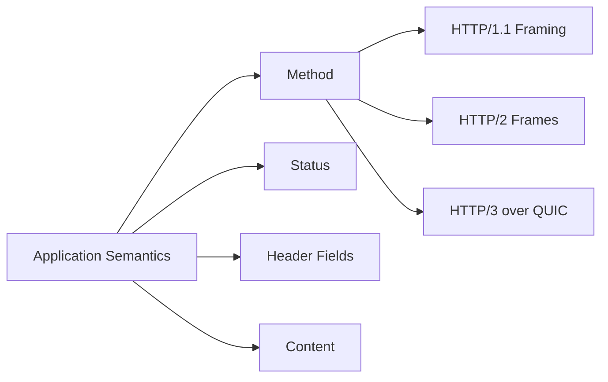
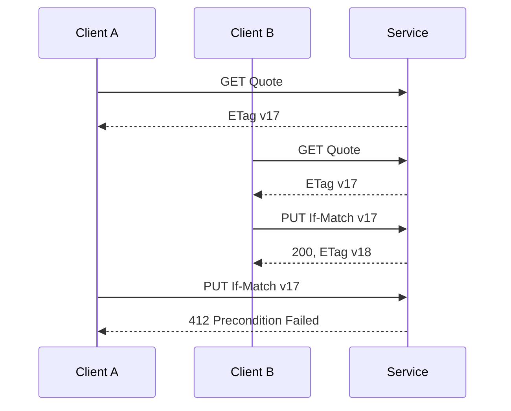
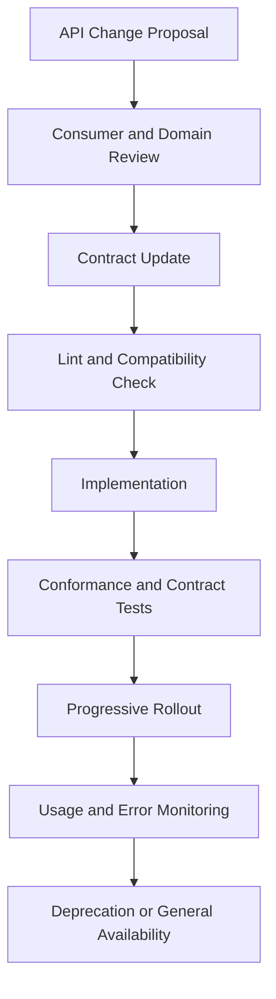

# Part 003 — HTTP Semantics and API Governance Fundamentals

> HTTP bukan sekadar transport untuk mengirim JSON. HTTP adalah **application protocol dengan semantics, caching model, conditional operations, intermediaries, dan compatibility rules**. Endpoint yang mengabaikan semantics ini dapat terlihat benar pada happy path, tetapi gagal ketika bertemu retry, proxy, browser, cache, load balancer, timeout, partial failure, atau multi-version deployment.

## Daftar Isi

1. [Target kompetensi](#target-kompetensi)
2. [Model mental: resource, representation, dan operation](#model-mental-resource-representation-dan-operation)
3. [HTTP semantics terpisah dari HTTP version](#http-semantics-terpisah-dari-http-version)
4. [Request dan response sebagai contract](#request-dan-response-sebagai-contract)
5. [HTTP method semantics](#http-method-semantics)
6. [Safe, idempotent, dan cacheable](#safe-idempotent-dan-cacheable)
7. [Ambiguous outcome dan retry safety](#ambiguous-outcome-dan-retry-safety)
8. [Status-code strategy](#status-code-strategy)
9. [Header strategy](#header-strategy)
10. [Content negotiation](#content-negotiation)
11. [CORS](#cors)
12. [Compression](#compression)
13. [HTTP caching dan `Cache-Control`](#http-caching-dan-cache-control)
14. [ETag dan validator](#etag-dan-validator)
15. [Conditional requests](#conditional-requests)
16. [Pagination](#pagination)
17. [Filtering, sorting, dan search](#filtering-sorting-dan-search)
18. [Partial response dan sparse fieldsets](#partial-response-dan-sparse-fieldsets)
19. [API versioning](#api-versioning)
20. [Backward compatibility](#backward-compatibility)
21. [Deprecation policy](#deprecation-policy)
22. [OpenAPI, linting, dan generated artifacts](#openapi-linting-dan-generated-artifacts)
23. [Contract compatibility matrix](#contract-compatibility-matrix)
24. [Governance workflow](#governance-workflow)
25. [JAX-RS mapping example](#jax-rs-mapping-example)
26. [Failure-model matrix](#failure-model-matrix)
27. [Debugging playbook](#debugging-playbook)
28. [PR review checklist](#pr-review-checklist)
29. [Trade-off yang harus dipahami senior engineer](#trade-off-yang-harus-dipahami-senior-engineer)
30. [Internal verification checklist](#internal-verification-checklist)
31. [Latihan verifikasi](#latihan-verifikasi)
32. [Ringkasan](#ringkasan)
33. [Referensi resmi](#referensi-resmi)

---

## Target kompetensi

Setelah menyelesaikan part ini, Anda harus mampu:

- menjelaskan perbedaan **resource**, **representation**, **operation**, dan **transport connection**;
- memilih method HTTP berdasarkan semantics, bukan berdasarkan kenyamanan implementasi;
- membedakan safe, idempotent, cacheable, dan retry-safe operation;
- merancang status code serta header strategy yang konsisten;
- menggunakan content negotiation, validators, caching, dan conditional request dengan benar;
- memilih pagination, filtering, sorting, dan partial-response contract yang stabil;
- mengidentifikasi perubahan additive, behaviorally breaking, dan structurally breaking;
- mendefinisikan versioning serta deprecation policy yang dapat dijalankan;
- menggunakan OpenAPI dan linting sebagai governance gate, bukan dokumentasi kosmetik;
- mereview API dengan mempertimbangkan browser, gateway, cache, generated clients, retries, dan multi-version deployment.

---

## Model mental: resource, representation, dan operation

Gunakan pemisahan berikut:

```text
Resource       = identitas konseptual yang dituju URI
Representation = bentuk data resource pada suatu waktu
Operation      = semantics yang diminta melalui method + headers + target
Message        = request atau response yang membawa metadata dan content
Intermediary   = proxy, gateway, cache, load balancer, service mesh
```

Contoh:

```text
Resource:
  Quote Q-123

URI:
  /quotes/Q-123

Representations:
  application/json
  application/xml
  application/vnd.company.quote+json

Operations:
  GET    membaca current representation
  PUT    mengganti state sesuai replacement contract
  PATCH  menerapkan partial modification
  DELETE meminta removal/cancellation semantics
```

### URI bukan command bus

URI seperti berikut biasanya mengaburkan semantics:

```text
POST /quote/doUpdate
POST /quote/getQuote
POST /quote/deleteQuote
```

Masalahnya bukan sekadar style. Konsekuensinya:

- cache dan intermediary tidak dapat menalar operation dengan benar;
- retry safety tidak jelas;
- tooling dan generated clients kehilangan semantic signal;
- authorization menjadi operation-name centric, bukan resource centric;
- observability dan governance menjadi tidak konsisten.

Lebih baik mulai dari resource dan lifecycle domain:

```text
GET    /quotes/{quoteId}
POST   /quotes
PUT    /quotes/{quoteId}
PATCH  /quotes/{quoteId}
DELETE /quotes/{quoteId}
POST   /quotes/{quoteId}/submission
```

Namun jangan memaksakan CRUD jika domain action memiliki invariant sendiri. `submission` dapat menjadi child resource karena memiliki identity, lifecycle, audit, dan idempotency yang berbeda dari update quote biasa.

### HTTP bukan domain model

HTTP contract tidak harus menyalin entity atau aggregate secara satu-ke-satu.

```text
Domain model     -> menjaga business invariant
API resource     -> menyediakan stable interaction contract
Persistence model-> mengoptimalkan penyimpanan dan query
```

Ketiganya dapat berbeda.

---

## HTTP semantics terpisah dari HTTP version

HTTP/1.1, HTTP/2, dan HTTP/3 berbeda terutama pada framing, multiplexing, connection behavior, dan wire-level transport. Semantics method, status, dan mayoritas fields tetap berlaku lintas versi.



Implikasi:

- jangan membuat correctness bergantung pada asumsi satu connection per request;
- jangan menganggap ordering request sama dengan ordering completion;
- jangan menyimpan request state berdasarkan thread atau connection secara implicit;
- jangan mengubah semantics hanya karena ingress menggunakan HTTP/2 sementara downstream HTTP/1.1.

### Intermediary-aware design

Request mungkin melewati:

```text
Client
-> CDN/cache
-> WAF
-> API gateway
-> L7 load balancer
-> ingress/service mesh
-> application runtime
```

Setiap layer dapat:

- menambah atau menghapus headers;
- melakukan compression/decompression;
- mengubah host/scheme information;
- melakukan retry;
- cache response;
- membatasi payload;
- menutup idle connection;
- menghasilkan response sebelum application dipanggil.

Karena itu, debugging API harus memisahkan **wire observation di setiap hop** dari asumsi application code.

---

## Request dan response sebagai contract

Request contract terdiri dari:

```text
Method
+ Target URI
+ Query parameters
+ Header fields
+ Content metadata
+ Content schema
+ Authentication context
+ Timing/retry assumptions
```

Response contract terdiri dari:

```text
Status
+ Header fields
+ Content metadata
+ Content schema
+ Cache semantics
+ Retry guidance
+ Compatibility guarantees
```

### Contract lebih luas daripada schema JSON

OpenAPI schema dapat menyatakan field dan type, tetapi belum tentu menjelaskan:

- apakah operation idempotent;
- apakah duplicate request menghasilkan resource baru;
- apakah absent field berarti preserve, clear, atau default;
- apakah result dapat stale;
- apakah ordering list stabil;
- apakah response dapat berubah selama pagination;
- apakah `202 Accepted` memiliki completion resource;
- apakah retry diperbolehkan setelah timeout;
- apakah timestamp inclusive atau exclusive.

Semantics tersebut harus dijadikan bagian contract melalui description, examples, invariants, headers, dan tests.

---

## HTTP method semantics

## GET

Tujuan utama: memperoleh representation dari current selected resource state.

Expected properties:

- safe;
- idempotent;
- secara default tidak boleh memiliki side effect yang diminta client;
- dapat cacheable tergantung response metadata;
- tidak boleh dipakai untuk action seperti approve, submit, delete, atau recalculate yang mengubah business state.

Side effect incidental seperti metrics, access logs, atau cache warming masih dapat terjadi, tetapi bukan requested semantics.

```java
@GET
@Path("/{quoteId}")
@Produces(MediaType.APPLICATION_JSON)
public Response getQuote(@PathParam("quoteId") String quoteId) {
    QuoteView quote = quoteQueries.getRequired(quoteId);
    return Response.ok(quote).build();
}
```

## HEAD

Semantics sama dengan GET tetapi response tidak membawa content body. Berguna untuk metadata, validators, existence checks, dan preflight download.

Jangan asumsikan HEAD selalu otomatis murah. Jika implementation membangun seluruh representation lalu membuang body, database dan serialization cost tetap dapat terjadi.

## POST

POST meminta target resource memproses enclosed content menurut semantics resource tersebut.

Cocok untuk:

- membuat resource ketika server memilih identifier;
- command yang tidak naturally idempotent;
- child-resource creation;
- complex query jika query terlalu besar/sensitif untuk URI, dengan contract eksplisit;
- asynchronous job creation.

POST tidak berarti "semua operation yang bukan GET".

Creation response umum:

```http
HTTP/1.1 201 Created
Location: /quotes/Q-123
Content-Type: application/json

{...}
```

## PUT

PUT meminta state target diganti/dibuat berdasarkan enclosed representation sesuai contract replacement.

Properties:

- idempotent pada intended effect;
- client biasanya mengetahui target URI;
- repeated identical PUT seharusnya menghasilkan intended final state yang sama;
- bukan otomatis partial update.

Risiko umum: endpoint disebut PUT tetapi hanya mengubah field yang hadir. Itu sebenarnya patch semantics yang dapat membingungkan generated clients dan compatibility reasoning.

## PATCH

PATCH menerapkan partial modification. Format patch harus eksplisit, misalnya:

- JSON Merge Patch;
- JSON Patch;
- domain-specific patch DTO.

Pertanyaan wajib:

- absent field berarti preserve atau clear?
- operasi patch commutative atau order-sensitive?
- bagaimana optimistic concurrency dilakukan?
- apakah patch idempotent?

PATCH tidak otomatis idempotent. Contoh operation `increment quantity by 1` tidak idempotent.

## DELETE

DELETE meminta penghapusan association atau state resource sesuai contract.

Properties:

- idempotent pada intended effect;
- repeated DELETE tidak harus selalu mengembalikan status yang sama;
- soft delete, cancellation, tombstone, dan physical deletion harus dijelaskan.

Contoh:

```text
DELETE pertama  -> 204
DELETE kedua    -> 404 atau 204
```

Keduanya dapat tetap idempotent karena intended final state sama: resource tidak tersedia.

## OPTIONS

OPTIONS menjelaskan communication options untuk target. Browser CORS preflight sering menggunakan OPTIONS, tetapi CORS adalah policy di atas general OPTIONS semantics.

## Method matrix

| Method | Safe | Idempotent | Typical use | Common failure |
|---|---:|---:|---|---|
| GET | Ya | Ya | Read representation | hidden mutation, expensive unbounded query |
| HEAD | Ya | Ya | Read metadata | full body tetap dibangun |
| POST | Tidak | Tidak secara default | Create/process command | duplicate creation pada retry |
| PUT | Tidak | Ya | Full replacement/upsert | sebenarnya partial update |
| PATCH | Tidak | Tergantung patch | Partial modification | absent/null semantics ambigu |
| DELETE | Tidak | Ya | Remove/cancel association | hard-delete assumption salah |
| OPTIONS | Ya | Ya | Capability/preflight | diblokir auth/filter sebelum CORS |

---

## Safe, idempotent, dan cacheable

Ketiga sifat ini berbeda.

### Safe

Operation safe jika client tidak meminta perubahan server state. Safety penting untuk:

- crawler;
- prefetch;
- browser navigation;
- link checker;
- cache revalidation;
- automated retries.

### Idempotent

Operation idempotent jika intended effect dari beberapa identical requests sama dengan satu request.

```text
Set status = CANCELLED   -> dapat idempotent
Increment retryCount     -> tidak idempotent
Create new order         -> tidak idempotent tanpa deduplication key
```

Idempotent tidak berarti:

- response byte selalu sama;
- audit entry hanya satu;
- timestamp tidak berubah;
- request hanya dieksekusi sekali.

### Cacheable

Cacheability ditentukan oleh method semantics dan response cache metadata. Safe atau idempotent tidak otomatis berarti response dapat disimpan oleh shared cache.

### Retry-safe

Retry-safe adalah property end-to-end yang lebih kuat daripada method-level idempotency.

```text
Retry-safe = operation semantics
           + idempotency implementation
           + request identity
           + transaction boundary
           + response recovery
           + downstream behavior
```

PUT yang idempotent dapat tetap tidak retry-safe jika implementation memanggil downstream non-idempotent pada setiap attempt.

---

## Ambiguous outcome dan retry safety

Ambiguous outcome terjadi ketika client tidak tahu apakah server telah menjalankan operation.

```text
Client sends POST
Server commits database
Network connection breaks before response arrives
Client observes timeout
```

Client tidak dapat membedakan:

- request tidak pernah sampai;
- request sedang berjalan;
- request berhasil tetapi response hilang;
- request gagal setelah partial side effect.

### Idempotency key

Untuk operation non-idempotent yang perlu retry, application dapat mendefinisikan idempotency key.

```http
POST /orders
Idempotency-Key: 6d6ca9c9-...
```

Server perlu menyimpan setidaknya:

```text
Key
+ Tenant/principal scope
+ Request fingerprint
+ Processing state
+ Final response atau resource identity
+ Expiry policy
```

Invariant penting:

1. Key tidak boleh digunakan ulang untuk payload berbeda.
2. Concurrent duplicate harus dikoordinasikan.
3. `IN_PROGRESS` yang stale perlu recovery policy.
4. Record idempotency dan business commit perlu consistency strategy.
5. Response replay tidak boleh membocorkan data antar-tenant.

### Retry matrix

| Situation | Retry otomatis? | Catatan |
|---|---:|---|
| GET timeout sebelum response | Umumnya ya | tetap batasi budget dan load |
| PUT dengan stable target dan idempotent downstream | Dapat | gunakan conditional request bila concurrent update mungkin |
| POST create tanpa idempotency key | Tidak aman | duplicate resource mungkin terjadi |
| POST dengan persisted idempotency record | Dapat | request fingerprint wajib |
| 400/401/403/404 | Umumnya tidak | retry hanya jika input/context berubah |
| 409/412 | Tidak blind retry | refresh state lalu resolve conflict |
| 429/503 dengan `Retry-After` | Dapat | patuhi budget dan jitter |
| Connection reset setelah commit mungkin terjadi | Ambigu | query outcome atau replay via idempotency key |

---

## Status-code strategy

Status code adalah machine-readable classification, bukan sekadar label manusia.

### Prinsip

- gunakan code paling spesifik yang stabil secara contract;
- jangan mengembalikan `200` untuk semua outcome;
- jangan mengekspos internal exception taxonomy melalui status code yang berubah-ubah;
- response body error tetap diperlukan untuk code, message, details, dan correlation;
- gateway/runtime dapat menghasilkan status yang sama dengan application, sehingga telemetry harus membedakan source.

## Success codes

| Code | Gunakan untuk | Catatan |
|---|---|---|
| 200 OK | success dengan representation | jangan return empty body tanpa alasan |
| 201 Created | resource berhasil dibuat | sertakan `Location` bila ada canonical URI |
| 202 Accepted | diterima untuk proses asynchronous | bukan bukti completion; sediakan status resource |
| 204 No Content | success tanpa response content | jangan kirim entity body |
| 206 Partial Content | byte-range response | membutuhkan range semantics yang benar |

## Redirection dan cache validation

| Code | Gunakan untuk | Catatan |
|---|---|---|
| 301/308 | permanent relocation | 308 mempertahankan method semantics |
| 302/303/307 | temporary/redirect flow | pahami method rewriting behavior |
| 304 Not Modified | conditional GET/HEAD validator match | bukan normal success body |

## Client-side contract/input failures

| Code | Meaning | Typical API use |
|---|---|---|
| 400 | malformed/invalid request syntax atau conversion | malformed JSON, invalid query syntax |
| 401 | authentication required/invalid | biasanya terkait challenge/token |
| 403 | authenticated tetapi tidak diizinkan | jangan otomatis menyamarkan semua resource |
| 404 | target tidak ditemukan/tidak diekspos | dapat juga dipakai untuk anti-enumeration policy |
| 405 | method tidak didukung target | sertakan `Allow` bila sesuai |
| 406 | tidak ada acceptable representation | mismatch `Accept` |
| 409 | conflict dengan current state | state transition conflict, duplicate business key |
| 410 | resource sengaja tidak lagi tersedia | tombstone/deprecation tertentu |
| 412 | precondition gagal | `If-Match`, `If-Unmodified-Since` |
| 415 | request media type tidak didukung | mismatch `Content-Type` |
| 422 | content syntactically valid tetapi semantically invalid | gunakan konsisten bila standard internal memilihnya |
| 428 | precondition diwajibkan | mencegah lost update tanpa conditional header |
| 429 | rate limit exceeded | sertakan retry guidance bila tersedia |

### 409 versus 422 versus 412

Gunakan decision rule:

```text
Apakah conditional header gagal?
  -> 412

Apakah request content valid tetapi melanggar input/domain validation policy?
  -> 422 atau 400, sesuai standard konsisten

Apakah operation conflict dengan current server state/resource lifecycle?
  -> 409
```

## Server dan dependency failures

| Code | Typical meaning | Catatan |
|---|---|---|
| 500 | unexpected application failure | jangan bocorkan stack trace |
| 502 | invalid/bad response dari upstream | biasanya gateway/proxy atau integration layer |
| 503 | service sementara unavailable/overloaded | dapat disertai `Retry-After` |
| 504 | upstream deadline exceeded | jangan samakan dengan semua internal timeout |

### Error envelope

Contoh stable error shape:

```json
{
  "type": "https://errors.example.invalid/quote-state-conflict",
  "title": "Quote state conflict",
  "status": 409,
  "code": "QUOTE_NOT_EDITABLE",
  "detail": "The quote cannot be modified in its current state.",
  "instance": "/quotes/Q-123",
  "correlationId": "c-01J...",
  "violations": []
}
```

`detail` dapat berubah untuk manusia; `code` seharusnya stabil untuk automation.

---

## Header strategy

Headers adalah bagian contract, bukan metadata tambahan yang boleh diabaikan.

### Representation headers

- `Content-Type`: format content yang benar-benar dikirim.
- `Content-Length`: sering dikelola runtime; dapat tidak tersedia pada streaming.
- `Content-Encoding`: encoding seperti gzip.
- `Content-Language`: bahasa representation jika relevan.

### Request preference dan negotiation

- `Accept`
- `Accept-Encoding`
- `Accept-Language`

### Resource dan navigation

- `Location`
- `Content-Location`
- `Link`

### Caching dan validation

- `Cache-Control`
- `ETag`
- `Last-Modified`
- `Vary`
- `Age`

### Preconditions

- `If-Match`
- `If-None-Match`
- `If-Modified-Since`
- `If-Unmodified-Since`
- `If-Range`

### Retry dan capacity

- `Retry-After`
- standard atau platform-specific rate-limit headers bila disepakati

### Observability dan request identity

- W3C `traceparent`/`tracestate` jika OpenTelemetry/W3C Trace Context digunakan;
- correlation ID bila platform memiliki contract terpisah;
- idempotency key bila operation memerlukannya.

### Header anti-pattern

- memasukkan business payload besar ke custom header;
- mengandalkan case-sensitive header names;
- mempercayai forwarded headers dari untrusted client;
- menggunakan correlation ID sebagai security credential;
- menyimpan PII di baggage atau trace headers;
- membuat custom header saat standard header sudah tersedia.

---

## Content negotiation

Content negotiation memilih representation berdasarkan metadata request dan kemampuan server.

### Server-driven negotiation

```http
GET /quotes/Q-123
Accept: application/json
```

JAX-RS menggunakan `@Produces` dan matching rules untuk memilih resource method/representation.

```java
@GET
@Produces({MediaType.APPLICATION_JSON, MediaType.APPLICATION_XML})
public QuoteRepresentation getQuote() {
    // ...
}
```

### Request content type

`Content-Type` menjelaskan request entity yang dikirim.

```java
@POST
@Consumes(MediaType.APPLICATION_JSON)
@Produces(MediaType.APPLICATION_JSON)
public Response createQuote(CreateQuoteRequest request) {
    // ...
}
```

Perbedaan penting:

```text
Accept       -> format response yang dapat diterima client
Content-Type -> format entity yang sedang dikirim sender
```

### Failure mapping

- request `Content-Type` tidak didukung -> `415 Unsupported Media Type`;
- tidak ada response representation yang acceptable -> `406 Not Acceptable`.

### Vendor media type

Vendor media types dapat membawa version/semantics:

```text
application/vnd.example.quote-v2+json
```

Trade-off:

- contract eksplisit;
- tooling dan debugging lebih kompleks;
- gateway/browser/test configuration dapat lebih sulit;
- tidak otomatis menyelesaikan semantic versioning.

---

## CORS

CORS adalah browser security protocol yang mengontrol apakah script dari origin tertentu boleh membaca response lintas origin.

CORS **bukan** authentication atau server-to-server authorization.

### Simple dan preflighted requests

Browser dapat mengirim preflight:

```http
OPTIONS /quotes/Q-123
Origin: https://portal.example
Access-Control-Request-Method: PATCH
Access-Control-Request-Headers: authorization, content-type
```

Response perlu menyatakan policy yang tepat.

### CORS ownership

CORS dapat diimplementasikan di:

- gateway;
- ingress;
- Servlet filter;
- JAX-RS request/response filter;
- framework middleware.

Pilih satu source of truth atau definisikan layering dengan jelas. Konfigurasi ganda dapat menghasilkan headers konflik.

### Credentialed CORS

Jangan menggunakan wildcard origin bersama credentialed requests. Origin harus divalidasi terhadap allowlist dan response biasanya perlu `Vary: Origin` jika behavior berubah berdasarkan origin.

### Failure modes

- OPTIONS terkena authentication requirement sebelum CORS filter;
- allowed headers tidak mencakup `Authorization`;
- wildcard origin terlalu luas;
- origin reflection tanpa validation;
- gateway dan application menambahkan duplicate headers;
- browser menolak response walaupun server mengembalikan 200.

Debugging CORS harus menggunakan browser network console dan raw response headers, bukan hanya application logs.

---

## Compression

Compression mengurangi bandwidth tetapi menambah CPU, latency, buffering, dan security considerations.

### Negotiation

Client menyatakan:

```http
Accept-Encoding: gzip, br
```

Server menyatakan encoding yang dipakai:

```http
Content-Encoding: gzip
```

Response yang bervariasi berdasarkan encoding perlu cache semantics yang benar, biasanya `Vary: Accept-Encoding`.

### Jangan compress secara buta

Hindari atau evaluasi compression untuk:

- payload sangat kecil;
- already-compressed formats seperti JPEG/ZIP;
- streaming latency-sensitive;
- secrets yang berdekatan dengan attacker-controlled reflection pada threat model tertentu;
- CPU-constrained pods.

### Ownership

Compression dapat dilakukan oleh application server, ingress, gateway, CDN, atau service mesh. Double compression dan mismatch `Content-Length` adalah tanda ownership tidak jelas.

---

## HTTP caching dan `Cache-Control`

Cache adalah participant dalam consistency model.

### Jenis cache

- browser/private cache;
- shared proxy/CDN cache;
- gateway cache;
- application-local cache;
- distributed cache seperti Redis.

HTTP cache hanya salah satu layer. Jangan mencampur semantics HTTP cache dengan application cache tanpa model invalidation.

### Common directives

```text
no-store         -> jangan menyimpan response
no-cache         -> boleh menyimpan, tetapi harus revalidate sebelum reuse
private          -> hanya private cache
public           -> shared cache diperbolehkan
max-age=N        -> freshness lifetime untuk client cache
s-maxage=N       -> freshness khusus shared cache
must-revalidate  -> stale response tidak boleh dipakai tanpa validation
immutable        -> representation tidak berubah selama freshness lifetime
```

`no-cache` bukan berarti "tidak boleh disimpan". Untuk data sensitif yang tidak boleh berada di cache, gunakan `no-store` sesuai threat model.

### Cache key

Cache key dapat dipengaruhi oleh:

- method;
- URI;
- selected request headers melalui `Vary`;
- authorization/cookie behavior;
- gateway-specific configuration.

### Tenant dan authorization risk

Kesalahan cache key dapat menyebabkan data leakage lintas user atau tenant. Response personalized biasanya memerlukan `private`, `no-store`, atau shared-cache partitioning yang dapat dibuktikan.

---

## ETag dan validator

Validator membantu cache revalidation dan optimistic concurrency.

### Strong ETag

Strong validator menyatakan representations byte-equivalent untuk range/caching semantics yang relevan.

```http
ETag: "q123-v17"
```

### Weak ETag

Weak validator menyatakan semantic equivalence yang cukup untuk cache validation, tetapi bukan byte-for-byte identity.

```http
ETag: W/"q123-view-17"
```

### ETag generation

Pilihan:

- database row version;
- aggregate version;
- stable content hash;
- canonical representation hash;
- revision identifier.

Jangan menggunakan hash serialized JSON tanpa memastikan serialization deterministic. Field ordering, timestamps, locale, dan hidden fields dapat membuat ETag tidak stabil.

### ETag bukan authorization token

ETag dapat terlihat client dan cache. Jangan memasukkan secret atau reversible sensitive value.

---

## Conditional requests

Conditional request menjadikan operation bergantung pada validator.

## Conditional GET

```http
GET /quotes/Q-123
If-None-Match: "q123-v17"
```

Jika masih sama:

```http
HTTP/1.1 304 Not Modified
ETag: "q123-v17"
```

## Optimistic update

```http
PUT /quotes/Q-123
If-Match: "q123-v17"
```

Jika current version berubah:

```http
HTTP/1.1 412 Precondition Failed
```

Ini mencegah lost update:



### `If-None-Match: *`

Dapat digunakan untuk create-only semantics pada known URI:

```http
PUT /quotes/Q-123
If-None-Match: *
```

### Timestamp validators

`Last-Modified` dan date-based conditionals memiliki precision serta clock concerns. Version-based ETag sering lebih aman untuk transactional entities.

---

## Pagination

Pagination bukan hanya performance feature. Ia adalah consistency contract.

## Offset pagination

```text
GET /quotes?offset=100&limit=50
```

Kelebihan:

- sederhana;
- mudah melompat ke page tertentu.

Kekurangan:

- semakin mahal pada offset besar;
- insert/delete dapat menyebabkan duplicate atau skipped item;
- result order wajib deterministic.

## Page-number pagination

```text
GET /quotes?page=3&pageSize=50
```

Secara internal biasanya tetap offset-based dan memiliki failure mode yang sama.

## Cursor/keyset pagination

```text
GET /quotes?after=opaqueCursor&limit=50
```

Kelebihan:

- stabil dan efisien untuk ordered traversal;
- lebih baik pada dataset besar.

Kekurangan:

- cursor design lebih kompleks;
- random page access sulit;
- filter/sort harus terikat ke cursor fingerprint;
- cursor perlu integrity protection jika membawa state.

### Stable ordering

Ordering harus total, misalnya:

```sql
ORDER BY updated_at DESC, quote_id DESC
```

Hanya `updated_at` tidak cukup jika banyak row memiliki timestamp sama.

### Response shape

```json
{
  "items": [],
  "page": {
    "nextCursor": "opaque",
    "hasMore": true
  }
}
```

Total count dapat mahal dan cepat stale. Jangan selalu menjanjikan `totalElements` jika query cost tidak dapat dikendalikan.

---

## Filtering, sorting, dan search

Filtering contract perlu mendefinisikan:

- field yang boleh difilter;
- operator;
- null semantics;
- case sensitivity;
- date/time boundary;
- tenant/security predicate;
- maximum complexity;
- invalid-filter response.

Contoh sederhana:

```text
GET /quotes?status=DRAFT&customerId=C-1
```

Complex filter DSL meningkatkan ekspresivitas tetapi membawa risiko:

- query injection;
- expensive query plans;
- unbounded joins;
- index mismatch;
- unstable semantics;
- authorization bypass jika security predicate tidak selalu diterapkan.

### Sorting

```text
GET /quotes?sort=-updatedAt,quoteId
```

Whitelist sortable fields. Jangan memasukkan raw client value langsung ke SQL `ORDER BY`.

### Search

Bedakan:

```text
exact filtering
prefix search
full-text search
fuzzy search
semantic/vector search
```

Masing-masing memiliki consistency, ranking, indexing, dan pagination behavior berbeda.

---

## Partial response dan sparse fieldsets

Partial response mengurangi payload dengan meminta subset fields.

```text
GET /quotes/Q-123?fields=id,status,total
```

Manfaat:

- bandwidth berkurang;
- client dapat menghindari data besar yang tidak dibutuhkan.

Risiko:

- field-level authorization menjadi kompleks;
- cache key harus memasukkan field selection;
- generated clients sulit memodelkan shape dinamis;
- observability cardinality dapat meningkat;
- backend tetap dapat memuat full aggregate sehingga performance benefit semu.

Alternatif:

- purpose-specific resource views;
- summary/detail endpoints;
- embedded resources yang eksplisit;
- GraphQL untuk kebutuhan query-shape yang benar-benar dinamis, dengan governance tersendiri.

---

## API versioning

Versioning adalah strategi compatibility, bukan pengganti desain evolvable.

### URI versioning

```text
/v1/quotes
/v2/quotes
```

Kelebihan: terlihat jelas, mudah diroute. Kekurangan: duplikasi dan tekanan untuk membuat major version terlalu cepat.

### Media-type versioning

```text
Accept: application/vnd.example.quote-v2+json
```

Kelebihan: version terkait representation. Kekurangan: tooling dan operasi lebih rumit.

### Header/query versioning

Dapat digunakan, tetapi perlu governance kuat karena visibility dan caching behavior.

### No explicit version

API dapat berevolusi additively dengan compatibility policy ketat. Cocok untuk internal APIs tertentu, tetapi bukan alasan untuk perubahan breaking diam-diam.

### Version scope

Tentukan apakah version berlaku pada:

- seluruh API;
- resource family;
- representation;
- operation;
- event/schema;
- generated client package.

---

## Backward compatibility

Compatibility memiliki beberapa dimensi.

### Structural compatibility

Apakah payload masih dapat diparse?

### Semantic compatibility

Apakah field memiliki meaning yang sama?

### Behavioral compatibility

Apakah status, ordering, timing, retry, dan side effect tetap sesuai?

### Operational compatibility

Apakah gateway, cache, rate limits, payload limits, dan observability assumptions tetap bekerja?

### Source/binary compatibility generated clients

Apakah regenerated client menyebabkan compile break atau runtime behavior change?

## Umumnya additive

- menambah optional response field;
- menambah endpoint baru;
- menambah optional request parameter dengan default yang mempertahankan behavior;
- menambah enum value **hanya jika client diwajibkan toleran unknown value**.

## Sering breaking

- menghapus atau rename field;
- mengubah type;
- membuat optional field menjadi required;
- mengubah null/absent semantics;
- mengubah status code yang digunakan automation;
- mengubah pagination ordering;
- mengubah default filter;
- menambah enum value saat generated client menggunakan exhaustive switch;
- mengubah precision timestamp atau currency;
- mengubah authorization visibility;
- membuat previously idempotent operation non-idempotent.

### Tolerant reader bukan magic

Client yang mengabaikan unknown fields membantu evolusi response, tetapi tidak menyelesaikan:

- unknown enum values;
- semantic changes;
- required-field changes;
- generated model constraints;
- business logic yang mengasumsikan closed-world values.

---

## Deprecation policy

Deprecation harus menjadi lifecycle yang dapat diamati.

```text
Propose
-> Announce
-> Mark deprecated
-> Measure usage
-> Provide migration path
-> Enforce sunset criteria
-> Remove only after evidence
```

Policy perlu mendefinisikan:

- minimum notice period;
- affected consumers;
- migration guide;
- telemetry untuk usage;
- ownership follow-up;
- exception process;
- final removal criteria;
- rollback path bila hidden consumer ditemukan.

Dapat menggunakan response metadata seperti deprecation/sunset conventions bila platform mendukung, tetapi jangan hanya mengandalkan header. Consumer inventory dan communication tetap wajib.

---

## OpenAPI, linting, dan generated artifacts

OpenAPI mendeskripsikan HTTP API secara language-agnostic. Ia dapat menjadi:

- design input;
- documentation;
- validation source;
- code-generation input;
- compatibility-check input;
- governance artifact.

### Contract-first

```text
Design contract
-> lint/review
-> generate skeleton/client
-> implement
-> conformance test
```

Kelebihan:

- review semantics lebih awal;
- consumer feedback sebelum code;
- centralized governance lebih mudah.

Risiko:

- generated skeleton dapat mendikte architecture internal;
- contract dan implementation dapat drift;
- developers dapat memperlakukan generated code sebagai domain model.

### Code-first

```text
Implement annotations/code
-> generate OpenAPI
-> publish
```

Kelebihan:

- lebih dekat ke implementation;
- onboarding awal cepat.

Risiko:

- contract design terlambat;
- annotations tidak menangkap seluruh semantics;
- generated spec dapat berubah akibat refactor internal;
- runtime output belum tentu sama dengan intended contract.

### API linting

Lint rules dapat memeriksa:

- operation IDs;
- naming conventions;
- required error responses;
- pagination pattern;
- security declarations;
- examples;
- description requirements;
- forbidden breaking patterns;
- schema reuse;
- deprecated operation metadata.

Linting tidak dapat membuktikan business semantics. Ia hanya gate yang mempersempit variasi berbahaya.

### Generated clients dan servers

Generated artifacts perlu policy:

- generator/version pinned;
- deterministic output;
- generated files committed atau generated saat build;
- custom code dipisahkan dari generated code;
- regeneration diff direview;
- security dan serialization defaults diverifikasi;
- generated retries tidak diaktifkan tanpa semantic review.

AsyncAPI dan protobuf/gRPC akan dibahas lebih dalam pada part contract/integration, tetapi governance principle-nya sama: **contract adalah versioned product, bukan side effect build**.

---

## Contract compatibility matrix

Matrix membantu menilai deployment multi-version.

| Producer/API version | Consumer/client version | Expected | Evidence |
|---|---|---|---|
| v1 | v1 | supported | contract tests |
| v2 additive | v1 tolerant | supported | compatibility suite |
| v1 | v2 client | conditional | client fallback test |
| v2 breaking | v1 | unsupported | migration required |

Tambahkan dimensi bila perlu:

- gateway version;
- schema version;
- generated-client version;
- database schema phase;
- feature flag state;
- tenant-specific contract;
- cloud/on-prem release cadence.

### N/N-1 bukan cukup tanpa definisi

Pernyataan "support N dan N-1" harus menjawab:

- N milik siapa: API, client, schema, database, atau deployment?
- untuk berapa lama?
- apakah bidirectional compatibility diwajibkan?
- apakah rollback dari N ke N-1 didukung setelah write baru terjadi?

---

## Governance workflow



### Minimal governance gates

1. Resource dan operation semantics jelas.
2. Authentication/authorization impact jelas.
3. Retry dan idempotency behavior jelas.
4. Status/header/error contract jelas.
5. Compatibility classification dibuat.
6. Consumer impact diinventarisasi.
7. OpenAPI/contract diperbarui.
8. Lint dan contract tests lulus.
9. Rollout serta rollback plan tersedia.
10. Telemetry membuktikan adoption dan failure.

---

## JAX-RS mapping example

Contoh berikut menunjukkan semantics, bukan template final:

```java
@Path("/quotes")
@Produces(MediaType.APPLICATION_JSON)
public final class QuoteResource {

    private final QuoteApplicationService service;

    public QuoteResource(QuoteApplicationService service) {
        this.service = service;
    }

    @GET
    @Path("/{quoteId}")
    public Response get(
            @PathParam("quoteId") String quoteId,
            @HeaderParam("If-None-Match") String ifNoneMatch) {

        Versioned<QuoteView> result = service.getQuote(quoteId);
        EntityTag tag = new EntityTag(result.version());

        if (ifNoneMatch != null && ifNoneMatch.equals(tag.toString())) {
            return Response.notModified(tag).build();
        }

        return Response.ok(result.value())
                .tag(tag)
                .cacheControl(privateRevalidate())
                .build();
    }

    @POST
    @Consumes(MediaType.APPLICATION_JSON)
    public Response create(
            @HeaderParam("Idempotency-Key") String idempotencyKey,
            CreateQuoteRequest request,
            @Context UriInfo uriInfo) {

        CreatedQuote created = service.createQuote(idempotencyKey, request);
        URI location = uriInfo.getAbsolutePathBuilder()
                .path(created.quoteId())
                .build();

        return Response.created(location)
                .entity(created.view())
                .tag(new EntityTag(created.version()))
                .build();
    }

    @PUT
    @Path("/{quoteId}")
    @Consumes(MediaType.APPLICATION_JSON)
    public Response replace(
            @PathParam("quoteId") String quoteId,
            @HeaderParam("If-Match") String ifMatch,
            ReplaceQuoteRequest request) {

        UpdatedQuote updated = service.replaceQuote(quoteId, ifMatch, request);
        return Response.ok(updated.view())
                .tag(new EntityTag(updated.version()))
                .build();
    }

    private static CacheControl privateRevalidate() {
        CacheControl cc = new CacheControl();
        cc.setPrivate(true);
        cc.setNoCache(true);
        return cc;
    }
}
```

Hal yang harus direview:

- parser `If-Match` jangan hanya string equality sederhana;
- idempotency key harus divalidasi dan dipersistenkan secara benar;
- error mapping harus konsisten;
- authorization dan tenant boundary belum terlihat dalam contoh;
- cache policy harus berdasarkan data classification;
- `QuoteApplicationService` harus mempertahankan downstream retry safety.

---

## Failure-model matrix

| Failure mode | Root cause | Symptom | Detection | Prevention/response |
|---|---|---|---|---|
| Duplicate order/quote | POST di-retry tanpa idempotency | multiple resources | audit/business-key query | idempotency key dan unique invariant |
| Lost update | write tanpa precondition | perubahan user tertimpa | version mismatch audit | ETag/row version/If-Match |
| CORS browser failure | preflight/header policy salah | browser block, server mungkin 200 | browser network console | centralized CORS policy |
| Cross-tenant cache leak | cache key tidak memasukkan identity/tenant | data user lain muncul | security incident, cache trace | private/no-store atau partitioned key |
| Stale response | cache lifetime salah | old catalog/pricing/quote view | Age/ETag/cache logs | explicit freshness dan invalidation |
| Retry storm | client retry 503/timeout tanpa budget | load meningkat saat outage | request rate, retry metric | retry budget, jitter, Retry-After |
| Breaking enum addition | generated client exhaustive enum | deserialization/runtime error | compatibility tests | unknown-value strategy |
| Pagination duplicate/skip | unstable ordering + concurrent writes | missing/duplicate items | replay test | keyset + total ordering |
| 200 for business failure | status strategy lemah | monitoring dan client handling salah | contract test | typed error/status mapping |
| 500 after response commit | streaming/writer failure | truncated body, no clean error | server/client byte logs | prevalidation, streaming telemetry |
| Compression overload | compress large responses in app | CPU throttling/latency | CPU and encoding metrics | offload/threshold/budget |
| Header spoofing | forwarded headers dipercaya dari internet | wrong scheme/identity/audit | edge/app header comparison | trusted-proxy allowlist |

---

## Debugging playbook

## 1. Capture the exact exchange

Kumpulkan:

```text
method
full target URI
request headers after redaction
request content type/size
response status
response headers
response content type/size
latency per hop
trace/correlation ID
```

Jangan hanya menggunakan screenshot UI atau application exception.

## 2. Determine response producer

Tentukan apakah response berasal dari:

- browser/network stack;
- CDN/WAF;
- gateway/load balancer;
- ingress/service mesh;
- servlet/JAX-RS runtime;
- resource method;
- downstream proxy code.

Gunakan access logs, trace spans, response headers, dan route metrics.

## 3. Reproduce without browser

Gunakan HTTP client yang dapat mengontrol raw headers. Untuk CORS, tetap verifikasi di browser karena enforcement dilakukan browser.

## 4. Inspect negotiation

Bandingkan:

```text
Accept
Content-Type
@Consumes
@Produces
registered MessageBodyReader/Writer
```

## 5. Inspect retry path

Cari:

- gateway retries;
- service-mesh retries;
- HTTP client retries;
- application retries;
- user/manual retries;
- queue redelivery.

Multiple independent retry layers dapat mengalikan attempt.

## 6. Inspect cache path

Periksa:

- `Cache-Control`;
- `Age`;
- `ETag`;
- `Vary`;
- cache hit/miss headers;
- CDN/gateway rules;
- authorization/cookie handling.

## 7. Validate compatibility with real clients

Jalankan:

- previous generated client;
- tolerant-reader test;
- unknown enum test;
- response-field addition test;
- old client against new server;
- new client against old server jika rollback mendukungnya.

---

## PR review checklist

### Method dan resource semantics

- [ ] URI merepresentasikan resource atau lifecycle yang jelas.
- [ ] Method sesuai semantics operation.
- [ ] GET/HEAD tidak memiliki requested state mutation.
- [ ] PUT benar-benar replacement/upsert contract atau diberi penjelasan.
- [ ] PATCH format dan absent/null semantics jelas.
- [ ] DELETE menjelaskan soft/hard/cancel behavior.

### Idempotency dan concurrency

- [ ] Safe/idempotent property dinyatakan.
- [ ] Retry behavior setelah timeout dianalisis.
- [ ] Non-idempotent create memiliki duplicate policy.
- [ ] Idempotency key scope dan payload fingerprint jelas.
- [ ] Lost-update prevention tersedia bila diperlukan.
- [ ] Downstream calls mempertahankan idempotency.

### Status dan errors

- [ ] Success status tepat.
- [ ] Creation menyertakan canonical resource identity.
- [ ] Async processing menggunakan `202` dengan status resource.
- [ ] 400/409/412/415/422 distinction konsisten.
- [ ] 429/503 memiliki retry guidance bila tepat.
- [ ] Error code stabil dan tidak membocorkan detail internal.

### Headers dan representation

- [ ] `Content-Type` dan `Accept` behavior jelas.
- [ ] `Location`, `ETag`, `Cache-Control`, dan `Vary` dievaluasi.
- [ ] Custom headers benar-benar dibutuhkan.
- [ ] Forwarded headers hanya dipercaya dari trusted proxy.
- [ ] Sensitive values tidak masuk correlation/baggage/header tanpa alasan.

### Collection APIs

- [ ] Pagination memiliki deterministic total order.
- [ ] Limit maksimum diterapkan.
- [ ] Cursor terikat pada filter/sort bila perlu.
- [ ] Filter/sort fields di-whitelist.
- [ ] Query complexity dibatasi.
- [ ] Total count cost dipertimbangkan.

### Compatibility dan governance

- [ ] OpenAPI/contract diperbarui.
- [ ] Change diklasifikasikan additive/breaking/behavioral.
- [ ] Generated-client impact direview.
- [ ] Unknown-field dan unknown-enum behavior diuji.
- [ ] Deprecation/migration plan tersedia untuk breaking change.
- [ ] Contract tests mencakup N/N-1 matrix yang disepakati.

### Security dan operations

- [ ] CORS source of truth jelas.
- [ ] Cache tidak memungkinkan cross-tenant/user leakage.
- [ ] Payload, page size, dan header limits dipertimbangkan.
- [ ] Telemetry memiliki operation ID, status family, latency, dan error code.
- [ ] High-cardinality path IDs tidak dijadikan metric labels.

---

## Trade-off yang harus dipahami senior engineer

### REST purity versus domain clarity

Resource-oriented API baik, tetapi memaksa semua business action menjadi CRUD palsu dapat lebih buruk. Gunakan sub-resource atau action resource jika lifecycle dan audit-nya nyata.

### Convenience versus retry safety

POST sederhana mudah dibuat, tetapi operation kritis memerlukan idempotency persistence, duplicate resolution, dan recovery path.

### Strong consistency versus availability

Conditional update menjaga lost update tetapi menambah conflict handling pada client. Blind last-write-wins lebih sederhana namun dapat merusak quote/order correctness.

### Rich filtering versus database safety

Flexible DSL membantu consumer tetapi memperbesar attack surface, query-plan variability, dan support burden.

### Versioning versus additive evolution

Major version memberi clean break tetapi menambah parallel maintenance. Additive evolution lebih efisien tetapi menuntut discipline tinggi dan tolerant clients.

### Generated code versus architecture control

Generation mengurangi boilerplate dan drift, tetapi generated server model tidak boleh menentukan domain architecture atau error semantics.

### Caching versus confidentiality/freshness

Caching meningkatkan latency dan capacity, tetapi dapat menyebabkan stale price/catalog state atau data leakage jika key dan directives salah.

### Standard semantics versus platform conventions

Platform-specific status/header conventions dapat berguna, tetapi harus tetap kompatibel dengan standard HTTP dan documented across gateways/clients.

---

## Internal verification checklist

> Checklist ini tidak menyatakan bahwa CSG Quote & Order menggunakan pola tertentu. Semua item harus dibuktikan melalui codebase, contract repository, gateway configuration, tests, deployment, dan diskusi tim.

### API governance

- [ ] Lokasi API style guide internal.
- [ ] API review/approval process.
- [ ] OpenAPI source of truth: contract-first, code-first, atau hybrid.
- [ ] Linting tools dan mandatory rules.
- [ ] Breaking-change detection tooling.
- [ ] Generated client/server policy.
- [ ] API catalog atau developer portal.
- [ ] Supported compatibility window.

### HTTP conventions

- [ ] URI naming rules.
- [ ] Method semantics conventions.
- [ ] Standard status codes dan error envelope.
- [ ] Required/common headers.
- [ ] Idempotency-key standard.
- [ ] Conditional request/ETag standard.
- [ ] Pagination/filter/sort conventions.
- [ ] Partial response policy.
- [ ] Maximum payload/page/header limits.

### Runtime dan platform ownership

- [ ] CORS dikelola gateway, ingress, servlet, atau JAX-RS.
- [ ] Compression owner dan threshold.
- [ ] Cache/CDN/gateway caching behavior.
- [ ] Retry dilakukan oleh layer mana saja.
- [ ] Header normalization/stripping behavior.
- [ ] Trusted proxy/forwarded-header configuration.
- [ ] HTTP versions yang digunakan pada setiap hop.

### Compatibility dan release

- [ ] API versioning strategy.
- [ ] Deprecation notice period.
- [ ] Consumer inventory.
- [ ] N/N-1 compatibility definition.
- [ ] Rollback compatibility requirements.
- [ ] Contract tests pada CI.
- [ ] Telemetry untuk deprecated endpoints.

### Quote & Order context

- [ ] Idempotency semantics untuk quote/order creation.
- [ ] Quote version/concurrency model.
- [ ] Effective-dated catalog/pricing response caching policy.
- [ ] Long-running submission/order orchestration response model.
- [ ] Tenant-specific API variation, jika ada.
- [ ] Cloud versus on-prem contract differences, jika ada.

---

## Latihan verifikasi

### Latihan 1 — Method audit

Ambil 20 endpoints dari satu service dan buat tabel:

| Endpoint | Method | Safe | Idempotent | Retry-safe | Evidence |
|---|---|---:|---:|---:|---|

Jangan mengisi berdasarkan nama method Java. Buktikan melalui code, transaction, dan downstream calls.

### Latihan 2 — Ambiguous outcome simulation

Untuk create endpoint:

1. kirim request;
2. paksa connection putus setelah database commit tetapi sebelum response diterima;
3. retry request;
4. ukur apakah duplicate terbentuk;
5. dokumentasikan recovery path.

### Latihan 3 — Lost update

Simulasikan dua client membaca version sama lalu menulis berbeda. Verifikasi apakah system:

- last-write-wins;
- menggunakan row version;
- menggunakan ETag/If-Match;
- menghasilkan conflict yang dapat dipulihkan.

### Latihan 4 — Cache safety

Pilih endpoint yang mengandung customer/tenant data. Trace response melalui browser/gateway dan verifikasi:

- `Cache-Control`;
- `Vary`;
- authorization handling;
- cache key;
- shared-cache eligibility.

### Latihan 5 — Compatibility diff

Tambahkan satu enum value dan satu optional response field pada branch test. Jalankan old generated client terhadap new server. Catat compile, parse, dan behavioral impact.

### Latihan 6 — Pagination under mutation

Saat melakukan traversal 10 halaman, insert/update/delete records di tengah proses. Bandingkan offset dan keyset behavior.

---

## Ringkasan

Model mental utama Part 003:

```text
HTTP API
  bukan hanya URL + JSON,
  tetapi contract yang mencakup:
    method semantics,
    retry dan idempotency,
    status dan headers,
    representation negotiation,
    caching dan validators,
    collection traversal,
    compatibility,
    deprecation,
    intermediaries,
    dan operational evidence.
```

Invariant penting:

1. **Method semantics harus konsisten dengan intended effect.**
2. **Idempotent tidak otomatis berarti retry-safe.**
3. **Status dan headers adalah bagian machine-readable contract.**
4. **Cache adalah participant dalam consistency dan security model.**
5. **Pagination memerlukan deterministic ordering dan mutation semantics.**
6. **Compatibility mencakup structure, behavior, semantics, operations, dan generated clients.**
7. **Contract governance harus berjalan sebelum dan sesudah deployment.**
8. **Semua platform-specific behavior CSG harus dibuktikan secara internal.**

Part berikutnya akan memetakan semantics tersebut ke lifecycle Jakarta REST: bagaimana request masuk, diproses, dicocokkan ke resource, dikonversi menjadi Java object, dipanggil, dan diubah kembali menjadi HTTP response.

---

## Referensi resmi

- [RFC 9110 — HTTP Semantics](https://www.rfc-editor.org/rfc/rfc9110.html)
- [RFC 9111 — HTTP Caching](https://www.rfc-editor.org/rfc/rfc9111.html)
- [RFC 9112 — HTTP/1.1](https://www.rfc-editor.org/rfc/rfc9112.html)
- [RFC 9113 — HTTP/2](https://www.rfc-editor.org/rfc/rfc9113.html)
- [RFC 9114 — HTTP/3](https://www.rfc-editor.org/rfc/rfc9114.html)
- [RFC 5789 — PATCH Method for HTTP](https://www.rfc-editor.org/rfc/rfc5789.html)
- [RFC 6902 — JSON Patch](https://www.rfc-editor.org/rfc/rfc6902.html)
- [RFC 7386 — JSON Merge Patch](https://www.rfc-editor.org/rfc/rfc7386.html)
- [RFC 9457 — Problem Details for HTTP APIs](https://www.rfc-editor.org/rfc/rfc9457.html)
- [W3C Fetch Standard — CORS Protocol](https://fetch.spec.whatwg.org/)
- [OpenAPI Specification](https://spec.openapis.org/oas/latest.html)
- [AsyncAPI Specification](https://www.asyncapi.com/docs/reference/specification/latest)
- [Jakarta RESTful Web Services Specification](https://jakarta.ee/specifications/restful-ws/)
