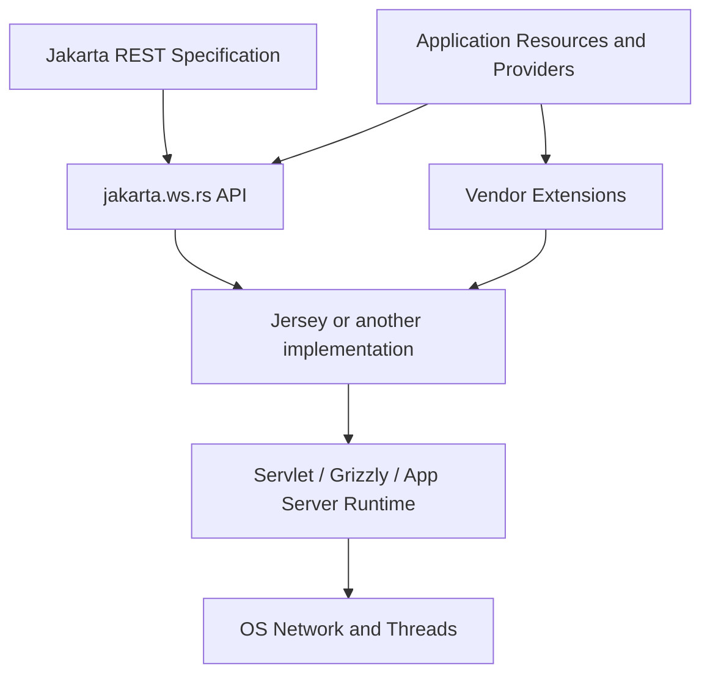
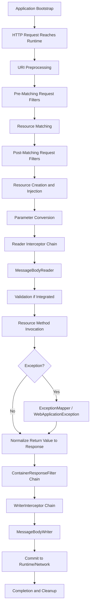
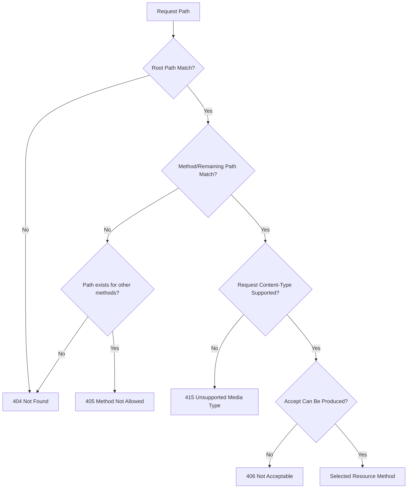
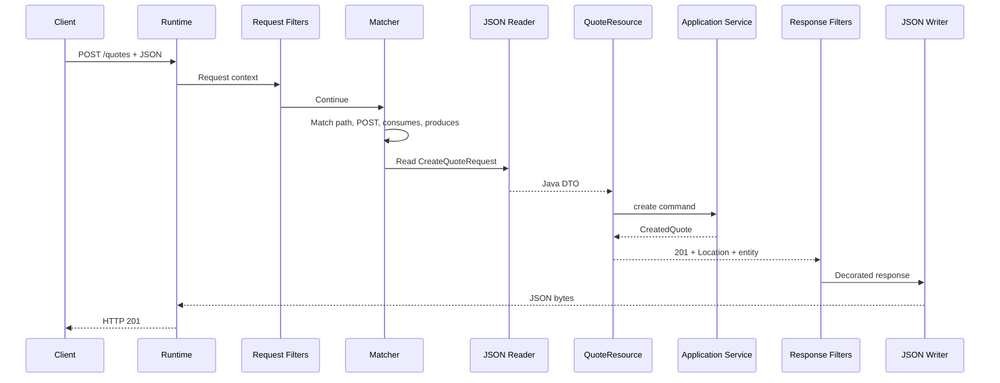

# Part 004 — Jakarta RESTful Web Services Mental Model and Request Lifecycle

> Tujuan part ini adalah membangun **pipeline mental yang dapat digunakan saat membaca code, stack trace, trace span, access log, atau production incident**. Ketika endpoint gagal, senior engineer harus dapat menentukan apakah failure terjadi sebelum Jakarta REST, saat matching, saat parameter conversion, saat entity reading, saat dependency injection, dalam resource method, saat exception mapping, atau ketika response sudah mulai dikirim.

## Daftar Isi

1. [Target kompetensi](#target-kompetensi)
2. [Boundary: apa yang distandarkan Jakarta REST](#boundary-apa-yang-distandarkan-jakarta-rest)
3. [Terminologi inti](#terminologi-inti)
4. [Lifecycle tingkat tinggi](#lifecycle-tingkat-tinggi)
5. [Phase 0 — application bootstrap](#phase-0--application-bootstrap)
6. [Phase 1 — network dan runtime ingress](#phase-1--network-dan-runtime-ingress)
7. [Phase 2 — URI preprocessing](#phase-2--uri-preprocessing)
8. [Phase 3 — pre-matching request filters](#phase-3--pre-matching-request-filters)
9. [Phase 4 — resource matching](#phase-4--resource-matching)
10. [Phase 5 — post-matching filters dan binding](#phase-5--post-matching-filters-dan-binding)
11. [Phase 6 — resource instantiation dan dependency injection](#phase-6--resource-instantiation-dan-dependency-injection)
12. [Phase 7 — parameter extraction dan conversion](#phase-7--parameter-extraction-dan-conversion)
13. [Phase 8 — request entity reading](#phase-8--request-entity-reading)
14. [Phase 9 — validation boundary](#phase-9--validation-boundary)
15. [Phase 10 — resource method invocation](#phase-10--resource-method-invocation)
16. [Phase 11 — exception mapping](#phase-11--exception-mapping)
17. [Phase 12 — response normalization](#phase-12--response-normalization)
18. [Phase 13 — response filters, writer interceptors, dan serialization](#phase-13--response-filters-writer-interceptors-dan-serialization)
19. [Phase 14 — response commit dan completion](#phase-14--response-commit-dan-completion)
20. [Automatic HEAD dan OPTIONS](#automatic-head-dan-options)
21. [Abort versus throw](#abort-versus-throw)
22. [Synchronous versus asynchronous lifecycle](#synchronous-versus-asynchronous-lifecycle)
23. [Resource dan provider lifecycle](#resource-dan-provider-lifecycle)
24. [Request context dan concurrency](#request-context-dan-concurrency)
25. [Sub-resource locator lifecycle](#sub-resource-locator-lifecycle)
26. [Standard versus Jersey/runtime-specific behavior](#standard-versus-jerseyruntime-specific-behavior)
27. [End-to-end example](#end-to-end-example)
28. [Failure-model matrix](#failure-model-matrix)
29. [Debugging playbook](#debugging-playbook)
30. [PR review checklist](#pr-review-checklist)
31. [Trade-off yang harus dipahami senior engineer](#trade-off-yang-harus-dipahami-senior-engineer)
32. [Internal verification checklist](#internal-verification-checklist)
33. [Latihan verifikasi](#latihan-verifikasi)
34. [Ringkasan](#ringkasan)
35. [Referensi resmi](#referensi-resmi)

---

## Target kompetensi

Setelah menyelesaikan part ini, Anda harus mampu:

- menggambar lifecycle request Jakarta REST dari ingress sampai response completion;
- membedakan behavior yang dijamin specification dari behavior Jersey, Servlet, GlassFish, Grizzly, Tomcat, Jetty, gateway, atau DI container;
- menentukan tahap yang menghasilkan `404`, `405`, `406`, `415`, `400`, atau `500`;
- menjelaskan perbedaan pre-matching filter, post-matching filter, reader interceptor, writer interceptor, message-body provider, dan exception mapper;
- memahami kapan resource dibuat, dependency diinjeksikan, parameter dikonversi, entity dibaca, dan method dipanggil;
- memahami bahwa provider umumnya shared dan harus aman untuk concurrent calls;
- mengenali commit point: setelah response committed, exception tidak dapat lagi diubah menjadi clean error response;
- mendiagnosis endpoint yang "tidak pernah masuk method" tanpa langsung menyimpulkan routing error;
- mereview resource class berdasarkan lifecycle, context safety, failure mapping, dan response semantics.

---

## Boundary: apa yang distandarkan Jakarta REST

Jakarta RESTful Web Services mendefinisikan programming model dan contract untuk:

- resource classes dan resource methods;
- request matching;
- parameter extraction/conversion;
- representation mapping;
- filters dan entity interceptors;
- exception mapping;
- context injection;
- client API;
- asynchronous processing;
- content negotiation;
- integration points tertentu dengan Jakarta technologies.

Jakarta REST **tidak dengan sendirinya menentukan**:

- siapa membuka TCP socket;
- HTTP server implementation;
- TLS termination;
- connector thread pool;
- Servlet container configuration;
- gateway retry;
- load balancer timeout;
- DI implementation seperti HK2 atau CDI;
- exact package-scanning mechanism;
- Jersey monitoring internals;
- Kubernetes pod lifecycle;
- cloud ingress behavior.

Gunakan model:

```text
HTTP Semantics
    ↓
Network/Container Runtime
    ↓
Jakarta REST Implementation
    ↓
Application Resource Model
    ↓
Domain/Application Logic
```

### Contract versus mechanism



Ketika menemukan `@Path`, yang dapat disimpulkan hanya bahwa code menggunakan Jakarta REST API. Anda belum dapat menyimpulkan implementation atau HTTP runtime.

---

## Terminologi inti

## Root resource class

Class dengan `@Path` pada class level yang dapat menjadi entry point matching.

```java
@Path("/quotes")
public class QuoteResource {
}
```

## Resource method

Public method dengan HTTP method designator seperti `@GET`, `@POST`, atau custom annotation yang meta-annotated `@HttpMethod`.

## Sub-resource method

Method dengan `@Path` dan HTTP method designator.

```java
@GET
@Path("/{quoteId}")
public QuoteView get(@PathParam("quoteId") String quoteId) {
    // ...
}
```

## Sub-resource locator

Method dengan `@Path` tetapi tanpa HTTP method designator. Ia mengembalikan object/class yang akan digunakan untuk matching lanjutan.

```java
@Path("/{quoteId}/items")
public QuoteItemResource items(@PathParam("quoteId") String quoteId) {
    return new QuoteItemResource(quoteId);
}
```

## Provider

Extension component untuk cross-cutting atau representation processing, misalnya:

- `MessageBodyReader`;
- `MessageBodyWriter`;
- `ContainerRequestFilter`;
- `ContainerResponseFilter`;
- `ReaderInterceptor`;
- `WriterInterceptor`;
- `ExceptionMapper`;
- `ParamConverterProvider`;
- `ContextResolver`.

## Entity

Java object atau byte content yang menjadi request/response body.

## Context

Request/runtime information yang disediakan melalui `@Context`, misalnya `UriInfo`, `HttpHeaders`, `Request`, `SecurityContext`, `ResourceInfo`, atau `Providers` sesuai component dan phase.

## Application

Konfigurasi portable Jakarta REST melalui subclass `jakarta.ws.rs.core.Application`. Jersey juga memiliki `ResourceConfig`, yang merupakan extension implementation-specific.

---

## Lifecycle tingkat tinggi



Diagram ini adalah mental model. Exact internal call stack, object construction, thread changes, dan telemetry hooks bergantung implementation/runtime.

### Empat pertanyaan diagnosis

Untuk setiap failure, tanyakan:

1. **Apakah request mencapai application runtime?**
2. **Apakah resource method berhasil dipilih?**
3. **Apakah Java arguments berhasil dibentuk?**
4. **Apakah response belum atau sudah committed ketika failure terjadi?**

---

## Phase 0 — application bootstrap

Sebelum request pertama, runtime perlu membangun application model.

Kemungkinan aktivitas:

- menemukan `Application` subclass;
- membaca application path;
- mendaftarkan resource classes;
- mendaftarkan providers;
- memproses package scanning;
- menjalankan `Feature`/`DynamicFeature`;
- membuat provider instances;
- memvalidasi resource model;
- membangun dependency bindings;
- menginisialisasi serializers;
- membuka HTTP listener atau mendaftarkan servlet;
- mempublikasikan readiness.

### Bootstrap bukan request lifecycle

Banyak error terjadi sebelum traffic diterima:

- ambiguous resource method;
- missing provider dependency;
- duplicate binding;
- unsupported injection;
- incompatible API/implementation version;
- serializer initialization failure;
- invalid server property.

Jika pod restart terus tanpa access log, fokus pada bootstrap, bukan endpoint logic.

### Portable bootstrap

```java
@ApplicationPath("/api")
public class QuoteOrderApplication extends Application {
    @Override
    public Set<Class<?>> getClasses() {
        return Set.of(
                QuoteResource.class,
                ApiExceptionMapper.class,
                CorrelationFilter.class
        );
    }
}
```

### Jersey-specific bootstrap

```java
public final class QuoteOrderResourceConfig
        extends org.glassfish.jersey.server.ResourceConfig {

    public QuoteOrderResourceConfig() {
        register(QuoteResource.class);
        register(ApiExceptionMapper.class);
        packages("com.example.quote.api");
        property("example.property", "value");
    }
}
```

`ResourceConfig` bukan Jakarta REST standard. Detailed behavior akan dibahas pada Part 007 dan Jersey lifecycle pada Part 009.

### Bootstrap invariant

```text
Runtime ready
only if
resource model valid
AND required dependencies initialized
AND listener/servlet registered
AND mandatory configuration valid
```

Jangan menyatakan ready hanya karena JVM process hidup.

---

## Phase 1 — network dan runtime ingress

Sebelum Jakarta REST pipeline, request dapat melewati:

```text
DNS
-> load balancer
-> WAF/API gateway
-> ingress/service mesh
-> HTTP connector
-> Servlet filters or Grizzly handlers
-> Jakarta REST implementation
```

Stage ini dapat menghasilkan:

- TLS handshake failure;
- DNS/routing failure;
- `413 Payload Too Large`;
- gateway authentication rejection;
- CORS response;
- rate limit;
- request timeout;
- malformed HTTP rejection;
- incorrect context path;
- Servlet filter abort.

### Key distinction

Tidak ada JAX-RS trace/span atau resource log **tidak membuktikan** application down. Request mungkin ditolak di edge/runtime sebelum masuk JAX-RS.

### Runtime request object

Implementation mengadaptasi request dari underlying runtime menjadi Jakarta REST request context. Exact adapter berbeda:

- Servlet request/response;
- Grizzly request;
- application-server internal request;
- embedded server abstraction.

Jakarta REST application seharusnya tidak bergantung pada underlying object kecuali portability sengaja dikorbankan.

---

## Phase 2 — URI preprocessing

Runtime menentukan request URI dalam konteks:

```text
base URI
+ application path
+ request path
+ query string
```

Contoh:

```text
External URI:
https://api.example.com/quote-order/api/quotes/Q-123?expand=items

Possible layers:
reverse proxy prefix  = /quote-order
application path      = /api
resource path         = /quotes/Q-123
query                  = expand=items
```

### Proxy awareness

Application dapat melihat scheme, host, port, atau prefix berbeda jika:

- TLS berakhir di load balancer;
- gateway melakukan path rewrite;
- forwarded headers tidak dipercaya/dikonfigurasi;
- context path berbeda antar-environment.

Konsekuensi:

- generated `Location` salah;
- callback URI salah;
- absolute links menunjuk internal host;
- audit mencatat wrong client address/scheme.

Ownership forwarded headers biasanya runtime/gateway concern, bukan core JAX-RS semantics.

### URI decoding risks

Perhatikan:

- percent encoding;
- encoded slash;
- path normalization;
- duplicate slashes;
- case sensitivity;
- semicolon/matrix parameters;
- double decoding;
- proxy/runtime normalization mismatch.

Security policy harus konsisten di semua hop untuk menghindari path confusion.

---

## Phase 3 — pre-matching request filters

`ContainerRequestFilter` dengan `@PreMatching` berjalan sebelum resource method dipilih.

```java
@Provider
@PreMatching
@Priority(Priorities.AUTHENTICATION)
public final class RequestNormalizationFilter
        implements ContainerRequestFilter {

    @Override
    public void filter(ContainerRequestContext context) {
        // Use carefully: URI/method changes alter matching outcome.
    }
}
```

### Kemampuan

Pre-matching filter dapat, sesuai API dan phase availability:

- membaca headers;
- menambah request-scoped properties;
- mengubah URI;
- mengubah HTTP method;
- abort request;
- melakukan early authentication/normalization.

### Bahaya

Mengubah method atau URI menciptakan hidden routing behavior:

```text
Observed request: POST /legacy/submit
Matched resource: PUT /quotes/Q-123
```

Hal ini menyulitkan:

- access-log interpretation;
- security policy;
- API documentation;
- generated clients;
- gateway caching;
- incident diagnosis.

### `ResourceInfo` belum tersedia

Karena matching belum terjadi, filter tidak boleh mengandalkan selected resource method. Authentication yang membutuhkan method-level annotation biasanya lebih tepat pada post-matching filter atau dedicated security integration.

### Abort

```java
context.abortWith(
        Response.status(Response.Status.UNAUTHORIZED)
                .entity(new ErrorResponse("AUTH_REQUIRED"))
                .build()
);
```

Ketika request di-abort, resource matching/invocation tidak dilanjutkan. Response pipeline yang relevan tetap dapat berjalan.

---

## Phase 4 — resource matching

Matching bukan sekadar mencari string `@Path` yang sama.

Secara konseptual runtime mempertimbangkan:

1. base/application path;
2. root resource class path templates;
3. remaining path;
4. sub-resource paths atau locators;
5. HTTP request method;
6. request media type terhadap `@Consumes`;
7. acceptable response media types terhadap `@Produces`;
8. specificity dan quality rules.

### Simplified decision tree



Ini penyederhanaan untuk diagnosis; actual algorithm ditentukan specification dan implementation model.

### Path specificity

```java
@Path("/quotes")
public class QuoteResource {

    @GET
    @Path("/latest")
    public QuoteView latest() { ... }

    @GET
    @Path("/{quoteId}")
    public QuoteView byId(@PathParam("quoteId") String id) { ... }
}
```

Literal path biasanya lebih spesifik daripada template variable. Namun overlapping regular expressions atau duplicate annotations dapat menghasilkan ambiguity.

### Regex path parameters

```java
@GET
@Path("/{quoteId: Q-[0-9]+}")
public QuoteView byId(@PathParam("quoteId") String id) { ... }
```

Gunakan regex untuk routing constraints yang benar-benar stabil. Jangan memindahkan business validation kompleks ke URI regex.

### Matching outcomes

- tidak ada path candidate -> umumnya `404`;
- path ada tetapi method tidak didukung -> `405` dan `Allow`;
- request media type tidak dapat dikonsumsi -> `415`;
- no acceptable producible representation -> `406`;
- ambiguity -> startup warning/error atau implementation-dependent resolution, tergantung kasus.

### Hidden matching changes

Perubahan berikut dapat mengubah selected method tanpa mengubah path:

- menambah `@Produces`;
- menambah `@Consumes`;
- menambah overload resource method;
- registration provider/custom method designator;
- pre-matching filter mengubah method/URI;
- class/method annotation inheritance.

Karena itu matching perlu contract tests.

---

## Phase 5 — post-matching filters dan binding

Request filters tanpa `@PreMatching` berjalan setelah resource method terpilih.

Mereka dapat menggunakan resource metadata seperti `ResourceInfo`.

```java
@Provider
@Priority(Priorities.AUTHORIZATION)
public final class AuthorizationFilter
        implements ContainerRequestFilter {

    @Context
    private ResourceInfo resourceInfo;

    @Override
    public void filter(ContainerRequestContext context) {
        Method method = resourceInfo.getResourceMethod();
        Class<?> resourceClass = resourceInfo.getResourceClass();
        // Evaluate policy.
    }
}
```

### Binding models

## Global binding

Provider diterapkan secara global bila registered dan tidak dibatasi binding tertentu.

## Name binding

Custom annotation mengikat filter/interceptor ke resource class/method.

```java
@NameBinding
@Retention(RetentionPolicy.RUNTIME)
@Target({ElementType.TYPE, ElementType.METHOD})
public @interface Audited {
}
```

```java
@Provider
@Audited
public final class AuditFilter implements ContainerRequestFilter {
    // ...
}
```

```java
@POST
@Audited
public Response submitQuote(...) {
    // ...
}
```

## Dynamic binding

`DynamicFeature` dapat mendaftarkan provider berdasarkan resource metadata saat application configuration/model setup.

### Ordering

Filters dikelompokkan dalam chains dan diurutkan berdasarkan priority. Nilai priority lebih kecil umumnya memiliki precedence lebih tinggi. Jangan mengandalkan incidental classpath discovery order.

### Security caution

Authorization filter yang hanya mengandalkan annotations dapat gagal jika:

- annotation ditempatkan pada interface tetapi inheritance behavior berbeda;
- sub-resource method tidak terkena binding yang diharapkan;
- resource didaftarkan melalui proxy/generated subclass;
- method tidak memiliki annotation dan default menjadi allow;
- preflight/automatic methods melewati policy yang tidak diuji.

Default-deny harus dibuktikan dengan tests.

---

## Phase 6 — resource instantiation dan dependency injection

Default Jakarta REST resource lifecycle adalah **per request**. Artinya runtime biasanya membuat root resource instance untuk request yang terpilih.

Namun lifecycle dapat berubah karena:

- instance didaftarkan sebagai singleton;
- implementation-specific scope;
- HK2/CDI integration;
- application server component model;
- sub-resource locator mengembalikan object sendiri.

### Default per-request mental model

```text
request arrives
-> select resource class/method
-> create resource instance
-> inject fields/properties/context
-> invoke method
-> instance no longer retained by runtime after request
```

### Constructor selection

Portable resource class perlu public constructor yang dapat dipenuhi runtime. Bila beberapa suitable constructors tersedia, selection rules dan warning ambiguity harus dipahami.

```java
@Path("/quotes")
public class QuoteResource {
    public QuoteResource() {
    }
}
```

Dependency-injected constructors dengan `@Inject` melibatkan HK2/CDI/container behavior dan bukan hanya core JAX-RS constructor rules.

### Field injection risk

```java
@Path("/quotes")
public class QuoteResource {

    @PathParam("quoteId")
    private String quoteId;
}
```

Request parameter injection pada fields/properties secara portable terkait default per-request lifecycle. Pada singleton, satu field dapat diakses concurrent dan request values tidak aman.

Lebih baik method parameter untuk request data:

```java
@GET
@Path("/{quoteId}")
public QuoteView get(@PathParam("quoteId") String quoteId) {
    // ...
}
```

### Resource ownership

Resource class seharusnya tidak membuat heavyweight shared resources per request:

```java
// Anti-pattern
public QuoteResource() {
    this.httpClient = ClientBuilder.newClient();
}
```

Ini dapat membuat connection pool per request dan resource leak. Shared client/pool harus dimiliki application lifecycle dan diinjeksikan.

---

## Phase 7 — parameter extraction dan conversion

Parameter dapat berasal dari:

- path;
- query;
- header;
- cookie;
- matrix parameter;
- form;
- context;
- entity body.

Contoh:

```java
@GET
@Path("/{quoteId}")
public QuoteView get(
        @PathParam("quoteId") QuoteId quoteId,
        @QueryParam("expand") @DefaultValue("none") String expand,
        @HeaderParam("If-None-Match") String ifNoneMatch,
        @Context SecurityContext securityContext) {
    // ...
}
```

### Conversion options

Untuk non-entity string parameters, runtime dapat menggunakan:

- registered `ParamConverter`;
- primitive/wrapper conversion;
- constructor dari `String`;
- static `valueOf(String)` atau `fromString(String)` sesuai supported rules;
- collection types seperti `List<T>` atau `Set<T>` sesuai API contract.

### Value object conversion

```java
public record QuoteId(String value) {
    public QuoteId {
        if (value == null || !value.matches("Q-[0-9]+")) {
            throw new IllegalArgumentException("Invalid quote ID");
        }
    }

    public static QuoteId fromString(String raw) {
        return new QuoteId(raw);
    }
}
```

Trade-off:

- value object memperkuat type safety;
- conversion exception mapping harus konsisten;
- constructor tidak boleh melakukan database/network I/O;
- format parsing harus murah dan deterministic.

### Missing versus invalid

Bedakan:

```text
missing optional query parameter
missing required business input
empty string
malformed format
well-formed tetapi unknown resource ID
```

Mereka dapat menghasilkan behavior berbeda:

- default/empty optional;
- validation error;
- conversion `400`;
- domain `404`;
- domain `422`/`409` sesuai standard internal.

### `@BeanParam`

Mengelompokkan multiple non-entity parameters:

```java
public class QuoteSearchParameters {
    @QueryParam("status")
    public String status;

    @QueryParam("limit")
    @DefaultValue("50")
    public int limit;
}
```

Perhatikan lifecycle, mutability, validation, defaults, dan generated documentation.

---

## Phase 8 — request entity reading

Request entity bytes perlu diubah menjadi Java object.

```text
HTTP content bytes
-> optional ReaderInterceptor chain
-> selected MessageBodyReader
-> Java entity object
```

### Provider selection inputs

Selection mempertimbangkan antara lain:

- declared Java type;
- generic type;
- annotations;
- request media type;
- provider priority/specificity;
- registered application provider versus built-in provider.

### Resource method entity parameter

```java
@POST
@Consumes(MediaType.APPLICATION_JSON)
public Response create(CreateQuoteRequest request) {
    // request dibentuk oleh selected MessageBodyReader
}
```

Umumnya satu unannotated parameter berperan sebagai entity parameter. Request metadata parameters menggunakan annotations/context.

### Reader interceptor

```java
@Provider
@Priority(Priorities.ENTITY_CODER)
public final class DigestReaderInterceptor implements ReaderInterceptor {
    @Override
    public Object aroundReadFrom(ReaderInterceptorContext context)
            throws IOException, WebApplicationException {
        // Wrap/inspect input stream carefully.
        return context.proceed();
    }
}
```

Interceptor wajib memanggil `proceed()` untuk melanjutkan chain kecuali sengaja menggantikan hasil.

### MessageBodyReader

Custom reader cocok ketika wire format atau mapping membutuhkan control khusus.

```java
@Provider
@Consumes("application/vnd.example.quote+json")
public final class QuoteReader implements MessageBodyReader<CreateQuoteRequest> {
    // isReadable(...)
    // readFrom(...)
}
```

### Failure modes

- malformed JSON/XML;
- media type tidak cocok;
- no reader found;
- input stream dibaca lebih dulu oleh Servlet/JAX-RS filter;
- request body terlalu besar;
- decompression failure;
- character encoding mismatch;
- reader tidak thread-safe;
- reader menutup stream yang bukan miliknya;
- custom reader menyembunyikan parse location.

### One-shot stream

Request input stream umumnya one-shot. Logging filter yang membaca body harus buffering/wrapping secara benar, dengan size limit dan redaction. Jangan membaca raw body dua kali tanpa replayable wrapper.

---

## Phase 9 — validation boundary

Jika Jakarta Validation integration aktif, request/resource constraints dapat dievaluasi pada defined lifecycle points.

Konsep detail dibahas pada Part 021. Untuk mental model saat ini, bedakan:

```text
Conversion validation
  raw text -> Java type

Structural/API validation
  Java DTO fields/constraints

Domain validation
  aggregate state dan business invariants

Persistence validation
  database constraints
```

Failure pada masing-masing boundary perlu error taxonomy berbeda.

### Jangan menaruh domain lookup dalam constraint validator

Validator yang memanggil database/network dapat:

- membuat validation order memengaruhi performance;
- menghasilkan N+1 calls;
- sulit ditransaksikan;
- membuat error handling ambigu;
- sulit diuji dan diobservasi.

Domain invariant biasanya lebih tepat di application/domain service.

---

## Phase 10 — resource method invocation

Setelah arguments siap, runtime memanggil selected public resource method.

```java
@POST
@Path("/{quoteId}/submission")
public Response submit(
        @PathParam("quoteId") QuoteId quoteId,
        SubmitQuoteRequest request,
        @Context SecurityContext securityContext) {

    Actor actor = Actor.from(securityContext);
    SubmissionResult result = applicationService.submit(quoteId, actor, request);

    return Response.accepted(result.statusUri())
            .entity(result.view())
            .build();
}
```

### Resource method sebagai boundary adapter

Idealnya resource method:

- menerjemahkan HTTP input ke application command/query;
- tidak menyimpan state request pada singleton field;
- tidak membuka transaction tanpa ownership jelas;
- tidak menjalankan unbounded blocking work;
- tidak mengimplementasikan seluruh domain logic;
- menerjemahkan result ke HTTP response contract.

### Invocation failure categories

- invalid domain transition;
- authorization failure;
- dependency timeout;
- database conflict/deadlock;
- downstream protocol error;
- cancellation/interruption;
- programming bug;
- resource exhaustion.

Jangan map semuanya ke generic `500` tanpa typed taxonomy dan telemetry.

---

## Phase 11 — exception mapping

Ketika resource/provider melempar exception sebelum response committed, runtime mencoba menghasilkan response sesuai rules.

### `WebApplicationException`

Exception ini dapat membawa `Response`.

```java
throw new NotFoundException("Quote not found");
```

Keuntungan:

- mapping cepat pada boundary sederhana.

Risiko:

- HTTP types bocor ke domain/application layer;
- error envelope tidak konsisten;
- stack trace/noise behavior tidak terkontrol;
- developers melempar status tanpa centralized policy.

### `ExceptionMapper`

```java
@Provider
@Priority(Priorities.USER)
public final class QuoteStateConflictMapper
        implements ExceptionMapper<QuoteStateConflictException> {

    @Override
    public Response toResponse(QuoteStateConflictException exception) {
        ApiError error = ApiError.conflict(
                "QUOTE_STATE_CONFLICT",
                exception.getMessage()
        );
        return Response.status(Response.Status.CONFLICT)
                .type(MediaType.APPLICATION_JSON_TYPE)
                .entity(error)
                .build();
    }
}
```

Runtime memilih mapper berdasarkan nearest applicable exception type dan priority rules.

### Mapper failure

Jika exception mapper sendiri gagal, runtime harus menghindari mapping loop. Jangan melakukan risky I/O atau complex business logic dalam mapper.

### Preserve root cause

Error response dapat menyederhanakan external contract, tetapi logs/traces internal perlu mempertahankan:

- root exception class;
- cause chain;
- operation;
- request/tenant context setelah redaction;
- dependency status;
- whether response committed;
- retry classification.

### Provider exception

Exception dapat berasal dari filter, reader, writer, atau interceptor. Mapping hanya memungkinkan jika response belum committed dan pipeline state memungkinkan.

---

## Phase 12 — response normalization

Resource method dapat mengembalikan:

- `Response`;
- entity object;
- primitive/string;
- `void`;
- asynchronous types sesuai supported API/integration.

Runtime mengubah return value menjadi response model.

### Explicit `Response`

```java
return Response.status(Response.Status.CREATED)
        .location(location)
        .entity(view)
        .build();
```

Kelebihan:

- status dan headers eksplisit.

Risiko:

- boilerplate;
- conventions mudah tersebar;
- type-level API documentation bisa kurang kuat jika semua return `Response`.

### Direct entity

```java
@GET
public QuoteView get() {
    return queryService.get(...);
}
```

Kelebihan:

- concise;
- typed return.

Risiko:

- status/header control terbatas;
- null behavior perlu dipahami;
- ETag/cache/location tidak terlihat.

### `GenericEntity`

Generic collection type dapat memerlukan preservation runtime generic type:

```java
List<QuoteView> quotes = queryService.list();
GenericEntity<List<QuoteView>> entity = new GenericEntity<>(quotes) {};
return Response.ok(entity).build();
```

Tanpa generic type information, provider selection/serialization tertentu dapat kehilangan element type.

### Response invariant

Sebelum serialization:

```text
status selected
headers validated
entity type known
media type selected
response not committed
```

---

## Phase 13 — response filters, writer interceptors, dan serialization

Response pipeline secara konseptual:

```text
Response model
-> ContainerResponseFilter chain
-> WriterInterceptor chain
-> MessageBodyWriter
-> output bytes
```

## Container response filter

Dapat mengubah:

- headers;
- status/entity metadata sesuai context capabilities;
- CORS headers;
- correlation headers;
- cache metadata;
- security headers.

```java
@Provider
public final class CorrelationResponseFilter
        implements ContainerResponseFilter {

    @Override
    public void filter(
            ContainerRequestContext request,
            ContainerResponseContext response) {

        Object correlationId = request.getProperty("correlationId");
        if (correlationId != null) {
            response.getHeaders().putSingle(
                    "X-Correlation-ID",
                    correlationId.toString()
            );
        }
    }
}
```

### Response filter ordering

Response filter chain menggunakan priority-defined ordering; specification menjelaskan reverse ordering relationship untuk response filters. Jangan menebak actual sequence dari class names. Buat test atau startup inventory bila ordering penting.

## Writer interceptor

Writer interceptor membungkus call ke `MessageBodyWriter`.

Use cases:

- digest;
- encryption/signing layer tertentu;
- compression jika memang application-owned;
- instrumentation bytes;
- envelope transformation.

Risiko:

- buffering seluruh response;
- double compression;
- failure setelah headers/status siap;
- stream close ownership salah;
- content length menjadi tidak valid.

## MessageBodyWriter

Writer dipilih berdasarkan:

- runtime Java type;
- declared/generic type;
- annotations;
- selected media type;
- provider resolution rules.

Failure umum:

- no writer found;
- serializer recursion;
- lazy-loaded entity failure;
- invalid JSON property;
- output stream reset;
- client disconnect;
- response terlalu besar;
- writer bukan thread-safe.

### Serialization terjadi setelah resource method return

Resource method berhasil belum berarti response berhasil. Trace perlu memisahkan:

```text
method invocation duration
serialization duration
network write duration
```

Contoh: resource method mengembalikan JPA lazy proxy. Transaction sudah ditutup, lalu serializer mengakses lazy relation dan gagal. Root cause terlihat setelah method selesai.

---

## Phase 14 — response commit dan completion

Response committed ketika status/headers dan/atau content sudah dikirim ke underlying runtime sehingga clean replacement response tidak lagi memungkinkan.

### Before commit

Failure masih mungkin dipetakan menjadi structured response.

### After commit

Failure dapat menghasilkan:

- truncated body;
- connection reset;
- partial JSON;
- incomplete file;
- client-side parse error;
- server log tanpa valid HTTP error body.

### Commit timing bergantung runtime

Dipengaruhi oleh:

- output buffer size;
- streaming;
- explicit flush;
- content length;
- Servlet/container behavior;
- proxy buffering;
- HTTP version.

### Completion bukan selalu delivery acknowledgement

Application mengetahui bytes diserahkan ke runtime, tetapi belum tentu mengetahui client memproses response. Karena itu jangan menganggap successful return berarti business consumer menerima hasil.

### Cleanup

Request completion dapat memicu:

- request-scope disposal;
- MDC/context cleanup;
- async callbacks;
- access-log finalization;
- metrics recording;
- stream close;
- transaction cleanup jika integrated.

Resource cleanup harus deterministic dan tidak hanya mengandalkan garbage collection.

---

## Automatic HEAD dan OPTIONS

Jakarta REST memberi support khusus.

## HEAD

Jika explicit `@HEAD` tidak tersedia, implementation dapat/mesti menggunakan matching GET method dan membuang returned entity sesuai specification behavior.

Konsekuensi:

- expensive entity creation dapat tetap terjadi;
- database query dan mapping cost sama dengan GET;
- writer/content-length calculation behavior perlu diuji;
- authorization harus konsisten dengan GET.

Buat explicit `@HEAD` jika metadata dapat dihitung lebih murah dan semantics penting.

## OPTIONS

Jika explicit `@OPTIONS` tidak tersedia, runtime dapat menghasilkan automatic response berdasarkan resource metadata, termasuk allowed methods.

Konsekuensi:

- CORS preflight dapat berinteraksi dengan automatic OPTIONS;
- auth filter dapat memblokir sebelum automatic response;
- gateway dapat menangani OPTIONS tanpa application;
- method inventory dapat berbeda jika custom method annotations digunakan.

Verifikasi end-to-end, bukan hanya unit test resource.

---

## Abort versus throw

## `abortWith`

Digunakan pada request filter untuk menghentikan request processing dan menyediakan response.

Cocok untuk:

- failed authentication;
- failed authorization;
- maintenance gate;
- request precondition yang dievaluasi filter;
- rate limit pada application layer.

## Throw exception

Cocok ketika:

- failure mengikuti exception taxonomy;
- centralized `ExceptionMapper` diperlukan;
- call stack perlu dihentikan dari deeper layer.

### Trade-off

`abortWith` membuat response langsung tetapi dapat menduplikasi error-envelope logic. Throwing typed exception memberi centralized mapping tetapi jangan gunakan exception untuk normal high-volume branching tanpa pertimbangan cost dan clarity.

### Response pipeline

Baik aborted response maupun mapped exception response masih dapat melalui response filters dan entity writers sesuai pipeline state. Karena itu response filter harus aman terhadap response yang tidak berasal dari resource method.

---

## Synchronous versus asynchronous lifecycle

Default mental model synchronous:

```text
request thread
-> filters
-> method
-> serialize
-> return/complete
```

Asynchronous server processing menggunakan `AsyncResponse`/`@Suspended` atau implementation integration lain.

```java
@GET
@Path("/{quoteId}")
public void getAsync(
        @PathParam("quoteId") String quoteId,
        @Suspended AsyncResponse asyncResponse) {

    executor.execute(() -> {
        try {
            asyncResponse.resume(queryService.get(quoteId));
        } catch (Throwable failure) {
            asyncResponse.resume(failure);
        }
    });
}
```

### Async does not make work non-blocking

Jika executor task melakukan blocking JDBC, thread tetap diblokir—hanya thread-nya berbeda.

### Async lifecycle questions

- siapa memiliki executor?
- queue bounded atau tidak?
- timeout siapa yang lebih pendek: gateway, server, async response, downstream?
- apa yang terjadi ketika client disconnect?
- apakah context/MDC/security principal dipropagasikan?
- siapa membatalkan downstream work?
- apa behavior double `resume`?
- apakah request-scope dependencies masih valid?

Detailed threading/cancellation dibahas pada Part 017.

---

## Resource dan provider lifecycle

## Resource classes

Default lifecycle: per request.

Implication:

- request fields lebih mudah diisolasi;
- construction cost terjadi per request;
- heavyweight dependency harus shared/injected;
- implementation/DI dapat menawarkan lifecycle lain.

## Singleton resource

Jika satu instance digunakan untuk banyak requests:

- fields harus immutable atau synchronized;
- request-specific injection ke field berbahaya/tidak portable;
- local caches perlu concurrency dan eviction policy;
- one request must not mutate another request's context.

## Providers

Default provider lifecycle umumnya satu instance per JAX-RS application. Provider methods dapat dipanggil multiple times dan secara concurrent.

Karena itu provider harus diasumsikan shared:

```java
@Provider
public final class UnsafeDateWriter implements MessageBodyWriter<Object> {
    // Anti-pattern if formatter is mutable and not thread-safe.
}
```

Gunakan immutable/thread-safe collaborators.

### Implementation-specific scopes

HK2/CDI dapat menambah:

- singleton/application scope;
- request scope;
- per-lookup/dependent scope;
- proxy;
- custom scope.

Jangan menyimpulkan lifecycle dari annotation name saja; buktikan container yang memprosesnya.

---

## Request context dan concurrency

Context types seperti `UriInfo`, `HttpHeaders`, dan `SecurityContext` membawa request-specific information.

Pada shared providers/resources, runtime dapat menyuntikkan proxy yang memilih current request context.

### Thread-local proxy risk

Implementation sering menggunakan thread-associated context/proxy. Jika work berpindah executor tanpa context propagation:

- injected proxy dapat gagal;
- wrong/empty context terlihat;
- MDC hilang;
- security identity tidak tersedia;
- request sudah selesai tetapi async task masih mengakses context.

### Safe rule

Untuk async/background work, capture hanya immutable values yang dibutuhkan:

```java
String correlationId = correlationIds.current();
String tenantId = tenantContext.requiredTenantId();
Actor actor = actorResolver.currentActor();
```

Lalu propagate secara eksplisit melalui command/context object. Jangan menyimpan full request context object untuk dipakai setelah request selesai.

### Provider concurrency invariant

```text
provider field
must be immutable
OR thread-safe
OR request-scoped by proven container semantics
```

---

## Sub-resource locator lifecycle

Sub-resource locator melanjutkan routing secara dinamis.

```java
@Path("/quotes")
public class QuoteRootResource {

    @Path("/{quoteId}")
    public QuoteResource locate(@PathParam("quoteId") String quoteId) {
        return new QuoteResource(new QuoteId(quoteId));
    }
}
```

### Important ownership rule

Object yang dibuat manual oleh application tidak otomatis memperoleh injection/lifecycle processing yang sama dengan runtime-created object.

```java
return new QuoteResource(id);
```

Kemungkinan konsekuensi:

- `@Context` fields tidak diinisialisasi;
- HK2/CDI injection tidak terjadi;
- `@PostConstruct` tidak dipanggil;
- interceptors/proxies tidak diterapkan.

Portable support dapat menggunakan `ResourceContext` untuk initialization dalam default per-request scope:

```java
@Context
ResourceContext resourceContext;

@Path("/{quoteId}")
public QuoteResource locate(@PathParam("quoteId") String quoteId) {
    return resourceContext.initResource(new QuoteResource(quoteId));
}
```

Namun constructor-provided domain identifier dan DI lifecycle tetap perlu desain jelas.

### When to use

Sub-resource locator berguna untuk hierarchical resources dan dynamic routing, tetapi berlebihan jika hanya memecah file. Ia menambah complexity pada matching, injection, documentation, dan security binding.

---

## Standard versus Jersey/runtime-specific behavior

Gunakan tabel berikut saat membaca code:

| Concern | Jakarta REST standard | Jersey/runtime-specific or external |
|---|---|---|
| `@Path`, `@GET`, `@Consumes`, `@Produces` | Ya | implementation menjalankan |
| Matching algorithm | Ya | optimization/diagnostics internal berbeda |
| `Application` | Ya | deployment discovery berbeda |
| `ResourceConfig` | Tidak | Jersey-specific |
| `ContainerRequestFilter` | Ya | registration/scanning diagnostics berbeda |
| `MessageBodyReader/Writer` | Ya | bundled providers berbeda |
| `ExceptionMapper` | Ya | default/vendor mappers dapat berbeda |
| Default per-request resource lifecycle | Ya | alternate scopes vendor/DI-specific |
| Provider default shared lifecycle | Ya | alternate provider scopes dapat vendor-specific |
| HK2 injection | Tidak | Jersey/HK2-specific |
| CDI scopes/injection | Jakarta CDI standard | integration ke Jersey/runtime-specific |
| Servlet filter chain | Jakarta Servlet | di luar core Jakarta REST |
| Grizzly handlers/listeners | Tidak | Grizzly-specific |
| Connector thread pool | Tidak | server/runtime-specific |
| Gateway retry/CORS/cache | Tidak | platform-specific |
| Package scanning details | Tidak sepenuhnya portable | implementation/build-specific |
| Access logs | Tidak | runtime/proxy-specific |

### Rule

> Ketika debugging, jangan berhenti di level annotation. Ikuti actual implementation chain dan runtime ownership.

---

## End-to-end example

### Resource

```java
@Path("/quotes")
@Produces(MediaType.APPLICATION_JSON)
public final class QuoteResource {

    private final QuoteApplicationService service;

    public QuoteResource(QuoteApplicationService service) {
        this.service = service;
    }

    @POST
    @Consumes(MediaType.APPLICATION_JSON)
    public Response create(
            @HeaderParam("Idempotency-Key") String idempotencyKey,
            CreateQuoteRequest request,
            @Context UriInfo uriInfo) {

        CreatedQuote result = service.create(idempotencyKey, request);
        URI location = uriInfo.getAbsolutePathBuilder()
                .path(result.quoteId())
                .build();

        return Response.created(location)
                .entity(result.view())
                .tag(new EntityTag(result.version()))
                .build();
    }
}
```

### Filter

```java
@Provider
@Priority(Priorities.HEADER_DECORATOR)
public final class CorrelationFilter
        implements ContainerRequestFilter, ContainerResponseFilter {

    private static final String PROPERTY = "correlationId";

    @Override
    public void filter(ContainerRequestContext request) {
        String id = request.getHeaderString("X-Correlation-ID");
        if (id == null || id.isBlank()) {
            id = UUID.randomUUID().toString();
        }
        request.setProperty(PROPERTY, id);
    }

    @Override
    public void filter(
            ContainerRequestContext request,
            ContainerResponseContext response) {
        Object id = request.getProperty(PROPERTY);
        if (id != null) {
            response.getHeaders().putSingle("X-Correlation-ID", id);
        }
    }
}
```

### Exception mapper

```java
@Provider
public final class DuplicateIdempotencyKeyMapper
        implements ExceptionMapper<DuplicateIdempotencyKeyException> {

    @Override
    public Response toResponse(DuplicateIdempotencyKeyException exception) {
        return Response.status(Response.Status.CONFLICT)
                .type(MediaType.APPLICATION_JSON_TYPE)
                .entity(new ApiError(
                        "IDEMPOTENCY_KEY_REUSED",
                        "The idempotency key was used with a different request"
                ))
                .build();
    }
}
```

### Request trace



### Possible failure map

```text
Before matcher        -> auth/CORS/path rewrite failure
Matcher               -> 404/405/415/406
Parameter conversion  -> 400-style failure
JSON reader           -> malformed payload
Resource construction -> injection failure
Application service   -> domain/dependency failure
Exception mapper      -> mapping or mapper failure
Response filter       -> header/security error
JSON writer           -> serialization failure
After commit          -> truncated response/client disconnect
```

---

## Failure-model matrix

| Phase | Failure | Symptom | Evidence | Typical action |
|---|---|---|---|---|
| Bootstrap | invalid resource model | application fails startup | startup log/model validation | remove ambiguity/fix registration |
| Runtime ingress | gateway rejects payload | resource never called, 413 | gateway access log | align payload limits |
| URI preprocessing | wrong forwarded scheme | bad `Location` URL | edge/app header comparison | configure trusted proxies |
| Pre-match filter | URI/method rewritten | unexpected endpoint selected | filter debug/trace property | remove hidden rewrite or document |
| Matching | wrong `@Consumes` | 415 | request content type + resource metadata | fix media contract |
| Matching | wrong `Accept` | 406 | request Accept + produces candidates | correct negotiation |
| Post-match auth | name binding missing | endpoint unintentionally unprotected | ResourceInfo/policy test | default deny and binding tests |
| Instantiation | DI binding missing | 500/startup failure | injection stack trace | verify container/binder |
| Parameter conversion | invalid value object | 400 before method | converter logs/test | stable conversion error mapping |
| Entity reading | body consumed earlier | empty/malformed DTO | filter/stream instrumentation | replayable wrapper or remove read |
| Invocation | request field on singleton | cross-request data corruption | concurrency tests | per-request args/immutable singleton |
| Exception mapping | broad mapper hides bug | all errors become same status | mapper telemetry | typed hierarchy + fallback logging |
| Response filter | duplicate CORS/cache header | browser/cache inconsistency | raw response headers | single source of truth |
| Serialization | lazy object access | method returns then 500 | writer stack trace | map to DTO before return |
| Commit | writer fails mid-stream | truncated JSON/file | bytes-written/client reset | prevalidate, streaming recovery contract |
| Async | context lost on executor | missing tenant/correlation | thread/context trace | explicit context propagation |

---

## Debugging playbook

## Step 1 — Prove request reaches each boundary

Build evidence chain:

```text
load balancer access log
-> ingress/gateway log
-> runtime access log
-> pre-match filter marker
-> post-match ResourceInfo marker
-> resource method span
-> dependency span
-> response writer/completion metric
```

Missing marker identifies earliest failed phase.

## Step 2 — Capture exact matching inputs

Collect after redaction:

- effective request path;
- application/context path;
- method;
- `Content-Type`;
- `Accept`;
- registered resource model;
- pre-matching modifications.

## Step 3 — Differentiate no method invocation causes

Resource method tidak terpanggil dapat disebabkan:

```text
edge rejection
Servlet filter rejection
pre-match abort
404 path mismatch
405 method mismatch
415 consumes mismatch
406 produces mismatch
parameter conversion failure
entity reader failure
authorization abort
resource construction/injection failure
```

Jangan hanya menambah log di method lalu menyimpulkan routing error.

## Step 4 — Inspect provider inventory

Cari:

- manually registered providers;
- `@Provider` scan results;
- service-loaded features;
- JSON provider;
- custom `ExceptionMapper`;
- request/response filters;
- priorities dan name bindings.

## Step 5 — Check response commit state

Pada serialization/streaming failure, cari:

- apakah headers sudah dikirim;
- bytes written;
- output buffer/flush;
- client disconnect;
- proxy buffering;
- exception mapping attempted atau skipped.

## Step 6 — Reproduce with minimal resource

Buat endpoint sementara/test fixture dengan:

```java
@GET
@Path("/diagnostic")
@Produces(MediaType.TEXT_PLAIN)
public String diagnostic() {
    return "ok";
}
```

Gunakan untuk memisahkan runtime/bootstrap dari provider/domain complexity. Jangan expose diagnostic endpoint ke production tanpa security policy.

## Step 7 — Use concurrency tests

Jika resource/provider shared:

- kirim requests concurrent dengan distinct IDs/tenants;
- gunakan barrier agar execution overlap;
- verifikasi tidak ada field leakage;
- inspect ThreadLocal cleanup.

## Step 8 — Inspect underlying runtime only after pipeline position known

Setelah diketahui failure sebelum/di luar JAX-RS, lanjutkan ke Servlet/Grizzly/Tomcat/Jetty/Gateway specifics. Hindari mengubah connector settings ketika masalah sebenarnya `@Consumes` mismatch.

---

## PR review checklist

### Resource model

- [ ] Root path dan method path tidak ambigu.
- [ ] HTTP method designator sesuai semantics.
- [ ] `@Consumes` dan `@Produces` eksplisit bila contract membutuhkannya.
- [ ] Annotation inheritance tidak diandalkan secara ambigu.
- [ ] Sub-resource locator hanya digunakan jika hierarchy/dynamic routing nyata.
- [ ] Automatic HEAD/OPTIONS behavior dipertimbangkan.

### Lifecycle dan state

- [ ] Resource scope diketahui.
- [ ] Provider scope diketahui.
- [ ] Shared fields immutable/thread-safe.
- [ ] Request data berada di method parameters atau proven request scope.
- [ ] Heavyweight clients/pools tidak dibuat per request.
- [ ] Manual sub-resource construction tidak melewati required injection/lifecycle.

### Filters dan interceptors

- [ ] Pre-matching filter benar-benar membutuhkan pre-matching capability.
- [ ] URI/method rewrite dihindari atau terdokumentasi.
- [ ] Filter binding/global scope jelas.
- [ ] Priority eksplisit jika order penting.
- [ ] Filter dapat menangani aborted/mapped/automatic responses.
- [ ] Request body logging tidak mengonsumsi one-shot stream.
- [ ] Payload redaction dan size limit diterapkan.

### Parameter dan entity processing

- [ ] Path/query/header conversion deterministic dan murah.
- [ ] Invalid conversion menghasilkan stable error.
- [ ] Entity DTO berbeda dari persistence entity bila dibutuhkan.
- [ ] JSON/XML provider selection jelas.
- [ ] Generic type information tidak hilang.
- [ ] Body size dan malformed-input failure diuji.

### Exceptions

- [ ] Domain/application layer tidak bergantung berlebihan pada HTTP exceptions.
- [ ] Specific mappers tidak ditelan broad mapper.
- [ ] Mapper tidak melakukan risky I/O.
- [ ] Unknown exception tetap tercatat dengan root cause.
- [ ] Error response tidak mengekspos stack trace/PII.
- [ ] Failure after response commit dipertimbangkan.

### Response pipeline

- [ ] Status, headers, media type, dan entity konsisten.
- [ ] Response filters tidak menduplikasi gateway concerns tanpa ownership jelas.
- [ ] Writer/interceptor tidak buffer payload tak terbatas.
- [ ] Lazy/proxy entities tidak dikirim langsung tanpa lifecycle assurance.
- [ ] Streaming behavior dan client disconnect diobservasi.

### Async dan context

- [ ] Executor owner, queue, dan shutdown jelas.
- [ ] Timeout chain konsisten.
- [ ] Context/tenant/security/correlation dipropagasikan eksplisit.
- [ ] Request-scope object tidak digunakan setelah request selesai.
- [ ] Double completion dan cancellation diuji.

---

## Trade-off yang harus dipahami senior engineer

### Annotation convenience versus hidden runtime behavior

Annotations membuat endpoint ringkas, tetapi lifecycle, matching, provider resolution, dan priority menjadi declarative. Senior engineer harus dapat membangun actual runtime model dari registration dan specification rules.

### Per-request resources versus allocation cost

Per-request lifecycle memberi isolation yang baik. Singleton dapat mengurangi allocation tetapi memperbesar concurrency risk dan request-context complexity. Optimization harus berdasarkan profiling, bukan asumsi object allocation mahal.

### Global filters versus explicit application calls

Global filters konsisten untuk cross-cutting concerns, tetapi hidden control flow sulit ditelusuri. Domain-critical decisions sebaiknya tetap terlihat di application/domain boundary meskipun transport policy berada di filter.

### Exception mapping versus explicit result types

Exception mapper menyederhanakan error translation lintas call stack. Explicit result types membuat expected business outcomes lebih terlihat. Gunakan taxonomy yang membedakan expected rejection dan unexpected failure.

### Custom providers versus established serializers

Custom reader/writer memberi control penuh tetapi membawa responsibility media negotiation, generics, concurrency, security, and compatibility. Jangan membuat custom provider hanya untuk convenience mapping kecil.

### Sub-resource hierarchy versus routing simplicity

Sub-resource locator dapat memodelkan hierarchy dan dynamic dispatch, tetapi menambah injection, documentation, tracing, dan security complexity.

### Async response versus end-to-end capacity

Async melepaskan request thread, tetapi tidak otomatis mengurangi work, memory, DB connections, atau downstream load. Capacity harus dihitung end-to-end.

### Portability versus implementation leverage

Portable Jakarta REST APIs memudahkan runtime migration. Jersey/HK2 extensions dapat meningkatkan productivity dan control. Gunakan extension secara sadar dan dokumentasikan vendor lock-in serta test boundary.

---

## Internal verification checklist

> Semua item berikut harus diverifikasi. Tidak ada asumsi bahwa CSG Quote & Order menggunakan Jersey, HK2, CDI, GlassFish, Grizzly, Tomcat, Jetty, Servlet deployment, atau runtime tertentu.

### Bootstrap dan registration

- [ ] Class yang menjadi application entry point.
- [ ] `Application` subclass atau Jersey `ResourceConfig`.
- [ ] `@ApplicationPath`, servlet mapping, atau explicit base URI.
- [ ] Explicit registration versus package scanning.
- [ ] ServiceLoader-based features.
- [ ] Startup resource-model validation.
- [ ] Duplicate/ambiguous route diagnostics.

### Runtime chain

- [ ] HTTP server/container implementation.
- [ ] Embedded versus externally managed runtime.
- [ ] Servlet/filter chain jika ada.
- [ ] Connector/listener/thread-pool ownership.
- [ ] Gateway/ingress path rewrites.
- [ ] Forwarded-header trust model.
- [ ] Access-log source of truth.

### Resource lifecycle

- [ ] Default resource scope aktual.
- [ ] Singleton resource registrations.
- [ ] HK2/CDI scope annotations.
- [ ] Constructor injection mechanism.
- [ ] Field/property injection usage.
- [ ] Manual sub-resource creation.
- [ ] `ResourceContext` usage.

### Provider pipeline

- [ ] Complete provider inventory.
- [ ] Pre-matching filters.
- [ ] Post-matching filters.
- [ ] Name-binding annotations.
- [ ] Dynamic features.
- [ ] Provider priorities/order.
- [ ] Reader/writer interceptors.
- [ ] Custom message-body providers.
- [ ] `ParamConverterProvider` implementations.
- [ ] Exception mapper hierarchy.

### Serialization dan validation

- [ ] JSON provider: Jackson, JSON-B, atau lainnya.
- [ ] XML provider/JAXB support.
- [ ] Generic entity handling.
- [ ] Request body size/stream handling.
- [ ] Jakarta Validation integration.
- [ ] Validation-to-error mapping.
- [ ] Lazy persistence entity exposure.

### Context dan async

- [ ] Async resource usage.
- [ ] Executor owner dan configuration.
- [ ] MDC/OpenTelemetry propagation.
- [ ] Security/tenant context propagation.
- [ ] Request timeout dan async timeout.
- [ ] Cancellation/client-disconnect behavior.

### Operations

- [ ] Metrics per lifecycle phase.
- [ ] Trace span boundaries.
- [ ] Ability to identify selected resource method.
- [ ] Serialization duration/bytes metrics.
- [ ] Response-commit failure visibility.
- [ ] Startup and readiness relationship.
- [ ] Graceful shutdown/draining behavior.

---

## Latihan verifikasi

### Latihan 1 — Build actual request pipeline

Pilih satu endpoint dan lengkapi:

```text
External client
-> ? gateway/load balancer
-> ? ingress/runtime
-> ? Servlet/handler filters
-> ? pre-match JAX-RS filters
-> selected resource class/method
-> ? post-match filters
-> ? entity provider
-> application service
-> ? response filters
-> ? writer
-> network
```

Setiap `?` harus memiliki class/configuration/evidence.

### Latihan 2 — Generate matching failures

Untuk satu endpoint, sengaja kirim:

- wrong path;
- wrong method;
- wrong `Content-Type`;
- incompatible `Accept`;
- malformed path parameter;
- malformed JSON.

Catat status, error body, logs, dan phase yang menghasilkan response.

### Latihan 3 — Provider ordering

Buat tiga request/response filters dengan priorities berbeda. Rekam order pada:

- normal response;
- aborted response;
- exception-mapped response;
- automatic OPTIONS.

Bandingkan hasil dengan specification dan runtime.

### Latihan 4 — Resource lifecycle proof

Tambahkan instance identifier pada resource constructor dan kirim requests concurrent. Buktikan apakah instance per request atau shared. Jangan menjalankan experiment pada production.

### Latihan 5 — Manual sub-resource injection

Bandingkan:

```java
new ChildResource(...)
```

versus initialization melalui `ResourceContext` atau DI container. Verifikasi `@Context`, `@Inject`, dan lifecycle callbacks.

### Latihan 6 — Response commit failure

Buat test writer/stream yang gagal setelah sebagian bytes ditulis. Amati:

- client response;
- server status/log;
- exception mapper behavior;
- bytes-written metric;
- proxy behavior.

### Latihan 7 — Async context

Pindahkan work ke executor dan verifikasi apakah correlation ID, trace context, security principal, serta tenant tersedia. Perbaiki dengan explicit context propagation.

---

## Ringkasan

Mental model Part 004:

```text
HTTP request
  melewati runtime boundary,
  diproses pre-match filters,
  dicocokkan ke resource model,
  diproses post-match filters,
  membentuk resource dan arguments,
  membaca entity melalui provider chain,
  memanggil application code,
  memetakan exception atau return value,
  memproses response filters dan writers,
  lalu committed ke runtime/network.
```

Invariant terpenting:

1. **Jakarta REST bukan HTTP server dan bukan DI implementation.**
2. **Tidak masuk resource method tidak otomatis berarti path tidak cocok.**
3. **Resource matching dipengaruhi path, method, consumes, produces, dan filters.**
4. **Default resource lifecycle per request; provider umumnya shared dan concurrent.**
5. **Manual object construction dapat melewati injection dan lifecycle processing.**
6. **Serialization terjadi setelah resource method return dan dapat tetap gagal.**
7. **Exception hanya dapat menjadi clean response selama response belum committed.**
8. **Async memindahkan lifecycle ownership; ia tidak menghapus blocking atau capacity limits.**
9. **Standard behavior harus dibedakan dari Jersey, Servlet, server, dan platform behavior.**
10. **Runtime internal CSG harus dibuktikan melalui source, dependency, bootstrap, deployment, dan telemetry.**

Part berikutnya akan mendalami resource classes, path templates, sub-resources, request matching specificity, parameter binding, conversion rules, dan route-compatibility review secara lebih terfokus.

---

## Referensi resmi

- [Jakarta RESTful Web Services Project](https://jakarta.ee/specifications/restful-ws/)
- [Jakarta RESTful Web Services 4.0 Specification](https://jakarta.ee/specifications/restful-ws/4.0/jakarta-restful-ws-spec-4.0)
- [Jakarta RESTful Web Services 4.0 API](https://jakarta.ee/specifications/restful-ws/4.0/apidocs/)
- [Jakarta REST API — `Application`](https://jakarta.ee/specifications/restful-ws/4.0/apidocs/jakarta.ws.rs/jakarta/ws/rs/core/application)
- [Jakarta REST API — `ContainerRequestFilter`](https://jakarta.ee/specifications/restful-ws/4.0/apidocs/jakarta.ws.rs/jakarta/ws/rs/container/containerrequestfilter)
- [Jakarta REST API — `ContainerResponseFilter`](https://jakarta.ee/specifications/restful-ws/4.0/apidocs/jakarta.ws.rs/jakarta/ws/rs/container/containerresponsefilter)
- [Jakarta REST API — `MessageBodyReader`](https://jakarta.ee/specifications/restful-ws/4.0/apidocs/jakarta.ws.rs/jakarta/ws/rs/ext/messagebodyreader)
- [Jakarta REST API — `MessageBodyWriter`](https://jakarta.ee/specifications/restful-ws/4.0/apidocs/jakarta.ws.rs/jakarta/ws/rs/ext/messagebodywriter)
- [Jakarta REST API — `ExceptionMapper`](https://jakarta.ee/specifications/restful-ws/4.0/apidocs/jakarta.ws.rs/jakarta/ws/rs/ext/exceptionmapper)
- [Jakarta REST API — `ResourceContext`](https://jakarta.ee/specifications/restful-ws/4.0/apidocs/jakarta.ws.rs/jakarta/ws/rs/container/resourcecontext)
- [Jakarta REST API — `AsyncResponse`](https://jakarta.ee/specifications/restful-ws/4.0/apidocs/jakarta.ws.rs/jakarta/ws/rs/container/asyncresponse)
- [RFC 9110 — HTTP Semantics](https://www.rfc-editor.org/rfc/rfc9110.html)
