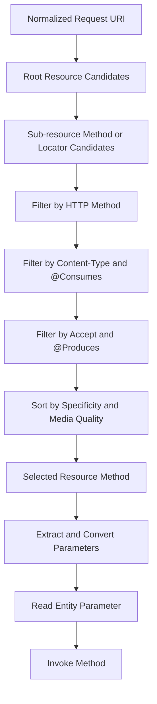
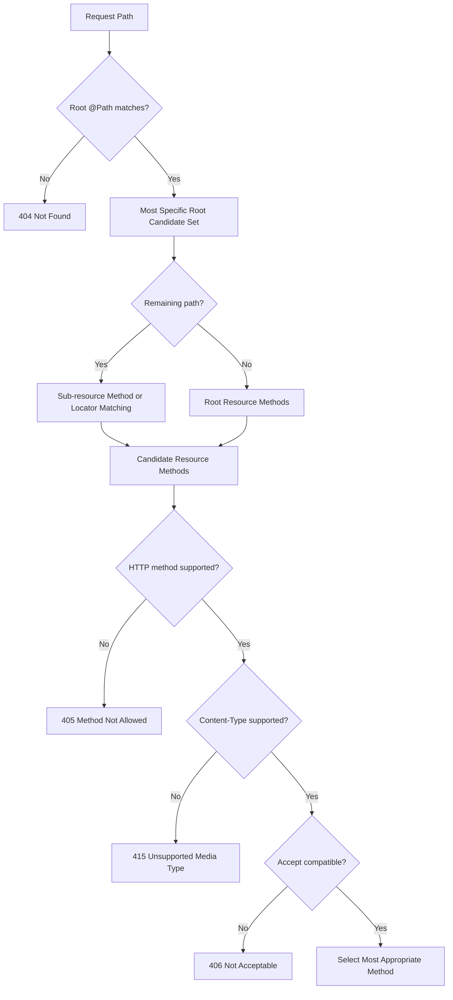
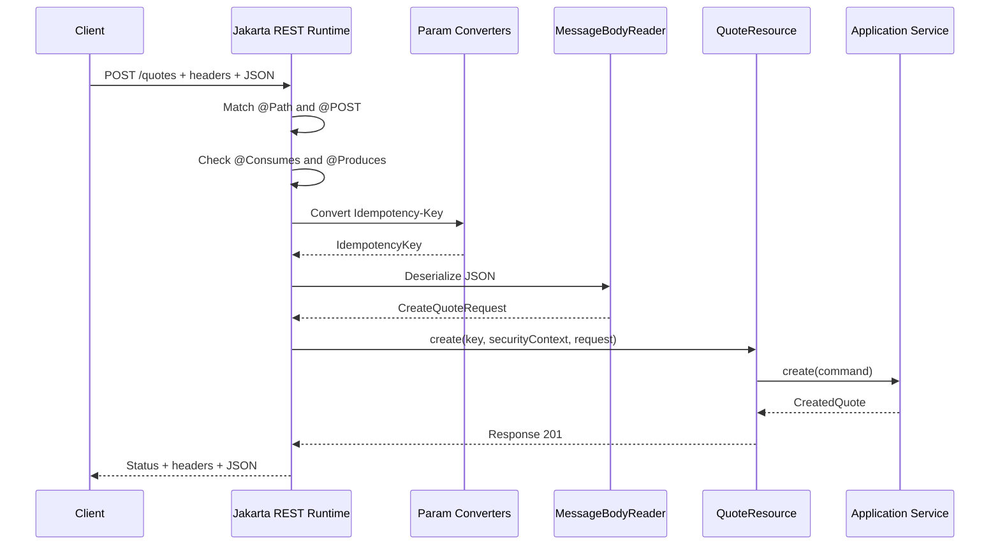

# Part 005 — Resource Classes, Request Matching, and Parameter Binding

> Endpoint Jakarta REST tidak dipilih hanya berdasarkan `@Path`. Runtime membentuk candidate set, menilai path specificity, HTTP method, `Content-Type`, `Accept`, `@Consumes`, dan `@Produces`, lalu membangun argument Java melalui parameter extraction dan conversion. Karena itu, request dapat gagal sebelum resource method dipanggil walaupun URI terlihat benar.

## Daftar Isi

1. [Target kompetensi](#target-kompetensi)
2. [Scope dan baseline specification](#scope-dan-baseline-specification)
3. [Mental model: dispatch sebagai constraint solving](#mental-model-dispatch-sebagai-constraint-solving)
4. [Resource class dan resource method](#resource-class-dan-resource-method)
5. [HTTP method designator](#http-method-designator)
6. [URI path templates](#uri-path-templates)
7. [Path normalization dan decoding](#path-normalization-dan-decoding)
8. [Tiga tahap request matching](#tiga-tahap-request-matching)
9. [Tahap 1 — memilih root resource class](#tahap-1--memilih-root-resource-class)
10. [Tahap 2 — memilih resource method atau locator candidate](#tahap-2--memilih-resource-method-atau-locator-candidate)
11. [Tahap 3 — method, consumes, dan produces](#tahap-3--method-consumes-dan-produces)
12. [Path specificity dan ambiguous routes](#path-specificity-dan-ambiguous-routes)
13. [Sub-resource method dan sub-resource locator](#sub-resource-method-dan-sub-resource-locator)
14. [HEAD dan OPTIONS](#head-dan-options)
15. [Annotation inheritance](#annotation-inheritance)
16. [Parameter source taxonomy](#parameter-source-taxonomy)
17. [`@PathParam`](#pathparam)
18. [`@QueryParam`](#queryparam)
19. [`@HeaderParam` dan `@CookieParam`](#headerparam-dan-cookieparam)
20. [`@MatrixParam`](#matrixparam)
21. [`@FormParam`](#formparam)
22. [`@BeanParam`](#beanparam)
23. [`@Context`](#context)
24. [Entity parameter](#entity-parameter)
25. [Parameter conversion algorithm](#parameter-conversion-algorithm)
26. [`ParamConverterProvider`](#paramconverterprovider)
27. [`@DefaultValue`, missing value, dan empty value](#defaultvalue-missing-value-dan-empty-value)
28. [`@Encoded` dan canonical representation](#encoded-dan-canonical-representation)
29. [Collections dan repeated parameters](#collections-dan-repeated-parameters)
30. [Validation boundary](#validation-boundary)
31. [Designing stable request contracts](#designing-stable-request-contracts)
32. [End-to-end example](#end-to-end-example)
33. [Failure-model matrix](#failure-model-matrix)
34. [Debugging playbook](#debugging-playbook)
35. [PR review checklist](#pr-review-checklist)
36. [Trade-off yang harus dipahami senior engineer](#trade-off-yang-harus-dipahami-senior-engineer)
37. [Standard versus implementation-specific behavior](#standard-versus-implementation-specific-behavior)
38. [Internal verification checklist](#internal-verification-checklist)
39. [Latihan verifikasi](#latihan-verifikasi)
40. [Ringkasan](#ringkasan)
41. [Referensi resmi](#referensi-resmi)

---

## Target kompetensi

Setelah menyelesaikan part ini, Anda harus mampu:

- menjelaskan perbedaan root resource, resource method, sub-resource method, dan sub-resource locator;
- memprediksi resource method yang dipilih untuk kombinasi URI, HTTP method, `Content-Type`, dan `Accept` tertentu;
- menjelaskan mengapa request menghasilkan `404`, `405`, `406`, atau `415` sebelum application logic dijalankan;
- mengenali route yang ambiguous, terlalu luas, atau bergantung pada implementation-specific tie breaking;
- memilih parameter source yang tepat untuk path, query, header, cookie, matrix, form, context, dan entity body;
- menjelaskan urutan umum conversion dari string menjadi Java type;
- membuat `ParamConverterProvider` yang tidak mengandung I/O, hidden state, atau domain lookup;
- memahami risiko field injection pada singleton atau non-default resource lifecycle;
- mereview request contract dari sisi canonicalization, compatibility, validation, observability, dan security;
- membuktikan runtime behavior melalui route tests dan deployment-time model validation.

---

## Scope dan baseline specification

Part ini menggunakan **Jakarta RESTful Web Services 4.0** sebagai baseline penjelasan standard. Codebase enterprise dapat menggunakan Jakarta REST 3.1, JAX-RS 2.x, atau implementation dengan extension sendiri. Karena itu:

```text
Specification behavior
    harus dibedakan dari
Implementation convenience
    harus dibedakan dari
Internal application convention
```

Topik berikut sengaja tidak dibahas mendalam di part ini:

- serialization dan deserialization body: Part 006 dan Part 022;
- Bean Validation: Part 021;
- async processing dan thread model: Part 017;
- Jersey resource model internals: Part 009;
- Servlet mapping: Part 013;
- API semantics dan governance: Part 003.

Fokus Part 005 adalah **dispatch dan argument construction**.

---

## Mental model: dispatch sebagai constraint solving

Jangan membayangkan routing sebagai map sederhana:

```text
"GET /quotes/{id}" -> method
```

Jakarta REST menyelesaikan sekumpulan constraints:

```text
Normalized path
AND HTTP method
AND request entity media type
AND acceptable response media type
AND resource-model specificity
```

Model sederhananya:



### Dispatch invariant

Untuk request yang valid, runtime harus dapat menentukan:

1. satu resource method;
2. satu value untuk setiap parameter non-entity;
3. paling banyak satu entity parameter;
4. provider yang dapat membaca entity, jika ada;
5. response representation yang dapat diterima client.

Jika salah satu tidak dapat ditentukan, request berhenti sebelum domain logic.

### Mengapa mental model ini penting

Satu endpoint dapat terlihat seperti ini:

```java
@POST
@Path("/{quoteId}/actions")
@Consumes(MediaType.APPLICATION_JSON)
@Produces(MediaType.APPLICATION_JSON)
public Response execute(
        @PathParam("quoteId") QuoteId quoteId,
        @HeaderParam("Idempotency-Key") IdempotencyKey key,
        ExecuteActionRequest request) {
    // ...
}
```

Tetapi sebelum method dipanggil, runtime harus berhasil:

- mencocokkan class path dan method path;
- memilih `POST` method;
- menerima request `Content-Type`;
- menemukan acceptable response media type;
- mengonversi `quoteId`;
- mengonversi header idempotency key;
- menemukan `MessageBodyReader` untuk request DTO.

Failure pada salah satu tahap berarti breakpoint di baris pertama method tidak akan pernah tercapai.

---

## Resource class dan resource method

## Resource class

Resource class adalah POJO yang menggunakan Jakarta REST annotations untuk mengekspos web resource. Sebuah class dapat menjadi root resource class ketika diberi `@Path` pada class level.

```java
import jakarta.ws.rs.Path;

@Path("/quotes")
public class QuoteResource {
}
```

### Default lifecycle

Default Jakarta REST lifecycle adalah instance resource baru per request:

```text
constructor
-> field/property injection
-> resource method invocation
-> instance eligible for garbage collection
```

Implementation atau DI integration dapat menawarkan lifecycle lain. Jangan menganggap resource selalu per-request tanpa memeriksa bootstrap dan scope annotations.

## Resource method

Resource method adalah public method dengan request method designator seperti `@GET`, `@POST`, `@PUT`, `@PATCH`, atau `@DELETE`.

```java
@GET
@Path("/{quoteId}")
@Produces(MediaType.APPLICATION_JSON)
public QuoteResponse get(@PathParam("quoteId") String quoteId) {
    return quoteApplicationService.get(quoteId);
}
```

### Visibility

Hanya public method yang dapat diekspos sebagai resource method. Annotation pada private/protected/package-private method adalah smell, walaupun implementation mungkin memberi warning saat deployment.

### Resource method bukan domain method

Resource method bertanggung jawab pada transport boundary:

- extraction;
- transport validation;
- authentication/authorization context;
- DTO mapping;
- application-service invocation;
- HTTP response construction.

Resource method sebaiknya tidak menjadi tempat:

- transaction orchestration yang besar;
- SQL langsung;
- Kafka polling;
- thread creation;
- retry loops;
- mutable shared cache;
- domain invariant yang hanya berlaku pada satu endpoint.

---

## HTTP method designator

Jakarta REST menyediakan annotations seperti:

```java
@GET
@POST
@PUT
@DELETE
@PATCH
@HEAD
@OPTIONS
```

Annotation tersebut ditandai oleh meta-annotation `@HttpMethod`.

Custom method designator secara teknis dapat dibuat:

```java
import jakarta.ws.rs.HttpMethod;
import java.lang.annotation.ElementType;
import java.lang.annotation.Retention;
import java.lang.annotation.RetentionPolicy;
import java.lang.annotation.Target;

@Target(ElementType.METHOD)
@Retention(RetentionPolicy.RUNTIME)
@HttpMethod("PURGE")
public @interface PURGE {
}
```

Gunakan hanya jika protocol dan intermediaries benar-benar mendukung method tersebut. Dalam enterprise system, custom HTTP method dapat gagal di:

- API gateway;
- WAF;
- load balancer;
- proxy;
- browser/client library;
- observability tooling;
- allow-list security rules.

### PR review question

```text
Apakah operation ini membutuhkan custom method,
atau sebenarnya resource/action contract dapat dimodelkan dengan method standard?
```

Untuk CPQ/order flow, domain action seperti submit, approve, cancel, atau amend tidak otomatis berarti custom HTTP method. Sering kali lebih aman dimodelkan sebagai child resource atau command resource:

```text
POST /quotes/{quoteId}/submissions
POST /orders/{orderId}/cancellations
```

Semantics detail tetap harus mengikuti Part 003.

---

## URI path templates

`@Path` menerima URI path template relatif.

```java
@Path("/quotes/{quoteId}")
```

Variable dapat menggunakan default matching satu path segment:

```text
{quoteId}
```

atau custom regular expression:

```java
@Path("/quotes/{quoteId: [A-Z0-9-]+}")
```

### Gunakan regex untuk disambiguation, bukan business validation

Contoh yang wajar:

```java
@Path("/{quoteId: Q-[0-9]+}")
```

untuk membedakan:

```java
@Path("/search")
@Path("/{quoteId: Q-[0-9]+}")
```

Contoh yang berlebihan:

```java
@Path("/{code: (?=.{1,64}$)(?=.*[A-Z])(?=.*[0-9])[A-Z0-9_-]+}")
```

Regex kompleks dalam path:

- sulit dibaca;
- sulit di-debug;
- menghasilkan `404` untuk input malformed, padahal client mungkin membutuhkan `400` yang lebih jelas;
- berisiko catastrophic backtracking bila regex buruk;
- menggandakan validation rules.

### Class path dan method path digabung

```java
@Path("/quotes")
public class QuoteResource {

    @GET
    @Path("/{quoteId}")
    public QuoteResponse get(@PathParam("quoteId") String quoteId) {
        // ...
    }
}
```

Effective path:

```text
/quotes/{quoteId}
```

### Template variable name bukan specificity signal

Dua template ini equivalent untuk matching:

```text
/quotes/{quoteId}
/quotes/{id}
```

Nama variable dibutuhkan untuk extraction, tetapi tidak membuat satu route lebih spesifik.

---

## Path normalization dan decoding

Sebelum matching, URI dinormalisasi sesuai rules URI yang relevan. Exact behavior pada layer sebelum Jakarta REST juga dapat dipengaruhi oleh:

- reverse proxy;
- Servlet container;
- HTTP server;
- gateway path rewrite;
- ingress controller;
- security normalization rules.

### Path yang terlihat sama belum tentu byte-identical

Perhatikan:

```text
/quotes/A%2FB
/quotes/A/B
```

Encoded slash dapat:

- ditolak oleh proxy;
- didecode sebelum aplikasi;
- tetap encoded;
- dianggap dua path segments;
- diperlakukan berbeda antar-runtime.

Jangan menjadikan identifier yang secara alami mengandung `/` sebagai path segment tanpa canonical encoding contract yang dibuktikan end-to-end.

### Trailing slash

Runtime matching dapat memperlakukan template final slash secara toleran pada algoritma tertentu, tetapi proxy redirect, cache key, signature, dan gateway route dapat membedakan:

```text
/quotes/Q-1
/quotes/Q-1/
```

Tentukan canonical form dan uji dari external ingress sampai resource method.

### Duplicate slash dan dot segments

Request seperti:

```text
//quotes///Q-1
/quotes/./Q-1
/quotes/segment/../Q-1
```

harus diperlakukan sebagai security-relevant input. Normalization yang berbeda antar-layer dapat membuka route bypass atau signature mismatch.

### Internal verification

Buktikan:

- siapa melakukan URL decode;
- apakah encoded slash diizinkan;
- apakah duplicate slash dinormalisasi;
- apakah gateway menambah/menghapus prefix;
- apakah trailing slash di-redirect;
- URI apa yang terlihat pada access log, trace, dan `UriInfo`.

---

## Tiga tahap request matching

Secara konseptual, Jakarta REST matching berlangsung dalam tiga tahap:

```text
1. Root resource class candidate selection
2. Resource/sub-resource candidate selection
3. HTTP method + consumes + produces selection
```

Implementation tidak harus menggunakan algoritma internal yang sama, tetapi hasil observable harus equivalent dengan specification.



### Error status adalah outcome algoritma, bukan domain decision

- `404`: tidak ada matching resource path;
- `405`: path candidate ada, tetapi request method tidak didukung;
- `415`: method candidate ada, tetapi request entity media type tidak didukung;
- `406`: method candidate ada, tetapi tidak ada response representation yang acceptable.

Custom exception mapper dapat mengubah body, tetapi jangan mengaburkan semantics status ini tanpa alasan kuat.

---

## Tahap 1 — memilih root resource class

Runtime membandingkan normalized request URI terhadap root resource classes.

Contoh:

```java
@Path("/quotes")
public class QuoteCollectionResource {
}

@Path("/quotes/{quoteId}")
public class QuoteItemResource {
}
```

Untuk request:

```text
GET /quotes/Q-123
```

runtime mempertimbangkan path specificity. Secara umum, template dengan lebih banyak literal characters dan constraint lebih spesifik mendapat precedence.

### Literal path biasanya lebih spesifik

```java
@Path("/quotes/search")
public class QuoteSearchResource {
}

@Path("/quotes/{quoteId}")
public class QuoteResource {
}
```

`/quotes/search` seharusnya memilih literal route, bukan menjadikan `search` sebagai `quoteId`.

Tetapi desain yang mengandalkan banyak route yang hampir overlap tetap sulit dirawat. Gunakan route-model tests.

### Same template, multiple root classes

Dua root resource classes dapat memiliki path template equivalent. Hal itu meningkatkan complexity dan dapat membuat method selection bergantung pada downstream annotations.

```java
@Path("/quotes/{id}")
public class QuoteJsonResource { /* ... */ }

@Path("/quotes/{quoteId}")
public class QuoteXmlResource { /* ... */ }
```

Lebih mudah memelihara satu resource model dengan explicit `@Produces` daripada menyebarkan satu URI family ke banyak classes tanpa boundary yang jelas.

---

## Tahap 2 — memilih resource method atau locator candidate

Setelah root class dipilih, runtime memproses remaining path.

```java
@Path("/quotes")
public class QuoteResource {

    @GET
    public List<QuoteSummary> list() {
        // GET /quotes
    }

    @GET
    @Path("/{quoteId}")
    public QuoteResponse get(@PathParam("quoteId") String quoteId) {
        // GET /quotes/{quoteId}
    }

    @Path("/{quoteId}/items")
    public QuoteItemResource items(@PathParam("quoteId") String quoteId) {
        // sub-resource locator
        return new QuoteItemResource(quoteId);
    }
}
```

Runtime memilih sub-resource method sebelum locator ketika path specificity equivalent sesuai standard matching model.

### Smell: catch-all locator

```java
@Path("/{remaining: .*}")
public Object dispatch(@PathParam("remaining") String remaining) {
    // custom router
}
```

Risikonya:

- menonaktifkan banyak benefit static resource model;
- error menjadi runtime-only;
- OpenAPI generation sulit;
- security binding dapat terlewat;
- tracing resource name menjadi buruk;
- route conflict sulit dideteksi saat startup.

Gunakan hanya bila dynamic dispatch benar-benar merupakan requirement dan dilengkapi tests serta observability.

---

## Tahap 3 — method, consumes, dan produces

Candidate methods disaring berdasarkan tiga dimensi.

## 1. HTTP method

```java
@GET
@Path("/{quoteId}")
public QuoteResponse get(...) { }

@PUT
@Path("/{quoteId}")
public QuoteResponse replace(...) { }
```

Request `POST /quotes/Q-1` pada path tersebut akan menghasilkan `405` bila tidak ada `POST` candidate.

Response `405` semestinya menyertakan `Allow` sesuai runtime behavior.

## 2. Request entity media type

```java
@POST
@Consumes(MediaType.APPLICATION_JSON)
public Response create(CreateQuoteRequest request) { }
```

Request dengan:

```http
Content-Type: application/xml
```

tidak cocok dan menghasilkan `415`, kecuali ada method candidate lain yang menerima XML.

Ketika request memiliki body tetapi tidak memiliki `Content-Type`, entity provider selection memperlakukan media type sebagai `application/octet-stream`. Jangan mengandalkan runtime menebak JSON.

## 3. Acceptable response media type

```java
@GET
@Produces(MediaType.APPLICATION_JSON)
public QuoteResponse get(...) { }
```

Request:

```http
Accept: application/xml
```

menghasilkan `406` jika tidak ada compatible representation.

### Method-level overrides class-level

```java
@Path("/quotes")
@Produces(MediaType.APPLICATION_JSON)
public class QuoteResource {

    @GET
    @Path("/{quoteId}/export")
    @Produces("text/csv")
    public StreamingOutput export(...) {
        // Method-level @Produces overrides class-level value.
    }
}
```

### Wildcard is permissive, not free

Tanpa `@Consumes` atau `@Produces`, support `*/*` diasumsikan pada matching level. Tetapi actual entity reader/writer tetap harus tersedia.

Risiko wildcard:

- endpoint tampak menerima semua format tetapi gagal saat provider selection;
- wrong content types dapat lolos terlalu jauh;
- generated contract menjadi tidak jelas;
- security scanning dan gateway policy sulit.

Untuk public atau shared enterprise APIs, deklarasikan media types secara eksplisit.

---

## Path specificity dan ambiguous routes

Perhatikan routes berikut:

```java
@GET
@Path("/{value}")
public Response byId(@PathParam("value") String value) { }

@GET
@Path("/{name}")
public Response byName(@PathParam("name") String name) { }
```

Keduanya equivalent untuk matching. Variable name tidak membedakan route.

### Perbaikan 1 — explicit namespace

```java
@Path("/by-id/{id}")
@Path("/by-name/{name}")
```

### Perbaikan 2 — non-overlapping regex

```java
@Path("/{id: Q-[0-9]+}")
@Path("/{name: [a-z][a-z0-9-]+}")
```

Gunakan hanya jika identifier domains memang disjoint dan stable.

### Perbaikan 3 — query dimension

```text
GET /quotes?externalReference=...
```

cocok untuk collection search, tetapi harus mengikuti pagination, filtering, dan uniqueness semantics.

### Ambiguity matrix

| Design | Risiko | Rekomendasi |
|---|---:|---|
| Dua variable templates equivalent | Tinggi | Ubah URI shape |
| Literal versus variable | Rendah–sedang | Tambahkan route tests |
| Regex overlap | Tinggi | Buktikan disjoint atau redesign |
| Same path, different `@Produces` | Sedang | Valid bila contract jelas |
| Same path, different `@Consumes` | Sedang | Valid, tetapi client errors harus konsisten |
| Same path, same method/media type | Kritis | Deployment/model validation harus gagal atau diperbaiki |

### Jangan mengandalkan declaration order

Urutan method dalam source file bukan routing precedence contract. Refactor atau compiler tidak boleh mengubah route selection.

---

## Sub-resource method dan sub-resource locator

## Sub-resource method

Memiliki `@Path` dan HTTP method designator.

```java
@GET
@Path("/{quoteId}/items")
public List<QuoteItemResponse> listItems(
        @PathParam("quoteId") String quoteId) {
    return quoteService.listItems(quoteId);
}
```

## Sub-resource locator

Memiliki `@Path`, tetapi tidak memiliki HTTP method designator.

```java
@Path("/{quoteId}/items")
public QuoteItemResource items(
        @PathParam("quoteId") String quoteId) {
    return new QuoteItemResource(quoteId);
}
```

Returned object kemudian digunakan untuk matching berikutnya.

### Restriction

Sub-resource locator tidak boleh memiliki entity parameter. Locator dipakai untuk menemukan resource handler, bukan membaca request body.

### Dynamic runtime type

Ketika locator mengembalikan object, runtime harus mempertimbangkan actual runtime class, bukan hanya declared return type. Ini memungkinkan dynamic resource subclasses, tetapi menambah complexity.

### Injection caveat

Object yang dibuat manual:

```java
return new QuoteItemResource(quoteId);
```

belum tentu diproses oleh HK2/CDI/Jakarta REST injection seperti object yang dibuat runtime.

Kemungkinan akibat:

- `@Inject` tetap `null`;
- `@Context` tidak tersedia;
- lifecycle callbacks tidak dijalankan;
- interceptors/proxies tidak diterapkan;
- scope contract dilanggar.

Gunakan factory/container-aware creation bila sub-resource membutuhkan managed dependencies. Exact mechanism adalah implementation-specific dan akan dibahas pada Part 009–011.

### Locator versus flat resource model

Gunakan locator bila:

- hierarchy benar-benar dynamic;
- runtime type menentukan supported operations;
- resource subtree memiliki boundary yang jelas;
- lifecycle dan injection dapat dikelola.

Gunakan flat annotated methods bila:

- routes dapat diketahui saat deployment;
- OpenAPI dan security binding penting;
- debugging simplicity lebih berharga;
- dynamic dispatch tidak diperlukan.

---

## HEAD dan OPTIONS

Jakarta REST menyediakan handling tambahan untuk `HEAD` dan `OPTIONS`.

### HEAD

Jika explicit `@HEAD` tidak ada, runtime dapat menggunakan matching `@GET` method dan menghilangkan response entity sesuai semantics HEAD.

Operational implication:

- application logic `GET` dapat tetap berjalan;
- database query atau downstream call tetap dapat terjadi;
- body tidak dikirim bukan berarti operation murah;
- custom writer/filter behavior harus diuji.

Buat explicit `@HEAD` hanya bila metadata dapat dihitung lebih efisien dan tetap semantically equivalent.

### OPTIONS

Runtime dapat membuat response OPTIONS secara otomatis dan menyertakan allowed methods.

Jangan mencampur:

- HTTP `OPTIONS` capability;
- browser CORS preflight;
- application-specific capabilities endpoint.

CORS filters/gateway dapat menangani preflight sebelum resource method. Verifikasi actual layer.

---

## Annotation inheritance

Jakarta REST annotations pada interface atau superclass methods dapat diwariskan dengan rules tertentu, tetapi inheritance mudah menjadi membingungkan.

Contoh interface:

```java
public interface QuoteReadApi {

    @GET
    @Path("/{quoteId}")
    @Produces(MediaType.APPLICATION_JSON)
    QuoteResponse get(@PathParam("quoteId") String quoteId);
}
```

Implementation:

```java
@Path("/quotes")
public class QuoteResource implements QuoteReadApi {

    @Override
    public QuoteResponse get(String quoteId) {
        // ...
    }
}
```

Jika implementation method menambahkan annotation Jakarta REST sendiri, inherited method annotations dapat diabaikan sebagai satu set. Partial redeclaration dapat tidak menghasilkan kombinasi yang diharapkan.

### Recommendation

Ulangi annotations pada concrete resource methods untuk readability dan portability, terutama bila:

- code generation tidak menjadi source of truth;
- multiple interfaces digunakan;
- implementation berbeda antar-runtime;
- annotation processor/OpenAPI scanner memiliki behavior berbeda.

### Internal verification

Cari:

- API interfaces dengan Jakarta REST annotations;
- generated interfaces;
- concrete resources yang mengandalkan inheritance;
- scanner/OpenAPI behavior;
- tests yang memastikan annotations efektif.

---

## Parameter source taxonomy

Resource method argument dapat berasal dari beberapa source.

| Annotation / posisi | Source | Contoh penggunaan |
|---|---|---|
| `@PathParam` | URI template | resource identity |
| `@QueryParam` | query string | filter, pagination, sorting |
| `@HeaderParam` | HTTP header | idempotency key, precondition metadata |
| `@CookieParam` | HTTP cookie | browser/session integration |
| `@MatrixParam` | path-segment matrix parameter | uncommon legacy/resource dimensions |
| `@FormParam` | form-urlencoded body atau supported multipart part | form integration |
| `@BeanParam` | aggregate parameter bean | reusable request parameter group |
| `@Context` | runtime context | URI, headers, security, request metadata |
| unannotated parameter | request entity | JSON/XML/binary DTO |

### Parameter source adalah contract decision

Pilih berdasarkan semantics:

```text
Path     -> resource identity/hierarchy
Query    -> optional selection or representation dimensions
Header   -> protocol/control metadata
Body     -> structured operation input
Context  -> runtime-derived information
```

Jangan memindahkan semua input ke header atau semua input ke body hanya karena implementation lebih mudah.

---

## `@PathParam`

```java
@GET
@Path("/{quoteId}")
public QuoteResponse get(
        @PathParam("quoteId") QuoteId quoteId) {
    return service.get(quoteId);
}
```

### Good properties

- identity terlihat di URI;
- mudah ditelusuri di access logs, dengan redaction bila sensitif;
- route-specific authorization lebih mudah;
- cache key natural.

### Risks

- sensitive identifiers bocor ke log/history;
- encoded slash atau special characters;
- case normalization tidak konsisten;
- field-level injection tidak tersedia pada semua matched methods;
- custom converter melempar wrong exception.

### Field-level path parameter caveat

```java
@Path("/quotes")
public class QuoteResource {

    @PathParam("quoteId")
    private String quoteId;

    @GET
    public List<QuoteSummary> list() {
        // quoteId tidak ada pada class path ini.
        return List.of();
    }

    @GET
    @Path("/{quoteId}")
    public QuoteResponse get() {
        return service.get(quoteId);
    }
}
```

Field dapat `null` untuk methods yang template-nya tidak mendefinisikan variable tersebut. Method parameter lebih eksplisit dan lebih mudah direview.

---

## `@QueryParam`

```java
@GET
public PageResponse<QuoteSummary> search(
        @QueryParam("status") List<String> statuses,
        @QueryParam("cursor") String cursor,
        @QueryParam("limit") @DefaultValue("50") int limit) {
    // ...
}
```

### Query parameter cocok untuk

- filtering;
- sorting;
- pagination;
- sparse fieldsets;
- search mode;
- representation options yang tidak mengubah resource identity.

### Query parameter risks

- unbounded list values;
- duplicate keys dengan interpretation berbeda;
- order sensitivity tidak terdokumentasi;
- blank versus absent ambiguity;
- URL length limits;
- cache key normalization;
- logs mengandung PII atau commercial data;
- dynamic SQL injection bila nilai langsung ditempel ke SQL.

### Canonical query contract

Tentukan:

- apakah parameter case-sensitive;
- apakah repeated keys diizinkan;
- apakah comma-separated values diizinkan;
- maximum count dan length;
- blank value semantics;
- unknown parameter policy;
- stable sorting tiebreaker;
- cursor binding terhadap filter/sort.

Contoh ambiguity:

```text
?status=DRAFT&status=APPROVED
?status=DRAFT,APPROVED
?status=
```

Ketiganya tidak boleh dianggap equivalent tanpa contract eksplisit.

---

## `@HeaderParam` dan `@CookieParam`

## Header parameter

```java
@POST
public Response create(
        @HeaderParam("Idempotency-Key") IdempotencyKey idempotencyKey,
        CreateQuoteRequest request) {
    // ...
}
```

Header cocok untuk protocol/control metadata seperti:

- idempotency key;
- conditional request fields;
- content metadata;
- tracing propagation;
- client capabilities;
- request signing metadata.

Header kurang cocok untuk domain payload utama.

### Header concerns

- header names case-insensitive, values belum tentu;
- intermediary dapat menambah, menghapus, atau merge fields;
- multiple values perlu semantics jelas;
- size limits berbeda antar-gateway;
- sensitive headers harus di-redact;
- jangan mempercayai identity header dari untrusted client bila seharusnya ditulis gateway.

## Cookie parameter

```java
@CookieParam("session")
Cookie sessionCookie
```

Cookie umum pada browser/session integration. Untuk service-to-service API, token/header-based identity biasanya lebih eksplisit.

Cookie risks:

- CSRF;
- domain/path scope;
- `Secure`, `HttpOnly`, `SameSite` configuration;
- stale browser state;
- multiple cookies dengan same name pada path berbeda;
- logging accidental.

Security details akan dibahas pada Part 025–027.

---

## `@MatrixParam`

Matrix parameter melekat pada path segment:

```text
/quotes;region=apac/Q-1;version=3
```

Contoh:

```java
@GET
@Path("/{quoteId}")
public QuoteResponse get(
        @PathParam("quoteId") String quoteId,
        @MatrixParam("version") Integer version) {
    // ...
}
```

Matrix params jarang digunakan pada modern enterprise APIs karena dukungan tooling, gateways, proxies, dan client generation tidak selalu konsisten.

### Internal verification before use

- gateway preserves semicolon content;
- Servlet container does not strip path parameters unexpectedly;
- WAF allows format;
- OpenAPI tooling represents it correctly;
- client libraries generate correct URI;
- cache keys include matrix values.

Tanpa bukti end-to-end, prefer query parameters atau explicit path resources.

---

## `@FormParam`

Digunakan untuk form data, terutama `application/x-www-form-urlencoded`.

```java
@POST
@Consumes(MediaType.APPLICATION_FORM_URLENCODED)
public Response submitLegacyForm(
        @FormParam("accountId") String accountId,
        @FormParam("productCode") String productCode) {
    // ...
}
```

### Form versus JSON

Form cocok untuk:

- browser form integration;
- legacy systems;
- OAuth-style protocol endpoints tertentu;
- simple key-value submissions.

JSON cocok untuk:

- nested structured payload;
- typed contract;
- evolvable command DTO;
- generated client/server schemas.

### Servlet interaction risk

Servlet filters atau APIs dapat mengonsumsi form body saat mengakses request parameters. Dalam Servlet deployment, query dan form parameter behavior dapat saling berinteraksi. Verifikasi filter chain jika form values hilang atau body dianggap consumed.

### Multipart

Jakarta REST 4.0 menyediakan standard `EntityPart` support untuk multipart use cases. Detail file/multipart dibahas Part 015. Codebase dengan Jakarta REST 3.1 atau Jersey multipart extension dapat memiliki API berbeda.

---

## `@BeanParam`

`@BeanParam` menggabungkan beberapa injectable parameters ke dalam satu object.

```java
public class QuoteSearchParameters {

    @QueryParam("status")
    private List<String> statuses;

    @QueryParam("sort")
    @DefaultValue("updatedAt:desc")
    private String sort;

    @QueryParam("limit")
    @DefaultValue("50")
    private int limit;

    public List<String> getStatuses() {
        return statuses;
    }

    public String getSort() {
        return sort;
    }

    public int getLimit() {
        return limit;
    }
}
```

```java
@GET
public PageResponse<QuoteSummary> search(
        @BeanParam QuoteSearchParameters parameters) {
    // ...
}
```

### Benefits

- mengurangi parameter list;
- reusable untuk related endpoints;
- centralizes transport-level parsing;
- dapat diberi Bean Validation constraints.

### Risks

- hidden inputs sulit terlihat dari method signature;
- bean menjadi mutable transport bag;
- reuse lintas endpoints menyebabkan accidental coupling;
- field injection bergantung pada lifecycle;
- nested `@BeanParam` support dan DI behavior perlu diuji;
- constructor semantics dapat implementation-specific dalam integration tertentu.

### Good boundary

`@BeanParam` object sebaiknya tetap transport object. Map ke immutable application query/command sebelum masuk domain layer.

```java
QuoteSearchQuery query = new QuoteSearchQuery(
        normalizedStatuses,
        parsedSort,
        boundedLimit,
        tenantId
);
```

---

## `@Context`

`@Context` menyediakan runtime context types, misalnya:

```java
@Context UriInfo uriInfo
@Context HttpHeaders headers
@Context Request request
@Context SecurityContext securityContext
@Context ResourceInfo resourceInfo
@Context Providers providers
```

### Context bukan general service locator

Gunakan untuk information yang memang berasal dari request/runtime. Jangan menjadikan `Providers` atau container lookup sebagai cara umum mengambil application services.

### Context lifecycle

Request-specific context aman digunakan dalam request call path. Menyimpannya ke singleton field, background task, atau long-lived object dapat menghasilkan stale proxy atau context-not-active failure.

### Prefer explicit extraction at boundary

Daripada meneruskan `SecurityContext` ke domain:

```java
Actor actor = actorMapper.from(securityContext);
applicationService.execute(actor, command);
```

Dengan begitu domain tidak bergantung pada Jakarta REST API.

---

## Entity parameter

Parameter yang tidak diberi parameter-source annotation dianggap sebagai request entity parameter.

```java
@POST
@Consumes(MediaType.APPLICATION_JSON)
public Response create(CreateQuoteRequest request) {
    // request adalah entity parameter.
}
```

Resource method hanya boleh memiliki **paling banyak satu** entity parameter.

Invalid design:

```java
public Response create(
        CreateQuoteHeader header,
        CreateQuoteLines lines) {
    // Dua unannotated parameters: ambiguous request body mapping.
}
```

Gabungkan menjadi satu DTO:

```java
public record CreateQuoteRequest(
        QuoteHeaderInput header,
        List<QuoteLineInput> lines) {
}
```

### Entity parameter versus `@BeanParam`

```text
@BeanParam        -> URI/header/cookie/form/context-derived aggregate
Unannotated DTO   -> request body representation
```

Jangan memberi `@BeanParam` pada JSON DTO dengan harapan body otomatis dibaca sebagai JSON.

### Entity stream can be consumed once

Filter, Servlet layer, logging middleware, signature validation, atau custom reader dapat mengonsumsi stream. Jika body dibaca dua kali tanpa buffering strategy, entity reader melihat empty stream.

Part 006 membahas stream ownership lebih rinci.

---

## Parameter conversion algorithm

Parameter values dari URI/header/cookie/form pada dasarnya berasal dari strings. Jakarta REST mendukung conversion melalui urutan capability berikut:

1. registered `ParamConverter` dari `ParamConverterProvider`;
2. primitive types;
3. constructor dengan satu `String` argument;
4. static `valueOf(String)` atau `fromString(String)` yang mengembalikan type tersebut;
5. `List<T>`, `Set<T>`, `SortedSet<T>`, atau `T[]` bila element type dapat dikonversi sesuai rule yang didukung.

Untuk enum, `fromString` diprioritaskan bila tersedia karena built-in `valueOf` enum memiliki limitation case-sensitive exact name.

### Example value object

```java
public record QuoteId(String value) {

    public QuoteId {
        if (value == null || !value.matches("Q-[0-9]+")) {
            throw new IllegalArgumentException("Invalid quote ID");
        }
    }

    public static QuoteId fromString(String raw) {
        return new QuoteId(raw);
    }
}
```

Kemudian:

```java
@GET
@Path("/{quoteId}")
public QuoteResponse get(@PathParam("quoteId") QuoteId quoteId) {
    // ...
}
```

### Conversion must be pure and cheap

Converter atau `fromString` tidak boleh:

- query database;
- call remote service;
- read tenant catalog;
- acquire distributed lock;
- mutate global state;
- emit business event;
- perform authorization decision.

Alasannya:

- conversion terjadi sebelum resource method;
- timeout/error mapping menjadi tidak jelas;
- route probing dapat memicu expensive work;
- observability resource method belum tentu aktif;
- retries dan duplicated conversion sulit dikontrol.

Conversion sebaiknya hanya:

```text
parse
normalize
validate lexical shape
construct immutable value
```

Existence checks dan domain validation dilakukan di application/domain layer.

---

## `ParamConverterProvider`

Gunakan `ParamConverterProvider` ketika type tidak dapat atau tidak seharusnya memiliki universal `fromString`, atau conversion memerlukan annotation metadata.

```java
import jakarta.ws.rs.ext.ParamConverter;
import jakarta.ws.rs.ext.ParamConverterProvider;
import jakarta.ws.rs.ext.Provider;

import java.lang.annotation.Annotation;
import java.lang.reflect.Type;

@Provider
public final class QuoteIdParamConverterProvider
        implements ParamConverterProvider {

    private static final ParamConverter<QuoteId> CONVERTER =
            new ParamConverter<>() {
                @Override
                public QuoteId fromString(String value) {
                    if (value == null) {
                        return null;
                    }
                    return QuoteId.fromString(value);
                }

                @Override
                public String toString(QuoteId value) {
                    return value.value();
                }
            };

    @Override
    @SuppressWarnings("unchecked")
    public <T> ParamConverter<T> getConverter(
            Class<T> rawType,
            Type genericType,
            Annotation[] annotations) {

        if (rawType == QuoteId.class) {
            return (ParamConverter<T>) CONVERTER;
        }
        return null;
    }
}
```

### Provider selection concerns

- provider registration harus terbukti;
- multiple providers untuk same type dapat berkonflik;
- priority dan implementation behavior perlu diperiksa;
- generic types dan annotations harus dipertimbangkan;
- converter instance umumnya shared, sehingga harus stateless/thread-safe.

### Exception semantics

Conversion exception dapat dipetakan berbeda berdasarkan source annotation dan runtime. Jangan mengandalkan raw `IllegalArgumentException` menghasilkan error body yang konsisten.

Buat integration tests untuk:

- invalid path param;
- invalid query param;
- invalid header param;
- invalid default value;
- collection element invalid;
- converter unexpected exception.

Pastikan error contract mengikuti Part 021.

### Default value conversion timing

Default values dapat dikonversi saat deployment/startup oleh provider tertentu, kecuali lazy behavior digunakan. Invalid default value dapat menyebabkan application startup failure, yang sebenarnya desirable untuk configuration-like contract errors.

---

## `@DefaultValue`, missing value, dan empty value

```java
@QueryParam("limit")
@DefaultValue("50")
int limit
```

`@DefaultValue` digunakan ketika corresponding value tidak tersedia sesuai annotation contract.

### Missing tidak selalu sama dengan blank

```text
GET /quotes
GET /quotes?limit=
GET /quotes?limit=0
```

- missing: parameter tidak ada;
- blank: parameter ada dengan empty representation;
- zero: explicit numeric value.

Jangan mengubah ketiganya menjadi satu state tanpa contract.

### Primitive default trap

Tanpa `@DefaultValue`, missing primitive dapat menjadi Java default seperti `0` tergantung annotation rules. Ini menghilangkan kemampuan membedakan absent dari explicit zero.

Prefer wrapper atau `@DefaultValue` yang explicit:

```java
@QueryParam("limit") Integer limit
```

kemudian normalize:

```java
int effectiveLimit = limit == null ? DEFAULT_LIMIT : limit;
```

### Unsafe defaults

Hindari default yang memperluas scope tanpa batas:

```text
missing limit -> return all rows
missing tenant -> global tenant
missing effectiveDate -> server local date without contract
missing sort -> nondeterministic database order
```

Safe default harus bounded, deterministic, dan documented.

---

## `@Encoded` dan canonical representation

Jakarta REST otomatis melakukan URI decoding untuk relevant path/query/matrix values. `@Encoded` menonaktifkan automatic decoding pada target tertentu.

```java
@GET
@Path("/{externalReference}")
public Response get(
        @PathParam("externalReference")
        @Encoded String rawReference) {
    // ...
}
```

### Risks

- double decoding;
- signature mismatch;
- path traversal checks dilakukan pada wrong representation;
- cache key berbeda untuk equivalent encodings;
- authorization lookup menggunakan non-canonical value;
- `%2F` berubah menjadi segment boundary pada layer berbeda.

### Security invariant

Lakukan security decision pada canonical representation yang sama dengan representation yang digunakan routing dan data lookup.

```text
raw bytes
-> validated encoding
-> single canonical decode
-> normalization
-> authorization/data lookup
```

Jangan melakukan decode berulang sampai string “terlihat benar”.

---

## Collections dan repeated parameters

Jakarta REST mendukung collection forms tertentu untuk repeated values.

```java
@QueryParam("status")
List<QuoteStatus> statuses
```

Request:

```text
?status=DRAFT&status=APPROVED
```

### Decide explicit semantics

- apakah duplicate identical values dipertahankan;
- apakah ordering meaningful;
- apakah set semantics digunakan;
- maximum values;
- invalid element behavior;
- mixed valid/invalid behavior;
- comma-separated compatibility;
- interaction dengan OpenAPI generated clients.

### Collection choice

| Type | Semantics |
|---|---|
| `List<T>` | order dan duplicates dapat dipertahankan |
| `Set<T>` | uniqueness, order tidak dijamin |
| `SortedSet<T>` | uniqueness plus natural ordering requirement |
| `T[]` | simple repeated representation |

Jangan memilih `Set` hanya untuk convenience jika client order memiliki meaning.

### Denial-of-service guard

Bound repeated parameters:

```text
maximum values
maximum total bytes
maximum element length
maximum parsed complexity
```

Seratus ribu query values dapat menghabiskan CPU/memory sebelum rate limiter atau application guard berjalan.

---

## Validation boundary

Parameter conversion hanya memastikan string dapat menjadi Java type. Itu bukan pengganti full validation.

Gunakan tiga lapisan:

```text
Lexical conversion
    "50" -> integer 50

Transport validation
    limit must be between 1 and 200

Domain validation
    requested operation allowed for quote state and actor
```

Contoh:

```java
@GET
public PageResponse<QuoteSummary> search(
        @QueryParam("limit")
        @DefaultValue("50")
        @Min(1)
        @Max(200)
        int limit) {
    // ...
}
```

Bean Validation integration dibahas Part 021. Hal penting di sini:

- converter tidak boleh memeriksa domain existence;
- regex path bukan pengganti request validation;
- route mismatch (`404`) dan invalid value (`400`) memiliki client semantics berbeda;
- validation harus menghasilkan stable error contract.

---

## Designing stable request contracts

## Use transport-specific types at boundary

```java
public record QuoteSearchRequest(
        List<String> status,
        String cursor,
        Integer limit,
        String sort) {
}
```

Map ke application query:

```java
public record SearchQuotesQuery(
        TenantId tenantId,
        Set<QuoteStatus> statuses,
        PageCursor cursor,
        PageSize pageSize,
        QuoteSort sort,
        Actor actor) {
}
```

### Why separate them

Transport contract dapat berubah secara additive tanpa mengubah domain type. Domain type dapat menjaga invariant tanpa Jakarta annotations.

## Do not expose persistence query directly

Bad:

```java
@QueryParam("where") String rawSqlWhere
@QueryParam("orderBy") String rawOrderBy
```

Better:

```java
@QueryParam("status") List<QuoteStatus> statuses
@QueryParam("sort") QuoteSort sort
```

Map allow-listed values ke SQL fragments di repository layer.

## Preserve compatibility

Breaking changes pada parameter contract termasuk:

- required parameter baru;
- default berubah;
- blank semantics berubah;
- enum value dihapus;
- case sensitivity berubah;
- path regex dipersempit;
- query list format berubah;
- header dipindahkan ke body;
- body field dipindahkan ke path;
- sorting default berubah sehingga pagination tidak stabil.

### Request contract table

| Input | Required | Default | Limits | Canonicalization | Sensitive | Error code |
|---|---:|---|---|---|---:|---|
| `quoteId` path | yes | none | length/format | uppercase? | maybe | `INVALID_QUOTE_ID` |
| `limit` query | no | `50` | `1..200` | numeric | no | `INVALID_PAGE_SIZE` |
| `sort` query | no | stable default | allow-list | lowercase field | no | `INVALID_SORT` |
| `Idempotency-Key` | operation-specific | none | length/charset | exact or normalized | yes-ish | `INVALID_IDEMPOTENCY_KEY` |

Maintain this metadata in OpenAPI, tests, and implementation.

---

## End-to-end example

Berikut resource boundary yang memisahkan transport parsing dari application command.

### Query-time value object

`OffsetDateTime` tidak memiliki `valueOf(String)` atau `fromString(String)` standard yang dapat langsung digunakan oleh Jakarta REST parameter conversion. Bungkus dalam value object atau daftarkan `ParamConverter`.

```java
public record AsOfTime(OffsetDateTime value) {

    public static AsOfTime fromString(String raw) {
        return new AsOfTime(OffsetDateTime.parse(raw));
    }
}
```

### Resource

```java
@Path("/quotes")
@Consumes(MediaType.APPLICATION_JSON)
@Produces(MediaType.APPLICATION_JSON)
public final class QuoteResource {

    private final QuoteApplicationService service;
    private final RequestActorFactory actorFactory;

    public QuoteResource(
            QuoteApplicationService service,
            RequestActorFactory actorFactory) {
        this.service = service;
        this.actorFactory = actorFactory;
    }

    @GET
    @Path("/{quoteId: Q-[0-9]+}")
    public QuoteResponse get(
            @PathParam("quoteId") QuoteId quoteId,
            @QueryParam("asOf") AsOfTime asOf,
            @Context SecurityContext securityContext) {

        Actor actor = actorFactory.from(securityContext);
        GetQuoteQuery query = new GetQuoteQuery(quoteId, asOf, actor);
        return service.get(query);
    }

    @POST
    public Response create(
            @HeaderParam("Idempotency-Key") IdempotencyKey idempotencyKey,
            @Context SecurityContext securityContext,
            CreateQuoteRequest request) {

        Actor actor = actorFactory.from(securityContext);
        CreateQuoteCommand command = request.toCommand(
                idempotencyKey,
                actor
        );

        CreatedQuote created = service.create(command);

        return Response
                .created(created.location())
                .entity(QuoteResponse.from(created.quote()))
                .tag(created.versionTag())
                .build();
    }

    @GET
    public PageResponse<QuoteSummary> search(
            @BeanParam QuoteSearchParameters parameters,
            @Context SecurityContext securityContext) {

        Actor actor = actorFactory.from(securityContext);
        SearchQuotesQuery query = parameters.toQuery(actor);
        return service.search(query);
    }
}
```

### Lifecycle for `POST /quotes`



### Review observations

- `QuoteId` conversion is lexical only;
- entity DTO is separate from command;
- `SecurityContext` does not leak into domain;
- idempotency is explicit header contract;
- location and ETag/version metadata are explicit;
- search parameters are bounded and normalized before repository use.

---

## Failure-model matrix

| Failure | Likely phase | Typical outcome | Evidence | Common root cause |
|---|---|---|---|---|
| No root path candidate | root matching | `404` | access log, route inventory | wrong base path, gateway rewrite |
| Path matches but wrong method | method filtering | `405` | `Allow` header | missing annotation, wrong client method |
| Wrong request media type | consumes filtering | `415` | request `Content-Type` | missing/incorrect header |
| No acceptable response type | produces filtering | `406` | request `Accept` | contract mismatch |
| Ambiguous resource model | deployment or runtime | startup warning/failure or unstable selection | startup logs | equivalent templates |
| Path param conversion fails | parameter conversion | usually client error, runtime-dependent mapping | exception mapper logs | malformed identifier |
| Query collection too large | extraction/conversion | latency, memory pressure, `400/413/500` | request size metrics | no limits |
| BeanParam field remains null | injection | wrong behavior or NPE | debugger, integration test | non-managed object/lifecycle |
| Request body treated as second entity | model validation | deployment failure | startup logs | two unannotated parameters |
| Entity reader not found | entity processing | `415` | provider selection logs | wrong media type/provider registration |
| Encoded slash route mismatch | pre-runtime or matching | `404/400` | gateway and server logs | inconsistent decoding |
| Inherited annotation missing | model build | route absent | model dump/OpenAPI | partial redeclaration |
| Default value invalid | startup or first request | startup failure/client failure | startup stack trace | converter/default mismatch |
| Manual sub-resource has null dependency | locator invocation | `500` | NPE/DI logs | bypassed container creation |
| HEAD triggers expensive GET | automatic method handling | high load/latency | traces | assumption that HEAD is free |

### Failure classification

```text
Routing failure      -> Was any resource candidate found?
Method failure       -> Did candidate support request method?
Negotiation failure  -> Did consumes/produces match?
Conversion failure   -> Could non-body inputs become Java values?
Entity failure       -> Could body become target Java type?
Application failure  -> Did resource/application code fail?
```

Classify before patching. Adding a broad exception mapper to turn every failure into `400` hides useful protocol semantics.

---

## Debugging playbook

## Step 1 — Capture exact request

Record safely:

```text
method
raw external URI
URI seen after gateway rewrite
Content-Type
Accept
relevant headers
body presence and size
response status
trace/correlation ID
```

Do not log authorization tokens, cookies, full PII, or sensitive commercial payloads.

## Step 2 — Verify all base-path layers

```text
External path
-> DNS/load balancer
-> API gateway/APIM
-> ingress route
-> servlet/application mapping
-> @ApplicationPath
-> root @Path
-> method @Path
```

A missing prefix at any layer produces a route failure that may look like Jakarta REST `404`.

## Step 3 — Enumerate candidate methods manually

Untuk request:

```text
POST /quotes/Q-1/actions
Content-Type: application/json
Accept: application/json
```

Buat table:

| Candidate | Path | Method | Consumes | Produces | Result |
|---|---|---|---|---|---|
| A | match | POST | JSON | JSON | eligible |
| B | match | PUT | JSON | JSON | removed |
| C | match | POST | XML | JSON | removed |

Ini sering lebih cepat daripada menebak dari stack trace.

## Step 4 — Disable assumptions about parameter conversion

Test raw strings terlebih dahulu:

```java
@PathParam("quoteId") String quoteId
```

Jika raw string masuk tetapi value object gagal, problem ada pada conversion/provider, bukan routing.

## Step 5 — Inspect runtime model at startup

Cari:

- registered resource classes;
- effective paths;
- media types;
- provider inventory;
- model validation warnings;
- duplicate paths;
- package scanning exclusions.

Jersey dapat menyediakan model/monitoring facilities, tetapi exact APIs adalah Jersey-specific.

## Step 6 — Compare external and in-process tests

- direct runtime test berhasil;
- through ingress gagal;

menunjukkan kemungkinan rewrite/encoding/header issue di platform layer.

Sebaliknya, bila keduanya gagal, fokus pada application resource model.

## Step 7 — Prove status origin

`404` dapat berasal dari:

- CDN/WAF;
- API gateway;
- ingress;
- Servlet container;
- Jakarta REST matching;
- application/domain “not found”.

Bedakan dengan:

- response headers;
- body schema;
- server identity;
- trace presence;
- access logs per layer.

## Step 8 — Test matrix, not one happy path

Minimal endpoint dispatch tests:

```text
valid method/path/media types
wrong path
wrong method
missing Content-Type
wrong Content-Type
incompatible Accept
malformed path param
missing required query/header
blank query/header
repeated values
encoded special characters
trailing slash
HEAD
OPTIONS
```

---

## PR review checklist

### Resource model

- [ ] Root and method paths model resources, not arbitrary commands.
- [ ] No equivalent or overlapping templates without explicit tests.
- [ ] Literal routes cannot be swallowed by broad variable routes.
- [ ] Regex constraints are simple, bounded, and not domain validation substitutes.
- [ ] Public resource methods are explicit and readable.
- [ ] Annotation inheritance is not relied upon invisibly.
- [ ] Sub-resource locator is justified and container-aware.

### Method and media negotiation

- [ ] HTTP method follows semantics from Part 003.
- [ ] `@Consumes` is explicit for entity-bearing endpoints.
- [ ] `@Produces` is explicit for stable APIs.
- [ ] `Content-Type` and `Accept` failures have tests.
- [ ] HEAD/OPTIONS behavior is understood.
- [ ] Multiple same-path methods are unambiguous.

### Parameter contract

- [ ] Each input is placed in path/query/header/cookie/body for a semantic reason.
- [ ] At most one entity parameter exists.
- [ ] Missing, blank, and explicit zero/false semantics are defined.
- [ ] Defaults are bounded, deterministic, and safe.
- [ ] Repeated values and collection semantics are defined.
- [ ] Input length/count limits exist.
- [ ] Sensitive values are not leaked to logs.
- [ ] Unknown query/header behavior is intentional.

### Conversion

- [ ] Converter is pure, cheap, stateless, and thread-safe.
- [ ] Converter performs lexical validation only.
- [ ] Invalid conversion maps to stable client error.
- [ ] No database/network call occurs in converter.
- [ ] Default values are valid and tested.
- [ ] Enum casing and future values are handled deliberately.

### Layering

- [ ] Jakarta types do not leak into domain model unnecessarily.
- [ ] Transport DTO maps to application command/query.
- [ ] Resource method does not contain large business orchestration.
- [ ] Tenant and actor contexts are made explicit.
- [ ] Persistence sort/filter fragments are allow-listed.

### Operations

- [ ] Route names are stable in metrics/traces and do not contain raw IDs.
- [ ] `404/405/406/415` can be distinguished operationally.
- [ ] Startup logs expose model-validation failures.
- [ ] Integration tests run against the actual implementation/runtime combination.
- [ ] Gateway path rewrite and encoded-character behavior are covered.

---

## Trade-off yang harus dipahami senior engineer

## Flat routes versus sub-resource locators

| Flat resource methods | Sub-resource locators |
|---|---|
| easier static discovery | dynamic hierarchy |
| simpler OpenAPI generation | runtime type flexibility |
| simpler security binding | can encapsulate subtree |
| potentially large classes | injection/lifecycle complexity |

Default toward static clarity unless dynamic dispatch provides measurable value.

## String parameters versus domain value objects

| Raw `String` | Value object |
|---|---|
| low setup cost | stronger invariants |
| parsing repeated | type-safe signatures |
| easy accidental mixing | explicit meaning |
| error mapping simple initially | converter complexity |

Use value objects for identifiers and constrained concepts, but keep conversion lexical.

## Regex path validation versus explicit validation

| Regex in `@Path` | Converter/validation |
|---|---|
| disambiguates routes | better error body |
| invalid value becomes no route | easier business rule evolution |
| hard to document complex rules | clearer tests |

Use regex primarily to create non-overlapping route domains.

## Field injection versus method parameters

| Field injection | Method parameters |
|---|---|
| shorter signatures | explicit dependencies |
| hidden applicability | easier tests/review |
| unsafe for singleton lifecycle | local to matched method |
| mutable resource state | less stateful resource |

Prefer method parameters for request-derived values.

## Strict versus permissive media types

Strict declarations improve governance and failure clarity. Wildcards improve flexibility but can admit unsupported or unsafe representations. Enterprise APIs usually benefit from explicit contracts.

## Fail startup versus fail request

Ambiguous routes, invalid default values, and missing providers should preferably fail during startup/deployment. Failing on first production request increases detection latency and blast radius.

---

## Standard versus implementation-specific behavior

| Concern | Jakarta REST standard | Must verify internally |
|---|---|---|
| `@Path`, method annotations | standard | annotation version/namespace |
| matching outcome | standard equivalent behavior | implementation diagnostics |
| root resource default lifecycle | per request | HK2/CDI/custom scope |
| custom regex templates | standard | proxy encoded-path behavior |
| `ParamConverterProvider` | standard | registration, conflicts, error body |
| package scanning | limited container rules | Jersey/GlassFish/bootstrap mechanism |
| startup model validation | implementation-dependent diagnostics | whether deployment fails or warns |
| field/property injection | standard for runtime-created resources | managed singleton behavior |
| sub-resource object creation | creator initializes returned object | container-aware factory mechanism |
| HEAD/OPTIONS support | standard behavior | filters, gateway, CORS behavior |
| error response body | largely application-specific | internal problem-details format |
| route metrics naming | not standardized | OTel/Jersey/runtime instrumentation |

### Rule

```text
Do not infer runtime architecture from annotations alone.
```

`@Path` proves Jakarta REST API usage. It does not prove Jersey, Grizzly, GlassFish, Tomcat, HK2, or CDI.

---

## Internal verification checklist

### Dependency and version

- [ ] Identify `jakarta.ws.rs-api` or `javax.ws.rs-api` version.
- [ ] Identify Jersey/RESTEasy/other implementation and version.
- [ ] Confirm whether runtime targets Jakarta REST 3.1, 4.0, or older.
- [ ] Check BOM and dependency convergence.

### Bootstrap and discovery

- [ ] Find `Application`, `ResourceConfig`, servlet configuration, or server bootstrap.
- [ ] Determine package scanning versus explicit registration.
- [ ] List all root resources and sub-resource locators.
- [ ] Check generated resources and internal framework registration.
- [ ] Determine whether duplicate route detection fails startup.

### Route conventions

- [ ] URI naming and versioning convention.
- [ ] Trailing-slash behavior.
- [ ] Encoded-slash and percent-decoding behavior.
- [ ] Gateway/ingress prefix rewrites.
- [ ] Literal versus variable route conventions.
- [ ] Custom HTTP method usage.

### Parameter binding

- [ ] Inventory custom `ParamConverterProvider` implementations.
- [ ] Check converters for database/network calls or mutable state.
- [ ] Verify `@BeanParam` conventions.
- [ ] Verify default values and limits.
- [ ] Verify enum/case behavior.
- [ ] Verify repeated query/header conventions.
- [ ] Verify custom annotations wrapping parameter sources.

### Resource lifecycle

- [ ] Determine resource scope: per-request, singleton, CDI scope, HK2 scope.
- [ ] Find field/property request parameter injection.
- [ ] Find manually constructed sub-resources.
- [ ] Verify injected dependencies in locator-returned objects.
- [ ] Check whether resources hold mutable request state.

### Error and observability

- [ ] Determine error body for conversion failures.
- [ ] Distinguish platform `404` from application `404`.
- [ ] Verify `405` includes expected `Allow` values.
- [ ] Verify `406/415` logging and metrics.
- [ ] Confirm trace span route names use templates, not raw identifiers.
- [ ] Find dashboards for status by endpoint template.

### Contract governance

- [ ] Compare OpenAPI paths and parameters against runtime resource model.
- [ ] Check API linting rules for path/query/header conventions.
- [ ] Check generated-client handling of repeated values and defaults.
- [ ] Check compatibility tests for route or parameter changes.
- [ ] Review historical PRs involving route conflicts or gateway rewrites.

---

## Latihan verifikasi

### Latihan 1 — Build route matrix

Untuk satu resource family, buat matrix:

```text
path
method
Content-Type
Accept
expected resource method
expected status
```

Tambahkan negative cases untuk setiap dimension.

### Latihan 2 — Specificity experiment

Buat routes:

```java
@Path("/search")
@Path("/{id}")
@Path("/{id: Q-[0-9]+}")
```

Uji request:

```text
/search
/Q-1
/anything
```

Catat method terpilih dan startup warnings.

### Latihan 3 — Converter proof

Buat `QuoteId` dengan `fromString`, kemudian tambahkan `ParamConverterProvider` untuk type yang sama. Buktikan converter mana yang dipilih dan bagaimana priority/registration memengaruhi behavior.

### Latihan 4 — Missing versus blank

Uji:

```text
GET /quotes
GET /quotes?limit=
GET /quotes?limit=0
GET /quotes?limit=50
```

Catat conversion, validation, dan error body.

### Latihan 5 — Sub-resource lifecycle

Bandingkan object yang dibuat dengan `new` versus object yang dibuat melalui container-aware mechanism. Periksa:

- `@Inject`;
- `@Context`;
- lifecycle callback;
- proxy/interceptor;
- cleanup.

### Latihan 6 — External encoding test

Kirim encoded path values melalui:

1. direct local runtime;
2. Docker/local proxy;
3. development ingress;
4. production-like gateway.

Bandingkan raw URI, decoded path, selected route, dan logs.

### Latihan 7 — Annotation inheritance

Definisikan interface annotations lalu override concrete method dengan hanya satu annotation tambahan. Verifikasi effective route dan OpenAPI output. Dokumentasikan apakah style tersebut diperbolehkan internal.

### Latihan 8 — Startup validation

Tambahkan dua equivalent resource methods. Pastikan CI/integration test mendeteksi ambiguous model sebelum deployment.

---

## Ringkasan

Mental model Part 005:

```text
Request dispatch
  bukan lookup berdasarkan path saja,
  tetapi constraint solving atas
  path + HTTP method + Content-Type + Accept + specificity.

Setelah method dipilih,
  request-derived strings dikonversi,
  satu entity parameter dibaca,
  lalu method baru dapat dipanggil.
```

Invariant terpenting:

1. **Variable name tidak membuat path template lebih spesifik.**
2. **`404`, `405`, `415`, dan `406` merepresentasikan failure stage yang berbeda.**
3. **`@Consumes` dan `@Produces` adalah bagian dari dispatch contract, bukan dokumentasi saja.**
4. **Resource method hanya boleh memiliki paling banyak satu entity parameter.**
5. **Parameter converter harus pure, cheap, stateless, dan bebas I/O.**
6. **Missing, blank, zero, dan default adalah state yang berbeda.**
7. **Field parameter injection aman hanya bila resource lifecycle sesuai.**
8. **Sub-resource yang dibuat manual dapat melewati DI dan lifecycle processing.**
9. **URI normalization harus konsisten lintas gateway, runtime, authorization, dan data lookup.**
10. **Route behavior harus dibuktikan dengan tests, bukan declaration order atau asumsi implementation.**

Part berikutnya mendalami providers, message-body readers/writers, request/response filters, entity interceptors, context resolvers, exception mappers, binding, priorities, stream ownership, dan provider lifecycle.

---

## Referensi resmi

- [Jakarta RESTful Web Services Project](https://jakarta.ee/specifications/restful-ws/)
- [Jakarta RESTful Web Services 4.0 Specification](https://jakarta.ee/specifications/restful-ws/4.0/jakarta-restful-ws-spec-4.0)
- [Jakarta RESTful Web Services 4.0 API](https://jakarta.ee/specifications/restful-ws/4.0/apidocs/)
- [Jakarta REST API — `Path`](https://jakarta.ee/specifications/restful-ws/4.0/apidocs/jakarta.ws.rs/jakarta/ws/rs/path)
- [Jakarta REST API — `PathParam`](https://jakarta.ee/specifications/restful-ws/4.0/apidocs/jakarta.ws.rs/jakarta/ws/rs/pathparam)
- [Jakarta REST API — `QueryParam`](https://jakarta.ee/specifications/restful-ws/4.0/apidocs/jakarta.ws.rs/jakarta/ws/rs/queryparam)
- [Jakarta REST API — `BeanParam`](https://jakarta.ee/specifications/restful-ws/4.0/apidocs/jakarta.ws.rs/jakarta/ws/rs/beanparam)
- [Jakarta REST API — `ParamConverter`](https://jakarta.ee/specifications/restful-ws/4.0/apidocs/jakarta.ws.rs/jakarta/ws/rs/ext/paramconverter)
- [Jakarta REST API — `ParamConverterProvider`](https://jakarta.ee/specifications/restful-ws/4.0/apidocs/jakarta.ws.rs/jakarta/ws/rs/ext/paramconverterprovider)
- [Jakarta REST API — `Consumes`](https://jakarta.ee/specifications/restful-ws/4.0/apidocs/jakarta.ws.rs/jakarta/ws/rs/consumes)
- [Jakarta REST API — `Produces`](https://jakarta.ee/specifications/restful-ws/4.0/apidocs/jakarta.ws.rs/jakarta/ws/rs/produces)
- [RFC 3986 — Uniform Resource Identifier](https://www.rfc-editor.org/rfc/rfc3986.html)
- [RFC 9110 — HTTP Semantics](https://www.rfc-editor.org/rfc/rfc9110.html)
