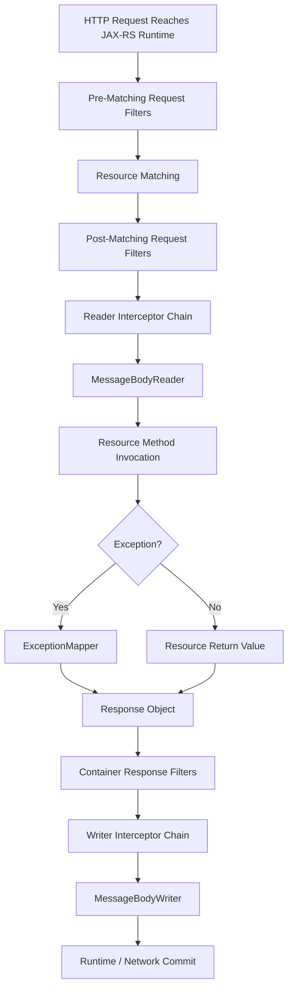
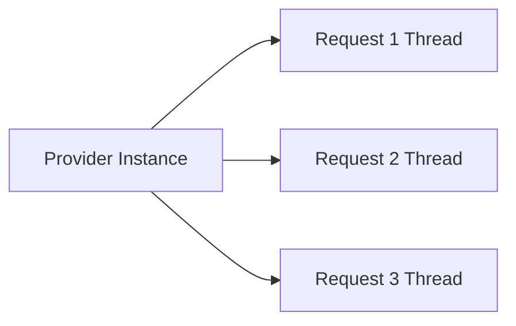
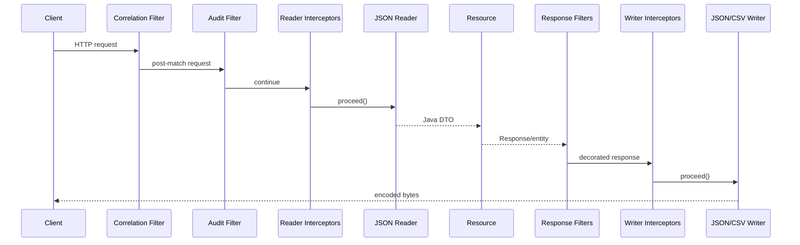
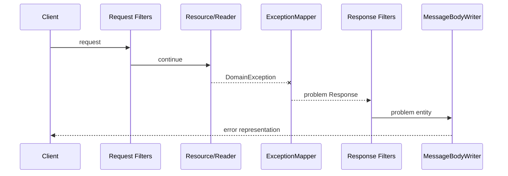

# Part 006 — Providers, Entity Processing, Filters, and Interceptors

> Jakarta REST resource method hanyalah satu titik dalam processing pipeline. Sebelum method dipanggil, filters dapat memodifikasi atau menghentikan request, interceptors dapat membungkus entity stream, dan `MessageBodyReader` mengubah bytes menjadi object. Setelah method selesai, exception mapper, response filters, writer interceptors, dan `MessageBodyWriter` masih dapat mengubah atau menggagalkan response. Senior engineer harus memahami siapa yang menjalankan apa, dalam urutan apa, dengan lifecycle apa, dan pada failure boundary mana.

## Daftar Isi

1. [Target kompetensi](#target-kompetensi)
2. [Scope dan baseline specification](#scope-dan-baseline-specification)
3. [Mental model: extension pipeline](#mental-model-extension-pipeline)
4. [Provider taxonomy](#provider-taxonomy)
5. [Provider discovery dan registration](#provider-discovery-dan-registration)
6. [Provider lifecycle, concurrency, dan state](#provider-lifecycle-concurrency-dan-state)
7. [Provider constructors dan injection](#provider-constructors-dan-injection)
8. [`@ConstrainedTo`](#constrainedto)
9. [Provider priority: selection versus chain ordering](#provider-priority-selection-versus-chain-ordering)
10. [Entity processing mental model](#entity-processing-mental-model)
11. [`MessageBodyReader`](#messagebodyreader)
12. [`MessageBodyWriter`](#messagebodywriter)
13. [Raw type, generic type, dan `GenericEntity`](#raw-type-generic-type-dan-genericentity)
14. [Media type capabilities](#media-type-capabilities)
15. [Standard entity providers](#standard-entity-providers)
16. [Zero-length entity semantics](#zero-length-entity-semantics)
17. [Stream ownership dan buffering](#stream-ownership-dan-buffering)
18. [Transfer encoding versus content encoding](#transfer-encoding-versus-content-encoding)
19. [Reader interceptors](#reader-interceptors)
20. [Writer interceptors](#writer-interceptors)
21. [Container request filters](#container-request-filters)
22. [Pre-matching versus post-matching filters](#pre-matching-versus-post-matching-filters)
23. [`abortWith`](#abortwith)
24. [Container response filters](#container-response-filters)
25. [Global binding dan name binding](#global-binding-dan-name-binding)
26. [Dynamic binding dengan `DynamicFeature`](#dynamic-binding-dengan-dynamicfeature)
27. [`ContextResolver`](#contextresolver)
28. [`ExceptionMapper`](#exceptionmapper)
29. [Exception propagation dan response commit](#exception-propagation-dan-response-commit)
30. [Cross-cutting concern placement](#cross-cutting-concern-placement)
31. [Provider anti-patterns](#provider-anti-patterns)
32. [End-to-end example](#end-to-end-example)
33. [Failure-model matrix](#failure-model-matrix)
34. [Debugging playbook](#debugging-playbook)
35. [PR review checklist](#pr-review-checklist)
36. [Trade-off yang harus dipahami senior engineer](#trade-off-yang-harus-dipahami-senior-engineer)
37. [Standard versus implementation-specific behavior](#standard-versus-implementation-specific-behavior)
38. [Internal verification checklist](#internal-verification-checklist)
39. [Latihan verifikasi](#latihan-verifikasi)
40. [Ringkasan](#ringkasan)
41. [Referensi resmi](#referensi-resmi)

---

## Target kompetensi

Setelah menyelesaikan part ini, Anda harus mampu:

- membedakan resource, provider, filter, entity interceptor, context resolver, dan exception mapper;
- menjelaskan request entity pipeline dari input stream sampai Java object;
- menjelaskan response entity pipeline dari Java object sampai output bytes;
- memprediksi provider yang dipilih berdasarkan media type, raw type, generic type, `isReadable`/`isWriteable`, dan priority;
- membedakan provider selection priority dari filter/interceptor chain ordering;
- memahami bahwa provider default-nya single instance per application dan dapat dipanggil concurrently;
- memilih global, name-bound, atau dynamically bound extension;
- menempatkan authentication, correlation, logging, compression, error mapping, dan serialization concerns pada extension point yang tepat;
- memahami kapan `abortWith` tepat digunakan dan apa yang tetap berjalan setelah abort;
- mendiagnosis missing reader/writer, body consumed twice, wrong filter ordering, duplicate provider, exception recursion, dan response-commit failure;
- mereview provider dari sisi thread safety, stream ownership, memory bounds, security, compatibility, dan observability.

---

## Scope dan baseline specification

Part ini menggunakan **Jakarta RESTful Web Services 4.0** sebagai standard baseline. Beberapa codebase masih berada pada:

- Jakarta REST 3.1;
- Jakarta REST 3.0;
- JAX-RS 2.x dengan namespace `javax.ws.rs`;
- Jersey-specific modules;
- custom internal abstractions yang membungkus provider API.

Karena itu, setiap provider harus diklasifikasikan:

```text
Portable Jakarta REST provider
Jersey-specific provider or feature
Servlet/runtime filter
DI interceptor
Application/domain component
```

Part ini tidak membahas detail:

- Jackson/JSON-B/JAXB configuration mendalam: Part 022;
- Bean Validation: Part 021;
- OpenTelemetry implementation: Part 023;
- security policy: Parts 025–027;
- file/multipart streaming: Part 015;
- Jersey bootstrap dan HK2 internals: Parts 009–010.

Fokusnya adalah **processing extension model dan failure ownership**.

---

## Mental model: extension pipeline

Gunakan pipeline berikut untuk server-side processing:



### Core distinction

```text
Filter
  bekerja pada request/response metadata dan pipeline control.

Entity interceptor
  membungkus proses reader/writer dan entity stream.

Message body provider
  mengubah representation bytes <-> Java object.

Exception mapper
  mengubah exception -> Response.

Context resolver
  menyediakan contextual helper object untuk Java type tertentu.
```

### Pipeline is not purely linear

Beberapa branch penting:

- pre-match filter dapat mengubah URI atau HTTP method;
- request filter dapat `abortWith` sehingga resource method tidak dipanggil;
- reader dapat melempar exception yang masuk exception mapping;
- resource method dapat mengembalikan `Response` tanpa entity;
- exception-mapped response tetap melewati response filters dan writer pipeline;
- writer dapat gagal setelah headers atau sebagian body committed;
- exception saat menulis mapped error response tidak dipetakan berulang untuk mencegah infinite loop.

---

## Provider taxonomy

Provider adalah implementation dari Jakarta REST extension contract.

| Provider type | Direction | Primary responsibility |
|---|---|---|
| `MessageBodyReader<T>` | inbound | representation bytes menjadi `T` |
| `MessageBodyWriter<T>` | outbound | `T` menjadi representation bytes |
| `ContainerRequestFilter` | inbound | request metadata, authorization gate, abort |
| `ContainerResponseFilter` | outbound | response metadata/header decoration |
| `ReaderInterceptor` | inbound entity | membungkus reader/stream |
| `WriterInterceptor` | outbound entity | membungkus writer/stream |
| `ExceptionMapper<T>` | failure | exception menjadi `Response` |
| `ContextResolver<T>` | contextual helper | konfigurasi/context object per Java type |
| `ParamConverterProvider` | parameter binding | string parameter menjadi Java type |
| `DynamicFeature` | deployment/model | binding filters/interceptors ke resource method |
| `Feature` | configuration | conditional registration/configuration |

### Provider versus resource

Resource mewakili HTTP interaction boundary dan dipilih melalui routing. Provider tidak memiliki URI dan dipilih/dijalankan oleh runtime berdasarkan type, media type, binding, priority, atau exception class.

### Provider versus DI interceptor

CDI/HK2 interceptor beroperasi pada method invocation/proxy model DI. Jakarta REST entity interceptor bekerja khusus di sekitar `MessageBodyReader`/`MessageBodyWriter`. Keduanya memiliki lifecycle dan ordering berbeda.

### Provider versus Servlet Filter

Servlet Filter berada di luar Jakarta REST pipeline:

```text
HTTP connector
-> Servlet Filter chain
-> Jersey/JAX-RS servlet
-> Jakarta REST filters/providers
```

Servlet Filter dapat berjalan untuk static content atau non-JAX-RS servlet. JAX-RS filter memiliki resource-aware binding dan Jakarta REST request/response contexts.

---

## Provider discovery dan registration

Provider dapat masuk ke runtime melalui beberapa mekanisme.

## Automatic discovery

Class provider yang ingin ditemukan otomatis biasanya diberi `@Provider`.

```java
import jakarta.ws.rs.ext.Provider;

@Provider
public final class ApiExceptionMapper
        implements ExceptionMapper<ApiException> {
    // ...
}
```

Automatic discovery bergantung pada container/implementation scanning rules. Jangan menganggap semua classpath provider otomatis aktif.

## Explicit registration

Portable registration dapat dilakukan melalui `Application` classes/singletons. Jersey menyediakan `ResourceConfig.register(...)` dan package scanning sebagai extension/convenience.

```java
public final class QuoteApplication extends Application {

    @Override
    public Set<Class<?>> getClasses() {
        return Set.of(
                QuoteResource.class,
                ApiExceptionMapper.class,
                CorrelationFilter.class
        );
    }
}
```

Jersey-specific example:

```java
public final class QuoteResourceConfig extends ResourceConfig {

    public QuoteResourceConfig() {
        register(QuoteResource.class);
        register(ApiExceptionMapper.class);
        register(CorrelationFilter.class);
    }
}
```

### Class registration versus instance registration

```text
register(MyProvider.class)
  runtime/container participates in construction.

register(new MyProvider(...))
  application constructs instance before registration.
```

Consequences of instance registration can include:

- DI injection not performed;
- lifecycle callbacks differ;
- application owns dependencies and cleanup;
- instance is effectively shared;
- test configuration may differ from production.

### Duplicate registration

Provider dapat terdaftar melalui:

- `@Provider` scanning;
- explicit class registration;
- explicit instance registration;
- feature registration;
- DI integration;
- service loader/internal auto-discovery;
- shared platform module.

Duplicate registration dapat menyebabkan:

- filter berjalan dua kali;
- header ditambahkan dua kali;
- body dibungkus/compressed dua kali;
- ambiguous provider selection;
- duplicate metrics/logging;
- unexpected instance lifecycle.

### Internal verification invariant

Buat **provider inventory** saat startup atau melalui test:

```text
provider class
provider type(s)
registration source
binding
priority
lifecycle/scope
client/server applicability
```

---

## Provider lifecycle, concurrency, dan state

Default Jakarta REST behavior: satu instance provider per application. Constructor dipanggil, dependencies diinjeksikan, lalu provider methods dapat dipanggil **simultaneously** untuk banyak requests.



### Consequence

Provider harus dianggap singleton concurrent component kecuali scope alternative telah dibuktikan.

Safe state:

- immutable configuration;
- thread-safe client/reference;
- stateless helpers;
- immutable compiled pattern;
- bounded concurrent cache dengan clear ownership.

Unsafe state:

```java
@Provider
public final class UnsafeFilter implements ContainerRequestFilter {

    private String currentTenant;

    @Override
    public void filter(ContainerRequestContext context) {
        currentTenant = context.getHeaderString("X-Tenant");
        // Cross-request data race and tenant leakage.
    }
}
```

Use local variables or request-context properties:

```java
context.setProperty("tenant.id", tenantId);
```

### Request context property namespace

Gunakan namespaced keys:

```java
public static final String TENANT_PROPERTY =
        "com.csg.quoteorder.tenant.id";
```

Hindari generic keys seperti `id`, `user`, atau `context` yang mudah collision dengan library lain.

### ThreadLocal trap

Provider sering terlihat cocok untuk menyetel `ThreadLocal`/MDC. Risiko:

- async thread switch;
- executor reuse;
- cleanup tidak berjalan saat exception;
- request abort path;
- nested client calls;
- virtual/runtime thread differences;
- thread-pool contamination.

Part 023 akan membahas context propagation. Minimal invariant:

```text
set context
try
    continue pipeline
finally
    clear context
```

Namun filter API tidak selalu memiliki one-method around semantics untuk seluruh request, sehingga cleanup harus dirancang melalui paired request/response filters, completion hooks, atau OTel context mechanisms yang benar.

---

## Provider constructors dan injection

Provider dapat memiliki public constructor dengan supported injection parameters. Jika lebih dari satu constructor dapat digunakan, runtime memilih constructor dengan jumlah parameter terbanyak; tie dapat implementation-specific.

### Avoid constructor ambiguity

Bad:

```java
public AuditFilter(Configuration configuration) { }
public AuditFilter(Providers providers) { }
```

Dua constructor dengan parameter count sama membuat selection tidak jelas.

Better:

```java
@Inject
public AuditFilter(
        AuditPolicy policy,
        Clock clock) {
    // explicit DI constructor
}
```

Exact support untuk `@Inject`, CDI, atau HK2 bergantung integration. Untuk portable provider constructors, ikuti supported Jakarta REST context rules dan verify runtime.

### Request-specific context at construction time

Provider dibuat di luar request tertentu. Request-specific information tidak boleh dibaca dan disimpan saat construction. Ambil melalui filter/interceptor method context.

Bad model:

```text
provider constructor captures current request headers
```

Tidak ada current request yang stabil saat application startup.

### `@PostConstruct`

Jika runtime/DI container berpartisipasi dalam creation, injection biasanya harus selesai sebelum `@PostConstruct`. Tetapi instance yang dibuat application sendiri dapat memiliki lifecycle berbeda.

Internal verification:

- siapa membuat provider;
- siapa menyuntikkan dependencies;
- apakah `@PostConstruct/@PreDestroy` berjalan;
- siapa menutup clients/executors;
- apakah provider class CDI/HK2 singleton/application-scoped.

---

## `@ConstrainedTo`

Provider dapat dibatasi ke server atau client runtime.

```java
import jakarta.ws.rs.RuntimeType;
import jakarta.ws.rs.ConstrainedTo;

@Provider
@ConstrainedTo(RuntimeType.SERVER)
public final class ServerCorrelationFilter
        implements ContainerRequestFilter {
    // ...
}
```

Use cases:

- shared module berisi client dan server providers;
- mencegah provider yang hanya valid di server terdaftar pada Jersey Client;
- memperjelas runtime assumptions.

### Do not use as substitute for module boundaries

Jika client dan server concerns sepenuhnya berbeda, pisahkan modules. `@ConstrainedTo` membantu applicability, tetapi tidak mencegah dependency graph menjadi besar atau accidental class loading.

---

## Provider priority: selection versus chain ordering

Ini salah satu source confusion terbesar.

## Selection providers

Untuk provider yang harus dipilih satu, seperti reader/writer atau exception mapper candidate:

```text
angka @Priority lebih kecil
= priority lebih tinggi
```

```java
@Priority(100)
```

lebih tinggi daripada:

```java
@Priority(500)
```

Application-supplied provider diprioritaskan terhadap pre-packaged provider ketika keduanya applicable.

## Chain providers

Filters dan interceptors membentuk chain.

| Extension chain | Ordering |
|---|---|
| pre-match request filters | ascending priority |
| post-match request filters | ascending priority |
| reader interceptors | ascending priority |
| writer interceptors | ascending priority |
| response filters | descending priority |

Tujuan reverse order response adalah membentuk around-style layering.

```text
Request:
  A(100) -> B(200) -> resource

Response:
  resource -> B(200) -> A(100)
```

### Same-priority order

Jika beberapa providers memiliki priority sama, order dapat implementation-dependent. Jangan mengandalkan source registration order sebagai business/security invariant.

### Built-in priority bands

`jakarta.ws.rs.Priorities` menyediakan categories seperti:

- authentication;
- authorization;
- header decorator;
- entity coder;
- user.

Gunakan category untuk intent, lalu offsets yang documented bila perlu.

```java
@Priority(Priorities.AUTHENTICATION)
```

### Security ordering invariant

Authentication harus selesai sebelum authorization. Tenant resolution mungkin perlu terjadi sebelum authorization, tetapi hanya setelah trusted identity/gateway metadata dapat diverifikasi. Jangan memilih angka secara acak; dokumentasikan dependency graph.

---

## Entity processing mental model

Inbound entity pipeline:

```text
network/container decoded request stream
-> reader interceptors
-> selected MessageBodyReader
-> Java object
```

Outbound entity pipeline:

```text
Java object
-> response filters adjust metadata
-> writer interceptors
-> selected MessageBodyWriter
-> output stream
-> container/network encoding/framing
```

### Entity processing is representation mapping

```text
Content-Type + Java target type
    determine reader candidate.

Selected response media type + Java entity type
    determine writer candidate.
```

### Serialization can fail after application success

Resource method dapat berhasil commit database transaction lalu response serialization gagal. Client menerima ambiguous failure meskipun state berubah.

Example:

```text
POST command succeeds
-> transaction commits
-> response writer encounters cyclic object
-> connection closes / 500
-> client retries
-> duplicate command risk
```

Karena itu, mutating operations memerlukan idempotency strategy dan response DTO yang predictable.

---

## `MessageBodyReader`

`MessageBodyReader<T>` mengubah request representation menjadi Java object.

```java
@Provider
@Consumes("application/vnd.quote-command+json")
public final class QuoteCommandReader
        implements MessageBodyReader<QuoteCommandEnvelope> {

    @Override
    public boolean isReadable(
            Class<?> type,
            Type genericType,
            Annotation[] annotations,
            MediaType mediaType) {
        return type == QuoteCommandEnvelope.class;
    }

    @Override
    public QuoteCommandEnvelope readFrom(
            Class<QuoteCommandEnvelope> type,
            Type genericType,
            Annotation[] annotations,
            MediaType mediaType,
            MultivaluedMap<String, String> headers,
            InputStream entityStream) throws IOException {

        // Parse bounded input. Do not close container-owned stream blindly.
        return parse(entityStream);
    }
}
```

### Reader selection model

Conceptually:

1. obtain request media type;
2. identify target Java raw/generic type;
3. filter readers by compatible `@Consumes` media type;
4. call `isReadable`;
5. select highest-priority applicable reader;
6. call `readFrom`;
7. if none exists, server returns `415`.

### `isReadable` must be cheap

`isReadable` dapat dipanggil during provider selection. Jangan:

- read entity stream;
- parse body;
- query database;
- allocate large objects;
- perform network I/O;
- mutate state.

It should inspect metadata only.

### Reader responsibilities

Good:

- decode representation;
- enforce parser-level limits;
- map malformed syntax to controlled parsing exception;
- preserve generic type information;
- reject unsupported media type parameters;
- avoid unsafe polymorphic deserialization.

Not good:

- authorize user;
- execute business operation;
- load current quote from database;
- publish event;
- open transaction that spans resource method;
- silently repair invalid domain data.

### Parser limits

Protect against:

- deeply nested JSON/XML;
- excessive fields/elements;
- huge strings;
- duplicate object keys policy ambiguity;
- entity expansion;
- decompression bomb;
- large collections;
- polymorphic gadget attacks.

Exact controls depend on Jackson/JSON-B/JAXB parser and will be expanded in Part 022/027.

---

## `MessageBodyWriter`

`MessageBodyWriter<T>` mengubah Java entity menjadi response representation.

```java
@Provider
@Produces("text/csv")
public final class QuoteCsvWriter
        implements MessageBodyWriter<QuoteExport> {

    @Override
    public boolean isWriteable(
            Class<?> type,
            Type genericType,
            Annotation[] annotations,
            MediaType mediaType) {
        return type == QuoteExport.class;
    }

    @Override
    public void writeTo(
            QuoteExport export,
            Class<?> type,
            Type genericType,
            Annotation[] annotations,
            MediaType mediaType,
            MultivaluedMap<String, Object> headers,
            OutputStream entityStream) throws IOException {

        writeCsv(export, entityStream);
    }
}
```

### Writer selection model

Conceptually:

1. determine selected response media type;
2. identify entity raw/generic type;
3. filter writers by compatible `@Produces`;
4. call `isWriteable`;
5. select highest-priority applicable writer;
6. invoke `writeTo`;
7. if no writer exists, response generation fails, typically server error.

### `isWriteable` must be cheap

Do not serialize, inspect entire object graph, access database, or mutate entity in `isWriteable`.

### Writer responsibilities

- serialize exact contract;
- respect selected media type/charset policy;
- write incrementally when payload can be large;
- avoid closing runtime-owned output stream prematurely;
- propagate write failures;
- set content metadata only when ownership is clear.

### Do not hide partial writes

Catching `IOException` and returning normally can produce truncated response marked successful.

Bad:

```java
try {
    write(entity, stream);
} catch (IOException ex) {
    log.warn("Ignored", ex);
}
```

Correct behavior usually propagates failure so runtime can terminate/record response appropriately.

---

## Raw type, generic type, dan `GenericEntity`

Java type erasure matters during writer/reader selection.

Resource method:

```java
@GET
public List<QuoteSummary> list() {
    return service.list();
}
```

Runtime can usually inspect declared generic return type. But when returning a `Response`, generic information can be lost:

```java
return Response.ok(list).build();
```

Runtime sees entity instance class such as `ArrayList`, not necessarily `List<QuoteSummary>`.

Use `GenericEntity` when provider needs generic metadata:

```java
List<QuoteSummary> summaries = service.list();

GenericEntity<List<QuoteSummary>> entity =
        new GenericEntity<>(summaries) { };

return Response.ok(entity).build();
```

### Risks of anonymous generic capture

- code verbosity;
- anonymous class generation;
- accidental wrong generic declaration;
- serializer-specific behavior may mask missing type information.

Prefer concrete response envelope for public APIs:

```java
public record QuoteSummaryPage(
        List<QuoteSummary> items,
        String nextCursor) {
}
```

This creates stable schema and avoids ambiguous root collection metadata.

### Provider type checks

Do not check only raw type if generic type matters.

```java
if (type == List.class) {
    // Too broad; may capture every List in the application.
}
```

Broad providers are dangerous because application-supplied providers can override pre-packaged providers globally.

---

## Media type capabilities

Entity providers can declare supported types:

```java
@Consumes("application/vnd.csg.quote+json")
```

for readers, and:

```java
@Produces("application/vnd.csg.quote+json")
```

for writers.

Absent annotation generally means `*/*`, which is very broad.

### Media type parameters

Examples:

```text
application/json
application/json;charset=UTF-8
application/vnd.csg.quote+json;version=2
```

Do not assume all parameters are ignored. Define which parameters affect compatibility and selection.

### Vendor media types versus standard JSON

Vendor media types can encode contract family/version, but add tooling and gateway complexity. URI/header versioning strategy belongs to Part 003. Provider must not independently invent version semantics inconsistent with governance.

### Quality factors

Resource method matching uses client `q` and server `qs` concepts. Writer selection then operates after response media type determination. Debugging must distinguish:

```text
No resource method produces acceptable type
    -> 406 during matching

Resource method selected but no writer for entity type
    -> response serialization failure
```

---

## Standard entity providers

Jakarta REST implementations must provide baseline readers/writers for several standard combinations, including broadly:

- `byte[]`;
- `String`;
- `InputStream`;
- `Reader`;
- `File`;
- `DataSource`;
- XML `Source` for XML media types;
- form `MultivaluedMap<String, String>`;
- `List<EntityPart>` for `multipart/form-data` in Jakarta REST 4.0;
- `StreamingOutput` as writer-side support;
- boxed primitive/number types for `text/plain`.

Environment integration can add standard JSON-P, JSON-B, and JAXB providers.

### Important caveat

Standard support does not mean production-safe unbounded use.

```java
public byte[] upload(byte[] body)
```

can load the entire request into heap. `String`, `byte[]`, and `File` providers need payload limits and storage ownership.

### `InputStream` entity

Returning or accepting `InputStream` makes stream lifecycle explicit but shifts responsibility:

- who closes it;
- whether runtime writes asynchronously;
- whether source remains open long enough;
- how errors are surfaced;
- whether backpressure exists;
- how size and checksum are enforced.

Part 015 handles file/binary strategies.

### JSON provider ambiguity

A codebase may include:

- JSON-B provider;
- Jackson Jersey module;
- custom Jackson provider;
- internal JSON provider;
- multiple versions transitively.

All may claim `application/json`. Identify which provider wins and why.

---

## Zero-length entity semantics

Zero-length body is not identical to missing `Content-Type`, JSON `null`, empty JSON object, or empty string.

Examples:

```text
Content-Length: 0

body: null

body: {}

body: ""
```

Standard readers have type-specific zero-length behavior. Some produce an empty representation; JAXB and primitive readers can throw `NoContentException`, which server runtime converts to `BadRequestException` for request reading.

### Contract recommendation

For command endpoints, define explicitly:

- whether body is required;
- whether JSON `null` is allowed;
- whether `{}` is valid;
- whether missing body maps to `400`;
- error code and field path;
- whether `Content-Type` is required even for empty body.

### Do not infer from Java null alone

A null DTO can result from:

- no body;
- custom reader behavior;
- JSON `null`;
- filter consumed stream;
- deserializer configuration.

Instrument and test each case.

---

## Stream ownership dan buffering

Entity streams are typically owned by runtime/container. Provider/interceptor may wrap or consume them, but should not assume full ownership.

## Inbound stream

Common failure:

```java
@Provider
@PreMatching
public final class BodyLoggingFilter
        implements ContainerRequestFilter {

    @Override
    public void filter(ContainerRequestContext context)
            throws IOException {
        byte[] body = context.getEntityStream().readAllBytes();
        log(body);
        // Stream is now exhausted.
    }
}
```

Resource reader receives zero bytes.

If buffering is required:

```java
byte[] body = readBounded(context.getEntityStream(), MAX_LOGGABLE_BYTES);
context.setEntityStream(new ByteArrayInputStream(body));
```

But this still loads body into memory and may be unsafe for large uploads. Prefer metadata logging and selective bounded capture.

## Outbound stream

Writer interceptor can wrap output stream for compression, hashing, counting, or encryption. It must restore/finish wrapper correctly and avoid closing underlying runtime stream unexpectedly.

## Buffering trade-offs

| Strategy | Benefit | Risk |
|---|---|---|
| no buffering | low memory, true streaming | cannot replay/read twice |
| memory buffering | simple inspection/retry | heap amplification |
| temp-file buffering | supports larger bodies | disk I/O, cleanup, encryption |
| tee stream | observe while streaming | partial visibility, logging risk |
| parser-level token capture | bounded semantic logging | implementation complexity |

### Memory amplification

A 10 MB JSON request can occupy much more than 10 MB:

```text
network buffers
+ compressed bytes
+ decompressed bytes
+ byte array copy
+ UTF-16 strings/chars
+ parsed object graph
+ logging copy
```

Set limits at gateway, runtime, parser, and application levels.

---

## Transfer encoding versus content encoding

Do not conflate:

```text
Transfer encoding
  message framing during transport, e.g. chunked transfer.

Content encoding
  representation transformation, e.g. gzip.
```

Inbound transfer decoding is handled by container/runtime before `MessageBodyReader`. Reader normally sees decoded entity stream relative to transfer framing.

Content encoding such as gzip may require application/runtime support through interceptors/providers or upstream layer.

### Compression bomb risk

A small compressed request can expand massively. Enforce:

- compressed size limit;
- decompressed size limit;
- expansion ratio limit where feasible;
- parser complexity limit;
- timeout/deadline;
- content encoding allow-list.

### One owner for compression

Compression can happen at:

- CDN/gateway;
- ingress/service mesh;
- Servlet/runtime;
- Jakarta REST writer interceptor;
- application writer.

Multiple owners can create double compression or wrong `Content-Encoding`. Verify one canonical layer per traffic direction and payload class.

---

## Reader interceptors

`ReaderInterceptor` wraps calls to `MessageBodyReader.readFrom`.

```java
@Provider
@Priority(Priorities.ENTITY_CODER)
public final class CountingReaderInterceptor
        implements ReaderInterceptor {

    @Override
    public Object aroundReadFrom(ReaderInterceptorContext context)
            throws IOException, WebApplicationException {

        CountingInputStream counting =
                new CountingInputStream(context.getInputStream());

        context.setInputStream(counting);
        try {
            return context.proceed();
        } finally {
            recordInboundBytes(counting.getCount());
        }
    }
}
```

### `proceed()` is mandatory for delegation

If interceptor does not call `proceed()`, wrapped reader and subsequent interceptors do not run. This may be intentional only if interceptor fully supplies entity object, which is rare and must be explicit.

### Good use cases

- decompression;
- decryption;
- checksum verification;
- bounded byte counting;
- signature validation over raw representation;
- telemetry around deserialization;
- media-type-specific transformation.

### Poor use cases

- domain validation;
- database lookup;
- authorization based on mutable body without canonicalization strategy;
- general request logging of unlimited body;
- modifying business fields silently.

### Canonicalization concern

Signature verification and parser may interpret payload differently. Define whether signature covers:

- raw compressed bytes;
- decompressed bytes;
- canonical serialized representation;
- selected headers plus body.

Do not parse and reserialize to verify signature unless protocol explicitly defines canonicalization.

---

## Writer interceptors

`WriterInterceptor` wraps `MessageBodyWriter.writeTo`.

```java
@Provider
@Compressible
@Priority(Priorities.ENTITY_CODER)
public final class GzipWriterInterceptor
        implements WriterInterceptor {

    @Override
    public void aroundWriteTo(WriterInterceptorContext context)
            throws IOException, WebApplicationException {

        OutputStream original = context.getOutputStream();
        GZIPOutputStream gzip = new GZIPOutputStream(original);

        context.getHeaders().putSingle("Content-Encoding", "gzip");
        context.setOutputStream(gzip);

        try {
            context.proceed();
            gzip.finish();
        } finally {
            context.setOutputStream(original);
        }
    }
}
```

### Writer interceptor use cases

- compression;
- encryption;
- checksum/digest;
- byte counting;
- response signing;
- serialization timing;
- content transformation.

### Failure timing

Writer interceptor can fail:

1. before headers committed;
2. after headers committed but before body;
3. after partial body;
4. while finishing compression/encryption trailer.

Only early failure can reliably become a clean alternative HTTP response. Later failures usually terminate stream/connection and require telemetry rather than remapping.

### Content-Length concern

Transforming output changes byte length. Do not preserve stale `Content-Length`. Prefer chunked/framed runtime behavior or compute transformed length only if fully buffered.

---

## Container request filters

`ContainerRequestFilter` can inspect and modify request context before resource invocation.

```java
@Provider
@Priority(Priorities.HEADER_DECORATOR)
public final class CorrelationRequestFilter
        implements ContainerRequestFilter {

    static final String PROPERTY =
            "com.example.correlation.id";

    @Override
    public void filter(ContainerRequestContext context) {
        String inbound = context.getHeaderString("X-Correlation-ID");
        String correlationId = validateOrGenerate(inbound);
        context.setProperty(PROPERTY, correlationId);
    }
}
```

### Request context can expose

- method;
- URI information;
- headers;
- cookies;
- security context;
- entity stream;
- request-scoped properties;
- abort control.

### Appropriate uses

- correlation/trace setup;
- authentication adapter;
- authorization gate;
- tenant context resolution;
- header normalization;
- protocol precondition checks;
- rate-limit decision when application-owned;
- route-aware audit metadata preparation.

### Avoid heavy work

Global filters run on every request. Database/network calls in filters can:

- increase all endpoint latency;
- create hidden dependency;
- cause cascading failures;
- make health endpoints depend on business systems;
- complicate transaction boundaries;
- run before route matching if pre-match.

Cache or redesign policy evaluation carefully.

---

## Pre-matching versus post-matching filters

## Pre-matching

Annotated with `@PreMatching` and executed before resource method matching.

```java
@Provider
@PreMatching
public final class LegacyPathRewriteFilter
        implements ContainerRequestFilter {

    @Override
    public void filter(ContainerRequestContext context) {
        // Can modify request URI or method before matching.
    }
}
```

Capabilities:

- rewrite method;
- rewrite URI;
- reject malformed global protocol input;
- handle global maintenance gate;
- establish early correlation context.

Limitations:

- no matched `ResourceInfo` yet;
- name binding to resource method is not meaningful in same way;
- may run for unknown paths;
- can accidentally create route/security bypass.

## Post-matching

Default request filter behavior. Resource method has been selected, so `ResourceInfo` and method-level bindings can be available.

Appropriate for:

- method-level authorization;
- operation-specific audit metadata;
- annotation-driven policy;
- route-specific rate limits;
- tenant requirement checks.

### Rewrite is architectural debt

Method/path override may support legacy migration, but it hides external contract from resource model. Track deprecation and remove it. Metrics must show original and effective request separately.

---

## `abortWith`

Request filter can stop request processing:

```java
context.abortWith(
        Response.status(Response.Status.UNAUTHORIZED)
                .entity(problem)
                .type("application/problem+json")
                .build()
);
```

The response is treated similarly to a response produced by resource invocation and continues through relevant response processing.

### Good uses

- authentication failure;
- authorization denial;
- malformed mandatory protocol header;
- maintenance/kill switch;
- rate-limit rejection;
- conditional short-circuit/cache hit when carefully designed.

### Risks

- bypasses resource/application metrics if instrumentation begins too late;
- response filters may assume resource method exists;
- audit completion logic may not run;
- security headers must still be added;
- body writer must exist for error entity;
- inconsistent error shape if each filter constructs its own response.

### Central error factory

Prefer shared problem response factory, but avoid a giant mutable global utility.

```java
Response response = problemResponses.unauthorized(
        correlationId,
        "AUTHENTICATION_REQUIRED"
);
context.abortWith(response);
```

### Abort is not exception

Use abort when filter intentionally owns the response. Throw exception when failure should be handled through centralized exception mapping and stack/causal semantics are valuable. Choose consistently.

---

## Container response filters

Response filters modify metadata after resource/exception response exists but before entity writing.

```java
@Provider
@Priority(Priorities.HEADER_DECORATOR)
public final class SecurityHeadersFilter
        implements ContainerResponseFilter {

    @Override
    public void filter(
            ContainerRequestContext request,
            ContainerResponseContext response) {

        response.getHeaders().putSingle(
                "X-Content-Type-Options",
                "nosniff"
        );
    }
}
```

### Appropriate uses

- security headers;
- correlation ID response header;
- cache policy defaults;
- deprecation/sunset headers;
- CORS response fields where application owns CORS;
- standardized metadata;
- response metrics attributes before writing.

### Avoid body mutation in response filter

Response filter can access/replace entity, but large structural transformation is usually better in application mapper or writer. Replacing entity can alter type information and writer selection unexpectedly.

### `Content-Type` consistency

If filter changes media type, ensure compatible writer exists and contract remains valid. A filter that unconditionally sets JSON content type on CSV/file/error responses is a common production bug.

### Error responses also pass filters

Filters must handle:

- no matched resource;
- `abortWith` response;
- exception-mapped response;
- empty entity;
- streaming entity;
- already set headers;
- partial/committed response constraints.

Do not assume normal DTO entity.

---

## Global binding dan name binding

## Global binding

Provider without name-binding annotation is generally globally bound when registered/discovered.

```java
@Provider
public final class GlobalCorrelationFilter
        implements ContainerRequestFilter {
}
```

Global means every relevant resource request, not necessarily every HTTP request in the process outside Jakarta REST.

## Name binding

Define annotation:

```java
import jakarta.ws.rs.NameBinding;
import java.lang.annotation.ElementType;
import java.lang.annotation.Retention;
import java.lang.annotation.RetentionPolicy;
import java.lang.annotation.Target;

@NameBinding
@Retention(RetentionPolicy.RUNTIME)
@Target({ElementType.TYPE, ElementType.METHOD})
public @interface Audited {
}
```

Bind provider:

```java
@Provider
@Audited
public final class AuditFilter
        implements ContainerRequestFilter,
                   ContainerResponseFilter {
    // ...
}
```

Apply resource:

```java
@POST
@Audited
public Response submit(...) {
    // ...
}
```

### Multiple name bindings

Provider dengan multiple name-binding annotations requires matching binding semantics. Test exact behavior and do not assume logical OR when intent is unclear.

### Binding granularity

Apply at:

- resource class for all methods;
- individual method;
- application class for broader binding semantics;
- dynamic feature for computed rules.

### Annotation taxonomy

Avoid dozens of overlapping annotations:

```text
@Authenticated
@Authorized
@TenantRequired
@Audited
@RateLimited
@TraceBody
@Sensitive
@InternalOnly
```

The combination space becomes hard to reason about. Build a small policy vocabulary and architecture tests for required combinations.

---

## Dynamic binding dengan `DynamicFeature`

`DynamicFeature` registers filters/interceptors based on resource metadata.

```java
@Provider
public final class AuditedFeature implements DynamicFeature {

    @Override
    public void configure(
            ResourceInfo resourceInfo,
            FeatureContext context) {

        boolean audited =
                resourceInfo.getResourceClass()
                        .isAnnotationPresent(Audited.class)
                || resourceInfo.getResourceMethod()
                        .isAnnotationPresent(Audited.class);

        if (audited) {
            context.register(AuditFilter.class);
        }
    }
}
```

### Good uses

- bind policy based on annotation;
- apply filter to specific method signatures;
- bridge internal annotation conventions;
- conditional registration without scanning request path at runtime.

### Risks

- duplicate binding if provider also globally registered;
- reflection rules inconsistent with annotation inheritance;
- runtime/build-time differences;
- feature order interaction;
- hard-to-see effective policy.

### Deployment-time expectation

Dynamic feature resolution is expected/recommended near deployment/model construction rather than every request. Do not put request-dependent logic in `configure`.

### Architecture test

Enumerate resource methods and assert:

```text
all mutating methods have @Audited
all tenant-scoped methods have tenant policy
public methods have authorization policy
health endpoints exclude expensive policies
```

This converts annotations from convention into verifiable invariant.

---

## `ContextResolver`

`ContextResolver<T>` supplies context/helper objects for a Java type.

Example JSON-B context:

```java
@Provider
@Produces(MediaType.APPLICATION_JSON)
public final class JsonbResolver
        implements ContextResolver<Jsonb> {

    private final Jsonb jsonb = JsonbBuilder.create(
            new JsonbConfig()
                    .withNullValues(false)
    );

    @Override
    public Jsonb getContext(Class<?> type) {
        if (isApiDto(type)) {
            return jsonb;
        }
        return null;
    }
}
```

Runtime-supplied JSON-B provider can prefer application context for applicable types.

### Resolver can return null

`null` means this resolver does not supply context for that Java type. Another resolver/default may be used.

### Scope and thread safety

Resolved object such as `Jsonb`, `ObjectMapper`, or `JAXBContext` may be shared. Verify thread-safety of the object and any mutable configuration.

### Resolver versus direct custom provider

Use resolver when standard/implementation provider supports desired representation but needs configuration. Use custom `MessageBodyReader/Writer` when mapping behavior itself differs materially.

### Evolution note

Jakarta REST 4.0 documentation signals a direction toward deeper CDI integration and future changes around `@Context`-related APIs. Avoid spreading `ContextResolver` dependency into domain/application layers and verify roadmap before building large internal frameworks around it.

### Jackson caveat

Jackson integration commonly uses Jersey/Jackson-specific mechanisms such as `ContextResolver<ObjectMapper>` or module configuration. Exact precedence is implementation/module-specific and must be tested.

---

## `ExceptionMapper`

`ExceptionMapper<T>` maps exceptions to `Response`.

```java
@Provider
@Priority(Priorities.USER)
public final class QuoteNotFoundMapper
        implements ExceptionMapper<QuoteNotFoundException> {

    @Override
    public Response toResponse(QuoteNotFoundException exception) {
        ApiProblem problem = ApiProblem.notFound(
                "QUOTE_NOT_FOUND",
                exception.quoteId().value()
        );

        return Response.status(Response.Status.NOT_FOUND)
                .type("application/problem+json")
                .entity(problem)
                .build();
    }
}
```

### Mapper selection

Runtime chooses mapper whose generic exception type is nearest superclass of actual exception. If multiple applicable mappers have same specificity, priority helps selection; equal priorities may be implementation-dependent.

Example hierarchy:

```text
Throwable
  RuntimeException
    DomainException
      QuoteNotFoundException
```

If both `ExceptionMapper<DomainException>` and `ExceptionMapper<QuoteNotFoundException>` exist, specific mapper wins for `QuoteNotFoundException`.

### Default mapper

Runtime includes default `ExceptionMapper<Throwable>` behavior, usually producing `500`, and respects embedded `Response` for `WebApplicationException` according to specification rules.

### Do not catch everything carelessly

A custom `ExceptionMapper<Throwable>` can:

- swallow fatal JVM errors;
- hide programming bugs;
- convert client disconnect into false 500;
- erase causal classification;
- log duplicates;
- expose sensitive stack traces;
- override container diagnostics.

If a catch-all mapper is required, explicitly classify:

- expected application exceptions;
- request parsing/validation exceptions;
- downstream timeout/unavailability;
- cancellation/client disconnect;
- unexpected bugs;
- fatal errors that should not be normalized.

### Mapper must be reliable

Exception mapper is emergency response code. It must avoid:

- database calls;
- remote calls;
- complex template rendering;
- unbounded serialization;
- throwing another exception;
- recursive logging appenders;
- relying on unavailable request context.

### Error DTO writer dependency

Mapper returns an entity, but a writer must serialize it. If error DTO writer fails, runtime does not repeatedly remap that second failure. Keep problem representation simple and heavily tested.

---

## Exception propagation dan response commit

Exceptions can arise from:

- request filter;
- reader interceptor;
- message body reader;
- resource construction/injection;
- resource method;
- response filter;
- writer interceptor;
- message body writer;
- network output.

### Before response commit

Runtime can often use exception mapper and create clean error response.

### After response commit

Status and headers may already be sent. Runtime cannot replace response reliably. Outcomes include:

- truncated body;
- connection reset;
- HTTP/2 stream reset;
- proxy-generated error;
- client parse failure;
- no clear status change.

### One-mapper rule

A single exception mapper is used during request/response cycle to avoid recursive mapping. If writing an exception-mapped response fails, runtime does not invoke another mapper for that writer failure.

### Operational implications

Measure separately:

- resource/application exceptions;
- mapped status outcomes;
- serialization failures;
- bytes written before failure;
- client disconnects;
- response already committed;
- stream resets.

A dashboard based only on HTTP status may miss partial-write failures.

### Transaction boundary implication

Do not keep database transaction open through response serialization merely to “rollback if writer fails”. That increases lock duration and still cannot guarantee client delivery. Use:

- idempotency;
- outbox/event consistency;
- deterministic response DTOs;
- post-commit operation semantics;
- reconciliation where needed.

---

## Cross-cutting concern placement

Use this decision table.

| Concern | Preferred location | Why |
|---|---|---|
| correlation ID validation/generation | global request filter | request metadata |
| authentication token processing | auth filter/runtime security | before application invocation |
| method-level authorization | post-match filter or application policy | resource metadata/domain context |
| tenant context extraction | request filter, then explicit application context | cross-cutting boundary |
| request body JSON mapping | JSON provider | representation mapping |
| DTO-to-domain mapping | resource/application mapper | domain boundary |
| gzip body transform | interceptor/runtime/gateway | stream wrapping |
| standard response headers | response filter | metadata decoration |
| domain exception to API problem | exception mapper | transport error mapping |
| audit business decision | application/domain service plus reliable persistence | needs business outcome |
| access logging | runtime/filter/OTel instrumentation | protocol-level observability |
| SQL transaction | application/repository boundary | not transport provider |
| retry/circuit breaker | outbound client/application integration | dependency call semantics |

### Audit nuance

Request filter can capture actor, tenant, correlation, and operation metadata. But final auditable business event should be emitted where business outcome is known, not only in HTTP response filter. A `200` response filter does not prove durable business state or event publication.

### Rate limiting nuance

Rate limiting may be owned by gateway, service mesh, application filter, or Redis coordination. Do not unknowingly apply multiple uncoordinated limits. Part 024/039 covers distributed policy.

---

## Provider anti-patterns

## 1. God filter

One filter handles:

```text
authentication
+ authorization
+ tenant
+ logging
+ metrics
+ transaction
+ exception mapping
+ response headers
```

It becomes impossible to order, test, or reuse. Split by responsibility and document ordering dependencies.

## 2. Body logging without bounds

Reading and logging entire payload causes:

- body consumption;
- heap amplification;
- PII leakage;
- log cost explosion;
- latency;
- serialization of binary data.

Prefer metadata and selective redacted fields.

## 3. Mutable singleton provider state

Storing current request, tenant, actor, URI, or entity in fields creates cross-request contamination.

## 4. Catch-all mapper returns `200`

Transport failures must not masquerade as successful business response.

## 5. Broad custom JSON provider

An application provider claiming `Object` + `application/json` can replace standard Jackson/JSON-B behavior for every DTO and break compatibility.

## 6. Double registration

`@Provider` plus explicit feature registration can make filter execute twice.

## 7. Missing `proceed()`

Reader/writer interceptor silently prevents serialization/deserialization.

## 8. Closing underlying stream

Provider closes container-managed stream, breaking subsequent processing or runtime framing.

## 9. Response filter overwrites explicit headers

Global cache/CORS/content-type filter ignores endpoint-specific policy.

Use set-if-absent or explicit precedence policy.

## 10. Network I/O inside mapper/filter

Error handling and every-request path depend on another unstable service, worsening cascading failure.

## 11. Domain mutation in deserializer

Reader changes business values, applies pricing defaults, or loads catalog. Representation mapping becomes hidden business logic.

## 12. Same priority with order dependency

Two security filters require order but share priority. Works locally, changes after runtime/module upgrade.

---

## End-to-end example

Contoh berikut menunjukkan correlation, name-bound audit metadata, standardized error mapping, dan custom CSV writer tanpa mencampur domain logic.

### Name-binding annotation

```java
@NameBinding
@Retention(RetentionPolicy.RUNTIME)
@Target({ElementType.TYPE, ElementType.METHOD})
public @interface AuditedOperation {
}
```

### Correlation request/response filter

```java
@Provider
@Priority(Priorities.HEADER_DECORATOR)
public final class CorrelationFilter
        implements ContainerRequestFilter,
                   ContainerResponseFilter {

    public static final String PROPERTY =
            "com.example.request.correlation-id";

    @Override
    public void filter(ContainerRequestContext request) {
        String correlationId = normalizeOrGenerate(
                request.getHeaderString("X-Correlation-ID")
        );
        request.setProperty(PROPERTY, correlationId);
    }

    @Override
    public void filter(
            ContainerRequestContext request,
            ContainerResponseContext response) {

        Object value = request.getProperty(PROPERTY);
        if (value instanceof String correlationId) {
            response.getHeaders().putSingle(
                    "X-Correlation-ID",
                    correlationId
            );
        }
    }
}
```

### Audit metadata filter

```java
@Provider
@AuditedOperation
@Priority(Priorities.USER)
public final class AuditMetadataFilter
        implements ContainerRequestFilter {

    @Context
    ResourceInfo resourceInfo;

    @Override
    public void filter(ContainerRequestContext request) {
        AuditRequestMetadata metadata = new AuditRequestMetadata(
                resourceInfo.getResourceClass().getName(),
                resourceInfo.getResourceMethod().getName(),
                request.getMethod()
        );

        request.setProperty(
                "com.example.audit.metadata",
                metadata
        );
    }
}
```

This filter captures metadata only. Durable audit entry is written by application service after outcome is known.

### Domain exception mapper

```java
@Provider
public final class DomainExceptionMapper
        implements ExceptionMapper<DomainException> {

    @Override
    public Response toResponse(DomainException exception) {
        ApiProblem problem = ApiProblem.builder()
                .status(exception.httpStatus())
                .code(exception.code())
                .detail(exception.safeMessage())
                .build();

        return Response.status(exception.httpStatus())
                .type("application/problem+json")
                .entity(problem)
                .build();
    }
}
```

### CSV writer

```java
@Provider
@Produces("text/csv")
public final class QuoteExportCsvWriter
        implements MessageBodyWriter<QuoteExport> {

    @Override
    public boolean isWriteable(
            Class<?> type,
            Type genericType,
            Annotation[] annotations,
            MediaType mediaType) {
        return type == QuoteExport.class;
    }

    @Override
    public void writeTo(
            QuoteExport export,
            Class<?> type,
            Type genericType,
            Annotation[] annotations,
            MediaType mediaType,
            MultivaluedMap<String, Object> headers,
            OutputStream output) throws IOException {

        headers.putSingle(
                "Content-Disposition",
                "attachment; filename=\"quotes.csv\""
        );

        Writer writer = new BufferedWriter(
                new OutputStreamWriter(output, StandardCharsets.UTF_8));

        export.writeCsv(writer);
        writer.flush();
        // Do not close the runtime-owned OutputStream here.
    }
}
```

Writer hanya melakukan `flush`; ia tidak menutup container-owned output stream. Bila wrapper memiliki trailer/finalization semantics seperti gzip atau encryption, gunakan interceptor yang menyelesaikan wrapper secara eksplisit tanpa mengambil alih ownership stream dasar.

### Resource

```java
@Path("/quotes")
@Produces(MediaType.APPLICATION_JSON)
public final class QuoteResource {

    private final QuoteApplicationService service;

    public QuoteResource(QuoteApplicationService service) {
        this.service = service;
    }

    @POST
    @Consumes(MediaType.APPLICATION_JSON)
    @AuditedOperation
    public Response create(CreateQuoteRequest request) {
        CreatedQuote created = service.create(request.toCommand());
        return Response.created(created.location())
                .entity(QuoteResponse.from(created.quote()))
                .build();
    }

    @GET
    @Path("/export")
    @Produces("text/csv")
    public QuoteExport export() {
        return service.export();
    }
}
```

### Normal request sequence



### Exception request sequence



---

## Failure-model matrix

| Failure | Pipeline stage | Observable outcome | Likely cause | Evidence |
|---|---|---|---|---|
| Provider never invoked | discovery/binding | missing behavior | not registered, wrong scope, name binding mismatch | startup inventory |
| Filter invoked twice | registration | duplicate headers/logs | scanning plus explicit registration | call counters |
| Wrong reader selected | provider selection | parse error/wrong DTO | broad application provider, priority | provider debug logs |
| No reader | entity read | `415` | media type/type mismatch | `Content-Type`, registry |
| No writer | entity write | `500`/connection failure | unsupported entity type/media type | serialization stack trace |
| `isReadable` expensive | selection | latency on every request | I/O/parsing in predicate | profiler/trace |
| Body empty in reader | pre-reader | parse/no-content error | filter consumed stream | filter logs, byte count |
| Request memory spike | buffering/read | OOM/GC pressure | `readAllBytes`, large body | heap/JFR |
| Cross-tenant data leak | provider lifecycle | wrong tenant context | mutable provider field | concurrency test |
| Auth runs after authorization | filter ordering | incorrect denial/bypass | priority misconfiguration | ordered trace logs |
| Response header duplicated | response filters | malformed client behavior | duplicate registration/add semantics | response capture |
| `proceed()` missing | interceptor | entity never read/written | interceptor bug | breakpoint/call chain |
| Compression corrupt | writer interceptor | client decompression failure | double gzip, missing finish | wire capture |
| Error mapper not used | exception mapping | default 500 | generic type/registration mismatch | mapper registry |
| Mapper throws | error processing | plain 500 | mapper dependency/serialization bug | secondary stack trace |
| Error body writer fails | error response writing | truncated/reset response | complex problem DTO/provider | bytes-written metric |
| Filter assumes resource exists | pre-match/error path | NPE | `ResourceInfo` used too early | stack trace |
| Stream closed early | writer/runtime | truncated body | provider closes output | network traces |
| Stale `Content-Length` | transform | truncated/hanging client | compression after length set | headers/wire bytes |
| Same-priority order changes | chain | intermittent behavior after upgrade | implementation-dependent tie | runtime version diff |
| Body logging leaks PII | filter/interceptor | security incident | unredacted payload logging | log audit |

### Failure domains

```text
Discovery/configuration failure
  provider absent or duplicated.

Selection failure
  wrong/no provider for type/media.

Chain-order failure
  provider runs at wrong point.

Lifecycle/concurrency failure
  shared mutable state or context leak.

Stream failure
  consumed, closed, unbounded, transformed incorrectly.

Error-path failure
  mapper/writer fails while handling another failure.

Commit failure
  response cannot be replaced after partial write.
```

---

## Debugging playbook

## Step 1 — Identify extension point

Ask:

```text
Did failure occur before matching?
After matching but before resource?
During entity read?
Inside resource?
During exception mapping?
During response filtering?
During entity write?
After commit?
```

Do not call every pre-resource failure “filter issue” or every post-resource failure “serialization issue”.

## Step 2 — Build provider inventory

Record:

```text
class
interfaces implemented
@Provider present
registration source
@Consumes/@Produces
@NameBinding annotations
@Priority
@ConstrainedTo
DI scope
instance identity
```

For Jersey, inspect `ResourceConfig`, features, package scanning, and startup logs. Exact model APIs are Jersey-specific.

## Step 3 — Trace chain order explicitly

Temporarily instrument providers with:

```text
request ID
provider class
phase
priority
thread name
matched resource method if available
```

Expected:

```text
request filters ascending
reader interceptors ascending
response filters descending
writer interceptors ascending
```

Remove verbose logging after proof or keep as bounded debug mode.

## Step 4 — Test provider selection predicates

For reader/writer, capture:

```text
raw type
generic type
annotations
media type
isReadable/isWriteable result
priority
```

A broad predicate such as `Object.class.isAssignableFrom(type)` can steal all DTOs.

## Step 5 — Compare entity byte counts

Measure bytes at:

- ingress/runtime if available;
- before request filters;
- before reader interceptors;
- at reader;
- output before writer;
- after writer interceptor transform.

If bytes disappear, locate first boundary where count changes unexpectedly.

## Step 6 — Reproduce with minimal entity type

Replace complex DTO response with:

```java
return Response.ok("ok", MediaType.TEXT_PLAIN).build();
```

If succeeds, routing/resource path works and issue is writer/entity graph/media type.

For inbound, temporarily accept `InputStream` or `String` in isolated test to distinguish raw body delivery from JSON mapping.

## Step 7 — Prove error-path writer

Trigger mapper intentionally and verify:

- mapper called once;
- problem media type selected;
- problem writer found;
- response filters run;
- no sensitive exception detail;
- correlation ID present;
- mapper does not throw.

## Step 8 — Reproduce concurrency

Send parallel requests with distinct:

```text
tenant
actor
correlation ID
media type
```

Assert no cross-request contamination. This detects mutable singleton provider fields and ThreadLocal cleanup bugs.

## Step 9 — Inspect commit timing

For streaming/large responses, capture:

- when headers are sent;
- bytes written before failure;
- whether runtime logs “response already committed”;
- proxy/client status;
- connection/stream reset.

## Step 10 — Compare runtime upgrades

Provider ordering and auto-discovery conflicts can surface after Jersey/Jakarta/module upgrades. Maintain integration tests that assert effective behavior, not internal implementation details.

---

## PR review checklist

### Registration and lifecycle

- [ ] Provider registration source is explicit or discoverable.
- [ ] `@Provider` plus explicit registration does not duplicate instances.
- [ ] Provider scope/lifecycle is known.
- [ ] Provider is stateless or thread-safe.
- [ ] No request data is stored in instance fields.
- [ ] Constructor is unambiguous.
- [ ] Application-created provider instances receive required dependencies.
- [ ] Cleanup ownership is defined.

### Priority and binding

- [ ] Priority reflects documented dependency order.
- [ ] Same-priority providers do not require deterministic ordering.
- [ ] Pre-match filter truly needs pre-match capability.
- [ ] Name binding is applied consistently.
- [ ] Dynamic feature does not duplicate global registration.
- [ ] Client/server applicability is explicit where needed.
- [ ] Architecture tests cover mandatory policy annotations.

### Entity readers/writers

- [ ] `isReadable/isWriteable` are pure and cheap.
- [ ] Provider scope is narrow enough by type and media type.
- [ ] Generic type handling is correct.
- [ ] Parser and output operations are bounded.
- [ ] No business logic or database calls occur in reader/writer.
- [ ] Stream is not closed prematurely.
- [ ] Exceptions propagate with controlled mapping.
- [ ] Zero-length behavior is tested.
- [ ] Unknown fields/polymorphism policy follows serialization standard.

### Filters

- [ ] Filter concern belongs at transport boundary.
- [ ] Global filter overhead is measured/bounded.
- [ ] `abortWith` response follows standard error schema.
- [ ] Filter handles unmatched/error/empty-entity paths.
- [ ] Header merge/overwrite behavior is intentional.
- [ ] Authentication precedes authorization.
- [ ] Tenant resolution trust boundary is explicit.
- [ ] No body logging without strict bounds and redaction.

### Interceptors

- [ ] `proceed()` is called exactly as intended.
- [ ] Wrapped stream is restored where needed.
- [ ] Compression/encryption has one owner.
- [ ] `Content-Length` remains correct or is removed.
- [ ] Finish/flush behavior is correct.
- [ ] Partial-write failure is observable.
- [ ] Decompressed size is bounded.

### Exception mappers

- [ ] Specific exception hierarchy and precedence are clear.
- [ ] Catch-all mapper does not swallow fatal conditions blindly.
- [ ] Mapper performs no remote/database call.
- [ ] Mapper cannot expose stack trace, SQL, token, or PII.
- [ ] Error DTO serialization is simple and tested.
- [ ] Correlation ID is present.
- [ ] Same exception is not logged redundantly at every layer.
- [ ] `WebApplicationException` handling is intentional.

### Observability and operations

- [ ] Provider timing/failure metrics have bounded cardinality.
- [ ] Route names use templates, not raw IDs.
- [ ] Reader/writer failures are distinguishable from application failures.
- [ ] Bytes read/written and payload-limit rejection are observable.
- [ ] Startup provider inventory/model errors are visible.
- [ ] Security filters have audit evidence without sensitive data.

---

## Trade-off yang harus dipahami senior engineer

## Provider versus application mapping

| Provider mapping | Application mapping |
|---|---|
| central representation behavior | explicit endpoint/domain boundary |
| reusable across resources | easier business context |
| can override globally | less hidden behavior |
| good for wire formats | good for DTO-to-command mapping |

Use providers for representation mechanics, not domain orchestration.

## Global filter versus name-bound filter

| Global | Name-bound |
|---|---|
| consistent baseline | selective cost/policy |
| runs everywhere | risk of missing annotation |
| simpler registration | requires governance tests |

Global for universal protocol concerns; name-bound/dynamic for operation-specific policy.

## Exception versus `abortWith`

| Throw exception | `abortWith` |
|---|---|
| centralized mapper | filter owns response directly |
| preserves cause/stack | explicit short-circuit |
| can unify errors | can fragment error construction |

Choose one per policy family and standardize.

## Custom writer versus precomputed bytes

| Custom writer/streaming | Precomputed `byte[]` |
|---|---|
| low memory, supports large output | known length, simpler retry/testing |
| failure can occur after commit | heap cost |
| harder to hash/sign beforehand | easy checksum |

Choose based on payload size, latency, integrity, and failure semantics.

## Application provider override versus implementation defaults

Custom provider gives control but increases upgrade and compatibility burden. Application-supplied provider may win over runtime default, so keep selection narrow and test all affected DTOs/media types.

## Buffering versus true streaming

Buffering enables inspection, signatures, known length, and alternate error response before commit. Streaming reduces memory and latency but makes late failures unavoidable. Treat this as explicit architectural decision.

## One filter with paired request/response versus separate filters

Combined class shares code but provider lifecycle remains singleton and request state cannot live in fields. Separate classes can clarify order and responsibility. Use request properties for per-request linkage.

---

## Standard versus implementation-specific behavior

| Concern | Jakarta REST standard | Must verify internally |
|---|---|---|
| provider interfaces | standard | versions/namespaces |
| `@Provider` discovery contract | standard concept | actual scanning/classpath rules |
| default provider lifecycle | one per application | CDI/HK2/custom scopes |
| reader/writer selection semantics | standard | debug diagnostics and built-in provider list |
| application provider precedence | standard | duplicate module/provider conflicts |
| filter/interceptor priority direction | standard | same-priority tie order |
| name binding | standard server API | annotation scanning conventions |
| dynamic feature | standard | deployment timing and Jersey model behavior |
| JSON Jackson provider | not core Jakarta REST standard | Jersey/Jackson module/configuration |
| JSON-B/JAXB integration | environment/spec integration | actual product support |
| compression | application/runtime choice | gateway/server/interceptor ownership |
| provider metrics | not standardized | OTel/Jersey/internal instrumentation |
| error body schema | application-owned | internal API standard |
| body size limits | multi-layer/platform | gateway/runtime/parser settings |
| client disconnect classification | runtime/network-specific | server logs and metrics |

### Standard API does not reveal implementation

Imports such as:

```java
jakarta.ws.rs.ext.MessageBodyReader
```

prove use of Jakarta REST API, not Jersey-specific provider selection internals. Look for:

- `org.glassfish.jersey.*`;
- server bootstrap;
- BOM/dependencies;
- `ResourceConfig`;
- features/modules;
- deployment descriptors.

---

## Internal verification checklist

### Provider inventory

- [ ] Enumerate all `@Provider` classes.
- [ ] Enumerate explicit registrations in `Application`/`ResourceConfig`/features.
- [ ] Identify providers from shared/internal libraries.
- [ ] Identify service-loader/auto-discovery modules.
- [ ] Detect duplicate registration.
- [ ] Record priorities and bindings.
- [ ] Record runtime scope/lifecycle.

### Serialization stack

- [ ] Determine JSON provider: JSON-B, Jackson, custom, or multiple.
- [ ] Determine XML/JAXB provider usage.
- [ ] Find `ContextResolver<ObjectMapper/Jsonb/JAXBContext>`.
- [ ] Check media type declarations.
- [ ] Check unknown-field, null, date/time, and polymorphism settings.
- [ ] Find custom readers/writers and their affected types.
- [ ] Verify generic collection response behavior.

### Filters and interceptors

- [ ] List pre-match filters.
- [ ] List post-match/global/name-bound filters.
- [ ] Document security ordering.
- [ ] Document tenant/correlation propagation.
- [ ] Find body-logging or body-buffering code.
- [ ] Find compression/encryption/signature interceptors.
- [ ] Verify `proceed()` and stream restoration.
- [ ] Check duplicate CORS/security headers across gateway and app.

### Error handling

- [ ] Enumerate all exception mappers by generic type.
- [ ] Determine catch-all mapper behavior.
- [ ] Verify nearest-superclass and priority conflicts.
- [ ] Verify `WebApplicationException` policy.
- [ ] Verify problem-details/error DTO writer.
- [ ] Check logging duplication and sensitive detail redaction.
- [ ] Test exception thrown from mapper/writer.

### Payload and stream safety

- [ ] Gateway maximum request/response size.
- [ ] Runtime/entity size limits.
- [ ] JSON/XML parser limits.
- [ ] Compressed and decompressed size limits.
- [ ] Temporary-file threshold/cleanup.
- [ ] Streaming endpoint inventory.
- [ ] Client disconnect handling.
- [ ] Bytes-written/read telemetry.

### Runtime-specific verification

- [ ] Jersey version and modules.
- [ ] Jersey media modules such as Jackson/JSON-B/multipart.
- [ ] HK2/CDI injection behavior for providers.
- [ ] Servlet filter chain before Jersey.
- [ ] GlassFish/Grizzly/Tomcat/Jetty compression settings.
- [ ] Server response buffering/commit threshold.
- [ ] Provider/model debug logging capability.

### Governance

- [ ] Internal rule for writing new providers.
- [ ] Approved priorities and annotation vocabulary.
- [ ] Error-schema standard.
- [ ] Redaction and PII policy.
- [ ] Serialization compatibility tests.
- [ ] Architecture tests for mandatory filters.
- [ ] Performance tests for global providers.
- [ ] Ownership of shared provider libraries.

---

## Latihan verifikasi

### Latihan 1 — Provider selection collision

Buat dua `MessageBodyWriter<QuoteResponse>` dengan media type sama dan priorities berbeda. Verifikasi writer yang dipilih. Lalu samakan priority dan catat runtime warning/behavior.

### Latihan 2 — Generic type loss

Bandingkan:

```java
return List<QuoteSummary>;
```

```java
return Response.ok(list).build();
```

```java
return Response.ok(new GenericEntity<List<QuoteSummary>>(list) {}).build();
```

Inspect raw/generic type yang diterima writer.

### Latihan 3 — Request body consumption

Tambahkan filter yang membaca body tanpa reset. Buktikan reader menerima zero bytes. Kemudian implement bounded buffering dan ukur memory amplification.

### Latihan 4 — Priority chain

Buat request filters dengan priority 100, 200, 300 dan response filters yang sama. Rekam order normal, abort, dan exception-mapped response.

### Latihan 5 — Name binding

Terapkan `@AuditedOperation` pada class dan method. Verifikasi effective binding, lalu hapus annotation dari satu mutating method dan buat architecture test yang gagal.

### Latihan 6 — Missing `proceed()`

Buat reader/writer interceptor yang tidak memanggil `proceed()`. Amati failure dan rumuskan static/code-review rule untuk mencegahnya.

### Latihan 7 — Mapper failure

Buat exception mapper yang sengaja melempar exception, lalu writer error DTO yang sengaja gagal. Catat jumlah mapping attempts dan response/connection behavior.

### Latihan 8 — Concurrent provider state

Simpan correlation ID pada provider field, jalankan parallel requests, dan buktikan contamination. Perbaiki menggunakan request properties/context propagation.

### Latihan 9 — Compression ownership

Aktifkan compression pada gateway/runtime/interceptor secara bergantian. Buktikan `Content-Encoding`, `Content-Length`, wire bytes, dan client decode behavior. Pilih satu ownership model.

### Latihan 10 — Provider startup inventory

Buat integration test atau startup report yang menghasilkan:

```text
provider class
extension type
priority
binding
media type
scope
registration source
```

Gunakan report untuk review upgrade runtime.

---

## Ringkasan

Mental model Part 006:

```text
Filters control and decorate request/response metadata.
Interceptors wrap entity reading/writing.
Readers and writers map representations to Java types.
Exception mappers turn failures into responses.
Context resolvers configure type-specific helper contexts.
All of them are providers with lifecycle and ordering consequences.
```

Invariant terpenting:

1. **Provider default-nya shared per application dan dapat dipanggil concurrently.**
2. **Provider registration harus dapat diinventarisasi; duplicate registration adalah production risk.**
3. **`isReadable` dan `isWriteable` harus pure, cheap, dan metadata-only.**
4. **Application-supplied broad provider dapat mengambil alih runtime defaults.**
5. **Filter priority dan response-filter reverse ordering harus dipahami sebagai chain.**
6. **Entity interceptor wajib memanggil `proceed()` bila ingin mendelegasikan pipeline.**
7. **Entity stream umumnya runtime-owned; membaca atau menutupnya mengubah downstream behavior.**
8. **Exception-mapped response tetap memerlukan response filters dan working writer.**
9. **Failure setelah response commit tidak dapat diubah menjadi clean error response.**
10. **Cross-cutting concern harus ditempatkan berdasarkan lifecycle dan information ownership, bukan convenience.**

Part berikutnya akan membahas `Application`, Jersey `ResourceConfig`, explicit registration, package scanning, features, properties, component model, bootstrap determinism, dan startup validation.

---

## Referensi resmi

- [Jakarta RESTful Web Services Project](https://jakarta.ee/specifications/restful-ws/)
- [Jakarta RESTful Web Services 4.0 Specification](https://jakarta.ee/specifications/restful-ws/4.0/jakarta-restful-ws-spec-4.0)
- [Jakarta RESTful Web Services 4.0 API](https://jakarta.ee/specifications/restful-ws/4.0/apidocs/)
- [Jakarta REST API — `Provider`](https://jakarta.ee/specifications/restful-ws/4.0/apidocs/jakarta.ws.rs/jakarta/ws/rs/ext/provider)
- [Jakarta REST API — `MessageBodyReader`](https://jakarta.ee/specifications/restful-ws/4.0/apidocs/jakarta.ws.rs/jakarta/ws/rs/ext/messagebodyreader)
- [Jakarta REST API — `MessageBodyWriter`](https://jakarta.ee/specifications/restful-ws/4.0/apidocs/jakarta.ws.rs/jakarta/ws/rs/ext/messagebodywriter)
- [Jakarta REST API — `ContainerRequestFilter`](https://jakarta.ee/specifications/restful-ws/4.0/apidocs/jakarta.ws.rs/jakarta/ws/rs/container/containerrequestfilter)
- [Jakarta REST API — `ContainerResponseFilter`](https://jakarta.ee/specifications/restful-ws/4.0/apidocs/jakarta.ws.rs/jakarta/ws/rs/container/containerresponsefilter)
- [Jakarta REST API — `ReaderInterceptor`](https://jakarta.ee/specifications/restful-ws/4.0/apidocs/jakarta.ws.rs/jakarta/ws/rs/ext/readerinterceptor)
- [Jakarta REST API — `WriterInterceptor`](https://jakarta.ee/specifications/restful-ws/4.0/apidocs/jakarta.ws.rs/jakarta/ws/rs/ext/writerinterceptor)
- [Jakarta REST API — `ExceptionMapper`](https://jakarta.ee/specifications/restful-ws/4.0/apidocs/jakarta.ws.rs/jakarta/ws/rs/ext/exceptionmapper)
- [Jakarta REST API — `ContextResolver`](https://jakarta.ee/specifications/restful-ws/4.0/apidocs/jakarta.ws.rs/jakarta/ws/rs/ext/contextresolver)
- [Jakarta REST API — `DynamicFeature`](https://jakarta.ee/specifications/restful-ws/4.0/apidocs/jakarta.ws.rs/jakarta/ws/rs/container/dynamicfeature)
- [Jakarta REST API — `NameBinding`](https://jakarta.ee/specifications/restful-ws/4.0/apidocs/jakarta.ws.rs/jakarta/ws/rs/namebinding)
- [Jakarta REST API — `Priorities`](https://jakarta.ee/specifications/restful-ws/4.0/apidocs/jakarta.ws.rs/jakarta/ws/rs/priorities)
- [Jakarta REST API — `GenericEntity`](https://jakarta.ee/specifications/restful-ws/4.0/apidocs/jakarta.ws.rs/jakarta/ws/rs/core/genericentity)
