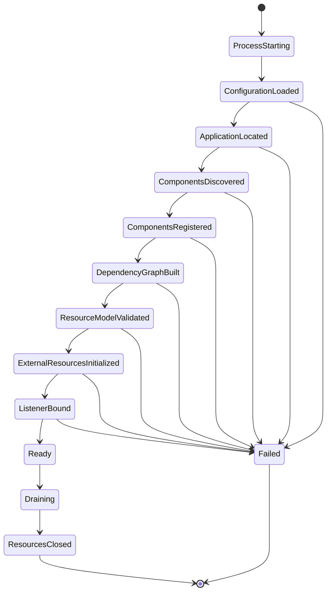
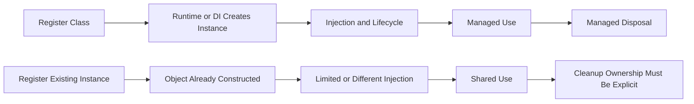
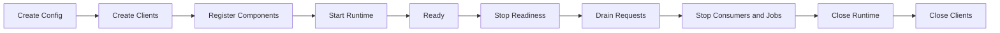

# Part 007 — Application, ResourceConfig, Features, and Component Registration

> Sebuah class berisi `@Path` belum otomatis menjadi endpoint. Runtime harus mengetahui application model, menemukan atau menerima registrasi resource dan provider, menggabungkan configuration, mengaktifkan features, membangun dependency graph, memvalidasi model, lalu memublikasikan application pada transport tertentu. Bootstrap yang tidak eksplisit menghasilkan sistem yang “berjalan karena classpath”, sulit direproduksi, dan berisiko berubah hanya karena dependency baru ditambahkan.

## Daftar Isi

1. [Target kompetensi](#target-kompetensi)
2. [Scope dan baseline](#scope-dan-baseline)
3. [Mental model: source code bukan runtime model](#mental-model-source-code-bukan-runtime-model)
4. [Bootstrap lifecycle end-to-end](#bootstrap-lifecycle-end-to-end)
5. [Standard `Application`](#standard-application)
6. [`@ApplicationPath`](#applicationpath)
7. [`getClasses()` dan `getSingletons()`](#getclasses-dan-getsingletons)
8. [`getProperties()` dan configuration properties](#getproperties-dan-configuration-properties)
9. [Class registration versus instance registration](#class-registration-versus-instance-registration)
10. [Portable discovery versus implementation discovery](#portable-discovery-versus-implementation-discovery)
11. [Standard `Configurable` dan `Configuration`](#standard-configurable-dan-configuration)
12. [Standard `Feature`](#standard-feature)
13. [`FeatureContext`](#featurecontext)
14. [`DynamicFeature` dan per-resource binding](#dynamicfeature-dan-per-resource-binding)
15. [Jersey `ResourceConfig`](#jersey-resourceconfig)
16. [Explicit registration dengan `ResourceConfig`](#explicit-registration-dengan-resourceconfig)
17. [Package scanning](#package-scanning)
18. [Jersey server properties](#jersey-server-properties)
19. [Auto-discovery dan classpath-driven behavior](#auto-discovery-dan-classpath-driven-behavior)
20. [Programmatic resource model](#programmatic-resource-model)
21. [Conditional registration dan profiles](#conditional-registration-dan-profiles)
22. [Configuration precedence](#configuration-precedence)
23. [Bootstrap, dependency injection, dan ownership](#bootstrap-dependency-injection-dan-ownership)
24. [Provider and feature ordering](#provider-and-feature-ordering)
25. [Configuration freeze dan runtime mutation](#configuration-freeze-dan-runtime-mutation)
26. [Model validation dan fail-fast startup](#model-validation-dan-fail-fast-startup)
27. [Component inventory sebagai operational artifact](#component-inventory-sebagai-operational-artifact)
28. [Health, readiness, dan bootstrap completion](#health-readiness-dan-bootstrap-completion)
29. [Graceful shutdown dan symmetric lifecycle](#graceful-shutdown-dan-symmetric-lifecycle)
30. [Testing bootstrap dan registration](#testing-bootstrap-dan-registration)
31. [Design pattern: explicit composition root](#design-pattern-explicit-composition-root)
32. [Anti-patterns](#anti-patterns)
33. [Failure-model matrix](#failure-model-matrix)
34. [Debugging playbook](#debugging-playbook)
35. [PR review checklist](#pr-review-checklist)
36. [Trade-off yang harus dipahami senior engineer](#trade-off-yang-harus-dipahami-senior-engineer)
37. [Standard versus Jersey-specific behavior](#standard-versus-jersey-specific-behavior)
38. [Internal verification checklist](#internal-verification-checklist)
39. [Latihan verifikasi](#latihan-verifikasi)
40. [Ringkasan](#ringkasan)
41. [Referensi resmi](#referensi-resmi)

---

## Target kompetensi

Setelah menyelesaikan part ini, Anda harus mampu:

- menjelaskan mengapa annotation pada resource tidak cukup untuk memublikasikan endpoint;
- membedakan Jakarta REST `Application` dari Jersey `ResourceConfig`;
- menjelaskan perbedaan registrasi component class dan component instance;
- menentukan kapan explicit registration lebih aman daripada package scanning;
- menjelaskan peran `Feature`, `FeatureContext`, dan `DynamicFeature`;
- membaca bootstrap code untuk menemukan resource, provider, binder, feature, property, dan profile aktif;
- mengenali perilaku yang muncul karena auto-discovery atau classpath, bukan karena code yang eksplisit;
- membangun configuration precedence yang deterministik dan dapat diaudit;
- mendesain startup agar gagal cepat ketika route, provider, secret, dependency, atau invariant tidak valid;
- menghasilkan component inventory yang membantu debugging dan production readiness;
- mereview perubahan bootstrap dari sisi portability, lifecycle, dependency ownership, security, dan rollout risk.

---

## Scope dan baseline

Part ini menggunakan **Jakarta RESTful Web Services 4.0** sebagai baseline standard dan **Jersey 3.x** sebagai contoh implementation family. Codebase internal dapat menggunakan:

- Jakarta REST 4.0, 3.1, 3.0, atau versi lebih lama;
- namespace `jakarta.ws.rs` atau legacy `javax.ws.rs`;
- Jersey 2.x atau 3.x;
- GlassFish, Grizzly, Tomcat, Jetty, atau runtime lain;
- HK2, CDI, manual wiring, atau framework internal;
- bootstrap yang dibungkus oleh platform library internal.

Karena itu, setiap konsep diklasifikasikan:

```text
Jakarta REST standard
Jersey-specific extension
Runtime/container-specific deployment
Application-specific convention
Internal platform behavior
```

Part ini tidak membahas detail:

- Jersey internal lifecycle: Part 009;
- HK2: Part 010;
- CDI integration: Part 011;
- GlassFish/Grizzly: Part 012;
- Servlet/Tomcat/Jetty: Part 013;
- configuration dan secret lifecycle mendalam: Part 018.

Fokus Part 007 adalah **bagaimana application model dibentuk dan divalidasi saat bootstrap**.

---

## Mental model: source code bukan runtime model

Source tree dapat berisi puluhan class berikut:

```java
@Path("/quotes")
public class QuoteResource {
}

@Provider
public class ProblemExceptionMapper
        implements ExceptionMapper<Throwable> {
}
```

Namun keberadaan class tidak menjamin:

- class ditemukan;
- class diregistrasikan;
- class diinstansiasi;
- dependency berhasil di-inject;
- provider dipilih;
- feature aktif;
- route valid;
- application dipublikasikan pada listener yang dapat diakses.

Gunakan model berikut:

```text
Source classes
  + dependencies
  + discovery rules
  + explicit registrations
  + runtime properties
  + DI bindings
  + deployment metadata
  = effective runtime application model
```

### Core invariant

```text
The effective application model must be:
deterministic,
observable,
valid before traffic,
and reproducible across environments.
```

Jika model berbeda antara local, test, staging, dan production hanya karena classpath atau scanning order, maka application tidak memiliki bootstrap contract yang kuat.

---

## Bootstrap lifecycle end-to-end

Bootstrap server-side dapat dimodelkan sebagai state machine:



Urutan konkret dapat berbeda per runtime. Namun pertanyaan ownership tetap sama:

| Stage | Pertanyaan utama |
|---|---|
| configuration loaded | siapa membaca environment, file, property, dan secret? |
| application located | bagaimana runtime menemukan `Application`? |
| discovery | apakah menggunakan annotation scanning, service loader, atau explicit list? |
| registration | component mana yang efektif aktif? |
| DI graph | container mana yang membuat object? |
| model validation | apakah route/provider conflict menghentikan startup? |
| external initialization | kapan DB pool, Kafka producer, dan HTTP client dibuat? |
| listener binding | apakah socket dibuka sebelum dependency siap? |
| readiness | bukti apa yang menyatakan aplikasi siap menerima traffic? |
| shutdown | siapa menghentikan listener, menunggu in-flight request, dan menutup resource? |

### Startup ordering risk

Dua pola yang berbeda:

```text
Bad:
bind port
-> report healthy
-> asynchronously initialize database/client/schema
-> fail after traffic arrives

Safer:
load and validate configuration
-> initialize required dependencies
-> validate resource model
-> bind or enable traffic
-> report ready
```

Tidak semua dependency harus tersambung saat startup. Namun keputusan lazy versus eager initialization harus eksplisit dan memiliki failure semantics.

---

## Standard `Application`

`jakarta.ws.rs.core.Application` adalah configuration abstraction standar Jakarta REST untuk server-side application.

Contoh paling sederhana:

```java
import jakarta.ws.rs.ApplicationPath;
import jakarta.ws.rs.core.Application;

@ApplicationPath("/api")
public class QuoteOrderApplication extends Application {
}
```

Implementasi container dapat menemukan subclass ini dan membangun application model.

### Tanggung jawab `Application`

Secara konseptual, `Application` menyatakan:

- root resource classes;
- provider classes;
- singleton component instances;
- application properties.

`Application` bukan:

- HTTP server;
- thread pool;
- DI container;
- database lifecycle manager;
- servlet container;
- configuration framework lengkap;
- service registry.

### Empty subclass

Subclass tanpa override sering berarti container melakukan discovery sesuai deployment environment:

```java
@ApplicationPath("/api")
public class QuoteOrderApplication extends Application {
}
```

Kenyamanan ini memiliki trade-off:

```text
less bootstrap code
but
more implicit discovery behavior
```

Dalam codebase enterprise, jangan berasumsi semua `@Path` dan `@Provider` otomatis ditemukan. Periksa deployment mode dan implementation rules.

---

## `@ApplicationPath`

`@ApplicationPath` mendefinisikan base URI path application dalam deployment environment yang mendukung annotation tersebut.

```java
@ApplicationPath("/api")
public final class ApiApplication extends Application {
}
```

Resource:

```java
@Path("/quotes")
public final class QuoteResource {
}
```

Effective application path secara konseptual:

```text
deployment context path
+ application path
+ resource path
= effective endpoint path
```

Contoh:

```text
context path     = /quote-order
application path = /api
resource path    = /quotes/{id}

effective path   = /quote-order/api/quotes/{id}
```

Namun reverse proxy atau ingress dapat menambah, menghapus, atau menulis ulang prefix.

### Failure modes

- application path berbeda dari OpenAPI server URL;
- duplicate slash atau prefix;
- ingress rewrite menghapus path yang salah;
- dua `Application` memiliki overlapping mappings;
- servlet mapping dan `@ApplicationPath` bertabrakan;
- health endpoint berada di application lain;
- generated client memakai public prefix yang berbeda dari internal route.

### Review invariant

```text
Every externally visible path must be derivable from:
gateway routing
+ deployment context
+ application mapping
+ resource template.
```

---

## `getClasses()` dan `getSingletons()`

`Application` menyediakan dua cara deklarasi component set.

### Class registration

```java
public final class ApiApplication extends Application {

    @Override
    public Set<Class<?>> getClasses() {
        return Set.of(
                QuoteResource.class,
                OrderResource.class,
                ProblemExceptionMapper.class
        );
    }
}
```

Dengan class registration, runtime/container biasanya bertanggung jawab membuat instance dan menerapkan lifecycle serta injection yang didukung.

### Singleton instance registration

```java
public final class ApiApplication extends Application {

    private final Set<Object> singletons = Set.of(
            new HealthResource()
    );

    @Override
    public Set<Object> getSingletons() {
        return singletons;
    }
}
```

Instance tersebut sudah dibuat oleh application code. Konsekuensinya harus dipahami:

- constructor sudah dijalankan sebelum runtime menerima instance;
- DI container mungkin tidak membuat object tersebut;
- lifecycle callback dan proxy/interceptor dapat berbeda;
- instance digunakan lintas request;
- mutable fields menjadi shared state;
- cleanup menjadi tanggung jawab yang harus jelas.

### Jangan campurkan tanpa alasan

```text
getClasses()
  cocok ketika runtime/DI container harus mengelola instance.

getSingletons()
  cocok hanya ketika ownership, thread safety,
  injection, and cleanup semantics are deliberate.
```

---

## `getProperties()` dan configuration properties

`Application#getProperties()` dapat menyediakan property map untuk runtime.

```java
@Override
public Map<String, Object> getProperties() {
    return Map.of(
            "application.name", "quote-order-api",
            "application.environment", "development"
    );
}
```

Namun property key dan maknanya dapat berasal dari:

- Jakarta REST standard;
- Jersey;
- servlet initialization parameter;
- platform library;
- application code;
- observability agent.

### Property risk

String-keyed properties mudah menghasilkan:

- typo yang tidak terdeteksi;
- silent fallback;
- type mismatch;
- duplicate source;
- unclear precedence;
- secret tercetak saat startup;
- configuration yang berbeda antar-environment.

### Better boundary

Gunakan typed configuration untuk domain/application settings:

```java
public record HttpServerSettings(
        int port,
        Duration idleTimeout,
        int maxRequestBytes
) {
    public HttpServerSettings {
        if (port < 1 || port > 65_535) {
            throw new IllegalArgumentException("invalid port");
        }
        if (maxRequestBytes <= 0) {
            throw new IllegalArgumentException("maxRequestBytes must be positive");
        }
    }
}
```

Kemudian terjemahkan hanya runtime-specific settings menjadi properties pada composition root.

### Property classification

| Property type | Example | Owner |
|---|---|---|
| application behavior | page-size limit | application configuration |
| Jersey runtime | provider scanning setting | Jersey bootstrap |
| servlet init parameter | application class name | servlet container |
| transport | port, TLS, idle timeout | HTTP runtime |
| observability | service name, exporter endpoint | telemetry bootstrap |
| secret | password/token | secret provider, bukan generic map |

---

## Class registration versus instance registration

Perbedaan ini bukan hanya syntax.



### Class registration advantages

- lifecycle lebih mudah dikelola runtime;
- injection lebih mungkin diterapkan konsisten;
- proxy/interceptor dapat dipasang;
- test dapat mengganti binding;
- object graph lebih mudah diinspeksi.

### Instance registration advantages

- dapat memasukkan object yang sudah dikonfigurasi;
- berguna untuk object immutable sederhana;
- berguna pada manual composition root;
- memudahkan embedding tertentu.

### Instance registration risks

```java
var resource = new QuoteResource(repository);
resourceConfig.register(resource);
```

Pertanyaan wajib:

- apakah `QuoteResource` thread-safe?
- apakah satu instance dipakai untuk semua request?
- apakah `@Context` atau `@Inject` masih bekerja?
- siapa menutup `repository`?
- apakah proxy security/transaction/metrics dilewati?
- bagaimana test memastikan lifecycle yang sama dengan production?

### Senior review rule

```text
Registering an instance is an ownership decision,
not a convenience shortcut.
```

---

## Portable discovery versus implementation discovery

Jakarta REST mendefinisikan application model dan provider annotations, tetapi concrete discovery behavior bergantung pada deployment model dan implementation.

Possible mechanisms:

```text
Application#getClasses()
Application#getSingletons()
container scanning
Jersey package scanning
servlet init parameters
service loader metadata
framework-generated registry
build-time indexing
manual registration
```

### Portable assumption yang aman

- resource/provider dapat diregistrasikan secara eksplisit;
- standard `Application` dapat menyatakan classes/singletons/properties;
- `@Provider` menandai provider class untuk discovery dalam environment yang melakukan scanning;
- `@ApplicationPath` memberi application path dalam supported deployment model.

### Asumsi yang harus diverifikasi

- seluruh classpath discan;
- scanning recursive;
- nested JAR discan;
- test runtime dan production runtime memiliki scanning rules sama;
- package rename tidak menghapus endpoint;
- provider dari dependency otomatis aktif;
- generated classes ditemukan;
- duplicate `Application` ditangani dengan cara tertentu.

---

## Standard `Configurable` dan `Configuration`

Jakarta REST menyediakan configuration API untuk client dan server contexts.

Secara mental:

```text
Configurable
  = mutable registration/configuration surface during bootstrap

Configuration
  = read-only view of effective registered components and properties
```

Typical operations:

```java
configurable
        .property("key", value)
        .register(MyProvider.class)
        .register(new MyFeature());
```

### Registrable component contracts

Sebuah component dapat memiliki satu atau lebih contracts:

- provider contract;
- filter contract;
- interceptor contract;
- feature contract;
- implementation-specific contract.

Registration tidak berarti semua interface pada class otomatis selalu diperlakukan sama di setiap custom scenario. Bila code memakai contract map atau binding priority, review contract yang benar-benar aktif.

### Configuration as evidence

Pada startup/test, configuration view dapat digunakan untuk memeriksa:

- component terdaftar;
- property aktif;
- feature terpasang;
- duplicate atau missing component;
- profile-specific behavior.

Jangan mengandalkan logging seluruh configuration secara mentah karena dapat mengandung secret atau sensitive endpoint.

---

## Standard `Feature`

`jakarta.ws.rs.core.Feature` adalah unit configuration yang dapat mengaktifkan sekumpulan component/property.

```java
import jakarta.ws.rs.core.Feature;
import jakarta.ws.rs.core.FeatureContext;

public final class ApiErrorFeature implements Feature {

    @Override
    public boolean configure(FeatureContext context) {
        context.register(ProblemExceptionMapper.class);
        context.register(ErrorResponseFilter.class);
        return true;
    }
}
```

### Feature mental model

```text
Feature
  is a bootstrap-time module,
  not a per-request handler.
```

Feature dapat digunakan untuk:

- mendaftarkan filters/interceptors;
- mendaftarkan provider;
- memasang property;
- mengelompokkan capability;
- mengaktifkan integration tertentu.

### Good feature characteristics

- cohesive;
- deterministic;
- idempotent dalam maksud configuration;
- tidak melakukan domain I/O berat;
- tidak membuka thread tersembunyi tanpa lifecycle;
- memvalidasi prerequisite;
- mencatat activation secara aman;
- dapat diuji sebagai unit configuration.

### Bad feature

```java
public boolean configure(FeatureContext context) {
    var token = callRemoteConfigService();
    startUnboundedBackgroundThread();
    mutateGlobalStaticState();
    return true;
}
```

Feature bukan tempat ideal untuk arbitrary startup orchestration.

---

## `FeatureContext`

`FeatureContext` memberi registration surface kepada feature.

```java
public final class ObservabilityFeature implements Feature {

    private final TraceFilter traceFilter;

    public ObservabilityFeature(TraceFilter traceFilter) {
        this.traceFilter = traceFilter;
    }

    @Override
    public boolean configure(FeatureContext context) {
        context.register(traceFilter);
        context.property("telemetry.enabled", true);
        return true;
    }
}
```

Pertanyaan lifecycle muncul karena `traceFilter` adalah instance:

- apakah immutable?
- apakah thread-safe?
- apakah dependency sudah final?
- apakah runtime akan menutupnya?
- apakah instance registration melewati DI?

Jika container injection dibutuhkan, class registration sering lebih aman:

```java
context.register(TraceFilter.class);
```

---

## `DynamicFeature` dan per-resource binding

`DynamicFeature` memungkinkan provider/filter diikat berdasarkan metadata resource class/method saat application model dibangun.

```java
@Provider
public final class AuditDynamicFeature implements DynamicFeature {

    @Override
    public void configure(
            ResourceInfo resourceInfo,
            FeatureContext context) {

        if (resourceInfo.getResourceMethod()
                .isAnnotationPresent(Audited.class)) {
            context.register(AuditFilter.class);
        }
    }
}
```

Perbedaannya:

```text
Feature
  configures application capability globally.

DynamicFeature
  configures components based on each resource method/class.
```

### Risks

- annotation inheritance tidak dipahami;
- binding diam-diam hilang setelah refactor;
- method metadata berbeda pada proxy/interface;
- duplicate registration;
- security behavior bergantung pada optional annotation;
- difficult-to-see effective policy.

Untuk security-critical behavior, gunakan deny-by-default dan startup validation terhadap endpoint yang tidak memiliki policy.

---

## Jersey `ResourceConfig`

`org.glassfish.jersey.server.ResourceConfig` adalah Jersey-specific application configuration utility. Ia memperluas konsep `Application` dan menyediakan API programmatic yang lebih kaya.

Contoh:

```java
import org.glassfish.jersey.server.ResourceConfig;

public final class QuoteOrderResourceConfig extends ResourceConfig {

    public QuoteOrderResourceConfig() {
        register(QuoteResource.class);
        register(OrderResource.class);
        register(ProblemExceptionMapper.class);
        register(ApiErrorFeature.class);

        property("application.name", "quote-order-api");
    }
}
```

### Important classification

```text
Application
  = Jakarta REST standard.

ResourceConfig
  = Jersey-specific.
```

Class yang extends `ResourceConfig` mengikat bootstrap code pada Jersey. Itu dapat menjadi keputusan yang benar, tetapi harus sadar portability cost.

### Why ResourceConfig exists

Ia mempermudah:

- explicit component registration;
- package scanning;
- Jersey properties;
- features;
- binder registration;
- programmatic resource model;
- Jersey runtime integration.

### Do not infer internal runtime

Menemukan `ResourceConfig` membuktikan penggunaan Jersey server API. Itu belum membuktikan:

- Grizzly;
- GlassFish;
- Tomcat;
- Jetty;
- HK2 direct usage;
- CDI;
- executable JAR atau WAR.

---

## Explicit registration dengan `ResourceConfig`

Contoh composition root:

```java
public final class ApiResourceConfig extends ResourceConfig {

    public ApiResourceConfig(
            ApiSettings settings,
            QuoteService quoteService) {

        register(QuoteResource.class);
        register(OrderResource.class);

        register(ProblemExceptionMapper.class);
        register(CorrelationFilter.class);
        register(JsonFeature.class);

        register(new ApplicationBindings(settings, quoteService));

        property("application.environment", settings.environment());
    }
}
```

Catatan: bentuk binder aktual bergantung pada HK2/CDI/manual wiring dan dibahas pada part berikutnya.

### Explicit registration advantages

- component set terlihat dalam code review;
- startup lebih deterministik;
- dead code lebih mudah ditemukan;
- package rename tidak diam-diam menghapus component;
- provider dari dependency tidak otomatis aktif tanpa keputusan;
- security review lebih mudah;
- component inventory lebih mudah dibangun.

### Cost

- daftar dapat panjang;
- developer dapat lupa mendaftarkan component;
- modularity membutuhkan composition strategy;
- generated modules membutuhkan registry integration;
- tests perlu memastikan expected component set.

### Mitigation

Bagi registration berdasarkan cohesive module:

```java
public final class QuoteModuleFeature implements Feature {
    @Override
    public boolean configure(FeatureContext context) {
        context.register(QuoteResource.class);
        context.register(QuoteExceptionMapper.class);
        return true;
    }
}
```

Kemudian composition root tetap eksplisit:

```java
register(QuoteModuleFeature.class);
register(OrderModuleFeature.class);
```

---

## Package scanning

Jersey menyediakan package scanning convenience:

```java
public final class ApiResourceConfig extends ResourceConfig {

    public ApiResourceConfig() {
        packages(
                "com.example.quote.api",
                "com.example.order.api"
        );
    }
}
```

### Benefits

- bootstrap code lebih kecil;
- module baru dapat ditemukan tanpa central list;
- cocok untuk prototype atau bounded package structure.

### Risks

- endpoint/provider aktif karena lokasi package, bukan keputusan eksplisit;
- relocation atau shading mengubah behavior;
- scanning cost;
- nested dependency behavior;
- test class ikut ditemukan;
- provider dari package luas aktif tanpa review;
- duplicate registration sulit dilacak;
- production image minimization menghapus metadata/class;
- native/build-time optimizations memerlukan index.

### Safer scanning rules

Jika scanning dipakai:

1. scan package sempit;
2. jangan scan root organization package;
3. jangan campur test packages;
4. catat component inventory saat startup;
5. test expected route/provider set;
6. fail startup pada ambiguous resource model;
7. dokumentasikan recursive behavior;
8. jangan mengandalkan package scanning untuk security policy.

### Trade-off

```text
Explicit registration optimizes for governance.
Package scanning optimizes for local convenience.
```

Enterprise system sering memilih hybrid:

```text
explicit module features
+ limited internal scanning inside each module
+ startup inventory and tests
```

---

## Jersey server properties

Jersey memiliki server-specific properties untuk mengontrol behavior seperti scanning, validation, response processing, tracing, dan lainnya. Nama property serta availability bergantung pada Jersey version.

Contoh konseptual:

```java
property("jersey.config.server.provider.packages",
         "com.example.api");
```

Hindari menyalin property dari artikel lama tanpa memeriksa:

- Jersey major/minor version;
- namespace generation;
- default value;
- deprecation;
- replacement property;
- production impact;
- security impact.

### Property governance

Buat registry internal:

| Property | Version | Default | Environment override | Owner | Sensitive |
|---|---:|---|---|---|---|
| package scanning | runtime-specific | documented | no | platform | no |
| tracing level | runtime-specific | off | temporary | SRE | potentially |
| validation mode | runtime-specific | strict | no | API platform | no |

### Tracing caution

Runtime tracing dapat membocorkan:

- route internals;
- provider names;
- timing detail;
- headers;
- application structure.

Aktifkan hanya secara terkontrol dan jangan mengekspos debug output kepada client production.

---

## Auto-discovery dan classpath-driven behavior

Jersey modules atau third-party libraries dapat mendaftarkan capability melalui auto-discovery/service metadata.

Classpath-driven behavior berarti:

```text
adding a dependency
may change runtime behavior
without changing bootstrap code.
```

Contoh kategori:

- JSON provider;
- multipart support;
- injection bridge;
- tracing feature;
- entity filtering;
- validation integration;
- monitoring listeners.

### Supply-chain implication

Dependency update dapat:

- menambah provider;
- mengubah provider priority;
- mengganti serialization default;
- mengaktifkan feature;
- menambah reflection;
- mengubah startup time;
- menambah transitive implementation.

### Governance controls

- lock dependency versions;
- inspect dependency tree;
- maintain allowlist component;
- disable unwanted auto-discovery bila didukung;
- run bootstrap inventory tests;
- compare effective configuration across upgrade;
- use contract/golden serialization tests;
- require architecture review untuk runtime module changes.

---

## Programmatic resource model

Jersey mendukung resource model yang dibangun secara programmatic, selain annotation-based resources.

Use cases:

- generated endpoints;
- dynamic integration adapters;
- compatibility facade;
- framework-generated resources;
- test fixtures.

Conceptual example:

```java
Resource resource = Resource.builder("/health")
        .addMethod("GET")
        .handledBy((request) -> Response.ok("UP").build())
        .build();

resourceConfig.registerResources(resource);
```

API detail harus disesuaikan dengan Jersey version.

### Risks

- endpoint tidak terlihat melalui source annotation search;
- OpenAPI generator mungkin tidak melihat route;
- security annotation tidak berlaku;
- model berubah berdasarkan runtime configuration;
- generated handler memiliki DI/lifecycle berbeda;
- route compatibility sulit direview.

### Rule

Jika programmatic resources digunakan, wajib memiliki:

- generated route manifest;
- explicit authorization policy;
- contract generation/verification;
- deterministic input;
- startup model validation;
- integration tests;
- ownership dan deprecation policy.

---

## Conditional registration dan profiles

Registration kadang bergantung pada environment:

```java
if (settings.enableInternalDiagnostics()) {
    register(InternalDiagnosticsResource.class);
}
```

Ini bukan otomatis salah. Namun profile-specific application model harus diperlakukan sebagai contract.

### Risks

- endpoint hanya ada di production atau hanya local;
- security filter tidak terpasang pada profile tertentu;
- test tidak mencakup production model;
- disabled feature meninggalkan route yang referensinya masih ada;
- configuration typo mengaktifkan diagnostics;
- two environments expose different schemas.

### Safer approach

```java
public enum DeploymentProfile {
    LOCAL,
    TEST,
    STAGING,
    PRODUCTION
}
```

Gunakan typed profile dan exhaustive decision:

```java
switch (settings.profile()) {
    case LOCAL -> register(LocalDevelopmentFeature.class);
    case TEST -> register(TestSupportFeature.class);
    case STAGING, PRODUCTION -> register(ProductionSecurityFeature.class);
}
```

Tetap validasi:

- production tidak memiliki test endpoints;
- required production features aktif;
- profile dikenal;
- default tidak permissive;
- OpenAPI sesuai model.

---

## Configuration precedence

Bootstrap sering menggabungkan banyak source:

```text
code defaults
< packaged configuration
< environment-specific file
< environment variables
< secret references
< command-line/runtime overrides
```

Urutan aktual harus didokumentasikan dan diuji.

### Precedence invariant

Untuk setiap effective value, engineer harus dapat menjawab:

```text
what is the value?
where did it come from?
who can change it?
when does it take effect?
is it sensitive?
how is drift detected?
```

### Dangerous ambiguity

```text
APP_PORT=8080
server.port=9090
JERSEY_PORT=8081
container connector port=8443
```

Satu property name tidak cukup bila terdapat beberapa listener atau layer.

### Startup report

Log aman:

```text
configuration.profile=production
configuration.source.count=4
http.listener.name=public-api
http.listener.port=8443
http.tls.enabled=true
resource.count=42
provider.count=18
```

Jangan log:

- secret value;
- raw connection string dengan password;
- full token;
- private key;
- tenant-specific sensitive configuration.

---

## Bootstrap, dependency injection, dan ownership

Registration dan DI saling terkait.

### Question sequence

Untuk setiap component:

1. siapa membuat instance?
2. kapan dibuat?
3. scope apa?
4. dependency dari container mana?
5. apakah proxy/interceptor dipasang?
6. apakah digunakan concurrently?
7. siapa menutupnya?
8. apa yang terjadi jika initialization gagal?

### Example ambiguity

```java
register(QuoteResource.class);
```

Ini memberi runtime class, tetapi actual constructor selection dan injection bergantung pada Jersey/HK2/CDI integration.

```java
register(new QuoteResource(new QuoteService(...)));
```

Ini memberi instance yang sudah jadi, tetapi lifecycle/proxy semantics berbeda.

### Composition root rule

Pilih satu tempat yang menjelaskan object graph boundary:

```text
Configuration parsing
-> typed settings
-> infrastructure clients
-> repositories
-> services
-> resources/providers
-> runtime registration
```

Jangan membiarkan resources membuat infrastructure sendiri:

```java
@Path("/quotes")
public class QuoteResource {
    private final DataSource dataSource =
            createDataSourceFromEnvironment(); // anti-pattern
}
```

---

## Provider and feature ordering

Registration order tidak boleh dianggap otomatis sama dengan request execution order.

Ordering dapat ditentukan oleh:

- `@Priority`;
- built-in priority bands;
- name binding;
- dynamic binding;
- implementation contracts;
- explicit contract priority;
- auto-discovery rules.

### Wrong assumption

```java
register(AuthenticationFilter.class);
register(AuditFilter.class);
```

Tidak otomatis membuktikan authentication selalu berjalan sebelum audit.

### Correct approach

- declare priority;
- test order;
- document invariants;
- avoid equal priority for order-dependent components;
- validate required security ordering;
- expose effective chain dalam diagnostics aman.

### Feature dependency

Feature A dapat mengharapkan component dari Feature B. Jangan bergantung pada incidental registration order.

Better:

```java
public final class SecurityFeature implements Feature {
    @Override
    public boolean configure(FeatureContext context) {
        requireConfiguration(context);
        context.register(AuthenticationFilter.class);
        context.register(AuthorizationFilter.class);
        return true;
    }
}
```

Atau gabungkan capability yang memiliki hard dependency.

---

## Configuration freeze dan runtime mutation

Configuration API biasanya digunakan saat bootstrap. Setelah runtime terbentuk, mutasi application model saat traffic berjalan harus dianggap berisiko dan implementation-specific.

### Why runtime mutation is hard

- concurrent request melihat model berbeda;
- route cache perlu rebuild;
- provider chain berubah;
- OpenAPI tidak sinkron;
- metrics cardinality berubah;
- security policy dapat memiliki gap;
- in-flight request memakai old model;
- rollback semantics tidak jelas.

### Prefer

Untuk perubahan capability:

```text
configuration change
-> build new deployment
-> validate
-> progressive rollout
-> replace old instances
```

Untuk tenant/product settings yang memang dynamic, gunakan typed configuration service pada application layer, bukan mutation resource model.

### Exception

Dynamic resource registration dapat legitimate untuk platform tertentu, tetapi memerlukan:

- atomic model switch;
- versioning;
- consistency guarantee;
- audit;
- rollback;
- compatibility policy;
- operational tooling.

---

## Model validation dan fail-fast startup

Runtime model validation harus menangkap sebanyak mungkin error sebelum traffic:

- duplicate/ambiguous routes;
- invalid path templates;
- unsupported injection point;
- missing provider;
- conflicting provider;
- invalid feature dependency;
- duplicate application mapping;
- missing required property;
- malformed URI;
- unsupported media type setup;
- security policy gap.

### Fail-fast versus degraded startup

| Failure | Recommended default |
|---|---|
| required database configuration missing | fail startup |
| required JWT issuer missing | fail startup |
| optional metrics exporter unavailable | possibly start degraded |
| optional feature disabled | start if explicitly configured |
| ambiguous route | fail startup |
| missing required serializer | fail startup |
| remote dependency temporarily unavailable | depends on readiness/lazy strategy |

### Startup error quality

Bad:

```text
IllegalStateException
```

Better:

```text
APPLICATION_BOOTSTRAP_FAILED
component=QuoteModuleFeature
reason=missing required configuration
property=quote.validation.max-lines
source=environment
```

Error message tidak boleh mencetak secret.

---

## Component inventory sebagai operational artifact

Effective component inventory dapat memuat:

- application class;
- base application path;
- root resources;
- resource method count;
- providers by contract;
- filters and priorities;
- exception mappers;
- features;
- DI modules;
- serialization provider;
- runtime version;
- disabled auto-discovery settings.

### Uses

- compare local versus production;
- detect accidental provider activation;
- upgrade regression;
- incident debugging;
- audit runtime capability;
- onboarding;
- architecture documentation.

### Security boundary

Jangan expose full inventory melalui unauthenticated public endpoint. Pilihan:

- startup log dengan redaction;
- build artifact manifest;
- internal admin endpoint;
- test snapshot;
- observability metadata restricted to operators.

### Example manifest

```json
{
  "application": "QuoteOrderResourceConfig",
  "applicationPath": "/api",
  "resources": [
    "QuoteResource",
    "OrderResource"
  ],
  "providers": {
    "exceptionMappers": [
      "ProblemExceptionMapper"
    ],
    "requestFilters": [
      "CorrelationFilter",
      "AuthenticationFilter"
    ]
  }
}
```

---

## Health, readiness, dan bootstrap completion

Health bukan satu boolean universal.

```text
liveness
  process can continue making progress.

readiness
  instance should receive traffic.

startup completion
  initialization has reached required state.
```

### Bootstrap relation

Readiness harus `false` sampai:

- application model valid;
- required configuration valid;
- critical lifecycle components initialized;
- listener and routing usable;
- required security material loaded;
- required migration compatibility verified.

### Avoid

- readiness selalu `200`;
- liveness bergantung pada transient downstream;
- startup probe memanggil seluruh dependency secara agresif;
- health endpoint memakai component graph yang sama berat dengan business endpoint;
- listener menerima external traffic sebelum readiness enforced.

Runtime integration detail dibahas dalam container/Kubernetes parts, tetapi application bootstrap harus menyediakan state yang benar.

---

## Graceful shutdown dan symmetric lifecycle

Bootstrap dan shutdown harus simetris:



### Ownership stack

Jika resource dibuat di composition root, composition root harus tahu cara menutupnya atau menyerahkan ownership secara eksplisit.

Gunakan `AutoCloseable` aggregate:

```java
public final class ApplicationRuntime implements AutoCloseable {

    private final Server server;
    private final List<AutoCloseable> resources;

    @Override
    public void close() {
        stopAcceptingTraffic(server);
        drainInFlightRequests(server);

        for (int i = resources.size() - 1; i >= 0; i--) {
            closeSafely(resources.get(i));
        }
    }
}
```

### Shutdown failure

- close order salah;
- Kafka consumer berhenti setelah DB pool ditutup;
- executor ditutup sebelum callback selesai;
- port ditutup tetapi readiness masih true;
- request masih berjalan ketika dependency ditutup;
- hook tidak dijalankan pada hard kill;
- shutdown timeout lebih panjang dari platform grace period.

---

## Testing bootstrap dan registration

Bootstrap harus diuji sebagai unit arsitektur, bukan hanya melalui endpoint happy path.

### Test categories

#### 1. Component set test

```java
@Test
void registersRequiredResources() {
    var config = new ApiResourceConfig(testSettings());

    assertThat(config.getClasses())
            .contains(
                    QuoteResource.class,
                    OrderResource.class
            );
}
```

API introspection aktual dapat berbeda menurut registration style.

#### 2. Application model startup test

Start runtime dan pastikan:

- no model validation error;
- routes expected tersedia;
- duplicate route gagal;
- required providers tersedia;
- OpenAPI generation sukses.

#### 3. Profile matrix test

```text
LOCAL
TEST
STAGING
PRODUCTION
```

Untuk setiap profile, snapshot:

- resources;
- providers;
- diagnostics endpoints;
- security features;
- serialization behavior.

#### 4. Dependency mutation test

Upgrade/add dependency dan compare effective component manifest.

#### 5. Packaging test

Jalankan packaged artifact, bukan hanya test classpath:

```text
mvn verify
-> build final JAR/WAR
-> start artifact
-> query route inventory/contract
```

---

## Design pattern: explicit composition root

Struktur yang dapat direview:

```java
public final class Bootstrap {

    public static ApplicationRuntime start(
            String[] args,
            Environment environment) {

        var settings = SettingsLoader.load(environment);
        SettingsValidator.validate(settings);

        var infrastructure = Infrastructure.create(settings);
        var services = DomainServices.create(
                infrastructure,
                settings
        );

        var resourceConfig = new ApiResourceConfig(
                settings,
                services
        );

        var server = HttpRuntime.start(
                settings.http(),
                resourceConfig
        );

        return new ApplicationRuntime(
                server,
                infrastructure.closeables()
        );
    }
}
```

### Benefits

- object ownership terlihat;
- startup order terlihat;
- failure boundary terlihat;
- test dapat mengganti environment;
- runtime-specific code terisolasi;
- application service tidak tahu container;
- shutdown reverse order dapat dibangun.

### Boundary

```text
main/bootstrap package
  may depend on all modules.

domain/application modules
  must not depend on bootstrap/runtime implementation.
```

---

## Anti-patterns

## 1. Scan everything

```java
packages("com.company");
```

Risiko: provider/resource internal atau test ikut aktif.

## 2. Static mutable `ResourceConfig`

```java
public static final ResourceConfig CONFIG = new ResourceConfig();
```

Risiko: shared mutation, test pollution, initialization order.

## 3. Hidden registration in static initializer

```java
static {
    GlobalRegistry.register(...);
}
```

Risiko: classloading-dependent behavior.

## 4. Register preconstructed mutable resource singleton

```java
register(new QuoteResource());
```

Resource menyimpan request state dalam fields.

## 5. Environment string spread everywhere

```java
if ("prod".equals(System.getenv("ENV"))) {
    // ...
}
```

Risiko: inconsistent profile and unsafe defaults.

## 6. Catch and continue on bootstrap invariant failure

```java
try {
    registerSecurity();
} catch (Exception ignored) {
}
```

Risiko: service berjalan tanpa security control.

## 7. Remote I/O inside feature configuration

Menjadikan feature execution unpredictable dan sulit di-timeout.

## 8. Log all properties

Membocorkan secret/token/endpoint internal.

## 9. Runtime route mutation without versioning

Menghasilkan split behavior antar-request/instance.

## 10. Assume registration order equals execution order

Menghasilkan security dan observability ordering bug.

---

## Failure-model matrix

| Failure | Stage | Observable symptom | Detection | Likely cause | Corrective direction |
|---|---|---|---|---|---|
| resource missing | discovery/registration | `404` semua route module | route inventory | package tidak discan atau class tidak registered | explicit registration/test |
| provider missing | registration | `415`, `500`, raw exception | startup/integration test | module dependency atau feature tidak aktif | register provider/feature |
| duplicate route | model validation | startup failure atau ambiguous behavior | startup logs | overlapping resource templates | remove ambiguity |
| DI binding missing | dependency graph | startup/invocation failure | stack trace | wrong container/binder | fix ownership/binding |
| invalid property | configuration | silent fallback atau startup failure | typed validation | typo/type mismatch | typed config/fail fast |
| auto-discovered provider changes JSON | discovery | payload drift | golden contract tests | new transitive module | control auto-discovery |
| singleton race | runtime use | intermittent corrupt response | concurrency test | instance registration + mutable fields | managed scope/immutability |
| test endpoint in production | profile registration | security exposure | route manifest | unsafe default/profile typo | deny-by-default profile |
| startup reports ready too early | readiness | early request failures | deployment timeline | async initialization | gate readiness |
| shutdown leak | teardown | process hangs | thread dump | unclosed client/executor | symmetric lifecycle |
| classpath scan slow | discovery | long startup | startup timing | broad recursive scan | narrow/explicit registration |
| feature partially configured | feature activation | missing filter/provider | component inventory | swallowed exception/conditional logic | atomic fail-fast feature |
| wrong base path | deployment mapping | systematic `404` | access log | context/application/gateway mismatch | derive route chain |
| config differs by node | precedence/drift | inconsistent behavior | config fingerprint | mutable external config | versioned config/drift alert |
| debug tracing exposed | runtime property | information disclosure | security scan | unsafe Jersey property | restricted diagnostics |

---

## Debugging playbook

## Step 1 — Establish the effective artifact

Record:

```text
commit SHA
artifact version
container digest
Java version
Jakarta REST API version
Jersey version
runtime/container version
active profile
```

Jangan debug source branch yang berbeda dari artifact.

## Step 2 — Find composition root

Search:

```text
extends Application
extends ResourceConfig
@ApplicationPath
new ResourceConfig
register(
packages(
ServletContainer
ApplicationHandler
GrizzlyHttpServerFactory
```

Tujuan: menemukan siapa yang membangun application model.

## Step 3 — Identify discovery mode

Tentukan:

```text
explicit classes
explicit instances
package scanning
annotation scanning
service loader
generated registry
auto-discovery
```

## Step 4 — Build effective component inventory

Bandingkan expected versus actual:

- resources;
- providers;
- filters;
- mappers;
- features;
- properties;
- DI bindings.

## Step 5 — Verify path composition

```text
gateway prefix
-> context path
-> application path
-> resource path
```

Gunakan access log pada setiap layer.

## Step 6 — Check startup warnings/errors

Cari:

- ambiguous resource;
- ignored provider;
- missing injection;
- duplicate component;
- unsupported contract;
- invalid property;
- scan failure;
- class not found.

## Step 7 — Disable incidental discovery in a reproduction

Buat minimal explicit `ResourceConfig` untuk menentukan apakah masalah berasal dari classpath scanning/auto-discovery.

## Step 8 — Compare environment manifests

Compare:

```text
local
integration test
staging
production
```

Bukan hanya config values, tetapi component set.

## Step 9 — Confirm instance lifecycle

Jika component instance diregistrasikan, inspeksi:

- mutable fields;
- constructor side effects;
- thread safety;
- proxy/interceptor;
- close semantics.

## Step 10 — Prove with packaged-artifact test

Start artifact final dan jalankan:

- route probes;
- serialization golden tests;
- security negative tests;
- readiness transition;
- shutdown test.

---

## PR review checklist

### Bootstrap boundary

- [ ] Apakah composition root jelas?
- [ ] Apakah runtime-specific code terisolasi?
- [ ] Apakah application/domain modules bebas dari bootstrap global state?
- [ ] Apakah startup order dan ownership dapat dipahami?

### Application model

- [ ] Resource/provider baru diregistrasikan secara deterministik?
- [ ] Package scanning tetap sempit?
- [ ] Tidak ada duplicate route/provider?
- [ ] Programmatic resource memiliki contract dan security policy?
- [ ] OpenAPI sesuai effective routes?

### Class versus instance

- [ ] Mengapa class atau instance registration dipilih?
- [ ] Instance immutable/thread-safe?
- [ ] Injection/proxy/lifecycle semantics dipahami?
- [ ] Cleanup owner jelas?

### Features

- [ ] Feature cohesive?
- [ ] Tidak melakukan unbounded I/O/thread creation?
- [ ] Prerequisite divalidasi?
- [ ] Failure tidak ditelan?
- [ ] Dynamic binding aman terhadap annotation refactor?

### Configuration

- [ ] Property typed bila application-specific?
- [ ] Precedence terdokumentasi?
- [ ] Safe default?
- [ ] Secret tidak masuk generic logging?
- [ ] Unknown profile/property gagal cepat?
- [ ] Runtime reload semantics jelas?

### Discovery and dependencies

- [ ] Dependency baru mengaktifkan provider otomatis?
- [ ] Auto-discovery impact diuji?
- [ ] Dependency tree dan BOM konsisten?
- [ ] Component inventory snapshot diperbarui?

### Operational readiness

- [ ] Readiness menunggu bootstrap selesai?
- [ ] Startup failure actionable?
- [ ] Shutdown menutup resource reverse order?
- [ ] Startup/shutdown timeout sesuai platform?
- [ ] Diagnostic endpoint tidak public?

---

## Trade-off yang harus dipahami senior engineer

## Explicit registration versus scanning

| Dimension | Explicit registration | Package scanning |
|---|---|---|
| determinism | tinggi | bergantung rules/classpath |
| maintenance | central list/module features | lebih otomatis |
| accidental activation | rendah | lebih tinggi |
| startup cost | predictable | dapat lebih besar |
| modularity | butuh composition discipline | convenient |
| auditability | tinggi | butuh inventory tooling |

## Standard `Application` versus Jersey `ResourceConfig`

| Dimension | `Application` | `ResourceConfig` |
|---|---|---|
| portability | tinggi | Jersey-specific |
| configuration richness | dasar/standard | lebih luas |
| Jersey integrations | indirect | direct |
| migration cost | lebih rendah | lebih tinggi |
| implementation control | terbatas | kuat |

## Class versus singleton instance

| Dimension | Class | Instance |
|---|---|---|
| construction owner | runtime/DI | application code |
| lifecycle integration | biasanya lebih baik | harus diverifikasi |
| thread safety | scope-dependent | sering shared |
| test injection | container-driven | manual |
| cleanup | container/defined scope | explicit owner required |

## Eager versus lazy initialization

| Dimension | Eager | Lazy |
|---|---|---|
| startup failure detection | cepat | saat traffic |
| startup time | lebih tinggi | lebih rendah |
| transient dependency tolerance | lebih rendah | dapat lebih tinggi |
| first-request latency | rendah | dapat tinggi |
| operational clarity | tinggi | lebih kompleks |

---

## Standard versus Jersey-specific behavior

| Area | Jakarta REST standard | Jersey-specific / runtime-specific |
|---|---|---|
| `Application` | standard | discovery/deployment mechanism |
| `@ApplicationPath` | standard annotation | integration dengan servlet/runtime |
| `getClasses()` | standard | instance creation/injection details |
| `getSingletons()` | standard | lifecycle integration details |
| `getProperties()` | standard surface | property keys and defaults |
| `Configurable` | standard | extended contracts |
| `Configuration` | standard | diagnostics/extensions |
| `Feature` | standard | Jersey-provided features |
| `DynamicFeature` | standard | model metadata nuances |
| `ResourceConfig` | tidak standard | Jersey |
| `packages(...)` | tidak standard | Jersey scanning |
| server properties | sebagian standard property surface | keys Jersey-specific |
| auto-discovery | implementation-specific | Jersey modules/service metadata |
| programmatic resource model | tidak portable | Jersey API |
| HK2 binder registration | tidak standard | Jersey/HK2 |
| servlet init parameters | deployment-specific | Jersey servlet integration |
| startup diagnostics | tidak distandardisasi penuh | runtime/Jersey |
| runtime mutation | tidak portable | implementation-specific |

### Rule

```text
Use Jersey-specific APIs intentionally,
isolate them at the runtime boundary,
and verify internal version before copying configuration.
```

---

## Internal verification checklist

### Version and dependency graph

- [ ] Identify `jakarta.ws.rs-api` or `javax.ws.rs-api`.
- [ ] Identify Jersey server modules and exact version.
- [ ] Identify BOM/parent dependency management.
- [ ] Check duplicate Jakarta REST API artifacts.
- [ ] Check auto-discovery-capable modules.
- [ ] Check legacy Jersey 2 versus Jersey 3 namespace compatibility.

### Application bootstrap

- [ ] Find every subclass of `Application`.
- [ ] Find every subclass/creation of `ResourceConfig`.
- [ ] Find `@ApplicationPath`.
- [ ] Find servlet init parameters/application class declarations.
- [ ] Find standalone server factory/bootstrap.
- [ ] Determine whether multiple applications exist in one artifact.

### Registration

- [ ] Inventory `register(...)`, `packages(...)`, `property(...)`.
- [ ] Inventory `getClasses()` and `getSingletons()`.
- [ ] Identify registered instances and their thread-safety.
- [ ] Identify module-level features.
- [ ] Identify `DynamicFeature`.
- [ ] Identify programmatic resources.
- [ ] Identify duplicate registration suppression behavior.

### Discovery

- [ ] Is package scanning enabled?
- [ ] Which packages?
- [ ] Is scanning recursive?
- [ ] Are dependency JARs scanned?
- [ ] Is auto-discovery enabled/disabled?
- [ ] Are service-loader metadata files present?
- [ ] Can adding a dependency activate a provider?

### Configuration

- [ ] List Jersey server properties.
- [ ] List servlet init parameters.
- [ ] Document property precedence.
- [ ] Find environment/profile branching.
- [ ] Identify unknown-property behavior.
- [ ] Confirm sensitive properties are redacted.
- [ ] Check runtime reload and drift behavior.

### DI and lifecycle

- [ ] Who constructs resources/providers?
- [ ] HK2, CDI, manual, or hybrid?
- [ ] Which components are singleton/request/per-lookup?
- [ ] Are registered instances proxied or injected?
- [ ] Who owns client/pool/executor shutdown?
- [ ] Are lifecycle callbacks invoked?

### Validation and operations

- [ ] Does ambiguous resource model fail startup?
- [ ] Is there an effective route/provider manifest?
- [ ] Does readiness wait for initialization?
- [ ] Are startup errors structured/actionable?
- [ ] Are startup and shutdown durations measured?
- [ ] Is there a shutdown drain policy?
- [ ] Are runtime diagnostics access-controlled?

### CI and governance

- [ ] Test effective component set.
- [ ] Test all deployment profiles.
- [ ] Test packaged artifact.
- [ ] Compare OpenAPI with runtime routes.
- [ ] Detect accidental provider activation on dependency upgrade.
- [ ] Review historical PRs for bootstrap/runtime changes.
- [ ] Identify platform-standard bootstrap library used internally.

---

## Latihan verifikasi

### Latihan 1 — Standard application

Buat `Application` yang hanya menggunakan:

```java
getClasses()
getSingletons()
getProperties()
```

Catat component mana yang dibuat runtime dan mana yang dibuat application.

### Latihan 2 — Class versus instance

Register provider yang sama sebagai:

```java
register(MyFilter.class);
register(new MyFilter());
```

Bandingkan:

- constructor calls;
- injection;
- lifecycle callbacks;
- thread usage;
- cleanup.

### Latihan 3 — Scanning blast radius

Mulai dengan package sempit, lalu perluas ke root package. Capture component inventory dan startup time. Identifikasi component yang tidak sengaja aktif.

### Latihan 4 — Dependency activation

Tambahkan satu Jersey media/integration module. Bandingkan:

- provider list;
- serializer;
- response payload;
- startup logs;
- dependency tree.

### Latihan 5 — Profile matrix

Snapshot component manifest untuk local, test, staging, dan production. Buat assertion bahwa diagnostics/test resources tidak ada di production.

### Latihan 6 — Fail-fast model

Tambahkan duplicate route dan missing required property. Pastikan startup gagal sebelum readiness.

### Latihan 7 — Base path proof

Buktikan effective path melalui:

```text
direct runtime
container context
local reverse proxy
development ingress
```

Dokumentasikan prefix transformations.

### Latihan 8 — Graceful lifecycle

Buat instrumented closeables. Pastikan shutdown order adalah reverse dari initialization order dan tidak ada non-daemon thread tersisa.

---

## Ringkasan

Mental model Part 007:

```text
Annotated classes
do not equal
effective runtime application.

Effective application =
standard Application model
+ Jersey/runtime registration
+ discovery
+ properties
+ DI bindings
+ deployment metadata.
```

Invariant terpenting:

1. **`Application` adalah standard configuration abstraction, bukan HTTP server.**
2. **`ResourceConfig` adalah Jersey-specific dan harus diisolasi pada runtime boundary.**
3. **Class registration dan instance registration memiliki ownership serta lifecycle berbeda.**
4. **Package scanning menukar explicit governance dengan convenience.**
5. **Classpath dapat mengubah behavior melalui auto-discovery.**
6. **Feature adalah bootstrap module, bukan tempat arbitrary background work.**
7. **Configuration precedence harus dapat dijelaskan untuk setiap effective value.**
8. **Model validation harus gagal sebelum traffic ketika invariant penting rusak.**
9. **Readiness hanya boleh true setelah required bootstrap selesai.**
10. **Bootstrap dan shutdown harus simetris serta memiliki owner yang jelas.**
11. **Effective component inventory adalah artifact penting untuk audit dan debugging.**
12. **Tidak ada detail runtime CSG yang boleh disimpulkan hanya dari annotation atau dependency tunggal.**

Part berikutnya membahas taxonomy runtime: standalone Java SE process, embedded HTTP runtime, Servlet container, Jakarta EE server, packaging, thread/classloader ownership, dan bagaimana membuktikan runtime yang benar-benar digunakan.

---

## Referensi resmi

- [Jakarta RESTful Web Services Project](https://jakarta.ee/specifications/restful-ws/)
- [Jakarta RESTful Web Services 4.0 Specification](https://jakarta.ee/specifications/restful-ws/4.0/jakarta-restful-ws-spec-4.0)
- [Jakarta RESTful Web Services 4.0 API](https://jakarta.ee/specifications/restful-ws/4.0/apidocs/)
- [Jakarta REST API — `Application`](https://jakarta.ee/specifications/restful-ws/4.0/apidocs/jakarta.ws.rs/jakarta/ws/rs/core/application)
- [Jakarta REST API — `ApplicationPath`](https://jakarta.ee/specifications/restful-ws/4.0/apidocs/jakarta.ws.rs/jakarta/ws/rs/applicationpath)
- [Jakarta REST API — `Configurable`](https://jakarta.ee/specifications/restful-ws/4.0/apidocs/jakarta.ws.rs/jakarta/ws/rs/core/configurable)
- [Jakarta REST API — `Configuration`](https://jakarta.ee/specifications/restful-ws/4.0/apidocs/jakarta.ws.rs/jakarta/ws/rs/core/configuration)
- [Jakarta REST API — `Feature`](https://jakarta.ee/specifications/restful-ws/4.0/apidocs/jakarta.ws.rs/jakarta/ws/rs/core/feature)
- [Jakarta REST API — `FeatureContext`](https://jakarta.ee/specifications/restful-ws/4.0/apidocs/jakarta.ws.rs/jakarta/ws/rs/core/featurecontext)
- [Jakarta REST API — `DynamicFeature`](https://jakarta.ee/specifications/restful-ws/4.0/apidocs/jakarta.ws.rs/jakarta/ws/rs/container/dynamicfeature)
- [Jersey User Guide — Application Deployment and Runtime Environments](https://eclipse-ee4j.github.io/jersey.github.io/documentation/latest3x/deployment.html)
- [Jersey User Guide — Programmatic Resource Model](https://eclipse-ee4j.github.io/jersey.github.io/documentation/latest3x/resource-builder.html)
- [Jersey Configuration Properties](https://eclipse-ee4j.github.io/jersey.github.io/documentation/latest3x/appendix-properties.html)
