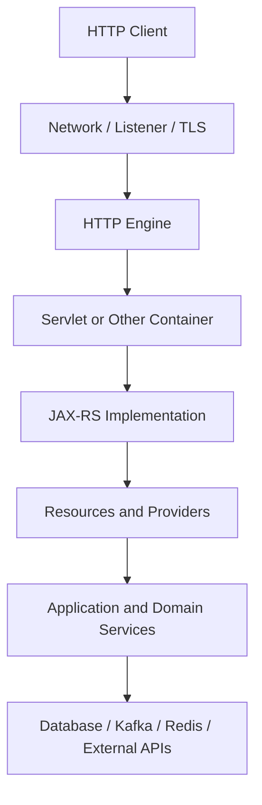
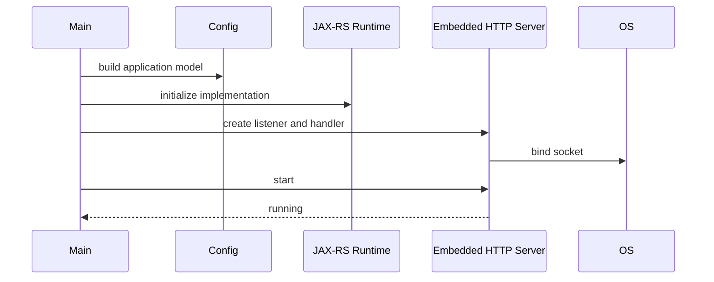
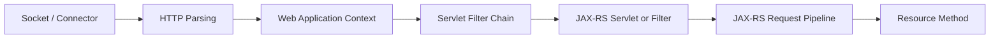
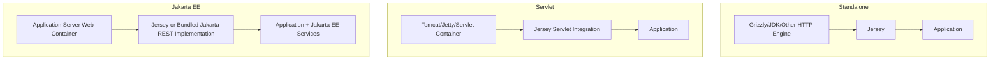
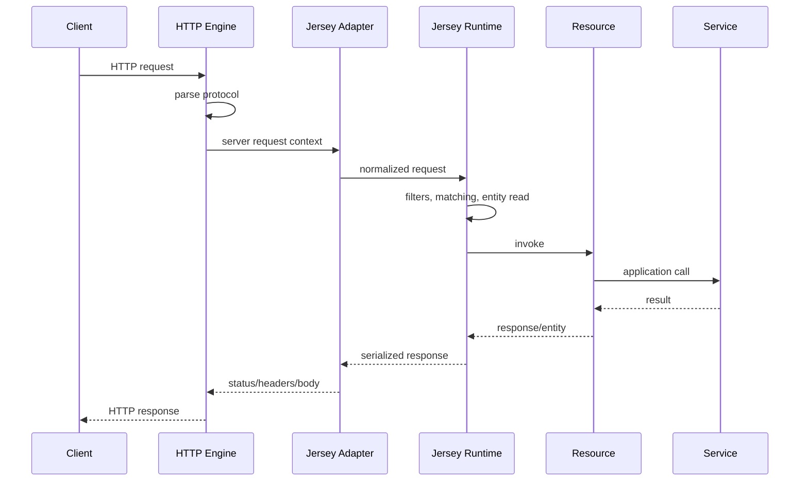
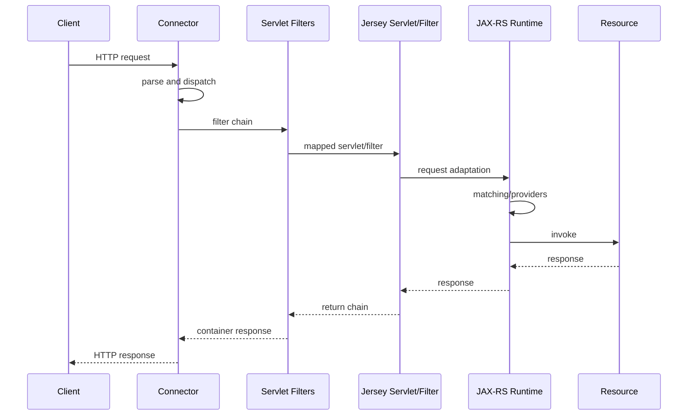
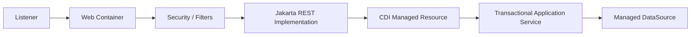

# Part 008 — Runtime Taxonomy: Standalone, Servlet, and Jakarta EE

> JAX-RS bukan network server. Annotation `@Path` tidak membuka port, menerima TCP connection, mem-parsing HTTP, membuat thread, mengelola classloader, atau menghentikan process. Semua tanggung jawab tersebut dimiliki runtime di bawah atau di sekitar Jakarta REST implementation. Untuk memahami production behavior, engineer harus dapat menunjuk siapa pemilik socket, request thread, application lifecycle, dependency services, packaging, deployment, dan shutdown.

## Daftar Isi

1. [Target kompetensi](#target-kompetensi)
2. [Scope dan baseline](#scope-dan-baseline)
3. [Mental model: API framework versus execution environment](#mental-model-api-framework-versus-execution-environment)
4. [Runtime ownership stack](#runtime-ownership-stack)
5. [Taxonomy terminology](#taxonomy-terminology)
6. [Java SE standalone process](#java-se-standalone-process)
7. [Embedded HTTP runtime](#embedded-http-runtime)
8. [Servlet container](#servlet-container)
9. [Jakarta EE web container](#jakarta-ee-web-container)
10. [Jakarta EE application server](#jakarta-ee-application-server)
11. [JAX-RS implementation position](#jax-rs-implementation-position)
12. [Packaging: classpath, JAR, WAR, and EAR](#packaging-classpath-jar-war-and-ear)
13. [Executable JAR versus WAR deployment](#executable-jar-versus-war-deployment)
14. [Embedded versus externally managed runtime](#embedded-versus-externally-managed-runtime)
15. [Request path in standalone runtime](#request-path-in-standalone-runtime)
16. [Request path in Servlet container](#request-path-in-servlet-container)
17. [Request path in Jakarta EE server](#request-path-in-jakarta-ee-server)
18. [Socket and protocol ownership](#socket-and-protocol-ownership)
19. [Thread ownership and execution model](#thread-ownership-and-execution-model)
20. [Classloader ownership](#classloader-ownership)
21. [Dependency and API ownership](#dependency-and-api-ownership)
22. [Lifecycle callbacks and initialization](#lifecycle-callbacks-and-initialization)
23. [Managed services in Jakarta EE](#managed-services-in-jakarta-ee)
24. [Transaction and security boundary](#transaction-and-security-boundary)
25. [Configuration surfaces by runtime model](#configuration-surfaces-by-runtime-model)
26. [Port, context path, and application path](#port-context-path-and-application-path)
27. [TLS, proxy, and forwarded metadata](#tls-proxy-and-forwarded-metadata)
28. [Health and readiness ownership](#health-and-readiness-ownership)
29. [Graceful shutdown and draining](#graceful-shutdown-and-draining)
30. [Scaling and state implications](#scaling-and-state-implications)
31. [Runtime selection trade-offs](#runtime-selection-trade-offs)
32. [Architecture patterns](#architecture-patterns)
33. [Anti-patterns and misleading assumptions](#anti-patterns-and-misleading-assumptions)
34. [Failure-model matrix](#failure-model-matrix)
35. [Debugging playbook](#debugging-playbook)
36. [PR review checklist](#pr-review-checklist)
37. [Standard versus runtime-specific behavior](#standard-versus-runtime-specific-behavior)
38. [Internal verification checklist](#internal-verification-checklist)
39. [Latihan verifikasi](#latihan-verifikasi)
40. [Ringkasan](#ringkasan)
41. [Referensi resmi](#referensi-resmi)

---

## Target kompetensi

Setelah menyelesaikan part ini, Anda harus mampu:

- menjelaskan mengapa Jakarta REST API bukan HTTP server;
- membedakan web server, HTTP engine, Servlet container, Jakarta EE web container, dan Jakarta EE application server;
- menjelaskan posisi Jersey atau implementation lain di dalam runtime;
- membedakan Java SE standalone deployment dari Servlet dan Jakarta EE deployment;
- mengenali packaging JAR, executable JAR, WAR, dan EAR serta implikasinya;
- menentukan siapa pemilik port, listener, request thread, classloader, dependency API, transaction, security, dan shutdown;
- menggambar request flow untuk standalone runtime dan Servlet container;
- memahami perbedaan embedded runtime dan externally managed runtime;
- mendeteksi classloader conflict, API duplication, thread misuse, context-path mismatch, dan premature readiness;
- mereview keputusan runtime dari sisi portability, operability, isolation, upgrade, dan cloud/on-prem deployment;
- membuat internal verification checklist tanpa mengarang runtime yang digunakan CSG Quote & Order.

---

## Scope dan baseline

Part ini menggunakan:

- Jakarta RESTful Web Services 4.0 sebagai conceptual API baseline;
- Jakarta Servlet 6.1 sebagai Servlet model baseline;
- Jakarta EE 11 terminology untuk platform/server concepts;
- Jersey sebagai contoh implementation yang dapat dijalankan di beberapa server environments.

Codebase aktual dapat menggunakan versi lebih lama. Jangan menyimpulkan compatibility hanya dari source imports.

Part ini tidak membahas detail implementation tertentu:

- Jersey architecture: Part 009;
- HK2: Part 010;
- CDI: Part 011;
- GlassFish dan Grizzly: Part 012;
- Tomcat, Jetty, dan Servlet integration detail: Part 013;
- Docker/JVM container behavior: Parts 044–045;
- Kubernetes lifecycle: Part 046.

Fokus Part 008 adalah **runtime taxonomy dan ownership model**.

---

## Mental model: API framework versus execution environment

Pisahkan tiga layer:

```text
Application code
  resources, services, providers

Jakarta REST implementation
  request matching, parameter binding,
  entity providers, filters, exception mapping

Execution environment
  sockets, HTTP protocol, threads,
  classloading, deployment, lifecycle
```

Diagram:



Tidak semua runtime memiliki layer Servlet. Standalone Grizzly, JDK HTTP server, Netty adapter, atau runtime lain dapat menghubungkan HTTP engine langsung ke Jersey/JAX-RS implementation.

### Core ownership question

Untuk setiap box, tanyakan:

```text
Who creates it?
Who configures it?
Which thread calls it?
Who observes it?
Who restarts it?
Who closes it?
```

---

## Runtime ownership stack

Runtime dapat dipahami sebagai stack ownership:

| Responsibility | Possible owner |
|---|---|
| OS process | shell, systemd, container runtime, application server |
| port/listener | embedded server, Servlet container, application server |
| TLS termination | application runtime, ingress, load balancer, proxy |
| HTTP parsing | HTTP engine/container |
| request thread | server executor or managed worker pool |
| Servlet lifecycle | Servlet container |
| JAX-RS application model | Jakarta REST implementation |
| resource lifecycle | implementation + DI integration |
| transaction | application code or Jakarta Transactions/container |
| authentication | proxy, container, JAX-RS filter, application |
| classloader | JVM/bootstrap, container, application server |
| deployment | executable process, WAR deployer, server domain |
| shutdown | process owner + runtime/container |
| health/readiness | application + orchestration platform |

### Why this matters

Ketika request timeout, root cause dapat berada di:

- load balancer queue;
- TLS handshake;
- HTTP connector;
- server worker saturation;
- Servlet async timeout;
- JAX-RS filter;
- domain executor;
- connection pool;
- downstream service.

Tanpa ownership model, semua symptom terlihat sebagai “endpoint lambat”.

---

## Taxonomy terminology

Terminologi sering dipakai secara tidak konsisten. Gunakan definisi kerja berikut.

## Web server

Software yang menerima HTTP dan dapat menyajikan static/dynamic content. Istilah ini sangat luas.

## HTTP engine

Komponen low-level yang mengelola:

- socket;
- connection;
- protocol parsing;
- HTTP versions;
- request/response bytes;
- sometimes TLS and worker dispatch.

Contoh kategori: Grizzly HTTP server, Jetty server core, Tomcat connector/Coyote, Netty-based engine, JDK HTTP server.

## Servlet container

Runtime yang mengimplementasikan Jakarta Servlet contracts:

- servlet lifecycle;
- filter chain;
- listeners;
- web application context;
- request/response wrappers;
- async Servlet processing;
- session and deployment semantics.

Tomcat dan Jetty dapat berfungsi sebagai Servlet containers. GlassFish memiliki web container di dalam application server.

## Jakarta EE web container

Web container dalam Jakarta EE runtime yang mengelola Servlet/web components dan menyediakan integration dengan subset Jakarta EE services.

## Jakarta EE application server

Runtime yang menyediakan Jakarta EE Platform/Web Profile capabilities sesuai product/profile dan mengelola deployments, containers, resources, security, transactions, naming, dan services lain.

## Jakarta REST implementation

Library/runtime component yang mengimplementasikan Jakarta REST specification, misalnya Jersey.

### Important non-equivalence

```text
Jersey != Grizzly
Jersey != GlassFish
Jersey != Servlet container
Jersey != Jakarta EE server

Grizzly != Jakarta EE
Tomcat != full Jakarta EE server
Servlet API != Jakarta REST API
```

Sebuah deployment dapat menggabungkan:

```text
Jersey + Grizzly
Jersey + Tomcat
Jersey + Jetty
Jersey inside GlassFish
```

---

## Java SE standalone process

Standalone berarti application memiliki entry point dan menjalankan process/runtime sendiri dalam Java SE environment.

```java
public final class Main {

    public static void main(String[] args) {
        var settings = SettingsLoader.load();
        var config = new ApiResourceConfig(settings);
        var server = StandaloneServer.start(
                settings.http(),
                config
        );

        Runtime.getRuntime().addShutdownHook(
                new Thread(server::close, "shutdown-hook")
        );
    }
}
```

### Standalone does not mean “no container”

Masih ada server runtime yang:

- membuka socket;
- membuat workers;
- mengelola connection;
- menghubungkan request ke JAX-RS implementation;
- mengatur lifecycle.

Istilah yang lebih akurat:

```text
application-owned runtime
```

### Typical ownership

| Concern | Owner |
|---|---|
| main process | application |
| runtime construction | application bootstrap |
| port and listener | embedded server library |
| dependency versions | application build |
| startup order | application |
| shutdown hooks | application |
| deployment | process/container orchestrator |
| runtime upgrade | application release |

### Advantages

- explicit composition root;
- self-contained artifact;
- version control penuh;
- cocok untuk microservice/container;
- local startup mudah;
- no shared server domain.

### Costs

- application team mengelola server configuration;
- harus mengelola lifecycle, threads, TLS, metrics, shutdown;
- Jakarta EE services tidak otomatis tersedia;
- risk of custom operational inconsistency antar-service.

---

## Embedded HTTP runtime

Embedded runtime adalah server library yang dibuat dari application code.

Conceptual example:

```java
var server = HttpServerFactory.create(
        URI.create("http://0.0.0.0:8080/"),
        resourceConfig
);
server.start();
```

Factory aktual bergantung pada runtime.

### Embedded lifecycle



### Common mistakes

- binding port sebelum configuration valid;
- default unbounded worker pool;
- shutdown hook tidak menunggu in-flight requests;
- server thread non-daemon menjaga process hidup;
- TLS defaults tidak memenuhi policy;
- access logs tidak aktif;
- direct public binding melewati ingress assumptions;
- runtime dependency version drift.

### Operational invariant

```text
Embedded runtime configuration is production code.
```

Port, timeout, queue, worker, header limit, request size, TLS, HTTP/2, and graceful shutdown harus direview seperti code business-critical.

---

## Servlet container

Dalam Servlet deployment, Jakarta REST implementation terhubung ke Servlet container melalui Servlet, Filter, initializer, atau integration mechanism.

Simplified request path:



### Servlet container owns

- Servlet instance lifecycle;
- filter lifecycle/order;
- web application context;
- request/response objects;
- async Servlet state;
- sessions;
- listeners;
- connector worker dispatch;
- WAR deployment semantics;
- classloader model.

### JAX-RS implementation owns

- resource matching;
- parameter injection;
- provider selection;
- JAX-RS filters/interceptors;
- entity processing;
- exception mapping;
- resource model.

### Application owns

- domain behavior;
- endpoint contracts;
- service/repository logic;
- configuration decisions;
- dependency clients unless container-managed;
- observability and security integration.

### Filter boundary

```text
Servlet Filter
  sees request before JAX-RS matching
  and is container-level.

ContainerRequestFilter
  is inside JAX-RS pipeline.
```

This distinction affects:

- authentication;
- CORS;
- compression;
- correlation;
- error responses;
- async behavior;
- URI rewriting;
- metrics route naming.

---

## Jakarta EE web container

Jakarta EE web application runs inside a web container that can integrate Servlet/Jakarta REST components with Jakarta EE capabilities.

Potential services include:

- CDI;
- Bean Validation;
- Jakarta Security;
- Jakarta Transactions;
- Jakarta Concurrency;
- Jakarta Persistence;
- Jakarta JSON processing/binding;
- naming/resource injection;
- managed executors;
- lifecycle and deployment services.

Availability depends on:

- product;
- supported profile;
- deployment descriptors;
- module type;
- application configuration;
- version compatibility.

### Do not assume injection automatically works

Source code:

```java
@Inject
QuoteService quoteService;
```

Tidak membuktikan:

- CDI is active;
- bean discovery sees the class;
- resource is CDI-managed;
- bridge between Jersey/HK2/CDI exists;
- scope is correct;
- proxy can be created.

Itu dibahas pada Parts 010–011.

---

## Jakarta EE application server

Application server biasanya mengelola lebih banyak concern daripada standalone service:

```text
server domain
  -> instances/clusters
  -> deployments
  -> web container
  -> Jakarta REST implementation
  -> CDI/transactions/security/naming/resources
```

### Server-managed resources

Possible examples:

- JDBC data sources;
- transaction manager;
- connection pools;
- thread pools;
- JMS resources;
- security realms;
- certificates;
- naming entries;
- deployment configuration.

### Benefits

- standardized managed services;
- centralized administration;
- shared operational model;
- integrated transaction/security;
- deployment management;
- enterprise facilities.

### Costs

- server configuration becomes external dependency;
- shared runtime upgrade coordination;
- classloader complexity;
- application-server-specific descriptors;
- local reproduction can be heavier;
- implicit resources and naming;
- larger failure domain if shared.

### Important

GlassFish is one application server implementation family, but presence of Jersey dependency alone does not prove deployment in GlassFish.

---

## JAX-RS implementation position

Jersey can be embedded or container-integrated.



### Implementation source

JAX-RS implementation dapat:

- dibundel dalam application;
- disediakan oleh server;
- dipasang sebagai server module;
- dibungkus platform runtime;
- di-version-lock melalui BOM.

### Conflict risk

Bundling Jersey ke server yang sudah menyediakan Jakarta REST implementation dapat menghasilkan:

- duplicate API classes;
- implementation collision;
- classloading precedence issues;
- provider discovery duplication;
- incompatible namespace;
- `LinkageError`;
- `ClassCastException` pada class dengan nama sama dari classloader berbeda.

---

## Packaging: classpath, JAR, WAR, and EAR

## Plain JAR

Berisi application classes/dependencies. Perlu launcher/runtime external atau classpath command.

## Executable/fat/uber JAR

Berisi application dan dependency, sering dengan main entry point.

Pros:

- self-contained;
- easy containerization;
- version ownership jelas.

Cons:

- duplicate resource merging;
- service-loader metadata conflict;
- larger artifact;
- shading risk;
- license/SBOM complexity.

## Thin JAR

Application JAR terpisah dari dependency/runtime.

Pros:

- smaller app artifact;
- dependency layering.

Cons:

- deployment must assemble exact runtime classpath.

## WAR

Web application archive untuk Servlet/web container.

Typical structure:

```text
WEB-INF/
  classes/
  lib/
  web.xml
```

Container mengelola deployment context dan web application classloader.

## EAR

Enterprise archive yang dapat membungkus beberapa modules seperti WAR/JAR dalam Jakarta EE deployment.

Pros:

- coordinated enterprise deployment;
- module boundaries.

Cons:

- classloader and shared-library complexity;
- heavier release coordination.

### Packaging is architecture

Packaging menentukan:

- runtime owner;
- dependency source;
- classloader boundaries;
- deployment operation;
- rollback unit;
- configuration injection;
- startup command;
- observability attachment.

---

## Executable JAR versus WAR deployment

| Dimension | Executable JAR | WAR |
|---|---|---|
| runtime owner | application/team | Servlet/app server |
| server dependency | bundled/embedded | server-provided or container integration |
| startup | `java -jar` or launcher | deploy to container |
| port config | application/runtime | container connector |
| context path | application/runtime | deployment/container |
| classloader | mostly process classpath | web-app/container hierarchy |
| upgrade | application release | app and server lifecycle separate |
| local reproduction | often simpler | requires matching container |
| isolation | process/container | may share server process |
| operational model | microservice-friendly | enterprise server-friendly |

### False dichotomy

WAR dapat dijalankan dalam embedded server, dan executable JAR dapat membungkus Servlet container. Karena itu, periksa actual bootstrap, bukan extension file saja.

---

## Embedded versus externally managed runtime

## Embedded

Application code:

- creates server;
- configures listeners;
- starts/stops runtime;
- bundles versions.

## Externally managed

Server/container:

- discovers deployment;
- creates application;
- controls listener;
- invokes lifecycle;
- may provide services.

### Ownership comparison

```text
Embedded:
application owns runtime lifecycle.

External:
container owns runtime lifecycle;
application participates through deployment contracts.
```

### Operational implication

Pada embedded model, `main` dan shutdown hook sangat penting.

Pada managed model, custom `System.exit`, thread creation, global signal handling, dan manual port binding biasanya tidak tepat.

---

## Request path in standalone runtime

Example flow:



### Debug boundaries

- Engine access log: did request reach socket?
- Adapter/Jersey tracing: did request enter JAX-RS?
- Resource metric: which route?
- Domain trace: where did time go?
- Network capture: was response committed?

---

## Request path in Servlet container



### Possible short-circuit

Request dapat berhenti pada:

- connector;
- container valve/handler;
- Servlet filter;
- security constraint;
- servlet mapping;
- JAX-RS pre-match filter;
- JAX-RS matching;
- resource;
- response writer.

Status `404` tidak selalu berasal dari JAX-RS. Bisa berasal dari container mapping atau upstream proxy.

---

## Request path in Jakarta EE server

Jakarta EE server menambahkan managed boundaries:



Tidak semua application memakai semua services.

### Questions

- apakah security dilakukan container atau application filter?
- apakah resource CDI-managed?
- apakah transaction dimulai pada service?
- apakah data source JNDI/container-managed?
- apakah executor managed?
- apakah request context dipropagasikan?
- apakah application server menyediakan Jersey version tertentu?

---

## Socket and protocol ownership

Port/listener configuration menentukan:

- bind address;
- protocol;
- TLS;
- HTTP versions;
- backlog;
- keep-alive;
- idle timeout;
- maximum headers;
- maximum request line;
- body limits;
- connection count;
- access logging.

### Runtime ownership examples

| Deployment | Port owner |
|---|---|
| standalone Grizzly | application-created server |
| executable JAR with embedded Jetty | embedded Jetty |
| WAR on Tomcat | Tomcat connector |
| app on GlassFish | GlassFish network listener |
| pod behind ingress | container listener + ingress/LB upstream |

### Bind address risk

```text
127.0.0.1
0.0.0.0
specific interface
IPv6 wildcard
```

Di container, binding hanya ke loopback membuat Service tidak dapat mencapai process.

### Protocol mismatch

- proxy speaks HTTP to HTTPS port;
- backend expects client certificate;
- HTTP/2 cleartext mismatch;
- wrong TLS SNI;
- idle timeout lower than streaming requirement;
- header size too low for JWT/cookies.

---

## Thread ownership and execution model

Server runtime biasanya memanggil application menggunakan worker threads.

### Standalone

Application/server library mengonfigurasi executors.

### Servlet container

Container connector dan worker pool mengelola dispatch.

### Jakarta EE

Container-managed thread rules dan Jakarta Concurrency dapat berlaku.

### Core rule

```text
Never assume one thread per application,
one thread per connection,
or one stable thread for the entire async request.
```

### Request thread questions

- worker pool size?
- queue type and capacity?
- blocking allowed?
- virtual threads used?
- async dispatch?
- thread local context?
- timeout?
- interrupt semantics?
- saturation behavior?

### Container thread anti-pattern

```java
@GET
public Response waitForever() {
    while (!completed()) {
        // blocking without timeout
    }
}
```

Satu request dapat menahan worker dan menyebabkan queue/cascading failure.

### Creating raw threads

Dalam standalone runtime, raw thread creation tetap harus memiliki owner.

Dalam Jakarta EE managed environment, gunakan managed concurrency facility sesuai runtime policy; arbitrary thread creation dapat melewati context, lifecycle, security, dan shutdown management.

---

## Classloader ownership

Classloading adalah sumber failure enterprise yang sering terlihat abstrak sampai production.

### Standalone classloader shape

Simplified:

```text
bootstrap/platform classloaders
-> application classloader
```

Fat JAR launcher dapat menambah custom loader.

### Servlet/web application shape

Simplified:

```text
JVM/platform
-> server/common libraries
-> web application classloader
   -> WEB-INF/classes
   -> WEB-INF/lib
```

Delegation model dapat parent-first atau memiliki container-specific rules.

### Application server shape

Dapat memiliki:

- server modules;
- shared libraries;
- application classloader;
- EAR classloader;
- WAR module classloader;
- isolated subdeployments.

### Class identity invariant

Dalam JVM:

```text
class identity = fully qualified name + defining classloader
```

Dua `jakarta.ws.rs.core.Response` dari classloader berbeda bukan type yang sama.

### Failure symptoms

- `NoClassDefFoundError`;
- `ClassNotFoundException`;
- `NoSuchMethodError`;
- `AbstractMethodError`;
- `LinkageError`;
- `ClassCastException` dengan nama class sama;
- provider tidak dikenali;
- annotation tidak terlihat oleh scanner;
- `ServiceLoader` menemukan implementation yang salah.

---

## Dependency and API ownership

Tentukan apakah API/implementation disediakan application atau runtime.

### Application-owned

Maven artifact dibundel dalam JAR/WAR.

### Runtime-owned

Server menyediakan API atau implementation module.

### Provided scope

Pada WAR/Jakarta EE deployment, dependency tertentu dapat dikompilasi dengan scope `provided` karena runtime menyediakannya.

Example conceptual Maven:

```xml
<dependency>
    <groupId>jakarta.ws.rs</groupId>
    <artifactId>jakarta.ws.rs-api</artifactId>
    <scope>provided</scope>
</dependency>
```

Keputusan scope harus sesuai deployment. Pada standalone executable application, API/implementation biasanya perlu tersedia dalam runtime artifact.

### Duplicate API risk

Membundel API yang incompatible dengan server-provided implementation dapat merusak runtime.

### Verification

```bash
mvn dependency:tree
jar tf application.war
jar tf application.jar
```

Lihat:

- `jakarta.ws.rs-api`;
- `javax.ws.rs-api`;
- Jersey modules;
- Servlet API;
- duplicate JSON providers;
- CDI implementations;
- server-specific libraries.

---

## Lifecycle callbacks and initialization

Lifecycle source dapat berasal dari:

- Java `main`;
- server deployment;
- Servlet `ServletContextListener`;
- Servlet initialization;
- Jakarta Annotation `@PostConstruct`/`@PreDestroy`;
- CDI lifecycle;
- Jersey/HK2 lifecycle;
- application server resource creation;
- shutdown hook.

### Lifecycle layering

```text
Process lifecycle
  contains runtime lifecycle
    contains deployment lifecycle
      contains application lifecycle
        contains component scopes
          contains request lifecycle
```

### Wrong assumption

`@PreDestroy` pada object hanya bekerja jika object dikelola container yang mengenali annotation tersebut.

Object yang dibuat dengan `new` dan tidak diserahkan ke lifecycle manager tidak otomatis menerima callback.

### Initialization strategy

- constructor: establish object invariants, no heavy I/O;
- lifecycle callback: managed initialization;
- bootstrap composition: explicit infrastructure start;
- lazy initialization: defer until first use with concurrency protection;
- background initialization: readiness must reflect state.

---

## Managed services in Jakarta EE

Jakarta EE server dapat menyediakan managed services. Contoh conceptual categories:

- CDI;
- Jakarta Transactions;
- Jakarta Persistence;
- Jakarta Validation;
- Jakarta Security;
- Jakarta Concurrency;
- Jakarta Messaging;
- Jakarta REST;
- Jakarta JSON-B/JSON-P;
- Jakarta Connectors;
- naming and resource injection.

### Benefit

Container dapat mengelola:

- context propagation;
- transaction enlistment;
- pooling;
- lifecycle;
- security;
- monitoring integration.

### Risk

Application menjadi bergantung pada:

- server profile/version;
- deployment descriptors;
- naming conventions;
- server configuration;
- implementation-specific behavior.

### Portability principle

Gunakan standard API di core application bila memungkinkan. Isolasi server-specific lookup/configuration pada adapter/bootstrap layer.

---

## Transaction and security boundary

Runtime model memengaruhi transaction/security ownership.

### Standalone

Application biasanya membangun:

- auth filters;
- JWT validator;
- transaction manager/library;
- connection pool;
- service identity.

### Servlet container

Container dapat melakukan:

- security constraints;
- authentication;
- session management;
- Servlet role checks.

Application dapat tetap memiliki authorization domain-level.

### Jakarta EE server

Container dapat menyediakan:

- Jakarta Security integration;
- declarative roles;
- transaction manager;
- managed data source;
- interceptors.

### Review questions

- authentication before or inside JAX-RS?
- container principal mapped to `SecurityContext`?
- domain authorization independent of transport?
- transaction begins before resource or service?
- async work still inside transaction?
- request failure commits or rolls back?
- security context propagated to executor?

---

## Configuration surfaces by runtime model

## Standalone

Possible sources:

- command-line args;
- environment variables;
- config files;
- system properties;
- application code;
- embedded runtime properties.

## Servlet container

Additional sources:

- `web.xml`;
- Servlet init params;
- context params;
- server connector config;
- deployment context;
- container environment entries.

## Jakarta EE server

Additional sources:

- server domain configuration;
- JNDI/naming resources;
- data-source definitions;
- security realm;
- server modules;
- deployment descriptors;
- admin console/CLI;
- shared libraries.

### Configuration drift

A code-identical WAR can behave differently because server configuration differs.

Therefore artifact identity alone is insufficient. Production fingerprint should include:

```text
artifact digest
server version
server config revision
deployment descriptor
runtime properties
external resource versions
```

---

## Port, context path, and application path

Effective URI:

```text
scheme
+ public host
+ gateway base path
+ deployment context path
+ application path
+ resource path
```

Example:

```text
https://api.example.com
/cpq
/quote-order
/api
/quotes/Q-123
```

Not every internal layer sees the same URI.

### Servlet context path

WAR deployment often introduces context path derived from:

- WAR filename;
- deployment descriptor;
- server configuration;
- explicit context setting.

### Application path

Defined by `@ApplicationPath`, servlet mapping, or runtime configuration.

### Runtime root

Standalone runtime may bind base URI directly.

### Debug proof

Capture:

- external request URI;
- proxy rewritten URI;
- container request URI/context path/servlet path/path info;
- JAX-RS `UriInfo`;
- selected route template.

---

## TLS, proxy, and forwarded metadata

Application sering berada di belakang:

- reverse proxy;
- ingress;
- cloud load balancer;
- API gateway;
- service mesh.

TLS dapat terminate sebelum runtime.

### Metadata questions

- what is original scheme?
- original host?
- client IP?
- public port?
- request ID?
- mTLS identity?
- path prefix?

Headers like forwarded metadata are trust-sensitive. Jangan menerima header dari arbitrary client tanpa trusted proxy boundary.

### Failure modes

- generated links use `http` instead of `https`;
- redirect points to internal host;
- rate limit uses proxy IP;
- audit logs spoofed client IP;
- secure cookies not set;
- OAuth redirect URI mismatch;
- host-header injection;
- duplicate forwarded header interpretation.

### Ownership

Forwarded-header normalization dapat dilakukan oleh:

- gateway;
- Servlet container;
- Jersey filter;
- application;
- framework adapter.

Pilih satu trusted normalization layer.

---

## Health and readiness ownership

Runtime-level health and application readiness berbeda.

### Runtime liveness

- process running;
- event loop/worker can progress;
- no fatal state.

### Application readiness

- resource model valid;
- required configuration loaded;
- critical dependencies initialized;
- security material available;
- migration compatibility satisfied;
- instance accepting traffic.

### Container/server readiness

Externally managed server dapat berjalan walaupun satu deployment gagal.

Monitoring harus membedakan:

```text
server process healthy
application deployment healthy
application ready
business dependency degraded
```

### Shared server risk

Jika beberapa application berada dalam satu server process:

- one deployment failure may not kill server;
- resource contention crosses applications;
- restart blast radius larger;
- thread/heap leak affects neighbors;
- server health may hide app failure.

---

## Graceful shutdown and draining

Shutdown sequence tergantung runtime owner.

## Standalone

Application receives signal/shutdown hook:

```text
mark not ready
-> stop accepting new requests
-> drain in-flight
-> stop consumers/jobs
-> close server
-> close pools/clients
-> exit
```

## Servlet/container

Container undeploy/shutdown invokes lifecycle:

```text
stop routing deployment
-> destroy filters/servlets/listeners
-> invoke managed callbacks
-> release web-app classloader
```

Application harus bekerja dalam lifecycle tersebut dan tidak memanggil `System.exit`.

## Jakarta EE server

Shutdown dapat mencakup:

- application undeploy;
- instance shutdown;
- cluster orchestration;
- managed resource cleanup;
- transaction completion policies.

### Shutdown time budget

Harus lebih kecil dari platform termination grace period.

### Non-graceful cases

- SIGKILL;
- node failure;
- process crash;
- OOM kill;
- power/network loss.

Correctness tidak boleh bergantung hanya pada shutdown callback. Gunakan idempotency, durable state, transaction, lease expiry, dan recovery.

---

## Scaling and state implications

Runtime topology menentukan sharing.

## One process per service instance

State fields hanya shared di satu process, tetapi tidak antar-replica.

## Multiple applications in one server

Server resources dapat shared:

- heap;
- CPU;
- thread pools;
- connectors;
- classloader parents;
- data sources;
- logging.

## Multiple replicas

Tidak ada jaminan request berikutnya menuju instance sama kecuali sticky routing.

### Rule

```text
In-memory state is process-local,
not service-global.
```

Resource singleton bukan distributed singleton.

### Stateful runtime concerns

- HTTP sessions;
- local caches;
- temp files;
- in-memory job locks;
- SSE connection registry;
- WebSocket sessions;
- local rate limiter;
- local idempotency map.

Scale-out memerlukan partitioning, shared state, routing, atau explicit local semantics.

---

## Runtime selection trade-offs

## Standalone embedded runtime

Best when:

- independent service deployment;
- container/Kubernetes;
- team owns runtime configuration;
- minimal platform dependency desired.

Trade-offs:

- more operational responsibility;
- consistency must be enforced via platform libraries.

## Servlet container deployment

Best when:

- organization standardizes on Servlet runtime;
- WAR lifecycle and centralized connectors useful;
- multiple web apps or existing platform.

Trade-offs:

- shared runtime/configuration;
- classloader/deployment complexity.

## Jakarta EE application server

Best when:

- managed transactions/resources/security are valuable;
- standardized enterprise platform exists;
- deployment and operations built around server.

Trade-offs:

- server dependency;
- upgrade coordination;
- larger operational surface.

### Decision dimensions

| Dimension | Standalone | Servlet container | Jakarta EE server |
|---|---|---|---|
| runtime ownership | application | platform/container | platform/server |
| portability | library-dependent | Servlet-standard boundary | Jakarta EE profile + server |
| operational isolation | process-level | often shared or separate | often server/domain-level |
| managed services | manual/library | web services | broader EE services |
| startup | application | deployment | server deployment |
| local setup | usually light | container needed | server needed |
| classloader complexity | lower | medium | higher |
| upgrade coupling | app release | app + container | app + server/platform |

---

## Architecture patterns

## Pattern 1 — Standalone adapter

```text
main
-> typed configuration
-> application services
-> ResourceConfig
-> embedded HTTP runtime
```

Isolasi runtime code dalam module `runtime-standalone`.

## Pattern 2 — Servlet adapter

```text
WAR
-> Servlet initializer
-> ResourceConfig/Application
-> application services
```

Isolasi Servlet-specific code dalam module `runtime-servlet`.

## Pattern 3 — Jakarta EE adapter

```text
WAR/EAR
-> server deployment
-> CDI/Jakarta Transactions/resources
-> Jakarta REST resources
```

Domain tetap bebas dari server classes sebanyak mungkin.

## Pattern 4 — Multi-runtime compatibility

Core modules:

```text
domain
application
api-contract
```

Runtime modules:

```text
runtime-grizzly
runtime-servlet
runtime-glassfish
```

Gunakan hanya jika business value portability melebihi maintenance cost. Jangan membangun abstraction multi-runtime speculative tanpa kebutuhan.

---

## Anti-patterns and misleading assumptions

## 1. “Jersey berarti Grizzly”

Salah. Jersey dapat berjalan pada banyak environments.

## 2. “WAR berarti external Tomcat”

Salah. WAR dapat dijalankan atau dibungkus dalam berbagai runtime.

## 3. “Tomcat menyediakan seluruh Jakarta EE”

Salah. Tomcat fokus pada Servlet/web technologies dan integrations tertentu, bukan full Jakarta EE Platform.

## 4. “Application server mengelola semua object”

Salah. Object yang dibuat manual dapat berada di luar managed lifecycle.

## 5. “Request selalu satu thread”

Salah pada async dispatch/context switching.

## 6. “Provider API dependency harus dibundel”

Tidak selalu pada server-provided deployment; duplicate API dapat conflict.

## 7. “Port 8080 berarti endpoint dapat diakses”

Mungkin bind ke loopback, blocked network, wrong context, not ready, atau TLS mismatch.

## 8. “Server healthy berarti application ready”

Shared server dapat hidup sementara deployment gagal.

## 9. “Shutdown callback selalu berjalan”

Tidak pada crash/SIGKILL/OOMKilled.

## 10. “Singleton resource adalah singleton global”

Hanya instance-local/container-local.

## 11. “Forwarded client IP dapat dipercaya”

Hanya jika proxy trust chain dikonfigurasi.

## 12. “Server thread pool dapat dipakai untuk background jobs”

Request workers dan job executors memiliki failure/latency semantics berbeda.

---

## Failure-model matrix

| Failure | Runtime layer | Symptom | Evidence | Likely cause | Direction |
|---|---|---|---|---|---|
| connection refused | listener/process | no HTTP response | socket/process check | port not bound/process down | inspect runtime startup |
| TLS handshake failure | connector/proxy | client TLS error | TLS logs/packet | protocol/cert/SNI mismatch | fix termination/trust |
| container `404` | mapping | JAX-RS logs absent | access log + mapping | wrong context/servlet path | fix deployment mapping |
| JAX-RS `404` | application model | request reached Jersey | route tracing | no resource match | fix resource/application path |
| `NoSuchMethodError` | classloading | startup/runtime crash | stack + dependency tree | API/implementation mismatch | align versions/ownership |
| `ClassCastException` same class name | classloading | confusing cast failure | classloader identity | duplicate class definitions | isolate/remove duplicate |
| provider not discovered | deployment/model | unsupported media/error | component inventory | scanning/module issue | explicit registration |
| request queue saturation | worker pool | latency then timeout | pool/queue metrics | blocking or undersized pool | bound work/load shed |
| server healthy, app unavailable | deployment | server admin up, API down | deployment status | app failed deployment | app-level readiness |
| thread leak on redeploy | lifecycle | memory/classloader leak | thread dump | app-created threads not closed | managed executor/cleanup |
| OOM affects all apps | shared server | multi-app outage | heap/process metrics | shared failure domain | isolation/limits |
| wrong client IP | proxy metadata | audit/rate-limit error | header chain | untrusted forwarded headers | trusted normalization |
| graceful shutdown cut short | termination | partial requests | timeline | grace mismatch | coordinate drain timeout |
| config differs by server node | managed runtime | inconsistent behavior | config fingerprint | domain drift | version/config governance |
| API artifact duplicate | dependency | bootstrap conflict | WAR/JAR contents | bundled + server API | provided scope/align |

---

## Debugging playbook

## Step 1 — Identify process topology

```text
one Java process per service?
multiple WARs in one server?
sidecars?
proxy/ingress?
server domain and instances?
```

Use process list, container spec, deployment manifests, and server admin data.

## Step 2 — Identify packaging

Inspect:

```bash
file application-artifact
jar tf application.jar
jar tf application.war
```

Find:

- `Main-Class`;
- `WEB-INF`;
- embedded server dependencies;
- Jersey modules;
- Servlet API;
- deployment descriptors.

## Step 3 — Find startup path

Search:

```text
public static void main
GrizzlyHttpServerFactory
ServletContainer
ServletContextListener
WebApplicationInitializer
@ApplicationPath
extends Application
extends ResourceConfig
```

## Step 4 — Determine port owner

Check:

- application config;
- server connector;
- container args;
- Kubernetes container port;
- service target port;
- ingress backend;
- TLS configuration.

## Step 5 — Determine mapping owner

Build path chain:

```text
external path
proxy rewrite
context path
servlet mapping
application path
resource path
```

## Step 6 — Determine API/implementation ownership

Run dependency tree and inspect runtime/server modules.

Questions:

- who provides `jakarta.ws.rs-api`?
- who provides Jersey?
- who provides Servlet API?
- duplicate `javax` and `jakarta`?
- server version compatible?

## Step 7 — Inspect classloader evidence

For class conflict, log safely:

```java
System.out.println(
    Response.class.getProtectionDomain()
                  .getCodeSource()
);
System.out.println(
    Response.class.getClassLoader()
);
```

Do this only in controlled diagnostics.

## Step 8 — Inspect thread pools

Collect:

- thread dump;
- server worker metrics;
- queue depth;
- active connections;
- blocked threads;
- executor names;
- async tasks.

## Step 9 — Distinguish upstream/container/JAX-RS errors

Correlate:

```text
load balancer access log
server access log
Servlet filter trace
JAX-RS trace
resource span
```

## Step 10 — Test lifecycle

- start;
- readiness transition;
- send long request;
- trigger graceful shutdown;
- observe drain;
- redeploy repeatedly;
- verify no thread/classloader leak.

---

## PR review checklist

### Runtime boundary

- [ ] Runtime implementation is isolated from domain/application code.
- [ ] Ownership of server lifecycle is clear.
- [ ] No hidden second server/listener is created.
- [ ] Deployment mode documented.

### Packaging and dependencies

- [ ] JAR/WAR/EAR choice matches platform.
- [ ] API dependencies use correct scope.
- [ ] No duplicate `javax`/`jakarta` API.
- [ ] No conflicting Jersey/Servlet versions.
- [ ] Fat-JAR resource merging is validated.
- [ ] Server-provided libraries are documented.

### Network and mapping

- [ ] Bind address/port explicit.
- [ ] Context/application/resource paths compose correctly.
- [ ] TLS termination point known.
- [ ] Forwarded headers trusted only from proxies.
- [ ] Header/body/idle limits reviewed.
- [ ] Streaming timeout compatible.

### Threads and execution

- [ ] Blocking work bounded.
- [ ] Worker pool and queue capacity known.
- [ ] Background jobs do not use request worker implicitly.
- [ ] Raw threads have lifecycle owner.
- [ ] Managed environment uses managed concurrency where required.
- [ ] ThreadLocal context cleanup verified.

### Lifecycle

- [ ] Readiness waits for required initialization.
- [ ] Shutdown marks not ready before drain.
- [ ] In-flight requests have bounded drain.
- [ ] Pools/clients/executors close in correct order.
- [ ] Crash recovery does not depend on callback.
- [ ] Redeploy does not leak threads/classloaders.

### Managed services

- [ ] Transaction owner clear.
- [ ] Security owner clear.
- [ ] Data source owner clear.
- [ ] CDI/HK2 integration verified.
- [ ] Naming/JNDI resources documented.
- [ ] Runtime profile supports required specifications.

### Operations

- [ ] Server health and application readiness distinguished.
- [ ] Runtime/server version observable.
- [ ] Config fingerprint available.
- [ ] Access logs and request IDs available.
- [ ] Shared-server blast radius understood.
- [ ] Upgrade/rollback process documented.

---

## Standard versus runtime-specific behavior

| Concern | Jakarta REST standard | Servlet standard | Runtime/application-specific |
|---|---|---|---|
| resource matching | yes | no | implementation diagnostics |
| application model | yes | integration mapping | discovery/bootstrap |
| socket/listener | no | container responsibility concept | connector/HTTP engine |
| Servlet lifecycle | no | yes | container implementation |
| filter chain | JAX-RS filters | Servlet filters | order/configuration |
| request thread | no fixed model | container dispatch model | pool size/queue |
| application path | annotation/API | servlet/context mapping | proxy rewrite |
| classloader | no | web-app contracts partly | server hierarchy |
| packaging | no strict single model | WAR web app | executable JAR/EAR |
| transactions | not core JAX-RS | no | Jakarta Transactions/library |
| CDI integration | separate spec | no | server/bridge |
| server health | no | no | platform |
| graceful shutdown | limited API concerns | container lifecycle | orchestrator/runtime |
| TLS | no | connector/environment | proxy/server/cloud |
| forwarded headers | no universal trust model | request APIs | proxy/container config |

---

## Internal verification checklist

### Runtime identification

- [ ] Identify executable command/process.
- [ ] Identify main class, if any.
- [ ] Identify artifact type: JAR, fat JAR, WAR, EAR.
- [ ] Identify HTTP server/container/application server.
- [ ] Identify Jakarta REST implementation.
- [ ] Identify exact versions.
- [ ] Identify whether runtime is embedded or externally managed.

### Packaging and deployment

- [ ] Inspect final artifact contents.
- [ ] Find deployment descriptors.
- [ ] Find application server domain/config.
- [ ] Identify rollout unit and rollback unit.
- [ ] Determine whether multiple applications share one process.
- [ ] Determine classloader isolation model.
- [ ] Identify shared libraries/server modules.

### Network

- [ ] Identify listener ports and bind addresses.
- [ ] Identify TLS termination point.
- [ ] Identify HTTP versions.
- [ ] Identify connector timeouts and limits.
- [ ] Identify gateway/ingress/proxy rewrites.
- [ ] Identify trusted forwarded-header configuration.
- [ ] Identify access-log ownership.

### Path mapping

- [ ] Public base URL.
- [ ] Gateway/API management base path.
- [ ] Context path.
- [ ] Servlet mapping.
- [ ] `@ApplicationPath`.
- [ ] Resource paths.
- [ ] Internal versus external URL differences.

### Threading

- [ ] Request worker pool implementation.
- [ ] Pool size and queue capacity.
- [ ] Async Servlet/JAX-RS usage.
- [ ] Custom executors.
- [ ] Managed executor usage.
- [ ] Thread naming.
- [ ] Saturation metrics.
- [ ] Raw thread creation inventory.

### Dependency ownership

- [ ] Is Jakarta REST API server-provided or bundled?
- [ ] Is Jersey server-provided or bundled?
- [ ] Is Servlet API correctly scoped?
- [ ] Are both `javax` and `jakarta` present?
- [ ] Are duplicate providers present?
- [ ] Is BOM aligned with runtime?
- [ ] Are server upgrades coordinated with application compatibility?

### Managed services

- [ ] CDI availability and activation.
- [ ] HK2/CDI bridge.
- [ ] Transaction manager.
- [ ] Data source and pool ownership.
- [ ] Security realm/identity integration.
- [ ] Managed concurrency.
- [ ] Naming/JNDI resources.
- [ ] Validation/JSON provider source.

### Lifecycle and operations

- [ ] Startup sequence.
- [ ] Deployment status signal.
- [ ] Liveness/readiness definitions.
- [ ] Graceful shutdown sequence.
- [ ] In-flight drain timeout.
- [ ] Platform termination grace.
- [ ] Redeploy behavior.
- [ ] Thread/classloader leak monitoring.
- [ ] Runtime version and config fingerprint telemetry.

### CSG-specific evidence sources

- [ ] Maven POMs and dependency tree.
- [ ] `main`/bootstrap classes.
- [ ] `web.xml` and server descriptors.
- [ ] Dockerfile/container command.
- [ ] Kubernetes manifests or Helm/Kustomize output.
- [ ] GitOps repository.
- [ ] Runtime startup logs.
- [ ] CI packaging stage.
- [ ] Historical PRs for server migration/upgrades.
- [ ] Internal architecture diagrams.
- [ ] Onboarding session with platform/runtime owner.

---

## Latihan verifikasi

### Latihan 1 — Prove the runtime

Tanpa bertanya kepada team terlebih dahulu, gunakan repository evidence untuk membuat hypothesis:

```text
Jersey version:
runtime:
packaging:
DI:
port owner:
deployment model:
```

Kemudian tandai confidence dan evidence. Konfirmasi melalui internal owner.

### Latihan 2 — Artifact inspection

Bandingkan source dependency tree dengan contents final JAR/WAR. Cari dependency yang:

- excluded;
- shaded;
- server-provided;
- duplicated;
- transformed.

### Latihan 3 — Request path tracing

Kirim satu request dan capture timestamp/correlation pada:

1. gateway;
2. connector access log;
3. Servlet filter;
4. JAX-RS filter;
5. resource;
6. response writer.

Gambar actual flow.

### Latihan 4 — Mapping failure

Ubah satu layer path:

- context path;
- servlet mapping;
- application path;
- ingress rewrite.

Catat perbedaan antara container `404` dan JAX-RS `404`.

### Latihan 5 — Classloader conflict lab

Dalam environment test, tambahkan incompatible duplicate API/library dan amati failure. Dokumentasikan stack trace patterns tanpa membawa conflict ke production branch.

### Latihan 6 — Worker saturation

Buat endpoint test yang block dengan bounded duration. Jalankan concurrency dan observasi:

- active workers;
- queue;
- latency;
- timeout;
- unrelated endpoint impact.

### Latihan 7 — Graceful shutdown

Mulai long-running request lalu terminate instance secara graceful. Verifikasi:

- readiness false;
- no new traffic;
- in-flight completion/cancellation;
- resource close order;
- exit before grace period.

### Latihan 8 — Shared versus isolated runtime

Bandingkan blast radius:

```text
two apps in one server process
versus
one process per service
```

Evaluasi heap, worker, restart, deployment, dan observability isolation.

---

## Ringkasan

Mental model Part 008:

```text
Jakarta REST defines the resource programming model.
A JAX-RS implementation executes that model.
A runtime/container owns the environment
that accepts traffic and invokes the implementation.
```

Invariant terpenting:

1. **JAX-RS bukan HTTP server dan tidak membuka port sendiri sebagai specification.**
2. **Jersey adalah implementation, bukan sinonim Grizzly, GlassFish, Tomcat, atau Jetty.**
3. **Standalone tetap memiliki runtime/container library; bedanya application memiliki lifecycle-nya.**
4. **Servlet container mengelola mapping, filters, request/response, workers, dan web-app lifecycle.**
5. **Jakarta EE server dapat menyediakan broader managed services, tetapi availability dan integration harus dibuktikan.**
6. **Packaging menentukan dependency, classloader, deployment, dan rollback semantics.**
7. **Class identity mencakup defining classloader; duplicate API dapat menyebabkan failure yang membingungkan.**
8. **Thread pool adalah runtime resource dengan saturation dan failure semantics.**
9. **Server health tidak sama dengan application readiness.**
10. **Graceful shutdown harus sesuai owner runtime dan tidak dapat menjamin semua failure paths.**
11. **Public URI adalah komposisi beberapa mapping dan rewrite layers.**
12. **Runtime internal CSG harus dibuktikan dari artifact, bootstrap, deployment, logs, dan platform documentation.**

Part berikutnya mendalami Jersey architecture: application handler, resource model, model validation, providers, internal processing stages, Jersey-specific extensions, monitoring, dan lifecycle behavior.

---

## Referensi resmi

- [Jakarta RESTful Web Services Project](https://jakarta.ee/specifications/restful-ws/)
- [Jakarta RESTful Web Services 4.0 Specification](https://jakarta.ee/specifications/restful-ws/4.0/jakarta-restful-ws-spec-4.0)
- [Jakarta RESTful Web Services 4.0 API](https://jakarta.ee/specifications/restful-ws/4.0/apidocs/)
- [Jakarta Servlet Project](https://jakarta.ee/specifications/servlet/)
- [Jakarta Servlet 6.1 Specification](https://jakarta.ee/specifications/servlet/6.1/jakarta-servlet-spec-6.1)
- [Jakarta Servlet 6.1 API](https://jakarta.ee/specifications/servlet/6.1/apidocs/)
- [Jakarta EE Tutorial — Platform Overview](https://jakarta.ee/learn/docs/jakartaee-tutorial/current/intro/overview/overview.html)
- [Jakarta EE Tutorial — Web Applications](https://jakarta.ee/learn/docs/jakartaee-tutorial/current/web/webapp/webapp.html)
- [Jakarta EE Tutorial — Jakarta Servlet](https://jakarta.ee/learn/docs/jakartaee-tutorial/current/web/servlets/servlets.html)
- [Jersey User Guide — Application Deployment and Runtime Environments](https://eclipse-ee4j.github.io/jersey.github.io/documentation/latest3x/deployment.html)
- [Jersey User Guide — JAX-RS Application Model](https://eclipse-ee4j.github.io/jersey.github.io/documentation/latest3x/deployment.html#d0e1750)
