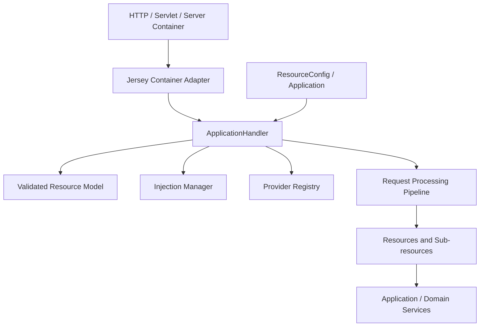
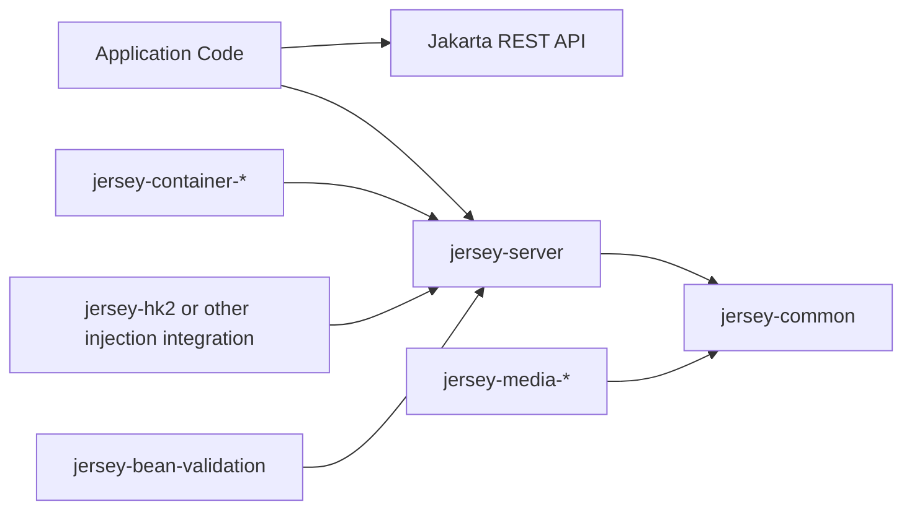
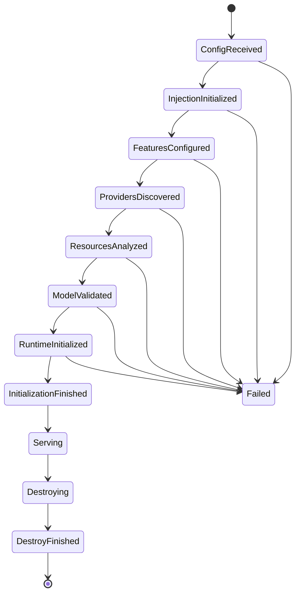
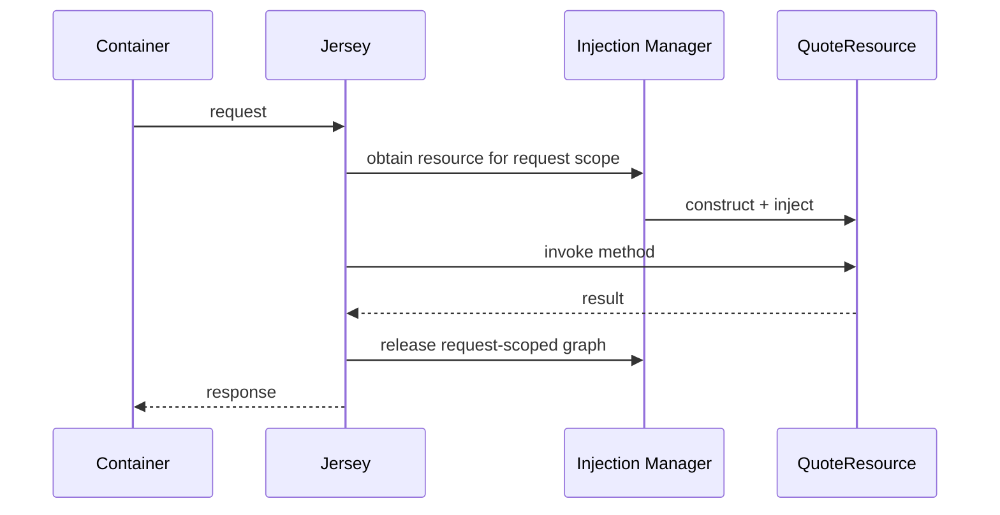
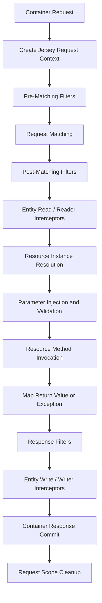
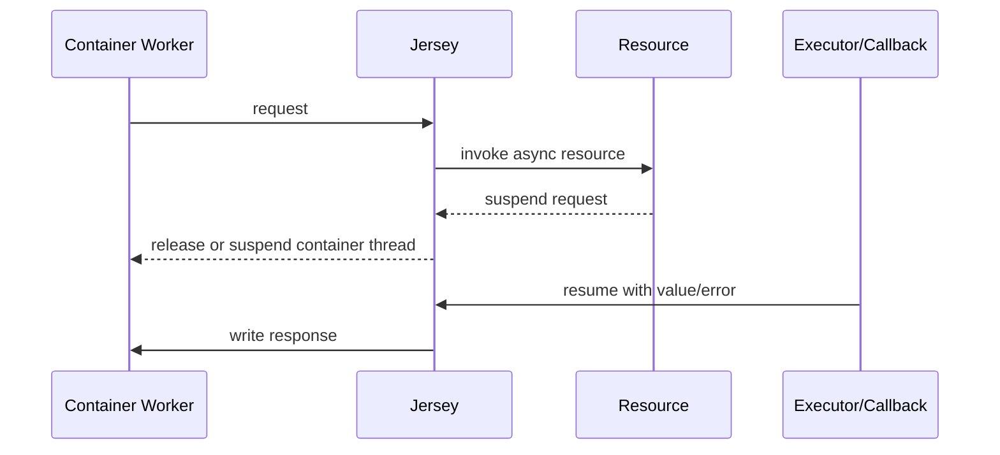

# Part 009 — Jersey Architecture and Jersey-Specific Lifecycle

> Jakarta REST mendefinisikan kontrak pemrograman. Jersey mengubah kontrak tersebut menjadi application model yang dapat dieksekusi: membaca konfigurasi, membangun resource model, membuat dependency graph, memilih provider, menyusun processing pipeline, menghubungkan container transport, dan menjalankan request. Senior engineer tidak harus menghafal seluruh class internal Jersey, tetapi harus memahami boundary, lifecycle, dan diagnostic anchors agar tidak memperlakukan Jersey sebagai kotak hitam.

## Daftar Isi

1. [Target kompetensi](#target-kompetensi)
2. [Scope dan baseline](#scope-dan-baseline)
3. [Classification rule](#classification-rule)
4. [Mental model: Jersey adalah implementation runtime](#mental-model-jersey-adalah-implementation-runtime)
5. [Jersey module topology](#jersey-module-topology)
6. [Effective server runtime graph](#effective-server-runtime-graph)
7. [`ApplicationHandler` sebagai application runtime boundary](#applicationhandler-sebagai-application-runtime-boundary)
8. [Bootstrap lifecycle Jersey](#bootstrap-lifecycle-jersey)
9. [Resource model](#resource-model)
10. [Sumber pembentukan resource model](#sumber-pembentukan-resource-model)
11. [Model validation](#model-validation)
12. [Handler class versus handler instance](#handler-class-versus-handler-instance)
13. [Default resource lifecycle](#default-resource-lifecycle)
14. [Singleton resources and providers](#singleton-resources-and-providers)
15. [Sub-resource lifecycle](#sub-resource-lifecycle)
16. [Provider registry and selection](#provider-registry-and-selection)
17. [Feature, dynamic feature, and auto-discovery](#feature-dynamic-feature-and-auto-discovery)
18. [Injection manager boundary](#injection-manager-boundary)
19. [Container adapter boundary](#container-adapter-boundary)
20. [Request processing pipeline](#request-processing-pipeline)
21. [Request state and context objects](#request-state-and-context-objects)
22. [Exception and response processing](#exception-and-response-processing)
23. [Asynchronous request processing](#asynchronous-request-processing)
24. [Application lifecycle events](#application-lifecycle-events)
25. [Request lifecycle events](#request-lifecycle-events)
26. [Monitoring statistics and JMX](#monitoring-statistics-and-jmx)
27. [Jersey tracing support](#jersey-tracing-support)
28. [Configuration properties and behavioral drift](#configuration-properties-and-behavioral-drift)
29. [Classpath, modules, and auto-activation](#classpath-modules-and-auto-activation)
30. [Reload and runtime mutation](#reload-and-runtime-mutation)
31. [Performance model](#performance-model)
32. [Observability integration](#observability-integration)
33. [Testing Jersey architecture](#testing-jersey-architecture)
34. [Architecture patterns](#architecture-patterns)
35. [Anti-patterns](#anti-patterns)
36. [Failure-model matrix](#failure-model-matrix)
37. [Debugging playbook](#debugging-playbook)
38. [PR review checklist](#pr-review-checklist)
39. [Trade-off yang harus dipahami senior engineer](#trade-off-yang-harus-dipahami-senior-engineer)
40. [Standard versus Jersey-specific behavior](#standard-versus-jersey-specific-behavior)
41. [Internal verification checklist](#internal-verification-checklist)
42. [Latihan verifikasi](#latihan-verifikasi)
43. [Ringkasan](#ringkasan)
44. [Referensi resmi](#referensi-resmi)

---

## Target kompetensi

Setelah menyelesaikan part ini, Anda harus mampu:

- menjelaskan posisi Jersey di antara HTTP container dan application code;
- membedakan Jakarta REST standard API dari Jersey public extension dan Jersey internal implementation;
- membaca dependency tree untuk mengenali `jersey-common`, `jersey-server`, container modules, media modules, dan injection module;
- menjelaskan bagaimana `ResourceConfig` menjadi effective resource model;
- memahami peran konseptual `ApplicationHandler`, injection manager, provider registry, dan container adapter;
- memprediksi kapan resource dibuat per request dan kapan instance digunakan sebagai singleton;
- mengenali risiko mutable singleton resource/provider;
- memahami bagaimana filters, interceptors, providers, exception mappers, dan resource invocations dirangkai;
- menggunakan Jersey application/request lifecycle events sebagai diagnostic hooks tanpa menjadikannya domain framework;
- menggunakan tracing secara aman untuk debugging terbatas;
- mendiagnosis startup model error, missing provider, duplicate module, injection failure, lifecycle leak, dan request pipeline failure;
- mereview penggunaan Jersey-specific API dari sisi portability, version coupling, performance, security, dan operational impact;
- membuktikan implementasi Jersey aktual di internal codebase tanpa mengasumsikan runtime atau module tertentu.

---

## Scope dan baseline

Part ini menggunakan:

- Jakarta RESTful Web Services 4.0 sebagai standard baseline;
- Jersey 3.x sebagai implementation family;
- Jersey 3.1.x documentation sebagai contoh konkret untuk module dan extension behavior;
- Java 17+ sebagai target application runtime seri ini.

Codebase internal dapat menggunakan:

- Jersey 2.x dengan namespace `javax.ws.rs`;
- Jersey 3.0.x atau 3.1.x dengan namespace `jakarta.ws.rs`;
- Jersey yang disediakan application server;
- Jersey yang dibundel dalam WAR/JAR;
- injection module HK2, CDI integration, atau abstraction internal;
- custom fork, shaded dependency, atau platform distribution.

Jangan menyimpulkan version hanya dari satu import atau satu dependency. Periksa:

```text
source imports
+ Maven dependency management
+ resolved dependency tree
+ packaged artifact
+ runtime startup logs
+ server-provided modules
```

Part ini tidak membahas detail:

- HK2 binding API secara mendalam: Part 010;
- CDI integration: Part 011;
- GlassFish/Grizzly: Part 012;
- Servlet/Tomcat/Jetty: Part 013;
- endpoint semantics: Part 014;
- context propagation dan resilience: Parts 023–024.

---

## Classification rule

Gunakan label berikut ketika membaca source:

| Category | Contoh |
|---|---|
| Jakarta REST standard | `Application`, `@Path`, `Feature`, `ContainerRequestFilter` |
| Jersey public extension | `ResourceConfig`, Jersey monitoring APIs, Jersey server properties |
| Jersey integration SPI | container providers, injection manager implementation, executor providers |
| HK2-specific | `AbstractBinder`, `ServiceLocator`, HK2 scopes |
| Runtime-specific | Servlet adapter, Grizzly container, Jetty/Tomcat integration |
| Jersey internal | package bernama `internal`, request processing implementation details |
| Application-specific | custom features, filters, providers, binders, model processors |

### Stability rule

```text
Standard API is the strongest portability boundary.
Jersey public API is a versioned implementation boundary.
Jersey internal API is a diagnostic clue, not an application contract.
```

Jangan membuat production code bergantung pada internal class hanya karena class tersebut terlihat pada stack trace.

---

## Mental model: Jersey adalah implementation runtime

Jersey bukan sekadar annotation scanner. Model yang lebih tepat:



### Core invariant

```text
For a request to execute correctly,
container integration, application model,
injection graph, provider registry,
and request pipeline must agree on the same configuration.
```

Failure sering muncul ketika satu layer terlihat benar tetapi effective model berbeda:

- class ada tetapi tidak diregister;
- provider diregister tetapi media type tidak cocok;
- dependency ter-bind tetapi scope tidak aktif;
- route valid tetapi servlet mapping salah;
- request method selesai tetapi writer gagal;
- component berjalan lokal karena classpath berbeda dari production.

---

## Jersey module topology

Jersey didesain modular. Jangan memperlakukan satu artifact `jersey-*` sebagai seluruh runtime.

### Common conceptual modules

| Module family | Tanggung jawab |
|---|---|
| `jersey-common` | common infrastructure untuk client dan server |
| `jersey-server` | server-side resource model dan request processing |
| `jersey-client` | Jakarta REST Client implementation |
| `jersey-container-*` | adapter ke Servlet, Grizzly, Jetty, dan runtime lain |
| `jersey-hk2` | HK2-based injection manager implementation |
| `jersey-media-*` | JSON, multipart, XML, SSE, atau representation support tertentu |
| `jersey-bean-validation` | integration dengan Jakarta Validation |
| testing modules | in-memory atau container-specific test support |

Nama artifact dapat berbeda menurut version. Gunakan resolved dependency tree sebagai source of truth.

### Module graph example



### Dependency is behavior

Menambahkan module bukan hanya menambah compile-time class. Module dapat:

- menyediakan provider;
- mendaftarkan feature melalui SPI;
- mengubah entity mapping;
- menambah validation integration;
- menambah container adapter;
- mengaktifkan auto-discovery tertentu;
- membawa transitive dependency yang mengubah resolution.

Karena itu, dependency upgrade harus dinilai sebagai runtime behavior change.

---

## Effective server runtime graph

Pada bootstrap, Jersey secara konseptual membangun graph berikut:

```text
ResourceConfig / Application
  -> component registrations
  -> properties
  -> features and dynamic features
  -> injection bindings
  -> providers
  -> resource classes and instances
  -> validated resource model
  -> request processing runtime
  -> container callback
```

Pertanyaan yang harus dapat dijawab:

1. Siapa membuat `ResourceConfig`?
2. Kapan `ApplicationHandler` dibuat?
3. Siapa menyediakan injection manager?
4. Kapan resource model divalidasi?
5. Siapa mengikat handler ke HTTP container?
6. Kapan readiness menjadi true?
7. Siapa menghancurkan handler dan managed services?

Jika jawaban hanya “Jersey otomatis”, architecture knowledge belum cukup.

---

## `ApplicationHandler` sebagai application runtime boundary

`ApplicationHandler` adalah Jersey server-side public class yang secara konseptual mewakili satu configured Jersey application. Detail constructor dan integration dapat berbeda antarversion/container, tetapi perannya berguna sebagai mental anchor:

```text
Application definition
  -> Jersey server runtime
  -> request handling entry point
```

### Tanggung jawab konseptual

- menerima application configuration;
- membangun atau menerima injection infrastructure;
- memproses registrations dan features;
- membangun resource model;
- menyiapkan request processing machinery;
- menerima request abstraction dari container adapter;
- menghasilkan response abstraction ke container;
- menerbitkan lifecycle events;
- mengelola destroy/reload hooks sesuai integration.

### Jangan salah mengartikan

`ApplicationHandler` bukan:

- TCP listener;
- Servlet container;
- thread pool utama server;
- domain service locator untuk dipakai bebas;
- pengganti health/readiness orchestration.

### Operational implication

Satu process dapat memiliki lebih dari satu Jersey application handler. Akibatnya:

- route model dapat terpisah;
- injection graph dapat terpisah;
- metrics dan event listener dapat terpisah;
- singleton dapat berarti singleton per application graph, bukan per process secara universal;
- shutdown harus menutup setiap application instance.

---

## Bootstrap lifecycle Jersey

Urutan implementasi detail dapat berbeda, tetapi gunakan state model berikut:



### Fail-fast boundary

Startup harus gagal sebelum traffic apabila terjadi:

- duplicate/ambiguous route yang tidak dapat diselesaikan;
- missing mandatory provider;
- unsatisfied dependency untuk eager component;
- invalid configuration;
- incompatible module set;
- duplicate API namespace;
- required initialization failure.

### Lazy failure caveat

Beberapa dependency atau component dapat dibuat saat first request. Ini mengurangi startup time tetapi memindahkan failure ke traffic path.

Trade-off:

| Strategy | Benefit | Risk |
|---|---|---|
| eager initialization | failure ditemukan sebelum traffic | startup lebih lambat; dependency sementara down dapat menghalangi deploy |
| lazy initialization | startup cepat; resource hanya dibuat bila dipakai | first-request latency; hidden failure; race initialization |

Keputusan harus berbasis availability requirement, bukan default library semata.

---

## Resource model

Jersey mengubah annotation dan programmatic definitions menjadi resource model.

Secara konseptual, model berisi:

```text
Resource
  path
  child resources
  resource methods
  sub-resource locators

ResourceMethod
  HTTP method
  consumed media types
  produced media types
  parameter model
  handler
  filters/interceptors bindings

Invocable
  Java method/constructor
  handler type or instance
  parameter metadata
```

Nama class public Jersey yang sering muncul pada diagnostic atau extension code antara lain:

- `org.glassfish.jersey.server.model.Resource`;
- `ResourceMethod`;
- `Invocable`;
- `ResourceModel`;
- `ResourceMethodInvoker` atau related runtime types menurut version.

### Stability warning

Gunakan public model API hanya jika benar-benar membutuhkan programmatic resource/model processing. Jangan menjadikan representation internal sebagai domain routing abstraction.

---

## Sumber pembentukan resource model

Model dapat berasal dari kombinasi:

- classes dari standard `Application#getClasses()`;
- singleton instances dari `Application#getSingletons()`;
- registrations pada `ResourceConfig`;
- package scanning;
- programmatic `Resource` definitions;
- feature registrations;
- auto-discovered providers/features;
- container or platform integration;
- model processors/custom extensions.

### Composition formula

```text
EffectiveResourceModel =
  ExplicitResources
  + DiscoveredResources
  + ProgrammaticResources
  + SubResources
  + RuntimeContributions
  - DisabledOrRejectedComponents
```

### Hidden model risk

Jika team hanya membaca annotated classes, mereka dapat melewatkan:

- resource yang dibangun programmatically;
- resource dari dependency;
- test/diagnostic endpoint yang aktif karena scanning;
- feature yang menambahkan filters ke method tertentu;
- platform endpoint dari shared runtime library.

Production readiness membutuhkan effective route inventory, bukan sekadar source search `@Path`.

---

## Model validation

Model validation memastikan resource model dapat dijalankan secara konsisten.

Validasi dapat menemukan:

- conflicting resource methods;
- invalid annotated method signatures;
- ambiguous entity parameters;
- unsupported handler construction;
- invalid sub-resource model;
- inconsistent media-type declarations;
- invalid name binding or model processor output;
- missing invocation metadata.

### Validation objective

```text
Reject invalid application topology at deployment,
not after a customer sends the triggering request.
```

### Warning versus fatal error

Sebagian issue dapat dicatat sebagai warning, sebagian menghentikan startup. Jangan mengandalkan log level default. Di CI:

- capture startup logs;
- fail build pada known model warnings;
- run route inventory tests;
- test packaged runtime, bukan hanya unit reflection.

### Model validation and compatibility

Model valid belum tentu compatible. Contoh:

```text
Old: GET /quotes/{id}
New: GET /quotes/{quoteId:[0-9]+}
```

Secara model mungkin valid, tetapi client yang menggunakan non-numeric identifier akan rusak. Compatibility governance berada di atas model validation.

---

## Handler class versus handler instance

Jersey resource model dapat merujuk pada class atau existing instance.

### Handler class

```java
config.register(QuoteResource.class);
```

Implikasi umum:

- runtime/injection system membuat instance;
- injection dan scope dapat diterapkan;
- lifecycle dimiliki container;
- default resource lifecycle biasanya per request.

### Handler instance

```java
config.register(new QuoteResource(service));
```

Implikasi umum:

- application membuat object;
- object cenderung diperlakukan sebagai singleton registration;
- constructor injection dilakukan manual;
- scope annotation tidak otomatis mengubah object yang sudah dibuat;
- thread safety menjadi tanggung jawab application;
- cleanup ownership harus eksplisit.

### Review rule

```text
Every registered instance must have:
thread-safety proof,
ownership proof,
and shutdown proof.
```

---

## Default resource lifecycle

Jersey mendokumentasikan root JAX-RS resources sebagai per-request secara default ketika tidak dikonfigurasi lain.

Mental model:



### Benefit

- request-specific mutable fields tidak dibagi antarrequest;
- lifecycle sederhana;
- context injection cocok dengan request;
- concurrency risk lebih kecil pada resource class.

### Cost

- allocation per request;
- constructor/injection overhead;
- developer dapat salah menaruh expensive initialization di constructor;
- resource fields tidak boleh dipakai sebagai cross-request cache.

### Design rule

Resource class sebaiknya tipis:

```text
HTTP mapping
-> validation boundary
-> authorization boundary
-> call application service
-> response mapping
```

Expensive reusable objects seperti connection pools dan HTTP clients harus berada pada application-scoped service dengan explicit lifecycle.

---

## Singleton resources and providers

Singleton dapat berasal dari:

- explicit instance registration;
- singleton scope annotation;
- DI binding singleton;
- provider lifecycle rules;
- container/platform integration.

### Concurrency invariant

```text
A singleton component may be called concurrently
unless the runtime contract explicitly serializes access.
```

Jangan menyimpan request-specific data pada field singleton:

```java
// Berbahaya
@Singleton
@Path("/quotes")
public class QuoteResource {
    private String currentTenant;

    @GET
    public Response list(@HeaderParam("X-Tenant") String tenant) {
        currentTenant = tenant;
        return Response.ok(service.list(currentTenant)).build();
    }
}
```

Race:

```text
request A sets tenant A
request B sets tenant B
request A reads tenant B
```

### Safer design

```java
@Singleton
@Path("/quotes")
public final class QuoteResource {
    private final QuoteApplicationService service;

    @Inject
    public QuoteResource(QuoteApplicationService service) {
        this.service = service;
    }

    @GET
    public Response list(@HeaderParam("X-Tenant") String tenant) {
        return Response.ok(service.list(tenant)).build();
    }
}
```

Singleton masih harus memastikan dependency thread-safe.

### Provider caveat

Message body readers/writers, filters, mappers, dan resolvers sering dipakai ulang. Jangan menganggap provider instance baru per request tanpa membuktikan lifecycle implementation.

Provider yang menyimpan mutable formatter/buffer harus diperiksa thread-safety-nya.

---

## Sub-resource lifecycle

Sub-resource locator dapat mengembalikan:

```java
@Path("/quotes/{quoteId}")
public QuoteLineResource lines(@PathParam("quoteId") String quoteId) {
    return new QuoteLineResource(quoteId, service);
}
```

atau class/type yang akan dikelola runtime, bergantung API dan pattern yang digunakan.

### Instance returned manually

Jika locator membuat object dengan `new`:

- injection container dapat dilewati;
- lifecycle callback dapat tidak dijalankan;
- scope annotation tidak relevan pada instance yang sudah dibuat;
- dependency dan cleanup dimiliki caller;
- constructor terjadi setiap locator invocation.

### Managed sub-resource

Gunakan runtime-managed resolution bila membutuhkan:

- dependency injection;
- request context;
- lifecycle management;
- consistent interception;
- custom scope.

### Internal caching warning

Jersey dapat melakukan caching/optimization pada sub-resource model menurut version dan configuration. Jangan menulis logic yang bergantung pada berapa kali metadata sub-resource dianalisis. Handler behavior harus benar baik model dianalisis sekali maupun berulang.

---

## Provider registry and selection

Jersey membangun registry provider untuk:

- entity readers/writers;
- exception mappers;
- context resolvers;
- param converters;
- filters;
- interceptors;
- features;
- validation integration;
- media-specific support.

Provider selection dipengaruhi oleh:

```text
contract type
+ generic Java type
+ annotations
+ media type
+ priority/ranking
+ name binding
+ runtime side: client/server
```

### Common failure

```text
Provider class exists
but is not selected.
```

Penyebab:

- tidak diregister;
- auto-discovery disabled;
- media type mismatch;
- generic type mismatch;
- provider kalah ranking;
- wrong annotation namespace;
- provider client-only/server-only;
- dependency version tidak kompatibel;
- duplicate provider dengan order implementation-dependent.

### Diagnostic approach

Jangan langsung mengganti payload. Pertama buktikan:

1. provider ada di packaged artifact;
2. provider terdaftar dalam effective configuration;
3. provider menyatakan readable/writeable untuk exact type;
4. selected media type sesuai;
5. interceptor chain tidak mengubah entity/type;
6. failure terjadi sebelum atau sesudah writer dipilih.

---

## Feature, dynamic feature, and auto-discovery

### Feature

Feature mengkonfigurasi application-wide capability.

```java
public final class SecurityFeature implements Feature {
    @Override
    public boolean configure(FeatureContext context) {
        context.register(AuthenticationFilter.class);
        context.register(AuthorizationFilter.class);
        return true;
    }
}
```

### Dynamic feature

Dynamic feature memutuskan binding berdasarkan resource method metadata.

```java
@Provider
public final class AuditDynamicFeature implements DynamicFeature {
    @Override
    public void configure(ResourceInfo info, FeatureContext context) {
        if (info.getResourceMethod().isAnnotationPresent(Audited.class)) {
            context.register(AuditFilter.class);
        }
    }
}
```

### Auto-discovery behavior

Auto-discovery berbeda antar Jersey version dan module. Pada Jersey 3.x, sebagian extension harus explicit, sementara SPI atau module tertentu dapat didiscover menurut version/configuration.

### Governance rule

```text
Do not document "Jersey auto-discovers X" generically.
Document exact module, exact version, exact property,
and evidence from effective runtime.
```

### Blast radius

Menambahkan dependency dapat mengaktifkan:

- serializer baru;
- validation provider;
- WADL support;
- content negotiation filter;
- feature/provider melalui service loader.

Karena itu, dependency review harus menyertakan before/after component inventory.

---

## Injection manager boundary

Jersey menggunakan abstraction injection manager agar server runtime tidak sepenuhnya terikat pada satu DI implementation. Pada deployment yang menggunakan `jersey-hk2`, implementation injection manager berbasis HK2 digunakan.

Mental model:

```text
Jersey component model
  -> InjectionManager abstraction
      -> HK2 implementation, CDI integration, or platform bridge
```

### Why it matters

Stack trace dapat menunjukkan:

- Jersey injection abstraction;
- HK2 descriptor resolution;
- CDI proxy;
- Servlet-provided object;
- custom factory.

Jangan menyimpulkan root cause hanya dari layer teratas.

### Injection responsibilities

- construct managed resources/providers;
- resolve dependencies;
- apply scope;
- handle proxies;
- invoke lifecycle callbacks according to integration;
- release scoped instances;
- expose runtime objects seperti request context melalui factories/suppliers.

### Boundary rule

Domain/application service sebaiknya tidak bergantung pada Jersey injection interfaces. Isolasi binding di composition root:

```text
runtime module
  binds
application interfaces
  implemented by
infrastructure/domain services
```

Detail HK2 dibahas pada Part 010.

---

## Container adapter boundary

Jersey tidak harus mengetahui detail socket setiap runtime. Container adapter menerjemahkan antara:

```text
container request/response model
<->
Jersey container request/response model
```

Adapter menangani hal seperti:

- base URI dan request URI;
- headers;
- entity input stream;
- security principal/context;
- response status dan headers;
- output stream;
- async suspend/resume integration;
- disconnect/error notification;
- lifecycle initialization/destroy callback.

### Adapter-specific behavior

Perbedaan dapat muncul pada:

- request body buffering;
- async timeout;
- client disconnect detection;
- forwarded headers;
- response commit timing;
- thread handoff;
- graceful shutdown;
- HTTP/2 support;
- trailer/header behavior.

Jersey request pipeline yang sama dapat menunjukkan production behavior berbeda di Grizzly versus Servlet container.

---

## Request processing pipeline

Pipeline konseptual Jersey:



Urutan tepat exception, validation, filters, dan cleanup mengikuti standard plus Jersey implementation. Gunakan Part 004–006 untuk normative standard model.

### Diagnostic stages

Ketika request gagal, klasifikasikan:

```text
INGRESS
PRE_MATCH
MATCH
POST_MATCH
READ_ENTITY
RESOLVE_RESOURCE
INJECT
VALIDATE
INVOKE
MAP_EXCEPTION
FILTER_RESPONSE
WRITE_ENTITY
COMMIT
CLEANUP
```

Satu stage label lebih berguna daripada log “request failed”.

---

## Request state and context objects

Jersey menjaga request-scoped state yang mencakup:

- URI and headers;
- matched resources/method;
- security context;
- entity stream;
- properties;
- request-scope services;
- response state;
- exception state;
- tracing/monitoring events.

### Context is not domain state

Jangan menyimpan domain transaction state di container request properties sebagai primary mechanism.

Request properties cocok untuk cross-cutting metadata seperti:

- normalized correlation ID;
- authentication result;
- tenant context reference;
- tracing state;
- request start timestamp;
- policy decision metadata.

Namun context propagation ke executor/Kafka tidak otomatis hanya karena value ada di request context.

### Thread-local warning

Request context sering diakses melalui proxy/thread-bound mechanisms. Setelah pindah executor:

- context dapat hilang;
- proxy dapat gagal karena request scope tidak aktif;
- MDC dapat kosong;
- tenant/security context dapat salah.

Part 023 membahas propagation secara eksplisit.

---

## Exception and response processing

Failure dapat muncul di empat boundary:

1. sebelum matching;
2. setelah resource matched tetapi sebelum invocation;
3. saat resource invocation;
4. saat response serialization/commit.

### Important distinction

```text
Resource method returned successfully
!=
HTTP response delivered successfully.
```

Contoh:

- resource mengembalikan DTO;
- response filter menambah header;
- writer mulai serialize;
- lazy relationship melempar exception;
- sebagian bytes sudah terkirim;
- exception mapper tidak dapat mengganti committed response.

### Mapper limitations

Exception mapper bukan universal recovery mechanism. Ia tidak dapat selalu memperbaiki:

- broken socket;
- response yang sudah committed;
- fatal VM error;
- container shutdown;
- partial stream;
- recursive mapper failure.

### Review rule

DTO harus fully materialized dan validated sebelum write bila partial response tidak dapat diterima.

---

## Asynchronous request processing

Jersey mengimplementasikan Jakarta REST asynchronous processing melalui container integration.

Lifecycle konseptual:



### Questions to verify

- siapa menyediakan executor?
- apakah container worker benar-benar dilepas?
- bagaimana timeout ditetapkan?
- apa yang terjadi jika callback datang setelah timeout?
- bagaimana cancellation dipropagasikan?
- bagaimana request scope/context diakses dari callback?
- bagaimana shutdown menangani suspended requests?

### Failure modes

- request tidak pernah di-resume;
- double resume;
- resume setelah timeout;
- unbounded callback executor;
- lost tracing/security context;
- client disconnect tidak membatalkan downstream work;
- response serialization gagal setelah async completion.

---

## Application lifecycle events

Jersey menyediakan `ApplicationEventListener` sebagai Jersey-specific monitoring hook.

Event dapat mencakup lifecycle seperti:

- initialization phases;
- application initialization finished;
- reload events menurut version/integration;
- destroy phases;
- application destroy finished.

Contoh minimal:

```java
public final class LifecycleListener implements ApplicationEventListener {
    @Override
    public void onEvent(ApplicationEvent event) {
        switch (event.getType()) {
            case INITIALIZATION_FINISHED ->
                    log.info("jersey_application_initialized");
            case DESTROY_FINISHED ->
                    log.info("jersey_application_destroyed");
            default -> {
                // No-op. Do not assume every version exposes identical event set.
            }
        }
    }

    @Override
    public RequestEventListener onRequest(RequestEvent requestEvent) {
        return null;
    }
}
```

### Appropriate uses

- emit startup/destroy telemetry;
- build route/component diagnostics;
- attach request event listener;
- measure Jersey pipeline phases;
- confirm application lifecycle ordering.

### Inappropriate uses

- execute database migration;
- start unowned infinite background threads;
- implement domain workflow;
- make readiness true without checking dependencies;
- depend on undocumented event ordering across versions.

---

## Request lifecycle events

`RequestEventListener` dapat menerima events selama request processing.

Potential stages include, depending on version:

- request start;
- matching start/finish;
- filters finished;
- entity read;
- resource method start/finish;
- exception mapped;
- response written;
- request finished.

### Per-request listener pattern

`ApplicationEventListener#onRequest` dapat mengembalikan listener baru untuk request tersebut.

Benefit:

- request-local timing state;
- no shared mutable map;
- easier phase duration measurement.

### Performance caution

Event listener berada pada hot path. Hindari:

- blocking I/O;
- synchronous remote logging;
- high-cardinality metric labels;
- serializing full request/response body;
- throwing exceptions;
- expensive reflection setiap event.

### Security caution

Jangan capture:

- Authorization header;
- cookies/session tokens;
- raw personal data;
- quote pricing payload tanpa classification;
- secret-bearing query parameters.

---

## Monitoring statistics and JMX

Jersey menyediakan monitoring statistics sebagai optional Jersey-specific capability. Dokumentasinya menyatakan statistics perlu diaktifkan secara eksplisit karena overhead.

Dapat mencakup:

- application statistics;
- resource method execution statistics;
- response code distribution;
- exception mapping statistics;
- URI/resource statistics;
- execution time distributions.

JMX exposure juga tersedia pada module/version tertentu.

### Production decision

Jersey statistics bukan pengganti OpenTelemetry/platform metrics. Pilih salah satu dari tiga strategy:

| Strategy | Kapan cocok |
|---|---|
| disabled | telemetry platform sudah cukup; minimal overhead |
| temporary diagnostics | investigasi performance hotspot |
| continuously enabled | metric value terbukti berguna dan overhead terukur |

### Risks

- duplicate metrics dengan platform instrumentation;
- high-cardinality URI/resource dimensions;
- JMX exposure tanpa security;
- version-specific beta API;
- hidden CPU/allocation overhead.

---

## Jersey tracing support

Jersey tracing dapat menunjukkan internal processing stages seperti matching, filters, reader/writer selection, invocation, dan response processing.

### Use case

- provider tidak terpilih;
- route matching membingungkan;
- interceptor ordering;
- unexpected media-type resolution;
- pipeline hotspot.

### Production security risk

Tracing information dapat muncul pada response headers atau logs tergantung configuration. Informasi tersebut dapat membocorkan:

- class names;
- resource methods;
- provider names;
- internal timings;
- application structure.

### Safe operating rule

```text
Tracing must be disabled by default,
restricted to controlled diagnostics,
access-controlled,
time-bounded,
and verified not to leak to external clients.
```

### Prefer correlation

Untuk operasi harian, gunakan trace ID dan server-side telemetry. Gunakan Jersey tracing hanya sebagai deep implementation diagnostic.

---

## Configuration properties and behavioral drift

Jersey menyediakan server/common/client properties. Nama dan semantics dapat berubah antarversion.

Properties dapat mengontrol:

- auto-discovery;
- tracing;
- monitoring statistics;
- WADL;
- response buffering;
- entity processing;
- XML security;
- validation;
- executor/thread behavior;
- sub-resource behavior;
- media provider configuration.

### Property governance

Untuk setiap property internal, dokumentasikan:

```text
property key
owning module
Jersey version
source/default
allowed values
effective value by environment
security/performance impact
test evidence
```

### Silent typo risk

Beberapa runtime mengabaikan unknown property. Karena itu:

- centralize constants;
- validate allowlist;
- log effective values;
- test property behavior;
- fail startup untuk critical configuration yang tidak dikenali bila platform wrapper memungkinkan.

---

## Classpath, modules, and auto-activation

Classpath adalah input runtime model.

### Typical failure patterns

- `jersey-server` version berbeda dari `jersey-common`;
- `jersey-hk2` hilang sehingga injection manager tidak tersedia;
- JSON provider ganda;
- legacy `javax.ws.rs` dan `jakarta.ws.rs` coexist;
- container module version tidak align;
- server-provided Jersey bentrok dengan bundled Jersey;
- service loader metadata tertimpa saat shading;
- dependency exclusion menghilangkan provider.

### Diagnostic commands

```bash
mvn dependency:tree
mvn dependency:tree -Dincludes=org.glassfish.jersey
mvn dependency:tree -Dincludes=jakarta.ws.rs,javax.ws.rs
jar tf target/application.war
jar tf target/application.jar
```

Untuk executable/fat JAR, periksa nested dependency layout sesuai packaging tool.

### BOM rule

Gunakan Jersey BOM atau parent dependency management yang konsisten. Jangan mengatur setiap Jersey module version secara independen tanpa compatibility reason.

---

## Reload and runtime mutation

Jersey memiliki lifecycle/reload support pada API/integration tertentu, tetapi hot reload bukan free production reconfiguration mechanism.

Risiko reload:

- old singleton belum dihancurkan;
- request lama masih memakai old model;
- external clients/pools diduplikasi;
- listener/binder diregister ulang;
- classloader leak;
- route berubah tanpa deployment governance;
- in-flight request mendapat mixed configuration.

### Production recommendation

Untuk perubahan application topology:

```text
prefer immutable artifact
+ new instance rollout
+ readiness
+ traffic shift
+ old instance drain
```

Runtime reload hanya digunakan bila:

- requirement jelas;
- lifecycle tested;
- state transition atomic;
- rollback defined;
- monitoring tersedia;
- version-specific behavior dipahami.

---

## Performance model

Jersey request cost secara konseptual:

```text
container dispatch
+ request context creation
+ filter chains
+ matching
+ entity conversion
+ DI/resource resolution
+ validation
+ application logic
+ response filters
+ serialization
+ commit
+ cleanup
```

Pada enterprise API, application/database/downstream cost biasanya dominan. Namun Jersey overhead menjadi signifikan ketika:

- endpoint sangat ringan dan high throughput;
- filter/interceptor chain terlalu panjang;
- reflection/model processing terjadi per request;
- provider selection tidak optimal;
- request bodies terlalu sering buffered;
- excessive monitoring/tracing aktif;
- per-request constructor melakukan heavy initialization;
- sub-resource model dibuat secara dinamis tanpa kontrol;
- response serialization menghasilkan allocation besar.

### Optimization order

1. ukur end-to-end;
2. pisahkan container queue, Jersey pipeline, application, DB, downstream;
3. perbaiki biggest bottleneck;
4. ukur ulang;
5. jangan menukar correctness dengan micro-optimization tanpa bukti.

---

## Observability integration

Minimal telemetry per request:

```text
request.method
route template
response.status
server duration
request/response size where safe
trace ID
correlation ID
tenant dimension only if bounded and approved
exception category
timeout/cancellation indicator
```

### Route template, not raw path

Gunakan:

```text
/quotes/{quoteId}
```

bukan:

```text
/quotes/Q-9384739284
```

Raw path menyebabkan high-cardinality metrics dan data leakage.

### Jersey-specific diagnostic fields

Saat investigasi, tambahkan terbatas:

- matched resource class;
- matched resource method;
- selected reader/writer;
- filter/interceptor stage;
- application name/version;
- Jersey version;
- container adapter.

Jangan jadikan class name sebagai stable business dimension.

---

## Testing Jersey architecture

### Bootstrap test

Pastikan application dapat di-bootstrap dengan packaged configuration.

Verifikasi:

- no model warnings;
- all mandatory resources/providers registered;
- no test endpoint;
- expected application properties;
- DI graph resolvable;
- lifecycle listener receives initialization/destroy.

### Route inventory test

Generate normalized route table:

```text
HTTP method
path template
consumes
produces
resource class/method
security annotation
```

Bandingkan dengan approved snapshot atau OpenAPI contract.

### Provider selection test

Untuk critical DTO/media type, test:

- exact content type;
- charset;
- empty body;
- unknown fields;
- malformed body;
- large body;
- expected reader/writer.

### Lifecycle test

Instrument constructors and close callbacks:

- request-scoped resource created per request;
- singleton created once per application;
- concurrent calls safe;
- destroy callback invoked;
- no thread remains after shutdown.

### Container parity

In-memory Jersey test tidak membuktikan:

- Servlet filter ordering;
- connector buffering;
- async timeout;
- forwarded headers;
- TLS behavior;
- real classloader;
- graceful drain.

Sediakan integration test pada runtime yang mendekati production.

---

## Architecture patterns

### Pattern 1 — Thin Jersey boundary

```text
Jersey resources/providers
  -> application interfaces
      -> domain/infrastructure implementations
```

Benefit:

- Jersey upgrade blast radius kecil;
- domain tests tidak membutuhkan Jersey;
- alternate transport memungkinkan;
- lifecycle ownership lebih jelas.

### Pattern 2 — Explicit runtime module

Satu package/module memiliki:

- `ResourceConfig`;
- Jersey features;
- binders;
- providers;
- exception mappers;
- runtime property mapping;
- lifecycle hooks.

### Pattern 3 — Effective model manifest

Pada CI/startup controlled mode, hasilkan:

- routes;
- providers;
- filters;
- features;
- application properties;
- injection bindings summary;
- Jersey/runtime versions.

### Pattern 4 — Immutable managed services

Singleton services:

- constructor-injected;
- immutable fields;
- bounded resources;
- explicit close;
- no request data in fields.

### Pattern 5 — Version-adapter isolation

Jika harus memakai Jersey monitoring/model API, bungkus dalam internal adapter. Application code tidak mengimpor Jersey monitoring types di seluruh codebase.

---

## Anti-patterns

### Jersey everywhere

Domain services menerima `ContainerRequestContext`, `UriInfo`, atau `ResourceConfig`.

Akibat:

- transport coupling;
- sulit diuji;
- upgrade blast radius besar;
- hidden request-context dependency.

### Mutable singleton resource

Menyimpan tenant, user, DTO, atau builder pada field mutable.

### Constructor does I/O

Resource constructor membuka DB connection atau memanggil remote service setiap request.

### Classpath lottery

Application bergantung pada module auto-discovery tetapi dependency tidak dipin/govern.

### Internal API dependency

Production code mengimpor `org.glassfish.jersey.*.internal.*`.

### Tracing always on

Jersey tracing response headers dibuka ke production clients.

### Catch-all mapper hides pipeline failures

Semua exception dijadikan `500` tanpa category, cause, metric, atau response-commit awareness.

### Manual sub-resource construction with hidden DI expectation

`new SubResource()` tetapi class mengharapkan injected fields.

### Multiple unaligned Jersey versions

Masing-masing module mendeklarasikan version sendiri.

### Application listener as job scheduler

Lifecycle event memulai background job tanpa owner, stop hook, atau leader election.

---

## Failure-model matrix

| Failure | Symptom | Likely stage | Evidence | Mitigation |
|---|---|---|---|---|
| Jersey module mismatch | `NoSuchMethodError`, startup failure | classloading/bootstrap | dependency tree, packaged artifact | align via BOM |
| missing `jersey-hk2` | injection/bootstrap error | injection initialization | startup stack trace | add correct injection module or integration |
| resource not registered | JAX-RS `404` | resource model | route inventory | explicit registration/scanning fix |
| invalid resource model | deployment fails/warnings | model validation | startup logs | correct signatures/routes |
| provider not selected | `415`, `500`, wrong representation | entity processing | tracing/provider inventory | register/fix media/type |
| duplicate provider | inconsistent serialization | provider resolution | effective provider list | remove/qualify/rank explicitly |
| mutable singleton race | tenant/user leakage | invocation | concurrency test, logs | immutable/stateless design |
| request-scope access off-thread | proxy/scope exception | async callback | stack trace, thread names | explicit context propagation |
| response writer failure | resource logged success but client gets partial/500 | write/commit | tracing, response bytes | materialize/validate before write |
| listener overhead | high latency/CPU | monitoring hot path | profiler, disable comparison | non-blocking bounded telemetry |
| tracing leakage | internal details in response | response headers | external capture | disable/restrict tracing |
| auto-discovered feature change | behavior changes after dependency update | bootstrap | before/after component manifest | explicit feature governance |
| sub-resource manually constructed | null injection | locator/invocation | code inspection | managed creation or explicit constructor wiring |
| shutdown leak | redeploy/thread leak | destroy | thread dump, lifecycle logs | close managed services |
| container adapter mismatch | async/path/commit anomaly | integration | runtime-specific test | align supported container module |

---

## Debugging playbook

### Step 1 — Classify the boundary

```text
container routing?
Jersey application model?
resource matching?
DI?
provider/entity processing?
application logic?
response commit?
```

### Step 2 — Capture runtime identity

Collect:

```text
Java version
Jersey version(s)
Jakarta REST API version
container adapter/module
runtime/container version
application name/build
packaging type
```

### Step 3 — Inspect dependency and artifact

```bash
mvn dependency:tree -Dverbose
mvn dependency:tree -Dincludes=org.glassfish.jersey,org.glassfish.hk2
jar tf target/*.war
```

Look for:

- version skew;
- duplicate namespace;
- missing injection/media modules;
- unexpected providers.

### Step 4 — Inspect effective configuration

- `Application`/`ResourceConfig` registrations;
- scanned packages;
- properties;
- feature activation;
- binders;
- servlet/container parameters.

### Step 5 — Obtain route/provider inventory

Confirm exact route and selected representation support.

### Step 6 — Reproduce with minimal request

Capture:

- method and normalized URI;
- headers excluding secrets;
- content type;
- accept;
- body size;
- response status/headers;
- correlation/trace ID.

### Step 7 — Use Jersey tracing only when justified

Enable in controlled environment or scoped diagnostic channel. Disable afterward.

### Step 8 — Use lifecycle/request events or profiler

Measure stage duration without full body logging.

### Step 9 — Compare environments

Diff:

- artifact hash;
- dependency/module availability;
- properties;
- container adapter;
- scanning;
- server-provided libraries.

### Step 10 — Prove cleanup

After reproduction/shutdown:

- thread dump;
- open connections;
- classloader references;
- executor state;
- repeated deployment behavior.

---

## PR review checklist

### Dependency and version

- [ ] Are Jersey modules version-aligned?
- [ ] Is a BOM/parent managing versions?
- [ ] Does the change add auto-discoverable behavior?
- [ ] Is the module necessary on server, client, or both?
- [ ] Does packaging duplicate server-provided Jersey?
- [ ] Is namespace compatible with runtime?

### Resource model

- [ ] Is the resource explicitly registered or intentionally scanned?
- [ ] Does path/method/media combination conflict?
- [ ] Are programmatic resources documented?
- [ ] Does route change preserve compatibility?
- [ ] Are sub-resources managed correctly?

### Lifecycle and concurrency

- [ ] Is component class or instance registered?
- [ ] Who creates and closes it?
- [ ] What scope applies?
- [ ] Is singleton state immutable/thread-safe?
- [ ] Is heavy work avoided in per-request constructor?
- [ ] Is off-thread request-scope access prevented?

### Providers and features

- [ ] Is provider selection deterministic?
- [ ] Are media types explicit?
- [ ] Are priorities/rankings intentional?
- [ ] Does feature registration duplicate another feature?
- [ ] Can dependency addition alter serializer/validation behavior?

### Monitoring and security

- [ ] Is request listener non-blocking?
- [ ] Are labels bounded?
- [ ] Are bodies/credentials excluded from logs?
- [ ] Is Jersey tracing disabled externally?
- [ ] Is JMX access secured?

### Runtime integration

- [ ] Is the container adapter supported by Jersey version?
- [ ] Are async behavior and timeouts tested on actual runtime?
- [ ] Does graceful shutdown destroy Jersey-managed resources?
- [ ] Is readiness after initialization?

### Testing

- [ ] Bootstrap test added/updated?
- [ ] Route inventory/OpenAPI diff reviewed?
- [ ] Provider selection tested?
- [ ] Concurrency/lifecycle tests included where relevant?
- [ ] Packaged runtime tested?

---

## Trade-off yang harus dipahami senior engineer

### Explicit registration versus discovery

| Explicit | Discovery |
|---|---|
| deterministic | convenient |
| reviewable diff | less boilerplate |
| easier component inventory | easier extension modules |
| more composition code | behavior can change via classpath |

Enterprise default: explicit for critical components; discovery only dengan constrained packages dan tests.

### Per-request versus singleton resource

| Per-request | Singleton |
|---|---|
| safer mutable state | fewer allocations |
| request context natural | requires thread safety |
| constructor per request | expensive init can be shared |
| cleanup per scope | long-lived resource ownership |

Jangan memilih singleton hanya untuk mengurangi allocation sebelum profiling.

### Jersey extension versus portability

Jersey extension dapat memberikan:

- powerful model processing;
- monitoring/tracing;
- custom DI integration;
- runtime tuning.

Biaya:

- implementation lock-in;
- version migration effort;
- more specialized knowledge;
- behavior differences across runtime.

### Deep instrumentation versus overhead

Lebih banyak lifecycle events meningkatkan diagnosability tetapi juga CPU, allocation, cardinality, dan leakage risk.

### Lazy versus eager component creation

Lazy meningkatkan startup speed; eager meningkatkan fail-fast behavior. Pilih per dependency berdasarkan criticality dan availability contract.

---

## Standard versus Jersey-specific behavior

| Capability | Jakarta REST standard | Jersey-specific / implementation |
|---|---|---|
| resource annotations | yes | implementation executes them |
| request matching rules | yes | optimized internal implementation |
| providers/filters/interceptors | yes | registry and diagnostics implementation |
| `Application` | yes | consumed by Jersey |
| `ResourceConfig` | no | Jersey |
| `ApplicationHandler` | no | Jersey |
| resource model API | partially implementation extension | Jersey model API |
| default per-request resource lifecycle | standard model expectation and Jersey behavior | concrete management by Jersey/DI |
| HK2 injection | no | Jersey module-specific |
| Jersey monitoring events | no | Jersey |
| Jersey statistics/JMX | no | Jersey |
| Jersey tracing headers/log | no | Jersey |
| container adapters | no | Jersey/runtime-specific |
| auto-discovery details | partially standard mechanisms | version/module-specific |
| runtime reload | not portable application contract | Jersey/container-specific |

### Isolation rule

```text
Keep Jersey-specific code in runtime/integration modules.
Keep domain and application policies independent
from Jersey model and monitoring APIs.
```

---

## Internal verification checklist

### Version and packaging

- [ ] Exact Jersey version from resolved dependency tree.
- [ ] Jersey 2.x versus 3.x.
- [ ] `javax.ws.rs` versus `jakarta.ws.rs`.
- [ ] Jersey BOM or dependency-management source.
- [ ] Server-provided versus application-bundled Jersey.
- [ ] Final artifact contains expected modules only.
- [ ] No version skew across `jersey-common`, server, container, media, and injection modules.

### Application runtime

- [ ] Locate all `ResourceConfig` creation/subclasses.
- [ ] Determine number of Jersey applications per process.
- [ ] Identify application names and base paths.
- [ ] Identify who constructs/destroys application handler/runtime.
- [ ] Confirm readiness timing relative to Jersey initialization.

### Resource model

- [ ] Inventory annotated resources.
- [ ] Inventory programmatic resources.
- [ ] Inventory sub-resource locators.
- [ ] Capture effective route model.
- [ ] Check startup model warnings.
- [ ] Identify model processors or custom resource builders.

### Lifecycle

- [ ] Default scope of root resources.
- [ ] Explicit singleton resources/providers.
- [ ] Existing instance registrations.
- [ ] Thread-safety proof for every singleton.
- [ ] Lifecycle callback behavior.
- [ ] External resource cleanup ownership.
- [ ] Request-scope behavior on async threads.

### Providers and features

- [ ] Entity provider inventory.
- [ ] Exception mapper inventory.
- [ ] Filters/interceptors and priorities.
- [ ] Features and dynamic features.
- [ ] Auto-discovered modules.
- [ ] JSON/XML/multipart/validation module source.
- [ ] Duplicate provider detection.

### Injection

- [ ] Injection manager implementation.
- [ ] Presence of `jersey-hk2`.
- [ ] Custom binders/factories.
- [ ] CDI bridge or integration.
- [ ] Manual service locator usage.
- [ ] Scope/proxy configuration.

### Monitoring and operations

- [ ] `ApplicationEventListener` implementations.
- [ ] `RequestEventListener` implementations.
- [ ] Monitoring statistics enabled/disabled.
- [ ] JMX exposure and security.
- [ ] Jersey tracing configuration.
- [ ] Response headers checked for tracing leakage.
- [ ] OpenTelemetry overlap/duplication.
- [ ] Runtime/version fingerprint emitted.

### Runtime integration

- [ ] Container module and runtime version.
- [ ] Async support and timeout behavior.
- [ ] Request/response buffering.
- [ ] Client disconnect handling.
- [ ] Forwarded-header/base-URI behavior.
- [ ] Graceful shutdown and suspended request handling.

### Evidence sources

- [ ] POM and dependency tree.
- [ ] final JAR/WAR contents.
- [ ] bootstrap code.
- [ ] runtime startup logs.
- [ ] container configuration.
- [ ] deployment manifests.
- [ ] historical Jersey upgrade PRs.
- [ ] incident records involving routing/serialization/injection.
- [ ] onboarding discussion with runtime/platform owner.

---

## Latihan verifikasi

### Latihan 1 — Module map

Buat graph dari dependency tree:

```text
jersey-server
container adapter
injection module
media modules
validation module
monitoring additions
```

Tandai mana direct dan transitive.

### Latihan 2 — Effective model manifest

Generate daftar routes, providers, filters, features, dan application properties. Bandingkan local versus packaged test runtime.

### Latihan 3 — Resource lifecycle proof

Tambahkan counter constructor pada resource test. Kirim beberapa request sequential dan concurrent. Buktikan lifecycle aktual tanpa hanya mengandalkan annotation.

### Latihan 4 — Singleton race

Buat singleton resource dengan mutable field pada test branch. Jalankan concurrency test hingga race terlihat, lalu refactor menjadi immutable/stateless.

### Latihan 5 — Provider selection

Register dua writers untuk type/media yang overlap. Gunakan tracing/test untuk membuktikan selection dan menghilangkan ambiguity.

### Latihan 6 — Auto-discovery diff

Tambahkan satu media/validation dependency. Capture before/after component manifest dan payload behavior.

### Latihan 7 — Lifecycle events

Implement listener yang hanya mencatat timestamps dan thread names. Buktikan initialization, request, dan destroy ordering.

### Latihan 8 — Controlled tracing

Aktifkan Jersey tracing di local environment, lakukan satu request, identifikasi MATCH, filter, read, invoke, write stages, lalu nonaktifkan kembali.

### Latihan 9 — Partial response failure

Buat writer/stream yang gagal setelah sebagian output. Amati response status, committed headers, server log, dan mapper behavior.

### Latihan 10 — Runtime parity

Bandingkan in-memory test versus actual Servlet/Grizzly runtime untuk async timeout, base URI, dan response commit behavior.

---

## Ringkasan

Mental model Part 009:

```text
Jersey takes a Jakarta REST application definition,
builds a validated resource and provider model,
connects it to dependency injection,
executes it through a request pipeline,
and adapts it to a concrete server container.
```

Invariant terpenting:

1. **Jersey adalah implementation runtime, bukan HTTP container dan bukan Jakarta REST specification.**
2. **Effective behavior berasal dari code, registrations, modules, discovery, properties, DI, dan container integration.**
3. **`ApplicationHandler` berguna sebagai conceptual application-runtime boundary, bukan port/thread owner.**
4. **Resource model harus divalidasi sebelum traffic, tetapi model validity tidak menjamin API compatibility.**
5. **Class registration dan existing-instance registration memiliki lifecycle serta thread-safety berbeda.**
6. **Root resources umumnya per request secara default; expensive reusable dependencies tidak boleh dibuat per request.**
7. **Singleton resources/providers harus stateless atau terbukti thread-safe.**
8. **Provider selection harus dibuktikan berdasarkan type, media type, annotations, dan effective registry.**
9. **Classpath dan dependency modules dapat mengubah runtime behavior.**
10. **Jersey monitoring dan tracing adalah implementation diagnostics, bukan pengganti platform observability.**
11. **Tracing harus restricted karena dapat membocorkan internal structure.**
12. **Request completion di resource method tidak menjamin response berhasil dikirim.**
13. **Async processing menambah lifecycle, context, timeout, cancellation, dan shutdown risks.**
14. **Jersey-specific APIs harus diisolasi pada runtime boundary.**
15. **Implementasi internal CSG harus dibuktikan dari dependency, artifact, bootstrap, runtime logs, dan deployment evidence.**

Part berikutnya membahas dependency injection fundamentals dan HK2: service locator, descriptors, contracts, qualifiers, binding, scopes, factories, proxies, lifecycle, diagnostics, dan hidden global-state risks.

---

## Referensi resmi

- [Jakarta RESTful Web Services Project](https://jakarta.ee/specifications/restful-ws/)
- [Jakarta RESTful Web Services 4.0 Specification](https://jakarta.ee/specifications/restful-ws/4.0/jakarta-restful-ws-spec-4.0)
- [Jakarta RESTful Web Services 4.0 API](https://jakarta.ee/specifications/restful-ws/4.0/apidocs/)
- [Jersey Project](https://eclipse-ee4j.github.io/jersey/)
- [Jersey 3.x User Guide](https://eclipse-ee4j.github.io/jersey.github.io/documentation/latest3x/user-guide.html)
- [Jersey — Modules and Dependencies](https://eclipse-ee4j.github.io/jersey.github.io/documentation/latest31x/modules-and-dependencies.html)
- [Jersey — Application Deployment and Runtime Environments](https://eclipse-ee4j.github.io/jersey.github.io/documentation/latest3x/deployment.html)
- [Jersey — JAX-RS Application, Resource, and Sub-Resource](https://eclipse-ee4j.github.io/jersey.github.io/documentation/latest3x/jaxrs-resources.html)
- [Jersey — Programmatic Resource Model](https://eclipse-ee4j.github.io/jersey.github.io/documentation/latest3x/resource-builder.html)
- [Jersey — Custom Injection and Lifecycle Management](https://eclipse-ee4j.github.io/jersey.github.io/documentation/latest3x/ioc.html)
- [Jersey — Monitoring and Diagnostics](https://eclipse-ee4j.github.io/jersey.github.io/documentation/latest/monitoring_tracing.html)
- [Jersey Configuration Properties](https://eclipse-ee4j.github.io/jersey.github.io/documentation/latest3x/appendix-properties.html)
- [Jersey GitHub Repository](https://github.com/eclipse-ee4j/jersey)
