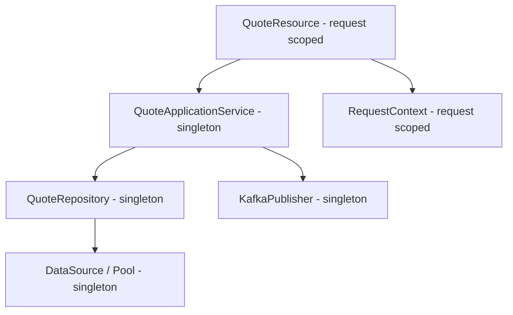
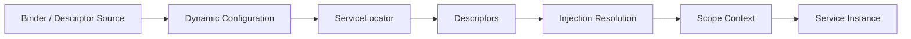
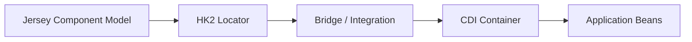
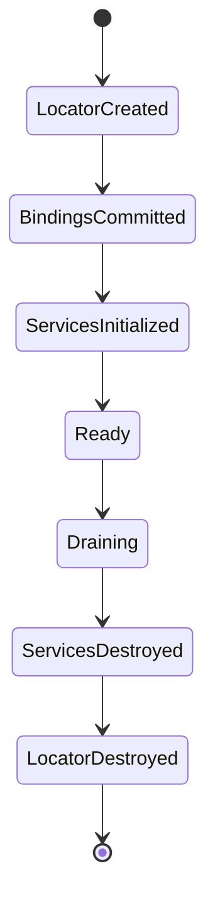

# Part 010 — Dependency Injection Fundamentals and HK2

> Dependency injection bukan mekanisme untuk “menghilangkan `new`”. Tujuannya adalah membuat object graph, ownership, lifecycle, substitusi, dan infrastructure boundaries menjadi eksplisit. HK2 dapat menyusun graph tersebut untuk Jersey, tetapi kekuatannya juga dapat menyembunyikan dependency, menciptakan global lookup, memperpanjang lifecycle tanpa sadar, dan menghasilkan scope/proxy failure yang hanya muncul di production concurrency. Gunakan HK2 sebagai composition mechanism, bukan sebagai ambient global registry.

## Daftar Isi

1. [Target kompetensi](#target-kompetensi)
2. [Scope dan baseline](#scope-dan-baseline)
3. [Terminology map](#terminology-map)
4. [Mental model: object graph and ownership](#mental-model-object-graph-and-ownership)
5. [Dependency injection fundamentals](#dependency-injection-fundamentals)
6. [Composition root](#composition-root)
7. [Constructor, field, and method injection](#constructor-field-and-method-injection)
8. [HK2 architecture](#hk2-architecture)
9. [`ServiceLocator`](#servicelocator)
10. [Descriptor, contract, and implementation](#descriptor-contract-and-implementation)
11. [Descriptor reification](#descriptor-reification)
12. [Binding with `AbstractBinder`](#binding-with-abstractbinder)
13. [Class binding](#class-binding)
14. [Instance binding](#instance-binding)
15. [Contract exposure](#contract-exposure)
16. [Qualifiers and names](#qualifiers-and-names)
17. [Ranking and ambiguity](#ranking-and-ambiguity)
18. [Injection resolution lifecycle](#injection-resolution-lifecycle)
19. [Scope mental model](#scope-mental-model)
20. [Singleton scope](#singleton-scope)
21. [Per-lookup scope](#per-lookup-scope)
22. [Jersey request scope](#jersey-request-scope)
23. [Immediate, per-thread, and optional HK2 scopes](#immediate-per-thread-and-optional-hk2-scopes)
24. [Narrow scope injected into broad scope](#narrow-scope-injected-into-broad-scope)
25. [Proxy semantics](#proxy-semantics)
26. [Provider and deferred lookup](#provider-and-deferred-lookup)
27. [Factories](#factories)
28. [Factory disposal and resource ownership](#factory-disposal-and-resource-ownership)
29. [Lifecycle callbacks](#lifecycle-callbacks)
30. [Circular dependencies](#circular-dependencies)
31. [Multiple implementations and collection lookup](#multiple-implementations-and-collection-lookup)
32. [Manual service-locator lookup](#manual-service-locator-lookup)
33. [Parent and child service locators](#parent-and-child-service-locators)
34. [Dynamic configuration and runtime mutation](#dynamic-configuration-and-runtime-mutation)
35. [Just-in-time resolution and hidden bindings](#just-in-time-resolution-and-hidden-bindings)
36. [HK2 bridges and multiple DI containers](#hk2-bridges-and-multiple-di-containers)
37. [Configuration injection](#configuration-injection)
38. [Thread safety and memory visibility](#thread-safety-and-memory-visibility)
39. [Shutdown and locator destruction](#shutdown-and-locator-destruction)
40. [Diagnostics and error interpretation](#diagnostics-and-error-interpretation)
41. [Performance model](#performance-model)
42. [Testing HK2 composition](#testing-hk2-composition)
43. [Architecture patterns](#architecture-patterns)
44. [Anti-patterns](#anti-patterns)
45. [Failure-model matrix](#failure-model-matrix)
46. [Debugging playbook](#debugging-playbook)
47. [PR review checklist](#pr-review-checklist)
48. [Trade-off yang harus dipahami senior engineer](#trade-off-yang-harus-dipahami-senior-engineer)
49. [Jakarta Inject, Jersey, and HK2 boundary](#jakarta-inject-jersey-and-hk2-boundary)
50. [Internal verification checklist](#internal-verification-checklist)
51. [Latihan verifikasi](#latihan-verifikasi)
52. [Ringkasan](#ringkasan)
53. [Referensi resmi](#referensi-resmi)

---

## Target kompetensi

Setelah menyelesaikan part ini, Anda harus mampu:

- menjelaskan dependency injection sebagai object-graph dan lifecycle management;
- membedakan dependency injection dari service locator pattern;
- menemukan composition root pada Jersey application;
- membaca HK2 binding dan menerjemahkannya menjadi graph `contract -> implementation -> scope`;
- membedakan contract, descriptor, active descriptor, qualifier, name, rank, scope, dan proxy;
- memilih constructor injection sebagai default dan mengenali risiko field/method injection;
- membedakan class binding dari existing-instance binding;
- menentukan siapa yang membuat, memiliki, menggunakan, dan menghancurkan object;
- memilih singleton, per-lookup, atau request scope berdasarkan lifecycle invariant;
- memahami mengapa request-scoped dependency yang diinjeksi ke singleton biasanya membutuhkan proxy atau deferred lookup;
- menulis HK2 `Factory` dengan ownership dan disposal semantics yang benar;
- mendiagnosis unsatisfied dependency, ambiguous binding, circular dependency, unproxyable class, inactive scope, and `MultiException`;
- menghindari ambient `ServiceLocator` dan hidden global state;
- menguji effective bindings, scopes, concurrency, lifecycle callbacks, dan shutdown;
- mereview HK2 code dari sisi portability, thread safety, resource leaks, security, startup determinism, dan operational risk;
- membuktikan apakah internal CSG codebase benar-benar menggunakan HK2 secara langsung atau hanya transitif melalui Jersey.

---

## Scope dan baseline

Part ini membahas:

- dependency injection concepts yang berlaku umum;
- Jakarta Inject annotations sebagai portable minimal injection vocabulary;
- HK2 public concepts dan binding APIs;
- Jersey integration melalui `jersey-hk2` atau equivalent injection module;
- production lifecycle dan failure modelling.

Part ini tidak mengasumsikan bahwa CSG Quote & Order memakai HK2 secara eksplisit. Kemungkinan:

```text
Jersey + HK2 direct bindings
Jersey + CDI
Jersey + HK2/CDI bridge
Jersey embedded in GlassFish
Jersey wrapped by internal platform
manual constructor wiring
another DI framework
```

Detail CDI, producers, alternatives, decorators, interceptors, dan CDI bean discovery dibahas pada Part 011.

### Version caution

HK2 APIs dan Jersey integration details berbeda antara Jersey/HK2 versions. Contoh pada materi ini harus diverifikasi terhadap:

- exact `jersey-hk2` version;
- exact HK2 modules;
- Jakarta versus legacy `javax.inject` namespace;
- container-provided versus bundled libraries.

---

## Terminology map

| Term | Meaning |
|---|---|
| dependency | object/service yang dibutuhkan object lain |
| injection point | constructor parameter, field, atau method parameter yang harus diisi |
| contract | type yang digunakan untuk lookup/injection, biasanya interface |
| implementation | concrete class yang memenuhi contract |
| binding | rule yang menghubungkan contract ke implementation/instance/factory |
| descriptor | metadata HK2 tentang service binding |
| active descriptor | descriptor yang dapat membuat/menghancurkan service dan telah cukup direalisasikan |
| service locator | registry/resolver untuk descriptors dan services |
| scope | aturan identity dan lifetime instance |
| qualifier | annotation untuk membedakan implementation dengan contract sama |
| name | string-based qualifier/identity |
| rank | precedence antara candidates |
| factory | service yang membuat dan membuang instance service lain |
| proxy | object perantara yang memilih underlying scoped instance saat dipanggil |
| composition root | satu boundary tempat object graph dirakit |

### Core question set

Untuk setiap binding, jawab:

```text
What contract is requested?
Which implementation satisfies it?
What qualifier/name selects it?
What scope owns it?
When is it created?
Which thread can use it?
Who destroys it?
```

---

## Mental model: object graph and ownership

Contoh application graph:



Object graph bukan hanya dependency arrows. Setiap node memiliki lifecycle:

| Node | Expected scope | Ownership |
|---|---|---|
| resource | request | Jersey/request scope |
| application service | application/singleton | DI container/application |
| repository | application/singleton | DI container/application |
| connection pool | application/singleton | explicit infrastructure owner |
| request context | request | request scope |
| database connection | transaction/operation | caller/transaction boundary |

### Scope inequality

```text
A longer-lived object must not retain
a concrete shorter-lived object.
```

Contoh berbahaya:

```text
singleton service
  holds
request-scoped tenant context instance
```

Setelah request pertama selesai, singleton masih menyimpan object request lama atau proxy tidak tepat.

### Dependency graph is a lifecycle graph

```text
If A owns B,
A's lifecycle must be at least as explicit as B's cleanup requirements.
```

Connection pool, Kafka producer, HTTP client, scheduler, dan executor bukan sekadar injectable dependencies; semuanya adalah operational resources.

---

## Dependency injection fundamentals

Tanpa DI:

```java
public final class QuoteResource {
    private final QuoteApplicationService service =
            new QuoteApplicationService(
                    new JdbcQuoteRepository(
                            DataSources.createFromEnvironment()));
}
```

Masalah:

- resource mengetahui concrete infrastructure;
- configuration dibaca secara tersembunyi;
- pool dapat dibuat per resource/request;
- testing sulit;
- shutdown ownership tidak jelas;
- dependency graph tersebar.

Dengan constructor injection:

```java
public final class QuoteResource {
    private final QuoteApplicationService service;

    @Inject
    public QuoteResource(QuoteApplicationService service) {
        this.service = Objects.requireNonNull(service);
    }
}
```

Composition root membuat binding:

```text
QuoteApplicationService -> DefaultQuoteApplicationService
QuoteRepository -> JdbcQuoteRepository
DataSource -> managed singleton instance
```

### DI goals

- dependency visibility;
- inversion of control;
- test substitution;
- lifecycle management;
- configuration centralization;
- cross-cutting integration;
- startup validation.

### DI does not guarantee good architecture

Container tetap dapat menyusun graph buruk:

- service locator everywhere;
- circular dependencies;
- giant singleton graph;
- runtime reflection failure;
- hidden optional dependency;
- wrong scope;
- mutable shared state.

Container hanya mengeksekusi architecture yang Anda definisikan.

---

## Composition root

Composition root adalah tempat concrete object graph dipilih.

Dalam Jersey/HK2, candidate composition roots:

- `ResourceConfig` constructor;
- registered `AbstractBinder` modules;
- platform bootstrap module;
- container-specific integration;
- test-specific binder.

Example:

```java
public final class QuoteOrderApplication extends ResourceConfig {
    public QuoteOrderApplication(AppConfiguration configuration) {
        register(QuoteResource.class);
        register(new InfrastructureBinder(configuration));
    }
}
```

Binder:

```java
public final class InfrastructureBinder extends AbstractBinder {
    private final AppConfiguration configuration;

    public InfrastructureBinder(AppConfiguration configuration) {
        this.configuration = configuration;
    }

    @Override
    protected void configure() {
        bind(DefaultQuoteApplicationService.class)
                .to(QuoteApplicationService.class)
                .in(Singleton.class);

        bind(JdbcQuoteRepository.class)
                .to(QuoteRepository.class)
                .in(Singleton.class);

        bind(configuration)
                .to(AppConfiguration.class);
    }
}
```

### Composition-root invariant

```text
Concrete implementation selection belongs at the edge,
not inside domain or resource methods.
```

### Multiple binders

Pisahkan berdasarkan ownership, bukan arbitrary layer count:

```text
CoreApplicationBinder
DatabaseBinder
MessagingBinder
ExternalClientBinder
SecurityBinder
RuntimeContextBinder
```

Namun terlalu banyak binder kecil membuat effective graph sulit dibaca. Sediakan graph manifest/test.

---

## Constructor, field, and method injection

## Constructor injection

```java
@Inject
public DefaultQuoteApplicationService(
        QuoteRepository repository,
        QuoteEventPublisher publisher,
        Clock clock) {
    this.repository = requireNonNull(repository);
    this.publisher = requireNonNull(publisher);
    this.clock = requireNonNull(clock);
}
```

Benefit:

- dependency explicit;
- object tidak dapat dibuat invalid;
- fields dapat `final`;
- mudah unit test;
- compatible dengan manual wiring;
- improves memory visibility after safe publication.

Default pilihan untuk application code.

## Field injection

```java
@Inject
private QuoteRepository repository;
```

Risks:

- hidden dependencies;
- object temporarily invalid;
- reflection/container required for tests;
- fields tidak `final`;
- inheritance injection complexity;
- manual construction menghasilkan null.

Gunakan hanya jika framework constraints jelas dan terisolasi.

## Method injection

```java
@Inject
void configure(QuoteRepository repository, Clock clock) {
    this.repository = repository;
    this.clock = clock;
}
```

Useful untuk optional configuration pattern tertentu, tetapi memiliki temporal validity risk.

### Review rule

```text
Application/domain code: constructor injection by default.
Framework adapters: field/method injection only with explicit reason.
```

---

## HK2 architecture

HK2 dapat dimodelkan sebagai:



### Simplified lifecycle

```text
bind descriptors
-> commit configuration
-> request service
-> select descriptor
-> reify descriptor if needed
-> resolve dependencies
-> resolve scope context
-> create or reuse instance
-> inject
-> post-construct
-> return service/proxy
-> destroy at scope/locator end
```

Exact order and supported callbacks depend on HK2/Jersey integration.

---

## `ServiceLocator`

`ServiceLocator` adalah core HK2 registry and resolution API.

Conceptual operations:

```java
QuoteRepository repository =
        serviceLocator.getService(QuoteRepository.class);
```

### Appropriate uses

- composition/integration code;
- diagnostics;
- framework adapter;
- controlled plugin resolution;
- tests inspecting graph.

### Inappropriate uses

```java
public final class PricingService {
    public Money calculate(Quote quote) {
        TaxService tax = GlobalLocator.get().getService(TaxService.class);
        // hidden dependency
    }
}
```

Problems:

- dependency tidak terlihat di constructor;
- global mutable runtime state;
- tests order-dependent;
- scope/context failure muncul jauh dari composition root;
- circular dependencies tersembunyi;
- difficult static analysis.

### Service locator versus DI

```text
DI: container pushes dependencies into object.
Service locator: object pulls dependencies from registry.
```

HK2 bernama service locator framework, tetapi application architecture tetap sebaiknya memakai injection, bukan arbitrary lookup.

---

## Descriptor, contract, and implementation

Binding:

```java
bind(JdbcQuoteRepository.class)
        .to(QuoteRepository.class)
        .in(Singleton.class);
```

Conceptual descriptor:

```text
implementation = JdbcQuoteRepository
advertised contract = QuoteRepository
scope = Singleton
qualifiers = none
rank = default
name = none
metadata = ...
```

### Contract-first injection

```java
public interface QuoteRepository {
    Optional<Quote> findById(QuoteId id);
}
```

Consumer:

```java
@Inject
public QuoteApplicationService(QuoteRepository repository) {
    this.repository = repository;
}
```

Benefits:

- implementation substitution;
- test fake;
- infrastructure isolation;
- explicit capability.

### Do not create empty interface only for DI

Interface harus merepresentasikan meaningful contract. Tidak semua class membutuhkan interface. Stable stateless utility/application class dapat di-bind sebagai contract dirinya sendiri jika substitution tidak dibutuhkan.

---

## Descriptor reification

HK2 descriptor dapat awalnya berupa metadata yang belum sepenuhnya memuat/menganalisis implementation class. Reification adalah proses mengubah descriptor menjadi form aktif yang cukup untuk creation/injection.

Potential reification work:

- load class;
- inspect constructors/injection points;
- resolve scope;
- process qualifiers;
- validate proxyability;
- prepare creation metadata.

### Why failures may be lazy

Descriptor dapat berhasil diregister tetapi gagal saat pertama kali diminta:

- class missing;
- constructor invalid;
- dependency unsatisfied;
- scope unavailable;
- proxy generation fails;
- static initialization error.

### Production implication

Critical services sebaiknya divalidasi/eagerly resolved during startup health gate bila failure first-use tidak dapat diterima.

Jangan eagerly instantiate semua service tanpa alasan. Beberapa integrations optional atau expensive.

---

## Binding with `AbstractBinder`

`AbstractBinder` menyediakan DSL untuk menambahkan descriptors ke locator saat `configure()`.

```java
public final class QuoteBinder extends AbstractBinder {
    @Override
    protected void configure() {
        bind(DefaultQuoteApplicationService.class)
                .to(QuoteApplicationService.class)
                .in(Singleton.class);

        bind(JdbcQuoteRepository.class)
                .to(QuoteRepository.class)
                .in(Singleton.class);
    }
}
```

Register dengan Jersey:

```java
ResourceConfig config = new ResourceConfig()
        .register(QuoteResource.class)
        .register(new QuoteBinder());
```

### Binder design rules

- binder harus deterministic;
- jangan melakukan remote I/O di `configure()`;
- jangan membaca environment tersebar;
- jangan membuat thread;
- jangan menyembunyikan profile branching kompleks;
- validate required configuration before binding;
- group bindings by ownership;
- avoid duplicate contract bindings unless qualifiers/ranking intentional.

### Binder is configuration, not service runtime

`configure()` mendeskripsikan graph. Expensive service initialization sebaiknya berada pada managed provider/factory/bootstrap phase dengan clear lifecycle.

---

## Class binding

```java
bind(DefaultPricingService.class)
        .to(PricingService.class)
        .in(Singleton.class);
```

HK2 memiliki class dan dapat:

- memilih injectable constructor;
- resolve dependencies;
- apply scope;
- create proxy if configured;
- invoke lifecycle integration;
- destroy instance according to scope.

### Self contract

Untuk binding sebagai contract dirinya sendiri, API dapat menyediakan pattern seperti `bindAsContract` menurut HK2 binding DSL/version:

```java
bindAsContract(QuoteValidator.class)
        .in(Singleton.class);
```

Verifikasi exact method availability pada version internal.

### Prefer implementation binding when

- container harus membuat object;
- dependency injection dibutuhkan;
- lifecycle dimiliki container;
- scope harus diterapkan.

---

## Instance binding

```java
AppConfiguration config = loadAndValidateConfiguration();

bind(config)
        .to(AppConfiguration.class);
```

Container menerima existing object.

### Implications

- object telah dibuat sebelum binding;
- constructor injection tidak dilakukan oleh HK2;
- scope semantics berbeda dari class binding;
- instance biasanya effectively shared;
- lifecycle callbacks/disposal harus diverifikasi;
- creator tetap mungkin memiliki cleanup responsibility.

### Good candidates

- immutable validated configuration;
- externally managed client/pool dengan explicit owner;
- test fake instance;
- stable clock/object mapper instance.

### Bad candidates

- mutable request-specific object;
- non-thread-safe formatter;
- object yang belum fully initialized;
- closeable tanpa shutdown owner;
- tenant-specific object bound globally.

### Ownership declaration

Untuk setiap existing instance binding, dokumentasikan:

```text
created by
created when
shared by
thread safety
closed by
closed when
```

---

## Contract exposure

Satu implementation dapat mengekspos satu atau lebih contracts.

```java
bind(DefaultCatalogService.class)
        .to(CatalogReader.class)
        .to(CatalogUpdater.class)
        .in(Singleton.class);
```

### Interface segregation risk

Walau implementation sama, consumer sebaiknya meminta capability minimum.

```text
Read endpoint -> CatalogReader
Admin update flow -> CatalogUpdater
```

Jangan inject broad concrete implementation bila consumer hanya butuh read.

### Security boundary

Contract exposure dapat menjadi authorization architecture issue. Misalnya internal mutation capability tidak boleh tersedia pada component yang hanya memerlukan query capability.

DI tidak menerapkan security otomatis, tetapi narrow contracts mengurangi accidental capability.

---

## Qualifiers and names

Dua implementation untuk contract yang sama:

```java
public interface PricingEngine {
    Price calculate(PricingInput input);
}
```

Qualifiers:

```java
@Qualifier
@Retention(RUNTIME)
@Target({ FIELD, PARAMETER, METHOD, TYPE })
public @interface StandardPricing {
}

@Qualifier
@Retention(RUNTIME)
@Target({ FIELD, PARAMETER, METHOD, TYPE })
public @interface PromotionalPricing {
}
```

Injection:

```java
@Inject
public QuotePricingService(
        @StandardPricing PricingEngine standard,
        @PromotionalPricing PricingEngine promotional) {
    this.standard = standard;
    this.promotional = promotional;
}
```

Binding DSL for qualifiers varies; verify exact HK2 APIs/version. Conceptually:

```text
PricingEngine + @StandardPricing -> StandardPricingEngine
PricingEngine + @PromotionalPricing -> PromotionPricingEngine
```

### Names

String names can distinguish implementations, but are more fragile:

- typo not compiler checked;
- refactor risk;
- hidden convention;
- string coupling.

Prefer type-safe qualifier annotations for stable architecture. Use names for genuinely dynamic/plugin-like resolution with governance.

### Qualifier design rule

Qualifier should express semantic role, not deployment environment:

```text
Good: @PrimaryLedger, @ArchiveStore
Weak: @Prod, @Dev, @Server1
```

Environment selection belongs in composition/configuration, not consumer code.

---

## Ranking and ambiguity

HK2 descriptors can have ranking/precedence. Higher-ranked candidate may win for singular lookup according to API semantics.

### Danger

Ranking can make graph resolution implicit:

```text
shared library binds default implementation rank 0
application binds override rank 100
new dependency binds another rank 200
behavior silently changes
```

### Use ranking for

- framework default override;
- extension/plugin ordering;
- well-documented platform layering.

### Avoid ranking for

- business branching;
- tenant selection;
- environment selection;
- authorization policy;
- arbitrary duplicate bindings.

### Prefer qualifiers over rank

If both implementations have distinct semantic roles, qualifiers are clearer. Rank is appropriate when candidates are substitutes for the same semantic role.

### Ambiguity rule

Every multiple-binding contract must have one of:

```text
explicit qualifier
explicit collection injection
explicit rank policy
explicit runtime selection strategy
```

Unintentional duplicates should fail tests/startup.

---

## Injection resolution lifecycle

Conceptual algorithm for an injection point:

```text
1. inspect required type
2. inspect qualifiers/name
3. query visible descriptors
4. apply contract and qualifier matching
5. resolve ranking/ambiguity
6. identify descriptor and scope
7. obtain scope context
8. return existing instance or create one
9. resolve nested dependencies
10. perform injection
11. invoke post-construction lifecycle
12. return instance or proxy
```

### Recursive graph

For:

```text
QuoteResource
 -> QuoteApplicationService
    -> QuoteRepository
       -> DataSource
```

Failure can be reported at resource creation while root cause is missing `DataSource` binding several levels down.

### Error reading rule

Read `MultiException` from deepest cause upward and reconstruct graph path:

```text
QuoteResource
needed QuoteApplicationService
needed QuoteRepository
needed DataSource
no descriptor found
```

Do not stop at “Unable to perform operation: resolve”.

---

## Scope mental model

Scope answers two questions:

```text
Identity: when do two lookups receive the same object?
Lifetime: when is that object destroyed?
```

Scope does **not** automatically guarantee:

- thread safety;
- transaction safety;
- tenant isolation;
- security;
- correct cleanup;
- context propagation.

### Scope lattice

```text
process/application scope
    > request scope
        > operation/per-lookup scope
```

Longer-lived object may depend on shorter-lived capability only through correct proxy/provider mechanism, not by retaining concrete instance.

### Scope selection checklist

- Is state immutable?
- Is state request-specific?
- Is construction expensive?
- Is object thread-safe?
- Does it own closeable resources?
- Must identity be stable?
- Does it depend on narrower scope?
- Is lazy creation acceptable?

---

## Singleton scope

Singleton means one instance within a particular locator/application scope context—not necessarily one per machine or cluster.

```java
bind(DefaultQuoteApplicationService.class)
        .to(QuoteApplicationService.class)
        .in(Singleton.class);
```

### Good singleton candidates

- immutable application services;
- thread-safe repositories;
- shared HTTP clients;
- Kafka producers;
- connection pool wrappers;
- stateless mappers;
- immutable configuration.

### Requirements

- safe publication;
- thread-safe methods/dependencies;
- no mutable request state;
- bounded internal queues/caches;
- explicit cleanup if closeable;
- no tenant leakage.

### Singleton does not mean eager

Singleton may be created lazily on first lookup depending on binding/container behavior. Verify if startup requires eager validation.

### Singleton blast radius

Failure/corruption affects all concurrent requests in that application instance.

---

## Per-lookup scope

Per-lookup means a new service instance for each relevant lookup/injection resolution, subject to HK2 semantics and service handles.

Suitable for:

- lightweight stateful operation object;
- builder/factory product;
- isolated processing context;
- non-thread-safe helper used by one owner.

Risks:

- excessive allocation;
- expensive resource creation;
- unclear destruction;
- object created multiple times within one graph;
- connection/client created per lookup.

### Never use per-lookup blindly for external resources

```text
per lookup HTTP client
per lookup Kafka producer
per lookup connection pool
```

These cause socket/thread/resource explosion.

### Ownership question

If per-lookup instance implements `AutoCloseable`, who closes it? Injection alone does not make close timing obvious. Prefer operation-local try-with-resources if object truly belongs to one method.

---

## Jersey request scope

Jersey request scope associates service identity/lifetime with one request processing scope.

Typical candidates:

- request metadata holder;
- normalized tenant/security context;
- request-local cache;
- request timing state;
- selected locale/currency context.

Conceptual binding:

```java
bindFactory(RequestContextFactory.class)
        .to(RequestContext.class)
        .in(RequestScoped.class);
```

Exact packages and proxy options depend on Jersey/HK2 version.

### Request-scope invariant

```text
No request-scoped object may escape the request
as a concrete retained reference.
```

Escape examples:

- stored in singleton field;
- placed in static map;
- captured by long-running executor task;
- sent to event listener after request cleanup;
- cached by tenant ID indefinitely.

### Async caveat

Jersey may propagate/activate request scope for supported async processing paths, but arbitrary executors do not automatically preserve it. Verify exact integration.

---

## Immediate, per-thread, and optional HK2 scopes

HK2 offers optional scopes/extensions such as immediate and per-thread scopes. Availability may require explicit enablement.

## Immediate scope

Conceptually creates service soon after descriptor is added and destroys it when descriptor/locator is removed.

Risks:

- asynchronous/eager startup ordering may not be deterministic;
- dependencies also instantiate early;
- initialization error handling requires explicit hooks;
- readiness may race with service startup;
- background initialization thread complicates observability.

Do not use immediate scope as a substitute for explicit application startup state machine.

## Per-thread scope

Identity tied to a thread.

Usually dangerous in modern server code because:

- request may change threads;
- thread pools reuse threads across requests;
- async work crosses executors;
- virtual threads alter assumptions;
- stale tenant/security state can leak.

Per-thread is not equivalent to per-request.

## Custom scopes

Custom scope requires:

- context activation/deactivation;
- instance storage;
- destruction;
- proxy behavior;
- concurrency rules;
- failure handling;
- tests across async/shutdown.

Use only for a strong lifecycle requirement that cannot be represented by simpler explicit objects.

---

## Narrow scope injected into broad scope

Problem:

```text
Singleton AuditService
  injects
RequestScoped RequestMetadata
```

If concrete request instance is injected while singleton is constructed, it becomes stale forever.

Desired behavior:

```text
singleton holds proxy/provider
proxy resolves current request instance on each use
```

### Architecture alternatives

1. **Proxy current request context**
2. **Inject `Provider<RequestMetadata>` and call `get()` inside request operation**
3. **Pass request metadata explicitly as method parameter**
4. **Move behavior to request-scoped coordinator**

### Preferred for domain clarity

Passing explicit context object through application method often provides strongest visibility:

```java
quoteService.submit(command, requestContext);
```

But avoid contaminating deep domain model with transport-specific context. Map to domain-relevant actor/tenant identifiers.

### Review question

Why does broad-scope service need request-scope dependency? Often this reveals misplaced responsibility.

---

## Proxy semantics

HK2 can inject proxy instead of actual service to bridge scopes or defer expensive creation.

Conceptually:

```text
consumer -> proxy -> scope context -> current real instance
```

### Benefits

- singleton can access current request service;
- lazy creation;
- lifecycle resolved at invocation time.

### Costs

- stack traces include generated proxy;
- identity comparisons confusing;
- `getClass()` differs;
- final classes/methods may be unproxyable;
- call outside active scope fails;
- serialization may fail;
- performance overhead;
- hidden context lookup.

### Proxyability

Depending on proxy mechanism/version, implementation may require interface or non-final class/methods and suitable constructor. Prefer injecting interfaces for proxied services.

### Identity caveat

Avoid:

```java
if (service.getClass() == DefaultService.class) { ... }
```

Use contracts/capabilities, not concrete identity.

### Scope failure example

Background thread invokes request proxy after response completes:

```text
proxy exists
but no active request scope
-> resolution failure
```

Proxy preserves lookup mechanism, not context lifetime.

---

## Provider and deferred lookup

`jakarta.inject.Provider<T>` can defer resolution:

```java
public final class AuditService {
    private final Provider<RequestMetadata> requestMetadata;

    @Inject
    public AuditService(Provider<RequestMetadata> requestMetadata) {
        this.requestMetadata = requestMetadata;
    }

    public void record(Action action) {
        RequestMetadata current = requestMetadata.get();
        // use only within active request
    }
}
```

### Benefits

- explicit deferred dependency;
- can bridge scope without class proxy;
- avoids creation when unused.

### Risks

- `get()` may fail at runtime;
- dependency still ambient relative to method;
- caller may invoke outside request;
- repeated `get()` identity depends on scope;
- easy to capture provider and use off-thread.

### Provider rule

Use provider when deferred/scoped lookup is an intentional architectural requirement. Do not use it merely to break circular dependencies.

---

## Factories

HK2 `Factory<T>` separates service construction from binding.

Example:

```java
public final class RequestMetadataFactory
        implements Factory<RequestMetadata> {

    private final ContainerRequestContext request;

    @Inject
    public RequestMetadataFactory(ContainerRequestContext request) {
        this.request = request;
    }

    @Override
    public RequestMetadata provide() {
        return RequestMetadata.from(request.getHeaders());
    }

    @Override
    public void dispose(RequestMetadata instance) {
        // No resource to release.
    }
}
```

Binding:

```java
bindFactory(RequestMetadataFactory.class)
        .to(RequestMetadata.class)
        .in(RequestScoped.class);
```

### Appropriate factory uses

- adapt runtime object to application context;
- construct object requiring nonstandard logic;
- select implementation based on validated startup configuration;
- wrap externally managed resource;
- manage paired `provide/dispose` lifecycle.

### Avoid factory for

- simple constructor injection;
- service lookup inside `provide()` without explicit dependencies;
- per-request network client creation;
- reading environment repeatedly;
- business decision per invocation.

### Factory itself has a scope

Distinguish:

```text
factory service scope
provided service scope
```

They can differ. Verify binding DSL to ensure intended scope applies to provided service and factory lifecycle is acceptable.

---

## Factory disposal and resource ownership

`dispose(T)` is not ceremonial. It defines destruction responsibility when HK2 releases the provided service.

For closeable products:

```java
@Override
public void dispose(ManagedResource resource) {
    try {
        resource.close();
    } catch (Exception e) {
        log.warn("managed_resource_close_failed", e);
    }
}
```

### Ownership invariants

- close exactly once;
- never close externally shared object that factory does not own;
- disposal must be idempotent where possible;
- cleanup failure must not stop cleanup of other resources;
- shutdown time bounded;
- disposal order accounts for dependencies.

### Dangerous ambiguity

Factory returns an application-server-managed `DataSource`. Calling close on it may be wrong. Factory should only dispose resources it owns.

### Shared resource reference

If multiple services refer to same external client, only one lifecycle owner closes it. Injected consumers must not call close.

### Request-scope cleanup

Request factory product disposal happens at request-scope end only if integration correctly tracks service handle/lifecycle. Test rather than assume.

---

## Lifecycle callbacks

HK2 can integrate lifecycle callbacks such as post-construction and pre-destruction for managed instances, depending on modules/integration and annotations.

Example:

```java
public final class KafkaPublisherLifecycle {
    private final KafkaProducer<String, byte[]> producer;

    @Inject
    public KafkaPublisherLifecycle(KafkaProducer<String, byte[]> producer) {
        this.producer = producer;
    }

    @PostConstruct
    void verifyConfiguration() {
        // Fast local validation only; avoid indefinite remote blocking.
    }

    @PreDestroy
    void stop() {
        producer.close(Duration.ofSeconds(10));
    }
}
```

### Lifecycle callback rules

- constructor establishes valid object invariants;
- `@PostConstruct` should not repair partially valid object;
- do not perform unbounded network calls;
- `@PreDestroy` must be bounded/idempotent;
- do not assume process crash invokes callback;
- callback ordering between unrelated services may not be guaranteed;
- verify behavior for existing-instance bindings.

### Prefer explicit owner when critical

For complex startup/shutdown dependencies, explicit lifecycle coordinator is easier to reason about than distributed annotations.

---

## Circular dependencies

Example:

```text
QuoteService -> PricingService -> QuoteService
```

Container may:

- fail resolution;
- create proxies;
- defer lookup;
- expose partially initialized graph;
- report nested `MultiException`.

### Circular dependency is architecture signal

Likely causes:

- responsibilities not separated;
- bidirectional domain service knowledge;
- orchestration mixed with capability;
- event/callback boundary missing;
- interface too broad.

### Refactoring options

- introduce orchestrator;
- extract shared lower-level service;
- publish domain event;
- invert one dependency via narrow port;
- pass result/data instead of service reference;
- merge components if they are one cohesion unit.

### Do not solve with service locator/provider first

Deferred lookup can hide the cycle, not fix design.

---

## Multiple implementations and collection lookup

Some systems need all implementations:

```text
List<QuoteValidator>
```

HK2 offers mechanisms such as iterable/multiple service lookup depending on APIs/version.

Use cases:

- validation pipeline;
- plugin handlers;
- format converters;
- policy evaluators.

### Determinism requirements

- explicit ordering;
- stable selection criteria;
- duplicate detection;
- failure isolation;
- component ownership;
- bounded plugin set.

### Avoid implicit classpath plugin order

Java classpath/service discovery order may not be stable enough for business-critical pipeline.

Create explicit ordered registry at composition root:

```java
List<QuoteValidator> validators = List.of(
        mandatoryFieldValidator,
        catalogCompatibilityValidator,
        commercialPolicyValidator);
```

DI can inject individual validators, while application explicitly owns sequence.

---

## Manual service-locator lookup

Manual lookup may be necessary for:

- framework integration that constructs object outside HK2;
- dynamic plugin by type/name;
- diagnostics;
- custom scope/context integration.

### Encapsulate lookup

```java
public interface PluginResolver {
    <T> Optional<T> resolve(Class<T> contract, String name);
}
```

HK2 adapter:

```java
final class Hk2PluginResolver implements PluginResolver {
    private final ServiceLocator locator;

    @Inject
    Hk2PluginResolver(ServiceLocator locator) {
        this.locator = locator;
    }

    @Override
    public <T> Optional<T> resolve(Class<T> contract, String name) {
        return Optional.ofNullable(locator.getService(contract, name));
    }
}
```

Domain code depends pada `PluginResolver`, bukan HK2.

### Lookup risks

- null on missing service;
- resolution exceptions;
- scope inactive;
- service handle not destroyed;
- qualifier mismatch;
- dynamic descriptor changes;
- security capability exposure.

### Avoid static locator holder

Static global locator creates process-wide hidden mutable state and test contamination.

---

## Parent and child service locators

HK2 can model locator hierarchy. Child locator may see parent services according to visibility rules, while parent generally does not depend on child.

Potential use:

- platform-level shared services;
- application-specific child graph;
- tenant/plugin isolated graphs;
- test overrides.

### Risks

- unclear ownership of shared singleton;
- parent resource closed while child active;
- binding shadowing;
- classloader visibility mismatch;
- memory leak retaining child locator;
- unexpected cross-application coupling.

### Hierarchy invariant

```text
Parent lifecycle must outlive every child
that consumes parent-owned services.
```

### Application server caution

A server may manage locator hierarchies internally. Do not create/destroy locators manually without understanding container ownership.

---

## Dynamic configuration and runtime mutation

HK2 supports dynamic addition/removal of descriptors through configuration APIs.

Possible uses:

- plugin activation;
- test setup;
- platform extension;
- controlled reload.

Production risks:

- graph changes while requests execute;
- singleton old/new coexistence;
- dependent services retain removed implementation;
- disposal races;
- non-atomic business behavior;
- difficult rollback;
- hard-to-reproduce incidents.

### Rule

```text
Static application dependencies should be immutable after readiness.
```

For runtime feature/config changes, prefer:

- immutable service graph;
- dynamic data/config inside dedicated thread-safe component;
- versioned snapshot;
- atomic reference swap;
- progressive rollout.

Do not mutate DI graph for ordinary feature flags or tenant pricing changes.

---

## Just-in-time resolution and hidden bindings

HK2 can support just-in-time resolution mechanisms that create/register descriptors when normal resolution fails.

Benefit:

- framework integration;
- plugin discovery;
- bridge to another container;
- convention-based wiring.

Risks:

- missing binding unexpectedly succeeds;
- startup graph incomplete;
- first-request latency;
- runtime classpath dependence;
- difficult dependency inventory;
- security: arbitrary type exposure;
- error appears far from composition root.

### Governance

If JIT resolution is used:

- constrain packages/contracts;
- log created bindings;
- cache deterministically;
- test failure behavior;
- prohibit arbitrary application type lookup;
- expose graph manifest after resolution.

---

## HK2 bridges and multiple DI containers

Jersey application dapat berinteraksi dengan CDI, Spring, Guice, or platform container through bridges/integration.

Potential architecture:



### Dual-container questions

- container mana yang membuat resource?
- siapa menerapkan scope?
- apakah singleton duplicated?
- lifecycle callback dipanggil oleh siapa?
- qualifier semantics sama?
- proxy berlapis?
- transaction/security interceptors aktif?
- exception berasal dari container mana?
- shutdown order apa?

### Boundary recommendation

Pilih satu primary owner untuk application services. Gunakan bridge hanya di boundary Jersey resource/provider jika diperlukan.

### Duplicate singleton example

HK2 binds `PricingService`, CDI juga discovers `PricingService`:

```text
HK2 singleton instance A
CDI application-scoped instance B
```

Caches, connections, and state diverge. Ini bukan singleton secara system-wide.

Part 011 membahas CDI integration secara mendalam.

---

## Configuration injection

Configuration should be:

- loaded once per snapshot;
- typed;
- validated;
- immutable;
- redacted;
- versioned/fingerprinted;
- environment provenance known.

Example:

```java
public record DatabaseConfiguration(
        URI jdbcUrl,
        String username,
        Duration connectionTimeout,
        int maximumPoolSize) {

    public DatabaseConfiguration {
        Objects.requireNonNull(jdbcUrl);
        Objects.requireNonNull(username);
        Objects.requireNonNull(connectionTimeout);
        if (maximumPoolSize < 1) {
            throw new IllegalArgumentException("maximumPoolSize must be positive");
        }
    }
}
```

Bind immutable instance:

```java
bind(databaseConfiguration)
        .to(DatabaseConfiguration.class);
```

### Avoid primitive/string soup

```java
@Inject
String timeout;
```

Which timeout? Which unit? Which source?

Prefer semantic types:

```java
@Inject
DatabaseConfiguration configuration;
```

### Secret handling

Do not bind raw secret values broadly. Bind narrow credential provider/client or protected secret reference. Prevent locator diagnostics from dumping secret metadata.

### Runtime reload

Do not replace singleton configuration object in locator casually. Use dedicated configuration snapshot provider with atomic version transition and validation.

---

## Thread safety and memory visibility

DI container may safely construct/publish managed services, but thread safety of methods and mutable fields remains application responsibility.

### Safe singleton pattern

```java
@Singleton
public final class ExchangeRateClient {
    private final HttpClient client;
    private final URI endpoint;

    @Inject
    public ExchangeRateClient(HttpClient client, AppConfiguration config) {
        this.client = requireNonNull(client);
        this.endpoint = config.exchangeRateEndpoint();
    }
}
```

Fields final, dependencies thread-safe, no mutable request data.

### Unsafe publication outside container

- mutable object bound before fully configured;
- setter injection after object exposed;
- static holder updated without synchronization;
- factory caches product unsafely;
- lifecycle callback starts thread before initialization complete.

### Thread-confined is not request-confined

Per-thread scope can leak data across requests on reused thread. Use request scope or explicit context.

### Concurrent destruction

Shutdown can race with in-flight calls. Resource owner must coordinate:

```text
stop accepting traffic
-> wait/cancel in-flight work
-> close dependent services
-> destroy locator
```

Not simply `locator.shutdown()` while requests still use services.

---

## Shutdown and locator destruction

A service locator/application graph must have an owner.

### Symmetric lifecycle



### Shutdown ordering

If:

```text
Service A depends on Client B
Client B depends on Executor C
```

Safe destruction generally reverses dependency order:

```text
stop A
close B
shutdown C
```

Container callback ordering may not guarantee arbitrary application dependency order. Complex resources benefit from explicit lifecycle coordinator.

### Hard termination

No DI callback is guaranteed during:

- `kill -9`;
- container OOM kill;
- node crash;
- JVM fatal error;
- power loss.

Durability and recovery cannot rely on `@PreDestroy`.

### Repeated deployment leak

In application server, locator/classloader leak can retain:

- executors;
- JDBC drivers;
- logging appenders;
- static caches;
- scheduled tasks;
- thread locals.

Test redeploy cycles if deployment model supports in-process redeploy.

---

## Diagnostics and error interpretation

HK2 often wraps multiple root causes in `MultiException`.

### Common message categories

- no object available for injection;
- multiple candidates/ambiguity;
- no suitable constructor;
- illegal scope/proxy;
- circular dependency;
- exception in constructor;
- exception in post-construct;
- classloading error;
- factory `provide()` failure;
- inactive context;
- error during disposal.

### Read the graph path

Build a table:

| Consumer | Injection point | Requested contract | Qualifier | Candidate/result |
|---|---|---|---|---|
| `QuoteResource` | constructor arg 1 | `QuoteService` | none | found |
| `DefaultQuoteService` | constructor arg 1 | `QuoteRepository` | none | found |
| `JdbcQuoteRepository` | constructor arg 1 | `DataSource` | `@Primary` | missing |

### Descriptor dump

HK2 utilities can dump descriptors for diagnostics. Treat output as sensitive because it may expose:

- implementation class names;
- configuration metadata;
- service names;
- internal architecture.

Restrict to local/admin diagnostics and redact secrets.

### Enable lookup exceptions carefully

Some lookup APIs may return null for missing service; utility modules can make lookup errors more explicit. Prefer startup graph tests rather than changing production lookup behavior casually.

### Thread and scope evidence

Capture:

- thread name;
- request ID;
- active scope;
- proxy class;
- locator/application identity;
- descriptor contract/qualifier;
- service creation timestamp.

---

## Performance model

DI overhead components:

```text
descriptor lookup
+ qualifier matching
+ reification/reflection
+ dependency recursion
+ proxy invocation
+ scope context lookup
+ lifecycle callbacks
```

Usually insignificant relative to DB/network operations, but can matter when:

- per-request graph is very deep;
- many per-lookup objects;
- JIT resolution occurs on hot path;
- proxy chains are layered;
- reflection metadata repeatedly rebuilt;
- service locator lookup is used in loops;
- factories perform I/O;
- request scope stores large object graph.

### Optimization rules

- optimize after profiling;
- keep resources thin;
- bind reusable thread-safe clients as singleton;
- avoid locator lookup in inner loops;
- avoid heavyweight per-request constructors;
- eagerly reify only critical graph if startup budget allows;
- limit proxy layers;
- do not replace clear architecture with manual singleton static caches.

### Startup versus runtime

Moving work from request to startup can improve p99 but increase deployment time and failure sensitivity. Measure both.

---

## Testing HK2 composition

### Graph resolution test

Resolve critical entry points:

```java
QuoteResource resource = locator.getService(QuoteResource.class);
assertNotNull(resource);
```

Better: bootstrap Jersey application and execute request, because direct locator test may skip Jersey request scope/container objects.

### Binding inventory test

Assert one intended descriptor for singular contracts:

```text
QuoteRepository -> exactly one qualified implementation
PricingEngine @Standard -> exactly one
```

### Scope identity test

Test expected identity:

```text
singleton lookup A == lookup B
per-lookup A != B
request-scope same within request
request-scope differs across requests
```

### Factory disposal test

Count `provide()` and `dispose()` across scope completion and shutdown.

### Concurrency test

Call singleton service concurrently with different tenants/users and assert no state leakage.

### Missing binding test

Remove one mandatory binding and assert startup fails with actionable graph path.

### Duplicate binding test

Add second implementation and verify ambiguity/ranking policy is detected.

### Shutdown test

Verify:

- close called once;
- order correct;
- time bounded;
- no threads remain;
- in-flight request behavior documented.

### Test override caution

Test binder should override by explicit qualifier/module composition, not uncertain rank hacks. Ensure production binding is not accidentally still active.

---

## Architecture patterns

### Pattern 1 — Ports and adapters binding

```text
Application port: QuoteRepository
Infrastructure adapter: JdbcQuoteRepository
Composition root: HK2 binder
```

Domain remains independent of HK2.

### Pattern 2 — Constructor-only core

Only Jersey boundary/framework adapters use framework injection quirks. Core application classes use constructor injection and can be manually instantiated in tests.

### Pattern 3 — One owner per closeable

```text
ManagedHttpClientOwner
  creates client
  exposes non-closeable contract
  closes on application shutdown
```

Consumers cannot accidentally close shared client.

### Pattern 4 — Request context adapter

Jersey/HK2 factory maps HTTP/Jersey context into immutable application `RequestContext`.

```text
ContainerRequestContext
 -> factory
 -> RequestContext(actor, tenant, correlation, locale)
```

Application code does not import Jersey context types.

### Pattern 5 — Explicit binding modules

Binders correspond to operational ownership:

- database resources;
- messaging resources;
- external clients;
- application services;
- request context.

### Pattern 6 — Graph contract test

CI snapshots contracts, implementations, qualifiers, and scopes. Dependency changes produce reviewable diff.

### Pattern 7 — Lifecycle coordinator

For complex infrastructure:

```text
start components in dependency order
mark readiness
on shutdown drain
stop in reverse order
```

DI provides references; coordinator owns state transitions.

---

## Anti-patterns

### Static global locator

```java
GlobalLocator.get().getService(...)
```

Hidden dependency, test contamination, no lifecycle boundary.

### Field injection everywhere

Object validity depends on reflection after construction.

### Singleton by default

Every service scoped singleton without thread-safety/ownership review.

### Per-lookup external client

Creates sockets, pools, threads repeatedly.

### Provider used to hide cycle

`Provider<A>` breaks resolution symptom while architecture remains circular.

### Rank-based environment switching

Production implementation wins because rank differs from test/local. Use explicit profile composition.

### Mutable configuration instance

Singleton config object modified at runtime without synchronization/versioning.

### Request scope as parameter bag

Arbitrary business data accumulated in request-scoped mutable holder.

### Per-thread tenant context

Thread pool reuse leaks tenant/user state.

### Factory owns what it did not create

Factory disposes server-managed datasource/client.

### Existing instance without cleanup owner

Bound closeable object is never closed or closed twice.

### Dynamic DI graph for feature flags

Bindings added/removed while traffic executes.

### Domain imports HK2

Application services depend on `ServiceLocator`, HK2 scopes, descriptors, or Jersey injection APIs.

---

## Failure-model matrix

| Failure | Symptom | Root cause | Detection | Mitigation |
|---|---|---|---|---|
| missing binding | startup/request creation fails | no descriptor for contract/qualifier | `MultiException`, graph test | explicit binding and fail-fast |
| duplicate binding | wrong implementation/ambiguity | two descriptors same semantic role | descriptor inventory | qualifier or remove duplicate |
| wrong qualifier | unsatisfied dependency | injection/binding qualifier mismatch | inspect injection point and descriptor | align typed qualifier |
| class bound as instance incorrectly | missing injection/lifecycle | manually created object | code inspection | class binding or explicit constructor wiring |
| singleton request leakage | cross-user/tenant contamination | mutable shared field | concurrency test, audit logs | immutable/stateless singleton |
| narrow scope retained by singleton | stale/inactive context | concrete request object captured | scope error or data leak | proxy/provider/explicit parameter |
| proxy generation failure | startup/first lookup error | final class/method, constructor constraints | deepest exception | inject interface/redesign |
| inactive request scope | background task fails | request proxy used off-thread/after completion | thread and scope logs | explicit context copy |
| circular dependency | resolution recursion/failure | bidirectional design | graph analysis | refactor orchestration/contracts |
| factory `provide()` failure | injection fails | constructor/config/remote failure | factory-specific log/cause | validate, bound retries, fail-fast policy |
| factory disposal leak | sockets/threads remain | `dispose` empty/not called | shutdown test/thread dump | explicit ownership and close |
| double close | intermittent client errors | two lifecycle owners | close logs/stack | single owner/idempotent close |
| per-lookup resource explosion | connection/thread exhaustion | expensive object per lookup | metrics/profiler | singleton pooled client |
| JIT binding drift | first request activates unexpected service | hidden resolver/classpath | component manifest | constrain/disable/explicit bindings |
| locator hierarchy leak | redeploy memory leak | child/static reference retained | heap dump/classloader analysis | destroy child and remove static refs |
| rank override drift | implementation changes after dependency update | higher-rank descriptor | descriptor diff | explicit qualifier/version governance |
| lifecycle callback timeout | slow shutdown/startup | blocking I/O | timing logs | bounded async/explicit coordinator |
| existing config mutation race | inconsistent behavior | mutable singleton snapshot | config version logs | immutable atomic snapshots |
| bridge duplicate bean | two singleton instances | HK2 and CDI both own class | identity telemetry | one primary owner |

---

## Debugging playbook

### Step 1 — Identify creation boundary

Was object created by:

```text
HK2 class binding
HK2 factory
existing instance binding
Jersey resource model
CDI/bridge
manual `new`
container/runtime
```

### Step 2 — Capture injection path

From error, reconstruct:

```text
entry component
 -> dependency
 -> dependency
 -> failing contract
```

### Step 3 — Inspect effective descriptors

For failing contract record:

```text
contract
implementation
qualifiers
name
rank
scope
locator identity
classloader
```

### Step 4 — Check version and namespace

```bash
mvn dependency:tree -Dincludes=org.glassfish.hk2,org.glassfish.jersey.inject,jakarta.inject,javax.inject
```

Look for version skew and legacy namespace.

### Step 5 — Check scope activation

- Is request active?
- Is current thread managed by Jersey?
- Is service called after async timeout?
- Is proxy resolving against correct locator?
- Has locator begun destruction?

### Step 6 — Check proxy constraints

- interface versus concrete class;
- final class/method;
- visibility;
- constructor requirements;
- nested proxy layers.

### Step 7 — Check instance ownership

If existing object/factory product:

- who created?
- initialized fully?
- thread-safe?
- who closes?
- close already called?

### Step 8 — Check duplicate containers

Compare object identity and owner:

```text
HK2 instance hash/ID
CDI proxy/bean ID
manual singleton
server-managed object
```

### Step 9 — Reproduce in graph-focused test

Create minimal binder + consumer. Remove Jersey/container noise, then validate again in actual runtime.

### Step 10 — Verify shutdown

Collect:

- lifecycle callback logs;
- factory disposal counts;
- open thread names;
- connection/client metrics;
- locator destroy events;
- heap/classloader references after redeploy.

---

## PR review checklist

### Dependency visibility

- [ ] Are required dependencies constructor parameters?
- [ ] Any new field injection?
- [ ] Any `ServiceLocator` lookup in application/domain code?
- [ ] Any static locator/global holder?
- [ ] Are interfaces meaningful contracts rather than DI ceremony?

### Binding correctness

- [ ] Contract and implementation explicit?
- [ ] Qualifier/name correct on both binding and injection point?
- [ ] Duplicate candidates intentional?
- [ ] Rank use justified and documented?
- [ ] Existing instance binding ownership documented?
- [ ] Correct Jersey/HK2 version APIs used?

### Scope

- [ ] Scope chosen based on state/lifecycle?
- [ ] Singleton thread-safe and tenant-safe?
- [ ] Per-lookup object lightweight and correctly disposed?
- [ ] Request object cannot escape request?
- [ ] Narrow-to-broad scope uses proxy/provider/explicit parameter intentionally?
- [ ] Per-thread scope avoided or strongly justified?

### Factory and lifecycle

- [ ] Factory needed rather than constructor binding?
- [ ] `provide()` bounded and deterministic?
- [ ] `dispose()` ownership correct?
- [ ] Close exactly once?
- [ ] `@PostConstruct`/`@PreDestroy` bounded?
- [ ] Hard-crash recovery does not depend on callback?

### Concurrency

- [ ] Mutable fields protected?
- [ ] No request/user/tenant state in singleton?
- [ ] Context not used after request/async completion?
- [ ] Shutdown does not race in-flight use?

### Configuration and secrets

- [ ] Typed immutable configuration?
- [ ] Safe defaults and validation?
- [ ] Secret not broadly injectable or dumped?
- [ ] Runtime reload uses versioned snapshot rather than graph mutation?

### Architecture

- [ ] HK2 confined to composition/runtime module?
- [ ] Domain/application layer free of Jersey/HK2 APIs?
- [ ] Circular dependency introduced?
- [ ] Multiple DI container ownership clear?
- [ ] Closeable resource has one owner?

### Testing

- [ ] Graph resolution test updated?
- [ ] Scope identity test?
- [ ] Missing/duplicate binding negative test?
- [ ] Concurrency test for singleton?
- [ ] Factory disposal and shutdown test?
- [ ] Packaged Jersey runtime test?

---

## Trade-off yang harus dipahami senior engineer

### Constructor injection versus service locator

| Constructor injection | Service locator |
|---|---|
| dependencies visible | dynamic lookup flexible |
| compiler/test friendly | supports plugins/framework integration |
| immutable fields | hidden runtime failure |
| graph statically understandable | ambient dependency |

Default: constructor injection. Isolate locator lookup at integration edge.

### Singleton versus per-request

| Singleton | Request scoped |
|---|---|
| reuse expensive service | isolation per request |
| requires thread safety | allocation/injection overhead |
| application lifecycle | request context natural |
| broad blast radius | cannot escape request |

### Proxy versus explicit parameter

| Proxy/provider | Explicit parameter |
|---|---|
| framework convenience | dependency visible in call graph |
| preserves scoped lookup | no hidden context activation |
| can fail off-thread | may propagate parameter through layers |
| couples to DI semantics | can keep domain-specific context |

### Existing instance versus container-created class

| Existing instance | Class binding |
|---|---|
| manual control | container injection/scope |
| useful for immutable config/external resource | consistent lifecycle |
| ownership ambiguous | reflection/container coupling |

### Static graph versus dynamic configuration

Static graph is easier to reason, secure, test, and roll back. Dynamic graph supports plugins but increases concurrency and lifecycle complexity.

### HK2-specific power versus portability

HK2 factories, scopes, descriptors, rankings, and locator APIs are powerful but increase migration cost to CDI/other DI. Keep them at boundary.

---

## Jakarta Inject, Jersey, and HK2 boundary

| Capability | Jakarta Inject | Jersey | HK2 |
|---|---|---|---|
| `@Inject` vocabulary | yes | consumes via integration | resolves injection |
| `@Qualifier` | yes | uses through injection system | descriptor matching |
| `@Singleton` | yes | component lifecycle integration | scope handling |
| resource request lifecycle | no | yes | may implement scope mechanics |
| `ResourceConfig` binder registration | no | yes | binder object consumed |
| `AbstractBinder` | no | registerable extension | yes |
| `ServiceLocator` | no | integration/internal access | yes |
| descriptors/ranking | no | may rely internally | yes |
| factory provide/dispose | no generic contract | integration point | HK2 `Factory` |
| request scope | no | Jersey-specific context | managed through integration |
| CDI scopes/producers | no | CDI integration | separate container/bridge |

### Portable core rule

Application class may use:

```java
jakarta.inject.Inject
jakarta.inject.Provider
jakarta.inject.Qualifier
jakarta.inject.Singleton
```

when useful, while HK2-specific binding remains in runtime module.

Even `@Singleton` semantics ultimately depend on active DI container. Verify owner.

---

## Internal verification checklist

### Dependency and version

- [ ] Is `org.glassfish.jersey.inject:jersey-hk2` present?
- [ ] Exact HK2 API/locator/utils versions.
- [ ] Jersey/HK2 version alignment.
- [ ] `jakarta.inject` versus `javax.inject`.
- [ ] Server-provided versus bundled HK2.
- [ ] Any shaded/forked injection libraries.

### Composition root

- [ ] Locate all `AbstractBinder` implementations.
- [ ] Locate all binder registrations.
- [ ] Locate `ServiceLocatorUtilities` usage.
- [ ] Locate manual `ServiceLocator` creation.
- [ ] Identify platform/internal bootstrap binder.
- [ ] Document binder order and profile conditions.

### Binding inventory

- [ ] Contract -> implementation mapping.
- [ ] Qualifiers and names.
- [ ] Rankings.
- [ ] Scopes.
- [ ] Class versus instance bindings.
- [ ] Factories and provided contracts.
- [ ] JIT resolvers/dynamic configuration.
- [ ] Parent/child locator hierarchy.

### Injection style

- [ ] Constructor injection percentage.
- [ ] Field/method injection inventory.
- [ ] Manual `new` of injectable resources/services.
- [ ] Service locator lookups in application/domain code.
- [ ] Static locator/global registry.
- [ ] Circular dependency workarounds.

### Scope and concurrency

- [ ] Singleton services and thread-safety evidence.
- [ ] Request-scoped services.
- [ ] Per-lookup services.
- [ ] Immediate/per-thread/custom scopes.
- [ ] Proxy configuration.
- [ ] Request-scoped dependencies injected into singleton.
- [ ] Request context use across executor/async boundary.
- [ ] Tenant/user data leakage risk.

### Factories and lifecycle

- [ ] Every `Factory<T>` inventory.
- [ ] Factory scope versus product scope.
- [ ] `provide()` failure policy.
- [ ] `dispose()` implementation.
- [ ] External resource ownership.
- [ ] `@PostConstruct` and `@PreDestroy` usage.
- [ ] Startup/shutdown timeout.
- [ ] Close ordering.
- [ ] Hard-crash recovery assumptions.

### Configuration and secrets

- [ ] Configuration types and source.
- [ ] Mutable versus immutable config.
- [ ] Validation before binding.
- [ ] Secret objects/values exposed as contracts.
- [ ] Diagnostics redaction.
- [ ] Runtime reload mechanism.
- [ ] Configuration version/fingerprint.

### Multi-container integration

- [ ] CDI enabled?
- [ ] HK2-CDI bridge?
- [ ] Spring/Guice integration?
- [ ] Which container owns resources/providers/application services?
- [ ] Duplicate singleton candidates?
- [ ] Proxy/interceptor layering?
- [ ] Shutdown ordering between containers?

### Diagnostics and tests

- [ ] Effective descriptor manifest available?
- [ ] Mandatory graph resolved at startup/test?
- [ ] Duplicate binding detection?
- [ ] Scope identity tests?
- [ ] Factory disposal tests?
- [ ] Concurrency tests?
- [ ] Shutdown/redeploy leak tests?
- [ ] `MultiException` logs preserve deepest cause?

### CSG evidence sources

- [ ] Maven dependency trees.
- [ ] `ResourceConfig` and bootstrap modules.
- [ ] internal platform libraries.
- [ ] historical DI migration/bug PRs.
- [ ] incidents involving null injection, stale context, leaks, or startup failure.
- [ ] runtime startup logs.
- [ ] architecture/onboarding documentation.
- [ ] discussion with service runtime/platform owner.

---

## Latihan verifikasi

### Latihan 1 — Build a minimal graph

Bind:

```text
QuoteResource
QuoteApplicationService
QuoteRepository
Clock
```

Use constructor injection only. Draw creation order and ownership.

### Latihan 2 — Missing binding

Remove `QuoteRepository` binding. Capture full `MultiException`, reconstruct consumer-to-root-cause path, and improve startup error message.

### Latihan 3 — Scope identity

Prove with assertions:

```text
singleton same across requests
request-scoped same within request
request-scoped different across requests
per-lookup different per lookup
```

### Latihan 4 — Existing instance

Bind manually created mutable object. Demonstrate concurrency risk, then replace with immutable/class-managed design.

### Latihan 5 — Factory disposal

Create factory product that increments provide/dispose counters. Verify request completion and locator shutdown behavior.

### Latihan 6 — Narrow into broad scope

Inject request context into singleton using:

1. concrete object;
2. proxy;
3. provider;
4. explicit method parameter.

Compare correctness and testability.

### Latihan 7 — Proxy failure

Attempt to proxy unsuitable final concrete class in test environment. Capture failure and refactor consumer to an interface.

### Latihan 8 — Circular dependency

Create two services depending on each other. Do not solve with provider. Refactor using an orchestrator or extracted capability.

### Latihan 9 — Duplicate implementation

Bind two `PricingEngine` implementations without qualifier. Add explicit qualifiers and graph tests.

### Latihan 10 — Shutdown proof

Start application, resolve closeable singleton dependencies, run concurrent request, initiate drain, and verify reverse-order close plus no remaining threads.

### Latihan 11 — Locator boundary audit

Search codebase for:

```text
ServiceLocator
getService(
GlobalLocator
ServiceLocatorUtilities
```

Classify each usage as framework edge or architecture smell.

### Latihan 12 — Binding manifest

Generate table:

```text
contract | implementation | qualifier | rank | scope | owner
```

Compare local/test/production profiles.

---

## Ringkasan

Mental model Part 010:

```text
HK2 stores service descriptors in a locator,
resolves injection points by contract and qualifiers,
applies scope and proxies,
creates object graphs,
and destroys managed instances according to lifecycle ownership.
```

Invariant terpenting:

1. **Dependency injection adalah object-graph dan lifecycle management, bukan sekadar menghindari `new`.**
2. **Composition root harus menjadi tempat utama concrete implementation dipilih.**
3. **Constructor injection adalah default untuk application/domain code.**
4. **`ServiceLocator` lookup harus diisolasi pada framework/integration edge.**
5. **Binding harus dapat dijelaskan sebagai contract, implementation, qualifier, rank, scope, dan owner.**
6. **Existing-instance binding memindahkan construction dan sering kali cleanup responsibility ke application.**
7. **Scope menentukan identity/lifetime, bukan thread safety atau tenant safety.**
8. **Singleton harus stateless/immutable atau terbukti thread-safe.**
9. **Per-lookup tidak cocok untuk expensive pooled network resources.**
10. **Request-scoped object tidak boleh escape sebagai concrete retained reference.**
11. **Proxy memungkinkan deferred/scoped resolution tetapi tidak memperpanjang scope lifetime.**
12. **Provider adalah intentional deferred lookup, bukan obat untuk circular dependency.**
13. **Factory harus memiliki ownership dan disposal semantics yang eksplisit.**
14. **Circular dependency adalah architecture signal yang harus direfactor.**
15. **Dynamic/JIT binding meningkatkan flexibility sekaligus mengurangi determinism dan auditability.**
16. **Multiple DI containers membutuhkan satu primary lifecycle owner.**
17. **Typed immutable configuration lebih aman daripada primitive/string injection.**
18. **Shutdown harus drain traffic sebelum managed graph dihancurkan.**
19. **HK2-specific APIs sebaiknya tetap pada runtime module agar core portable.**
20. **Penggunaan HK2 internal CSG harus dibuktikan, bukan diasumsikan dari keberadaan Jersey.**

Part berikutnya membahas CDI, Jakarta Inject, bean discovery, producers, qualifiers, alternatives, scopes, proxies, interceptors, decorators, serta integration dan ownership risks ketika CDI dan HK2 hidup bersama.

---

## Referensi resmi

- [Jersey Project](https://eclipse-ee4j.github.io/jersey/)
- [Jersey 3.x User Guide](https://eclipse-ee4j.github.io/jersey.github.io/documentation/latest3x/user-guide.html)
- [Jersey — Custom Injection and Lifecycle Management](https://eclipse-ee4j.github.io/jersey.github.io/documentation/latest3x/ioc.html)
- [Jersey — Application Deployment and Runtime Environments](https://eclipse-ee4j.github.io/jersey.github.io/documentation/latest3x/deployment.html)
- [Jersey Injection HK2 API](https://eclipse-ee4j.github.io/jersey.github.io/apidocs/3.1.5/jersey/org/glassfish/jersey/inject/hk2/package-summary.html)
- [GlassFish HK2 Project](https://eclipse-ee4j.github.io/glassfish-hk2/)
- [GlassFish HK2 Extensibility and Scopes](https://eclipse-ee4j.github.io/glassfish-hk2/extensibility.html)
- [HK2 API — `ServiceLocator`](https://javaee.github.io/hk2/apidocs/org/glassfish/hk2/api/ServiceLocator.html)
- [HK2 API — `Factory`](https://javaee.github.io/hk2/apidocs/org/glassfish/hk2/api/Factory.html)
- [HK2 API — `AbstractBinder`](https://javaee.github.io/hk2/apidocs/org/glassfish/hk2/utilities/binding/AbstractBinder.html)
- [HK2 API — `ServiceLocatorUtilities`](https://javaee.github.io/hk2/apidocs/org/glassfish/hk2/utilities/ServiceLocatorUtilities.html)
- [Jakarta Dependency Injection Specification](https://jakarta.ee/specifications/dependency-injection/)
- [Jakarta Inject API](https://jakarta.ee/specifications/dependency-injection/2.0/apidocs/)
- [Jakarta Annotations Specification](https://jakarta.ee/specifications/annotations/)
- [Jakarta RESTful Web Services 4.0 Specification](https://jakarta.ee/specifications/restful-ws/4.0/jakarta-restful-ws-spec-4.0)
- [Jersey GitHub Repository](https://github.com/eclipse-ee4j/jersey)
- [GlassFish HK2 GitHub Repository](https://github.com/eclipse-ee4j/glassfish-hk2)
