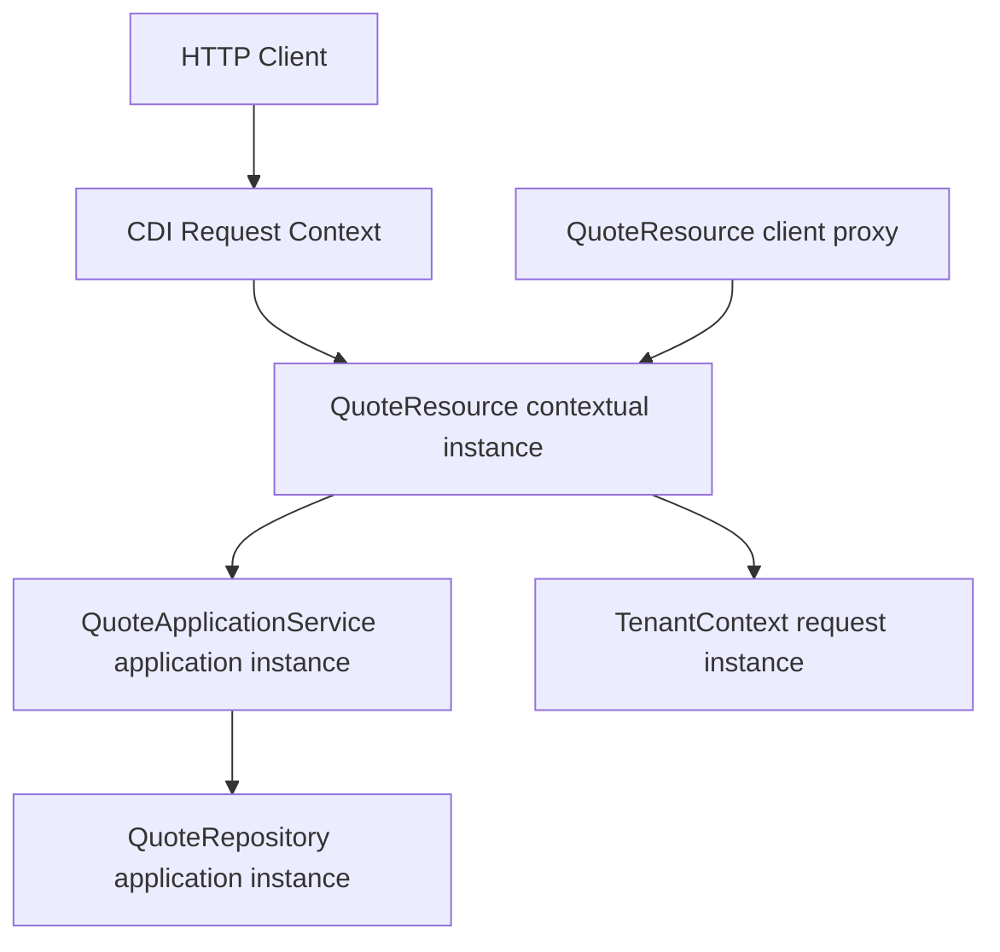
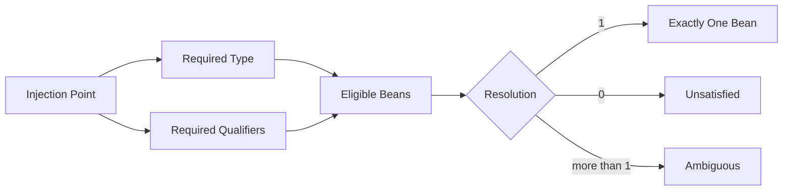
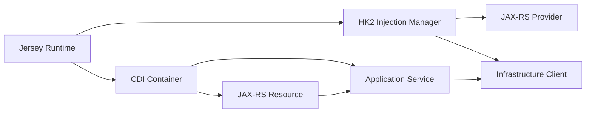
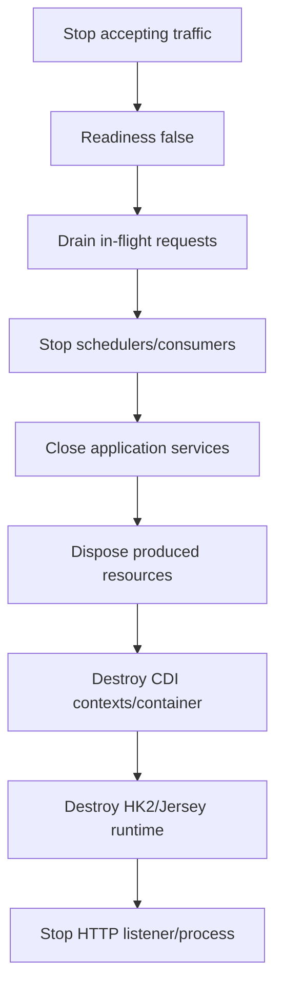

# Part 011 — CDI, Jakarta Inject, and Multi-Container Integration

> `@Inject` tidak membuktikan bahwa CDI yang membuat object. Annotation yang sama dapat dipahami oleh CDI, HK2, atau injector lain. Pertanyaan senior engineer bukan hanya “apakah dependency berhasil masuk?”, tetapi **container mana yang memiliki instance, context mana yang aktif, proxy/interceptor mana yang terpasang, dan siapa yang menghancurkan object tersebut**. Pada Jersey enterprise service, ambiguity ownership antara CDI dan HK2 dapat menghasilkan duplicate singleton, interceptor yang diam-diam tidak berjalan, request context yang bocor, serta shutdown yang tidak lengkap.

## Daftar Isi

1. [Target kompetensi](#target-kompetensi)
2. [Scope dan baseline](#scope-dan-baseline)
3. [Terminology map](#terminology-map)
4. [Jakarta Inject versus CDI](#jakarta-inject-versus-cdi)
5. [Mental model: bean graph plus active contexts](#mental-model-bean-graph-plus-active-contexts)
6. [Bean, bean type, qualifier, and scope](#bean-bean-type-qualifier-and-scope)
7. [Typesafe resolution lifecycle](#typesafe-resolution-lifecycle)
8. [Constructor, field, and initializer injection](#constructor-field-and-initializer-injection)
9. [Qualifiers](#qualifiers)
10. [`@Named` and string-based identity](#named-and-string-based-identity)
11. [Scopes and contexts](#scopes-and-contexts)
12. [`@Dependent`](#dependent)
13. [`@ApplicationScoped`](#applicationscoped)
14. [`@RequestScoped`](#requestscoped)
15. [Session and conversation scopes](#session-and-conversation-scopes)
16. [Normal scopes and client proxies](#normal-scopes-and-client-proxies)
17. [Scope mismatch and context-not-active failures](#scope-mismatch-and-context-not-active-failures)
18. [Producers](#producers)
19. [Disposers and external resource ownership](#disposers-and-external-resource-ownership)
20. [Programmatic lookup with `Instance<T>` and `Provider<T>`](#programmatic-lookup-with-instancet-and-providert)
21. [Alternatives and priorities](#alternatives-and-priorities)
22. [Stereotypes](#stereotypes)
23. [Interceptors](#interceptors)
24. [Decorators](#decorators)
25. [CDI events](#cdi-events)
26. [Lifecycle callbacks](#lifecycle-callbacks)
27. [Bean discovery and `beans.xml`](#bean-discovery-and-beansxml)
28. [CDI Lite and CDI Full](#cdi-lite-and-cdi-full)
29. [CDI in Java SE and managed runtimes](#cdi-in-java-se-and-managed-runtimes)
30. [CDI and Jakarta REST integration](#cdi-and-jakarta-rest-integration)
31. [Jersey resource ownership](#jersey-resource-ownership)
32. [Jersey CDI support outside a Jakarta EE server](#jersey-cdi-support-outside-a-jakarta-ee-server)
33. [HK2 and CDI in the same process](#hk2-and-cdi-in-the-same-process)
34. [Ownership matrix](#ownership-matrix)
35. [Duplicate singleton and split-brain object graph](#duplicate-singleton-and-split-brain-object-graph)
36. [Cross-container injection](#cross-container-injection)
37. [Interceptor-loss failure](#interceptor-loss-failure)
38. [Transaction and security boundary risks](#transaction-and-security-boundary-risks)
39. [Thread safety and contextual safety](#thread-safety-and-contextual-safety)
40. [Async execution and context propagation](#async-execution-and-context-propagation)
41. [Configuration and secret injection](#configuration-and-secret-injection)
42. [Startup validation and graph determinism](#startup-validation-and-graph-determinism)
43. [Shutdown ordering](#shutdown-ordering)
44. [Testing CDI composition](#testing-cdi-composition)
45. [Architecture patterns](#architecture-patterns)
46. [Anti-patterns](#anti-patterns)
47. [Failure-model matrix](#failure-model-matrix)
48. [Debugging playbook](#debugging-playbook)
49. [PR review checklist](#pr-review-checklist)
50. [Trade-off yang harus dipahami senior engineer](#trade-off-yang-harus-dipahami-senior-engineer)
51. [Internal verification checklist](#internal-verification-checklist)
52. [Latihan verifikasi](#latihan-verifikasi)
53. [Ringkasan](#ringkasan)
54. [Referensi resmi](#referensi-resmi)

---

## Target kompetensi

Setelah menyelesaikan part ini, Anda harus mampu:

- membedakan Jakarta Dependency Injection dari CDI;
- menjelaskan bahwa `jakarta.inject` hanya menyediakan vocabulary minimal, sedangkan CDI menyediakan bean model, contexts, resolution, producers, events, interceptors, decorators, dan lifecycle;
- menentukan container yang membangun sebuah JAX-RS resource;
- membaca injection point sebagai kombinasi required type dan qualifiers;
- mendiagnosis unsatisfied dan ambiguous dependency;
- memilih scope berdasarkan identity dan lifecycle invariant;
- menjelaskan normal scope, context, dan client proxy;
- mengenali request-context access setelah request berakhir;
- menulis producer dan disposer dengan ownership yang benar;
- menggunakan `Instance<T>` atau `Provider<T>` hanya untuk lookup yang benar-benar deferred/dynamic;
- memahami alternatives, priorities, stereotypes, interceptors, decorators, dan events;
- membedakan CDI Lite dan CDI Full pada level konseptual;
- mengevaluasi integrasi Jersey–CDI dalam Jakarta EE server maupun standalone/Servlet runtime;
- mendeteksi duplicate singleton ketika CDI dan HK2 sama-sama membuat implementation yang sama;
- memastikan transaction, authorization, metrics, dan audit interceptors benar-benar melewati managed proxy;
- merancang startup validation dan shutdown ordering lintas container;
- mereview codebase berdasarkan graph ownership, scope, portability, concurrency, context propagation, dan resource cleanup;
- membuktikan integration model CSG dari dependency tree dan bootstrap code, bukan menebak dari annotation.

---

## Scope dan baseline

Part ini menggunakan baseline konseptual berikut:

- Java 17+;
- Jakarta Dependency Injection 2.0 namespace `jakarta.inject.*`;
- Jakarta CDI 4.x concepts;
- Jakarta REST/JAX-RS resource integration;
- Jersey 3.x concepts;
- HK2 concepts dari Part 010.

Versi di internal codebase dapat berbeda. Jangan menyalin dependency contoh tanpa memeriksa:

```text
Jakarta EE platform/profile version
CDI implementation and version
Jersey version
jersey-hk2 module
Jersey CDI integration module
Servlet/GlassFish/Grizzly runtime version
jakarta.* versus legacy javax.* namespace
```

### Standard versus implementation map

| Area | Category |
|---|---|
| `jakarta.inject.Inject`, `Qualifier`, `Provider`, `Singleton` | Jakarta Dependency Injection standard |
| CDI bean resolution, contexts, producers, events | Jakarta CDI standard |
| JAX-RS resource model | Jakarta REST standard |
| Jersey CDI integration module and component provider | Jersey-specific |
| HK2 descriptors, locator, binder | HK2-specific |
| Weld, OpenWebBeans, GlassFish CDI implementation | implementation-specific |
| exact classloader, bootstrap, shutdown behavior | runtime-specific |

---

## Terminology map

| Term | Meaning |
|---|---|
| bean | object definition yang dikelola CDI dan memiliki bean types, qualifiers, scope, serta lifecycle |
| bean type | type yang dapat digunakan untuk typesafe resolution |
| injection point | lokasi dependency diminta |
| qualifier | annotation pembeda candidate dengan type sama |
| scope | aturan identity/lifetime bean |
| context | runtime storage dan activation untuk scoped instances |
| normal scope | scope yang umumnya diakses melalui client proxy |
| pseudo-scope | scope tanpa normal client-proxy semantics, misalnya `@Dependent` |
| producer | method/field yang menyediakan bean ketika construction biasa tidak cukup |
| disposer | method yang membersihkan instance hasil producer |
| alternative | implementation yang dapat diaktifkan sebagai substitusi |
| stereotype | reusable bundle annotation dan metadata CDI |
| interceptor | cross-cutting invocation wrapper berdasarkan interceptor binding |
| decorator | wrapper yang mengimplementasikan contract yang sama untuk memperkaya behavior |
| observer | method yang menerima CDI event |
| bean archive | deployment unit yang berpartisipasi dalam bean discovery |
| client proxy | stable reference yang mengarahkan call ke current contextual instance |

---

## Jakarta Inject versus CDI

Jakarta Dependency Injection menyediakan vocabulary minimal:

```java
import jakarta.inject.Inject;
import jakarta.inject.Named;
import jakarta.inject.Provider;
import jakarta.inject.Qualifier;
import jakarta.inject.Scope;
import jakarta.inject.Singleton;
```

Vocabulary tersebut tidak menentukan seluruh runtime container semantics.

Contoh:

```java
public final class QuoteService {
    private final PricingEngine pricingEngine;

    @Inject
    public QuoteService(PricingEngine pricingEngine) {
        this.pricingEngine = pricingEngine;
    }
}
```

Kode ini hanya menyatakan sebuah injection point. Ia belum menjawab:

```text
Who discovers QuoteService?
Who creates PricingEngine?
Which implementation is selected?
What is its scope?
Is a proxy injected?
Which interceptors apply?
Who destroys it?
```

CDI menjawab pertanyaan tersebut melalui bean model dan contexts.

### Practical invariant

```text
Annotation compatibility does not imply lifecycle compatibility.
```

HK2 dan CDI sama-sama dapat memahami `@Inject`, tetapi resolution rules, scopes, proxies, lifecycle, dan diagnostics dapat berbeda.

---

## Mental model: bean graph plus active contexts

DI graph saja belum cukup. CDI graph harus dibaca bersama active contexts.



Pada request A dan B:

```text
@ApplicationScoped QuoteApplicationService -> same contextual instance
@RequestScoped TenantContext            -> different instance per request
client proxy reference                   -> may remain stable
proxy target                             -> selected from currently active context
```

### Context activation is an invariant

Request-scoped bean hanya valid ketika request context aktif. Membawa proxy ke executor tidak otomatis membawa context ke thread lain.

```text
proxy available != context active
context active   != original request still valid
```

---

## Bean, bean type, qualifier, and scope

Contoh bean:

```java
import jakarta.enterprise.context.ApplicationScoped;

@ApplicationScoped
public class StandardPricingEngine implements PricingEngine {
    @Override
    public Money calculate(PricingInput input) {
        return Money.zero(input.currency());
    }
}
```

Candidate tersebut dapat dijelaskan sebagai:

```text
bean class: StandardPricingEngine
bean types: StandardPricingEngine, PricingEngine, Object, ...
qualifiers: @Default, @Any
scope: @ApplicationScoped
```

Injection point:

```java
@Inject
PricingEngine pricingEngine;
```

Required model:

```text
required type: PricingEngine
required qualifiers: @Default
```

CDI melakukan typesafe resolution berdasarkan type dan qualifier, bukan hanya class name.

---

## Typesafe resolution lifecycle

Mental model resolution:



### Unsatisfied dependency

```text
No eligible bean satisfies required type and qualifiers.
```

Penyebab umum:

- implementation tidak ditemukan oleh bean discovery;
- package/module tidak masuk deployment;
- namespace `javax.inject` versus `jakarta.inject` salah;
- qualifier injection point tidak sama dengan qualifier bean;
- alternative tidak aktif;
- class dibuat manual sehingga tidak menjadi bean;
- bridge antar-container tidak terpasang.

### Ambiguous dependency

```text
Multiple eligible beans satisfy the same injection point.
```

Jangan menyelesaikan ambiguity dengan dependency ordering classpath. Gunakan qualifier atau explicit alternative strategy.

---

## Constructor, field, and initializer injection

### Constructor injection sebagai default

```java
@ApplicationScoped
public class QuoteApplicationService {
    private final QuoteRepository repository;
    private final PricingEngine pricingEngine;

    @Inject
    public QuoteApplicationService(
            QuoteRepository repository,
            PricingEngine pricingEngine) {
        this.repository = repository;
        this.pricingEngine = pricingEngine;
    }
}
```

Kelebihan:

- dependencies terlihat pada API class;
- object dapat diuji tanpa container;
- fields dapat `final`;
- invalid partially initialized state berkurang;
- circular dependency lebih cepat terlihat.

### Field injection

```java
@Inject
QuoteRepository repository;
```

Risiko:

- hidden dependency;
- reflection dependency;
- sulit membuat object dalam unit test;
- object dapat terlihat valid sebelum injection selesai;
- mudah mendorong class dengan terlalu banyak dependencies.

### Initializer method injection

```java
@Inject
void initialize(QuoteRepository repository, Clock clock) {
    // Avoid heavy I/O here.
}
```

Urutan injection antarmember dalam class yang sama tidak boleh dijadikan invariant aplikasi. Gunakan constructor untuk mandatory dependencies dan lifecycle callback untuk initialization yang memang dikelola container.

---

## Qualifiers

Qualifier adalah type-safe discriminator.

```java
import jakarta.inject.Qualifier;
import java.lang.annotation.Retention;
import java.lang.annotation.Target;

import static java.lang.annotation.ElementType.*;
import static java.lang.annotation.RetentionPolicy.RUNTIME;

@Qualifier
@Retention(RUNTIME)
@Target({TYPE, FIELD, PARAMETER, METHOD})
public @interface ContractPricing {
}
```

Implementations:

```java
@ContractPricing
@ApplicationScoped
public class ContractPricingEngine implements PricingEngine {
}

@ApplicationScoped
public class StandardPricingEngine implements PricingEngine {
}
```

Injection:

```java
@Inject
public QuoteService(@ContractPricing PricingEngine engine) {
    this.engine = engine;
}
```

### Qualifier design rule

Qualifier sebaiknya menyatakan semantics/capability:

```text
@ContractPricing
@PromotionalPricing
@PrimaryDatabase
@ReadReplica
```

Bukan deployment accident:

```text
@Impl1
@NewVersion
@TemporaryBean
```

---

## `@Named` and string-based identity

`@Named` adalah string-based qualifier. Ia berguna untuk integration dengan expression language atau mekanisme yang membutuhkan nama, tetapi lebih rapuh daripada custom qualifier.

```java
@Inject
@Named("contractPricing")
PricingEngine engine;
```

Risiko:

- typo hanya diketahui saat deployment;
- refactor tool tidak selalu memahami string;
- semantic intent lebih lemah;
- mudah menjadi registry berbasis magic string.

Gunakan custom qualifier untuk application composition. Gunakan `@Named` ketika named integration memang dibutuhkan.

---

## Scopes and contexts

Scope menjawab:

```text
How long does contextual identity live?
Which context stores the current instance?
When is it created and destroyed?
```

Scope tidak menjawab:

```text
Is the object thread-safe?
Is tenant data isolated?
Is the object immutable?
Is external resource cleanup correct?
```

### Scope table

| Scope | Typical identity | Common use |
|---|---|---|
| `@Dependent` | follows injection/creation owner | lightweight helper, producer product with explicit lifecycle |
| `@ApplicationScoped` | one contextual instance per application | stateless service, repository wrapper, shared client owner |
| `@RequestScoped` | one contextual instance per request | tenant/principal/request metadata |
| `@SessionScoped` | one contextual instance per HTTP session | stateful web UI; rarely appropriate for stateless APIs |
| `@ConversationScoped` | explicit conversation | stateful conversational web flows |

---

## `@Dependent`

`@Dependent` behaves roughly like “dependent object owned by the injection target/lookup”. It does not represent “new object every method call” universally.

```java
@Dependent
public class QuoteValidator {
}
```

Appropriate when:

- object lightweight;
- lifecycle naturally follows owner;
- no shared mutable state;
- proxy semantics tidak dibutuhkan.

Risk:

```text
large dependent graph injected into long-lived bean
-> graph lives as long as long-lived owner
```

Programmatic lookup of dependent objects also requires attention to destruction semantics.

---

## `@ApplicationScoped`

```java
@ApplicationScoped
public class CatalogClient {
}
```

CDI application scope generally provides one contextual instance per application context, usually accessed through a client proxy.

### Thread-safety invariant

```text
@ApplicationScoped means shared identity,
not serialized method execution.
```

Unsafe example:

```java
@ApplicationScoped
public class QuoteAccumulator {
    private final List<QuoteLine> currentLines = new ArrayList<>();
}
```

Concurrent requests mutate the same collection.

Safer model:

```java
@ApplicationScoped
public class QuoteCalculator {
    public QuoteTotals calculate(List<QuoteLine> lines) {
        return pureCalculation(lines);
    }
}
```

External clients/pools may be application scoped, but their own thread-safety and close contract must be verified.

---

## `@RequestScoped`

Appropriate untuk:

- authenticated principal projection;
- tenant context;
- correlation metadata;
- request deadline;
- request-local memoization;
- audit context.

```java
@RequestScoped
public class RequestMetadata {
    private String correlationId;
    private String tenantId;
}
```

Risk utama:

```text
request object retained by singleton, static field, async callback, or queue
```

Setelah response selesai, request context dapat tidak aktif atau data request lama tetap tertahan.

### Prefer explicit immutable snapshot across async boundary

```java
public record ExecutionContext(
        String tenantId,
        String principalId,
        String correlationId) {
}
```

Capture hanya data yang memang boleh diteruskan, bukan seluruh request-scoped bean/proxy.

---

## Session and conversation scopes

Untuk stateless enterprise APIs, session/conversation scopes sering tidak dibutuhkan. Penggunaan scope tersebut dapat memperkenalkan:

- affinity/sticky-session assumption;
- replicated state complexity;
- memory retention;
- serialization/passivation constraints;
- hidden cross-request state;
- difficult horizontal scaling.

Jangan menggunakan HTTP session hanya untuk menyimpan token, tenant, shopping cart, quote draft, atau workflow state tanpa architecture decision yang eksplisit.

Pada CPQ/order system, durable quote/order state seharusnya memiliki persistence dan concurrency semantics yang eksplisit, bukan tersimpan sebagai opaque server session.

---

## Normal scopes and client proxies

Normal-scoped bean umumnya diinjeksi sebagai client proxy.

```text
consumer holds stable proxy
proxy asks active context for current contextual instance
method call goes to contextual instance
```

Manfaat:

- broad-scoped consumer dapat merujuk narrow-scoped bean tanpa menyimpan concrete request instance;
- contextual identity dipilih saat invocation;
- lazy contextual creation.

Konsekuensi:

- object identity/class introspection dapat mengejutkan;
- final/unproxyable design dapat bermasalah tergantung rules dan implementation;
- calling proxy ketika context tidak aktif gagal;
- serialization/reflection framework dapat melihat proxy class;
- self-invocation tidak selalu melewati proxy/interceptor.

### Do not depend on proxy class

```java
if (dependency.getClass() == RealImplementation.class) { ... } // fragile
```

Gunakan contract behavior, bukan concrete runtime class identity.

---

## Scope mismatch and context-not-active failures

Contoh:

```java
@ApplicationScoped
public class AsyncPublisher {
    @Inject
    RequestMetadata requestMetadata;

    public void publishLater() {
        executor.execute(() -> requestMetadata.correlationId());
    }
}
```

Kemungkinan failure:

- request context tidak aktif saat task berjalan;
- context mengarah ke request berbeda jika propagation salah;
- proxy invocation melempar context-not-active exception;
- data request tertahan lebih lama daripada seharusnya.

Perbaikan:

```java
public void publishLater(ExecutionContext snapshot) {
    executor.execute(() -> publish(snapshot));
}
```

Konteks framework propagation dapat digunakan jika tersedia dan distandardisasi, tetapi propagation harus memiliki lifecycle, cancellation, security, dan cleanup semantics yang diketahui.

---

## Producers

Producer digunakan ketika bean construction membutuhkan logic atau object berasal dari API eksternal.

```java
@ApplicationScoped
public class ClockProducer {
    @Produces
    @ApplicationScoped
    public Clock clock() {
        return Clock.systemUTC();
    }
}
```

Typed configuration example:

```java
@ApplicationScoped
public class ClientProducer {
    @Produces
    @ApplicationScoped
    CatalogGateway catalogGateway(CatalogClientConfig config) {
        return new HttpCatalogGateway(config.baseUri(), config.timeout());
    }
}
```

Producer bukan tempat untuk menyembunyikan arbitrary service locator logic. Ia tetap harus memiliki:

- deterministic inputs;
- clear scope;
- failure policy;
- telemetry;
- disposal semantics;
- no secret leakage.

### Producer method parameter injection

Dependency producer sendiri dapat di-resolve oleh CDI:

```java
@Produces
CatalogGateway create(
        HttpClient client,
        CatalogClientConfig config,
        MeterRegistry metrics) {
    return new HttpCatalogGateway(client, config, metrics);
}
```

---

## Disposers and external resource ownership

Jika producer membuat closeable resource, disposer harus menyatakan cleanup ownership.

```java
@Produces
@ApplicationScoped
ManagedClient managedClient(ClientConfig config) {
    return ManagedClient.open(config);
}

void closeManagedClient(@Disposes ManagedClient client) {
    client.close();
}
```

Pertanyaan wajib:

```text
Is the produced object owned or borrowed?
Can producer construction partially fail?
Is close idempotent?
What is shutdown timeout?
Can in-flight requests still use it?
What closes first: consumers or client?
```

Jangan menutup container-managed or shared resource yang tidak dimiliki producer.

---

## Programmatic lookup with `Instance<T>` and `Provider<T>`

`Provider<T>` berasal dari Jakarta Dependency Injection. CDI `Instance<T>` menyediakan kemampuan programmatic resolution yang lebih kaya.

```java
@Inject
Instance<PricingEngine> engines;
```

Use cases yang valid:

- optional plugin capability;
- dynamically selected qualifier;
- iterating all implementations;
- deferred lookup untuk narrow scope;
- explicit dependent-instance lifecycle management.

Anti-pattern:

```java
instance.select(new NamedLiteral(runtimeString)).get();
```

Jika ini menjadi routing engine utama, application composition berubah menjadi hidden service locator.

### Selection should remain constrained

```text
external input -> validated business strategy key
strategy key   -> explicit mapping
mapping        -> qualified bean selection
```

Jangan membiarkan untrusted tenant/user string memilih arbitrary bean.

---

## Alternatives and priorities

Alternative menyediakan implementation pengganti yang dapat diaktifkan.

```java
@Alternative
@Priority(100)
@ApplicationScoped
public class NewPricingEngine implements PricingEngine {
}
```

Risiko:

- global activation mengubah behavior seluruh deployment;
- test alternative bocor ke production;
- priority conflict antar-library;
- implicit activation sulit diaudit;
- environment graph berbeda tanpa manifest.

Gunakan alternatives untuk composition substitution yang terkontrol, bukan untuk runtime feature flags atau tenant-specific selection.

---

## Stereotypes

Stereotype membundel annotation semantics.

```java
@Stereotype
@ApplicationScoped
@Retention(RUNTIME)
@Target(TYPE)
public @interface ApplicationService {
}
```

Manfaat:

- architecture vocabulary;
- consistent scope;
- reusable metadata.

Risiko:

- terlalu banyak hidden annotations;
- scope atau interceptor binding tidak terlihat saat review;
- stereotype inheritance yang tidak dipahami;
- annotation menjadi “magic framework bundle”.

Stereotype harus didokumentasikan sebagai contract, bukan cosmetic annotation.

---

## Interceptors

Interceptor cocok untuk cross-cutting invocation behavior:

- transaction boundary;
- authorization policy;
- metrics/timing;
- audit event;
- retry—dengan kehati-hatian tinggi;
- tracing enrichment.

Interceptor binding:

```java
@InterceptorBinding
@Retention(RUNTIME)
@Target({TYPE, METHOD})
public @interface Audited {
}
```

Interceptor:

```java
@Audited
@Interceptor
@Priority(Interceptor.Priority.APPLICATION)
public class AuditInterceptor {
    @AroundInvoke
    Object around(InvocationContext context) throws Exception {
        long started = System.nanoTime();
        try {
            Object result = context.proceed();
            recordSuccess(context, started);
            return result;
        } catch (Exception e) {
            recordFailure(context, e, started);
            throw e;
        }
    }
}
```

### Interceptor caveats

- hanya berjalan pada managed invocation path;
- self-invocation dapat melewati proxy/interceptor semantics;
- ordering harus diketahui;
- retry interceptor dapat mengulang side effects;
- async return type dapat selesai setelah interceptor scope berakhir;
- logging parameters dapat membocorkan PII/secret;
- transaction interceptor tidak otomatis benar untuk external calls.

---

## Decorators

Decorator memperkaya contract business/application secara type-safe.

```java
@Decorator
public abstract class MeteredPricingEngine implements PricingEngine {
    @Inject
    @Delegate
    PricingEngine delegate;

    @Override
    public Money calculate(PricingInput input) {
        return measure(() -> delegate.calculate(input));
    }
}
```

Decorator berbeda dari interceptor:

| Interceptor | Decorator |
|---|---|
| cross-cutting invocation metadata | contract-specific behavior |
| tidak harus memahami business interface | mengimplementasikan/dekorasi business interface |
| binding-based | delegate-based |
| cocok untuk transaction/security/telemetry | cocok untuk capability enrichment |

Jangan membuat decorator chain yang menyembunyikan business ordering kritis tanpa tests dan effective composition visibility.

---

## CDI events

CDI events adalah in-process decoupling mechanism, bukan durable messaging.

```java
@Inject
Event<QuoteCalculated> events;

public void calculate(...) {
    events.fire(new QuoteCalculated(...));
}
```

Gunakan untuk:

- lifecycle integration dalam process;
- modular notification;
- synchronous decoupling ketika failure semantics jelas.

Jangan menganggap CDI event sebagai pengganti Kafka/RabbitMQ untuk:

- durability;
- replay;
- cross-process delivery;
- delivery guarantees;
- independent scaling.

### Observer failure semantics

Tentukan:

- synchronous atau asynchronous observer;
- apakah observer failure membatalkan caller;
- ordering;
- transaction phase;
- idempotency;
- observability.

---

## Lifecycle callbacks

`@PostConstruct` dan `@PreDestroy` berasal dari Jakarta Annotations dan dapat digunakan pada managed beans.

```java
@ApplicationScoped
public class CatalogCache {
    @PostConstruct
    void initialize() {
        // Validate local state; avoid unbounded blocking.
    }

    @PreDestroy
    void shutdown() {
        // Idempotent cleanup.
    }
}
```

### Startup rule

`@PostConstruct` bukan tempat ideal untuk:

- long unbounded migration;
- retry forever;
- large catalog preloading tanpa readiness model;
- network dependency dengan no timeout;
- thread creation yang tidak dimiliki container.

Fail fast pada mandatory invariant. Untuk optional dependency, expose degraded readiness secara eksplisit.

---

## Bean discovery and `beans.xml`

Bean discovery menentukan class mana yang menjadi CDI bean candidate. Behavior bergantung pada:

- CDI version;
- archive structure;
- bean-defining annotations;
- `beans.xml` presence/version/discovery mode;
- runtime integration;
- build-time indexing/optimization.

### Production hazard

Class dapat compile dan memiliki `@Inject`, tetapi tidak menjadi CDI bean karena tidak ditemukan sebagai bean archive atau tidak memiliki bean-defining annotation sesuai discovery mode.

### Verification method

Jangan menebak. Periksa:

```text
META-INF/beans.xml
WEB-INF/beans.xml
bean-discovery-mode
CDI implementation logs
archive/module boundaries
JAR shading/assembly
runtime-specific indexing
```

Tambahkan deployment test untuk mandatory beans.

---

## CDI Lite and CDI Full

CDI 4.x membedakan CDI Lite dan CDI Full.

Mental model:

```text
CDI Lite -> portable core suitable for lean/build-time-oriented runtimes
CDI Full -> adds capabilities expected by full Jakarta EE environments
```

Jangan mengasumsikan feature Full tersedia hanya karena `@Inject` berhasil.

Internal verification harus mencakup:

- profile/runtime compliance;
- extension model yang didukung;
- interceptor/decorator/event capabilities;
- Java SE bootstrapping support;
- build-time restrictions.

---

## CDI in Java SE and managed runtimes

CDI dapat dibootstrap dalam Java SE menggunakan implementation yang mendukungnya. Dalam Jakarta EE server, container menyediakan integration dengan platform services.

Perbedaan ownership:

| Java SE bootstrap | Jakarta EE managed runtime |
|---|---|
| application starts CDI container | server starts CDI subsystem |
| application closes container | server owns shutdown |
| integrations added explicitly | platform integrations may be provided |
| classpath application-controlled | server classloading rules apply |
| thread/resource rules application-owned | managed execution/resource rules apply |

Jangan melakukan double bootstrap CDI di dalam server yang sudah menyediakan CDI.

---

## CDI and Jakarta REST integration

Pada runtime yang mendukung CDI integration, JAX-RS resources/providers dapat menjadi CDI beans. Namun exact lifecycle harus dibuktikan.

```java
@Path("/quotes")
@RequestScoped
public class QuoteResource {
    private final QuoteApplicationService service;

    @Inject
    public QuoteResource(QuoteApplicationService service) {
        this.service = service;
    }
}
```

Pertanyaan review:

- resource discovered oleh siapa?
- CDI bean atau Jersey/HK2 component?
- scope explicit atau default?
- Bean Validation/interceptors berjalan pada instance yang sama?
- provider/application subclass memiliki scope yang valid?
- apakah resource terdaftar sebagai instance di `ResourceConfig`, sehingga CDI lifecycle dilewati?

---

## Jersey resource ownership

Jersey memiliki component-management mechanism. Tanpa custom provider/integration, Jersey dapat mengelola resource/provider melalui injection manager default.

Ketika CDI tersedia, desired model harus eksplisit:

```text
Option A: CDI owns application resources and services
Option B: HK2 owns Jersey resources and selected runtime components
Option C: controlled bridge with documented ownership per type
```

Model paling berbahaya:

```text
Whichever container discovers the class first owns it.
```

### Resource registration caveat

```java
resourceConfig.register(new QuoteResource(...));
```

Instance registration dapat bypass CDI construction, scope, interceptors, decorators, lifecycle callbacks, dan disposer semantics.

---

## Jersey CDI support outside a Jakarta EE server

Jersey menyediakan container-agnostic CDI support untuk runtime seperti Servlet container atau Grizzly, tetapi dependency/module dan bootstrap behavior bersifat Jersey-specific dan version-sensitive.

Checklist:

- CDI implementation bundled?
- Jersey CDI integration module bundled?
- Servlet listener/initializer required?
- bean archive present?
- HK2 module still active?
- request context activation integrated?
- injection of Jersey/HK2-specific objects into CDI beans supported?
- shutdown closes both runtime and CDI container?

Jangan mengasumsikan contoh GlassFish berlaku identik pada Tomcat/Jetty/Grizzly standalone.

---

## HK2 and CDI in the same process

Possible graph:



Masalah utama bukan jumlah container, tetapi **crossing ownership boundary**.

Untuk setiap type, dokumentasikan:

```text
owner container
scope
creation path
proxy/interceptor path
cross-container bridge
destruction path
```

---

## Ownership matrix

Contoh target matrix:

| Type | Owner | Scope | Cross-container exposure | Destroyed by |
|---|---|---|---|---|
| `QuoteResource` | CDI | request | Jersey dispatches only | CDI request context |
| `QuoteService` | CDI | application | none | CDI |
| `CorrelationFilter` | Jersey/HK2 | singleton | calls explicit context adapter | Jersey/HK2 |
| `TenantContext` | CDI | request | accessed through adapter | CDI |
| `JerseyRuntimeConfig` | HK2 | singleton | not exposed to domain | Jersey/HK2 |
| `HttpClient` | one explicit owner | application | injected via stable contract | owner container |

Tidak ada universal matrix yang benar. Yang penting: hanya satu owner untuk setiap managed instance.

---

## Duplicate singleton and split-brain object graph

Contoh failure:

```text
CDI creates CatalogClient instance A
HK2 creates CatalogClient instance B
```

Akibat:

- dua connection pool;
- dua cache;
- dua Kafka producer;
- duplicate scheduler;
- inconsistent metrics;
- one instance initialized, another used;
- one instance closed, another leaks;
- different configuration snapshot.

### Detection

Instrument construction:

```java
@PostConstruct
void logIdentity() {
    log.info("CatalogClient initialized identity={}",
            System.identityHashCode(this));
}
```

Gunakan hanya sementara/debug; production manifest yang lebih baik adalah owner/component inventory tanpa sensitive data.

---

## Cross-container injection

Cross-container injection dapat dilakukan melalui bridge/adapters. Perlakukan sebagai integration boundary, bukan transparent magic.

Safer pattern:

```text
CDI-owned application graph
        |
        v
small runtime adapter owned by Jersey/HK2
```

Atau:

```text
HK2 runtime component
        |
        v
explicit CDI facade/provider
```

Avoid arbitrary bidirectional injection:

```text
CDI -> HK2 -> CDI -> HK2
```

Itu menciptakan circular ownership dan shutdown ambiguity.

---

## Interceptor-loss failure

Class terlihat memiliki annotation:

```java
@Audited
@Transactional
public class OrderService { ... }
```

Tetapi object dibuat manual/HK2 tanpa CDI integration:

```java
new OrderService(...)
```

Business method tetap berjalan, namun audit/transaction interceptor tidak berjalan.

Ini lebih berbahaya daripada startup failure karena behavior tampak normal sampai data inconsistency terjadi.

### Review rule

```text
For every interceptor-dependent class,
prove the invocation passes through the managing container proxy.
```

Tambahkan integration test yang membuktikan side effect interceptor, bukan hanya unit test method body.

---

## Transaction and security boundary risks

Cross-container object graph dapat memutus:

- CDI transaction interceptors;
- security identity propagation;
- request context;
- audit context;
- metrics/tracing bindings;
- exception translation.

Contoh:

```text
Jersey/HK2 resource -> manually obtained CDI bean instance -> direct self call
```

Pertanyaan:

- apakah instance contextual reference atau raw underlying instance?
- apakah call melewati proxy?
- apakah transaction context aktif?
- apakah principal tersedia?
- apakah async continuation mempertahankan context yang diizinkan?

---

## Thread safety and contextual safety

Dua dimensi berbeda:

```text
thread safety     -> concurrent access to object state
contextual safety -> access maps to correct request/tenant/security context
```

Object dapat thread-safe tetapi contextually unsafe, misalnya global cache key tanpa tenant.

Object dapat contextually isolated tetapi thread-unsafe, misalnya request bean digunakan paralel oleh multiple async tasks tanpa synchronization.

### Review matrix

| Question | Example evidence |
|---|---|
| shared across threads? | application scope, singleton, static reference |
| mutable? | fields/collections/state machine |
| context-bound? | request, tenant, principal, transaction |
| propagated? | executor wrapper/framework context |
| valid after request? | explicit snapshot or durable payload |

---

## Async execution and context propagation

CDI context tidak boleh diasumsikan berpindah otomatis ke arbitrary executor.

Unsafe:

```java
executor.submit(() -> requestContext.currentTenant());
```

Safer:

```java
ExecutionContext snapshot = requestContext.snapshot();
executor.submit(() -> task.run(snapshot));
```

Platform-managed context propagation dapat digunakan apabila internal standard menyediakannya. Verifikasi:

- context types yang dipropagasikan;
- cleared contexts;
- cancellation behavior;
- thread reuse cleanup;
- security restrictions;
- trace/MDC integration;
- task timeout.

Detail context propagation akan diperdalam pada Part 023.

---

## Configuration and secret injection

Prefer typed immutable config:

```java
public record CatalogClientConfig(
        URI baseUri,
        Duration connectTimeout,
        Duration requestTimeout) {
}
```

Avoid primitive/string scattering:

```java
@Inject @Named("timeout") String timeout;
```

Producer/config adapter harus:

- validate required values at startup;
- preserve source/version metadata;
- redact secrets;
- define reload semantics;
- avoid mutable global maps;
- fail closed for security-sensitive defaults.

Secret value sebaiknya tidak menjadi string yang tersebar di graph. Gunakan narrow capability atau credential provider dengan rotation semantics.

---

## Startup validation and graph determinism

Mandatory graph sebaiknya tervalidasi sebelum readiness.

Startup checks:

```text
all mandatory injection points resolve
no ambiguous strategy bindings
all required contexts/integrations installed
no duplicate critical infrastructure owners
configuration validated
mandatory producer resources construct with bounded timeout
interceptors active for critical boundaries
component inventory matches expected profile
```

Hindari lazy first-request discovery untuk mandatory failure. First customer request bukan bootstrap test.

---

## Shutdown ordering

Desired shutdown sequence:



Actual order depends on runtime ownership. Critical invariant:

```text
A consumer must stop before the resource it consumes is destroyed.
```

Bidirectional CDI–HK2 dependencies make ordering harder. Avoid them or define an explicit coordinator.

---

## Testing CDI composition

### Unit tests

Construct application services manually:

```java
var service = new QuoteService(fakeRepository, fakePricingEngine);
```

### Container tests

Prove:

- bean discovery;
- qualifier resolution;
- alternative activation;
- scope identity;
- producer/disposer;
- interceptor execution;
- request context behavior;
- cross-container bridge;
- shutdown callbacks.

### Graph tests

Create inventory:

```text
bean type | implementation | qualifiers | scope | archive | owner
```

### Negative tests

- remove a mandatory bean;
- introduce duplicate implementation;
- invoke request proxy without active context;
- bypass CDI with manual `new`;
- start two owners for one client;
- fail producer construction;
- verify partial resources are cleaned.

---

## Architecture patterns

### Pattern 1 — CDI-owned application graph

```text
Jersey dispatch
  -> CDI-owned resource
      -> CDI application services
          -> CDI-owned infrastructure facades
```

Jersey/HK2 confined to runtime-specific components.

### Pattern 2 — Hexagonal boundary

Core constructors remain framework-neutral:

```java
public final class QuoteService {
    public QuoteService(QuoteRepository repository, PricingEngine engine) { ... }
}
```

CDI adapter/composition module owns annotations and producers.

### Pattern 3 — Explicit bridge adapter

```text
HK2 filter -> RequestContextBridge interface -> CDI context
```

Bridge small, one-directional, tested, documented.

### Pattern 4 — One owner per infrastructure resource

One container creates and closes each pool/client/consumer/scheduler. Other container receives facade or borrowed reference without ownership.

### Pattern 5 — Explicit async snapshots

Request-scoped information becomes immutable transport data at async boundary.

---

## Anti-patterns

### Annotation soup

```java
@Path("/orders")
@RequestScoped
@Named
@Audited
@Transactional
@Alternative
@Priority(10)
public class OrderResource { ... }
```

Tanpa documented semantics, reviewer tidak tahu owner, order, dan activation.

### Dual registration

Class discovered by CDI dan explicitly registered by Jersey/HK2.

### Raw instance extraction

Mengambil underlying contextual instance untuk melewati proxy.

### Global `CDI.current()`

Programmatic lookup tersebar di domain/application code.

### Request scope as implicit parameter bag

Business service membaca tenant/user/timezone secara ambient daripada explicit input yang relevan.

### Alternative as feature flag

Alternatives dipakai untuk per-tenant/per-request runtime selection.

### Producer as hidden bootstrap script

Producer melakukan migration, retry forever, thread creation, dan remote discovery.

### Scope annotation as thread-safety claim

Menganggap `@ApplicationScoped` otomatis aman.

---

## Failure-model matrix

| Failure | Trigger | Symptom | Detection | Prevention |
|---|---|---|---|---|
| unsatisfied dependency | bean tidak ditemukan/qualifier mismatch | deployment/startup failure | deepest resolution cause | graph test, explicit bean-defining annotation |
| ambiguous dependency | multiple eligible beans | deployment failure | candidate list | qualifiers, controlled alternatives |
| duplicate singleton | CDI dan HK2 membuat same type | duplicate pool/cache/scheduler | construction metrics/thread dump | ownership matrix, one owner |
| inactive request context | async/background invocation | context exception | stack trace, task timing | immutable snapshot/managed propagation |
| stale tenant context | request data retained | cross-tenant behavior | correlation/tenant mismatch | no request object escape |
| interceptor bypass | manual construction/wrong owner | missing transaction/audit | integration test, missing telemetry | prove proxy path |
| producer leak | creation fails or disposer missing | sockets/threads remain | resource metrics/thread dump | bounded creation, disposer, failure cleanup |
| alternative drift | environment activation differs | inconsistent behavior | effective bean manifest | versioned profile config |
| bean discovery drift | archive packaging changes | bean missing only in packaged app | deployment logs | packaged-artifact tests |
| proxy incompatibility | unsuitable class/design | deployment/runtime proxy failure | bootstrap logs | interface contracts, proxy-safe design |
| circular cross-container graph | bidirectional bridges | startup recursion/deadlock | graph analysis | one-directional ownership |
| shutdown inversion | producer closed before consumer | errors during drain | shutdown timeline | explicit close ordering |
| hidden mutable singleton | concurrent requests | data corruption | race/load tests | immutable/stateless design |
| string qualifier typo | `@Named` mismatch | unsatisfied dependency | deployment error | custom qualifier |
| event observer failure | synchronous observer throws | caller transaction fails | event traces/logs | explicit event failure contract |

---

## Debugging playbook

### 1. Identify exact runtime and versions

Collect:

```text
JDK version
Jakarta EE/CDI profile
CDI implementation/version
Jersey version
HK2 version
container/runtime
packaging type
```

### 2. Identify object owner

For failing class:

```text
Who discovered it?
Who constructed it?
Is it registered as class or instance?
Is it a CDI bean?
Does HK2 also have a descriptor?
```

### 3. Reconstruct injection point

```text
required type
required qualifiers
candidate beans
alternative/priority status
bean archive
scope
```

### 4. Preserve deepest cause

Container exceptions often wrap multiple causes. Search for:

```text
UnsatisfiedResolutionException
AmbiguousResolutionException
ContextNotActiveException
DeploymentException
MultiException
NoSuchMethodError
ClassNotFoundException
LinkageError
```

### 5. Check proxy/interceptor path

Log/test:

- runtime class;
- whether call entered interceptor;
- transaction active status;
- trace span/audit event presence;
- self-invocation path.

Do not make permanent business logic depend on proxy class name.

### 6. Check duplicate instances

Inspect:

- initialization logs;
- pool/consumer/scheduler counts;
- thread names;
- JMX/metrics;
- CDI and HK2 inventories.

### 7. Check active context

Correlate task timestamp with request completion. Validate request/tenant/security context availability on executor thread.

### 8. Reproduce packaged deployment

IDE classpath can hide bean archive and classloader differences. Test final WAR/JAR/container image.

### 9. Verify shutdown

After undeploy/stop, inspect:

```text
non-daemon threads
open sockets
registered drivers
timers
Kafka consumers/producers
HTTP pools
classloader references
```

---

## PR review checklist

### Injection design

- [ ] Constructor injection digunakan untuk mandatory dependencies.
- [ ] No field injection tanpa alasan framework yang kuat.
- [ ] Dependencies tidak diambil melalui global lookup.
- [ ] Qualifier menyatakan semantics, bukan magic string.
- [ ] Ambiguity diselesaikan secara eksplisit.
- [ ] Class tetap dapat diuji tanpa container bila berada di application/domain layer.

### Scope and context

- [ ] Scope setiap bean sesuai lifetime invariant.
- [ ] Application-scoped bean terbukti thread-safe.
- [ ] Request-scoped object tidak escape.
- [ ] Session/conversation scope memiliki architecture justification.
- [ ] Narrow scope ke broad scope menggunakan contextual proxy/provider/explicit parameter secara benar.
- [ ] Async boundary menggunakan snapshot atau approved propagation.

### Producers and resources

- [ ] Producer memiliki typed inputs.
- [ ] Scope hasil producer eksplisit.
- [ ] Construction memiliki timeout/failure cleanup.
- [ ] Disposer tersedia untuk owned closeable resource.
- [ ] Borrowed/container-managed resource tidak ditutup salah owner.
- [ ] No unbounded I/O dalam startup callback.

### CDI features

- [ ] Alternatives tidak dipakai sebagai runtime feature flag.
- [ ] Priority tidak conflict dengan library lain.
- [ ] Stereotype documented.
- [ ] Interceptor ordering dan failure semantics jelas.
- [ ] Self-invocation tidak mengandalkan interceptor.
- [ ] Decorator chain memiliki tests.
- [ ] CDI event tidak diasumsikan durable.

### Multi-container

- [ ] Owner CDI/HK2 untuk setiap critical type documented.
- [ ] Resource/provider tidak terdaftar ganda.
- [ ] No duplicate pool/client/cache/scheduler.
- [ ] Cross-container bridge one-directional dan minimal.
- [ ] Interceptor/transaction/security path terbukti.
- [ ] Shutdown order lintas container diuji.

### Packaging and operations

- [ ] `beans.xml`/discovery mode sesuai.
- [ ] Packaged artifact test tersedia.
- [ ] Effective bean/component inventory dapat diinspeksi.
- [ ] Logs tidak membocorkan secret/PII.
- [ ] Startup fails before readiness pada graph mandatory invalid.
- [ ] Undeploy/redeploy tidak meninggalkan thread/classloader leak.

---

## Trade-off yang harus dipahami senior engineer

### CDI richness versus transparency

CDI mengurangi wiring boilerplate dan menyediakan platform services, tetapi composition dapat tersebar melalui annotations, producers, extensions, alternatives, dan discovery.

### Contextual proxy versus explicit data flow

Proxy menyederhanakan request-scoped access, tetapi ambient context dapat menyembunyikan parameter penting. Tenant, effective date, currency, dan authorization subject sering lebih aman sebagai explicit input pada domain boundary.

### Multiple DI containers versus platform integration

Bridge dapat memungkinkan reuse, tetapi setiap bridge menambah resolution rules, duplicate ownership risk, dan shutdown complexity.

### Interceptors versus visible orchestration

Interceptor efektif untuk uniform cross-cutting policy. Business-critical sequencing dan compensating behavior sebaiknya tetap terlihat dalam application flow.

### Producers versus dedicated lifecycle components

Producer nyaman untuk construction. Complex infrastructure lifecycle mungkin lebih jelas melalui explicit manager dengan start/stop/readiness API.

### Global alternatives versus local strategy selection

Alternative cocok untuk deployment composition. Tenant-specific pricing/catalog/rule strategy membutuhkan explicit runtime selection dan governance.

---

## Internal verification checklist

### Platform and versions

- [ ] Jakarta EE/platform/profile version.
- [ ] CDI specification level.
- [ ] CDI implementation: Weld, OpenWebBeans, GlassFish-provided, atau lain.
- [ ] Jersey exact version.
- [ ] HK2 exact version.
- [ ] `jakarta.inject` versus `javax.inject` usage.
- [ ] Runtime: GlassFish, Grizzly, Tomcat, Jetty, atau internal wrapper.

### Bean discovery

- [ ] `beans.xml` locations dan versions.
- [ ] `bean-discovery-mode`.
- [ ] Bean-defining annotations convention.
- [ ] Multi-module archive boundaries.
- [ ] Shading/assembly effects.
- [ ] Build-time indexing.
- [ ] Startup discovery diagnostics.

### Ownership

- [ ] Apakah resources CDI-owned atau HK2-owned?
- [ ] Apakah providers CDI-owned atau Jersey/HK2-owned?
- [ ] Owner application services.
- [ ] Owner repositories.
- [ ] Owner HTTP clients, pools, Kafka clients, schedulers, caches.
- [ ] Existing instance registration dalam `ResourceConfig`.
- [ ] Manual construction of managed classes.

### CDI–HK2 integration

- [ ] Jersey CDI integration module.
- [ ] `jersey-hk2` module.
- [ ] Custom `ComponentProvider`/bridge/SPIs.
- [ ] Custom HK2 bindings exposed to CDI.
- [ ] CDI beans exposed to HK2.
- [ ] Bidirectional dependencies.
- [ ] Duplicate descriptors/beans.
- [ ] Integration tests for bridge.

### Scopes and contexts

- [ ] Default scope convention.
- [ ] Application/request/session scopes inventory.
- [ ] Tenant context implementation.
- [ ] Security principal context.
- [ ] Context propagation library.
- [ ] Async executor ownership.
- [ ] Request-context activation outside HTTP.
- [ ] Context cleanup on thread reuse.

### Producers, alternatives, and interceptors

- [ ] Producer method inventory.
- [ ] Disposer inventory.
- [ ] Alternatives and activation source.
- [ ] Priority conventions.
- [ ] Stereotypes.
- [ ] Transaction interceptors.
- [ ] Authorization interceptors.
- [ ] Audit/metrics/tracing interceptors.
- [ ] Self-invocation risks.
- [ ] Interceptor order tests.

### Configuration and secrets

- [ ] Configuration injection mechanism.
- [ ] Typed config model.
- [ ] Precedence and profile handling.
- [ ] Secret provider/rotation.
- [ ] Runtime reload behavior.
- [ ] Redaction policy.

### Lifecycle and operations

- [ ] Startup graph validation.
- [ ] Readiness dependency on initialization.
- [ ] Shutdown coordinator.
- [ ] CDI container close owner.
- [ ] Jersey/HK2 close owner.
- [ ] Drain timeout.
- [ ] Undeploy/redeploy leak tests.
- [ ] Component inventory metrics/logs.

### CSG evidence sources

- [ ] `pom.xml` and dependency trees.
- [ ] `ResourceConfig`/`Application` classes.
- [ ] `beans.xml`.
- [ ] server bootstrap.
- [ ] shared internal framework libraries.
- [ ] historical PRs involving injection/lifecycle bugs.
- [ ] startup and shutdown logs.
- [ ] deployment manifests/images.
- [ ] architecture docs and onboarding sessions.
- [ ] discussion with runtime/platform owner.

---

## Latihan verifikasi

### Latihan 1 — Typesafe resolution

Buat dua `PricingEngine` implementations. Tunjukkan ambiguous resolution, lalu selesaikan dengan custom qualifier.

### Latihan 2 — Scope identity

Buktikan:

```text
@ApplicationScoped same across requests
@RequestScoped same within request
@RequestScoped different across requests
@Dependent follows owner/lookup lifecycle
```

### Latihan 3 — Request context escape

Kirim request-scoped proxy ke executor dan reproduksi failure. Refactor menjadi immutable `ExecutionContext` snapshot.

### Latihan 4 — Producer/disposer

Produce closeable fake client, track construction/disposal, lalu uji normal shutdown dan construction failure.

### Latihan 5 — Interceptor bypass

Bandingkan object yang diperoleh dari CDI dengan object hasil `new`. Buktikan audit interceptor hanya berjalan pada managed invocation.

### Latihan 6 — Self-invocation

Buat method intercepted yang dipanggil dari method lain pada object yang sama. Dokumentasikan actual behavior dan refactor ke separate bean jika boundary harus dipertahankan.

### Latihan 7 — Bean discovery

Ubah bean-defining annotation atau `beans.xml`, package WAR/JAR final, dan amati resolution failure.

### Latihan 8 — Duplicate ownership

Daftarkan class yang sama pada CDI dan HK2. Buktikan dua instance menggunakan counters/metrics, lalu tetapkan satu owner.

### Latihan 9 — Alternative drift

Aktifkan alternative hanya pada test profile. Buat effective-bean manifest agar production drift dapat dideteksi.

### Latihan 10 — Shutdown ordering

Buat CDI-owned consumer menggunakan HK2-owned client. Uji shutdown salah urutan, lalu implementasikan explicit coordinator.

### Latihan 11 — Codebase audit

Cari:

```text
@Inject
@Produces
@Disposes
@Alternative
@Priority
@Interceptor
@Decorator
CDI.current
Instance<
ResourceConfig.register(new
AbstractBinder
ServiceLocator
```

Klasifikasikan owner dan risk.

### Latihan 12 — Architecture inventory

Buat tabel:

```text
type | owner container | scope | qualifiers | interceptor chain | destruction owner
```

Bandingkan local, test, dan production profile.

---

## Ringkasan

Mental model Part 011:

```text
Jakarta Inject defines a small injection vocabulary.
CDI defines beans, typesafe resolution, scopes, contexts,
proxies, producers, events, interceptors, decorators, and lifecycle.
Jersey/HK2 may coexist with CDI, but every instance still needs one owner.
```

Invariant terpenting:

1. **`@Inject` tidak mengidentifikasi container owner.**
2. **CDI resolution menggunakan required type dan qualifiers.**
3. **Unsatisfied dan ambiguous dependency sebaiknya gagal sebelum readiness.**
4. **Constructor injection adalah default untuk mandatory dependencies.**
5. **Qualifier type-safe lebih baik daripada magic string `@Named`.**
6. **Scope mengatur contextual identity, bukan thread safety.**
7. **Normal-scoped references dapat berupa client proxy.**
8. **Proxy tidak membuat context aktif pada arbitrary executor.**
9. **Request-scoped object tidak boleh escape sebagai ambient mutable state.**
10. **Producer yang memiliki resource harus memiliki disposer dan failure cleanup.**
11. **`Instance<T>`/`Provider<T>` adalah deferred lookup, bukan global service locator.**
12. **Alternatives bukan runtime feature-flag system.**
13. **Interceptors hanya bekerja pada managed invocation path.**
14. **CDI events bukan durable enterprise messaging.**
15. **Bean discovery harus diuji pada packaged artifact.**
16. **CDI Lite dan Full capabilities harus diverifikasi terhadap runtime.**
17. **Jersey dan CDI dapat terintegrasi, tetapi integration detail bersifat runtime/version-specific.**
18. **CDI dan HK2 tidak boleh membuat critical singleton yang sama.**
19. **Cross-container bridge harus minimal, one-directional, dan tested.**
20. **Ownership dan shutdown order harus dibuktikan dari internal codebase CSG.**

Part berikutnya membahas GlassFish dan Grizzly sebagai dua level runtime berbeda: GlassFish sebagai Jakarta EE application server dan Grizzly sebagai asynchronous network/HTTP runtime yang juga dapat menjalankan Jersey secara embedded.

---

## Referensi resmi

- [Jakarta Contexts and Dependency Injection 4.1](https://jakarta.ee/specifications/cdi/4.1/)
- [Jakarta CDI 4.1 Specification](https://jakarta.ee/specifications/cdi/4.1/jakarta-cdi-spec-4.1)
- [Jakarta CDI 4.1 API](https://jakarta.ee/specifications/cdi/4.1/apidocs/)
- [Jakarta Dependency Injection 2.0](https://jakarta.ee/specifications/dependency-injection/2.0/)
- [Jakarta Dependency Injection API](https://jakarta.ee/specifications/dependency-injection/2.0/apidocs/)
- [Jakarta RESTful Web Services 4.0](https://jakarta.ee/specifications/restful-ws/4.0/)
- [Jakarta RESTful Web Services 4.0 Specification](https://jakarta.ee/specifications/restful-ws/4.0/jakarta-restful-ws-spec-4.0)
- [Jersey 3.1 User Guide](https://eclipse-ee4j.github.io/jersey.github.io/documentation/latest31x/)
- [Jersey Application Deployment and Runtime Environments](https://eclipse-ee4j.github.io/jersey.github.io/documentation/latest31x/deployment.html)
- [Jersey Custom Injection and Lifecycle Management](https://eclipse-ee4j.github.io/jersey.github.io/documentation/latest31x/ioc.html)
- [Jersey GitHub Repository](https://github.com/eclipse-ee4j/jersey)
- [GlassFish HK2 Project](https://eclipse-ee4j.github.io/glassfish-hk2/)
