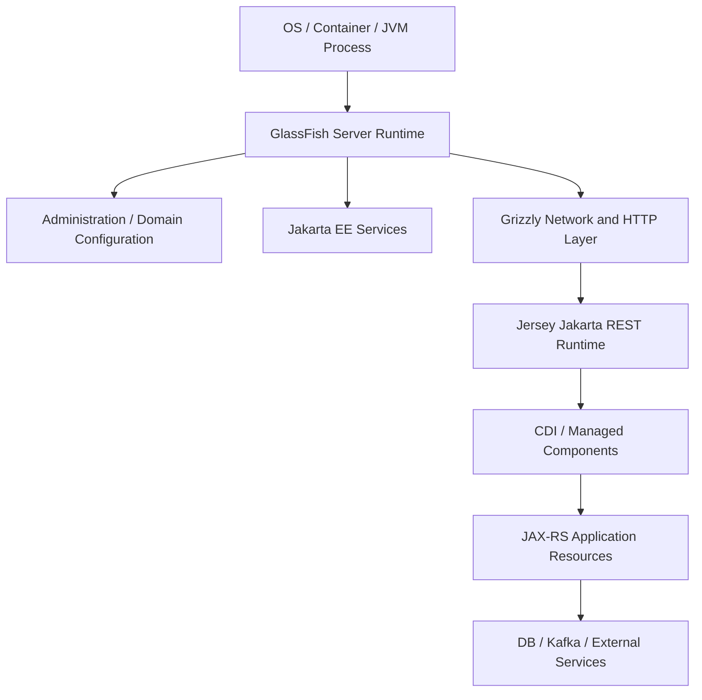
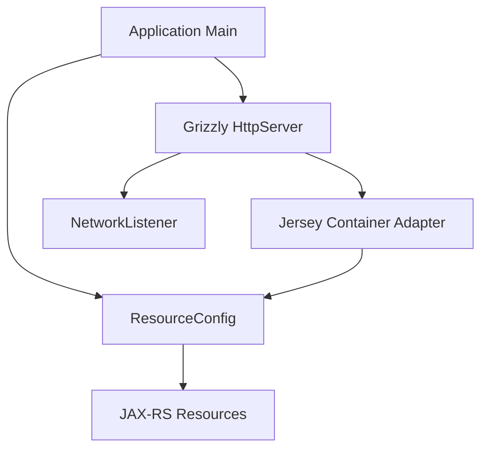
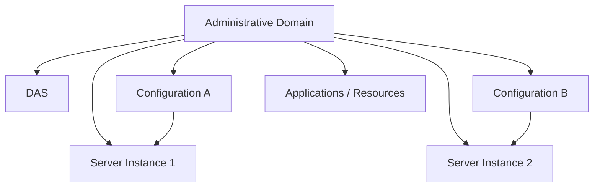
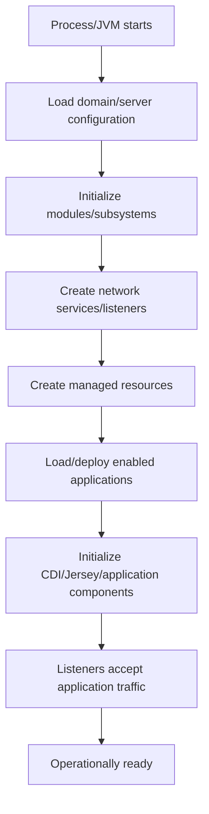
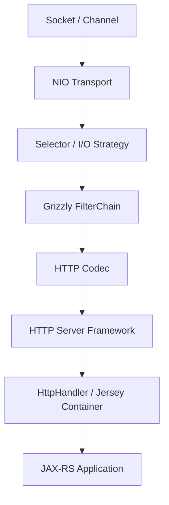
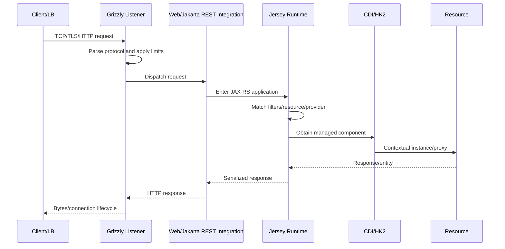
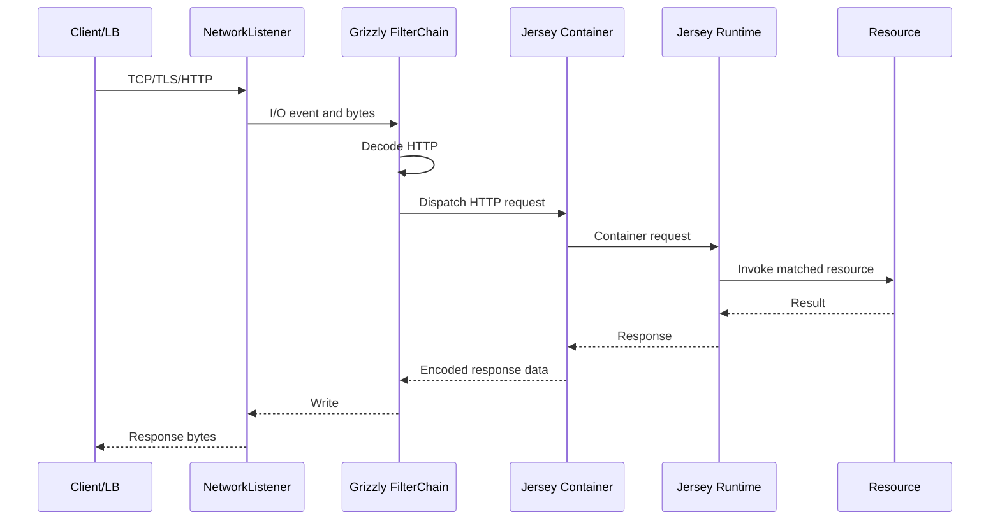
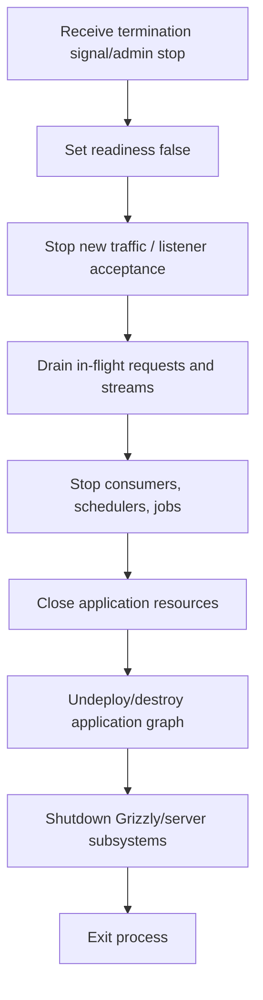

# Part 012 — GlassFish and Grizzly Runtime Models

> GlassFish dan Grizzly bukan dua nama untuk hal yang sama. **GlassFish adalah Jakarta EE application server** yang memiliki deployment model, configuration domain, classloading, CDI, managed resources, security, administration, dan application lifecycle. **Grizzly adalah asynchronous I/O dan HTTP runtime** yang dapat menjadi network layer di dalam GlassFish atau dipakai secara embedded untuk menjalankan Jersey. Jika boundary ini tidak jelas, engineer mudah mengubah thread pool yang salah, mengemas library container dua kali, men-debug request di layer yang keliru, atau menulis shutdown logic yang tidak pernah dipanggil oleh owner sebenarnya.

## Daftar Isi

1. [Target kompetensi](#target-kompetensi)
2. [Scope dan baseline](#scope-dan-baseline)
3. [Terminology map](#terminology-map)
4. [Mental model: platform, server, network runtime, and application](#mental-model-platform-server-network-runtime-and-application)
5. [GlassFish versus Grizzly](#glassfish-versus-grizzly)
6. [GlassFish administrative domain](#glassfish-administrative-domain)
7. [Domain Administration Server and server instances](#domain-administration-server-and-server-instances)
8. [Control plane versus data plane](#control-plane-versus-data-plane)
9. [GlassFish configuration model](#glassfish-configuration-model)
10. [GlassFish process startup lifecycle](#glassfish-process-startup-lifecycle)
11. [Application deployment lifecycle](#application-deployment-lifecycle)
12. [Application enable, disable, undeploy, and redeploy](#application-enable-disable-undeploy-and-redeploy)
13. [Packaging and deployment units](#packaging-and-deployment-units)
14. [Classloader model and dependency boundaries](#classloader-model-and-dependency-boundaries)
15. [Provided APIs versus bundled implementations](#provided-apis-versus-bundled-implementations)
16. [Jakarta REST and Jersey inside GlassFish](#jakarta-rest-and-jersey-inside-glassfish)
17. [CDI, HK2, and managed component ownership](#cdi-hk2-and-managed-component-ownership)
18. [Managed resources and JNDI boundaries](#managed-resources-and-jndi-boundaries)
19. [GlassFish network listeners and HTTP service](#glassfish-network-listeners-and-http-service)
20. [Grizzly architecture](#grizzly-architecture)
21. [Transport and selector model](#transport-and-selector-model)
22. [Filter chain and protocol processing](#filter-chain-and-protocol-processing)
23. [HTTP codec and HTTP server abstractions](#http-codec-and-http-server-abstractions)
24. [`HttpServer`, `NetworkListener`, and `HttpHandler`](#httpserver-networklistener-and-httphandler)
25. [Jersey on standalone Grizzly](#jersey-on-standalone-grizzly)
26. [Request lifecycle on GlassFish](#request-lifecycle-on-glassfish)
27. [Request lifecycle on standalone Grizzly](#request-lifecycle-on-standalone-grizzly)
28. [Thread ownership and blocking](#thread-ownership-and-blocking)
29. [Worker pools, queues, and saturation](#worker-pools-queues-and-saturation)
30. [Connection lifecycle and keep-alive](#connection-lifecycle-and-keep-alive)
31. [TLS and reverse-proxy boundaries](#tls-and-reverse-proxy-boundaries)
32. [Timeout hierarchy](#timeout-hierarchy)
33. [Request size, headers, and protocol limits](#request-size-headers-and-protocol-limits)
34. [Async JAX-RS, streaming, and slow clients](#async-jax-rs-streaming-and-slow-clients)
35. [Embedded GlassFish](#embedded-glassfish)
36. [Standalone Grizzly versus embedded GlassFish](#standalone-grizzly-versus-embedded-glassfish)
37. [Clusters, instances, and Kubernetes replicas](#clusters-instances-and-kubernetes-replicas)
38. [Startup, readiness, and health](#startup-readiness-and-health)
39. [Graceful shutdown and draining](#graceful-shutdown-and-draining)
40. [Undeploy and classloader leak risks](#undeploy-and-classloader-leak-risks)
41. [Configuration, secrets, and environment promotion](#configuration-secrets-and-environment-promotion)
42. [Logging, metrics, tracing, and access logs](#logging-metrics-tracing-and-access-logs)
43. [Performance model](#performance-model)
44. [Capacity and sizing questions](#capacity-and-sizing-questions)
45. [Architecture patterns](#architecture-patterns)
46. [Anti-patterns](#anti-patterns)
47. [Failure-model matrix](#failure-model-matrix)
48. [Debugging playbook](#debugging-playbook)
49. [PR review checklist](#pr-review-checklist)
50. [Trade-off yang harus dipahami senior engineer](#trade-off-yang-harus-dipahami-senior-engineer)
51. [Internal verification checklist](#internal-verification-checklist)
52. [Latihan verifikasi](#latihan-verifikasi)
53. [Ringkasan](#ringkasan)
54. [Referensi resmi](#referensi-resmi)

---

## Target kompetensi

Setelah menyelesaikan part ini, Anda harus mampu:

- membedakan Jakarta EE specification, GlassFish application server, Jersey Jakarta REST implementation, HK2 component system, dan Grizzly network runtime;
- menggambar process/runtime ownership dari socket hingga JAX-RS resource;
- menjelaskan domain, Domain Administration Server, instance, cluster, configuration, application, dan listener pada GlassFish;
- membedakan control-plane administration dari data-plane request serving;
- menelusuri startup, deploy, enable, disable, undeploy, redeploy, dan shutdown lifecycle;
- menilai apakah dependency seharusnya `provided` oleh GlassFish atau dibundel aplikasi;
- mendiagnosis classloader conflict dan namespace/version mismatch;
- memahami Grizzly transport, selector, filter chain, HTTP codec, listener, worker pool, dan handler model;
- menjelaskan bagaimana Jersey dapat berjalan di GlassFish maupun standalone Grizzly;
- menentukan thread pool dan queue mana yang mungkin menjadi bottleneck;
- merancang timeout, request limit, keep-alive, TLS, proxy metadata, dan slow-client protections;
- membedakan embedded GlassFish dari standalone Grizzly;
- tidak menyamakan GlassFish cluster dengan Kubernetes replica set;
- mengintegrasikan readiness dan graceful shutdown dengan container orchestration;
- melakukan failure modelling dari listener, deployment, classloading, DI, thread pool, hingga application dependency;
- memverifikasi runtime internal CSG melalui evidence, bukan asumsi dari package name `org.glassfish.*`.

---

## Scope dan baseline

Part ini berfokus pada runtime mental model. Ia tidak menyatakan bahwa CSG Quote & Order menggunakan GlassFish atau Grizzly.

`org.glassfish.*` dependency dapat berasal dari:

- Jersey artifacts;
- HK2 artifacts;
- Grizzly connector/server;
- GlassFish server integration;
- unrelated Eclipse EE4J libraries.

Keberadaan package tersebut **bukan bukti GlassFish application server dipakai**.

### Version caution

GlassFish, Jersey, Grizzly, Jakarta EE, Servlet, CDI, dan Java compatibility berubah antar-release. Selalu verifikasi exact runtime matrix.

Contoh konseptual dalam part ini tidak boleh dipakai untuk menyimpulkan:

```text
GlassFish version
Jakarta EE profile
Java version
Grizzly version
Jersey version
cluster topology
thread-pool defaults
listener defaults
```

---

## Terminology map

| Term | Meaning |
|---|---|
| GlassFish | Jakarta EE application server/distribution |
| domain | administrative boundary berisi configuration dan satu atau lebih server instances |
| DAS | Domain Administration Server, control plane utama domain |
| instance | running GlassFish server process/logical server target |
| cluster | group of server instances managed together dalam GlassFish model |
| configuration | named set of server settings yang dapat dipakai target/instance |
| application | deployed Jakarta EE application/archive |
| module | deployable web/EJB/connector/application-client unit |
| network listener | endpoint yang bind host/port dan menerima protocol traffic |
| virtual server | HTTP host/context routing construct pada server |
| Grizzly | asynchronous I/O/network framework dan HTTP runtime |
| transport | low-level I/O engine, biasanya TCP/NIO transport |
| selector | component yang mendeteksi readiness event pada channels |
| filter chain | ordered protocol-processing pipeline di Grizzly |
| HTTP codec | parser/encoder HTTP messages |
| `HttpServer` | embeddable Grizzly HTTP server abstraction |
| `NetworkListener` | listener configuration/endpoint dalam Grizzly HTTP server |
| `HttpHandler` | handler abstraction untuk HTTP request |
| Jersey container | adapter yang menghubungkan HTTP runtime ke Jersey application handler |

---

## Mental model: platform, server, network runtime, and application



Standalone Grizzly model:



Perbedaan utama:

```text
GlassFish owns platform lifecycle.
Standalone application owns Grizzly lifecycle.
```

---

## GlassFish versus Grizzly

| Dimension | GlassFish | Grizzly |
|---|---|---|
| primary role | Jakarta EE application server | asynchronous network/HTTP framework |
| deployment | WAR/EAR/modules, server deployment lifecycle | programmatic/embedded bootstrap |
| administration | domain, DAS, `asadmin`, server config | application code/config |
| Jakarta EE services | broad platform services | none by itself |
| CDI/security/transactions | server-integrated | must be added/integrated |
| networking | often uses Grizzly internally | owns transport/listener directly |
| lifecycle owner | server/domain/process | application `main` or embedding runtime |
| classloading | server/application hierarchy | normal application classpath/module path |
| operational footprint | larger platform | leaner but more application-owned concerns |

### Key inference rule

```text
GlassFish may use Grizzly,
but using Grizzly does not imply using GlassFish.
```

---

## GlassFish administrative domain

Domain adalah administrative boundary. Ia biasanya memiliki:

- domain configuration;
- server instances;
- deployed applications/resources metadata;
- security/configuration artifacts;
- logs and runtime directories;
- administration endpoint;
- named configurations.

Mental model:



Domain bukan domain business CPQ. Jangan campur istilah “domain model” dengan GlassFish administrative domain.

---

## Domain Administration Server and server instances

DAS berfungsi sebagai control plane administrasi domain. Ia menangani operations seperti configuration dan deployment management.

Server instance menjalankan application traffic sesuai target/configuration.

Pertanyaan penting:

```text
Is production traffic served by DAS itself?
Are there standalone instances?
Are instances clustered?
Is each Kubernetes pod a full independent domain?
Is admin plane exposed outside management network?
```

Jangan mengasumsikan topology tradisional multi-host GlassFish digunakan pada cloud-native deployment. Banyak deployment containerized menjalankan satu server instance per pod/process dengan external orchestration.

---

## Control plane versus data plane

```text
Control plane:
  deploy, configure, start/stop, inspect, administer

Data plane:
  accept client connections, execute requests, access dependencies
```

Failure consequences berbeda.

Contoh:

- DAS unavailable dapat menghambat administration tanpa selalu menghentikan instance yang sudah berjalan;
- data-plane listener unavailable langsung memengaruhi traffic;
- configuration store corruption dapat muncul pada restart/deploy berikutnya;
- admin credential leakage memiliki blast radius lintas applications/instances.

### Operational rule

Pisahkan:

- management network;
- application ingress;
- credentials;
- ports;
- logs;
- alert severity.

---

## GlassFish configuration model

Configuration dapat mencakup:

- JVM options;
- HTTP/network listeners;
- thread pools;
- security realms;
- JDBC pools/resources;
- JNDI resources;
- logging;
- monitoring;
- deployment settings;
- virtual servers;
- system properties.

### Source-of-truth question

Pada GitOps/IaC environment, tentukan apakah configuration source of truth adalah:

```text
domain.xml baked into image
asadmin bootstrap scripts
Kubernetes ConfigMap/Secret
Terraform/Ansible
runtime admin changes
internal platform templates
```

Runtime mutation melalui admin console dapat menciptakan drift dari Git/IaC.

### Configuration precedence

Dokumentasikan precedence antara:

```text
server defaults
named configuration
domain/server properties
JVM system properties
environment variables
application config
Kubernetes injected config
```

Tidak ada satu precedence universal untuk semua subsystem.

---

## GlassFish process startup lifecycle

Conceptual sequence:



Actual ordering and listener availability must be verified. A bound port does not necessarily mean all applications and dependencies are ready.

### Failure categories

| Stage | Failure example |
|---|---|
| configuration | invalid XML/property/JVM option |
| module init | version/linkage issue |
| listener bind | port in use, permission, address missing |
| managed resource | DB driver/pool config invalid |
| application deploy | classloading, CDI resolution, JAX-RS model error |
| application init | remote dependency timeout |
| readiness | health path not registered or dependency degraded |

---

## Application deployment lifecycle

Conceptual deployment pipeline:

```mermaid
flowchart LR
    Artifact[WAR/EAR/JAR Module]
    Receive[Receive/Stage Artifact]
    Inspect[Inspect Metadata and Descriptors]
    Classload[Build Classloader Boundary]
    Discover[Discover Components]
    Integrate[Integrate CDI/Jersey/Platform Services]
    Init[Initialize Application]
    Register[Register Routes/Handlers]
    Enable[Enable Target]

    Artifact --> Receive --> Inspect --> Classload --> Discover --> Integrate --> Init --> Register --> Enable
```



Possible deployment evidence:

- deployment command/output;
- server logs;
- application name/version;
- context root;
- target instance/cluster;
- generated artifacts;
- component inventory;
- endpoint registration;
- health/readiness result.

### Deployment is a transaction only conceptually

Partial initialization can allocate:

- threads;
- temporary files;
- classloaders;
- sockets;
- pools;
- registered drivers;
- MBeans.

Failure path must clean partial resources. Test failed deployment followed by corrected redeployment.

---

## Application enable, disable, undeploy, and redeploy

Operations memiliki semantics berbeda:

- **deploy**: install/register application;
- **enable**: allow target to run/serve application;
- **disable**: stop serving without necessarily deleting deployment metadata/artifact;
- **undeploy**: remove application deployment;
- **redeploy**: replace/reinitialize application, potentially creating new classloader and graph.

Exact GlassFish behavior/options depend on version and command.

### Senior review questions

```text
What happens to in-flight requests?
Are message consumers stopped?
Are schedulers stopped?
Are classloaders released?
Are sessions preserved?
Does redeploy run database migration again?
Can old and new versions overlap?
What is the rollback artifact?
```

---

## Packaging and deployment units

Common forms:

- WAR for web/JAX-RS application;
- EAR aggregating multiple modules;
- EJB/connector modules;
- executable/embedded GlassFish distribution;
- container image containing server plus deployment.

### Packaging affects ownership

WAR on external GlassFish:

```text
server owns runtime
application archive owns application classes
platform APIs usually provided
```

Executable distribution/container image:

```text
image build owns server version and application artifact
entrypoint owns process startup
orchestrator owns process restart
```

### Avoid accidental platform bundling

Bundling server implementation libraries in WAR can cause classloader split and incompatible duplicate APIs.

---

## Classloader model and dependency boundaries

Application servers use layered classloading. Conceptually:

```text
JDK/bootstrap classes
server/platform modules
shared/common libraries
application/module classloader
```

Actual hierarchy and delegation rules are runtime-specific.

### Typical failures

- `ClassCastException` between same class name loaded by different classloaders;
- `NoSuchMethodError` from version mismatch;
- `LinkageError`;
- duplicate `jakarta.ws.rs-api`/Jersey/CDI implementation;
- old driver in server lib overriding application driver;
- service provider loaded from unexpected archive;
- classloader leak after redeploy.

### Diagnostic identity

For a suspect class:

```java
Class<?> type = SomeType.class;
System.out.println(type.getProtectionDomain().getCodeSource());
System.out.println(type.getClassLoader());
System.out.println(type.getPackage().getImplementationVersion());
```

Gunakan diagnostic ini secara terkontrol; jangan mencetak sensitive filesystem detail ke public logs.

---

## Provided APIs versus bundled implementations

Pada full GlassFish, Jakarta EE APIs dan implementations biasanya disediakan server. Aplikasi umumnya meng-compile API dengan scope `provided`, tetapi exact build policy harus mengikuti runtime/version.

Conceptual Maven model:

```xml
<dependency>
  <groupId>jakarta.platform</groupId>
  <artifactId>jakarta.jakartaee-api</artifactId>
  <version>${jakarta.ee.version}</version>
  <scope>provided</scope>
</dependency>
```

Jangan menyalin dependency ini tanpa memeriksa profile dan server compatibility.

### Bundle when intentional

Library application-specific dapat dibundel, tetapi server-integrated implementations perlu perhatian khusus:

```text
Jersey implementation
CDI implementation
Servlet implementation
transaction manager
JSON provider
JAXB provider
logging bridge
```

Dependency convergence test harus membandingkan compile-time API dengan runtime-provided implementation.

---

## Jakarta REST and Jersey inside GlassFish

GlassFish menyediakan Jakarta REST implementation melalui Jersey dalam supported distribution/version. Application dapat menggunakan portable Jakarta REST APIs, dan Jersey-specific feature hanya jika dependency/runtime compatibility jelas.

Conceptual flow:

```text
GlassFish listener
  -> Grizzly HTTP processing
    -> web/Jakarta REST integration
      -> Jersey ApplicationHandler/resource model
        -> CDI/HK2 managed component
          -> resource method
```

### Portability boundary

Portable code:

```java
@Path("/quotes")
public class QuoteResource { ... }
```

Jersey-specific code:

```java
public final class QuoteApplication extends ResourceConfig { ... }
```

GlassFish-specific code/config:

```text
server deployment descriptors
asadmin resources
domain/network listener configuration
server-specific classloading settings
```

Keep each concern in appropriate module/layer.

---

## CDI, HK2, and managed component ownership

GlassFish itself has internal HK2-based modular/component architecture, Jersey can use HK2, and Jakarta EE applications can use CDI. These facts do not mean application code should freely access server internal HK2 locators.

Desired boundary:

```text
GlassFish internals -> opaque runtime implementation
Jersey-specific runtime adapters -> isolated
CDI application graph -> application-owned component model
Domain/application code -> framework-neutral where practical
```

### Internal API risk

Depending on GlassFish internal classes can:

- break across upgrades;
- require server classloader access;
- prevent standalone tests;
- couple app to implementation;
- bypass managed lifecycle/security.

Use standard Jakarta APIs or documented public extension points.

---

## Managed resources and JNDI boundaries

GlassFish dapat menyediakan managed resources seperti JDBC data sources melalui server configuration/JNDI.

Benefits:

- centralized pool config;
- runtime lifecycle ownership;
- credential/config separation;
- monitoring/admin integration.

Trade-offs:

- application portability depends on resource naming;
- local development requires equivalent binding;
- runtime drift possible;
- infrastructure ownership may be split between app and platform teams;
- containerized deployment may prefer application-owned pools/config.

### Ownership invariant

```text
If GlassFish owns a DataSource/pool,
the application must not close the pool itself.
```

Connections borrowed from `DataSource` still must be closed/returned by application code.

---

## GlassFish network listeners and HTTP service

A listener usually defines:

- bind address;
- port;
- protocol;
- TLS/SSL configuration;
- virtual server routing;
- thread/transport settings;
- request/connection limits;
- HTTP/keep-alive behavior.

Different listeners may serve:

```text
application HTTP
application HTTPS
administration
internal/private traffic
```

### Listener review

- Is listener exposed publicly or privately?
- Does it trust proxy headers?
- Where is TLS terminated?
- Is admin listener isolated?
- Are cleartext and TLS ports both enabled?
- Are idle/header/request limits configured?
- Are access logs enabled with redaction?

---

## Grizzly architecture

Grizzly is built around asynchronous I/O and protocol-processing pipelines.

Conceptual layers:



Grizzly has multiple APIs/modules and exact internal path depends on version/configuration.

### Core principle

Network event loop/selector capacity and application worker capacity are different resources. Tuning one does not automatically fix the other.

---

## Transport and selector model

Transport owns low-level connection/channel I/O. Selector-related threads detect readiness events instead of dedicating one blocking thread per idle connection.

Do not infer that all application work executes on selector threads. Execution strategy can hand work to worker threads.

### Blocking hazard

Any code path that executes on I/O/event thread and performs blocking database/network/file work can stall many connections.

Verification:

- capture thread dump during load;
- identify thread names and stacks;
- map selector/I/O threads versus workers;
- inspect configured I/O strategy;
- measure queue and active worker counts.

Do not tune based on thread names alone; confirm runtime docs/config/version.

---

## Filter chain and protocol processing

Grizzly filter chain is an ordered pipeline for connection and protocol events.

Conceptual events:

```text
accept
connect
read
write
close
exception
```

Filters can perform:

- transport framing;
- SSL/TLS handling;
- HTTP parsing/encoding;
- protocol upgrade;
- application dispatch.

This is not the same as:

- Servlet Filter;
- JAX-RS `ContainerRequestFilter`;
- JAX-RS reader/writer interceptor;
- CDI interceptor.

### Four “filter” layers

```text
Grizzly Filter      -> network/protocol pipeline
Servlet Filter      -> servlet request pipeline
JAX-RS Filter       -> Jakarta REST request/response pipeline
CDI Interceptor     -> managed method invocation pipeline
```

Debugging must identify the correct layer.

---

## HTTP codec and HTTP server abstractions

Grizzly HTTP framework parses bytes into HTTP messages and serializes responses back to bytes.

HTTP server framework adds abstractions such as:

- server configuration;
- network listeners;
- request/response objects;
- HTTP handlers;
- handler mapping;
- server lifecycle.

Protocol-level failures can occur before Jersey sees a request:

- invalid request line;
- malformed headers;
- header too large;
- TLS handshake failure;
- connection timeout;
- unsupported protocol behavior;
- body-size enforcement at lower layer.

Therefore “resource method not called” is not always a JAX-RS routing problem.

---

## `HttpServer`, `NetworkListener`, and `HttpHandler`

Standalone Grizzly mental model:

```java
HttpServer server = new HttpServer();
NetworkListener listener = new NetworkListener("api", "0.0.0.0", 8080);
server.addListener(listener);
server.getServerConfiguration().addHttpHandler(handler, "/");
server.start();
```

Exact constructors/APIs vary by Grizzly version; treat this as conceptual.

Ownership:

```text
application creates server
application configures listener/handlers
application starts server
application coordinates shutdown
```

### Handler mapping risks

- overlapping context paths;
- wrong root path;
- health endpoint shadowed;
- admin endpoint exposed on public listener;
- application base URI inconsistent behind proxy.

---

## Jersey on standalone Grizzly

Jersey provides a Grizzly container module/factory that connects a `ResourceConfig` to Grizzly HTTP server.

Typical conceptual bootstrap:

```java
URI baseUri = URI.create("http://0.0.0.0:8080/");
ResourceConfig config = new ResourceConfig()
        .packages("com.example.quote.api");

HttpServer server = GrizzlyHttpServerFactory.createHttpServer(
        baseUri,
        config,
        false);

server.start();
```

Exact API/version and shutdown handling must be verified.

### What standalone bootstrap must provide

- configuration loading and validation;
- DI container integration;
- listener/TLS setup;
- thread-pool sizing;
- health/readiness;
- logging/telemetry;
- startup failure handling;
- signal handling;
- graceful shutdown;
- close of clients/pools/consumers;
- security integration.

GlassFish would provide many of these platform concerns; standalone application owns them explicitly.

---

## Request lifecycle on GlassFish

Conceptual path:



Failure can occur at every participant. Correlation across access log, server log, Jersey trace, application trace, and dependency telemetry is essential.

---

## Request lifecycle on standalone Grizzly



Tidak ada GlassFish platform layer kecuali ditambahkan sendiri.

---

## Thread ownership and blocking

Potential thread categories:

- Grizzly selector/I/O threads;
- Grizzly worker threads;
- GlassFish thread pools;
- application-created executors;
- managed executor threads;
- JDBC driver/pool housekeeping;
- Kafka consumer/network threads;
- scheduler/timer threads;
- GC/JVM service threads.

### Review invariant

```text
Every blocking operation must run on a pool
whose capacity, queue, timeout, and shutdown are understood.
```

### ThreadLocal risk

Container worker threads are reused. Any `ThreadLocal`/MDC/security/tenant context must be cleared in `finally` or managed by approved context propagation.

---

## Worker pools, queues, and saturation

Throughput model:

```text
concurrency needed ≈ arrival rate × service time
```

But increasing threads cannot solve:

- downstream connection pool smaller than thread pool;
- database lock contention;
- CPU saturation;
- memory pressure;
- slow remote service;
- unbounded queues.

### Saturation signals

- active threads near maximum;
- growing queue;
- request latency rising before CPU saturation;
- connection accept backlog;
- timeout spikes;
- downstream pool wait time;
- many threads blocked on same monitor/socket/pool.

### Queue trade-off

```text
large queue -> fewer immediate rejects, larger latency and stale work
small queue -> earlier load shedding, requires retry-safe clients
```

Server pool, application executor, HTTP client pool, and DB pool must be capacity-aligned.

---

## Connection lifecycle and keep-alive

Connection lifecycle includes:

```text
accept -> optional TLS -> parse requests -> keep-alive reuse -> idle timeout -> close
```

Review:

- keep-alive timeout;
- max requests per connection if applicable;
- idle timeout alignment with load balancer;
- connection close behavior during drain;
- HTTP/1.1 pipelining assumptions;
- HTTP/2 support and multiplexing, if enabled;
- slow-read/slow-write handling.

### Timeout mismatch example

```text
LB idle timeout = 60 s
server idle timeout = 30 s
```

May produce connection resets/retries perceived as intermittent client failure.

---

## TLS and reverse-proxy boundaries

Possible TLS patterns:

```text
client -> TLS LB -> cleartext server
client -> TLS LB -> TLS server
client -> direct TLS server
service mesh sidecar -> server
```

Questions:

- where is client identity authenticated?
- are forwarded headers trusted only from known proxy?
- how is original scheme/host/port reconstructed?
- does application generate correct absolute links?
- who rotates certificates?
- is mTLS terminated before application?
- are TLS errors observable at LB or server?

Do not trust arbitrary `X-Forwarded-*` from public clients. Configure trusted proxy boundary.

---

## Timeout hierarchy

Potential layers:

```text
client timeout
API gateway timeout
load balancer idle timeout
server connection/request timeout
async JAX-RS timeout
application deadline
HTTP client timeout
DB query/lock timeout
Kafka request timeout
```

Desired invariant:

```text
outer timeout > inner timeout + cleanup/response margin
```

If gateway times out before application, server may continue expensive work and commit side effects after client receives failure.

Track cancellation/ambiguous outcome, especially for quote submission/order creation.

---

## Request size, headers, and protocol limits

Limits may exist at:

- CDN/WAF;
- API gateway;
- load balancer;
- GlassFish/Grizzly listener;
- Servlet/Jersey multipart layer;
- application validation.

Govern:

- URI length;
- header count/size;
- request body size;
- multipart part count/size;
- decompressed size;
- response size;
- upload duration;
- form parameter count.

Misaligned limits create inconsistent 400/413/431/connection-reset behavior.

Document the effective minimum across layers.

---

## Async JAX-RS, streaming, and slow clients

Async JAX-RS can free request workers while waiting, but it does not make downstream operation non-blocking by itself.

Streaming risks:

- response committed before late failure;
- worker retained by slow client;
- output buffering at proxy;
- connection held across rollout;
- shutdown drain never completes;
- backpressure not propagated;
- memory buffers grow.

Review runtime support for:

- asynchronous Servlet integration;
- Grizzly suspend/resume behavior;
- write timeout;
- streaming thread model;
- client disconnect detection;
- SSE heartbeat;
- maximum connection duration.

---

## Embedded GlassFish

Embedded GlassFish packages server capability for command-line, application embedding, cloud/container deployment, or integration testing, depending on version/support model.

Mental model:

```text
Application/process distribution includes GlassFish server runtime.
GlassFish still owns Jakarta EE subsystem lifecycle inside the process.
External orchestrator owns process lifecycle.
```

Benefits:

- Jakarta EE platform services;
- consistent server integration;
- deployable self-contained distribution.

Costs:

- larger runtime footprint than standalone Grizzly;
- more configuration surface;
- longer startup/warmup possibility;
- more complex dependency/classloading model;
- server-specific operations remain.

Verify current GlassFish embedded support and recommended launch model for exact version.

---

## Standalone Grizzly versus embedded GlassFish

| Question | Standalone Grizzly + Jersey | Embedded GlassFish |
|---|---|---|
| platform breadth | minimal/custom | Jakarta EE platform capabilities |
| startup | application code | server bootstrap/deploy |
| DI | HK2/CDI added explicitly | CDI/platform integrated |
| transactions/JNDI | application-added | server-managed options |
| configuration | custom/application | GlassFish domain/server model |
| classloading | application classpath | server/application hierarchy |
| footprint | potentially smaller | generally broader |
| operations | application-defined | GlassFish administration plus process ops |
| portability | runtime code Jersey/Grizzly-specific | Jakarta APIs portable, server config specific |

Choose based on required platform services, operational standard, portability, and team competence—not only startup code length.

---

## Clusters, instances, and Kubernetes replicas

GlassFish cluster and Kubernetes replicas operate at different orchestration layers.

```text
GlassFish cluster:
  server-level administration/grouping/HA features

Kubernetes Deployment replicas:
  pod/process scheduling, restart, scaling, rollout
```

Combining both can create nested orchestration complexity:

- two membership models;
- two rollout models;
- two health models;
- state replication assumptions;
- admin-plane topology mismatch;
- persistent domain configuration concerns.

Common cloud-native design may run one independently configured server process per pod and let Kubernetes handle replicas, but internal architecture must be verified.

Do not enable in-server clustering features without a clear need and supported topology.

---

## Startup, readiness, and health

Health states:

```text
process alive
server initialized
application deployed
essential graph initialized
mandatory dependencies reachable/usable
ready to receive traffic
```

These are not equivalent.

### Liveness

Answers: should orchestrator restart this process?

Avoid failing liveness for transient external dependency outages, or every replica may restart together.

### Readiness

Answers: should this instance receive new traffic?

Readiness may depend on:

- application deployment complete;
- critical configuration valid;
- mandatory local resources initialized;
- traffic-serving capability;
- drain state.

Be careful making readiness depend on shared dependency in a way that removes all replicas simultaneously.

### Startup probe

Useful when server deployment/warmup exceeds normal liveness window.

---

## Graceful shutdown and draining

Desired sequence:



### Standalone Grizzly

Application must register signal/shutdown handling and call graceful server shutdown API appropriate to version.

### GlassFish

Server owns shutdown/deployment lifecycle. Application should cooperate through managed callbacks and avoid independent process-control assumptions.

### Drain limits

Define maximum duration for:

- normal requests;
- long polling/SSE;
- streaming downloads;
- Kafka/message handlers;
- database transactions;
- background jobs.

After grace period, forceful termination may occur. Side-effecting operations need idempotency/reconciliation.

---

## Undeploy and classloader leak risks

A redeploy should make old application graph unreachable. Leak sources:

- application-created non-daemon threads;
- static caches in shared/server libraries;
- JDBC drivers/registrations;
- logging handlers;
- MBeans;
- timer tasks;
- thread locals on server threads;
- Kafka clients;
- HTTP client pools;
- executors;
- shutdown hooks capturing app classes.

Symptom:

- metaspace growth after repeated redeploy;
- duplicate consumers/jobs;
- old class version still executing;
- “web application appears to have started a thread” warnings;
- `ClassCastException` across old/new loaders.

Production Kubernetes may replace process instead of hot redeploy, reducing some classloader leak exposure, but local/managed server workflows still need understanding.

---

## Configuration, secrets, and environment promotion

Separate:

```text
server configuration
application configuration
secrets
runtime-discovered state
business/tenant configuration
```

### Safe promotion model

- immutable image/artifact;
- versioned configuration;
- secrets referenced, not baked;
- environment-specific values injected;
- startup validation;
- configuration fingerprint in telemetry;
- no manual console drift without reconciliation.

### GlassFish-specific risk

`asadmin` runtime changes may survive/reappear differently depending on domain storage and image lifecycle. Document whether admin changes are forbidden, ephemeral, or reconciled into IaC.

---

## Logging, metrics, tracing, and access logs

Need visibility at multiple layers:

| Layer | Evidence |
|---|---|
| load balancer/gateway | request status, target latency, connection errors |
| Grizzly/listener | accepted connections, protocol/TLS errors, queue/thread metrics |
| GlassFish | deployment, subsystem, pool, thread, application lifecycle logs |
| Jersey | route/provider/filter/exception/tracing diagnostics |
| application | domain operation, correlation, causation, tenant-safe context |
| dependencies | DB pool/query, Kafka, Redis, HTTP client telemetry |

### Access-log cautions

Do not log:

- authorization header;
- cookies/tokens;
- full quote/order payload;
- PII;
- secrets;
- unbounded query strings.

Correlate access log with trace ID/correlation ID through trusted propagation.

---

## Performance model

End-to-end latency:

```text
network/TLS
+ request queue
+ HTTP parse/filter
+ Jersey matching/filter/provider
+ DI/proxy/interceptor
+ application logic
+ downstream waits
+ serialization
+ response queue/write
```

Server tuning cannot compensate for dominant downstream wait without bounded concurrency/resilience.

### Important metrics

- active/idle worker threads;
- work queue depth;
- accepted/open connections;
- request rate and latency histogram;
- error/rejection/timeout rate;
- response sizes;
- TLS handshake failures;
- DB/client pool acquisition time;
- JVM CPU, throttling, heap, native memory;
- GC pauses;
- container restarts/OOM kills.

Metrics names are implementation/version-specific.

---

## Capacity and sizing questions

Ask:

1. What is peak arrival rate and burst profile?
2. What is p50/p95/p99 service time?
3. What percentage blocks on DB/HTTP?
4. What is maximum in-flight request budget?
5. What are worker and downstream pool capacities?
6. How many keep-alive/open connections?
7. What is average/max request/response size?
8. Are there long-lived SSE/stream connections?
9. What is CPU limit and throttling behavior?
10. What happens when queue is full?
11. Can clients retry, and are operations idempotent?
12. How quickly does autoscaling add ready capacity?

### Capacity alignment example

```text
server workers: 200
DB pool: 20
all requests require DB
```

Up to 180 workers may wait for connections, amplifying latency. Align concurrency controls with scarce downstream resource.

---

## Architecture patterns

### Pattern 1 — Portable application, isolated server adapter

```text
core/application modules -> Jakarta APIs or plain Java
runtime module           -> GlassFish/Jersey-specific config
```

### Pattern 2 — One process per Kubernetes pod

Each pod owns one server runtime and immutable application version; Kubernetes handles replication/rollout. Verify internal platform standard.

### Pattern 3 — Explicit listener separation

```text
public application listener
private management/health listener
admin listener isolated from public ingress
```

### Pattern 4 — Unified timeout budget

Document timeout hierarchy from gateway to downstream resources and preserve cancellation/ambiguous-outcome semantics.

### Pattern 5 — Server-provided resources behind application contracts

Application depends on `DataSource`/gateway interfaces, not GlassFish internal pool classes.

### Pattern 6 — Full-process replacement over hot redeploy

For immutable/containerized production, replace process/pod to reduce classloader drift, while still testing graceful shutdown.

---

## Anti-patterns

### Inferring runtime from Maven group ID

`org.glassfish.jersey` does not prove GlassFish server deployment.

### Bundling the server into a WAR accidentally

Large dependency closure and duplicate implementations.

### Tuning all thread pools upward

Hides queueing and overwhelms DB/downstream.

### Blocking selector/event threads

One slow operation stalls many connections.

### Public admin listener

Control plane exposed with broad blast radius.

### Readiness equals “port open”

Traffic reaches undeployed/uninitialized app.

### Liveness depends on database availability

All pods restart during shared DB outage.

### Runtime console as source of truth

Configuration drift from Git/IaC.

### Independent shutdown hooks inside managed server

Conflicts with server lifecycle and captures classloader.

### GlassFish cluster plus Kubernetes without explicit model

Nested HA/orchestration complexity.

### Hot redeploy as normal production rollout

Increases classloader/resource leak risk and weakens immutability.

---

## Failure-model matrix

| Failure | Layer | Symptom | Detection | Prevention |
|---|---|---|---|---|
| port bind failure | listener/OS | server startup fails | startup log, socket inspection | reserved ports, fail-fast |
| TLS handshake failure | listener/proxy | request never reaches Jersey | LB/listener TLS metrics | certificate/trust automation |
| malformed/oversized header | HTTP codec | 4xx/reset before resource | access/protocol logs | aligned limits |
| worker saturation | server pool | latency/timeout spike | pool/queue/thread dump | bounded concurrency/load shedding |
| selector thread blocked | transport | many connections stall | thread dump/event-loop latency | no blocking on I/O thread |
| deployment failure | GlassFish app lifecycle | app unavailable | deployment logs | packaged deployment tests |
| classloader conflict | server/app boundary | `NoSuchMethodError`, cast failure | code source/classloader diagnostics | dependency governance |
| duplicate Jersey/CDI implementation | packaging | bootstrap/linkage errors | dependency tree/runtime inventory | `provided`/compatible modules |
| CDI graph failure | app integration | deploy fails | deployment exception chain | graph validation |
| context root mismatch | deployment/routing | 404 | deployed app/listener mapping | route manifest/tests |
| config drift | control plane | environment-specific behavior | config fingerprint/diff | GitOps/IaC reconciliation |
| DB resource missing | managed resource | lookup/startup/request failure | JNDI/pool logs | pre-deploy validation |
| graceful drain failure | shutdown | reset/partial operation | termination timeline | readiness-first drain |
| classloader leak | redeploy | metaspace/thread growth | heap/thread analysis | managed cleanup/process replacement |
| readiness too early | orchestration | initial 5xx | startup timeline | app-aware readiness |
| liveness too strict | orchestration | restart storm | pod/server events | dependency-independent liveness |
| slow-client retention | HTTP write/stream | worker/connection exhaustion | open connection/write metrics | write timeout/backpressure |
| proxy header spoofing | trust boundary | wrong scheme/client identity | header audit | trusted proxy config |
| nested cluster confusion | platform | split operations/rollout | topology review | one clear orchestration model |

---

## Debugging playbook

### 1. Prove the runtime

Collect from process/image:

```text
main class / entrypoint
server banner/version
Jersey version
Grizzly version
Jakarta EE profile/version
packaging type
process arguments
open ports
```

Do not rely only on repository dependencies.

### 2. Draw the request path

```text
DNS -> gateway/LB -> node/pod/service -> listener -> Grizzly -> web/Jersey -> resource
```

Identify the first layer with no evidence of request.

### 3. Check listener state

- correct bind address/port;
- TLS versus cleartext;
- certificate/trust;
- listener enabled;
- network policy/firewall;
- backlog/open connections;
- admin versus application listener.

### 4. Check deployment state

- application name/version;
- target instance/cluster;
- enabled status;
- context root/application path;
- deployment exception;
- generated endpoint/resource model.

### 5. Check class origins

For conflicting classes inspect:

```text
classloader
code source JAR
implementation version
server module versus application library
```

Run Maven dependency tree and inspect final WAR/EAR/image contents.

### 6. Inspect thread dump

Classify stacks:

```text
selector/I/O
server workers
application executors
DB waits
HTTP client waits
locks
Kafka threads
shutdown threads
```

Capture multiple dumps over time to distinguish transient from stuck.

### 7. Inspect queues and pools

Correlate:

- server workers/queue;
- DB pool wait;
- HTTP client pool wait;
- Kafka callback/poll loops;
- CPU throttling;
- GC.

### 8. Inspect timeout ownership

Determine which layer produced timeout/status/reset. A gateway 504 does not prove application threw 504.

### 9. Reproduce lifecycle

Test:

```text
cold startup
deploy failure
redeploy
SIGTERM/admin stop
in-flight request during shutdown
long stream during shutdown
downstream unavailable at startup
```

### 10. Verify no leaks

After stop/undeploy, inspect threads, sockets, MBeans, drivers, temp files, and classloader reachability.

---

## PR review checklist

### Runtime boundary

- [ ] Code distinguishes Jakarta standard from Jersey/GlassFish/Grizzly-specific API.
- [ ] Runtime-specific imports isolated.
- [ ] No GlassFish internal API dependency without approved reason.
- [ ] `org.glassfish.*` dependency purpose documented.
- [ ] Runtime/version compatibility matrix updated.

### Packaging and classloading

- [ ] Platform APIs/implementations scoped correctly.
- [ ] No duplicate Jakarta/Jersey/CDI/Servlet implementations.
- [ ] Final archive/image contents tested.
- [ ] Driver/provider version ownership clear.
- [ ] No shared-library static state leaking application classes.

### Listener and HTTP

- [ ] Listener exposure and protocol correct.
- [ ] Admin listener isolated.
- [ ] TLS termination and trust boundary documented.
- [ ] Forwarded-header handling safe.
- [ ] Header/body/timeout limits aligned with gateway.
- [ ] Slow-client controls considered.

### Threads and concurrency

- [ ] Blocking work runs on understood worker pool.
- [ ] No unbounded executor/queue.
- [ ] Pool capacity aligned with DB/client pools.
- [ ] ThreadLocal/MDC cleanup guaranteed.
- [ ] Async/streaming thread model tested.
- [ ] Rejection/load-shedding behavior defined.

### Deployment and lifecycle

- [ ] Startup mandatory failures occur before readiness.
- [ ] Deployment does not retry forever.
- [ ] Readiness is application-aware.
- [ ] Liveness does not create dependency restart storm.
- [ ] Shutdown sets readiness false before drain.
- [ ] Consumers/jobs stop before dependencies close.
- [ ] Redeploy/stop cleanup tested.

### Configuration and operations

- [ ] Source of truth is versioned.
- [ ] No untracked admin-console drift.
- [ ] Secrets not embedded in domain config/image/logs.
- [ ] Config fingerprint observable.
- [ ] Access logs redact sensitive values.
- [ ] Runbook names exact listener/app/target commands.

### Architecture

- [ ] GlassFish cluster versus Kubernetes replica responsibility clear.
- [ ] Embedded GlassFish versus standalone Grizzly choice justified.
- [ ] Managed resource ownership clear.
- [ ] No nested lifecycle owners for same resource.
- [ ] Process replacement/rollback strategy defined.

---

## Trade-off yang harus dipahami senior engineer

### Full application server versus lean runtime

GlassFish menyediakan integrated platform services dan standardized deployment, tetapi membawa configuration, classloading, startup, dan operational surface yang lebih besar. Standalone Grizzly lebih lean, namun application/platform team harus menyediakan sendiri banyak capabilities.

### Server-managed resources versus application-owned resources

Server-managed pools memusatkan operations, tetapi dapat mengurangi self-contained deployment dan local parity. Application-owned pools mudah dipaketkan, tetapi setiap service harus menjaga lifecycle/configuration dengan benar.

### Shared server versus one process per service

Shared server dapat menghemat footprint dan centralized administration, tetapi memperbesar failure domain dan upgrade coupling. One service/process/pod meningkatkan isolation tetapi menambah fleet count.

### Hot redeploy versus immutable replacement

Hot redeploy cepat pada environment tertentu, tetapi classloader/resource leak dan state carry-over lebih sulit. Immutable replacement lebih deterministik tetapi memerlukan rollout/drain architecture.

### Large queues versus early rejection

Queue besar meredam burst sementara tetapi menaikkan tail latency dan stale work. Early rejection melindungi server tetapi memerlukan clients/retry/idempotency yang benar.

### In-server cluster versus external orchestration

In-server clustering dapat memberi platform features, tetapi pada Kubernetes dapat menduplikasi orchestration. Pilih satu authoritative model untuk membership, rollout, scaling, and health.

---

## Internal verification checklist

### Runtime identification

- [ ] Apakah production benar-benar memakai GlassFish?
- [ ] Apakah Grizzly digunakan standalone atau hanya internal GlassFish?
- [ ] Exact GlassFish version.
- [ ] Exact Grizzly version.
- [ ] Exact Jersey version.
- [ ] Jakarta EE profile/version.
- [ ] JDK vendor/version.
- [ ] Supported runtime compatibility matrix.

### Packaging and startup

- [ ] WAR, EAR, executable JAR, embedded distribution, atau image layout.
- [ ] Process entrypoint.
- [ ] Server start command.
- [ ] Domain/configuration location.
- [ ] Application deployment mechanism.
- [ ] Artifact promotion/rollback.
- [ ] Whether deployment occurs at image build, startup, or pipeline step.

### Domain and topology

- [ ] Domain count per environment.
- [ ] DAS topology.
- [ ] Standalone instances/clusters.
- [ ] Production traffic target.
- [ ] Admin-plane network exposure.
- [ ] GlassFish cluster usage.
- [ ] Kubernetes mapping: domain/instance per pod.
- [ ] Persistent configuration/storage requirement.

### Listeners and traffic

- [ ] Application listeners and ports.
- [ ] Admin listener and port.
- [ ] HTTP/HTTPS configuration.
- [ ] TLS termination location.
- [ ] mTLS usage.
- [ ] Trusted proxy headers.
- [ ] Context root and `@ApplicationPath`.
- [ ] Request/header/body limits.
- [ ] Keep-alive/idle timeouts.
- [ ] Access-log configuration.

### Threading and capacity

- [ ] Grizzly I/O strategy.
- [ ] Selector thread counts.
- [ ] Worker thread pools.
- [ ] Queue sizes/rejection policy.
- [ ] GlassFish named thread pools.
- [ ] Managed executor usage.
- [ ] Application-created executors.
- [ ] DB/client pool sizes.
- [ ] Long-lived streaming/SSE connections.
- [ ] Saturation dashboards.

### Jersey/CDI/HK2

- [ ] Jersey provided by server or bundled.
- [ ] `ResourceConfig`/`Application` model.
- [ ] CDI owner for resources/providers.
- [ ] HK2 bindings.
- [ ] Jersey-specific features.
- [ ] Duplicate implementation risk.
- [ ] Startup component/resource model logs.

### Managed resources

- [ ] JDBC pools/resources.
- [ ] JNDI names and lookup abstraction.
- [ ] Messaging resources.
- [ ] Security realms/identity integration.
- [ ] Resource credential source.
- [ ] Runtime monitoring.
- [ ] Ownership/close semantics.

### Classloading and dependencies

- [ ] Server-provided API list.
- [ ] Shared/common libraries.
- [ ] Application-bundled Jersey/CDI/Servlet/Jackson versions.
- [ ] Classloader delegation settings.
- [ ] JDBC driver location/version.
- [ ] Final archive dependency inventory.
- [ ] Historical linkage/classloader incidents.

### Health and shutdown

- [ ] Liveness endpoint semantics.
- [ ] Readiness endpoint semantics.
- [ ] Startup probe/warmup.
- [ ] Pre-stop/drain integration.
- [ ] GlassFish/Grizzly shutdown command/API.
- [ ] Grace period.
- [ ] SSE/stream handling during drain.
- [ ] Consumer/job shutdown ordering.
- [ ] Forced termination behavior.
- [ ] Undeploy/redeploy leak tests.

### Configuration and GitOps

- [ ] Source of truth for domain/server config.
- [ ] `asadmin` bootstrap scripts.
- [ ] ConfigMap/Secret mapping.
- [ ] Manual console changes allowed?
- [ ] Drift detection/reconciliation.
- [ ] Config promotion.
- [ ] Secret rotation.
- [ ] Environment-specific overrides.

### Observability and operations

- [ ] GlassFish monitoring enabled?
- [ ] Grizzly/listener metrics.
- [ ] Server logs and rotation.
- [ ] Access logs.
- [ ] OpenTelemetry integration.
- [ ] Trace/correlation propagation.
- [ ] Thread/pool dashboards.
- [ ] Deployment/startup alerts.
- [ ] Runbooks for deploy, rollback, thread exhaustion, TLS, and listener failure.

### CSG evidence sources

- [ ] Dockerfile/container image.
- [ ] Helm/Kustomize/manifests.
- [ ] startup/entrypoint scripts.
- [ ] `domain.xml` or generated configuration.
- [ ] Maven dependency trees.
- [ ] deployment pipeline.
- [ ] runtime logs/banners.
- [ ] network/service/ingress definitions.
- [ ] dashboards and alerts.
- [ ] historical incident/PR records.
- [ ] onboarding discussion with platform/runtime owners.

---

## Latihan verifikasi

### Latihan 1 — Runtime proof

Dari sebuah running service, kumpulkan evidence untuk membuktikan salah satu:

```text
external GlassFish + WAR
embedded GlassFish
standalone Grizzly + Jersey
Servlet container + Jersey
```

### Latihan 2 — Request path diagram

Gambar Mermaid dari load balancer sampai resource method, termasuk listener, Jersey, DI, dan downstream DB.

### Latihan 3 — Dependency collision

Tambahkan incompatible Jersey/API artifact pada sample WAR. Reproduksi linkage failure dan identifikasi class origin.

### Latihan 4 — Listener bind failure

Jalankan dua server pada port sama. Pastikan startup gagal dan process tidak masuk readiness.

### Latihan 5 — Worker saturation

Buat endpoint yang menunggu semaphore. Jalankan load, capture queue/thread/latency metrics, lalu implement bounded rejection.

### Latihan 6 — Blocking thread audit

Capture thread dump pada standalone Grizzly saat endpoint melakukan blocking I/O. Identifikasi worker versus I/O threads.

### Latihan 7 — Timeout hierarchy

Konfigurasikan client, LB simulation, server, dan downstream timeout berbeda. Dokumentasikan siapa yang timeout pertama dan apakah work masih berjalan.

### Latihan 8 — Graceful shutdown

Mulai long-running request, kirim termination, dan buktikan readiness turun sebelum request drain/forced cutoff.

### Latihan 9 — Redeploy leak

Redeploy sample application berkali-kali dengan executor yang tidak ditutup, amati duplicate threads/metaspace, lalu perbaiki lifecycle.

### Latihan 10 — Managed resource ownership

Gunakan server-managed `DataSource`; buktikan connection harus ditutup tetapi pool tidak boleh ditutup application.

### Latihan 11 — Config drift

Ubah listener config secara manual, bandingkan dengan Git/IaC source, lalu desain reconciliation process.

### Latihan 12 — Topology decision

Bandingkan:

```text
GlassFish cluster across hosts
one GlassFish instance per Kubernetes pod
standalone Grizzly per pod
```

Nilai lifecycle, rollout, observability, state, and operations.

---

## Ringkasan

Mental model Part 012:

```text
GlassFish is a Jakarta EE application server and administrative runtime.
Grizzly is an asynchronous I/O and HTTP framework.
GlassFish may use Grizzly internally; Jersey can run in either GlassFish
or a standalone Grizzly server through a container adapter.
```

Invariant terpenting:

1. **GlassFish dan Grizzly berada pada level abstraction yang berbeda.**
2. **`org.glassfish.*` dependency tidak membuktikan GlassFish server digunakan.**
3. **Domain/DAS adalah administrative concepts, bukan business domain.**
4. **Control-plane failure dan data-plane failure memiliki impact berbeda.**
5. **Port bound tidak sama dengan application ready.**
6. **Deployment membangun classloader dan managed component graph.**
7. **Failed deployment harus membersihkan partial resources.**
8. **Server-provided implementations tidak boleh dibundel ulang tanpa compatibility plan.**
9. **Class identity mencakup class name plus classloader.**
10. **GlassFish dapat menyediakan Jersey/CDI/managed resources, tetapi ownership harus dibuktikan.**
11. **Grizzly filter, Servlet filter, JAX-RS filter, dan CDI interceptor adalah pipeline berbeda.**
12. **Selector/I/O thread dan application worker adalah resource berbeda.**
13. **Blocking operation harus berada pada pool yang capacity dan shutdown-nya dipahami.**
14. **Thread pool harus disejajarkan dengan downstream pool dan timeout budget.**
15. **Protocol failure dapat terjadi sebelum request mencapai Jersey.**
16. **Standalone Grizzly membuat application bertanggung jawab atas bootstrap dan shutdown platform concerns.**
17. **Embedded GlassFish tetap membawa GlassFish lifecycle walau process dikemas self-contained.**
18. **GlassFish cluster tidak sama dengan Kubernetes replicas.**
19. **Graceful shutdown harus readiness-first, drain, lalu close resources.**
20. **Runtime internal CSG harus diverifikasi dari entrypoint, image, logs, deployment, dan configuration.**

Part berikutnya membahas Servlet integration pada Tomcat dan Jetty: connector, Servlet container lifecycle, filter chain, servlet mapping, asynchronous Servlet, classloading, dan bagaimana Jersey `ServletContainer` menjembatani Servlet request ke Jakarta REST runtime.

---

## Referensi resmi

- [Eclipse GlassFish Documentation](https://glassfish.org/documentation)
- [Eclipse GlassFish Administration Guide](https://glassfish.org/docs/latest/administration-guide.html)
- [Eclipse GlassFish Application Deployment Guide](https://glassfish.org/docs/latest/application-deployment-guide.html)
- [Eclipse GlassFish Application Development Guide](https://glassfish.org/docs/latest/application-development-guide.html)
- [Eclipse GlassFish Deployment Planning Guide](https://glassfish.org/docs/latest/deployment-planning-guide.html)
- [Eclipse GlassFish Embedded Server Guide](https://glassfish.org/docs/latest/embedded-server-guide.html)
- [Eclipse GlassFish Performance Tuning Guide](https://glassfish.org/docs/latest/performance-tuning-guide.pdf)
- [Eclipse GlassFish GitHub Repository](https://github.com/eclipse-ee4j/glassfish)
- [Project Grizzly](https://javaee.github.io/grizzly/)
- [Grizzly HTTP Framework Overview](https://javaee.github.io/grizzly/httpframework.html)
- [Grizzly HTTP Server Framework Overview](https://javaee.github.io/grizzly/httpserverframework.html)
- [Grizzly GitHub Repository](https://github.com/eclipse-ee4j/grizzly)
- [Jersey 3.1 User Guide](https://eclipse-ee4j.github.io/jersey.github.io/documentation/latest31x/)
- [Jersey Application Deployment and Runtime Environments](https://eclipse-ee4j.github.io/jersey.github.io/documentation/latest31x/deployment.html)
- [Jersey Modules and Dependencies](https://eclipse-ee4j.github.io/jersey.github.io/documentation/latest31x/modules-and-dependencies.html)
- [Jakarta EE 11 Platform](https://jakarta.ee/specifications/platform/11/)
- [Jakarta RESTful Web Services 4.0](https://jakarta.ee/specifications/restful-ws/4.0/)
