# Part 013 — Servlet Integration with Tomcat and Jetty

> Ketika Jersey dijalankan di Tomcat atau Jetty, request terlebih dahulu melewati connector, container dispatch, web application, dan Servlet filter chain sebelum masuk ke Jersey. **Servlet container memiliki network-facing dan web-application lifecycle; Jersey memiliki Jakarta REST application model.** Memahami boundary ini mencegah tuning, debugging, dan shutdown dilakukan pada layer yang salah.

## Daftar Isi

1. [Target kompetensi](#target-kompetensi)
2. [Scope dan baseline](#scope-dan-baseline)
3. [Terminology map](#terminology-map)
4. [Mental model: connector, container, Jersey, resource](#mental-model-connector-container-jersey-resource)
5. [Standard versus implementation-specific boundary](#standard-versus-implementation-specific-boundary)
6. [Deployment models](#deployment-models)
7. [WAR anatomy dan dependency placement](#war-anatomy-dan-dependency-placement)
8. [ServletContext lifecycle](#servletcontext-lifecycle)
9. [Servlet, Filter, dan Listener lifecycle](#servlet-filter-dan-listener-lifecycle)
10. [Dispatcher types dan duplicate execution](#dispatcher-types-dan-duplicate-execution)
11. [Servlet dan filter mapping](#servlet-dan-filter-mapping)
12. [Path composition dan proxy rewrite](#path-composition-dan-proxy-rewrite)
13. [Jersey ServletContainer integration](#jersey-servletcontainer-integration)
14. [Jersey as Servlet versus Filter](#jersey-as-servlet-versus-filter)
15. [Bootstrap: web.xml, programmatic, ApplicationPath](#bootstrap-webxml-programmatic-applicationpath)
16. [Servlet context injection into Jersey](#servlet-context-injection-into-jersey)
17. [End-to-end request lifecycle](#end-to-end-request-lifecycle)
18. [Tomcat architecture dan request pipeline](#tomcat-architecture-dan-request-pipeline)
19. [Tomcat connectors, executors, dan capacity](#tomcat-connectors-executors-dan-capacity)
20. [Tomcat Valve versus Servlet Filter versus JAX-RS Filter](#tomcat-valve-versus-servlet-filter-versus-jax-rs-filter)
21. [Jetty architecture dan request pipeline](#jetty-architecture-dan-request-pipeline)
22. [Jetty thread pool, handlers, dan environment alignment](#jetty-thread-pool-handlers-dan-environment-alignment)
23. [Tomcat versus Jetty](#tomcat-versus-jetty)
24. [Thread ownership, blocking, dan backpressure](#thread-ownership-blocking-dan-backpressure)
25. [Servlet async processing](#servlet-async-processing)
26. [Timeout hierarchy dan cancellation](#timeout-hierarchy-dan-cancellation)
27. [Request, response, dan stream ownership](#request-response-dan-stream-ownership)
28. [Sessions, cookies, dan stateless services](#sessions-cookies-dan-stateless-services)
29. [Classloading dan duplicate APIs](#classloading-dan-duplicate-apis)
30. [Authentication, proxy, dan TLS boundaries](#authentication-proxy-dan-tls-boundaries)
31. [Error dispatch dan observability](#error-dispatch-dan-observability)
32. [Startup, readiness, shutdown, dan redeploy](#startup-readiness-shutdown-dan-redeploy)
33. [Capacity dan performance review](#capacity-dan-performance-review)
34. [Architecture patterns dan anti-patterns](#architecture-patterns-dan-anti-patterns)
35. [Failure-model matrix](#failure-model-matrix)
36. [Debugging playbook](#debugging-playbook)
37. [PR review checklist](#pr-review-checklist)
38. [Trade-off yang harus dipahami senior engineer](#trade-off-yang-harus-dipahami-senior-engineer)
39. [Internal verification checklist](#internal-verification-checklist)
40. [Latihan verifikasi](#latihan-verifikasi)
41. [Ringkasan](#ringkasan)
42. [Referensi resmi](#referensi-resmi)

---

## Target kompetensi

Setelah menyelesaikan part ini, Anda harus mampu:

- membedakan Servlet specification, Servlet container, Jersey servlet adapter, dan Jakarta REST application;
- menelusuri request dari load balancer sampai resource method;
- menjelaskan lifecycle `ServletContext`, servlet, filter, listener, dan Jersey `ApplicationHandler`;
- memetakan context path, servlet mapping, `@ApplicationPath`, dan resource `@Path`;
- membedakan Servlet Filter, Tomcat Valve, Jetty Handler, JAX-RS filter, dan interceptor;
- memahami dispatcher `REQUEST`, `ASYNC`, `FORWARD`, `INCLUDE`, dan `ERROR`;
- menilai thread ownership, blocking, async processing, timeout, dan cancellation;
- mendiagnosis mapping conflict, async-not-supported, classloader conflict, proxy mismatch, dan stuck request;
- membandingkan Tomcat dan Jetty tanpa menganggap implementation detail sebagai standard;
- memverifikasi runtime internal CSG dari artifact, bootstrap, deployment, logs, dan configuration.

---

## Scope dan baseline

Baseline konseptual:

- Java 17+;
- Jakarta Servlet 6.x;
- Jakarta REST 4.x;
- Jersey 3.x;
- Tomcat 10.1/11-style Jakarta deployments;
- Jetty 12-style deployments;
- WAR dan embedded runtime.

Versi aktual tetap harus diverifikasi. Minimum Java, level Servlet, nama module, HTTP/2/3 support, virtual-thread integration, dan security defaults berubah antar-release.

Keberadaan dependency berikut bukan bukti runtime production:

```text
jakarta.servlet-api
jersey-container-servlet
org.apache.tomcat.*
org.eclipse.jetty.*
```

Dependency tersebut dapat berasal dari compile-only API, test harness, embedded development runtime, atau transitive library.

---

## Terminology map

| Term | Arti operasional |
|---|---|
| Servlet container | Runtime yang mengimplementasikan Jakarta Servlet |
| web application | Context terisolasi dengan classloader, filters, servlets, listeners |
| context path | Prefix untuk memilih web application |
| servlet mapping | Rule untuk memilih servlet di dalam web application |
| connector | Network/protocol endpoint yang menerima connection/request |
| filter chain | Pipeline portable sebelum dan sesudah servlet |
| listener | Lifecycle/event callback yang dikelola container |
| dispatcher type | Alasan dispatch: request, async, forward, include, error |
| Jersey `ServletContainer` | Adapter Servlet/Filter menuju Jersey runtime |
| Tomcat Valve | Tomcat-specific container pipeline component |
| Jetty Handler | Jetty-specific request-processing component |
| async cycle | Request tetap hidup setelah original container thread dikembalikan |

---

## Mental model: connector, container, Jersey, resource


Ownership:

```text
Connector owns protocol-facing connection handling.
Servlet container owns web-application dispatch and component lifecycle.
Jersey adapter converts Servlet request/response into Jakarta REST processing.
Jersey owns resource matching and provider pipeline.
Application owns domain behavior and application-created resources.
```

Jangan men-debug satu layer seolah-olah layer tersebut memiliki seluruh request lifecycle.

---

## Standard versus implementation-specific boundary

| Concern | Portable standard | Jersey-specific | Tomcat-specific | Jetty-specific |
|---|---|---|---|---|
| Web lifecycle | Jakarta Servlet | Jersey adapter lifecycle | Catalina components | Jetty lifecycle/components |
| REST model | Jakarta REST | `ResourceConfig`, Jersey features | — | — |
| Network connector | Tidak portable | — | Connector/ProtocolHandler | Connector/ConnectionFactory |
| Pre-servlet extension | Servlet Filter | Jersey as Filter | Valve | Handler |
| Thread config | Container-managed concept | async bridge | Executor/connector pools | ThreadPool/execution strategy |
| Access log | Tidak ada format tunggal | Jersey log bukan access log | AccessLogValve | RequestLog |
| Classloading | Servlet web-app rules | Jersey modules | Tomcat WebappClassLoader | Jetty webapp loader |

Rule:

```text
Application code should depend on standard contracts.
Operations config must target the actual runtime implementation.
```

---

## Deployment models

### External container + WAR

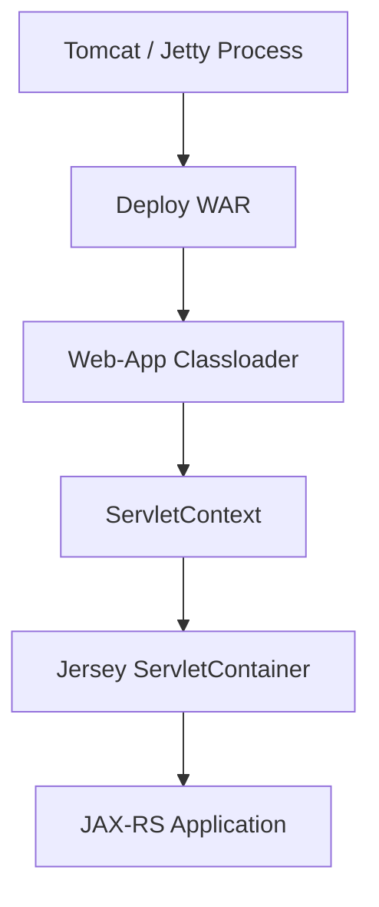

Container owns process and deployment lifecycle. Shared libraries and hot redeploy increase classloader complexity.

### Embedded container + executable JAR

```mermaid
flowchart TD
    Main[main()] --> Configure[Configure Server / Connector]
    Configure --> Register[Register Jersey]
    Register --> Start[Start Runtime]
    Start --> Ready[Readiness]
    Ready --> Stop[Drain and Stop]
```

Application owns bootstrap, security limits, access logs, health, shutdown, and cleanup.

### Internal platform wrapper

A company runtime library may hide Tomcat/Jetty and expose only standardized settings. Verify the underlying runtime and lifecycle owner rather than assuming wrapper semantics.

---

## WAR anatomy dan dependency placement

Typical archive:

```text
service.war
├── META-INF/
├── WEB-INF/
│   ├── web.xml
│   ├── classes/
│   └── lib/
└── static-resources/
```

Review questions:

- Is `jakarta.servlet-api` bundled when external container provides it?
- Is Jersey provided by runtime or application?
- Are multiple JSON providers bundled?
- Is the JDBC driver server-wide or application-local?
- Are environment secrets accidentally packaged?
- Is static content exposed under the default servlet?

Useful evidence:

```bash
mvn -q dependency:tree
jar tf target/service.war | sort
unzip -l target/service.war
```

---

## ServletContext lifecycle

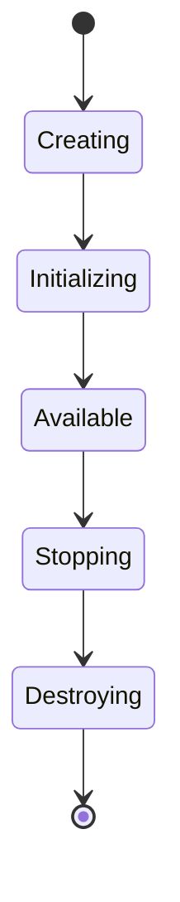

Container creates one context per deployed web application, establishes classloader/configuration, initializes listeners/filters/servlets, then destroys them during stop or undeploy.

Application invariants:

- do not retain `ServletContext` or web-app classes from parent/global static state;
- close application-owned clients and executors;
- clear `ThreadLocal` state;
- do not close container-owned resources;
- fail startup when mandatory invariants are invalid.

```java
@WebListener
public final class ApplicationLifecycleListener
        implements ServletContextListener {

    @Override
    public void contextInitialized(ServletContextEvent event) {
        // Validate mandatory configuration.
    }

    @Override
    public void contextDestroyed(ServletContextEvent event) {
        // Stop application-owned resources in dependency order.
    }
}
```

---

## Servlet, Filter, dan Listener lifecycle

### Servlet

```text
construct → init(ServletConfig) → service(...) concurrently → destroy()
```

A servlet instance normally handles many requests concurrently. Request-specific mutable data must not live in instance fields.

### Filter

```text
construct → init(FilterConfig) → doFilter(...) concurrently → destroy()
```

A filter may inspect/wrap/reject, call `chain.doFilter()` once, then perform post-processing.

### Listener

Listeners observe context, request, session, and attribute lifecycle. Keep them lightweight and infrastructure-oriented; do not hide domain workflows inside callbacks.

Unsafe pattern:

```java
public final class UnsafeFilter implements Filter {
    private String currentTenant; // shared across requests
}
```

Safe request state belongs in method locals, request attributes, or a properly managed request scope.

---

## Dispatcher types dan duplicate execution

| Dispatcher | Meaning |
|---|---|
| `REQUEST` | Initial client dispatch |
| `ASYNC` | Redispatch from `AsyncContext` |
| `FORWARD` | Server-side forward |
| `INCLUDE` | Included resource |
| `ERROR` | Container error dispatch |

```java
@WebFilter(
    urlPatterns = "/*",
    dispatcherTypes = {
        DispatcherType.REQUEST,
        DispatcherType.ASYNC,
        DispatcherType.ERROR
    },
    asyncSupported = true
)
public final class CorrelationFilter implements Filter {
}
```

A single logical request can traverse a filter multiple times. Instrumentation must be dispatcher-aware and idempotent.

Failure examples:

- duplicate spans;
- correlation ID overwritten;
- authorization run twice with different context;
- duplicate headers;
- metrics counted per dispatch rather than per logical request.

---

## Servlet dan filter mapping

Common servlet mappings:

| Mapping | Example |
|---|---|
| exact | `/health` |
| path | `/api/*` |
| extension | `*.action` |
| default | `/` |

Filter mapping also includes servlet name and dispatcher types.

```xml
<servlet-mapping>
  <servlet-name>Jersey</servlet-name>
  <url-pattern>/api/*</url-pattern>
</servlet-mapping>
```

Mapping questions:

- Does an exact servlet mapping win before Jersey?
- Does the default servlet serve static content under the same path?
- Is Jersey mapped as `/` or `/*`?
- Is an error dispatch routed back through the same filter chain?
- Is programmatic registration duplicating descriptor registration?

---

## Path composition dan proxy rewrite

Final external URI may involve:

```text
gateway route
+ rewrite
+ web context path
+ servlet mapping
+ @ApplicationPath
+ resource @Path
+ method @Path
```

Inspect actual fields:

```java
request.getRequestURI();
request.getContextPath();
request.getServletPath();
request.getPathInfo();
request.getDispatcherType();
```

Do not infer path from source annotations alone. Gateway and ingress rewrites may remove or add prefixes.

A 404 can originate from:

```text
gateway → virtual host → context → servlet mapping
→ Jersey application path → resource matching
```

---

## Jersey ServletContainer integration

Jersey `ServletContainer` can act as Servlet or Filter. Conceptually it:

1. receives Servlet initialization;
2. resolves `Application`/`ResourceConfig`;
3. builds the Jersey application model;
4. adapts Servlet request/response;
5. exposes supported Servlet objects through `@Context`;
6. invokes Jersey matching/filter/provider/resource pipeline;
7. participates in async completion;
8. shuts down Jersey components when container stops.

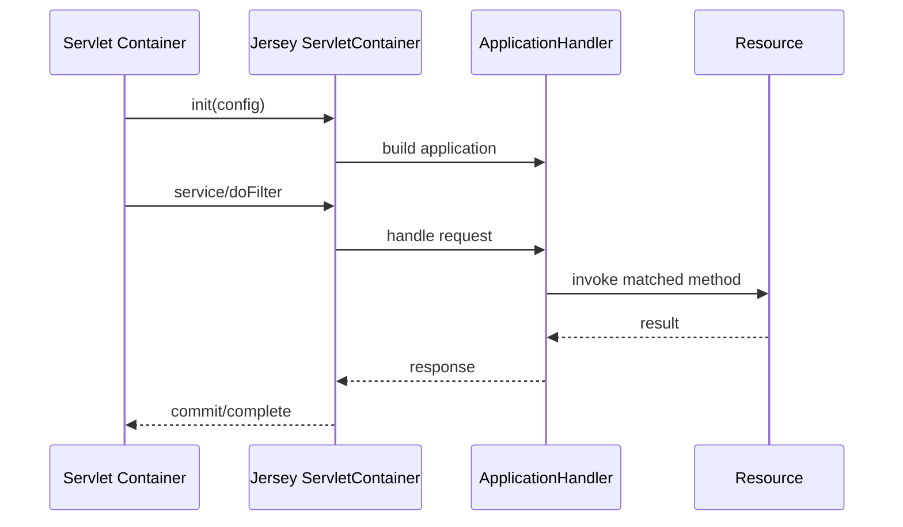

---

## Jersey as Servlet versus Filter

| Servlet mode | Filter mode |
|---|---|
| Jersey owns a clear mapped API path | Jersey overlays an existing web application |
| Simpler routing and ownership | Flexible mixed legacy/static content |
| Fewer forwarding ambiguities | Filter order and fallback behavior are critical |
| Natural default for API-only service | Use only when integration requires it |

Filter mode risks:

- shadowing static resources or other servlets;
- forwarding-on-404 surprises;
- wrong filter context path;
- inconsistent async support;
- ambiguous ownership of response.

Prefer Servlet mode when Jersey owns a dedicated API namespace.

---

## Bootstrap: web.xml, programmatic, ApplicationPath

### Descriptor

```xml
<servlet>
  <servlet-name>QuoteOrderApi</servlet-name>
  <servlet-class>org.glassfish.jersey.servlet.ServletContainer</servlet-class>
  <init-param>
    <param-name>jakarta.ws.rs.Application</param-name>
    <param-value>com.example.api.QuoteOrderApplication</param-value>
  </init-param>
  <load-on-startup>1</load-on-startup>
  <async-supported>true</async-supported>
</servlet>
<servlet-mapping>
  <servlet-name>QuoteOrderApi</servlet-name>
  <url-pattern>/api/*</url-pattern>
</servlet-mapping>
```

### Annotation

```java
@ApplicationPath("/api")
public final class QuoteOrderApplication extends Application {
}
```

### Programmatic registration

```java
ServletRegistration.Dynamic jersey = context.addServlet(
    "QuoteOrderApi",
    new ServletContainer(new QuoteOrderResourceConfig()));
jersey.setLoadOnStartup(1);
jersey.setAsyncSupported(true);
jersey.addMapping("/api/*");
```

Select one explicit bootstrap model. Mixing descriptor, scanning, annotation discovery, and programmatic registration creates duplicate or environment-dependent behavior.

---

## Servlet context injection into Jersey

Servlet deployment can expose:

- `HttpServletRequest`;
- `HttpServletResponse`;
- `ServletContext`;
- `ServletConfig` or `FilterConfig`;
- Jersey `WebConfig`.

```java
@Path("/diagnostics")
public final class DiagnosticsResource {
    @Context
    HttpServletRequest request;

    @GET
    public Map<String, String> inspect() {
        return Map.of(
            "contextPath", request.getContextPath(),
            "servletPath", request.getServletPath(),
            "dispatcher", request.getDispatcherType().name());
    }
}
```

Prefer portable JAX-RS abstractions where sufficient:

- `UriInfo`;
- `HttpHeaders`;
- `SecurityContext`;
- `Request`;
- `Configuration`.

Servlet-specific injection reduces runtime portability and requires Servlet-based tests.

---

## End-to-end request lifecycle

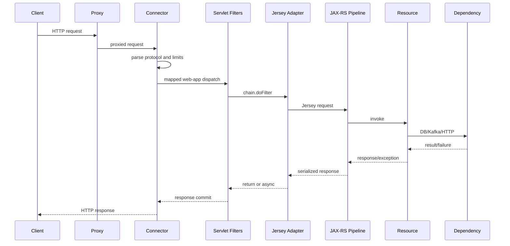

A resource breakpoint not hit does not prove request never reached the process. Rejection may happen at TLS, connector parsing, limits, host/context mapping, filters, Jersey pre-matching, or entity decoding.

---

## Tomcat architecture dan request pipeline

Conceptual hierarchy:

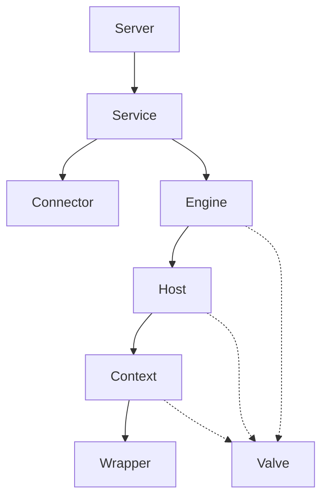

Simplified request path:

```text
socket → endpoint/protocol handler → adapter
→ Engine → Host → Context → Wrapper pipelines
→ Servlet filter chain → Jersey servlet
```

Key Tomcat concepts are implementation-specific:

- `Connector`;
- `Engine`;
- `Host`;
- `Context`;
- `Wrapper`;
- `Valve`;
- shared `Executor`.

Debug by locating the first layer with evidence of the request.

---

## Tomcat connectors, executors, dan capacity

Connector settings influence:

- address/port;
- HTTP protocol;
- TLS;
- keep-alive;
- connection/request limits;
- header/body limits;
- compression;
- proxy scheme/port;
- timeout;
- executor/thread integration.

Important distinction:

```text
accepted connections
≠ active request threads
≠ queued requests
≠ DB connections
≠ downstream concurrency
```

Increasing worker threads while DB pool remains small can convert fast rejection into slow timeout amplification.

Map:

```text
connector → executor → web apps → endpoint cost
→ DB/client pools → CPU/memory/network
```

---

## Tomcat Valve versus Servlet Filter versus JAX-RS Filter

| Layer | Portability | Typical purpose |
|---|---:|---|
| Tomcat Valve | Tomcat-only | access log, remote address normalization, container security |
| Servlet Filter | Servlet-portable | web-app auth bridge, request wrappers, common headers |
| JAX-RS Filter | Jakarta REST-portable | API-specific auth, route metadata, resource-bound policies |

Place logic at the narrowest correct boundary.

Anti-pattern:

```text
correlation ID generated independently in Valve,
Servlet Filter, and JAX-RS Filter
```

This causes competing IDs and fragmented traces.

---

## Jetty architecture dan request pipeline

Jetty core model:

```text
Server + ThreadPool + Connectors + Handlers
```

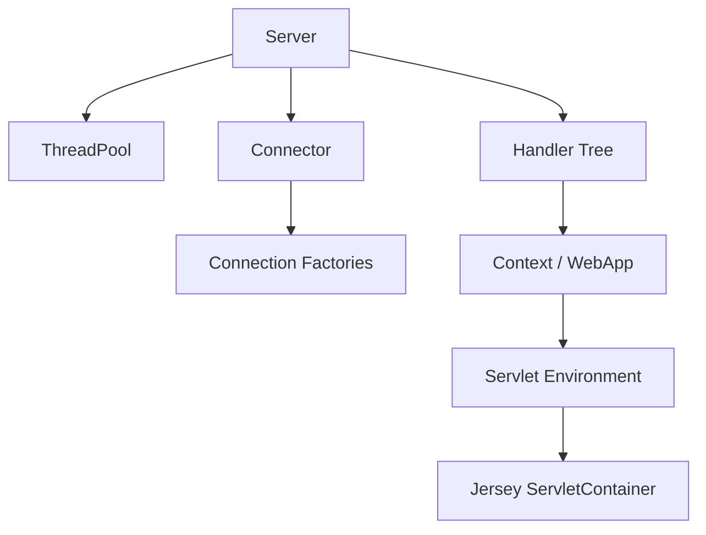

Jetty 12 supports core Handler-based applications and multiple Jakarta EE web environments. Presence of Jetty does not prove Servlet is used.

Simplified Servlet path:

```text
connection → protocol parser → execution strategy/thread pool
→ handler tree → context → servlet filters
→ Jersey adapter → JAX-RS
```

---

## Jetty thread pool, handlers, dan environment alignment

Operational dimensions:

- connector and protocol factories;
- handler tree;
- context mapping;
- `QueuedThreadPool` or configured execution model;
- reserved capacity;
- request logging;
- forwarded-request customization;
- stop timeout;
- Servlet/Jakarta environment modules.

Avoid mixing Jetty `ee8`, `ee9`, `ee10`, or `ee11` artifacts. Align:

```text
Java version
Jetty major/minor
Jakarta Servlet level
Jersey Servlet module
Jakarta namespace
```

Do not tune Jetty threads using Tomcat terminology or assumptions.

---

## Tomcat versus Jetty

| Dimension | Tomcat | Jetty |
|---|---|---|
| Core identity | Servlet/JSP container | Embeddable server with handler and Servlet environments |
| Hierarchy | Engine/Host/Context/Wrapper | Server/Connector/Handler/Context |
| Pre-web extension | Valve | Handler |
| Embedded support | Supported | Strongly compositional |
| Thread model terms | connector executor/protocol | thread pool/execution strategy |
| Non-Servlet API | mostly container internals | first-class core Handler API |

Do not claim one is universally faster. Compare using:

- actual workload;
- version;
- TLS/protocol needs;
- blocking profile;
- deployment model;
- operational tooling;
- support and patching model.

---

## Thread ownership, blocking, dan backpressure

Potential waiting points:

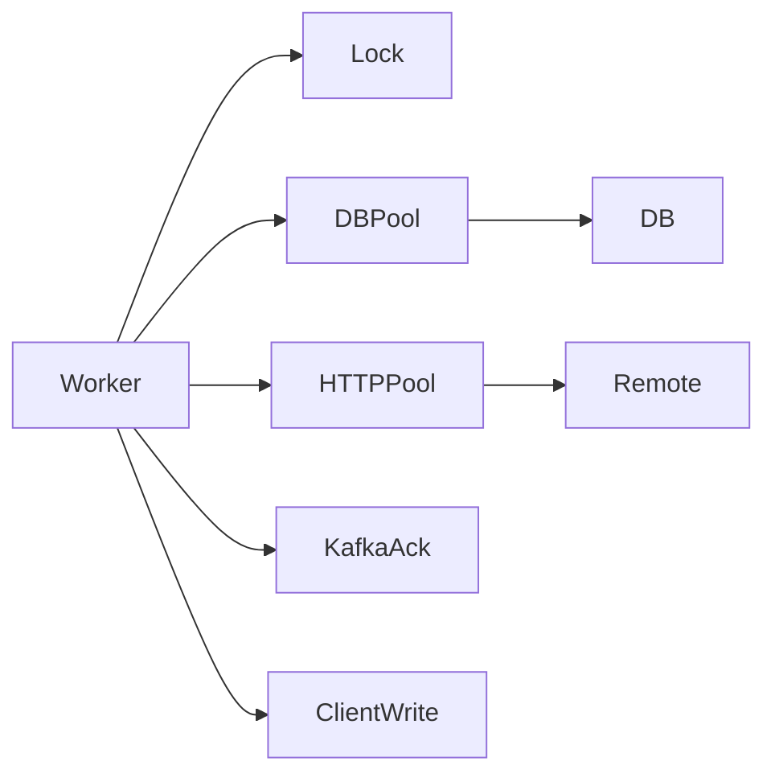

Invariant:

```text
request concurrency must be bounded by constrained dependencies,
not only by container maximum threads
```

Example:

```text
200 request threads
20 DB connections
unbounded incoming queue
5s DB acquisition timeout
```

This can produce 180 waiting threads, rising p99, retry storms, and starvation of lightweight endpoints.

Controls:

- bounded queues;
- bulkheads;
- route-level concurrency limits;
- aligned pool sizes;
- timeout budgets;
- load shedding;
- cancellation;
- separate management capacity where justified.

---

## Servlet async processing

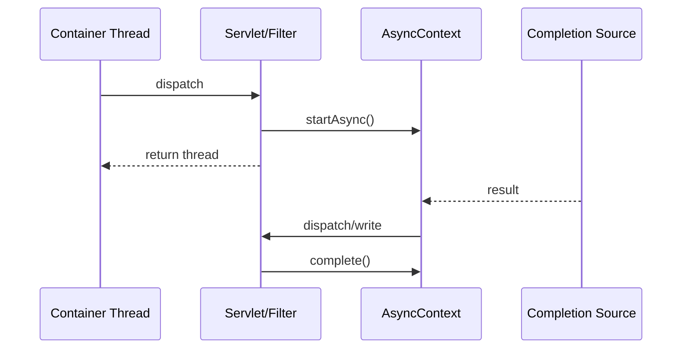

Rules:

- every filter/servlet in path must support async;
- async request has timeout lifecycle;
- `ASYNC` redispatch may run filters again;
- completion/error/timeout cleanup is mandatory;
- async releases a thread but retains connection/request state;
- moving blocking work to an unbounded executor is not backpressure.

Questions:

- Which executor completes the operation?
- Is MDC/OpenTelemetry/security context propagated?
- Can downstream work be cancelled?
- Is completion exactly once?
- What happens on client disconnect?

---

## Timeout hierarchy dan cancellation

Typical hierarchy:

```text
client
→ gateway
→ load balancer idle timeout
→ connector
→ Servlet async
→ JAX-RS/application deadline
→ HTTP client
→ DB statement/lock timeout
```

Bad:

```text
gateway timeout 30s
downstream timeout 60s
```

The client receives an error while server work continues, potentially committing a mutation that gets retried.

Collect timestamps for:

- request accepted;
- filter/Jersey/resource start;
- downstream start/end;
- response commit;
- gateway timeout;
- cancellation;
- async complete.

Network cancellation and business cancellation are different contracts.

---

## Request, response, dan stream ownership

Container owns `HttpServletRequest` and `HttpServletResponse` lifecycle.

Do not:

- store request/response in singleton fields;
- access after sync completion or async completion;
- write after response committed;
- close container-owned streams contrary to framework contract;
- use request objects from arbitrary threads without async contract.

Response can commit when buffer fills or stream is flushed. After commit:

- status and headers may no longer change;
- exception mapper/error page may not replace response;
- client may receive partial body.

Telemetry should distinguish pre-commit failure, post-commit failure, and client disconnect.

---

## Sessions, cookies, dan stateless services

Servlet sessions are valid but should be intentional.

Distributed risks:

- sticky sessions;
- replication overhead;
- serialization incompatibility;
- memory growth;
- stale state;
- failover complexity;
- coupling auth and mutable server state.

Mutable quote/order state generally belongs in durable domain storage, workflow state, event log, or explicit cache—not implicit `HttpSession`.

Cookie review:

- `Secure`;
- `HttpOnly`;
- `SameSite`;
- path/domain;
- expiry/rotation;
- proxy TLS awareness;
- signing/encryption;
- logout/invalidation.

---

## Classloading dan duplicate APIs

Conceptual hierarchy:

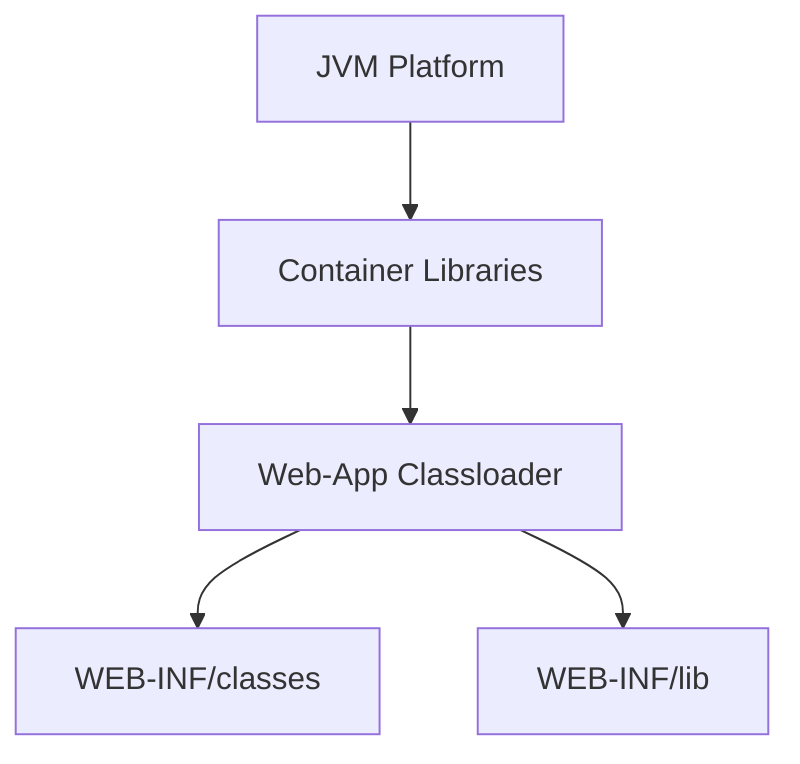

Common failures:

- `ClassNotFoundException`;
- `NoClassDefFoundError`;
- `NoSuchMethodError`;
- `AbstractMethodError`;
- `LinkageError`;
- same-name `ClassCastException`;
- `javax.*`/`jakarta.*` mismatch.

Invariant:

```text
class identity = class name + defining classloader
```

Verify whether Servlet/Jersey/CDI/JSON libraries are container-provided or application-local. Do not bundle duplicate API/implementation sets without an explicit compatibility plan.

---

## Authentication, proxy, dan TLS boundaries

Possible security layers:

```text
gateway authentication
container security
Servlet filter
JAX-RS filter
domain authorization
database tenant predicate
```

Trusted proxy metadata affects:

- scheme;
- host;
- port;
- client IP;
- secure cookies;
- generated links;
- OAuth redirects;
- audit;
- rate limits.

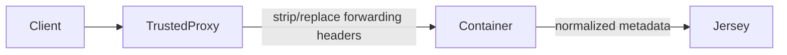

Never trust `X-Forwarded-*`, user, tenant, or certificate headers from arbitrary clients. Restrict direct access and trust only controlled proxy ranges.

---

## Error dispatch dan observability

Errors can be owned by:

- connector/protocol parser;
- container error dispatch;
- Servlet filter;
- Jersey `ExceptionMapper`;
- response writer;
- gateway timeout.

Evidence sources answer different questions:

| Source | Question |
|---|---|
| LB/container access log | Did HTTP reach/leave this boundary? |
| Servlet filter log | Did request enter web app? |
| Jersey tracing | Did matching/provider/resource execute? |
| application log | Which domain operation occurred? |
| distributed trace | Which dependency caused latency/failure? |
| metrics | Is the problem systemic? |

Do not expose stack traces. Preserve trace/correlation IDs and classify post-commit failures separately.

---

## Startup, readiness, shutdown, dan redeploy

Startup:

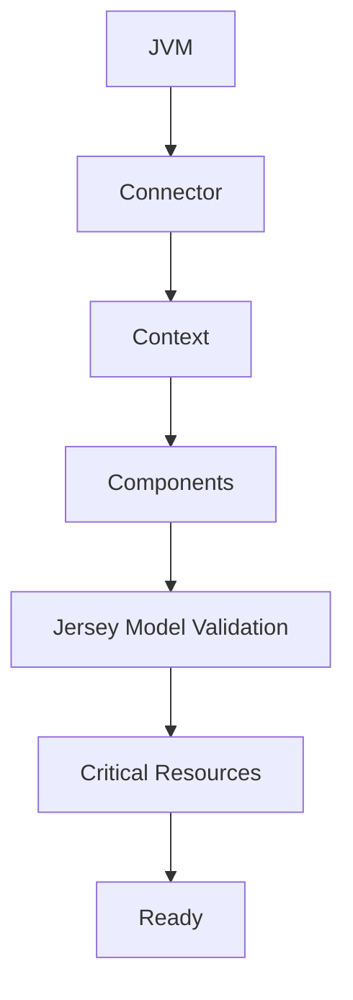

Port listening is not readiness.

Graceful shutdown:

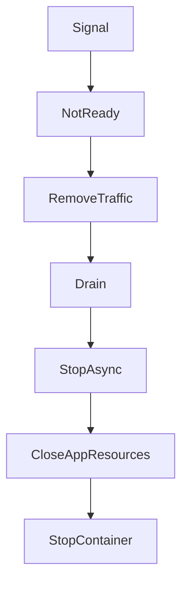

Close dependency pools only after in-flight users stop.

Redeploy leak sources:

- non-daemon threads;
- executors/schedulers;
- `ThreadLocal`;
- HTTP/Kafka clients;
- JDBC/logging/MBean registries;
- parent-classloader static caches;
- shutdown hooks per deployment.

Kubernetes process replacement reduces hot-redeploy frequency but does not remove cleanup requirements.

---

## Capacity dan performance review

Key resources:

```text
connections
container threads
request queue
heap/native buffers
DB/client pools
CPU quota
file descriptors
network bandwidth
```

Little's Law intuition:

```text
concurrency ≈ throughput × latency
```

At 100 requests/s and 2 seconds latency, approximately 200 concurrent requests are retained somewhere.

Review:

- p95/p99 service and queue time;
- compression CPU;
- slow-client writes;
- request buffering;
- async in-flight count;
- DB/client pool alignment;
- CPU throttling;
- access-log overhead;
- file-descriptor limits.

---

## Architecture patterns dan anti-patterns

### Patterns

1. Explicit Jersey servlet mapping with explicit `Application`/`ResourceConfig`.
2. Embedded single-service container with source-controlled bootstrap.
3. Internal runtime wrapper with observable effective configuration.
4. Request-boundary normalization for proxy metadata, identity, and correlation.
5. Dedicated management capacity where business saturation must not hide health.

### Anti-patterns

- treating Jersey as connector owner;
- multiple implicit bootstraps;
- mutable request state in component fields;
- unbounded worker threads;
- trusting all forwarded headers;
- duplicate logic across Valve, Servlet Filter, and JAX-RS Filter;
- async without cancellation;
- readiness equal to open port;
- closing container-owned resources;
- relying on defaults as architecture decisions.

---

## Failure-model matrix

| Failure | Layer | Symptoms | Evidence | Mitigation |
|---|---|---|---|---|
| bind/TLS failure | connector | startup/no app logs | connector/LB logs | fail fast, correct network/certs |
| header/body limit | connector/filter | 4xx before Jersey | access/error log | explicit documented limits |
| wrong context/mapping | container | 404/default content | mapping/path fields | one explicit path model |
| filter blocks chain | Servlet | empty/partial response | filter trace | intentional response or chain |
| duplicate filter dispatch | async/error | duplicate spans/headers | dispatcher type | idempotent dispatch handling |
| async unsupported | chain config | `IllegalStateException` | stack/config | async support end-to-end |
| Jersey bootstrap failure | Jersey | deploy/first request fails | model/startup logs | eager validation |
| classloader collision | packaging | linkage errors | dependency/class source | align scopes/versions |
| worker saturation | container | latency/timeouts | thread/pool metrics | bounds and bulkheads |
| proxy mismatch | boundary | wrong scheme/IP/cookie | metadata comparison | trusted normalization |
| post-commit failure | response | partial body/reset | committed/write logs | prevalidate, stream protocol |
| early pool close | shutdown | in-flight 5xx | shutdown timeline | readiness-first drain |
| redeploy leak | classloader | duplicate jobs/metaspace | thread/heap dump | cleanup owned resources |

---

## Debugging playbook

### External 404

1. Confirm DNS/LB target.
2. Check LB and container access logs.
3. Record external/internal path rewrite.
4. Inspect context path and servlet mapping.
5. Inspect application/resource paths.
6. Enable safe Jersey tracing in a controlled environment.
7. Add real Servlet-deployment regression test.

### Hanging requests

Collect together:

- thread dump;
- connector/thread-pool metrics;
- DB/client pool metrics;
- CPU throttling;
- lock data;
- async request count;
- downstream latency;
- timeout timeline.

### Works embedded, fails external

Compare classloader, API versions, archive contents, scanning, mappings, managed resources, proxy path, and CDI/HK2 integration.

### Shutdown 5xx

Build timeline from termination signal through readiness false, endpoint removal, last new request, resource closure, and forced kill. Fix ordering rather than only increasing grace period.

---

## PR review checklist

### Packaging/runtime

- [ ] Runtime and deployment model are explicit.
- [ ] Java/Servlet/Jersey/container versions align.
- [ ] API scope and archive contents are correct.
- [ ] Duplicate implementations are absent.

### Bootstrap/routing

- [ ] One Jersey bootstrap model.
- [ ] Context, servlet, application, and resource paths documented.
- [ ] Mapping tested after proxy rewrite.
- [ ] Startup validation is eager enough.

### Filters/async

- [ ] Filter order and dispatcher types are deterministic.
- [ ] Filters are thread-safe.
- [ ] Async support is end-to-end.
- [ ] Context propagation and completion-once behavior are tested.
- [ ] Cross-layer logic is not duplicated.

### Security/operations

- [ ] Trusted proxy policy exists.
- [ ] Principal/role bridge is defined.
- [ ] Readiness and shutdown ordering are tested.
- [ ] Access logs, pool metrics, and traces exist.
- [ ] Sensitive headers/bodies are redacted.
- [ ] Client disconnect and post-commit failures are classified.

---

## Trade-off yang harus dipahami senior engineer

| Decision | Option A | Option B |
|---|---|---|
| Packaging | External WAR: centralized runtime, shared-library risk | Embedded: app-owned bootstrap, stronger isolation |
| Jersey integration | Servlet: clear API namespace | Filter: legacy/mixed-content flexibility |
| Processing | Sync: simpler lifecycle | Async: releases thread, adds completion complexity |
| Libraries | Container-wide: centralized patching, broad blast radius | App-local: independent versioning, larger artifact |
| Capacity | More threads: temporary utilization | Backpressure: controlled overload and dependency protection |

Principal-level question:

> Di mana overload ditolak, siapa pemilik queue, dan apakah unit tersebut benar-benar bounded?

---

## Internal verification checklist

### Runtime and artifact

- [ ] Tomcat, Jetty, GlassFish, Grizzly, atau wrapper lain?
- [ ] Exact versions and Java vendor.
- [ ] WAR versus embedded JAR.
- [ ] Final archive/image inventory.
- [ ] Main class/startup command.
- [ ] Runtime owner.

### Bootstrap and routing

- [ ] `web.xml`, web fragments, initializers, listeners.
- [ ] `@ApplicationPath` and `ResourceConfig`.
- [ ] Package scanning.
- [ ] Context/servlet/filter mapping.
- [ ] Gateway and ingress rewrites.
- [ ] Static/default servlet interaction.

### Container specifics

- [ ] Tomcat connectors/executors/Valves/access log, if used.
- [ ] Jetty connectors/handlers/thread pool/environment modules, if used.
- [ ] Classloader delegation and shared libraries.
- [ ] Forwarded-header normalization.
- [ ] Request/header/body/timeout limits.

### Lifecycle and capacity

- [ ] Filter order, dispatcher types, async flags.
- [ ] Thread pools and queues.
- [ ] DB/HTTP-client pools.
- [ ] Readiness gate.
- [ ] Shutdown/drain sequence.
- [ ] Redeploy or process-replacement policy.
- [ ] Saturation dashboards and runbooks.

### Evidence sources

- [ ] dependency tree;
- [ ] archive and image contents;
- [ ] server config;
- [ ] Kubernetes manifests;
- [ ] startup/access logs;
- [ ] thread dumps;
- [ ] historical incidents/PRs;
- [ ] onboarding discussions with platform owners.

---

## Latihan verifikasi

1. Prove the actual runtime from process, image, logs, ports, and dependencies.
2. Decompose one external endpoint into every path prefix and rewrite.
3. Deploy Jersey as Servlet and Filter; compare fallback and 404 behavior.
4. Trace `REQUEST`, `ASYNC`, and `ERROR` filter invocations.
5. Reproduce `asyncSupported=false` failure.
6. Saturate a bounded dependency and correlate thread/queue metrics.
7. Simulate TLS termination and trusted forwarded headers.
8. Reproduce classloader/API collision.
9. Test readiness-first graceful shutdown during a mutation.
10. Create and fix a redeploy thread leak.
11. Run the same Jersey tests on Tomcat and Jetty.
12. Correlate LB, container, Servlet, Jersey, application, and trace evidence.

---

## Ringkasan

Mental model:

```text
Tomcat or Jetty receives and dispatches HTTP through a Servlet runtime.
Jersey ServletContainer adapts that request into Jakarta REST processing.
Servlet and Jersey lifecycles interact but have distinct owners.
```

Key invariants:

1. Jersey is not the connector in Servlet deployment.
2. Context path, servlet mapping, application path, and resource path are separate.
3. Servlet Filter, Tomcat Valve, Jetty Handler, and JAX-RS Filter are different pipelines.
4. Container components are concurrent.
5. Async releases a thread but does not automatically cancel work.
6. Forwarded metadata is trusted only from controlled proxies.
7. Connector threads and downstream pools must be capacity-aligned.
8. Response commitment limits error recovery.
9. Startup readiness and graceful shutdown are lifecycle contracts.
10. Runtime details must be proven from executable evidence, not dependency names.

---

## Referensi resmi

- [Jakarta Servlet 6.1 Specification](https://jakarta.ee/specifications/servlet/6.1/)
- [Jakarta Servlet 6.1 API](https://jakarta.ee/specifications/servlet/6.1/apidocs/)
- [Jakarta RESTful Web Services 4.0](https://jakarta.ee/specifications/restful-ws/4.0/)
- [Jersey Deployment Guide](https://eclipse-ee4j.github.io/jersey.github.io/documentation/latest31x/deployment.html)
- [Jersey ServletContainer API](https://eclipse-ee4j.github.io/jersey.github.io/apidocs/latest31x/jersey/org/glassfish/jersey/servlet/ServletContainer.html)
- [Apache Tomcat 11 Documentation](https://tomcat.apache.org/tomcat-11.0-doc/)
- [Apache Tomcat Architecture](https://tomcat.apache.org/tomcat-11.0-doc/architecture/overview.html)
- [Apache Tomcat Configuration Reference](https://tomcat.apache.org/tomcat-11.0-doc/config/)
- [Eclipse Jetty 12.1 Documentation](https://jetty.org/docs/jetty/12.1/)
- [Jetty HTTP Server Libraries](https://jetty.org/docs/jetty/12.1/programming-guide/server/http.html)
- [Jetty Threading Architecture](https://jetty.org/docs/jetty/12.1/programming-guide/arch/threads.html)
