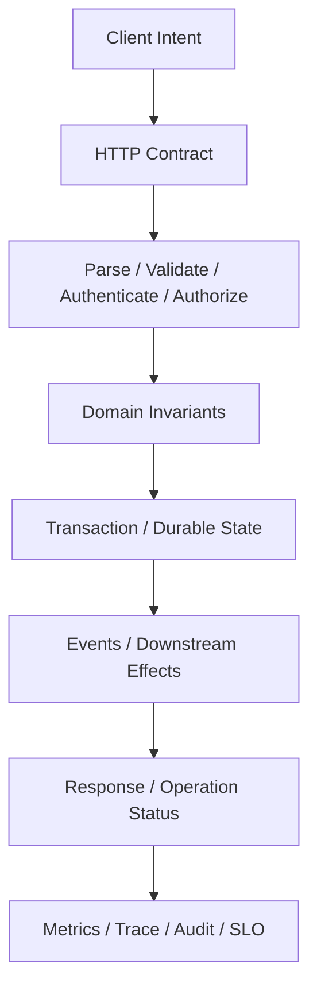
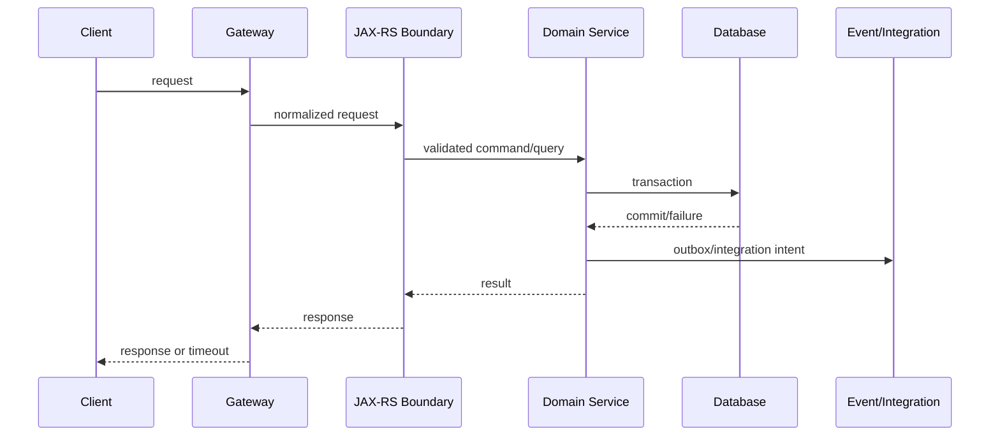
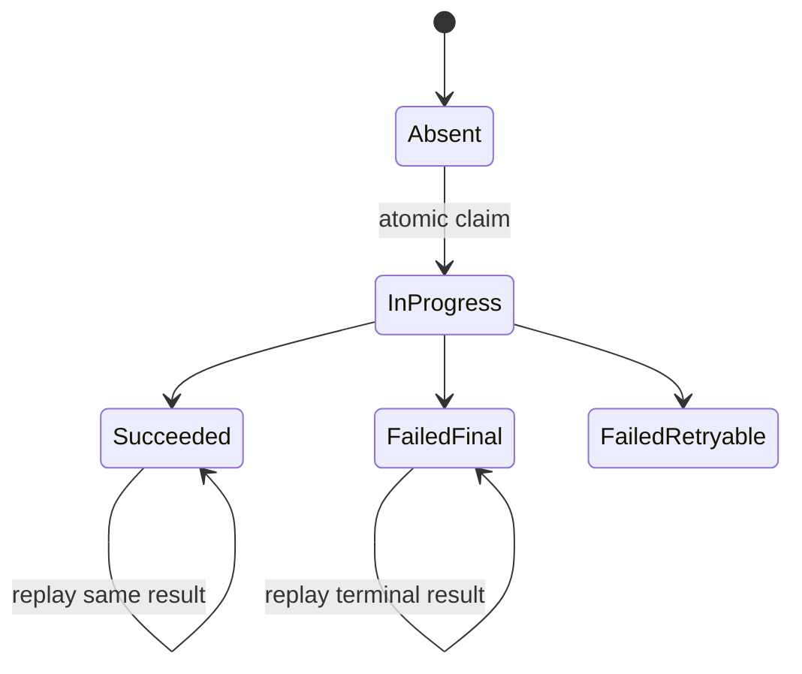
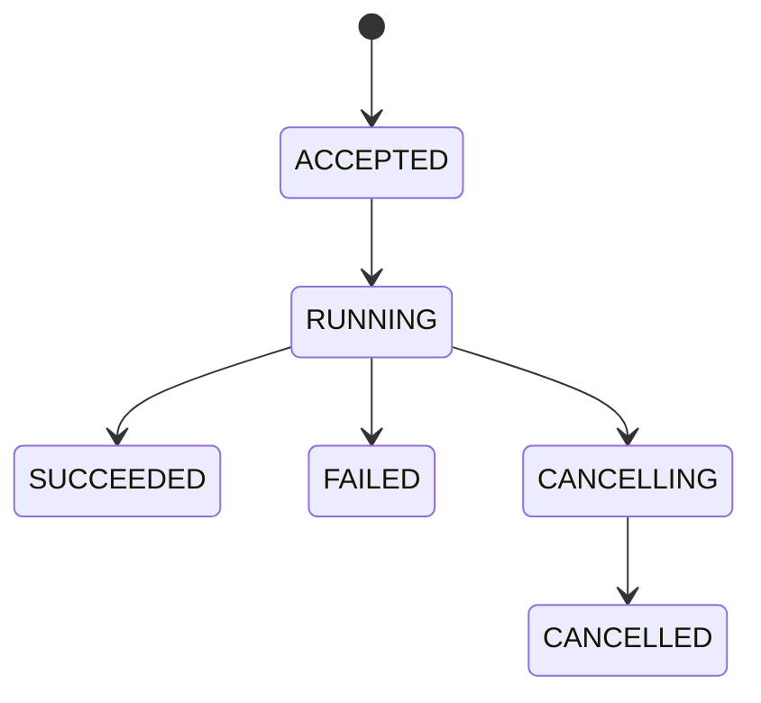

# Part 014 — Production-Grade HTTP Endpoint Engineering

> Endpoint production bukan sekadar method Java yang diberi `@GET` atau `@POST`. Endpoint adalah **kontrak distribusi** yang harus tetap bermakna ketika request diulang, response hilang, client dan server berbeda versi, data berubah concurrent, downstream gagal, dan deployment berjalan bertahap. Desain dimulai dari semantics dan invariant, bukan annotation.

## Daftar Isi

1. [Target kompetensi](#target-kompetensi)
2. [Scope dan baseline](#scope-dan-baseline)
3. [Mental model: endpoint as distributed contract](#mental-model-endpoint-as-distributed-contract)
4. [Endpoint lifecycle dan ambiguous outcomes](#endpoint-lifecycle-dan-ambiguous-outcomes)
5. [Five endpoint contracts](#five-endpoint-contracts)
6. [Resource dan URI modelling](#resource-dan-uri-modelling)
7. [HTTP method semantics](#http-method-semantics)
8. [Safe, idempotent, dan retry-safe](#safe-idempotent-dan-retry-safe)
9. [Command versus query](#command-versus-query)
10. [Request dan response DTO design](#request-dan-response-dto-design)
11. [Status-code strategy](#status-code-strategy)
12. [Header strategy](#header-strategy)
13. [Create operations](#create-operations)
14. [Read operations dan representations](#read-operations-dan-representations)
15. [PUT, PATCH, dan DELETE semantics](#put-patch-dan-delete-semantics)
16. [Business actions dan state transitions](#business-actions-dan-state-transitions)
17. [Bulk operations](#bulk-operations)
18. [Pagination](#pagination)
19. [Filtering, sorting, dan sparse fields](#filtering-sorting-dan-sparse-fields)
20. [Content negotiation](#content-negotiation)
21. [Cache-Control, ETag, dan conditional GET](#cache-control-etag-dan-conditional-get)
22. [Optimistic concurrency dan lost-update prevention](#optimistic-concurrency-dan-lost-update-prevention)
23. [Idempotency keys](#idempotency-keys)
24. [Duplicate requests dan outcome recovery](#duplicate-requests-dan-outcome-recovery)
25. [Validation, authorization, dan tenant boundaries](#validation-authorization-dan-tenant-boundaries)
26. [Temporal dan monetary correctness](#temporal-dan-monetary-correctness)
27. [Transaction boundary dan integration consistency](#transaction-boundary-dan-integration-consistency)
28. [Read-after-write dan consistency](#read-after-write-dan-consistency)
29. [Long-running operations dan 202](#long-running-operations-dan-202)
30. [Error model](#error-model)
31. [Rate limiting, timeout, dan overload](#rate-limiting-timeout-dan-overload)
32. [Versioning, compatibility, dan deprecation](#versioning-compatibility-dan-deprecation)
33. [OpenAPI dan contract governance](#openapi-dan-contract-governance)
34. [Security hardening](#security-hardening)
35. [Logging, metrics, tracing, dan audit](#logging-metrics-tracing-dan-audit)
36. [Performance dan scalability](#performance-dan-scalability)
37. [Test strategy](#test-strategy)
38. [Architecture patterns dan anti-patterns](#architecture-patterns-dan-anti-patterns)
39. [Failure-model matrix](#failure-model-matrix)
40. [Debugging playbook](#debugging-playbook)
41. [PR review checklist](#pr-review-checklist)
42. [Trade-off yang harus dipahami senior engineer](#trade-off-yang-harus-dipahami-senior-engineer)
43. [Internal verification checklist](#internal-verification-checklist)
44. [Latihan verifikasi](#latihan-verifikasi)
45. [Ringkasan](#ringkasan)
46. [Referensi resmi](#referensi-resmi)

---

## Target kompetensi

Setelah menyelesaikan part ini, Anda harus mampu:

- mendefinisikan endpoint dari business invariant dan HTTP semantics;
- membedakan safe, idempotent, dan retry-safe operations;
- memilih `GET`, `POST`, `PUT`, `PATCH`, dan `DELETE` berdasarkan contract;
- membuat status-code dan header strategy yang konsisten;
- mendesain create, read, replace, partial update, delete, action, dan bulk endpoints;
- mencegah duplicate mutations melalui natural idempotency atau idempotency keys;
- menangani ambiguous outcome ketika response hilang setelah mutation;
- menggunakan ETag dan preconditions untuk caching serta lost-update prevention;
- merancang pagination yang stabil di tengah concurrent writes;
- menempatkan validation, authorization, tenancy, dan transaction boundaries;
- mendesain long-running operation yang durably accepted dan reconcilable;
- membuat error contract yang stabil, aman, machine-readable, dan operable;
- melakukan compatibility, failure, performance, security, dan PR review.

---

## Scope dan baseline

Part ini menggunakan:

- HTTP semantics modern;
- Jakarta REST 4.x;
- Java 17+;
- multi-instance enterprise services;
- gateways, retries, timeouts, and asynchronous dependencies;
- illustrative CPQ/quote/order examples.

Part ini tidak mengklaim detail internal CSG. Internal conventions untuk API governance, idempotency, error codes, tenancy, transactions, and rollout harus diverifikasi.

Endpoint production adalah durable public/internal contract. Refactoring Java tidak boleh mengubah semantics secara tidak sengaja.

---

## Mental model: endpoint as distributed contract



Endpoint harus menjawab:

```text
What does this operation mean?
Who may perform it?
Which state/invariant changes?
Can it be repeated safely?
When is success durable?
What if the response is lost?
How does a client recover?
How can an operator prove the outcome?
How can the contract evolve?
```

Status code saja bukan kontrak. Kontrak juga mencakup representation, headers, retry behavior, consistency, authorization, and observability.

---

## Endpoint lifecycle dan ambiguous outcomes



Possible combinations:

| Client sees | Durable state | Meaning |
|---|---|---|
| success | committed | clear success |
| controlled error | unchanged | clear failure if guaranteed |
| timeout/reset | unchanged | ambiguous |
| timeout/reset | committed | ambiguous success |
| 5xx | committed before response failure | dangerous ambiguity |

Mutating endpoint design must provide outcome lookup or idempotent replay.

---

## Five endpoint contracts

### Transport

Method, URI, media types, headers, status codes, caching, size limits, timeout.

### Data

Fields, types, required/optional/null, enums, precision, dates, schema evolution.

### Behavioral

State transition, side effects, ordering, idempotency, consistency, retry semantics.

### Security

Identity, permission, object access, tenant, masking, audit.

### Operational

SLO, rate limits, telemetry, runbooks, ownership, deprecation.

OpenAPI can describe much of transport/data, but behavioral and operational contracts require explicit descriptions, tests, and review.

---

## Resource dan URI modelling

Prefer stable resource nouns:

```text
/quotes
/quotes/{quoteId}
/orders/{orderId}
/product-catalogs/{catalogId}/versions/{versionId}
```

Avoid leaking table names or persistence structure:

```text
/quote_header
/order_line_tbl
```

Resource questions:

- Is child lifecycle actually owned by parent?
- Is identifier globally unique or tenant-scoped?
- Can resource move without URI breaking?
- Is operation a resource, query, or command?
- Does path reveal sensitive existence?

Identifiers should be canonicalized, validated early, and never treated as authorization.

---

## HTTP method semantics

| Method | Semantics | Safe | Idempotent |
|---|---|---:|---:|
| `GET` | retrieve representation | yes | yes |
| `HEAD` | GET metadata without body | yes | yes |
| `OPTIONS` | communication options | yes | yes |
| `POST` | resource-specific processing/create subordinate resource | no | no by default |
| `PUT` | create/replace target state | no | yes |
| `DELETE` | remove target association/resource | no | yes |
| `PATCH` | partial modification | no | format/operation dependent |

Semantic violation:

```java
@GET
@Path("/{id}/activate")
public Response activate(@PathParam("id") String id) {
    service.activate(id);
    return Response.ok().build();
}
```

Caches, prefetchers, crawlers, retries, and security tooling assume GET is safe.

---

## Safe, idempotent, dan retry-safe

### Safe

Requested semantics do not mutate resource state.

### Idempotent

Repeating the same request has the same intended state effect.

### Retry-safe

Includes implementation and side effects, not method label alone.

Example:

```text
PUT replaces state idempotently,
but each attempt publishes a new non-deduplicated billing event.
```

The HTTP state may be idempotent while the end-to-end operation is not retry-safe.

Review:

- Is there a stable logical request identity?
- What happens if response is lost?
- Are downstream events/effects deduplicated?
- How long is duplicate detection retained?
- Can same key be reused with different payload?

---

## Command versus query

Query endpoints:

- safe;
- cacheable when appropriate;
- should not trigger requested mutation;
- may read from replica/projection if consistency is documented.

Command endpoints request state transitions:

```text
POST /quotes/{id}/actions/submit
POST /orders/{id}/actions/cancel
```

A first-class command resource is useful when command has lifecycle:

```text
POST /order-cancellations
GET  /order-cancellations/{requestId}
```

Choose based on status tracking, idempotency, audit, workflow, and retry needs—not aesthetic preference for CRUD.

---

## Request dan response DTO design

Request DTO represents client intent:

```java
public record CreateQuoteRequest(
    String customerId,
    String catalogVersion,
    OffsetDateTime requestedEffectiveAt,
    Currency currency,
    List<CreateQuoteItemRequest> items
) {}
```

Rules:

- separate from persistence entity;
- reject/define unknown fields;
- distinguish omitted versus explicit null for partial updates;
- cap strings, lists, nesting, and payload size;
- exclude server-owned fields;
- use explicit date/time and decimal semantics;
- avoid unsafe polymorphic deserialization.

Response DTO represents stable API concepts, not database rows. Define ordering, null/empty semantics, monetary precision, effective time, version, and sensitive-field masking.

---

## Status-code strategy

Use a bounded, governed set.

### Success

| Status | Meaning |
|---|---|
| `200` | successful with result/representation |
| `201` | resource created; usually include `Location` |
| `202` | durably accepted for later processing, not completed |
| `204` | success with no content |

### Request/current state

| Status | Meaning |
|---|---|
| `400` | malformed or generic invalid request |
| `401` | authentication required/invalid |
| `403` | not permitted |
| `404` | absent or intentionally concealed |
| `405` | method unsupported |
| `406` | no acceptable response media type |
| `409` | domain/current-state conflict |
| `412` | HTTP precondition failed |
| `413` | payload too large |
| `415` | unsupported request media type |
| `422` | semantically invalid content where policy uses it |
| `428` | precondition required |
| `429` | rate limit/overload rejection |

Use HTTP status for broad protocol outcome and a stable application error code for detail.

---

## Header strategy

Common headers:

| Header | Purpose |
|---|---|
| `Location` | created/status resource URI |
| `ETag` | selected representation validator |
| `Last-Modified` | time validator |
| `Cache-Control` | caching policy |
| `Vary` | request fields affecting representation |
| `Allow` | supported methods |
| `Retry-After` | retry timing guidance |
| `Link` | typed relationships/pagination |
| `Idempotency-Key` | organization-defined logical request key |
| `traceparent` | W3C trace context |

Rules:

- prefer standard headers where possible;
- set size limits;
- redact sensitive values;
- document gateway stripping/rewriting;
- include `Vary` correctly;
- never emit internal hostnames in `Location`.

---

## Create operations

Server-generated ID:

```http
POST /quotes
Content-Type: application/json
Idempotency-Key: 6fb...
```

Success:

```http
HTTP/1.1 201 Created
Location: /quotes/q-123
ETag: "7"
```

```java
@POST
@Consumes(MediaType.APPLICATION_JSON)
@Produces(MediaType.APPLICATION_JSON)
public Response create(
        @HeaderParam("Idempotency-Key") String key,
        @Valid CreateQuoteRequest request,
        @Context UriInfo uriInfo) {

    CreatedQuote created = service.create(key, request);
    URI location = uriInfo.getAbsolutePathBuilder()
            .path(created.id())
            .build();

    return Response.created(location)
            .tag(Long.toString(created.version()))
            .entity(mapper.toResponse(created))
            .build();
}
```

Client-selected IDs may use `PUT` when client owns target URI and replacement/create semantics are explicit.

---

## Read operations dan representations

`GET` should:

- have no requested mutation;
- enforce authorization before exposing state/validator;
- define consistency source;
- avoid unbounded graph loading;
- provide deterministic ordering;
- use conditional requests where valuable.

```java
@GET
@Path("/{id}")
public Response get(
        @PathParam("id") String id,
        @Context Request request) {

    QuoteView quote = service.getAuthorized(id);
    EntityTag tag = new EntityTag(Long.toString(quote.version()));

    Response.ResponseBuilder precondition =
            request.evaluatePreconditions(tag);
    if (precondition != null) {
        return precondition.tag(tag).build();
    }

    return Response.ok(mapper.toResponse(quote))
            .tag(tag)
            .build();
}
```

Do not leak existence across tenant/security boundaries through status, timing, cache, or ETag.

---

## PUT, PATCH, dan DELETE semantics

### PUT

Best for complete desired state of target. Define whether omission clears fields, whether target may be created, and whether `If-Match` is required.

### PATCH

Choose a format:

- JSON Merge Patch;
- JSON Patch;
- domain-specific update command.

Generic patch formats increase representation coupling and field-level authorization complexity. Domain-specific commands often communicate intent better.

### DELETE

Clarify:

- hard/soft delete;
- retention/legal hold;
- cascading effects;
- asynchronous cleanup;
- repeated delete response;
- restore and identifier reuse;
- event/audit behavior.

Idempotent state effect does not require every repeated response status to be identical, but predictable governance helps clients.

---

## Business actions dan state transitions

Some transitions are not natural CRUD:

```text
POST /quotes/{id}/actions/submit
POST /quotes/{id}/actions/approve
POST /orders/{id}/actions/reprice
```

Rules:

- define valid source states;
- authorize the specific action;
- support idempotency or natural command identity;
- return a stable conflict/error when transition invalid;
- audit actor, reason, source state, resulting state;
- keep transition logic in domain/application layer.

Avoid generic endpoints such as `/execute`, `/process`, or `/updateStatus` without explicit domain semantics.

---

## Bulk operations

Bulk design must state atomicity.

### Atomic

All succeed or rollback. Suitable only for bounded size and one acceptable transaction/lock window.

### Best effort

```json
{
  "results": [
    {"id":"q1","status":"SUCCESS"},
    {"id":"q2","status":"FAILED","errorCode":"INVALID_STATE"}
  ]
}
```

Define:

- per-item idempotency;
- max batch size;
- ordering;
- overall HTTP status;
- retry of failed subset;
- partial timeout;
- audit volume;
- rate-limit cost.

Large bulk work usually belongs behind an operation/job resource.

---

## Pagination

### Offset

Simple and supports page jumps, but large offsets are expensive and concurrent writes cause duplicates/skips.

### Cursor/keyset

```text
GET /quotes?limit=50&after=opaqueCursor
```

Requirements:

- deterministic total order;
- tie-breaker;
- index alignment;
- opaque cursor;
- integrity protection;
- cursor version;
- binding to tenant/filter/sort;
- expiry policy.

Bad:

```sql
ORDER BY created_at
```

Better:

```sql
ORDER BY created_at, id
```

Exact total count can be expensive and unstable. Consider `hasNext`, approximate count, or optional count.

---

## Filtering, sorting, dan sparse fields

Filtering and sorting grammars are public contracts and query-risk surfaces.

Controls:

- allowlist fields/operators;
- typed parsing;
- parameterized SQL;
- independent tenant predicate;
- query complexity limits;
- index/cost review;
- canonical filter for cursor binding;
- deterministic tie-breaker.

Never interpolate arbitrary sort input into SQL.

Sparse fields:

```text
GET /quotes/q-123?fields=id,status,total
```

Benefits smaller payload, but costs include cache-key complexity, field authorization, query-plan combinations, and testing. Purpose-specific summary/detail representations may be simpler.

---

## Content negotiation

Relevant headers:

```text
Content-Type
Accept
Accept-Language
Accept-Encoding
```

Versioned media type example:

```text
application/vnd.example.quote.v2+json
```

```java
@GET
@Produces({
    "application/vnd.example.quote.v1+json",
    "application/vnd.example.quote.v2+json"
})
public Response get(...) { ... }
```

If representation varies by header, cache behavior and `Vary` must be correct. Hidden representation differences create cache and compatibility bugs.

---

## Cache-Control, ETag, dan conditional GET

Caching questions:

- Is response tenant/user-specific?
- Is it sensitive?
- Can shared caches store it?
- What staleness is acceptable?
- Which request headers select representation?

Examples:

```text
Cache-Control: no-store
Cache-Control: private, max-age=60
```

`no-cache` means revalidate before reuse, not “never store.”

ETag:

```http
ETag: "quote-123-v17"
```

Conditional GET:

```http
If-None-Match: "quote-123-v17"
```

If unchanged, return `304`. A version-based ETag is valid only if the version changes whenever the selected representation meaning changes.

---

## Optimistic concurrency dan lost-update prevention

Race:

```text
A reads version 10
B reads version 10
A updates → 11
B updates stale version 10
```

Require:

```http
If-Match: "10"
```

If stale:

```http
412 Precondition Failed
```

Database check:

```sql
UPDATE quote
SET requested_effective_at = ?, version = version + 1
WHERE id = ? AND version = ?;
```

HTTP validator and database version must represent the same state semantics.

Use `428 Precondition Required` if policy requires preconditions and client omits them.

---

## Idempotency keys

For non-idempotent commands:

```http
POST /orders
Idempotency-Key: 8fbb4e...
```

Store:

```text
tenant/client scope
key
request fingerprint
status
result resource/response reference
created/expiry timestamps
```



Requirements:

- atomic unique claim;
- same key/different payload rejected;
- retention exceeds retry/duplicate-risk window;
- sensitive responses not blindly stored;
- downstream event/effect identity preserved.

---

## Duplicate requests dan outcome recovery

Ambiguous outcomes occur when mutation may commit but response is not observed:

- TCP reset after commit;
- gateway timeout;
- pod termination after outbox commit;
- serialization failure;
- client crash after send.

Recovery mechanisms:

1. retry with same idempotency key;
2. query operation status;
3. lookup by client business key;
4. reconciliation job;
5. operator audit lookup.

End-to-end invariant:

```text
same logical operation identity
→ same durable business outcome
→ same event/effect identity
→ replayable client result
```

HTTP deduplication alone is incomplete if Kafka or downstream side effects duplicate.

---

## Validation, authorization, dan tenant boundaries

Validation layers:

| Layer | Examples |
|---|---|
| transport | JSON/media type/path conversion |
| API shape | required, length, format |
| domain | valid state transition |
| reference | catalog/product/effective version |
| database | unique/FK/check constraints |

Bean Validation protects shape; domain protects business invariants; database protects durable races.

Authorization dimensions:

- endpoint permission;
- resource ownership;
- field/action permission;
- tenant;
- current state;
- admin/delegated access.

Tenant context must come from trusted identity/mapping, not an arbitrary header. Propagate tenant through DB predicates, cache keys, idempotency scope, events, outbound calls, logs, and audit.

---

## Temporal dan monetary correctness

Quote/order APIs often depend on:

- effective date;
- validity window;
- catalog/pricing version;
- timezone;
- currency;
- scale and rounding;
- tax boundary.

Prefer explicit offset/instant:

```json
{"requestedEffectiveAt":"2027-01-01T09:00:00+07:00"}
```

Use `BigDecimal` and explicit currency:

```java
public record MoneyAmount(
    Currency currency,
    BigDecimal amount
) {}
```

Define scale, rounding mode, net/gross/tax semantics, authoritative calculator, and serialization. Never use `double` for authoritative monetary calculations.

---

## Transaction boundary dan integration consistency

Resource method is an HTTP adapter, not automatically the correct transaction boundary.

Application service:

```java
public SubmitQuoteResult submit(SubmitQuoteCommand command) {
    Quote quote = repository.lockOrLoad(
        command.tenantId(), command.quoteId());
    quote.submit(command.actor(), command.expectedVersion());
    repository.save(quote);
    outbox.append(QuoteSubmittedEvent.from(quote));
    return SubmitQuoteResult.from(quote);
}
```

Review:

- which reads/writes must be atomic;
- lock/isolation requirements;
- deadlock/timeout mapping;
- whether remote calls occur inside transaction;
- event/audit consistency;
- response failure after commit;
- retry semantics.

Avoid slow remote calls while holding DB locks. Use outbox, saga, orchestration, reservation, or compensation where appropriate.

---

## Read-after-write dan consistency

A follow-up GET may read from:

- primary DB;
- replica;
- cache;
- search index;
- event projection;
- materialized view.

Define:

- strong consistency;
- eventual consistency;
- bounded staleness;
- session/version-token consistency.

Do not return `201 Location` to a resource that immediately returns `404` unless projection delay and recovery are part of the contract.

Mutation responses can return a version or operation token to help clients request/observe at least that state.

---

## Long-running operations dan 202

For work exceeding practical HTTP timeouts, create an operation resource:

```text
POST /quote-imports
→ 202 Accepted
Location: /operations/op-123
```



Define idempotency, durability, polling, retention, cancellation, result location, partial results, authorization, retries, and reconciliation.

Anti-pattern:

```text
return 202 after putting work only into process-local memory
```

A crash loses work that was claimed as accepted.

---

## Error model

A stable error document separates protocol and application semantics:

```json
{
  "type": "https://errors.example.com/quote/invalid-state",
  "title": "Quote cannot be submitted",
  "status": 409,
  "detail": "The quote is already expired.",
  "instance": "/requests/req-abc",
  "code": "QUOTE_INVALID_STATE",
  "violations": []
}
```

Rules:

- stable application code;
- no Java exception class as contract;
- no stack traces;
- no unauthorized identifiers;
- machine code separate from localized text;
- retryability documented safely;
- correlation reference for operator lookup;
- field violations structured consistently.

---

## Rate limiting, timeout, dan overload

Rate limits may scope by client, user, tenant, route, operation cost, or global capacity.

Distinguish:

```text
contract quota
abuse protection
service overload
downstream bulkhead saturation
```

They may not share the same error/retry behavior.

Deadline hierarchy:

```text
outer gateway deadline
> application budget
> downstream timeout
> cleanup/response margin
```

Client disconnect does not automatically rollback committed work. For mutations, outcome lookup and idempotency remain necessary.

Retry guidance should account for jitter, retry budgets, and retry storms.

---

## Versioning, compatibility, dan deprecation

Compatibility includes:

- URI/method;
- status and headers;
- fields/types/null semantics;
- enums;
- defaults;
- validation strictness;
- ordering;
- side effects;
- authorization;
- cursor format;
- error codes;
- SLO behavior.

Common breaking changes:

- removing/renaming fields;
- changing type;
- new required field;
- stricter validation;
- changed default sort;
- new enum that generated clients reject;
- changed idempotency or permission behavior.

Rolling deployment means old and new instances coexist. Database and contract changes must support both.

Deprecation needs owner, replacement, usage telemetry, support window, migration tracking, sunset decision, and removal plan.

---

## OpenAPI dan contract governance

Governance gates can include:

- valid OpenAPI;
- lint rules;
- operation ID uniqueness;
- standard errors/security;
- pagination convention;
- compatibility diff;
- generated client compile/test;
- examples;
- ownership metadata;
- deprecation markers;
- implementation conformance.

Code-first can drift from behavior. Contract-first can drift from implementation. A strong model uses reviewed contract plus automated conformance tests.

Schema compatibility alone is insufficient; behavioral compatibility must be reviewed.

---

## Security hardening

Threats:

- broken object-level authorization;
- mass assignment;
- injection;
- excessive data exposure;
- tenant leakage;
- SSRF through supplied URLs;
- replay;
- unbounded payloads;
- sensitive error/log leakage.

Controls:

- typed DTO allowlist;
- explicit mapping;
- object/tenant-aware data access;
- size/depth limits;
- canonical IDs;
- parameterized SQL;
- outbound URL allowlists/network policy;
- idempotency/replay controls;
- response masking;
- rate limiting;
- durable audit.

Avoid generic map-to-entity updates. Invoke explicit domain mutations for authorized fields.

---

## Logging, metrics, tracing, dan audit

Logs should record events, not arbitrary payload dumps.

Suggested fields:

```text
operation
resource_id if policy allows
tenant/actor if policy allows
result
error_code
trace_id
duration_ms
```

Metrics:

- route-normalized request rate/latency;
- validation/auth failures;
- conflicts and precondition failures;
- idempotency hits/conflicts;
- transaction retries;
- downstream time;
- response size;
- rate-limit rejections.

Audit is not debug logging. It records actor, tenant, action, target, reason, state transition summary, effective time, request reference, and outcome under stricter access/retention.

---

## Performance dan scalability

Cost:

```text
parse + validate + authorize
+ DB reads/writes/locks
+ serialization
+ downstream calls
+ events/audit
+ response write
```

Query controls:

- bounded pagination;
- index-backed filter/sort;
- no N+1;
- bounded expansion;
- correct cache/tenant semantics.

Mutation controls:

- short transactions;
- idempotency;
- conflict handling;
- outbox;
- bounded synchronous fan-out.

Measure realistic data volume, worst-case filters, serialization/compression CPU, response size, slow-client duration, and pool/lock contention.

---

## Test strategy

### Unit

Domain transitions, mapping, validators, status/error mapping, ETag, idempotency state machine.

### JAX-RS

Routing, media types, filters, exception mapping, headers, statuses.

### Integration

Real PostgreSQL constraints/locking, transaction commit/rollback, idempotency race, outbox, tenant predicates.

### Contract

OpenAPI conformance, generated clients, old/new client-server matrix, unknown fields/enums.

### Failure

Response loss after commit, duplicate races, stale ETag, deadlock, downstream timeout, pod termination, cursor tampering, rate-limit overload.

### Performance

Realistic dataset and expensive-but-valid query combinations.

---

## Architecture patterns dan anti-patterns

### Patterns

1. Thin resource → typed command/query → application service.
2. Idempotent command envelope with tenant/client scope and fingerprint.
3. ETag + `If-Match` + DB version check.
4. Operation resource for long-running work.
5. Transactional outbox for state/event handoff.
6. CI compatibility gate.

### Anti-patterns

- GET with mutation;
- `POST /doEverything`;
- persistence entity as DTO;
- validation-only durable correctness;
- blind retry of mutation;
- trusting client totals;
- unstable pagination;
- arbitrary SQL filter/sort;
- remote calls inside long transaction;
- always returning 200;
- 202 before durable acceptance;
- stack traces/full payload logs;
- compatibility judged only by schema.

---

## Failure-model matrix

| Failure | Risk | Detection | Design response |
|---|---|---|---|
| duplicate POST | duplicate resource/effect | idempotency/audit | atomic key + fingerprint |
| response lost after commit | ambiguous success | trace/DB/outbox | replay same outcome |
| stale update | lost changes | version conflict | `If-Match` + DB check |
| unstable pagination | duplicates/skips | concurrent paging test | deterministic keyset |
| dynamic query abuse | injection/DB overload | SQL/plan metrics | allowlist + cost limits |
| remote wait in transaction | lock/pool exhaustion | trace/DB locks | shorten transaction |
| non-durable 202 | lost accepted work | reconciliation gap | durable enqueue first |
| outbox lag | integration delay | outbox age | retry/alert/reconcile |
| wrong tenant cache key | data leak | isolation test | tenant-bound key |
| enum addition breaks client | rollout failure | compatibility test | tolerant client/versioning |
| gateway timeout shorter | orphan mutation | timeline trace | aligned deadlines/idempotency |
| response serialization failure | ambiguous/partial response | post-commit errors | pre-map and recover by key |
| old/new instances disagree | nondeterminism | version-tagged metrics | backward-compatible rollout |

---

## Debugging playbook

### Client timeout after mutation

1. Capture idempotency/request ID.
2. Locate gateway and access logs.
3. Find distributed trace.
4. Determine DB commit.
5. Inspect outbox/event state.
6. Inspect idempotency record.
7. Query result by stable key.
8. Replay outcome, not mutation.
9. Fix timeout hierarchy/runbook.

### Pagination duplicates

Verify deterministic tie-breaker, cursor decode, filter/sort binding, concurrent changes, and query plan.

### 202 never completes

Check durable acceptance, worker deployment, retries/DLQ, locks/leases, operation state, and reconciliation.

### Duplicate event despite HTTP dedupe

Trace identity through HTTP record, business transaction, outbox event, producer retry, consumer dedupe, and final side-effect key.

---

## PR review checklist

### Semantics and contract

- [ ] Method and URI express correct intent.
- [ ] Safe/idempotent/retry behavior documented.
- [ ] Status/header/error conventions followed.
- [ ] Request/response DTO semantics explicit.
- [ ] Size, precision, date/time, and ordering defined.

### Correctness and concurrency

- [ ] Transaction boundary explicit.
- [ ] Durable constraints enforce invariants.
- [ ] Lost-update prevention exists.
- [ ] Idempotency claim/fingerprint/retention correct.
- [ ] Events/downstream effects deduplicate.

### Query/security

- [ ] Pagination deterministic and bounded.
- [ ] Filter/sort allowlisted and indexed.
- [ ] Object/tenant authorization occurs before exposure.
- [ ] Cache/ETag do not leak tenant/user data.
- [ ] Logs and errors redact sensitive fields.

### Compatibility/operations

- [ ] OpenAPI and compatibility diff updated.
- [ ] Old/new rollout works.
- [ ] Metrics, traces, audit, and runbook exist.
- [ ] Timeout/rate-limit/load-shedding behavior known.
- [ ] Failure tests cover ambiguous outcomes.

---

## Trade-off yang harus dipahami senior engineer

| Decision | Option A | Option B |
|---|---|---|
| Domain transition | CRUD representation | Explicit action/command |
| Update | PUT complete state | PATCH partial state |
| Paging | Offset simplicity | Cursor stability/performance |
| Work completion | Synchronous final result | 202 operation lifecycle |
| Read consistency | Primary/strong | Projection/eventual |
| Query flexibility | Generic filter/patch | Purpose-specific API |

Generic mechanisms reduce endpoint count but increase authorization, query-cost, semantics, and compatibility complexity. Optimize for durable domain intent and operability, not minimal route count.

---

## Internal verification checklist

### Governance

- [ ] Internal API style guide.
- [ ] Status/header/error conventions.
- [ ] OpenAPI source of truth and linting.
- [ ] Compatibility tooling.
- [ ] Versioning/deprecation policy.
- [ ] Generated client strategy.

### Endpoint patterns

- [ ] URI/action conventions.
- [ ] PUT/PATCH semantics.
- [ ] Pagination/filter/sort grammar.
- [ ] Max page/bulk/payload limits.
- [ ] ETag/precondition policy.

### Idempotency/transactions/events

- [ ] Header/key format and scope.
- [ ] Storage, fingerprint, retention, replay.
- [ ] Transaction manager/isolation.
- [ ] Outbox/inbox and event identity.
- [ ] Duplicate/reconciliation policy.

### Security/tenancy

- [ ] Identity and permission model.
- [ ] Tenant source and propagation.
- [ ] Object-level authorization pattern.
- [ ] 403/404 concealment.
- [ ] Audit and redaction policy.

### Temporal/money/platform

- [ ] Timezone/effective-date conventions.
- [ ] Currency/scale/rounding/tax ownership.
- [ ] Gateway retries/timeouts.
- [ ] Rate-limit/load-shedding layer.
- [ ] Rolling deployment compatibility.

### Evidence

- [ ] Resource classes and shared API libraries.
- [ ] Contracts/client SDKs.
- [ ] Gateway policies.
- [ ] DB schema/migrations.
- [ ] Event/outbox definitions.
- [ ] Dashboards, incidents, and runbooks.

---

## Latihan verifikasi

1. Write all five contracts for one create endpoint.
2. Drop the response after DB commit and prove idempotent replay.
3. Race two requests with the same idempotency key.
4. Reuse a key with different payload and verify rejection.
5. Reproduce stale ETag update.
6. Compare offset and keyset pagination under concurrent inserts.
7. Attack filter/sort grammar with invalid and expensive queries.
8. Kill a pod immediately after 202 and verify durable completion/reconciliation.
9. Run old and new server/client versions together.
10. Test tenant isolation through path, cache, cursor, and idempotency scope.
11. Test monetary rounding and temporal edge cases.
12. Perform a full PR review using the checklist and record unresolved internal evidence.

---

## Ringkasan

Mental model:

```text
An endpoint is a distributed contract and state-transition boundary,
not merely a Java method annotated with an HTTP verb.
```

Key invariants:

1. Method semantics matter.
2. Safe, idempotent, and retry-safe are different.
3. Mutations require ambiguous-outcome recovery.
4. Idempotency spans DB, events, and downstream effects.
5. Request/response DTOs are not persistence entities.
6. Validation, domain invariants, and DB constraints have different roles.
7. Object and tenant authorization precede exposure.
8. ETag/preconditions can align HTTP and DB concurrency.
9. Pagination requires deterministic ordering.
10. 202 requires durable acceptance and observable lifecycle.
11. Compatibility includes behavior, defaults, auth, ordering, and side effects.
12. Telemetry must explain logical business outcome.

---

## Referensi resmi

- [RFC 9110 — HTTP Semantics](https://www.rfc-editor.org/rfc/rfc9110.html)
- [RFC 9111 — HTTP Caching](https://www.rfc-editor.org/rfc/rfc9111.html)
- [RFC 9457 — Problem Details for HTTP APIs](https://www.rfc-editor.org/rfc/rfc9457.html)
- [RFC 8288 — Web Linking](https://www.rfc-editor.org/rfc/rfc8288.html)
- [RFC 5789 — PATCH Method for HTTP](https://www.rfc-editor.org/rfc/rfc5789.html)
- [RFC 6902 — JSON Patch](https://www.rfc-editor.org/rfc/rfc6902.html)
- [RFC 7396 — JSON Merge Patch](https://www.rfc-editor.org/rfc/rfc7396.html)
- [Jakarta RESTful Web Services 4.0](https://jakarta.ee/specifications/restful-ws/4.0/)
- [Jakarta RESTful Web Services API](https://jakarta.ee/specifications/restful-ws/4.0/apidocs/)
- [OpenAPI Specification](https://spec.openapis.org/oas/latest.html)
- [W3C Trace Context](https://www.w3.org/TR/trace-context/)
