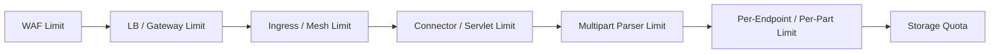
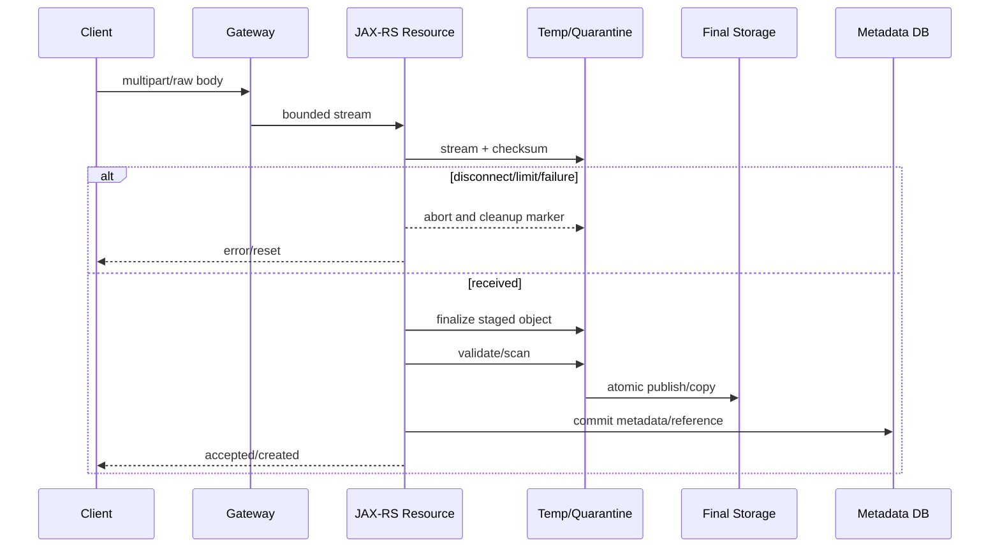
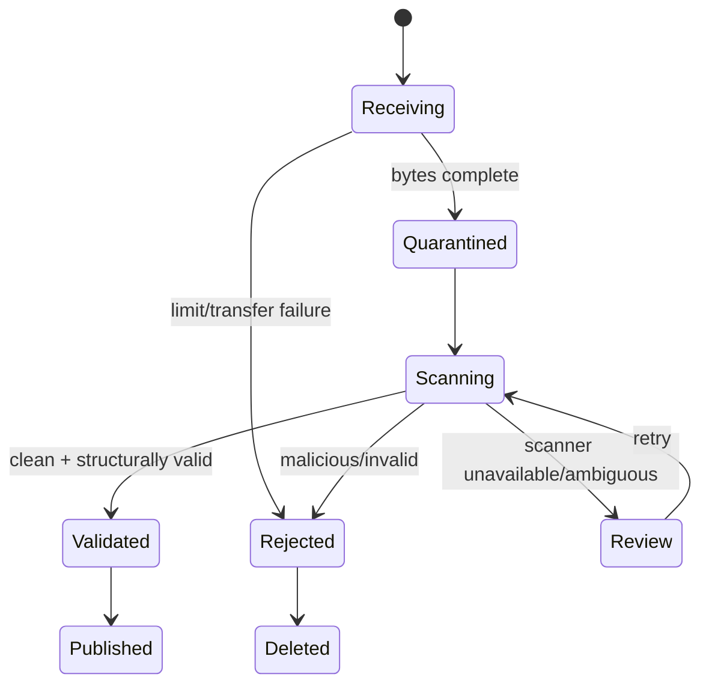

# Part 015 — Forms, Multipart, Files, and Binary Payloads

> File endpoint bukan sekadar `InputStream` yang disalin ke disk. Ia adalah boundary untuk **untrusted bytes**, metadata yang dapat dimanipulasi, resource yang mahal, storage yang mungkin terdistribusi, serta lifecycle yang dapat gagal di setiap tahap. Desain yang benar harus membatasi ukuran, waktu, concurrency, temporary storage, dan side effect sebelum byte pertama diterima.

## Daftar Isi

1. [Target kompetensi](#target-kompetensi)
2. [Scope dan baseline](#scope-dan-baseline)
3. [Terminology map](#terminology-map)
4. [Mental model: bytes, metadata, policy, and storage](#mental-model-bytes-metadata-policy-and-storage)
5. [Standard versus implementation-specific boundary](#standard-versus-implementation-specific-boundary)
6. [Memilih representation](#memilih-representation)
7. [Form URL-encoded](#form-url-encoded)
8. [Multipart mental model](#multipart-mental-model)
9. [Standard Jakarta REST EntityPart](#standard-jakarta-rest-entitypart)
10. [Jersey multipart extension](#jersey-multipart-extension)
11. [Whole multipart versus named-part injection](#whole-multipart-versus-named-part-injection)
12. [Request size and resource limits](#request-size-and-resource-limits)
13. [Streaming upload lifecycle](#streaming-upload-lifecycle)
14. [Stream ownership and closure](#stream-ownership-and-closure)
15. [Temporary storage and cleanup](#temporary-storage-and-cleanup)
16. [File-name and path safety](#file-name-and-path-safety)
17. [Media type, content sniffing, and format validation](#media-type-content-sniffing-and-format-validation)
18. [Checksums and integrity](#checksums-and-integrity)
19. [Malware scanning and quarantine](#malware-scanning-and-quarantine)
20. [Compression and decompression bombs](#compression-and-decompression-bombs)
21. [Atomic publish and metadata transaction](#atomic-publish-and-metadata-transaction)
22. [Object storage versus application proxy](#object-storage-versus-application-proxy)
23. [Download response engineering](#download-response-engineering)
24. [Range and resumable transfer](#range-and-resumable-transfer)
25. [Content-Disposition and international filenames](#content-disposition-and-international-filenames)
26. [Large export generation](#large-export-generation)
27. [Client-side upload and download](#client-side-upload-and-download)
28. [Tenant, authorization, and data-protection boundaries](#tenant-authorization-and-data-protection-boundaries)
29. [Timeout, cancellation, and backpressure](#timeout-cancellation-and-backpressure)
30. [Transactions, events, and asynchronous processing](#transactions-events-and-asynchronous-processing)
31. [Observability and audit](#observability-and-audit)
32. [Testing strategy](#testing-strategy)
33. [Architecture patterns and anti-patterns](#architecture-patterns-and-anti-patterns)
34. [Failure-model matrix](#failure-model-matrix)
35. [Debugging playbook](#debugging-playbook)
36. [PR review checklist](#pr-review-checklist)
37. [Trade-off yang harus dipahami senior engineer](#trade-off-yang-harus-dipahami-senior-engineer)
38. [Internal verification checklist](#internal-verification-checklist)
39. [Latihan verifikasi](#latihan-verifikasi)
40. [Ringkasan](#ringkasan)
41. [Referensi resmi](#referensi-resmi)

---

## Target kompetensi

Setelah menyelesaikan part ini, Anda harus mampu:

- membedakan `application/x-www-form-urlencoded`, `multipart/form-data`, raw binary body, dan object-storage transfer;
- membedakan Jakarta REST `EntityPart` dari Jersey `MultiPart` dan `@FormDataParam`;
- mendesain upload lifecycle yang bounded dari gateway sampai storage;
- menentukan ownership dan kapan `InputStream` harus ditutup;
- mencegah heap exhaustion, temporary-disk exhaustion, decompression bomb, dan slow upload abuse;
- memvalidasi metadata, file name, declared media type, magic bytes, structure, dan business content;
- mendesain checksum, quarantine, malware scan, atomic publish, dan reconciliation;
- membuat download response dengan status, headers, cache, range, dan authorization yang benar;
- memilih application-proxied transfer versus direct object-storage transfer;
- mendiagnosis partial upload, orphan object, truncated download, connection reset, dan serialization failure;
- mereview file endpoint dari sisi security, tenancy, performance, lifecycle, dan operations;
- memverifikasi implementasi internal tanpa mengasumsikan Jersey multipart atau storage tertentu.

---

## Scope dan baseline

Baseline konseptual:

- Java 17+;
- Jakarta REST 4.x;
- standard multipart API `jakarta.ws.rs.core.EntityPart`;
- Jersey 3.x multipart extension bila benar-benar digunakan;
- Servlet, standalone, atau Jakarta EE runtime;
- local filesystem, network filesystem, database large object, atau object storage sebagai kemungkinan destination;
- reverse proxy, ingress, API gateway, dan service mesh sebagai upstream limits.

Part ini tidak mengasumsikan bahwa CSG Quote & Order menerima attachment tertentu, menggunakan S3/Azure Blob, atau memakai Jersey multipart extension. Semua detail tersebut wajib dibuktikan melalui codebase dan deployment.

Binary payload dapat berupa:

```text
Document attachment
Catalog import
Pricing/rules import
Bulk order input
Report export
Invoice or quote PDF
Image or supporting evidence
Archive package
Signed document
```

Business sensitivity dan retention setiap tipe dapat berbeda walaupun transport-nya sama.

---

## Terminology map

| Term | Arti operasional |
|---|---|
| form URL-encoded | key-value form kecil dalam satu entity body |
| multipart | satu HTTP entity yang berisi beberapa body part dengan boundary |
| body part | unit metadata + content di dalam multipart entity |
| raw binary | body tunggal seperti `application/pdf` atau `application/octet-stream` |
| declared type | media type yang dikirim client; tidak otomatis dipercaya |
| detected type | tipe yang diduga dari content signature/structure |
| temporary storage | lokasi transient sebelum object dinyatakan valid/published |
| quarantine | area yang belum boleh dikonsumsi karena scan/validation belum selesai |
| atomic publish | object hanya terlihat sebagai valid setelah seluruh invariant terpenuhi |
| checksum | digest untuk integrity, bukan authentication kecuali dilindungi mekanisme lain |
| partial upload | sebagian byte tersimpan tetapi operasi tidak lengkap |
| orphan object | object tersimpan tanpa metadata/reference yang valid |
| content disposition | metadata presentasi seperti attachment dan filename |
| range request | permintaan sebagian representation menggunakan `Range` |

---

## Mental model: bytes, metadata, policy, and storage

```mermaid
flowchart LR
    Client --> Edge[Gateway / Ingress Limits]
    Edge --> Runtime[HTTP Runtime]
    Runtime --> Parser[Form / Multipart / Entity Provider]
    Parser --> Policy[Auth / Tenant / Metadata / Size Policy]
    Policy --> Stream[Bounded Streaming Pipeline]
    Stream --> Temp[Temporary / Quarantine Storage]
    Temp --> Inspect[Checksum / Type / Malware / Domain Validation]
    Inspect --> Publish[Atomic Publish]
    Publish --> Metadata[(Metadata Transaction)]
    Metadata --> Event[Outbox / Processing Event]
    Event --> Consumer[Downstream Consumer]
```



Upload bukan satu operasi monolitik. Ia terdiri dari beberapa state:

```text
NOT_STARTED
RECEIVING
RECEIVED_UNVERIFIED
QUARANTINED
VALIDATED
PUBLISHED
REJECTED
EXPIRED
```

Invariant yang harus eksplisit:

```text
Untrusted content is never visible as a valid business object.
A failed request cannot consume unbounded memory or disk.
Metadata never claims success before bytes are durably and correctly stored.
Every temporary object has an owner, expiry, and cleanup path.
Tenant and authorization are checked again when content is consumed.
```

---

## Standard versus implementation-specific boundary

| Concern | Jakarta REST standard | Jersey-specific | Runtime/platform-specific |
|---|---|---|---|
| URL-encoded field binding | `@FormParam`, `Form` | — | body-size/parameter limits |
| Standard multipart | `EntityPart` since Jakarta REST 3.1 | Jersey may implement it | parser thresholds/temp directory |
| Jersey multipart model | — | `MultiPart`, `FormDataMultiPart`, `@FormDataParam` | provider registration/configuration |
| Raw streaming response | `StreamingOutput` | `ChunkedOutput` is Jersey-specific | network buffering and connector behavior |
| Request input stream | entity provider/resource parameter | Jersey provider details | spooling, max body, timeout |
| Range support | HTTP semantics; no complete automatic file service contract | custom/Jersey integration | proxy/object-storage capability |
| Upload limit | no single portable application-wide setting | Jersey multipart properties may apply | ingress, servlet, connector, mesh, WAF |
| Temporary files | not standardized | implementation-specific | filesystem/ephemeral volume |

Rule:

```text
Code against Jakarta REST APIs where capability is sufficient.
Use Jersey extensions only with an explicit portability and version decision.
Treat resource limits as an end-to-end platform contract, not one Java property.
```

---

## Memilih representation

| Requirement | Recommended representation |
|---|---|
| small scalar fields | JSON or URL-encoded form |
| metadata + one or more files | `multipart/form-data` |
| one known binary object | raw body with explicit media type |
| very large object | direct object-storage upload or resumable protocol |
| asynchronous import | upload/commit plus operation resource |
| generated large export | object storage + expiring download reference |
| browser-native form | URL-encoded or multipart depending on file presence |

Do not use multipart merely to combine unrelated commands. A multipart request has one HTTP success/failure boundary but each part can have different validation and storage cost.

Prefer JSON metadata plus separately managed binary object when:

- object upload can be retried independently;
- object is very large;
- scan/processing is asynchronous;
- object storage supports direct transfer;
- business command should reference a previously uploaded object ID.

---

## Form URL-encoded

Portable Jakarta REST example:

```java
import jakarta.ws.rs.Consumes;
import jakarta.ws.rs.FormParam;
import jakarta.ws.rs.POST;
import jakarta.ws.rs.Path;
import jakarta.ws.rs.core.MediaType;
import jakarta.ws.rs.core.Response;

@Path("/sessions")
public final class SessionResource {

    @POST
    @Consumes(MediaType.APPLICATION_FORM_URLENCODED)
    public Response create(
            @FormParam("username") String username,
            @FormParam("password") String password) {

        // Never log password or the raw form body.
        return Response.noContent().build();
    }
}
```

`application/x-www-form-urlencoded` cocok untuk small scalar values. Ia tidak cocok untuk large binary content karena encoding overhead, memory behavior, dan poor metadata representation.

Review points:

- maximum field count;
- maximum field length;
- duplicate field semantics;
- charset behavior;
- redaction of credentials and sensitive fields;
- whether parameter parsing occurs before application authorization;
- platform parameter-count limit.

A duplicate key can be represented as multiple values. Do not silently choose first/last value unless contract states it.

---

## Multipart mental model

Simplified wire form:

```text
Content-Type: multipart/form-data; boundary=abc123

--abc123
Content-Disposition: form-data; name="metadata"
Content-Type: application/json

{"documentType":"QUOTE_ATTACHMENT"}
--abc123
Content-Disposition: form-data; name="document"; filename="quote.pdf"
Content-Type: application/pdf

<binary bytes>
--abc123--
```

Each part has:

- a name;
- optional filename;
- headers;
- media type;
- content stream/object;
- independent size and validation requirements.

The boundary is syntax, not a security boundary. The parser still handles attacker-controlled headers, names, content, nesting, and malformed termination.

---

## Standard Jakarta REST EntityPart

Jakarta REST 3.1 introduced standard multipart support through `EntityPart`. In Jakarta REST 4.0, a resource can receive a collection of parts or bind a named form part.

Example using named parts:

```java
import jakarta.ws.rs.Consumes;
import jakarta.ws.rs.FormParam;
import jakarta.ws.rs.POST;
import jakarta.ws.rs.Path;
import jakarta.ws.rs.core.EntityPart;
import jakarta.ws.rs.core.MediaType;
import jakarta.ws.rs.core.Response;

import java.io.InputStream;

@Path("/attachments")
public final class AttachmentResource {
    private final AttachmentApplicationService service;

    public AttachmentResource(AttachmentApplicationService service) {
        this.service = service;
    }

    @POST
    @Consumes(MediaType.MULTIPART_FORM_DATA)
    public Response upload(
            @FormParam("metadata") EntityPart metadataPart,
            @FormParam("document") EntityPart documentPart) throws Exception {

        UploadMetadata metadata = metadataPart.getContent(UploadMetadata.class);

        try (InputStream content = documentPart.getContent(InputStream.class)) {
            AttachmentId id = service.receive(
                    metadata,
                    documentPart.getFileName().orElse(null),
                    documentPart.getMediaType().orElse(MediaType.APPLICATION_OCTET_STREAM_TYPE),
                    content);

            return Response.accepted(id).build();
        }
    }
}
```

Example receiving all parts:

```java
@POST
@Consumes(MediaType.MULTIPART_FORM_DATA)
public Response uploadAll(List<EntityPart> parts) {
    // Build an explicit name -> validated part model.
    // Reject unexpected or duplicate parts unless the contract allows them.
    return Response.accepted().build();
}
```

Important ownership rule from the API contract:

- when **sending** multipart content, implementation code is responsible for closing content input streams after sending;
- when **receiving** multipart content, calling code is responsible for closing the stream obtained from a part.

Do not retain an `EntityPart` or its stream outside request lifecycle unless the bytes have been copied to an application-owned durable/staged resource.

---

## Jersey multipart extension

Older Jersey applications, or applications choosing Jersey-specific capability, may use:

```text
org.glassfish.jersey.media.multipart.MultiPart
org.glassfish.jersey.media.multipart.FormDataMultiPart
org.glassfish.jersey.media.multipart.FormDataBodyPart
org.glassfish.jersey.media.multipart.FormDataContentDisposition
org.glassfish.jersey.media.multipart.FormDataParam
```

Example:

```java
import jakarta.ws.rs.Consumes;
import jakarta.ws.rs.POST;
import jakarta.ws.rs.Path;
import jakarta.ws.rs.core.MediaType;
import jakarta.ws.rs.core.Response;
import org.glassfish.jersey.media.multipart.FormDataContentDisposition;
import org.glassfish.jersey.media.multipart.FormDataParam;

import java.io.InputStream;

@Path("/legacy-attachments")
public final class LegacyAttachmentResource {

    @POST
    @Consumes(MediaType.MULTIPART_FORM_DATA)
    public Response upload(
            @FormDataParam("file") InputStream content,
            @FormDataParam("file") FormDataContentDisposition disposition) {

        // Jersey-specific API. Verify stream lifecycle and configured limits.
        return Response.accepted().build();
    }
}
```

For Jersey 3.1+, standard Jakarta REST multipart support exists, and Jersey documentation states `MultiPartFeature` no longer needs explicit registration in that line. Do not generalize that behavior to older Jersey releases or other implementations.

Migration questions:

- Is `@FormDataParam` still required for a capability absent from `EntityPart` usage?
- Are multipart size/spooling properties tied to Jersey extension classes?
- Does generated or shared internal code expose Jersey types?
- Can standard `EntityPart` be adopted without changing wire contract?

---

## Whole multipart versus named-part injection

### Named injection

Advantages:

- concise resource method;
- obvious contract for small fixed forms;
- direct entity conversion per part.

Risks:

- duplicate part semantics may be hidden;
- unexpected parts may be ignored;
- parser may materialize parts before resource method;
- individual limit enforcement may be less explicit.

### Whole multipart model

Advantages:

- explicit duplicate/unexpected-part handling;
- easier aggregate limits and custom ordering validation;
- can preserve per-part metadata.

Risks:

- more parser/provider coupling;
- easier to accidentally retain all parts;
- cleanup ownership must be explicit.

For security-sensitive imports, build an explicit normalized manifest:

```java
public record UploadManifest(
        EntityPart metadata,
        EntityPart document,
        long declaredDocumentLength) {
}
```

Never treat multipart field order as business semantics unless the protocol intentionally defines it.

---

## Request size and resource limits

A complete limit chain:



Limits should include:

- total request bytes;
- per-part bytes;
- number of parts;
- part-header bytes;
- field-name and filename length;
- multipart nesting depth if supported;
- request duration/minimum transfer rate;
- concurrent uploads per tenant/user/node;
- temporary-disk bytes;
- storage quota;
- decompressed bytes;
- generated-output bytes.

Failure semantics must be known:

| Rejection point | Client may observe | Application visibility |
|---|---|---|
| WAF/gateway | platform-specific 4xx | resource never invoked |
| connector | connection reset or 4xx | application may not log request |
| multipart parser | 400/413/provider exception | partial temp data possible |
| application policy | explicit 4xx | trace/audit available |
| storage quota | 409/422/507/5xx by policy | partial object possible |

`413 Content Too Large` is generally appropriate when request size exceeds accepted limits. Do not return 500 for a known client-size violation.

---

## Streaming upload lifecycle



Preferred implementation properties:

- fixed-size buffer;
- no `readAllBytes()` for untrusted large input;
- byte counter independent of `Content-Length`;
- deadline/cancellation checks;
- incremental digest;
- temporary object identity generated by server;
- finally-block cleanup or durable cleanup record;
- final object made visible only after validation.

Illustrative bounded copy:

```java
public final class BoundedStreams {
    private static final int BUFFER_SIZE = 64 * 1024;

    private BoundedStreams() {
    }

    public static long copy(InputStream source, OutputStream target, long maxBytes)
            throws IOException {
        byte[] buffer = new byte[BUFFER_SIZE];
        long total = 0;

        for (int read; (read = source.read(buffer)) >= 0; ) {
            total = Math.addExact(total, read);
            if (total > maxBytes) {
                throw new PayloadTooLargeException(maxBytes);
            }
            target.write(buffer, 0, read);
        }
        return total;
    }
}
```

This example is not a full production pipeline. It still needs cancellation, hashing, storage semantics, metrics, and cleanup.

---

## Stream ownership and closure

Ownership table:

| Resource | Typical owner | Closure point |
|---|---|---|
| request entity stream | runtime/provider until exposed | application closes if API contract transfers ownership |
| `EntityPart` content stream | receiving application | after copy/processing |
| application-created file output | application | same lexical scope or managed lifecycle |
| `StreamingOutput` response output | runtime owns underlying stream | application writes/flushes but normally does not close container stream |
| object-storage client response stream | application/client wrapper | after read or cancellation |
| temporary file | application/job | publish, reject, timeout, or expiry cleanup |

Anti-patterns:

```java
byte[] bytes = input.readAllBytes(); // unbounded
```

```java
executor.submit(() -> process(input)); // request stream escapes request lifecycle
```

```java
output.close(); // may close container-managed response stream unexpectedly
```

If processing is asynchronous, first copy to an application-owned staged object and enqueue its stable ID.

---

## Temporary storage and cleanup

Temporary storage can be:

- runtime-managed multipart spool directory;
- application temp directory;
- ephemeral Kubernetes volume;
- persistent volume;
- object-storage quarantine prefix/container;
- database staging table or large object.

Required controls:

```text
Server-generated identifier
Tenant/owner metadata
Creation timestamp
Expected expiry
Current state
Actual byte count
Checksum
Cleanup attempt state
```

Do not rely only on request `finally` cleanup. Pod termination, process crash, and node loss bypass it. Add a reconciliation/cleanup job that finds expired staged objects.

Kubernetes implication:

- `emptyDir` consumes node ephemeral storage;
- pod restart loses local staged files;
- node disk pressure can evict pods;
- replica-local paths cannot be assumed visible from another replica.

---

## File-name and path safety

Client filenames are labels, not paths.

Never do:

```java
Path destination = uploadRoot.resolve(clientFileName);
```

Risks:

- `../` traversal;
- absolute paths;
- Windows separators on Linux and vice versa;
- Unicode confusables;
- control characters;
- reserved device names;
- trailing dots/spaces;
- filename collisions;
- excessively long names;
- log/header injection.

Preferred model:

```text
storageKey = server-generated opaque ID
originalFileName = normalized metadata for display only
safeDownloadName = independently encoded at response time
```

Validation steps:

1. reject NUL/control characters;
2. remove path segments and separators;
3. normalize Unicode according to documented policy;
4. cap length;
5. preserve extension only as metadata;
6. never use filename as authorization or uniqueness key.

---

## Media type, content sniffing, and format validation

`Content-Type` is attacker-controlled input.

Validation layers:

```text
Declared media type
  != detected signature
  != parseable format
  != valid business document
```

Example for a PDF-like requirement:

- allow declared `application/pdf`;
- inspect signature/structure using a maintained parser;
- enforce parser limits;
- reject encrypted or active content if policy forbids it;
- validate business-level rules;
- scan before publication.

Do not implement complex format detection through ad-hoc string matching. Parsers themselves can have vulnerabilities and resource amplification; isolate or limit them where appropriate.

For downloads, set `X-Content-Type-Options: nosniff` where browser consumption is involved and platform policy supports it.

---

## Checksums and integrity

Compute digest while streaming:

```java
MessageDigest digest = MessageDigest.getInstance("SHA-256");
try (DigestInputStream in = new DigestInputStream(source, digest)) {
    BoundedStreams.copy(in, target, maxBytes);
}
byte[] sha256 = digest.digest();
```

Use cases:

- detect transfer/storage corruption;
- verify direct-upload completion;
- deduplicate only when security and tenant semantics allow;
- identify exact bytes during incident analysis;
- compare staged and published object.

Cautions:

- checksum supplied by client is not trusted until recomputed;
- plain hash is not proof of sender authenticity;
- deduplication across tenants can leak existence/timing information;
- object-storage ETag is not universally equivalent to MD5;
- digest algorithm and encoding must be standardized.

---

## Malware scanning and quarantine

A safe state transition:



Scanner failure policy must be explicit:

- **fail closed**: do not publish while scan is unavailable;
- **fail open**: dangerous and normally inappropriate for untrusted files;
- **deferred review**: accept upload but keep inaccessible.

Record scanner engine/version and result without logging sensitive content.

---

## Compression and decompression bombs

Threats include:

- compressed request bodies with extreme expansion ratio;
- nested archives;
- many tiny archive entries;
- path traversal inside archives;
- oversized XML/office structures;
- CPU-heavy malformed formats.

Limits must apply to:

```text
compressed bytes
expanded bytes
entry count
nesting depth
single-entry size
total processing time
CPU/concurrency
```

Never validate only compressed request size. Decompression should occur in a bounded, cancellable, observable processing stage.

---

## Atomic publish and metadata transaction

The filesystem/object store and PostgreSQL usually do not share one ACID transaction.

Unsafe sequence:

```text
1. Insert DB row as AVAILABLE.
2. Upload bytes.
3. Upload fails.
```

Safer stateful sequence:

```text
1. Create metadata row: RECEIVING.
2. Stream to staging/quarantine key.
3. Validate checksum/type/scan.
4. Publish final object or mark staged object immutable.
5. Transactionally update metadata: AVAILABLE + object version/checksum.
6. Emit outbox event.
7. Reconcile orphan rows/objects.
```

Alternative order can also work, but orphan behavior and reconciliation must be designed.

Use durable unique identifiers to make repeated completion idempotent.

---

## Object storage versus application proxy

### Application-proxied transfer

```text
Client -> JAX-RS service -> object storage
```

Advantages:

- central authorization and validation;
- simple client contract;
- application can hash/inspect stream inline.

Costs:

- doubles network path through service;
- consumes service connections, CPU, memory buffers, and timeout budget;
- scales poorly for very large content.

### Direct upload/download

```text
Client -> request authorization from service
Service -> issue constrained upload/download capability
Client -> object storage private endpoint/public endpoint
Client -> commit/complete operation with service
```

Advantages:

- application does not proxy all bytes;
- storage handles multipart/resumable transfer;
- better scalability.

Risks:

- capability scope and expiry;
- incomplete uploads;
- client can claim completion falsely;
- scan and publish workflow still required;
- private endpoint/DNS/browser CORS complexity;
- tenant prefix/key authorization.

Completion endpoint must verify object existence, version, size, checksum, metadata, and ownership.

---

## Download response engineering

Simple streaming response:

```java
@GET
@Path("/{attachmentId}/content")
@Produces(MediaType.APPLICATION_OCTET_STREAM)
public Response download(@PathParam("attachmentId") String attachmentId) {
    DownloadDescriptor descriptor = service.authorizeAndDescribe(attachmentId);

    StreamingOutput body = output -> {
        try (InputStream input = storage.open(descriptor.storageKey())) {
            input.transferTo(output);
        }
    };

    return Response.ok(body, descriptor.mediaType())
            .header("Content-Disposition", descriptor.contentDisposition())
            .header("Content-Length", descriptor.length())
            .header("ETag", descriptor.etag())
            .header("X-Content-Type-Options", "nosniff")
            .build();
}
```

Cautions:

- authorization must occur before returning the response;
- storage access can still fail after headers are committed;
- `Content-Length` must reflect exact representation bytes;
- never load the whole object to compute length or hash per request;
- do not close the container-owned output stream;
- cancellation should close the storage input promptly.

For object storage, redirect or signed URL may be better than proxying through the application, depending on audit and network requirements.

---

## Range and resumable transfer

HTTP range support is not merely slicing a file. It requires correct handling of:

- `Range`;
- `If-Range`;
- `Accept-Ranges`;
- `206 Partial Content`;
- `Content-Range`;
- `416 Range Not Satisfiable`;
- representation validators;
- one or multiple ranges;
- compressed versus uncompressed representation.

Do not advertise `Accept-Ranges: bytes` unless the implementation can honor it correctly.

Prefer delegating range support to object storage, CDN, or a proven file-serving layer when possible. Custom range implementations require protocol tests and careful overflow/bounds checks.

Resumable upload is a separate protocol concern. A single multipart POST is not resumable merely because storage internally supports multipart upload.

---

## Content-Disposition and international filenames

Typical download header:

```text
Content-Disposition: attachment; filename="quote.pdf"; filename*=UTF-8''quote-%E2%82%AC.pdf
```

Requirements:

- sanitize CR/LF to prevent header injection;
- provide an ASCII-safe fallback;
- encode extended filename correctly;
- avoid exposing internal storage key/path;
- set `inline` only for content types that are safe and intended for browser rendering;
- combine with CSP/sandboxing or separate download domain where needed.

Filename is presentation metadata. Stable object identity belongs in URI/ID, not filename.

---

## Large export generation

Avoid holding a database transaction while serializing millions of rows to an HTTP response.

For moderate streams:

```text
short read transactions / cursor
bounded fetch size
stream encoder
client cancellation detection
maximum duration
```

For large or expensive exports:


Benefits:

- durable retry;
- progress visibility;
- no long-lived HTTP transaction;
- controlled concurrency;
- explicit expiry and cleanup.

Protect exports against formula injection, delimiter confusion, encoding errors, and tenant data mixing.

---

## Client-side upload and download

Client responsibilities:

- set explicit media types;
- avoid retaining all bytes in memory;
- close `Response` and entity streams;
- configure connect/read/write/call deadlines;
- define retry semantics;
- use idempotent upload session/operation IDs;
- verify checksum/length where required;
- handle `413`, `415`, `422`, timeout, and connection reset separately.

Never blindly retry a non-idempotent upload POST after an ambiguous timeout. Use:

- idempotency key;
- upload session ID;
- object existence/completion lookup;
- resumable protocol;
- content-addressed or server-issued object ID.

---

## Tenant, authorization, and data-protection boundaries

Authorization questions:

```text
Who may create the attachment?
Which quote/order/catalog may it be linked to?
Who may read raw content?
Who may read metadata but not content?
Can support staff access it?
Can a tenant replace another tenant's object ID?
What happens after the parent resource is deleted?
```

Controls:

- bind staged object to authenticated principal and tenant;
- derive storage key server-side;
- include tenant in metadata and storage policy;
- authorize download on every access or via tightly scoped short-lived capability;
- prevent cross-tenant deduplication side channels;
- redact filenames and document metadata from generic logs;
- encrypt in transit and at rest according to data classification;
- enforce retention/legal-hold/deletion rules.

Do not trust tenant ID from multipart form fields when authoritative identity/context exists elsewhere.

---

## Timeout, cancellation, and backpressure

Upload timeout dimensions:

- connection establishment;
- headers;
- idle between bytes;
- total request duration;
- application copy deadline;
- scanner deadline;
- storage operation deadline.

Backpressure requires bounded queues and concurrency. A streaming API alone does not create backpressure if the application immediately enqueues unlimited chunks or writes to an unbounded executor.

On client disconnect:

1. stream read/write should fail or cancellation signal should propagate;
2. storage write should be aborted;
3. temporary state should be marked for cleanup;
4. long database transaction should not remain open;
5. metrics should distinguish client cancellation from server error.

Rate limits can be based on:

- concurrent uploads;
- requests per interval;
- bytes per interval;
- storage quota;
- expensive scan/parse concurrency.

---

## Transactions, events, and asynchronous processing

Do not keep a relational transaction open while receiving an untrusted large body.

Recommended split:

```text
Receive/stage bytes
  -> validate and scan
  -> short metadata transaction
  -> outbox event
  -> downstream processing
```

If an upload triggers catalog import or document processing:

- response should state whether bytes are merely received or fully processed;
- use `202 Accepted` with operation status for asynchronous processing;
- processing must be idempotent;
- event carries stable object/version/checksum, not ephemeral local path;
- failed jobs are visible and recoverable;
- reconciliation checks metadata, object, and event state.

---

## Observability and audit

Useful metrics:

```text
upload_requests_total{result, media_type_class}
upload_bytes_total{tenant_class}
upload_active
upload_duration_seconds
upload_rejected_total{reason}
temporary_storage_bytes
temporary_objects_expired
scan_duration_seconds
scan_failures_total{reason}
download_bytes_total
download_duration_seconds
download_aborted_total{side}
```

Avoid high-cardinality labels such as filename, attachment ID, user ID, quote ID, or object key.

Trace spans:

```text
HTTP receive
stage object
checksum
content detection
malware scan
publish object
metadata transaction
outbox enqueue
```

Audit events may include:

- actor and tenant;
- business parent ID;
- object ID and version;
- declared/detected media type;
- byte count and checksum reference;
- action: uploaded, downloaded, replaced, rejected, deleted;
- outcome and policy reason.

Do not put raw content, secrets, or sensitive filenames into logs.

---

## Testing strategy

### Unit tests

- filename normalization;
- size counter and overflow;
- media-type policy;
- checksum calculation;
- duplicate/unexpected multipart fields;
- authorization and tenant binding;
- state transitions.

### Integration tests

- actual Jakarta REST multipart provider;
- actual Jersey extension if used;
- zero-byte files;
- missing boundary;
- malformed headers;
- duplicated parts;
- request over total/per-part limits;
- client disconnect mid-stream;
- temporary-disk full;
- storage timeout;
- scanner unavailable;
- response failure after metadata commit.

### Security tests

- traversal filenames;
- CR/LF header injection;
- disguised media type;
- archive bomb;
- nested archive/path traversal;
- cross-tenant object ID;
- unauthorized range request;
- signed URL scope/expiry;
- malicious active content.

### Performance tests

- concurrent large uploads/downloads;
- slow clients;
- storage latency;
- scan saturation;
- heap/native/direct-buffer behavior;
- node ephemeral-storage pressure;
- cancellation cleanup latency.

---

## Architecture patterns and anti-patterns

### Good patterns

- server-generated storage keys;
- staged/quarantine/published states;
- bounded streaming and concurrency;
- incremental checksum;
- asynchronous scan/processing with operation resource;
- direct object-storage transfer for large content;
- short metadata transactions;
- durable cleanup/reconciliation;
- per-tenant authorization and quotas;
- explicit compatibility and media-type contract.

### Anti-patterns

- `readAllBytes()` on untrusted input;
- trusting `Content-Length` as enforcement;
- using original filename as filesystem path;
- publishing before scan/validation;
- keeping request streams in background tasks;
- DB transaction open during upload/download;
- storing large bytes in JVM session/singleton;
- unlimited temp directory;
- relying only on request-finally cleanup;
- retrying ambiguous upload blindly;
- logging multipart body;
- assuming object-store ETag is a cryptographic checksum;
- claiming range support without protocol correctness.

---

## Failure-model matrix

| Failure | Risk | Detection | Design response |
|---|---|---|---|
| request exceeds edge limit | client sees opaque failure | gateway metrics/logs | aligned documented limits |
| parser spools unbounded temp files | node disk exhaustion | ephemeral-storage metrics | parser/app quotas + cleanup |
| heap buffering | OOM/OOMKilled | heap/NMT/GC evidence | streaming + bounded buffers |
| client disconnect | partial object | trace/storage state | abort + staged cleanup |
| filename traversal | arbitrary overwrite | security tests | server-generated key |
| declared type lies | unsafe content accepted | detection mismatch metric | parse/signature/business validation |
| scanner unavailable | unsafe publish or backlog | scan alerts/state age | fail closed/quarantine |
| archive bomb | CPU/disk exhaustion | expanded-byte metrics | expansion/depth/time limits |
| DB commit before storage | broken metadata link | reconciliation | explicit state machine |
| storage succeeds, DB fails | orphan object | inventory reconciliation | cleanup/idempotent completion |
| response lost after success | duplicate upload | operation lookup | idempotency/upload session |
| pod dies with local temp file | lost/incomplete object | startup/reconciliation | durable staging or restart policy |
| cross-tenant object key | data leak | isolation tests/audit | tenant-bound authorization |
| download fails after headers | truncated response | byte counts/reset metrics | client retry with validators/range |
| wrong Content-Length | truncation/hang | protocol tests | trusted metadata and validation |
| unclosed storage stream | connection-pool exhaustion | pool/leak metrics | lexical ownership/close |
| slow client | occupied thread/connection | active duration metrics | timeout/concurrency limits |

---

## Debugging playbook

### Upload returns 413 before resource logs

1. Inspect WAF, gateway, ingress, and connector limits in order.
2. Compare documented endpoint limit to every upstream layer.
3. Verify whether chunked requests and `Content-Length` requests differ.
4. Inspect platform access logs, not only application logs.
5. Add a correlation identifier at the earliest controllable layer.

### Node disk fills during multipart uploads

1. Locate multipart spool directory and application staging directory.
2. Identify largest and oldest files.
3. Map files to request/object IDs if possible.
4. Check parser thresholds and cleanup callback behavior.
5. Check pod/node termination around creation time.
6. Run reconciliation safely; do not delete active uploads blindly.
7. Add quota, age, and active-upload metrics.

### Upload succeeded but attachment is missing

1. Find upload/operation ID.
2. Determine final request status seen by client.
3. Inspect staged object, checksum, scan state, and final object.
4. Inspect metadata transaction and outbox.
5. Look for response loss after commit.
6. Execute idempotent completion/reconciliation.
7. Fix state transition or observability gap.

### Download is truncated

1. Compare expected length, response `Content-Length`, and client-received bytes.
2. Inspect proxy and server reset reason.
3. Inspect storage stream timeout and pool state.
4. Verify response headers were committed before failure.
5. Test range/validator behavior for safe retry.
6. Correlate cancellation versus server-side failure.

### Heap grows during file traffic

1. Capture allocation profile/heap histogram.
2. Search for `byte[]`, `ByteArrayOutputStream`, multipart body retention, and cached responses.
3. Inspect provider/runtime spooling threshold.
4. Verify client and server code closes streams/responses.
5. Load-test with slow clients and realistic concurrent size.

---

## PR review checklist

### Contract and representation

- [ ] Chosen media type matches the requirement.
- [ ] Standard versus Jersey-specific APIs are identified.
- [ ] Required, optional, duplicate, and unexpected part semantics are explicit.
- [ ] Status codes and asynchronous state are correct.
- [ ] Maximum total and per-part size are documented.

### Resource lifecycle

- [ ] No unbounded buffering or `readAllBytes()`.
- [ ] Stream ownership and closure are explicit.
- [ ] Request streams do not escape request lifecycle.
- [ ] Temporary objects have owner, expiry, and cleanup path.
- [ ] Client cancellation aborts downstream work.

### Security and integrity

- [ ] Filename is not used as storage path.
- [ ] Declared type is not blindly trusted.
- [ ] Format, checksum, malware, and archive policies are defined.
- [ ] Tenant and object-level authorization are enforced.
- [ ] Logs and headers resist injection/redact sensitive data.

### Storage and consistency

- [ ] Staging/quarantine/publish state is explicit.
- [ ] DB and object-store inconsistency is reconciled.
- [ ] Idempotent retry/completion exists.
- [ ] Storage key/version/checksum are durable.
- [ ] Retention and deletion are defined.

### Operations

- [ ] Limits align across gateway/runtime/application/storage.
- [ ] Metrics cover bytes, active transfers, rejects, temp usage, and failures.
- [ ] Range/direct-download behavior is tested if advertised.
- [ ] Load tests include slow and cancelled clients.
- [ ] Runbook covers disk full, scanner outage, and orphan reconciliation.

---

## Trade-off yang harus dipahami senior engineer

| Decision | Option A | Option B |
|---|---|---|
| Multipart API | Standard `EntityPart` | Jersey-specific multipart model |
| Large transfer | Proxy through service | Direct object-storage transfer |
| Validation | Inline before response | Quarantine + asynchronous processing |
| Storage | Local/PV staging | Object-storage staging |
| Completion | Synchronous final outcome | `202` operation lifecycle |
| Download | Application stream | Redirect/signed capability |
| Range | Custom service implementation | Delegate to storage/CDN |
| Deduplication | Per-object storage | Hash-based reuse with privacy risk |

A technically simple endpoint can create operationally expensive behavior. Optimize for bounded resources, recoverability, and verifiable state—not merely fewer components.

---

## Internal verification checklist

### Jakarta REST and Jersey

- [ ] Jakarta REST version.
- [ ] Standard `EntityPart` usage.
- [ ] Jersey `jersey-media-multipart` dependency.
- [ ] `@FormDataParam`, `MultiPart`, or `FormDataMultiPart` usage.
- [ ] Multipart provider registration/auto-discovery behavior.
- [ ] Parser memory/disk threshold and temporary directory.

### Platform limits

- [ ] WAF request limits.
- [ ] API gateway/load-balancer limits.
- [ ] Ingress/service-mesh limits.
- [ ] Servlet/Grizzly connector limits.
- [ ] Application endpoint/per-part limits.
- [ ] Kubernetes ephemeral-storage requests/limits.
- [ ] Tenant/storage quotas.

### Storage and processing

- [ ] Local filesystem, database LOB, S3, Azure Blob, or other storage.
- [ ] Staging/quarantine/final key convention.
- [ ] Encryption and private-endpoint requirements.
- [ ] Checksum algorithm.
- [ ] Malware scanner and outage policy.
- [ ] Format parsers and their limits.
- [ ] Object lifecycle/retention/legal hold.
- [ ] Cleanup and reconciliation jobs.

### Security and tenancy

- [ ] Object-level authorization.
- [ ] Tenant binding and storage isolation.
- [ ] Filename/media-type policy.
- [ ] Sensitive-document classification.
- [ ] Download domain/browser policy.
- [ ] Signed URL scope, duration, and audit.
- [ ] Log redaction.

### API and operations

- [ ] Upload/download endpoint contracts.
- [ ] Idempotency/upload-session strategy.
- [ ] Synchronous versus asynchronous processing.
- [ ] Range/resume support.
- [ ] Metrics, traces, audit, dashboards, and alerts.
- [ ] Runbooks for disk full, scanner outage, partial upload, and orphan object.
- [ ] Historical incidents and PRs involving file handling.

---

## Latihan verifikasi

1. Trace one real upload from ingress limit to final storage object.
2. Upload a body larger than each configured layer and record observed behavior.
3. Disconnect the client at 10%, 50%, and 99%; verify cleanup.
4. Send duplicate, missing, and unexpected multipart fields.
5. Send traversal and CR/LF filenames.
6. Send a file whose declared type differs from detected type.
7. Simulate scanner timeout and verify quarantine policy.
8. Fill temporary storage in a non-production environment and inspect failure mode.
9. Kill the pod after staging but before metadata commit; run reconciliation.
10. Drop the response after successful publish and verify idempotent recovery.
11. Load-test slow concurrent downloads and inspect thread/connection usage.
12. Validate `Range`, ETag, and `Content-Length` behavior if supported.
13. Attempt cross-tenant access using a valid object ID.
14. Review one endpoint using the PR checklist and record unknown internal assumptions.

---

## Ringkasan

Mental model:

```text
A file endpoint is a bounded untrusted-byte pipeline with an explicit state machine,
not a convenience wrapper around InputStream or byte[].
```

Key invariants:

1. Every byte path has size, time, and concurrency bounds.
2. `Content-Type`, filename, length, and client checksum are untrusted metadata.
3. Standard `EntityPart` and Jersey multipart types are not interchangeable concepts.
4. Receiving code closes part streams it owns.
5. Request streams must not escape into background processing.
6. Temporary content requires durable cleanup and reconciliation.
7. Quarantine precedes publication for untrusted content.
8. DB and object storage need an explicit consistency state machine.
9. Authorization and tenant isolation apply to both metadata and raw bytes.
10. Large transfers often belong directly on object storage, with service-controlled capability and completion.
11. Downloads can fail after headers commit; clients need safe recovery semantics.
12. Operational correctness requires metrics for bytes, active transfers, temp usage, scan state, and partial failures.

---

## Referensi resmi

- [Jakarta RESTful Web Services 4.0](https://jakarta.ee/specifications/restful-ws/4.0/)
- [Jakarta REST 4.0 API — EntityPart](https://jakarta.ee/specifications/restful-ws/4.0/apidocs/jakarta.ws.rs/jakarta/ws/rs/core/entitypart)
- [Jakarta REST 4.0 API — StreamingOutput](https://jakarta.ee/specifications/restful-ws/4.0/apidocs/jakarta.ws.rs/jakarta/ws/rs/core/streamingoutput)
- [Jersey 3.1 User Guide — Common Media Type Representations and Multipart](https://eclipse-ee4j.github.io/jersey.github.io/documentation/latest31x/media.html)
- [RFC 7578 — Returning Values from Forms: multipart/form-data](https://www.rfc-editor.org/rfc/rfc7578.html)
- [RFC 9110 — HTTP Semantics](https://www.rfc-editor.org/rfc/rfc9110.html)
- [RFC 9111 — HTTP Caching](https://www.rfc-editor.org/rfc/rfc9111.html)
- [RFC 6266 — Content-Disposition in HTTP](https://www.rfc-editor.org/rfc/rfc6266.html)
- [RFC 8187 — Character Set and Language Encoding for HTTP Header Parameters](https://www.rfc-editor.org/rfc/rfc8187.html)
- [OWASP File Upload Cheat Sheet](https://cheatsheetseries.owasp.org/cheatsheets/File_Upload_Cheat_Sheet.html)
