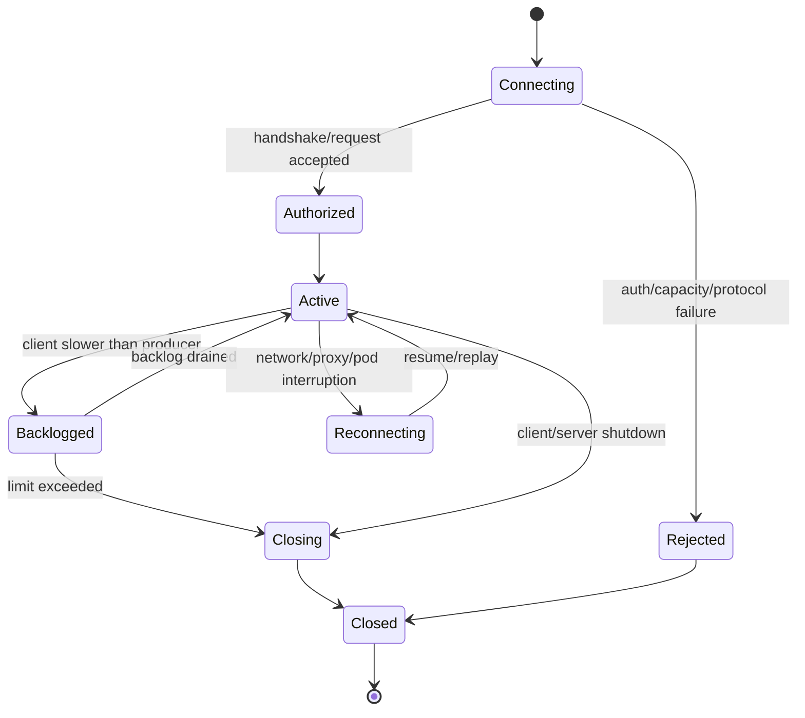
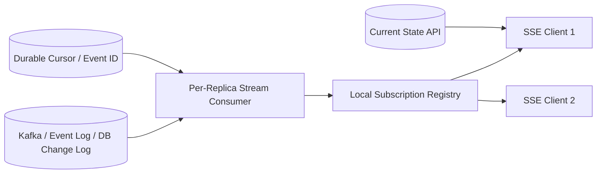
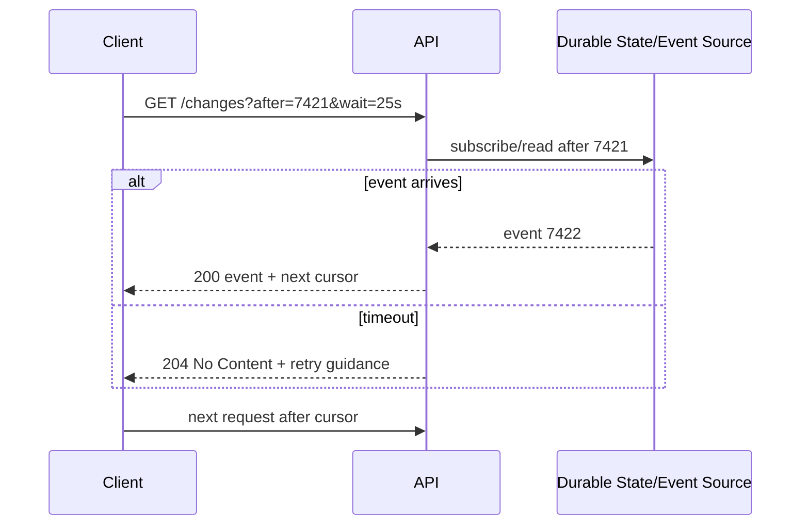
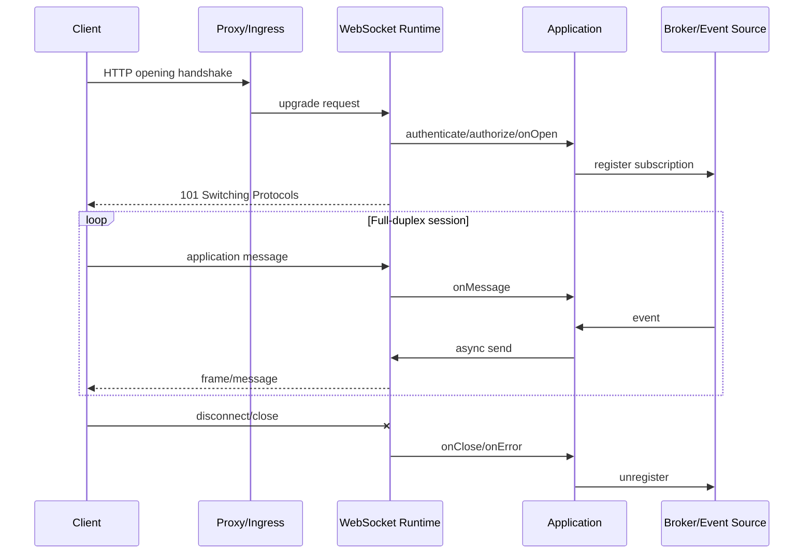
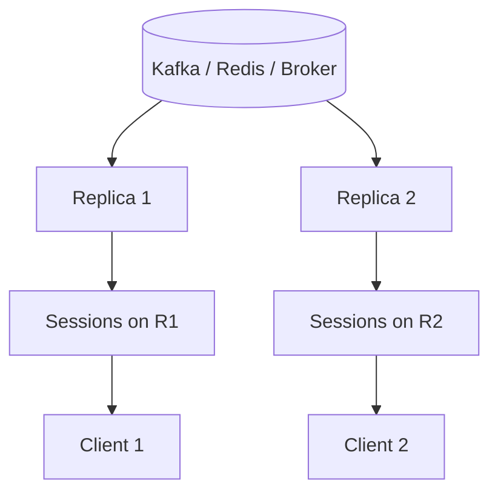
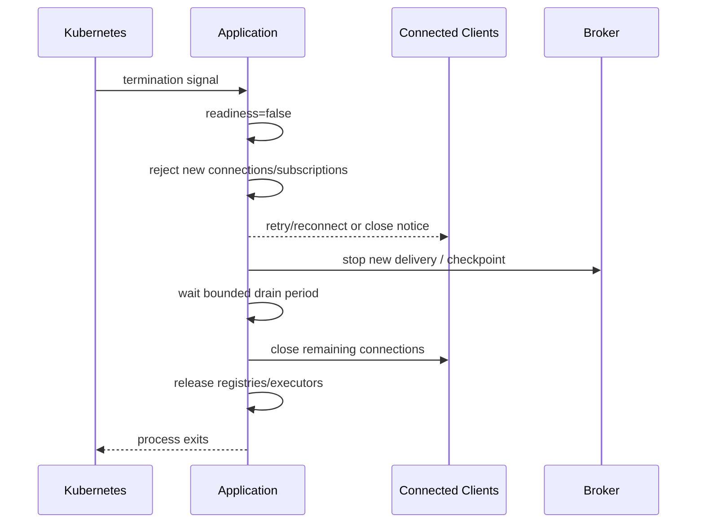

# Part 016 — Streaming, SSE, Long Polling, and WebSocket Integration

> Long-lived connection mengubah failure model service. Request tidak lagi hanya memakai thread beberapa milidetik; ia dapat menahan connection, buffer, subscription, authorization context, dan per-client state selama menit atau jam. Keberhasilan bukan hanya “connection terbuka”, tetapi kemampuan menangani disconnect, reconnect, replay, slow consumer, rolling deployment, dan multi-replica routing tanpa kehilangan kontrol resource.

## Daftar Isi

1. [Target kompetensi](#target-kompetensi)
2. [Scope dan baseline](#scope-dan-baseline)
3. [Terminology map](#terminology-map)
4. [Communication-model decision matrix](#communication-model-decision-matrix)
5. [Standard versus implementation-specific boundary](#standard-versus-implementation-specific-boundary)
6. [Lifecycle model for long-lived communication](#lifecycle-model-for-long-lived-communication)
7. [Raw response streaming with StreamingOutput](#raw-response-streaming-with-streamingoutput)
8. [Asynchronous Jakarta REST response](#asynchronous-jakarta-rest-response)
9. [Streaming is not automatically non-blocking](#streaming-is-not-automatically-non-blocking)
10. [Server-Sent Events mental model](#server-sent-events-mental-model)
11. [Jakarta REST SSE APIs](#jakarta-rest-sse-apis)
12. [SSE event design](#sse-event-design)
13. [Heartbeat and connection liveness](#heartbeat-and-connection-liveness)
14. [Reconnect and Last-Event-ID](#reconnect-and-last-event-id)
15. [SSE replay and durable event source](#sse-replay-and-durable-event-source)
16. [SseBroadcaster and multi-client fan-out](#ssebroadcaster-and-multi-client-fan-out)
17. [Multi-replica SSE architecture](#multi-replica-sse-architecture)
18. [Slow consumers and backpressure](#slow-consumers-and-backpressure)
19. [Long polling](#long-polling)
20. [Long-poll state and race conditions](#long-poll-state-and-race-conditions)
21. [Jakarta WebSocket boundary](#jakarta-websocket-boundary)
22. [WebSocket endpoint lifecycle](#websocket-endpoint-lifecycle)
23. [WebSocket message protocol](#websocket-message-protocol)
24. [Authentication and authorization](#authentication-and-authorization)
25. [Session state, ordering, and concurrency](#session-state-ordering-and-concurrency)
26. [Ping, pong, heartbeat, and close](#ping-pong-heartbeat-and-close)
27. [WebSocket fan-out and cluster routing](#websocket-fan-out-and-cluster-routing)
28. [Cancellation and disconnect propagation](#cancellation-and-disconnect-propagation)
29. [Context propagation](#context-propagation)
30. [Proxy, ingress, and network behavior](#proxy-ingress-and-network-behavior)
31. [Capacity planning and overload protection](#capacity-planning-and-overload-protection)
32. [Graceful shutdown and rolling deployment](#graceful-shutdown-and-rolling-deployment)
33. [Security hardening](#security-hardening)
34. [Observability](#observability)
35. [Testing strategy](#testing-strategy)
36. [Architecture patterns and anti-patterns](#architecture-patterns-and-anti-patterns)
37. [Failure-model matrix](#failure-model-matrix)
38. [Debugging playbook](#debugging-playbook)
39. [PR review checklist](#pr-review-checklist)
40. [Trade-off yang harus dipahami senior engineer](#trade-off-yang-harus-dipahami-senior-engineer)
41. [Internal verification checklist](#internal-verification-checklist)
42. [Latihan verifikasi](#latihan-verifikasi)
43. [Ringkasan](#ringkasan)
44. [Referensi resmi](#referensi-resmi)

---

## Target kompetensi

Setelah menyelesaikan part ini, Anda harus mampu:

- memilih normal request/response, raw streaming, polling, long polling, SSE, WebSocket, atau messaging berdasarkan communication semantics;
- membedakan `StreamingOutput`, `AsyncResponse`, Jakarta REST SSE, Jersey `ChunkedOutput`, dan Jakarta WebSocket;
- menjelaskan connection, subscription, event, replay, and shutdown lifecycle;
- mendesain event ID, ordering, heartbeat, reconnect, and duplicate handling;
- menangani slow consumer, bounded buffering, per-client limits, dan load shedding;
- mencegah resource leaks ketika client disconnect atau pod diterminasi;
- merancang multi-replica fan-out tanpa mengandalkan in-memory broadcaster sebagai source of truth;
- mempropagasikan trace/correlation/tenant/security context secara eksplisit;
- memverifikasi timeout dan buffering pada gateway, ingress, load balancer, dan runtime;
- mendesain WebSocket application protocol dengan message IDs, acknowledgements, error, dan versioning;
- mendiagnosis connection drops, missing events, duplicate events, thread exhaustion, and partial stream failures;
- mereview long-lived communication dari sisi security, operations, and capacity.

---

## Scope dan baseline

Baseline:

- Java 17+;
- Jakarta REST 4.x;
- standard asynchronous API through `AsyncResponse`;
- standard SSE API in `jakarta.ws.rs.sse`;
- Jakarta WebSocket 2.2 as a separate Jakarta specification;
- Jersey 3.x where implementation-specific behavior is identified;
- Servlet, Grizzly, GlassFish, Tomcat, Jetty, Kubernetes, proxy, and load-balancer possibilities;
- multi-instance enterprise services.

This part does not assume CSG Quote & Order exposes SSE or WebSocket. It teaches how to recognize, review, and operate those mechanisms if they exist or are proposed.

---

## Terminology map

| Term | Arti operasional |
|---|---|
| streaming response | response body produced incrementally instead of materialized first |
| asynchronous response | request processing detached from original resource invocation thread |
| SSE | unidirectional server-to-client text event stream over HTTP |
| long polling | request waits until data or timeout, then client opens another request |
| WebSocket | full-duplex message transport after HTTP opening handshake |
| connection | network/protocol session; not equivalent to business subscription |
| subscription | application interest in a topic/entity/tenant |
| event ID | stable identifier used for dedupe/replay/resume |
| heartbeat | low-cost traffic proving path liveness and preventing idle expiry |
| slow consumer | client whose receive rate is below publication rate |
| backpressure | mechanism to bound or communicate downstream capacity |
| replay | re-delivery from a durable event position |
| fan-out | distributing one event to many connections |
| drain | stop accepting new work and close/migrate existing connections gracefully |

---

## Communication-model decision matrix

| Need | Best starting option | Why |
|---|---|---|
| ordinary command/query | normal HTTP request/response | simplest lifecycle and governance |
| large one-way body | HTTP streaming | incremental bytes, standard HTTP semantics |
| infrequent change check | polling with validators | cacheable and operationally simple |
| low-frequency near-real-time server updates | long polling | works through most HTTP infrastructure |
| continuous server-to-browser updates | SSE | unidirectional, reconnect-oriented, HTTP-based |
| bidirectional interactive protocol | WebSocket | full-duplex messages |
| durable inter-service events | Kafka/RabbitMQ | independent of client connection |
| background operation progress | operation resource + polling/SSE | durable state plus optional push |

Selection questions:

```text
Is communication one-way or two-way?
Must events survive disconnect?
Does the client need replay?
Is ordering global, per entity, or unnecessary?
Can polling meet latency requirements?
How many concurrent connections exist?
What happens during rolling deployment?
Can the proxy and client support the protocol?
Is the source of truth durable or only in memory?
```

Do not choose WebSocket merely to avoid designing resource state or event contracts.

---

## Standard versus implementation-specific boundary

| Capability | Jakarta REST standard | Jersey-specific | Separate standard/runtime |
|---|---|---|---|
| single response body streaming | `StreamingOutput` | `ChunkedOutput` extension | connector/proxy buffering |
| suspend/resume HTTP request | `AsyncResponse`, `@Suspended` | implementation scheduling details | Servlet async/container behavior |
| SSE server/client | `jakarta.ws.rs.sse` | legacy Jersey SSE API also exists | proxy idle timeout |
| SSE broadcast | `SseBroadcaster` | implementation behavior/capacity | cluster fan-out is application architecture |
| long polling | application pattern on HTTP/async API | helper implementation may differ | gateway timeout behavior |
| WebSocket | not Jakarta REST | Jersey is not the WebSocket specification | Jakarta WebSocket/runtime implementation |
| connection backpressure | no universal end-to-end guarantee | connector-specific queues | client/network/runtime protocol behavior |
| sticky routing | — | — | ingress/load balancer configuration |

Important distinction:

```text
Jakarta REST SSE is part of the REST specification.
Jakarta WebSocket is a different specification with a different endpoint lifecycle.
HTTP upgrade does not turn a JAX-RS resource method into a WebSocket endpoint.
```

---

## Lifecycle model for long-lived communication



Resources potentially held per active client:

- socket/connection state;
- protocol parser;
- output buffers;
- subscription registry entry;
- authorization/tenant metadata;
- heartbeat scheduler entry;
- event cursor;
- retry/replay state;
- trace/log context;
- application listener or broker subscription.

A connection count of 100,000 means 100,000 instances of some or all of those costs.

---

## Raw response streaming with StreamingOutput

Portable Jakarta REST example:

```java
import jakarta.ws.rs.GET;
import jakarta.ws.rs.Path;
import jakarta.ws.rs.PathParam;
import jakarta.ws.rs.Produces;
import jakarta.ws.rs.core.MediaType;
import jakarta.ws.rs.core.Response;
import jakarta.ws.rs.core.StreamingOutput;

import java.io.InputStream;

@Path("/exports")
public final class ExportResource {
    private final ExportStorage storage;

    public ExportResource(ExportStorage storage) {
        this.storage = storage;
    }

    @GET
    @Path("/{exportId}/content")
    @Produces(MediaType.APPLICATION_OCTET_STREAM)
    public Response download(@PathParam("exportId") String exportId) {
        ExportDescriptor descriptor = storage.authorizeAndDescribe(exportId);

        StreamingOutput body = output -> {
            try (InputStream input = storage.open(descriptor.storageKey())) {
                input.transferTo(output);
            }
        };

        return Response.ok(body, descriptor.mediaType())
                .header("Content-Length", descriptor.length())
                .header("Content-Disposition", descriptor.contentDisposition())
                .build();
    }
}
```

`StreamingOutput.write(OutputStream)` is invoked by the Jakarta REST runtime to produce one response entity. It is a low-level byte interface, not an event subscription abstraction.

Failure after response commit cannot normally be converted into a clean JSON error. The client may see a truncated body or reset connection.

---

## Asynchronous Jakarta REST response

Portable pattern:

```java
import jakarta.ws.rs.GET;
import jakarta.ws.rs.Path;
import jakarta.ws.rs.container.AsyncResponse;
import jakarta.ws.rs.container.Suspended;
import jakarta.ws.rs.core.Response;

import java.time.Duration;
import java.util.concurrent.CompletionStage;
import java.util.concurrent.TimeUnit;

@Path("/operations")
public final class OperationResource {
    private final OperationService service;

    public OperationResource(OperationService service) {
        this.service = service;
    }

    @GET
    @Path("/{operationId}/wait")
    public void waitForChange(
            @Suspended AsyncResponse response,
            @jakarta.ws.rs.PathParam("operationId") String operationId) {

        response.setTimeout(25, TimeUnit.SECONDS);
        response.setTimeoutHandler(async ->
                async.resume(Response.noContent().build()));

        CompletionStage<OperationView> stage = service.awaitChange(
                operationId,
                Duration.ofSeconds(24));

        stage.whenComplete((value, failure) -> {
            if (failure != null) {
                response.resume(failure);
            } else {
                response.resume(value);
            }
        });
    }
}
```

Key risks:

- callback fires after timeout and attempts a second resume;
- listener/subscription is not removed when request completes;
- completion runs without trace/security/tenant context;
- async task uses unbounded executor;
- timeout at gateway is shorter than application wait;
- cancellation does not stop downstream work.

Treat `resume` as a race-sensitive state transition. Check return values where relevant and make listener cleanup idempotent.

---

## Streaming is not automatically non-blocking

Three independent questions:

```text
Is the request thread released?
Is network I/O performed non-blockingly by the runtime?
Is application production of data bounded and cancellable?
```

`StreamingOutput` can still execute as a blocking write operation. Jersey documentation contrasts it with Jersey `ChunkedOutput`: `StreamingOutput.write` is called once and expected to write the whole entity before returning.

Likewise, `AsyncResponse` releases the original request method invocation, but downstream callbacks can still block arbitrary threads.

Do not claim scalability merely because an API contains “async” or “streaming”. Inspect:

- connector I/O model;
- worker/executor ownership;
- queue bounds;
- blocking storage/database calls;
- output-buffer limits;
- client read rate;
- cancellation propagation.

---

## Server-Sent Events mental model

SSE uses an HTTP response with media type `text/event-stream`. The server writes text event frames over one long-lived response.

Simplified stream:

```text
id: 7421
event: quote-status
data: {"quoteId":"Q-100","status":"APPROVED"}

: heartbeat

id: 7422
event: order-status
data: {"orderId":"O-200","status":"SUBMITTED"}

```

Characteristics:

- server-to-client only on the event connection;
- client commands use normal HTTP requests;
- reconnection is a first-class concern;
- event stream is textual;
- intermediaries may buffer or terminate idle connections;
- delivery is not durable unless backed by a durable source and replay protocol.

SSE connection success does not prove that the client received or processed an event.

---

## Jakarta REST SSE APIs

Important standard types:

```text
Sse
SseEventSink
SseBroadcaster
OutboundSseEvent
InboundSseEvent
SseEventSource
```

Simple one-client stream:

```java
import jakarta.ws.rs.GET;
import jakarta.ws.rs.Path;
import jakarta.ws.rs.Produces;
import jakarta.ws.rs.core.Context;
import jakarta.ws.rs.core.MediaType;
import jakarta.ws.rs.sse.OutboundSseEvent;
import jakarta.ws.rs.sse.Sse;
import jakarta.ws.rs.sse.SseEventSink;

@Path("/quote-events")
public final class QuoteEventResource {

    @GET
    @Produces(MediaType.SERVER_SENT_EVENTS)
    public void stream(@Context Sse sse, @Context SseEventSink sink) {
        OutboundSseEvent event = sse.newEventBuilder()
                .id("1")
                .name("connected")
                .mediaType(MediaType.APPLICATION_JSON_TYPE)
                .data(ConnectionEvent.class, new ConnectionEvent("ready"))
                .build();

        sink.send(event).whenComplete((ignored, failure) -> {
            if (failure != null) {
                sink.close();
            }
        });
    }
}
```

A real stream needs a subscription that remains active, cleanup on close, bounded event publication, replay position, and graceful shutdown.

Do not store `SseEventSink` in a static collection without removal and lifecycle controls.

---

## SSE event design

An SSE frame can include:

- `id`;
- `event` name;
- one or more `data` lines;
- `retry` suggestion;
- comment lines, often used for heartbeat.

Event contract should define:

```text
Event name
Schema/version
Stable event ID
Entity/aggregate ID
Tenant boundary
Ordering scope
Created-at semantics
Replay retention
Duplicate policy
Authorization policy
```

Prefer an envelope when multiple event types share a stream:

```json
{
  "eventId": "01J...",
  "eventType": "quote.status-changed.v1",
  "occurredAt": "2026-07-10T14:00:00Z",
  "entityId": "Q-100",
  "version": 19,
  "data": {
    "from": "IN_REVIEW",
    "to": "APPROVED"
  }
}
```

Avoid sending internal database rows or unversioned domain objects directly.

---

## Heartbeat and connection liveness

Heartbeat purposes:

- detect broken connections earlier;
- prevent proxy idle timeout;
- expose connection liveness;
- give clients a time reference.

Heartbeat is not business activity and should not advance a durable event cursor unless the protocol deliberately says so.

Design parameters:

- interval shorter than the smallest relevant idle timeout;
- randomized/jittered schedule to avoid synchronized bursts;
- per-node scheduler efficiency;
- no expensive serialization or database query;
- bounded failure handling;
- metrics separated from business events.

A TCP connection can appear open locally while the remote client has disappeared. Writes and protocol-level liveness checks reveal failure eventually, not instantly.

---

## Reconnect and Last-Event-ID

SSE clients can reconnect and provide the last observed event ID. The server must define what that ID means.

Possible outcomes:

| Client cursor | Server response |
|---|---|
| valid and retained | replay events after cursor, then live stream |
| unknown/malformed | 400 or explicit reset policy |
| too old/expired | 409/410 or snapshot-required event |
| belongs to another tenant/stream | reject without information leak |
| ahead of current position | reject/investigate protocol misuse |

Never treat a client-supplied cursor as authorization. Bind cursor lookup to authenticated tenant, subject, subscription, and stream identity.

Replay should be exclusive of the last successfully processed event if the client contract says `Last-Event-ID` is the last completed one.

---

## SSE replay and durable event source

In-memory broadcaster alone cannot provide reliable replay across:

- pod restart;
- deployment;
- node failure;
- load-balancer reroute;
- reconnect to another replica.

Durable architecture:



Replay strategies:

- event log offset mapped to opaque event ID;
- domain event sequence per aggregate;
- notification table with retention;
- snapshot plus events after version;
- operation-state polling when event history is not retained.

Do not promise exactly-once delivery to clients. Prefer at-least-once delivery with stable IDs and client deduplication, or explicitly best-effort notifications with state re-fetch.

---

## SseBroadcaster and multi-client fan-out

`SseBroadcaster` is a standard facility for sending events to multiple registered sinks.

Illustrative lifecycle:

```java
import jakarta.annotation.PreDestroy;
import jakarta.inject.Singleton;
import jakarta.ws.rs.GET;
import jakarta.ws.rs.POST;
import jakarta.ws.rs.Path;
import jakarta.ws.rs.Produces;
import jakarta.ws.rs.core.Context;
import jakarta.ws.rs.core.MediaType;
import jakarta.ws.rs.sse.OutboundSseEvent;
import jakarta.ws.rs.sse.Sse;
import jakarta.ws.rs.sse.SseBroadcaster;
import jakarta.ws.rs.sse.SseEventSink;

@Singleton
@Path("/notifications")
public final class NotificationResource {
    private final Sse sse;
    private final SseBroadcaster broadcaster;

    public NotificationResource(@Context Sse sse) {
        this.sse = sse;
        this.broadcaster = sse.newBroadcaster();
    }

    @GET
    @Produces(MediaType.SERVER_SENT_EVENTS)
    public void subscribe(@Context SseEventSink sink) {
        broadcaster.register(sink);
    }

    @POST
    public void publish(String message) {
        OutboundSseEvent event = sse.newEventBuilder()
                .name("notification")
                .data(String.class, message)
                .build();
        broadcaster.broadcast(event);
    }

    @PreDestroy
    public void close() {
        broadcaster.close();
    }
}
```

This is educational, not a complete enterprise design. It lacks tenant/topic filtering, durable replay, authorization, per-client buffering, and multi-replica distribution.

Verify whether broadcaster callbacks remove failed sinks and whether application code needs explicit error/close handlers in the actual implementation.

---

## Multi-replica SSE architecture

A local connection belongs to one replica. An event may be produced on another replica.

Options:

### Sticky routing only

Keeps reconnects on the same replica when possible, but does not solve pod failure or event distribution.

### Broadcast every event to every replica

Simple conceptually, but cost grows with replica and event count. Each replica filters for local subscriptions.

### Partition subscriptions

Route tenants/topics to specific replicas. More efficient but operationally complex during scaling and failure.

### External connection gateway

A dedicated realtime service owns connections; business services publish events. Stronger separation but adds another platform.

Invariant:

```text
The durable source of truth for a notification cannot be an in-memory connection registry.
```

---

## Slow consumers and backpressure

A slow client creates a rate mismatch:

```text
producer rate > network/client consumption rate
```

Possible policies:

- bounded per-client queue then disconnect;
- coalesce state updates by entity;
- drop non-critical events with explicit semantics;
- send reset/snapshot-required notification;
- pause upstream consumption if architecture permits;
- isolate clients by bulkhead;
- reject new subscriptions during overload.

Do not use one unbounded global queue. One slow tenant/client can exhaust memory for all others.

Track:

```text
queued events per connection
queued bytes per connection
send completion latency
connection age
last successful write
replay lag
client disconnect reason
```

For state notifications, coalescing may be valid: sending only latest quote status can be better than retaining every intermediate UI notification. For audit/event-stream semantics, dropping is not acceptable.

---

## Long polling

Long polling keeps an HTTP request open until:

- new data exists;
- timeout expires;
- client cancels;
- server drains;
- authorization/state changes.

Sequence:



Contract must define:

- maximum wait;
- cursor semantics;
- timeout response;
- cache behavior;
- duplicate and replay handling;
- client retry delay;
- authorization revalidation;
- maximum concurrent waits per principal/tenant.

Long polling can be easier to operate than SSE when event rate is low and infrastructure support is uncertain.

---

## Long-poll state and race conditions

Classic lost-wakeup race:

```text
1. Read current state: no event.
2. Event arrives.
3. Register listener.
4. Wait until timeout.
```

Correct approaches:

- atomically query/register based on cursor;
- register first, then recheck state;
- use durable event log read with blocking support;
- use versioned state and condition loop;
- make timeout return a cursor that cannot skip an event.

Cleanup race:

```text
timeout -> remove listener
and event callback -> resume response
```

Both paths must be idempotent and tolerate losing the race.

---

## Jakarta WebSocket boundary

Jakarta WebSocket defines server and client endpoints for RFC 6455 WebSocket. It is not a Jakarta REST resource model.

Annotated endpoint example:

```java
import jakarta.websocket.CloseReason;
import jakarta.websocket.OnClose;
import jakarta.websocket.OnError;
import jakarta.websocket.OnMessage;
import jakarta.websocket.OnOpen;
import jakarta.websocket.Session;
import jakarta.websocket.server.PathParam;
import jakarta.websocket.server.ServerEndpoint;

@ServerEndpoint("/ws/quotes/{quoteId}")
public final class QuoteSocketEndpoint {

    @OnOpen
    public void onOpen(Session session, @PathParam("quoteId") String quoteId) {
        // Authentication and authorization must be established safely.
    }

    @OnMessage
    public void onMessage(Session session, String message) {
        // Parse a versioned application message; do not treat arbitrary text as a command.
    }

    @OnClose
    public void onClose(Session session, CloseReason reason) {
        // Release subscription and per-session resources.
    }

    @OnError
    public void onError(Session session, Throwable failure) {
        // Record bounded diagnostics and trigger cleanup.
    }
}
```

Endpoint instance lifecycle and dependency injection behavior depend on runtime integration. Do not assume CDI/HK2 injection works identically without verification.

---

## WebSocket endpoint lifecycle



Opening handshake success is only the transport transition. Application protocol negotiation, identity, authorization, subscription, and resume state still need explicit design.

---

## WebSocket message protocol

Do not expose ad-hoc strings such as:

```text
SUBSCRIBE Q-100
APPROVE Q-100
```

Prefer versioned envelopes:

```json
{
  "protocolVersion": 1,
  "messageId": "01J...",
  "type": "quote.subscribe",
  "correlationId": "req-123",
  "payload": {
    "quoteId": "Q-100",
    "afterVersion": 18
  }
}
```

Server response:

```json
{
  "protocolVersion": 1,
  "messageId": "01J...",
  "type": "quote.subscription-accepted",
  "causationId": "01J...client-message",
  "payload": {
    "quoteId": "Q-100",
    "currentVersion": 19
  }
}
```

Protocol must define:

- message types and schemas;
- request/response correlation;
- error envelope;
- maximum message size;
- text versus binary frames;
- fragmentation policy;
- ordering scope;
- acknowledgement semantics;
- duplicate command handling;
- protocol version negotiation;
- incompatible-client close behavior.

WebSocket transport does not provide application-level exactly-once command processing.

---

## Authentication and authorization

Authentication options include:

- secure cookie established through normal HTTP login;
- bearer token in allowed handshake mechanism;
- short-lived connection ticket obtained from an authenticated API;
- mTLS/service identity for non-browser clients.

Browser WebSocket APIs constrain custom headers. Avoid placing long-lived bearer tokens in query strings because URLs can appear in logs, metrics, browser history, and proxy traces.

Security lifecycle:

```text
Authenticate handshake
Authorize requested connection/subprotocol
Authorize every subscription and command
Bind tenant and principal to session
Handle token/session expiry
Revoke or close when authorization changes
Audit sensitive commands
```

A connection authenticated at 09:00 may still be open after permissions change at 10:00. Define revalidation or maximum session duration.

For SSE/long polling, normal HTTP authentication applies per connection/request, but long-lived authorization staleness still exists.

---

## Session state, ordering, and concurrency

Per-session mutable state may include subscriptions, sequence, and outstanding requests. It requires a single ownership/concurrency strategy.

Risks:

- concurrent `@OnMessage` callbacks mutate the same map;
- event-broker callback and client-message callback send concurrently;
- response ordering differs from domain ordering;
- blocking work in callback stalls runtime threads;
- one connection stores unbounded pending requests.

Strategies:

- immutable session context plus thread-safe bounded structures;
- serial executor/mailbox per connection;
- explicit synchronization around protocol state;
- asynchronous send with completion tracking;
- domain version/event sequence in payload;
- bounded outstanding commands.

Do not infer domain ordering from network arrival alone. Kafka partition ordering, database version, WebSocket send ordering, and client processing ordering are different layers.

---

## Ping, pong, heartbeat, and close

WebSocket provides control frames such as ping, pong, and close. Application-level heartbeat may still be needed when intermediaries or clients do not expose control-frame behavior in a useful way.

Close should communicate a reason category without exposing sensitive internals:

```text
normal shutdown
idle timeout
authentication expired
authorization revoked
protocol violation
message too large
overloaded/try later
server deployment
```

Requirements:

- cap close-reason length;
- do not send stack traces;
- stop accepting new messages before close;
- cancel broker subscriptions;
- complete/fail pending application requests;
- close exactly once;
- record initiator and reason.

Abrupt network loss may skip a clean close handshake; cleanup must also happen through error/timeout/session termination paths.

---

## WebSocket fan-out and cluster routing

Each live session is local to one runtime instance. Cluster-wide fan-out requires distribution.



Patterns:

- every replica consumes all relevant events then filters locally;
- topic/tenant partitioning to connection owners;
- central session registry plus directed messages;
- dedicated realtime gateway;
- sticky routing only as an optimization, not durability.

Presence/session registry is eventually consistent under failure. Design expiry/leases and avoid using it as the sole authorization source.

---

## Cancellation and disconnect propagation

Disconnect should propagate toward:

- SSE subscription;
- long-poll listener;
- broker consumer/listener;
- database query if cancellable;
- storage stream;
- scheduled heartbeat;
- executor task;
- pending WebSocket command.

Lifecycle object pattern:

```java
public final class SubscriptionHandle implements AutoCloseable {
    private final AtomicBoolean closed = new AtomicBoolean();
    private final Runnable cleanup;

    public SubscriptionHandle(Runnable cleanup) {
        this.cleanup = cleanup;
    }

    @Override
    public void close() {
        if (closed.compareAndSet(false, true)) {
            cleanup.run();
        }
    }
}
```

Cleanup must be idempotent because timeout, disconnect, shutdown, and send failure can race.

Do not wait for garbage collection to remove subscription listeners.

---

## Context propagation

Context required beyond the handshake/request thread may include:

```text
trace ID / span context
correlation ID
causation ID
tenant ID
principal/subject
locale/timezone
request deadline
feature/config snapshot
```

`ThreadLocal` and MDC do not automatically follow:

- completion stages;
- custom executors;
- broker callbacks;
- heartbeat scheduler;
- WebSocket callbacks;
- SSE send completions.

Capture an immutable connection/subscription context:

```java
public record ConnectionContext(
        String connectionId,
        String tenantId,
        String subjectId,
        String correlationId,
        Instant authenticatedAt) {
}
```

Never retain whole request objects, access tokens, or mutable security context when only stable claims are needed.

Create a new span for meaningful message/event handling rather than keeping one HTTP handshake span open for hours.

---

## Proxy, ingress, and network behavior

Verify end-to-end support for:

- HTTP/1.1 upgrade for WebSocket;
- HTTP protocol versions for SSE;
- response buffering disabled where required;
- idle timeout;
- maximum connection duration;
- header/body/message size;
- keepalive behavior;
- TLS termination;
- forwarded scheme/host/client identity;
- connection draining;
- load-balancer health checks;
- retry behavior—intermediaries must not replay an upgraded connection.

Typical symptoms:

| Symptom | Likely layer |
|---|---|
| SSE events arrive in large bursts | proxy/runtime buffering |
| connection drops at exact interval | idle/max-duration timeout |
| WebSocket handshake returns 400/426 | upgrade/header/protocol config |
| reconnect lands on node with no replay | local-only state |
| first event works, later events stall | send queue/flush/buffering |
| deployment resets all clients | no drain/reconnect design |

Do not assume development localhost behavior represents production proxies.

---

## Capacity planning and overload protection

Capacity dimensions:

```text
connections per instance
subscriptions per connection
bytes buffered per connection
messages/events per second
serialization CPU
heartbeat rate
broker fan-out rate
file descriptors
TLS/native memory
event-loop/worker utilization
reconnect rate
```

Boundaries:

- maximum connections globally/per tenant/per principal;
- maximum subscriptions per connection;
- maximum inbound/outbound message bytes;
- maximum queued messages/bytes;
- maximum outstanding commands;
- maximum replay range;
- heartbeat scheduling capacity;
- admission control before connection acceptance.

Load shedding choices:

- reject new connections with retry guidance;
- reject new subscriptions;
- disconnect oldest/lowest-priority clients;
- coalesce non-critical updates;
- require state re-fetch;
- degrade from push to polling;
- scale dedicated realtime tier.

A reconnect storm after outage can exceed normal steady-state load. Add jitter, exponential backoff, and server retry hints.

---

## Graceful shutdown and rolling deployment

Drain sequence:



Requirements:

- readiness changes before connection closure;
- clients implement reconnect with jitter;
- replay cursor survives reroute;
- no connection relies on local-only undurable state;
- shutdown deadline is aligned with Kubernetes grace period and load-balancer deregistration;
- old and new versions understand overlapping message/event schemas.

For long-lived connections, rolling deployment is an expected failure event, not an exceptional one.

---

## Security hardening

Threats:

- connection exhaustion;
- unauthenticated handshake flood;
- oversized message/frame/event;
- subscription to unauthorized object;
- tenant-filter bypass;
- token leakage in URL;
- stale authorization;
- cross-site WebSocket hijacking via cookies/origin confusion;
- malicious reconnect/replay cursor;
- injected event data interpreted as HTML/script by client;
- sensitive data in close reason/logs;
- amplification through fan-out.

Controls:

- TLS only;
- validate `Origin` where browser threat model requires it;
- authenticate before expensive setup;
- authorize every topic/entity/command;
- per-identity connection and message limits;
- strict schema parsing;
- bounded decompression if compression enabled;
- output encoding in consuming UI;
- short-lived connection ticket or secure cookie policy;
- session expiry/revalidation;
- audit sensitive commands and subscription changes;
- no secrets in URL or telemetry.

SSE uses ordinary browser HTTP security rules, including CORS/cookie considerations. WebSocket origin and credential behavior must be reviewed separately.

---

## Observability

Metrics:

```text
realtime_connections{protocol,state}
realtime_connection_duration_seconds{protocol}
realtime_disconnects_total{protocol,reason,initiator}
realtime_subscriptions{protocol,topic_class}
realtime_messages_total{direction,type_class,result}
realtime_message_bytes_total{direction}
realtime_send_latency_seconds{protocol}
realtime_queued_bytes{protocol}
realtime_replay_events_total
realtime_replay_lag
realtime_heartbeat_failures_total
realtime_reconnects_total
realtime_rejected_total{reason}
```

Avoid connection ID, user ID, tenant ID, quote ID, or message ID as metric labels.

Logs should record lifecycle events, not every heartbeat:

```text
connection accepted/rejected
subscription added/removed
replay started/completed/expired
queue limit exceeded
protocol violation
shutdown drain
abnormal disconnect
```

Tracing strategy:

- short handshake span;
- separate message/event processing spans;
- propagate trace context from producer event when appropriate;
- link, rather than parent, when event handling is asynchronous and fan-out;
- do not keep one span open for the entire connection lifetime.

---

## Testing strategy

### Protocol tests

- correct media type and event framing;
- malformed SSE cursor;
- WebSocket subprotocol/version negotiation;
- fragmented/oversized messages;
- close codes/reasons;
- duplicate and out-of-order message IDs;
- reconnect and replay boundaries.

### Lifecycle tests

- client disconnect before first event;
- disconnect during send;
- timeout versus event race;
- broker callback after close;
- pod shutdown with active connections;
- permission revoked during session;
- token/session expiry;
- listener and scheduler cleanup.

### Infrastructure tests

- production-like ingress/load balancer;
- buffering behavior;
- idle timeout;
- TLS termination;
- WebSocket upgrade;
- connection draining;
- reconnect to another replica;
- service-mesh behavior.

### Load and chaos tests

- many idle connections;
- high fan-out burst;
- slow consumers;
- reconnect storm;
- broker outage/recovery;
- one replica killed;
- event duplication/reordering;
- network partition;
- max queued bytes;
- memory/native/file-descriptor pressure.

### Compatibility tests

- old client with new server;
- new client with old server;
- mixed-version replicas;
- event/message schema additions;
- unknown event/message types;
- rolling deployment and replay.

---

## Architecture patterns and anti-patterns

### Good patterns

- durable state API plus optional push notifications;
- stable event/message IDs;
- cursor-based replay;
- bounded per-client queues;
- immutable connection context;
- idempotent cleanup handle;
- cluster event source separated from local connection registry;
- admission control and reconnect jitter;
- explicit protocol versioning;
- graceful drain and schema overlap during rollout.

### Anti-patterns

- WebSocket for ordinary CRUD;
- static global list of sessions/sinks;
- in-memory broadcaster as durable source of truth;
- unbounded queue per client;
- one slow client blocking all others;
- holding request/thread-local objects for hours;
- long database transaction for a live stream;
- no event IDs or replay semantics;
- trusting cursor as authorization;
- token in WebSocket query string without risk review;
- assuming sticky session solves durability;
- logging every heartbeat/message payload;
- no shutdown/drain path;
- claiming non-blocking merely because API is asynchronous.

---

## Failure-model matrix

| Failure | Risk | Detection | Design response |
|---|---|---|---|
| proxy buffers SSE | high latency/bursts | event send vs receive timing | disable buffering/verify path |
| idle timeout | periodic disconnect | exact-interval metrics | heartbeat + aligned timeout |
| local broadcaster lost | missed events after restart | reconnect gap | durable source + replay |
| slow consumer | memory exhaustion | queued bytes/send latency | bounded queue/coalesce/disconnect |
| timeout-event race | double resume/leak | illegal state/counters | idempotent completion/cleanup |
| callback after close | exceptions/leak | send failures | closed-state guard |
| reconnect storm | overload after outage | connection-rate spike | jitter/backoff/admission control |
| stale authorization | unauthorized continued access | policy change audit | revalidation/max lifetime |
| cross-tenant subscription | data leak | isolation tests/audit | server-bound tenant policy |
| WebSocket oversized message | memory/CPU exhaustion | rejection metric | max frame/message/schema limits |
| mixed-version protocol | client breakage | compatibility tests | version negotiation/tolerant readers |
| pod shutdown abrupt | mass reconnect/missed state | deployment metrics | readiness drain + replay |
| missing context in callback | untraceable/wrong tenant | trace/log gaps | immutable explicit context |
| broker duplicates | duplicate client event | event-ID metrics | client/server dedupe |
| event gap expired | inconsistent UI/state | cursor-too-old metric | snapshot/reset contract |
| blocked runtime thread | throughput collapse | thread dump/queue | isolate blocking work/bounds |
| heartbeat synchronized | periodic CPU/network spike | time-series pattern | jitter/batched scheduler |
| client disappears silently | leaked subscription | stale connection metrics | write/liveness/expiry cleanup |

---

## Debugging playbook

### SSE connects but events arrive in batches

1. Timestamp event creation, server send completion, proxy egress, and client receipt.
2. Inspect `Content-Type` and compression behavior.
3. Check reverse-proxy buffering settings.
4. Verify runtime output flushing behavior.
5. Compare direct-pod access to full production path.
6. Confirm client parser handles event delimiters correctly.

### Connections drop every fixed interval

1. Measure exact connection lifetime distribution.
2. Inventory idle/max-duration timeouts at client, LB, ingress, mesh, runtime, and application.
3. Verify heartbeat interval and whether heartbeat actually traverses the proxy.
4. Inspect close/reset initiator.
5. Align timeout hierarchy and add jittered reconnect.

### Events missing after reconnect

1. Capture last client event ID.
2. Verify cursor is sent and parsed.
3. Check retention and tenant/stream binding.
4. Determine which replica served before/after reconnect.
5. Inspect durable source offsets and consumer lag.
6. Verify replay/live handoff is atomic enough to avoid a gap.
7. Require snapshot reset if cursor is expired.

### Memory increases with connection count

1. Measure heap and native memory per 1,000 connections.
2. Inspect session/sink registries and cleanup counts.
3. Inspect queued bytes and send-completion latency.
4. Search for captured request/token/large DTO objects.
5. Verify closed sessions are removed.
6. Check heartbeat tasks and listener registrations.
7. Run disconnect churn test and confirm memory returns.

### WebSocket handshake fails only in production

1. Check client URL scheme and TLS termination.
2. Verify upgrade/connection headers and HTTP version path.
3. Inspect ingress/load-balancer WebSocket support.
4. Verify path rewrites and endpoint registration.
5. Check origin/auth/cookie/token behavior.
6. Compare direct runtime handshake.
7. Inspect subprotocol negotiation.

### One slow client affects all clients

1. Identify shared executor/event loop/broadcast completion path.
2. Compare per-client send latency and queue size.
3. Inspect synchronous broadcast loops.
4. Introduce bounded per-client isolation.
5. Define drop/coalesce/disconnect policy.
6. Load-test one deliberately slow consumer.

---

## PR review checklist

### Model selection

- [ ] Polling/long polling/SSE/WebSocket choice is justified.
- [ ] Durable state API exists where correctness requires it.
- [ ] One-way versus two-way requirement is explicit.
- [ ] Expected connection count and event rate are estimated.
- [ ] Standard versus Jersey/runtime-specific API is identified.

### Protocol and compatibility

- [ ] Event/message envelope is versioned.
- [ ] Stable IDs, ordering scope, duplicate policy, and replay are defined.
- [ ] Unknown types/fields have a compatibility policy.
- [ ] Timeout and reconnect behavior are documented.
- [ ] WebSocket error/close/subprotocol semantics are explicit.

### Lifecycle and concurrency

- [ ] Connection/subscription resources have one owner.
- [ ] Cleanup is idempotent across timeout/disconnect/shutdown.
- [ ] Request/ThreadLocal objects do not escape.
- [ ] Blocking work is isolated and bounded.
- [ ] Send callbacks and mutable session state are concurrency-safe.

### Capacity and resilience

- [ ] Connection, subscription, message, queue, and replay limits exist.
- [ ] Slow-consumer policy is explicit.
- [ ] Reconnect storm is mitigated.
- [ ] Multi-replica fan-out and replay do not depend on sticky routing.
- [ ] Graceful drain works within platform termination deadlines.

### Security and operations

- [ ] Handshake and per-command/subscription authorization are enforced.
- [ ] Tenant binding cannot be client-overridden.
- [ ] Origin/token/session-expiry policy is reviewed.
- [ ] Metrics avoid high-cardinality labels.
- [ ] Production-like proxy and chaos tests exist.
- [ ] Runbooks cover mass disconnect, lag, and queue saturation.

---

## Trade-off yang harus dipahami senior engineer

| Decision | Option A | Option B |
|---|---|---|
| Update delivery | Poll/long poll | SSE push |
| Bidirectional interaction | HTTP commands + SSE | WebSocket protocol |
| Source of truth | Current-state API | Durable event stream |
| Fan-out | Per-service local connections | Dedicated realtime gateway |
| Slow client | Buffer | Coalesce/drop/disconnect |
| Resume | Best-effort reconnect | Durable cursor/replay |
| Routing | Any replica + replay | Sticky owner/partitioning |
| Progress | Poll operation resource | Push progress events |

The lower-latency option is not automatically the better architecture. Operational simplicity, durability, client diversity, and recovery semantics often dominate transport efficiency.

---

## Internal verification checklist

### Existing usage

- [ ] `StreamingOutput` usage.
- [ ] `AsyncResponse`/`@Suspended` usage.
- [ ] `jakarta.ws.rs.sse` usage.
- [ ] Jersey legacy SSE or `ChunkedOutput` usage.
- [ ] Jakarta WebSocket endpoints/configuration.
- [ ] Long-poll endpoints.
- [ ] Internal realtime/shared libraries.

### Runtime and network

- [ ] Servlet/Grizzly/GlassFish/Tomcat/Jetty support and versions.
- [ ] Connector thread/I/O model.
- [ ] Ingress/load-balancer WebSocket upgrade support.
- [ ] SSE buffering/compression settings.
- [ ] Idle and maximum-connection timeouts.
- [ ] Connection draining and deregistration delay.
- [ ] TLS termination and forwarded metadata.
- [ ] File-descriptor and native-memory limits.

### Protocol and durability

- [ ] Event/message schemas and versioning.
- [ ] Event IDs and ordering scope.
- [ ] Replay source and retention.
- [ ] Cursor encoding/binding/expiry.
- [ ] Duplicate and gap policy.
- [ ] Current-state snapshot/recovery endpoint.
- [ ] Client reconnect/backoff implementation.

### Fan-out and capacity

- [ ] Local connection registry ownership.
- [ ] Broker/Kafka/Redis fan-out mechanism.
- [ ] Sticky-session use and rationale.
- [ ] Per-client queue/byte limits.
- [ ] Slow-consumer policy.
- [ ] Connection/subscription quotas.
- [ ] Autoscaling signal and maximum capacity.
- [ ] Reconnect-storm controls.

### Security and context

- [ ] Handshake authentication method.
- [ ] WebSocket origin policy.
- [ ] Token/cookie/session-expiry behavior.
- [ ] Per-topic/entity authorization.
- [ ] Tenant binding.
- [ ] Context propagation across callbacks/executors/broker.
- [ ] Sensitive-data logging/redaction.

### Operations

- [ ] Connection, queue, lag, replay, and disconnect metrics.
- [ ] Dashboards and alerts.
- [ ] Shutdown/drain behavior.
- [ ] Mass-reconnect runbook.
- [ ] Broker outage and replay runbook.
- [ ] Historical incidents involving buffering, timeout, or leaked sessions.
- [ ] Production-like integration/load/chaos tests.

---

## Latihan verifikasi

1. Map every timeout from browser/client to runtime for one long-lived endpoint.
2. Connect through the real ingress and prove whether SSE is buffered.
3. Kill a serving pod and verify reconnect to another replica with no silent state gap.
4. Reconnect with a valid, expired, malformed, and cross-tenant cursor.
5. Generate one slow consumer and verify bounded isolation.
6. Produce a fan-out burst and measure queued bytes and send latency.
7. Race long-poll timeout against event arrival; verify exactly one completion and cleanup.
8. Revoke permission while a connection is open and observe policy.
9. Run mixed old/new clients and server replicas through a rolling deployment.
10. Trigger a reconnect storm with jitter enabled and disabled.
11. Inspect heap/native memory and file descriptors per increasing connection count.
12. Send oversized, malformed, duplicate, and out-of-order WebSocket messages.
13. Verify context and traces across HTTP handshake, broker event, and outbound push.
14. Perform a PR review using the checklist and list every unverified platform assumption.

---

## Ringkasan

Mental model:

```text
A long-lived connection is a leased, stateful distributed resource with reconnect,
replay, backpressure, authorization, and shutdown semantics—not just an open socket.
```

Key invariants:

1. Choose the simplest communication model that meets latency and direction requirements.
2. Streaming and asynchronous APIs do not automatically make execution non-blocking.
3. Jakarta REST SSE and Jakarta WebSocket are separate standards and lifecycles.
4. Every connection/subscription has explicit ownership and idempotent cleanup.
5. In-memory registries cannot be the durable source of truth.
6. Stable event/message IDs are required for dedupe and replay.
7. Slow consumers need bounded isolation and an explicit policy.
8. Sticky routing does not replace replay or durability.
9. Authentication at connection time does not solve authorization staleness.
10. Context must be captured explicitly across callbacks, executors, and brokers.
11. Proxy buffering, idle timeout, and draining are part of the application contract.
12. Rolling deployment and reconnect storms are normal operating conditions.
13. Metrics must expose connections, queue depth, send latency, replay lag, and disconnect reasons.
14. Durable current-state APIs remain essential even when push delivery exists.

---

## Referensi resmi

- [Jakarta RESTful Web Services 4.0](https://jakarta.ee/specifications/restful-ws/4.0/)
- [Jakarta REST 4.0 API — Server-Sent Events package](https://jakarta.ee/specifications/restful-ws/4.0/apidocs/jakarta.ws.rs/jakarta/ws/rs/sse/package-summary)
- [Jakarta REST 4.0 API — AsyncResponse](https://jakarta.ee/specifications/restful-ws/4.0/apidocs/jakarta.ws.rs/jakarta/ws/rs/container/asyncresponse)
- [Jakarta REST 4.0 API — StreamingOutput](https://jakarta.ee/specifications/restful-ws/4.0/apidocs/jakarta.ws.rs/jakarta/ws/rs/core/streamingoutput)
- [Jersey 3.1 User Guide — Server-Sent Events](https://eclipse-ee4j.github.io/jersey.github.io/documentation/latest31x/sse.html)
- [Jakarta WebSocket 2.2](https://jakarta.ee/specifications/websocket/2.2/)
- [Jakarta WebSocket 2.2 Specification](https://jakarta.ee/specifications/websocket/2.2/jakarta-websocket-spec-2.2)
- [RFC 6455 — The WebSocket Protocol](https://www.rfc-editor.org/rfc/rfc6455.html)
- [RFC 9110 — HTTP Semantics](https://www.rfc-editor.org/rfc/rfc9110.html)
- [WHATWG HTML — Server-Sent Events](https://html.spec.whatwg.org/multipage/server-sent-events.html)
- [W3C Trace Context](https://www.w3.org/TR/trace-context/)
