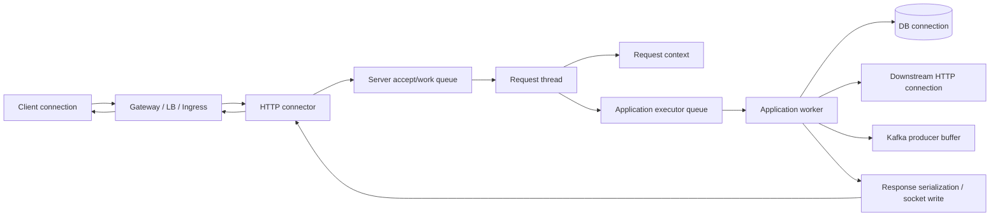
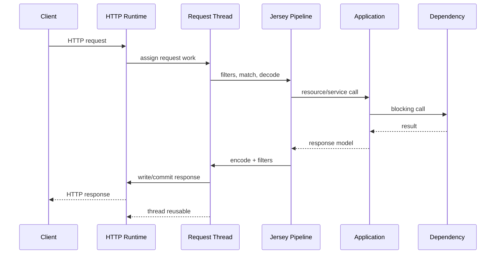
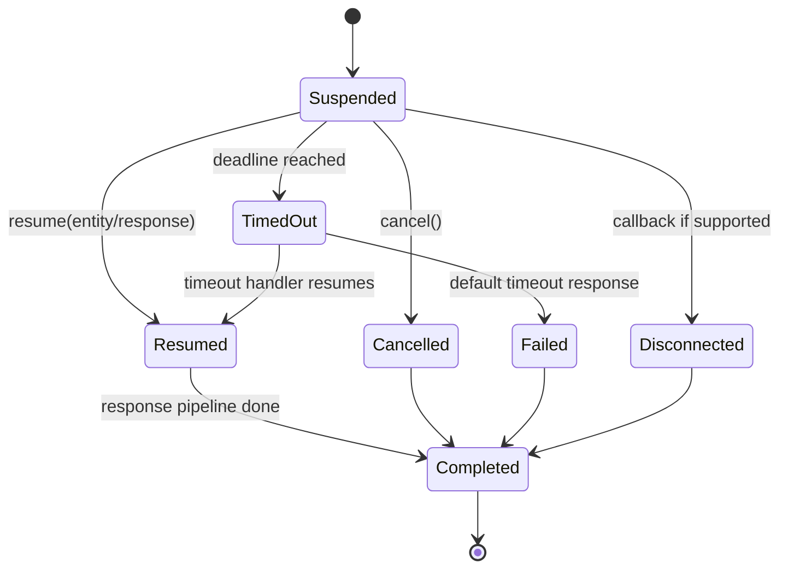
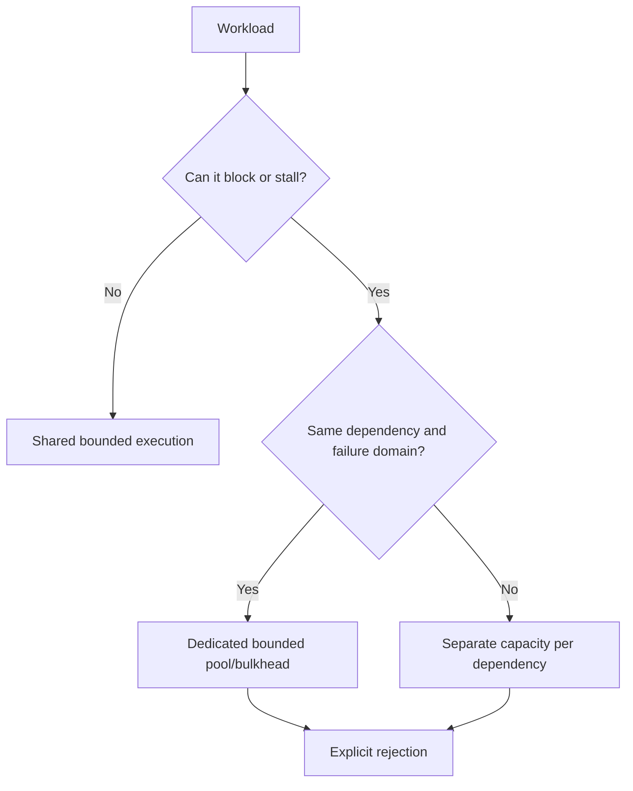
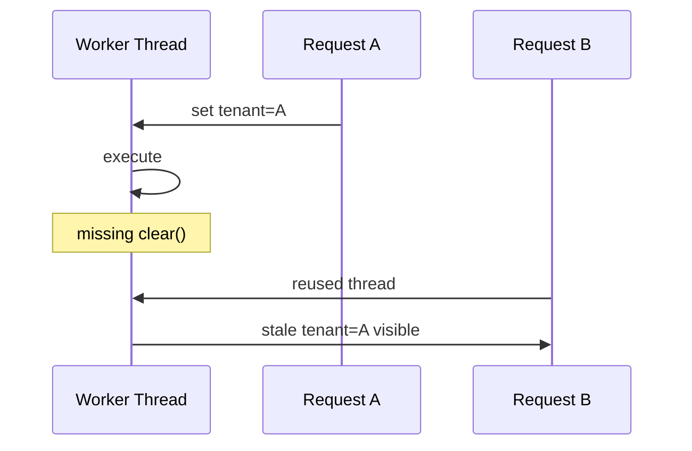
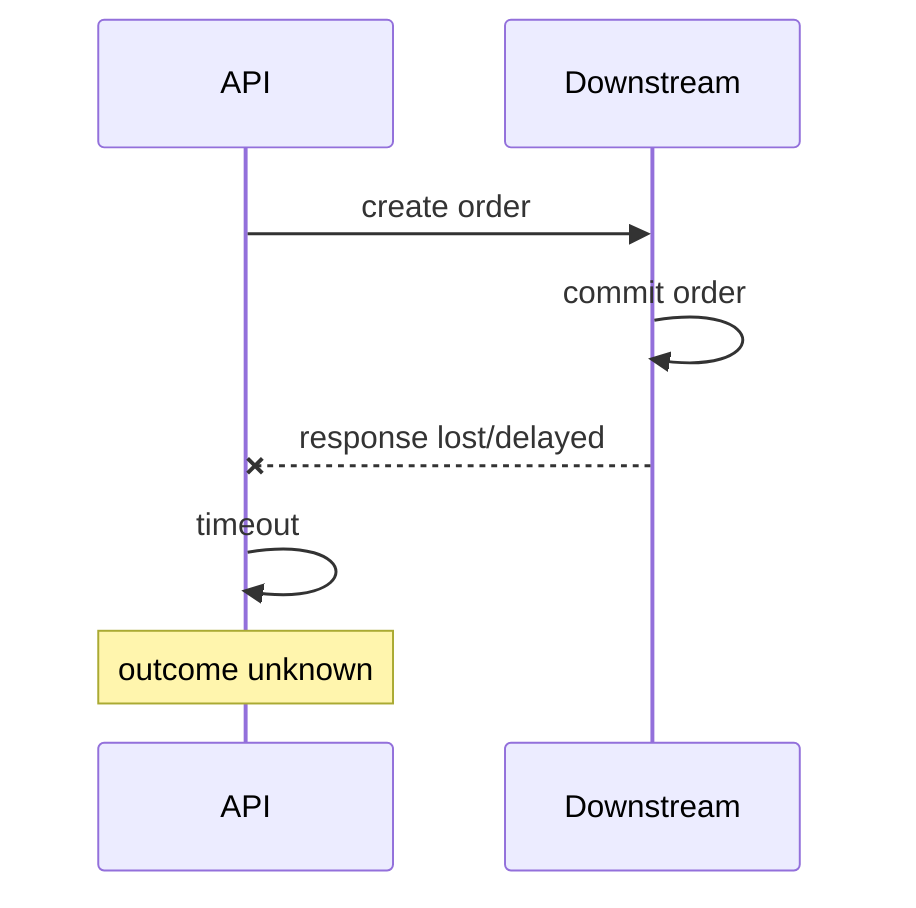
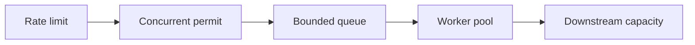
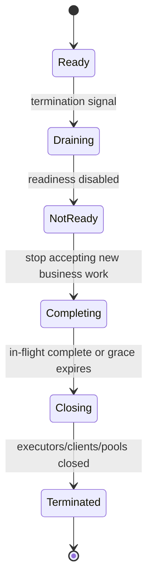

# Part 017 — Threading, Cancellation, Timeout, and Request Context

> Request HTTP tidak berjalan di ruang hampa. Ia meminjam thread, connection, queue slot, transaction, security identity, tenant context, trace context, dan downstream capacity. Begitu eksekusi berpindah thread atau menunggu dependency, semua ownership dan timeout harus tetap eksplisit. Asynchronous API tidak menghilangkan kerja; ia hanya mengubah **di mana**, **kapan**, dan **siapa** yang menanggung kerja tersebut.

## Daftar Isi

1. [Target kompetensi](#target-kompetensi)
2. [Scope dan baseline](#scope-dan-baseline)
3. [Mental model: request is a resource graph](#mental-model-request-is-a-resource-graph)
4. [Terminology map](#terminology-map)
5. [Standard versus implementation-specific boundary](#standard-versus-implementation-specific-boundary)
6. [Thread dan resource ownership map](#thread-dan-resource-ownership-map)
7. [Synchronous request lifecycle](#synchronous-request-lifecycle)
8. [Asynchronous request lifecycle](#asynchronous-request-lifecycle)
9. [AsyncResponse state machine](#asyncresponse-state-machine)
10. [CompletionStage resource methods](#completionstage-resource-methods)
11. [Asynchronous does not mean non-blocking](#asynchronous-does-not-mean-non-blocking)
12. [Server thread pool versus application executor](#server-thread-pool-versus-application-executor)
13. [Executor design](#executor-design)
14. [Bounded queues and rejection](#bounded-queues-and-rejection)
15. [Bulkheading blocking work](#bulkheading-blocking-work)
16. [Common-pool and hidden-executor hazards](#common-pool-and-hidden-executor-hazards)
17. [Jakarta Concurrency in managed runtimes](#jakarta-concurrency-in-managed-runtimes)
18. [Request context taxonomy](#request-context-taxonomy)
19. [ThreadLocal risks](#threadlocal-risks)
20. [Explicit request context objects](#explicit-request-context-objects)
21. [Context propagation across executor boundaries](#context-propagation-across-executor-boundaries)
22. [MDC, trace, tenant, and security context](#mdc-trace-tenant-and-security-context)
23. [Interruption semantics](#interruption-semantics)
24. [Cancellation semantics](#cancellation-semantics)
25. [Client disconnect is not guaranteed cancellation](#client-disconnect-is-not-guaranteed-cancellation)
26. [Timeout, deadline, and budget](#timeout-deadline-and-budget)
27. [Timeout hierarchy](#timeout-hierarchy)
28. [Deadline propagation](#deadline-propagation)
29. [Ambiguous outcomes after timeout](#ambiguous-outcomes-after-timeout)
30. [Completion races and exactly-once response completion](#completion-races-and-exactly-once-response-completion)
31. [Backpressure and admission control](#backpressure-and-admission-control)
32. [Locking, blocking, and deadlock risks](#locking-blocking-and-deadlock-risks)
33. [Graceful shutdown and draining](#graceful-shutdown-and-draining)
34. [Observability](#observability)
35. [Testing strategy](#testing-strategy)
36. [Architecture patterns and anti-patterns](#architecture-patterns-and-anti-patterns)
37. [Failure-model matrix](#failure-model-matrix)
38. [Debugging playbook](#debugging-playbook)
39. [PR review checklist](#pr-review-checklist)
40. [Trade-off yang harus dipahami senior engineer](#trade-off-yang-harus-dipahami-senior-engineer)
41. [Internal verification checklist](#internal-verification-checklist)
42. [Latihan verifikasi](#latihan-verifikasi)
43. [Ringkasan](#ringkasan)
44. [Referensi resmi](#referensi-resmi)

---

## Target kompetensi

Setelah menyelesaikan part ini, Anda harus mampu:

- menggambar perjalanan request beserta setiap thread, queue, connection, dan context yang terlibat;
- membedakan synchronous request, suspended `AsyncResponse`, dan resource method yang mengembalikan `CompletionStage<T>`;
- menjelaskan mengapa asynchronous API tidak otomatis non-blocking atau lebih scalable;
- menentukan siapa yang memiliki, membuat, membatasi, memonitor, dan menghentikan setiap executor;
- memilih queue capacity dan rejection policy berdasarkan overload semantics;
- memisahkan blocking workloads agar tidak menghabiskan server request threads;
- mempropagasikan correlation, trace, tenant, locale, security, dan deadline context lintas executor;
- mengenali `ThreadLocal` leak dan stale-context contamination pada pooled threads;
- membedakan interruption, cancellation, timeout, deadline, disconnect, dan business abort;
- merancang timeout hierarchy yang menyisakan waktu untuk serialization, response delivery, dan cleanup;
- menangani race antara completion, timeout, disconnect, dan shutdown;
- mencegah double response, unbounded queue, thread starvation, dan cascading saturation;
- membuat shutdown/drain behavior yang konsisten dengan Kubernetes termination;
- mendiagnosis stuck request dengan metrics, thread dump, queue depth, dan dependency evidence;
- mereview kode asynchronous dari sisi lifecycle, ownership, failure semantics, dan operability.

---

## Scope dan baseline

Baseline part ini:

- Java 17+;
- Jakarta REST 4.x;
- Jersey 3.x apabila implementation-specific behavior dibahas;
- kemungkinan runtime standalone, Servlet, atau full Jakarta EE;
- service synchronous/blocking sebagai baseline yang paling umum;
- `AsyncResponse` dan `CompletionStage<T>` sebagai standard Jakarta REST asynchronous server APIs;
- `ExecutorService`, `Future`, `CompletableFuture`, interruption, dan Java Memory Model;
- Jakarta Concurrency ketika service berjalan di managed Jakarta EE runtime;
- multi-instance deployment pada container/Kubernetes.

Part ini **tidak** mengasumsikan:

- runtime CSG memakai event-loop atau reactive stack;
- virtual threads tersedia, karena baseline seri adalah Java 17+ dan virtual threads bukan fitur Java 17;
- semua client disconnect dapat dideteksi secara portable;
- `ThreadLocal`, MDC, atau security context otomatis ikut berpindah ke executor lain;
- satu timeout library atau resilience library tertentu dipakai internal.

Deep dive OpenTelemetry berada di Part 023. Retry, circuit breaker, retry budget, hedging, dan graceful degradation berada di Part 024. Part ini membangun primitive concurrency dan deadline yang menjadi fondasinya.

---

## Mental model: request is a resource graph

Request bukan hanya stack frame resource method.



Untuk setiap node, tanyakan:

```text
Siapa owner-nya?
Berapa kapasitasnya?
Apa timeout-nya?
Apa yang terjadi saat penuh?
Bagaimana cancellation dipropagasikan?
Bagaimana context dipropagasikan?
Apa metric dan log yang membuktikan kondisinya?
Bagaimana resource ditutup ketika request selesai atau pod shutdown?
```

Kegagalan production sering terjadi karena satu pertanyaan tidak memiliki jawaban eksplisit.

---

## Terminology map

| Istilah | Arti operasional |
|---|---|
| request thread | thread yang sedang menjalankan pipeline request pada suatu saat |
| connector thread | thread/event-loop yang menerima atau memproses network I/O; model berbeda per runtime |
| worker thread | thread yang menjalankan application task |
| executor | abstraction untuk submission, scheduling, execution, dan termination task |
| queue | buffer antara submission rate dan execution capacity |
| saturation | seluruh worker sibuk dan queue mendekati/penuh |
| rejection | submission baru ditolak karena executor tidak menerima task |
| asynchronous response | response diproduksi setelah resource method kembali ke runtime |
| non-blocking I/O | thread tidak ditahan selama operasi I/O menunggu readiness |
| cancellation | permintaan agar pekerjaan tidak dilanjutkan; bukan jaminan pekerjaan berhenti |
| interruption | cooperative signal pada Java thread |
| timeout | batas durasi relatif untuk suatu operasi |
| deadline | timestamp absolut kapan operasi harus selesai |
| budget | sisa waktu dari deadline untuk seluruh pekerjaan lanjutan |
| context | metadata yang melekat pada request/task, bukan business payload utama |
| backpressure | mekanisme agar producer menyesuaikan atau dibatasi oleh downstream capacity |
| load shedding | menolak pekerjaan lebih awal agar sistem yang tersisa tetap sehat |
| drain | berhenti menerima pekerjaan baru sambil menyelesaikan pekerjaan yang sedang berjalan |

---

## Standard versus implementation-specific boundary

| Capability | Java/Jakarta standard | Jersey-specific/runtime-specific | Harus diverifikasi internal |
|---|---|---|---|
| suspend/resume response | `AsyncResponse`, `@Suspended` | connector/Servlet async integration | apakah dipakai dan executor apa yang digunakan |
| async return type | `CompletionStage<T>` | mapping implementation dan scheduling details | coding convention dan error mapping |
| timeout on suspended response | `AsyncResponse.setTimeout` dan `TimeoutHandler` | runtime timer implementation | default timeout dan response contract |
| completion callback | `CompletionCallback` | invocation thread/details | telemetry/cleanup usage |
| disconnect callback | `ConnectionCallback` support bersifat optional | connector-dependent | apakah runtime mendukung dan reliable |
| executor | Java `ExecutorService`; Jakarta Concurrency di managed EE | Jersey managed async executor, server-specific pools | owner, size, queue, rejection, shutdown |
| request context | Jakarta REST context objects | HK2/CDI/request-scope internals | propagation mechanism |
| MDC | logging-framework feature | adapter/instrumentation-specific | key schema dan cleanup |
| trace context | standard telemetry protocols, bukan core JAX-RS | agent/SDK/framework integration | OpenTelemetry stack internal |
| client disconnect propagation | tidak universal | connector/protocol-specific | observed behavior melalui tests |
| event-loop/non-blocking connector | bukan requirement JAX-RS | Grizzly/Jetty/Netty/runtime-specific | runtime architecture aktual |

Portable code tidak boleh mengandalkan callback disconnect bila runtime belum dibuktikan mendukungnya.

---

## Thread dan resource ownership map

Gunakan matrix seperti ini ketika membaca codebase:

| Resource | Typical owner | Lifetime | Capacity control | Shutdown action |
|---|---|---|---|---|
| acceptor/listener | HTTP runtime | process | connector settings | stop accepting |
| server worker pool | Servlet/Jersey/runtime | runtime | max threads/queue | drain then stop |
| application executor | application/container | application | pool + queue | reject, drain, shutdown |
| scheduled executor | application/container | application | worker count + task count | cancel schedules |
| request scope | JAX-RS/DI container | request | request concurrency | destroy scope |
| database connection | pool/request transaction | operation/transaction | pool size | close/return |
| HTTP client connection | client pool | reusable | max connections | close client |
| Kafka producer | application | application | buffers/in-flight | flush/close bounded |
| timer/deadline task | scheduler/runtime | request/task | timer queue | cancel |
| MDC/ThreadLocal value | application/instrumentation | current execution segment | no natural bound | restore/clear |

A common defect:

```text
Component creates executor internally
→ no capacity exposed
→ no metrics
→ no shutdown hook
→ redeploy leaks thread
→ pod termination waits or exits with incomplete work
```

Rule:

> The component that creates a resource must either own its full lifecycle or transfer ownership through an explicit contract.

---

## Synchronous request lifecycle



Characteristics:

- satu request biasanya menahan satu worker thread selama application processing;
- blocking database atau HTTP call menahan thread tersebut;
- request-scoped objects tersedia pada execution path yang dikelola runtime;
- exception propagation relatif linear;
- timeout tetap dapat terjadi pada gateway, connector, client, database, atau downstream;
- client dapat berhenti menunggu sebelum server selesai.

Synchronous tidak berarti buruk. Untuk banyak enterprise CRUD services, blocking code dengan **bounded concurrency dan timeout yang benar** lebih mudah dipahami dan cukup efisien.

---

## Asynchronous request lifecycle

```mermaid
sequenceDiagram
    participant C as Client
    participant R as Runtime
    participant RT as Request Thread
    participant E as App Executor
    participant WT as Worker Thread
    participant D as Dependency

    C->>R: request
    R->>RT: dispatch
    RT->>RT: filters + resource method
    RT->>E: submit task
    RT-->>R: resource method returns; response suspended
    E->>WT: execute task
    WT->>D: blocking/async operation
    D-->>WT: result
    WT->>R: resume/complete response
    R->>R: response pipeline + serialization
    R-->>C: response
```

Benefit yang mungkin:

- request thread dapat dikembalikan ke pool saat menunggu event eksternal;
- long polling atau delayed response tidak harus menahan request worker;
- composition dengan asynchronous dependencies dapat mengurangi blocked threads.

Cost baru:

- queue dan executor baru;
- context crossing;
- completion race;
- error propagation lebih tersebar;
- callback may execute on unexpected threads;
- cancellation tidak otomatis;
- request-scoped proxy dapat tidak valid setelah scope berakhir atau berpindah thread, tergantung integration;
- shutdown harus menunggu atau membatalkan pending tasks.

Asynchronous design hanya menguntungkan bila bottleneck dan ownership dipahami.

---

## AsyncResponse state machine

`AsyncResponse` adalah handle untuk suspended response, bukan background thread.



Example dengan explicit timeout dan single-completion guard:

```java
@Path("/quotes")
@Produces(MediaType.APPLICATION_JSON)
public final class QuoteResource {
    private final Executor executor;
    private final QuoteService quoteService;

    public QuoteResource(Executor executor, QuoteService quoteService) {
        this.executor = executor;
        this.quoteService = quoteService;
    }

    @GET
    @Path("/{id}")
    public void getQuote(
            @PathParam("id") UUID id,
            @Suspended AsyncResponse response) {

        response.setTimeout(3, TimeUnit.SECONDS);
        response.setTimeoutHandler(ar -> ar.resume(
                Response.status(Response.Status.GATEWAY_TIMEOUT)
                        .entity(new ApiError("QUOTE_LOOKUP_TIMEOUT"))
                        .build()));

        executor.execute(() -> {
            try {
                QuoteView result = quoteService.find(id);
                response.resume(result);
            } catch (Throwable failure) {
                response.resume(failure);
            }
        });
    }
}
```

Review points:

- `response.resume(...)` returns a boolean; false can indicate it was already completed/cancelled;
- timeout response is not proof that background task stopped;
- `resume(Throwable)` still passes through exception mapping behavior;
- no unlimited `new Thread(...)` per request;
- executor rejection must be handled before returning as if work were accepted;
- response timeout must fit inside upstream/gateway timeout;
- cleanup callbacks must tolerate multiple terminal signals.

A safer completion helper:

```java
private static void resumeOnce(AsyncResponse response, Object value) {
    boolean accepted = response.resume(value);
    if (!accepted) {
        // Work completed after timeout/cancel/disconnect.
        // Record metric; release any result-specific resources.
    }
}
```

Do not log late completion as an unconditional error; it may be an expected race. Measure it and investigate sustained rates.

---

## CompletionStage resource methods

Jakarta REST supports returning `CompletionStage<T>` from a resource method.

```java
@GET
@Path("/{id}")
public CompletionStage<Response> get(@PathParam("id") UUID id) {
    return quoteService.findAsync(id)
            .thenApply(view -> Response.ok(view).build())
            .exceptionally(failure -> mapFailure(failure));
}
```

Advantages:

- composition is less imperative than manual `AsyncResponse`;
- one return value represents eventual completion;
- error and transformation stages can be chained;
- easier unit testing when service already returns `CompletionStage`.

Risks:

- stage continuations may execute on the completing thread;
- `thenApplyAsync` without executor uses a default executor, commonly the common pool;
- wrapping blocking work in `supplyAsync` only moves blocking elsewhere;
- cancellation of returned `CompletableFuture` may not cancel underlying database/HTTP operation;
- exception is often wrapped in `CompletionException`;
- thread-local context is not automatically present in continuations;
- unhandled stage failures can disappear into logs/metrics gaps.

Prefer explicit executor for async continuations that perform meaningful work:

```java
return dependency.fetchAsync(id)
        .thenApplyAsync(this::mapToView, mappingExecutor)
        .orTimeout(2, TimeUnit.SECONDS);
```

Caution: `CompletableFuture.orTimeout` completes the future exceptionally; it does not guarantee underlying I/O cancellation.

---

## Asynchronous does not mean non-blocking

Consider:

```java
return CompletableFuture.supplyAsync(
        () -> blockingJdbcRepository.load(id),
        executor);
```

The request thread is released, but another worker thread blocks on JDBC. Total thread cost has moved, not disappeared.

| Design | Request thread blocked? | Other thread blocked? | Requires bounded concurrency? |
|---|---:|---:|---:|
| synchronous JDBC | yes | no additional app worker | yes |
| `supplyAsync` + JDBC | no after submission | yes | yes, often more important |
| non-blocking driver/event API | typically no while waiting | connector/event threads still run callbacks | yes, through in-flight limits |
| long polling with `AsyncResponse` | no while suspended | maybe no worker until event | yes, connection/subscription limits |

Question utama bukan “async atau sync?” tetapi:

```text
Resource apa yang menunggu?
Berapa banyak concurrent wait yang diperbolehkan?
Apa yang terjadi ketika dependency melambat?
```

---

## Server thread pool versus application executor

Do not treat all threads as interchangeable.

| Pool | Typical purpose | Why isolation matters |
|---|---|---|
| connector/event-loop | network accept/read/write | blocking here can stall many connections |
| servlet/server worker | request pipeline | saturation makes all endpoints unavailable |
| application blocking pool | selected blocking dependency/work | isolates known slow workloads |
| CPU pool | bounded computation | prevents CPU oversubscription |
| scheduler | timeouts/periodic triggers | blocking delays all scheduled events |
| Kafka consumer thread | polling and partition ownership | blocking can trigger rebalance |
| database pool | connections, not Java threads | must align with request concurrency |

An application executor is useful only when it has an explicit reason. Creating many pools “for isolation” can instead create:

- too many threads and stacks;
- hidden queues;
- duplicated capacity;
- unfair resource competition;
- impossible global overload control.

Capacity must be designed across the entire process.

---

## Executor design

For every executor, document:

```text
name
owner
workload class
core/max threads
queue type and capacity
rejection policy
expected task duration
maximum acceptable queue wait
context propagation
metrics
shutdown order and timeout
```

Example explicit executor:

```java
AtomicInteger threadSequence = new AtomicInteger();

ThreadFactory factory = runnable -> {
    Thread thread = new Thread(runnable);
    thread.setName("quote-pricing-%d".formatted(threadSequence.incrementAndGet()));
    thread.setDaemon(false);
    thread.setUncaughtExceptionHandler((t, e) ->
            LOGGER.error("Uncaught failure on {}", t.getName(), e));
    return thread;
};

ThreadPoolExecutor pricingExecutor = new ThreadPoolExecutor(
        8,
        8,
        0L,
        TimeUnit.MILLISECONDS,
        new ArrayBlockingQueue<>(100),
        factory,
        new ThreadPoolExecutor.AbortPolicy());
```

Do not copy numbers blindly. Derive them from:

- CPU limits;
- dependency capacity;
- database pool size;
- service-time distribution;
- arrival rate;
- per-tenant fairness;
- latency SLO;
- queue wait budget;
- load tests.

Little's Law is useful as a reasoning aid:

```text
concurrency ≈ throughput × average time in system
```

But averages hide tail latency. Production sizing must inspect p95/p99 service time and saturation behavior.

---

## Bounded queues and rejection

Unbounded queues convert overload into:

- growing latency;
- heap growth;
- stale work;
- timeouts after useless waiting;
- delayed shutdown;
- eventual OOM.

A bounded queue forces an explicit overload decision.

Possible rejection semantics:

| Policy | Behavior | Appropriate when |
|---|---|---|
| abort/reject | fail submission immediately | request can return `429`/`503` |
| caller-runs | submitter executes work | only when blocking caller safely applies backpressure; dangerous on connector/event-loop |
| discard | silently drop | rarely valid for business work |
| discard oldest | removes queued task | dangerous unless tasks are replaceable/superseded |
| custom | map to domain/HTTP overload response | preferred when semantics are explicit |

Example:

```java
try {
    executor.execute(task);
} catch (RejectedExecutionException saturated) {
    return Response.status(Response.Status.SERVICE_UNAVAILABLE)
            .header(HttpHeaders.RETRY_AFTER, "1")
            .entity(new ApiError("CAPACITY_EXHAUSTED"))
            .build();
}
```

Never claim work was accepted before it is durably accepted or successfully queued under a defined contract.

---

## Bulkheading blocking work

A bulkhead prevents one workload from consuming every shared worker.

Example workload classes:

- fast database reads;
- slow external pricing engine;
- file processing;
- report generation;
- synchronous Kafka publication wait;
- CPU-heavy rules evaluation.

Isolation decision:



Bulkhead dimensions can be:

- thread pool;
- semaphore/in-flight permit;
- connection pool;
- queue;
- rate limit;
- tenant quota.

A thread pool alone is not enough if downstream connection pool is much smaller. Excess threads only wait for connections.

---

## Common-pool and hidden-executor hazards

Problematic patterns:

```java
CompletableFuture.supplyAsync(this::blockingCall);
parallelStream.forEach(this::callDependency);
new Timer().schedule(...);
Executors.newCachedThreadPool();
new Thread(task).start();
```

Why dangerous:

- executor ownership is hidden;
- concurrency may be unbounded or shared with unrelated tasks;
- thread names and metrics are poor;
- context is lost;
- shutdown is absent;
- one library can starve another;
- blocking work can damage common `ForkJoinPool` behavior.

Senior PR question:

> Which executor will run this continuation in every completion path, including already-completed futures?

`thenApply` may execute inline on the thread completing the previous stage. `thenApplyAsync` without executor delegates to a default executor. Both can be wrong depending on work performed.

---

## Jakarta Concurrency in managed runtimes

In full Jakarta EE environments, applications should use container-managed concurrency facilities rather than creating unmanaged threads.

Relevant abstractions include:

- `ManagedExecutorService`;
- `ManagedScheduledExecutorService`;
- `ManagedThreadFactory`;
- `ContextService`.

Why managed execution exists:

- container controls lifecycle;
- context can be captured/propagated according to platform rules;
- task execution participates in managed environment constraints;
- redeploy and shutdown can be handled coherently.

Do not assume a standalone Jersey/Grizzly service has Jakarta Concurrency. Do not assume a GlassFish deployment uses it correctly. Verify injection/JNDI bindings and actual submission paths.

Internal decision table:

| Runtime | Preferred executor ownership |
|---|---|
| full Jakarta EE | container-managed executor unless documented exception |
| Servlet container only | application-created executor with explicit lifecycle, or container integration if provided |
| standalone Java SE | application owns executor lifecycle |
| Kubernetes | same as process runtime; Kubernetes does not manage Java executor internals |

---

## Request context taxonomy

Not all context has the same lifetime or security sensitivity.

| Context | Example | Source | Propagation need | Risk if wrong |
|---|---|---|---|---|
| request identity | request ID | ingress/filter | logs, downstream headers | broken correlation |
| trace context | trace/span IDs | telemetry | HTTP/Kafka/executor | disconnected traces |
| tenant context | tenant ID | authenticated claim/header mapping | data/cache/events | cross-tenant leak |
| security context | principal, permissions | auth layer | domain authorization | privilege bypass |
| causation context | command/event causation ID | request/event | emitted events | broken audit chain |
| locale | language/region | header/user profile | formatting only where valid | inconsistent output |
| deadline | remaining time | gateway/header/local policy | downstream calls | work continues uselessly |
| transaction context | DB transaction | transaction manager | usually thread-bound and not freely portable | corruption/illegal use |
| request-scoped DI objects | URI/request metadata | JAX-RS/CDI/HK2 | framework-dependent | invalid proxy/use-after-scope |

Rule:

> Context that affects authorization, tenancy, or data selection should be explicit in application contracts, even when infrastructure also stores it thread-locally.

---

## ThreadLocal risks

`ThreadLocal` associates a value with a thread, not with a logical request.

Pooled-thread lifecycle:



Failure modes:

- stale tenant/security context leaks into next request;
- values remain reachable and leak memory;
- async continuation runs on thread without value;
- callback runs on a thread containing unrelated value;
- nested code overwrites outer context and clears it incorrectly;
- redeploy leak if `ThreadLocal` key/value references application classloader.

Minimum safe scope pattern:

```java
public final class ThreadLocalScope<T> implements AutoCloseable {
    private final ThreadLocal<T> holder;
    private final T previous;

    private ThreadLocalScope(ThreadLocal<T> holder, T value) {
        this.holder = holder;
        this.previous = holder.get();
        holder.set(value);
    }

    public static <T> ThreadLocalScope<T> install(ThreadLocal<T> holder, T value) {
        return new ThreadLocalScope<>(holder, value);
    }

    @Override
    public void close() {
        if (previous == null) {
            holder.remove();
        } else {
            holder.set(previous);
        }
    }
}
```

Usage:

```java
try (var ignored = ThreadLocalScope.install(TENANT, tenantId)) {
    return operation.call();
}
```

This only solves lexical cleanup on the same thread. It does not propagate context to another thread automatically.

---

## Explicit request context objects

Prefer an immutable context object for application semantics:

```java
public record RequestContext(
        String requestId,
        String correlationId,
        String causationId,
        String traceId,
        String tenantId,
        String principalId,
        Instant deadline,
        Locale locale) {

    public RequestContext {
        Objects.requireNonNull(requestId);
        Objects.requireNonNull(tenantId);
        Objects.requireNonNull(deadline);
    }

    public Duration remaining(Clock clock) {
        Duration remaining = Duration.between(clock.instant(), deadline);
        return remaining.isNegative() ? Duration.ZERO : remaining;
    }
}
```

Then pass it explicitly:

```java
QuoteView loadQuote(RequestContext context, UUID quoteId)
```

Benefits:

- dependency is visible in method contract;
- unit tests can create deterministic context;
- context works across threads;
- authorization/tenant requirements are reviewable;
- no accidental dependence on ambient global state.

Do not overload one context object with every possible field. Separate infrastructure telemetry context from business execution context where appropriate.

---

## Context propagation across executor boundaries

A context-aware executor captures selected context at submission time and restores it during task execution.

```java
public final class ContextAwareExecutor implements Executor {
    private final Executor delegate;
    private final RequestContextAccessor accessor;

    public ContextAwareExecutor(Executor delegate, RequestContextAccessor accessor) {
        this.delegate = delegate;
        this.accessor = accessor;
    }

    @Override
    public void execute(Runnable command) {
        ContextSnapshot snapshot = accessor.capture();
        delegate.execute(() -> {
            try (ContextScope ignored = accessor.install(snapshot)) {
                command.run();
            }
        });
    }
}
```

Required properties:

- capture is explicit and cheap;
- only approved context fields are copied;
- restore previous context for nested execution;
- clear in `finally`/`AutoCloseable`;
- submission rejection does not leave installed context;
- immutable snapshots prevent concurrent mutation;
- expired deadlines are checked before task starts;
- metrics distinguish queue wait from execution time.

Avoid capturing entire request/container objects. They may contain streams, mutable headers, security objects, or classloader-sensitive proxies whose lifetime ends before worker execution.

---

## MDC, trace, tenant, and security context

MDC is designed for logging enrichment, not as the authoritative business source of tenant/security identity.

Recommended separation:

```text
Explicit RequestContext
    → authoritative tenant/principal/deadline for application logic
Telemetry Context
    → trace/span/baggage for instrumentation
MDC
    → selected flattened values for log rendering
JAX-RS SecurityContext
    → request boundary identity API
```

Propagation checklist:

- HTTP inbound extracts/creates request and trace identifiers;
- authentication maps principal and tenant from trusted sources;
- request context is immutable;
- executor wrapper propagates approved context;
- HTTP client injects correlation/trace/deadline headers according to contract;
- Kafka producer injects event metadata according to schema governance;
- logs redact sensitive claim values;
- worker clears MDC in all terminal paths;
- response filters do not assume original request thread.

Do not place access tokens, full JWT claims, customer payloads, or unbounded baggage in MDC.

---

## Interruption semantics

Java interruption is cooperative.

```java
try {
    blockingQueue.take();
} catch (InterruptedException interrupted) {
    Thread.currentThread().interrupt();
    throw new OperationCancelledException(interrupted);
}
```

Important:

- `interrupt()` sets a signal; it does not forcibly kill a thread;
- some blocking JDK methods throw `InterruptedException` and clear the flag;
- code should usually restore the interrupt flag when translating the exception;
- CPU loops must check interruption explicitly if cancellation matters;
- many I/O libraries have their own cancellation/timeout mechanism;
- swallowing interruption makes shutdown and cancellation unreliable;
- interruption after commit cannot undo business mutation.

Bad:

```java
catch (InterruptedException ignored) {
    // continue as if nothing happened
}
```

Better:

```java
catch (InterruptedException interrupted) {
    Thread.currentThread().interrupt();
    rollbackOrStopSafely();
    throw new CancellationException("Operation interrupted");
}
```

Whether rollback is possible depends on transaction and external side effects.

---

## Cancellation semantics

Cancellation is a protocol, not one method call.

Possible layers:

1. caller stops waiting;
2. HTTP client cancels a `Future`;
3. server detects disconnect;
4. application cancellation token is signalled;
5. executor task is interrupted;
6. JDBC statement is cancelled or times out;
7. downstream HTTP request is cancelled;
8. business workflow is marked cancelled;
9. compensation/reconciliation handles committed side effects.

A robust cancellation token:

```java
public interface CancellationToken {
    boolean isCancellationRequested();

    default void throwIfCancellationRequested() {
        if (isCancellationRequested()) {
            throw new CancellationException("Cancellation requested");
        }
    }
}
```

Use at safe checkpoints, not after every line.

Cancellation policy must state:

- which operations are cancellable;
- until what commit point;
- whether cancellation is best effort;
- whether partial results are retained;
- what response/status is produced;
- how duplicate cancellation is handled;
- how audit and reconciliation record the outcome.

---

## Client disconnect is not guaranteed cancellation

A disconnected client may mean:

- browser closed;
- mobile network changed;
- proxy closed idle connection;
- upstream timeout expired;
- response path failed;
- load balancer reset connection;
- application pod is draining.

It does **not** necessarily mean business work should stop.

Examples:

| Operation | On disconnect |
|---|---|
| pure read/query | cancellation is often desirable |
| report stream | stop generation if result is not reusable |
| create order after durable acceptance | continue and expose retrievable outcome |
| payment/activation command | never infer cancellation solely from socket loss |
| idempotent recomputation | may cancel and retry later |

Jakarta REST `ConnectionCallback` support is optional. Even when supported, delivery can be delayed or connector-specific. Treat it as a cleanup hint, not the sole correctness mechanism.

---

## Timeout, deadline, and budget

Three distinct concepts:

```text
Timeout: "wait at most 2 seconds from now"
Deadline: "finish before 10:00:05.250Z"
Budget: "1.35 seconds remain for everything downstream"
```

Deadlines compose better across service hops because elapsed time is not reset accidentally.

```java
public record Deadline(Instant value) {
    public Duration remaining(Clock clock) {
        Duration duration = Duration.between(clock.instant(), value);
        return duration.isNegative() ? Duration.ZERO : duration;
    }

    public boolean expired(Clock clock) {
        return !clock.instant().isBefore(value);
    }
}
```

Timeout selection must consider:

- upstream deadline;
- queue wait;
- connection acquisition;
- request write;
- server processing;
- response read;
- retries if any;
- serialization;
- response flush;
- cleanup/rollback margin.

A 3-second gateway timeout with a 5-second database timeout guarantees wasted work during slow queries.

---

## Timeout hierarchy

Desired nesting:

```text
Client deadline
  > Gateway/ingress timeout
    > Application request deadline
      > Downstream call timeout + local processing margin
        > Connection acquisition timeout
```

Example budget:

```text
External client budget:       5,000 ms
Gateway forwarding budget:    4,700 ms
Application deadline:         4,300 ms
Queue/admission allowance:      200 ms
Pricing downstream timeout:   3,300 ms
Mapping/serialization margin:   300 ms
Response/network margin:        500 ms
```

Do not interpret these values as recommended defaults. They illustrate containment.

Timeout categories:

| Timeout | What it limits |
|---|---|
| connection timeout | time to establish connection |
| pool acquisition timeout | wait for reusable connection/resource |
| read timeout | wait for incoming bytes/data |
| write timeout | wait for outgoing write progress |
| request timeout | total application/request duration |
| transaction timeout | database transaction lifetime |
| statement timeout | database statement execution |
| async response timeout | suspended response duration |
| queue timeout | maximum wait before task starts |
| idle timeout | no traffic on long-lived connection |

One generic “timeout” property is usually insufficient.

---

## Deadline propagation

Propagation options:

- absolute deadline timestamp;
- remaining-time header;
- protocol-native deadline where supported;
- internal context only, with local downstream timeout derived from it.

Rules:

- accept only trusted/validated upstream deadline input;
- cap excessively long deadlines;
- reject or fail fast when already expired;
- subtract safety margin;
- do not extend deadline at each hop;
- use monotonic time for elapsed duration measurement where possible;
- use wall-clock `Instant` for cross-process absolute timestamps;
- record configured timeout and effective remaining budget separately.

Example derivation:

```java
Duration remaining = context.remaining(clock);
Duration localCap = Duration.ofSeconds(2);
Duration safety = Duration.ofMillis(100);
Duration effective = remaining.minus(safety).compareTo(localCap) < 0
        ? remaining.minus(safety)
        : localCap;

if (effective.isZero() || effective.isNegative()) {
    throw new DeadlineExceededException();
}
```

---

## Ambiguous outcomes after timeout

Timeout answers only:

> The observer did not receive completion within its waiting budget.

It does not prove mutation did not happen.



Correct strategies:

- idempotency key;
- operation status resource;
- query by client/business reference;
- durable command acceptance;
- outbox/inbox pattern;
- reconciliation job;
- explicit `UNKNOWN` or `PENDING_CONFIRMATION` internal state;
- avoid blind retry of non-idempotent mutation.

Never map all downstream timeouts to “operation failed” when side effects may have committed.

---

## Completion races and exactly-once response completion

Possible terminal events:

- worker succeeds;
- worker fails;
- async response timeout fires;
- client disconnect callback fires;
- cancellation requested;
- shutdown begins;
- duplicate callback arrives.

Use an atomic terminal guard when multiple sources own completion:

```java
public final class RequestCompletion {
    private final AtomicBoolean terminal = new AtomicBoolean();

    public boolean tryComplete(Runnable action) {
        if (!terminal.compareAndSet(false, true)) {
            return false;
        }
        action.run();
        return true;
    }
}
```

But do not confuse:

- exactly-once **local completion decision**;
- exactly-once network delivery, which is not guaranteed;
- exactly-once business mutation, which needs idempotency/transaction design.

Terminal handlers must be idempotent:

```text
cancel timer
release permit
remove subscription
close stream
end span
clear context
record terminal metric
```

Each may be called from more than one race path unless guarded.

---

## Backpressure and admission control

Server capacity should be enforced before expensive work begins.

Layers:



Signals to inspect:

- active request count;
- executor active threads;
- queue depth;
- queue wait time;
- rejection count;
- database pool waiters;
- HTTP connection-pool waiters;
- dependency latency;
- CPU throttling;
- heap/native-memory pressure.

Admission policy examples:

- global concurrent request limit;
- endpoint-specific limit;
- dependency-specific semaphore;
- tenant quota;
- priority lane for operational endpoints;
- reject long-running work when remaining deadline is too short.

Avoid queueing work whose deadline will expire before expected start time.

---

## Locking, blocking, and deadlock risks

Request thread can become stuck on:

- Java monitor (`synchronized`);
- `ReentrantLock`;
- future `get()`/`join()`;
- semaphore;
- bounded queue put/take;
- database connection acquisition;
- database row/table lock;
- HTTP connection pool;
- file lock;
- class initialization lock;
- logging appender backpressure.

Thread-pool deadlock example:

```text
Pool size = 8
8 parent tasks running
Each parent submits child task to same pool
Each parent blocks waiting for child
No thread remains to run children
```

Bad:

```java
Future<Result> child = executor.submit(this::calculate);
return child.get(); // inside same saturated executor
```

Avoid blocking waits inside the same bounded executor that must run the awaited work.

Thread dumps reveal states, but correlate them with queue, pool, DB lock, and dependency metrics before drawing conclusions.

---

## Graceful shutdown and draining

Shutdown is a state transition, not `System.exit`.



Recommended sequence:

1. mark instance not ready;
2. stop new external traffic;
3. stop accepting new background tasks;
4. allow in-flight requests a bounded grace period;
5. cancel tasks that are safe to cancel;
6. flush/commit durable accepted work according to contract;
7. stop schedulers and consumers;
8. close HTTP/Kafka/database clients in dependency-aware order;
9. terminate executors;
10. record incomplete work for reconciliation;
11. exit before platform termination deadline.

Example executor shutdown:

```java
public static void shutdown(
        ExecutorService executor,
        Duration grace) {
    executor.shutdown();
    try {
        if (!executor.awaitTermination(grace.toMillis(), TimeUnit.MILLISECONDS)) {
            List<Runnable> abandoned = executor.shutdownNow();
            LOGGER.warn("Forced executor shutdown; abandonedTasks={}", abandoned.size());
        }
    } catch (InterruptedException interrupted) {
        Thread.currentThread().interrupt();
        executor.shutdownNow();
    }
}
```

`shutdownNow()` is best effort. It interrupts running tasks and returns queued tasks, but cannot guarantee termination.

---

## Observability

Minimum executor metrics:

- configured core/max threads;
- active thread count;
- pool size;
- queue capacity and depth;
- task submission rate;
- rejection count;
- queue wait histogram;
- execution duration histogram;
- task completion/failure/cancellation counts;
- oldest queued-task age;
- shutdown/drain duration.

Minimum request concurrency metrics:

- active requests by endpoint class;
- synchronous versus async requests;
- suspended responses;
- timeout count by layer;
- late completions after timeout;
- disconnect callbacks;
- deadline-expired-before-start count;
- in-flight permits used;
- response completion state.

Log fields:

```text
request_id
correlation_id
trace_id
span_id
tenant_id (approved representation)
endpoint
executor
queue_wait_ms
execution_ms
remaining_budget_ms
configured_timeout_ms
completion_reason
thread_name
```

Do not add user IDs, quote IDs, or tenant IDs as unbounded metric labels unless cardinality policy explicitly permits it.

Thread dump interpretation:

| Observation | Possible meaning |
|---|---|
| most server threads waiting for DB connection | pool mismatch or leaked/slow transactions |
| executor threads blocked on HTTP read | downstream slowness/read timeout too high |
| many threads waiting on same monitor | contention or lock convoy |
| scheduler thread blocked | timeout/heartbeat jobs delayed |
| common-pool threads blocked | hidden blocking async work |
| hundreds of application-created thread names | unbounded thread creation/leak |

---

## Testing strategy

### Unit tests

Test:

- deadline calculation with injected `Clock`;
- expired deadline fail-fast;
- context capture/install/restore;
- nested context restoration;
- interruption translation restores flag;
- atomic terminal guard;
- timeout mapping;
- rejection mapping;
- cancellation checkpoints.

### Concurrency tests

Use barriers/latches to force race conditions:

```java
@Test
void timeoutAndSuccessCannotBothComplete() throws Exception {
    RequestCompletion completion = new RequestCompletion();
    AtomicInteger actions = new AtomicInteger();

    ExecutorService pool = Executors.newFixedThreadPool(2);
    CountDownLatch start = new CountDownLatch(1);

    Future<?> first = pool.submit(() -> {
        await(start);
        completion.tryComplete(actions::incrementAndGet);
    });
    Future<?> second = pool.submit(() -> {
        await(start);
        completion.tryComplete(actions::incrementAndGet);
    });

    start.countDown();
    first.get();
    second.get();

    assertEquals(1, actions.get());
    pool.shutdownNow();
}
```

### Integration tests

Verify:

- runtime behavior of `AsyncResponse` timeout;
- `CompletionCallback` execution;
- whether `ConnectionCallback` is supported;
- context across filters, resource, executor, client, and response;
- client disconnect behavior;
- gateway timeout versus server continuation;
- graceful shutdown with in-flight async work;
- thread and queue metrics;
- rejected execution returns expected API contract.

### Load and saturation tests

Scenarios:

- dependency latency gradually increases;
- executor queue fills;
- DB pool is smaller than request concurrency;
- one tenant creates burst load;
- cancellations and timeouts spike;
- rolling shutdown under load;
- downstream returns after caller deadline;
- context contamination detection across reused threads.

Success criteria must include bounded memory, bounded queue, predictable rejection, and recovery—not merely throughput.

---

## Architecture patterns and anti-patterns

### Pattern: synchronous and bounded

```text
Server worker
  → bounded connection pools
  → strict downstream timeouts
  → admission control
```

Good default when workload is ordinary blocking CRUD and capacity is understood.

### Pattern: suspended request waiting for external event

```text
Request thread registers waiter
  → AsyncResponse suspended
  → event arrives
  → terminal guard resumes response
  → waiter removed
```

Requires timeout, bounded waiter registry, disconnect cleanup, and shutdown draining.

### Pattern: explicit context snapshot

```text
Inbound filter creates RequestContext
  → service receives explicit context
  → executor wrapper captures infrastructure context
  → worker restores and clears
```

### Anti-pattern: async wrapping everywhere

```java
return CompletableFuture.supplyAsync(() -> service.call());
```

without executor, timeout, cancellation, context, or measurable benefit.

### Anti-pattern: one executor per class

Creates fragmented, hidden capacity and shutdown complexity.

### Anti-pattern: unbounded queue as reliability

It delays failure until latency and memory become catastrophic.

### Anti-pattern: request-scoped proxy stored for later

The proxy may outlive request scope or bind to invalid runtime state.

### Anti-pattern: timeout means rollback

The server/downstream may have committed work before timeout was observed.

### Anti-pattern: ThreadLocal as tenant source of truth

It enables cross-request contamination and makes data access contracts invisible.

---

## Failure-model matrix

| Failure | Cause | Observable symptom | Immediate containment | Structural fix |
|---|---|---|---|---|
| server thread exhaustion | slow blocking dependency | request latency and queue rise | shed load, reduce timeout | isolate/bound dependency concurrency |
| executor queue growth | unbounded queue | heap/latency growth | reject new work | bounded queue + admission policy |
| task rejection unhandled | saturated/shutdown executor | `500` or hung async response | map rejection explicitly | capacity contract and tests |
| double response completion | timeout/success race | warnings, lost error, duplicate cleanup | terminal guard | single owner/idempotent terminal actions |
| stale tenant context | missing ThreadLocal cleanup | cross-tenant logs/data | disable affected path, restart if needed | explicit context + scoped cleanup |
| missing trace context | async boundary not instrumented | fragmented traces | log correlation manually | context-aware executor/OTel integration |
| swallowed interruption | broad catch | shutdown hangs | force termination | restore interrupt and cooperative cancellation |
| timeout but work continues | timeout only completes wrapper | wasted capacity/side effects | cap in-flight work | propagate cancellation/dependency timeout |
| common-pool starvation | blocking async tasks | unrelated futures stall | move blocking work | explicit bounded executor |
| pool deadlock | parent waits for child in same pool | all workers waiting | interrupt/restart if unrecoverable | avoid nested blocking dependency |
| deadline inversion | downstream timeout exceeds caller budget | useless late work | reduce effective timeouts | propagated deadline hierarchy |
| disconnect leaks waiter | callback unavailable/cleanup absent | growing suspended count | sweep expired waiters | timeout-based cleanup, bounded registry |
| shutdown drops accepted work | no drain/durability | missing operations | reconcile | durable acceptance and shutdown protocol |
| too many executors | local optimizations | high native memory/context switching | consolidate pools | process-wide capacity design |
| scheduler starvation | blocking scheduled task | timers/heartbeats late | separate task or restart | scheduler only triggers bounded work |
| DB pool wait dominates | Java concurrency > DB capacity | pool acquisition timeout | reject/limit requests | align concurrency and connection capacity |

---

## Debugging playbook

### Symptom: requests hang or latency suddenly rises

1. Confirm affected endpoints and start time.
2. Compare request rate with active requests.
3. Inspect server worker utilization and queue.
4. Inspect application executor active threads, queue depth, and oldest task age.
5. Inspect DB/HTTP connection-pool waiters.
6. Capture multiple thread dumps separated by several seconds.
7. Group stacks by blocking point.
8. Check downstream latency and timeout changes.
9. Check CPU throttling and memory pressure.
10. Determine whether system is busy, blocked, deadlocked, or queueing.

### Symptom: request times out but downstream traffic remains high

1. Identify which layer timed out.
2. Confirm whether cancellation reached worker/future/client.
3. Compare timeout count with late-completion metric.
4. Check downstream call timeout and pool acquisition timeout.
5. Inspect whether queued tasks start after their deadlines.
6. Add fail-fast deadline check before dependency call.
7. Add bounded in-flight permits.

### Symptom: wrong tenant/correlation appears in logs

1. Identify thread name and previous request on same thread.
2. inspect MDC/ThreadLocal setup and cleanup in `finally`.
3. inspect executor wrapper and nested scope restoration.
4. verify immutable context snapshot.
5. test sequential tasks on one worker with different tenant IDs.
6. treat any possible cross-tenant data access as a security incident.

### Symptom: graceful shutdown exceeds termination window

1. Determine whether readiness changed before shutdown.
2. list non-daemon threads and executor states.
3. inspect queued/running tasks.
4. find swallowed interruptions.
5. inspect HTTP/Kafka/DB client close waits.
6. compare application grace with Kubernetes termination grace.
7. define forced termination and reconciliation behavior.

### Symptom: asynchronous response never completes

1. inspect suspended-response gauge;
2. verify timeout is always configured;
3. inspect executor rejection path;
4. check all exception branches resume/complete;
5. check callback registration and task submission ordering;
6. inspect worker thread dump;
7. verify no completion was lost due to container/request-scope failure;
8. reproduce with runtime integration test.

---

## PR review checklist

### Thread and executor ownership

- [ ] Every executor has one explicit owner.
- [ ] Pool size and queue capacity are bounded and justified.
- [ ] Thread names identify workload.
- [ ] Rejection behavior is mapped to an explicit contract.
- [ ] Shutdown and drain behavior exist.
- [ ] No hidden `new Thread`, cached pool, timer, or common-pool blocking work.
- [ ] Metrics cover queue, active tasks, rejection, and duration.

### Asynchronous Jakarta REST

- [ ] Async is used for a measured reason, not style.
- [ ] `AsyncResponse` always has a bounded timeout.
- [ ] Submission rejection cannot leave response suspended.
- [ ] All success/failure paths complete exactly once.
- [ ] Late completion is safe and observable.
- [ ] `CompletionStage` continuations use intentional executors.
- [ ] Wrapped exceptions are mapped consistently.
- [ ] Runtime support for disconnect callbacks is not assumed.

### Context

- [ ] Tenant/security context is explicit in application contracts.
- [ ] MDC is logging metadata, not authorization source of truth.
- [ ] ThreadLocal values are restored/cleared in all paths.
- [ ] Context propagation across executor and client boundaries is tested.
- [ ] Sensitive data is not propagated in baggage/MDC.
- [ ] Request-scoped objects are not retained beyond valid lifetime.

### Cancellation and timeout

- [ ] Cancellation semantics are documented as best effort or guaranteed at specific boundaries.
- [ ] `InterruptedException` is not swallowed.
- [ ] Underlying dependency has its own timeout/cancellation.
- [ ] Deadline is not reset at each hop.
- [ ] Downstream timeout fits inside caller budget.
- [ ] Queue wait is included in effective deadline.
- [ ] Timeout does not incorrectly imply transaction rollback.
- [ ] Ambiguous mutations have idempotency/reconciliation strategy.

### Overload and shutdown

- [ ] Admission control precedes expensive work.
- [ ] Java concurrency aligns with DB/HTTP dependency capacity.
- [ ] Queues cannot grow without bound.
- [ ] Health endpoints retain capacity under business overload.
- [ ] Readiness changes before resource shutdown.
- [ ] In-flight and accepted work have explicit termination policy.

---

## Trade-off yang harus dipahami senior engineer

### Synchronous versus asynchronous

| Synchronous | Asynchronous |
|---|---|
| simpler stack and context | frees request worker during waits |
| blocking thread per active wait | introduces queue/continuation complexity |
| easier exception flow | distributed completion/error paths |
| capacity often easier to reason | useful for long waits or async dependencies |

Choose based on measured resource pressure and dependency model.

### Shared versus dedicated executor

| Shared | Dedicated |
|---|---|
| fewer total threads | failure isolation |
| simpler global capacity | independent tuning |
| risk noisy neighbor | risk fragmented/overprovisioned capacity |

Use the smallest number of workload pools that preserves meaningful failure isolation.

### ThreadLocal versus explicit context

| ThreadLocal | Explicit context |
|---|---|
| convenient for instrumentation | visible, testable, thread-independent |
| hidden dependency | more parameter plumbing |
| leak/contamination risk | better domain and security reviewability |

A hybrid is normal: explicit business context plus infrastructure-managed telemetry context.

### Cancellation aggressiveness

Aggressive cancellation saves capacity but may:

- interrupt operations at unsafe points;
- produce ambiguous side effects;
- complicate cleanup;
- increase downstream load through retries.

Conservative continuation protects committed work but may waste capacity after caller abandonment. Decide per operation class.

### Queueing versus rejection

Queueing smooths short bursts. Rejection preserves latency and memory during sustained overload. Queue capacity should represent an acceptable wait budget, not available heap.

---

## Internal verification checklist

### Runtime and request threading

- [ ] Runtime: GlassFish, Grizzly, Tomcat, Jetty, or another server.
- [ ] Connector/event-loop/worker threading model.
- [ ] Server worker pool size and queue.
- [ ] Whether request processing is blocking or event-loop based.
- [ ] Servlet async support and configuration.
- [ ] Jersey async configuration and custom features.

### Executors

- [ ] Inventory every `Executor`, `ExecutorService`, scheduler, timer, and thread factory.
- [ ] Identify creator, owner, consumers, capacity, and shutdown hook.
- [ ] Search for `supplyAsync`, `then*Async`, parallel streams, `new Thread`, cached pools, and common pool usage.
- [ ] Determine whether managed Jakarta Concurrency is available/required.
- [ ] Verify queue type, capacity, and rejection handler.
- [ ] Verify metrics and thread naming.

### Timeout and cancellation

- [ ] Gateway, ingress, load balancer, server, endpoint, client, DB, and messaging timeouts.
- [ ] Deadline propagation standard.
- [ ] Whether queue wait consumes request budget.
- [ ] Cancellation behavior of HTTP/JDBC libraries.
- [ ] Runtime support for `ConnectionCallback`.
- [ ] Timeout-to-error-code mapping.
- [ ] Late completion and ambiguous-outcome handling.

### Context propagation

- [ ] Correlation/request/causation ID definitions.
- [ ] Tenant context source and trust boundary.
- [ ] Security context representation.
- [ ] MDC key standard and cleanup.
- [ ] OpenTelemetry agent/SDK integration.
- [ ] Executor context wrapper or Jakarta `ContextService` usage.
- [ ] HTTP and Kafka context propagation contracts.
- [ ] Request-scoped dependency usage across async boundaries.

### Capacity and operations

- [ ] Maximum concurrent requests by endpoint/workload.
- [ ] DB pool and HTTP pool alignment.
- [ ] Admission control and load shedding.
- [ ] Per-tenant fairness controls.
- [ ] Thread/queue dashboards and alerts.
- [ ] Thread dump capture procedure.
- [ ] Kubernetes termination grace and application drain timeout.
- [ ] Reconciliation process for interrupted accepted work.

---

## Latihan verifikasi

### Exercise 1 — Draw the real request thread graph

Choose one read endpoint and one mutation endpoint. Record:

```text
inbound connector
request worker
JAX-RS filters
resource/service
DB/HTTP/Kafka calls
executors and queues
context transitions
timeout at every layer
shutdown behavior
```

Mark every thread transition in red in your own diagram.

### Exercise 2 — Saturation experiment

In a safe local/test environment:

1. make a dependency respond slowly;
2. send load above steady-state capacity;
3. observe server threads, app executor, DB/HTTP pool, queue, and memory;
4. confirm whether latency grows unbounded or requests reject predictably;
5. verify recovery after dependency returns to normal.

### Exercise 3 — Context contamination test

Run two tasks sequentially on a single-thread executor:

```text
Task A: tenant=A, correlation=A
Task B: tenant=B, correlation=B
```

Assert Task B never observes A, including on failure and cancellation paths.

### Exercise 4 — Timeout race

Force worker completion and timeout to occur concurrently. Verify:

- only one response completion wins;
- permits/timers are released once;
- late completion is measured;
- underlying side effects are reconciled correctly.

### Exercise 5 — Shutdown under load

Terminate one test instance while requests are active. Observe:

- readiness transition;
- new request routing;
- in-flight completion;
- interrupted tasks;
- executor termination;
- lost/duplicated business operations.

---

## Ringkasan

Mental model utama:

```text
Request
  = execution + context + deadline + capacity reservation + resource ownership
```

Invariants:

1. setiap thread pool dan queue harus bounded, observable, dan memiliki owner;
2. asynchronous API memindahkan waiting/continuation, bukan menghapus kerja;
3. `ThreadLocal` mengikuti thread, bukan logical request;
4. context yang memengaruhi security dan tenancy harus eksplisit;
5. cancellation bersifat cooperative dan harus menjangkau dependency bila ingin menghemat kerja;
6. timeout bukan bukti mutation tidak terjadi;
7. deadline harus menyusut, bukan di-reset pada setiap hop;
8. completion, timeout, disconnect, dan shutdown adalah race yang harus didesain;
9. overload harus ditolak sebelum menjadi unbounded queue;
10. shutdown harus drain dan menutup resources dalam urutan yang dapat dibuktikan.

Senior engineer tidak hanya melihat `CompletableFuture` atau annotation. Ia menelusuri siapa yang menjalankan continuation, berapa banyak task dapat menunggu, context apa yang hilang, apa yang terjadi setelah timeout, dan bagaimana sistem pulih ketika dependency melambat atau pod diterminasi.

---

## Referensi resmi

- [Jakarta RESTful Web Services 4.0 Specification](https://jakarta.ee/specifications/restful-ws/4.0/jakarta-restful-ws-spec-4.0.html)
- [Jakarta REST `AsyncResponse` API](https://jakarta.ee/specifications/restful-ws/4.0/apidocs/jakarta.ws.rs/jakarta/ws/rs/container/asyncresponse)
- [Jakarta Concurrency 3.1 Specification](https://jakarta.ee/specifications/concurrency/3.1/jakarta-concurrency-spec-3.1)
- [Java SE 17 `ExecutorService`](https://docs.oracle.com/en/java/javase/17/docs/api/java.base/java/util/concurrent/ExecutorService.html)
- [Java SE 17 `ThreadPoolExecutor`](https://docs.oracle.com/en/java/javase/17/docs/api/java.base/java/util/concurrent/ThreadPoolExecutor.html)
- [Java SE 17 `Future`](https://docs.oracle.com/en/java/javase/17/docs/api/java.base/java/util/concurrent/Future.html)
- [Java SE 17 `CompletableFuture`](https://docs.oracle.com/en/java/javase/17/docs/api/java.base/java/util/concurrent/CompletableFuture.html)
- [Java Language Specification — Threads and Locks](https://docs.oracle.com/javase/specs/jls/se17/html/jls-17.html)
- [Jersey User Guide — Asynchronous Services](https://eclipse-ee4j.github.io/jersey.github.io/documentation/latest3x/async.html)
