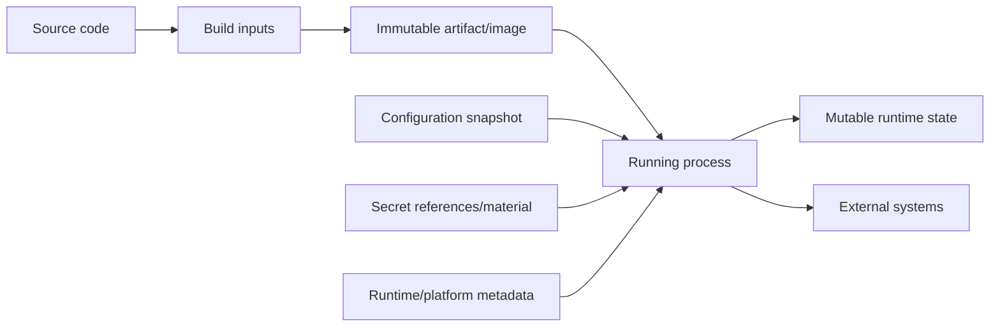
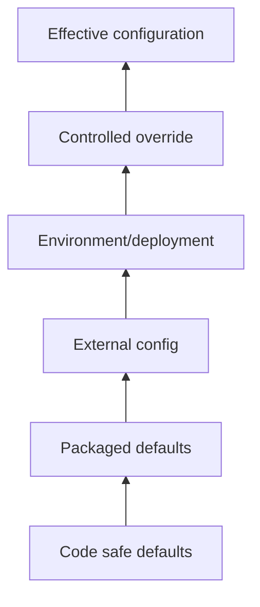
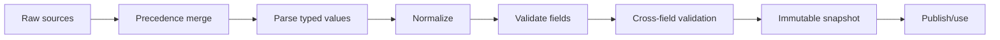
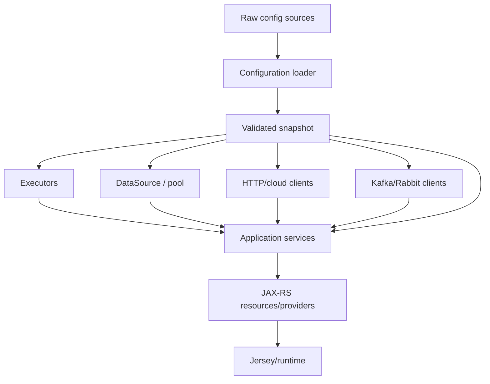
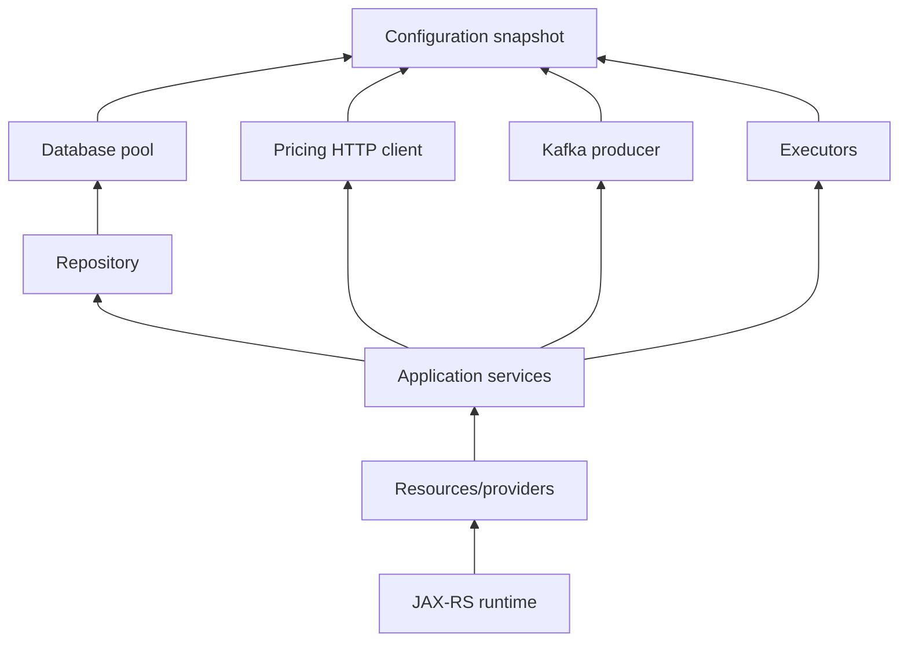
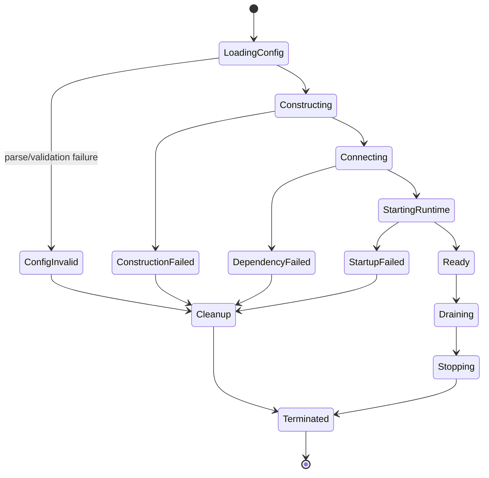
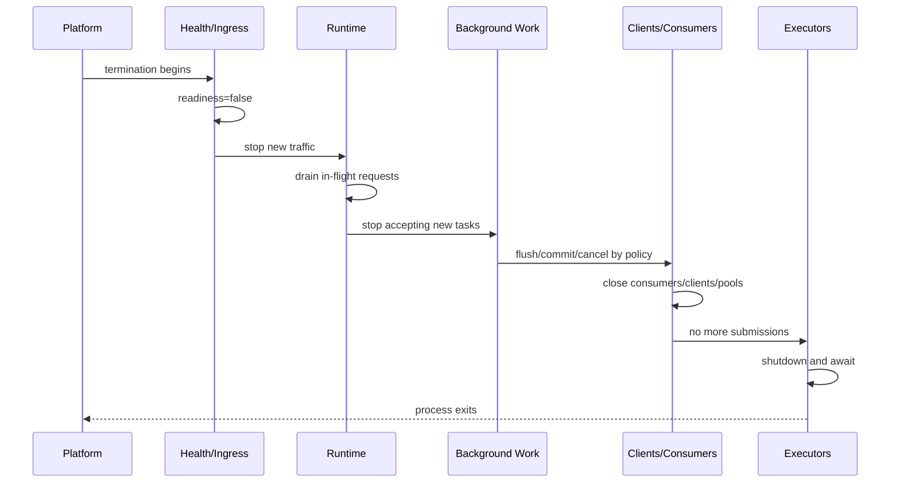
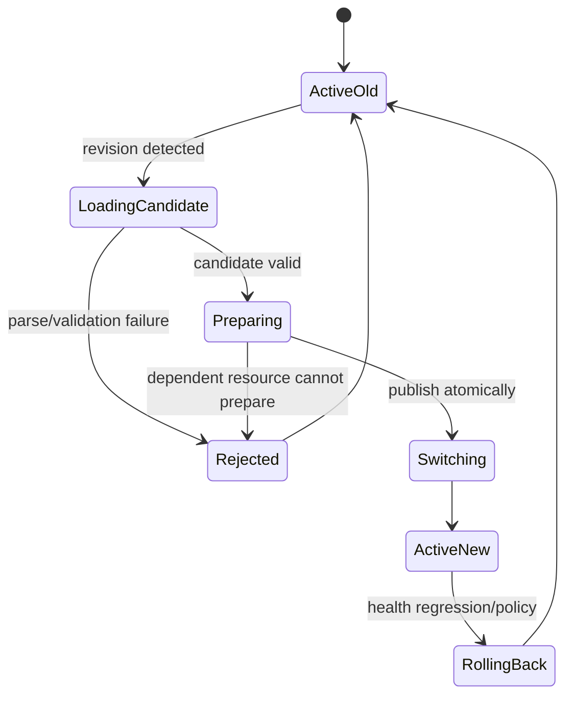
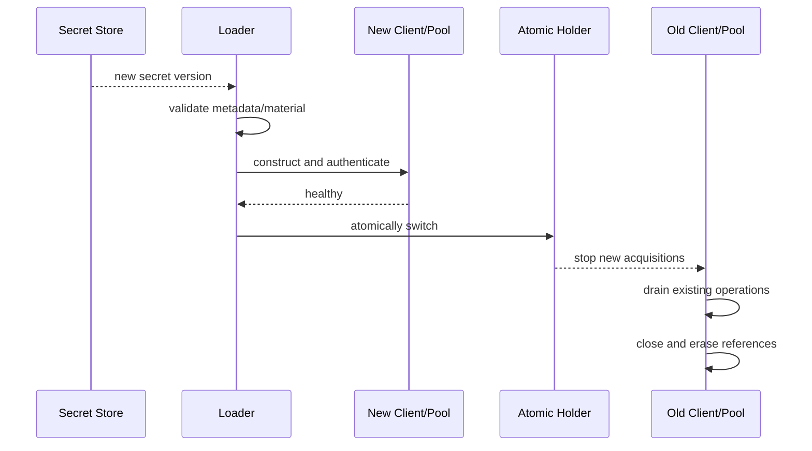

# Part 018 — Application Composition, Profiles, and Configuration Lifecycle

> Configuration adalah input yang mengubah perilaku executable artifact tanpa mengubah source code. Karena itu, configuration adalah bagian dari sistem kontrol production: ia harus memiliki source of truth, precedence, schema, validation, security boundary, version, rollout, observability, dan rollback. Service yang “bisa start” tetapi tidak dapat menjelaskan effective configuration-nya belum production-ready.

## Daftar Isi

1. [Target kompetensi](#target-kompetensi)
2. [Scope dan baseline](#scope-dan-baseline)
3. [Mental model: artifact + configuration + runtime state](#mental-model-artifact--configuration--runtime-state)
4. [Terminology map](#terminology-map)
5. [Standard versus implementation-specific boundary](#standard-versus-implementation-specific-boundary)
6. [Configuration taxonomy](#configuration-taxonomy)
7. [Configuration source inventory](#configuration-source-inventory)
8. [Configuration precedence](#configuration-precedence)
9. [Effective configuration](#effective-configuration)
10. [Typed immutable configuration](#typed-immutable-configuration)
11. [Parsing, normalization, and validation](#parsing-normalization-and-validation)
12. [Required values, defaults, and safe defaults](#required-values-defaults-and-safe-defaults)
13. [Profiles and environment overlays](#profiles-and-environment-overlays)
14. [Environment-specific configuration](#environment-specific-configuration)
15. [JAX-RS Application and Configuration properties](#jax-rs-application-and-configuration-properties)
16. [Jersey ResourceConfig and ServerProperties](#jersey-resourceconfig-and-serverproperties)
17. [Configuration injection and DI boundaries](#configuration-injection-and-di-boundaries)
18. [Composition root](#composition-root)
19. [Application dependency graph](#application-dependency-graph)
20. [Bootstrap phases](#bootstrap-phases)
21. [Fail-fast startup](#fail-fast-startup)
22. [Dependency initialization strategies](#dependency-initialization-strategies)
23. [Readiness, liveness, and startup state](#readiness-liveness-and-startup-state)
24. [Partial startup and degraded mode](#partial-startup-and-degraded-mode)
25. [Resource ownership and lifecycle registry](#resource-ownership-and-lifecycle-registry)
26. [Graceful shutdown ordering](#graceful-shutdown-ordering)
27. [Static global state and hidden configuration](#static-global-state-and-hidden-configuration)
28. [Runtime reload](#runtime-reload)
29. [Atomic configuration snapshots](#atomic-configuration-snapshots)
30. [Reloadable versus restart-required settings](#reloadable-versus-restart-required-settings)
31. [Configuration drift](#configuration-drift)
32. [Configuration versioning and audit](#configuration-versioning-and-audit)
33. [Secrets and secret references](#secrets-and-secret-references)
34. [Secret rotation lifecycle](#secret-rotation-lifecycle)
35. [Tenant-specific configuration boundary](#tenant-specific-configuration-boundary)
36. [Feature flag boundary](#feature-flag-boundary)
37. [Configuration observability](#configuration-observability)
38. [Testing strategy](#testing-strategy)
39. [Architecture patterns and anti-patterns](#architecture-patterns-and-anti-patterns)
40. [Failure-model matrix](#failure-model-matrix)
41. [Debugging playbook](#debugging-playbook)
42. [PR review checklist](#pr-review-checklist)
43. [Trade-off yang harus dipahami senior engineer](#trade-off-yang-harus-dipahami-senior-engineer)
44. [Internal verification checklist](#internal-verification-checklist)
45. [Latihan verifikasi](#latihan-verifikasi)
46. [Ringkasan](#ringkasan)
47. [Referensi resmi](#referensi-resmi)

---

## Target kompetensi

Setelah menyelesaikan part ini, Anda harus mampu:

- membedakan build-time, deploy-time, startup-time, runtime, dynamic, tenant, dan domain configuration;
- menginventarisasi seluruh configuration source dan menentukan precedence yang deterministik;
- menghasilkan effective configuration yang typed, immutable, tervalidasi, dan aman untuk diobservasi;
- mengenali perbedaan JAX-RS application properties, Jersey server properties, environment variables, system properties, dan application-specific configuration;
- membangun composition root yang membuat dependency graph dan ownership terlihat;
- menyusun startup sebagai state machine dengan failure yang fail-fast dan dapat didiagnosis;
- menentukan dependency mana yang harus eager-initialized atau lazy-initialized;
- memisahkan liveness dari readiness serta mendefinisikan degraded mode secara eksplisit;
- mengelola lifecycle HTTP client, database pool, Kafka producer/consumer, executor, cache, dan scheduler secara simetris;
- menyusun shutdown order berdasarkan dependency graph;
- mendesain runtime reload dengan immutable snapshot dan atomic publication;
- menentukan setting yang reloadable versus membutuhkan restart/rollout;
- mendeteksi configuration drift lintas pod dan environment;
- memisahkan secret material dari normal configuration dan log output;
- merancang secret rotation tanpa bergantung pada process restart apabila requirement menuntutnya;
- mereview configuration change sebagai production change, bukan sekadar text diff.

---

## Scope dan baseline

Baseline:

- Java 17+;
- Jakarta REST 4.x;
- standard `Application`, `Configuration`, `Configurable`, dan application properties;
- Jersey 3.x `ResourceConfig` dan Jersey properties jika implementation-specific behavior dibahas;
- HK2/CDI/injection possibilities tanpa mengasumsikan salah satunya digunakan internal;
- standalone Java SE, Servlet container, atau Jakarta EE runtime;
- environment variables, JVM system properties, configuration files, remote configuration services, Kubernetes ConfigMap/Secret, dan cloud configuration services sebagai kemungkinan source;
- immutable container artifacts dan multi-instance deployments.

Part ini tidak mengasumsikan:

- MicroProfile Config digunakan internal;
- Spring configuration model tersedia;
- AWS AppConfig, Azure App Configuration, Parameter Store, Secrets Manager, atau Key Vault pasti digunakan;
- runtime reload selalu aman;
- “profile” memiliki arti standar di Jakarta REST;
- configuration yang sama harus berlaku untuk seluruh tenant.

Cloud SDK dan secret/configuration services dibahas lebih dalam di Part 038. Multi-tenancy berada di Part 019. Feature flags dan rollout berada di Part 045. Kubernetes ConfigMap/Secret mechanics berada di Part 046.

---

## Mental model: artifact + configuration + runtime state



Distinctions:

```text
Artifact
  = executable code and packaged static resources

Configuration
  = externally supplied policy/parameters controlling behavior

Secret
  = sensitive credential/key/token material or reference to it

Runtime state
  = queues, caches, connection state, counters, circuit state, in-flight work

Domain data
  = quotes, orders, catalog entries, prices, customer records
```

Do not store domain data in configuration merely because it changes infrequently. Do not treat a mutable cache as configuration. Do not bake environment credentials into the artifact.

---

## Terminology map

| Term | Arti operasional |
|---|---|
| configuration key | stable identifier for one configurable concept |
| source | location/provider that supplies values |
| precedence | deterministic rule choosing a value when multiple sources define the same key |
| effective configuration | final normalized snapshot consumed by application |
| schema | allowed keys, types, ranges, relationships, and deprecation rules |
| profile | named group/overlay of configuration values; not a Jakarta REST standard concept |
| default | value used when no higher-priority source supplies one |
| safe default | omission produces conservative, secure, and bounded behavior |
| fail-fast | startup/reload rejects invalid state before serving traffic |
| dynamic configuration | value may change while process remains running |
| drift | instances/environments have unintended configuration differences |
| configuration revision | immutable identifier of one snapshot/version |
| composition root | one controlled place where object graph is assembled |
| readiness | instance may receive intended business traffic |
| liveness | process is functioning enough that restart may or may not help |
| degraded mode | service intentionally offers reduced capability under explicit policy |
| lifecycle owner | component responsible for create/start/stop/close |

---

## Standard versus implementation-specific boundary

| Capability | Standard / portable | Implementation-specific / external | Internal verification |
|---|---|---|---|
| application-wide JAX-RS properties | `Application.getProperties()` | how runtime sources/merges external values | actual bootstrap and precedence |
| inspect JAX-RS configuration | `Configuration` | concrete implementation state | where components read properties |
| configure components/properties | `Configurable` | Jersey `ResourceConfig` methods | usage convention |
| Jersey registration/scanning properties | — | `ServerProperties` and Jersey configuration | keys and overrides in code/deployment |
| environment variables | Java `System.getenv` | platform injection mechanism | names, ownership, reload behavior |
| JVM system properties | Java `System.getProperty` | startup command/container args | precedence and allowed usage |
| typed config framework | no single Jakarta REST standard | MicroProfile Config, custom binder, library | framework/version/source order |
| profiles | no JAX-RS standard | application/framework convention | profile names and semantics |
| runtime reload | not defined by JAX-RS | config framework/remote service/custom | atomicity and subscriber behavior |
| secret retrieval | not JAX-RS | cloud/Kubernetes/vault integration | credential and rotation mechanism |
| startup/readiness | runtime/platform integration | server and Kubernetes specific | actual probe and gate logic |
| shutdown lifecycle | Jakarta annotations/runtime hooks may help | server/application implementation | ordering and grace period |

Never infer a global configuration standard from one `ResourceConfig.property(...)` call. JAX-RS properties configure the JAX-RS context; they are not automatically a complete enterprise configuration framework.

---

## Configuration taxonomy

Classify before choosing storage or reload policy.

| Class | Example | Typical change mechanism | Runtime reload? |
|---|---|---|---|
| compile-time | Java language target | rebuild | no |
| build-time | dependency version, generated contract | rebuild artifact | no |
| image-time | trust store package, native library | rebuild image | usually no |
| deploy-time | replicas, CPU/memory, service account | deployment change | platform-dependent |
| startup-time | DB URL, listener port, thread pool size | restart/rollout | usually no |
| runtime-static | API timeout policy fixed for process lifetime | restart/rollout | optional but often no |
| runtime-dynamic | rate threshold, routing weight | config update | possibly yes |
| secret | DB password, private key reference | rotation workflow | should support defined refresh |
| tenant-specific | catalog/rule endpoint by tenant | tenant config system | yes under controlled model |
| feature flag | enable new behavior for cohort | flag platform | yes |
| domain/master data | product catalog/pricing content | business data workflow | not generic app config |

Misclassification examples:

- thread pool size marked dynamic although executor cannot resize safely under current design;
- product catalog JSON mounted as a generic config file without version/effective-date model;
- secret value copied into an ordinary environment dump;
- build dependency selected by a runtime profile;
- connection URL reloaded while existing pool remains connected to old endpoint.

---

## Configuration source inventory

Possible sources:

```text
hard-coded constant
packaged defaults file
external config file
JVM system property
OS/container environment variable
command-line argument
Servlet init/context parameter
JAX-RS Application properties
Jersey ResourceConfig property
JNDI/container resource
Kubernetes ConfigMap/Secret
mounted file/volume
remote configuration service
cloud parameter/configuration service
secret manager/vault
database configuration table
tenant configuration service
feature-flag service
```

Inventory template:

| Source | Owner | Mutability | Sensitive? | Availability dependency | Audit/version |
|---|---|---:|---:|---|---|
| packaged defaults | application team | build-time | no | artifact | git/version |
| env vars | deployment platform | rollout | maybe | process environment | deployment revision |
| mounted file | platform/config controller | runtime/rollout | maybe | filesystem/controller | resource version |
| remote config | platform/team | dynamic | usually no | network/service | revision ID |
| secret manager | security/platform | rotation | yes | identity/network/service | secret version |
| DB table | application/domain team | dynamic | maybe | database | transaction/audit |

Every source introduces failure modes. A remote source can make startup dependent on network/DNS/identity. Environment variables are simple but not naturally reloadable. Files can update non-atomically unless platform guarantees symlink/rename semantics.

---

## Configuration precedence

Precedence must be:

- deterministic;
- documented;
- testable;
- observable without exposing secret values;
- stable across local, CI, test, and production;
- not dependent on incidental iteration order.

Example policy:

```text
1. explicit emergency/runtime override
2. deployment/environment-specific values
3. external application config file
4. packaged application defaults
5. code defaults
```

This is only an example. Use internal platform standard if one exists.



Precedence defects:

- two libraries use opposite source orders;
- system property silently overrides environment variable;
- local development default leaks into production;
- empty string overrides a valid lower-priority value;
- case normalization differs by platform;
- deprecated key and replacement key both exist;
- one pod starts before configuration controller updates, another after.

Define behavior for `null`, missing, empty, whitespace, duplicate, malformed, and deprecated values.

---

## Effective configuration

The process should derive one explicit snapshot:

```java
public record EffectiveConfiguration(
        ServerConfiguration server,
        DatabaseConfiguration database,
        KafkaConfiguration kafka,
        HttpClientConfiguration pricingClient,
        ExecutorConfiguration pricingExecutor,
        ObservabilityConfiguration observability,
        SecurityConfiguration security,
        String revision) {

    public EffectiveConfiguration {
        Objects.requireNonNull(server);
        Objects.requireNonNull(database);
        Objects.requireNonNull(revision);
    }
}
```

The snapshot should be:

- immutable;
- fully normalized;
- validated across fields;
- assigned a revision/fingerprint;
- created before dependent resources;
- passed to composition root;
- safe to compare across instances;
- printable only through a redacted representation.

Avoid repeated direct calls throughout the codebase:

```java
System.getenv("PRICING_TIMEOUT")
System.getProperty("db.url")
configuration.getProperty("some.key")
```

when each component parses values independently. That produces inconsistent defaults, error handling, and precedence.

---

## Typed immutable configuration

Prefer domain-specific configuration types.

```java
public record HttpClientConfiguration(
        URI baseUri,
        Duration connectTimeout,
        Duration requestTimeout,
        int maxConnections,
        int maxConnectionsPerRoute) {

    public HttpClientConfiguration {
        Objects.requireNonNull(baseUri);
        Objects.requireNonNull(connectTimeout);
        Objects.requireNonNull(requestTimeout);

        if (!baseUri.isAbsolute()) {
            throw new IllegalArgumentException("baseUri must be absolute");
        }
        if (connectTimeout.isNegative() || connectTimeout.isZero()) {
            throw new IllegalArgumentException("connectTimeout must be positive");
        }
        if (requestTimeout.compareTo(connectTimeout) <= 0) {
            throw new IllegalArgumentException(
                    "requestTimeout must exceed connectTimeout");
        }
        if (maxConnections <= 0 || maxConnectionsPerRoute <= 0) {
            throw new IllegalArgumentException("connection limits must be positive");
        }
        if (maxConnectionsPerRoute > maxConnections) {
            throw new IllegalArgumentException(
                    "per-route limit cannot exceed total limit");
        }
    }
}
```

Benefits:

- units are explicit (`Duration`, `DataSize`, `URI`);
- invalid combinations fail early;
- keys do not leak through business code;
- refactoring is type-checked;
- configuration can be generated/documented from schema;
- tests construct valid/invalid variants directly.

Avoid primitive obsession:

```java
int timeout;       // milliseconds or seconds?
String endpoint;   // URL? host? path? can be relative?
String enabled;    // true/false/1/on?
```

---

## Parsing, normalization, and validation

Recommended pipeline:



Parsing concerns:

- duration syntax and units;
- integer overflow;
- URL scheme and normalization;
- host/path trailing slash;
- enum aliases;
- boolean variants;
- list escaping;
- locale-independent decimal parsing;
- character encoding;
- certificate/key material format;
- duplicate list values;
- whitespace handling.

Cross-field invariants:

```text
connectTimeout < requestTimeout < upstreamDeadline
minimumPoolSize <= maximumPoolSize
queueCapacity >= 0
perRouteConnections <= totalConnections
shutdownGrace <= platformTerminationGrace
cacheTtl <= sourceDataFreshnessLimit
retryCount = 0 for unsafe mutation without idempotency
TLS enabled when endpoint requires secure scheme
```

Validation error should name:

- configuration key;
- invalid/redacted value description;
- source/revision;
- expected type/range;
- dependency relationship;
- whether startup/reload is rejected.

Never print secret values in validation errors.

---

## Required values, defaults, and safe defaults

Three categories:

### Required

Service cannot operate safely without the value.

Examples:

- trusted issuer/audience;
- database endpoint;
- tenant source configuration;
- encryption key reference;
- external contract base URI when feature is mandatory.

Missing required values should fail startup before readiness.

### Optional with safe default

Omission leads to bounded, secure behavior.

Examples:

```text
request logging body capture = disabled
CORS allowed origins = none
debug endpoints = disabled
queue capacity = small bounded value, if documented
TLS verification = enabled
```

### Optional with operational default

Default may be convenient but requires explicit review.

Examples:

- metrics interval;
- cache TTL;
- batch size;
- client connection count.

Dangerous defaults:

```text
allow all origins
infinite timeout
unbounded queue
retry forever
trust all certificates
anonymous authorization
log full request/response bodies
fallback to production endpoint
```

A default is part of the production contract and must be versioned like code.

---

## Profiles and environment overlays

A profile is a named bundle such as `local`, `test`, `staging`, or `production`. It is a convention, not a Jakarta REST standard.

Profiles can help local setup, but they become dangerous when they hide many unrelated decisions.

Anti-pattern:

```java
if (profile.equals("prod")) {
    enableTls();
    disableDebug();
    useRealPayments();
    setPoolSize(200);
    changeSerializationMode();
}
```

Better:

```text
profile selects a well-defined overlay
→ each resulting key is visible
→ effective configuration is validated
→ no production behavior depends on string comparisons scattered in code
```

Rules:

- keep profile names few and documented;
- do not use profile as authorization or tenancy;
- avoid “prod-like” ambiguity;
- environment behavior should derive from explicit values;
- tests should verify effective values per profile;
- production should not silently fall back to local profile;
- profile selection should be visible in startup metadata.

---

## Environment-specific configuration

Environment-specific values commonly include:

- endpoints and DNS names;
- network proxy;
- identity issuer/audience;
- database/Kafka/Redis addresses;
- resource limits;
- observability exporters;
- storage locations;
- tenant onboarding state;
- external service sandbox/production modes.

Environment differences should not unnecessarily change:

- API semantics;
- serializer behavior;
- validation rules;
- transaction boundaries;
- security posture;
- event schema;
- code paths.

The more environments diverge behaviorally, the less staging validates production.

Configuration promotion model:

```text
same artifact
  + reviewed environment configuration
  + controlled secrets
  + platform identity
  = environment deployment
```

Avoid rebuilding code solely to change environment values unless the value truly is build-time.

---

## JAX-RS Application and Configuration properties

Portable Jakarta REST surface:

```java
@ApplicationPath("/api")
public final class QuoteOrderApplication extends Application {
    private final Map<String, Object> properties;

    public QuoteOrderApplication() {
        this.properties = Map.of(
                "application.name", "quote-order",
                "application.contractVersion", "v1");
    }

    @Override
    public Map<String, Object> getProperties() {
        return properties;
    }
}
```

`Application.getProperties()` exposes application-wide custom properties to the configured JAX-RS context. `Configuration` exposes registered components and properties for a configured context.

A feature can inspect configuration:

```java
public final class AuditFeature implements Feature {
    @Override
    public boolean configure(FeatureContext context) {
        Object enabled = context.getConfiguration()
                .getProperty("audit.enabled");

        if (Boolean.TRUE.equals(enabled)) {
            context.register(AuditFilter.class);
            return true;
        }
        return false;
    }
}
```

Cautions:

- property type is `Object`, so schema/type validation is application responsibility;
- JAX-RS property scope is not automatically global application configuration;
- property mutability and effective timing may depend on runtime lifecycle;
- do not retrieve secrets from generic JAX-RS properties in arbitrary providers;
- feature registration often occurs during bootstrap, so later property changes may not reconfigure registered components.

---

## Jersey ResourceConfig and ServerProperties

Jersey `ResourceConfig` extends the application configuration model with Jersey-specific registration and properties.

```java
public final class ApiResourceConfig extends ResourceConfig {
    public ApiResourceConfig(EffectiveConfiguration config) {
        register(QuoteResource.class);
        register(ApiExceptionMapper.class);
        register(new RequestContextFeature(config.observability()));

        property(ServerProperties.WADL_FEATURE_DISABLE, true);
        property("application.revision", config.revision());
    }
}
```

Jersey-specific concerns:

- package scanning versus explicit registration;
- provider class names/packages;
- tracing/monitoring properties;
- validation features;
- multipart support;
- JSON provider configuration;
- servlet init parameters that become Jersey properties;
- deployment descriptor overrides;
- auto-discovery.

Do not scatter `ResourceConfig.property` calls across feature classes. Construct the effective Jersey model in one bootstrap path so precedence and registration order remain reviewable.

Internal verification:

```text
Which properties are defined in code?
Which come from web.xml/Servlet init params?
Which come from system properties or environment?
Does runtime merge or override them?
Can a deployment setting silently change provider scanning?
```

---

## Configuration injection and DI boundaries

Options:

1. inject whole typed configuration into composition root only;
2. inject small component-specific configuration records;
3. produce configuration objects through CDI/HK2 factory;
4. inject dynamic value providers for reloadable settings;
5. read configuration directly from a framework abstraction.

Prefer component-specific types:

```java
public final class PricingClient {
    private final HttpClient client;
    private final PricingClientConfiguration config;

    public PricingClient(
            HttpClient client,
            PricingClientConfiguration config) {
        this.client = client;
        this.config = config;
    }
}
```

Avoid injecting a universal string-key map into every component. It creates hidden schema and enables any component to read unrelated secrets/settings.

Scope concerns:

- immutable startup configuration can be singleton;
- dynamic configuration needs an explicit snapshot/provider abstraction;
- request-scoped configuration is usually tenant/user context, not process configuration;
- CDI/HK2 producer must define lifecycle and failure behavior;
- two DI containers must not each construct separate “singleton” configuration loaders.

---

## Composition root

The composition root is where concrete dependencies are assembled.



Composition-root responsibilities:

- load and validate effective configuration;
- create resources in dependency order;
- bind interfaces to implementations;
- assign ownership;
- register lifecycle actions;
- expose readiness state;
- build JAX-RS application model;
- handle startup failure cleanup;
- trigger graceful shutdown in reverse dependency order.

It should not contain business logic.

Example skeleton:

```java
public final class ApplicationBootstrap implements AutoCloseable {
    private final LifecycleRegistry lifecycle = new LifecycleRegistry();
    private ApplicationRuntime runtime;

    public ApplicationRuntime start(RawConfiguration raw) {
        EffectiveConfiguration config = ConfigurationLoader.load(raw);

        ExecutorService executor = lifecycle.manage(
                "pricing-executor",
                createExecutor(config.pricingExecutor()));

        DataSource dataSource = lifecycle.manage(
                "database-pool",
                createDataSource(config.database()));

        PricingClient pricingClient = lifecycle.manage(
                "pricing-client",
                createPricingClient(config.pricingClient()));

        QuoteService service = new QuoteService(
                dataSource,
                pricingClient,
                executor);

        ResourceConfig resources = new ApiResourceConfig(config)
                .register(new QuoteResource(service));

        runtime = new ApplicationRuntime(config, resources, lifecycle);
        return runtime;
    }

    @Override
    public void close() {
        lifecycle.close();
    }
}
```

The actual implementation must respect container ownership. In full Jakarta EE, the container may create managed resources and lifecycle callbacks instead.

---

## Application dependency graph

Startup and shutdown order derive from the dependency graph.



Creation order is bottom-up. Shutdown is generally top-down/reverse order:

```text
stop inbound runtime
→ stop business acceptance
→ stop resources/services/background work
→ flush/close messaging and clients
→ close DB/cache pools
→ stop executors
```

Exceptions exist. For example, an executor needed to complete client close callbacks must not be stopped too early. Document dependency-aware order rather than relying on arbitrary `@PreDestroy` ordering.

---

## Bootstrap phases

Recommended state machine:



Possible phases:

1. read raw sources;
2. resolve precedence;
3. parse and validate;
4. emit redacted configuration revision;
5. construct local resources;
6. validate certificates/files/directories;
7. initialize pools/clients;
8. verify mandatory dependencies;
9. register resources/providers;
10. start HTTP runtime;
11. expose liveness;
12. mark readiness only after invariants hold.

Do not bind public listener and report ready before mandatory security/configuration validation completes.

---

## Fail-fast startup

Fail startup for conditions that make operation unsafe or predictably broken:

- missing required key;
- malformed URI or duration;
- insecure TLS setting forbidden by policy;
- invalid issuer/audience;
- database migration/schema incompatibility;
- duplicate route/provider ambiguity;
- impossible pool relationship;
- unknown enum/config key when strict mode is required;
- secret reference cannot resolve and dependency is mandatory;
- required directory is unwritable;
- configuration revision is rejected/deprecated;
- mandatory downstream contract version incompatible.

Fail-fast benefits:

- defect appears during deployment, not first customer request;
- readiness prevents traffic;
- rollback is automated/clearer;
- no partially initialized singleton graph;
- logs identify configuration revision.

Caution: blindly connecting to every optional external dependency can make startup fragile. Distinguish mandatory dependency validation from optional/degraded capability.

---

## Dependency initialization strategies

| Strategy | Benefit | Risk | Appropriate for |
|---|---|---|---|
| eager construct + verify | fail early | startup depends on dependency availability | mandatory DB/security/config |
| eager construct, lazy connection | faster startup | first request failure/latency | clients with reliable lazy pools |
| lazy create on first use | avoids unused resources | race and hidden initialization failure | truly optional capability |
| background warmup | readiness can wait or degrade | complex state | caches/JIT/client pools |
| periodic reconnect | resilience after startup | state machine complexity | remote dynamic services |

For each dependency define:

```text
mandatory for readiness?
mandatory for liveness?
connection verification method?
startup timeout?
retry policy?
degraded behavior?
recovery path?
shutdown order?
```

A health query that mutates or takes heavy locks is not suitable for startup/readiness checks.

---

## Readiness, liveness, and startup state

Definitions:

```text
Liveness: process is alive and internal control loop is functioning.
Readiness: instance can serve intended traffic correctly now.
Startup: initialization has not yet completed; platform should allow bounded time.
```

Examples:

| Condition | Liveness | Readiness |
|---|---:|---:|
| configuration invalid | false/terminate | false |
| mandatory DB unavailable at startup | process policy-dependent | false |
| transient optional pricing service unavailable | true | true or degraded by policy |
| executor saturated | true | maybe false for business traffic |
| shutdown draining | true until exit | false |
| telemetry exporter unavailable | usually true | usually true |
| security key set unavailable | true process-wise | false for protected traffic |

Do not make liveness depend on every downstream. Restarting a healthy process does not fix an external outage and may amplify failure.

Readiness should have explicit invariants, not “HTTP server returns 200”.

---

## Partial startup and degraded mode

Degraded mode is valid only when:

- affected capability is explicitly identified;
- API semantics remain truthful;
- unavailable operations fail clearly;
- authorization and tenancy remain intact;
- no hidden stale/unsafe fallback occurs;
- metrics/alerts indicate degradation;
- recovery path is automatic or operationally defined;
- customer impact is understood.

Example capability matrix:

| Capability | Dependency | Startup requirement | Degraded behavior |
|---|---|---|---|
| quote read | PostgreSQL | mandatory | not ready |
| quote pricing preview | pricing engine | optional by policy | return explicit unavailable error |
| event publication | Kafka | may require durable outbox | accept transaction if outbox persists |
| audit export | remote sink | local audit persistence mandatory | buffer/retry bounded |

Bad degraded mode:

```text
pricing service unavailable
→ silently use zero price
```

Good degraded mode:

```text
pricing capability unavailable
→ reject price calculation with stable error
→ continue unrelated read operations if policy permits
```

---

## Resource ownership and lifecycle registry

A lifecycle registry makes cleanup deterministic.

```java
public final class LifecycleRegistry implements AutoCloseable {
    private final Deque<ManagedResource> resources = new ArrayDeque<>();

    public synchronized <T extends AutoCloseable> T manage(
            String name,
            T resource) {
        resources.push(new ManagedResource(name, resource));
        return resource;
    }

    @Override
    public synchronized void close() {
        RuntimeException combined = null;

        while (!resources.isEmpty()) {
            ManagedResource managed = resources.pop();
            try {
                managed.resource().close();
            } catch (Exception failure) {
                if (combined == null) {
                    combined = new RuntimeException("Lifecycle shutdown failed");
                }
                combined.addSuppressed(new RuntimeException(
                        "Failed closing " + managed.name(), failure));
            }
        }

        if (combined != null) {
            throw combined;
        }
    }

    private record ManagedResource(String name, AutoCloseable resource) {}
}
```

Production version should support:

- asynchronous/bounded close;
- phases/priorities based on dependency graph;
- metrics for each close duration;
- continue closing after one failure;
- startup rollback of already-created resources;
- idempotent `close()`;
- ownership distinction for container-managed resources.

Never close a resource you do not own.

---

## Graceful shutdown ordering



Order questions:

- does Kafka consumer need DB pool during final commit?
- does HTTP client close invoke callbacks on executor?
- does scheduler submit cleanup tasks to worker pool?
- does runtime need serializers/providers during final responses?
- can database pool close while requests are still serializing results?
- what accepted work must survive process exit?

Shutdown configuration:

```text
platform termination grace
readiness propagation delay
ingress connection drain
request drain timeout
background task grace
client close timeout
executor close timeout
forced termination margin
```

The sum must fit inside platform grace period.

---

## Static global state and hidden configuration

Problematic:

```java
public final class GlobalConfig {
    public static String DATABASE_URL = System.getenv("DATABASE_URL");
    public static boolean DEBUG = Boolean.getBoolean("debug");
}
```

Problems:

- class initialization timing controls value capture;
- tests interfere globally;
- reload is impossible/inconsistent;
- multiple classloaders can create multiple copies;
- value source and precedence are hidden;
- mutable statics create races;
- sensitive values can be exposed through heap/static inspection;
- libraries become environment-dependent.

Prefer:

```java
public final class QuoteRepository {
    private final DataSource dataSource;

    public QuoteRepository(DataSource dataSource) {
        this.dataSource = dataSource;
    }
}
```

with configuration resolved only in composition root/factory.

Static constants are appropriate for true invariants, not environment policy.

---

## Runtime reload

Runtime reload is a distributed state transition.

Questions:

```text
Who detects change?
How is new snapshot validated?
Is publication atomic?
Do all components switch at the same moment?
What happens to in-flight requests?
Can old and new config coexist safely?
Can reload be rejected?
How is rollback performed?
How are pods kept consistent?
```

Basic reload state machine:



Never mutate dozens of fields in place while requests read them. A request can observe an impossible mixed configuration.

---

## Atomic configuration snapshots

Use one immutable snapshot reference:

```java
public final class DynamicConfiguration<T> {
    private final AtomicReference<Versioned<T>> current;

    public DynamicConfiguration(Versioned<T> initial) {
        this.current = new AtomicReference<>(initial);
    }

    public Versioned<T> snapshot() {
        return current.get();
    }

    public boolean compareAndSet(
            Versioned<T> expected,
            Versioned<T> candidate) {
        return current.compareAndSet(expected, candidate);
    }
}

public record Versioned<T>(String revision, Instant loadedAt, T value) {}
```

Request behavior:

```java
Versioned<PricingPolicy> snapshot = policies.snapshot();
return calculate(snapshot.value(), request);
```

Benefits:

- one request sees one coherent version;
- version can be logged/audited;
- rollback is snapshot replacement;
- no locks needed for reads;
- old snapshot remains valid for in-flight work if immutable.

Resource-bearing configuration is harder. Changing endpoint/credentials may require constructing a new client/pool, warming it, atomically switching a holder, then draining and closing the old resource.

---

## Reloadable versus restart-required settings

### Usually safe candidates for runtime reload

- bounded thresholds;
- allowlists/blocklists under validated schema;
- non-security-critical logging levels;
- rate limits;
- routing weights;
- feature flags;
- timeout caps if clients read snapshot per call;
- tenant policy references.

### Often restart or resource-replacement required

- listener port;
- TLS protocol/provider configuration;
- DI graph bindings;
- registered JAX-RS providers/resources;
- thread pool topology;
- database driver/module;
- serialization provider;
- schema migration mode;
- classpath/module selection.

### Requires transactional resource swap

- DB URL/credentials;
- HTTP client base endpoint/TLS identity;
- Kafka bootstrap servers/credentials;
- trust store/key material;
- Redis topology.

Mark every key:

```text
reloadable: yes/no/resource-swap
scope: process/tenant/request
validation: field/cross-field/external
rollback: automatic/manual/restart
security classification
owner
```

---

## Configuration drift

Drift types:

- pod A and pod B load different revisions;
- deployment manifest differs from Git/IaC source;
- environment variable manually patched;
- remote config rollout partially succeeds;
- secret version rotates on only some instances;
- local packaged default changed but external override masks it;
- staging and production use structurally different keys;
- deleted/deprecated keys remain in one environment.

Detection mechanisms:

- expose non-secret configuration revision in health/info endpoint;
- metric/gauge for revision hash;
- startup log with redacted source summary;
- deployment annotation with configuration revision;
- fleet query comparing revisions;
- GitOps drift detection;
- schema validation for unknown/deprecated keys;
- alerts when multiple active revisions exceed rollout window.

Do not expose full configuration over unauthenticated endpoints.

A safe fingerprint can hash canonicalized non-secret values plus secret **version identifiers**, never raw secret material.

---

## Configuration versioning and audit

A production change record should answer:

```text
what changed?
who approved it?
when did it become effective?
which services/tenants/environments received it?
what revision preceded it?
what validation was run?
what rollout strategy was used?
what health evidence supported continuation?
how is rollback performed?
```

Configuration schema evolution:

- add new key with compatible default;
- support old and new key during migration window;
- reject conflicting simultaneous values;
- log deprecation without secret values;
- migrate manifests/config source;
- remove old key after compatibility window;
- add CI lint for unknown/removed keys.

Example key metadata:

```java
public record ConfigKeyDefinition<T>(
        String name,
        Class<T> type,
        boolean required,
        boolean sensitive,
        ReloadPolicy reloadPolicy,
        String owner,
        String deprecatedSince,
        String replacement) {}
```

---

## Secrets and secret references

Prefer separating:

```text
Normal configuration:
  database.secretRef = secret://quote-order/prod/database

Secret system:
  resolves username/password/certificate material
```

rather than placing raw secret directly in generic config maps or source control.

Secret rules:

- least-privilege workload identity;
- secret material never logged;
- no secret in metric labels, exception messages, URLs, or command-line arguments where process inspection exposes it;
- minimize in-memory copies;
- avoid converting bytes to long-lived immutable `String` when not required;
- close secret-bearing clients/resources;
- define cache/refresh lifetime;
- audit access without logging value;
- distinguish secret ID/version from secret value;
- handle revoked/expired material explicitly.

Environment variables are not inherently a secret manager. They may be acceptable under platform policy, but rotation and exposure model must be understood.

---

## Secret rotation lifecycle

Rotation sequence for credentials used by a connection pool/client:



Failure handling:

- candidate secret invalid: keep old healthy version and alert;
- old secret revoked before new pool ready: readiness may fail;
- mixed cluster versions: both credentials may need overlap window;
- long-lived connections continue using old credential until reconnect;
- rotation event duplicated: process idempotently;
- rollback: only if old secret remains valid.

A process restart is a simple rotation mechanism but may not meet zero-downtime or rotation-frequency requirements.

---

## Tenant-specific configuration boundary

Tenant-specific product catalog, pricing, rules, routing, and policy require a different model from process configuration.

Key distinction:

```text
Process configuration
  → how this service instance operates

Tenant configuration
  → how business behavior is selected for one tenant
```

Tenant configuration must include:

- tenant identity and authorization boundary;
- version/effective date;
- cache key isolation;
- stale-data policy;
- fallback prohibition or explicit default tenant policy;
- audit trail;
- consistency across request, DB, cache, and event processing;
- rollback/reconciliation.

Deep treatment continues in Part 019. Do not place large tenant catalogs in environment variables or process-wide singleton maps without isolation and version semantics.

---

## Feature flag boundary

Feature flags are dynamic decision inputs, but not a replacement for configuration design.

Difference:

| Configuration | Feature flag |
|---|---|
| controls operational/application parameter | controls exposure/activation of behavior |
| may be required for startup | usually evaluated at runtime |
| often process/environment scoped | may be tenant/user/cohort scoped |
| should have schema and precedence | requires targeting, default, audit, and cleanup |

A feature flag should not silently alter API/event/database contract incompatibly. Safe rollout and flag lifecycle are covered in Part 045.

---

## Configuration observability

Startup logs should include safe metadata:

```text
application_version
configuration_revision
configuration_sources
active_profile (if any)
runtime
java_version
Jersey/Jakarta versions
mandatory dependency names
reload_capabilities
secret version identifiers (not values)
```

Metrics:

- active configuration revision;
- configuration load/reload success/failure;
- validation failure count by key category, not raw value;
- reload duration;
- candidate-to-active delay;
- drift count across fleet;
- secret refresh/rotation success/failure;
- readiness state and reason;
- startup phase duration;
- resource close duration.

Events/audit:

```text
revision detected
candidate validated
candidate rejected
resource prepared
snapshot activated
rollback initiated/completed
secret version changed
instance became ready/not ready
```

Do not place configuration values with high cardinality in metrics.

---

## Testing strategy

### Unit tests

- source precedence;
- missing versus empty value behavior;
- duration/data-size/unit parsing;
- strict enum/boolean parsing;
- typed configuration validation;
- cross-field constraints;
- deprecated/conflicting key behavior;
- redaction;
- stable canonical fingerprint;
- restart-required versus reloadable classification;
- safe defaults.

### Bootstrap tests

Test failure at every phase:

```text
config parse fails
secret resolution fails
directory validation fails
DB pool creation fails
HTTP client creation fails
Kafka client creation fails
JAX-RS model registration fails
runtime listener fails
readiness publication fails
```

Verify all already-created resources are closed in reverse dependency order.

### Reload tests

- valid revision activates atomically;
- invalid candidate does not change active snapshot;
- concurrent requests see either old or new version, never mixed;
- resource swap drains old client;
- duplicate revision is idempotent;
- rollback restores previous version;
- reload during shutdown is rejected;
- cluster revision convergence is observable.

### Integration tests

- environment/system/file precedence matches production runtime;
- Servlet/Jersey init parameters behave as expected;
- ConfigMap/file update semantics;
- secret rotation with real client/pool in test environment;
- readiness transition on mandatory dependency failure/recovery;
- graceful shutdown timing.

### Contract and policy tests

- unknown production keys fail or warn according to policy;
- insecure values are rejected;
- timeout hierarchy is valid;
- configuration schema remains backward compatible during rollout;
- sample manifests for every environment validate in CI.

---

## Architecture patterns and anti-patterns

### Pattern: immutable startup snapshot

```text
raw sources
  → deterministic merge
  → typed parse
  → validation
  → immutable EffectiveConfiguration
  → composition root
```

### Pattern: prepare–switch–drain for resource reload

```text
validate candidate
  → construct new resource
  → health check
  → atomic switch
  → drain old resource
  → close old resource
```

### Pattern: capability-based readiness

Readiness derives from mandatory capability state, not arbitrary dependency ping list.

### Pattern: explicit source metadata

Each resolved key records source, revision, and whether defaulted—without storing/logging sensitive value.

### Anti-pattern: configuration scattered across constructors

Each component calls `System.getenv` and applies its own defaults.

### Anti-pattern: one giant mutable config singleton

Any thread mutates fields while requests read them.

### Anti-pattern: profiles as hidden code forks

`if (prod)` changes semantics, security, and serializer behavior across codebase.

### Anti-pattern: readiness equals process up

Traffic arrives before dependency graph is valid.

### Anti-pattern: liveness pings every dependency

External outage creates restart storm.

### Anti-pattern: remote configuration required for every request

Configuration service outage becomes request-path outage. Cache validated snapshots and define staleness policy.

### Anti-pattern: fallback to defaults on parse failure

A typo in production silently enables an unintended default.

### Anti-pattern: log all configuration at startup

Secrets and sensitive network/security details leak.

### Anti-pattern: secret rotation overwrites client fields in place

Existing pooled connections and concurrent calls observe inconsistent credential state.

---

## Failure-model matrix

| Failure | Cause | Symptom | Containment | Structural fix |
|---|---|---|---|---|
| wrong effective value | undocumented precedence | environment-specific behavior | inspect source metadata/revision | one tested precedence policy |
| production uses local default | missing required key + permissive default | connects to wrong/mock endpoint | disable capability/rollback | required production schema |
| configuration parse silently defaults | broad exception handling | unsafe or unexpected behavior | reject revision | strict typed parsing |
| pod revision drift | partial rollout/manual patch | inconsistent responses | remove nonconforming pods | revision metric + GitOps control |
| startup partial resource leak | failure after some resources created | threads/connections remain | terminate process | lifecycle registry/startup rollback |
| readiness too early | listener ready before dependencies | first requests fail | mark not ready | phased bootstrap gate |
| liveness restart storm | liveness depends on downstream | repeated pod restarts | disable faulty probe | separate liveness/readiness |
| dynamic mixed configuration | mutable fields updated one by one | impossible combinations | pause/revert reload | immutable atomic snapshot |
| resource not rebuilt after config change | value reload but client cached old value | change appears ineffective | restart instance | classify resource-swap keys |
| old resource closed too soon | no drain | in-flight failures | rollback/extend overlap | prepare-switch-drain |
| invalid secret rotation | candidate not validated | auth failures | retain old version if valid | preflight new client/pool |
| secret leak | config dump/exception | credential exposure | revoke/rotate | redaction and separate secret path |
| static config contamination | mutable global state | tests/requests interfere | restart | DI and immutable snapshot |
| unknown key ignored | typo/deprecated key | expected setting absent | alert/rollback | strict unknown-key policy |
| remote config outage | startup/request hard dependency | not ready/outage | use last-known-good by policy | cached versioned snapshot |
| shutdown order wrong | dependency closed before users | errors during drain | extend/abort rollout | dependency-aware close graph |
| profile mismatch | wrong selected profile | broad behavior difference | rollback | explicit value-based configuration |
| unit mismatch | seconds interpreted as ms | extreme timeout/TTL | cap/reject | typed duration parser |
| unsafe default | omitted security/bound setting | exposure/unbounded resource | emergency override | secure bounded defaults |
| stale tenant config in process config | wrong scope/cache key | cross-tenant behavior | disable cache/tenant path | tenant-specific versioned model |

---

## Debugging playbook

### Symptom: behavior differs between pods

1. Compare artifact/image digest.
2. Compare configuration revision/fingerprint.
3. Compare active profile and source list.
4. Compare secret version identifiers.
5. Inspect deployment generation and pod creation time.
6. Check manual patches/environment variables.
7. Check remote configuration rollout status.
8. Verify old pod has not retained stale mounted file/client.
9. Remove/cordon nonconforming instances only after impact assessment.

### Symptom: application starts but first request fails

1. inspect startup phases and readiness timing;
2. identify lazy dependency initialization;
3. inspect pool/client construction versus first connection;
4. verify mandatory dependency health check;
5. check provider/resource initialization errors deferred until request;
6. add fail-fast validation or warmup where appropriate.

### Symptom: configuration change has no effect

1. confirm source and revision changed;
2. confirm key precedence was not overridden;
3. check whether setting is reloadable;
4. check whether component captured value at construction;
5. check whether resource/client requires replacement;
6. inspect reload subscriber and atomic publication;
7. verify all pods converged;
8. restart only if policy classifies the key as restart-required.

### Symptom: reload causes transient errors

1. determine old/new revision per request;
2. inspect whether fields were mutated independently;
3. inspect client/resource swap order;
4. verify new resource passed health check before switch;
5. verify old resource drained after switch;
6. inspect connection pools using revoked old credentials;
7. rollback to known-good snapshot.

### Symptom: shutdown hangs

1. list lifecycle resources and close order;
2. identify close method waiting without timeout;
3. inspect background tasks still submitting work;
4. inspect executor stopped before dependent close callback;
5. inspect Kafka/HTTP/DB client close timeouts;
6. compare total close budget with platform grace;
7. add phase duration metrics and forced-close policy.

### Symptom: suspected secret exposure

1. stop further logging/export where safe;
2. identify logs, metrics, traces, crash dumps, command lines, and config endpoints involved;
3. revoke/rotate affected secret;
4. restrict access to captured artifacts;
5. determine customer/data impact;
6. fix redaction and validation errors;
7. treat according to internal security incident process.

---

## PR review checklist

### Configuration schema and sources

- [ ] Every new key has type, owner, scope, sensitivity, default, and reload policy.
- [ ] Source and precedence are documented.
- [ ] Missing, empty, malformed, and duplicate values have defined behavior.
- [ ] Units use typed representations.
- [ ] Unknown/deprecated key policy is defined.
- [ ] No production behavior depends on accidental profile fallback.
- [ ] Normal configuration and secret material are separated.

### Validation and defaults

- [ ] Validation occurs before dependent resources are created.
- [ ] Cross-field invariants are checked.
- [ ] Defaults are secure and bounded.
- [ ] Required production values cannot silently default.
- [ ] Validation messages do not expose sensitive values.
- [ ] Timeout/pool/shutdown relationships are consistent.

### Composition and lifecycle

- [ ] Composition root is identifiable.
- [ ] Resource creator/owner is explicit.
- [ ] Startup failure closes already-created resources.
- [ ] Readiness occurs only after mandatory invariants hold.
- [ ] Liveness does not create downstream restart storms.
- [ ] Shutdown order follows dependency graph.
- [ ] Close operations are bounded and observable.
- [ ] Container-managed resources are not closed by application.

### Dynamic reload

- [ ] Reload has a measured requirement.
- [ ] Candidate is fully parsed and validated before activation.
- [ ] Snapshot publication is atomic.
- [ ] In-flight requests see coherent versions.
- [ ] Resource-bearing settings use prepare-switch-drain.
- [ ] Invalid candidate preserves last-known-good state.
- [ ] Revision and rollback are available.
- [ ] Fleet drift is detectable.

### JAX-RS/Jersey

- [ ] Portable JAX-RS properties are distinguished from Jersey properties.
- [ ] `ResourceConfig` is assembled deterministically.
- [ ] Provider/resource registration does not depend on hidden environment scanning.
- [ ] Configuration is not read ad hoc in every filter/provider.
- [ ] Bootstrap property precedence with Servlet/runtime configuration is tested.

### Security

- [ ] Secrets are referenced/resolved through approved mechanism.
- [ ] Startup/config endpoints/logs are redacted.
- [ ] Secret access uses least privilege.
- [ ] Rotation and overlap policy are defined.
- [ ] No credential is placed in URI, metric label, or exception.
- [ ] Configuration change audit meets internal baseline.

---

## Trade-off yang harus dipahami senior engineer

### Fail-fast versus degraded startup

| Fail-fast | Degraded |
|---|---|
| prevents unsafe partial service | preserves unaffected capabilities |
| simpler state | requires capability matrix |
| deployment rolls back clearly | clients must handle explicit degradation |
| can amplify optional dependency outage | risk silent fallback if poorly designed |

Choose per dependency and business capability, not one global rule.

### Static versus dynamic configuration

| Static/restart | Dynamic reload |
|---|---|
| simpler consistency and rollback | faster operational change |
| rollout uses existing deployment controls | avoids restart for selected policies |
| slower response to emergency | introduces distributed state transition |
| fewer mixed-version concerns | requires revision, atomicity, and drift control |

Dynamic reload should be earned by operational need.

### Environment variables versus files/remote services

| Environment variables | Files | Remote config |
|---|---|---|
| simple process model | structured/large config | centralized dynamic control |
| immutable during process | may be mounted/updated | network/identity dependency |
| poor for complex hierarchy | update semantics vary | needs cache/version/fallback |
| may expose via process tooling | permission management needed | fleet convergence complexity |

Use platform standard and document failure model.

### Eager versus lazy initialization

Eager initialization catches failures early but increases startup dependency. Lazy initialization reduces startup coupling but moves failure into customer traffic. A hybrid with mandatory readiness checks and lazy connection pools is common.

### One global configuration object versus narrow typed objects

A global object simplifies passing but increases coupling and accidental access. Narrow typed records improve boundaries but require mapping/composition work. Prefer narrow objects at component boundaries.

### Last-known-good configuration

Using last-known-good improves availability during remote config outage, but risks running stale policy/security data. Define maximum staleness and categories that may never use stale values.

---

## Internal verification checklist

### Configuration framework and sources

- [ ] Custom loader, MicroProfile Config, framework, or platform standard used.
- [ ] Exact framework/library versions.
- [ ] All `System.getenv`, `System.getProperty`, file readers, config clients, JNDI lookups, and `ResourceConfig.property` calls.
- [ ] Source order and override rules.
- [ ] Environment/profile naming convention.
- [ ] Unknown/deprecated key behavior.
- [ ] Local, CI, UAT, production source differences.

### JAX-RS/Jersey bootstrap

- [ ] `Application`/`ResourceConfig` classes and creation path.
- [ ] Servlet init parameters and deployment descriptors.
- [ ] Package scanning and auto-discovery settings.
- [ ] Jersey `ServerProperties` inventory.
- [ ] Features/providers that read configuration during bootstrap.
- [ ] Whether configuration is frozen after initialization.

### Composition and lifecycle

- [ ] Composition root or DI module/binder inventory.
- [ ] HK2/CDI ownership boundaries.
- [ ] Resource creation and close path for executors, DB, HTTP clients, Kafka, Redis, schedulers, and cloud SDK clients.
- [ ] `@PostConstruct`, `@PreDestroy`, shutdown hooks, Servlet listeners, or runtime callbacks.
- [ ] Startup rollback behavior.
- [ ] Resource close ordering and timeouts.

### Readiness and operations

- [ ] Startup phases and mandatory dependencies.
- [ ] Liveness/readiness/startup probe implementations.
- [ ] Degraded capability policy.
- [ ] Configuration revision exposure.
- [ ] Drift dashboards/alerts.
- [ ] Deployment rollback based on config failure.
- [ ] Kubernetes termination grace versus application shutdown budget.

### Dynamic reload

- [ ] Which keys reload without restart.
- [ ] Poll/watch/subscription mechanism.
- [ ] Atomic snapshot implementation.
- [ ] Resource swap implementation.
- [ ] Old-resource drain policy.
- [ ] Invalid candidate behavior.
- [ ] Last-known-good and maximum staleness policy.
- [ ] Fleet convergence and rollout window.

### Secrets

- [ ] Secret source and workload identity.
- [ ] Raw secret versus secret-reference fields.
- [ ] Cache and rotation period.
- [ ] Client/pool refresh behavior.
- [ ] Secret version observability.
- [ ] Redaction rules.
- [ ] Incident process for exposure.

### Enterprise configuration

- [ ] Tenant-specific settings and source of truth.
- [ ] Product catalog/pricing/rule configuration ownership.
- [ ] Effective date/version model.
- [ ] Feature-flag platform and ownership.
- [ ] Audit/approval requirements.
- [ ] Configuration contract/schema repository.

---

## Latihan verifikasi

### Exercise 1 — Build the configuration inventory

For one service, list every key:

```text
key
meaning
type/unit
source
precedence
required/default
sensitive?
startup/reload/resource-swap
owner
validation
observability
```

Mark keys currently read directly outside composition/bootstrap code.

### Exercise 2 — Derive the startup dependency graph

Draw every created resource and dependency. Then answer:

- what happens if creation fails at each node?
- which already-created resources are closed?
- when does readiness become true?
- what must remain alive during shutdown?

### Exercise 3 — Precedence test matrix

For one key, test combinations:

```text
no value
packaged default only
file override
environment override
system property override
empty highest-priority value
malformed highest-priority value
old and new key both present
```

Compare actual behavior with documented policy.

### Exercise 4 — Atomic reload test

Generate revisions A and B with a cross-field invariant. Run concurrent requests during reload and prove each request observes either all A or all B, never mixed values.

### Exercise 5 — Secret rotation simulation

Rotate test credentials while traffic is active. Verify:

- new pool/client validates before activation;
- old requests complete;
- old resource drains and closes;
- no secret value enters logs;
- all pods converge;
- rollback behavior is understood.

### Exercise 6 — Drift audit

Query all test-environment replicas for:

```text
image digest
application version
configuration revision
secret version identifiers
active profile
```

Explain every difference.

---

## Ringkasan

Core model:

```text
Immutable artifact
  + deterministic effective configuration
  + controlled secret resolution
  + explicit composition root
  + dependency-aware lifecycle
  = reproducible running service
```

Invariants:

1. every configuration key has type, scope, owner, source, and policy;
2. precedence is deterministic and tested;
3. effective configuration is immutable and cross-field validated;
4. unsafe/missing required values fail before readiness;
5. JAX-RS/Jersey properties are not a substitute for a complete configuration architecture;
6. composition root exposes object graph and resource ownership;
7. startup failure cleans up partial resources;
8. readiness represents service capability, while liveness avoids restart storms;
9. runtime reload publishes coherent snapshots atomically;
10. resource-bearing changes use prepare–switch–drain;
11. configuration revision and fleet drift are observable;
12. secrets remain separated, redacted, least-privileged, and rotatable;
13. shutdown follows dependency graph and fits the platform deadline.

Senior engineer reviews configuration as executable operational policy. The important question is not merely “where is this property defined?” but “which value wins, when is it validated, what resource captures it, can it change safely, how do we prove all replicas agree, and what happens when loading or rotation fails?”

---

## Referensi resmi

- [Jakarta RESTful Web Services 4.0 Specification](https://jakarta.ee/specifications/restful-ws/4.0/jakarta-restful-ws-spec-4.0.html)
- [Jakarta REST `Application` API](https://jakarta.ee/specifications/restful-ws/4.0/apidocs/jakarta.ws.rs/jakarta/ws/rs/core/application)
- [Jakarta REST `Configuration` API](https://jakarta.ee/specifications/restful-ws/4.0/apidocs/jakarta.ws.rs/jakarta/ws/rs/core/configuration)
- [Jakarta REST `Configurable` API](https://jakarta.ee/specifications/restful-ws/4.0/apidocs/jakarta.ws.rs/jakarta/ws/rs/core/configurable)
- [Jersey `ResourceConfig` API](https://eclipse-ee4j.github.io/jersey.github.io/apidocs/latest31x/jersey/org/glassfish/jersey/server/ResourceConfig.html)
- [Jersey Configuration Properties](https://eclipse-ee4j.github.io/jersey.github.io/documentation/latest3x/appendix-properties.html)
- [Java SE 17 `System` API](https://docs.oracle.com/en/java/javase/17/docs/api/java.base/java/lang/System.html)
- [Jakarta Annotations `PostConstruct` and `PreDestroy`](https://jakarta.ee/specifications/annotations/3.0/apidocs/)
- [MicroProfile Config Specification](https://microprofile.io/specifications/config/)
