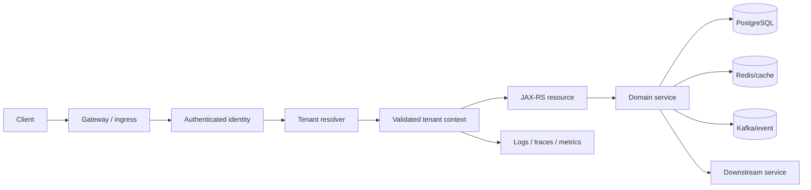
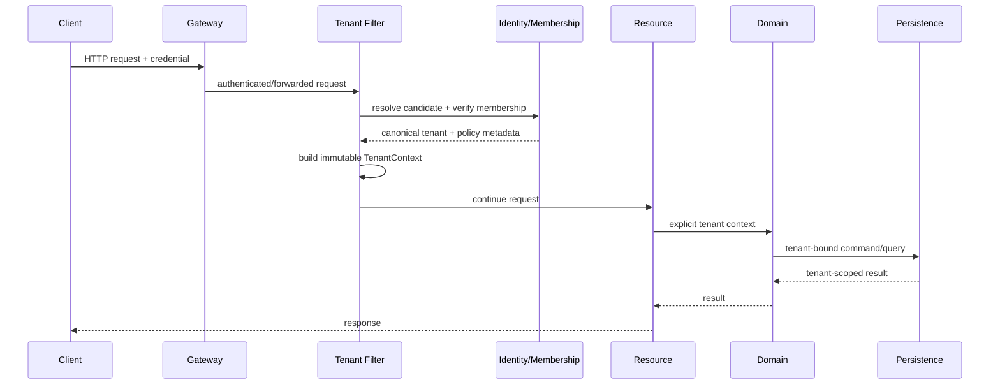
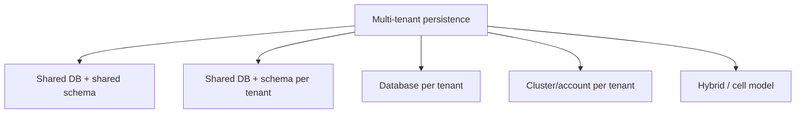
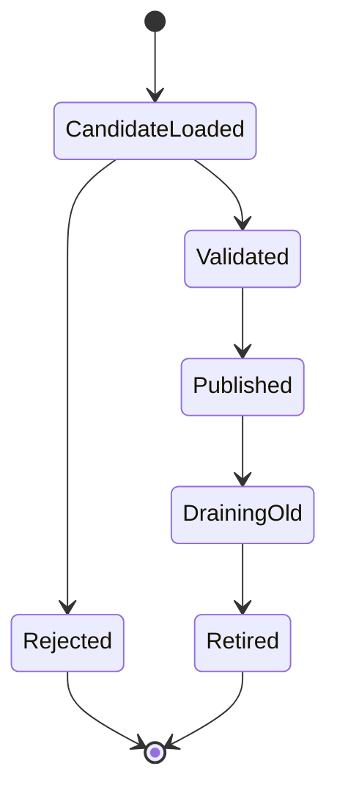
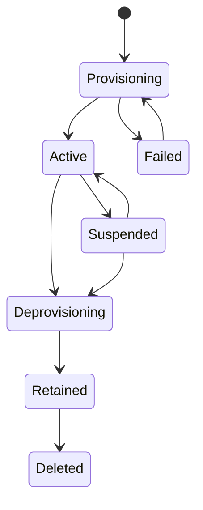

# Part 019 — Multi-Tenancy and Tenant-Specific Configuration

> Multi-tenancy bukan sekadar menambahkan kolom `tenant_id`. Ia adalah invariant lintas request routing, identity, authorization, persistence, cache, messaging, configuration, catalog, pricing, logging, metrics, jobs, dan operations. Satu jalur yang lupa membawa atau memvalidasi tenant context dapat mengubah bug biasa menjadi cross-tenant data breach.

## Daftar Isi

1. [Target kompetensi](#target-kompetensi)
2. [Scope dan baseline](#scope-dan-baseline)
3. [Mental model: tenant sebagai security dan policy boundary](#mental-model-tenant-sebagai-security-dan-policy-boundary)
4. [Terminology map](#terminology-map)
5. [Standard versus implementation-specific boundary](#standard-versus-implementation-specific-boundary)
6. [Pertanyaan pertama: apakah sistem benar-benar multi-tenant?](#pertanyaan-pertama-apakah-sistem-benar-benar-multi-tenant)
7. [Tenancy dimensions](#tenancy-dimensions)
8. [Tenant identity versus user identity](#tenant-identity-versus-user-identity)
9. [Tenant identification sources](#tenant-identification-sources)
10. [Trusted versus untrusted tenant claims](#trusted-versus-untrusted-tenant-claims)
11. [Canonical tenant identifier](#canonical-tenant-identifier)
12. [Tenant resolution lifecycle](#tenant-resolution-lifecycle)
13. [JAX-RS tenant-resolution filter](#jax-rs-tenant-resolution-filter)
14. [Tenant context design](#tenant-context-design)
15. [Explicit parameter versus implicit context](#explicit-parameter-versus-implicit-context)
16. [ThreadLocal and asynchronous propagation risks](#threadlocal-and-asynchronous-propagation-risks)
17. [Tenant-aware routing](#tenant-aware-routing)
18. [Deployment and compute isolation models](#deployment-and-compute-isolation-models)
19. [Database isolation models](#database-isolation-models)
20. [Shared-schema row isolation](#shared-schema-row-isolation)
21. [PostgreSQL Row-Level Security](#postgresql-row-level-security)
22. [Schema-per-tenant](#schema-per-tenant)
23. [Database-per-tenant](#database-per-tenant)
24. [Hybrid tenancy](#hybrid-tenancy)
25. [Tenant-aware repository contracts](#tenant-aware-repository-contracts)
26. [Transactions and connection-pool risks](#transactions-and-connection-pool-risks)
27. [Tenant-aware cache design](#tenant-aware-cache-design)
28. [Tenant-specific configuration](#tenant-specific-configuration)
29. [Configuration precedence for tenants](#configuration-precedence-for-tenants)
30. [Tenant configuration snapshots and reload](#tenant-configuration-snapshots-and-reload)
31. [Tenant-specific product catalog](#tenant-specific-product-catalog)
32. [Tenant-specific pricing and rules](#tenant-specific-pricing-and-rules)
33. [Effective dates and version pinning](#effective-dates-and-version-pinning)
34. [Tenant-aware messaging and events](#tenant-aware-messaging-and-events)
35. [Tenant-aware scheduled jobs and reconciliation](#tenant-aware-scheduled-jobs-and-reconciliation)
36. [Tenant-aware observability](#tenant-aware-observability)
37. [Tenant-aware authorization](#tenant-aware-authorization)
38. [Administrative and support access](#administrative-and-support-access)
39. [Provisioning, suspension, and deprovisioning](#provisioning-suspension-and-deprovisioning)
40. [Noisy-neighbor and quota controls](#noisy-neighbor-and-quota-controls)
41. [Data residency, retention, and deletion](#data-residency-retention-and-deletion)
42. [Testing strategy](#testing-strategy)
43. [Architecture patterns and anti-patterns](#architecture-patterns-and-anti-patterns)
44. [Failure-model matrix](#failure-model-matrix)
45. [Debugging playbook](#debugging-playbook)
46. [PR review checklist](#pr-review-checklist)
47. [Trade-off yang harus dipahami senior engineer](#trade-off-yang-harus-dipahami-senior-engineer)
48. [Internal verification checklist](#internal-verification-checklist)
49. [Latihan verifikasi](#latihan-verifikasi)
50. [Ringkasan](#ringkasan)
51. [Referensi resmi](#referensi-resmi)

---

## Target kompetensi

Setelah menyelesaikan part ini, Anda harus mampu:

- menentukan apakah tenancy merupakan security boundary, commercial boundary, deployment boundary, configuration boundary, atau kombinasi semuanya;
- memisahkan user identity, organization/account identity, tenant identity, reseller/dealer identity, dan service identity;
- mendesain tenant resolution yang hanya mempercayai sumber terverifikasi;
- membawa tenant context dari HTTP ingress hingga repository, cache, event, scheduler, log, dan downstream call;
- memilih shared schema, schema-per-tenant, database-per-tenant, deployment-per-tenant, atau hybrid berdasarkan isolation requirement dan operational cost;
- mencegah query, cache key, event, atau background job mengakses tenant yang salah;
- menggunakan PostgreSQL Row-Level Security sebagai defense-in-depth tanpa menjadikannya pengganti application authorization;
- mendesain tenant-specific configuration dengan precedence, revision, effective date, validation, rollout, dan rollback yang jelas;
- memodelkan tenant-specific product catalog, pricing, dan rules tanpa mencampurkan mutable configuration dengan historical transaction facts;
- menghindari high-cardinality telemetry, tetapi tetap dapat melakukan incident investigation per tenant;
- mendesain support/admin access yang audited, time-bounded, least-privileged, dan tidak menjadi bypass permanen;
- membuat test yang secara aktif mencoba cross-tenant leakage;
- mereview perubahan sebagai cross-cutting tenancy change, bukan perubahan lokal pada satu endpoint.

---

## Scope dan baseline

Baseline:

- Java 17+;
- Jakarta REST 4.x resource/filter/context model;
- Jersey 3.x sebagai kemungkinan implementation, tanpa mengasumsikannya digunakan internal;
- PostgreSQL sebagai primary relational store;
- Redis/Kafka/HTTP downstream sebagai kemungkinan integration boundary;
- Kubernetes/cloud/on-prem deployment possibilities;
- enterprise CPQ, quote, order, catalog, pricing, dan workflow context;
- multiple replicas dan asynchronous processing.

Part ini tidak mengasumsikan:

- CSG Quote & Order pasti merupakan SaaS shared-tenant platform;
- satu “customer” selalu sama dengan satu tenant;
- tenant selalu berasal dari hostname atau JWT claim tertentu;
- PostgreSQL RLS digunakan;
- catalog dan pricing disimpan sebagai configuration;
- setiap tenant memiliki database atau deployment terpisah;
- tenant ID aman hanya karena dikirim oleh API gateway;
- tenant context dapat disimpan aman dalam static variable atau raw `ThreadLocal`.

Authorization detail dibahas pada Part 026. PostgreSQL fundamentals dan transaction behavior dibahas pada Parts 028–031. OpenTelemetry context propagation dibahas pada Part 023. Feature flags dan rollout dibahas pada Part 045.

---

## Mental model: tenant sebagai security dan policy boundary



Core invariant:

```text
Every tenant-sensitive operation must be bound to exactly one
validated tenant context, or explicitly declared cross-tenant
under a separately authorized and audited execution mode.
```

A request with authenticated user but unresolved tenant is not ready for tenant data access. A repository call with tenant ID but no evidence of authorization is also insufficient. Identity, tenant membership, authorization, and data scoping are related but distinct checks.

---

## Terminology map

| Term | Arti operasional |
|---|---|
| tenant | isolation/policy unit served by the platform |
| account/customer | commercial or CRM entity; may or may not equal tenant |
| organization | identity/business grouping; may map one-to-one, one-to-many, or many-to-one with tenants |
| tenant context | immutable validated data identifying current tenant and relevant policy metadata |
| tenant resolution | process deriving canonical tenant identity from trusted request/runtime evidence |
| tenant isolation | controls preventing data, configuration, workload, or telemetry leakage across tenants |
| shared schema | tenants share tables; rows carry tenant discriminator |
| schema-per-tenant | tenants use separate database schemas |
| database-per-tenant | tenants use separate database/database cluster boundaries |
| deployment-per-tenant | isolated application workload per tenant |
| control plane | provisioning/configuration/administration of tenants |
| data plane | runtime processing of tenant business traffic |
| noisy neighbor | one tenant degrades shared capacity for others |
| tenant revision | immutable version identifier of tenant-specific configuration/catalog/rules |
| impersonation | authorized actor temporarily operates in another subject/tenant context |
| cross-tenant operation | intentionally spans multiple tenants; must not be accidental fallback |

---

## Standard versus implementation-specific boundary

| Capability | Standard / portable | Implementation/platform-specific | Internal verification |
|---|---|---|---|
| access authenticated principal | Jakarta REST `SecurityContext` | JWT/OIDC filter, container security | actual principal and claim mapping |
| access headers/URI | `HttpHeaders`, `UriInfo`, request filters | proxy/gateway rewriting | trusted forwarded headers and host handling |
| request filter | `ContainerRequestFilter` | Jersey registration/priority behavior | resolver registration and ordering |
| request property | `ContainerRequestContext.setProperty` | DI bridge/context proxy | whether properties are propagated elsewhere |
| tenant-scoped DI | no Jakarta REST tenant scope | CDI custom context, HK2 custom scope, application abstraction | actual scope implementation |
| async context propagation | no automatic generic guarantee | OpenTelemetry/context library/executor wrappers | implementation used internally |
| data isolation | application SQL/contracts | PostgreSQL RLS, schemas, pools, routing | actual model per service/table |
| tenant configuration | application concern | config service, database, cloud config | source, precedence, revision, reload |
| quota/rate limit | application/platform concern | gateway, Redis, service mesh | enforcement layer and consistency |
| tenant routing | standard HTTP inputs available | gateway, DNS, service mesh, custom router | source of truth and trust boundary |

Do not call an API portable merely because it compiles in a JAX-RS application. Custom tenant scopes, JWT claim extraction, RLS session variables, or Jersey request injection are implementation decisions.

---

## Pertanyaan pertama: apakah sistem benar-benar multi-tenant?

Before designing multi-tenancy, establish the business and technical meaning.

Possible situations:

1. **Single-tenant application, multi-customer data** — one installation serves one organization but stores multiple business accounts.
2. **Shared application, logically isolated tenants** — common compute and database with tenant discriminators.
3. **Shared control plane, isolated data planes** — centralized management, separate deployment/database per tenant.
4. **Regional cells** — groups of tenants assigned to isolated cells/clusters.
5. **Dedicated premium tenants** — some tenants shared, some isolated.
6. **Partner/reseller hierarchy** — requests may operate under provider, reseller, enterprise, or sub-account scope.

Weak framing:

```text
"There is a tenant_id column, therefore the system is multi-tenant."
```

Better questions:

- What exactly must be isolated?
- Which actors may access multiple tenants?
- Can one quote/order reference entities owned by different tenant scopes?
- Is tenant mapping static or effective-dated?
- Is a tenant a legal, billing, data-residency, or operational boundary?
- What is the maximum accepted blast radius of a software defect?

---

## Tenancy dimensions

Multi-tenancy can differ by dimension:

| Dimension | Possible isolation |
|---|---|
| identity | separate IdP realm, organization claim, membership registry |
| application compute | shared pods, cell-based pods, dedicated deployment |
| database | shared rows, schema, database, cluster |
| cache | namespaced keys, logical database, dedicated cluster |
| messaging | shared topic with tenant field, topic-per-cell, dedicated topics |
| storage | prefix, bucket/container, account/project separation |
| encryption | shared KMS key, tenant-specific key, dedicated HSM boundary |
| configuration | global defaults plus tenant overrides, dedicated config store |
| catalog/pricing | shared base catalog plus tenant overlays, dedicated versions |
| operations | shared SLO, tenant tier SLO, dedicated support model |
| residency | region/country/cell routing |

A mature architecture documents the matrix rather than using one blanket phrase “multi-tenant.”

---

## Tenant identity versus user identity

```text
User identity answers: who is calling?
Tenant identity answers: under which isolation/policy boundary?
Authorization answers: may this identity perform this operation in that tenant?
```

One user may:

- belong to one tenant;
- belong to multiple tenants;
- act as reseller over child tenants;
- be a support operator with temporary access;
- call as a machine identity with delegated tenant scope.

Never infer tenant solely from username/email domain unless that is an explicit, authoritative, collision-safe business rule.

A useful immutable model:

```java
public record TenantContext(
        String tenantId,
        String actorId,
        Set<String> memberships,
        Set<String> permissions,
        String source,
        String configurationRevision,
        Instant resolvedAt
) {
    public TenantContext {
        Objects.requireNonNull(tenantId);
        Objects.requireNonNull(actorId);
        memberships = Set.copyOf(memberships);
        permissions = Set.copyOf(permissions);
    }
}
```

Do not put raw access tokens or unnecessary PII into tenant context.

---

## Tenant identification sources

Possible inputs:

- authenticated token claim;
- gateway-injected signed header;
- hostname/subdomain;
- path segment;
- request header;
- client certificate identity;
- API key registration;
- explicit body field;
- message/event metadata;
- scheduled-job partition input.

Trust ranking is architecture-specific. A client-controlled header such as `X-Tenant-Id` is not authoritative by itself.

Example policy:

```text
1. Authenticate caller.
2. Extract candidate tenant from a trusted claim or validated routing map.
3. If request also provides explicit tenant selector, treat it as a requested scope.
4. Verify caller membership/delegation for that tenant.
5. Resolve canonical tenant ID and status.
6. Reject mismatch or ambiguity before invoking business code.
```

Multiple sources must agree or have deterministic precedence. Silent “first non-null wins” behavior is dangerous.

---

## Trusted versus untrusted tenant claims

A tenant claim is trusted only when all relevant conditions hold:

- token/header origin is authenticated;
- signature or mTLS boundary is validated;
- issuer and audience are correct;
- proxy strips client-supplied copies of privileged headers;
- claim semantics are contractually defined;
- membership/entitlement is current enough for the operation;
- delegation chain is validated;
- tenant is active and routable.

Example failure:

```text
Internet client sends X-Tenant-Id: premium-tenant
Gateway forwards all headers unchanged
Application trusts X-Tenant-Id
=> privilege escalation / data leak
```

The platform must either remove/overwrite privileged headers or cryptographically bind them to a trusted identity.

---

## Canonical tenant identifier

Use one canonical immutable identifier for internal joins and scoping. Display names, customer codes, domains, aliases, and external IDs may change or collide.

Properties of a good tenant ID:

- globally unique within the platform;
- immutable after provisioning;
- non-sensitive;
- not derived from mutable display names;
- safe as database/cache/event key component after encoding;
- never accepted without authorization validation;
- mapped explicitly to external/customer identifiers.

Do not expose sequential IDs if enumeration itself creates risk. UUIDs do not replace authorization.

---

## Tenant resolution lifecycle



Resolution should happen before body-heavy processing where possible, so unauthorized requests do not consume unnecessary resources.

Resolution failures should distinguish:

- unauthenticated caller;
- invalid tenant selector;
- no membership;
- suspended tenant;
- ambiguous mapping;
- tenant unavailable/routing failure;
- internal resolver failure.

Do not leak tenant existence to callers who are not authorized to know it.

---

## JAX-RS tenant-resolution filter

Portable skeleton:

```java
@Provider
@Priority(Priorities.AUTHENTICATION + 100)
public final class TenantResolutionFilter implements ContainerRequestFilter {

    public static final String TENANT_CONTEXT_PROPERTY =
            TenantResolutionFilter.class.getName() + ".tenantContext";

    private final TenantResolver resolver;

    @Context
    SecurityContext securityContext;

    @Context
    HttpHeaders headers;

    public TenantResolutionFilter(TenantResolver resolver) {
        this.resolver = resolver;
    }

    @Override
    public void filter(ContainerRequestContext request) {
        Principal principal = securityContext.getUserPrincipal();
        if (principal == null) {
            request.abortWith(Response.status(Response.Status.UNAUTHORIZED).build());
            return;
        }

        String requestedTenant = headers.getHeaderString("X-Tenant-Id");

        TenantResolution resolution = resolver.resolve(
                principal.getName(),
                requestedTenant,
                request.getUriInfo().getRequestUri()
        );

        if (!resolution.allowed()) {
            request.abortWith(Response.status(Response.Status.FORBIDDEN).build());
            return;
        }

        request.setProperty(TENANT_CONTEXT_PROPERTY, resolution.context());
    }
}
```

Important:

- exact priority relative to authentication/authorization must be verified;
- header trust must be established outside this snippet;
- avoid performing unbounded remote calls inside the filter;
- resolution cache requires revocation/staleness policy;
- request property does not automatically propagate to another thread or Kafka event;
- exception responses should follow the central error contract.

A resource can obtain the property explicitly:

```java
@GET
@Path("/quotes/{id}")
public Response getQuote(
        @Context ContainerRequestContext request,
        @PathParam("id") UUID quoteId
) {
    TenantContext tenant = (TenantContext) request.getProperty(
            TenantResolutionFilter.TENANT_CONTEXT_PROPERTY
    );
    return Response.ok(service.getQuote(tenant, quoteId)).build();
}
```

A production codebase will usually wrap this plumbing behind a tested abstraction, CDI custom scope, HK2 factory, or request-bound provider. Verify the actual implementation.

---

## Tenant context design

Tenant context should be:

- immutable;
- request/execution scoped;
- derived from validated evidence;
- minimal;
- serializable only when explicitly needed;
- safe for structured logging after redaction;
- impossible to mutate halfway through a transaction;
- separate from user-controlled DTOs.

Recommended fields depend on requirements:

```text
tenant ID
actor/service ID
delegation/impersonation ID
membership/permission snapshot reference
region/cell
configuration revision
catalog/pricing revision if pinned
request/trace identifiers
resolution timestamp and source
```

Avoid placing live service clients, mutable maps, or token objects inside the context.

---

## Explicit parameter versus implicit context

### Explicit parameter

```java
Quote loadQuote(TenantContext tenant, UUID quoteId)
```

Advantages:

- dependency is visible;
- easy to test;
- prevents accidental invocation without tenant;
- works across threads when explicitly passed.

Costs:

- repetitive signatures;
- can be mechanically threaded through unrelated layers;
- callers may still pass wrong context.

### Implicit request-scoped context

```java
Quote loadQuote(UUID quoteId) // repository reads current tenant implicitly
```

Advantages:

- less signature noise;
- convenient for cross-cutting infrastructure.

Risks:

- hidden dependency;
- difficult async propagation;
- test setup becomes magical;
- cross-tenant administrative workflows become dangerous;
- stale `ThreadLocal` can leak across pooled threads.

Practical rule:

- keep tenant explicit at domain and persistence boundaries;
- use implicit context only in tightly controlled adapters such as logging enrichment;
- never derive tenant again independently in lower layers.

---

## ThreadLocal and asynchronous propagation risks

A raw `ThreadLocal<TenantContext>` works only while execution remains on the same thread and cleanup is guaranteed.

Failure sequence:

```text
request A sets tenant=T1 on worker-7
request A submits async task without propagation
worker-7 returns to pool without clear
request B later reuses worker-7
request B observes T1
```

Minimum safety:

```java
TenantContext previous = holder.get();
try {
    holder.set(current);
    action.run();
} finally {
    if (previous == null) {
        holder.remove();
    } else {
        holder.set(previous);
    }
}
```

Even this does not propagate automatically to executors. Prefer an explicit context carrier or tested context-propagating executor.

```java
public final class TenantAwareExecutor implements Executor {
    private final Executor delegate;
    private final TenantContextHolder holder;

    @Override
    public void execute(Runnable command) {
        TenantContext captured = holder.requireCurrent();
        delegate.execute(() -> holder.runWith(captured, command));
    }
}
```

Nested contexts, cancellation, exception paths, and task rejection must be tested.

---

## Tenant-aware routing

Routing may occur at several layers:

```text
DNS/hostname
  -> gateway route
  -> region/cell selection
  -> application tenant resolution
  -> database/storage/client selection
```

Examples:

- `tenant.example.com` maps to tenant/cell;
- token claim maps to a regional data plane;
- tenant metadata selects database shard;
- dedicated tenant routes to dedicated deployment;
- suspended tenant routes only to control-plane/status endpoints.

Invariants:

1. routing metadata must be authoritative and versioned;
2. route selection and tenant authorization must agree;
3. downstream routing should use canonical tenant context, not repeat header parsing;
4. caches must account for routing-map revision;
5. failover must respect residency and isolation constraints;
6. unknown tenant must not fall back to a default production tenant.

---

## Deployment and compute isolation models

| Model | Isolation | Operational cost | Common risks |
|---|---|---|---|
| shared pods | lowest compute isolation | low | noisy neighbor, shared blast radius |
| tenant-aware cell | group-level isolation | medium | routing drift, uneven cells |
| namespace-per-tenant | stronger policy separation | high | fleet/configuration explosion |
| deployment-per-tenant | strong runtime isolation | high | version skew, operational overhead |
| cluster/account/subscription-per-tenant | strongest platform boundary | very high | automation complexity, cost |

A cell architecture is often a compromise: tenants are assigned to bounded failure domains while retaining shared operations.

Do not choose dedicated deployments merely to compensate for missing authorization discipline. Conversely, do not claim shared application isolation is sufficient for regulatory requirements without evidence.

---

## Database isolation models



Decision criteria:

- legal/regulatory isolation;
- accepted blast radius;
- tenant count;
- workload variance;
- schema evolution frequency;
- backup/restore granularity;
- per-tenant encryption requirements;
- operational automation maturity;
- query/reporting requirements;
- cross-tenant analytics;
- cost and connection limits.

---

## Shared-schema row isolation

Typical schema:

```sql
CREATE TABLE quote (
    tenant_id      uuid         NOT NULL,
    quote_id       uuid         NOT NULL,
    version        bigint       NOT NULL,
    status         text         NOT NULL,
    total_amount   numeric(19,4) NOT NULL,
    currency_code  char(3)      NOT NULL,
    created_at     timestamptz  NOT NULL,
    PRIMARY KEY (tenant_id, quote_id)
);
```

Key design rules:

- include `tenant_id` in primary/unique keys when uniqueness is tenant-local;
- include tenant discriminator in foreign keys;
- lead indexes with tenant key when access patterns are tenant-scoped;
- ensure every query and mutation carries tenant predicate;
- avoid global sequence/business identifier assumptions;
- include tenant in optimistic-lock lookup;
- include tenant in bulk update/delete predicates;
- verify ORM/MyBatis dynamic SQL cannot drop the predicate.

Example tenant-bound query:

```sql
SELECT tenant_id, quote_id, version, status, total_amount, currency_code
FROM quote
WHERE tenant_id = :tenant_id
  AND quote_id = :quote_id;
```

Dangerous query:

```sql
SELECT * FROM quote WHERE quote_id = :quote_id;
```

Even globally unique `quote_id` does not justify omitting tenant scoping; explicit scoping protects against ID leakage, import errors, and future model changes.

---

## PostgreSQL Row-Level Security

PostgreSQL Row-Level Security can enforce row visibility/modification policies at the database layer.

Conceptual setup:

```sql
ALTER TABLE quote ENABLE ROW LEVEL SECURITY;
ALTER TABLE quote FORCE ROW LEVEL SECURITY;

CREATE POLICY quote_tenant_policy ON quote
USING (tenant_id = current_setting('app.tenant_id', true)::uuid)
WITH CHECK (tenant_id = current_setting('app.tenant_id', true)::uuid);
```

Transaction-scoped setting:

```sql
BEGIN;
SET LOCAL app.tenant_id = '11111111-1111-1111-1111-111111111111';
SELECT * FROM quote WHERE quote_id = $1;
COMMIT;
```

Critical risks:

- connection pools reuse sessions;
- `SET` without transaction-local cleanup can leak tenant state;
- table owner/superuser or `BYPASSRLS` roles may bypass policies;
- missing policy can become default-deny, but disabled RLS removes protection;
- maintenance/migration users may bypass RLS;
- functions with elevated privileges require careful review;
- RLS does not replace authorization or correct application predicates;
- query plans and indexes still need tenant-aware design.

Safe pattern:

```text
begin transaction
  -> SET LOCAL tenant context
  -> execute tenant-bound SQL
  -> commit/rollback clears local setting
return connection to pool
```

Test both positive and negative cases with the exact production database role.

---

## Schema-per-tenant

Advantages:

- stronger namespace separation;
- easier per-tenant logical export;
- schema-level grants;
- lower chance of omitted row predicate.

Costs and risks:

- migration fan-out;
- thousands of schemas become operationally expensive;
- dynamic `search_path` can leak across pooled connections;
- prepared statement/plan behavior becomes complex;
- cross-tenant reporting is harder;
- schema drift may emerge;
- connection/session initialization must be reset reliably.

If using `search_path`, prefer transaction-local setting or fully qualified names. Never concatenate unvalidated tenant schema names into SQL.

---

## Database-per-tenant

Advantages:

- backup/restore and resource boundaries per tenant;
- strong accidental-query isolation;
- dedicated tuning and residency;
- easier tenant-specific encryption/maintenance.

Costs:

- connection-pool explosion;
- migration orchestration;
- credential/rotation inventory;
- observability fan-out;
- fleet version skew;
- connection limits for many low-volume tenants;
- cross-tenant reporting complexity.

Pool strategies:

- one pool per active tenant with bounded cache and eviction;
- one pool per cell/shard;
- proxy/data-access service;
- short-lived connections for rare tenants, balanced against latency.

Every strategy needs limits and close semantics.

---

## Hybrid tenancy

A realistic enterprise platform may combine models:

```text
standard tenants -> shared cells and shared schema
regulated tenants -> dedicated database
largest tenants -> dedicated cell/deployment
regional tenants -> residency-bound clusters
internal/admin tenant -> separate control-plane path
```

Hybrid design requires a tenant routing registry:

```java
public record TenantPlacement(
        String tenantId,
        String region,
        String cell,
        IsolationMode isolationMode,
        String dataSourceKey,
        String configurationRevision
) {}
```

Placement changes are migrations, not simple configuration edits. They require quiescing, dual-read/write or replication strategy, consistency validation, routing cutover, and rollback.

---

## Tenant-aware repository contracts

Preferred explicit contract:

```java
public interface QuoteRepository {
    Optional<QuoteRecord> findById(String tenantId, UUID quoteId);

    boolean updateStatus(
            String tenantId,
            UUID quoteId,
            long expectedVersion,
            QuoteStatus newStatus
    );
}
```

More strongly typed:

```java
public record TenantId(UUID value) {
    public TenantId {
        Objects.requireNonNull(value);
    }
}

public record QuoteId(UUID value) {}

public interface QuoteRepository {
    Optional<QuoteRecord> findById(TenantId tenantId, QuoteId quoteId);
}
```

Avoid repository APIs that accept a generic map of filters where tenant predicate can be omitted.

For cross-tenant administrative queries, create a separately named capability:

```java
public interface CrossTenantQuoteAuditRepository {
    Stream<AuditRow> findForAuthorizedInvestigation(InvestigationScope scope);
}
```

Do not add nullable tenant parameters where `null` silently means “all tenants.”

---

## Transactions and connection-pool risks

Tenant context must be stable for the transaction.

Forbidden sequence:

```text
request resolves tenant A
transaction begins
code mutates implicit tenant context to B
same connection continues
```

For session/schema/RLS-based isolation:

- initialize after connection checkout and before tenant SQL;
- use transaction-local settings when available;
- reset on all paths;
- avoid connection sharing across concurrent operations;
- verify transaction propagation does not mix tenants;
- log only non-sensitive tenant identifier/revision;
- test pool reuse after rollback and exceptions.

Pool keys must reflect actual isolation. A tenant-specific database cannot use a pool selected only by region if credentials/database differ.

---

## Tenant-aware cache design

Cache key invariant:

```text
cache key = namespace + schema/version + tenant ID + business key
```

Example:

```java
String key = "quote:v3:" + encode(tenantId) + ":" + quoteId;
```

Risks:

- omitted tenant key;
- inconsistent tenant encoding;
- tenant alias used instead of canonical ID;
- global invalidation evicts all tenants;
- cache object includes tenant-specific policy but key does not include policy revision;
- tenant deletion leaves orphaned keys;
- negative cache leaks existence/non-existence across tenants;
- local in-memory cache keyed only by object ID;
- Redis logical databases mistaken for strong security boundaries.

For tenant configuration/catalog caches, include revision or use atomic tenant snapshot replacement.

```text
tenant-config:{tenantId}:{revision}
active-tenant-config:{tenantId} -> revision
```

Bound per-tenant cache consumption and protect against hot keys/noisy neighbors.

---

## Tenant-specific configuration

Separate categories:

```text
global platform defaults
  + environment/cell defaults
  + tenant plan/tier policy
  + tenant explicit overrides
  + temporary emergency override
  = effective tenant configuration snapshot
```

Examples:

- enabled product families;
- quote validity defaults;
- order limits;
- integration endpoints;
- localization;
- approval thresholds;
- workflow selection;
- rate limits;
- feature entitlements;
- notification templates;
- catalog/pricing references.

Not every business record belongs in configuration. A historical quote must retain the facts and versions used when it was calculated, even if tenant configuration changes later.

Configuration model:

```java
public record TenantConfiguration(
        TenantId tenantId,
        long revision,
        Instant effectiveFrom,
        Optional<Instant> effectiveTo,
        Duration defaultQuoteValidity,
        Set<String> enabledProductFamilies,
        String catalogRevision,
        String pricingRevision,
        Map<String, String> integrationProfiles
) {
    public TenantConfiguration {
        enabledProductFamilies = Set.copyOf(enabledProductFamilies);
        integrationProfiles = Map.copyOf(integrationProfiles);
    }
}
```

Validate cross-field invariants before publication.

---

## Configuration precedence for tenants

Precedence must be deterministic and documented.

Example:

```text
hard security limit
  > regulatory/region policy
  > platform emergency override
  > tenant explicit override
  > plan/tier default
  > environment default
  > packaged safe default
```

Some values must not be tenant-overridable:

- cryptographic requirements;
- maximum security limits;
- data residency constraints;
- mandatory audit controls;
- protocol allowlists;
- internal safety ceilings.

Avoid generic map merge where `null`, empty collection, and absent key have ambiguous semantics.

A typed merger should define each field:

```java
public TenantConfiguration merge(
        PlatformPolicy platform,
        TierPolicy tier,
        TenantOverride tenant
) {
    Duration validity = tenant.defaultQuoteValidity()
            .orElse(tier.defaultQuoteValidity());

    if (validity.compareTo(platform.maxQuoteValidity()) > 0) {
        throw new InvalidTenantConfiguration("quote validity exceeds platform limit");
    }

    return new TenantConfiguration(/* normalized fields */);
}
```

---

## Tenant configuration snapshots and reload

Runtime lookup per field can create mixed revisions within one request.

Unsafe:

```text
read approval threshold from revision 41
configuration reload happens
read pricing mode from revision 42
```

Prefer one immutable snapshot captured at operation start:

```java
TenantConfiguration config = configRepository.currentSnapshot(tenantId);
QuoteResult result = quoteEngine.calculate(command, config);
```

For long-running processes:

- pin a revision at process/quote creation;
- define whether later steps use pinned or latest policy;
- persist revision in workflow/business record;
- preserve old revision for audit/replay as required;
- reject or migrate processes explicitly when revision is unsupported.

Reload lifecycle:



Expose revision, not secret values, in diagnostics.

---

## Tenant-specific product catalog

In CPQ/order systems, “catalog” may include:

- products/offers;
- bundles and compatibility constraints;
- attributes and allowed values;
- channels/segments;
- service/resource mappings;
- eligibility rules;
- lifecycle state;
- effective dates;
- localization;
- tenant/customer-specific availability.

Possible models:

1. shared base catalog + tenant overlay;
2. catalog partitioned by tenant;
3. tenant references a published catalog release;
4. hierarchical provider/reseller/customer catalog;
5. dynamically filtered shared catalog.

Invariants:

- a quote records the catalog revision used;
- a tenant cannot resolve products outside entitlement;
- overlay cannot violate platform invariants;
- deleted/retired catalog entries remain interpretable for historical orders;
- cache keys include tenant and catalog revision;
- catalog publication is atomic from the consumer viewpoint;
- search indexes follow the same tenant visibility rules as primary storage.

---

## Tenant-specific pricing and rules

Pricing/rules may vary by:

- tenant/account agreement;
- sales channel;
- customer segment;
- region/currency;
- contract term;
- effective date;
- quantity/usage tier;
- promotion;
- partner/reseller hierarchy;
- negotiated override;
- tax jurisdiction.

A safe quote calculation captures inputs and versions:

```java
public record PricingContext(
        TenantId tenantId,
        String catalogRevision,
        String pricingRevision,
        String ruleSetRevision,
        Currency currency,
        Instant pricingTime,
        String channel,
        Optional<String> agreementId
) {}
```

Do not recompute historical quote totals against “current” pricing without an explicit reprice action. A quote should be reproducible or at least auditable using captured rule/version references and materialized results.

Tenant override governance needs:

- approval;
- validation;
- effective date;
- test simulation;
- publication state;
- rollback;
- audit actor;
- impact analysis.

---

## Effective dates and version pinning

Configuration/catalog/pricing may be valid over intervals. Prefer half-open windows:

```text
[effective_from, effective_to)
```

This avoids double-match at adjacent boundaries.

Selection invariant:

```text
For a tenant, policy type, and evaluation instant,
exactly one active published revision must be selected,
unless explicit no-policy behavior is defined.
```

Detect:

- overlapping windows;
- gaps;
- timezone ambiguity;
- publication after effective time;
- future-dated rollback;
- stale caches;
- workflow pinned to retired revision.

Date/time modelling is covered deeply in Part 020.

---

## Tenant-aware messaging and events

Every tenant-sensitive event requires a canonical tenant field in an agreed envelope or payload.

```json
{
  "eventId": "...",
  "eventType": "QuoteSubmitted",
  "tenantId": "...",
  "occurredAt": "2026-07-10T12:30:00Z",
  "correlationId": "...",
  "causationId": "...",
  "schemaVersion": 3,
  "payload": {}
}
```

Rules:

- producer derives tenant from validated execution context, not arbitrary payload;
- consumer validates presence and format;
- idempotency keys are tenant-scoped;
- state stores and inbox/outbox tables include tenant key;
- topic partition key policy is explicit;
- replay filters and authorization are tenant-aware;
- DLQ tools preserve tenant metadata but restrict visibility;
- cross-tenant aggregate events are explicitly typed and authorized;
- tenant deletion/suspension behavior for queued events is defined.

Partitioning by tenant may preserve tenant-local ordering but can create hot partitions for large tenants. Hashing business aggregate ID may improve distribution but changes ordering semantics.

---

## Tenant-aware scheduled jobs and reconciliation

Jobs often bypass HTTP filters, making them common leakage points.

Bad pattern:

```java
for (Quote quote : repository.findExpiredQuotes()) {
    expire(quote);
}
```

Better model:

```text
scheduler enumerates authorized tenant partitions
  -> creates tenant-bound work item
  -> worker establishes TenantExecutionContext
  -> repository remains tenant-scoped
  -> checkpoint and metrics include tenant safely
```

Job requirements:

- explicit tenant scope;
- bounded concurrency per tenant and globally;
- no nullable tenant meaning “all”;
- resumable checkpoints;
- tenant-aware idempotency;
- fair scheduling;
- suspension/deprovision checks;
- audit for cross-tenant maintenance jobs;
- retry isolation so one tenant does not block all tenants.

---

## Tenant-aware observability

### Logs

Include canonical tenant identifier when operationally allowed:

```json
{
  "event": "quote.submit.failed",
  "tenant.id": "t-7f3...",
  "quote.id": "q-...",
  "trace.id": "...",
  "error.code": "PRICING_TIMEOUT"
}
```

Do not log tenant display name, customer PII, tokens, or commercial data unless explicitly approved.

### Traces

Tenant ID may be added as a span attribute only after considering privacy and backend indexing/cardinality. Baggage propagation is especially sensitive because it crosses process boundaries.

### Metrics

Per-tenant labels can create unbounded cardinality and cost.

Prefer:

- aggregate platform metrics;
- bounded tier/cell/region labels;
- logs/traces for specific tenant investigation;
- dedicated top-N/noisy-neighbor metrics;
- controlled tenant allowlist for premium SLOs;
- separate analytics pipeline for per-tenant usage.

Never place quote/order/customer IDs in metric labels.

---

## Tenant-aware authorization

Authorization should evaluate:

```text
actor
operation
resource
canonical tenant
resource ownership
relationship/delegation
current policy revision
```

Resource lookup itself must not leak data. Common sequence:

1. resolve tenant;
2. authorize general operation for tenant;
3. load resource scoped by tenant;
4. apply object-level authorization;
5. execute mutation;
6. audit sensitive action.

Returning `404` instead of `403` may reduce resource enumeration, but the error policy must remain consistent and observable internally.

Never authorize using only a tenant ID from the URL. Never trust object ownership from a request DTO.

---

## Administrative and support access

Support access is an explicit security mode, not a magical “admin” role.

Recommended controls:

- separate support identity;
- explicit target tenant selection;
- ticket/reason reference;
- time-bounded session;
- least privilege/read-only by default;
- step-up authentication;
- approval for sensitive operations;
- visible impersonation banner in UI;
- immutable audit event recording actor and effective tenant;
- no sharing of tenant user credentials;
- break-glass process with alerts and post-review.

Audit model:

```text
real_actor = support engineer
acting_as = optional tenant user/service persona
target_tenant = canonical tenant
reason = incident/change ticket
session_id = support access session
```

Do not overwrite the real actor with the impersonated identity.

---

## Provisioning, suspension, and deprovisioning

Tenant lifecycle is a state machine:



Provisioning may create:

- identity memberships;
- database/schema/partition;
- encryption keys;
- storage prefix/bucket;
- topics/queues;
- configuration snapshot;
- catalog/pricing assignment;
- quotas;
- monitoring/SLO entries;
- integration credentials.

Requirements:

- idempotent steps;
- resumable workflow;
- reconciliation for partial state;
- versioned desired state;
- audit trail;
- explicit rollback/compensation;
- no traffic until required resources are ready.

Suspension semantics must define read, write, event consumption, scheduled jobs, and inbound integration behavior.

Deprovisioning must respect retention/legal hold and avoid reusing identifiers prematurely.

---

## Noisy-neighbor and quota controls

Shared resources need fairness:

- request rate;
- concurrent requests;
- database connections/queries;
- Kafka partitions/consumer throughput;
- cache memory;
- file storage;
- scheduled jobs;
- expensive quote calculations;
- export/report workloads.

Controls can be:

```text
global safety ceiling
+ cell capacity limit
+ tenant tier quota
+ endpoint/operation limit
+ adaptive load shedding
```

Avoid one unbounded per-tenant executor or pool; thousands of tenants create thread/resource explosion. Use shared bounded infrastructure with fair scheduling or partitioned queues.

Quota decisions should include tenant ID but metrics labels should remain bounded.

---

## Data residency, retention, and deletion

Tenant placement may be constrained by:

- region/country;
- legal entity;
- contract;
- encryption key jurisdiction;
- backup location;
- support access restrictions;
- disaster-recovery region;
- log/telemetry export location.

Tenant deletion is not only deleting primary rows. Inventory:

```text
primary database
read replicas
search index
cache
object storage
Kafka topics/retention
DLQ
backups
analytics lake
logs/traces
workflow state
idempotency/inbox/outbox
support exports
```

Define legal hold, retention period, cryptographic erasure possibilities, and proof of completion. Do not promise immediate deletion if immutable backups retain data under policy.

---

## Testing strategy

### Unit tests

- tenant resolver accepts valid membership;
- mismatched source claims are rejected;
- suspended/unknown tenant behavior;
- configuration precedence;
- tenant key generation;
- repository requires tenant argument;
- context cleanup after exceptions;
- pricing/catalog revision pinning.

### Integration tests

Create tenants A and B with intentionally similar identifiers:

```text
A quote ID = same UUID as B quote ID where schema permits
A product code = B product code
A user belongs to A only
```

Test:

- A cannot read/update/delete B data;
- pagination/search/export remain isolated;
- bulk operations are isolated;
- cache hit for A never returns B object;
- async task preserves correct context;
- pooled connection/RLS state resets after rollback;
- Kafka consumer state and inbox are tenant-scoped;
- job retries remain tenant-scoped;
- logs identify correct tenant without leaking sensitive data.

### Property-based tests

Generate random tenant/resource combinations and assert:

```text
result.tenantId == requestedValidatedTenant
```

### Mutation/security tests

Deliberately remove tenant predicates, alter headers, reuse tokens, or change cache keys. The architecture should have multiple defenses and tests that fail.

### Concurrency tests

Interleave requests from many tenants on the same thread pool and connection pool. Look for stale implicit context.

---

## Architecture patterns and anti-patterns

### Pattern: tenant as a typed capability

```java
public record TenantScope(TenantId tenantId, Set<Permission> permissions) {
    public TenantScope {
        permissions = Set.copyOf(permissions);
    }
}
```

Only validated resolvers can create the scope in the application boundary.

### Pattern: tenant-bound repository

```java
TenantQuoteRepository bound = repository.forTenant(scope);
bound.findById(quoteId);
```

The returned object permanently captures the tenant, reducing repeated parameters. Ensure it is request-scoped and not cached globally.

### Pattern: immutable tenant snapshot

One operation uses one configuration/catalog/pricing revision.

### Pattern: defense in depth

```text
validated tenant context
+ explicit repository predicate
+ composite keys
+ database RLS where appropriate
+ cache namespace
+ negative isolation tests
```

### Anti-pattern: default tenant fallback

```java
String tenant = header == null ? "default" : header;
```

Missing tenant should be rejected unless the endpoint is explicitly tenant-neutral.

### Anti-pattern: nullable tenant means all tenants

Creates accidental administrative access.

### Anti-pattern: tenant only in UI/gateway

Internal service calls, jobs, and events still need verified tenant semantics.

### Anti-pattern: one global mutable current tenant

Fails immediately under concurrency.

### Anti-pattern: tenant ID only in logs

Logging is not enforcement.

### Anti-pattern: tenant-per-topic/table/executor without limits

Operational objects grow linearly and can become unmanageable.

### Anti-pattern: catalog/pricing latest lookup during every step

Long-running quote/order processes become non-reproducible.

---

## Failure-model matrix

| Failure | Typical symptom | Detection | Containment / remediation |
|---|---|---|---|
| trusted header spoofing | caller accesses another tenant | gateway/app security tests, audit anomalies | strip/overwrite header, bind to identity |
| tenant not propagated to async task | missing/wrong tenant in worker | trace/log mismatch, concurrency test | explicit context carrier/wrapped executor |
| stale `ThreadLocal` | intermittent cross-tenant result | thread correlation, stress test | `finally` cleanup, avoid raw implicit state |
| SQL omits tenant predicate | cross-tenant read/update | query review, negative tests, RLS | typed repositories, composite keys, RLS |
| RLS session variable leaks | next request sees prior tenant | pool reuse tests, DB audit | `SET LOCAL`, transaction scope, reset |
| cache key lacks tenant | wrong tenant object returned | cache tracing, synthetic collision test | canonical namespaced keys |
| tenant config mixed revisions | inconsistent quote behavior | revision logging, deterministic replay | immutable snapshot per operation |
| catalog/pricing cache stale | wrong availability/price | revision comparison, reconciliation | versioned caches, publication invalidation |
| event missing tenant | consumer cannot isolate | schema validation, DLQ | required contract field, reject/quarantine |
| tenant partition hot spot | one tenant degrades cell | per-tenant usage analytics, lag | quota, repartition, dedicated cell |
| per-tenant metrics label explosion | monitoring cost/latency | cardinality dashboards | bounded labels, logs/traces for tenant detail |
| tenant suspended but jobs continue | writes after suspension | lifecycle audit, job metrics | state check at dispatch/execution |
| support bypass unaudited | untraceable privileged access | access review | explicit support session and immutable audit |
| placement map drift | requests routed to wrong cell/DB | revision mismatch, synthetic routing check | versioned registry, atomic rollout |
| deprovision partial failure | orphaned data/resources | reconciliation | resumable workflow, desired-state controller |
| tenant-specific pool explosion | memory/connection exhaustion | pool inventory, resource metrics | bounded pool cache, cell pooling, eviction |
| cross-tenant bulk operation | mass data corruption | audit/row-count anomaly | tenant-bound commands, approval, transaction guards |

---

## Debugging playbook

### 1. Establish the exact execution identity

Collect:

```text
trace ID
request/message/job ID
real actor/service principal
requested tenant selector
resolved canonical tenant
resolution source/revision
support/impersonation session
cell/region/pod
configuration/catalog/pricing revision
```

Do not rely on a screenshot or user-visible tenant name.

### 2. Trace tenant context transitions

Create a timeline:

```text
ingress evidence
-> authentication
-> tenant resolution
-> authorization
-> resource/domain invocation
-> repository/cache/event/downstream
-> response/audit
```

At each boundary, compare canonical tenant ID.

### 3. Inspect query and connection state

For database incidents:

- exact SQL and bound tenant value;
- transaction boundaries;
- database role;
- RLS enabled/forced state;
- current session setting;
- connection reuse history if available;
- schema/search path;
- query plan/index;
- rows affected.

Reproduce with the production-equivalent role, not a superuser.

### 4. Inspect cache keys and serialized values

Check:

- canonical tenant key component;
- cache version/revision;
- local versus distributed cache;
- negative cache;
- invalidation event;
- object tenant field matches key.

### 5. Inspect async/message context

For Kafka/job failures:

- event tenant field;
- partition/key;
- correlation/causation IDs;
- consumer-created tenant context;
- inbox/idempotency tenant scope;
- retries and DLQ transformations;
- executor propagation.

### 6. Compare replicas

A subset of pods may have stale placement/configuration maps. Compare:

```text
image digest
configuration revision
tenant registry revision
catalog/pricing revision
feature flags
secret version
cell route
```

### 7. Contain before repairing

Possible containment:

- suspend affected endpoint/tenant;
- disable unsafe cache path;
- route tenant to isolated cell;
- stop batch job/consumer;
- enable stricter database policy;
- revoke support session;
- block replay/export;
- preserve forensic evidence.

Avoid broad cache flush or mass replay before understanding tenant scope.

---

## PR review checklist

### Tenant resolution

- [ ] Is tenant required for this endpoint/consumer/job?
- [ ] What source supplies it, and why is that source trusted?
- [ ] Are multiple sources checked for mismatch?
- [ ] Is membership/delegation verified?
- [ ] Are unknown/suspended tenants handled safely?
- [ ] Does failure leak tenant existence?

### Context and lifecycle

- [ ] Is tenant context immutable and minimal?
- [ ] Is it explicit at domain/persistence boundaries?
- [ ] Does async/executor propagation work?
- [ ] Is implicit context always cleared?
- [ ] Can one operation observe mixed tenant configuration revisions?

### Data access

- [ ] Do reads, writes, deletes, counts, exports, and bulk operations include tenant scope?
- [ ] Do primary/unique/foreign keys model tenant-local uniqueness correctly?
- [ ] Is optimistic locking tenant-scoped?
- [ ] Are RLS/schema/session settings transaction-safe?
- [ ] Are database roles equivalent to production in tests?

### Cache and storage

- [ ] Do keys/prefixes include canonical tenant ID and relevant revision?
- [ ] Are invalidation and deletion tenant-scoped?
- [ ] Can negative cache leak cross-tenant existence?
- [ ] Are object storage paths/buckets and encryption policies correct?

### Configuration/catalog/pricing

- [ ] Is precedence typed and deterministic?
- [ ] Are non-overridable safety limits enforced?
- [ ] Are effective dates and overlaps validated?
- [ ] Does the business record pin necessary revisions?
- [ ] Is publication atomic and rollback possible?

### Messaging/jobs

- [ ] Is tenant mandatory in the contract?
- [ ] Is producer tenant derived from trusted context?
- [ ] Are idempotency/inbox/outbox keys tenant-scoped?
- [ ] Are retries, DLQ, replay, and reconciliation tenant-aware?
- [ ] Can one tenant monopolize workers/partitions?

### Security/operations

- [ ] Is support/admin access explicit and audited?
- [ ] Are logs safe and metrics cardinality bounded?
- [ ] Are residency/retention requirements respected?
- [ ] Is provisioning/deprovisioning resumable?
- [ ] Are cross-tenant negative tests included?

---

## Trade-off yang harus dipahami senior engineer

### Shared schema versus stronger physical isolation

Shared schema minimizes cost and migration fan-out but maximizes dependence on perfect scoping. Physical separation reduces accidental blast radius but increases operational complexity and version drift.

### Application predicates versus RLS

Application predicates are visible in code and portable. RLS adds defense in depth but introduces role/session/pooling complexity. Use both when risk justifies it; do not rely blindly on either one.

### Explicit tenant parameters versus contextual injection

Explicit parameters improve correctness and testability. Context injection reduces boilerplate but creates hidden dependencies and async risks. A layered compromise is often best.

### Tenant-specific customization versus product maintainability

Unlimited overrides turn one product into thousands of forks. Prefer constrained typed configuration, published catalog/rule versions, and clear ownership over arbitrary scripts or per-tenant code branches.

### Per-tenant telemetry versus cardinality/cost

Per-tenant visibility helps support and billing but can overwhelm observability systems. Separate operational aggregate metrics from controlled tenant-level analytics.

### Dedicated resources versus noisy-neighbor risk

Dedicated resources improve predictability and isolation but increase cost and idle capacity. Tier/cell-based isolation may provide a practical middle ground.

### Latest policy versus pinned revision

Latest policy enables fast correction but breaks historical reproducibility. Pinned revisions preserve determinism but require retention and migration strategies. Define semantics per operation/process.

### Fail closed versus degraded service

Failing tenant resolution/configuration closed protects isolation. Cached last-known-good configuration may preserve availability but risks stale entitlements/security policy. Categorize which settings may use stale values and for how long.

---

## Internal verification checklist

### Business and tenancy model

- [ ] Formal definition of tenant in Quote & Order.
- [ ] Relationship among tenant, customer, account, organization, reseller, partner, and legal entity.
- [ ] Whether one user/service may access multiple tenants.
- [ ] Hierarchical/delegated tenant access.
- [ ] Dedicated versus shared tenant tiers.
- [ ] Regulatory/residency boundaries.

### Tenant resolution

- [ ] Source of tenant ID for HTTP requests.
- [ ] JWT/OIDC claims and issuer/audience semantics.
- [ ] Gateway-injected headers and spoofing protections.
- [ ] Host/path-based routing.
- [ ] Membership/entitlement source.
- [ ] Suspended/deleted tenant behavior.
- [ ] Filter/interceptor priority and error mapping.

### Context propagation

- [ ] Tenant context class/provider.
- [ ] CDI/HK2/request-property/custom-scope implementation.
- [ ] Raw `ThreadLocal` usage.
- [ ] Executor/context wrappers.
- [ ] Kafka/event propagation.
- [ ] Scheduled job context creation.
- [ ] Downstream HTTP headers and trust contract.

### Persistence

- [ ] Shared schema, schema-per-tenant, DB-per-tenant, or hybrid model.
- [ ] Tables lacking tenant discriminator.
- [ ] Composite keys and foreign keys.
- [ ] MyBatis/SQL tenant predicates.
- [ ] RLS policies, roles, `FORCE ROW LEVEL SECURITY`, and bypass users.
- [ ] Session variables/search path handling.
- [ ] Connection-pool selection and reset.
- [ ] Cross-tenant reporting paths.

### Cache, storage, and search

- [ ] Redis/local-cache key conventions.
- [ ] Tenant-aware invalidation.
- [ ] Search-index tenancy.
- [ ] Object-storage prefix/bucket/account model.
- [ ] Encryption key model.
- [ ] Tenant deletion/retention inventory.

### Configuration, catalog, and pricing

- [ ] Tenant configuration source of truth.
- [ ] Precedence and non-overridable fields.
- [ ] Revision/effective-date model.
- [ ] Runtime reload and fleet convergence.
- [ ] Catalog assignment/overlay model.
- [ ] Pricing/rule version model.
- [ ] Quote/order persistence of revisions and calculated facts.
- [ ] Approval, audit, rollback, and simulation tools.

### Messaging and jobs

- [ ] Event envelope tenant field.
- [ ] Schema-registry requirements.
- [ ] Partition/key strategy.
- [ ] Inbox/outbox/idempotency tenant scope.
- [ ] Retry/DLQ/replay authorization.
- [ ] Batch/reconciliation tenant partitioning.
- [ ] Fairness and quota controls.

### Observability and security

- [ ] Log field and redaction standards.
- [ ] Trace baggage/attribute policy.
- [ ] Metric-cardinality policy.
- [ ] Support/impersonation workflow.
- [ ] Audit fields for real/effective actor.
- [ ] Cross-tenant security test suite.
- [ ] Incident runbook for suspected data leakage.

### Operations and lifecycle

- [ ] Tenant provisioning workflow.
- [ ] Suspension semantics.
- [ ] Deprovisioning/retention/legal hold.
- [ ] Placement registry and migration procedure.
- [ ] Dedicated tenant/cell routing.
- [ ] Per-tenant/cell quotas and noisy-neighbor dashboards.
- [ ] Backup/restore granularity.
- [ ] Disaster-recovery and residency constraints.

---

## Latihan verifikasi

### Exercise 1 — Build the tenancy matrix

For one service, complete:

```text
dimension | shared / cell / dedicated | enforcement | source of truth | failure mode
identity
compute
database
cache
messaging
storage
configuration
catalog/pricing
telemetry
operations
```

Do not use “multi-tenant” as the answer.

### Exercise 2 — Tenant-context trace

Choose one quote retrieval request and trace:

```text
credential
-> principal
-> candidate tenant
-> membership validation
-> canonical tenant
-> repository predicate
-> cache key
-> log/trace fields
-> response
```

Identify every implicit assumption.

### Exercise 3 — Cross-tenant collision test

Create tenants A and B with identical business keys. Verify all read/write/search/export/cache paths return only the selected tenant.

### Exercise 4 — Pooled connection test

With RLS or schema switching:

1. execute tenant A transaction;
2. force exception/rollback;
3. reuse the same pooled connection for tenant B;
4. prove no session state remains;
5. repeat under concurrency.

### Exercise 5 — Configuration revision race

Reload tenant configuration while concurrent quote calculations run. Prove each calculation records and uses one coherent revision.

### Exercise 6 — Event replay

Replay historical events for tenant A only. Prove:

- tenant B state is untouched;
- idempotency is tenant-scoped;
- replay audit is complete;
- current configuration does not silently alter historical event semantics.

### Exercise 7 — Support access review

Model a support engineer investigating tenant data. Document identity, approval, target tenant, allowed operations, audit fields, expiry, and revocation.

### Exercise 8 — Noisy-neighbor simulation

Generate expensive traffic for one tenant. Verify global and per-tenant limits preserve service for other tenants and produce useful evidence without metric-cardinality explosion.

---

## Ringkasan

Core model:

```text
Authenticated identity
  + trusted tenant resolution
  + explicit tenant context
  + tenant-aware authorization
  + tenant-bound data/cache/event/configuration paths
  + negative isolation tests
  = defensible multi-tenancy
```

Invariants:

1. tenant has an explicit business and technical definition;
2. tenant identity is not the same as user identity;
3. client-provided tenant selectors are never trusted without validation;
4. exactly one immutable tenant context governs a tenant-sensitive operation;
5. missing tenant never silently falls back to a production default;
6. tenant is explicit at domain and persistence boundaries;
7. async tasks, events, and jobs recreate/propagate validated tenant context;
8. database, cache, storage, search, and messaging keys are tenant-aware;
9. pooled session state cannot leak across tenants;
10. configuration, catalog, pricing, and rules are versioned and effective-dated;
11. historical quote/order facts remain interpretable after policy changes;
12. support cross-tenant access is exceptional, time-bounded, and audited;
13. telemetry supports investigation without leaking data or exploding cardinality;
14. provisioning/deprovisioning is resumable and reconciled;
15. negative cross-tenant tests are mandatory release evidence.

A senior engineer should be able to answer not only “where is `tenant_id`?” but also: who established it, what evidence made it trustworthy, how it survives thread/event boundaries, how every storage and configuration lookup is scoped, what happens during tenant migration or suspension, and which independent control catches a missing predicate before it becomes a breach.

---

## Referensi resmi

- [Jakarta RESTful Web Services 4.0 Specification](https://jakarta.ee/specifications/restful-ws/4.0/jakarta-restful-ws-spec-4.0.html)
- [Jakarta REST `SecurityContext` API](https://jakarta.ee/specifications/restful-ws/4.0/apidocs/jakarta.ws.rs/jakarta/ws/rs/core/securitycontext)
- [Jakarta REST `ContainerRequestFilter` API](https://jakarta.ee/specifications/restful-ws/4.0/apidocs/jakarta.ws.rs/jakarta/ws/rs/container/containerrequestfilter)
- [Jakarta REST `ContainerRequestContext` API](https://jakarta.ee/specifications/restful-ws/4.0/apidocs/jakarta.ws.rs/jakarta/ws/rs/container/containerrequestcontext)
- [PostgreSQL Row Security Policies](https://www.postgresql.org/docs/current/ddl-rowsecurity.html)
- [PostgreSQL `CREATE POLICY`](https://www.postgresql.org/docs/current/sql-createpolicy.html)
- [PostgreSQL Runtime Configuration Functions — `current_setting` and `set_config`](https://www.postgresql.org/docs/current/functions-admin.html)
- [Java SE 17 `ThreadLocal` API](https://docs.oracle.com/en/java/javase/17/docs/api/java.base/java/lang/ThreadLocal.html)
- [OpenTelemetry Baggage Concepts](https://opentelemetry.io/docs/concepts/signals/baggage/)
