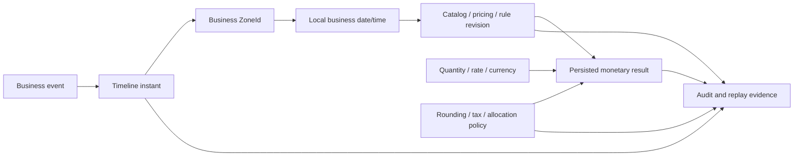
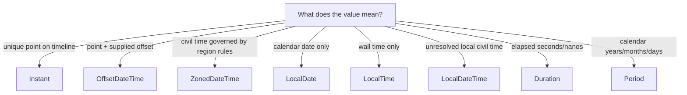

# Part 020 — Date, Time, Currency, and Numeric Precision

> Waktu dan uang bukan primitive biasa. Keduanya membawa unit, zone, calendar, effective window, precision, rounding, jurisdiction, dan version semantics. Menggunakan `LocalDateTime` atau `double` tanpa model yang eksplisit dapat menghasilkan quote yang tidak reproducible, harga salah pada boundary, order yang expired terlalu awal, atau total yang berbeda antar-service.

## Daftar Isi

1. [Target kompetensi](#target-kompetensi)
2. [Scope dan baseline](#scope-dan-baseline)
3. [Mental model: observation, business time, and monetary policy](#mental-model-observation-business-time-and-monetary-policy)
4. [Terminology map](#terminology-map)
5. [Standard versus implementation-specific boundary](#standard-versus-implementation-specific-boundary)
6. [Why temporal and monetary bugs are systemic](#why-temporal-and-monetary-bugs-are-systemic)
7. [Java time type selection](#java-time-type-selection)
8. [Instant, OffsetDateTime, and ZonedDateTime](#instant-offsetdatetime-and-zoneddatetime)
9. [LocalDate, LocalTime, and LocalDateTime](#localdate-localtime-and-localdatetime)
10. [Duration versus Period](#duration-versus-period)
11. [ZoneId versus fixed offset](#zoneid-versus-fixed-offset)
12. [UTC storage and local business semantics](#utc-storage-and-local-business-semantics)
13. [Clock abstraction](#clock-abstraction)
14. [Multiple clocks and clock skew](#multiple-clocks-and-clock-skew)
15. [Daylight Saving Time gaps and overlaps](#daylight-saving-time-gaps-and-overlaps)
16. [Effective dates and validity windows](#effective-dates-and-validity-windows)
17. [Half-open interval design](#half-open-interval-design)
18. [Catalog and pricing effective-date selection](#catalog-and-pricing-effective-date-selection)
19. [Quote validity and expiry](#quote-validity-and-expiry)
20. [Order lifecycle timestamps](#order-lifecycle-timestamps)
21. [Bi-temporal and audit considerations](#bi-temporal-and-audit-considerations)
22. [Temporal version pinning](#temporal-version-pinning)
23. [Database persistence and PostgreSQL types](#database-persistence-and-postgresql-types)
24. [Database time versus application time](#database-time-versus-application-time)
25. [Date/time serialization in JAX-RS](#datetime-serialization-in-jax-rs)
26. [Parsing and format policy](#parsing-and-format-policy)
27. [Currency as a first-class unit](#currency-as-a-first-class-unit)
28. [BigDecimal construction and arithmetic](#bigdecimal-construction-and-arithmetic)
29. [Scale, precision, and equality](#scale-precision-and-equality)
30. [Rounding policy](#rounding-policy)
31. [Money value object](#money-value-object)
32. [Price, rate, percentage, quantity, and amount](#price-rate-percentage-quantity-and-amount)
33. [Allocation and reconciliation](#allocation-and-reconciliation)
34. [Tax calculation boundary](#tax-calculation-boundary)
35. [Discounts, charges, and negative amounts](#discounts-charges-and-negative-amounts)
36. [Foreign exchange and conversion](#foreign-exchange-and-conversion)
37. [Database numeric precision](#database-numeric-precision)
38. [JSON and contract representation](#json-and-contract-representation)
39. [Idempotency and deterministic recalculation](#idempotency-and-deterministic-recalculation)
40. [Testing temporal logic](#testing-temporal-logic)
41. [Testing monetary logic](#testing-monetary-logic)
42. [Architecture patterns and anti-patterns](#architecture-patterns-and-anti-patterns)
43. [Failure-model matrix](#failure-model-matrix)
44. [Debugging playbook](#debugging-playbook)
45. [PR review checklist](#pr-review-checklist)
46. [Trade-off yang harus dipahami senior engineer](#trade-off-yang-harus-dipahami-senior-engineer)
47. [Internal verification checklist](#internal-verification-checklist)
48. [Latihan verifikasi](#latihan-verifikasi)
49. [Ringkasan](#ringkasan)
50. [Referensi resmi](#referensi-resmi)

---

## Target kompetensi

Setelah menyelesaikan part ini, Anda harus mampu:

- memilih `Instant`, `OffsetDateTime`, `ZonedDateTime`, `LocalDate`, `LocalDateTime`, `Duration`, dan `Period` berdasarkan semantics, bukan kenyamanan;
- membedakan machine timeline, local civil time, business date, effective date, recorded time, dan processing time;
- memodelkan UTC dan local business timezone tanpa kehilangan informasi penting;
- menggunakan `Clock` agar waktu dapat dikontrol dalam test dan replay;
- menangani DST gap, overlap, timezone-rule updates, dan ambiguous local time;
- mendesain validity window menggunakan interval yang tidak overlap pada boundary;
- memilih catalog/pricing/rule revision secara deterministik untuk evaluation instant tertentu;
- membuat expiry, renewal, billing cycle, dan order milestone semantics yang eksplisit;
- memetakan Java time types ke PostgreSQL dan JSON tanpa implicit timezone conversion;
- menggunakan `Currency` dan `BigDecimal` tanpa binary floating-point error;
- membedakan precision, scale, display fraction, calculation scale, dan settlement scale;
- menetapkan rounding policy per calculation boundary;
- mengalokasikan remainder secara deterministic sehingga detail lines reconcile dengan total;
- memisahkan tax calculation ownership dan snapshot hasilnya untuk audit;
- membuat monetary value objects yang mencegah pencampuran currency/unit;
- membangun test matrix untuk temporal boundary, DST, leap day, rounding midpoint, dan large values;
- mereview contract/database/migration changes yang berpotensi mengubah historical calculations.

---

## Scope dan baseline

Baseline:

- Java 17+ `java.time`, `java.math.BigDecimal`, `java.util.Currency`;
- Jakarta REST 4.x endpoint and serialization boundaries;
- Jackson, JSON-B, JAXB, atau custom providers sebagai kemungkinan serializer;
- PostgreSQL timestamp/date/time/numeric types;
- enterprise CPQ, quote, pricing, catalog, order, tax, and billing-adjacent workflows;
- distributed services with independent clocks;
- multiple timezones and currencies;
- long-running processes and historical replay/audit.

Part ini tidak mengasumsikan:

- semua timestamp harus disimpan sebagai local time;
- semua business logic berjalan di UTC;
- system default timezone stabil atau benar;
- dua decimal places benar untuk setiap currency atau calculation;
- `Currency.getDefaultFractionDigits()` cukup untuk contract/tax policy;
- database server time sama persis dengan application time;
- current catalog/pricing boleh dipakai untuk historical recalculation;
- tax selalu dihitung oleh service yang sama;
- `BigDecimal.setScale(2)` merupakan universal monetary solution.

Serialization mapping dibahas lebih lanjut di Part 022. PostgreSQL dan migrations dibahas pada Parts 028–031. Tenant-specific catalog/pricing context dibahas pada Part 019.

---

## Mental model: observation, business time, and monetary policy



Core temporal invariant:

```text
A timestamp is meaningful only when its semantics are known:
what happened, on which timeline, under which zone/calendar policy,
and whether it represents occurrence, recording, validity, or processing.
```

Core monetary invariant:

```text
A numeric amount is meaningful only with unit/currency,
calculation policy, scale/rounding semantics, and provenance.
```

---

## Terminology map

| Term | Arti operasional |
|---|---|
| instant | unique point on the UTC timeline |
| offset | fixed difference from UTC, e.g. `+07:00` |
| zone ID | region-based time zone with historical/future rules, e.g. `Asia/Jakarta` |
| local date/time | wall-clock representation without offset/zone |
| business date | date selected under a defined business zone/cutoff |
| occurrence time | when business event actually happened |
| recorded time | when system persisted/observed it |
| effective time | when policy/catalog/price becomes applicable |
| processing time | when a worker handles the item |
| validity window | interval where an entity/policy is active |
| precision | total significant decimal digits |
| scale | digits to the right of decimal point |
| rounding mode | rule for reducing precision/scale |
| currency | monetary unit such as USD, EUR, IDR |
| price | amount per unit or commercial amount under defined context |
| rate | ratio/percentage/amount applied to a base |
| settlement amount | amount accepted by billing/payment/accounting boundary |
| allocation | distributing a total among components while preserving sum |
| calculation snapshot | persisted inputs, versions, policy, and outputs used for audit/replay |

---

## Standard versus implementation-specific boundary

| Capability | Java/Jakarta standard | Implementation/domain-specific | Internal verification |
|---|---|---|---|
| timeline types | Java `java.time` | mapping/conventions | canonical types per field |
| controllable current time | Java `Clock` | DI/injection framework | how clocks are created/injected |
| decimal arithmetic | Java `BigDecimal`, `MathContext`, `RoundingMode` | monetary policy | calculation/settlement scale |
| currency metadata | Java `Currency` | product/contract currency rules | supported currency registry |
| request/response binding | Jakarta REST entity providers | Jackson/JSON-B/JAXB configuration | actual wire format |
| database temporal types | JDBC/PostgreSQL mappings | driver/MyBatis conventions | exact column and mapper types |
| effective-date rules | domain concern | catalog/pricing engine | interval and tie-break semantics |
| tax rules | domain/external service concern | jurisdiction/provider contract | ownership and snapshot policy |
| timezone data | JDK time-zone database | JDK/image update cadence | runtime tzdata version process |
| money object | no standard Java `Money` in Java SE | custom type or money library | internal abstraction/library |

Do not assume framework defaults preserve domain intent. A serializer can parse `2026-07-10T10:00:00` successfully while still losing the zone semantics required by the business.

---

## Why temporal and monetary bugs are systemic

Temporal and monetary values cross many boundaries:

```text
client
-> HTTP contract
-> serializer
-> resource/domain
-> database
-> event
-> downstream integration
-> reporting/billing/audit
```

A mismatch in one boundary can remain hidden until:

- DST transition;
- month/year boundary;
- customer in another timezone;
- effective-dated price publication;
- quote expiry;
- retry after midnight;
- currency with zero or three minor units;
- discount allocation;
- database migration changing scale;
- historical replay using current rules.

These bugs often produce plausible values, making them harder to detect than obvious exceptions.

---

## Java time type selection

Use the type that encodes the domain semantics.

| Requirement | Recommended type | Avoid |
|---|---|---|
| exact event point | `Instant` | `LocalDateTime` |
| API timestamp retaining supplied offset | `OffsetDateTime` | raw string |
| future appointment tied to regional rules | `ZonedDateTime` + `ZoneId` | fixed offset only |
| calendar date | `LocalDate` | midnight `Instant` without zone policy |
| wall-clock time | `LocalTime` | integer HHmm |
| local civil date/time before zone resolution | `LocalDateTime` | pretending it is UTC |
| elapsed machine duration | `Duration` | `Period` |
| calendar-based term, e.g. 1 month | `Period` | fixed 30-day `Duration` |
| year-month billing period | `YearMonth` | arbitrary date string |

A useful decision tree:



---

## Instant, OffsetDateTime, and ZonedDateTime

### `Instant`

Use for:

- event occurrence;
- audit timestamps;
- token expiry comparison;
- request deadlines;
- database record creation/update;
- ordering events on a common timeline.

```java
Instant submittedAt = clock.instant();
```

It does not contain a business zone.

### `OffsetDateTime`

Contains local date/time plus fixed offset.

```java
OffsetDateTime received = OffsetDateTime.parse(
        "2026-07-10T19:30:00+07:00"
);
Instant sameInstant = received.toInstant();
```

Useful for wire contracts that preserve caller-supplied offset. It does not retain region rules such as `Asia/Jakarta`.

### `ZonedDateTime`

Contains date/time, offset, and `ZoneId`.

```java
ZoneId zone = ZoneId.of("Europe/London");
ZonedDateTime appointment = ZonedDateTime.of(
        LocalDateTime.of(2026, 10, 25, 1, 30),
        zone
);
```

Use when future civil time should follow a region’s rules. Persist both intended local time and zone when future rule interpretation matters.

---

## LocalDate, LocalTime, and LocalDateTime

### `LocalDate`

Good for:

- contractual start/end date;
- business day;
- billing date;
- date of publication;
- catalog validity expressed as date.

But a date becomes an instant only under a zone and boundary rule.

```java
Instant startOfBusinessDate(LocalDate date, ZoneId zone) {
    return date.atStartOfDay(zone).toInstant();
}
```

`atStartOfDay` handles zone rules; it may not always be local `00:00` in historical zones.

### `LocalTime`

Good for recurring local cutoff such as “17:00 tenant local time.” It is incomplete without a date and zone when converting to a timeline.

### `LocalDateTime`

Use only when:

- the value is intentionally local/unresolved;
- zone is supplied separately;
- database/business semantics are local civil time.

Dangerous:

```java
Instant wrong = localDateTime.toInstant(ZoneOffset.UTC);
```

This silently asserts the value was UTC.

---

## Duration versus Period

`Duration` measures elapsed seconds/nanoseconds:

```java
Duration timeout = Duration.ofSeconds(2);
Instant deadline = clock.instant().plus(timeout);
```

`Period` measures calendar years/months/days:

```java
Period contractTerm = Period.ofMonths(1);
LocalDate nextDate = startDate.plus(contractTerm);
```

They are not interchangeable.

```text
2026-01-31 + Period.ofMonths(1) -> calendar adjustment semantics
2026-01-31T00Z + Duration.ofDays(30) -> fixed 720 hours
```

Use `Duration` for network timeouts, TTLs, and elapsed SLAs. Use `Period` for contract terms and calendar recurrence when that is the business intent.

---

## ZoneId versus fixed offset

A fixed offset such as `+01:00` does not encode daylight-saving or historical changes.

```java
ZoneOffset fixed = ZoneOffset.ofHours(1);
ZoneId regional = ZoneId.of("Europe/Paris");
```

For an event that already happened, offset may be enough to identify the instant. For future local scheduling, use a region `ZoneId` if the rule should follow regional law.

Persisting only `+07:00` may be acceptable for Jakarta timeline conversion, but it still loses the named business-zone intent. Decide based on audit and future scheduling requirements.

Never use three-letter abbreviations such as `CST` as authoritative zone identifiers; they are ambiguous.

---

## UTC storage and local business semantics

“Store everything in UTC” is useful but incomplete.

Store an `Instant` for timeline facts:

```text
quote_submitted_at = 2026-07-10T12:30:00Z
```

Also store local semantics when required:

```text
business_date = 2026-07-10
tenant_zone = Asia/Jakarta
cutoff_policy_revision = 17
```

Examples where UTC alone is insufficient:

- “valid until end of customer’s local business day”;
- recurring action at 09:00 Europe/London;
- price effective on local date;
- billing cycle based on tenant calendar;
- reporting grouped by business date;
- tax point defined by jurisdiction-local date.

Recommended split:

```text
Instant for occurrence/order/audit
LocalDate for business calendar semantics
ZoneId for conversion policy
revision for rules used
```

---

## Clock abstraction

Avoid direct scattered calls to:

```java
Instant.now();
LocalDate.now();
ZonedDateTime.now();
System.currentTimeMillis();
```

Inject a `Clock`:

```java
public final class QuoteExpiryService {
    private final Clock clock;

    public QuoteExpiryService(Clock clock) {
        this.clock = Objects.requireNonNull(clock);
    }

    public boolean isExpired(Instant validUntil) {
        return !clock.instant().isBefore(validUntil);
    }
}
```

Production composition:

```java
Clock clock = Clock.systemUTC();
```

Test:

```java
Clock fixed = Clock.fixed(
        Instant.parse("2026-07-10T12:00:00Z"),
        ZoneOffset.UTC
);
```

For business dates:

```java
LocalDate today(Clock clock, ZoneId businessZone) {
    return LocalDate.now(clock.withZone(businessZone));
}
```

Do not hide multiple direct clocks behind utility classes that remain impossible to control.

---

## Multiple clocks and clock skew

Distributed systems have multiple clocks:

- client device;
- gateway;
- application node;
- database;
- Kafka broker;
- identity provider;
- external pricing/tax service.

Clock synchronization reduces but does not eliminate skew.

Use rules:

- authority for a timestamp is explicit;
- do not order causally unrelated events solely by close timestamps;
- use event IDs, versions, offsets, sequence numbers, or database commit order where needed;
- token validation may allow bounded clock skew under security policy;
- deadlines should use monotonic elapsed-time sources internally when possible;
- business effective selection should use one captured evaluation instant per operation.

Capture once:

```java
Instant evaluationTime = clock.instant();
Catalog catalog = catalogResolver.at(tenantId, evaluationTime);
PriceBook priceBook = pricingResolver.at(tenantId, evaluationTime);
```

Do not call `now()` repeatedly through one calculation crossing a boundary.

For elapsed measurements, `System.nanoTime()` is appropriate; it is not a wall-clock timestamp.

---

## Daylight Saving Time gaps and overlaps

### Gap

A local time does not exist because clocks move forward.

```text
02:30 local may be skipped
```

### Overlap

A local time occurs twice because clocks move backward.

```text
01:30 local may map to two instants
```

Inspect valid offsets:

```java
LocalDateTime local = LocalDateTime.of(2026, 10, 25, 1, 30);
ZoneId zone = ZoneId.of("Europe/London");
List<ZoneOffset> offsets = zone.getRules().getValidOffsets(local);

if (offsets.isEmpty()) {
    // gap: local time does not exist
} else if (offsets.size() == 1) {
    // unambiguous
} else {
    // overlap: choose policy explicitly
}
```

Possible policies:

- reject ambiguous/nonexistent input;
- shift forward to next valid instant;
- choose earlier offset;
- choose later offset;
- store explicit offset from user;
- schedule by instant rather than local time.

The policy must be domain-specific and tested. Silent library defaults may not match business intent.

---

## Effective dates and validity windows

Effective-dated entities include:

- catalog release;
- price list;
- discount rule;
- tax rate;
- customer agreement;
- tenant configuration;
- approval threshold;
- product eligibility;
- quote validity;
- service plan.

Model:

```java
public record ValidityWindow(
        Instant validFrom,
        Optional<Instant> validUntil
) {
    public ValidityWindow {
        Objects.requireNonNull(validFrom);
        Objects.requireNonNull(validUntil);
        validUntil.ifPresent(end -> {
            if (!end.isAfter(validFrom)) {
                throw new IllegalArgumentException("end must be after start");
            }
        });
    }

    public boolean contains(Instant instant) {
        return !instant.isBefore(validFrom)
                && validUntil.map(instant::isBefore).orElse(true);
    }
}
```

For date-based validity:

```java
public record DateWindow(LocalDate fromInclusive, LocalDate toExclusive) {}
```

Do not use an arbitrary `23:59:59.999` end timestamp.

---

## Half-open interval design

Prefer:

```text
[startInclusive, endExclusive)
```

Adjacent revisions:

```text
revision A: [2026-01-01T00:00Z, 2026-07-01T00:00Z)
revision B: [2026-07-01T00:00Z, infinity)
```

At the boundary, exactly one revision matches.

SQL:

```sql
WHERE effective_from <= :evaluation_time
  AND (effective_to IS NULL OR :evaluation_time < effective_to)
```

Database constraints or publication validation should prevent overlapping windows for the same tenant/product/rule key.

Edge cases:

- equal start/end;
- null/open end;
- backdated publication;
- future revisions;
- overlapping region/tenant overrides;
- transaction reads revisions before and after publication;
- evaluation instant precision mismatch between Java and database.

---

## Catalog and pricing effective-date selection

A deterministic selection key might be:

```text
tenant
catalog/price-book identity
product/offer
sales channel
customer segment/agreement
currency
region
quantity tier
evaluation instant
publication status
precedence
```

Selection must return:

- exactly one applicable result;
- an explicit no-match result;
- or a detected ambiguity error.

Never choose “latest created row” unless creation time is the intended business precedence.

Example query skeleton:

```sql
SELECT price_id, revision, amount, currency_code, effective_from, effective_to
FROM product_price
WHERE tenant_id = :tenant_id
  AND product_code = :product_code
  AND currency_code = :currency_code
  AND effective_from <= :evaluation_time
  AND (effective_to IS NULL OR :evaluation_time < effective_to)
  AND publication_status = 'PUBLISHED'
ORDER BY precedence DESC, revision DESC;
```

Application must reject multiple equally valid rows unless deterministic tie-break semantics are part of the model.

Persist selected revision and calculated result in the quote.

---

## Quote validity and expiry

Clarify what “valid for 30 days” means:

- 30 × 24 elapsed hours from issuance;
- until end of the 30th local business date;
- one calendar month;
- until a specific contract date;
- excluding weekends/holidays;
- subject to catalog/pricing expiry.

Examples:

```java
Instant elapsedExpiry = issuedAt.plus(Duration.ofDays(30));
```

versus:

```java
LocalDate expiryDate = issuedBusinessDate.plusDays(30);
Instant expiry = expiryDate.plusDays(1)
        .atStartOfDay(businessZone)
        .toInstant();
```

Boundary semantics:

```java
boolean expired = !clock.instant().isBefore(validUntilExclusive);
```

Quote record should capture:

```text
issued_at
business_zone / business_date if relevant
valid_until or valid-through date semantics
validity policy revision
catalog/pricing/rule revisions
```

Do not reinterpret old quotes using a newly changed default validity policy.

---

## Order lifecycle timestamps

Different timestamps answer different questions:

```text
created_at        when draft order record was created
submitted_at      when customer/system submitted it
accepted_at       when order was accepted
committed_at      when durable transaction committed
published_at      when event was emitted/published
fulfilled_at      when fulfillment completed
cancelled_at      when cancellation became effective
recorded_at       when this service observed external event
source_occurred_at when source system claims event happened
```

Do not overload one `updated_at` field to infer lifecycle history.

For external events, preserve both source occurrence and local receipt/recording times. Source time may be untrusted or skewed; recording time provides system evidence.

Use state transition history or audit events where regulatory/operational reconstruction matters.

---

## Bi-temporal and audit considerations

Some systems need two temporal axes:

1. **valid time** — when a fact is true in the business world;
2. **transaction/system time** — when the system learned/stored that fact.

Example:

```text
price valid from July 1
entered into system July 3
corrected July 5 as backdated fact
```

A simple current-row model cannot answer “what did the system believe on July 4?”

Bi-temporal modelling may use:

```text
valid_from / valid_to
recorded_from / recorded_to
```

Costs:

- more complex queries/indexes;
- correction semantics;
- larger storage;
- migration/reporting complexity.

Use only when audit/reconstruction requirements justify it. Event sourcing may help but does not automatically solve effective-time corrections.

---

## Temporal version pinning

Long-running quote/order/workflow processing needs an explicit policy:

- **snapshot/pin** — continue with versions captured at start;
- **latest** — reevaluate against current versions;
- **revalidation gate** — pinned until a defined transition, then validate/reprice;
- **hybrid** — commercial values pinned, security/eligibility policy latest.

Persist:

```java
public record CalculationProvenance(
        Instant evaluationTime,
        String tenantConfigurationRevision,
        String catalogRevision,
        String pricingRevision,
        String ruleSetRevision,
        String taxPolicyRevision,
        String roundingPolicyRevision
) {}
```

Pinning is not enough if referenced revisions are deleted. Define retention and migration for old revisions.

---

## Database persistence and PostgreSQL types

Relevant PostgreSQL types:

| Domain | PostgreSQL type | Notes |
|---|---|---|
| timeline instant | `timestamp with time zone` / `timestamptz` | stored as instant; display depends on session zone |
| local civil date/time | `timestamp without time zone` | no zone/offset semantics |
| business date | `date` | calendar date |
| local time | `time without time zone` | incomplete without date/zone |
| offset time | `time with time zone` | rarely appropriate for domain scheduling |
| duration | `interval` or numeric unit | interval semantics need care |
| exact decimal | `numeric(p,s)` | choose precision/scale based on domain |
| currency code | `char(3)`/`varchar` with validation/reference | policy may support nonstandard units separately |

Important PostgreSQL behavior:

- `timestamptz` represents an instant, not a stored named `ZoneId`;
- session timezone affects text rendering/conversion;
- `timestamp without time zone` should not be treated as UTC implicitly;
- JDBC/MyBatis mapping must be tested with driver version;
- database precision may be microseconds while Java `Instant` supports nanoseconds;
- comparison around truncated precision must be consistent.

For future regional schedules, store local date/time + zone ID, and optionally precomputed next instant.

---

## Database time versus application time

Possible authorities:

### Application clock

```java
Instant now = clock.instant();
```

Advantages:

- controllable in tests;
- consistent within domain operation;
- works before SQL.

Risks:

- node clock skew;
- multiple services choose different instants.

### Database clock

```sql
CURRENT_TIMESTAMP
```

Advantages:

- consistent within database transaction semantics;
- authoritative for DB-generated audit fields.

Risks:

- harder to inject/test;
- result must return to application;
- not authority for non-DB operations;
- multiple databases still differ.

Policy examples:

- application captures evaluation time once and passes it to all calculations;
- database generates `created_at` for persistence audit;
- externally sourced occurrence time is stored separately;
- event payload uses committed record timestamp returned by database.

Do not mix application `now` and database `now` in one boundary-sensitive selection without accepting skew.

---

## Date/time serialization in JAX-RS

Recommended contract shapes:

```json
{
  "submittedAt": "2026-07-10T12:30:00Z",
  "requestedActivationAt": "2026-07-10T19:30:00+07:00",
  "businessDate": "2026-07-10",
  "businessZone": "Asia/Jakarta"
}
```

Rules:

- use ISO-8601/RFC 3339-compatible representations for timeline values;
- require offset/`Z` for instant-like fields;
- do not accept offsetless timestamp for an `Instant` contract;
- serialize date-only values as `YYYY-MM-DD`;
- make zone a separate named field when business semantics need it;
- specify fractional-second precision;
- document normalization behavior;
- reject ambiguous formats instead of locale-dependent parsing;
- preserve backward compatibility before changing precision or field type.

DTO example:

```java
public record SubmitQuoteRequest(
        OffsetDateTime requestedAt,
        LocalDate requestedStartDate,
        String businessZone
) {}
```

Domain mapping validates the allowed zone and converts under explicit policy.

---

## Parsing and format policy

Avoid flexible parsing that accepts many undocumented forms. It creates inconsistent clients and ambiguity.

Define per field:

```text
semantic type
required offset/zone
fractional precision
normalization
minimum/maximum range
past/future constraints
error code
```

Example strict parser:

```java
public Instant parseRequiredInstant(String raw) {
    try {
        return OffsetDateTime.parse(raw, DateTimeFormatter.ISO_OFFSET_DATE_TIME)
                .toInstant();
    } catch (DateTimeParseException ex) {
        throw new InvalidRequestException(
                "INVALID_TIMESTAMP",
                "Timestamp must include an offset"
        );
    }
}
```

Beware:

- locale-sensitive formats such as `10/07/2026`;
- epoch seconds versus milliseconds confusion;
- integer overflow;
- leap second input handling;
- years outside database/client range;
- truncating offset/zone during DTO mapping.

---

## Currency as a first-class unit

A decimal without currency is not money.

```java
Currency usd = Currency.getInstance("USD");
Currency idr = Currency.getInstance("IDR");
```

Do not infer transaction currency from JVM locale or tenant display locale.

Currency policy should define:

- supported codes;
- contract/API representation;
- calculation and display fraction digits;
- settlement rounding;
- cash rounding if applicable;
- historical/retired currency handling;
- custom/non-ISO units if the product requires them;
- exchange-rate source and revision.

`Currency.getDefaultFractionDigits()` is metadata, not necessarily your legal/contractual calculation policy. Tax and pricing engines may require intermediate precision greater than display digits.

---

## BigDecimal construction and arithmetic

Never construct monetary decimals from binary floating point:

```java
BigDecimal wrong = new BigDecimal(0.1);
```

Prefer:

```java
BigDecimal exact = new BigDecimal("0.1");
BigDecimal fromLong = BigDecimal.valueOf(10L);
BigDecimal scaled = BigDecimal.valueOf(12345, 2); // 123.45
```

Arithmetic:

```java
BigDecimal subtotal = unitPrice.multiply(quantity);
BigDecimal discount = subtotal.multiply(discountRate);
BigDecimal net = subtotal.subtract(discount);
```

Division may require explicit scale/rounding:

```java
BigDecimal unitShare = total.divide(
        quantity,
        8,
        RoundingMode.HALF_EVEN
);
```

Without an exact terminating decimal, `divide` without rounding throws `ArithmeticException`. That is useful because it exposes missing policy rather than silently rounding.

Avoid global arbitrary `MathContext` unless its precision semantics are intentionally part of every operation.

---

## Scale, precision, and equality

```java
BigDecimal a = new BigDecimal("10.0");
BigDecimal b = new BigDecimal("10.00");

a.compareTo(b) == 0; // numeric equality
!a.equals(b);        // representation/scale differs
```

Implications:

- `BigDecimal` as `HashMap`/`Set` key can surprise;
- validation may require specific scale;
- database round trip may normalize scale;
- JSON textual representation may preserve or drop trailing zeros;
- audit may care about original representation separately from numeric amount.

Definitions:

```text
precision of 123.4500 = 7
scale of 123.4500 = 4
```

Normalize intentionally:

```java
BigDecimal amount = raw.setScale(calculationScale, roundingMode);
```

Do not call `stripTrailingZeros()` blindly; it can produce negative scale and alter representation expectations.

---

## Rounding policy

Rounding is a business rule, not a cleanup step.

Common modes:

| Mode | Meaning / use |
|---|---|
| `HALF_UP` | common commercial rounding, but not universal |
| `HALF_EVEN` | reduces aggregate bias in repeated calculations |
| `DOWN` | toward zero |
| `FLOOR` | toward negative infinity |
| `CEILING` | toward positive infinity |
| `UNNECESSARY` | assert no rounding should be needed |

Define where rounding occurs:

```text
unit price
quantity multiplication
per-line discount
per-line tax
document subtotal
document tax
allocation
invoice/settlement
cash payment display
```

Rounding every intermediate step may differ from rounding only at the total.

Example:

```text
3 lines × 0.3333
round each to 0.33 => 0.99
round total 0.9999 => 1.00
```

Both can be valid under different policy. The system must choose, persist, and reconcile.

Represent policy explicitly:

```java
public record RoundingPolicy(
        int calculationScale,
        int settlementScale,
        RoundingMode calculationMode,
        RoundingMode settlementMode,
        String revision
) {}
```

---

## Money value object

A minimal immutable type:

```java
public record Money(BigDecimal amount, Currency currency) {
    public Money {
        Objects.requireNonNull(amount);
        Objects.requireNonNull(currency);
    }

    public Money add(Money other) {
        requireSameCurrency(other);
        return new Money(amount.add(other.amount), currency);
    }

    public Money subtract(Money other) {
        requireSameCurrency(other);
        return new Money(amount.subtract(other.amount), currency);
    }

    public Money multiply(BigDecimal multiplier) {
        return new Money(amount.multiply(multiplier), currency);
    }

    public Money rounded(int scale, RoundingMode mode) {
        return new Money(amount.setScale(scale, mode), currency);
    }

    private void requireSameCurrency(Money other) {
        if (!currency.equals(other.currency)) {
            throw new IllegalArgumentException("currency mismatch");
        }
    }
}
```

Production concerns:

- canonical scale policy;
- zero/negative semantics;
- serialization;
- database mapping;
- max precision;
- comparison and equality;
- currency conversion as separate operation;
- allocation utilities;
- audit of unrounded/intermediate values where required.

Do not make `Money.add` silently convert currencies.

---

## Price, rate, percentage, quantity, and amount

Do not use one generic decimal type for semantically different values.

```java
public record Quantity(BigDecimal value, String unit) {}
public record Percentage(BigDecimal fraction) {} // 0.15 = 15%
public record UnitPrice(Money money, String perUnit) {}
public record TaxRate(BigDecimal fraction, String jurisdiction, String revision) {}
```

Clarify percentage representation:

```text
0.15 or 15?
```

Contract must state it. Prefer names such as `discountFraction` or document `discountPercent` clearly.

Unit conversions need exact policy:

```text
GB versus GiB
month versus 30 days
seconds versus milliseconds
quantity scale and minimum increment
```

A CPQ system can produce monetary errors even with correct currency arithmetic if quantity/unit semantics are wrong.

---

## Allocation and reconciliation

When splitting a rounded total among lines, naive division loses remainder.

Example:

```text
Total discount = 10.00
3 equal lines
10.00 / 3 = 3.333...
```

Allocation algorithm:

1. calculate high-precision shares;
2. round each to settlement scale;
3. compute remainder against required total;
4. distribute smallest currency units deterministically;
5. preserve allocation order/tie-break policy;
6. assert allocated sum equals total.

```java
public List<Money> allocateEvenly(Money total, int parts, RoundingPolicy policy) {
    BigDecimal raw = total.amount().divide(
            BigDecimal.valueOf(parts),
            policy.calculationScale(),
            policy.calculationMode()
    );

    List<BigDecimal> values = new ArrayList<>();
    for (int i = 0; i < parts; i++) {
        values.add(raw.setScale(policy.settlementScale(), policy.settlementMode()));
    }

    BigDecimal allocated = values.stream()
            .reduce(BigDecimal.ZERO, BigDecimal::add);
    BigDecimal remainder = total.amount().subtract(allocated);
    BigDecimal unit = BigDecimal.ONE.movePointLeft(policy.settlementScale());

    int index = 0;
    while (remainder.signum() != 0) {
        BigDecimal step = remainder.signum() > 0 ? unit : unit.negate();
        values.set(index, values.get(index).add(step));
        remainder = remainder.subtract(step);
        index = (index + 1) % parts;
    }

    return values.stream()
            .map(v -> new Money(v, total.currency()))
            .toList();
}
```

Production allocation should define ordering and handle large remainder efficiently. Persist allocated values rather than recomputing under changed policy.

---

## Tax calculation boundary

Tax may depend on:

- seller/buyer jurisdiction;
- product/service tax category;
- tax-inclusive versus tax-exclusive price;
- exemption certificates;
- customer type;
- supply/activation date;
- currency;
- rounding per line versus document;
- external tax-provider rules;
- invoice/order lifecycle event.

Define ownership:

```text
CPQ estimates tax?
Order service finalizes tax?
Billing system is authoritative?
External tax service returns quote and expiry?
```

Persist tax provenance:

```java
public record TaxResult(
        Money taxableBase,
        Money taxAmount,
        BigDecimal rate,
        String jurisdiction,
        String taxCategory,
        String provider,
        String providerCalculationId,
        String ruleRevision,
        Instant calculatedAt
) {}
```

Do not silently recompute historical tax with current rates. If tax is estimated, label it explicitly in API/domain.

Retry/idempotency for external tax calls must preserve calculation identity and avoid duplicate side effects.

---

## Discounts, charges, and negative amounts

Represent meaning explicitly:

- discount as positive magnitude applied by subtraction;
- discount as negative amount;
- credit/adjustment;
- surcharge;
- refund;
- reversal.

Mixing conventions causes double negation.

Example policy:

```text
price components carry signed amounts
subtotal = sum(components)
component type explains business meaning
```

or:

```text
discount amount is non-negative magnitude
calculation explicitly subtracts it
```

Choose one and validate.

Constraints may include:

- discount cannot exceed eligible base;
- final total cannot be negative unless credit order type;
- percentage bounds;
- charge/tax order;
- minimum price/floor;
- tenant-specific approval threshold.

---

## Foreign exchange and conversion

Currency conversion is not `amount * currentRate` without context.

Required metadata:

```java
public record FxRate(
        Currency base,
        Currency counter,
        BigDecimal rate,
        Instant effectiveAt,
        String source,
        String revision
) {}
```

Define quote direction:

```text
1 base currency = rate counter currency
```

Conversion:

```java
Money convert(Money source, Currency target, FxRate fx, RoundingPolicy policy) {
    if (!source.currency().equals(fx.base()) || !target.equals(fx.counter())) {
        throw new IllegalArgumentException("rate direction mismatch");
    }
    BigDecimal converted = source.amount().multiply(fx.rate());
    return new Money(
            converted.setScale(policy.settlementScale(), policy.settlementMode()),
            target
    );
}
```

Consider:

- bid/ask/mid rate;
- contract-specific rate;
- effective time;
- provider and version;
- triangulation;
- fees;
- inverse rate precision;
- settlement currency;
- rate expiry;
- historical replay.

Never use JVM locale to choose FX rate or currency.

---

## Database numeric precision

Choose `numeric(p,s)` from actual bounds.

Example:

```sql
amount numeric(19,4)
```

means at most 19 total digits, 4 fractional digits. Validate whether this supports:

- maximum order total;
- high-precision rates;
- usage quantities;
- tax calculations;
- aggregated reports;
- intermediate calculations.

Separate columns may need different scales:

```text
money settlement amount: numeric(19,4)
quantity: numeric(20,8)
percentage/rate: numeric(18,10)
FX rate: numeric(24,12)
```

Do not reuse one schema type everywhere merely for consistency.

Migration risks:

- reducing scale rounds/truncates existing values;
- reducing precision can fail or overflow;
- changing mapper from decimal to double loses exactness;
- database defaults/casts may apply unexpected rounding;
- indexes/unique constraints may collapse formerly distinct values after scale change.

Use explicit pre-migration analysis and compatibility rollout.

---

## JSON and contract representation

Two common amount shapes:

### JSON number

```json
{
  "amount": 123.45,
  "currency": "USD"
}
```

Pros: natural JSON. Risks: JavaScript and other consumers may parse into binary floating point, lose precision, or use exponential notation.

### Decimal string

```json
{
  "amount": "123.4500",
  "currency": "USD"
}
```

Pros: exact textual decimal and scale. Costs: clients must parse explicitly.

Another option is minor units:

```json
{
  "minorUnits": 12345,
  "currency": "USD",
  "scale": 2
}
```

But not every domain amount uses currency default fraction, values may exceed safe JavaScript integer range, and calculation scale may differ.

Contract must define:

- representation;
- maximum precision/scale;
- trailing-zero semantics;
- rounding responsibility;
- supported currencies;
- range;
- whether scientific notation is allowed;
- backward compatibility.

For timestamps, define offset and fractional precision similarly.

---

## Idempotency and deterministic recalculation

A retried quote calculation should not accidentally select a different price because “now” changed.

Idempotent command should bind:

```text
idempotency key
request canonical form
tenant
captured evaluation time
catalog/pricing/rule revisions
currency
rounding/tax policy revisions
```

On retry:

- return prior result if request fingerprint matches;
- reject key reuse with different semantic request;
- do not recalculate using current clock/policy unless contract says so;
- preserve unrounded and rounded result provenance as required.

For event replay, use event occurrence/evaluation semantics, not replay processing time, unless explicitly designed otherwise.

---

## Testing temporal logic

### Fixed clock

```java
@Test
void expiresAtBoundary() {
    Instant validUntil = Instant.parse("2026-07-10T12:00:00Z");
    Clock clock = Clock.fixed(validUntil, ZoneOffset.UTC);

    QuoteExpiryService service = new QuoteExpiryService(clock);

    assertTrue(service.isExpired(validUntil));
}
```

### Boundary matrix

Test:

```text
just before start
exactly at start
just before end
exactly at end
open-ended interval
overlap
gap
leap day
month end
year end
DST gap/overlap
minimum/maximum supported timestamp
precision truncation boundary
```

### Property-based interval tests

For adjacent windows, assert exactly one match at all generated instants.

### Zone tests

Use representative zones:

- UTC;
- no-DST regional zone such as `Asia/Jakarta`;
- positive-offset DST zone;
- negative-offset zone;
- zones with non-hour offsets;
- historical rule cases if required.

Do not rely only on the developer machine default zone. Set test JVM/database session zones explicitly.

### Clock-skew tests

Simulate application, DB, and external timestamps differing by allowed bounds.

---

## Testing monetary logic

Test categories:

### Construction

- decimal string values;
- forbidden floating-point path;
- maximum precision;
- unsupported currency;
- negative/zero constraints.

### Rounding midpoint

```text
positive and negative values
HALF_UP versus HALF_EVEN
exact boundary above/below midpoint
```

### Reconciliation

Assert:

```text
sum(line net) == subtotal
sum(allocated discount) == document discount
sum(line tax) or document tax follows policy
subtotal + charges - discounts + tax == total
```

### Currency mismatch

Adding USD and EUR must fail unless explicit conversion is invoked.

### Scale round trip

Test Java → JSON → Java and Java → PostgreSQL → Java for expected numeric value and scale policy.

### Large/randomized values

Property-based tests for:

- associativity assumptions that rounding breaks;
- allocation sum preservation;
- no overflow against database precision;
- deterministic repeated calculation;
- rate/percentage boundaries.

### Golden examples

Use business-approved examples for pricing, discount, tax, and invoice totals. Store expected policy revision.

---

## Architecture patterns and anti-patterns

### Pattern: capture one evaluation context

```java
public record EvaluationContext(
        Instant evaluationTime,
        ZoneId businessZone,
        Currency currency,
        CalculationProvenance provenance,
        RoundingPolicy roundingPolicy
) {}
```

Pass it through the calculation instead of repeatedly reading global current state.

### Pattern: half-open effective windows

Avoid ambiguous inclusive end timestamps.

### Pattern: persist calculated facts and provenance

Store selected revisions, input, result, and policy metadata needed for audit.

### Pattern: separate calculation from presentation

Calculation scale and display formatting are different concerns.

### Pattern: explicit unit types

`Money`, `Quantity`, `Percentage`, `TaxRate`, and `Duration` prevent accidental mixing.

### Anti-pattern: system default timezone

```java
LocalDate.now();
```

Meaning changes across environments.

### Anti-pattern: offsetless API timestamps for instants

```json
"submittedAt": "2026-07-10T12:30:00"
```

No unique timeline meaning.

### Anti-pattern: `double` for money/rates

Produces binary approximation and unstable rounding.

### Anti-pattern: `setScale(2)` everywhere

Ignores currency, rates, quantity, tax, and intermediate precision.

### Anti-pattern: current rules for historical recalculation

Breaks reproducibility and audit.

### Anti-pattern: inclusive start and inclusive end for adjacent revisions

Creates double match at boundary.

### Anti-pattern: expiration worker uses processing time as occurrence time

Delayed processing changes semantics and can produce incorrect audit events.

### Anti-pattern: formatting locale as currency authority

Locale controls display, not transaction unit.

---

## Failure-model matrix

| Failure | Typical symptom | Detection | Containment / remediation |
|---|---|---|---|
| `LocalDateTime` treated as UTC | hours-shifted activation/expiry | compare raw payload, zone, stored instant | require offset/zone, migrate semantics |
| system default zone differs | environment-specific date | log JVM zone, deterministic tests | explicit `ZoneId`/`Clock` |
| DST gap silently shifted | unexpected appointment time | boundary tests, input audit | explicit gap policy/rejection |
| DST overlap chooses wrong offset | event occurs one hour off | preserve offset/zone, overlap test | require offset or choose documented policy |
| repeated `now()` calls cross boundary | mixed catalog/price revision | provenance mismatch | capture evaluation instant once |
| application/DB clock skew | record appears before request/event | compare authoritative clocks | define authority, NTP/monitor skew |
| inclusive intervals overlap | two active prices | publication validation/query alerts | half-open windows and exclusion constraint/process |
| gap in effective windows | no price/config found | pre-publication validation | fail publication or explicit fallback |
| stale pricing cache | old price after effective time | revision diagnostics/reconciliation | versioned cache, scheduled invalidation |
| historical recalculation uses latest rules | totals change unexpectedly | compare revisions/provenance | pin/retain calculation snapshot |
| `new BigDecimal(double)` | subtle decimal error | static analysis/test | string/valueOf construction |
| missing rounding policy | `ArithmeticException` or inconsistent totals | calculation tests | explicit boundary policy |
| line/document rounding mismatch | sum of lines != total | reconciliation assertion | allocation/remainder policy |
| currency mismatch ignored | invalid cross-currency total | typed value object | explicit FX conversion |
| DB numeric scale truncates value | lost precision | round-trip/migration test | correct schema and explicit rounding |
| JSON consumer parses large decimal as double | client total differs | contract/client compatibility test | decimal string or generated decimal type |
| timestamp precision truncated | optimistic/event comparisons fail | round-trip test | normalize supported precision |
| tax provider retried with new time/rate | duplicate/different tax | idempotency and provider audit | stable calculation ID/context |
| quote expiry policy changes | old quote expires differently | persisted policy/revision check | materialize valid-until/provenance |
| negative discount convention mixed | total increases/decreases twice | invariant tests | one signed/magnitude convention |

---

## Debugging playbook

### 1. Classify the temporal value

For every suspect timestamp, answer:

```text
field name and semantic meaning
Java type
wire representation
original offset/zone
stored PostgreSQL type/value
DB/session timezone
serializer configuration
fractional precision
clock/source authority
```

Do not start by converting everything to local display time.

### 2. Reconstruct one timeline

Record:

```text
source occurred_at
gateway received_at
application evaluated_at
database created/committed_at
event published_at
consumer processed_at
```

Convert all to `Instant` for comparison while retaining source zone metadata.

### 3. Check effective selection

Collect:

```text
evaluation instant
business zone/date
tenant
catalog/pricing/rule key
all candidate windows
publication status
precedence
selected revision
cache revision
```

Run the exact query at the boundary.

### 4. Inspect timezone environment

Check:

- JVM `user.timezone` and `ZoneId.systemDefault()`;
- container image/JDK timezone data;
- database server/session timezone;
- serializer defaults;
- OS timezone;
- client-supplied offset/zone;
- deployed configuration differences.

### 5. Reconstruct monetary calculation

Capture:

```text
currency
quantity and unit
unit price
raw discount/tax rates
calculation scale and rounding mode
line-level intermediate values
document-level totals
allocation remainder
policy/revision IDs
stored values and DB column definitions
```

Never debug only the final formatted amount.

### 6. Compare code and database precision

Run:

```sql
SELECT amount, scale(amount), precision(amount)
FROM ...;
```

Or inspect textual representation/casts appropriate to PostgreSQL. Compare driver-returned `BigDecimal.scale()`.

### 7. Reproduce with fixed inputs

Use:

- fixed `Clock`;
- explicit `ZoneId`;
- exact decimal strings;
- exact policy revisions;
- production-equivalent serializer and DB schema.

### 8. Contain production impact

Possible actions:

- freeze price/catalog publication;
- disable unsafe repricing;
- pin known-good revision;
- stop expiry/billing/reconciliation jobs;
- preserve calculation snapshots;
- prevent automatic correction until accounting impact is assessed;
- communicate affected time/currency/tenant window precisely.

Avoid mass recomputation with current rules before identifying provenance.

---

## PR review checklist

### Temporal semantics

- [ ] Does every field state whether it is an instant, local date/time, business date, duration, or period?
- [ ] Is the zone/offset requirement explicit?
- [ ] Is system default timezone avoided?
- [ ] Is current time obtained from injected `Clock`?
- [ ] Is evaluation time captured once per operation?
- [ ] Are occurrence, recording, and processing times separated?

### Effective dates

- [ ] Are windows half-open?
- [ ] Are overlap and gap rules validated?
- [ ] Is effective-date precision consistent across Java/DB?
- [ ] Is publication status separate from validity?
- [ ] Are selected revisions persisted where needed?
- [ ] Are backdated/future-dated changes governed?

### DST and scheduling

- [ ] Can local input be nonexistent or ambiguous?
- [ ] Is gap/overlap policy documented and tested?
- [ ] Is region `ZoneId` preserved for future schedules?
- [ ] Are recurring calendar periods using `Period` rather than fixed duration where appropriate?

### Database and contracts

- [ ] Do PostgreSQL types match domain semantics?
- [ ] Is `timestamptz` not mistaken for stored `ZoneId`?
- [ ] Are timestamp/decimal precision round trips tested?
- [ ] Does API require offset for timeline fields?
- [ ] Are fractional-second and decimal formats documented?
- [ ] Is backward compatibility evaluated?

### Monetary semantics

- [ ] Is currency mandatory?
- [ ] Is `BigDecimal` constructed safely?
- [ ] Are quantity, percentage, price, amount, and rate distinguished?
- [ ] Is calculation versus settlement scale explicit?
- [ ] Is rounding mode and boundary explicit?
- [ ] Are currency mismatches rejected?
- [ ] Does allocation reconcile exactly?

### Pricing/tax/audit

- [ ] Are pricing, catalog, FX, tax, and rounding revisions captured?
- [ ] Is historical recalculation behavior defined?
- [ ] Is tax ownership and estimate/final status explicit?
- [ ] Are external calculation calls idempotent?
- [ ] Are negative discounts/credits conventions consistent?
- [ ] Can the result be explained from persisted provenance?

### Testing

- [ ] Boundary instants tested?
- [ ] DST gap/overlap tested?
- [ ] Month/year/leap-day tested?
- [ ] Rounding midpoint and negative values tested?
- [ ] Randomized reconciliation tests present?
- [ ] Production-equivalent DB/serializer round-trip tested?

---

## Trade-off yang harus dipahami senior engineer

### Store only instant versus preserve local intent

An instant is ideal for ordering and audit, but future schedules and business dates may need local time plus `ZoneId`. Preserve both when the local intent matters.

### Application clock versus database clock

Application clock is testable and consistent across domain calculation. Database clock is authoritative within a transaction. Mixing them requires explicit semantics and accepted skew.

### Pin revisions versus use latest rules

Pinning preserves reproducibility. Latest rules allow corrections and policy enforcement. Different categories may need different policies; commercial totals and security eligibility need not behave identically.

### Round per line versus round at total

Per-line rounding supports invoices and downstream reconciliation but can produce a different total than aggregate rounding. The commercial/accounting contract decides, not mathematical preference.

### Fixed scale versus variable scale

Fixed scale simplifies schema and contracts but may lose precision or overfit one currency. Variable scale preserves data but complicates equality, validation, and clients. Often calculation types and settlement types should differ.

### JSON number versus decimal string

JSON number is convenient but can be parsed as binary floating point. String preserves exact decimal text but requires explicit client parsing. Generated clients and compatibility needs guide the choice.

### Store intermediate values versus recompute

Persisting intermediates improves audit and reconciliation but increases storage/schema complexity. Recomputing is smaller but unsafe when rules, timezone data, or rounding policies change.

### Region zone versus fixed offset

Region zones follow future legal changes but results can change when timezone data updates. Fixed offsets are stable for an already-known instant but do not preserve future civil scheduling intent.

---

## Internal verification checklist

### Temporal conventions

- [ ] Canonical timestamp types in Java DTO/domain/entity layers.
- [ ] Canonical database timestamp types.
- [ ] Required API offset/zone format.
- [ ] Fractional-second precision.
- [ ] JVM/container/database session timezone.
- [ ] JDK/timezone-data update process.
- [ ] Direct `now()`/`currentTimeMillis()` usage inventory.
- [ ] Injected `Clock` or internal time-service abstraction.

### Business time

- [ ] Tenant/customer/business timezone source of truth.
- [ ] Business-day cutoff semantics.
- [ ] Weekend/holiday calendar ownership.
- [ ] Quote validity definition.
- [ ] Order activation/cancellation effective semantics.
- [ ] Recurrence and billing-period semantics.
- [ ] DST gap/overlap policy.

### Effective-dated configuration

- [ ] Catalog, pricing, rule, tax, agreement, and tenant-config window model.
- [ ] Half-open versus inclusive boundaries.
- [ ] Overlap/gap constraints.
- [ ] Publication versus effective state.
- [ ] Evaluation-time authority.
- [ ] Cache invalidation around effective boundaries.
- [ ] Revision retention and historical replay.

### Persistence and serialization

- [ ] JDBC/MyBatis mappings for `Instant`, `OffsetDateTime`, `LocalDateTime`, and `LocalDate`.
- [ ] PostgreSQL session timezone and column definitions.
- [ ] Timestamp precision truncation policy.
- [ ] Jackson/JSON-B/JAXB modules and formats.
- [ ] Offsetless timestamp acceptance.
- [ ] Epoch unit conventions.
- [ ] Generated-client date/time types.

### Currency and precision

- [ ] Supported currency registry.
- [ ] Transaction currency selection.
- [ ] Calculation, display, settlement, and storage scales.
- [ ] Rounding modes and boundaries.
- [ ] `BigDecimal` construction/static-analysis rules.
- [ ] Database `numeric(p,s)` per field category.
- [ ] JSON decimal representation.
- [ ] Maximum/minimum amount and rate ranges.

### Pricing, discounts, tax, and FX

- [ ] Unit-price and quantity unit semantics.
- [ ] Percentage representation (`0.15` versus `15`).
- [ ] Discount/charge sign conventions.
- [ ] Allocation/remainder algorithm.
- [ ] Line versus document rounding.
- [ ] Tax estimate/final ownership and provider contract.
- [ ] FX rate direction, source, effective time, and revision.
- [ ] Persisted calculation provenance.

### Testing and operations

- [ ] Fixed-clock test support.
- [ ] DST/leap/month-end test cases.
- [ ] Golden commercial examples.
- [ ] Randomized reconciliation tests.
- [ ] Serializer/DB round-trip tests.
- [ ] Production incident runbook for pricing/time errors.
- [ ] Reconciliation/correction and customer-impact process.
- [ ] Safe migration process for timestamp/numeric columns.

---

## Latihan verifikasi

### Exercise 1 — Type every temporal field

For one quote/order schema, classify each field:

```text
field
business meaning
Java type
wire type
PostgreSQL type
offset/zone source
precision
authority
```

Any `LocalDateTime` requires a written justification.

### Exercise 2 — Quote validity alternatives

Implement and compare:

```text
30 elapsed days
30 local calendar days
one calendar month
end of 30th business day
```

Show where results differ around DST and month end.

### Exercise 3 — Effective-window validator

Create revisions with overlap, gap, adjacent boundaries, and open end. Write a publication validator that guarantees deterministic selection.

### Exercise 4 — DST simulation

Use a DST zone and test:

- nonexistent local time;
- duplicated local time;
- choosing earlier/later offset;
- round-trip serialization;
- scheduled execution instant.

### Exercise 5 — Money round trip

For amounts with varying scale and large precision:

```text
Java BigDecimal
-> JSON
-> Java
-> PostgreSQL
-> Java
```

Document value and scale changes.

### Exercise 6 — Rounding comparison

Calculate the same order using:

- per-line rounding;
- document-total rounding;
- `HALF_UP`;
- `HALF_EVEN`.

Reconcile and explain differences.

### Exercise 7 — Allocation property test

Generate random totals/line weights and prove:

```text
sum(allocations) == rounded required total
```

Also prove deterministic output for identical inputs.

### Exercise 8 — Historical replay

Recalculate an old quote with:

- captured clock/evaluation time;
- captured catalog/pricing/tax/rounding revisions;
- current revisions.

Explain which result is authoritative and why.

### Exercise 9 — Clock-authority map

List every component that produces timestamps and assign:

```text
authority
expected skew
use case
retention
comparison rules
```

### Exercise 10 — Migration impact analysis

Propose changing `numeric(19,4)` to `numeric(19,2)` and `timestamp` to `timestamptz`. Identify data conversion, semantic ambiguity, compatibility, rollback, and validation steps.

---

## Ringkasan

Temporal core:

```text
Captured evaluation Instant
  + explicit business ZoneId/date semantics
  + half-open effective windows
  + pinned policy revisions
  + controlled Clock
  = deterministic temporal behavior
```

Monetary core:

```text
Exact BigDecimal
  + explicit Currency/unit
  + calculation and settlement scales
  + named rounding/allocation policy
  + persisted provenance
  = explainable monetary result
```

Invariants:

1. every temporal field has explicit semantics and authority;
2. `Instant` represents timeline facts; local types are used only for local calendar intent;
3. system default timezone is never an implicit business policy;
4. one operation captures one evaluation time;
5. DST gap/overlap behavior is explicit;
6. effective windows use deterministic boundaries and reject ambiguity;
7. catalog/pricing/configuration revisions are pinned or revalidated under explicit policy;
8. PostgreSQL and wire types preserve intended semantics and supported precision;
9. currency is mandatory for money;
10. binary floating point is not used for exact commercial amounts;
11. scale and rounding are policy, not formatting;
12. line allocations reconcile exactly with document totals;
13. tax/FX/calculation results retain source and revision provenance;
14. retries and replay do not silently substitute current time or current rules;
15. fixed-clock, boundary, DST, rounding, and round-trip tests are release evidence.

A senior engineer should be able to explain not only “what value is stored,” but which clock and zone produced it, why that effective revision was selected, which precision was used at each calculation stage, where rounding happened, why line totals reconcile, and whether the same quote can be reconstructed months later after rules and timezone data have changed.

---

## Referensi resmi

- [Java SE 17 Date and Time API — `java.time`](https://docs.oracle.com/en/java/javase/17/docs/api/java.base/java/time/package-summary.html)
- [Java SE 17 `Instant`](https://docs.oracle.com/en/java/javase/17/docs/api/java.base/java/time/Instant.html)
- [Java SE 17 `Clock`](https://docs.oracle.com/en/java/javase/17/docs/api/java.base/java/time/Clock.html)
- [Java SE 17 `ZonedDateTime`](https://docs.oracle.com/en/java/javase/17/docs/api/java.base/java/time/ZonedDateTime.html)
- [Java SE 17 `ZoneRules`](https://docs.oracle.com/en/java/javase/17/docs/api/java.base/java/time/zone/ZoneRules.html)
- [Java SE 17 `BigDecimal`](https://docs.oracle.com/en/java/javase/17/docs/api/java.base/java/math/BigDecimal.html)
- [Java SE 17 `RoundingMode`](https://docs.oracle.com/en/java/javase/17/docs/api/java.base/java/math/RoundingMode.html)
- [Java SE 17 `Currency`](https://docs.oracle.com/en/java/javase/17/docs/api/java.base/java/util/Currency.html)
- [PostgreSQL Date/Time Types](https://www.postgresql.org/docs/current/datatype-datetime.html)
- [PostgreSQL Numeric Types](https://www.postgresql.org/docs/current/datatype-numeric.html)
- [Jakarta RESTful Web Services 4.0 Specification](https://jakarta.ee/specifications/restful-ws/4.0/jakarta-restful-ws-spec-4.0.html)
- [Unicode CLDR Number and Currency Formatting](https://unicode.org/reports/tr35/tr35-numbers.html)
