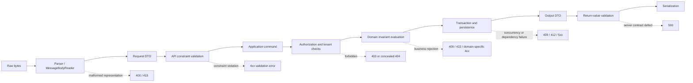
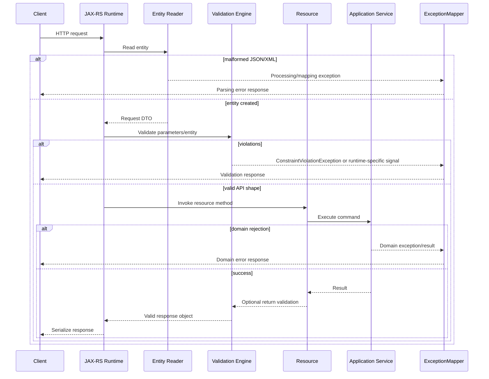
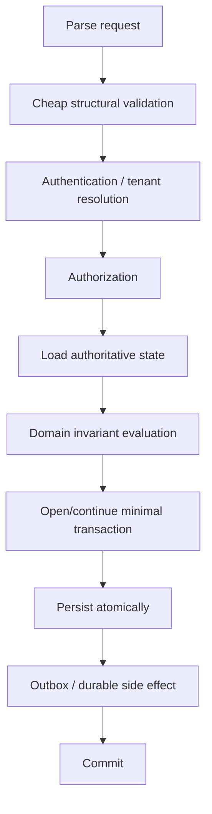

# Part 021 — Bean Validation and Application Error Modelling

> Validation tidak sama dengan business decision, dan exception tidak otomatis merupakan error contract. Sistem production membutuhkan boundary yang eksplisit: byte tidak valid, representation tidak dapat dibaca, field tidak memenuhi API constraint, domain invariant gagal, authorization ditolak, concurrent state berubah, dependency gagal, atau kode memiliki defect. Jika boundary ini dicampur, client menerima status yang salah, retry menjadi berbahaya, log penuh noise, dan incident sulit ditelusuri.

## Daftar Isi

1. [Target kompetensi](#target-kompetensi)
2. [Scope dan baseline](#scope-dan-baseline)
3. [Standard versus implementation-specific boundary](#standard-versus-implementation-specific-boundary)
4. [Mental model: validation as layered contracts](#mental-model-validation-as-layered-contracts)
5. [Terminology map](#terminology-map)
6. [Validation lifecycle dalam request JAX-RS](#validation-lifecycle-dalam-request-jax-rs)
7. [Representation parsing bukan Bean Validation](#representation-parsing-bukan-bean-validation)
8. [API constraints versus domain invariants](#api-constraints-versus-domain-invariants)
9. [Built-in constraints dan semantics](#built-in-constraints-dan-semantics)
10. [Null semantics dan primitive trap](#null-semantics-dan-primitive-trap)
11. [Cascaded validation dengan Valid](#cascaded-validation-dengan-valid)
12. [Container element constraints](#container-element-constraints)
13. [Optional, collection, dan nested containers](#optional-collection-dan-nested-containers)
14. [Validation groups](#validation-groups)
15. [Group sequence dan fail ordering](#group-sequence-dan-fail-ordering)
16. [Group conversion](#group-conversion)
17. [Custom property constraint](#custom-property-constraint)
18. [Class-level constraint](#class-level-constraint)
19. [Cross-parameter constraint](#cross-parameter-constraint)
20. [Method dan constructor validation](#method-dan-constructor-validation)
21. [Return-value validation](#return-value-validation)
22. [Programmatic Validator API](#programmatic-validator-api)
23. [ValidatorFactory lifecycle](#validatorfactory-lifecycle)
24. [ClockProvider dan temporal validation](#clockprovider-dan-temporal-validation)
25. [ValueExtractor untuk custom containers](#valueextractor-untuk-custom-containers)
26. [Message interpolation dan localization](#message-interpolation-dan-localization)
27. [Constraint metadata](#constraint-metadata)
28. [Hibernate Validator-specific capabilities](#hibernate-validator-specific-capabilities)
29. [Error taxonomy untuk enterprise API](#error-taxonomy-untuk-enterprise-api)
30. [HTTP status strategy](#http-status-strategy)
31. [Problem Details dan stable error envelope](#problem-details-dan-stable-error-envelope)
32. [Violation path dan client-facing field names](#violation-path-dan-client-facing-field-names)
33. [Domain error codes](#domain-error-codes)
34. [Exception hierarchy](#exception-hierarchy)
35. [ExceptionMapper architecture](#exceptionmapper-architecture)
36. [Mapper selection dan collision](#mapper-selection-dan-collision)
37. [Security, privacy, dan redaction](#security-privacy-dan-redaction)
38. [Logging dan observability](#logging-dan-observability)
39. [Multi-tenancy dan authorization boundary](#multi-tenancy-dan-authorization-boundary)
40. [Transaction dan side-effect ordering](#transaction-dan-side-effect-ordering)
41. [Performance dan denial-of-service considerations](#performance-dan-denial-of-service-considerations)
42. [Testing strategy](#testing-strategy)
43. [Architecture patterns](#architecture-patterns)
44. [Anti-patterns](#anti-patterns)
45. [Failure-model matrix](#failure-model-matrix)
46. [Debugging playbook](#debugging-playbook)
47. [PR review checklist](#pr-review-checklist)
48. [Trade-off yang harus dipahami senior engineer](#trade-off-yang-harus-dipahami-senior-engineer)
49. [Internal verification checklist](#internal-verification-checklist)
50. [Latihan verifikasi](#latihan-verifikasi)
51. [Ringkasan](#ringkasan)
52. [Referensi resmi](#referensi-resmi)

---

## Target kompetensi

Setelah menyelesaikan part ini, Anda harus mampu:

- membedakan transport/parsing error, parameter-conversion error, constraint violation, domain rejection, authorization denial, concurrency conflict, dependency failure, dan internal defect;
- memilih constraint Jakarta Validation berdasarkan semantics, bukan sekadar annotation yang tersedia;
- menggunakan `@Valid`, container element constraints, validation groups, group sequences, dan custom validators secara terkendali;
- menentukan apakah validation harus terjadi pada request DTO, application command, domain aggregate, persistence boundary, atau external integration boundary;
- mendesain custom constraint yang stateless, thread-safe, deterministic, dan tidak melakukan remote I/O tersembunyi;
- memahami executable validation untuk parameter serta return value;
- mengelola `ValidatorFactory` dan `Validator` sebagai application infrastructure;
- membedakan portable Jakarta Validation behavior dari Hibernate Validator extensions;
- mendesain error contract yang stable, machine-readable, traceable, dan tidak membocorkan implementation detail;
- menentukan HTTP status berdasarkan client responsibility dan state transition semantics;
- membangun `ExceptionMapper` hierarchy tanpa generic mapper yang menelan error penting;
- menjaga validation terjadi sebelum side effect atau transaction yang tidak perlu;
- membuat metrics dan logs yang berguna tanpa high-cardinality explosion atau PII leakage;
- menguji validation metadata, error serialization, localization, mapper resolution, dan negative paths;
- mereview pull request yang mengubah constraint, error code, atau exception mapping sebagai contract change.

---

## Scope dan baseline

Baseline materi:

- Java 17+;
- Jakarta Validation 3.1 sebagai baseline stable specification;
- Hibernate Validator sebagai implementation yang mungkin digunakan, tetapi harus diverifikasi internal;
- Jakarta REST 4.x resource, provider, filter, dan `ExceptionMapper` pipeline;
- JSON/XML request entities dan parameter binding;
- enterprise quote, order, catalog, pricing, customer, dan integration APIs;
- multi-tenant services;
- structured logs, metrics, traces, dan audit requirements;
- synchronous request/response serta asynchronous processing boundaries.

Tidak diasumsikan bahwa codebase internal menggunakan:

- Hibernate Validator tertentu;
- automatic method validation;
- Jersey validation integration module;
- RFC 9457 Problem Details;
- validation groups tertentu;
- centralized error library;
- localized error messages;
- `422 Unprocessable Content` untuk constraint violations.

Semua hal tersebut harus dibuktikan melalui dependency graph, bootstrap, runtime test, shared libraries, API contracts, dan observability.

---

## Standard versus implementation-specific boundary

| Area | Portable standard | Implementation/library-specific | Harus diverifikasi |
|---|---|---|---|
| Constraint annotations | `jakarta.validation.constraints.*` | Hibernate-specific constraints | Constraint inventory internal |
| Validation API | `Validator`, `ValidatorFactory`, `ConstraintViolation` | Hibernate bootstrap/configuration | Factory lifecycle |
| Cascading | `@Valid` | Optimization strategy | Runtime behavior |
| Container elements | Standard Jakarta Validation | Custom extractor implementation | Custom wrappers |
| Groups | Standard | Convention dan workflow usage | Group definitions |
| Method validation | Standard metadata/API | CDI/interceptor/runtime wiring | Apakah otomatis aktif |
| JAX-RS integration | Jakarta REST + Validation integration contract | Jersey/GlassFish behavior dan modules | Status/error payload aktual |
| Fail-fast | Tidak portable | Hibernate Validator setting | Apakah digunakan |
| Custom message bundles | Standard mechanism | Bundle loading/container behavior | Locale strategy |
| Error representation | Tidak ditentukan Validation | Problem Details/custom envelope | API standard internal |
| Exception mapping | Jakarta REST `ExceptionMapper` | Mapper ordering/registration details | Shared mapper library |

Aturan praktis:

> Constraint declaration dapat portable, tetapi kapan constraint dijalankan, dependency injection pada validator, status HTTP default, payload error, fail-fast, dan observability biasanya bergantung pada runtime serta integration library.

---

## Mental model: validation as layered contracts

Validation sebaiknya dipandang sebagai beberapa kontrak berlapis, bukan satu fungsi `validate()` besar.



### Invariant utama

1. Bytes harus dapat diparse sebelum object dapat divalidasi.
2. Constraint validation tidak membuktikan bahwa operation secara bisnis diizinkan.
3. Authorization harus menggunakan trusted identity dan tenant context.
4. Domain invariant harus dievaluasi terhadap authoritative state.
5. Side effect tidak boleh terjadi sebelum validation yang relevan selesai.
6. Return-value violation biasanya merupakan server defect, bukan kesalahan client.
7. Error contract harus stabil meskipun exception internal berubah.

---

## Terminology map

| Istilah | Makna |
|---|---|
| Constraint | Aturan yang dideklarasikan pada type, property, parameter, return value, atau container element |
| Constraint validator | Implementasi yang mengevaluasi satu constraint terhadap value tertentu |
| Constraint violation | Hasil kegagalan yang membawa message, path, invalid value, dan metadata |
| Cascaded validation | Validasi object graph melalui `@Valid` |
| Validation group | Marker interface untuk memilih subset constraints |
| Group sequence | Urutan evaluasi groups dengan short-circuit antar-group |
| Executable validation | Validasi parameter dan return value method/constructor |
| Domain invariant | Aturan bisnis yang harus selalu benar pada aggregate/state transition |
| Error code | Identifier stable untuk machine/client behavior |
| Error message | Teks human-readable; bukan identifier kontrak |
| Problem Details | Format standar untuk detail problem HTTP |
| Exception mapping | Translasi exception internal menjadi HTTP response contract |
| Fail-fast | Berhenti setelah violation pertama; biasanya implementation-specific |

---

## Validation lifecycle dalam request JAX-RS

Lifecycle aktual perlu diverifikasi karena integrasi dapat dilakukan oleh runtime, interceptor CDI, Jersey feature, atau application code.



### Pertanyaan debugging utama

- Apakah request gagal saat parsing, binding, validation, authorization, atau domain execution?
- Apakah validator benar-benar dijalankan oleh runtime?
- Group apa yang aktif?
- Apakah `@Valid` hilang pada nested object?
- Apakah violation terjadi pada request parameter atau return value?
- Mapper mana yang menangani exception?
- Apakah generic mapper menelan exception yang lebih spesifik?

---

## Representation parsing bukan Bean Validation

Contoh payload:

```json
{
  "quantity": "ten"
}
```

Jika DTO mendefinisikan `BigDecimal quantity`, parser gagal membentuk object. `@Positive` belum pernah dievaluasi.

Bedakan:

| Failure | Layer | Contoh |
|---|---|---|
| Malformed syntax | Parser | JSON tidak ditutup |
| Type mismatch | Data binding | String diberikan untuk object kompleks |
| Unsupported representation | HTTP/provider | `Content-Type` tidak didukung |
| Constraint violation | Validation | Quantity berhasil diparse tetapi `-1` |
| Domain rejection | Domain | Quantity valid tetapi melebihi product limit |

Jangan memetakan seluruhnya menjadi `VALIDATION_ERROR` tanpa detail kategori. Client dan operator membutuhkan tindakan yang berbeda.

---

## API constraints versus domain invariants

### API constraint

Dapat dievaluasi dari request object tanpa authoritative domain state:

- field wajib;
- panjang maksimum;
- format identifier;
- quantity positif;
- collection tidak kosong;
- nested object valid;
- date format dan basic chronology.

### Domain invariant

Membutuhkan state, policy, catalog revision, permission, atau calculation:

- product masih orderable untuk tenant dan effective date;
- quote masih editable;
- requested transition valid dari current state;
- discount berada dalam authority user;
- currency sesuai price list;
- order item compatible dengan existing services;
- duplicate external reference belum dipakai;
- catalog revision masih berlaku.

### Rule of thumb

```text
Pure shape/local value rule       -> Jakarta Validation candidate
Stateful business decision        -> Domain/application policy
Security decision                 -> Authorization policy
Uniqueness under concurrency      -> Database constraint + domain handling
External eligibility              -> Explicit integration/policy boundary
```

Validator yang melakukan database query atau HTTP call menciptakan hidden I/O, unpredictable latency, transaction ambiguity, dan difficult testing. Hindari kecuali architecture secara eksplisit mendefinisikannya dan failure semantics jelas.

---

## Built-in constraints dan semantics

Contoh request DTO:

```java
import jakarta.validation.Valid;
import jakarta.validation.constraints.DecimalMin;
import jakarta.validation.constraints.NotBlank;
import jakarta.validation.constraints.NotEmpty;
import jakarta.validation.constraints.NotNull;
import jakarta.validation.constraints.Pattern;
import jakarta.validation.constraints.Size;

import java.math.BigDecimal;
import java.util.List;

public record CreateQuoteRequest(
        @NotBlank
        @Size(max = 80)
        String customerReference,

        @NotNull
        @Pattern(regexp = "[A-Z]{3}")
        String currency,

        @NotEmpty
        @Size(max = 500)
        List<@Valid QuoteItemRequest> items
) {}

public record QuoteItemRequest(
        @NotBlank
        @Size(max = 64)
        String productOfferingId,

        @NotNull
        @DecimalMin(value = "0.000001", inclusive = true)
        BigDecimal quantity
) {}
```

### Semantics penting

- `@NotNull`: value tidak boleh `null`; tidak menolak blank string.
- `@NotEmpty`: tidak `null` dan size/length lebih dari nol.
- `@NotBlank`: string tidak `null` dan memiliki non-whitespace character.
- `@Size`: ukuran; banyak constraints menganggap `null` valid sehingga kombinasikan dengan `@NotNull` bila wajib.
- `@Pattern`: lexical format, bukan semantic validity.
- `@Positive`, `@PositiveOrZero`, `@DecimalMin`: numeric boundaries.
- `@Past`, `@Future`, dan varian `OrPresent`: bergantung pada validation clock.
- `@Email`: useful syntax check, bukan bukti mailbox exists.

Jangan mengandalkan message default sebagai contract karena dapat berubah antar-locale dan implementation.

---

## Null semantics dan primitive trap

```java
public record UpdateQuantityRequest(
        int quantity
) {}
```

Jika field tidak dikirim, banyak binding configuration akan menghasilkan `0`, sehingga sistem tidak dapat membedakan:

- field absent;
- field explicitly zero;
- binding default.

Gunakan wrapper ketika absence memiliki arti:

```java
public record UpdateQuantityRequest(
        @NotNull
        @Positive
        Integer quantity
) {}
```

Untuk PATCH, bahkan wrapper belum cukup jika perlu membedakan:

1. absent — tidak mengubah;
2. present dengan null — clear;
3. present dengan value — replace.

Gunakan explicit patch field abstraction atau JSON Patch/Merge Patch semantics yang terdokumentasi. Jangan berharap Bean Validation menyelesaikan tri-state semantics.

---

## Cascaded validation dengan Valid

Tanpa `@Valid`, nested object constraints tidak otomatis dievaluasi.

```java
public record CustomerRequest(
        @NotBlank String customerId,
        @NotNull @Valid BillingProfileRequest billingProfile
) {}

public record BillingProfileRequest(
        @NotBlank String accountNumber,
        @NotBlank String billingCycle
) {}
```

### Risks

- `@Valid` hilang setelah refactor DTO;
- graph terlalu besar menyebabkan cost tinggi;
- cyclic graph membutuhkan handling implementation;
- entity graph yang lazy dapat terakses tanpa sengaja;
- return object validation membuka data path yang tidak diperkirakan.

Prefer boundary DTO yang kecil daripada memvalidasi persistence entity graph besar.

---

## Container element constraints

Jakarta Validation mendukung constraint pada type argument:

```java
public record NotificationRequest(
        @NotEmpty
        List<@NotBlank @Size(max = 320) String> recipients,

        Map<@NotBlank String, @NotBlank String> attributes
) {}
```

Nested containers juga dapat divalidasi:

```java
Map<@NotBlank String, List<@Valid QuoteItemRequest>> itemsByGroup;
```

Validation engine menggunakan `ValueExtractor` untuk memperoleh element dari container. Custom container memerlukan extractor jika runtime tidak mengenalnya.

### PR review questions

- Apakah constraint berada pada collection atau element?
- Apakah `@NotEmpty List<String>` cukup, atau setiap string juga perlu `@NotBlank`?
- Apakah map key dan value memiliki constraint berbeda?
- Apakah maximum collection size ditetapkan sebelum expensive nested validation?

---

## Optional, collection, dan nested containers

`Optional` pada request DTO sering membuat semantics kabur. Pertimbangkan:

```java
Optional<@NotBlank String> promotionCode;
```

Ini memvalidasi value jika ada, tetapi tidak menjelaskan apakah absence legal dalam create/update/patch operation.

Guideline:

- gunakan explicit DTO per operation bila semantics berbeda;
- jangan gunakan `Optional` sebagai pengganti schema design;
- batasi collection size;
- validasi element dan aggregate collection constraints secara terpisah;
- hindari nested containers tanpa business reason yang jelas.

---

## Validation groups

Groups memilih subset constraints:

```java
public interface Create {}
public interface Amend {}

public record QuoteRequest(
        @NotNull(groups = Amend.class)
        String quoteId,

        @NotBlank(groups = {Create.class, Amend.class})
        String customerId
) {}
```

### Kapan groups berguna

- create dan update memiliki constraint berbeda pada type yang sama;
- staged validation yang sangat terbatas;
- integration contract yang memang menggunakan object shared.

### Kapan groups menjadi smell

- satu DTO dipakai untuk terlalu banyak use case;
- groups merepresentasikan state machine bisnis;
- puluhan marker interfaces sulit ditelusuri;
- resource method tidak jelas group mana yang aktif;
- domain rules disamarkan sebagai annotations.

Sering kali DTO terpisah lebih jelas daripada group matrix kompleks.

---

## Group sequence dan fail ordering

Group sequence mendefinisikan urutan. Jika group awal gagal, group berikutnya tidak dijalankan.

```java
import jakarta.validation.GroupSequence;
import jakarta.validation.groups.Default;

interface ExpensiveChecks {}

@GroupSequence({Default.class, ExpensiveChecks.class})
interface OrderedChecks {}
```

Use case:

- jalankan cheap structural checks sebelum expensive custom checks;
- hindari duplicate/noisy violations;
- enforce dependency antar-validation phases yang benar-benar local.

Jangan menggunakan group sequence sebagai workflow engine.

---

## Group conversion

`@ConvertGroup` mengganti group saat cascading ke nested object.

Use case legitimate:

- parent operation menggunakan group `CreateQuote`;
- nested reusable address object membutuhkan group `AddressInput`.

Risks:

- behavior tidak terlihat dari nested type;
- refactor annotation dapat mengubah contract secara diam-diam;
- debugging membutuhkan metadata inspection.

Dokumentasikan conversion dekat boundary API dan uji secara eksplisit.

---

## Custom property constraint

Annotation:

```java
import jakarta.validation.Constraint;
import jakarta.validation.Payload;

import java.lang.annotation.Documented;
import java.lang.annotation.Retention;
import java.lang.annotation.Target;

import static java.lang.annotation.ElementType.ANNOTATION_TYPE;
import static java.lang.annotation.ElementType.FIELD;
import static java.lang.annotation.ElementType.METHOD;
import static java.lang.annotation.ElementType.PARAMETER;
import static java.lang.annotation.RetentionPolicy.RUNTIME;

@Target({FIELD, METHOD, PARAMETER, ANNOTATION_TYPE})
@Retention(RUNTIME)
@Constraint(validatedBy = CurrencyCodeValidator.class)
@Documented
public @interface ValidCurrencyCode {
    String message() default "{quote.currency.invalid}";
    Class<?>[] groups() default {};
    Class<? extends Payload>[] payload() default {};
}
```

Validator:

```java
import jakarta.validation.ConstraintValidator;
import jakarta.validation.ConstraintValidatorContext;

import java.util.Currency;

public final class CurrencyCodeValidator
        implements ConstraintValidator<ValidCurrencyCode, String> {

    @Override
    public boolean isValid(String value, ConstraintValidatorContext context) {
        if (value == null) {
            return true; // use @NotNull separately if mandatory
        }
        try {
            Currency.getInstance(value);
            return true;
        } catch (IllegalArgumentException ex) {
            return false;
        }
    }
}
```

### Constraint validator design rules

- deterministic;
- thread-safe atau tidak menyimpan mutable request state;
- no remote calls;
- no hidden transaction;
- bounded computation;
- clear null policy;
- no logging per invalid field at error level;
- messages tidak berisi secrets atau PII.

Dependency injection ke `ConstraintValidator` bergantung integration/container. Verifikasi, jangan diasumsikan.

---

## Class-level constraint

Digunakan untuk hubungan antar-field:

```java
@ValidDateRange
public record ValidityWindowRequest(
        Instant validFrom,
        Instant validTo
) {}
```

Validator dapat memastikan `validFrom < validTo`.

Agar error mudah digunakan client, custom validator dapat menambahkan violation ke property tertentu melalui `ConstraintValidatorContext`, bukan hanya object-level path kosong.

### Jangan gunakan class-level constraint untuk

- query database;
- memeriksa current quote state;
- memanggil pricing engine;
- authorization;
- transition state machine.

Itu adalah application/domain responsibility.

---

## Cross-parameter constraint

Executable constraint dapat memvalidasi hubungan beberapa parameter method. Namun pada JAX-RS endpoint, request DTO biasanya lebih mudah dipahami dan didokumentasikan dibanding banyak scalar parameters.

Cross-parameter constraint layak ketika:

- method merupakan stable service contract;
- parameter tidak dapat dibungkus tanpa mengurangi clarity;
- rule murni dan local;
- runtime method validation telah diverifikasi.

Jika tidak, gunakan command object dengan class-level constraint.

---

## Method dan constructor validation

Jakarta Validation mendefinisikan executable validation untuk:

- constructor parameters;
- constructor return value;
- method parameters;
- method return value.

Contoh:

```java
public interface QuoteApplicationService {

    QuoteResult createQuote(
            @NotNull @Valid CreateQuoteCommand command
    );
}
```

Annotation saja tidak menjamin interception otomatis pada plain Java object. Activation bergantung pada:

- CDI method validation integration;
- Jakarta EE container;
- Jersey integration;
- framework interceptor;
- manual `ExecutableValidator` call.

### Self-invocation risk

Jika method validation memakai proxy/interceptor, pemanggilan method dari object ke dirinya sendiri dapat melewati proxy. Verifikasi runtime semantics.

---

## Return-value validation

```java
@GET
@Path("/{quoteId}")
@Valid
@NotNull
public QuoteResponse getQuote(@PathParam("quoteId") String quoteId) {
    return service.getQuote(quoteId);
}
```

Return-value violation umumnya berarti:

- mapper menghasilkan invalid DTO;
- domain/service melanggar postcondition;
- stored data tidak memenuhi contract baru;
- serializer contract berubah;
- partial data tidak ditangani.

Jangan mengembalikannya sebagai client validation error. Treat sebagai server-side contract failure, log dengan trace context, metric khusus, dan response 5xx yang tidak membocorkan invalid value.

---

## Programmatic Validator API

```java
import jakarta.validation.ConstraintViolation;
import jakarta.validation.Validator;

import java.util.Set;

public final class CommandValidator {
    private final Validator validator;

    public CommandValidator(Validator validator) {
        this.validator = validator;
    }

    public <T> void validateOrThrow(T command, Class<?>... groups) {
        Set<ConstraintViolation<T>> violations = validator.validate(command, groups);
        if (!violations.isEmpty()) {
            throw new ConstraintViolationException(violations);
        }
    }
}
```

Programmatic validation berguna untuk:

- message consumers;
- batch jobs;
- Kafka handlers;
- workflow workers;
- service methods di luar HTTP runtime;
- explicitly selected groups.

Jangan hanya memvalidasi HTTP path lalu menganggap semua ingress lain aman.

---

## ValidatorFactory lifecycle

`ValidatorFactory` adalah bootstrap-level resource dan harus ditutup ketika dibuat application-side.

```java
import jakarta.validation.Validation;
import jakarta.validation.Validator;
import jakarta.validation.ValidatorFactory;

public final class ValidationRuntime implements AutoCloseable {
    private final ValidatorFactory factory;
    private final Validator validator;

    public ValidationRuntime() {
        this.factory = Validation.buildDefaultValidatorFactory();
        this.validator = factory.getValidator();
    }

    public Validator validator() {
        return validator;
    }

    @Override
    public void close() {
        factory.close();
    }
}
```

Di managed container, prefer injection/container-managed factory. Jangan membangun factory per request.

### Failure modes

- provider implementation tidak ada;
- incompatible API/implementation versions;
- message bundle invalid;
- duplicate value extractor;
- invalid constraint declaration;
- classloader leak saat redeploy;
- factory dibuat berkali-kali.

---

## ClockProvider dan temporal validation

Constraints seperti `@Future` dan `@Past` menggunakan validation clock. Untuk deterministic tests atau business-time semantics, configure `ClockProvider` bila runtime memungkinkan.

Namun bedakan:

- technical current time untuk input sanity;
- business effective time untuk quote/catalog/pricing evaluation;
- replay time;
- database commit time.

Business effective-date rules sering lebih tepat di domain policy menggunakan explicit `Clock`/evaluation instant, bukan annotation `@Future` saja.

---

## ValueExtractor untuk custom containers

Jika domain memiliki wrapper:

```java
public final class PresentValue<T> {
    private final boolean present;
    private final T value;
    // ...
}
```

Container element validation membutuhkan `ValueExtractor` agar engine mengetahui value yang harus divalidasi.

Risks:

- extractor ambiguity;
- accidental implicit unwrapping;
- path names yang tidak stabil;
- generic type resolution surprises;
- high validation cost pada nested custom containers.

Gunakan hanya ketika wrapper memang reusable dan semantics-nya jelas.

---

## Message interpolation dan localization

Constraint message bukan error code.

Bad:

```text
Client bergantung pada teks "must not be blank"
```

Better:

```json
{
  "code": "QUOTE_REQUEST_INVALID",
  "violations": [
    {
      "field": "customerReference",
      "constraint": "NotBlank",
      "message": "Customer reference is required"
    }
  ]
}
```

### Localization decisions

- locale dari `Accept-Language`, tenant config, atau user profile?
- apakah API machine-to-machine perlu localized text?
- apakah logs menyimpan localized atau canonical message?
- bagaimana message bundle versioned?
- apakah invalid values boleh dimasukkan ke message?

Prefer canonical error code dan optional localized human message.

---

## Constraint metadata

Jakarta Validation menyediakan metadata API untuk membaca constraints. Use cases:

- tooling internal;
- schema generation support;
- test assertions;
- documentation;
- UI hints.

Jangan menganggap validation annotations sepenuhnya merepresentasikan API schema. Contoh:

- conditional business requirements tidak selalu annotations;
- serialization naming dapat berbeda dari Java property path;
- OpenAPI required/nullable semantics dapat berbeda;
- authorization memengaruhi allowed values;
- groups membuat metadata context-dependent.

OpenAPI dan Validation harus memiliki compatibility tests, bukan diasumsikan selalu sinkron.

---

## Hibernate Validator-specific capabilities

Hibernate Validator adalah common implementation, tetapi capabilities berikut bukan portable assumption:

- fail-fast mode;
- implementation-specific constraints;
- programmatic constraint mapping extensions;
- advanced message interpolation behavior;
- CDI integration details;
- specific logging categories;
- specific performance characteristics;
- specific property names.

Saat memakai extension:

1. tandai dependency pada design/code;
2. pin compatible version;
3. tambahkan integration test;
4. dokumentasikan fallback atau migration cost;
5. jangan mengekspos implementation class dalam public API.

---

## Error taxonomy untuk enterprise API

Gunakan taxonomy yang menjelaskan ownership dan retry behavior.

| Category | Contoh | Client dapat memperbaiki? | Retry sama persis? |
|---|---|---:|---:|
| Malformed representation | JSON invalid | Ya | Tidak berguna sebelum diperbaiki |
| Unsupported media | XML tidak didukung | Ya | Tidak |
| Parameter conversion | UUID invalid | Ya | Tidak |
| Constraint violation | Quantity negatif | Ya | Tidak |
| Authentication | Token missing/expired | Ya, re-authenticate | Mungkin setelah token baru |
| Authorization | Tidak punya permission | Tidak dengan payload sama | Tidak |
| Not found | Quote tidak ada/tersembunyi | Mungkin | Biasanya tidak |
| Domain rejection | Quote sudah submitted | Workflow-dependent | Tidak tanpa state change |
| Concurrency conflict | Version mismatch | Ya, refetch/re-evaluate | Setelah refresh |
| Rate limit | Capacity exceeded | Ya setelah delay | Ya dengan backoff |
| Dependency unavailable | Pricing timeout | Tidak langsung | Mungkin, server-controlled |
| Internal defect | Null pointer | Tidak | Jangan mendorong blind retry |

Taxonomy ini harus konsisten pada HTTP, Kafka consumers, workflow workers, dan batch jobs walaupun transport representation berbeda.

---

## HTTP status strategy

Status harus mengikuti semantics, bukan exception class name.

| Status | Typical use |
|---|---|
| `400 Bad Request` | Malformed request, binding error, basic request constraints menurut API policy |
| `401 Unauthorized` | Authentication required/invalid |
| `403 Forbidden` | Authenticated tetapi operation tidak diizinkan |
| `404 Not Found` | Resource tidak ada atau sengaja disembunyikan |
| `409 Conflict` | Current resource state/concurrency/business conflict |
| `412 Precondition Failed` | `If-Match`/ETag precondition gagal |
| `415 Unsupported Media Type` | Request media type tidak didukung |
| `422 Unprocessable Content` | Representation dipahami tetapi semantic request invalid, jika policy memilihnya |
| `429 Too Many Requests` | Rate limit dengan retry guidance |
| `500 Internal Server Error` | Unexpected defect atau violated server postcondition |
| `502/503/504` | Upstream/gateway availability dan timeout semantics sesuai ownership |

### 400 versus 422

Keduanya dapat dipilih untuk validation tergantung governance. Yang penting:

- konsisten lintas APIs;
- documented;
- generated clients memahami;
- gateway tidak mengubah;
- metrics tidak memecah kategori secara ambigu;
- backward compatibility dijaga.

---

## Problem Details dan stable error envelope

Contoh envelope berbasis Problem Details:

```java
public record ApiProblem(
        String type,
        String title,
        int status,
        String detail,
        String instance,
        String code,
        String traceId,
        List<FieldViolation> violations
) {}

public record FieldViolation(
        String field,
        String code,
        String message
) {}
```

Contoh JSON:

```json
{
  "type": "https://errors.example.com/quote/request-invalid",
  "title": "Quote request is invalid",
  "status": 400,
  "detail": "One or more request fields are invalid.",
  "instance": "/quotes/requests/01J...",
  "code": "QUOTE_REQUEST_INVALID",
  "traceId": "7c2ecf5b9c4a9a27",
  "violations": [
    {
      "field": "items[0].quantity",
      "code": "MUST_BE_POSITIVE",
      "message": "Quantity must be greater than zero."
    }
  ]
}
```

### Contract principles

- `code` stable dan documented;
- `title` high-level;
- `detail` safe untuk client;
- `traceId` untuk support correlation, bukan secret;
- field paths menggunakan wire contract naming;
- invalid value biasanya tidak dikembalikan;
- stack trace tidak pernah dikembalikan;
- internal class names tidak bocor;
- extension fields versioned secara backward-compatible.

---

## Violation path dan client-facing field names

`ConstraintViolation.getPropertyPath()` menggambarkan Java/executable path. Path itu belum tentu sama dengan JSON field name karena:

- Jackson/JSON-B rename annotation;
- nested DTO flattening;
- method parameter name tidak tersedia;
- collection index/map key;
- class-level constraint;
- group conversion;
- custom mapper.

Buat path translation layer yang deterministic. Hindari mengirim path seperti:

```text
createQuote.arg0.items.<list element>.quantity
```

Client mungkin membutuhkan:

```text
items[0].quantity
```

Test path mapping sebagai contract.

---

## Domain error codes

Error codes harus merepresentasikan condition yang dapat ditangani client/operator:

```text
QUOTE_NOT_EDITABLE
QUOTE_VERSION_CONFLICT
PRODUCT_NOT_ORDERABLE
CATALOG_REVISION_EXPIRED
CURRENCY_NOT_SUPPORTED
DISCOUNT_AUTHORITY_EXCEEDED
TENANT_CONFIGURATION_UNAVAILABLE
```

Jangan membuat error code dari exception class:

```text
ILLEGAL_STATE_EXCEPTION
PSQL_EXCEPTION
NULL_POINTER_EXCEPTION
```

Domain code harus:

- stable;
- owned oleh bounded context;
- documented;
- memiliki HTTP mapping;
- memiliki retry classification;
- memiliki support/operational meaning;
- tidak terlalu granular hingga setiap branch memiliki code unik.

---

## Exception hierarchy

Contoh internal hierarchy:

```java
public sealed abstract class ApplicationException extends RuntimeException
        permits RequestRejectedException,
                DomainConflictException,
                DependencyException {

    private final String errorCode;

    protected ApplicationException(String errorCode, String message, Throwable cause) {
        super(message, cause);
        this.errorCode = errorCode;
    }

    public String errorCode() {
        return errorCode;
    }
}
```

Tetapi exception bukan satu-satunya pilihan. Expected domain outcomes dapat memakai result types jika exception-driven control flow membuat code sulit dibaca.

### Classification

- expected client/domain rejection;
- transient dependency failure;
- permanent dependency rejection;
- concurrency conflict;
- unexpected defect.

Classification harus terjadi dekat source yang memahami semantics, bukan hanya di generic top-level mapper.

---

## ExceptionMapper architecture

Specific mapper:

```java
import jakarta.ws.rs.core.Response;
import jakarta.ws.rs.ext.ExceptionMapper;
import jakarta.ws.rs.ext.Provider;

@Provider
public final class ConstraintViolationMapper
        implements ExceptionMapper<ConstraintViolationException> {

    private final ProblemFactory problems;

    public ConstraintViolationMapper(ProblemFactory problems) {
        this.problems = problems;
    }

    @Override
    public Response toResponse(ConstraintViolationException exception) {
        ApiProblem problem = problems.fromViolations(exception.getConstraintViolations());
        return Response.status(problem.status())
                .type("application/problem+json")
                .entity(problem)
                .build();
    }
}
```

Top-level safety net:

```java
@Provider
public final class UnexpectedExceptionMapper
        implements ExceptionMapper<Throwable> {

    @Override
    public Response toResponse(Throwable exception) {
        // log once with trace context; do not expose exception details
        return Response.serverError()
                .type("application/problem+json")
                .entity(/* generic safe problem */)
                .build();
    }
}
```

### Design rules

- specific mappers untuk known categories;
- generic mapper hanya safety net;
- preserve `WebApplicationException` semantics bila policy mengizinkan;
- log once at ownership boundary;
- do not catch `Throwable` di domain code;
- jangan mengubah cancellation/interrupt menjadi generic 500 tanpa context;
- response builder harus safe dan tidak melempar exception kedua.

---

## Mapper selection dan collision

Failure modes:

- dua mapper untuk exception type sama;
- shared library dan application mendaftarkan mapper competing;
- generic `ExceptionMapper<Exception>` menangani exception yang seharusnya spesifik;
- mapper tidak ter-register karena package scanning;
- CDI/HK2 injection gagal sehingga mapper tidak dibuat;
- mapper melempar saat serializing problem;
- runtime default mapper berbeda antar-environment.

### Verification test

Buat integration test yang memicu setiap category dan assert:

- status;
- content type;
- error code;
- safe detail;
- trace ID;
- headers;
- no stack trace/class names;
- metrics/log classification.

---

## Security, privacy, dan redaction

Constraint violation dapat membawa invalid value. Jangan serialize atau log secara otomatis karena value dapat berupa:

- password;
- token;
- national identifier;
- customer data;
- address;
- commercial quote data;
- large payload;
- malicious control characters.

### Rules

- whitelist safe fields untuk echo;
- default redact invalid values;
- cap message length;
- sanitize log fields;
- classify tenant/customer identifiers;
- do not include raw request body dalam error log;
- audit authorization failures terpisah dari ordinary validation failures;
- avoid revealing whether hidden resource exists.

---

## Logging dan observability

Validation failure biasanya client-caused dan tidak selalu perlu error-level log.

Suggested telemetry:

| Signal | Recommendation |
|---|---|
| Request validation count | Counter by endpoint, error category, stable code |
| Field-level metrics | Hindari raw field/value; bounded field-name set only |
| Domain rejection count | Counter by domain code |
| Return-value violation | Error metric/page candidate |
| Unexpected mapper fallback | Error metric dan alert threshold |
| Validation latency | Histogram jika custom validation substantial |
| Payload size | Histogram/buckets, bukan raw labels |
| Trace event | Record category/code, not PII |

High-cardinality risks:

- invalid value sebagai label;
- customer ID/quote ID sebagai metric label;
- full property path dengan dynamic map keys;
- localized message sebagai label;
- exception message sebagai label.

---

## Multi-tenancy dan authorization boundary

Validation tidak boleh menentukan tenant berdasarkan untrusted request field jika identity token sudah menetapkan tenant context.

Bad:

```text
Request body tenantId valid secara format -> langsung query data tenant tersebut
```

Better:

1. resolve trusted tenant dari identity/context;
2. bila body membawa tenant ID, compare dengan trusted tenant atau abaikan sesuai contract;
3. authorization menentukan akses;
4. repository selalu menerima trusted tenant context;
5. error response tidak membocorkan cross-tenant existence.

`@NotBlank tenantId` bukan tenant isolation control.

---

## Transaction dan side-effect ordering

Ideal order:



Avoid:

- membuka transaction sebelum parsing/cheap validation;
- mengirim event sebelum commit;
- custom validator menulis database;
- remote call dalam validator sambil memegang lock;
- check-then-insert uniqueness tanpa database constraint;
- response validation setelah irreversible external side effect tanpa recovery plan.

---

## Performance dan denial-of-service considerations

Validation dapat menjadi attack surface.

Risks:

- collection berisi jutaan elements;
- deeply nested object graph;
- catastrophic regex backtracking;
- custom validator O(n²);
- database/network I/O per element;
- huge violation set;
- message interpolation cost;
- repeated factory bootstrap;
- unbounded error payload.

Controls:

- enforce transport/body size limit;
- cap collection sizes early;
- use safe regex;
- bound recursion/nesting at parser;
- cap returned violations;
- avoid invalid value echo;
- reuse validator infrastructure;
- measure validation latency;
- load-test negative paths, bukan hanya happy path.

---

## Testing strategy

### Unit tests

- built-in constraint semantics;
- custom validator null handling;
- class-level paths;
- group behavior;
- group sequence;
- custom message codes;
- temporal clock behavior.

### Metadata tests

```java
var descriptor = validator.getConstraintsForClass(CreateQuoteRequest.class);
assertTrue(descriptor.isBeanConstrained());
```

Useful untuk mencegah annotation hilang saat refactor.

### JAX-RS integration tests

- malformed JSON;
- type mismatch;
- missing body;
- missing required field;
- nested violation;
- collection element violation;
- query/path parameter violation;
- domain conflict;
- authorization denial;
- return-value violation;
- unexpected exception;
- mapper serialization failure fallback.

### Contract tests

Assert exact stable fields, bukan localized free text saja.

### Fuzz/property tests

- random Unicode;
- very long strings;
- deep nesting;
- large arrays;
- boundary numeric values;
- null/absent/empty combinations;
- malicious control characters.

---

## Architecture patterns

### Pattern 1 — Thin resource, explicit command boundary

```text
JAX-RS resource
  -> request DTO validation
  -> request-to-command mapping
  -> application authorization
  -> domain execution
  -> result-to-response mapping
```

### Pattern 2 — Central problem factory

Mappers tidak membangun payload secara ad hoc. `ProblemFactory` mengelola:

- status;
- stable codes;
- trace IDs;
- safe detail;
- field-path translation;
- headers;
- localization policy.

### Pattern 3 — Shared taxonomy, local ownership

Platform menyediakan envelope dan base categories; bounded context memiliki domain codes.

### Pattern 4 — Validation at every ingress

HTTP, Kafka, workflow worker, batch file, dan admin tool semua melakukan boundary validation sesuai transport.

### Pattern 5 — Database constraint as final integrity guard

Application validation meningkatkan UX, tetapi unique/check/foreign-key constraints melindungi concurrency dan bypass paths.

---

## Anti-patterns

1. **Semua error menjadi 400** — menyembunyikan auth, conflict, dependency, dan defect.
2. **Semua error menjadi 500** — client tidak tahu cara memperbaiki request.
3. **Validator melakukan HTTP/database call** — hidden I/O dan timeout.
4. **Message text sebagai error code** — localization merusak client.
5. **Persistence entity sebagai request DTO** — over-posting dan coupling schema.
6. **Generic mapper mengembalikan exception message** — information leakage.
7. **Constraint groups sebagai workflow engine** — state transition tidak terlihat.
8. **No upper bounds** — validation DoS.
9. **`@Valid` diasumsikan otomatis di semua ingress** — Kafka/job path bypass.
10. **Return-value violation dikembalikan sebagai 400** — menyalahkan client atas server defect.
11. **Log setiap validation failure dengan stack trace** — noise dan cost.
12. **Application uniqueness check tanpa database constraint** — race condition.
13. **Error payload membawa raw rejected value** — PII/secret leakage.
14. **Annotation change dianggap internal refactor** — padahal contract berubah.

---

## Failure-model matrix

| Failure mode | Symptom | Detection | Immediate response | Structural prevention |
|---|---|---|---|---|
| Validation provider missing | Startup/runtime exception | Startup logs, smoke test | Fix dependency/runtime | Compatibility matrix |
| `@Valid` missing | Nested invalid data accepted | Negative integration test | Add cascade | DTO metadata tests |
| Wrong group active | Constraint skipped/over-applied | Trace/debug metadata | Fix invocation | Explicit operation DTO/groups |
| Mapper not registered | HTML/default 500 | Integration test | Register explicitly | Component inventory |
| Generic mapper collision | Wrong status/payload | Mapper resolution test | Narrow mapper | Registration governance |
| Custom validator remote timeout | High latency | Trace span, thread dump | Bypass/fix dependency | No I/O validators |
| Huge violation list | Large response/memory | Payload metrics | Cap response | Input limits |
| Regex backtracking | CPU spike | Profiling | Replace regex | Safe-regex review |
| Return-value violation | 500 after business work | Error metric | Investigate mapper/data | Postcondition tests |
| Invalid value leak | PII in logs | Security scan | Purge/redact | Safe logging library |
| Group sequence surprise | Missing later errors | Unit tests | Clarify order | Document sequence |
| Factory per request | GC/latency | Allocation profiling | Reuse factory | Lifecycle ownership |
| Database race after validation | Duplicate/conflict | DB constraint error | Map conflict | DB integrity constraint |
| Error code drift | Client breakage | Contract tests | Restore compatibility | Code registry |
| Localized message metric label | Cardinality explosion | Metrics backend | Remove label | Bounded dimensions |

---

## Debugging playbook

### 1. Reproduce exact boundary

Capture safely:

- method/path;
- content type;
- relevant headers;
- sanitized payload shape;
- runtime version;
- trace ID;
- deployment version;
- tenant context classification.

### 2. Classify phase

```text
Did parsing fail?
  yes -> MessageBodyReader/serializer configuration
  no  -> Was constraint validation invoked?
          no -> integration/registration/group issue
          yes -> Were violations returned?
                  yes -> mapper/path/code issue
                  no  -> domain/authorization/persistence phase
```

### 3. Inspect violation metadata

For safe local reproduction:

```java
for (ConstraintViolation<?> violation : violations) {
    System.out.printf(
            "path=%s annotation=%s messageTemplate=%s%n",
            violation.getPropertyPath(),
            violation.getConstraintDescriptor()
                    .getAnnotation()
                    .annotationType()
                    .getSimpleName(),
            violation.getMessageTemplate()
    );
}
```

Jangan print invalid value pada production investigation tanpa approval.

### 4. Confirm active group

- default group?
- explicit group?
- group conversion?
- group sequence?
- runtime-specific automatic group selection?

### 5. Confirm provider/version compatibility

```bash
mvn dependency:tree \
  -Dincludes=jakarta.validation:jakarta.validation-api,org.hibernate.validator:hibernate-validator
```

Cari duplicate API, old `javax.validation`, atau incompatible implementation.

### 6. Confirm mapper registration

- explicit `ResourceConfig.register`;
- package scanning;
- CDI discovery;
- HK2 binding;
- shared library auto-discovery;
- test runtime versus production runtime.

### 7. Inspect logs/traces

Pastikan satu failure tidak dicatat berulang pada resource, service, mapper, dan container. Temukan first semantic owner.

### 8. Validate response serialization

Error mapper dapat benar tetapi error DTO gagal diserialize. Tambahkan minimal fallback response dan test.

### 9. Check recent contract changes

- constraint annotation added;
- DTO field renamed;
- group changed;
- error code changed;
- mapper priority/registration changed;
- serializer module changed;
- Java parameter-name compiler flag changed.

---

## PR review checklist

### Constraint design

- [ ] Constraint adalah local/pure rule, bukan remote business decision.
- [ ] Null semantics eksplisit.
- [ ] Primitive tidak menghilangkan absent semantics.
- [ ] Collection dan element constraints keduanya dipertimbangkan.
- [ ] Maximum length/size tersedia pada untrusted input.
- [ ] Regex aman dan bounded.
- [ ] Nested DTO memiliki `@Valid` bila diperlukan.
- [ ] Custom validator stateless/thread-safe.
- [ ] Custom validator tidak melakukan hidden I/O.
- [ ] Temporal validation menggunakan clock semantics yang benar.

### Groups dan executable validation

- [ ] Group benar-benar dibutuhkan dibanding DTO terpisah.
- [ ] Active group terlihat jelas di call site.
- [ ] Group sequence didokumentasikan.
- [ ] Group conversion diuji.
- [ ] Automatic method validation telah diverifikasi pada runtime.
- [ ] Self-invocation/proxy behavior dipahami.
- [ ] Return-value violations diperlakukan sebagai server defect.

### Error contract

- [ ] Stable error code tersedia.
- [ ] HTTP status sesuai semantics.
- [ ] Error payload backward-compatible.
- [ ] Field paths menggunakan wire naming.
- [ ] PII/secrets tidak dikembalikan.
- [ ] Trace ID tersedia bila policy mengizinkan.
- [ ] Localized message bukan machine contract.
- [ ] Retry classification masuk akal.
- [ ] Headers seperti `Retry-After` digunakan bila relevan.

### Mapper dan operations

- [ ] Specific mapper tidak ditelan generic mapper.
- [ ] Mapper ter-register secara deterministic.
- [ ] Mapper tidak melempar saat membangun response.
- [ ] Logging level sesuai category.
- [ ] Metrics dimensions bounded.
- [ ] No duplicate stack traces.
- [ ] Negative-path integration tests ada.
- [ ] API/OpenAPI contract diperbarui.

### Data integrity

- [ ] Domain invariant tidak dipindah secara keliru ke annotation.
- [ ] Database constraint melindungi race/bypass path.
- [ ] Side effect terjadi setelah relevant validation.
- [ ] Transaction boundary minimal.
- [ ] Event/outbox tidak diterbitkan untuk invalid operation.

---

## Trade-off yang harus dipahami senior engineer

### Annotation convenience versus explicit policy

Annotations ringkas dan discoverable, tetapi complex rules lebih jelas sebagai explicit policy objects.

### Reusable DTO versus operation-specific DTO

Reusable DTO mengurangi files tetapi memperbesar group matrix dan ambiguity. Operation-specific DTO memperjelas contract namun menambah mapping.

### All violations versus fail-fast

All violations memberi UX lebih baik tetapi meningkatkan computation dan response size. Fail-fast menurunkan cost tetapi client mungkin perlu beberapa round trips.

### 400 versus 422

Keduanya dapat valid berdasarkan governance; inconsistency lebih berbahaya daripada pilihan itu sendiri.

### Exception versus result type

Exception cocok untuk boundary unwinding; result type dapat membuat expected business outcomes eksplisit. Hindari exception hierarchy yang menjadi undocumented protocol.

### Centralized mapper versus bounded-context autonomy

Centralization menjaga envelope konsisten; autonomy diperlukan untuk domain codes. Gunakan shared framework dengan local registry/extension.

### Automatic validation versus explicit validation

Automatic validation mengurangi boilerplate tetapi membuat lifecycle dan groups kurang terlihat. Explicit validation lebih verbose tetapi lebih mudah ditelusuri pada non-HTTP ingress.

---

## Internal verification checklist

### Dependency dan runtime

- [ ] Jakarta Validation API version.
- [ ] Validation implementation dan version.
- [ ] Apakah Hibernate Validator digunakan.
- [ ] API/implementation compatibility matrix.
- [ ] Jersey validation module atau integration mechanism.
- [ ] CDI/HK2 injection ke validators.
- [ ] Automatic method/return validation behavior.
- [ ] Fail-fast configuration.
- [ ] ValidatorFactory lifecycle dan shutdown.

### Constraint conventions

- [ ] Shared constraint annotations.
- [ ] Custom validator inventory.
- [ ] Validation group inventory.
- [ ] Group sequence dan conversion usage.
- [ ] DTO versus entity validation policy.
- [ ] Collection/string/nesting limits.
- [ ] Regex review standard.
- [ ] Locale/message bundle strategy.

### Error architecture

- [ ] Standard error envelope.
- [ ] RFC Problem Details usage atau custom format.
- [ ] Stable error-code registry.
- [ ] HTTP status mapping policy.
- [ ] `400` versus `422` decision.
- [ ] Exception hierarchy.
- [ ] Registered `ExceptionMapper`s.
- [ ] Generic fallback behavior.
- [ ] Field-path translation.
- [ ] Trace/correlation ID exposure policy.

### Security dan compliance

- [ ] PII classification.
- [ ] Invalid-value redaction.
- [ ] Log sanitization.
- [ ] Tenant mismatch behavior.
- [ ] Hidden-resource policy (`403` versus `404`).
- [ ] Audit requirements untuk domain/security failures.
- [ ] Error retention policy.

### Testing dan operations

- [ ] Negative-path integration suite.
- [ ] Error contract tests.
- [ ] Return-value validation tests.
- [ ] Kafka/job/workflow validation strategy.
- [ ] Validation metrics.
- [ ] High-cardinality controls.
- [ ] Alert untuk unexpected/return violations.
- [ ] Runbook untuk validation provider/mapper failures.

---

## Latihan verifikasi

### Exercise 1 — Trace one invalid request

Pilih endpoint create/amend quote dan buktikan:

1. parser/provider yang digunakan;
2. DTO yang dibentuk;
3. active validation group;
4. nested validation path;
5. mapper yang menangani violation;
6. error code/status;
7. metric/log/trace yang dihasilkan.

### Exercise 2 — Build an error taxonomy map

Ambil minimal sepuluh failure scenarios dan klasifikasikan:

- category;
- owner;
- status;
- retryability;
- error code;
- log level;
- metric;
- audit requirement.

### Exercise 3 — Find hidden I/O validators

Cari semua `ConstraintValidator` dan periksa dependency terhadap:

- repository;
- HTTP client;
- Redis;
- Kafka;
- cloud SDK;
- clock/system environment.

Buat proposal pemindahan jika validator melakukan I/O tersembunyi.

### Exercise 4 — Test mapper collisions

Trigger specific domain exception dan unexpected exception di runtime yang sama dengan production. Pastikan mapper yang dipilih sesuai design.

### Exercise 5 — Contract change review

Tambahkan constraint baru ke field existing dan analisis:

- existing clients yang sebelumnya accepted;
- persisted historical data;
- generated clients;
- event consumers;
- compatibility window;
- rollout/feature flag needs.

---

## Ringkasan

- Parsing, validation, authorization, domain evaluation, persistence, dan serialization adalah boundary berbeda.
- Jakarta Validation cocok untuk local, declarative, deterministic constraints.
- `@Valid` diperlukan untuk cascaded object graph; container element constraints memvalidasi collection/map contents.
- Validation groups berguna tetapi mudah menjadi hidden workflow complexity.
- Method validation membutuhkan runtime/interceptor integration; annotation saja tidak cukup pada plain objects.
- Return-value violation adalah server-side postcondition failure.
- `ValidatorFactory` adalah application lifecycle resource, bukan object per request.
- Error messages bukan stable machine contract; gunakan error codes dan safe structured envelope.
- HTTP status harus mengikuti semantics dan ownership, bukan nama exception.
- `ExceptionMapper` harus specific, deterministic, safe, dan diuji melalui runtime integration.
- Constraint changes adalah contract changes.
- Database constraints tetap diperlukan untuk integrity di bawah concurrency.
- Observability harus bounded dan tidak membocorkan invalid values atau PII.
- Seluruh integration detail dengan Jersey, CDI, HK2, dan internal error framework wajib diverifikasi.

---

## Referensi resmi

- [Jakarta Validation](https://jakarta.ee/specifications/bean-validation/)
- [Jakarta Validation 3.1 Specification](https://jakarta.ee/specifications/bean-validation/3.1/jakarta-validation-spec-3.1.html)
- [Jakarta Validation 3.1 API](https://jakarta.ee/specifications/bean-validation/3.1/apidocs/)
- [Hibernate Validator Documentation](https://hibernate.org/validator/documentation/)
- [Hibernate Validator Reference Guide](https://docs.hibernate.org/stable/validator/reference/en-US/html_single/)
- [Jakarta RESTful Web Services 4.0 Specification](https://jakarta.ee/specifications/restful-ws/4.0/jakarta-restful-ws-spec-4.0.html)
- [Jakarta RESTful Web Services 4.0 API](https://jakarta.ee/specifications/restful-ws/4.0/apidocs/)
- [RFC 9457 — Problem Details for HTTP APIs](https://www.rfc-editor.org/rfc/rfc9457.html)
- [RFC 9110 — HTTP Semantics](https://www.rfc-editor.org/rfc/rfc9110.html)

