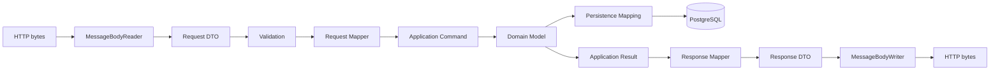
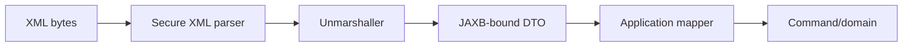

# Part 022 — JSON, XML, JAXB, JSON-B, Jackson, and MapStruct

> Representation model, domain model, dan persistence model memiliki alasan perubahan yang berbeda. Ketika satu class dipakai untuk semuanya, perubahan database dapat memecahkan API, annotation serializer mengotori domain, lazy relationship bocor ke network, dan mapper menyembunyikan data loss. Boundary yang sehat membuat kontrak wire eksplisit, domain tetap menjaga invariant, serta mapping menjadi code yang dapat direview dan diuji.

## Daftar Isi

1. [Target kompetensi](#target-kompetensi)
2. [Scope dan baseline](#scope-dan-baseline)
3. [Standard versus implementation-specific boundary](#standard-versus-implementation-specific-boundary)
4. [Mental model: bytes, representation, DTO, domain, persistence](#mental-model-bytes-representation-dto-domain-persistence)
5. [Terminology map](#terminology-map)
6. [JAX-RS entity provider lifecycle](#jax-rs-entity-provider-lifecycle)
7. [Media type dan provider selection](#media-type-dan-provider-selection)
8. [DTO-domain-entity boundary](#dto-domain-entity-boundary)
9. [Request DTO design](#request-dto-design)
10. [Response DTO design](#response-dto-design)
11. [JSON Processing dengan JSON-P](#json-processing-dengan-json-p)
12. [JSON-B mental model](#json-b-mental-model)
13. [JSON-B configuration dan adapters](#json-b-configuration-dan-adapters)
14. [Jackson mental model](#jackson-mental-model)
15. [ObjectMapper lifecycle dan configuration ownership](#objectmapper-lifecycle-dan-configuration-ownership)
16. [Jackson modules dan annotation strategy](#jackson-modules-dan-annotation-strategy)
17. [Records, constructors, dan immutable DTOs](#records-constructors-dan-immutable-dtos)
18. [Unknown fields dan tolerant readers](#unknown-fields-dan-tolerant-readers)
19. [Required, absent, null, empty, dan default](#required-absent-null-empty-dan-default)
20. [PATCH dan tri-state semantics](#patch-dan-tri-state-semantics)
21. [Numeric precision dan large numbers](#numeric-precision-dan-large-numbers)
22. [Date/time serialization](#datetime-serialization)
23. [Enum evolution](#enum-evolution)
24. [Polymorphism dan type metadata](#polymorphism-dan-type-metadata)
25. [Custom serializers dan deserializers](#custom-serializers-dan-deserializers)
26. [JSON streaming untuk large payloads](#json-streaming-untuk-large-payloads)
27. [XML mental model](#xml-mental-model)
28. [JAXB context, marshalling, dan unmarshalling](#jaxb-context-marshalling-dan-unmarshalling)
29. [JAXB annotations dan namespace governance](#jaxb-annotations-dan-namespace-governance)
30. [Schema validation dan generated classes](#schema-validation-dan-generated-classes)
31. [XML security hardening](#xml-security-hardening)
32. [MapStruct mental model](#mapstruct-mental-model)
33. [MapStruct configuration dan compile-time safety](#mapstruct-configuration-dan-compile-time-safety)
34. [Nested mapping, collections, dan qualifiers](#nested-mapping-collections-dan-qualifiers)
35. [Null-value mapping strategies](#null-value-mapping-strategies)
36. [Update mappings dan partial changes](#update-mappings-dan-partial-changes)
37. [Factories, contexts, dan lifecycle hooks](#factories-contexts-dan-lifecycle-hooks)
38. [Cycle handling dan graph boundaries](#cycle-handling-dan-graph-boundaries)
39. [Compatibility engineering](#compatibility-engineering)
40. [Contract schema dan generated code](#contract-schema-dan-generated-code)
41. [Security, privacy, dan over-posting](#security-privacy-dan-over-posting)
42. [Performance dan memory](#performance-dan-memory)
43. [Observability dan debugging](#observability-dan-debugging)
44. [Testing strategy](#testing-strategy)
45. [Architecture patterns](#architecture-patterns)
46. [Anti-patterns](#anti-patterns)
47. [Failure-model matrix](#failure-model-matrix)
48. [Debugging playbook](#debugging-playbook)
49. [PR review checklist](#pr-review-checklist)
50. [Trade-off yang harus dipahami senior engineer](#trade-off-yang-harus-dipahami-senior-engineer)
51. [Internal verification checklist](#internal-verification-checklist)
52. [Latihan verifikasi](#latihan-verifikasi)
53. [Ringkasan](#ringkasan)
54. [Referensi resmi](#referensi-resmi)

---

## Target kompetensi

Setelah menyelesaikan part ini, Anda harus mampu:

- menelusuri byte stream dari JAX-RS provider hingga request DTO dan kembali menjadi response bytes;
- membedakan Jakarta JSON Processing, Jakarta JSON Binding, Jackson, Jakarta XML Binding, dan MapStruct berdasarkan responsibility;
- menentukan provider yang dipilih berdasarkan Java type, generic type, annotations, dan media type;
- memisahkan request DTO, response DTO, application command/result, domain model, dan persistence model;
- memilih strict versus tolerant deserialization secara sadar;
- memodelkan absent, explicit `null`, empty, default, dan partial-update semantics tanpa ambiguity;
- menjaga monetary precision, temporal semantics, enum evolution, dan identifier representation;
- menghindari unsafe polymorphic deserialization dan accidental type exposure;
- mengelola `ObjectMapper`, `Jsonb`, `JAXBContext`, marshaller/unmarshaller, dan generated mappers berdasarkan lifecycle yang benar;
- mengamankan XML parsing dari external entities, DTD abuse, dan resource exhaustion;
- menggunakan MapStruct untuk compile-time mapping dengan unmapped-field detection;
- mendesain backward-compatible JSON/XML representations;
- menguji golden payloads, round trips, compatibility, malformed inputs, and large payload behavior;
- mereview serializer/mapping changes sebagai API dan data-compatibility changes, bukan cosmetic refactor.

---

## Scope dan baseline

Baseline:

- Java 17+;
- Jakarta REST 4.x `MessageBodyReader`/`MessageBodyWriter` pipeline;
- Jakarta JSON Processing 2.1 sebagai stable baseline;
- Jakarta JSON Binding 3.0 sebagai stable baseline;
- Jakarta XML Binding 4.0 sebagai stable baseline;
- Jackson 2.x atau 3.x hanya jika dibuktikan oleh internal dependency graph;
- MapStruct stable release yang dipin oleh build internal;
- JSON dan XML request/response contracts;
- records dan immutable DTOs;
- enterprise CPQ, quote, order, catalog, pricing, and integration payloads;
- large payload, streaming, multi-tenancy, PII, and audit considerations.

Part ini tidak mengasumsikan bahwa:

- JSON-B adalah provider default;
- Jackson adalah provider default;
- JAXB otomatis tersedia hanya karena Jakarta REST ada;
- Jersey media modules sudah diregister;
- one global `ObjectMapper` digunakan;
- entity classes aman untuk serialization;
- generated OpenAPI classes adalah domain model;
- XML schema classes boleh diedit manual;
- MapStruct menggunakan CDI/HK2 component model tertentu.

---

## Standard versus implementation-specific boundary

| Area | Portable standard | Implementation/library-specific | Internal verification |
|---|---|---|---|
| JSON tree/stream API | Jakarta JSON Processing | Provider implementation | JSON-P provider/version |
| JSON object binding | Jakarta JSON Binding | Yasson atau implementation lain | JSON-B implementation |
| JSON advanced mapping | Tidak ditentukan Jakarta REST | Jackson databind/modules | Jackson version/config |
| XML binding | Jakarta XML Binding | JAXB runtime implementation | JAXB runtime/version |
| JAX-RS entity pipeline | `MessageBodyReader/Writer` | Jersey media modules/priorities | Registered providers |
| DTO mapping | Plain Java | MapStruct/generated/manual | Mapper conventions |
| Error behavior | JAX-RS processing contracts | Provider exception details | Exception mapper policy |
| Polymorphism | Library-specific | Jackson/JSON-B adapters | Allowed subtype policy |
| Schema generation | Separate tooling | OpenAPI/XSD/codegen plugins | Source of truth |
| Unknown fields | Serializer configuration | Jackson/JSON-B behavior | Compatibility policy |

Key distinction:

> Jakarta REST menentukan extension point untuk membaca/menulis entity. JSON-B, Jackson, dan JAXB menentukan cara Java object dipetakan. MapStruct tidak membaca bytes; ia memetakan object Java ke object Java pada boundary application.

---

## Mental model: bytes, representation, DTO, domain, persistence



### Reasons to change

| Model | Primary reason to change |
|---|---|
| Wire representation | Client contract dan protocol evolution |
| Request DTO | API input semantics, validation, security |
| Command | Application use-case contract |
| Domain model | Business invariants dan behavior |
| Persistence model | Storage schema, query strategy, migration |
| Event DTO | Event contract dan replay compatibility |
| External integration DTO | Vendor/upstream contract |

Jika satu type memiliki lima reasons to change, coupling akan muncul pada setiap release.

---

## Terminology map

| Istilah | Makna |
|---|---|
| Serialization | Java/object representation menjadi bytes/document |
| Deserialization | Bytes/document menjadi Java/object representation |
| Binding | Mapping structured representation ke object graph |
| Parsing | Membaca syntax menjadi tokens/tree/events |
| Mapping | Transformasi object Java ke object Java lain |
| DTO | Data transfer object pada boundary tertentu |
| Entity provider | JAX-RS `MessageBodyReader` atau `MessageBodyWriter` |
| JSON-P | JSON object model dan streaming API |
| JSON-B | Standard object-to-JSON binding API |
| Jackson databind | Library object-to-JSON binding dengan extensibility luas |
| JAXB | Standard XML-to-Java binding API |
| MapStruct | Compile-time Java bean mapping generator |
| Golden payload | Canonical serialized fixture untuk compatibility test |
| Tolerant reader | Consumer menerima additive unknown fields |
| Strict writer | Producer hanya menulis documented schema |

---

## JAX-RS entity provider lifecycle

Request path:

```text
Content-Type + Java target type + generic type + annotations
    -> choose MessageBodyReader
    -> isReadable(...)
    -> readFrom(...)
    -> request DTO
```

Response path:

```text
Java entity + declared/generic type + annotations + Accept negotiation
    -> choose MessageBodyWriter
    -> isWriteable(...)
    -> writeTo(...)
    -> response bytes
```

Example custom reader is usually unnecessary when JSON-B/Jackson provider exists. Add custom provider only when contract or media type truly requires it.

### Lifecycle questions

- provider singleton atau per-request?
- serializer config immutable setelah startup?
- siapa memiliki input/output stream?
- kapan buffer dialokasikan?
- exception apa yang dilempar pada malformed input?
- bagaimana cancellation/client disconnect ditangani?
- apakah provider dipilih berbeda di tests dan production?

---

## Media type dan provider selection

Providers dapat bersaing untuk type yang sama. Selection dipengaruhi oleh:

- request `Content-Type`;
- response `Accept`;
- `@Consumes`/`@Produces`;
- Java raw type;
- generic type;
- annotations;
- provider priority/specificity;
- registration order atau implementation rules;
- runtime modules.

Contoh ambiguity:

```text
JSON-B provider registered
Jackson provider registered
Custom application/json writer registered
```

Tanpa component inventory, payload dapat berubah antar-runtime atau saat dependency baru ditambahkan.

### Verification

- enable Jersey tracing di non-production bila tersedia;
- inspect startup registered providers;
- integration test exact media type and payload;
- avoid broad custom provider seperti `Object + application/json` kecuali intentional.

---

## DTO-domain-entity boundary

### Request DTO

Merepresentasikan apa yang boleh dikirim client.

### Domain model

Merepresentasikan valid business state dan behavior.

### Persistence entity/record

Merepresentasikan cara state disimpan/dibaca.

Example:

```java
public record CreateQuoteRequest(
        String customerId,
        String currency,
        List<CreateQuoteItemRequest> items
) {}

public record CreateQuoteCommand(
        TenantId tenantId,
        CustomerId customerId,
        Currency currency,
        List<CreateQuoteItemCommand> items,
        UserIdentity requestedBy
) {}
```

Request tidak boleh menetapkan trusted fields seperti:

- tenant identity;
- authenticated user;
- approval authority;
- server-generated status;
- internal cost;
- audit timestamps;
- database version;
- workflow incident state.

Mapper menggabungkan untrusted request data dengan trusted context secara eksplisit.

---

## Request DTO design

Properties yang diinginkan:

- operation-specific;
- immutable;
- bounded fields/collections;
- explicit requiredness;
- no persistence annotations;
- no lazy relations;
- no service dependencies;
- minimal serializer annotations;
- field names stable;
- no trusted server fields;
- validation dekat API boundary.

Example:

```java
public record AddQuoteItemRequest(
        String productOfferingId,
        BigDecimal quantity,
        Map<String, String> characteristics
) {}
```

Do not expose generic `Map<String, Object>` sebagai default modeling strategy. Itu memindahkan schema ke runtime dan mengurangi compile-time safety.

---

## Response DTO design

Response DTO bukan mirror otomatis request/entity.

Pertimbangkan:

- derived fields;
- hyperlinks/action affordances;
- permission-sensitive fields;
- server version/ETag;
- snapshots versus live references;
- monetary scale;
- temporal format;
- ordering determinism;
- pagination metadata;
- deprecation fields;
- sparse/partial response.

```java
public record QuoteResponse(
        String quoteId,
        String status,
        String currency,
        BigDecimal total,
        Instant createdAt,
        long version,
        List<QuoteItemResponse> items
) {}
```

Avoid returning domain aggregate directly because:

- behavior/internal fields may leak;
- serializer annotations invade domain;
- future domain refactor becomes API breaking change;
- cyclic references may appear;
- lazy loading may happen during serialization.

---

## JSON Processing dengan JSON-P

Jakarta JSON Processing menyediakan dua models:

1. object model — `JsonObject`, `JsonArray`, builders;
2. streaming model — parser/generator events.

### Object model example

```java
import jakarta.json.Json;
import jakarta.json.JsonObject;

JsonObject payload = Json.createObjectBuilder()
        .add("quoteId", "Q-123")
        .add("status", "DRAFT")
        .build();
```

Useful untuk:

- generic document transformation;
- JSON Merge Patch/JSON Patch support;
- dynamic integration payloads;
- inspecting unknown structures;
- small payload generation without domain binding.

### Streaming model

Useful ketika payload besar dan full object tree terlalu mahal. Trade-off: code lebih stateful dan error-prone.

JSON-P bukan replacement otomatis untuk typed DTOs. Gunakan ketika document semantics memang dynamic atau streaming.

---

## JSON-B mental model

JSON-B adalah standard binding API untuk Java objects dan JSON.

```java
import jakarta.json.bind.Jsonb;
import jakarta.json.bind.JsonbBuilder;

try (Jsonb jsonb = JsonbBuilder.create()) {
    String json = jsonb.toJson(new QuoteSummary("Q-1", "DRAFT"));
    QuoteSummary value = jsonb.fromJson(json, QuoteSummary.class);
}
```

Dalam application server/JAX-RS integration, serializer lifecycle biasanya dikelola provider. Jangan membuat `Jsonb` per request.

### Strengths

- standard Jakarta API;
- portable configuration model;
- annotations untuk naming, visibility, adapters, dates;
- natural fit pada Jakarta EE runtime.

### Trade-offs

- extension ecosystem dapat berbeda dari Jackson;
- behavior detail bergantung implementation;
- advanced polymorphism/customization mungkin memerlukan adapters;
- coexistence dengan Jackson perlu controlled provider selection.

---

## JSON-B configuration dan adapters

```java
import jakarta.json.bind.Jsonb;
import jakarta.json.bind.JsonbBuilder;
import jakarta.json.bind.JsonbConfig;

JsonbConfig config = new JsonbConfig()
        .withNullValues(false)
        .withFormatting(false);

Jsonb jsonb = JsonbBuilder.create(config);
```

Use `JsonbAdapter` untuk value-object representation:

```java
import jakarta.json.bind.adapter.JsonbAdapter;

public final class TenantIdAdapter implements JsonbAdapter<TenantId, String> {
    @Override
    public String adaptToJson(TenantId value) {
        return value.value();
    }

    @Override
    public TenantId adaptFromJson(String value) {
        return TenantId.of(value);
    }
}
```

### Governance questions

- global config atau per-media-type config?
- null values emitted?
- naming strategy?
- date format?
- strictness terhadap unknown properties?
- adapters registered centrally atau annotations?
- provider exposes one shared `Jsonb` instance?
- close lifecycle siapa yang memiliki?

---

## Jackson mental model

Jackson ecosystem biasanya terdiri dari:

- core streaming parser/generator;
- annotations;
- databind object mapping;
- datatype modules;
- format modules;
- JAX-RS/Jakarta REST providers atau integration code.

Jackson sangat fleksibel, sehingga configuration menjadi bagian dari contract.

### Hidden contract examples

- property naming strategy;
- inclusion policy;
- unknown-property behavior;
- coercion rules;
- case sensitivity;
- enum handling;
- date/time module;
- `BigDecimal` handling;
- polymorphic typing;
- visibility rules;
- constructor detection.

Satu flag global dapat mengubah ratusan endpoints. Treat `ObjectMapper` configuration as architecture, not utility code.

---

## ObjectMapper lifecycle dan configuration ownership

Typical safe pattern:

1. construct during bootstrap;
2. register approved modules;
3. set deterministic features;
4. validate with golden payload tests;
5. expose as immutable shared infrastructure;
6. do not mutate after serving traffic.

```java
ObjectMapper mapper = JsonMapper.builder()
        .addModule(new JavaTimeModule())
        .disable(SerializationFeature.WRITE_DATES_AS_TIMESTAMPS)
        .build();
```

### Why mutation after startup is dangerous

- concurrent requests can observe different configuration;
- cache/introspection behavior may be inconsistent;
- one feature intended for one client changes global endpoints;
- incident reproduction becomes difficult;
- generated schemas may no longer match runtime.

Gunakan separate mapper only ketika contract boundary memang berbeda, misalnya:

- public REST API;
- Kafka events;
- vendor legacy payload;
- internal persistence JSON;
- audit canonical form.

Document each mapper owner dan use case.

---

## Jackson modules dan annotation strategy

Common modules may support:

- Java time;
- parameter names;
- JDK datatypes;
- records;
- language-specific types;
- JAXB annotation compatibility;
- custom domain value objects.

### Annotation placement strategies

1. annotations on DTOs;
2. mix-ins external to model;
3. custom modules/serializers;
4. mapper-wide naming/visibility rules.

Prefer DTO-local annotation for wire-specific behavior. Avoid Jackson annotations on core domain unless domain type is intentionally a wire value object.

### Module governance

- deterministic registration order;
- no duplicate conflicting modules;
- version alignment via BOM/dependency management;
- startup test serializes critical types;
- security review for polymorphic modules;
- no dynamic classpath module discovery unless controlled.

---

## Records, constructors, dan immutable DTOs

Records are good wire DTO candidates when:

- contract maps cleanly to immutable components;
- defaults are explicit;
- no framework requires mutable no-arg beans;
- validation annotations target correct elements;
- serializer version supports records.

```java
public record CustomerReference(
        String type,
        String value
) {}
```

Constructor ambiguity can cause deserialization failures in ordinary classes. Use explicit creator annotations or single clear constructor when needed.

Do not add meaningless no-arg constructor and setters solely to appease old mapping assumptions without understanding provider capability.

---

## Unknown fields dan tolerant readers

Additive compatibility often requires consumers to ignore unknown fields. But tolerance has trade-offs.

### Tolerant input benefits

- newer producers can add fields;
- rolling upgrades easier;
- forward compatibility improves.

### Risks

- client typo silently ignored;
- security-sensitive field appears accepted but has no effect;
- deprecated fields linger;
- different services apply different strictness.

Possible policy:

- public create/update commands: reject unknown fields for early typo detection;
- long-lived event consumers: tolerate unknown additive fields;
- vendor integrations: contract-specific;
- patch documents: carefully validate operation/path.

No universal setting fits all boundaries. Use distinct mappers/providers or explicit contract policy.

---

## Required, absent, null, empty, dan default

These are different states:

| Input state | Example | Possible meaning |
|---|---|---|
| Absent | no key | use default / no change / invalid |
| Explicit null | `"x": null` | clear / invalid / unknown |
| Empty string | `"x": ""` | actual value / invalid |
| Empty collection | `"items": []` | valid empty / invalid |
| Zero | `"quantity": 0` | actual value / default accident |
| Defaulted | no key -> server value | contract behavior |

Serializer config and Java type choices can collapse states.

### Example problem

```java
public record AmendQuoteRequest(String description) {}
```

After deserialization, `description == null` cannot distinguish absent versus explicit null without additional representation support.

Define semantics in API contract and test them.

---

## PATCH dan tri-state semantics

For partial update, use one of:

- JSON Patch;
- JSON Merge Patch;
- explicit operation DTO with field wrappers;
- command-specific endpoints;
- typed optional-field abstraction that preserves presence.

Example abstraction:

```java
public record PatchField<T>(boolean present, T value) {
    public static <T> PatchField<T> absent() {
        return new PatchField<>(false, null);
    }

    public static <T> PatchField<T> of(T value) {
        return new PatchField<>(true, value);
    }
}
```

A custom deserializer/adapter may be needed. MapStruct update mapping must then respect presence, not merely non-null.

Do not use `Optional<T>` blindly for fields because many serializers treat it inconsistently and it still may not express explicit-null semantics as desired.

---

## Numeric precision dan large numbers

For monetary values:

- use `BigDecimal`;
- serialize as JSON number if clients preserve decimal precision;
- consider string representation when ecosystem cannot safely represent large decimals;
- define scale/rounding contract;
- reject non-finite floating values;
- test exponent notation;
- document maximum precision.

JavaScript clients may lose precision for integers above safe range. IDs should usually be strings, not JSON numbers.

Example:

```json
{
  "quoteId": "9007199254740993",
  "amount": "12345678901234567890.123456"
}
```

String amount has stronger interoperability but requires explicit schema and parsing. Choose consistently.

---

## Date/time serialization

Prefer ISO-8601 representations with explicit semantics:

- `Instant` -> UTC timestamp such as `2026-07-10T12:34:56Z`;
- `OffsetDateTime` -> timestamp with offset;
- `LocalDate` -> business date without timezone;
- avoid ambiguous local timestamp for global events.

Configuration must be consistent across JSON-B/Jackson/JAXB and database mapping.

Avoid:

- numeric epoch without unit;
- locale-formatted dates;
- server-default timezone;
- serializing `ZonedDateTime` without deciding whether zone ID must be preserved;
- silently truncating fractional seconds;
- different precision across services.

Golden tests should pin representative temporal payloads.

---

## Enum evolution

Naive enum binding can make additive server values break older clients.

Options:

- strict enum for commands where unknown values must fail;
- string field + explicit parser returning `UNKNOWN`/raw value for tolerant responses/events;
- versioned union types;
- capability negotiation;
- generated clients with unknown-value fallback.

Do not use Java enum ordinal in wire contracts or persistence integration.

When removing/renaming enum values:

- deprecate first;
- keep reader aliases if needed;
- stop writing old value only after consumers migrate;
- support replay of historical payloads;
- update schema compatibility tests.

---

## Polymorphism dan type metadata

Polymorphic payload:

```json
{
  "type": "PERCENTAGE_DISCOUNT",
  "percentage": 10
}
```

Safe design uses explicit discriminator and allowlisted subtypes.

Avoid enabling broad/default polymorphic typing for untrusted input. Risks include:

- unexpected class instantiation;
- gadget-based attacks depending on classpath/config;
- implementation class names leaked into contract;
- hard coupling to Java package names;
- subtype compatibility failures.

Prefer sealed interface + explicit mapping:

```java
public sealed interface DiscountRequest
        permits PercentageDiscountRequest, FixedDiscountRequest {}
```

The wire discriminator should be domain contract, not Java class metadata.

---

## Custom serializers dan deserializers

Use when a value object has a deliberate wire representation:

```text
TenantId -> string
Money -> { amount, currency }
ProductCharacteristic -> typed union
```

### Design rules

- deterministic;
- stateless/thread-safe;
- bounded input;
- clear null policy;
- validate format but defer business rules;
- throw exception category mapped as client input error;
- do not access database/network;
- test backward compatibility;
- avoid global registration for one endpoint unless intended.

Custom serializer is part of contract and must be code-reviewed like endpoint code.

---

## JSON streaming untuk large payloads

Full databind loads object graph into memory. Streaming parser/generator is appropriate for:

- large catalog exports;
- bulk import files;
- archival data;
- integration feeds;
- large result sets when API semantics permit streaming.

### Streaming constraints

- validate incrementally;
- maintain item index and error policy;
- decide all-or-nothing versus partial success;
- handle cancellation/client disconnect;
- cap item and total byte counts;
- do not keep transaction open for entire network stream;
- emit valid JSON even on late failure, or use framed formats;
- track checksum/count for integrity.

For bulk command processing, asynchronous job/object storage flow is often safer than a multi-minute HTTP stream.

---

## XML mental model

XML adds semantics not present in JSON:

- namespaces;
- attributes versus elements;
- ordering;
- mixed content;
- schemas/imports;
- entity references;
- processing instructions;
- canonicalization concerns.

JAXB maps XML infoset/schema concepts to Java objects. It does not eliminate need to understand namespaces and schema evolution.



Security hardening must happen before untrusted XML is expanded into an object graph.

---

## JAXB context, marshalling, dan unmarshalling

Typical standalone use:

```java
import jakarta.xml.bind.JAXBContext;
import jakarta.xml.bind.Marshaller;
import jakarta.xml.bind.Unmarshaller;

JAXBContext context = JAXBContext.newInstance(QuoteXml.class);

Marshaller marshaller = context.createMarshaller();
marshaller.marshal(value, outputStream);

Unmarshaller unmarshaller = context.createUnmarshaller();
QuoteXml parsed = (QuoteXml) unmarshaller.unmarshal(inputStream);
```

### Lifecycle guidance

- creating context may be expensive; own it at application/provider level;
- do not assume marshaller/unmarshaller instances are safe for concurrent sharing;
- configure per operation or pool only with measured justification;
- clear adapters/listeners/schema state if reused;
- integrate secure parser settings;
- close external streams according to ownership contract.

Exact thread-safety guarantees must come from chosen implementation documentation, not folklore.

---

## JAXB annotations dan namespace governance

Common annotations:

- `@XmlRootElement`;
- `@XmlType`;
- `@XmlElement`;
- `@XmlAttribute`;
- `@XmlAccessorType`;
- `@XmlElementWrapper`;
- `@XmlJavaTypeAdapter`;
- package-level `@XmlSchema`.

### Namespace principles

- namespace URI is contract identity, not necessarily a browsable URL;
- prefix is cosmetic, namespace URI is semantic;
- versioning namespace on every additive change may be too disruptive;
- generated and hand-written models need consistent package namespace config;
- test exact QName, not prefix only;
- preserve element order where schema requires it.

Avoid package-name-derived accidental namespaces.

---

## Schema validation dan generated classes

XSD-first workflow:

```text
XSD contract
  -> code generation
  -> generated JAXB classes
  -> adapter/mapper layer
  -> domain model
```

Code-first workflow:

```text
JAXB DTOs
  -> schema generation/documentation
  -> compatibility review
```

For enterprise external integrations, schema-first may provide stronger governance.

### Generated code rules

- do not edit generated sources manually;
- pin generator and runtime versions;
- separate generated module/package;
- wrap generated types with mapper/facade;
- regenerate in CI and detect drift;
- test old sample payloads;
- review schema diff semantically.

Schema validation is not replacement for domain validation. It verifies structural/schema rules only.

---

## XML security hardening

Untrusted XML can trigger:

- external entity resolution;
- local file disclosure;
- server-side request forgery;
- entity expansion/billion laughs;
- deep nesting/resource exhaustion;
- oversized text/attributes;
- schema import retrieval;
- quadratic processing.

### Controls

- disable DTD/external entities unless explicitly required;
- disable external schema access;
- use secure processing features;
- provide local allowlisted schema resources;
- cap request size and depth;
- avoid network resolution during parsing;
- test malicious fixtures;
- isolate legacy integrations requiring DTD;
- monitor parse time and failure category.

JAXB alone does not automatically guarantee secure parser configuration. Verify actual parser/provider path.

---

## MapStruct mental model

MapStruct is an annotation processor that generates plain Java mapping code at compile time.

```java
import org.mapstruct.Mapper;
import org.mapstruct.Mapping;

@Mapper
public interface QuoteApiMapper {

    @Mapping(target = "customerId", source = "request.customerId")
    @Mapping(target = "tenantId", source = "tenantId")
    @Mapping(target = "requestedBy", source = "user")
    CreateQuoteCommand toCommand(
            CreateQuoteRequest request,
            TenantId tenantId,
            UserIdentity user
    );
}
```

Benefits:

- compile-time feedback;
- readable generated Java;
- no reflection in mapping path;
- explicit field transformations;
- integration with DI component models if configured.

Risks:

- permissive unmapped policies hide data loss;
- generated code assumed correct without tests;
- complex expressions hide business logic;
- partial-update semantics mishandled;
- mapping cycles or lazy loading.

---

## MapStruct configuration dan compile-time safety

Central config:

```java
import org.mapstruct.MapperConfig;
import org.mapstruct.ReportingPolicy;

@MapperConfig(
        unmappedTargetPolicy = ReportingPolicy.ERROR,
        unmappedSourcePolicy = ReportingPolicy.WARN
)
public interface MappingPolicy {}
```

Mapper:

```java
@Mapper(config = MappingPolicy.class)
public interface QuoteResponseMapper {
    QuoteResponse toResponse(QuoteSnapshot source);
}
```

Recommended defaults for critical boundary mapping:

- unmapped target = error;
- explicit ignored fields with reason;
- no silent numeric narrowing;
- no implicit timezone conversion;
- component model chosen centrally;
- generated code included in debugging/source attachment;
- annotation processor version pinned;
- CI compilation regenerates deterministically.

---

## Nested mapping, collections, dan qualifiers

MapStruct can compose mappings for nested types and collections.

```java
@Mapper(config = MappingPolicy.class, uses = {MoneyMapper.class, ItemMapper.class})
public interface QuoteMapper {
    QuoteResponse toResponse(QuoteSnapshot source);
}
```

Use qualifiers when multiple conversions exist:

```java
@Named("externalProductId")
String toExternalProductId(ProductId id) { ... }
```

### Senior review concerns

- which mapping method selected?
- is conversion lossy?
- is list order preserved?
- are null elements permitted?
- does mapper trigger lazy loading?
- does nested mapper depend on tenant/context?
- are monetary and temporal conversions explicit?

---

## Null-value mapping strategies

MapStruct has strategies for:

- null source object;
- null property;
- default values;
- collection mapping;
- property presence checks;
- update targets.

Do not configure a global `IGNORE null` policy without understanding create versus patch semantics.

Example create:

```text
null required field -> validation error
```

Example patch:

```text
absent -> no change
explicit null -> clear
value -> replace
```

These require presence semantics, not only null checks.

---

## Update mappings dan partial changes

MapStruct supports updating existing target via `@MappingTarget`:

```java
void apply(AmendQuoteRequest source, @MappingTarget MutableQuoteDraft target);
```

Use cautiously with domain aggregates. Directly mutating aggregate fields can bypass behavior and invariants.

Prefer:

```text
Patch DTO
  -> explicit AmendQuoteCommand
  -> aggregate behavior methods
```

Update mapping is more appropriate for simple integration/persistence structures than rich domain aggregates.

### Risks

- absent values overwrite existing state;
- explicit null ignored unintentionally;
- collections replaced instead of merged;
- version/audit fields overwritten;
- domain invariants bypassed;
- nested object identity lost.

---

## Factories, contexts, dan lifecycle hooks

MapStruct supports:

- object factories;
- context parameters;
- before/after mapping hooks;
- expressions/default methods;
- decorators.

These are powerful but can hide logic.

Example context:

```java
QuoteResponse toResponse(QuoteSnapshot source, @Context MappingContext context);
```

Good context data:

- locale;
- approved link builder;
- already-resolved reference map;
- mapping cycle guard.

Avoid context that causes hidden repository/HTTP calls. Mapping should normally remain CPU-local and deterministic.

Use after-mapping only for representation concerns, not major business decisions.

---

## Cycle handling dan graph boundaries

Cycles often indicate persistence/domain graph is being serialized too directly.

Example:

```text
Order -> Customer -> Orders -> Customer -> ...
```

Solutions:

- dedicated DTO projection;
- explicit depth;
- IDs/links instead of embedded full objects;
- query projection;
- cycle context only when graph semantics require it.

Serializer annotations like managed/back references can suppress recursion, but may create implicit and fragile contract. Prefer explicit response shape.

---

## Compatibility engineering

### Usually backward-compatible for readers

- adding optional response field;
- adding optional event field when consumers tolerate unknowns;
- adding new endpoint;
- widening accepted input format carefully.

### Usually breaking or risky

- renaming/removing field;
- changing field type;
- number to string or reverse;
- changing nullability/requiredness;
- changing date format/timezone;
- changing enum values without fallback;
- changing collection order semantics;
- reducing precision;
- changing XML namespace/QName/order;
- enabling strict unknown-field rejection for existing clients;
- changing default values;
- changing polymorphic discriminator.

### Compatibility matrix

| Producer version | Consumer old | Consumer new | Required test |
|---|---:|---:|---|
| Old payload | Must work | Must work | Backward reader test |
| New additive payload | Depends tolerance | Must work | Forward reader test |
| Historical event replay | Must work if supported | Must work | Replay fixtures |
| Mixed rolling deployment | Must interoperate | Must interoperate | Cross-version contract test |

---

## Contract schema dan generated code

Potential sources of truth:

- OpenAPI for HTTP JSON;
- XSD for XML;
- AsyncAPI for event channels;
- JSON Schema/Avro/Protobuf for events;
- hand-written DTO code;
- generated DTO code.

Choose one authoritative source per boundary. Avoid circular generation:

```text
DTO -> generated schema -> generated DTO -> edited manually
```

### Generated client/server concerns

- generator version pinned;
- generated code isolated;
- custom templates governed;
- nullable/optional semantics verified;
- `BigDecimal` and date mapping verified;
- enum unknown handling verified;
- code regenerated in CI;
- compatibility diff gate;
- generated model not reused blindly as domain model.

---

## Security, privacy, dan over-posting

Serialization can leak data; deserialization can accept unauthorized fields.

### Over-posting example

Persistence entity contains:

```text
status
internalCost
approvalLevel
tenantId
createdBy
```

If entity is request body, client may attempt to set all fields even if some are ignored inconsistently.

Controls:

- operation-specific request DTOs;
- explicit mapping;
- allowlist fields;
- trusted context injection;
- response DTO filtering;
- log redaction;
- schema review;
- no default polymorphic typing;
- payload limits;
- secure XML parser;
- dependency vulnerability management.

### PII in mapper errors

Mapping exceptions should not include full source object via `toString()`. Generated or manual mapper logs must avoid raw DTO dump.

---

## Performance dan memory

### Databind costs

- object allocation;
- reflection/introspection caches;
- full graph retention;
- strings/byte buffers;
- temporary trees;
- large collections;
- serializer metadata bootstrap.

### Controls

- reuse configured serializers;
- stream large payloads;
- cap body and collection size;
- use projections rather than huge entities;
- avoid repeated convert-to-tree-to-object cycles;
- avoid `String` intermediate for byte streams;
- benchmark representative payloads;
- monitor allocation and GC;
- do not optimize before measuring.

### Common hidden copies

```text
InputStream -> byte[] -> String -> JsonNode -> DTO
```

Each step can duplicate memory. Prefer direct stream-to-DTO when full tree is unnecessary.

---

## Observability dan debugging

Useful signals:

- serialization/deserialization latency;
- payload size buckets;
- malformed payload count by endpoint/category;
- unknown-field rejection count if strict;
- mapping failure count by mapper boundary;
- XML security rejection count;
- response serialization failures;
- provider chosen in debug/tracing;
- large response warnings with bounded dimensions.

Avoid metric labels containing:

- raw field names from dynamic documents;
- tenant/customer IDs;
- exception message;
- XML QName from untrusted arbitrary input;
- payload content;
- full media type parameters if unbounded.

Trace events may record stable category and serializer/provider name, not payload.

---

## Testing strategy

### Golden payload tests

Serialize canonical DTO and compare normalized/exact payload depending contract.

Use exact comparison when order/format matters. For JSON semantic comparison, still assert critical numeric/date text representations explicitly.

### Deserialization fixtures

- minimum valid;
- full valid;
- historical version;
- additive unknown field;
- missing required;
- explicit null;
- wrong type;
- large number;
- unknown enum;
- malformed syntax;
- deep nesting;
- duplicate keys according to policy.

### Round-trip tests

Useful for value objects, but round-trip alone does not prove contract correctness. A symmetric bug can pass.

### Mapper tests

- every target field mapped;
- trusted context overrides untrusted data;
- precision preserved;
- null/presence semantics;
- list ordering;
- no lazy calls/remote I/O;
- explicit ignored fields;
- old/new version fixtures.

### XML security tests

- external entity;
- DTD;
- entity expansion;
- remote schema import;
- deep nesting;
- oversized text;
- namespace mismatch.

### Runtime integration tests

Run through actual JAX-RS provider stack, not only direct `ObjectMapper`/`Jsonb` calls.

---

## Architecture patterns

### Pattern 1 — Boundary-specific modules

```text
quote-api-model
quote-application
quote-domain
quote-persistence
quote-event-contract
quote-vendor-integration
```

Avoid cyclic dependencies. API model depends minimally; domain does not depend on serializer libraries.

### Pattern 2 — Explicit mapper chain

```text
Request DTO -> Command -> Domain -> Result -> Response DTO
```

Not every hop needs MapStruct, but each semantic boundary is visible.

### Pattern 3 — One serializer profile per contract family

Separate REST, event, vendor, and audit mappers where policies differ.

### Pattern 4 — Generated contract adapter

Generated OpenAPI/XSD classes remain at adapter layer; map into application types.

### Pattern 5 — Strict writers, compatibility-tested readers

Producers emit documented form; readers implement explicit tolerance policy.

### Pattern 6 — Canonical value-object adapters

Money, identifiers, and timestamps have one approved representation per contract family.

---

## Anti-patterns

1. **Persistence entity as API DTO** — schema, lazy graph, and security coupling.
2. **Domain aggregate serialized directly** — internal behavior/state leaks.
3. **One mutable global ObjectMapper changed at runtime** — nondeterministic contract.
4. **Jackson and JSON-B both auto-registered unknowingly** — provider ambiguity.
5. **Unknown fields globally ignored without policy** — typos/security confusion.
6. **Unknown fields globally rejected for long-lived events** — rolling upgrade breakage.
7. **Default polymorphic typing on untrusted input** — security and coupling risk.
8. **Java class name as type discriminator** — implementation leak.
9. **`double` for money** — precision loss.
10. **Epoch number without unit** — temporal ambiguity.
11. **Mapper with repository/HTTP calls** — hidden I/O.
12. **MapStruct unmapped targets ignored globally** — silent data loss.
13. **Direct update mapping into rich aggregate** — invariant bypass.
14. **Editing generated JAXB/OpenAPI classes** — regeneration drift.
15. **XML parser defaults assumed secure** — XXE/resource risks.
16. **Creating serializer context per request** — latency/allocation.
17. **Full payload logging on mapping error** — PII leakage.
18. **Tree conversion for every payload** — unnecessary memory copies.
19. **Changing serializer flag without contract tests** — broad accidental breaking change.
20. **Using `Map<String,Object>` for every extensible concept** — runtime schema chaos.

---

## Failure-model matrix

| Failure mode | Symptom | Detection | Immediate response | Structural prevention |
|---|---|---|---|---|
| Wrong JSON provider selected | Payload shape changes | Integration/golden test | Fix registration | Provider inventory |
| Duplicate providers | Environment-specific behavior | Startup trace | Explicit registration | Dependency governance |
| Unknown field silently ignored | Client typo unnoticed | Contract test | Tighten policy | Boundary-specific strictness |
| Strict reader breaks rollout | Old consumer fails on new field | Cross-version tests | Roll back/widen reader | Compatibility matrix |
| ObjectMapper mutated at runtime | Inconsistent responses | Difficult reproduction | Freeze/restart | Bootstrap-only config |
| Missing Java time module | Array/timestamp odd format | Golden test | Register module | Central mapper config |
| Decimal coerced to floating | Rounding mismatch | Data comparison | Use BigDecimal policy | Numeric contract tests |
| Enum value unknown | Deserialization failure | Replay test | Add fallback/version | Enum evolution policy |
| Unsafe polymorphism | Security incident | SAST/runtime tests | Disable typing | Allowlisted discriminator |
| JAXB provider missing | 500/no writer | Smoke test | Add runtime module | Compatibility matrix |
| XXE enabled | File/network access | Security test | Disable external entities | Secure parser factory |
| JAXB context per request | Latency/GC | Profiling | Cache context | Lifecycle ownership |
| MapStruct target unmapped | Missing field in response | Mapper/golden test | Map field | ReportingPolicy.ERROR |
| Null strategy wrong | Fields cleared/unchanged wrongly | Patch test | Fix presence mapping | Explicit patch model |
| Mapper triggers lazy load | N+1/closed session error | SQL trace | Use projection | Boundary DTO/query design |
| Response serialization fails late | Partial/500 response | Runtime test | Fix DTO/provider | Pre-production fixtures |
| Generated code drift | Local/CI mismatch | Clean build | Regenerate | CI deterministic generation |
| XML namespace change | Partner rejects document | Contract test | Restore namespace | Namespace governance |
| Oversized JSON tree | OOM/high GC | Heap/payload metrics | Reject/stream | Size limits |
| Error logs include payload | PII exposure | Log scan | Redact/purge | Safe exception logging |

---

## Debugging playbook

### 1. Identify exact boundary

```text
HTTP parse?
JAX-RS provider selection?
Serializer/deserializer?
Request-to-command mapper?
Domain-to-response mapper?
Response writer?
```

Do not label everything “Jackson issue”.

### 2. Capture safe reproduction data

- endpoint and method;
- `Content-Type` and `Accept`;
- sanitized/minimized payload;
- response media type;
- service version;
- serializer/provider versions;
- trace ID;
- runtime/container;
- feature flags/config profile.

### 3. Inspect dependency tree

```bash
mvn dependency:tree \
  -Dincludes=jakarta.json:jakarta.json-api,jakarta.json.bind:jakarta.json.bind-api,jakarta.xml.bind:jakarta.xml.bind-api,com.fasterxml.jackson.core:jackson-databind,org.mapstruct:mapstruct
```

Look for:

- mixed `javax`/`jakarta` artifacts;
- duplicate Jackson versions;
- missing provider implementation;
- multiple JAX-RS media modules;
- annotation processor/runtime mismatch;
- old JAXB runtime.

### 4. Confirm provider selection

- inspect `ResourceConfig` registration;
- inspect auto-discovery;
- enable Jersey tracing in safe environment;
- check `@Consumes`/`@Produces`;
- check generic declared type;
- list providers at startup.

### 5. Reproduce directly and through runtime

Direct serializer test isolates mapping configuration. JAX-RS integration test verifies provider selection and exception mapping. Both are necessary.

### 6. Minimize payload

Reduce until one field reproduces. This reveals:

- constructor problem;
- naming mismatch;
- custom deserializer;
- enum/date/decimal issue;
- nested generic issue;
- duplicate field.

### 7. Inspect generated MapStruct code

Generated Java often immediately reveals:

- wrong source property;
- ignored target;
- implicit conversion;
- null checks;
- collection replacement;
- selected helper method.

### 8. Inspect XML parser path

Confirm whether unmarshal receives raw `InputStream`, SAX/StAX source, or preconfigured parser. Secure settings on an unused factory provide no protection.

### 9. Compare configuration snapshots

Different environments may have different:

- modules;
- feature flags;
- property naming;
- unknown-field behavior;
- timezone;
- locale;
- provider order.

Expose safe serializer configuration fingerprint/version in diagnostics if useful.

### 10. Check recent changes

- DTO field rename/type change;
- annotation added/removed;
- mapper config changed;
- dependency upgrade;
- generated schema/code regenerated;
- module registration order changed;
- global unknown/null policy changed;
- XML namespace/schema changed.

---

## PR review checklist

### Boundary design

- [ ] Request, response, domain, persistence, event, and vendor models are not conflated.
- [ ] Trusted fields are not client-settable.
- [ ] Response does not expose internal state accidentally.
- [ ] DTO has explicit size and validation constraints.
- [ ] Generic maps are justified and schema-governed.
- [ ] Domain package does not depend unnecessarily on serializer annotations.

### JSON contract

- [ ] Media type and provider are deterministic.
- [ ] Unknown-field policy is appropriate for this boundary.
- [ ] Absent/null/empty/default semantics documented.
- [ ] Numeric precision preserved.
- [ ] Date/time format and timezone explicit.
- [ ] Enum evolution considered.
- [ ] Polymorphic subtypes allowlisted.
- [ ] No broad default typing.
- [ ] Custom serializer/deserializer is deterministic and bounded.
- [ ] Golden payload tests updated.

### XML contract

- [ ] Namespace/QName/order changes reviewed.
- [ ] XSD compatibility assessed.
- [ ] Secure parsing settings verified on actual path.
- [ ] External entities/schema access disabled or allowlisted.
- [ ] Generated classes not manually edited.
- [ ] JAXB context lifecycle appropriate.
- [ ] Partner sample fixtures tested.

### MapStruct/mapping

- [ ] Unmapped target policy is strict.
- [ ] Ignored fields are explicit with reason.
- [ ] Null/presence semantics match operation.
- [ ] No accidental numeric/timezone conversion.
- [ ] Collection order and merge/replace semantics explicit.
- [ ] Mapper does not perform hidden I/O.
- [ ] Aggregate invariants are not bypassed by update mapping.
- [ ] Generated code inspected for complex mappings.
- [ ] Mapper tests cover critical fields.

### Compatibility dan operations

- [ ] Change classified additive/breaking/behavioral.
- [ ] Old payloads still readable where required.
- [ ] Rolling deployment matrix tested.
- [ ] Event replay implications considered.
- [ ] Generated clients/schema updated.
- [ ] Payload size/performance measured if shape grows.
- [ ] Logs do not contain payload/PII.
- [ ] Failure metrics remain bounded.
- [ ] Deployment/config does not change serializer globally by surprise.

---

## Trade-off yang harus dipahami senior engineer

### JSON-B portability versus Jackson ecosystem

JSON-B offers Jakarta standard portability. Jackson offers broad customization and ecosystem. Standardization benefit is lost if application depends heavily on provider-specific behavior; Jackson flexibility becomes risk if configuration is not governed.

### Strict versus tolerant input

Strictness catches typos and ambiguous fields. Tolerance supports rolling upgrades and long-lived contracts. Choose by boundary, not global preference.

### Generated versus hand-written DTOs

Generated types align with schema but may be awkward and unstable as domain types. Hand-written DTOs improve design control but require schema synchronization.

### Annotation versus external configuration

Annotations are local and discoverable but couple model to serializer. Mix-ins/modules keep model clean but centralize hidden configuration.

### Full databind versus streaming

Databind improves productivity. Streaming bounds memory and latency for large data but increases code complexity and partial-failure concerns.

### One global mapper versus contract-specific mappers

One mapper simplifies operation but global changes have broad blast radius. Multiple mappers isolate contracts but increase governance burden.

### MapStruct versus manual mapping

MapStruct gives compile-time generation and field checks. Manual mapping can be clearer for rich transformations. Do not force MapStruct expressions to become a hidden business rules engine.

### Rich embedded response versus references

Embedding reduces client calls but grows payload, coupling, and cycles. References/links reduce duplication but add network round trips and consistency questions.

---

## Internal verification checklist

### JAX-RS/provider stack

- [ ] Jersey/runtime version.
- [ ] Registered `MessageBodyReader/Writer`s.
- [ ] JSON provider actually selected.
- [ ] XML provider actually selected.
- [ ] Auto-discovery settings.
- [ ] Provider priorities.
- [ ] Custom media types.
- [ ] Shared provider modules.
- [ ] Error mapper for mapping exceptions.

### JSON

- [ ] JSON-B usage and implementation/version.
- [ ] Jackson usage and major version.
- [ ] ObjectMapper/Jsonb creation owner.
- [ ] Global naming strategy.
- [ ] Null inclusion policy.
- [ ] Unknown-field policy by boundary.
- [ ] Coercion and duplicate-key policy.
- [ ] Java time configuration.
- [ ] BigDecimal/large integer policy.
- [ ] Enum unknown-value strategy.
- [ ] Polymorphic typing configuration.
- [ ] Custom modules/adapters/serializers inventory.

### XML/JAXB

- [ ] JAXB API/runtime versions.
- [ ] XML media types/endpoints.
- [ ] XSD source of truth.
- [ ] Code generation plugin/version.
- [ ] Namespace governance.
- [ ] Parser security properties.
- [ ] External schema/entity access policy.
- [ ] JAXB context lifecycle.
- [ ] Partner compatibility fixtures.

### MapStruct/mapping

- [ ] MapStruct version dan annotation processor config.
- [ ] Central `@MapperConfig`.
- [ ] `unmappedTargetPolicy`.
- [ ] DI component model: default/CDI/JSR-330/HK2 bridge/custom.
- [ ] Mapper package/module ownership.
- [ ] Update mapping usage.
- [ ] Null/presence strategy.
- [ ] Custom qualifiers/factories/hooks.
- [ ] Generated source available in CI/debugging.
- [ ] Mapper test coverage.

### Contract governance

- [ ] OpenAPI/XSD/other schema source of truth.
- [ ] Golden payload repository.
- [ ] Compatibility matrix.
- [ ] Generated client/server strategy.
- [ ] Contract linting.
- [ ] Deprecation policy.
- [ ] Historical payload/event replay tests.
- [ ] Serializer configuration change review process.

### Security dan operations

- [ ] Request/payload size limits.
- [ ] Nesting/collection limits.
- [ ] XML threat tests.
- [ ] PII/redaction policy.
- [ ] Payload logging disabled/sanitized.
- [ ] Serialization latency/payload metrics.
- [ ] Mapping failure dashboards.
- [ ] Runbook for provider/configuration mismatch.

---

## Latihan verifikasi

### Exercise 1 — Trace one JSON request end-to-end

Untuk satu endpoint:

1. identify `Content-Type`;
2. identify chosen `MessageBodyReader`;
3. identify mapper configuration;
4. inspect request DTO;
5. identify request-to-command mapper;
6. inspect domain boundary;
7. identify response mapper/writer;
8. capture golden response.

### Exercise 2 — Provider collision test

Register both JSON-B dan Jackson in a sandbox/runtime test. Buktikan provider mana yang menang dan bagaimana explicit registration changes behavior.

### Exercise 3 — Compatibility matrix

Ambil satu response DTO dan buat fixtures:

- version N;
- N+1 additive field;
- renamed field;
- new enum value;
- nullability change;
- numeric type change.

Classify which changes break old/new consumers.

### Exercise 4 — MapStruct generated-code review

Pilih mapper kompleks dan inspect generated code untuk:

- null handling;
- collection handling;
- selected helper methods;
- field loss;
- implicit conversions;
- nested mapper calls.

### Exercise 5 — XML threat test

Jalankan controlled test fixtures untuk DTD, external entity, remote schema, and expansion. Confirm actual runtime path rejects them before network/file access.

### Exercise 6 — DTO/entity separation audit

Cari resource methods yang menerima atau mengembalikan persistence/domain entities. Prioritize based on:

- PII;
- lazy graph;
- write exposure;
- contract criticality;
- change frequency.

Buat migration plan ke dedicated DTOs.

---

## Ringkasan

- Jakarta REST entity providers menghubungkan HTTP bytes dengan Java representations.
- JSON-P adalah tree/stream processing API; JSON-B dan Jackson adalah object binding technologies; JAXB adalah XML binding; MapStruct adalah Java-to-Java mapper.
- Provider selection harus deterministic dan diuji pada runtime nyata.
- Request DTO, response DTO, command, domain, persistence, event, dan vendor models memiliki reasons to change yang berbeda.
- Serializer configuration adalah contract configuration.
- `ObjectMapper`/`Jsonb`/JAXB infrastructure harus dibangun dan dimiliki pada lifecycle yang jelas, bukan per request.
- Unknown-field policy harus boundary-specific.
- Absent, null, empty, default, dan explicit clear tidak boleh disamakan.
- Money, large IDs, and time require explicit representation policy.
- Polymorphism harus menggunakan discriminator dan allowlisted subtypes, bukan arbitrary Java class metadata.
- JAXB/XML processing wajib secure terhadap external entities dan resource exhaustion.
- MapStruct paling bernilai ketika unmapped targets menjadi compile error dan mapping tetap pure/deterministic.
- Generated contract types sebaiknya tetap pada adapter boundary.
- Golden fixtures, cross-version tests, generated-code inspection, dan runtime provider tests adalah bagian dari production readiness.
- Setiap serializer, mapping, or annotation change dapat menjadi breaking contract change.

---

## Referensi resmi

- [Jakarta RESTful Web Services 4.0 Specification](https://jakarta.ee/specifications/restful-ws/4.0/jakarta-restful-ws-spec-4.0.html)
- [Jakarta RESTful Web Services 4.0 API](https://jakarta.ee/specifications/restful-ws/4.0/apidocs/)
- [Jakarta JSON Processing](https://jakarta.ee/specifications/jsonp/)
- [Jakarta JSON Processing 2.1](https://jakarta.ee/specifications/jsonp/2.1/)
- [Jakarta JSON Binding](https://jakarta.ee/specifications/jsonb/)
- [Jakarta JSON Binding 3.0](https://jakarta.ee/specifications/jsonb/3.0/)
- [Jakarta XML Binding](https://jakarta.ee/specifications/xml-binding/)
- [Jakarta XML Binding 4.0](https://jakarta.ee/specifications/xml-binding/4.0/)
- [MapStruct Stable Reference Guide](https://mapstruct.org/documentation/stable/reference/html/)
- [FasterXML Jackson Documentation Hub](https://github.com/FasterXML/jackson-docs)
- [RFC 8259 — The JavaScript Object Notation Data Interchange Format](https://www.rfc-editor.org/rfc/rfc8259.html)
- [W3C Extensible Markup Language (XML) 1.0](https://www.w3.org/TR/xml/)

