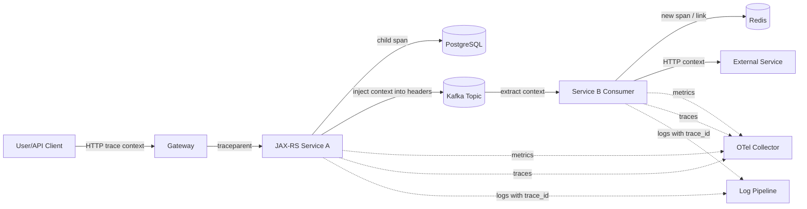
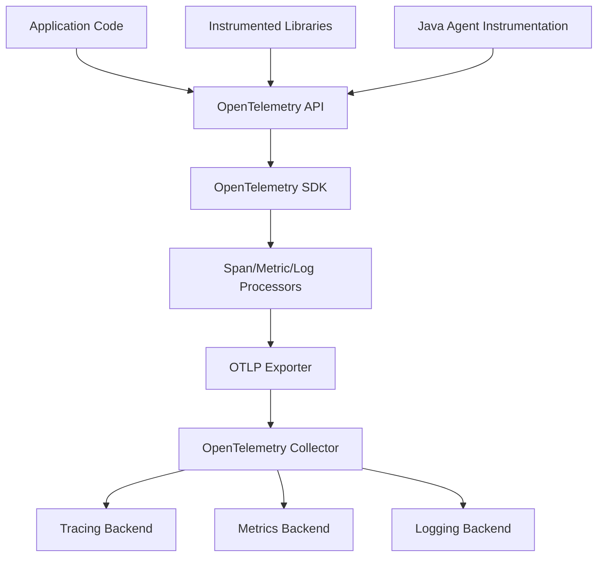
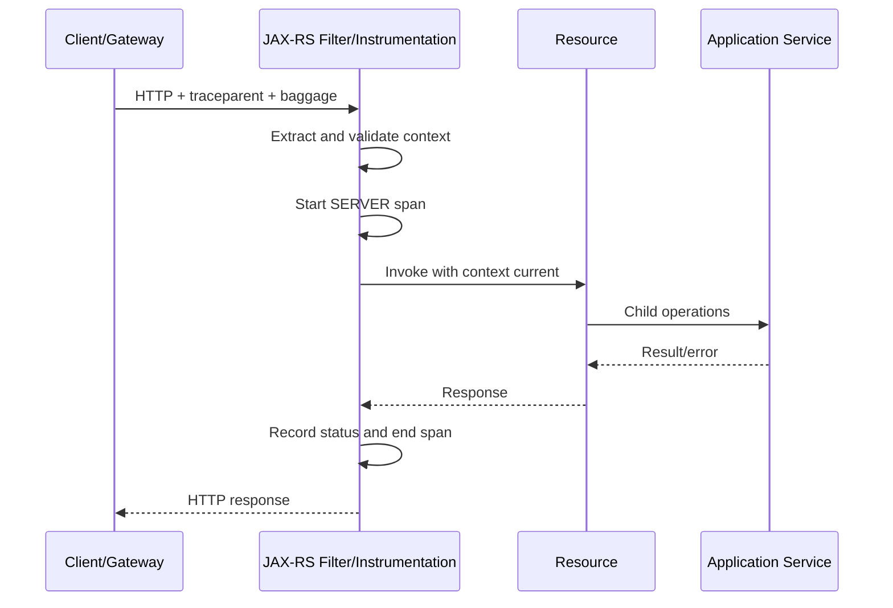
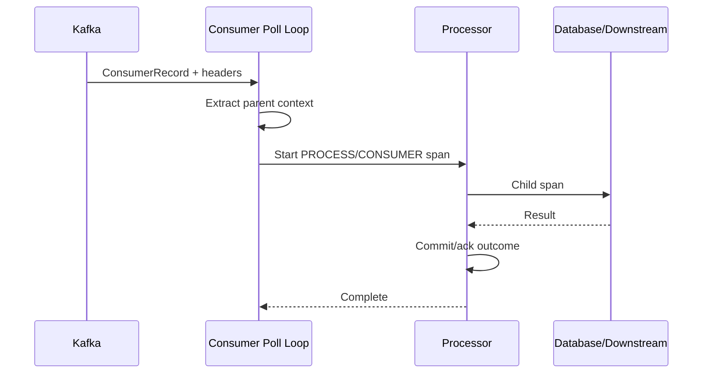

# Part 023 — OpenTelemetry and Context Propagation

> Observability bukan sekadar “ada log” atau “ada trace”. Sistem production harus dapat menjawab hubungan kausal: request mana memicu command tertentu, command mana menulis database, event mana diterbitkan, consumer mana memprosesnya, retry mana terjadi, dan kegagalan mana berdampak pada tenant atau business operation tertentu. Context propagation adalah mekanisme yang membawa hubungan tersebut melewati thread, process, protocol, queue, dan waktu.

## Daftar Isi

1. [Target kompetensi](#target-kompetensi)
2. [Scope dan baseline](#scope-dan-baseline)
3. [Standard versus implementation-specific boundary](#standard-versus-implementation-specific-boundary)
4. [Mental model: telemetry graph, bukan kumpulan log](#mental-model-telemetry-graph-bukan-kumpulan-log)
5. [Terminology map](#terminology-map)
6. [OpenTelemetry architecture](#opentelemetry-architecture)
7. [Signals: traces, metrics, dan logs](#signals-traces-metrics-dan-logs)
8. [Resource, instrumentation scope, dan semantic conventions](#resource-instrumentation-scope-dan-semantic-conventions)
9. [Trace, span, parent, link, dan event](#trace-span-parent-link-dan-event)
10. [Trace ID dan Span ID](#trace-id-dan-span-id)
11. [W3C Trace Context](#w3c-trace-context)
12. [Traceparent dan tracestate](#traceparent-dan-tracestate)
13. [Correlation ID](#correlation-id)
14. [Causation ID](#causation-id)
15. [Business operation ID](#business-operation-id)
16. [Baggage](#baggage)
17. [Baggage security dan size discipline](#baggage-security-dan-size-discipline)
18. [Context API dan scope lifecycle](#context-api-dan-scope-lifecycle)
19. [ThreadLocal risk](#threadlocal-risk)
20. [MDC propagation](#mdc-propagation)
21. [JAX-RS inbound HTTP propagation](#jax-rs-inbound-http-propagation)
22. [JAX-RS outbound HTTP propagation](#jax-rs-outbound-http-propagation)
23. [Context propagation pada async JAX-RS](#context-propagation-pada-async-jax-rs)
24. [Executor dan thread-pool propagation](#executor-dan-thread-pool-propagation)
25. [CompletableFuture propagation](#completablefuture-propagation)
26. [Kafka producer propagation](#kafka-producer-propagation)
27. [Kafka consumer propagation](#kafka-consumer-propagation)
28. [Parent-child versus span links pada messaging](#parent-child-versus-span-links-pada-messaging)
29. [Batch produce dan batch consume](#batch-produce-dan-batch-consume)
30. [Retry, DLQ, replay, dan trace continuity](#retry-dlq-replay-dan-trace-continuity)
31. [Database dan external dependency spans](#database-dan-external-dependency-spans)
32. [Manual instrumentation versus Java agent](#manual-instrumentation-versus-java-agent)
33. [OpenTelemetry API versus SDK](#opentelemetry-api-versus-sdk)
34. [TracerProvider, MeterProvider, LoggerProvider](#tracerprovider-meterprovider-loggerprovider)
35. [Exporter dan OpenTelemetry Collector](#exporter-dan-opentelemetry-collector)
36. [Metrics design](#metrics-design)
37. [Counter, histogram, gauge, dan observable instruments](#counter-histogram-gauge-dan-observable-instruments)
38. [High-cardinality label risk](#high-cardinality-label-risk)
39. [Exemplars dan trace-metric correlation](#exemplars-dan-trace-metric-correlation)
40. [Logs dan trace correlation](#logs-dan-trace-correlation)
41. [Sampling strategy](#sampling-strategy)
42. [Head sampling](#head-sampling)
43. [Tail sampling](#tail-sampling)
44. [Sampling untuk errors, latency, dan tenants](#sampling-untuk-errors-latency-dan-tenants)
45. [Span naming dan attribute governance](#span-naming-dan-attribute-governance)
46. [PII, secrets, dan commercial data](#pii-secrets-dan-commercial-data)
47. [Multi-tenancy](#multi-tenancy)
48. [Performance dan telemetry backpressure](#performance-dan-telemetry-backpressure)
49. [Failure-model matrix](#failure-model-matrix)
50. [Debugging playbook](#debugging-playbook)
51. [Testing strategy](#testing-strategy)
52. [Architecture patterns](#architecture-patterns)
53. [Anti-patterns](#anti-patterns)
54. [PR review checklist](#pr-review-checklist)
55. [Trade-off yang harus dipahami senior engineer](#trade-off-yang-harus-dipahami-senior-engineer)
56. [Internal verification checklist](#internal-verification-checklist)
57. [Latihan verifikasi](#latihan-verifikasi)
58. [Ringkasan](#ringkasan)
59. [Referensi resmi](#referensi-resmi)

---

## Target kompetensi

Setelah menyelesaikan part ini, Anda harus mampu:

- menjelaskan perbedaan telemetry signal, distributed context, business correlation, dan domain identifiers;
- membedakan `trace_id`, `span_id`, correlation ID, causation ID, idempotency key, request ID, event ID, dan business operation ID;
- memahami W3C `traceparent`, `tracestate`, dan baggage tanpa menganggap seluruh header sebagai data yang aman dipercaya;
- merancang inbound dan outbound propagation pada JAX-RS filters, Jersey Client, executor, `CompletionStage`, Kafka producer, dan Kafka consumer;
- menentukan kapan message processing span harus menjadi child span dan kapan lebih tepat menggunakan span links;
- mencegah `ThreadLocal` dan MDC leakage ketika thread pool menggunakan kembali worker thread;
- memilih auto-instrumentation, library instrumentation, atau manual instrumentation berdasarkan ownership dan semantic gap;
- mendesain span names, attributes, metric names, labels, dan logs yang konsisten serta dapat digunakan lintas service;
- menghindari high-cardinality metrics, oversized baggage, telemetry recursion, dan sensitive-data leakage;
- memahami head sampling, tail sampling, parent-based sampling, dan dampaknya pada trace completeness serta biaya;
- mengoperasikan OpenTelemetry SDK, exporter, dan Collector sebagai pipeline yang dapat gagal tanpa merusak request path;
- men-debug broken traces, missing spans, orphan spans, duplicate instrumentation, wrong service identity, dan context loss;
- mereview pull request instrumentation dari sisi causality, lifecycle, performance, security, dan operational usefulness.

---

## Scope dan baseline

Baseline materi:

- Java 17+;
- Jakarta REST/JAX-RS 4.x request, response, filters, client filters, dan async processing;
- OpenTelemetry Java API, SDK, Java agent, dan Collector;
- W3C Trace Context dan W3C Baggage propagation formats;
- HTTP, Kafka, executor/thread pool, database, Redis, dan external-service boundaries;
- structured logging dengan MDC apabila logging framework mendukungnya;
- Kubernetes-deployed microservices;
- enterprise multi-tenant quote, order, catalog, pricing, provisioning, dan integration workflows.

Part ini tidak mengasumsikan bahwa internal codebase menggunakan:

- OpenTelemetry Java agent;
- OpenTelemetry SDK manual;
- Micrometer bridge;
- Jaeger, Zipkin, Tempo, Elastic APM, Application Insights, AWS X-Ray, atau vendor tertentu;
- W3C Trace Context sebagai satu-satunya propagator;
- automatic Kafka instrumentation;
- log appender OpenTelemetry;
- tail sampling;
- tenant ID sebagai telemetry attribute;
- correlation ID yang sama dengan trace ID.

Semua detail tersebut harus dibuktikan melalui dependency graph, JVM startup flags, container manifests, Collector configuration, environment variables, logging pattern, Kafka interceptors, dashboards, dan traces aktual.

---

## Standard versus implementation-specific boundary

| Area | Standard/open specification | Implementation/platform-specific | Internal verification |
|---|---|---|---|
| Distributed trace header | W3C Trace Context | Vendor propagator tambahan | Propagator yang aktif |
| Application baggage | W3C Baggage | Vendor-specific baggage handling | Allowed baggage keys |
| Telemetry API | OpenTelemetry API | OpenTelemetry Java SDK/version | Dependency dan bootstrap |
| Automatic instrumentation | Konsep OTel | Java agent extension set | JVM agent flags |
| JAX-RS instrumentation | Instrumentation library/agent | Jersey/Servlet adapters | Duplicate instrumentation risk |
| Kafka propagation | Header carrier + OTel semantic conventions | Client interceptor/agent behavior | Header names dan version |
| Log correlation | Trace/span IDs sebagai fields | SLF4J/Logback/Log4j2 MDC injection | Logging framework |
| Metrics export | OTel Metrics model | OTLP/Prometheus/vendor exporter | Export path |
| Tail sampling | Collector capability/policy | Vendor/backend implementation | Collector topology |
| Semantic attributes | OTel semantic conventions | Internal business conventions | Attribute governance |
| Correlation/causation IDs | Application convention | Shared internal library | Header/event fields |

Key rule:

> OpenTelemetry menstandarkan telemetry dan propagation primitives. Ia tidak menentukan business correlation model, event causation semantics, tenant-security policy, atau data-retention policy organisasi Anda.

---

## Mental model: telemetry graph, bukan kumpulan log



Telemetry yang berguna harus memungkinkan engineer bergerak dari gejala ke sebab:

```text
Alert
  -> metric dimension
  -> exemplar / trace candidate
  -> distributed trace
  -> failing span
  -> correlated structured logs
  -> business operation / event / tenant context
  -> code, deployment, or dependency change
```

Jika setiap signal memiliki naming dan identity yang berbeda tanpa correlation, data observability hanya menjadi beberapa silo mahal.

---

## Terminology map

| Istilah | Makna |
|---|---|
| Telemetry | Data tentang behavior runtime: traces, metrics, logs, dan related metadata |
| Trace | Representasi end-to-end dari satu distributed operation |
| Span | Satu unit operation dalam trace |
| Parent span | Span yang secara kausal/langsung memulai child operation |
| Span link | Hubungan ke span lain tanpa menjadikannya parent langsung |
| Trace ID | Identifier trace end-to-end |
| Span ID | Identifier satu span dalam trace |
| Context | Container immutable untuk span dan values yang dipropagasikan |
| Propagator | Komponen yang inject/extract context ke carrier seperti HTTP headers |
| Baggage | Key-value application context yang dapat dipropagasikan |
| Resource | Identitas entity yang menghasilkan telemetry, misalnya service dan pod |
| Instrumentation scope | Library/module yang menghasilkan telemetry |
| Semantic conventions | Nama dan semantics atribut yang distandardisasi OTel |
| Correlation ID | Application identifier untuk mengelompokkan records terkait |
| Causation ID | Identifier operation/message yang menyebabkan operation baru |
| MDC | Thread-associated logging context pada banyak Java logging frameworks |
| Sampling | Keputusan apakah trace/span direkam dan diekspor |
| Cardinality | Jumlah kombinasi unik label/attribute values |
| Exemplar | Contoh measurement metric yang terhubung ke trace/span |

---

## OpenTelemetry architecture

OpenTelemetry dapat dipandang sebagai beberapa layer:



### API

API adalah surface yang digunakan application/library untuk menghasilkan telemetry. Library code idealnya bergantung pada API, bukan menginisialisasi global SDK sendiri.

### SDK

SDK menentukan processors, samplers, exporters, limits, resource attributes, dan behavior runtime lainnya.

### Instrumentation

Instrumentation dapat berasal dari:

- Java agent;
- library instrumentation;
- framework integration;
- manual application instrumentation;
- bytecode agent vendor lain;
- sidecar atau gateway instrumentation.

### Collector

Collector memisahkan aplikasi dari backend vendor dan dapat melakukan batching, retry, filtering, tail sampling, attribute processing, routing, dan export.

Invariant penting:

> Kegagalan telemetry pipeline tidak boleh menyebabkan business request gagal, tetapi telemetry loss juga harus terdeteksi melalui self-observability.

---

## Signals: traces, metrics, dan logs

Ketiga signal menjawab pertanyaan berbeda.

| Signal | Pertanyaan utama | Kekuatan | Kelemahan |
|---|---|---|---|
| Metrics | “Seberapa sering/besar/lambat?” | Agregasi murah, alerting | Detail individual hilang |
| Traces | “Di mana waktu dihabiskan dan bagaimana causality?” | End-to-end path | Sampling dan storage cost |
| Logs | “Apa detail discrete event ini?” | Detail kaya dan human-readable | Volume, schema drift, correlation |

Gunakan ketiganya bersama:

- metric mendeteksi peningkatan `5xx`;
- trace menunjukkan PostgreSQL lock wait;
- logs menunjukkan order revision dan SQL state yang telah direduksi/redacted;
- audit trail menunjukkan siapa mengubah state business.

Audit trail bukan pengganti log, dan log bukan pengganti audit trail.

---

## Resource, instrumentation scope, dan semantic conventions

### Resource

Resource attributes mengidentifikasi producer telemetry, misalnya:

```text
service.name
service.namespace
service.version
deployment.environment.name
cloud.provider
cloud.region
k8s.cluster.name
k8s.namespace.name
k8s.pod.name
```

`service.name` yang hilang atau berubah-ubah membuat backend melihat banyak service tidak dikenal.

### Instrumentation scope

Instrumentation scope mengidentifikasi instrumentation library, bukan business service. Contoh:

```java
Tracer tracer = openTelemetry
    .getTracer("com.example.quote.pricing", "1.4.0");
```

### Semantic conventions

Gunakan semantic conventions untuk HTTP, database, messaging, RPC, dan runtime ketika tersedia. Jangan membuat nama paralel seperti:

```text
http.status
http_status
statusCode
response.code
```

untuk semantics yang sama.

Tetapi stabilitas semantic conventions dapat berubah antarversi. Version pinning dan migration plan harus jelas.

---

## Trace, span, parent, link, dan event

### Span

Span memiliki:

- name;
- kind;
- start/end time;
- status;
- attributes;
- events;
- parent atau links;
- resource dan instrumentation scope.

### Span kind

Umumnya:

- `SERVER`: inbound request;
- `CLIENT`: outbound dependency call;
- `PRODUCER`: message send/publish;
- `CONSUMER`: receive/process semantics;
- `INTERNAL`: internal operation.

### Span event

Span event cocok untuk kejadian terbatas selama operation:

```java
span.addEvent("pricing.rule.matched", Attributes.builder()
    .put("pricing.rule.category", "volume-discount")
    .build());
```

Jangan menambahkan event untuk setiap row atau item pada batch besar tanpa limit.

### Span status

Status bukan HTTP status mirror sederhana. Record exception dan set error status saat operation gagal menurut semantics operation tersebut.

```java
try {
    return operation.call();
} catch (RuntimeException ex) {
    span.recordException(ex);
    span.setStatus(StatusCode.ERROR, "pricing dependency failed");
    throw ex;
} finally {
    span.end();
}
```

---

## Trace ID dan Span ID

Trace ID mengidentifikasi distributed trace; Span ID mengidentifikasi operation tertentu.

Do not assume:

- trace ID adalah request ID;
- trace ID stabil selama replay event;
- span ID dapat digunakan sebagai business key;
- trace ID harus disimpan permanen pada domain table;
- trace ID aman ditampilkan ke public client tanpa policy.

Trace ID bersifat observability identity. Domain identity harus tetap domain-owned.

Example structured log fields:

```json
{
  "level": "ERROR",
  "message": "Quote pricing failed",
  "trace_id": "4bf92f3577b34da6a3ce929d0e0e4736",
  "span_id": "00f067aa0ba902b7",
  "correlation_id": "qo-req-01J...",
  "quote_id_hash": "sha256:...",
  "error_type": "DependencyTimeout"
}
```

---

## W3C Trace Context

W3C Trace Context menstandarkan propagation metadata melalui dua header utama:

```text
traceparent
tracestate
```

Conceptual `traceparent`:

```text
version-traceid-parentid-traceflags
```

Contoh:

```text
00-4bf92f3577b34da6a3ce929d0e0e4736-00f067aa0ba902b7-01
```

Security rule:

> Inbound trace context adalah untrusted input. Library propagator harus memvalidasi format, dan application tidak boleh menggunakan trace identifiers sebagai authorization evidence.

Trace context dapat datang dari internet client. Gateway atau ingress policy mungkin memilih mempertahankan, mengganti, atau menautkan context eksternal berdasarkan trust policy.

---

## Traceparent dan tracestate

### `traceparent`

Membawa identifier dan sampling flags yang interoperable.

### `tracestate`

Membawa vendor-specific trace state. Application code sebaiknya tidak mem-parsing `tracestate` secara ad hoc.

### Trust boundary options

| Policy | Kapan digunakan | Trade-off |
|---|---|---|
| Preserve external parent | Trusted ecosystem | Full end-to-end trace |
| Start new trace + link external | Semi-trusted boundary | Isolasi lebih baik, correlation tetap ada |
| Drop context | Untrusted/invalid source | Kehilangan upstream causality |
| Gateway-normalized context | Central governance | Bergantung gateway correctness |

Internal verification wajib menentukan apakah public ingress menerima external trace context apa adanya.

---

## Correlation ID

Correlation ID adalah application convention untuk mengelompokkan records yang dianggap terkait. Ia mungkin:

- dibuat gateway;
- dibuat service pertama;
- berasal dari external partner;
- mewakili one request;
- mewakili multi-step business workflow.

Jangan menyamakan correlation ID dengan trace ID tanpa keputusan arsitektur eksplisit.

Recommended properties:

- opaque;
- bounded length;
- validated character set;
- no PII;
- logged as a structured field;
- propagated hanya melalui approved headers/message fields;
- regenerated atau namespaced pada trust boundaries bila perlu.

Example JAX-RS filter concept:

```java
@Provider
@Priority(Priorities.HEADER_DECORATOR)
public final class CorrelationFilter
        implements ContainerRequestFilter, ContainerResponseFilter {

    private static final String HEADER = "X-Correlation-ID";

    @Override
    public void filter(ContainerRequestContext request) {
        String inbound = request.getHeaderString(HEADER);
        String correlationId = isAcceptable(inbound)
            ? inbound
            : UUID.randomUUID().toString();
        request.setProperty(HEADER, correlationId);
    }

    @Override
    public void filter(
            ContainerRequestContext request,
            ContainerResponseContext response) {
        Object value = request.getProperty(HEADER);
        if (value != null) {
            response.getHeaders().putSingle(HEADER, value.toString());
        }
    }

    private boolean isAcceptable(String value) {
        return value != null
            && value.length() <= 128
            && value.matches("[A-Za-z0-9._:-]+");
    }
}
```

Filter di atas belum mengatur MDC scope; lifecycle logging harus ditangani hati-hati agar tidak leak.

---

## Causation ID

Causation ID menjawab:

> Operation atau message mana yang secara langsung menyebabkan operation/message baru ini?

Typical event envelope:

```json
{
  "eventId": "evt-01J...",
  "eventType": "QuoteApproved",
  "correlationId": "workflow-01J...",
  "causationId": "cmd-01J...",
  "occurredAt": "2026-07-10T12:30:00Z",
  "payload": {}
}
```

Saat consumer menghasilkan event baru:

```text
newEvent.correlationId = consumedEvent.correlationId
newEvent.causationId   = consumedEvent.eventId
```

Causation ID bukan standard OpenTelemetry field. Ia adalah business/event-governance convention yang dapat ditambahkan sebagai low-cardinality-safe span attribute hanya jika policy mengizinkan. Biasanya event IDs terlalu high-cardinality untuk metric labels tetapi masih dapat digunakan pada spans/logs.

---

## Business operation ID

Sistem quote/order sering memiliki operation yang berlangsung lebih lama daripada satu trace:

- quote amendment;
- order decomposition;
- provisioning saga;
- catalog publication;
- bulk migration;
- reconciliation run.

Gunakan business operation ID yang durable dan domain-owned. Trace dapat berubah setiap retry, resume, atau replay, tetapi business operation ID tetap mengikat semua attempt.

```text
business operation
  attempt 1 -> trace A
  retry job -> trace B
  replay    -> trace C
```

Jangan memaksa satu trace hidup berhari-hari. Gunakan links, correlation ID, causation ID, dan domain operation ID.

---

## Baggage

Baggage adalah key-value data yang berjalan bersama distributed context. Baggage dapat dibaca oleh downstream service dan dapat digunakan untuk memperkaya telemetry.

Example:

```java
Baggage baggage = Baggage.current().toBuilder()
    .put("tenant.tier", "enterprise")
    .put("channel", "partner-api")
    .build();

try (Scope ignored = baggage.makeCurrent()) {
    // approved downstream calls may propagate baggage
}
```

Baggage tidak otomatis menjadi span attributes di semua setup. Instrumentation atau processor harus memetakan key secara eksplisit.

Suitable baggage candidates:

- coarse request channel;
- region class;
- non-sensitive workload category;
- controlled tenant tier, bukan raw tenant ID jika cardinality/privacy tidak sesuai.

Unsuitable baggage:

- access token;
- customer name;
- email;
- quote payload;
- pricing details;
- full tenant configuration;
- unrestricted user input;
- unbounded list.

---

## Baggage security dan size discipline

Baggage dapat melewati banyak service. Risiko:

- header size growth;
- PII propagation;
- tenant data leakage;
- downstream trust confusion;
- cardinality explosion;
- accidental persistence di logs;
- attacker-controlled values.

Governance:

```text
Allowed key registry
  + owner
  + purpose
  + data classification
  + max length
  + propagation boundary
  + retention/logging rule
```

Inbound baggage dari external boundary sebaiknya di-drop atau allow-list. Jangan merge semua baggage tanpa policy.

---

## Context API dan scope lifecycle

OpenTelemetry Java `Context` bersifat immutable. `makeCurrent()` mengasosiasikan context dengan execution scope, sering melalui thread-local storage di implementation.

Correct pattern:

```java
Context parent = Context.current();
Span span = tracer.spanBuilder("quote.validate")
    .setParent(parent)
    .startSpan();

try (Scope scope = span.makeCurrent()) {
    validateQuote();
} catch (RuntimeException ex) {
    span.recordException(ex);
    span.setStatus(StatusCode.ERROR);
    throw ex;
} finally {
    span.end();
}
```

Invariant:

- every opened `Scope` must close;
- every started span must end once;
- context must not outlive operation accidentally;
- context must be captured before thread switch;
- child work must use intended parent context.

---

## ThreadLocal risk

Thread pools reuse threads. Jika context atau MDC tidak dibersihkan:

```text
Request A sets tenant=alpha
Request A completes without cleanup
Worker thread reused
Request B logs tenant=alpha incorrectly
```

Consequences:

- cross-tenant observability leak;
- wrong trace IDs;
- false incident diagnosis;
- privacy incident;
- audit contamination.

Never use:

```java
MDC.put("tenant", tenantId);
executor.submit(task); // no capture/restore/cleanup policy
```

without scoped cleanup.

Safer pattern:

```java
Map<String, String> capturedMdc = MDC.getCopyOfContextMap();
Context capturedOtel = Context.current();

executor.submit(() -> {
    Map<String, String> previous = MDC.getCopyOfContextMap();
    try (Scope ignored = capturedOtel.makeCurrent()) {
        if (capturedMdc == null) {
            MDC.clear();
        } else {
            MDC.setContextMap(capturedMdc);
        }
        runTask();
    } finally {
        if (previous == null) {
            MDC.clear();
        } else {
            MDC.setContextMap(previous);
        }
    }
});
```

Prefer tested framework wrappers over hand-written wrappers repeated across services.

---

## MDC propagation

MDC adalah logging concern, bukan distributed context standard.

Common MDC fields:

```text
trace_id
span_id
correlation_id
causation_id
tenant_key_hash
operation_name
```

Guidelines:

- use lower_snake_case or organization standard consistently;
- never place raw secrets/PII;
- set and clear in a scope;
- do not use MDC as application state source;
- do not authorize based on MDC;
- avoid copying huge maps to every task;
- validate auto-instrumentation already injects trace IDs before adding another mechanism.

Duplicate injection can cause mismatched fields such as `traceId` and `trace_id` with different values.

---

## JAX-RS inbound HTTP propagation

Inbound flow:



With Java agent, server span may already be created by Servlet/Jersey instrumentation. A custom filter should enrich the existing span rather than create a duplicate server span.

```java
@Provider
public final class TenantTelemetryFilter implements ContainerRequestFilter {
    @Override
    public void filter(ContainerRequestContext request) {
        Span current = Span.current();
        String tenantTier = resolveTrustedTenantTier(request);
        current.setAttribute("app.tenant.tier", tenantTier);
    }
}
```

Do not store raw request bodies in spans.

---

## JAX-RS outbound HTTP propagation

For Jersey Client, propagation may come from Java agent/client instrumentation or custom `ClientRequestFilter`.

Conceptual custom injection:

```java
@Provider
public final class TracePropagationClientFilter implements ClientRequestFilter {

    private final TextMapPropagator propagator;

    public TracePropagationClientFilter(OpenTelemetry openTelemetry) {
        this.propagator = openTelemetry.getPropagators().getTextMapPropagator();
    }

    @Override
    public void filter(ClientRequestContext request) {
        propagator.inject(Context.current(), request, (carrier, key, value) ->
            carrier.getHeaders().putSingle(key, value));
    }
}
```

Before implementing this, verify that auto-instrumentation does not already inject headers. Duplicate or conflicting propagation is a real failure mode.

Outbound span should capture stable metadata:

- HTTP method;
- normalized route/template when available;
- server address/port;
- response status;
- error type;
- retry attempt only if bounded and governed.

Avoid raw URLs containing IDs or query secrets.

---

## Context propagation pada async JAX-RS

A request may suspend on one thread and resume on another. `Context.current()` at callback time may no longer be the request context.

Capture explicitly:

```java
@GET
@Path("/{id}")
public void getQuote(
        @PathParam("id") String id,
        @Suspended AsyncResponse response) {

    Context requestContext = Context.current();

    quoteService.findAsync(id).whenComplete((quote, error) -> {
        try (Scope ignored = requestContext.makeCurrent()) {
            if (error != null) {
                Span.current().recordException(error);
                response.resume(error);
            } else {
                response.resume(quote);
            }
        }
    });
}
```

But context capture alone is insufficient if callback happens after timeout/cancellation. Completion race handling from Part 017 still applies.

---

## Executor dan thread-pool propagation

There are three strategies:

1. framework-managed context-aware executor;
2. decorate executor/tasks centrally;
3. capture and restore manually per submission.

Central wrapper:

```java
public final class ContextAwareExecutor implements Executor {
    private final Executor delegate;

    public ContextAwareExecutor(Executor delegate) {
        this.delegate = delegate;
    }

    @Override
    public void execute(Runnable command) {
        Context captured = Context.current();
        Map<String, String> mdc = MDC.getCopyOfContextMap();

        delegate.execute(() -> {
            Map<String, String> previous = MDC.getCopyOfContextMap();
            try (Scope ignored = captured.makeCurrent()) {
                restoreMdc(mdc);
                command.run();
            } finally {
                restoreMdc(previous);
            }
        });
    }

    private static void restoreMdc(Map<String, String> values) {
        if (values == null) MDC.clear();
        else MDC.setContextMap(values);
    }
}
```

Review questions:

- does wrapper preserve cancellation?
- does it propagate only approved context?
- does it restore previous worker state?
- what happens for nested submissions?
- is scheduled work expected to keep request context after long delays?

Scheduled jobs usually start a new trace, not inherit a stale request context.

---

## CompletableFuture propagation

`CompletableFuture` methods without explicit executor may use `ForkJoinPool.commonPool()`. Context behavior depends on instrumentation and runtime.

Avoid ambiguous ownership:

```java
Context captured = Context.current();

return CompletableFuture
    .supplyAsync(() -> {
        try (Scope ignored = captured.makeCurrent()) {
            return loadQuote();
        }
    }, contextAwareExecutor)
    .thenApplyAsync(quote -> {
        try (Scope ignored = captured.makeCurrent()) {
            return priceQuote(quote);
        }
    }, contextAwareExecutor);
```

Better: use instrumentation-supported executor wrappers and avoid repeatedly forcing one parent context when stages should have distinct spans.

---

## Kafka producer propagation

Producer instrumentation generally:

1. starts or uses a `PRODUCER` span;
2. injects distributed context into Kafka record headers;
3. records destination and messaging attributes;
4. ends span based on send acknowledgement semantics.

Manual conceptual example:

```java
ProducerRecord<String, byte[]> record =
    new ProducerRecord<>(topic, key, payload);

TextMapSetter<Headers> setter = (headers, keyName, value) -> {
    headers.remove(keyName);
    headers.add(keyName, value.getBytes(StandardCharsets.UTF_8));
};

openTelemetry.getPropagators()
    .getTextMapPropagator()
    .inject(Context.current(), record.headers(), setter);

producer.send(record);
```

Important:

- Kafka headers may be retained and replayed;
- baggage may become durable beyond expected lifetime;
- header mutation must be deterministic;
- duplicate headers can confuse extractors;
- broker does not validate trust semantics;
- event envelope correlation/causation remains separate from tracing headers.

---

## Kafka consumer propagation

Consumer flow:



Conceptual extraction:

```java
TextMapGetter<Headers> getter = new TextMapGetter<>() {
    @Override
    public Iterable<String> keys(Headers carrier) {
        List<String> keys = new ArrayList<>();
        carrier.forEach(h -> keys.add(h.key()));
        return keys;
    }

    @Override
    public String get(Headers carrier, String key) {
        Header header = carrier.lastHeader(key);
        return header == null
            ? null
            : new String(header.value(), StandardCharsets.UTF_8);
    }
};

Context extracted = propagator.extract(
    Context.root(), record.headers(), getter);
```

Use `Context.root()` or intended receiving context deliberately. Accidentally extracting into a poll-loop current context can cross-link unrelated messages.

---

## Parent-child versus span links pada messaging

Parent-child works well when one message directly continues one operation. Span links are often better when:

- one batch contains messages from many traces;
- one output message aggregates many inputs;
- replay occurs hours/days later;
- fan-in/fan-out has multiple causal parents;
- consumer processing is intentionally a new trace.

Example:

```java
SpanBuilder builder = tracer.spanBuilder("order-event.batch.process")
    .setNoParent();

for (Context messageContext : messageContexts) {
    SpanContext spanContext = Span.fromContext(messageContext).getSpanContext();
    if (spanContext.isValid()) {
        builder.addLink(spanContext);
    }
}

Span batchSpan = builder.startSpan();
```

Do not arbitrarily select the first message as parent for a heterogeneous batch.

---

## Batch produce dan batch consume

Challenges:

- one span per item may be too expensive;
- one span per batch may hide outliers;
- batch attributes can become unbounded;
- partial failures need item-level evidence.

Options:

| Strategy | Use case | Risk |
|---|---|---|
| One span per message | Low throughput, high-value operations | Volume |
| One span per batch + links | High-throughput batches | Less per-item detail |
| Sampled item spans | Large batch | Sampling bias |
| Batch span + failure events | Mostly-successful batches | Event explosion if many failures |

Metrics should record batch size distributions and failure counts, not message IDs as labels.

---

## Retry, DLQ, replay, dan trace continuity

### Retry in-process

Usually remains in the same trace with attempt spans/events.

### Retry topic

May continue parent context or start a new trace linked to original. Policy should account for delay and trace size.

### DLQ

DLQ publication should preserve domain envelope identifiers. Trace headers may be retained, but do not assume original trace remains queryable forever.

### Replay

Replay should generally start a new trace and link/reference original event identity. Reusing old sampled trace context can produce confusing trace timelines and backend retention mismatches.

Recommended telemetry fields:

```text
messaging.operation
app.delivery.attempt
app.replay.mode
app.failure.category
app.original.event.type
```

Avoid raw event IDs as metric labels.

---

## Database dan external dependency spans

Auto-instrumentation can capture JDBC calls, but application spans may still be needed around meaningful use cases:

```text
quote.price
  -> pricing-rule.load
  -> postgres SELECT
  -> tax-service call
  -> quote.persist
```

Do not create redundant spans around every method. A span should represent operationally meaningful work or a dependency boundary.

Database safety:

- do not record full SQL with literals if it leaks PII;
- prefer sanitized/parameterized statement templates;
- avoid row values;
- capture database system and operation semantics;
- correlate lock waits through database telemetry where possible.

---

## Manual instrumentation versus Java agent

| Approach | Strength | Weakness |
|---|---|---|
| Java agent | Fast coverage, no source changes | Hidden behavior, version compatibility, duplicate spans |
| Library instrumentation | Reusable semantics | Must be integrated/versioned |
| Manual instrumentation | Domain-rich spans | Code burden, inconsistency risk |
| Vendor agent | Integrated backend | Portability and lock-in |

Recommended layered approach:

```text
Agent/framework instrumentation
  -> transport and common libraries
Manual instrumentation
  -> domain-critical operations and missing semantics
Central governance
  -> names, attributes, limits, redaction, sampling
```

Do not manually recreate spans already emitted by the agent.

---

## OpenTelemetry API versus SDK

Application libraries should generally use API types:

```java
public final class PricingTelemetry {
    private final Tracer tracer;

    public PricingTelemetry(OpenTelemetry openTelemetry) {
        this.tracer = openTelemetry.getTracer("quote-pricing");
    }
}
```

Bootstrap layer owns SDK:

```java
SdkTracerProvider tracerProvider = SdkTracerProvider.builder()
    .setResource(resource)
    .setSampler(Sampler.parentBased(Sampler.traceIdRatioBased(0.1)))
    .addSpanProcessor(BatchSpanProcessor.builder(exporter).build())
    .build();
```

Do not initialize multiple global SDKs in independent libraries.

---

## TracerProvider, MeterProvider, LoggerProvider

Each provider has lifecycle and resource cost.

Lifecycle expectations:

```text
bootstrap
  -> construct resource
  -> construct exporters/processors
  -> construct providers
  -> register global instance if architecture allows
  -> start application
shutdown
  -> stop accepting work
  -> flush boundedly
  -> shutdown providers/exporters
```

`forceFlush()` must have a bounded timeout. Shutdown must not hang indefinitely waiting for unavailable telemetry backend.

---

## Exporter dan OpenTelemetry Collector

Collector benefits:

- backend decoupling;
- central routing;
- batching and retry;
- attribute filtering;
- tail sampling;
- credential isolation;
- protocol normalization.

Deployment choices:

| Topology | Strength | Risk |
|---|---|---|
| Agent/DaemonSet | Node-local, shared | Node failure/blast radius |
| Sidecar | Isolation per pod | Resource overhead |
| Gateway Collector | Central policy | Network dependency/bottleneck |
| Agent + gateway | Flexible | More operational complexity |

Collector should have:

- memory limiter;
- bounded queues;
- health/readiness;
- dropped telemetry metrics;
- exporter failure metrics;
- retry limits;
- backpressure behavior understood.

---

## Metrics design

Metrics should model service behavior, not individual entities.

Good examples:

```text
http.server.request.duration
quote.pricing.duration
order.submission.count
kafka.consumer.processing.duration
configuration.reload.failures
```

Potential dimensions:

```text
operation
result
error.type
tenant.tier
channel
region
```

Bad dimensions:

```text
quote.id
order.id
customer.id
trace.id
raw.url
exception.message
SQL statement with literals
```

Metrics are for aggregation. Unique identifiers belong in traces/logs, not labels.

---

## Counter, histogram, gauge, dan observable instruments

### Counter

Monotonic events:

```java
LongCounter failures = meter.counterBuilder("quote.pricing.failures")
    .setDescription("Number of failed quote pricing operations")
    .build();
```

### Histogram

Distribution:

```java
DoubleHistogram duration = meter
    .histogramBuilder("quote.pricing.duration")
    .setUnit("s")
    .build();
```

### Gauge/observable

Current state, such as queue depth or active sessions. Avoid callbacks that perform blocking network I/O.

Measurement units and boundaries must be governed. Milliseconds recorded under a seconds unit silently corrupt dashboards.

---

## High-cardinality label risk

Cardinality approximates product of unique label values.

```text
10 operations
x 20 error types
x 500 tenants
x 4 regions
= 400,000 time series
```

Add pod, route, status, and version, and cost can grow rapidly.

Controls:

- use normalized HTTP route, not raw path;
- group error types;
- hash or omit tenant identity;
- use tenant tier rather than tenant ID when acceptable;
- cap custom values;
- maintain attribute allow-list;
- review dashboard queries before rollout;
- monitor series count and dropped measurements.

---

## Exemplars dan trace-metric correlation

Exemplars attach representative trace/span context to metric measurements. They allow engineers to move from latency histogram to a specific trace.

Use cases:

```text
p99 latency spike
  -> exemplar trace
  -> slow JDBC span
  -> lock wait evidence
```

Availability depends on SDK/exporter/backend support and sampling. Verify end-to-end support rather than assuming it exists.

---

## Logs dan trace correlation

Structured logs should carry current trace/span IDs when available.

Example Logback pattern or JSON encoder configuration is implementation-specific. Desired output:

```json
{
  "timestamp": "2026-07-10T12:30:00.123Z",
  "level": "WARN",
  "service": "quote-service",
  "trace_id": "...",
  "span_id": "...",
  "correlation_id": "...",
  "event": "dependency_timeout",
  "dependency": "catalog-service",
  "timeout_ms": 500
}
```

Avoid logging the same exception in every layer. Record once at the boundary that owns handling, while traces can record the exception on the failed span.

---

## Sampling strategy

Sampling is a cost and evidence strategy.

Goals may conflict:

- retain all errors;
- retain rare tenants/workflows;
- retain slow traces;
- control storage;
- preserve parent decisions;
- avoid bias.

A strategy should define:

```text
baseline sample rate
error retention
latency retention
critical operation retention
health-check suppression
tenant/data-policy constraints
incident override procedure
```

---

## Head sampling

Head sampling decides near trace start.

Advantages:

- simple;
- low collector cost;
- predictable ingestion.

Weakness:

- cannot know final latency/error outcome;
- rare failures may be dropped;
- downstream spans follow upstream decision.

Parent-based sampling preserves distributed consistency:

```java
Sampler sampler = Sampler.parentBased(
    Sampler.traceIdRatioBased(0.10));
```

Do not blindly override upstream sampling decisions in every service.

---

## Tail sampling

Tail sampling decides after observing more of a trace, often in Collector/backend.

Useful policies:

- keep errors;
- keep latency above threshold;
- keep selected operations;
- probabilistic baseline;
- keep traces with specific span attributes.

Trade-offs:

- requires buffering;
- memory pressure;
- collector topology must see complete trace;
- late spans complicate decisions;
- policy mistakes can drop everything;
- tenant-aware sampling can create fairness/privacy issues.

---

## Sampling untuk errors, latency, dan tenants

Do not implement “sample all premium tenants” without privacy, fairness, and cost review.

Safer dimensions:

- workload class;
- operation criticality;
- non-sensitive tenant tier;
- controlled diagnostic flag with expiry;
- incident-specific rule.

Diagnostic sampling flags should be signed/authorized or controlled through configuration, not arbitrary inbound baggage.

---

## Span naming dan attribute governance

Bad span names:

```text
GET /quotes/12345
process quote 12345
SELECT customer@example.com
```

Better:

```text
GET /quotes/{quoteId}
quote.price
order.submit
Kafka quote-events process
```

Governance checklist:

- stable low-cardinality name;
- normalized route;
- semantic convention where applicable;
- business attributes prefixed/namespaced;
- no sensitive data;
- documented owner;
- versioned migration when renaming dashboards-critical attributes.

---

## PII, secrets, dan commercial data

Never record by default:

- authorization headers;
- cookies;
- access/refresh tokens;
- passwords;
- full request/response bodies;
- customer PII;
- commercial pricing details;
- contract terms;
- raw SQL parameters;
- secret configuration values.

Redaction must happen before export. Backend-side redaction alone is insufficient because data has already left the process/network boundary.

Telemetry data retention, access control, residency, and encryption requirements must be aligned with organizational policy.

---

## Multi-tenancy

Tenant-aware observability requires balance:

- enough context to isolate incident;
- no cross-tenant disclosure;
- no metric cardinality explosion;
- controlled support access;
- tenant identifier hashing/tokenization policy.

Possible pattern:

| Signal | Tenant representation |
|---|---|
| Metrics | tenant tier or none |
| Traces | opaque/internal tenant key if allowed |
| Logs | hashed tenant key with restricted access |
| Audit | canonical tenant ID under stronger controls |

Do not use one representation everywhere by convenience.

---

## Performance dan telemetry backpressure

Telemetry has runtime cost:

- allocation;
- context switching;
- serialization;
- queueing;
- network;
- exporter threads;
- backend storage.

Controls:

- batch processors;
- bounded queues;
- non-blocking export;
- sampling;
- attribute and event limits;
- span limits;
- log rate limits;
- Collector memory limiter;
- graceful drop policy.

Telemetry export must not run synchronously on request path unless intentionally designed and benchmarked.

Monitor telemetry itself:

```text
spans dropped
export failures
export queue size
collector refused data
collector memory usage
log ingestion lag
metric series count
```

---

## Failure-model matrix

| Failure | Symptom | Likely cause | Detection | Corrective direction |
|---|---|---|---|---|
| Broken trace | Service spans appear as separate traces | Missing injection/extraction | Compare headers and trace IDs | Fix propagator/instrumentation |
| Wrong parent | Unrelated requests merged | Poll-loop or ThreadLocal leakage | Parent timeline impossible | Extract from root, close scopes |
| Duplicate spans | Two SERVER/CLIENT spans per call | Agent + manual instrumentation | Identical durations/names | Remove duplicate layer |
| Missing logs correlation | Logs lack trace IDs | MDC injection absent/context lost | Compare trace and logs | Configure instrumentation/scoped MDC |
| Cross-tenant MDC leak | Wrong tenant in logs | MDC not cleared | Thread reuse pattern | Scope and restore MDC |
| High metric cost | Exploding series count | IDs/raw paths as labels | Backend cardinality reports | Normalize/remove labels |
| Oversized headers | HTTP 431/broker header bloat | Unbounded baggage | Header size metrics | Allow-list and cap baggage |
| All traces missing | Exporter/Collector failure | Endpoint/TLS/config | SDK/Collector self-metrics | Repair export path |
| Partial traces | Tail collector topology fragmented | Spans routed to different collectors | Trace completeness analysis | Consistent routing/stateful tail sampling |
| Wrong service name | `unknown_service` | Resource config missing | Backend resource fields | Set stable service resource |
| Trace volume spike | Cost/CPU increase | Sampling disabled or loop spans | Ingestion rate | Restore sampler/limits |
| Sensitive data leak | PII in attributes | Raw input recorded | Security scanning | Redact at source and purge |
| Kafka trace breaks | Consumer new trace unexpectedly | Headers missing/overwritten | Inspect record headers | Fix producer/consumer instrumentation |
| Replay attached to stale trace | Strange multi-day timeline | Old trace context reused | Trace timestamps | Start new trace + link |
| Shutdown loses spans | Recent traces absent | No bounded flush | Deploy boundary comparison | Flush with deadline |

---

## Debugging playbook

### 1. Confirm instrumentation topology

Collect:

```text
JVM -javaagent flags
OTEL_* environment variables
OpenTelemetry dependencies
Collector endpoints
JAX-RS/Servlet instrumentation modules
Kafka interceptors
logging appender/encoder
```

### 2. Follow one controlled request

Send a request with a known correlation ID. Capture:

- ingress headers;
- resource logs;
- outbound HTTP headers;
- Kafka record headers;
- consumer logs;
- trace backend result.

### 3. Compare identifiers by boundary

```text
Gateway trace_id
JAX-RS server span trace_id
Jersey client span trace_id
Kafka producer span trace_id
Kafka consumer span trace_id/link
```

### 4. Detect duplicate instrumentation

Look for:

- nested identical HTTP server spans;
- two JDBC spans per query;
- headers injected twice;
- duplicate metric instruments;
- multiple SDK bootstrap logs.

### 5. Inspect context switch points

Prioritize:

- `CompletableFuture`;
- custom executors;
- scheduled tasks;
- async JAX-RS callbacks;
- Kafka poll-to-worker handoff;
- reactive library boundaries;
- servlet async dispatch.

### 6. Check exporter and Collector health

Inspect:

- connection/TLS errors;
- refused spans;
- queue saturation;
- processor drops;
- memory limiter activation;
- backend throttling.

### 7. Check cardinality

Find top labels by unique values. Raw route IDs and exception messages are common offenders.

---

## Testing strategy

### Unit tests

Test:

- correlation ID validation/generation;
- baggage allow-list;
- context wrapper restore behavior;
- attribute redaction;
- span naming normalization;
- tenant representation policy.

### In-memory exporter tests

Use test SDK/in-memory exporter to assert spans:

```java
@Test
void createsDomainSpanWithExpectedAttributes() {
    // Build SDK with in-memory exporter.
    // Invoke application service.
    // Assert span name, parent, status, and safe attributes.
}
```

Avoid asserting every auto-instrumentation internal detail; tests become version-fragile.

### HTTP integration tests

Verify:

- valid `traceparent` is continued according to policy;
- invalid context does not break request;
- outbound context is injected;
- correlation response header is present;
- no sensitive headers are recorded.

### Executor leakage test

Run sequential tasks on one single-thread executor with different contexts and assert task B never sees task A context.

### Kafka integration tests

Using real Kafka/Testcontainers:

- producer injects headers;
- consumer extracts intended context;
- batch/fan-in uses links appropriately;
- replay starts a new trace;
- DLQ preserves business envelope IDs.

### Load tests

Compare:

- instrumentation off;
- head sampling rates;
- full tracing;
- high event counts;
- exporter unavailable.

Measure latency, allocation, CPU, queue drops, and shutdown behavior.

---

## Architecture patterns

### Pattern 1 — Central telemetry bootstrap

One composition root owns SDK, resource, exporters, and shutdown.

### Pattern 2 — Agent for infrastructure, manual spans for domain

Avoid duplicating transport/database spans while adding meaningful quote/order operations.

### Pattern 3 — Context-aware executor abstraction

Use one tested wrapper/managed executor rather than ad hoc capture code.

### Pattern 4 — Business envelope plus trace context

Event contains durable event/correlation/causation IDs; Kafka headers carry transient distributed trace context.

### Pattern 5 — Attribute governance registry

Each custom attribute has owner, purpose, classification, cardinality expectation, and allowed values.

### Pattern 6 — Collector as policy enforcement point

Use Collector for routing, sampling, and filtering, while still redacting secrets at source.

---

## Anti-patterns

### Use trace ID as domain ID

Trace lifecycle and retention do not match business lifecycle.

### Put full payload into span attributes

Creates security, cost, and size problems.

### Add tenant ID to every metric

Likely cardinality explosion.

### Create a span for every private method

Produces noise and overhead without operational meaning.

### Keep request context for scheduled jobs

Creates stale causality and potential data leakage.

### Trust inbound baggage

External callers can inject arbitrary values unless filtered.

### Initialize SDK in reusable library

Creates duplicate providers/exporters and shutdown conflicts.

### Record exception at every layer

Produces duplicate logs and inflated error counts.

### Manual propagation plus agent propagation

Can produce duplicate headers and spans.

### Synchronous exporter on request thread

Makes observability backend part of request availability path.

---

## PR review checklist

### Trace semantics

- [ ] Span represents meaningful operation or dependency boundary.
- [ ] Span name is stable and low-cardinality.
- [ ] Span kind is appropriate.
- [ ] Parent versus link semantics are intentional.
- [ ] Span always ends exactly once.
- [ ] Exceptions are recorded at the correct boundary.

### Context propagation

- [ ] HTTP inbound context is extracted by one layer.
- [ ] HTTP outbound context is injected by one layer.
- [ ] Executor/thread switches capture and restore context.
- [ ] MDC is restored/cleared.
- [ ] Kafka record headers are propagated according to policy.
- [ ] Replay/retry semantics do not reuse stale context incorrectly.

### Attributes and data safety

- [ ] No PII, secrets, tokens, or payload bodies.
- [ ] No raw URL/path with identifiers.
- [ ] Custom attributes have bounded values.
- [ ] Semantic conventions are used where applicable.
- [ ] Tenant representation follows policy.

### Metrics

- [ ] Instrument type matches semantics.
- [ ] Unit is explicit and correct.
- [ ] Labels are low-cardinality.
- [ ] Failure/result dimensions are bounded.
- [ ] Metric does not duplicate platform instrumentation unnecessarily.

### Logs

- [ ] Structured fields are consistent.
- [ ] Trace/span correlation works.
- [ ] Exception is not logged redundantly.
- [ ] Redaction happens before export.

### Lifecycle and operations

- [ ] SDK/exporter ownership is clear.
- [ ] Shutdown flush is bounded.
- [ ] Telemetry failure does not fail business request.
- [ ] Exporter/Collector failures are observable.
- [ ] Sampling impact is understood.
- [ ] Dashboard/alert consumers of renamed attributes are updated.

---

## Trade-off yang harus dipahami senior engineer

### More telemetry versus lower overhead

Full traces improve evidence but increase CPU, network, and storage. Sampling and domain-focused spans are necessary.

### Agent convenience versus explicit control

Agent provides broad coverage but can hide instrumentation behavior and version coupling. Manual spans improve semantics but create maintenance cost.

### End-to-end trace continuity versus trust isolation

Preserving external trace context improves visibility. Starting a new trace at trust boundaries improves isolation and abuse resistance.

### Rich attributes versus security/cardinality

More attributes improve filtering, but unique/sensitive values create cost and privacy risks.

### One trace across messaging versus new trace with links

Long asynchronous workflows can become unwieldy. Links and durable business IDs may better represent causality.

### Tail sampling versus operational complexity

Tail sampling retains interesting traces but requires buffering, topology awareness, and Collector capacity.

### Vendor-specific features versus portability

Vendor agents and backends may provide excellent diagnostics, but contracts should avoid unnecessary lock-in when OpenTelemetry primitives suffice.

---

## Internal verification checklist

### Instrumentation and versions

- [ ] Is OpenTelemetry used at all?
- [ ] Java agent, SDK, vendor agent, or combination?
- [ ] Exact Java agent and SDK versions?
- [ ] Semantic-convention version/stability policy?
- [ ] Any custom agent extensions?
- [ ] Duplicate instrumentation exclusions?

### Bootstrap and lifecycle

- [ ] Who creates `OpenTelemetry`/SDK providers?
- [ ] Is `GlobalOpenTelemetry` used?
- [ ] Who shuts down and flushes providers?
- [ ] What are export timeouts and queue sizes?
- [ ] What happens if Collector is unavailable?

### Propagation

- [ ] Active propagators: W3C Trace Context, baggage, B3, vendor format?
- [ ] Public ingress trust policy?
- [ ] Correlation ID header name and validation?
- [ ] Causation ID/event envelope standard?
- [ ] Jersey Client injection mechanism?
- [ ] Executor context propagation library?
- [ ] Kafka producer/consumer interceptors or agent support?
- [ ] Replay and DLQ propagation policy?

### Logging

- [ ] Logging framework and JSON encoder?
- [ ] MDC keys?
- [ ] Auto-injected trace/span IDs?
- [ ] Redaction filters?
- [ ] Exception logging ownership?
- [ ] Log retention and access control?

### Metrics

- [ ] OTel Metrics, Micrometer, Prometheus client, or vendor API?
- [ ] Naming and unit standard?
- [ ] Label allow-list?
- [ ] Cardinality monitoring?
- [ ] Tenant dimension policy?
- [ ] Exemplars supported end-to-end?

### Sampling and Collector

- [ ] Head sampler configuration?
- [ ] Tail sampling enabled?
- [ ] Collector topology: sidecar, daemon, gateway?
- [ ] Memory limiter and queue settings?
- [ ] Collector health and dropped-data alerts?
- [ ] Incident-time sampling override process?

### Security and governance

- [ ] Baggage allow-list and size limits?
- [ ] PII/commercial-data classification?
- [ ] Attribute registry and ownership?
- [ ] Data residency and retention?
- [ ] Backend access model?
- [ ] Audit versus observability boundary?

### CSG Quote & Order contextual verification

- [ ] Which quote/order operations have dedicated domain spans?
- [ ] How are long-running order flows correlated across traces?
- [ ] How are catalog/pricing revision IDs represented safely?
- [ ] How is tenant context represented without cardinality leakage?
- [ ] Which integrations propagate W3C context?
- [ ] How are Kafka retries, replay, and reconciliation runs linked?
- [ ] Which dashboards and alerts are considered operational source of truth?

---

## Latihan verifikasi

### Latihan 1 — Trace one HTTP-to-Kafka flow

Choose one endpoint that publishes an event. Document:

```text
inbound trace context
server span
application span
producer span
Kafka headers
event correlation/causation IDs
consumer span
outbound/database spans
```

### Latihan 2 — Executor leakage test

Create a single-thread executor. Submit tasks with different trace/MDC contexts and prove no context crosses task boundary.

### Latihan 3 — Cardinality review

List all custom metric labels and estimate worst-case series count.

### Latihan 4 — Baggage threat model

For every baggage key, document source, trust level, max size, propagation scope, retention, and whether it may contain sensitive data.

### Latihan 5 — Sampling failure drill

Simulate:

- Collector unavailable;
- exporter queue full;
- tail sampler memory pressure;
- sampling set to 100%;
- sampling set to 0%.

Observe application and telemetry behavior.

### Latihan 6 — Duplicate instrumentation detection

Enable agent debug logging in a non-production environment and inspect whether JAX-RS, Servlet, Jersey Client, JDBC, and Kafka are instrumented more than once.

---

## Ringkasan

- OpenTelemetry provides APIs, SDKs, propagation, semantic conventions, and telemetry pipeline components.
- Trace ID and Span ID model observability causality; they are not business identifiers.
- Correlation ID and causation ID require application governance.
- W3C Trace Context carries distributed trace metadata; W3C Baggage carries application-defined context.
- Baggage is not a free-form distributed session and must be allow-listed.
- `ThreadLocal` and MDC require strict scoped cleanup, especially with thread pools.
- HTTP, async JAX-RS, executors, Kafka, retries, DLQ, and replay each need explicit propagation semantics.
- Span links are often more accurate than parent-child for batch, fan-in, and replay.
- Metrics require low-cardinality labels and correct units.
- Sampling is an evidence/cost architecture decision, not a random percentage hidden in config.
- Agent instrumentation should cover infrastructure; manual spans should add domain meaning without duplication.
- Telemetry failures must be observable but must not become business availability failures.

---

## Referensi resmi

- [OpenTelemetry Documentation](https://opentelemetry.io/docs/)
- [OpenTelemetry Java](https://opentelemetry.io/docs/languages/java/)
- [OpenTelemetry Java Instrumentation](https://opentelemetry.io/docs/languages/java/instrumentation/)
- [OpenTelemetry Context Propagation](https://opentelemetry.io/docs/concepts/context-propagation/)
- [OpenTelemetry Baggage](https://opentelemetry.io/docs/concepts/signals/baggage/)
- [OpenTelemetry Specification](https://opentelemetry.io/docs/specs/otel/)
- [OpenTelemetry Semantic Conventions](https://opentelemetry.io/docs/specs/semconv/)
- [OpenTelemetry Messaging Semantic Conventions](https://opentelemetry.io/docs/specs/semconv/messaging/)
- [OpenTelemetry Kafka Semantic Conventions](https://opentelemetry.io/docs/specs/semconv/messaging/kafka/)
- [W3C Trace Context](https://www.w3.org/TR/trace-context/)
- [W3C Baggage](https://www.w3.org/TR/baggage/)
- [Jakarta RESTful Web Services Specification](https://jakarta.ee/specifications/restful-ws/)
