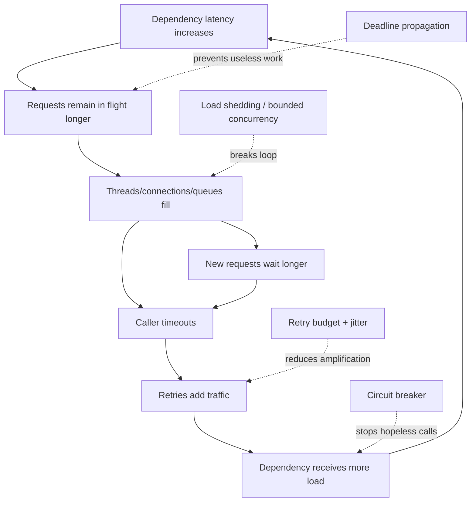
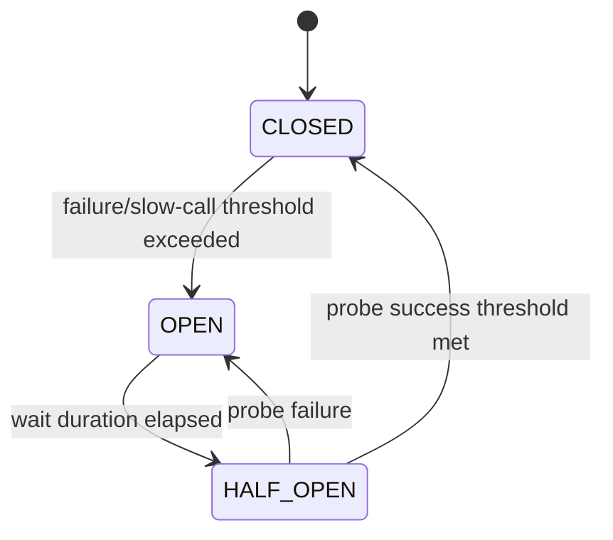
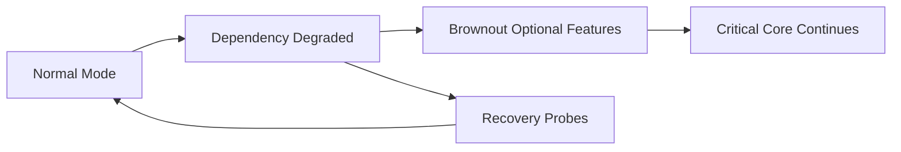

# Part 024 — Resilience Engineering and Cascading Failure Control

> Resilience bukan kemampuan “mencoba lagi sampai berhasil”. Resilience adalah kemampuan mempertahankan fungsi penting, membatasi konsumsi resource, menghindari amplifikasi kegagalan, dan pulih secara terkontrol ketika dependency, node, network, database, broker, atau configuration mengalami degradasi. Setiap retry, queue, fallback, dan timeout mengubah traffic serta state semantics. Jika tidak dirancang sebagai satu sistem, mekanisme yang dimaksudkan untuk meningkatkan reliability justru menjadi penyebab outage.

## Daftar Isi

1. [Target kompetensi](#target-kompetensi)
2. [Scope dan baseline](#scope-dan-baseline)
3. [Standard versus implementation-specific boundary](#standard-versus-implementation-specific-boundary)
4. [Mental model: failure amplification loop](#mental-model-failure-amplification-loop)
5. [Terminology map](#terminology-map)
6. [Reliability, availability, dan resilience](#reliability-availability-dan-resilience)
7. [Failure taxonomy](#failure-taxonomy)
8. [Latency budget dan deadline](#latency-budget-dan-deadline)
9. [Timeout taxonomy](#timeout-taxonomy)
10. [Connection timeout](#connection-timeout)
11. [TLS dan DNS timeout](#tls-dan-dns-timeout)
12. [Read, write, request, dan pool-acquisition timeout](#read-write-request-dan-pool-acquisition-timeout)
13. [End-to-end deadline propagation](#end-to-end-deadline-propagation)
14. [Cancellation dan abandoned work](#cancellation-dan-abandoned-work)
15. [Retry mental model](#retry-mental-model)
16. [Retryable versus non-retryable failure](#retryable-versus-non-retryable-failure)
17. [Idempotency dan ambiguous outcome](#idempotency-dan-ambiguous-outcome)
18. [Retry count, backoff, dan jitter](#retry-count-backoff-dan-jitter)
19. [Retry budget](#retry-budget)
20. [Retry ownership](#retry-ownership)
21. [Retry-After dan overload signals](#retry-after-dan-overload-signals)
22. [Retry storm](#retry-storm)
23. [Circuit breaker mental model](#circuit-breaker-mental-model)
24. [Circuit breaker states](#circuit-breaker-states)
25. [Failure-rate dan slow-call thresholds](#failure-rate-dan-slow-call-thresholds)
26. [Circuit-breaker partitioning](#circuit-breaker-partitioning)
27. [Half-open probes](#half-open-probes)
28. [Circuit breaker versus health check](#circuit-breaker-versus-health-check)
29. [Bulkhead dan dependency isolation](#bulkhead-dan-dependency-isolation)
30. [Semaphore bulkhead](#semaphore-bulkhead)
31. [Thread-pool bulkhead](#thread-pool-bulkhead)
32. [Queue capacity dan queueing collapse](#queue-capacity-dan-queueing-collapse)
33. [Rate limiting](#rate-limiting)
34. [Rate-limit dimensions dan fairness](#rate-limit-dimensions-dan-fairness)
35. [Local versus distributed rate limiter](#local-versus-distributed-rate-limiter)
36. [Backpressure](#backpressure)
37. [Load shedding](#load-shedding)
38. [Admission control](#admission-control)
39. [Priority dan criticality](#priority-dan-criticality)
40. [Fallback](#fallback)
41. [Graceful degradation](#graceful-degradation)
42. [Hedged request](#hedged-request)
43. [Thundering herd](#thundering-herd)
44. [Cascading failure](#cascading-failure)
45. [Fan-out dan multiplicative load](#fan-out-dan-multiplicative-load)
46. [JAX-RS inbound resilience](#jax-rs-inbound-resilience)
47. [Jersey Client dan outbound resilience](#jersey-client-dan-outbound-resilience)
48. [Kafka dan asynchronous resilience](#kafka-dan-asynchronous-resilience)
49. [Database resilience](#database-resilience)
50. [Redis dan cache resilience](#redis-dan-cache-resilience)
51. [Resilience4j mental model](#resilience4j-mental-model)
52. [Resilience4j configuration dan registries](#resilience4j-configuration-dan-registries)
53. [Decorator ordering](#decorator-ordering)
54. [Fallback ordering dan exception semantics](#fallback-ordering-dan-exception-semantics)
55. [Observability dan SLO integration](#observability-dan-slo-integration)
56. [Failure-model matrix](#failure-model-matrix)
57. [Debugging playbook](#debugging-playbook)
58. [Testing dan chaos experiments](#testing-dan-chaos-experiments)
59. [Architecture patterns](#architecture-patterns)
60. [Anti-patterns](#anti-patterns)
61. [PR review checklist](#pr-review-checklist)
62. [Trade-off yang harus dipahami senior engineer](#trade-off-yang-harus-dipahami-senior-engineer)
63. [Internal verification checklist](#internal-verification-checklist)
64. [Latihan verifikasi](#latihan-verifikasi)
65. [Ringkasan](#ringkasan)
66. [Referensi resmi](#referensi-resmi)

---

## Target kompetensi

Setelah menyelesaikan part ini, Anda harus mampu:

- memodelkan bagaimana latency, queue, retry, thread, connection, dan downstream capacity berinteraksi;
- membedakan timeout per phase, end-to-end deadline, cancellation, dan request abandonment;
- menentukan failure yang layak di-retry berdasarkan semantics, idempotency, dan remaining budget;
- mendesain exponential backoff, jitter, retry count, dan retry budget yang tidak memperbesar overload;
- menentukan layer tunggal yang memiliki retry policy;
- memahami circuit-breaker states, sliding window, minimum calls, failure threshold, slow-call threshold, dan half-open probes;
- memilih circuit-breaker key/partition agar failure isolation sejalan dengan dependency topology;
- menggunakan semaphore atau thread-pool bulkhead berdasarkan workload dan runtime model;
- mendesain bounded queues, concurrency limits, rate limits, backpressure, admission control, dan load shedding;
- membedakan fallback yang benar dari stale/incorrect response yang menutupi kegagalan;
- menilai hedged request dari sisi duplicate load, cancellation, consistency, dan cost;
- mengenali retry storm, thundering herd, queueing collapse, fan-out amplification, dan cascading failure;
- mengintegrasikan resilience pada JAX-RS server, Jersey Client, Kafka consumer/producer, JDBC, Redis, dan cloud SDK boundaries;
- menggunakan Resilience4j atau equivalent library tanpa mengandalkan annotation magic yang tidak dipahami;
- membuat telemetry, alerts, tests, dan game-day scenarios untuk membuktikan resilience behavior;
- mereview resilience configuration sebagai bagian dari distributed-system contract, bukan application tuning lokal.

---

## Scope dan baseline

Baseline:

- Java 17+;
- synchronous dan asynchronous JAX-RS endpoints;
- Jersey Client atau equivalent outbound HTTP client;
- PostgreSQL/JDBC connection pools;
- Kafka producer/consumer;
- Redis dan cloud SDK integrations;
- Kubernetes workload dengan finite CPU, memory, connections, dan termination deadlines;
- OpenTelemetry/metrics/logging dari Part 023;
- Resilience4j sebagai concrete Java example, tetapi hanya jika digunakan atau relevan secara internal;
- enterprise quote, order, catalog, pricing, provisioning, dan external-integration operations.

Part ini tidak mengasumsikan bahwa internal system menggunakan:

- Resilience4j;
- MicroProfile Fault Tolerance;
- service mesh retries;
- gateway-level circuit breakers;
- Redis-based distributed rate limiting;
- adaptive concurrency;
- hedged requests;
- one common resilience configuration;
- same policy for read dan write operations;
- fallback response untuk semua dependency failures.

Hal-hal tersebut harus diverifikasi melalui dependencies, code, gateway/service-mesh policy, cloud SDK configuration, Kubernetes manifests, runtime metrics, dan production incident history.

---

## Standard versus implementation-specific boundary

| Area | Protocol/runtime concept | Library/platform implementation | Internal verification |
|---|---|---|---|
| HTTP timeout | Client/server configuration | Jersey/Apache/Netty/client connector | Exact timeout semantics |
| Retry | Application/protocol policy | Resilience4j, SDK, mesh, gateway | Retry owner |
| Retry signal | HTTP `Retry-After`, status semantics | Gateway/cloud service behavior | Honored headers |
| Circuit breaker | Architecture pattern | Resilience4j/service mesh/vendor | Registry and thresholds |
| Bulkhead | Isolation pattern | Semaphore/thread-pool/pod/cell | Isolation boundary |
| Rate limit | Admission policy | Gateway, Redis, local token bucket | Dimensions and source of truth |
| Backpressure | Flow-control property | Reactive streams, bounded queue | Actual support |
| Load shedding | Early rejection | Gateway/server/custom admission control | Rejection behavior |
| Fallback | Application semantics | Cache/default/alternate dependency | Approved fallbacks |
| Hedging | Client strategy | Custom/client library | Whether allowed |
| Telemetry | OTel/metrics/logs | Resilience4j metrics/vendor dashboards | Alert standards |

Key principle:

> Library menyediakan mechanism. Hanya architecture dan domain semantics yang dapat menentukan apakah sebuah retry, fallback, atau rejection benar.

---

## Mental model: failure amplification loop



Resilience controls should break positive feedback loops. Adding retries without limits often strengthens the loop.

---

## Terminology map

| Istilah | Makna |
|---|---|
| Timeout | Maximum wait for a specific operation/phase |
| Deadline | Absolute or remaining end-to-end time budget |
| Retry | Re-execution after an attempt fails |
| Backoff | Delay between attempts |
| Jitter | Randomization of retry timing |
| Retry budget | Limit on additional retry traffic |
| Circuit breaker | Stops calls to a dependency judged unhealthy |
| Bulkhead | Isolates resource/concurrency failure domains |
| Rate limit | Limits request rate over time |
| Concurrency limit | Limits simultaneous in-flight work |
| Backpressure | Downstream communicates limited demand/capacity upstream |
| Load shedding | Rejects work early to preserve system health |
| Admission control | Decides whether new work may enter |
| Fallback | Alternate result/path when primary path fails |
| Graceful degradation | Reduced functionality while preserving critical functions |
| Hedging | Sends duplicate attempt after delay and uses first success |
| Retry storm | Coordinated retries overload a recovering system |
| Thundering herd | Many clients/tasks wake or refresh simultaneously |
| Cascading failure | Failure propagates and amplifies across components |
| Brownout | Deliberately disables optional features under load |

---

## Reliability, availability, dan resilience

- **Reliability**: probability system performs correctly over time.
- **Availability**: proportion of time/request system is usable.
- **Resilience**: ability to tolerate, contain, adapt to, and recover from failures.

A service can be available but incorrect, for example returning stale pricing as current pricing. A fallback that increases availability while violating business correctness is not resilience.

For CPQ/order systems, critical correctness boundaries may include:

- price calculation version;
- currency and rounding;
- order state transition;
- duplicate submission prevention;
- tenant isolation;
- catalog revision;
- inventory/provisioning commitment.

Resilience policy must preserve these invariants.

---

## Failure taxonomy

| Failure category | Example | Typical response |
|---|---|---|
| Transient network | Connection reset | Bounded retry if safe |
| Dependency overload | `429`, `503`, high latency | Backoff, respect signal, shed load |
| Permanent client error | `400`, validation failure | Do not retry |
| Authentication failure | `401`, invalid token | Refresh once if contract allows, otherwise stop |
| Authorization failure | `403` | Do not retry automatically |
| Resource not found | `404` | Usually no retry; domain-dependent |
| Optimistic conflict | `409`/`412` | Re-read/recompute if workflow allows |
| Timeout with unknown outcome | Write accepted but response lost | Idempotency/status lookup, not blind retry |
| Data integrity failure | Constraint violation | Stop and investigate/correct input |
| Dependency bug | deterministic `500` | Circuit/open, no rapid retry |
| Local saturation | pool/thread/queue full | Reject/shed before cascading |
| Configuration failure | invalid endpoint/credentials | Fail fast, no endless retries |

Retry policy should classify both response status and exception type. Catching all `Exception` as retryable is unsafe.

---

## Latency budget dan deadline

Suppose external API SLO is 2 seconds:

```text
Gateway overhead          100 ms
JAX-RS processing         150 ms
Database                  300 ms
Catalog dependency        500 ms
Pricing dependency        500 ms
Serialization/network     150 ms
Safety margin             300 ms
Total                    2000 ms
```

If each dependency independently has a 2-second timeout, end-to-end latency can exceed the caller deadline significantly.

Deadline model:

```java
public record Deadline(Instant expiresAt, Clock clock) {
    public Duration remaining() {
        Duration value = Duration.between(clock.instant(), expiresAt);
        return value.isNegative() ? Duration.ZERO : value;
    }

    public boolean expired() {
        return remaining().isZero();
    }
}
```

Every child call should receive a bounded portion of remaining time, with minimum useful execution time and cleanup margin.

---

## Timeout taxonomy

Timeouts are not interchangeable.

| Timeout | What it bounds |
|---|---|
| DNS timeout | Name resolution |
| Connection timeout | TCP connection establishment |
| TLS handshake timeout | Secure session negotiation |
| Pool acquisition timeout | Waiting for client/DB connection |
| Write timeout | Sending request bytes |
| Read timeout | Waiting for response bytes |
| Idle timeout | Inactivity on open connection |
| Request timeout | Whole client operation |
| Server request timeout | Server-side processing budget |
| Queue timeout | Waiting before execution |
| Transaction timeout | Database transaction duration |
| Async response timeout | Suspended JAX-RS response duration |

A library’s “read timeout” may mean socket inactivity, not total request time. Verify exact semantics and connector implementation.

---

## Connection timeout

Connection timeout should be short enough to fail unavailable endpoints but long enough for expected network path.

Consider:

- DNS resolution may happen before connect timeout;
- dual-stack/address attempts;
- proxy connection;
- TLS occurs after TCP connection;
- connection pool reuse means connect timeout is not exercised on every request;
- Kubernetes DNS/network failures may manifest differently.

Measure connect latency distribution before choosing values.

---

## TLS dan DNS timeout

DNS and TLS can consume substantial startup/first-call time.

Failure modes:

- stale DNS cache;
- resolver latency;
- certificate validation delay;
- unavailable CRL/OCSP path;
- SNI mismatch;
- trust-store issue;
- cold connection after deployment.

Warmup traffic and connection establishment must be included in timeout tests. A timeout chosen from steady-state pooled connections can fail during rollout.

---

## Read, write, request, dan pool-acquisition timeout

### Pool acquisition timeout

Prevents requests waiting indefinitely for a connection. Pool exhaustion should fail explicitly and produce saturation metrics.

### Read timeout

Bounds inactivity or response wait, depending on client.

### Request timeout

Bounds entire call including retries only if configured at the correct layer.

### Queue timeout

A request can expire while waiting in a worker queue. Executing it afterward wastes capacity.

Invariant:

> Queue wait + execution + retries + serialization must fit within remaining caller deadline.

---

## End-to-end deadline propagation

Possible propagation mechanisms:

- protocol-specific timeout header;
- RPC deadline;
- application request context;
- message expiry/deadline field;
- internal `Deadline` object.

Do not blindly trust client-provided deadlines. Clamp to server policy:

```java
Duration effective = min(
    requestedDeadline,
    endpointPolicy.maxDuration(),
    platformRequestLimit.minus(safetyMargin));
```

Downstream call timeout:

```java
Duration remaining = deadline.remaining();
Duration callTimeout = min(remaining.minus(cleanupMargin), policy.maxCallTimeout());
if (callTimeout.isZero() || callTimeout.isNegative()) {
    throw new DeadlineExceededException();
}
```

---

## Cancellation dan abandoned work

Caller timeout does not guarantee server work stops.

Examples:

- JDBC query continues;
- remote dependency continues;
- executor task remains queued;
- Kafka publish completes after HTTP response timeout;
- file upload continues writing temp data.

Cancellation must be propagated where supported:

- cancel `Future`;
- abort HTTP call;
- set database statement/transaction timeout;
- remove queued work if possible;
- check interruption/cooperative cancellation;
- avoid starting expensive work when deadline is nearly exhausted.

Cancellation does not roll back external side effects automatically.

---

## Retry mental model

A retry is new load and potentially a new side effect.

```text
original request rate = 1000 rps
10% fail
one retry each = +100 rps
retry also fails and retries again = +10 rps
```

Under partial outage, retry traffic can become much larger. With retries at multiple layers:

```text
Gateway 3 attempts
Service A 3 attempts
SDK 3 attempts
Potential downstream attempts = 3 x 3 x 3 = 27
```

Retry must have one clear owner.

---

## Retryable versus non-retryable failure

Retryable candidates, subject to semantics:

- connection refused/reset;
- selected timeouts;
- `429` with `Retry-After`;
- `502`, `503`, `504` under policy;
- transaction serialization/deadlock failure with whole-transaction retry;
- temporary leader/broker errors.

Usually non-retryable:

- validation errors;
- authentication/authorization failures;
- deterministic business rejection;
- malformed payload;
- unsupported media type;
- schema incompatibility;
- data-integrity violation;
- response indicating permanent configuration error.

Do not retry based only on status class.

---

## Idempotency dan ambiguous outcome

A timeout after sending a write produces ambiguity:

```text
client sends order
server commits order
response is lost
client times out
```

Blind retry may create duplicate order.

Solutions:

- idempotency key;
- client-generated command ID;
- unique database constraint;
- operation status endpoint;
- transactional inbox/outbox;
- compare-and-set/version precondition;
- deduplication record with stored result.

Retry safety requires durable server-side behavior, not only client intention.

---

## Retry count, backoff, dan jitter

Exponential backoff concept:

```text
base * 2^attempt
```

Capped backoff:

```text
min(cap, base * 2^attempt)
```

Jitter avoids synchronized retries.

Possible strategies:

- full jitter;
- equal jitter;
- decorrelated jitter;
- server-directed delay.

Example conceptual policy:

```java
Duration delayFor(int attempt, Duration base, Duration cap, Random random) {
    long exponential = Math.min(
        cap.toMillis(),
        base.toMillis() * (1L << Math.min(attempt, 20)));
    return Duration.ofMillis(random.nextLong(exponential + 1));
}
```

Production implementation should use tested library code, overflow protection, and deterministic tests.

---

## Retry budget

Retry count per request is insufficient. Retry budget limits aggregate retry traffic.

Example policy:

```text
retries <= 10% of successful request volume
and
maximum retry concurrency = 20
and
no retry when remaining deadline < 200 ms
```

Retry budget can be enforced by:

- token bucket;
- global/per-dependency concurrency limit;
- adaptive policy;
- client throttling;
- disabling retries during severe overload.

Metrics:

```text
attempts.total
retries.total
retry.successes
retry.exhausted
retry.skipped.deadline
retry.skipped.budget
```

---

## Retry ownership

Potential owners:

- end user/client;
- API gateway;
- service mesh;
- application service;
- HTTP client library;
- cloud SDK;
- database layer;
- Kafka framework;
- workflow engine.

Define owner per dependency and operation.

Recommended rule:

> Retry at the highest layer that understands operation semantics, but close enough to the failure to classify it accurately and respect the remaining deadline.

For cloud SDKs with built-in retries, application-level retries must account for SDK attempts.

---

## Retry-After dan overload signals

HTTP overload responses may include:

```text
429 Too Many Requests
503 Service Unavailable
Retry-After: 5
```

Clients should:

- honor `Retry-After` when contract allows;
- apply local maximum delay/deadline;
- avoid immediate concurrent retries;
- record rejection reason;
- not treat every `503` as infinitely retryable.

Servers should return clear overload signals rather than accepting work and timing out late.

---

## Retry storm

Retry storm occurs when many callers retry simultaneously against an unhealthy/recovering dependency.

Triggers:

- zero-delay retries;
- fixed identical intervals;
- retries at many layers;
- recovery opens all traffic at once;
- autoscaling delay;
- client reconnect loops;
- scheduled jobs aligned on the same second.

Controls:

- jitter;
- retry budgets;
- circuit breaker;
- load shedding;
- gradual recovery;
- server `Retry-After`;
- client-side throttling;
- randomized scheduled jobs;
- idempotency.

---

## Circuit breaker mental model

A circuit breaker prevents repeated calls likely to fail and allows controlled probes for recovery.

It protects caller resources and reduces pressure on dependency. It does not repair the dependency.



---

## Circuit breaker states

Typical states:

- `CLOSED`: calls allowed and measured;
- `OPEN`: calls rejected immediately;
- `HALF_OPEN`: limited probe calls allowed;
- special library states such as disabled/forced-open/metrics-only may exist.

Open-circuit rejection should map to a meaningful internal error category. Do not report it as generic null or timeout.

---

## Failure-rate dan slow-call thresholds

A circuit can open based on:

- failure percentage;
- slow-call percentage;
- count-based window;
- time-based window;
- minimum number of calls.

Without minimum calls, one failure could open a low-volume dependency.

Example reasoning:

```text
window size = 100 calls
minimum calls = 20
failure threshold = 50%
slow threshold = 800 ms
slow-call threshold = 60%
```

Thresholds must be based on SLO, capacity, and dependency behavior—not copied from library defaults.

---

## Circuit-breaker partitioning

One global breaker for all calls can create false isolation.

Possible keys:

- dependency service;
- endpoint/operation;
- region;
- tenant tier;
- credential/account;
- partition/shard.

Too coarse:

- one failing endpoint blocks healthy endpoints.

Too fine:

- thousands of breakers consume memory and never reach minimum-call threshold.

Partition based on actual failure domain.

---

## Half-open probes

Half-open must limit concurrency. If all callers probe simultaneously, recovery becomes another overload event.

Probe design:

- small permitted call count;
- representative but safe operations;
- no uncontrolled writes;
- gradual ramp;
- appropriate wait duration;
- metrics for transition reasons.

A health endpoint success does not prove business operation success.

---

## Circuit breaker versus health check

| Circuit breaker | Health check |
|---|---|
| Caller-local observation | Target/platform-reported status |
| Per operation/dependency path | Often service-level |
| Protects call path | Used for routing/readiness |
| Can open due to latency/failures | May remain green during partial failure |

Do not use Kubernetes readiness as a replacement for client-side failure isolation. Also do not mark your service unready solely because one optional dependency fails; that can remove all replicas and worsen outage.

---

## Bulkhead dan dependency isolation

Bulkhead isolates resource pools so one dependency/workload cannot consume all capacity.

Examples:

- separate executor for pricing calls;
- separate connection pool for reporting queries;
- concurrency semaphore per external provider;
- separate Kafka consumer deployment;
- dedicated pod pool/cell for high-volume tenant class;
- independent queue for critical commands.

Bulkhead boundary should align with saturation vector.

---

## Semaphore bulkhead

Semaphore bulkhead limits concurrent calls while execution remains on caller thread.

Advantages:

- low overhead;
- no extra queue/thread switch;
- suitable for async/non-blocking calls when permits cover in-flight work.

Risks:

- caller thread can still block inside dependency;
- permit leak if release path is wrong;
- fairness behavior;
- must account for cancellation.

```java
Semaphore permits = new Semaphore(20);

if (!permits.tryAcquire()) {
    throw new BulkheadRejectedException("pricing concurrency limit reached");
}
try {
    return pricingClient.call();
} finally {
    permits.release();
}
```

Use tested libraries and metrics rather than ad hoc implementation for production.

---

## Thread-pool bulkhead

Thread-pool bulkhead isolates blocking work with dedicated workers and bounded queue.

Advantages:

- isolates blocking calls;
- protects request threads;
- clear resource allocation.

Risks:

- queue hides overload;
- context propagation complexity;
- more threads/native memory;
- cancellation difficulty;
- latency increases before rejection.

Sizing inputs:

- dependency latency;
- target concurrency;
- CPU/blocking ratio;
- request deadline;
- queue wait budget;
- JVM thread-stack memory.

---

## Queue capacity dan queueing collapse

Large queues do not create capacity. They store latency.

Little’s Law intuition:

```text
concurrency ≈ throughput x latency
```

If throughput is fixed and latency rises, in-flight concurrency rises. An unbounded queue can consume memory and cause requests to expire before execution.

Prefer:

- bounded queue;
- short queue-wait timeout;
- deadline-aware dequeue;
- explicit rejection;
- queue-depth telemetry;
- separate priority queues only with starvation controls.

---

## Rate limiting

Rate limiting controls requests per time unit.

Algorithms:

- fixed window;
- sliding window;
- token bucket;
- leaky bucket;
- generic cell rate algorithm;
- distributed counters/scripts.

Rate limit is not the same as concurrency limit:

```text
100 requests/second each taking 10 seconds
=> potentially 1000 concurrent requests
```

You may need both.

---

## Rate-limit dimensions dan fairness

Possible dimensions:

- client/application;
- tenant;
- user;
- endpoint;
- operation cost class;
- API credential;
- region;
- global dependency quota.

A request count can be a poor cost proxy. One bulk pricing request may cost more than many reads.

Weighted limits:

```text
simple GET              cost 1
quote recalculation     cost 10
catalog bulk import     cost 100
```

Rate-limit keys must not expose tenant data in public errors/logs.

---

## Local versus distributed rate limiter

### Local limiter

Pros:

- low latency;
- no external dependency;
- good for per-instance overload protection.

Cons:

- global rate scales with replica count;
- uneven load gives unfairness.

### Distributed limiter

Pros:

- global quota;
- consistent tenant/client policy.

Cons:

- adds network dependency;
- Redis/store outage behavior;
- race/clock/latency complexity;
- can become shared bottleneck.

Often use both:

```text
gateway/distributed business quota
+
local per-instance concurrency protection
```

---

## Backpressure

Backpressure means downstream capacity influences upstream production.

Examples:

- bounded Kafka consumer processing concurrency;
- pause/resume partitions;
- reactive-stream demand;
- HTTP streaming that slows producer writes;
- bounded internal queue;
- upstream `429/503` response.

JAX-RS synchronous APIs do not automatically provide end-to-end backpressure. A blocking socket can still allow internal work generation to outrun downstream capacity.

Backpressure must propagate to the source. Dropping items in an internal queue without signaling upstream is loss, not backpressure.

---

## Load shedding

Load shedding rejects work early when capacity is exhausted, preserving useful throughput and recovery ability.

Early rejection is better than late timeout because it consumes fewer resources.

Possible signals:

- queue full;
- concurrency limit reached;
- CPU saturation;
- memory pressure;
- dependency breaker open;
- deadline too short;
- tenant quota exhausted;
- degraded-mode policy.

Response should distinguish:

- business rejection;
- rate limit;
- temporary overload;
- dependency unavailable.

---

## Admission control

Admission control decides before expensive work begins.

Conceptual JAX-RS filter:

```java
@Provider
@Priority(Priorities.AUTHORIZATION + 100)
public final class AdmissionControlFilter implements ContainerRequestFilter {
    private final AdmissionController controller;

    @Override
    public void filter(ContainerRequestContext request) {
        AdmissionDecision decision = controller.admit(
            operationKey(request),
            trustedTenantClass(request));

        if (!decision.allowed()) {
            request.abortWith(Response.status(503)
                .header("Retry-After", decision.retryAfterSeconds())
                .entity(problem("temporarily_overloaded"))
                .build());
        }
    }
}
```

Do not perform expensive authentication/tenant/database lookup before admission if cheaper safe signals can be used, but never bypass required security checks.

---

## Priority dan criticality

Not all operations are equal.

Potential classes:

```text
P0: health/control traffic
P1: order submission and critical state transitions
P2: quote reads and interactive pricing
P3: reports, exports, bulk maintenance
```

Under overload, degrade optional work first. Priority must be authenticated and server-derived; do not trust a public `X-Priority: critical` header.

Avoid starvation: low-priority work still needs controlled capacity or scheduled execution.

---

## Fallback

Fallback is an alternate result or execution path. It must be semantically valid.

Valid examples:

- cached read with explicit staleness metadata;
- omit optional recommendation section;
- enqueue non-critical notification for later;
- use last-known configuration within approved TTL;
- return `202 Accepted` for asynchronous processing if contract supports it.

Dangerous examples:

- use default zero price;
- silently skip tax calculation;
- accept order without authorization dependency;
- use stale catalog revision without disclosure;
- convert dependency failure into empty list indistinguishable from “no data”.

Fallback should expose degraded state to telemetry and, where relevant, to client/business workflow.

---

## Graceful degradation

Graceful degradation preserves critical functions while reducing optional features.



Examples:

- quote creation allowed but optional recommendation disabled;
- order status read available while report export paused;
- cached catalog browsing allowed, but checkout requiring current price blocked;
- batch reconciliation delayed while interactive requests preserved.

Document which invariants remain guaranteed in degraded mode.

---

## Hedged request

Hedging sends a second request after a delay when the first is unusually slow, then uses the first successful result.

Potential benefit:

- reduce tail latency for idempotent reads against independent replicas.

Risks:

- doubles load during slowness;
- duplicate side effects;
- correlated replicas make no improvement;
- cancellation may not stop loser;
- billing/cost amplification;
- cache/database hot-key amplification.

Only consider when:

- operation is idempotent/read-only;
- replicas/failure domains are independent;
- hedge delay is percentile-based;
- total hedge rate is budgeted;
- loser is canceled;
- system is not overloaded;
- telemetry distinguishes original and hedge.

Never hedge order submission or payment-like operations without a very strong idempotency protocol.

---

## Thundering herd

Thundering herd occurs when many actors perform the same work simultaneously.

Examples:

- cache entry expires globally;
- token refresh happens at the same instant;
- pods restart and warm caches together;
- CronJobs start on the minute;
- circuit breaker closes for all callers;
- clients reconnect after outage.

Controls:

- expiration jitter;
- single-flight/request coalescing;
- stale-while-revalidate;
- distributed lock with fencing where appropriate;
- gradual rollout;
- randomized schedules;
- token refresh before expiry with jitter;
- half-open limited probes.

---

## Cascading failure

Cascading failure grows through positive feedback:

1. one replica/dependency slows;
2. requests remain active longer;
3. pools and queues fill;
4. caller timeouts trigger retries;
5. retries increase load;
6. healthy replicas saturate;
7. health checks fail and capacity shrinks;
8. recovery becomes harder.

Controls must cover:

- finite deadlines;
- bounded concurrency;
- bounded queues;
- retry budgets;
- early rejection;
- circuit breakers;
- graceful degradation;
- capacity headroom;
- dependency isolation;
- observability and rapid rollback.

No single pattern prevents cascading failure alone.

---

## Fan-out dan multiplicative load

If one request calls 20 downstream shards/services, 100 inbound RPS can create 2,000 downstream RPS before retries.

With two attempts:

```text
100 x 20 x 2 = 4,000 downstream attempts/second
```

Fan-out controls:

- cap parallelism;
- batch requests;
- cache stable data;
- stop on deadline;
- avoid retries per item when parent will retry whole operation;
- partial-result semantics;
- per-dependency bulkhead;
- aggregation service.

Record fan-out width and partial failures as metrics, not item IDs.

---

## JAX-RS inbound resilience

Inbound controls can exist at:

- load balancer/API gateway;
- servlet/Jersey runtime;
- request filter;
- resource/application service;
- dependency client.

Endpoint-specific policy matters:

| Endpoint | Typical resilience concerns |
|---|---|
| GET quote | cache, conditional request, bounded dependency calls |
| POST order | idempotency, no unsafe automatic retry, durable status |
| Bulk import | async job, payload limits, admission control |
| SSE stream | connection limits, heartbeat, slow consumers |
| Report export | separate bulkhead/job queue |

Map overload consistently, for example `429` for quota and `503` for temporary capacity, according to API governance.

---

## Jersey Client dan outbound resilience

Jersey Client configuration must distinguish connector-specific properties and shared client lifecycle.

Conceptual composition:

```java
Supplier<Response> rawCall = () -> client
    .target(baseUri)
    .path("catalog/items/{id}")
    .resolveTemplate("id", itemId)
    .request(APPLICATION_JSON_TYPE)
    .get();

Supplier<Response> decorated = Decorators.ofSupplier(rawCall)
    .withBulkhead(bulkhead)
    .withCircuitBreaker(circuitBreaker)
    .withRetry(retry)
    .decorate();
```

Actual ordering must be intentional; see decorator ordering section.

Client lifecycle checklist:

- one reusable client/pool;
- connect/read/request timeouts;
- pool acquisition timeout;
- DNS/TLS behavior;
- retry classification;
- idempotency headers;
- breaker key;
- telemetry;
- bounded response entity reading;
- close response on all paths.

---

## Kafka dan asynchronous resilience

Kafka resilience is not HTTP retry copied to a consumer.

Controls:

- bounded processing concurrency;
- pause/resume partitions;
- retry topics with delay;
- DLQ/quarantine;
- idempotent consumer;
- max-poll interval awareness;
- producer retry/idempotence configuration;
- backpressure from processing to poll loop;
- poison event classification;
- replay policy;
- retry budget per partition/event type.

Avoid tight in-memory retry loops that block partition progress indefinitely.

A consumer failure can cause rebalance storms, duplicate processing, and lag growth. Resilience must include group-level behavior.

---

## Database resilience

Database calls require:

- connection-pool acquisition timeout;
- statement/query timeout;
- transaction timeout;
- lock timeout;
- deadlock/serialization retry at whole-transaction boundary;
- bounded pool size;
- cancellation;
- circuit-breaker caution.

A global circuit breaker around all database operations can make recovery worse or block healthy queries. Partition based on actual topology/operation only if useful.

Do not retry an individual statement inside a partially executed transaction without understanding transaction state.

---

## Redis dan cache resilience

Cache failures should not automatically become database overload.

Failure scenario:

```text
Redis fails
-> all cache misses hit PostgreSQL
-> PostgreSQL overloads
-> API outage
```

Controls:

- cache-miss amplification limits;
- local cache for selected stable data;
- single-flight;
- stale cache policy;
- database bulkhead;
- breaker on cache and/or origin;
- jittered TTL;
- graceful degradation;
- explicit behavior if distributed rate limiter is unavailable.

Fail-open versus fail-closed for rate limiting and locks is a security/business decision.

---

## Resilience4j mental model

Resilience4j provides independent modules such as:

- CircuitBreaker;
- Retry;
- RateLimiter;
- Bulkhead;
- TimeLimiter;
- Cache integrations;
- metrics/event integrations.

It decorates functions rather than requiring a specific container.

Core principle:

```text
Registry
  -> named instances
  -> configuration
  -> decorators/events/metrics
```

Do not create a new breaker or retry instance per request. Registry instances need stable names and lifecycle.

---

## Resilience4j configuration dan registries

Example programmatic configuration:

```java
CircuitBreakerConfig breakerConfig = CircuitBreakerConfig.custom()
    .failureRateThreshold(50.0f)
    .slowCallRateThreshold(60.0f)
    .slowCallDurationThreshold(Duration.ofMillis(800))
    .minimumNumberOfCalls(20)
    .slidingWindowSize(100)
    .waitDurationInOpenState(Duration.ofSeconds(10))
    .permittedNumberOfCallsInHalfOpenState(5)
    .recordExceptions(IOException.class, TimeoutException.class)
    .ignoreExceptions(BusinessRuleViolation.class)
    .build();

CircuitBreakerRegistry registry = CircuitBreakerRegistry.of(breakerConfig);
CircuitBreaker breaker = registry.circuitBreaker("catalog-service.read");
```

Example retry:

```java
RetryConfig retryConfig = RetryConfig.custom()
    .maxAttempts(3)
    .waitDuration(Duration.ofMillis(100))
    .retryOnException(this::isTransient)
    .build();
```

Production requirements:

- externalized typed config;
- startup validation;
- named policy ownership;
- metrics/event consumers;
- controlled runtime reload;
- safe defaults;
- no tenant-unbounded registry keys.

---

## Decorator ordering

Ordering changes behavior.

Consider:

```text
Retry outside CircuitBreaker
```

Each retry attempt passes through breaker and contributes to breaker metrics.

```text
CircuitBreaker outside Retry
```

Breaker may observe final retry result rather than individual attempts, depending on decoration semantics.

Bulkhead placement determines whether retries hold/reacquire permits. Time limiter placement determines whether timeout applies per attempt or whole operation.

Example questions:

- Does total timeout include all retry waits?
- Does one logical call consume one or multiple rate-limit permits?
- Does fallback execute inside or outside bulkhead?
- Does circuit breaker count bulkhead rejection as dependency failure?
- Are retry attempts counted as client load metrics?

Document the intended chain explicitly:

```text
Overall deadline
  -> admission/rate limit
  -> bulkhead
  -> circuit breaker
  -> retry attempts with backoff
  -> per-attempt timeout
  -> dependency call
  -> classified fallback
```

This is an example, not a universal ordering.

---

## Fallback ordering dan exception semantics

Fallback should trigger only for approved failure categories.

Bad:

```java
catch (Exception ex) {
    return emptyQuote();
}
```

Better:

```java
catch (CatalogTemporarilyUnavailable ex) {
    return cachedCatalog
        .filter(entry -> entry.age().compareTo(maxApprovedStaleness) <= 0)
        .map(entry -> QuoteCatalogResult.degraded(entry.value(), entry.age()))
        .orElseThrow(() -> ex);
}
```

Do not fallback on:

- authorization failure;
- data corruption;
- schema incompatibility;
- tenant mismatch;
- invalid pricing revision;
- integrity violation.

Fallback telemetry should record mode and reason without masking original error.

---

## Observability dan SLO integration

Metrics per dependency/operation:

```text
requests
successes
failures by category
latency histogram
in-flight calls
queue depth
queue wait
timeouts
retries and retry outcomes
circuit state transitions
bulkhead rejections
rate-limit rejections
load-shed requests
fallback usage
hedge attempts/wins/cancellations
```

Alerts should avoid firing on every single breaker transition. Alert based on customer impact, sustained rates, SLO burn, and broad dependency health.

Tracing attributes/events may include:

```text
app.resilience.retry.attempt
app.resilience.circuit.state
app.resilience.fallback.used
app.resilience.rejection.reason
```

Keep values bounded.

---

## Failure-model matrix

| Failure | Symptom | Amplification risk | Detection | Control |
|---|---|---|---|---|
| Dependency latency | In-flight calls rise | Pool/thread exhaustion | latency + in-flight metrics | timeout, bulkhead, deadline |
| Immediate retry loop | CPU/RPS spike | retry storm | attempts/request | backoff + jitter + budget |
| Multi-layer retries | Many downstream attempts | multiplicative load | attempt headers/traces | single retry owner |
| Unsafe write retry | duplicate order/side effect | data corruption | duplicate keys/audit | idempotency protocol |
| Circuit too sensitive | breaker flaps | self-induced outage | transition frequency | min calls/window tuning |
| Circuit too coarse | healthy calls blocked | broad availability loss | endpoint-specific success | partition breaker |
| Half-open flood | recovery immediately fails | re-overload | probe concurrency | limited probes/ramp |
| Unbounded queue | high memory/latency | queueing collapse | queue depth/wait | bounded queue/reject |
| Bulkhead too small | frequent rejection | lost throughput | utilization/rejections | evidence-based sizing |
| Bulkhead too large | no isolation | cascading saturation | shared pool exhaustion | reduce/partition |
| Rate limit per pod only | limit increases on scale-out | quota violation | aggregate traffic | distributed/global layer |
| Distributed limiter down | all requests blocked or allowed | outage/security risk | limiter errors | explicit fail mode |
| Cache outage | DB traffic spike | secondary cascade | cache miss + DB load | single-flight/bulkhead/stale |
| Fallback returns incorrect data | silent business defect | trust/compliance impact | degraded-mode audit | strict fallback semantics |
| Hedging during overload | load doubles | cascade | hedge rate | disable under saturation |
| Expiry synchronization | burst after TTL | thundering herd | cache miss burst | TTL jitter/coalescing |
| Deadline not propagated | useless downstream work | resource leak | work after caller timeout | deadline/cancellation |
| Retry after deadline | response always late | waste | remaining-budget metric | skip retry |
| Telemetry missing | blind tuning | latent risk | dashboard gaps | resilience instrumentation |

---

## Debugging playbook

### 1. Build the call-policy map

For one operation, record every layer:

```text
client retries
API gateway retries
ingress/service mesh retries
JAX-RS application retry
Jersey Client retry
cloud SDK retry
database driver behavior
workflow/Kafka retry
```

Calculate worst-case attempts and total duration.

### 2. Reconstruct timeout budget

List:

```text
caller timeout
gateway timeout
server timeout
queue wait
pool acquisition
connect
TLS
read
retry backoff
fallback time
```

Find layers whose timeout exceeds parent deadline.

### 3. Inspect saturation

Correlate:

- CPU throttling;
- request threads;
- executor active/queue;
- HTTP pool leased/pending;
- JDBC pool active/pending;
- Kafka lag;
- Redis latency;
- breaker state;
- retry count;
- `429/503` rate.

### 4. Classify errors

Separate:

- caller cancellation;
- local timeout;
- connection timeout;
- dependency timeout;
- bulkhead rejection;
- circuit-open rejection;
- rate-limit rejection;
- dependency `5xx`;
- business error.

Generic “timeout” metrics are insufficient.

### 5. Look for positive feedback

Timeline:

```text
latency rises
-> timeout rises
-> retry rate rises
-> queue depth rises
-> pod restarts/readiness fails
-> capacity drops
```

### 6. Validate actual library configuration

Runtime config may differ from source defaults due to environment overrides. Dump sanitized effective configuration at startup.

### 7. Test recovery

Observe whether:

- breaker half-open floods dependency;
- retry traffic remains elevated;
- autoscaler oscillates;
- cache refill creates herd;
- queued expired requests continue executing.

---

## Testing dan chaos experiments

### Unit tests

Test policy classification:

- retryable status/exception;
- ignored business errors;
- backoff sequence;
- deadline remaining;
- fallback eligibility;
- breaker key;
- rate-limit key.

### Deterministic time

Use fake clock/scheduler where library permits. Avoid sleep-based tests.

### Integration tests

Inject:

- connection refused;
- delayed response;
- partial response;
- reset after request body sent;
- `429` with `Retry-After`;
- `503`;
- pool exhaustion;
- database lock timeout;
- Redis unavailability;
- Kafka broker interruption.

### Load tests

Scenarios:

1. normal load;
2. dependency latency step increase;
3. 10% dependency errors;
4. 50% errors;
5. dependency fully unavailable;
6. recovery after outage;
7. cache outage;
8. rolling deployment during load.

Measure useful throughput, not only request acceptance.

### Chaos/game-day safety

Define:

- scope and environment;
- abort criteria;
- expected telemetry;
- on-call participants;
- rollback;
- hypothesis;
- customer/data safety.

A chaos test without a hypothesis and observation plan is random disruption.

---

## Architecture patterns

### Pattern 1 — Deadline-first call chain

One end-to-end deadline is divided across queueing, attempts, and cleanup.

### Pattern 2 — Single retry owner

One layer owns semantic retries; lower layers expose classified failures and attempt metadata.

### Pattern 3 — Per-dependency isolation

Separate bulkhead and breaker for dependencies with different failure domains.

### Pattern 4 — Early admission control

Reject before expensive work when concurrency/queue/deadline policy says request cannot succeed.

### Pattern 5 — Graceful feature brownout

Disable optional features while preserving core quote/order paths.

### Pattern 6 — Stale-while-revalidate with bounded staleness

Use last-known data only when domain permits and expose degraded status.

### Pattern 7 — Retry budget shared with overload control

Retry tokens disappear during overload so retries cannot dominate original traffic.

### Pattern 8 — Idempotent command boundary

Client command ID + durable deduplication + stored outcome supports safe retry of writes.

---

## Anti-patterns

### Retry every exception

Retries permanent and business failures, amplifying load.

### Three retries everywhere

Nested layers multiply attempts and latency.

### No timeout

Resources remain occupied indefinitely.

### One timeout property for all phases

Hides DNS/connect/pool/read differences.

### Huge queue to absorb spikes

Stores latency and expired work.

### Circuit breaker as health monitor only

Without caller resource protection and proper partitioning, it adds complexity without value.

### Fallback to empty response

Conflates unavailable data with legitimately empty data.

### Rate limit only at gateway

Does not protect internal fan-out and per-instance saturation.

### Local limiter treated as global quota

Scale-out silently increases allowed traffic.

### Hedge all slow requests

Doubles load exactly when system is slow.

### Fail-open/closed by accident

Distributed limiter, authorization cache, or lock failure behavior must be deliberate.

### Retry inside active transaction

Can preserve broken transaction state or duplicate partial work.

### Readiness fails on optional dependency

All replicas may be removed, worsening outage.

---

## PR review checklist

### Timeout and deadline

- [ ] Each remote/resource wait has a finite timeout.
- [ ] Timeout semantics are known for the selected library/connector.
- [ ] Overall deadline includes queue and retries.
- [ ] Child timeout does not exceed parent remaining budget.
- [ ] Cancellation/abandoned work behavior is understood.
- [ ] Pool acquisition timeout is configured.

### Retry

- [ ] Operation is retry-safe or protected by durable idempotency.
- [ ] Retryable failures are explicitly classified.
- [ ] Retry count is finite.
- [ ] Backoff and jitter are present.
- [ ] Remaining deadline is checked.
- [ ] `Retry-After` is honored where relevant.
- [ ] Retry owner is unique and documented.
- [ ] SDK/gateway/mesh retries are included in attempt calculation.
- [ ] Retry budget exists for high-volume paths.

### Circuit breaker

- [ ] Breaker key matches failure domain.
- [ ] Minimum calls and sliding window are justified.
- [ ] Slow-call threshold matches SLO.
- [ ] Half-open probe count is bounded.
- [ ] Business/client errors are not counted as dependency failure.
- [ ] Open-circuit response/error mapping is explicit.

### Bulkhead and queues

- [ ] Blocking workload has isolated capacity where needed.
- [ ] Concurrency limit is evidence-based.
- [ ] Queue is bounded.
- [ ] Queue wait is measured and deadline-aware.
- [ ] Rejection is explicit and observable.
- [ ] Context/cancellation propagation works across thread-pool bulkhead.

### Rate limiting and load shedding

- [ ] Limit dimension matches business and saturation boundary.
- [ ] Local versus global semantics are clear.
- [ ] Replica scaling effect is understood.
- [ ] Distributed limiter failure mode is explicit.
- [ ] Criticality/priority cannot be forged by client.
- [ ] Overload is rejected early.

### Fallback and degradation

- [ ] Fallback preserves domain invariants.
- [ ] Staleness bound is explicit.
- [ ] Client/telemetry can distinguish degraded result.
- [ ] Fallback does not bypass authorization, tax, pricing, or tenant rules.
- [ ] Recovery path is tested.

### Observability and operations

- [ ] Attempts, timeouts, rejections, state transitions, and fallback are measured.
- [ ] Metrics labels are bounded.
- [ ] Dashboards show original versus retry traffic.
- [ ] Alerts align with SLO/customer impact.
- [ ] Effective resilience config is observable.
- [ ] Rollback/kill switch exists for dangerous policy changes.

---

## Trade-off yang harus dipahami senior engineer

### Fast failure versus transient tolerance

Short timeouts preserve resources but may reject valid slow calls. Long timeouts tolerate variance but increase concurrency and cascade risk.

### Retry success versus overload amplification

Retries can hide transient faults but also multiply load and duplicate effects.

### Isolation versus utilization

Bulkheads prevent one workload consuming all resources, but dedicated capacity may sit idle.

### Queueing versus rejection

Queues smooth small bursts, but long queues convert overload into high latency and memory use.

### Local simplicity versus global fairness

Local rate limits are robust and fast; distributed limits enforce global quotas but introduce coordination dependency.

### Availability versus correctness in fallback

Stale/partial responses may improve apparent uptime but violate pricing, catalog, tax, or order invariants.

### Circuit sensitivity versus recovery speed

Aggressive breakers protect quickly but flap; conservative breakers continue wasting resources longer.

### Hedging latency versus cost

Hedging reduces tails only when replicas are sufficiently independent and capacity exists.

### Platform-level versus application-level policy

Gateway/mesh policies are centralized but lack domain semantics. Application policies know semantics but can drift across services.

### Static versus adaptive limits

Static limits are predictable; adaptive limits react to environment but require stable signals and careful tuning.

---

## Internal verification checklist

### Libraries and platform

- [ ] Is Resilience4j used? Exact version/modules?
- [ ] MicroProfile Fault Tolerance or another library?
- [ ] Jersey Client connector and timeout properties?
- [ ] Service mesh retries/timeouts/circuit breaking?
- [ ] API gateway retry/rate-limit behavior?
- [ ] Cloud SDK built-in retries?
- [ ] Database driver/pool timeout behavior?

### Policy ownership

- [ ] Who owns retries per dependency?
- [ ] Are policies centralized in a shared library/platform?
- [ ] Can teams override defaults?
- [ ] Is effective config logged/exposed safely?
- [ ] Is there a compatibility matrix for client/library versions?

### Timeouts and deadlines

- [ ] External API timeout hierarchy?
- [ ] Internal call deadline propagation?
- [ ] JDBC query/transaction/lock timeouts?
- [ ] Kafka processing deadlines?
- [ ] Kubernetes termination deadline interaction?
- [ ] What work continues after caller timeout?

### Retry and idempotency

- [ ] Retryable statuses/exceptions?
- [ ] Maximum attempts and backoff/jitter?
- [ ] Retry budgets?
- [ ] Idempotency-key standard?
- [ ] Durable deduplication store?
- [ ] Ambiguous outcome/status lookup?
- [ ] Retry headers/attempt metadata?

### Circuit breaker and bulkhead

- [ ] Breaker instance names and partitioning?
- [ ] Thresholds and minimum calls?
- [ ] Half-open probes?
- [ ] Separate pools/executors for critical dependencies?
- [ ] Queue capacities and rejection policy?
- [ ] Thread-pool metrics and native-memory impact?

### Rate limiting and overload

- [ ] Rate limits at gateway, service, Redis, or mesh?
- [ ] Tenant/user/client dimensions?
- [ ] Weighted cost model?
- [ ] Local concurrency limits?
- [ ] Load-shedding triggers?
- [ ] Response status and `Retry-After` standard?
- [ ] Fail-open/closed behavior if limiter unavailable?

### Fallback and degradation

- [ ] Approved fallbacks by operation?
- [ ] Maximum data staleness?
- [ ] Brownout/kill-switch mechanism?
- [ ] Client-visible degraded indicator?
- [ ] Which operations must fail closed?
- [ ] Recovery and cache refill control?

### Observability and incident history

- [ ] Retry attempt metrics?
- [ ] Circuit transition metrics?
- [ ] Bulkhead/queue saturation dashboards?
- [ ] Load-shed and rate-limit dashboards?
- [ ] Fallback usage alerts?
- [ ] Prior retry-storm/cascading-failure incidents?
- [ ] Game-day or chaos-test practice?

### CSG Quote & Order contextual verification

- [ ] Which quote operations may use stale catalog/pricing data?
- [ ] Which order transitions require fail-closed behavior?
- [ ] How are duplicate quote/order submissions prevented?
- [ ] Which external BSS/OSS integrations are retry-safe?
- [ ] Are long-running order flows handled synchronously, via Kafka, or workflow engine?
- [ ] Are reporting/bulk jobs isolated from interactive traffic?
- [ ] How are tenant quotas and noisy-neighbor controls implemented?
- [ ] What resilience standards exist for on-prem versus cloud deployments?

---

## Latihan verifikasi

### Latihan 1 — Worst-case attempt calculation

Choose one outbound call. Calculate maximum attempts across gateway, mesh, application, client library, and SDK.

### Latihan 2 — Deadline budget

For one endpoint, document queue, database, dependency, retry, and serialization budgets. Prove the sum fits caller timeout.

### Latihan 3 — Ambiguous write failure

Simulate server commit followed by response loss. Verify idempotency key/status lookup prevents duplicate order.

### Latihan 4 — Dependency latency experiment

Increase downstream latency gradually. Observe in-flight requests, pools, queue depth, retries, breaker state, and useful throughput.

### Latihan 5 — Cache outage

Disable Redis and verify database protection, fallback behavior, and load-shedding controls.

### Latihan 6 — Circuit recovery

Force breaker open, restore dependency, and observe half-open probe concurrency plus traffic ramp.

### Latihan 7 — Retry storm drill

Run many clients with and without jitter. Compare peak request rate and recovery time.

### Latihan 8 — Fallback correctness review

For every fallback, write the invariant it preserves, maximum staleness, client-visible semantics, and conditions where it must not run.

---

## Ringkasan

- Resilience engineering is failure containment, not unlimited retry.
- Timeouts must be phase-specific and fit an end-to-end deadline.
- Caller timeout does not automatically cancel server/downstream work.
- Retries require explicit classification, idempotency, backoff, jitter, remaining budget, and one owner.
- Retry budgets control aggregate amplification.
- Circuit breakers protect caller resources and dependency recovery, but must match real failure domains.
- Bulkheads isolate concurrency; queues must be bounded and deadline-aware.
- Rate limits control rate, while concurrency limits control in-flight work.
- Backpressure must reach the producer; otherwise queues merely hide overload.
- Load shedding rejects early to preserve useful throughput.
- Fallback and graceful degradation must preserve business correctness.
- Hedging is specialized and dangerous under overload or non-idempotent operations.
- Retry storms, thundering herds, fan-out, and cache failover can create cascading failures.
- Resilience4j provides mechanisms; architecture must define semantics and ordering.
- Telemetry and controlled failure tests are required to prove the design works.

---

## Referensi resmi

- [Resilience4j Documentation](https://resilience4j.readme.io/docs)
- [Resilience4j CircuitBreaker](https://resilience4j.readme.io/docs/circuitbreaker)
- [Resilience4j Retry](https://resilience4j.readme.io/docs/retry)
- [Resilience4j Bulkhead](https://resilience4j.readme.io/docs/bulkhead)
- [Resilience4j RateLimiter](https://resilience4j.readme.io/docs/ratelimiter)
- [Resilience4j TimeLimiter](https://resilience4j.readme.io/docs/timeout)
- [AWS Builders Library — Timeouts, Retries, and Backoff with Jitter](https://aws.amazon.com/builders-library/timeouts-retries-and-backoff-with-jitter/)
- [AWS Builders Library — Making Retries Safe with Idempotent APIs](https://aws.amazon.com/builders-library/making-retries-safe-with-idempotent-APIs/)
- [AWS Builders Library — Using Load Shedding to Avoid Overload](https://aws.amazon.com/builders-library/using-load-shedding-to-avoid-overload/)
- [Google SRE Book — Handling Overload](https://sre.google/sre-book/handling-overload/)
- [Google SRE Book — Addressing Cascading Failures](https://sre.google/sre-book/addressing-cascading-failures/)
- [Azure Architecture Center — Retry Pattern](https://learn.microsoft.com/azure/architecture/patterns/retry)
- [Azure Architecture Center — Circuit Breaker Pattern](https://learn.microsoft.com/azure/architecture/patterns/circuit-breaker)
- [Azure Architecture Center — Bulkhead Pattern](https://learn.microsoft.com/azure/architecture/patterns/bulkhead)
- [Jakarta RESTful Web Services Specification](https://jakarta.ee/specifications/restful-ws/)
