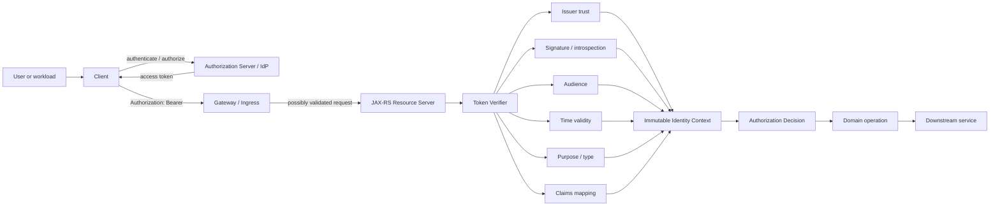
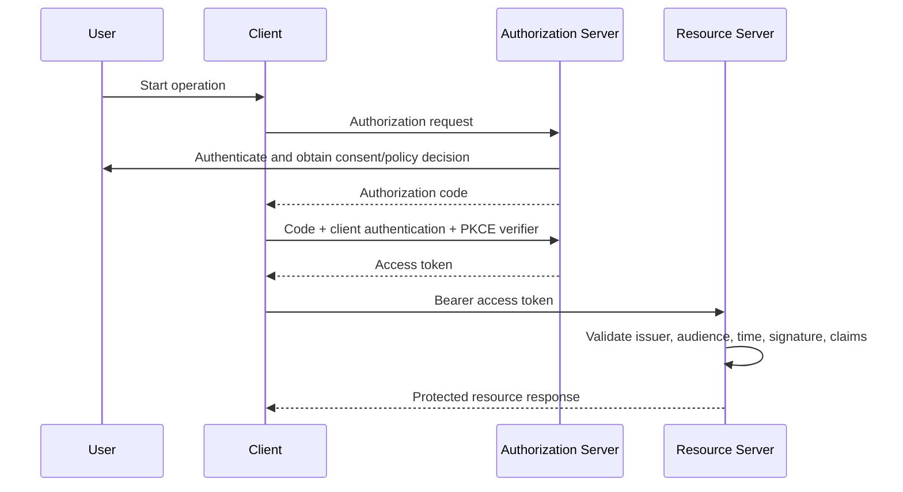
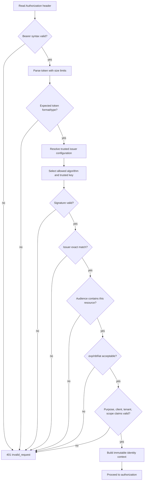
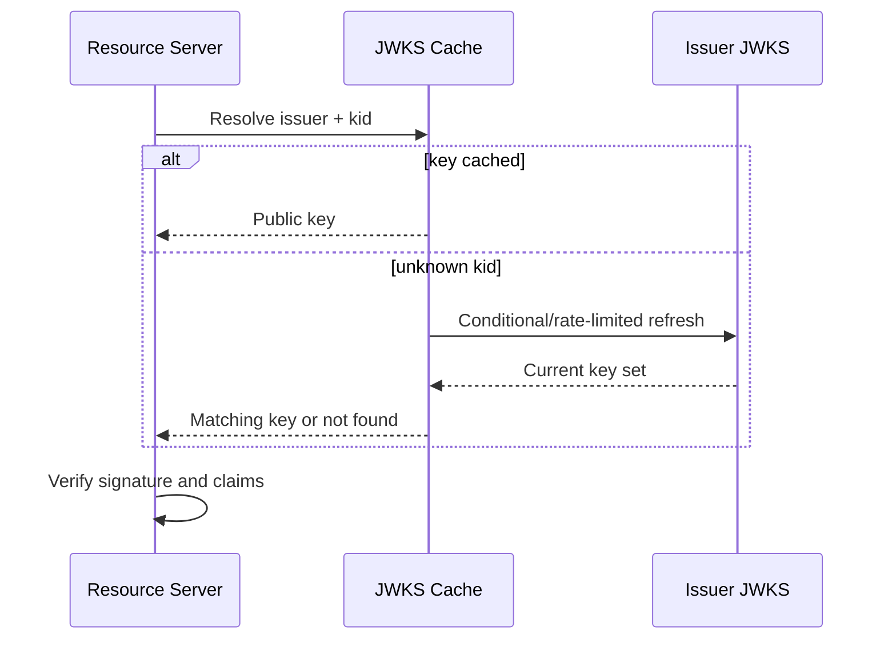
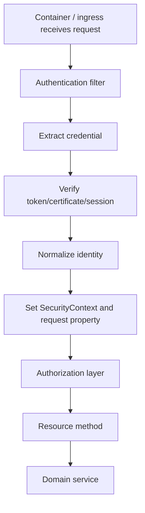

# Part 025 — Authentication, OAuth 2.0, OIDC, JWT, and Service Identity

> Authentication menjawab **siapa atau workload apa yang sedang berinteraksi**, bukan otomatis menjawab apa yang boleh dilakukannya. Dalam service enterprise, identity harus diperlakukan sebagai hasil verifikasi pada trust boundary: berasal dari issuer yang dipercaya, ditujukan untuk resource yang benar, masih valid pada waktu request, memiliki proof atau credential yang sesuai, dan dipropagasikan tanpa berubah makna. Decode JWT bukan authentication. Menerima header dari gateway bukan authentication. Memiliki `sub` claim bukan authorization.

## Daftar Isi

1. [Target kompetensi](#target-kompetensi)
2. [Scope dan baseline](#scope-dan-baseline)
3. [Standard versus implementation-specific boundary](#standard-versus-implementation-specific-boundary)
4. [Mental model: identity trust pipeline](#mental-model-identity-trust-pipeline)
5. [Terminology map](#terminology-map)
6. [Authentication, identity, authorization, dan delegation](#authentication-identity-authorization-dan-delegation)
7. [Actors dan trust boundaries](#actors-dan-trust-boundaries)
8. [OAuth 2.0 mental model](#oauth-20-mental-model)
9. [OAuth bukan authentication protocol](#oauth-bukan-authentication-protocol)
10. [OpenID Connect mental model](#openid-connect-mental-model)
11. [Access token versus ID token](#access-token-versus-id-token)
12. [OAuth grant dan flow selection](#oauth-grant-dan-flow-selection)
13. [Authorization Code dan PKCE](#authorization-code-dan-pkce)
14. [Client Credentials](#client-credentials)
15. [Refresh token](#refresh-token)
16. [Flow yang harus dihindari atau dibatasi](#flow-yang-harus-dihindari-atau-dibatasi)
17. [Bearer token threat model](#bearer-token-threat-model)
18. [Opaque token versus JWT access token](#opaque-token-versus-jwt-access-token)
19. [JWT structure dan JOSE boundary](#jwt-structure-dan-jose-boundary)
20. [JWT validation algorithm](#jwt-validation-algorithm)
21. [Algorithm allow-list dan key confusion](#algorithm-allow-list-dan-key-confusion)
22. [Issuer validation](#issuer-validation)
23. [Audience validation](#audience-validation)
24. [Time claims dan clock skew](#time-claims-dan-clock-skew)
25. [Subject, client, scope, role, dan tenant claims](#subject-client-scope-role-dan-tenant-claims)
26. [Token type dan purpose confusion](#token-type-dan-purpose-confusion)
27. [JWKS discovery dan key rotation](#jwks-discovery-dan-key-rotation)
28. [Opaque-token introspection](#opaque-token-introspection)
29. [Token revocation dan bounded staleness](#token-revocation-dan-bounded-staleness)
30. [Sender-constrained tokens, mTLS, dan DPoP](#sender-constrained-tokens-mtls-dan-dpop)
31. [Service identity dan workload identity](#service-identity-dan-workload-identity)
32. [User delegation versus service identity](#user-delegation-versus-service-identity)
33. [Token exchange dan on-behalf-of](#token-exchange-dan-on-behalf-of)
34. [Gateway validation versus service validation](#gateway-validation-versus-service-validation)
35. [JAX-RS authentication pipeline](#jax-rs-authentication-pipeline)
36. [SecurityContext](#securitycontext)
37. [Authentication filter example](#authentication-filter-example)
38. [Principal dan immutable identity context](#principal-dan-immutable-identity-context)
39. [Jakarta Security versus Jakarta REST](#jakarta-security-versus-jakarta-rest)
40. [Servlet-container integration](#servlet-container-integration)
41. [Service-to-service outbound token handling](#service-to-service-outbound-token-handling)
42. [Token propagation policy](#token-propagation-policy)
43. [Identity and tenant context](#identity-and-tenant-context)
44. [Session-based versus token-based authentication](#session-based-versus-token-based-authentication)
45. [Authentication assurance dan step-up](#authentication-assurance-dan-step-up)
46. [Error response semantics](#error-response-semantics)
47. [Logging, metrics, tracing, dan audit](#logging-metrics-tracing-dan-audit)
48. [Failure-model matrix](#failure-model-matrix)
49. [Debugging playbook](#debugging-playbook)
50. [Testing strategy](#testing-strategy)
51. [Architecture patterns](#architecture-patterns)
52. [Anti-patterns](#anti-patterns)
53. [PR review checklist](#pr-review-checklist)
54. [Trade-off yang harus dipahami senior engineer](#trade-off-yang-harus-dipahami-senior-engineer)
55. [Internal verification checklist](#internal-verification-checklist)
56. [Latihan verifikasi](#latihan-verifikasi)
57. [Ringkasan](#ringkasan)
58. [Referensi resmi](#referensi-resmi)

---

## Target kompetensi

Setelah menyelesaikan part ini, Anda harus mampu:

- membedakan authentication, identity, authorization, delegation, impersonation, dan service identity;
- menjelaskan actors dan trust boundaries OAuth 2.0 serta OpenID Connect;
- memilih flow OAuth berdasarkan client type, user interaction, dan deployment topology;
- membedakan access token, ID token, refresh token, authorization code, session cookie, API key, dan client credential;
- memvalidasi JWT sebagai security artifact, bukan hanya melakukan Base64 decode;
- memverifikasi issuer, audience, signature, algorithm, token type, expiry, not-before, scope, client, subject, dan tenant claims;
- memahami opaque token introspection, caching, revocation, dan bounded staleness;
- mendesain JWKS cache dan key-rotation behavior yang tidak membuat outage atau menerima key tidak dipercaya;
- membedakan bearer token dari sender-constrained token;
- memahami service identity melalui client credentials, mTLS, Kubernetes/cloud workload identity, atau equivalent mechanism;
- menentukan kapan user token boleh dipropagasikan dan kapan service harus memperoleh token baru;
- membentuk immutable identity context di JAX-RS melalui request filter dan `SecurityContext`;
- membedakan Jakarta REST `SecurityContext`, Servlet principal, Jakarta Security, Jersey integration, dan custom authentication middleware;
- mendesain failure response `401`, `403`, `WWW-Authenticate`, dan redaction secara benar;
- mengobservasi authentication tanpa mencatat raw token, secret, PII, atau cryptographic material;
- membuat test matrix untuk valid/invalid issuer, audience, signature, key rotation, clock skew, tenant, scope, dan service identity;
- mereview authentication architecture dari perspektif trust establishment, failure containment, key lifecycle, dan runtime ownership.

---

## Scope dan baseline

Baseline yang digunakan:

- Java 17+;
- Jakarta REST/JAX-RS resource server;
- Jersey atau implementation lain yang belum dikonfirmasi;
- Servlet, standalone runtime, atau Jakarta EE deployment;
- OAuth 2.0 protected resource;
- OpenID Connect untuk user authentication;
- JWT atau opaque access tokens;
- distributed services pada Kubernetes/cloud/on-prem;
- user-facing dan service-to-service calls;
- tenant-aware quote/order/catalog operations;
- OpenTelemetry dan structured logging dari Part 023;
- resilience boundaries dari Part 024.

Part ini tidak mengasumsikan bahwa internal system menggunakan:

- Keycloak, Okta, Auth0, Microsoft Entra ID, Ping, ForgeRock, atau IdP tertentu;
- JWT access token;
- one issuer untuk seluruh environment;
- gateway-only authentication;
- Jakarta Security;
- Servlet container authentication;
- Jersey `RolesAllowedDynamicFeature`;
- mTLS;
- service mesh identity;
- Kubernetes workload identity;
- OAuth token exchange;
- token introspection;
- refresh token pada backend;
- session cookie;
- one common claim model;
- propagation user token ke seluruh downstream services.

Seluruh hal tersebut harus diverifikasi melalui code, dependencies, gateway policy, identity-provider configuration, deployment manifest, certificate setup, secret store, cloud IAM, runbook, dan production telemetry.

---

## Standard versus implementation-specific boundary

| Area | Standard/protocol | Implementation-specific | Internal verification |
|---|---|---|---|
| OAuth authorization | OAuth 2.0 family of RFCs | IdP product and policies | Supported flows |
| User authentication | OpenID Connect | IdP login, MFA, federation | OIDC profile |
| JWT | RFC 7519 and JOSE family | JWT library configuration | Allowed algorithms |
| JWT access token profile | RFC 9068 when adopted | Issuer claim mapping | Token profile |
| Bearer usage | RFC 6750 | Gateway/client behavior | Header and error policy |
| Introspection | RFC 7662 | Endpoint SLA/cache | Opaque-token validation |
| Revocation | RFC 7009 | Propagation delay | Revocation semantics |
| mTLS-bound token | RFC 8705 | PKI/service mesh | Certificate ownership |
| DPoP | RFC 9449 | Client and issuer support | Whether supported |
| JAX-RS identity access | `jakarta.ws.rs.core.SecurityContext` | Filter/container integration | Actual principal source |
| Jakarta authentication APIs | Jakarta Security | Container/provider | Whether runtime supports it |
| Declarative roles | Jakarta Annotations | Container/Jersey feature | Enforcement mechanism |
| Workload identity | Cloud/Kubernetes platform | AWS/Azure/on-prem implementation | Actual credential chain |

Key principle:

> Protocol menentukan bentuk dan validation requirements. Produk identity menentukan issuance policy. Application tetap bertanggung jawab memastikan token memang cocok untuk resource, operation, tenant, dan trust boundary yang sedang diproses.

---

## Mental model: identity trust pipeline



Authentication pipeline harus menghasilkan identity context yang:

- berasal dari trust source yang diketahui;
- memiliki semantics yang stabil;
- immutable selama request;
- terikat pada tenant dan client context yang tepat;
- tidak membawa raw token lebih jauh daripada yang diperlukan;
- dapat diaudit tanpa menyimpan credential.

---

## Terminology map

| Istilah | Makna |
|---|---|
| Subject | Entity yang direpresentasikan token, sering dalam claim `sub` |
| Principal | Representasi identity pada runtime/application |
| Resource owner | Entity yang dapat memberi akses ke protected resource |
| Client | Aplikasi yang meminta access token dan memanggil resource |
| Authorization server | Server yang menerbitkan token |
| Resource server | API yang menerima dan memvalidasi access token |
| Identity provider | Sistem yang melakukan user authentication dan identity federation |
| Access token | Credential untuk mengakses protected resource |
| ID token | Assertion OIDC mengenai authentication event dan end-user |
| Refresh token | Credential untuk memperoleh access token baru |
| Scope | Delegated access vocabulary pada OAuth |
| Role | Organizational/application grouping of permissions |
| Audience | Resource yang dimaksud menerima token |
| Issuer | Authority yang menerbitkan token |
| Client ID | Identifier OAuth client |
| Workload identity | Identity untuk application/process/pod/service |
| Delegation | Service bertindak dengan authority yang berasal dari user/client |
| Impersonation | Actor bertindak sebagai identity lain, biasanya dengan audit khusus |
| Federation | Trust antara identity domains |
| Proof-of-possession | Bukti presenter memiliki key tertentu |
| Bearer token | Siapa pun yang memegang token dapat menggunakannya |
| JWKS | Set public keys untuk verifikasi JOSE signature |

---

## Authentication, identity, authorization, dan delegation

| Pertanyaan | Concern |
|---|---|
| Siapa yang berinteraksi? | Authentication |
| Identity apa yang dibentuk? | Identity modelling |
| Apa yang boleh dilakukan? | Authorization |
| Atas nama siapa operation dilakukan? | Delegation |
| Siapa yang sebenarnya mengeksekusi? | Actor/service identity |
| Siapa yang dampaknya ditanggung? | Tenant/customer context |
| Seberapa kuat authentication event? | Assurance |
| Dari mana trust berasal? | Issuer/federation/PKI |

Contoh:

```text
User: Alice
Client: Quote UI
Actor service: quote-api
Target resource: order-api
Tenant: operator-A
Delegated authority: quote:submit
Authentication method: MFA
```

Satu request dapat membawa beberapa identity dimensions sekaligus. Menggabungkannya menjadi satu string `username` menghilangkan informasi penting untuk authorization dan audit.

---

## Actors dan trust boundaries

OAuth melibatkan minimal:

- resource owner;
- client;
- authorization server;
- resource server.

OpenID Connect menambahkan identity semantics di atas OAuth untuk client yang perlu mengetahui authenticated end-user.

Dalam microservices, terdapat trust boundaries tambahan:

- browser/mobile to gateway;
- gateway to backend;
- backend to backend;
- pod to cloud API;
- service to database;
- event producer to broker;
- consumer to domain operation;
- support/admin tools to production services.

Setiap boundary membutuhkan jawaban:

1. Credential apa yang diterima?
2. Siapa issuer-nya?
3. Untuk audience apa?
4. Apakah bearer atau sender-constrained?
5. Bagaimana replay dibatasi?
6. Bagaimana key/secret/certificate diputar?
7. Bagaimana failure terlihat?
8. Bagaimana audit membedakan user, client, service, dan tenant?

---

## OAuth 2.0 mental model

OAuth 2.0 adalah framework untuk delegated access. Client memperoleh access token dari authorization server untuk memanggil protected resource.



Access token merupakan delegated authorization artifact. Token tidak selalu menyatakan bahwa user sedang login ke resource server dan tidak selalu berformat JWT.

---

## OAuth bukan authentication protocol

Kesalahan umum:

```text
"We use OAuth, therefore the user is authenticated."
```

OAuth tidak mendefinisikan standard identity assertion untuk client. OpenID Connect menambahkan ID token, user-info semantics, nonce, authentication context, dan issuer/client validation untuk authentication.

Resource server umumnya:

- menerima access token;
- tidak menerima ID token sebagai API access credential;
- tidak menggunakan authorization code;
- tidak menggunakan refresh token untuk authorizing API request.

---

## OpenID Connect mental model

OIDC adalah identity layer di atas OAuth 2.0.

Client menggunakan OIDC untuk:

- memulai user authentication;
- menerima ID token;
- memverifikasi authentication result;
- memperoleh standard claims;
- membentuk application session.

Resource server menggunakan access token untuk API access. Ia boleh memakai claims yang dikontrak dalam access token, tetapi tidak boleh mengganti access token dengan ID token hanya karena keduanya JWT.

---

## Access token versus ID token

| Aspect | Access token | ID token |
|---|---|---|
| Consumer utama | Resource server | OIDC client |
| Purpose | API access | Authentication assertion |
| Audience | Protected resource/API | Client ID |
| Content | Opaque atau JWT | JWT |
| Should be sent to API | Ya, jika API adalah audience | Umumnya tidak |
| Used for login session | Tidak langsung | Ya, oleh OIDC client |
| Authorization data | Scope/claims sesuai profile | Bukan API permission contract |

Purpose confusion adalah vulnerability: token yang valid secara cryptographic belum tentu valid untuk endpoint tersebut.

---

## OAuth grant dan flow selection

| Scenario | Typical flow | Key concerns |
|---|---|---|
| Browser/server-side web app | Authorization Code + PKCE | redirect URI, state, nonce, session |
| SPA/public client | Authorization Code + PKCE | browser storage, BFF option |
| Native app | Authorization Code + PKCE | system browser, claimed HTTPS redirect |
| Machine-to-machine | Client Credentials or workload identity | service identity, secretless preference |
| Device without browser | Device Authorization Grant when supported | phishing and polling controls |
| Delegated downstream | Token exchange/on-behalf-of when supported | audience narrowing, actor chain |

Flow harus dipilih berdasarkan actual client type dan threat model, bukan karena library template.

---

## Authorization Code dan PKCE

PKCE mengikat authorization request dengan token exchange melalui verifier/challenge. Untuk public clients, tidak ada client secret yang dapat dianggap rahasia.

Validation dan design concerns:

- exact redirect URI matching;
- `state` untuk request/response correlation dan CSRF defense;
- OIDC `nonce` untuk ID-token replay protection;
- PKCE dengan secure challenge method;
- authorization code single-use dan short-lived;
- browser history/query leakage;
- session fixation;
- mix-up dan issuer confusion;
- trusted callback routing.

Backend API biasanya tidak mengimplementasikan login flow sendiri kecuali berperan sebagai OIDC client/BFF.

---

## Client Credentials

Client Credentials cocok ketika service bertindak atas nama dirinya sendiri, bukan user.

Access token seharusnya merepresentasikan:

- client/service identity;
- permitted scopes/audience;
- environment/tenant constraints jika relevan;
- assurance atau credential method jika digunakan policy.

Jangan memalsukan `sub` user untuk machine identity. Audit harus membedakan:

```text
actor = pricing-service
subject = pricing-service
delegated-user = none
```

Secret-based client authentication memiliki operational cost:

- distribution;
- rotation;
- accidental logging;
- environment leakage;
- shared-secret reuse.

Workload identity atau asymmetric credential sering lebih aman bila platform mendukung.

---

## Refresh token

Refresh token:

- diterima dan digunakan oleh OAuth client;
- tidak dikirim ke resource server sebagai access credential;
- harus disimpan dengan protection lebih tinggi daripada short-lived access token;
- dapat dirotasi;
- dapat terikat pada client;
- perlu replay detection bila rotation dipakai.

Backend resource server seharusnya tidak menerima refresh token pada `Authorization` header.

---

## Flow yang harus dihindari atau dibatasi

Modern OAuth security guidance menolak atau membatasi beberapa mode lama, terutama bila alternatif lebih aman tersedia.

Review khusus:

- implicit grant;
- resource owner password credentials;
- bearer token di URL query;
- open redirectors;
- wildcard redirect URI;
- shared client credentials antar-service;
- refresh token tanpa rotation untuk public client;
- long-lived access token;
- one token valid untuk semua audiences;
- client yang menerima tokens melalui insecure front channel.

Keputusan aktual tetap harus mengikuti IdP/platform policy internal.

---

## Bearer token threat model

Bearer token memberi akses kepada siapa pun yang memegangnya.

Threats:

- log leakage;
- browser storage theft;
- proxy/header capture;
- crash dump exposure;
- token replay;
- forwarding ke wrong audience;
- test token digunakan di environment lain;
- support tooling menyalin production token;
- token dimasukkan ke URL;
- exception message mencetak header;
- telemetry exporter membawa raw credential.

Controls:

- TLS end-to-end pada trust boundary;
- short lifetime;
- minimal audience/scope;
- redaction;
- no URL tokens;
- secure secret/token storage;
- sender-constrained token bila justified;
- bounded propagation;
- key/certificate rotation;
- anomaly detection.

---

## Opaque token versus JWT access token

### Opaque token

Resource server tidak menafsirkan token secara lokal. Ia melakukan introspection atau menggunakan gateway/trusted validation service.

Kelebihan:

- revocation/update lebih cepat;
- token content tidak terlihat client;
- policy dapat dipusatkan.

Trade-off:

- network dependency;
- introspection latency;
- caching staleness;
- authorization-server availability;
- throughput load.

### JWT access token

Resource server memverifikasi secara lokal.

Kelebihan:

- low-latency local validation;
- tidak membutuhkan introspection per request;
- cocok untuk distributed resource servers.

Trade-off:

- revocation tidak instan;
- claim contract coupling;
- key rotation/JWKS complexity;
- token size;
- stale role/tenant data;
- wrong-audience acceptance jika validation lemah.

---

## JWT structure dan JOSE boundary

JWT compact representation memiliki tiga logical segments:

```text
BASE64URL(header).BASE64URL(payload).BASE64URL(signature)
```

Decode hanya menghasilkan bytes/JSON. Trust baru terbentuk setelah:

- accepted JOSE algorithm dipilih secara aman;
- signing key berasal dari trusted issuer;
- signature valid;
- issuer/audience/time/purpose valid;
- claims memenuhi resource-server contract.

Jangan mengambil algorithm secara bebas dari untrusted header lalu menganggapnya policy.

---

## JWT validation algorithm

Recommended validation pipeline:



Implementation requirements:

1. Bound input size.
2. Reject malformed token.
3. Resolve issuer from trusted configuration, not arbitrary network location.
4. Allow-list algorithms.
5. Validate cryptographic signature.
6. Exact-match issuer.
7. Validate audience for the current API.
8. Validate temporal claims with bounded skew.
9. Validate token type/purpose/profile.
10. Validate required claims and types.
11. Map to normalized identity model.
12. Never log token.

---

## Algorithm allow-list dan key confusion

Avoid:

- accepting `none`;
- algorithm fallback;
- algorithm selected solely from header;
- HMAC/RSA confusion;
- accepting keys embedded in untrusted header without policy;
- fetching arbitrary `jku`/URL from token;
- accepting weak or unexpected key type;
- one library configuration for ID token and access token without purpose separation.

Policy should be issuer-specific and explicit:

```java
public record JwtTrustPolicy(
        URI issuer,
        Set<String> audiences,
        Set<String> allowedAlgorithms,
        Duration clockSkew,
        Set<String> requiredClaims
) {}
```

---

## Issuer validation

Issuer identifies trust authority. Validation should be exact and environment-specific.

Failure examples:

- production API accepts staging issuer;
- multi-issuer API maps same `sub` across issuers as same user;
- trailing slash normalization changes semantics;
- issuer from token is used to construct unrestricted discovery URL;
- federation metadata not validated;
- tenant-specific issuer accepted without tenant policy.

Stable identity key often needs composite form:

```text
(issuer, subject)
```

not `subject` alone.

---

## Audience validation

Audience tells where token is intended to be used.

A token for:

```text
catalog-api
```

must not automatically be accepted by:

```text
order-api
```

even if:

- same issuer;
- same signing key;
- same user;
- valid signature;
- overlapping scopes.

Audience validation prevents token forwarding and confused-deputy problems.

For multi-audience tokens, explicitly confirm policy. Broad audiences reduce isolation.

---

## Time claims dan clock skew

Important claims:

- `exp`: expiration;
- `nbf`: not valid before;
- `iat`: issued at;
- optional authentication-time claims.

Clock skew exists because clocks are imperfect, but skew must be bounded. Excessive tolerance extends token lifetime and may hide NTP failures.

Operational requirements:

- synchronized clocks;
- metrics for expired/not-yet-valid tokens;
- no logging raw token;
- distinguish clock skew from key/issuer failure;
- exact policy for missing `exp`;
- reject absurd future `iat` when profile requires;
- use `Clock` abstraction in tests.

---

## Subject, client, scope, role, dan tenant claims

Claims must have documented semantics.

| Claim concept | Question |
|---|---|
| Subject | Whose identity is represented? |
| Client | Which OAuth client obtained/presents token? |
| Actor | Which service is currently executing? |
| Scope | What delegated access categories were granted? |
| Role | Which organizational/application grouping applies? |
| Tenant | Which customer/security partition applies? |
| Authentication context | How was user authenticated? |
| Entitlement | Is it stable enough to embed in token? |

Avoid:

- using display name/email as stable identity;
- treating scope as role without contract;
- trusting tenant header over verified token;
- using mutable catalog/product data as token claims;
- token with thousands of fine-grained permissions;
- claim names with undocumented issuer-specific meaning.

---

## Token type dan purpose confusion

Several security artifacts may all be JWTs:

- ID token;
- access token;
- client assertion;
- logout token;
- token-exchange subject token;
- DPoP proof;
- custom signed message.

Validation must be purpose-specific:

```text
expected issuer
expected audience
expected typ/profile
required claims
allowed algorithm
replay requirements
key source
```

A generic `verifyJwt(String)` method that returns claims for every token type is dangerous.

---

## JWKS discovery dan key rotation

Resource servers often use issuer metadata/JWKS to obtain public keys.

Robust behavior:

- issuer configuration allow-listed;
- HTTPS and certificate validation;
- bounded connection/read timeout;
- cache keys;
- honor reasonable cache behavior;
- refresh on unknown `kid` with rate limiting;
- keep previous keys during overlap when issuer does;
- avoid refresh storm;
- do not accept token merely because `kid` matches;
- fail closed for unknown/untrusted issuer;
- expose cache age, refresh failures, and active-key metrics.



Do not fetch arbitrary key URLs from every request.

---

## Opaque-token introspection

Introspection returns active state and token metadata from authorization server.

Questions:

- How is resource server authenticated to introspection endpoint?
- What is timeout?
- Is response cached?
- What is cache key and TTL?
- How quickly must revocation take effect?
- What happens when authorization server is unavailable?
- Is fail-open ever permitted?
- How are scopes/audience/tenant validated?
- Is negative response cached?
- How is introspection protected from amplification?

Default security posture for authentication uncertainty is fail closed, but availability implications must be designed explicitly.

---

## Token revocation dan bounded staleness

JWT validation is often locally valid until expiry. Revoking account/session does not necessarily invalidate all JWTs immediately.

Options:

- short-lived access tokens;
- refresh-token revocation;
- introspection;
- revocation list;
- security-event propagation;
- per-user/session version;
- token binding;
- critical-operation re-check;
- step-up authentication.

Every approach introduces state, latency, consistency, or availability trade-offs.

Document:

```text
maximum accepted stale authorization duration
maximum stale tenant membership duration
maximum stale role duration
emergency account disable behavior
```

---

## Sender-constrained tokens, mTLS, dan DPoP

Bearer token can be replayed by whoever steals it. Sender-constrained token binds token use to a key.

### mTLS

Possible uses:

- authenticate OAuth client to token endpoint;
- bind token to client certificate;
- authenticate service connection.

Operational costs:

- certificate issuance;
- rotation;
- trust bundles;
- identity mapping;
- proxy termination;
- certificate forwarding;
- clock/expiry;
- private-key protection.

### DPoP

Application-layer proof binds token presentation to a key and HTTP request properties. It requires replay controls and coordinated support from client, authorization server, and resource server.

Do not claim mTLS or DPoP protection if TLS terminates at a proxy and the backend cannot verify the relevant binding.

---

## Service identity dan workload identity

Service identity should answer:

```text
Which deployed workload is calling?
Which environment/cluster/namespace/service account?
Which credential or key proves it?
Which audience is being requested?
Which policy grants access?
```

Mechanisms may include:

- OAuth client credentials;
- mTLS certificate identity;
- Kubernetes service account federation;
- AWS IAM roles for service accounts or equivalent;
- Azure workload identity or equivalent;
- SPIFFE/SPIRE or service mesh identity;
- cloud instance/pod metadata credential chain;
- signed workload assertions.

Prefer short-lived, automatically rotated credentials over static secrets when platform support and operational maturity exist.

---

## User delegation versus service identity

A downstream request may need:

1. service-only identity;
2. delegated user authority;
3. both service actor and user subject.

Bad model:

```text
Authorization: original-user-token forwarded everywhere
```

Risks:

- wrong audience;
- excessive privilege;
- leakage across trust boundaries;
- downstream cannot distinguish caller service;
- token lifetime exceeds operation;
- brittle coupling to external issuer claims.

Better model when supported:

```text
actor = quote-api
subject = user-123
audience = order-api
scope = order:create
tenant = tenant-A
```

Use token exchange/on-behalf-of only when architecture and IdP support are verified.

---

## Token exchange dan on-behalf-of

Token exchange can narrow or transform authority for downstream audience.

Key questions:

- original subject;
- current actor;
- target audience;
- requested scope;
- delegation depth;
- tenant binding;
- audit chain;
- replay and lifetime;
- whether downstream trusts exchange issuer;
- whether original token is retained.

Token exchange is not permission escalation. The issued token should not exceed original authority plus policy granted to actor.

---

## Gateway validation versus service validation

### Gateway-only validation

Benefits:

- centralized controls;
- reduced duplicate implementation;
- edge rejection.

Risks:

- bypass route;
- internal traffic assumed trusted;
- claims forwarded in spoofable headers;
- service cannot validate audience;
- gateway configuration drift;
- lateral movement after compromise.

### Service validation

Benefits:

- local enforcement;
- audience/purpose awareness;
- defense in depth.

Costs:

- duplicated config;
- key refresh load;
- library/version drift.

Common model:

- gateway validates edge concerns;
- service validates token or cryptographically protected identity assertion relevant to its trust boundary;
- network policy prevents bypass;
- forwarded identity headers are stripped and re-created by trusted proxy;
- service knows which proxy identity may assert them.

---

## JAX-RS authentication pipeline



Authentication should happen before domain operation and before sensitive request data is logged.

---

## SecurityContext

Jakarta REST `SecurityContext` exposes:

- `getUserPrincipal()`;
- `isUserInRole(String)`;
- `isSecure()`;
- `getAuthenticationScheme()`.

It is an access interface, not a complete authentication framework.

A custom implementation may wrap normalized identity:

```java
public record ServicePrincipal(
        String stableId,
        String issuer,
        String subject,
        String clientId,
        String tenantId
) implements java.security.Principal {
    @Override
    public String getName() {
        return stableId;
    }
}
```

Do not encode every permission in `Principal#getName()`.

---

## Authentication filter example

The following is structural example, not internal CSG implementation:

```java
package example.security;

import jakarta.annotation.Priority;
import jakarta.ws.rs.Priorities;
import jakarta.ws.rs.container.ContainerRequestContext;
import jakarta.ws.rs.container.ContainerRequestFilter;
import jakarta.ws.rs.core.HttpHeaders;
import jakarta.ws.rs.core.Response;
import jakarta.ws.rs.core.SecurityContext;
import jakarta.ws.rs.ext.Provider;

import java.security.Principal;

@Provider
@Priority(Priorities.AUTHENTICATION)
public final class BearerAuthenticationFilter implements ContainerRequestFilter {

    private final AccessTokenVerifier verifier;

    public BearerAuthenticationFilter(AccessTokenVerifier verifier) {
        this.verifier = verifier;
    }

    @Override
    public void filter(ContainerRequestContext request) {
        String authorization = request.getHeaderString(HttpHeaders.AUTHORIZATION);

        if (authorization == null || !authorization.startsWith("Bearer ")) {
            abortUnauthorized(request, "invalid_request");
            return;
        }

        String token = authorization.substring("Bearer ".length()).trim();

        try {
            VerifiedIdentity identity = verifier.verify(token);
            SecurityContext original = request.getSecurityContext();

            request.setSecurityContext(new VerifiedSecurityContext(
                    identity,
                    original != null && original.isSecure()
            ));
            request.setProperty(VerifiedIdentity.class.getName(), identity);
        } catch (InvalidTokenException exception) {
            abortUnauthorized(request, "invalid_token");
        }
    }

    private static void abortUnauthorized(
            ContainerRequestContext request,
            String error
    ) {
        request.abortWith(Response.status(Response.Status.UNAUTHORIZED)
                .header(
                        HttpHeaders.WWW_AUTHENTICATE,
                        "Bearer realm=\"quote-order\", error=\"" + error + "\""
                )
                .build());
    }

    private record VerifiedSecurityContext(
            VerifiedIdentity identity,
            boolean secure
    ) implements SecurityContext {

        @Override
        public Principal getUserPrincipal() {
            return identity.principal();
        }

        @Override
        public boolean isUserInRole(String role) {
            return identity.roles().contains(role);
        }

        @Override
        public boolean isSecure() {
            return secure;
        }

        @Override
        public String getAuthenticationScheme() {
            return "Bearer";
        }
    }
}
```

Production requirements omitted from simple example:

- token/header size limit;
- endpoint allow-list for anonymous access;
- exact trust policy;
- redacted error handling;
- metrics;
- key refresh control;
- tenant validation;
- normalized claim types;
- request context cleanup;
- authorization separation.

---

## Principal dan immutable identity context

A normalized identity model may include:

```java
public record VerifiedIdentity(
        Principal principal,
        String issuer,
        String subject,
        String clientId,
        String actorId,
        String tenantId,
        Set<String> scopes,
        Set<String> roles,
        Instant issuedAt,
        Instant expiresAt,
        String tokenId,
        AuthenticationAssurance assurance
) {
    public VerifiedIdentity {
        scopes = Set.copyOf(scopes);
        roles = Set.copyOf(roles);
    }
}
```

Do not expose raw token through this object.

Identity context should be:

- immutable;
- request-scoped;
- created once after verification;
- type-safe;
- explicit about missing user versus service;
- safe for structured audit;
- propagated deliberately to async work;
- not stored in static mutable state.

---

## Jakarta Security versus Jakarta REST

Jakarta REST defines `SecurityContext`, filters, priorities, and request pipeline. It does not by itself define complete OAuth/OIDC validation.

Jakarta Security provides container-oriented authentication and identity-store APIs in Jakarta EE environments.

Possible deployments:

- standalone Jersey with custom/library OAuth filter;
- Servlet container with authentication filter;
- Jakarta EE server using Jakarta Security;
- gateway plus backend verification;
- service mesh mTLS plus OAuth application identity.

Never assume Jakarta Security exists merely because packages use `jakarta.*`.

---

## Servlet-container integration

Servlet container may establish:

- `HttpServletRequest#getUserPrincipal()`;
- roles;
- authentication scheme;
- client certificate;
- session identity.

JAX-RS runtime may expose this via `SecurityContext`.

Questions:

- Which filter runs first?
- Are forwarded headers trusted?
- Is TLS terminated before container?
- Is client certificate available?
- Is request principal immutable?
- Are servlet and JAX-RS roles consistent?
- Can internal path bypass authentication filter?
- Does async dispatch preserve principal?

---

## Service-to-service outbound token handling

Outbound client needs clear token source:

- obtain service token from token endpoint;
- use workload identity to get audience-specific token;
- exchange inbound token;
- propagate inbound token only when contract allows;
- use mTLS without OAuth for certain internal boundaries;
- use cloud SDK credential provider.

Token provider concerns:

- cache by audience/scope/tenant/actor;
- refresh before expiry with jitter;
- single-flight refresh;
- bounded wait;
- failure handling;
- no static global token without key dimensions;
- no log token;
- invalidate on authentication failure carefully;
- avoid refresh stampede.

```java
public interface AccessTokenProvider {
    AccessToken get(TokenRequest request);
}

public record TokenRequest(
        URI audience,
        Set<String> scopes,
        String tenantId,
        DelegationContext delegation
) {}
```

---

## Token propagation policy

Create an explicit matrix:

| Inbound identity | Downstream need | Strategy |
|---|---|---|
| User token for quote-api | Downstream only needs service authority | Obtain service token |
| User token for quote-api | Downstream must act for user | Exchange to downstream audience |
| Service token | Same audience and trusted boundary | Possibly reuse, if contract permits |
| External token | Internal service | Never blindly forward |
| Support impersonation | Sensitive downstream | Preserve actor + subject + reason |
| Async event | Later processing | Persist stable actor/subject/audit context, not raw token |

Raw access token should generally not be stored in database or Kafka event.

---

## Identity and tenant context

Tenant should be derived from trusted identity/policy and reconciled with route/body/resource.

Example invariant:

```text
token.tenant == route.tenant == loadedEntity.tenant
```

When mismatch occurs:

- reject before domain mutation;
- do not log sensitive entity data;
- emit security audit;
- avoid revealing existence across tenant boundary.

A tenant header supplied by client is routing input, not trust source, unless cryptographically or gateway-protected by verified architecture.

---

## Session-based versus token-based authentication

### Session cookie

Strengths:

- server-side revocation;
- smaller client credential;
- centralized session state.

Risks:

- CSRF;
- cookie scope/domain;
- session fixation;
- distributed session storage;
- idle/absolute timeout;
- load-balancer/proxy behavior.

### Access token

Strengths:

- protocol interoperability;
- service-oriented audience/scope;
- local validation option.

Risks:

- bearer theft;
- revocation lag;
- token storage;
- claim staleness;
- propagation misuse.

Hybrid/BFF architectures may use secure browser session while backend calls APIs using access tokens.

---

## Authentication assurance dan step-up

Some operations require stronger authentication:

- approve high-value quote;
- override price;
- cancel activated order;
- access sensitive customer data;
- support impersonation;
- rotate credentials.

Claims may describe authentication context or time. Resource server must know policy semantics rather than compare arbitrary strings.

Step-up requires coordinated client/authorization-server/resource-server behavior. A `403` alone may not communicate that stronger authentication is needed unless a defined challenge protocol/profile is used.

---

## Error response semantics

### `401 Unauthorized`

Use when authentication credentials are missing, invalid, expired, wrong issuer/audience, or otherwise unacceptable.

Include appropriate `WWW-Authenticate` challenge without leaking secrets.

### `403 Forbidden`

Use when authentication succeeded but authority is insufficient.

### `404 Not Found`

May be used by authorization policy to conceal resource existence, but must be consistent and documented.

Avoid returning:

- signing-key details;
- full token claims;
- exact account status;
- internal issuer URLs;
- stack traces;
- raw introspection response.

---

## Logging, metrics, tracing, dan audit

Never log:

- raw access token;
- refresh token;
- authorization code;
- client secret;
- private key;
- session cookie;
- DPoP proof;
- complete certificate chain unless explicitly sanitized;
- full sensitive claims.

Safe dimensions may include:

- normalized issuer identifier;
- audience identifier;
- client ID if approved;
- token validation outcome category;
- key ID only if non-sensitive and useful;
- authentication scheme;
- assurance level;
- tenant ID according to logging policy;
- trace ID;
- hashed/stable subject if approved.

Metrics:

```text
auth_requests_total{outcome,issuer,scheme}
auth_failures_total{reason}
jwks_refresh_total{outcome}
jwks_cache_age_seconds
token_introspection_seconds
token_introspection_failures_total
token_expiry_remaining_seconds
```

Avoid subject/user IDs as metric labels.

---

## Failure-model matrix

| Failure | Effect | Detection | Containment |
|---|---|---|---|
| Wrong audience accepted | Cross-service privilege | Security test/audit | Exact audience validation |
| Staging issuer accepted in prod | Environment trust breach | Config review | Issuer allow-list |
| Unknown `kid` causes refresh storm | IdP/JWKS overload | Refresh metrics | Single-flight/rate limit |
| JWKS unavailable | New-key tokens fail | Cache/refresh alerts | Cached overlap and timeout |
| Excessive clock skew | Expired token accepted | Policy tests | Bounded skew/NTP |
| Token logged | Credential compromise | DLP/log review | Redaction/no raw token |
| Gateway header spoofing | Identity forgery | Pen test | Strip/rewrite + network trust |
| User token forwarded to wrong API | Confused deputy | Audience rejection | Token exchange/new token |
| Role claims stale | Excess privilege | Revocation tests | Short TTL/re-check |
| Introspection outage | Auth outage | Dependency metrics | Cache/fail-closed policy |
| Shared client secret leaked | Service impersonation | Secret scan/audit | Rotation/workload identity |
| Async task loses identity | Incorrect audit/auth | Integration tests | Explicit context capture |
| Tenant claim mismatch ignored | Cross-tenant access | Isolation tests | Boundary invariant |
| ID token accepted as access token | Purpose confusion | Negative tests | Token profile validation |

---

## Debugging playbook

### Symptom: every request returns `401`

Check in order:

1. Authorization header reaches application.
2. Proxy does not strip it.
3. Expected scheme and whitespace.
4. Issuer exact value.
5. Audience.
6. system clock/NTP.
7. JWKS URL/network/TLS.
8. `kid` present in cached keys.
9. algorithm allow-list.
10. token type/profile.
11. environment-specific configuration.
12. gateway and service use same trust contract.

### Symptom: only newly issued tokens fail

Likely key rotation/JWKS cache:

- inspect unknown-`kid` metric;
- inspect JWKS refresh;
- compare active issuer keys;
- check cache TTL and conditional refresh;
- verify egress/DNS/TLS;
- ensure old and new keys overlap.

### Symptom: token valid at gateway but rejected by service

Possible causes:

- different audience policy;
- gateway validates only signature;
- service expects different issuer URL;
- header transformed;
- clock skew;
- token exchange missing;
- gateway forwards identity headers instead of token;
- service not configured to trust gateway assertion.

### Symptom: authorization works synchronously but fails in executor

Check:

- identity stored in ThreadLocal only;
- context not captured;
- request-scoped object accessed after request;
- token expired before delayed work;
- raw token incorrectly reused;
- async work should use persisted identity snapshot/service credential.

### Symptom: intermittent `401` near expiry

Check:

- token refresh race;
- clocks;
- network latency;
- token provider refresh margin;
- multiple replicas with different clocks;
- client retries with same expired token;
- cache keyed incorrectly.

---

## Testing strategy

### JWT validation matrix

Test:

- valid token;
- malformed compact serialization;
- invalid Base64;
- unsupported algorithm;
- `none`;
- wrong key;
- unknown `kid`;
- key rotation overlap;
- wrong issuer;
- wrong audience;
- missing audience;
- expired token;
- not-yet-valid token;
- future issued-at;
- missing required claim;
- wrong claim type;
- wrong token type;
- ID token presented as access token;
- tenant mismatch;
- duplicated/ambiguous claims according to library behavior;
- oversized token.

### Introspection tests

- active token;
- inactive token;
- timeout;
- 5xx;
- invalid response;
- cache hit;
- revocation before TTL;
- credential failure;
- concurrency storm;
- fail-closed behavior.

### Integration tests

- gateway path and direct path;
- Servlet/JAX-RS context mapping;
- async dispatch;
- service-to-service token acquisition;
- token exchange;
- workload identity;
- mTLS rotation;
- multi-issuer behavior;
- production-like proxy header handling.

### Security tests

- header spoofing;
- duplicate Authorization headers;
- URL/query token;
- logging leakage;
- audience confusion;
- issuer confusion;
- algorithm confusion;
- replay where applicable;
- cross-tenant token.

---

## Architecture patterns

### Pattern 1 — Local JWT validation

```text
Issuer metadata + JWKS cache
          ↓
JAX-RS authentication filter
          ↓
Normalized identity context
          ↓
Authorization service
```

Use when local validation latency and availability are important and bounded revocation lag is acceptable.

### Pattern 2 — Opaque token introspection with cache

```text
Token
  ↓
Introspection cache
  ↓ miss
Authorization server
```

Use when centralized state/revocation outweighs network dependency.

### Pattern 3 — Gateway plus service defense in depth

```text
External token
  ↓
Gateway validation
  ↓
Original token or protected internal assertion
  ↓
Service audience/identity validation
```

### Pattern 4 — Workload identity for cloud access

```text
Pod service account
  ↓ federation
Cloud STS / identity platform
  ↓ short-lived credential
Cloud API
```

### Pattern 5 — Audience-narrowed delegation

```text
Inbound user token for quote-api
  ↓ token exchange
Downstream token for order-api
```

---

## Anti-patterns

- Decode JWT and trust payload.
- Validate signature but not issuer/audience.
- Accept any issuer that exposes JWKS.
- Use token `sub` as globally unique without issuer.
- Accept ID token at API.
- Use email as immutable identity.
- Store raw access token in database/event.
- Log `Authorization` header.
- Forward inbound token to every downstream.
- Put static client secret in source or image.
- Use one broad token for every service.
- Trust tenant header over verified identity.
- Treat gateway validation as proof when bypass exists.
- Fetch arbitrary `jku` from token.
- Refresh JWKS on every unknown key without rate limit.
- Fail open when introspection is unavailable without explicit risk approval.
- Put permission-sensitive business state permanently in long-lived token.
- Use ThreadLocal identity without cleanup.
- Return cryptographic validation details to client.

---

## PR review checklist

### Trust establishment

- [ ] Trusted issuers are explicit and environment-specific.
- [ ] Audience is validated for this service.
- [ ] Algorithm/key policy is allow-listed.
- [ ] Token purpose/type is validated.
- [ ] Temporal claims use bounded skew.
- [ ] Required claims and types are validated.
- [ ] Stable identity uses issuer + subject where needed.

### JAX-RS integration

- [ ] Authentication happens before authorization/domain mutation.
- [ ] Filter priority/order is explicit.
- [ ] Anonymous endpoints are explicit, not accidental.
- [ ] `SecurityContext` is immutable and request-scoped.
- [ ] Async execution captures only required identity context.
- [ ] Raw token is not exposed to domain objects.

### Key and credential lifecycle

- [ ] JWKS refresh is bounded and observable.
- [ ] Unknown-key refresh is single-flight/rate-limited.
- [ ] Rotation overlap is tested.
- [ ] Client secrets/certificates have rotation owner.
- [ ] Workload identity is preferred when appropriate.
- [ ] Expiry/refresh behavior is tested under concurrency.

### Propagation

- [ ] Downstream audience policy is explicit.
- [ ] User delegation and service identity are distinct.
- [ ] Original token is not blindly forwarded.
- [ ] Token exchange semantics are documented if used.
- [ ] Events do not contain raw tokens.
- [ ] Tenant context is reconciled at boundaries.

### Security and operations

- [ ] Logs redact credentials.
- [ ] Metrics avoid high-cardinality identities.
- [ ] `401/403/404` policy is consistent.
- [ ] Failure categories are observable.
- [ ] Direct/bypass routes are blocked or validated.
- [ ] Negative security tests exist.
- [ ] Runbook covers key rotation and issuer outage.

---

## Trade-off yang harus dipahami senior engineer

### JWT versus introspection

JWT improves local availability and latency but accepts bounded stale state. Introspection centralizes active-state knowledge but introduces network dependency and cache semantics.

### Short token lifetime versus platform load

Short lifetime reduces stolen-token window but increases token issuance and refresh traffic.

### Gateway centralization versus service autonomy

Centralization reduces duplicated implementation. Local validation improves defense in depth and service-specific audience/purpose enforcement.

### Static client secret versus workload identity

Static secret is widely supported but hard to distribute and rotate. Workload identity reduces secret handling but depends on platform, federation, and IAM maturity.

### Fine-grained claims versus dynamic policy

Embedding many permissions improves local decision speed but creates token size, staleness, and contract coupling.

### User-token propagation versus audience-narrowed exchange

Propagation is simpler but broadens blast radius. Exchange preserves delegation while narrowing audience, at the cost of IdP dependency and complexity.

---

## Internal verification checklist

### Runtime and libraries

- [ ] Which JAX-RS implementation and version?
- [ ] Which authentication/JWT/OIDC libraries?
- [ ] Jakarta Security, Servlet authentication, Jersey filter, or custom middleware?
- [ ] Which component constructs `SecurityContext`?
- [ ] Are method-security annotations enforced, and by whom?

### Identity provider

- [ ] Which authorization servers/IdPs exist per environment?
- [ ] Exact issuer identifiers?
- [ ] Discovery/JWKS URLs?
- [ ] Supported OAuth/OIDC flows?
- [ ] Access token format?
- [ ] Token lifetime and clock-skew policy?
- [ ] Key rotation cadence and overlap?
- [ ] Revocation/introspection support?
- [ ] MFA/assurance claims?
- [ ] Federation and tenant model?

### Claim contract

- [ ] Required claims?
- [ ] Audience format?
- [ ] Subject stability?
- [ ] Client/actor claim?
- [ ] Scope semantics?
- [ ] Role semantics?
- [ ] Tenant claim source?
- [ ] Support/admin impersonation representation?
- [ ] Token type/profile marker?

### Service-to-service

- [ ] Client credentials, mTLS, workload identity, or mesh identity?
- [ ] Static secrets present?
- [ ] Token acquisition/caching library?
- [ ] Audience per downstream?
- [ ] User delegation required?
- [ ] Token exchange supported?
- [ ] Cloud credential chain?
- [ ] Certificate/secret rotation owner?

### Gateway and network

- [ ] Where is TLS terminated?
- [ ] Can services be reached without gateway?
- [ ] Which identity headers are injected?
- [ ] Are client-supplied versions stripped?
- [ ] How does backend authenticate gateway?
- [ ] Does proxy preserve `Authorization`?
- [ ] Is mTLS end-to-end or only edge?

### Operations

- [ ] Authentication dashboards and alerts?
- [ ] JWKS/introspection runbook?
- [ ] Key-compromise procedure?
- [ ] Emergency user/service disable behavior?
- [ ] Maximum revocation delay?
- [ ] Token redaction tests?
- [ ] Security audit retention?
- [ ] Production troubleshooting access controls?

---

## Latihan verifikasi

### Latihan 1 — Trace the trust chain

Choose one protected endpoint and document:

```text
credential origin
issuer
audience
validation layer
key source
required claims
identity mapping
tenant binding
authorization layer
audit fields
```

### Latihan 2 — Negative JWT suite

Build tokens that fail one invariant at a time and verify all are rejected without leaking details.

### Latihan 3 — Key rotation drill

Simulate old key, overlapping new key, unknown key, JWKS outage, and refresh storm.

### Latihan 4 — Downstream identity matrix

For every outbound dependency, classify:

```text
service identity only
user delegation
both actor and subject
no authentication
```

Then validate audience and credential source.

### Latihan 5 — Token leakage review

Search logs, traces, exception handlers, HTTP-client logging, test fixtures, and support scripts for credential exposure.

### Latihan 6 — Bypass test

Attempt direct access around ingress/gateway in a safe environment. Confirm service still enforces intended trust boundary or network policy prevents access.

---

## Ringkasan

- OAuth provides delegated access; OIDC adds interoperable user-authentication semantics.
- Access token and ID token are different artifacts for different consumers.
- JWT is a format, not proof of trust.
- Signature validation is necessary but insufficient: issuer, audience, time, purpose, and claims must also be validated.
- Identity should be normalized into an immutable request-scoped model.
- Service actor, user subject, client, tenant, and delegation must remain distinguishable.
- Bearer-token propagation should be minimized and audience-aware.
- Workload identity and short-lived credentials reduce static-secret risk when platform support is mature.
- Gateway validation does not remove the need to understand backend trust boundaries.
- Key rotation, revocation lag, clock skew, introspection availability, and token refresh are production lifecycle concerns.
- Authentication errors must be observable without exposing credentials or sensitive claims.
- All internal issuer, claims, libraries, flows, and runtime enforcement require direct verification.

---

## Referensi resmi

- [OAuth 2.0 Authorization Framework — RFC 6749](https://www.rfc-editor.org/rfc/rfc6749)
- [OAuth 2.0 Bearer Token Usage — RFC 6750](https://www.rfc-editor.org/rfc/rfc6750)
- [Best Current Practice for OAuth 2.0 Security — RFC 9700](https://www.rfc-editor.org/rfc/rfc9700)
- [OpenID Connect Core 1.0](https://openid.net/specs/openid-connect-core-1_0.html)
- [OpenID Connect Discovery 1.0](https://openid.net/specs/openid-connect-discovery-1_0.html)
- [JSON Web Token — RFC 7519](https://www.rfc-editor.org/rfc/rfc7519)
- [JSON Web Token Profile for OAuth 2.0 Access Tokens — RFC 9068](https://www.rfc-editor.org/rfc/rfc9068)
- [OAuth 2.0 Token Introspection — RFC 7662](https://www.rfc-editor.org/rfc/rfc7662)
- [OAuth 2.0 Token Revocation — RFC 7009](https://www.rfc-editor.org/rfc/rfc7009)
- [OAuth 2.0 Authorization Server Metadata — RFC 8414](https://www.rfc-editor.org/rfc/rfc8414)
- [OAuth 2.0 Protected Resource Metadata — RFC 9728](https://www.rfc-editor.org/rfc/rfc9728)
- [OAuth 2.0 Token Exchange — RFC 8693](https://www.rfc-editor.org/rfc/rfc8693)
- [OAuth 2.0 Mutual-TLS Client Authentication — RFC 8705](https://www.rfc-editor.org/rfc/rfc8705)
- [OAuth 2.0 DPoP — RFC 9449](https://www.rfc-editor.org/rfc/rfc9449)
- [OAuth 2.0 Step Up Authentication Challenge — RFC 9470](https://www.rfc-editor.org/rfc/rfc9470)
- [Jakarta RESTful Web Services 4.0](https://jakarta.ee/specifications/restful-ws/4.0/)
- [Jakarta REST SecurityContext API](https://jakarta.ee/specifications/restful-ws/4.0/apidocs/jakarta.ws.rs/jakarta/ws/rs/core/securitycontext)
- [Jakarta Security](https://jakarta.ee/specifications/security/)
