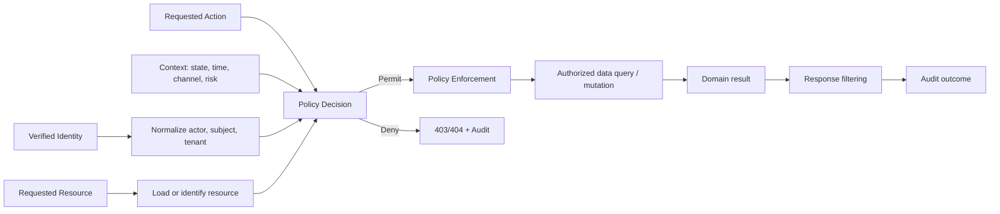
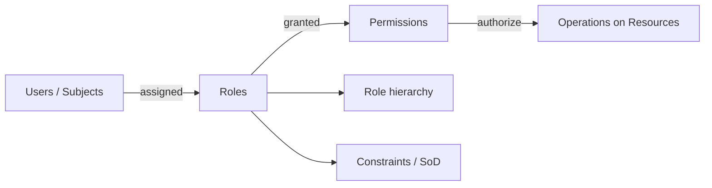
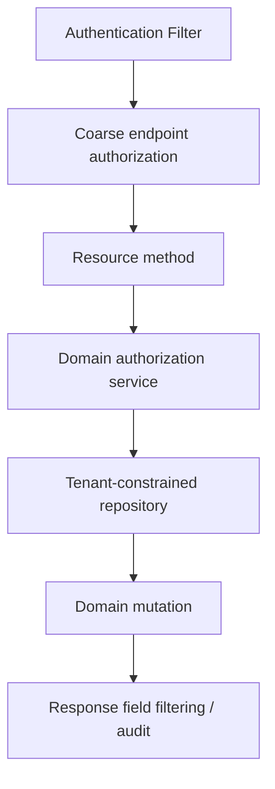
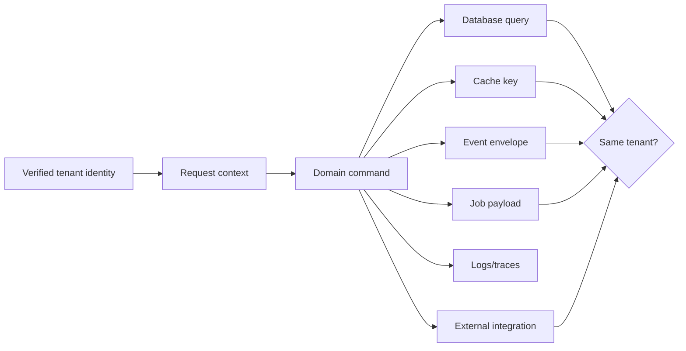

# Part 026 — Authorization, RBAC, ACL, and Tenant Isolation

> Authorization bukan pengecekan `if (role.equals("ADMIN"))`. Authorization adalah keputusan yang menghubungkan **subject/actor**, **action**, **resource**, **tenant**, **resource state**, dan **environment context** dengan policy yang dapat dijelaskan, diuji, diaudit, dan diterapkan pada setiap access path. Authentication yang benar tidak mencegah cross-tenant access, insecure direct object reference, role explosion, stale entitlement, query yang lupa tenant predicate, atau asynchronous worker yang kehilangan actor context.

## Daftar Isi

1. [Target kompetensi](#target-kompetensi)
2. [Scope dan baseline](#scope-dan-baseline)
3. [Standard versus implementation-specific boundary](#standard-versus-implementation-specific-boundary)
4. [Mental model: authorization decision pipeline](#mental-model-authorization-decision-pipeline)
5. [Terminology map](#terminology-map)
6. [Authorization invariants](#authorization-invariants)
7. [Subject, actor, resource, action, dan context](#subject-actor-resource-action-dan-context)
8. [Authentication versus authorization](#authentication-versus-authorization)
9. [Permission model](#permission-model)
10. [RBAC mental model](#rbac-mental-model)
11. [Roles, permissions, hierarchy, dan constraints](#roles-permissions-hierarchy-dan-constraints)
12. [Role explosion](#role-explosion)
13. [Separation of duties](#separation-of-duties)
14. [ACL mental model](#acl-mental-model)
15. [Object-level authorization](#object-level-authorization)
16. [ABAC dan policy attributes](#abac-dan-policy-attributes)
17. [Relationship-based authorization](#relationship-based-authorization)
18. [Combining RBAC, ACL, ABAC, dan relationships](#combining-rbac-acl-abac-dan-relationships)
19. [Policy decision dan enforcement points](#policy-decision-dan-enforcement-points)
20. [Deny by default](#deny-by-default)
21. [JAX-RS authorization boundary](#jax-rs-authorization-boundary)
22. [Declarative authorization annotations](#declarative-authorization-annotations)
23. [Jersey RolesAllowedDynamicFeature](#jersey-rolesalloweddynamicfeature)
24. [Programmatic authorization service](#programmatic-authorization-service)
25. [Resource loading dan authorization ordering](#resource-loading-dan-authorization-ordering)
26. [Preventing IDOR dan horizontal privilege escalation](#preventing-idor-dan-horizontal-privilege-escalation)
27. [Vertical privilege escalation](#vertical-privilege-escalation)
28. [Tenant isolation mental model](#tenant-isolation-mental-model)
29. [Tenant resolution dan trust](#tenant-resolution-dan-trust)
30. [Tenant-aware routing](#tenant-aware-routing)
31. [Tenant-aware data access](#tenant-aware-data-access)
32. [Shared schema dan tenant predicate](#shared-schema-dan-tenant-predicate)
33. [PostgreSQL Row-Level Security](#postgresql-row-level-security)
34. [Schema-per-tenant dan database-per-tenant](#schema-per-tenant-dan-database-per-tenant)
35. [Tenant isolation pada cache](#tenant-isolation-pada-cache)
36. [Tenant isolation pada events dan messaging](#tenant-isolation-pada-events-dan-messaging)
37. [Tenant isolation pada search dan analytics](#tenant-isolation-pada-search-dan-analytics)
38. [Tenant-specific catalog, pricing, dan configuration](#tenant-specific-catalog-pricing-dan-configuration)
39. [List, search, batch, dan aggregate authorization](#list-search-batch-dan-aggregate-authorization)
40. [Field-level dan partial-response authorization](#field-level-dan-partial-response-authorization)
41. [State-dependent authorization](#state-dependent-authorization)
42. [Temporal authorization](#temporal-authorization)
43. [Authorization pada workflow dan long-running operations](#authorization-pada-workflow-dan-long-running-operations)
44. [Authorization pada asynchronous jobs](#authorization-pada-asynchronous-jobs)
45. [Authorization pada Kafka/event consumers](#authorization-pada-kafkaevent-consumers)
46. [Impersonation, delegated administration, dan break-glass](#impersonation-delegated-administration-dan-break-glass)
47. [Authorization caching](#authorization-caching)
48. [Policy change, revocation, dan stale decisions](#policy-change-revocation-dan-stale-decisions)
49. [Error semantics dan resource concealment](#error-semantics-dan-resource-concealment)
50. [Audit logging dan security telemetry](#audit-logging-dan-security-telemetry)
51. [Failure-model matrix](#failure-model-matrix)
52. [Debugging playbook](#debugging-playbook)
53. [Testing strategy](#testing-strategy)
54. [Architecture patterns](#architecture-patterns)
55. [Anti-patterns](#anti-patterns)
56. [PR review checklist](#pr-review-checklist)
57. [Trade-off yang harus dipahami senior engineer](#trade-off-yang-harus-dipahami-senior-engineer)
58. [Internal verification checklist](#internal-verification-checklist)
59. [Latihan verifikasi](#latihan-verifikasi)
60. [Ringkasan](#ringkasan)
61. [Referensi resmi](#referensi-resmi)

---

## Target kompetensi

Setelah menyelesaikan part ini, Anda harus mampu:

- memodelkan authorization sebagai keputusan atas subject/actor, action, resource, tenant, state, dan context;
- membedakan role, permission, scope, entitlement, ownership, ACL, policy, dan tenant membership;
- mendesain RBAC dengan hierarchy dan separation-of-duties tanpa role explosion;
- menentukan kapan ACL, ABAC, atau relationship-based authorization dibutuhkan;
- menempatkan policy decision point dan policy enforcement point pada boundary yang benar;
- menggunakan Jakarta REST `SecurityContext`, Jakarta security annotations, atau Jersey-specific integration tanpa menganggap enforcement portable secara otomatis;
- memisahkan coarse-grained endpoint authorization dari fine-grained domain/object authorization;
- mencegah insecure direct object reference, horizontal privilege escalation, dan vertical privilege escalation;
- memastikan tenant context konsisten pada URI, identity, loaded entity, database query, cache key, event, job, dan telemetry;
- memahami shared-schema, row-level security, schema-per-tenant, dan database-per-tenant trade-offs;
- merancang authorization untuk list/search/batch, field-level visibility, workflow, job, event consumer, dan replay;
- merancang impersonation, support access, delegated administration, dan break-glass dengan actor/subject separation dan audit;
- menentukan cache key, invalidation, TTL, dan bounded staleness untuk authorization decisions;
- menggunakan error semantics yang aman tanpa membocorkan resource lintas tenant;
- membuat test matrix deny-by-default, role/permission, ownership, state, tenant, batch, async, dan revocation;
- melakukan PR dan architecture review terhadap authorization sebagai system-wide invariant.

---

## Scope dan baseline

Baseline:

- authenticated identity dari Part 025;
- JAX-RS/Jakarta REST endpoint;
- Java application/domain service;
- PostgreSQL persistence;
- Redis/cache;
- Kafka/event-driven processing;
- multi-tenant enterprise quote/order/catalog context;
- workflow dan asynchronous jobs;
- Kubernetes/cloud runtime;
- structured audit dan OpenTelemetry;
- authorization requirements yang dapat berubah seiring state quote/order.

Part ini tidak mengasumsikan bahwa internal system menggunakan:

- pure RBAC;
- centralized policy engine;
- OPA, Cedar, Zanzibar-like system, XACML, atau product tertentu;
- Jakarta Security method authorization;
- Jersey `RolesAllowedDynamicFeature`;
- PostgreSQL RLS;
- schema-per-tenant;
- database-per-tenant;
- permission claims di JWT;
- authorization cache;
- support impersonation;
- one universal admin role;
- same policy untuk UI, API, job, dan event consumer.

Semua harus diverifikasi melalui permission model, code, database schema, query conventions, token claims, role mapping, gateway, workflow definitions, support tooling, audit logs, dan incident history.

---

## Standard versus implementation-specific boundary

| Area | Standard/concept | Implementation-specific | Internal verification |
|---|---|---|---|
| Principal/roles access | Jakarta REST `SecurityContext` | Runtime/container mapping | Principal source |
| Role annotations | Jakarta Annotations `@RolesAllowed`, `@PermitAll`, `@DenyAll` | Container/Jersey enforcement | Enforcement enabled |
| Jersey annotation enforcement | Not Jakarta REST standard | `RolesAllowedDynamicFeature` | Registered or not |
| Jakarta Security | Jakarta EE specification | Server/provider | Runtime support |
| RBAC | NIST/ANSI model family | Internal role taxonomy | Role ownership |
| ACL | Access-control model | Tables/policy service | ACL semantics |
| ABAC | Policy pattern | Custom/OPA/Cedar/etc. | Attribute source |
| Tenant isolation | Architecture invariant | Query/RLS/schema/database | Actual model |
| PostgreSQL RLS | PostgreSQL feature | Policies/session variables | Usage and bypass |
| Authorization cache | Architecture technique | Redis/local cache | Key/TTL/invalidation |
| Audit | Security requirement | Logging/SIEM platform | Required fields |

Key principle:

> Standard annotations atau roles hanya memberikan vocabulary. Correct authorization memerlukan domain-aware policy dan enforcement pada seluruh access paths.

---

## Mental model: authorization decision pipeline



Authorization bukan hanya check sebelum method. Enforcement dapat diperlukan pada:

- query construction;
- entity load;
- mutation;
- field serialization;
- event publication;
- workflow transition;
- job execution;
- cache lookup;
- support access;
- export/report generation.

---

## Terminology map

| Istilah | Makna |
|---|---|
| Subject | Identity yang haknya dinilai |
| Actor | Service/user yang benar-benar mengeksekusi |
| Resource | Object/data/capability yang dilindungi |
| Action | Operation yang diminta |
| Permission | Allowed action on resource type/scope |
| Role | Named grouping of permissions/responsibilities |
| Scope | OAuth delegated-access vocabulary |
| Entitlement | Granted capability, often broader business term |
| Ownership | Relationship subject–resource |
| ACL | Per-resource list of subjects/roles and permissions |
| Attribute | Fact used by policy: tenant, state, region, risk |
| Policy | Rule producing permit/deny or obligations |
| PDP | Policy Decision Point |
| PEP | Policy Enforcement Point |
| Tenant | Security/administrative partition |
| Impersonation | Actor operating as another subject |
| Break-glass | Emergency elevated access under controls |
| Separation of duties | Preventing conflicting powers from one actor |
| Least privilege | Minimum authority required |
| Deny by default | Access denied unless explicitly permitted |

---

## Authorization invariants

Examples of explicit invariants:

```text
Only a tenant member may access tenant resources.
A user may submit only a quote they can view and that is in DRAFT state.
A price override requires a dedicated permission and approved reason.
The approver cannot be the same actor that requested the high-risk override.
A support operator may impersonate only with active case reference and audit.
An event consumer may mutate only the tenant and aggregate referenced by the event.
A list endpoint must never retrieve unauthorized rows and filter them only in memory.
```

An invariant should identify:

- subject/actor;
- resource;
- action;
- preconditions;
- tenant;
- state;
- time;
- required evidence;
- audit obligation;
- failure response.

---

## Subject, actor, resource, action, dan context

A policy decision can be modelled as:

```java
public record AuthorizationRequest(
        Actor actor,
        Subject subject,
        Action action,
        ResourceRef resource,
        TenantId tenant,
        AuthorizationContext context
) {}
```

`actor` and `subject` may differ:

```text
actor = support-agent-17
subject = customer-user-42
reason = incident-INC-123
```

Context may include:

- quote/order lifecycle state;
- effective time;
- sales channel;
- risk level;
- request origin;
- authentication assurance;
- region;
- contract ownership;
- delegated administration boundary;
- feature flag;
- legal hold.

Do not use mutable request DTO as the policy context without normalization and validation.

---

## Authentication versus authorization

Authentication establishes identity. Authorization evaluates authority.

Common mistake:

```java
if (securityContext.getUserPrincipal() != null) {
    // allow update
}
```

Authenticated does not imply permitted.

Another mistake:

```java
if (securityContext.isUserInRole("USER")) {
    // user may access any quote ID
}
```

A role may permit `quote:read`, but object-level tenant/ownership/state policy still applies.

---

## Permission model

Permission naming should express stable capability:

```text
quote:read
quote:create
quote:update
quote:submit
quote:approve
quote:price-override
order:read
order:cancel
catalog:publish
support:impersonate
```

Avoid UI-oriented permission:

```text
show-blue-button
access-screen-7
```

Permission model should be independent of exact UI and endpoint paths.

Possible permission dimensions:

```text
action
resource type
tenant scope
ownership scope
region/channel
state
monetary threshold
```

Do not create a unique permission for every record.

---

## RBAC mental model

RBAC assigns permissions to roles and roles to users/subjects.



RBAC simplifies administration when roles correspond to organizational responsibilities.

Examples:

- sales agent;
- quote approver;
- catalog manager;
- order operations;
- support analyst;
- tenant administrator.

RBAC alone is often insufficient for object ownership, tenant, state, amount, and relationship constraints.

---

## Roles, permissions, hierarchy, dan constraints

A role should not be checked directly across domain code where a permission is intended.

Prefer:

```java
authorization.require(
        identity,
        Permission.QUOTE_APPROVE,
        quote
);
```

over:

```java
if (roles.contains("SENIOR_SALES_MANAGER_APAC")) {
    ...
}
```

Why:

- roles change organizationally;
- permissions remain capability-oriented;
- hierarchy mapping can be centralized;
- tenant-specific role mapping is possible;
- policy tests become clearer.

Role hierarchy requires careful review:

```text
SUPER_ADMIN > TENANT_ADMIN > QUOTE_APPROVER > QUOTE_VIEWER
```

Inheritance may accidentally grant unrelated permissions. Prefer explicit permission composition where possible.

---

## Role explosion

Role explosion occurs when combinations of:

- tenant;
- region;
- product;
- channel;
- amount;
- state;
- ownership;
- temporary delegation

are encoded as separate roles.

Example:

```text
APAC_ENTERPRISE_WIRELESS_QUOTE_APPROVER_TIER_3
```

Better:

```text
role = QUOTE_APPROVER
attributes = region:APAC, segment:ENTERPRISE
policy = amount <= approvalLimit
```

Use RBAC for stable responsibility and attributes/relationships for dynamic context.

---

## Separation of duties

### Static separation of duties

Conflicting roles cannot be assigned to same subject.

```text
catalog-author
catalog-final-approver
```

### Dynamic separation of duties

Same actor cannot perform conflicting actions in one process/resource.

```text
requester != approver
priceOverrideAuthor != overrideApprover
```

Authorization must check actual history/resource state, not only current role.

Store immutable actor identifiers for prior actions.

---

## ACL mental model

ACL attaches permissions to a specific resource or resource group.

Example:

```text
quote-123:
  user-1 -> READ, UPDATE
  team-sales-east -> READ
  role-tenant-admin -> ADMIN
```

ACL is useful for:

- collaboration;
- explicit sharing;
- exceptions;
- team ownership;
- case-specific access.

Trade-offs:

- large ACL tables;
- query complexity;
- revocation;
- inheritance;
- consistency with tenant boundary;
- list/search filtering;
- cache invalidation.

ACL entries must never grant across tenant unless explicit cross-tenant model exists.

---

## Object-level authorization

Endpoint permission:

```text
quote:read
```

Object-level policy:

```text
quote.tenant == identity.tenant
AND (
  quote.owner == identity.subject
  OR identity has quote:read:any
  OR ACL grants READ
)
```

Resource method should not authorize solely from user-supplied ID.

A safe application flow:

1. derive tenant from verified context;
2. query resource constrained by tenant;
3. return not-found/deny if absent;
4. evaluate ownership/state/permission;
5. perform mutation with concurrency check;
6. audit decision/outcome.

---

## ABAC dan policy attributes

Attribute-based access control evaluates attributes of:

- subject;
- actor;
- resource;
- action;
- environment.

Example:

```text
permit if:
  subject.department == quote.salesDepartment
  AND quote.total <= subject.approvalLimit
  AND authentication.assurance >= HIGH
  AND currentTime within approvalWindow
```

Risks:

- inconsistent attribute sources;
- stale data;
- missing-value semantics;
- policy complexity;
- high-latency lookups;
- hard-to-explain decisions;
- policy drift.

Every attribute needs ownership, freshness, type, and trust classification.

---

## Relationship-based authorization

Relationship-based authorization models graph-like relations:

```text
user member-of team
team owns account
account owns quote
quote belongs-to tenant
```

Useful for hierarchical organizations, account teams, reseller relationships, delegated administration, or shared catalog ownership.

Complexity:

- graph traversal;
- cycles;
- caching;
- consistency;
- list filtering;
- explanation;
- tenant boundaries.

Do not add relationship engine unless actual authorization graph justifies it.

---

## Combining RBAC, ACL, ABAC, dan relationships

Typical layered policy:

```text
tenant boundary
AND endpoint permission
AND resource ownership/ACL/relationship
AND state/attribute constraints
AND separation-of-duties constraints
```

Example:

```text
Permit QUOTE_APPROVE when:
  role-derived permission includes quote:approve
  AND quote.tenant == identity.tenant
  AND quote.status == SUBMITTED
  AND quote.total <= identity.approvalLimit
  AND quote.submittedBy != identity.subject
```

---

## Policy decision dan enforcement points

### PDP

Produces decision:

```text
PERMIT
DENY
NOT_APPLICABLE
INDETERMINATE
```

May also return obligations:

- redact fields;
- require audit reason;
- require step-up;
- apply row filter;
- cap result size.

### PEP

Enforces decision:

- JAX-RS filter;
- resource method;
- domain service;
- repository;
- serializer;
- event consumer;
- workflow worker;
- gateway.

Authorization failure due to policy-engine outage should generally fail closed unless a narrowly approved availability strategy exists.

---

## Deny by default

Deny by default means:

- new endpoint is not accidentally public;
- new action is unavailable until policy exists;
- missing claim is denial;
- unknown tenant is denial;
- policy evaluation error is not permit;
- unrecognized resource state is denial;
- absent ACL entry is denial;
- missing annotation does not imply public unless explicit convention says so.

Public endpoints should be explicitly marked and tested.

---

## JAX-RS authorization boundary

Possible layers:



Coarse authorization can reject obvious invalid calls early. Domain authorization remains necessary for object/state-aware decisions.

---

## Declarative authorization annotations

Jakarta security annotations include:

```java
@RolesAllowed("QUOTE_APPROVER")
@PermitAll
@DenyAll
```

Important distinction:

- annotations are standard vocabulary;
- whether they are enforced on JAX-RS resources depends on runtime/integration;
- standalone Jersey may need Jersey-specific feature;
- method call from one object to another may bypass proxy/interceptor depending on runtime;
- annotation checks are usually role-level, not object/state-level.

Never infer enforcement from annotation presence alone. Prove with integration test.

---

## Jersey RolesAllowedDynamicFeature

Jersey provides a feature for role-annotation enforcement.

Conceptual registration:

```java
register(org.glassfish.jersey.server.filter.RolesAllowedDynamicFeature.class);
```

This is Jersey-specific.

Review:

- is it registered?
- how roles are resolved by `SecurityContext#isUserInRole`?
- what happens with no annotation?
- class versus method override?
- sub-resource behavior?
- priority ordering?
- exception/status behavior?
- integration tests?

Do not present this as portable Jakarta REST behavior.

---

## Programmatic authorization service

A domain-aware service can return structured decision:

```java
public interface AuthorizationService {
    AuthorizationDecision decide(
            VerifiedIdentity identity,
            Action action,
            ProtectedResource resource,
            AuthorizationContext context
    );
}

public record AuthorizationDecision(
        boolean permitted,
        String policyId,
        String reasonCode,
        Set<Obligation> obligations
) {
    public static AuthorizationDecision deny(
            String policyId,
            String reasonCode
    ) {
        return new AuthorizationDecision(
                false,
                policyId,
                reasonCode,
                Set.of()
        );
    }
}
```

Do not expose sensitive denial details to client. Internal reason codes can support audit/debugging.

A helper:

```java
public void require(
        VerifiedIdentity identity,
        Action action,
        ProtectedResource resource,
        AuthorizationContext context
) {
    AuthorizationDecision decision =
            decide(identity, action, resource, context);

    if (!decision.permitted()) {
        throw new ForbiddenOperationException(
                decision.policyId(),
                decision.reasonCode()
        );
    }
}
```

---

## Resource loading dan authorization ordering

Two common strategies:

### Load then authorize

```text
load resource by tenant + id
authorize resource
```

Benefits:

- policy sees state/owner.

Risks:

- existence leakage;
- unauthorized data enters memory/logs;
- unconstrained query may cross tenant.

### Authorized query

```text
query by tenant + id + visibility predicates
```

Benefits:

- unauthorized row not returned;
- efficient for lists.

Risks:

- policy logic duplicated into SQL;
- complex dynamic permissions.

Often combine:

1. enforce tenant in query;
2. load minimal resource attributes;
3. domain authorization;
4. load sensitive/detail data only after permit.

---

## Preventing IDOR dan horizontal privilege escalation

Insecure Direct Object Reference occurs when attacker changes identifier:

```http
GET /tenants/A/quotes/123
```

to:

```http
GET /tenants/A/quotes/124
```

and receives another user's/tenant's resource.

Controls:

- do not treat unguessable ID as authorization;
- tenant-constrained query;
- ownership/ACL check;
- no global repository `findById` in tenant-scoped path;
- consistent list/detail/export authorization;
- concealment policy;
- negative tests using valid IDs from another tenant/user.

Preferred repository signature:

```java
Optional<Quote> findByTenantAndId(
        TenantId tenantId,
        QuoteId quoteId
);
```

not:

```java
Optional<Quote> findById(QuoteId quoteId);
```

for tenant-scoped application flow.

---

## Vertical privilege escalation

Vertical escalation occurs when a lower-privilege actor invokes privileged operation.

Examples:

- user calls approval endpoint;
- sales agent sends `status=APPROVED`;
- client includes `priceOverride=true`;
- hidden UI action called directly;
- mass assignment updates protected field;
- admin endpoint exposed by route misconfiguration;
- role claim trusted from client header.

Controls:

- server-controlled state transitions;
- explicit permissions;
- DTO allow-list;
- domain commands;
- deny unknown fields where appropriate;
- no reliance on UI hiding;
- audit privileged mutations;
- step-up for high-risk operations.

---

## Tenant isolation mental model

Tenant isolation must hold across all stores and paths:



The invariant is not “tenant ID exists”. It is “all artifacts refer to the same authorized tenant”.

---

## Tenant resolution dan trust

Possible sources:

- verified token claim;
- trusted gateway assertion;
- mTLS/workload mapping;
- route/path parameter;
- hostname/subdomain;
- request body;
- stored resource;
- support impersonation context.

Classify sources:

| Source | Role |
|---|---|
| Verified identity tenant claim | Trust candidate |
| Path tenant | Requested routing scope |
| Body tenant | Untrusted input |
| Stored entity tenant | Data truth |
| Gateway header | Trusted only with authenticated gateway and stripping |
| Subdomain | Routing input unless protected/mapped |

Reconcile:

```text
identityTenant == routeTenant == entityTenant
```

where architecture requires single-tenant context.

---

## Tenant-aware routing

Routing examples:

```text
/tenants/{tenantId}/quotes/{quoteId}
{tenant}.api.example.com
X-Tenant-Id
```

Routing must not become authorization.

Requirements:

- normalize tenant ID;
- validate syntax and existence;
- map aliases safely;
- reject ambiguity;
- avoid header/path conflict;
- prevent cache poisoning;
- propagate canonical tenant;
- audit mismatch;
- include tenant in idempotency key namespace.

---

## Tenant-aware data access

Recommended application invariant:

```text
No tenant-owned table is queried without tenant context.
```

Techniques:

- repository API requires `TenantId`;
- tenant is part of primary/unique keys where appropriate;
- SQL templates include tenant predicate;
- database role/session carries tenant;
- RLS;
- separate schema/database;
- static analysis/query review;
- integration tests with at least two tenants.

Avoid ambient global ThreadLocal as the only protection. Explicit parameters improve reviewability, though request context may still be used with disciplined scope.

---

## Shared schema dan tenant predicate

Example table:

```sql
CREATE TABLE quote (
    tenant_id      text        NOT NULL,
    quote_id       uuid        NOT NULL,
    status         text        NOT NULL,
    owner_subject  text        NOT NULL,
    total_amount   numeric(19,4) NOT NULL,
    version        bigint      NOT NULL,
    PRIMARY KEY (tenant_id, quote_id)
);
```

Query:

```sql
SELECT tenant_id,
       quote_id,
       status,
       owner_subject,
       total_amount,
       version
FROM quote
WHERE tenant_id = ?
  AND quote_id = ?;
```

Composite uniqueness prevents accidental cross-tenant collision assumptions.

Indexes should begin with tenant when access pattern requires:

```sql
CREATE INDEX quote_tenant_status_created_idx
    ON quote (tenant_id, status, created_at DESC);
```

Exact design depends on query patterns and cardinality.

---

## PostgreSQL Row-Level Security

RLS can enforce row visibility in database.

Conceptual example:

```sql
ALTER TABLE quote ENABLE ROW LEVEL SECURITY;

CREATE POLICY quote_tenant_policy
ON quote
USING (
    tenant_id = current_setting('app.tenant_id', true)
)
WITH CHECK (
    tenant_id = current_setting('app.tenant_id', true)
);
```

Critical concerns:

- table owner/superuser/bypass roles may bypass RLS;
- connection pool session state leakage;
- transaction-local setting;
- reset on connection reuse;
- migration/service accounts;
- background jobs;
- policy coverage for `SELECT`, `INSERT`, `UPDATE`, `DELETE`;
- `USING` versus `WITH CHECK`;
- test with actual application DB role;
- query plans and indexes.

Safer transaction-local pattern:

```sql
SELECT set_config('app.tenant_id', ?, true);
```

then execute all queries within same transaction/connection.

RLS is defense in depth, not excuse to omit tenant-aware application model.

---

## Schema-per-tenant dan database-per-tenant

### Schema-per-tenant

Benefits:

- stronger namespace separation;
- per-tenant migration/control.

Costs:

- many schemas;
- connection/search-path safety;
- migration fan-out;
- observability;
- tenant onboarding;
- query tooling.

### Database-per-tenant

Benefits:

- strong isolation;
- independent backup/restore/scaling;
- data residency control.

Costs:

- connection pools;
- routing;
- operational fleet size;
- migration orchestration;
- cross-tenant reporting;
- cost.

Selection must reflect tenant count, regulatory needs, blast radius, operations, and analytics requirements.

---

## Tenant isolation pada cache

Every tenant-specific cache key must contain canonical tenant dimension:

```text
tenant:{tenantId}:quote:{quoteId}
tenant:{tenantId}:catalog:{catalogVersion}
```

Risks:

- missing tenant prefix;
- alias collision;
- cache key built from untrusted case/format;
- global cache for tenant-specific config;
- stale authorization result;
- invalidation broadcasts missing tenant;
- Redis ACL/cluster topology misunderstanding.

Cache hit must not bypass authorization unless cached value is scoped to exact authorized context.

---

## Tenant isolation pada events dan messaging

Event envelope should include validated tenant and stable identity/audit context:

```json
{
  "eventId": "evt-...",
  "tenantId": "tenant-A",
  "aggregateType": "Quote",
  "aggregateId": "quote-123",
  "eventType": "QuoteSubmitted",
  "actor": {
    "type": "USER",
    "id": "issuer|subject"
  },
  "occurredAt": "2026-07-11T10:00:00Z",
  "payload": {}
}
```

Consumer must:

- validate schema;
- validate tenant;
- load aggregate by tenant + ID;
- enforce consumer/service authority;
- not trust producer-provided permissions;
- preserve audit actor;
- handle replay/idempotency;
- prevent cross-tenant partition/key confusion.

Kafka ACL controls topic access, not business tenant authorization inside a shared topic.

---

## Tenant isolation pada search dan analytics

Search/index/reporting systems are common leakage points.

Review:

- tenant field immutable and indexed;
- every query includes tenant filter;
- aliases/views scoped;
- export jobs scoped;
- BI/service accounts;
- cross-tenant aggregate policy;
- anonymization;
- result caching;
- pagination token tenant binding;
- asynchronous report storage and download authorization.

Never rely on UI filtering after global search result retrieval.

---

## Tenant-specific catalog, pricing, dan configuration

For CPQ/quote/order systems, authorization and tenancy interact with:

- product catalog;
- price list;
- eligibility rules;
- discount rules;
- tax configuration;
- channel;
- market/region;
- effective dates;
- customer segment;
- contract.

Required context may be:

```text
tenant
catalogVersion
priceListVersion
effectiveAt
channel
customerAccount
```

A user authorized for tenant A must not select catalog/pricing revision from tenant B.

Persist revision identity used for quote calculation so later audit/replay does not silently use current tenant configuration.

---

## List, search, batch, dan aggregate authorization

### List/search

Do not:

```java
repository.findAll().stream()
    .filter(item -> authorization.canRead(identity, item));
```

Problems:

- data leakage to memory/logs;
- performance;
- pagination counts wrong;
- timing leakage;
- impossible at scale.

Push stable visibility constraints into query, then apply domain checks where necessary.

### Batch

For request with multiple IDs:

- define all-or-nothing versus partial success;
- reject duplicate IDs;
- bind all to tenant;
- authorize each resource;
- avoid N+1 policy calls;
- return safe per-item errors;
- preserve atomicity semantics.

### Aggregate/count

Counts and totals can leak information. Authorization must apply before aggregation.

---

## Field-level dan partial-response authorization

Some actors may read quote summary but not:

- cost basis;
- margin;
- customer PII;
- internal approval notes;
- supplier rates;
- audit metadata.

Options:

- dedicated DTOs by use case;
- explicit projection;
- serializer filtering with policy;
- separate endpoint;
- query projection.

Avoid returning entity then removing fields ad hoc after serialization.

Field-level policy must also cover:

- export;
- logs;
- events;
- cache;
- search indexes;
- GraphQL/partial-response mechanisms;
- error messages.

---

## State-dependent authorization

Quote/order actions depend on state:

```text
DRAFT -> SUBMITTED -> APPROVED -> ORDERED -> FULFILLED
```

Permission alone is insufficient:

```text
quote:approve AND quote.status == SUBMITTED
```

State transition should be server-controlled:

```java
public void approve(
        Quote quote,
        VerifiedIdentity identity,
        ApprovalReason reason
) {
    authorization.require(
            identity,
            Action.QUOTE_APPROVE,
            quote,
            AuthorizationContext.current()
    );
    quote.approve(identity.stableId(), reason);
}
```

Domain object should reject invalid transition even if endpoint check was missed.

---

## Temporal authorization

Policy may be time-bound:

- temporary delegation;
- maintenance access;
- contract validity;
- campaign window;
- approval deadline;
- support session;
- break-glass expiry.

Use injected `Clock`. Store UTC instants and explicit business timezone semantics where needed.

Cache TTL must not outlive authorization validity.

---

## Authorization pada workflow dan long-running operations

Authorization timing questions:

1. At process start?
2. At each human task claim/complete?
3. At service task execution?
4. When delayed timer fires?
5. At final commit?
6. When workflow definition changes?

A permission valid at quote submission may be revoked before approval.

Persist:

- initiating subject;
- actor;
- tenant;
- requested action;
- policy/reason evidence where required;
- process version;
- current task assignee.

Re-evaluate authorization at sensitive action time. Do not store raw access token for long-running process.

---

## Authorization pada asynchronous jobs

Job may run without active user token.

Model job authority explicitly:

```text
job service identity
tenant scope
initiating actor/subject for audit
approved operation
resource selection criteria
expiry/deadline
```

For reconciliation/cleanup:

- scope queries by tenant;
- use least-privilege DB role;
- lock/partition jobs;
- audit destructive actions;
- do not infer authority from queue possession alone;
- protect manual rerun endpoint.

---

## Authorization pada Kafka/event consumers

Consumer identity is service identity. Event actor is audit/domain context, not automatically authorization proof.

Consumer should determine:

- may this service process event type?
- is tenant valid?
- is aggregate within service ownership?
- is event schema/version allowed?
- is state transition legal?
- was producer authorized? Usually enforced upstream, but consumer still validates invariants.
- does replay remain safe?

For commands over messaging, stronger authorization contract may be needed than for facts/events.

---

## Impersonation, delegated administration, dan break-glass

### Impersonation

Maintain both:

```text
actor = support agent
subject = impersonated user
```

Require:

- dedicated permission;
- reason/case ID;
- tenant scope;
- start/end time;
- visible UI indicator;
- prohibited high-risk actions where appropriate;
- immutable audit;
- no silent propagation as normal user.

### Delegated administration

Tenant admin may manage users within tenant, not platform-wide.

### Break-glass

Emergency access requires:

- strong authentication;
- explicit activation;
- limited duration;
- narrow scope;
- notification;
- session recording/audit;
- post-use review;
- no shared account;
- automatic expiry.

---

## Authorization caching

Authorization decisions may be cached only with complete key dimensions:

```text
subject/actor
tenant
action
resource/resourceVersion
policyVersion
relevant attributes
```

Risks:

- role revocation ignored;
- ownership changed;
- resource state changed;
- tenant config changed;
- policy deployed;
- support session ended;
- approval limit changed.

Cache strategies:

- short TTL;
- versioned policy/entitlement;
- invalidation events;
- no cache for critical operations;
- cache derived permission sets, not final object decision;
- local request-scope memoization.

Never cache permit forever.

---

## Policy change, revocation, dan stale decisions

Document acceptable staleness:

```text
role revocation <= 5 minutes
tenant membership removal <= 1 minute
break-glass expiry immediate
price-override permission immediate
read-only catalog access <= token lifetime
```

Mechanisms:

- short-lived tokens;
- introspection;
- entitlement version;
- policy cache invalidation;
- session termination;
- decision-store TTL;
- critical operation re-check;
- event-driven invalidation.

A successful past authorization does not authorize a future retry after state/policy changed.

---

## Error semantics dan resource concealment

### `401`

Authentication missing/invalid.

### `403`

Authenticated but denied.

### `404`

Can conceal existence when caller has no visibility.

Consistency matters:

- detail/list/export should not reveal hidden resource;
- timing and error body should not expose tenant membership;
- support diagnostics can use internal reason code;
- client receives stable generic problem.

Example internal log:

```text
decision=DENY
policy=quote-read-v3
reason=TENANT_MISMATCH
actor=...
tenant=tenant-A
resourceTenant=tenant-B
traceId=...
```

Client response should not reveal `resourceTenant`.

---

## Audit logging dan security telemetry

Audit fields:

- timestamp;
- actor;
- subject;
- tenant;
- action;
- resource type/ID;
- decision;
- policy ID/version;
- reason code;
- authentication assurance;
- impersonation/break-glass context;
- request/trace/correlation ID;
- outcome;
- changed fields or safe summary;
- source service/channel.

Do not log sensitive resource payload.

Metrics:

```text
authorization_decisions_total{decision,action,policy}
authorization_denials_total{reason,resource_type}
tenant_mismatch_total{boundary}
impersonation_sessions_active
break_glass_activations_total
policy_evaluation_seconds
authorization_cache_hits_total{outcome}
```

Avoid user/resource IDs as metric labels.

---

## Failure-model matrix

| Failure | Effect | Detection | Containment |
|---|---|---|---|
| Missing tenant predicate | Cross-tenant data leak | Multi-tenant tests/query audit | Repository API/RLS |
| Endpoint role only | Object-level access leak | IDOR tests | Domain authorization |
| Role explosion | Unmanageable policy | Role inventory | Permission + attributes |
| Stale permit cache | Revoked access persists | Revocation test | TTL/version/invalidation |
| RLS session leak | Wrong tenant on pooled connection | Integration test | Transaction-local setting/reset |
| Admin role too broad | Large blast radius | Access review | Scoped admin permissions |
| UI-only restriction | Direct API escalation | Security test | Server enforcement |
| Mass assignment | Protected field update | DTO tests | Explicit command DTO |
| Event tenant trusted blindly | Cross-tenant mutation | Replay tests | Consumer validation |
| Batch partially unauthorized | Data leak/partial mutation | Batch matrix | Defined atomic policy |
| Search filters in memory | Leak/count mismatch | Code review | Authorized query |
| Impersonation loses actor | Non-repudiation failure | Audit review | Actor + subject model |
| Policy engine outage fail-open | Unauthorized access | Failure injection | Fail closed/bounded exception |
| Annotation not enforced | Endpoint public | Integration test | Runtime registration/proof |
| State changes after check | TOCTOU | Concurrency test | Transaction/locking/recheck |
| Resource ID reveals existence | Tenant enumeration | Negative tests | Concealment policy |

---

## Debugging playbook

### Symptom: user has expected role but receives `403`

Check:

1. Is role present in normalized identity?
2. Is annotation enforcement enabled?
3. Does `SecurityContext#isUserInRole` map role correctly?
4. Is permission mapping tenant-specific?
5. Does domain policy also require ownership/state/amount?
6. Is entitlement cache stale?
7. Is policy version consistent across replicas?
8. Is impersonation context changing subject?
9. Is authentication assurance sufficient?
10. Is system clock affecting temporary delegation?

### Symptom: user can access another tenant's object

Immediate response:

1. Treat as security incident.
2. Preserve evidence without exposing more data.
3. Identify all access paths: detail/list/export/search/cache/event/job.
4. Inspect query tenant predicate.
5. Inspect identity/path/entity tenant reconciliation.
6. Check cache key.
7. Check RLS/application DB role.
8. Search similar repository methods.
9. Add two-tenant regression tests.
10. Assess historical customer impact.

### Symptom: RLS works locally but not production

Check:

- application DB role ownership;
- `BYPASSRLS`;
- table owner behavior;
- `FORCE ROW LEVEL SECURITY`;
- session variable set on same connection;
- transaction-local setting;
- connection pool reset;
- migrations using different role;
- policy deployed to all schemas;
- query targets correct table/view.

### Symptom: list endpoint is correct but export leaks data

Check separate code paths:

- asynchronous export job;
- reporting database;
- object storage download;
- pre-signed URL;
- cached report;
- tenant in job payload;
- authorization at request and download time;
- field-level redaction.

### Symptom: authorization differs across replicas

Check:

- role/policy cache;
- policy version;
- feature flags;
- token/JWKS config;
- time;
- tenant config reload;
- stale deployment;
- external policy engine connectivity;
- local in-memory overrides.

### Symptom: action authorized, but state transition fails

This may be correct:

- coarse permission passed;
- state-dependent domain invariant denied;
- optimistic-lock version stale;
- separation-of-duties rule;
- approval limit;
- quote effective window.

Return stable domain error and preserve audit reason.

---

## Testing strategy

### Permission matrix

Build table:

| Role/permission | Own object | Same tenant other owner | Other tenant | Valid state | Invalid state |
|---|---:|---:|---:|---:|---:|
| viewer | allow | policy-dependent | deny | allow | allow/read |
| editor | allow | policy-dependent | deny | allow/update | deny |
| approver | policy-dependent | allow | deny | allow | deny |
| tenant admin | allow | allow | deny | policy-dependent | deny |
| platform support | controlled | controlled | controlled | controlled | controlled |

### Negative tests

- no permission;
- wrong tenant;
- wrong owner;
- wrong state;
- revoked role;
- expired delegation;
- missing context;
- malformed tenant;
- duplicate/conflicting tenant sources;
- annotation absent;
- policy engine timeout;
- cache stale;
- object exists but hidden;
- field-level access denied;
- list/count/export;
- batch with mixed authorization;
- async retry after revocation;
- event replay.

### Multi-tenant integration test

Use at least tenants A and B with overlapping resource IDs where possible.

Verify:

- database;
- cache;
- search;
- event;
- report;
- object storage;
- idempotency;
- metrics/logs;
- pagination cursor.

### Concurrency/TOCTOU test

Scenario:

1. authorize update;
2. resource owner/state changes;
3. operation commits.

Use transaction, optimistic locking, or re-check to preserve invariant.

### Annotation enforcement test

Create test endpoint for:

- `@PermitAll`;
- `@DenyAll`;
- `@RolesAllowed`;
- class/method override;
- unannotated endpoint;
- sub-resource.

Prove actual runtime behavior.

---

## Architecture patterns

### Pattern 1 — Coarse plus domain authorization

```text
JAX-RS role/permission gate
          ↓
Domain authorization with resource state
          ↓
Tenant-constrained repository
```

### Pattern 2 — Authorized repository query

```text
Identity visibility scope
          ↓
SQL tenant + ownership/ACL predicate
          ↓
Only permitted rows returned
```

### Pattern 3 — Centralized PDP, distributed PEP

```text
JAX-RS / worker / job PEP
          ↓
Policy decision service
          ↓
permit/deny + obligations
```

Requires latency, availability, cache, versioning, and fail-closed design.

### Pattern 4 — RLS defense in depth

```text
Application tenant-aware query
          +
PostgreSQL RLS with transaction-local tenant
```

### Pattern 5 — Actor/subject support session

```text
Support actor authentication
          ↓
Approved impersonation session
          ↓
subject + actor + tenant + reason
          ↓
Restricted policy + audit
```

---

## Anti-patterns

- `isAuthenticated()` used as authorization.
- Role check without resource/tenant policy.
- Hidden UI button as security.
- Repository `findById` for tenant-owned entity.
- Tenant ID accepted from body.
- Global `ADMIN` bypassing all tenant checks.
- Permission names tied to screens.
- Role per tenant/product/state combination.
- In-memory filtering after global query.
- Authorization only at controller/resource method.
- Raw token/permission snapshot persisted in event.
- Cache key without tenant.
- ACL without tenant boundary.
- RLS assumed active without testing application role.
- Connection session tenant not reset.
- Impersonation replacing actor identity.
- Break-glass shared account.
- Policy-engine outage fail-open by accident.
- `@RolesAllowed` present but feature not registered.
- Error body reveals other tenant/resource existence.
- Allow decision cached without policy/resource version.
- Batch operation authorizes first item only.
- Event consumer trusts producer tenant blindly.
- State transition accepts client-provided final status.
- Export/report path has different authorization logic.

---

## PR review checklist

### Policy model

- [ ] Action/permission is capability-oriented.
- [ ] Role is not hard-coded throughout domain code.
- [ ] Tenant boundary is explicit.
- [ ] Object-level policy is defined.
- [ ] State/ownership/amount/time constraints are identified.
- [ ] Separation-of-duties requirements are covered.
- [ ] Deny-by-default behavior is clear.

### JAX-RS/runtime

- [ ] Authentication and authorization are separate.
- [ ] Annotation enforcement is proven by test.
- [ ] Public endpoints are explicit.
- [ ] Domain authorization exists for object-sensitive operations.
- [ ] Error status/concealment policy is consistent.
- [ ] Security context is not trusted from spoofable header.

### Data access

- [ ] Queries require tenant.
- [ ] List/search/export/count are authorized before aggregation.
- [ ] Composite keys/indexes support tenant access.
- [ ] RLS role/session behavior is tested if used.
- [ ] Connection pool cannot leak tenant state.
- [ ] Batch queries enforce every resource.

### Cache/event/job

- [ ] Cache keys include tenant and relevant authorization dimensions.
- [ ] Authorization cache TTL/invalidation is documented.
- [ ] Event tenant and aggregate are validated by consumer.
- [ ] Jobs carry explicit tenant/service authority.
- [ ] Replay does not bypass current domain invariants.
- [ ] Raw token is not persisted.

### Privileged access

- [ ] Admin permissions are scoped.
- [ ] Impersonation preserves actor and subject.
- [ ] Reason/case ID and expiry are required.
- [ ] Break-glass controls and review exist.
- [ ] High-risk action audit is immutable enough for requirements.

### Tests and operations

- [ ] Positive and negative permission matrix exists.
- [ ] Cross-tenant tests use real persistence/cache paths.
- [ ] IDOR tests exist.
- [ ] Revocation/stale-cache tests exist.
- [ ] Policy version is observable.
- [ ] Denials and tenant mismatches are monitored.
- [ ] Runbook covers authorization incident.

---

## Trade-off yang harus dipahami senior engineer

### Centralized versus embedded policy

Centralized policy improves consistency and governance but adds network dependency, latency, policy deployment, and cache problems. Embedded policy improves local performance and domain proximity but risks duplication and drift.

### RBAC versus ABAC

RBAC is explainable and administratively familiar. ABAC handles dynamic constraints but can become difficult to reason about and debug.

### Application checks versus RLS

Application checks understand domain semantics. RLS provides strong data-layer containment. Combining both increases defense but also operational complexity.

### Shared schema versus database-per-tenant

Shared schema scales tenant count economically but demands flawless predicates. Database-per-tenant strengthens isolation but creates fleet-management cost.

### Concealment versus diagnosability

Returning `404` can reduce enumeration, but support/debugging needs internal reason codes and traceability.

### Decision caching versus revocation speed

Caching reduces latency and policy-service load, but extends stale authority. Critical operations may require no cache or version-aware revalidation.

### Fine-grained authorization versus operational simplicity

More granular policy limits privilege but increases decision complexity, test matrix, and support burden.

### Current authorization versus historical delegation

Long-running workflows need audit of original authority while sensitive steps may require current re-authorization.

---

## Internal verification checklist

### Authorization model

- [ ] Canonical roles and permissions?
- [ ] Role-to-permission mapping owner?
- [ ] Scope versus role semantics?
- [ ] Object ownership model?
- [ ] ACL tables/services?
- [ ] Attribute/relationship policy?
- [ ] Separation-of-duties rules?
- [ ] Approval limits and state-dependent policy?
- [ ] Policy versioning/deprecation?

### JAX-RS/runtime enforcement

- [ ] `@RolesAllowed`, `@PermitAll`, `@DenyAll` usage?
- [ ] Jersey `RolesAllowedDynamicFeature` registered?
- [ ] Jakarta Security enabled?
- [ ] Custom filters/interceptors?
- [ ] `SecurityContext#isUserInRole` mapping?
- [ ] Default for unannotated endpoint?
- [ ] Sub-resource behavior?
- [ ] Programmatic authorization service?

### Tenancy

- [ ] Tenant model: shared schema/schema/database?
- [ ] Trusted tenant source?
- [ ] Path/header/subdomain conventions?
- [ ] Tenant context lifecycle?
- [ ] Repository signatures?
- [ ] RLS usage and DB roles?
- [ ] Cache key convention?
- [ ] Event envelope tenant field?
- [ ] Search/report/export tenant controls?
- [ ] Tenant-specific catalog/pricing/config source?

### Persistence

- [ ] Composite keys/indexes?
- [ ] Global tables versus tenant tables?
- [ ] Connection pool session reset?
- [ ] Migration accounts bypassing policy?
- [ ] Cross-tenant administrative queries?
- [ ] Data repair scripts?
- [ ] Backup/restore per tenant?
- [ ] Analytics replicas and access controls?

### Privileged operations

- [ ] Platform admin versus tenant admin?
- [ ] Support impersonation?
- [ ] Break-glass procedure?
- [ ] Audit reason/case reference?
- [ ] Approval workflow?
- [ ] Privileged API/network restrictions?
- [ ] Temporary delegation expiry?

### Async/event/workflow

- [ ] Authorization context persisted?
- [ ] Raw token stored anywhere?
- [ ] Worker service permissions?
- [ ] Replay policy?
- [ ] Job tenant scoping?
- [ ] Human-task re-authorization?
- [ ] Event consumer invariant checks?
- [ ] Reconciliation and correction authority?

### Operations and governance

- [ ] Access review cadence?
- [ ] Role provisioning/deprovisioning?
- [ ] Emergency revocation SLA?
- [ ] Authorization dashboards?
- [ ] Tenant mismatch alerts?
- [ ] Security incident workflow?
- [ ] Customer-impact assessment procedure?
- [ ] Policy change approval and rollback?
- [ ] Test environment representative of production enforcement?

---

## Latihan verifikasi

### Latihan 1 — One endpoint authorization map

Choose one high-risk endpoint and document:

```text
authenticated identity
actor
subject
tenant
required permission
resource ownership
resource state
approval limit
data query
audit fields
error/concealment behavior
```

### Latihan 2 — Cross-tenant attack suite

Create tenant A and B data. Attempt access through:

- detail;
- list;
- search;
- update;
- delete;
- batch;
- export;
- cache;
- event consumer;
- reconciliation job.

### Latihan 3 — Annotation proof

Demonstrate whether role annotations are truly enforced in the deployed runtime.

### Latihan 4 — RLS pool leakage test

Alternate tenant A/B operations through a small connection pool and prove transaction-local tenant state cannot leak.

### Latihan 5 — Revocation test

Remove role/tenant membership and measure how long access remains through:

- token;
- local cache;
- distributed cache;
- policy engine;
- active session;
- long-running workflow.

### Latihan 6 — Impersonation threat model

Document actor/subject, initiation, scope, expiry, prohibited actions, audit, downstream propagation, and termination.

---

## Ringkasan

- Authorization is a domain and security decision, not a role string comparison.
- Roles group permissions; permissions express capabilities; object/state/tenant rules still need domain policy.
- RBAC, ACL, ABAC, and relationship-based models solve different dimensions and may be combined.
- Coarse endpoint checks should be reinforced by domain-aware authorization and tenant-constrained data access.
- Tenant isolation must hold across request, database, cache, events, jobs, search, exports, and telemetry.
- PostgreSQL RLS can provide defense in depth but requires correct roles, transaction-local context, pooling discipline, and tests.
- List, search, count, aggregate, batch, and export paths are common authorization gaps.
- Workflow, job, and event processing need explicit service authority and persisted audit context, not long-lived raw user tokens.
- Impersonation and break-glass must preserve actor, subject, reason, scope, expiry, and review.
- Authorization caches create bounded stale authority and need versioning/invalidation policy.
- Annotations are not proof of enforcement; runtime registration and integration tests are required.
- Cross-tenant access must be treated as a security incident and analyzed across every data path.

---

## Referensi resmi

- [NIST Role Based Access Control Project](https://csrc.nist.gov/projects/role-based-access-control)
- [NIST Model for Role-Based Access Control](https://csrc.nist.gov/pubs/conference/2000/07/26/nist-model-for-rbac-towards-a-unified-standard/final)
- [NIST RBAC Glossary](https://csrc.nist.gov/glossary/term/role_based_access_control)
- [Jakarta RESTful Web Services 4.0](https://jakarta.ee/specifications/restful-ws/4.0/)
- [Jakarta REST SecurityContext API](https://jakarta.ee/specifications/restful-ws/4.0/apidocs/jakarta.ws.rs/jakarta/ws/rs/core/securitycontext)
- [Jakarta Annotations](https://jakarta.ee/specifications/annotations/)
- [Jakarta Security](https://jakarta.ee/specifications/security/)
- [Jersey User Guide — Security](https://eclipse-ee4j.github.io/jersey.github.io/documentation/latest/security.html)
- [PostgreSQL Row Security Policies](https://www.postgresql.org/docs/current/ddl-rowsecurity.html)
- [OWASP Authorization Cheat Sheet](https://cheatsheetseries.owasp.org/cheatsheets/Authorization_Cheat_Sheet.html)
- [OWASP Insecure Direct Object Reference Prevention Cheat Sheet](https://cheatsheetseries.owasp.org/cheatsheets/Insecure_Direct_Object_Reference_Prevention_Cheat_Sheet.html)
- [OWASP API Security Top 10](https://owasp.org/API-Security/)
