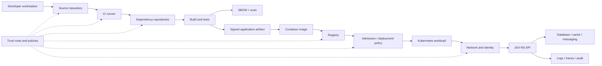
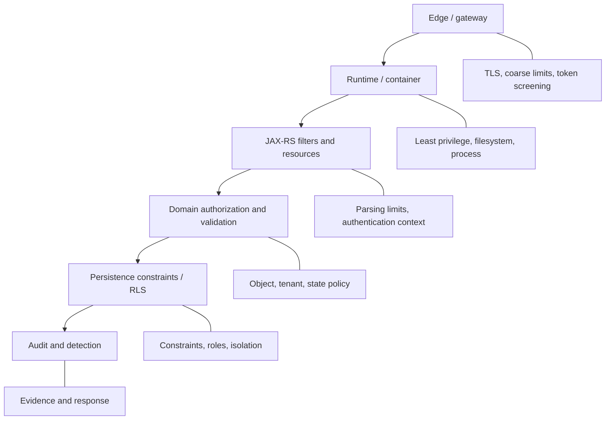
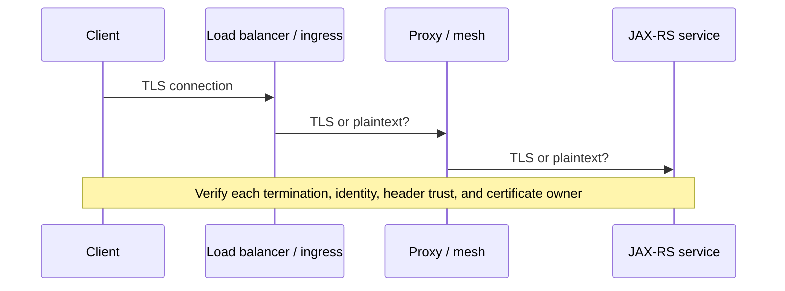
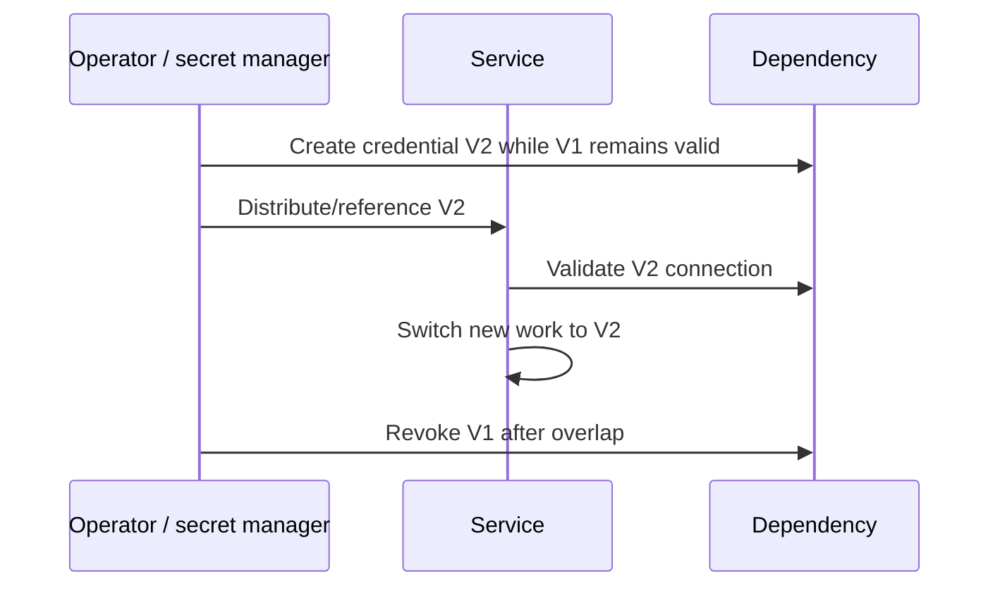
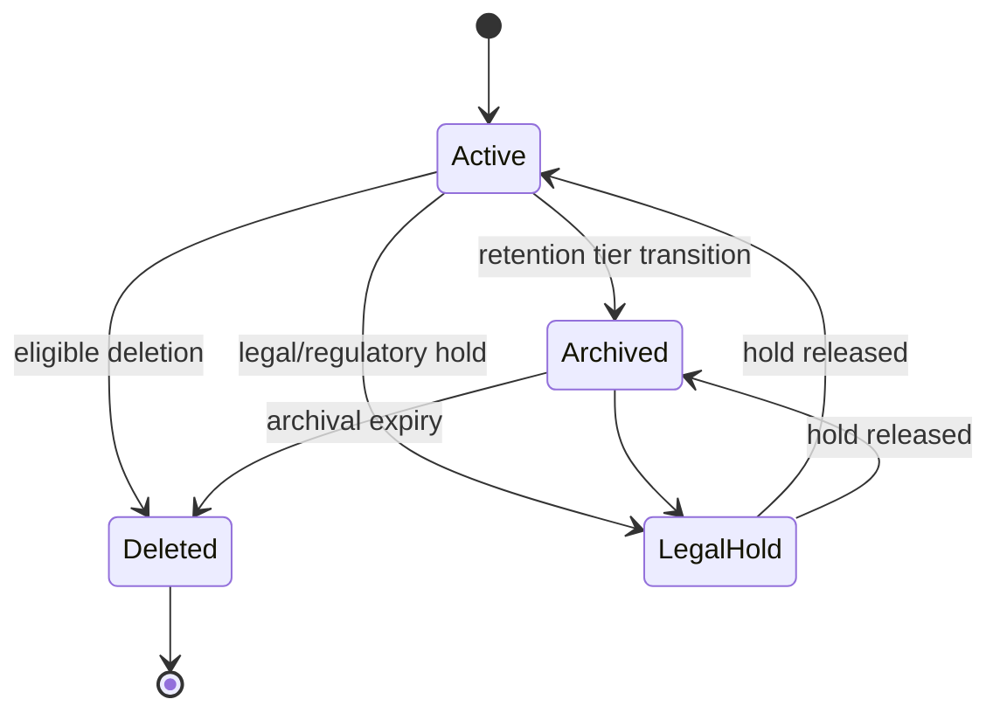
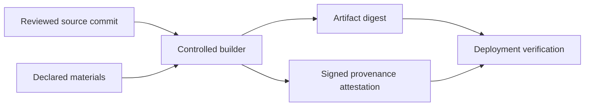
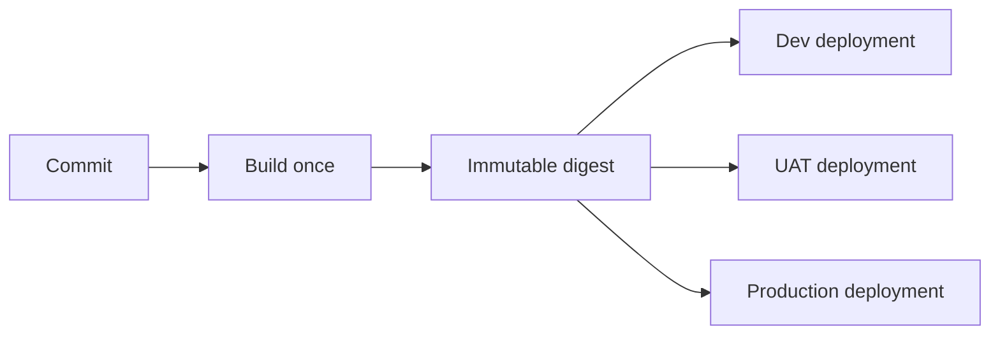
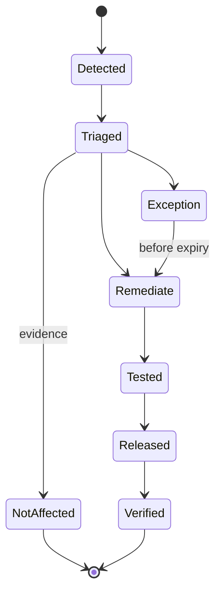

# Part 027 — Security Hardening, Data Protection, and Software Supply Chain

> Security production bukan satu filter authentication, satu scanner dependency, atau satu checkbox compliance. Security adalah rangkaian invariant yang harus tetap benar dari source code, dependency resolution, build environment, artifact publication, container execution, network communication, data processing, observability, hingga incident response. Satu lapisan yang benar tidak menutupi trust boundary lain yang salah.

## Daftar Isi

1. [Target kompetensi](#target-kompetensi)
2. [Scope dan baseline](#scope-dan-baseline)
3. [Standard versus implementation-specific boundary](#standard-versus-implementation-specific-boundary)
4. [Mental model: end-to-end security chain](#mental-model-end-to-end-security-chain)
5. [Security invariants](#security-invariants)
6. [Threat model sebelum hardening](#threat-model-sebelum-hardening)
7. [Defense in depth dan shared responsibility](#defense-in-depth-dan-shared-responsibility)
8. [Transport security dan TLS](#transport-security-dan-tls)
9. [mTLS dan service identity](#mtls-dan-service-identity)
10. [Certificate lifecycle dan rotation](#certificate-lifecycle-dan-rotation)
11. [Token issuer, audience, purpose, dan clock skew](#token-issuer-audience-purpose-dan-clock-skew)
12. [Cryptographic key lifecycle](#cryptographic-key-lifecycle)
13. [Secret classification dan ownership](#secret-classification-dan-ownership)
14. [Secret retrieval dan in-memory handling](#secret-retrieval-dan-in-memory-handling)
15. [Secret rotation tanpa outage](#secret-rotation-tanpa-outage)
16. [Configuration bukan secret](#configuration-bukan-secret)
17. [Sensitive data classification](#sensitive-data-classification)
18. [PII dan commercial-sensitive data](#pii-dan-commercial-sensitive-data)
19. [Data minimization](#data-minimization)
20. [Encryption in transit dan at rest](#encryption-in-transit-dan-at-rest)
21. [Field-level encryption dan tokenization](#field-level-encryption-dan-tokenization)
22. [Log redaction dan structured logging](#log-redaction-dan-structured-logging)
23. [Audit trail versus application log](#audit-trail-versus-application-log)
24. [Audit integrity dan actor semantics](#audit-integrity-dan-actor-semantics)
25. [Data retention, archival, dan deletion](#data-retention-archival-dan-deletion)
26. [JAX-RS request hardening](#jax-rs-request-hardening)
27. [Response hardening dan information disclosure](#response-hardening-dan-information-disclosure)
28. [Serialization dan deserialization hardening](#serialization-dan-deserialization-hardening)
29. [File dan multipart hardening](#file-dan-multipart-hardening)
30. [Outbound integration hardening](#outbound-integration-hardening)
31. [Runtime least privilege](#runtime-least-privilege)
32. [Kubernetes workload hardening](#kubernetes-workload-hardening)
33. [Network egress control](#network-egress-control)
34. [Dependency threat model](#dependency-threat-model)
35. [Maven dependency governance](#maven-dependency-governance)
36. [Dependency confusion, typosquatting, dan repository trust](#dependency-confusion-typosquatting-dan-repository-trust)
37. [Software Composition Analysis](#software-composition-analysis)
38. [Vulnerability severity dan exploitability](#vulnerability-severity-dan-exploitability)
39. [SBOM](#sbom)
40. [Container image scanning](#container-image-scanning)
41. [Artifact signing dan verification](#artifact-signing-dan-verification)
42. [Build provenance dan SLSA mental model](#build-provenance-dan-slsa-mental-model)
43. [Build isolation dan CI credentials](#build-isolation-dan-ci-credentials)
44. [Source repository dan branch protection](#source-repository-dan-branch-protection)
45. [Release promotion dan immutable artifacts](#release-promotion-dan-immutable-artifacts)
46. [Third-party component dan vendor risk](#third-party-component-dan-vendor-risk)
47. [Vulnerability response lifecycle](#vulnerability-response-lifecycle)
48. [Exception, waiver, dan risk acceptance](#exception-waiver-dan-risk-acceptance)
49. [Security telemetry dan detection](#security-telemetry-dan-detection)
50. [Failure-model matrix](#failure-model-matrix)
51. [Debugging dan investigation playbook](#debugging-dan-investigation-playbook)
52. [Testing strategy](#testing-strategy)
53. [Architecture patterns](#architecture-patterns)
54. [Anti-patterns](#anti-patterns)
55. [PR review checklist](#pr-review-checklist)
56. [Trade-off yang harus dipahami senior engineer](#trade-off-yang-harus-dipahami-senior-engineer)
57. [Internal verification checklist](#internal-verification-checklist)
58. [Latihan verifikasi](#latihan-verifikasi)
59. [Ringkasan](#ringkasan)
60. [Referensi resmi](#referensi-resmi)

---

## Target kompetensi

Setelah menyelesaikan part ini, Anda harus mampu:

- memodelkan security sebagai chain of trust dari source sampai runtime;
- membedakan authentication, authorization, transport identity, workload identity, secret, cryptographic key, dan business-sensitive data;
- menilai kapan TLS cukup dan kapan mTLS atau sender-constrained identity dibutuhkan;
- mendesain certificate, key, token, dan secret rotation tanpa restart serentak atau outage;
- mengidentifikasi data pribadi, credential, commercial terms, pricing, contract, quote, order, dan tenant metadata yang tidak boleh bocor ke log;
- membedakan application log, security event, dan audit trail;
- menyusun retention, archival, legal hold, dan deletion workflow yang dapat dibuktikan;
- mengeraskan JAX-RS request/response, serializer, multipart, file, dan outbound HTTP boundaries;
- menerapkan least privilege pada process, filesystem, container, service account, database role, dan cloud identity;
- menjelaskan dependency confusion, typosquatting, malicious transitive dependency, compromised repository, dan poisoned build runner;
- menggunakan Maven dependency management, SCA, SBOM, image scanning, artifact signing, dan provenance sebagai control yang saling melengkapi;
- membedakan severity score dari exploitability aktual dan exposure runtime;
- mendesain vulnerability remediation, exception, compensating control, dan expiry;
- melakukan PR dan architecture review terhadap security baseline secara evidence-driven;
- menyusun **Internal verification checklist** tanpa mengarang tooling atau standard internal CSG.

---

## Scope dan baseline

Baseline yang digunakan:

- Java 17+;
- Jakarta REST/JAX-RS application;
- Jersey, Servlet container, standalone runtime, atau Jakarta EE runtime yang belum dikonfirmasi;
- Maven build;
- container dan Kubernetes deployment;
- PostgreSQL, Kafka, Redis, cloud SDK, dan external HTTP integrations;
- OAuth/OIDC/JWT serta authorization model dari Part 025–026;
- OpenTelemetry dan structured logging dari Part 023;
- multi-tenant quote/order/catalog context;
- CI/CD, artifact registry, container registry, dan GitOps/IaC yang detailnya harus diverifikasi.

Part ini tidak mengasumsikan bahwa internal system menggunakan:

- service mesh;
- mTLS end-to-end;
- SPIFFE/SPIRE;
- HashiCorp Vault;
- AWS Secrets Manager;
- Azure Key Vault;
- Kubernetes Secrets langsung;
- SOPS, Sealed Secrets, atau External Secrets Operator;
- Maven Central secara langsung;
- Nexus, Artifactory, GitHub Packages, Azure Artifacts, atau repository tertentu;
- Snyk, Trivy, Grype, OWASP Dependency-Check, Mend, Black Duck, atau scanner tertentu;
- CycloneDX atau SPDX tertentu;
- Sigstore/Cosign;
- in-toto attestations;
- SLSA level tertentu;
- distroless image;
- admission controller;
- mandatory policy-as-code;
- one universal data-retention period.

Semua harus diverifikasi melalui source, POM, repository settings, pipeline definitions, registry configuration, deployment manifests, cloud IAM, certificate management, secret store, security baseline, compliance documents, runbooks, dan incident history.

---

## Standard versus implementation-specific boundary

| Area | Standard/concept | Implementation-specific | Internal verification |
|---|---|---|---|
| TLS | IETF TLS specifications | JDK/provider, proxy, ingress | TLS termination points |
| mTLS | Mutual certificate authentication | Mesh, ingress, app client | Where client cert is validated |
| JWT validation | OAuth/OIDC/JOSE standards | Identity provider/library | Issuer/audience policy |
| Secret storage | Security architecture | Cloud/Kubernetes/Vault product | Source of truth |
| Secret rotation | Lifecycle requirement | Dual credential, reload mechanism | Rotation process |
| PII classification | Privacy/security governance | Internal taxonomy | Data classes |
| Audit trail | Integrity/accountability requirement | Database/event/SIEM implementation | Required events and retention |
| Dependency graph | Maven model | Parent POM/BOM/internal plugins | Approved repositories |
| SCA | Supply-chain control | Scanner/product/rules | Gate and SLA |
| SBOM | CycloneDX/SPDX ecosystems | Generator and registry | Required format |
| Image scanning | Container control | Scanner and registry | Blocking policy |
| Signing | Cryptographic authenticity | Sigstore/GPG/cloud signing | Trust roots |
| Provenance | Build attestation concept | SLSA/in-toto implementation | Required assurance |
| Admission policy | Deployment control | Kyverno/Gatekeeper/cloud policy | Enforcement scope |

Key principle:

> Standard menentukan format atau protocol; implementation menentukan mekanisme; organisasi menentukan policy, trust roots, severity thresholds, exception process, dan ownership.

---

## Mental model: end-to-end security chain



Security chain gagal apabila salah satu kondisi berikut terjadi:

- source yang dibangun bukan source yang direview;
- dependency berasal dari repository yang tidak dipercaya;
- build runner dapat dimodifikasi pihak yang tidak berwenang;
- artifact dapat diganti setelah scan/signing;
- image yang dideploy berbeda dari image yang disetujui;
- workload memperoleh credential lebih luas dari kebutuhannya;
- request dipercaya karena datang dari network internal;
- sensitive data bocor melalui logs, traces, metrics, exceptions, atau audit payload;
- vulnerability diketahui tetapi ownership dan remediation SLA tidak jelas.

---

## Security invariants

Invariants yang harus dipertahankan:

1. **Every trust decision has an explicit trust root.**
2. **Every credential has an owner, scope, expiry, and rotation mechanism.**
3. **Every sensitive field has a classification and allowed destinations.**
4. **Every executable artifact is traceable to reviewed source and a controlled build.**
5. **Every dependency is versioned, attributable, and governed.**
6. **Every workload runs with least privilege and bounded network reachability.**
7. **Every security-relevant action is observable without exposing secrets.**
8. **Every exception or waiver expires and has compensating controls.**
9. **No internal network location is treated as proof of identity.**
10. **No scanner result alone is treated as proof of safety.**

Untuk CPQ/order context, additional invariants dapat mencakup:

- pricing rules dan commercial terms tidak muncul dalam unauthorized logs;
- quote/order document download harus mempertahankan tenant dan object-level authorization;
- administrative override, repricing, cancellation, dan approval bypass harus diaudit;
- catalog/pricing configuration artifacts harus memiliki provenance dan controlled promotion;
- service-to-service calls yang memodifikasi order state harus memiliki authenticated workload identity.

---

## Threat model sebelum hardening

Hardening tanpa threat model menghasilkan control yang mahal tetapi tidak menyelesaikan risiko utama.

Minimum threat model:

| Asset | Threat actor | Entry path | Failure consequence |
|---|---|---|---|
| Customer/tenant data | External attacker | API, file upload, stolen token | Confidentiality breach |
| Pricing/catalog rules | Insider or compromised account | Admin API, config repo | Commercial manipulation |
| Order state | Malicious client/service | API/event replay | Integrity breach |
| Secrets | Attacker or accidental logging | env, files, logs, heap dump | Lateral movement |
| Build pipeline | Supply-chain attacker | dependency, runner, plugin | Malicious artifact |
| Container registry | Compromised credential | image push/tag overwrite | Unauthorized deployment |
| Audit evidence | Privileged operator | DB/log mutation | Loss of accountability |
| Availability | Bot or cascading client | expensive endpoints/retry | Resource exhaustion |

Threat model harus menyatakan:

- trust boundaries;
- assets dan data classes;
- privileged operations;
- externally controlled inputs;
- transitive dependencies;
- security control owners;
- detection and response path;
- accepted residual risk.

---

## Defense in depth dan shared responsibility

Defense in depth bukan duplikasi acak. Setiap layer harus menangani failure yang mungkin lolos dari layer sebelumnya.



Shared responsibility harus jelas:

- platform team mungkin mengelola ingress TLS, tetapi application tetap harus memahami forwarded identity dan TLS assumptions;
- cloud provider mengamankan physical infrastructure, bukan permission aplikasi;
- registry scanner mendeteksi packages, bukan business-logic vulnerability;
- service mesh dapat mengautentikasi workload, tetapi tidak menentukan apakah workload boleh mengubah order tertentu;
- database encryption at rest tidak mencegah privileged query atau sensitive logging.

---

## Transport security dan TLS

TLS memberikan:

- confidentiality selama transit;
- integrity terhadap modification selama transit;
- authentication server melalui certificate chain;
- optional client authentication pada mTLS.

TLS tidak memberikan:

- authorization operation;
- tenant isolation;
- protection setelah plaintext masuk process;
- protection dari compromised endpoint;
- proof bahwa forwarded headers dapat dipercaya;
- business-message integrity setelah termination dan re-encryption.

Review transport path secara end-to-end:



Hal yang perlu diperiksa:

- minimum protocol version;
- allowed cipher suites jika diatur;
- certificate hostname/SAN validation;
- trust store ownership;
- hostname verification tidak dinonaktifkan;
- outbound client tidak menggunakan permissive trust manager;
- forwarded proto/host/client-cert headers hanya dipercaya dari known proxy;
- internal plaintext segments diketahui dan risk-accepted, bukan kebetulan.

---

## mTLS dan service identity

mTLS mengautentikasi kedua endpoint melalui certificate. Nilai utamanya adalah workload identity yang cryptographically bound pada connection.

mTLS tidak otomatis menyelesaikan:

- application authorization;
- confused deputy;
- user delegation;
- compromised workload;
- certificate over-privilege;
- certificate replay selama private key masih dapat digunakan;
- authorization setelah traffic melewati proxy yang men-terminate mTLS.

Service identity model harus menjawab:

- siapa issuer certificate;
- bagaimana identity direpresentasikan pada SAN;
- siapa yang boleh meminta certificate;
- berapa lifetime certificate;
- bagaimana revocation/rotation terjadi;
- apakah application menerima direct client certificate atau identity header dari trusted proxy;
- bagaimana identity dipetakan ke service permission;
- apakah outbound connection melakukan hostname dan peer identity verification.

Contoh domain decision:

```java
public record WorkloadIdentity(String serviceName, String environment) {}

public interface ServiceAuthorization {
    void requireCanSubmitOrder(WorkloadIdentity caller, String tenantId);
}
```

Certificate identity harus diubah menjadi typed context; jangan menyebarkan raw certificate parsing ke seluruh domain code.

---

## Certificate lifecycle dan rotation

Certificate lifecycle:

```text
issue → distribute → activate → overlap → retire → revoke/expire → destroy private key
```

Rotation aman biasanya membutuhkan overlap:

1. trust bundle menerima old dan new issuer/key;
2. endpoints mulai menerima keduanya;
3. new certificate didistribusikan;
4. traffic berpindah;
5. old certificate dipensiunkan;
6. trust old chain dihapus setelah safe window.

Failure modes:

- simultaneous expiration;
- trust bundle belum ter-update;
- keystore reload tidak didukung;
- certificate ada tetapi private key mismatch;
- pod menggunakan mounted secret lama;
- clock skew membuat certificate dianggap belum valid atau expired;
- one replica gagal reload dan menghasilkan intermittent failures;
- outbound client cache mempertahankan old SSL context.

Operational evidence harus mencakup expiry dashboards dan pre-expiry alerts, bukan mengandalkan kalender manual.

---

## Token issuer, audience, purpose, dan clock skew

Detail protocol dibahas pada Part 025. Hardening baseline:

- allow-list issuer;
- exact audience validation;
- explicit algorithm allow-list;
- validate token type/purpose;
- reject ID token pada access-token boundary;
- validate `exp`, `nbf`, dan policy untuk `iat`;
- bounded clock skew;
- verify tenant/client semantics;
- cache JWKS dengan safe refresh;
- never log raw token;
- never accept unsigned or algorithm-confused token;
- distinguish authentication failure from authorization denial.

Security review harus mencari “decode-only validation”:

```java
// Anti-pattern: parsing claims is not trust establishment.
DecodedJwt jwt = decodeWithoutSignatureVerification(rawToken);
return new UserIdentity(jwt.subject());
```

Setiap token verifier harus memiliki tests untuk wrong issuer, wrong audience, expired, future `nbf`, unknown key, key rotation, malformed token, wrong token type, dan tenant mismatch.

---

## Cryptographic key lifecycle

Key bukan secret biasa. Key lifecycle harus menyatakan:

- purpose: signing, encryption, TLS, database encryption, HMAC;
- algorithm dan key size policy;
- generation source;
- storage/HSM/KMS ownership;
- usage permissions;
- rotation schedule;
- versioning;
- decryption/verification compatibility window;
- revocation;
- backup and recovery;
- destruction evidence.

Key rotation berbeda berdasarkan purpose:

- signing key: verifier perlu old public key selama token/message lama masih valid;
- encryption key: old key mungkin tetap dibutuhkan untuk decrypt historical data;
- HMAC key: dual verification dapat diperlukan selama transition;
- TLS key: connection baru menggunakan certificate baru, connection lama dapat tetap hidup;
- data key envelope encryption: master key rotation tidak selalu me-reencrypt seluruh payload secara langsung.

Jangan mengimplementasikan custom cryptography ketika standard library, KMS, atau vetted protocol tersedia.

---

## Secret classification dan ownership

Contoh secrets:

- database password;
- Kafka SASL credential;
- client secret;
- private key;
- API key;
- signing secret;
- webhook verification secret;
- cloud access key;
- service account token;
- encryption key material.

Untuk setiap secret, catat:

| Field | Question |
|---|---|
| Owner | Team/service mana bertanggung jawab? |
| Consumer | Workload mana boleh membaca? |
| Scope | Resource/environment/tenant apa? |
| Rotation | Otomatis atau manual? |
| Lifetime | Berapa lama valid? |
| Storage | Source of truth di mana? |
| Delivery | Bagaimana mencapai process? |
| Reload | Perlu restart atau live reload? |
| Audit | Siapa membaca atau mengubah? |
| Revocation | Bagaimana emergency revoke? |

Long-lived shared credentials memperbesar blast radius dan membuat attribution buruk.

---

## Secret retrieval dan in-memory handling

Preferred properties:

- workload mengambil secret menggunakan workload identity;
- least-privilege read permission;
- secret tidak disimpan di image atau source;
- plaintext lifetime sesingkat mungkin;
- secret tidak muncul dalam exception, logs, traces, metrics, command-line args, thread dump labels, atau diagnostic endpoints;
- cache memiliki explicit TTL dan reload semantics;
- failure mengambil secret memengaruhi readiness secara terkontrol;
- refresh tidak menghasilkan request storm ke secret store.

Environment variables populer tetapi memiliki trade-off:

- mudah digunakan;
- sulit di-rotate tanpa process restart;
- dapat muncul pada process inspection atau diagnostic dump tergantung platform;
- raw values tersebar pada deployment configuration;
- tidak memiliki typed reload semantics.

File-mounted secrets juga perlu:

- atomic update behavior;
- file permission;
- symlink/update handling;
- reload trigger;
- deletion/retention behavior;
- protection dari accidental static-file serving.

---

## Secret rotation tanpa outage

Generic dual-credential pattern:



Database credential rotation dapat menggunakan:

- second database role/user;
- pool drain and recreation;
- connection validation;
- overlapping validity;
- rollback to old credential until V2 proven.

Rotation anti-pattern:

- overwrite secret dan revoke old credential sebelum all replicas reload;
- restart seluruh fleet serentak;
- no metric untuk credential version;
- no way mengetahui pod mana masih menggunakan old secret;
- no emergency rollback.

---

## Configuration bukan secret

Pisahkan:

- **configuration**: timeout, endpoint, feature flag, pool size;
- **secret reference**: identifier/path ke secret;
- **secret value**: credential material;
- **runtime state**: current credential version, last refresh time;
- **business data**: tenant pricing/catalog/order information.

Contoh typed configuration:

```java
public record DatabaseConfig(
        URI jdbcEndpoint,
        String credentialReference,
        Duration connectionTimeout) {
}
```

Jangan memasukkan raw password ke DTO konfigurasi yang mudah di-serialize atau dicetak oleh generated `toString()`.

---

## Sensitive data classification

Data classification harus mengendalikan:

- storage location;
- encryption;
- access controls;
- logging;
- tracing;
- export;
- retention;
- deletion;
- replication;
- environment usage;
- test fixture policy.

Illustrative classes:

| Class | Example | Handling expectation |
|---|---|---|
| Public | Public product description | Broad distribution allowed |
| Internal | Internal service topology | No public disclosure |
| Confidential | Pricing rule, contract term | Need-to-know, encrypted, audited |
| Restricted | Credential, private key, regulated PII | Strongest controls, no logging |

Internal taxonomy may differ. Use organization-defined classification, not this table as policy.

---

## PII dan commercial-sensitive data

In quote/order systems, sensitive data may include:

- customer identity and contact details;
- account identifiers;
- billing and delivery information;
- negotiated prices and discounts;
- contract terms;
- tax identifiers;
- product eligibility results;
- sales channel and partner information;
- internal approval comments;
- payment references;
- service addresses;
- usage or provisioning details.

Security review harus mempertanyakan:

- apakah field benar-benar dibutuhkan pada endpoint;
- apakah field masuk event meskipun consumer tidak memerlukan;
- apakah payload lengkap dicatat pada error;
- apakah test data berasal dari production dump;
- apakah traces membawa request/response body;
- apakah export memiliki retention dan download authorization;
- apakah generated support bundle mengandung data pelanggan.

---

## Data minimization

Data minimization:

- collect only what is required;
- expose only what caller needs;
- propagate only what downstream needs;
- retain only as long as required;
- index only fields that need search;
- avoid copying sensitive payload into multiple stores;
- avoid whole-object events when a small event contract suffices.

Example:

```java
public record OrderCreatedEvent(
        UUID eventId,
        UUID orderId,
        String tenantId,
        Instant occurredAt) {}
```

Event di atas lebih aman daripada menyertakan entire customer/order object apabila consumer hanya membutuhkan identifier.

---

## Encryption in transit dan at rest

Encryption at rest melindungi media/storage tertentu, tetapi tidak melindungi data saat:

- process yang berwenang membacanya;
- query berjalan;
- plaintext dicatat ke log;
- operator memiliki excessive privilege;
- application mengirim data ke tujuan salah.

Review layers:

- disk/volume encryption;
- database storage encryption;
- object storage encryption;
- backup encryption;
- snapshot encryption;
- message broker storage encryption;
- log storage encryption;
- key ownership and access logging.

Encryption harus disertai authorization dan key lifecycle yang benar.

---

## Field-level encryption dan tokenization

Field-level encryption berguna ketika storage administrator atau broad DB access tidak boleh melihat plaintext tertentu.

Trade-offs:

- query/search/sort menjadi sulit;
- key rotation kompleks;
- indexing terbatas;
- equality search dapat memerlukan deterministic encryption dengan leakage;
- application availability bergantung pada KMS/key access;
- ciphertext expansion;
- migration and backfill complexity.

Tokenization mengganti value dengan token yang dipetakan di secure vault. Cocok untuk reducing exposure, tetapi menambah external dependency dan reconciliation concerns.

Gunakan hanya jika threat model membenarkan complexity.

---

## Log redaction dan structured logging

Logging policy harus berbasis allow-list, bukan berharap regex redaction menemukan seluruh secret.

Recommended fields:

- timestamp;
- level;
- service/version/environment;
- trace ID/span ID;
- correlation ID/causation ID;
- operation name;
- route template, bukan raw URI dengan sensitive query;
- tenant pseudonymous/internal identifier bila diizinkan;
- outcome/error code;
- duration;
- dependency name;
- actor/service identifier sesuai policy.

Avoid:

- raw Authorization header;
- cookies;
- client secret;
- API key;
- private key;
- entire request/response body;
- signed URLs;
- connection strings dengan password;
- unbounded exception context;
- sensitive query parameters;
- payment or regulated identifiers.

Example redaction utility:

```java
public final class SecurityLog {
    private SecurityLog() {}

    public static String safeTokenFingerprint(String token) {
        if (token == null || token.isBlank()) {
            return "absent";
        }
        // Illustrative only: use an approved one-way fingerprint mechanism.
        return "present:length=" + token.length();
    }
}
```

Lebih baik mencatat metadata keberadaan/versi daripada token itu sendiri.

---

## Audit trail versus application log

| Aspect | Application log | Audit trail |
|---|---|---|
| Purpose | Diagnose operation | Accountability and evidence |
| Retention | Operational | Governance/compliance-driven |
| Mutability | Log platform dependent | Strong integrity expectation |
| Granularity | Technical events | Security/business-significant actions |
| Actor semantics | Optional | Required |
| Before/after | Usually no | Sometimes required |
| Access | Engineering/operations | Restricted and reviewed |

Audit candidates:

- login or authentication failure where required;
- role/permission changes;
- tenant membership changes;
- quote approval/rejection;
- pricing override;
- order cancellation;
- administrative impersonation;
- break-glass activation;
- sensitive export/download;
- secret or key administration;
- retention/deletion execution;
- policy/configuration change.

Do not turn audit trail into a dump of sensitive payloads.

---

## Audit integrity dan actor semantics

Audit record harus dapat menjawab:

- who initiated the action;
- on whose behalf;
- which service executed it;
- what action occurred;
- which resource and tenant;
- when;
- request/correlation/trace identifiers;
- reason or ticket for privileged action;
- result;
- source channel;
- policy version where relevant.

Example model:

```java
public record AuditActor(
        String actorId,
        String subjectId,
        String clientId,
        String serviceIdentity,
        boolean impersonated) {}
```

Actor dan subject berbeda pada delegation atau impersonation. Menghilangkan distinction ini merusak accountability.

Audit integrity options:

- append-only store;
- restricted write path;
- separate security account/project;
- tamper-evident chaining or signing for high-assurance cases;
- immutable retention controls;
- independent export to SIEM;
- reconciliation between source transactions and audit events.

---

## Data retention, archival, dan deletion

Retention lifecycle:



Retention design harus mencakup:

- source-of-truth policy;
- record categories;
- tenant/jurisdiction variation;
- legal hold;
- backups and replicas;
- search index/cache/event copies;
- audit retention;
- deletion evidence;
- failed job recovery;
- referential constraints;
- anonymization versus deletion;
- downstream notification.

“Deleted from primary table” bukan bukti bahwa data hilang dari backups, logs, object storage, events, analytics, dan support exports.

---

## JAX-RS request hardening

Request boundary controls:

- maximum request size;
- maximum header count and size;
- timeout for headers/body;
- content type allow-list;
- content encoding limits;
- decompression ratio limits;
- JSON/XML nesting and token limits;
- collection size limits;
- string length constraints;
- multipart part count and size;
- URI/path/query length limits;
- validation before expensive work;
- authentication before high-cost parsing where runtime permits;
- rate limiting and concurrency limits;
- canonicalization rules.

Illustrative JAX-RS filter:

```java
@Provider
@Priority(Priorities.AUTHENTICATION - 100)
public final class RequiredContentTypeFilter implements ContainerRequestFilter {
    @Override
    public void filter(ContainerRequestContext request) {
        if (request.hasEntity()
                && request.getMediaType() != null
                && !request.getMediaType().isCompatible(MediaType.APPLICATION_JSON_TYPE)) {
            request.abortWith(Response.status(Response.Status.UNSUPPORTED_MEDIA_TYPE).build());
        }
    }
}
```

Contoh hanya cocok untuk endpoint JSON-only; global filter dapat merusak multipart atau binary endpoints. Scope dengan name binding atau route-specific policy.

---

## Response hardening dan information disclosure

Response hardening:

- stable external error codes;
- no stack trace;
- no SQL or internal hostname;
- no raw dependency response;
- no secret/config value;
- no authorization reasoning that reveals hidden resources;
- explicit content type;
- cache policy for sensitive responses;
- download headers protected from injection;
- CORS policy explicit;
- compression considered against secret-reflection risks;
- security headers owned at gateway or application and tested end-to-end.

Example external error:

```json
{
  "type": "https://errors.example.invalid/order-not-available",
  "title": "Order operation could not be completed",
  "status": 409,
  "code": "ORDER_STATE_CONFLICT",
  "traceId": "01J..."
}
```

Internal exception remains in restricted logs with redaction.

---

## Serialization dan deserialization hardening

Risks:

- unsafe polymorphic deserialization;
- gadget chains;
- unknown-field ambiguity;
- duplicate JSON keys;
- excessive nesting;
- oversized numeric/string values;
- XML external entities;
- entity expansion;
- schema bypass;
- deserializing directly into domain/entity objects;
- accidental field exposure.

Controls:

- dedicated request/response DTOs;
- polymorphism allow-list;
- disable unsafe default typing;
- secure XML parser configuration;
- size/depth constraints;
- explicit unknown-field policy;
- Bean Validation;
- fuzz and negative tests;
- deterministic serialization for signed payloads;
- versioned contracts.

Serializer global configuration is security-sensitive and should be centrally reviewed.

---

## File dan multipart hardening

File boundary controls from Part 015, extended for security:

- never trust client filename;
- generate storage key server-side;
- validate actual content, not only extension/content type;
- enforce size and part limits before buffering;
- stream with bounded memory;
- quarantine before publish;
- malware scanning where required;
- block archive path traversal and zip bombs;
- protect signed download URLs;
- separate upload and executable/static serving domains;
- no execution permission;
- tenant/object authorization on upload and download;
- retention and deletion integration;
- checksum and integrity verification;
- audit sensitive exports.

A valid malware scan does not mean a file is safe for every parser. Parser-specific vulnerabilities and business validation remain relevant.

---

## Outbound integration hardening

Outbound HTTP/cloud/database clients must:

- use trusted endpoints;
- validate hostname and certificates;
- avoid disabled TLS verification;
- control redirects;
- prevent SSRF;
- limit DNS/connection/read timeout;
- bound response size;
- redact credentials;
- validate response content type;
- treat dependency error payload as untrusted;
- avoid forwarding user headers blindly;
- use service-specific credentials;
- restrict egress where possible.

SSRF controls:

- allow-list destination service identifiers;
- resolve endpoints from trusted configuration;
- reject arbitrary schemes;
- consider DNS rebinding;
- block metadata/link-local/internal management addresses;
- avoid generic “fetch URL” endpoints;
- perform validation at each redirect.

---

## Runtime least privilege

Least privilege dimensions:

- process user;
- filesystem access;
- Linux capabilities;
- network destinations;
- database roles;
- Kafka ACLs;
- Redis permissions;
- object storage prefixes;
- secret paths;
- cloud API permissions;
- Kubernetes RBAC;
- service-account token audience;
- debug/attach permissions.

Application should not require:

- root;
- writable application directory;
- broad host mounts;
- host network;
- privileged mode;
- wildcard cloud permissions;
- database owner/superuser;
- Kafka cluster admin;
- read access to all secrets in namespace.

---

## Kubernetes workload hardening

Illustrative pod/container controls:

```yaml
securityContext:
  runAsNonRoot: true
  seccompProfile:
    type: RuntimeDefault
containers:
  - name: service
    securityContext:
      allowPrivilegeEscalation: false
      readOnlyRootFilesystem: true
      capabilities:
        drop: ["ALL"]
```

Additional controls:

- dedicated service account;
- `automountServiceAccountToken: false` when unnecessary;
- resource requests/limits;
- no secret in image or ConfigMap;
- network policies where supported;
- image by immutable digest;
- signed image verification if platform supports it;
- restricted debug containers;
- namespace separation;
- pod security standards/admission;
- controlled hostPath usage;
- writable ephemeral volumes only where needed.

These settings can break applications that assume writable filesystem or privileged ports. Test under production-like policy early.

---

## Network egress control

Egress control reduces blast radius of compromised workloads.

Policy questions:

- which DNS names/IP ranges are required;
- whether direct internet access is needed;
- whether dependency calls go through proxy/private endpoint;
- how dynamic cloud endpoints are represented;
- how emergency dependencies are added;
- who monitors denied egress;
- whether data exfiltration detection exists.

Egress allow-list alone is insufficient if allowed destination can be abused, but it significantly constrains arbitrary exfiltration and command-and-control channels.

---

## Dependency threat model

Dependency risk includes:

- known vulnerabilities;
- malicious package release;
- compromised maintainer account;
- abandoned project;
- dependency confusion;
- typosquatting;
- mutable repository artifact;
- compromised Maven plugin;
- build-time code execution;
- transitive version drift;
- incompatible license;
- unmaintained native library;
- vulnerable test/tool dependency entering production image.

Maven plugins execute code during build and deserve the same trust scrutiny as runtime dependencies.

---

## Maven dependency governance

Use explicit governance:

- parent POM/BOM;
- `dependencyManagement`;
- `pluginManagement`;
- Maven Enforcer rules;
- approved repositories/mirrors;
- dependency convergence checks;
- locked/controlled plugin versions;
- reproducible build settings;
- checksum/signature verification where available;
- automated update PRs;
- ownership for shared BOM;
- explicit exclusions with rationale;
- no dynamic versions such as `LATEST`/ranges unless policy allows;
- separate runtime, test, build, and annotation-processor dependencies.

Example Enforcer direction:

```xml
<plugin>
  <groupId>org.apache.maven.plugins</groupId>
  <artifactId>maven-enforcer-plugin</artifactId>
  <executions>
    <execution>
      <goals><goal>enforce</goal></goals>
      <configuration>
        <rules>
          <dependencyConvergence/>
          <requireUpperBoundDeps/>
          <requirePluginVersions/>
        </rules>
      </configuration>
    </execution>
  </executions>
</plugin>
```

Exact rules must align with internal build architecture; some large dependency graphs need managed exceptions.

---

## Dependency confusion, typosquatting, dan repository trust

Dependency confusion occurs when the build resolves a package from an unintended public repository because its coordinates/version outrank internal artifact.

Controls:

- repository manager as controlled mirror;
- block direct arbitrary repositories;
- reserve internal namespaces;
- publish placeholder/guard artifacts where policy requires;
- explicit repository precedence;
- no repository definitions hidden in transitive POM where possible;
- monitor new external artifacts matching internal coordinates;
- review unusual group/artifact names;
- inspect dependency tree in CI.

Typosquatting signs:

- near-identical artifact names;
- low adoption and recent creation;
- suspicious maintainer or repository;
- binary without source;
- unexpected post-install/build behavior;
- package requesting network or environment secrets during build.

---

## Software Composition Analysis

SCA answers:

- which components and versions are present;
- which known vulnerabilities map to them;
- what licenses apply;
- which dependency paths introduced them;
- whether fixes exist;
- whether policy gates are violated.

SCA limitations:

- false positives from unreachable code;
- false negatives from missing metadata/shaded jars;
- delayed vulnerability publication;
- no detection of custom logic flaws;
- version present does not prove vulnerable path is exploitable;
- scanner database freshness matters;
- generated native/image content may differ from Maven graph.

Pipeline should preserve dependency path evidence and remediation ownership.

---

## Vulnerability severity dan exploitability

Do not equate CVSS with operational priority automatically.

Prioritization factors:

- component reachable at runtime;
- vulnerable feature enabled;
- attacker prerequisites;
- internet/internal exposure;
- privileges gained;
- data sensitivity;
- exploit availability;
- compensating controls;
- affected environments;
- blast radius;
- patch availability and regression risk;
- known exploitation status.

Example decision record:

```text
CVE:
Affected component/path:
Runtime reachable: yes/no/evidence
Exposure:
Impact:
Compensating controls:
Fix version:
Planned remediation date:
Owner:
Exception expiry:
```

---

## SBOM

SBOM adalah inventory machine-readable, bukan vulnerability report.

Common ecosystems:

- CycloneDX;
- SPDX.

SBOM should include where possible:

- package coordinates;
- versions;
- hashes;
- dependency relationships;
- licenses;
- supplier/source metadata;
- application component identifier;
- build/version linkage.

Uses:

- incident scoping;
- vulnerability impact analysis;
- customer/compliance evidence;
- license governance;
- artifact comparison;
- dependency drift detection.

SBOM must correspond to the released artifact/image, not only source POM before shading, layering, or packaging.

---

## Container image scanning

Scan multiple stages:

1. base image selection;
2. built image before publication;
3. registry continuous rescanning;
4. pre-deployment policy;
5. running workload inventory.

Image scan includes:

- OS packages;
- Java runtime;
- application libraries when scanner supports them;
- secrets accidentally embedded;
- malware/signatures where supported;
- configuration risks.

Avoid installing build tools into runtime image. Multi-stage builds reduce attack surface, but minimal images can make emergency debugging harder. Provide approved diagnostic workflow instead of shipping a shell and package manager everywhere.

---

## Artifact signing dan verification

Signing establishes that artifact/image was approved by a trusted signer and has not changed after signing.

Signing does not prove:

- source is secure;
- build runner was uncompromised;
- reviewer understood the change;
- dependency is safe;
- runtime configuration is safe.

Verification policy should define:

- trusted identities/keys;
- accepted repositories;
- required artifact types;
- signature expiry/revocation;
- verification at promotion and deployment;
- emergency bypass controls;
- audit evidence.

Prefer immutable digests:

```text
registry.example/service@sha256:...
```

Tags such as `latest` or mutable environment tags are not sufficient deployment identity.

---

## Build provenance dan SLSA mental model

Provenance connects artifact to:

- source repository and commit;
- build definition;
- builder identity;
- dependencies/materials;
- build timestamp;
- output digest;
- invocation parameters.



SLSA provides a framework for increasing supply-chain assurance. Do not claim a SLSA level unless all requirements and evidence are actually met.

---

## Build isolation dan CI credentials

CI hardening:

- ephemeral runners when feasible;
- least-privilege repository token;
- separate read and publish credentials;
- protected environments for release;
- no long-lived cloud access keys;
- workload federation/OIDC where supported;
- secrets masked but not assumed safe merely because masking exists;
- untrusted PRs cannot access release secrets;
- dependency/build caches cannot be poisoned across trust boundaries;
- build logs do not print secrets;
- runner image is patched and controlled;
- release workflow pinned to reviewed actions/plugins;
- network access restricted where feasible.

A build process can execute arbitrary code from Maven plugins, annotation processors, tests, shell scripts, and third-party CI actions.

---

## Source repository dan branch protection

Controls:

- mandatory review;
- CODEOWNERS or equivalent for sensitive paths;
- protected branches;
- status checks;
- signed commits/tags if policy requires;
- restricted force push;
- secret scanning;
- dependency update automation;
- review for pipeline/IaC/security-policy changes;
- separate approval for release;
- audit of admin overrides.

Sensitive paths:

- authentication/authorization;
- cryptography;
- deployment and IAM;
- Maven parent/BOM/plugin configuration;
- CI workflows;
- secret/config integration;
- database migration;
- audit retention;
- artifact signing policy.

---

## Release promotion dan immutable artifacts

Build once, promote the same digest:



Rebuilding per environment can introduce:

- different dependencies;
- different compiler/plugin behavior;
- different timestamp/hash;
- unreviewed environment-specific code;
- inability to prove tested artifact equals production artifact.

Environment-specific configuration should be externalized; artifact identity should remain stable.

---

## Third-party component dan vendor risk

Evaluate:

- maintenance activity;
- security response history;
- release cadence;
- supported Java/Jakarta versions;
- transitive dependencies;
- license;
- end-of-life date;
- CVE history and patch latency;
- ability to replace or isolate;
- operational support;
- data processed or exported;
- vendor access path;
- SaaS dependency outage/security model.

For critical libraries, maintain exit strategy and version compatibility plan.

---

## Vulnerability response lifecycle



Lifecycle must define:

- intake sources;
- triage owner;
- affected-version inventory;
- exposure evidence;
- remediation SLA;
- fix validation;
- rollout plan;
- customer/security communication;
- verification in production;
- exception expiry;
- post-remediation SBOM/image rescan.

---

## Exception, waiver, dan risk acceptance

A valid exception contains:

- exact finding/component/version;
- affected services/environments;
- technical reason fix cannot be applied now;
- exploitability analysis;
- compensating controls;
- owner;
- approver;
- expiry date;
- remediation plan;
- monitoring/detection;
- re-evaluation trigger.

Anti-pattern:

```text
Accepted because scanner false positive.
```

Better:

```text
Library version is present only in test scope and excluded from runtime image.
Evidence: dependency tree, image SBOM, runtime classpath inspection.
Exception expires on YYYY-MM-DD pending scanner rule update.
```

---

## Security telemetry dan detection

Security signals:

- authentication failures by issuer/client/source;
- repeated authorization denials;
- cross-tenant access attempts;
- unusual export/download volume;
- secret retrieval failures;
- certificate expiry and handshake failures;
- signature/provenance verification failures;
- image/admission policy denials;
- new critical vulnerabilities;
- privileged operations;
- audit pipeline gaps;
- excessive 4xx/5xx on security-sensitive routes;
- unexpected outbound connections;
- configuration or role changes.

High-cardinality and sensitive labels must remain controlled. Do not put raw user email, token, customer name, or full resource ID into unrestricted metric labels.

---

## Failure-model matrix

| Failure | Cause | Detection | Containment | Recovery |
|---|---|---|---|---|
| TLS validation bypass | Permissive trust manager | Code review, TLS tests | Block release | Restore strict validation |
| Certificate expiry | Missing rotation/alert | Expiry metric, handshake errors | Overlapping certs | Issue and reload cert |
| Secret leakage in logs | Raw header/body logging | DLP/search/security alert | Restrict logs, revoke secret | Rotate and purge where possible |
| Cross-tenant data exposure | Missing tenant authorization | Audit anomaly, test, report | Disable path, isolate access | Patch and incident response |
| Compromised dependency | Malicious/CVE artifact | SCA, intelligence, behavior | Pin/block component | Upgrade/remove/rebuild |
| Dependency confusion | Wrong repository resolution | Build provenance/dependency diff | Repository mirror | Correct coordinates and rebuild |
| Vulnerable image in production | Scan/admission gap | Registry/runtime inventory | Block rollout/quarantine | Patch base/app and redeploy |
| Mutable tag replaced | Tag overwrite | Digest mismatch | Deploy by digest | Restore approved digest |
| Build secret exfiltration | Untrusted PR/plugin | CI audit/network signal | Revoke credentials | Harden workflow and rotate |
| Invalid artifact signature | Tampered/unsigned artifact | Admission verification | Deny deployment | Republish signed artifact |
| Audit event loss | Pipeline/backpressure | Sequence/reconciliation gap | Alert and protect source | Replay/reconcile |
| Retention job over-deletes | Incorrect policy/window | Counts, canary, audit | Pause job | Restore/reconcile per policy |
| Key rotation outage | No overlap/reload | Error spike/version metric | Re-enable old key | Fix trust/key rollout |
| SCA false positive backlog | Poor triage | Aging metrics | Risk-based triage | Evidence-based closure |
| Scanner false negative | Missing artifact coverage | Incident/manual analysis | Multiple controls | Improve SBOM/scanning |

---

## Debugging dan investigation playbook

### Scenario 1 — TLS handshake failure

1. Identify exact hop.
2. Capture error category: trust, hostname, protocol, certificate expiry, key mismatch.
3. Inspect certificate chain and SAN.
4. Compare trust bundle versions across replicas.
5. Confirm clock synchronization.
6. Verify SNI/hostname and proxy termination.
7. Test from same runtime/network context, not only laptop.
8. Avoid temporary “trust all” fixes.

### Scenario 2 — Secret rotation causes intermittent authentication failures

1. Identify credential version used by each replica.
2. Check pool/client cache lifecycle.
3. Verify old credential revocation timing.
4. Compare mounted secret/resource version.
5. Check reload success metrics.
6. Drain or rebuild stale clients.
7. Restore overlap if safe.

### Scenario 3 — Scanner reports critical CVE

1. Confirm exact dependency path and artifact.
2. Check runtime/image presence.
3. Verify vulnerable feature reachability.
4. Identify fixed versions and compatibility impact.
5. Determine internet/internal exposure.
6. Apply compensating controls if immediate patch impossible.
7. Create owner, deadline, and verification evidence.

### Scenario 4 — Sensitive value appears in logs

1. Restrict access and preserve incident evidence.
2. Identify value type and exposure scope.
3. Rotate/revoke credential if applicable.
4. Locate every logging path and downstream copy.
5. Patch allow-list/redaction.
6. Address retained logs/backups per policy.
7. Review alerts and customer/security reporting obligations.

### Scenario 5 — Production image differs from approved image

1. Compare deployed digest with release record.
2. Freeze further rollout.
3. Verify registry tag history and signatures.
4. Inspect GitOps/manifest mutation.
5. Restore approved immutable digest.
6. Investigate credentials and pipeline provenance.

---

## Testing strategy

### Unit tests

- redaction utilities;
- permission/role mapping;
- secret-reference parsing;
- sensitive field allow-list;
- certificate identity mapping;
- token audience/issuer policy;
- retention window calculation;
- safe error mapping.

### Integration tests

- real TLS/mTLS handshake;
- certificate rotation overlap;
- secret reload;
- outbound hostname verification;
- database least-privilege role;
- object storage prefix restrictions;
- JAX-RS request size and media-type limits;
- serializer hardening;
- multipart limits;
- audit delivery and reconciliation.

### Pipeline tests

- untrusted PR cannot access secrets;
- unsigned image is rejected;
- mutable tag policy rejected;
- SBOM generated for release artifact;
- dependency vulnerability gate behavior;
- repository allow-list;
- artifact digest promotion;
- provenance verification.

### Adversarial tests

- malformed JWT/certificate;
- SSRF payloads;
- XML entity expansion;
- polymorphic deserialization probes;
- archive traversal/bomb;
- header injection;
- log injection;
- cross-tenant access;
- dependency confusion simulation in isolated environment;
- revoked secret/certificate behavior.

---

## Architecture patterns

### Pattern 1 — Central security composition root

Security-sensitive components registered explicitly:

```text
TokenVerifier
WorkloadIdentityResolver
AuthorizationService
SecretProvider
RedactionPolicy
AuditPublisher
TLS client configuration
```

### Pattern 2 — Typed sensitive values

Avoid raw strings everywhere:

```java
public record SecretReference(String value) {
    @Override
    public String toString() {
        return "SecretReference[redacted]";
    }
}
```

### Pattern 3 — Build once, sign, attest, promote by digest

One artifact identity across environments.

### Pattern 4 — Dual-version rotation

Old/new credentials or keys overlap for bounded period.

### Pattern 5 — Security policy as testable code/config

Policy changes versioned, reviewed, tested, and observable.

### Pattern 6 — Separate audit channel

Audit events use controlled schema, restricted storage, and explicit delivery/reconciliation.

---

## Anti-patterns

- “Internal network means trusted.”
- Disabling hostname verification to fix TLS.
- Putting secrets in source, image, POM, command line, or ConfigMap.
- Logging entire requests/responses for debugging.
- Shared long-lived admin credentials.
- Running application as root/database owner.
- Using wildcard IAM or Kafka permissions.
- Depending on one scanner as the security strategy.
- Ignoring build plugins and annotation processors.
- Using mutable image tags in production.
- Rebuilding separately for every environment.
- Claiming provenance or SLSA level without evidence.
- Keeping vulnerability exceptions without expiry.
- Treating CVSS alone as remediation priority.
- Storing production data as local test fixtures.
- Assuming encryption at rest solves access control.
- Treating audit logs as ordinary debug logs.
- Rotating credentials by revoking old values first.
- Adding `trustAll` or permissive CORS as emergency permanent fix.

---

## PR review checklist

### Identity and transport

- [ ] TLS hostname and certificate validation remain enabled.
- [ ] New trust roots/endpoints are explicit and reviewed.
- [ ] mTLS/client identity semantics are documented.
- [ ] Issuer, audience, token purpose, and clock policy are explicit.
- [ ] No raw token or certificate material is logged.

### Secrets and keys

- [ ] No secret is committed or embedded in artifact/image.
- [ ] Secret scope and owner are known.
- [ ] Rotation and reload behavior are defined.
- [ ] New configuration objects do not expose secret through `toString()`.
- [ ] Cryptographic change uses approved algorithms/providers.

### Data protection

- [ ] Sensitive fields are minimized.
- [ ] Logs/traces/metrics/audit contain only approved fields.
- [ ] Retention and deletion impact is considered.
- [ ] Exports/downloads preserve tenant/object authorization.
- [ ] Test data does not contain production-sensitive information.

### JAX-RS boundary

- [ ] Request/body/header/multipart limits are bounded.
- [ ] Serialization configuration is safe.
- [ ] Error responses do not disclose internals.
- [ ] Outbound URLs cannot be attacker-controlled without strict validation.
- [ ] File paths and filenames are not trusted.

### Runtime and platform

- [ ] Workload uses least privilege.
- [ ] Image runs non-root where feasible.
- [ ] Filesystem and capabilities are restricted.
- [ ] Network egress requirements are bounded.
- [ ] Debug mechanisms are controlled.

### Supply chain

- [ ] New dependency/plugin is necessary and maintained.
- [ ] Version is governed through BOM/dependency management.
- [ ] Repository source is trusted.
- [ ] SCA/SBOM/image scan results are reviewed.
- [ ] Artifact/image identity is immutable.
- [ ] Signing/provenance requirements are preserved.
- [ ] CI changes do not expose release credentials to untrusted code.

### Operations

- [ ] Security-relevant failures are observable.
- [ ] Runbook and owner exist.
- [ ] Exception has evidence, compensating control, and expiry.
- [ ] Rollback/roll-forward does not reintroduce revoked credentials or vulnerable artifacts.

---

## Trade-off yang harus dipahami senior engineer

### Security versus availability

Strict dependency, signature, or certificate policies can block deployment. The answer is controlled emergency procedure, not disabling controls permanently.

### Rotation frequency versus operational complexity

Short-lived credentials reduce exposure but require reliable automation, reload, and observability.

### Minimal images versus debuggability

Minimal/distroless images reduce attack surface but require external diagnostics, ephemeral debug containers, or dedicated tooling.

### Field encryption versus query capability

Stronger data isolation may remove efficient search/sort/index options.

### Full audit versus data minimization

Audit needs evidence, but excessive payload creates privacy and breach risk.

### Fast patching versus regression risk

Critical patch speed matters, but uncontrolled dependency upgrades can break compatibility. Use risk-based release paths and strong tests.

### Central policy versus team autonomy

Central BOM, scanner, and admission rules improve consistency but can become bottlenecks. Provide versioned standards, exception workflow, and self-service evidence.

### Runtime scanning versus privacy/performance

Deep monitoring can expose data or consume resources. Instrument only necessary signals.

---

## Internal verification checklist

### Security baseline

- [ ] Security coding standard and approved cryptography baseline.
- [ ] Mandatory TLS versions and termination points.
- [ ] Whether mTLS/service mesh/workload certificates are used.
- [ ] Service identity mapping and certificate issuer.
- [ ] Approved token issuers, audiences, algorithms, and clock skew.

### Secrets and keys

- [ ] Secret source of truth.
- [ ] Cloud/Kubernetes/Vault integration.
- [ ] Secret rotation ownership and SLA.
- [ ] Reload versus restart behavior.
- [ ] Key management/KMS/HSM usage.
- [ ] Emergency revocation procedure.

### Data governance

- [ ] Internal data-classification taxonomy.
- [ ] PII and commercial-sensitive fields.
- [ ] Log/tracing redaction rules.
- [ ] Audit event catalog and schema.
- [ ] Data-retention, archival, legal hold, and deletion rules.
- [ ] Production data use in lower environments.

### JAX-RS/runtime

- [ ] Request/header/body/multipart limits.
- [ ] XML/JSON parser hardening.
- [ ] Error response policy.
- [ ] CORS/security header ownership.
- [ ] Outbound TLS and proxy configuration.
- [ ] SSRF controls.

### Maven and dependency governance

- [ ] Parent POM and internal BOM.
- [ ] Approved Maven repositories/mirror.
- [ ] Enforcer and dependency-convergence rules.
- [ ] Plugin governance.
- [ ] Automated dependency update tooling.
- [ ] License policy.

### SCA/SBOM/container

- [ ] SCA tool and vulnerability database source.
- [ ] Severity/exploitability gate.
- [ ] Remediation SLA.
- [ ] CycloneDX/SPDX requirement.
- [ ] Image scanner and registry rescan behavior.
- [ ] Base-image ownership and update process.
- [ ] Secret scanning.

### Signing/provenance/release

- [ ] Artifact and image signing mechanism.
- [ ] Trust roots and verification point.
- [ ] Provenance/attestation generation.
- [ ] Build runner identity and isolation.
- [ ] Immutable digest promotion.
- [ ] Admission-controller policies.
- [ ] Emergency bypass and audit.

### Runtime permissions

- [ ] Container user, filesystem, capabilities, and seccomp.
- [ ] Kubernetes service account and RBAC.
- [ ] Cloud IAM/workload identity.
- [ ] Database/Kafka/Redis permissions.
- [ ] Network policy and egress controls.

### Operations

- [ ] Security alert routing.
- [ ] Vulnerability triage owner.
- [ ] Exception/waiver system and expiry.
- [ ] Incident-response path for data or credential exposure.
- [ ] Certificate/secret expiry dashboards.
- [ ] Audit-loss and signing-verification alerts.

---

## Latihan verifikasi

### Latihan 1 — Trace one production artifact

Prove one deployed image can be traced to:

```text
pod → image digest → registry record → signature → provenance → CI run → source commit → PR approvals
```

### Latihan 2 — Secret rotation game day

Rotate a non-production database or API credential with zero downtime. Measure:

- propagation time;
- replicas using old/new versions;
- failed requests;
- rollback path;
- time until old credential revoked.

### Latihan 3 — Sensitive data inventory

Pick one quote/order endpoint and map each field across:

- request;
- logs;
- traces;
- database;
- cache;
- event;
- export;
- audit;
- backup/analytics.

### Latihan 4 — Dependency evidence

For one Maven dependency:

- identify direct/transitive path;
- version owner;
- repository source;
- license;
- known vulnerabilities;
- runtime presence;
- upgrade path.

### Latihan 5 — Least privilege proof

Run the service with intentionally reduced:

- filesystem permissions;
- database grants;
- cloud IAM;
- Kubernetes RBAC;
- network egress.

Document the minimum required set.

### Latihan 6 — Vulnerability tabletop

Simulate a critical CVE in a common library. Produce:

- affected-service inventory;
- exploitability assessment;
- containment;
- patch plan;
- rollout;
- exception path;
- customer/security communication trigger;
- verification evidence.

---

## Ringkasan

- Security is an end-to-end chain of trust, not one middleware component.
- TLS protects transport; mTLS can establish workload identity; neither replaces authorization.
- Credentials, certificates, keys, and secrets need explicit owners, scope, expiry, rotation, and revocation.
- Sensitive data must be minimized across API, database, cache, messaging, logs, traces, metrics, audit, exports, and backups.
- Audit trails require actor semantics, integrity, controlled retention, and reconciliation.
- JAX-RS boundaries need size, parser, serialization, error, file, and SSRF hardening.
- Least privilege applies to process, container, Kubernetes, cloud IAM, database, Kafka, Redis, and network.
- Maven dependencies and plugins are executable supply-chain inputs and require repository and version governance.
- SCA, SBOM, image scanning, signing, and provenance solve different problems and must be composed.
- Immutable digests and build-once promotion make release identity provable.
- Vulnerability prioritization combines severity, reachability, exposure, exploitability, and business impact.
- Exceptions require evidence, compensating controls, owners, and expiry.
- All internal tooling, policy thresholds, and platform standards remain subject to **Internal verification checklist**.

---

## Referensi resmi

- [OWASP Application Security Verification Standard](https://owasp.org/www-project-application-security-verification-standard/)
- [OWASP API Security Top 10](https://owasp.org/API-Security/)
- [OWASP Transport Layer Security Cheat Sheet](https://cheatsheetseries.owasp.org/cheatsheets/Transport_Layer_Security_Cheat_Sheet.html)
- [OWASP Secrets Management Cheat Sheet](https://cheatsheetseries.owasp.org/cheatsheets/Secrets_Management_Cheat_Sheet.html)
- [OWASP Logging Cheat Sheet](https://cheatsheetseries.owasp.org/cheatsheets/Logging_Cheat_Sheet.html)
- [OWASP Software Supply Chain Security Cheat Sheet](https://cheatsheetseries.owasp.org/cheatsheets/Software_Supply_Chain_Security_Cheat_Sheet.html)
- [NIST Secure Software Development Framework](https://csrc.nist.gov/Projects/ssdf)
- [NIST Cybersecurity Framework](https://www.nist.gov/cyberframework)
- [SLSA Supply-chain Levels for Software Artifacts](https://slsa.dev/)
- [CycloneDX](https://cyclonedx.org/)
- [SPDX](https://spdx.dev/)
- [Sigstore](https://www.sigstore.dev/)
- [Maven Dependency Mechanism](https://maven.apache.org/guides/introduction/introduction-to-dependency-mechanism.html)
- [Maven Enforcer Plugin](https://maven.apache.org/enforcer/maven-enforcer-plugin/)
- [Kubernetes Pod Security Standards](https://kubernetes.io/docs/concepts/security/pod-security-standards/)
- [Kubernetes Security Checklist](https://kubernetes.io/docs/concepts/security/security-checklist/)
- [Jakarta RESTful Web Services](https://jakarta.ee/specifications/restful-ws/)
