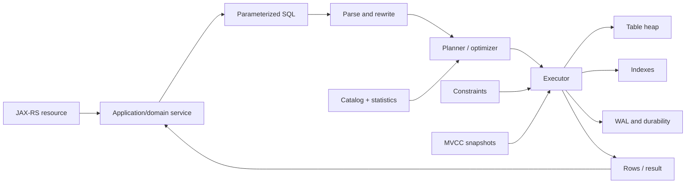
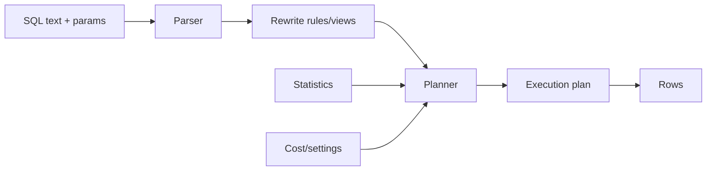

# Part 028 — PostgreSQL Data Models and Query Patterns

> PostgreSQL bukan sekadar tempat menyimpan object Java. Database adalah concurrent state machine dengan type system, constraints, planner, indexes, storage layout, statistics, dan operational lifecycle sendiri. Data model yang kuat membuat invalid state sulit atau mustahil disimpan; data model yang lemah memindahkan invariant ke puluhan service paths dan membuat production correctness bergantung pada discipline yang tidak dapat dibuktikan.

## Daftar Isi

1. [Target kompetensi](#target-kompetensi)
2. [Scope dan baseline](#scope-dan-baseline)
3. [Boundary dengan Part 029–031](#boundary-dengan-part-029031)
4. [Mental model: PostgreSQL sebagai state and query engine](#mental-model-postgresql-sebagai-state-and-query-engine)
5. [PostgreSQL object hierarchy](#postgresql-object-hierarchy)
6. [Relational modelling principles](#relational-modelling-principles)
7. [Database invariants](#database-invariants)
8. [Aggregate dan bounded-context boundaries](#aggregate-dan-bounded-context-boundaries)
9. [Table dan column naming](#table-dan-column-naming)
10. [Primary key strategy](#primary-key-strategy)
11. [Natural key, business key, dan surrogate key](#natural-key-business-key-dan-surrogate-key)
12. [UUID, bigint, dan distributed identifiers](#uuid-bigint-dan-distributed-identifiers)
13. [Foreign keys dan referential integrity](#foreign-keys-dan-referential-integrity)
14. [Unique constraints dan idempotency invariants](#unique-constraints-dan-idempotency-invariants)
15. [Check constraints dan domain rules](#check-constraints-dan-domain-rules)
16. [NULL semantics](#null-semantics)
17. [Normalization dan denormalization](#normalization-dan-denormalization)
18. [State-machine persistence](#state-machine-persistence)
19. [History dan immutable facts](#history-dan-immutable-facts)
20. [Temporal dan effective-dated modelling](#temporal-dan-effective-dated-modelling)
21. [Monetary dan numeric types](#monetary-dan-numeric-types)
22. [Text, enum, domain, dan lookup tables](#text-enum-domain-dan-lookup-tables)
23. [JSON versus JSONB](#json-versus-jsonb)
24. [Kapan menggunakan JSONB](#kapan-menggunakan-jsonb)
25. [Kapan tidak menggunakan JSONB](#kapan-tidak-menggunakan-jsonb)
26. [JSONB constraints dan generated columns](#jsonb-constraints-dan-generated-columns)
27. [Arrays dan composite values](#arrays-dan-composite-values)
28. [Key-value pattern](#key-value-pattern)
29. [Full-text search](#full-text-search)
30. [Trigram dan fuzzy search](#trigram-dan-fuzzy-search)
31. [Time-series pattern](#time-series-pattern)
32. [OLAP-oriented query pattern](#olap-oriented-query-pattern)
33. [CTE dan recursive query](#cte-dan-recursive-query)
34. [Window functions](#window-functions)
35. [Materialized views dan read models](#materialized-views-dan-read-models)
36. [Pagination: offset versus keyset](#pagination-offset-versus-keyset)
37. [Filtering dan sorting contracts](#filtering-dan-sorting-contracts)
38. [Index mental model](#index-mental-model)
39. [B-tree index](#b-tree-index)
40. [Hash, GIN, GiST, SP-GiST, dan BRIN](#hash-gin-gist-sp-gist-dan-brin)
41. [Composite indexes](#composite-indexes)
42. [Partial, expression, dan covering indexes](#partial-expression-dan-covering-indexes)
43. [Index selectivity dan write amplification](#index-selectivity-dan-write-amplification)
44. [Query lifecycle dan planner](#query-lifecycle-dan-planner)
45. [Statistics dan cardinality estimates](#statistics-dan-cardinality-estimates)
46. [EXPLAIN dan EXPLAIN ANALYZE](#explain-dan-explain-analyze)
47. [Scan types](#scan-types)
48. [Join algorithms](#join-algorithms)
49. [Sort, aggregate, dan memory spill](#sort-aggregate-dan-memory-spill)
50. [Prepared statements dan parameter sensitivity](#prepared-statements-dan-parameter-sensitivity)
51. [Partitioning](#partitioning)
52. [Vacuum, analyze, dan table bloat](#vacuum-analyze-dan-table-bloat)
53. [Multi-tenancy data modelling](#multi-tenancy-data-modelling)
54. [JAX-RS query boundary](#jax-rs-query-boundary)
55. [Read model versus write model](#read-model-versus-write-model)
56. [Functions, procedures, dan triggers: boundary](#functions-procedures-dan-triggers-boundary)
57. [Failure-model matrix](#failure-model-matrix)
58. [Debugging playbook](#debugging-playbook)
59. [Testing strategy](#testing-strategy)
60. [Architecture patterns](#architecture-patterns)
61. [Anti-patterns](#anti-patterns)
62. [PR review checklist](#pr-review-checklist)
63. [Trade-off yang harus dipahami senior engineer](#trade-off-yang-harus-dipahami-senior-engineer)
64. [Internal verification checklist](#internal-verification-checklist)
65. [Latihan verifikasi](#latihan-verifikasi)
66. [Ringkasan](#ringkasan)
67. [Referensi resmi](#referensi-resmi)

---

## Target kompetensi

Setelah menyelesaikan part ini, Anda harus mampu:

- menjelaskan PostgreSQL sebagai relational state engine, bukan object store pasif;
- mengubah domain invariant menjadi primary key, foreign key, unique, check, exclusion, dan not-null constraints;
- memisahkan database identity, business identity, external identity, dan idempotency key;
- memilih `bigint`, UUID, text, numeric, timestamp, JSONB, array, enum, atau lookup table secara sadar;
- memodelkan quote, order, catalog, pricing, dan effective-dated data tanpa mengasumsikan schema internal CSG;
- menentukan kapan normalization menjaga correctness dan kapan denormalization/read model dibutuhkan;
- menggunakan JSONB tanpa mengubah semua data menjadi schemaless blob;
- membangun full-text, fuzzy, temporal, time-series, dan analytical query patterns;
- memilih index berdasarkan predicate, ordering, cardinality, dan write cost;
- membaca `EXPLAIN`/`EXPLAIN ANALYZE` dan membedakan estimate dari actual execution;
- mengenali sequential scan, index scan, bitmap scan, nested loop, hash join, merge join, sort spill, dan aggregate behavior;
- menilai partitioning berdasarkan lifecycle/maintenance/pruning, bukan karena table “terlihat besar”;
- mendesain pagination, filtering, sorting, dan partial query yang stabil untuk JAX-RS endpoint;
- menjaga tenant isolation pada schema, keys, constraints, indexes, dan queries;
- mendiagnosis slow query menggunakan evidence: query text/template, parameters, plan, statistics, waits, I/O, locks, dan row counts;
- mereview schema dan SQL dari perspektif correctness, compatibility, operability, serta production cost.

---

## Scope dan baseline

Baseline:

- PostgreSQL modern yang exact version-nya harus diverifikasi;
- Java 17+ JAX-RS service;
- JDBC/MyBatis details dibahas pada Part 029–030;
- migrations dibahas pada Part 031;
- multi-tenancy dari Part 019 dan Part 026;
- temporal/monetary semantics dari Part 020;
- quote/order/catalog context digunakan sebagai contoh konseptual, bukan klaim schema internal;
- OLTP sebagai workload utama dengan beberapa search, reporting, reconciliation, dan analytical read patterns.

Part ini tidak mengasumsikan:

- satu database per service;
- satu schema per service;
- database-per-tenant atau shared schema;
- PostgreSQL managed cloud atau on-prem;
- penggunaan RLS;
- penggunaan logical replication;
- penggunaan extensions tertentu;
- penggunaan ORM atau MyBatis;
- exact table names;
- volume, cardinality, partition count, retention period, atau query SLA tertentu;
- bahwa database boleh menjadi shared integration bus.

Semua detail tersebut harus diverifikasi melalui schema, migrations, query logs, execution plans, database settings, dashboards, runbooks, dan diskusi dengan database/platform owners.

---

## Boundary dengan Part 029–031

| Part | Fokus utama |
|---|---|
| Part 028 | Data model, type, constraints, query patterns, indexes, planner, partitioning |
| Part 029 | JDBC lifecycle, pool, transactions, isolation, locks, deadlocks |
| Part 030 | MyBatis mapping, dynamic SQL, functions, procedures, triggers, PL/pgSQL |
| Part 031 | Liquibase/Flyway, schema evolution, backfill, expand-contract |

Part ini menyebut transaction, function, atau migration hanya untuk menjelaskan boundary. Detail implementation lifecycle dibahas di part berikutnya agar tidak berulang.

---

## Mental model: PostgreSQL sebagai state and query engine



Correctness dan performance dipengaruhi oleh:

- schema and constraints;
- SQL shape;
- parameter values;
- data distribution;
- statistics;
- indexes;
- visibility/MVCC;
- memory and I/O;
- concurrent workload;
- maintenance state;
- transaction/lock behavior.

Tidak ada index atau query plan yang selalu benar untuk seluruh data distribution dan workload evolution.

---

## PostgreSQL object hierarchy

Simplified hierarchy:

```text
PostgreSQL cluster/instance
  └── database
       └── schema
            ├── tables / partitions
            ├── indexes
            ├── sequences
            ├── views / materialized views
            ├── functions / procedures
            ├── types / domains
            └── extensions
```

Important distinctions:

- connection masuk ke satu database;
- schema adalah namespace di dalam database;
- `search_path` memengaruhi object resolution dan dapat menjadi security concern;
- table data dan index disimpan sebagai separate relations;
- catalog menyimpan metadata dan statistics;
- roles/grants berada pada cluster/database object model;
- extension dapat menambah types, functions, indexes, atau background behavior.

Always qualify ownership and `search_path` behavior for security-sensitive code.

---

## Relational modelling principles

Relational model kuat ketika:

- facts memiliki identity;
- relationships eksplisit;
- constraints menyatakan invariant;
- duplication dikontrol;
- query access paths dipahami;
- temporal meaning eksplisit;
- state transitions dapat diaudit;
- schema evolution direncanakan.

Table bukan Java class dump. Database model dapat berbeda dari domain model karena:

- normalized relationships;
- query access paths;
- history/audit requirements;
- effective dating;
- multi-tenancy;
- performance;
- operational maintenance;
- compatibility across application versions.

---

## Database invariants

Application validation improves UX; database constraints protect shared state under concurrency and multiple access paths.

Examples:

```sql
create table quote (
    quote_id uuid primary key,
    tenant_id uuid not null,
    quote_number text not null,
    status text not null,
    currency_code char(3) not null,
    total_amount numeric(19, 4) not null,
    created_at timestamptz not null,
    version bigint not null,
    unique (tenant_id, quote_number),
    check (total_amount >= 0),
    check (version >= 0)
);
```

This is illustrative only. Real status/amount semantics require internal domain verification.

Constraint candidates:

- one business number per tenant;
- line references existing parent;
- quantity positive;
- validity start before end;
- currency code present;
- event ID unique;
- only one active revision per key;
- idempotency key unique within caller/tenant/operation;
- mutually exclusive fields;
- required state-dependent fields where feasible.

Some cross-row/stateful invariants need transaction design, exclusion constraints, or domain logic; a simple `CHECK` cannot query other rows.

---

## Aggregate dan bounded-context boundaries

Database schema should reflect ownership boundaries.

Questions:

- service mana berhak menulis table;
- apakah other services read directly;
- apakah joins cross-domain are allowed;
- siapa owns lifecycle and migrations;
- apakah quote and order share identifiers or snapshots;
- apakah catalog/pricing revisions are referenced immutably;
- bagaimana integration happens: API, event, CDC, shared DB?

Shared database can reduce latency but creates:

- schema coupling;
- coordinated deployment;
- unclear write ownership;
- hidden transactions across domains;
- difficult tenant/security boundary;
- query load interference;
- unsafe ad-hoc access.

Do not infer internal ownership from table proximity alone.

---

## Table dan column naming

Prefer names that express business meaning and survive implementation changes.

Guidelines:

- consistent singular/plural convention;
- snake_case commonly aligns with PostgreSQL unquoted identifiers;
- avoid quoted mixed-case names;
- explicit units: `timeout_ms`, `size_bytes` only when storing raw unit values;
- explicit temporal meaning: `occurred_at`, `created_at`, `valid_from`, `valid_to`;
- explicit IDs: `tenant_id`, `quote_id`, not generic `id` in wide joins if ambiguity harms review;
- avoid SQL keywords;
- name constraints/indexes predictably for operations.

Naming is operational: production error and query plans should identify objects quickly.

---

## Primary key strategy

Primary key provides row identity and default uniqueness/not-null.

Good primary key properties:

- immutable;
- compact enough for indexes;
- stable across row lifecycle;
- generated without unsafe coordination;
- not carrying changeable business meaning;
- suitable for references.

Primary key is not automatically the public API identifier. Public identifiers may need:

- opacity;
- tenant scoping;
- external stability;
- non-sequential behavior;
- separate authorization.

Composite primary keys can encode scope strongly but increase foreign-key/index width. Surrogate keys simplify references but require separate business constraints.

---

## Natural key, business key, dan surrogate key

| Key | Example | Strength | Risk |
|---|---|---|---|
| Surrogate | generated UUID/bigint | Stable technical identity | Does not enforce business uniqueness |
| Business key | quote number | Human/domain meaning | Format/meaning may change |
| Natural key | combination intrinsic to fact | Prevents duplicate facts | Can be wide or mutable |
| External key | partner/order reference | Integration correlation | Scope and source must be explicit |
| Idempotency key | request key | Duplicate command protection | Lifetime and scope required |

Pattern:

```sql
primary key (quote_id),
unique (tenant_id, quote_number),
unique (tenant_id, source_system, external_reference)
```

Only create uniqueness that truly reflects invariant. Wrong uniqueness creates production blockage; missing uniqueness creates duplicate facts.

---

## UUID, bigint, dan distributed identifiers

### `bigint`

Pros:

- compact;
- efficient B-tree locality with sequences;
- readable operationally.

Cons:

- centralized generation unless allocated;
- sequential IDs may expose volume;
- merging datasets harder;
- public enumeration risk if authorization weak.

### Random UUID

Pros:

- decentralized generation;
- globally unique practical identity;
- opaque-ish public identifier.

Cons:

- wider indexes;
- random insertion can reduce locality;
- human debugging harder.

### Time-ordered UUID-like identifiers

Can improve locality but exact algorithm/library/database support must be verified. Time ordering may leak creation time and should not be treated as security control.

Selection should consider:

- generation location;
- index/write volume;
- sharding/merging;
- public exposure;
- storage cost;
- existing platform standard.

---

## Foreign keys dan referential integrity

Foreign keys guarantee referenced rows exist under database concurrency.

```sql
create table quote_line (
    quote_line_id uuid primary key,
    tenant_id uuid not null,
    quote_id uuid not null,
    product_id uuid not null,
    quantity numeric(19, 6) not null,
    foreign key (quote_id) references quote (quote_id)
);
```

Tenant-aware stronger form can include tenant in referenced uniqueness:

```sql
alter table quote
    add constraint uq_quote_tenant_id unique (tenant_id, quote_id);

alter table quote_line
    add constraint fk_quote_line_quote
    foreign key (tenant_id, quote_id)
    references quote (tenant_id, quote_id);
```

This reduces accidental cross-tenant references at database level.

Foreign key trade-offs:

- extra validation/write cost;
- delete/update behavior;
- migration/backfill sequencing;
- high-volume bulk load considerations;
- cross-service ownership coupling.

`ON DELETE CASCADE` is powerful and dangerous. Use only when dependent lifecycle is truly owned by parent and deletion volume/impact is understood.

---

## Unique constraints dan idempotency invariants

Unique constraints are concurrency-safe duplicate prevention.

Example:

```sql
create unique index uq_idempotency_command
    on command_deduplication (tenant_id, client_id, operation, idempotency_key);
```

Define:

- scope;
- normalization/case sensitivity;
- null behavior;
- retention window;
- response reuse semantics;
- conflict behavior.

Do not implement duplicate prevention as:

```text
SELECT not exists → INSERT
```

without a database uniqueness invariant; concurrent requests can both pass the check.

Partial uniqueness example:

```sql
create unique index uq_one_active_catalog_revision
    on catalog_revision (tenant_id, catalog_id)
    where status = 'ACTIVE';
```

Exact state model must be verified.

---

## Check constraints dan domain rules

Checks are useful for row-local invariants:

```sql
check (quantity > 0)
check (valid_to is null or valid_to > valid_from)
check (discount_percent between 0 and 100)
check ((fixed_amount is null) <> (percentage is null))
```

Remember SQL three-valued logic: a check passes when expression is `TRUE` or `NULL`; use `NOT NULL` when null must be rejected.

Avoid embedding rapidly changing business policy into constraints if every policy update requires risky schema changes. Use constraints for stable invariants; domain rules for contextual policy.

---

## NULL semantics

`NULL` means unknown/absent, not empty string, zero, false, or “not applicable” automatically.

Pitfalls:

```sql
where column = null       -- never correct
where column <> 'X'       -- excludes NULL rows
not in (...)              -- surprising with NULL in list/subquery
```

Use:

```sql
where column is null
where column is not null
where column is distinct from :value
```

API semantics must distinguish:

- field omitted;
- explicit null;
- empty collection/string;
- default value;
- clear/reset command.

This matters for PATCH and partial updates.

---

## Normalization dan denormalization

Normalization reduces update anomalies and duplicate facts.

Typical progression:

- 1NF: atomic relation values in chosen model;
- 2NF/3NF: remove dependencies that do not belong to key;
- higher forms for specialized anomalies.

Denormalization may be justified for:

- immutable snapshot of catalog/pricing at quote time;
- read model;
- reporting aggregate;
- search document;
- event/outbox payload;
- precomputed totals;
- reducing expensive joins under measured workload.

Every duplicated field needs:

- source of truth;
- update mechanism;
- freshness expectation;
- reconciliation;
- backfill/migration plan;
- conflict resolution.

---

## State-machine persistence

State column alone is insufficient without transition control and evidence.

Possible structure:

```sql
create table order_state_transition (
    transition_id uuid primary key,
    tenant_id uuid not null,
    order_id uuid not null,
    from_state text,
    to_state text not null,
    reason_code text,
    occurred_at timestamptz not null,
    actor_id text,
    command_id uuid
);
```

Model choices:

- current row plus transition history;
- append-only event/history and projected current state;
- workflow engine plus business state table;
- temporal tables implemented by application/triggers;
- immutable revision rows.

Invariant questions:

- who may transition;
- allowed from/to states;
- concurrency/version control;
- whether transition is reversible;
- required reason/evidence;
- replay/reconciliation semantics.

---

## History dan immutable facts

Do not overwrite facts that must remain explainable.

Candidates for immutable snapshots/history:

- accepted quote version;
- price calculation inputs/results;
- catalog revision reference;
- approval decision;
- tax/rounding outcome;
- order submission payload;
- external response reference;
- state transition;
- contract terms used at decision time.

History pattern options:

- revision table;
- valid-time rows;
- audit history table;
- append-only event store;
- current table + change log.

Avoid pretending `updated_at` is complete history.

---

## Temporal dan effective-dated modelling

From Part 020, distinguish:

- transaction time: when database recorded fact;
- valid/effective time: when business fact applies;
- event time: when event occurred;
- processing time: when service processed it.

Illustrative effective-dated row:

```sql
create table price_revision (
    tenant_id uuid not null,
    price_revision_id uuid primary key,
    product_id uuid not null,
    currency_code char(3) not null,
    amount numeric(19, 4) not null,
    valid_from timestamptz not null,
    valid_to timestamptz,
    check (valid_to is null or valid_to > valid_from)
);
```

Preventing overlap may use exclusion constraints with range types when model and extension/operator support are appropriate.

Query “effective at” must define inclusive/exclusive boundary consistently:

```sql
where valid_from <= :effective_at
  and (valid_to is null or :effective_at < valid_to)
```

Use half-open intervals `[start, end)` to avoid double membership at adjacent boundaries.

---

## Monetary dan numeric types

Use `numeric/decimal` for exact decimal values.

Avoid floating-point for contractual money:

```sql
numeric(19, 4)
```

Exact precision/scale must match domain:

- currency amount;
- unit price;
- quantity;
- percentage/rate;
- tax;
- exchange rate;
- prorated result.

Do not assume every intermediate calculation fits final currency scale. Store or recompute with explicit rounding/version policy.

`money` type has locale/precision semantics that may not match enterprise requirements; verify before use.

Currency must be explicit, not inferred from tenant or locale unless invariant guarantees it.

---

## Text, enum, domain, dan lookup tables

### `text` + check/lookup

Flexible evolution, but invalid values must be constrained.

### PostgreSQL enum

Strong allowed set and compact semantics, but changing/removing/reordering values has migration considerations and can couple deployments.

### Domain type

Reusable type-level constraints:

```sql
create domain currency_code as text
    check (value ~ '^[A-Z]{3}$');
```

Domains are database-wide schema constructs and may increase coupling.

### Lookup/reference table

Best when values have metadata, lifecycle, translations, or configuration ownership.

Choose based on stability, ownership, and migration needs—not aesthetics.

---

## JSON versus JSONB

### `json`

- stores textual JSON representation;
- preserves input formatting/order/duplicate key text characteristics;
- reparsed for operations.

### `jsonb`

- stores decomposed binary representation;
- supports indexing and efficient operators;
- normalizes representation;
- duplicate keys do not retain multiple semantic values.

Most queryable document fields use JSONB, but this is not a universal rule.

---

## Kapan menggunakan JSONB

Good candidates:

- sparse optional extension attributes;
- external payload snapshot;
- tenant-specific attributes with controlled schema;
- rule/config document where atomic document lifecycle is appropriate;
- event/audit metadata;
- fields not frequently joined or constrained individually;
- evolving integration data retained for traceability.

JSONB should still have:

- schema/version field;
- validation;
- maximum size;
- allowed keys/types;
- migration strategy;
- indexing plan;
- redaction/classification;
- ownership.

Example:

```sql
create table integration_snapshot (
    snapshot_id uuid primary key,
    tenant_id uuid not null,
    schema_version integer not null,
    payload jsonb not null,
    captured_at timestamptz not null,
    check (jsonb_typeof(payload) = 'object')
);
```

---

## Kapan tidak menggunakan JSONB

Avoid JSONB when fields:

- participate in primary/foreign keys;
- require stable type and not-null constraints;
- are frequently filtered/sorted/joined;
- need relational uniqueness;
- drive high-volume reports;
- require precise monetary/temporal semantics;
- are independently updated concurrently;
- form core domain model.

Anti-pattern:

```sql
create table order_record (
    id uuid primary key,
    everything jsonb not null
);
```

This moves schema, constraints, query complexity, and migration burden into application code while keeping database operational cost.

---

## JSONB constraints dan generated columns

Expression constraints:

```sql
check (payload ? 'type')
check (jsonb_typeof(payload -> 'attributes') = 'object')
```

Generated columns can expose stable JSONB paths:

```sql
alter table integration_snapshot
add column external_reference text
    generated always as (payload ->> 'externalReference') stored;

create index idx_snapshot_external_reference
    on integration_snapshot (tenant_id, external_reference);
```

Benefits:

- typed/indexable access;
- clearer query plans;
- migration bridge.

Costs:

- write/storage overhead;
- generated expression compatibility;
- field evolution coupling.

---

## Arrays dan composite values

PostgreSQL arrays can model small, bounded, atomic multi-values, but many relationships belong in child tables.

Use array cautiously when:

- elements have no independent identity/lifecycle;
- cardinality is small;
- ordering/containment queries are understood;
- no per-element foreign key required;
- updates do not create contention.

Avoid arrays for unbounded line items or relationships requiring joins/constraints.

Array GIN indexes may help containment queries but add write cost.

---

## Key-value pattern

Relational key-value table:

```sql
create table tenant_setting (
    tenant_id uuid not null,
    setting_key text not null,
    value_json jsonb not null,
    version bigint not null,
    updated_at timestamptz not null,
    primary key (tenant_id, setting_key)
);
```

Needs:

- typed schema per key;
- source/ownership;
- defaults;
- validation;
- versioning;
- audit;
- caching/reload behavior;
- sensitive-value policy.

Generic EAV/key-value models often make querying, constraints, migrations, and discoverability difficult. Use only for genuinely dynamic attributes.

---

## Full-text search

PostgreSQL full-text search components:

- document normalization into `tsvector`;
- query parsing into `tsquery`;
- dictionaries/configuration;
- ranking;
- GIN/GiST index options.

Illustrative pattern:

```sql
alter table product_catalog_item
add column search_document tsvector
    generated always as (
        to_tsvector('simple', coalesce(product_code, '') || ' ' || coalesce(display_name, ''))
    ) stored;

create index idx_product_search
    on product_catalog_item using gin (search_document);
```

Query:

```sql
where search_document @@ websearch_to_tsquery('simple', :query)
```

Design questions:

- language/configuration;
- tokenization;
- tenant filter;
- ranking;
- prefix behavior;
- update cost;
- stop words;
- synonym requirements;
- permission filtering;
- pagination stability.

FTS is not automatically a replacement for dedicated search platforms when scale, relevance, faceting, typo tolerance, or distributed indexing requirements grow.

---

## Trigram dan fuzzy search

`pg_trgm` can support similarity and wildcard-like searches with GIN/GiST indexes.

Potential uses:

- product code/name typo tolerance;
- customer/reference search;
- contains/ILIKE acceleration under suitable patterns.

Risks:

- extension must be enabled;
- index size and write cost;
- short strings produce weak selectivity;
- broad fuzzy search can be expensive;
- tenant/authorization predicates must still apply;
- user-provided similarity threshold affects result size.

Internal extension availability must be verified.

---

## Time-series pattern

Time-series-like tables:

- operational measurements;
- state transition history;
- pricing calculation observations;
- job execution history;
- event processing metrics;
- audit/security events.

Design dimensions:

- append rate;
- retention;
- query time windows;
- partitioning;
- aggregation granularity;
- late-arriving data;
- correction semantics;
- compression/archival tooling;
- index locality.

Example index:

```sql
create index idx_job_execution_tenant_started
    on job_execution (tenant_id, started_at desc);
```

BRIN may help very large append-correlated tables, but test actual data correlation and range query behavior.

---

## OLAP-oriented query pattern

Operational PostgreSQL can support bounded analytical queries using:

- aggregates;
- grouping sets;
- window functions;
- CTEs;
- materialized views;
- read replicas;
- partition pruning;
- precomputed read models.

Risks of running heavy analytics on OLTP primary:

- CPU/I/O saturation;
- cache eviction;
- temp spill;
- long snapshots;
- replication lag;
- query concurrency impact;
- unpredictable response time.

Separate operational reports from ad-hoc/unbounded analytics. Establish query limits, read replicas/warehouse boundaries, or async report jobs as needed.

---

## CTE dan recursive query

CTEs improve decomposition and support recursive queries.

```sql
with active_quotes as (
    select quote_id, tenant_id, total_amount
    from quote
    where tenant_id = :tenant_id
      and status = 'ACTIVE'
)
select count(*), sum(total_amount)
from active_quotes;
```

Recursive CTE use cases:

- product/category hierarchy;
- dependency tree;
- organization/permission hierarchy;
- BOM/configuration graph where relational representation fits.

Guard against cycles and unbounded recursion. Planner treatment of CTEs depends on query/version/materialization hints; inspect plans instead of relying on old assumptions.

---

## Window functions

Window functions compute values across related rows without collapsing all rows.

Examples:

```sql
select
    order_id,
    tenant_id,
    created_at,
    row_number() over (
        partition by tenant_id
        order by created_at desc, order_id desc
    ) as tenant_sequence
from customer_order;
```

Use cases:

- latest revision;
- ranking;
- running totals;
- previous/next state;
- de-duplication diagnostics;
- per-tenant top-N;
- gap detection.

Window queries can require large sorts. Index order, partitions, and bounded predicates matter.

---

## Materialized views dan read models

Materialized view stores query result physically.

Good for:

- expensive repeatable reports;
- dashboard aggregates;
- search/read model with acceptable staleness;
- reducing load on transactional joins.

Need explicit:

- refresh mode and schedule;
- concurrent refresh requirements;
- unique index requirements;
- staleness SLA;
- refresh failure recovery;
- tenant/security behavior;
- index strategy;
- dependency on schema changes.

Alternative: application-maintained projection/read table via events or jobs. This provides incremental updates but adds replay, idempotency, and reconciliation complexity.

---

## Pagination: offset versus keyset

### Offset pagination

```sql
order by created_at desc, order_id desc
limit :limit offset :offset
```

Pros:

- simple;
- supports page numbers.

Cons:

- high offsets scan/discard rows;
- concurrent inserts/deletes create duplicates/gaps;
- total counts can be expensive.

### Keyset pagination

```sql
where tenant_id = :tenant_id
  and (created_at, order_id) < (:cursor_created_at, :cursor_order_id)
order by created_at desc, order_id desc
limit :limit
```

Requires:

- deterministic unique order;
- cursor encoding/versioning;
- matching index;
- clear filter binding;
- null-order semantics.

For mutable sort fields, pagination consistency still requires careful contract.

---

## Filtering dan sorting contracts

Do not concatenate raw client fields into SQL.

Use allow-listed mapping:

```java
private static final Map<String, String> SORT_COLUMNS = Map.of(
        "createdAt", "created_at",
        "quoteNumber", "quote_number",
        "totalAmount", "total_amount"
);
```

Then build SQL through controlled templates/DSL/mapper, not raw user identifiers.

Contract must define:

- allowed fields/operators;
- maximum filters;
- type conversion;
- case sensitivity;
- null semantics;
- timezone semantics;
- stable tie-breaker;
- maximum page size;
- expensive combinations;
- tenant/authorization predicates that cannot be overridden.

Filter flexibility directly affects index strategy and worst-case query cost.

---

## Index mental model

An index is a separate data structure that trades:

- storage;
- write CPU/I/O;
- vacuum/maintenance;
- cache usage;
- planning complexity;

for faster supported access paths.

An index helps only when:

- query predicate/order matches operator class and column order;
- selectivity and cost favor it;
- statistics are adequate;
- data is sufficiently visible for index-only scan when expected;
- result set is bounded enough;
- index is not bloated/unusable.

“Column appears in WHERE” is not enough reason to index.

---

## B-tree index

B-tree supports common equality/range/order operations.

Examples:

```sql
create index idx_quote_tenant_created
    on quote (tenant_id, created_at desc, quote_id desc);

create index idx_order_external_reference
    on customer_order (tenant_id, source_system, external_reference);
```

Good for:

- equality;
- ranges;
- prefix of composite key;
- ordering;
- min/max;
- uniqueness.

Case-insensitive search may need normalized column/expression index rather than plain index.

---

## Hash, GIN, GiST, SP-GiST, dan BRIN

### Hash

Equality-specific. B-tree often remains preferred unless measured reason exists.

### GIN

Inverted index for multi-valued content:

- JSONB containment;
- arrays;
- full-text search;
- trigram depending operator class.

Can be large and write-expensive.

### GiST

Generalized search tree for ranges, geometric, nearest-neighbor, exclusion constraints, and extension-defined operators.

### SP-GiST

Partitioned search structures for suitable data types/distributions.

### BRIN

Stores summaries over physical block ranges. Very small and effective when value correlates with physical order, such as append-time timestamps on huge tables.

Always match index method/operator class to actual query operators.

---

## Composite indexes

Column order matters.

Index:

```sql
(tenant_id, status, created_at desc, quote_id desc)
```

Potentially supports:

- tenant equality;
- tenant + status equality;
- then ordered/range created time.

It does not necessarily optimize queries filtering only `created_at` or only `status` globally.

Design based on real query shapes, not all possible column combinations.

Too many permutations cause excessive write/storage cost.

---

## Partial, expression, dan covering indexes

### Partial index

```sql
create index idx_open_order_work_queue
    on customer_order (tenant_id, priority desc, created_at)
    where status in ('PENDING', 'RETRY');
```

Useful when active subset is small and predicate matches query exactly enough for planner implication.

### Expression index

```sql
create index idx_customer_email_lower
    on customer_account (tenant_id, lower(email));
```

Query must use compatible expression.

### Covering index with `INCLUDE`

```sql
create index idx_quote_lookup
    on quote (tenant_id, quote_number)
    include (status, total_amount, currency_code);
```

Can support index-only scans when visibility permits, but increases index size/write cost.

---

## Index selectivity dan write amplification

Low-selectivity columns such as boolean/status may not benefit from standalone index when most rows match.

Better options:

- partial index on rare/active subset;
- composite index with tenant/time;
- partitioning/read model;
- no index if sequential scan is cheaper.

Each index adds:

- insert/update/delete work;
- WAL volume;
- storage;
- cache pressure;
- vacuum work;
- migration time;
- potential locking/build cost.

Review unused/duplicate indexes using production evidence before removal; rare critical queries may not appear in short windows.

---

## Query lifecycle dan planner

Simplified:



Planner estimates:

- row counts;
- selectivity;
- join cardinality;
- page reads;
- CPU operations;
- sort/hash memory behavior;
- parallel benefit.

Bad estimates often produce bad join order or algorithm even when indexes exist.

---

## Statistics dan cardinality estimates

PostgreSQL gathers statistics on:

- null fraction;
- distinct values;
- most common values/frequencies;
- histograms;
- correlation;
- expression/extended statistics when configured.

Estimate problems arise from:

- stale statistics;
- correlated columns treated independently;
- skewed tenant distributions;
- parameter values with very different selectivity;
- JSONB/expression distributions;
- rapidly changing tables;
- insufficient statistics target.

Extended statistics can model dependencies or distinct combinations for selected columns.

Do not globally increase statistics targets without understanding analyze/storage/planning cost.

---

## EXPLAIN dan EXPLAIN ANALYZE

`EXPLAIN` shows estimated plan without executing modifying statement.

`EXPLAIN ANALYZE` executes query and reports actual timing/rows. Use carefully:

- `UPDATE/DELETE/INSERT` will execute unless wrapped and rolled back appropriately;
- production execution can be expensive;
- timing overhead exists;
- use `BUFFERS` to inspect cache/I/O behavior;
- parameter values matter;
- one execution may not represent concurrency/cache states.

Example:

```sql
explain (analyze, buffers, verbose)
select quote_id, quote_number, status
from quote
where tenant_id = :tenant_id
  and status = :status
order by created_at desc, quote_id desc
limit 50;
```

Read:

- estimated rows versus actual rows;
- loops;
- actual time;
- rows removed by filter;
- heap fetches;
- shared hit/read/dirtied;
- temp read/write;
- planning time;
- execution time.

Large estimate errors are usually more actionable than the visual presence of a sequential scan.

---

## Scan types

### Sequential Scan

Reads table pages sequentially. Correct and often fastest for large result fractions or small tables.

### Index Scan

Uses index then heap fetches.

### Index Only Scan

Can return from index, but heap visibility checks may still require heap fetches.

### Bitmap Index/Heap Scan

Combines index matches then accesses heap pages efficiently for medium result sets or multiple indexes.

### Tid Scan / specialized scans

Less common; plan meaning should be interpreted in context.

Do not label sequential scan automatically as a bug.

---

## Join algorithms

### Nested Loop

Good when outer side small and inner lookup indexed. Bad when underestimated outer rows cause repeated expensive work.

### Hash Join

Builds hash table from one input, efficient for equality joins. Can spill if memory insufficient.

### Merge Join

Efficient when inputs sorted on join keys; can exploit indexes or require sorts.

Review:

- join condition correctness;
- row estimate per side;
- filters applied early;
- tenant predicates;
- indexes;
- hash/sort spill;
- loops and total work.

A missing join predicate can create accidental Cartesian product and massive result/work.

---

## Sort, aggregate, dan memory spill

Sort and hash operations use memory controlled by session/query settings such as `work_mem` semantics. It applies per operation, potentially per parallel worker, not once per connection.

Risks of globally high memory:

- many concurrent queries × many operations × workers;
- memory pressure/OOM;
- unstable latency.

Too low memory causes temporary disk spill.

Observe plans for:

- sort method;
- memory usage;
- disk usage;
- hash batches;
- temp reads/writes;
- aggregate strategy.

Optimize by reducing rows earlier, matching indexes/order, pre-aggregation, bounded reporting, or workload isolation before arbitrary global tuning.

---

## Prepared statements dan parameter sensitivity

Prepared/parameterized SQL protects against injection and reduces parse overhead, but plan selection can be sensitive to parameters.

Example skew:

- tenant A has millions of rows;
- tenant B has hundreds;
- one status matches 90% for one tenant and 0.1% for another.

Generic plan may be poor for extreme values; custom plan has planning overhead. Exact driver/server behavior must be investigated with actual JDBC settings and PostgreSQL version.

Do not solve parameter-sensitive plans by interpolating raw values into SQL.

---

## Partitioning

Declarative partitioning methods:

- range;
- list;
- hash.

Partitioning is useful for:

- lifecycle/retention detach/drop;
- pruning by common partition key;
- maintenance isolation;
- very large append tables;
- tenant isolation in selected models;
- archival tiers.

Partitioning does not automatically improve all queries.

Costs:

- more objects/indexes;
- planning overhead with many partitions;
- operational complexity;
- uniqueness limitations across partition keys;
- migration/routing errors;
- uneven partitions;
- hard re-partitioning.

Partition key must appear in common bounded predicates. Partitioning by tenant can be problematic with many tenants and skew.

---

## Vacuum, analyze, dan table bloat

PostgreSQL MVCC creates dead tuples that require vacuuming/reuse. Analyze updates planner statistics.

Operational symptoms:

- table/index bloat;
- poor index-only scan visibility;
- transaction ID pressure;
- stale estimates;
- autovacuum lag;
- long-running transaction retaining dead tuples;
- high I/O and storage growth.

Application engineers should understand:

- frequent updates create churn;
- wide JSONB rows amplify updates;
- unnecessary indexes increase maintenance;
- long transactions harm cleanup;
- bulk loads need analyze;
- retention deletes may generate massive bloat/WAL compared with dropping partitions.

Exact vacuum tuning belongs with database operations and production evidence.

---

## Multi-tenancy data modelling

### Shared schema

```sql
primary key (tenant_id, resource_id)
```

or surrogate PK plus tenant-aware unique/FK constraints.

Requirements:

- every query constrained by tenant;
- indexes lead with tenant for common access paths;
- cache/event/search contexts include tenant;
- cross-tenant unique semantics explicit;
- RLS if used configured/tested safely;
- support/admin access explicit.

### Schema per tenant

Benefits isolation/customization; costs migration fan-out, object count, pooling/search path, operations.

### Database per tenant

Strong isolation and independent lifecycle; costs connection routing, migrations, monitoring, backup, and cross-tenant reporting.

No model is universally best. Verify actual tenancy model and expected tenant count/skew.

---

## JAX-RS query boundary

Endpoint must not expose arbitrary SQL capability.

Boundary responsibilities:

- validate and normalize filters;
- enforce tenant and authorization predicates;
- cap page size;
- cap date range;
- allow-list sort fields/operators;
- set query timeout through lower layer;
- avoid unbounded export synchronously;
- translate database-specific errors safely;
- expose stable cursor/contract;
- instrument query template, not sensitive raw parameters;
- use `400` for invalid query contract, not for database outage;
- avoid returning database row/entity directly as API DTO.

Example request model:

```java
public record QuoteSearchRequest(
        String status,
        Instant createdFrom,
        Instant createdTo,
        int limit,
        String cursor,
        QuoteSort sort) {}
```

Repository maps typed request to approved SQL shape.

---

## Read model versus write model

Write model optimizes invariant enforcement and mutation consistency.

Read model optimizes:

- list/search;
- dashboard;
- export;
- customer view;
- product/catalog navigation;
- report.

Options:

- normalized write tables queried directly;
- views;
- materialized views;
- denormalized projection tables;
- search index;
- analytics warehouse.

Read model needs freshness and reconciliation contract. Eventual consistency must be visible to API/product behavior.

Avoid silently mixing stale read model for command preconditions unless correctness allows it.

---

## Functions, procedures, dan triggers: boundary

PostgreSQL can enforce logic through functions/procedures/triggers. Detailed usage is Part 030.

At modelling stage ask:

- is invariant truly database-wide;
- can logic be expressed declaratively first;
- who owns versioning and testing;
- how errors map to application;
- whether trigger creates hidden side effects;
- whether bulk/import paths behave consistently;
- whether observability exists;
- whether multiple services rely on the behavior.

Prefer constraints for stable declarative invariants. Use procedural database logic intentionally, not as invisible patchwork.

---

## Failure-model matrix

| Failure | Likely cause | Evidence | Corrective direction |
|---|---|---|---|
| Duplicate business record | Missing/wrong unique constraint | Duplicate key analysis, request concurrency | Add correct invariant and cleanup |
| Cross-tenant relation | FK omits tenant scope | Row joins, schema review | Tenant-aware key/FK or stronger isolation |
| Slow list endpoint | Offset, missing composite index, broad filter | Plan, rows, buffers | Keyset/bounded query/index |
| Index not used | Low selectivity, expression mismatch, bad estimate | `EXPLAIN ANALYZE` | Fix query/stats/index design |
| Wrong result around validity boundary | Inclusive/exclusive mismatch | Boundary tests/data | Standardize half-open intervals |
| Monetary drift | Floating point/implicit rounding | Data comparison | Numeric + explicit policy |
| JSONB query explosion | Unbounded document/filter | Plan, index size, payload stats | Normalize/stabilize schema/index |
| High write latency | Excess indexes/WAL/constraints | write plan, index inventory | Remove redundant indexes, batch carefully |
| Sort/hash disk spill | Too many rows or insufficient memory | temp I/O in plan | Reduce rows/index/precompute/tune carefully |
| Planner chooses bad join | Stale/skewed statistics | Estimate vs actual | Analyze/extended stats/query redesign |
| Partition scan explosion | Missing partition predicate | Plan partition list | Add bounded key/change partition design |
| Autovacuum cannot keep up | High churn/long transactions | dead tuples, vacuum logs | Reduce churn, tune/partition/fix transactions |
| Count endpoint times out | Exact count over huge filter | plan/I/O | Approximate/async/precomputed contract |
| FTS returns unauthorized data | Permission predicate applied after search/export | query and test | Enforce tenant/access in query/read model |
| Cursor duplicates/skips | Non-unique mutable ordering | API test | Stable tie-breaker/versioned cursor |
| Schema change breaks old app | Direct incompatible change | deployment failure | Expand-contract migration |

---

## Debugging playbook

### Scenario 1 — Endpoint became slow after data growth

1. Capture route, normalized query shape, tenant, filters, sort, page size.
2. Obtain exact SQL and representative parameters safely.
3. Run `EXPLAIN (ANALYZE, BUFFERS)` in safe environment or controlled production process.
4. Compare estimates to actual rows.
5. Check scan/join/sort/temp behavior.
6. Inspect index definitions and column order.
7. Inspect table/index size and statistics freshness.
8. Check concurrent load, locks/waits, CPU/I/O, and cache state.
9. Test query/index change with production-like distribution.
10. Verify write-cost and migration impact before adding index.

### Scenario 2 — Query fast for most tenants, slow for one

1. Compare tenant cardinality and value distribution.
2. Compare plans with representative parameters.
3. Check generic/custom prepared plan behavior.
4. Inspect skew and extended statistics opportunity.
5. Verify tenant-leading indexes.
6. Consider dedicated partition/read model only if justified.

### Scenario 3 — Index exists but planner uses sequential scan

1. Determine result fraction.
2. Check expression/operator compatibility.
3. Check type casts.
4. Check statistics and correlation.
5. Compare index/table size.
6. Check whether sequential scan is actually cheaper.
7. Avoid disabling sequential scan as production “fix.”

### Scenario 4 — Query returns duplicate rows

1. Verify join cardinalities and predicates.
2. Determine whether data duplicates violate missing constraint.
3. Avoid masking with `DISTINCT` before finding root cause.
4. Add/fix uniqueness where invariant exists.
5. Reconcile existing data.

### Scenario 5 — Database storage grows unexpectedly

1. Compare table/index/TOAST sizes.
2. Inspect dead tuples and vacuum activity.
3. Identify high-update wide rows/JSONB.
4. Inspect redundant indexes.
5. Check long transactions.
6. Check retention deletes versus partition strategy.
7. Validate archival and backup behavior separately.

---

## Testing strategy

### Schema tests

- primary/foreign/unique/check constraints;
- tenant-aware references;
- null semantics;
- temporal boundaries;
- numeric precision/scale;
- invalid state rejection;
- delete/update referential behavior.

### Repository integration tests

Use real PostgreSQL/Testcontainers where possible:

- query results;
- filters/sorts;
- keyset pagination;
- case/null behavior;
- JSONB operators;
- FTS;
- generated columns;
- tenant isolation;
- representative query timeouts.

### Plan regression tests

For selected critical queries:

- capture expected high-level access path, not overly brittle entire plan text;
- test production-like cardinality/skew;
- verify no unbounded scan after schema/data growth;
- measure reads/temp/write cost;
- rerun after PostgreSQL/driver/schema upgrades.

### Property and boundary tests

- adjacent effective windows;
- DST/time boundaries from Part 020;
- money scale/rounding;
- cursor encode/decode;
- duplicate idempotency commands;
- tenant A cannot reference/search tenant B;
- large/empty/null JSONB fields;
- maximum filter/page size.

### Migration tests

Detailed in Part 031, but schema design should be tested from previous production-like version to next version, including old/new application compatibility.

---

## Architecture patterns

### Pattern 1 — Constraint-backed aggregate

Application domain validation + database stable invariants.

### Pattern 2 — Tenant-leading access path

Common indexes and keys begin with trusted tenant scope where shared-schema design requires it.

### Pattern 3 — Normalized write model + optimized read model

Commands use strong invariant model; search/report uses versioned projection.

### Pattern 4 — Immutable revision reference

Quote/order records reference exact catalog/pricing revision used for decisions.

### Pattern 5 — Keyset pagination

Stable deterministic ordering plus encoded cursor.

### Pattern 6 — Query template inventory

Critical SQL shapes, owners, expected cardinality, indexes, and SLOs documented.

### Pattern 7 — JSONB at controlled extension boundary

Core fields relational; flexible extension document versioned and validated.

### Pattern 8 — Partition by lifecycle

Partition key aligns with retention/pruning/maintenance, not arbitrary scale anxiety.

---

## Anti-patterns

- Mapping every Java object field directly to one table.
- Storing core domain entirely in JSONB.
- Using `double`/`real` for money.
- Relying only on application duplicate checks.
- Omitting foreign keys “for performance” without evidence and reconciliation.
- Using `SELECT *` in stable production queries.
- Building SQL identifiers/operators directly from request input.
- Offset pagination for arbitrarily deep pages.
- Indexing every column.
- Adding indexes without measuring write/storage cost.
- Forcing planner settings instead of fixing estimates/query design.
- Treating sequential scan as inherently bad.
- Using `DISTINCT` to hide incorrect joins.
- Running unbounded reports on OLTP primary.
- Partitioning before access and lifecycle patterns are known.
- Assuming table size alone determines need for partitioning.
- Using mutable business fields as primary key.
- Representing current state without transition evidence where auditability matters.
- Applying tenant filter only in application after query.
- Returning persistence rows directly as API contract.
- Using triggers with hidden side effects and no tests/observability.

---

## PR review checklist

### Schema and invariants

- [ ] Table ownership and bounded context are clear.
- [ ] Primary/business/external/idempotency keys are distinguished.
- [ ] Stable invariants use database constraints.
- [ ] Foreign keys and delete behavior are intentional.
- [ ] Tenant scope is represented in keys/constraints where required.
- [ ] Null semantics are explicit.
- [ ] Monetary and temporal types match domain semantics.
- [ ] History/snapshot requirement is addressed.

### JSONB and dynamic data

- [ ] JSONB is justified over relational columns.
- [ ] Schema/version/size/validation are defined.
- [ ] Queryable stable fields have proper expressions/generated columns/indexes.
- [ ] Sensitive data classification applies to payload.
- [ ] Migration/backfill strategy exists.

### Query shape

- [ ] SQL is parameterized.
- [ ] Tenant and authorization predicates cannot be omitted.
- [ ] Filter/sort fields are allow-listed.
- [ ] Page size/date range/result size are bounded.
- [ ] Ordering is deterministic.
- [ ] Keyset cursor includes unique tie-breaker where used.
- [ ] No accidental Cartesian join or `SELECT *`.

### Indexes

- [ ] Index supports a documented query path.
- [ ] Column order matches predicates/order.
- [ ] Partial/expression predicate matches query.
- [ ] Selectivity and data skew are understood.
- [ ] Write/storage/migration cost is considered.
- [ ] Duplicate/redundant indexes are avoided.

### Performance and operations

- [ ] Representative plan and cardinality evidence exist for critical query.
- [ ] Sort/hash/temp behavior is understood.
- [ ] Heavy analytics is isolated or bounded.
- [ ] Partitioning has lifecycle/pruning rationale.
- [ ] Vacuum/analyze impact is considered.
- [ ] Observability identifies query template and latency without leaking sensitive params.

### Compatibility

- [ ] Change supports old/new application overlap where required.
- [ ] Backfill/default/null transition is planned.
- [ ] API serialization is decoupled from database row shape.
- [ ] Read model freshness/reconciliation is explicit.

---

## Trade-off yang harus dipahami senior engineer

### Strong constraints versus deployment flexibility

Constraints improve correctness but require careful migration/backfill and can reject previously tolerated data.

### Normalization versus query simplicity

Normalization protects facts; read-heavy paths may need projections or denormalization with reconciliation.

### UUID versus bigint

UUID supports distributed generation and opaque identifiers; bigint is compact and locality-friendly. Neither provides authorization.

### JSONB flexibility versus governance

JSONB reduces migration frequency for evolving extensions but weakens discoverability/constraints and can create indexing complexity.

### More indexes versus write throughput

Read performance improvements consume storage, WAL, cache, vacuum, and migration time.

### Exact counts versus API latency

Accurate counts over broad filters can be expensive. Product contract may prefer estimates, async counts, or no total.

### Partitioning versus operational complexity

Partitioning can simplify lifecycle and pruning, but too many/misaligned partitions worsen planning and operations.

### OLTP reporting versus separate analytics

Same database is simpler initially; heavy reporting can destabilize transactional SLOs.

### Generic query APIs versus predictable plans

Highly flexible filtering empowers clients but creates combinatorial query and index space. Govern allowed query shapes.

### Database logic versus application logic

Database constraints are excellent for stable shared invariants; rapidly changing contextual policy usually belongs in domain services.

---

## Internal verification checklist

### Platform and topology

- [ ] PostgreSQL exact version/distribution.
- [ ] Managed cloud, on-prem, or hybrid.
- [ ] Primary/replica topology.
- [ ] High-availability and failover model.
- [ ] Connection endpoint and DNS behavior.
- [ ] Extensions enabled and approval process.

### Ownership and schema

- [ ] Database/schema/table ownership by service/team.
- [ ] Shared database access rules.
- [ ] Naming conventions.
- [ ] Role/grant model.
- [ ] `search_path` policy.
- [ ] Cross-service direct query usage.

### Domain modelling

- [ ] Quote/order/catalog/pricing aggregate boundaries.
- [ ] Business identifiers and uniqueness.
- [ ] State-transition/history model.
- [ ] Effective-date model.
- [ ] Currency/precision/rounding storage policy.
- [ ] Immutable catalog/pricing revision references.

### Multi-tenancy

- [ ] Shared schema, schema per tenant, or database per tenant.
- [ ] Tenant key type and propagation.
- [ ] Tenant-aware foreign keys/unique constraints.
- [ ] RLS usage and bypass roles.
- [ ] Tenant skew and noisy-neighbor controls.
- [ ] Cross-tenant reporting path.

### JSON/search/analytics

- [ ] JSONB usage and schema ownership.
- [ ] Full-text/trigram extensions and indexes.
- [ ] Search engine outside PostgreSQL, if any.
- [ ] Reporting/read replica/warehouse topology.
- [ ] Materialized views/read models and freshness SLA.
- [ ] Time-series/retention tables.

### Query and index governance

- [ ] Critical query inventory.
- [ ] Query timeout standards.
- [ ] Slow-query logging/`pg_stat_statements` or equivalent.
- [ ] Plan review process.
- [ ] Index naming and review standards.
- [ ] Unused/duplicate index review process.
- [ ] Statistics/analyze ownership.

### Partitioning and maintenance

- [ ] Partitioned tables and rationale.
- [ ] Partition creation/retention automation.
- [ ] Autovacuum monitoring.
- [ ] Bloat monitoring/remediation.
- [ ] Backup/restore and point-in-time recovery expectations.
- [ ] Archival/deletion jobs.

### JAX-RS integration

- [ ] Pagination/filter/sort contract.
- [ ] Maximum page and date range.
- [ ] Exact versus estimated counts.
- [ ] Repository/SQL framework.
- [ ] Error mapping.
- [ ] Query telemetry and redaction.
- [ ] Export/report execution model.

---

## Latihan verifikasi

### Latihan 1 — Map one aggregate

Choose one conceptual quote/order aggregate and identify:

- technical ID;
- business key;
- tenant scope;
- child relationships;
- stable constraints;
- mutable state;
- immutable history;
- catalog/pricing revision references;
- API DTO differences.

### Latihan 2 — Plan one list query

For one list endpoint:

1. write exact predicates and ordering;
2. define page size and cursor;
3. design candidate index;
4. load skewed sample data;
5. inspect `EXPLAIN ANALYZE BUFFERS`;
6. measure write cost after index.

### Latihan 3 — JSONB boundary review

Inventory every JSONB column and classify:

- snapshot;
- extension attributes;
- configuration;
- event/audit metadata;
- accidental schemaless core domain.

For each, record version, validation, size, indexes, sensitive fields, and migration plan.

### Latihan 4 — Tenant isolation proof

Attempt to create:

- child row referencing another tenant;
- duplicate business number across/within tenant;
- query without tenant predicate;
- search/read model leak;
- keyset cursor reused under another tenant.

Document database and application controls.

### Latihan 5 — Estimate error diagnosis

Find a query where estimated rows differ greatly from actual rows. Determine whether cause is:

- stale statistics;
- skew;
- correlated columns;
- expression;
- parameter sensitivity;
- missing predicate.

### Latihan 6 — Index cost review

For one table, list all indexes and map each to:

- query/invariant owner;
- read benefit;
- write cost;
- size;
- usage evidence;
- migration/removal risk.

---

## Ringkasan

- PostgreSQL is a concurrent relational state and query engine, not a Java object dump.
- Stable invariants belong in keys, constraints, and tenant-aware relationships where possible.
- Technical, business, external, and idempotency identifiers solve different problems.
- Normalized write models protect facts; read models and denormalization need freshness and reconciliation contracts.
- Temporal, monetary, state, and history semantics must be explicit.
- JSONB is valuable for controlled flexible documents, not as a default replacement for schema.
- Full-text, trigram, time-series, and analytical patterns require bounded workload and proper indexes.
- Indexes trade write/storage/maintenance cost for specific read paths.
- Query plans depend on data distribution, statistics, parameters, and concurrency—not only SQL text.
- `EXPLAIN ANALYZE` must be read through estimates, actual rows, loops, buffers, and temp I/O.
- Sequential scans can be correct; estimate errors and unbounded work are often the real problem.
- Partitioning should align with pruning and lifecycle/retention, not table size alone.
- JAX-RS filtering, sorting, and pagination must map to controlled, typed, and tenant-safe SQL shapes.
- All schema, version, extension, topology, tenancy, and query-policy details remain subject to **Internal verification checklist**.

---

## Referensi resmi

- [PostgreSQL Documentation](https://www.postgresql.org/docs/current/)
- [PostgreSQL Data Definition](https://www.postgresql.org/docs/current/ddl.html)
- [PostgreSQL Constraints](https://www.postgresql.org/docs/current/ddl-constraints.html)
- [PostgreSQL Data Types](https://www.postgresql.org/docs/current/datatype.html)
- [PostgreSQL JSON Types](https://www.postgresql.org/docs/current/datatype-json.html)
- [PostgreSQL Full Text Search](https://www.postgresql.org/docs/current/textsearch.html)
- [PostgreSQL Indexes](https://www.postgresql.org/docs/current/indexes.html)
- [PostgreSQL Index Types](https://www.postgresql.org/docs/current/indexes-types.html)
- [PostgreSQL Partial Indexes](https://www.postgresql.org/docs/current/indexes-partial.html)
- [PostgreSQL Index-Only Scans and Covering Indexes](https://www.postgresql.org/docs/current/indexes-index-only-scans.html)
- [PostgreSQL Using EXPLAIN](https://www.postgresql.org/docs/current/using-explain.html)
- [PostgreSQL Planner Statistics](https://www.postgresql.org/docs/current/planner-stats.html)
- [PostgreSQL Table Partitioning](https://www.postgresql.org/docs/current/ddl-partitioning.html)
- [PostgreSQL Routine Vacuuming](https://www.postgresql.org/docs/current/routine-vacuuming.html)
- [PostgreSQL Row Security Policies](https://www.postgresql.org/docs/current/ddl-rowsecurity.html)
- [PostgreSQL Window Functions](https://www.postgresql.org/docs/current/tutorial-window.html)
- [PostgreSQL Materialized Views](https://www.postgresql.org/docs/current/rules-materializedviews.html)
