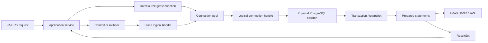
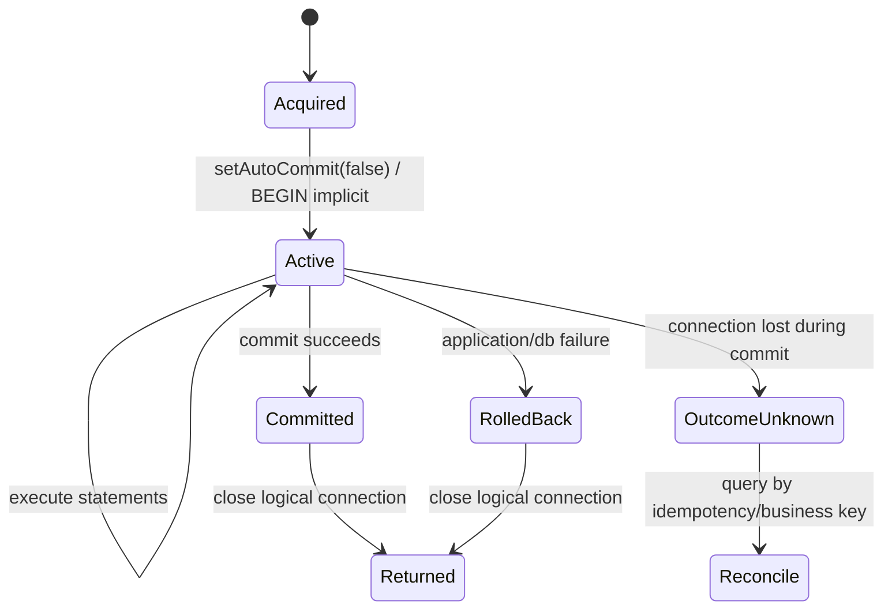
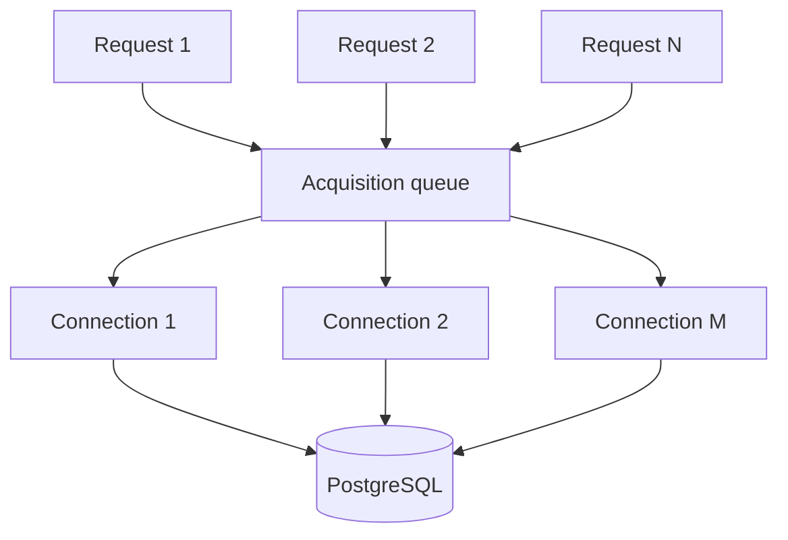
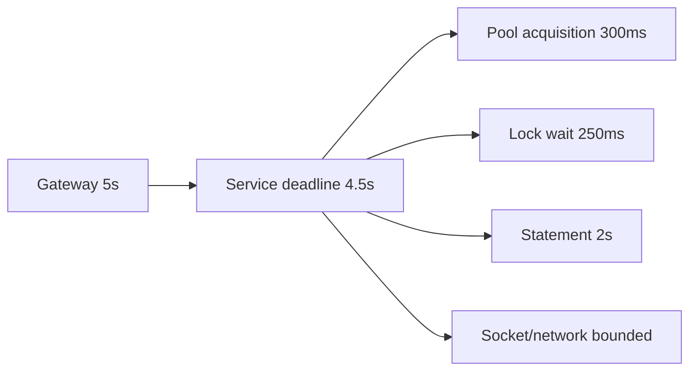
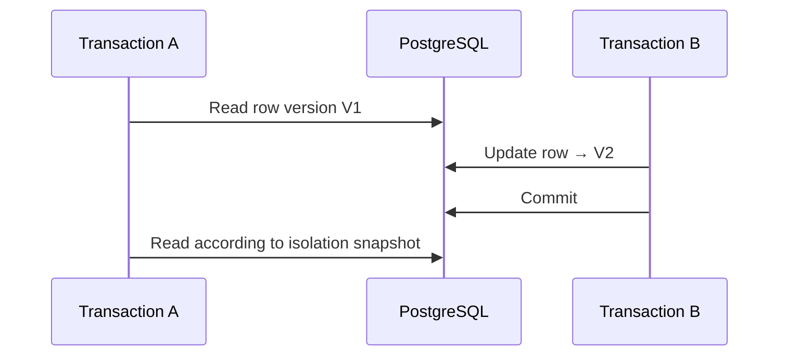
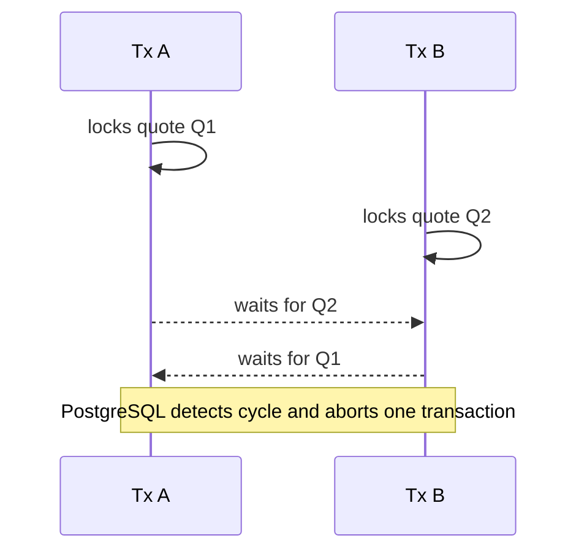
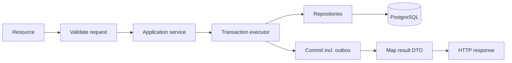

# Part 029 — JDBC, Connection Pools, Transactions, and Locking

> JDBC bukan hanya API untuk menjalankan SQL. Dalam production service, JDBC adalah boundary antara request threads, finite connection pool, PostgreSQL sessions, transaction snapshots, locks, network sockets, dan durable state. Sebagian besar incident database-facing service bukan disebabkan oleh syntax SQL, melainkan oleh ownership connection yang kabur, transaction terlalu panjang, timeout yang tidak selaras, pool yang disizing secara spekulatif, atau retry yang mengulang outcome ambigu.

## Daftar Isi

1. [Target kompetensi](#target-kompetensi)
2. [Scope dan baseline](#scope-dan-baseline)
3. [Boundary dengan Part 028, 030, dan 031](#boundary-dengan-part-028-030-dan-031)
4. [Mental model: request, pool, session, transaction](#mental-model-request-pool-session-transaction)
5. [JDBC architecture](#jdbc-architecture)
6. [`DataSource` sebagai acquisition boundary](#datasource-sebagai-acquisition-boundary)
7. [Physical connection versus logical connection](#physical-connection-versus-logical-connection)
8. [Connection ownership](#connection-ownership)
9. [Lifecycle dengan try-with-resources](#lifecycle-dengan-try-with-resources)
10. [Auto-commit semantics](#auto-commit-semantics)
11. [Explicit transaction lifecycle](#explicit-transaction-lifecycle)
12. [Transaction boundary dan domain invariant](#transaction-boundary-dan-domain-invariant)
13. [Connection state yang wajib di-reset](#connection-state-yang-wajib-di-reset)
14. [`PreparedStatement` dan parameter binding](#preparedstatement-dan-parameter-binding)
15. [Server-prepared statements pada pgJDBC](#server-prepared-statements-pada-pgjdbc)
16. [`ResultSet`, cursor, dan streaming rows](#resultset-cursor-dan-streaming-rows)
17. [Fetch size dan bounded memory](#fetch-size-dan-bounded-memory)
18. [Batch statements](#batch-statements)
19. [Generated keys dan PostgreSQL `RETURNING`](#generated-keys-dan-postgresql-returning)
20. [SQL warnings dan SQLState](#sql-warnings-dan-sqlstate)
21. [Exception translation](#exception-translation)
22. [Connection pool mental model](#connection-pool-mental-model)
23. [Sizing pool berdasarkan concurrency budget](#sizing-pool-berdasarkan-concurrency-budget)
24. [Per-pod pool dan database connection budget](#per-pod-pool-dan-database-connection-budget)
25. [Acquisition timeout](#acquisition-timeout)
26. [Idle, lifetime, validation, dan keepalive](#idle-lifetime-validation-dan-keepalive)
27. [Leak detection](#leak-detection)
28. [Pool warmup dan startup storm](#pool-warmup-dan-startup-storm)
29. [Session-state leakage](#session-state-leakage)
30. [Timeout hierarchy](#timeout-hierarchy)
31. [Statement cancellation](#statement-cancellation)
32. [Network failure dan ambiguous outcome](#network-failure-dan-ambiguous-outcome)
33. [PostgreSQL MVCC mental model](#postgresql-mvcc-mental-model)
34. [Isolation level overview](#isolation-level-overview)
35. [`READ COMMITTED`](#read-committed)
36. [`REPEATABLE READ`](#repeatable-read)
37. [`SERIALIZABLE`](#serializable)
38. [Serialization failure retry](#serialization-failure-retry)
39. [Lost update](#lost-update)
40. [Optimistic concurrency control](#optimistic-concurrency-control)
41. [Pessimistic row locking](#pessimistic-row-locking)
42. [`NOWAIT` dan `SKIP LOCKED`](#nowait-dan-skip-locked)
43. [Table-level locking](#table-level-locking)
44. [Advisory locks](#advisory-locks)
45. [Lock ordering](#lock-ordering)
46. [Deadlock](#deadlock)
47. [Savepoints](#savepoints)
48. [Long transaction dan idle-in-transaction](#long-transaction-dan-idle-in-transaction)
49. [Transaction propagation](#transaction-propagation)
50. [Local versus distributed transaction](#local-versus-distributed-transaction)
51. [Read replicas dan read consistency](#read-replicas-dan-read-consistency)
52. [JAX-RS request boundary](#jax-rs-request-boundary)
53. [Cancellation propagation](#cancellation-propagation)
54. [Retries dan idempotency](#retries-dan-idempotency)
55. [Observability](#observability)
56. [Production diagnostic queries](#production-diagnostic-queries)
57. [Failure-model matrix](#failure-model-matrix)
58. [Debugging playbook](#debugging-playbook)
59. [Testing strategy](#testing-strategy)
60. [Architecture patterns](#architecture-patterns)
61. [Anti-patterns](#anti-patterns)
62. [PR review checklist](#pr-review-checklist)
63. [Trade-off yang harus dipahami senior engineer](#trade-off-yang-harus-dipahami-senior-engineer)
64. [Internal verification checklist](#internal-verification-checklist)
65. [Latihan verifikasi](#latihan-verifikasi)
66. [Ringkasan](#ringkasan)
67. [Referensi resmi](#referensi-resmi)

---

## Target kompetensi

Setelah menyelesaikan part ini, Anda harus mampu:

- menjelaskan hubungan request thread, logical connection, physical PostgreSQL session, transaction, snapshot, statement, result set, dan lock;
- menentukan siapa yang acquire, menggunakan, commit/rollback, dan close connection;
- mendesain transaction boundary berdasarkan invariant domain, bukan berdasarkan jumlah repository call;
- membedakan auto-commit statement transaction dari explicit multi-statement transaction;
- mengonfigurasi pool berdasarkan finite database budget, expected concurrency, dan transaction duration;
- mendeteksi pool starvation, connection leak, session-state leakage, long transaction, dan idle-in-transaction;
- memilih timeout pada acquisition, statement, lock, socket/network, dan request level secara konsisten;
- memahami PostgreSQL MVCC serta semantics `READ COMMITTED`, `REPEATABLE READ`, dan `SERIALIZABLE`;
- mengenali lost update, write skew, serialization failure, blocking locks, deadlock, dan ambiguous commit outcome;
- memilih optimistic versioning, row locks, advisory locks, unique constraints, atau serializable transaction berdasarkan invariant;
- menerapkan retry hanya pada failure yang diketahui aman dan mengulang seluruh transaction function;
- menggunakan `pg_stat_activity`, `pg_locks`, blocking PID functions, SQLState, pool metrics, dan traces untuk diagnosis;
- mereview JDBC code dari sisi correctness, concurrency, resource ownership, operability, dan blast radius.

---

## Scope dan baseline

Baseline materi:

- Java 17+;
- JDBC 4.x API melalui `java.sql` dan `javax.sql`;
- PostgreSQL modern dan pgJDBC;
- JAX-RS/Jersey service dengan synchronous maupun asynchronous request processing;
- connection pool eksternal atau container-managed data source;
- explicit SQL/MyBatis dibahas lebih lanjut pada Part 030;
- database migration dibahas pada Part 031;
- resilience dan timeout budget mengacu pada Part 024;
- multi-tenancy mengacu pada Part 019 dan Part 026.

Part ini **tidak mengasumsikan**:

- pool library tertentu;
- HikariCP, Agroal, application-server pool, atau custom pool;
- Spring transaction management;
- Jakarta Transactions/JTA;
- XA/two-phase commit;
- read replicas;
- satu database per service;
- default isolation dan timeout internal;
- maximum database connections;
- penggunaan advisory lock;
- direct JDBC atau MyBatis;
- exact PostgreSQL/pgJDBC version.

Semua detail tersebut harus dipastikan melalui dependency graph, bootstrap configuration, deployment manifests, database settings, dashboards, pool metrics, code search, dan architecture documentation.

---

## Boundary dengan Part 028, 030, dan 031

| Part | Fokus |
|---|---|
| Part 028 | Data model, constraints, indexes, planner, query patterns |
| Part 029 | JDBC lifecycle, pools, transactions, isolation, locks, deadlocks |
| Part 030 | MyBatis mappings, dynamic SQL, functions, procedures, triggers, PL/pgSQL |
| Part 031 | Liquibase/Flyway, schema compatibility, backfills, expand-contract |

Part ini menggunakan SQL examples untuk menjelaskan transaction/lock behavior. Mapper organization dan database-side logic dibahas pada Part 030 agar tidak berulang.

---

## Mental model: request, pool, session, transaction



Important distinction:

```text
close(logical Connection)
    usually returns the physical connection to the pool
    and must not mean "leave transaction/session state behind"
```

A connection pool does not create unlimited database concurrency. It multiplexes a finite number of PostgreSQL sessions across application work. Every borrowed connection is unavailable to other requests until returned.

A useful invariant:

> Connection acquisition begins as late as possible, transaction duration is as short as correctness allows, and the connection is returned before slow non-database work continues.

---

## JDBC architecture

JDBC layers:

```text
Application code
  → DataSource / Connection
  → JDBC driver (pgJDBC)
  → PostgreSQL wire protocol
  → PostgreSQL backend process/session
```

Core interfaces:

| Interface | Responsibility |
|---|---|
| `DataSource` | Connection acquisition/configuration boundary |
| `Connection` | Database session and transaction control |
| `PreparedStatement` | Parameterized statement execution |
| `CallableStatement` | Procedure/function call interface where appropriate |
| `ResultSet` | Cursor-like access to returned rows |
| `Savepoint` | Partial rollback marker within a transaction |
| `DatabaseMetaData` | Driver/database capabilities and metadata |

JDBC is portable only at the API surface. SQL grammar, types, generated keys, isolation behavior, error codes, array/JSON mappings, prepared-statement behavior, and locking remain database/driver-specific.

---

## `DataSource` sebagai acquisition boundary

Prefer:

```java
public final class QuoteRepository {
    private final DataSource dataSource;

    public QuoteRepository(DataSource dataSource) {
        this.dataSource = Objects.requireNonNull(dataSource);
    }
}
```

Avoid constructing a new driver connection inside each repository method:

```java
// Avoid as application design.
DriverManager.getConnection(url, username, password);
```

`DataSource` can represent:

- a direct non-pooled data source;
- application-managed connection pool;
- container-managed pool;
- JTA/XA-aware data source;
- routing/wrapper data source;
- instrumented or credential-rotating data source.

The application should know which model it receives. Treating every `DataSource` as equivalent hides lifecycle and transaction ownership.

---

## Physical connection versus logical connection

With a pool:

- physical connection is an authenticated PostgreSQL session/socket;
- logical connection is a borrowed handle/wrapper;
- `close()` returns the handle to the pool;
- the pool should rollback unfinished work and restore known state;
- physical connection may remain alive for later borrowers;
- connection lifetime can span many requests;
- transaction lifetime must not span borrowers.

Consequences:

1. Session-level settings can leak.
2. Temporary tables can survive longer than expected.
3. Session advisory locks can survive transaction completion.
4. Prepared statement caches and server-side state persist.
5. A broken socket can be discovered only on later use.
6. Credentials/certificates may rotate while existing sessions remain alive.

---

## Connection ownership

Make ownership explicit:

| Layer | Recommended ownership |
|---|---|
| JAX-RS resource | Usually no direct `Connection` ownership |
| Application service | Owns transaction use case/boundary |
| Transaction executor | Acquires, commits/rolls back, closes |
| Repository | Uses supplied connection/session; does not commit independently |
| Pool/container | Owns physical connections |
| Platform | Owns database credentials/network policy |

A repository that calls `commit()` breaks composition: two repositories can no longer participate atomically in one use case.

Bad boundary:

```java
public void updateQuote(Quote quote) {
    try (Connection c = dataSource.getConnection()) {
        // update
        c.commit(); // hidden transaction ownership
    }
}
```

Better boundary:

```java
@FunctionalInterface
public interface SqlWork<T> {
    T execute(Connection connection) throws SQLException;
}

public final class JdbcTransactionExecutor {
    private final DataSource dataSource;

    public JdbcTransactionExecutor(DataSource dataSource) {
        this.dataSource = dataSource;
    }

    public <T> T required(SqlWork<T> work) throws SQLException {
        try (Connection connection = dataSource.getConnection()) {
            boolean originalAutoCommit = connection.getAutoCommit();
            connection.setAutoCommit(false);
            try {
                T result = work.execute(connection);
                connection.commit();
                return result;
            } catch (Throwable failure) {
                try {
                    connection.rollback();
                } catch (SQLException rollbackFailure) {
                    failure.addSuppressed(rollbackFailure);
                }
                throw failure;
            } finally {
                connection.setAutoCommit(originalAutoCommit);
            }
        }
    }
}
```

Production code usually needs typed exception translation, timeouts, metrics, read-only/isolation configuration, and careful handling of `Throwable`; the example illustrates lifecycle ownership.

---

## Lifecycle dengan try-with-resources

Nested resource ownership normally follows reverse close order:

```java
try (Connection connection = dataSource.getConnection();
     PreparedStatement statement = connection.prepareStatement(SQL)) {

    statement.setObject(1, tenantId);
    statement.setObject(2, quoteId);

    try (ResultSet rows = statement.executeQuery()) {
        if (!rows.next()) {
            return Optional.empty();
        }
        return Optional.of(mapQuote(rows));
    }
}
```

Important rules:

- do not return a lazy object that still depends on a closed `ResultSet`;
- do not expose `ResultSet` outside repository boundary;
- do not close a connection owned by an external transaction manager;
- do not let exceptions from `close()` erase the original failure;
- close streams/LOB handles according to driver semantics;
- never store a `Connection` in a singleton field.

---

## Auto-commit semantics

JDBC connections default to auto-commit unless configured otherwise. Under auto-commit, each statement forms its own transaction and is committed when statement completion semantics are satisfied.

This is safe for isolated single-statement operations whose invariant is enforced in that statement or by database constraints.

It is unsafe when a use case requires multiple operations atomically:

```text
INSERT order
UPDATE quote state
INSERT outbox event
```

With auto-commit, partial success is possible. Explicit transaction is required when these writes must succeed or fail together.

Do not casually toggle auto-commit inside code managed by a transaction framework. Verify transaction ownership first.

---

## Explicit transaction lifecycle



Key distinction:

- failure **before** commit request usually means not committed;
- successful commit acknowledgement means committed;
- connection loss during commit can leave outcome unknown;
- retrying blindly after unknown outcome can duplicate business action.

Design operations with durable idempotency/business keys and reconciliation paths.

---

## Transaction boundary dan domain invariant

A transaction boundary should contain all state changes required for one invariant transition.

Conceptual example:

```text
Accept quote command
  1. lock/read current quote version
  2. validate current state and validity window
  3. transition quote state
  4. create order draft or command record
  5. append outbox event
  6. commit
```

Do not include inside database transaction unless necessary:

- remote HTTP calls;
- long Kafka waits;
- file uploads;
- human interaction;
- unbounded calculations;
- retry sleeps;
- synchronous calls to another database.

Those actions extend lock/snapshot/connection duration and couple database availability to remote latency.

Use state transitions, outbox, saga/workflow, and reconciliation for cross-boundary consistency.

---

## Connection state yang wajib di-reset

Potential mutable state:

- auto-commit;
- read-only flag;
- isolation level;
- catalog/schema/search path;
- transaction state;
- network timeout;
- warnings;
- client info/application name;
- session variables and `SET` values;
- role changes;
- temporary objects;
- advisory locks;
- prepared statements;
- LISTEN registrations.

Never assume a borrowed connection is pristine unless the pool contract and tests prove reset behavior.

Prefer transaction-local settings where possible:

```sql
SET LOCAL statement_timeout = '2s';
SET LOCAL lock_timeout = '250ms';
SET LOCAL app.tenant_id = '...';
```

`SET LOCAL` is scoped to the current transaction, reducing cross-borrower leakage.

---

## `PreparedStatement` dan parameter binding

Use parameters for values:

```java
String sql = """
    SELECT quote_id, quote_number, status, version
      FROM quote
     WHERE tenant_id = ?
       AND quote_id = ?
    """;

try (PreparedStatement ps = connection.prepareStatement(sql)) {
    ps.setObject(1, tenantId);
    ps.setObject(2, quoteId);
}
```

Benefits:

- prevents value-level SQL injection;
- makes type binding explicit;
- allows statement/plan reuse depending on driver/server;
- separates SQL structure from data;
- improves telemetry normalization.

Parameters cannot replace identifiers or keywords. Dynamic table names, columns, and `ORDER BY` direction must be selected from allowlisted SQL fragments, never raw user input.

Type concerns:

- use explicit JDBC/Java type for ambiguous nulls;
- verify UUID, JSONB, array, enum, timezone, and numeric mappings;
- avoid converting all values to strings;
- bind `BigDecimal` without `double` conversion;
- treat driver-specific objects as library-specific boundary.

---

## Server-prepared statements pada pgJDBC

pgJDBC can switch repeated `PreparedStatement` executions to server-prepared statements after a configurable threshold. This can improve protocol/parse overhead but introduces trade-offs:

- generic versus custom plan behavior;
- parameter-sensitive plans;
- prepared-statement cache memory;
- invalidation after schema changes;
- pool/session affinity;
- failover/reconnect resets;
- type inference differences for null/unknown parameters.

Do not tune `prepareThreshold`, statement cache, or binary transfer from folklore. Measure representative queries with production-like parameter distributions.

---

## `ResultSet`, cursor, dan streaming rows

A `ResultSet` is tied to:

- statement;
- connection;
- transaction/session;
- network stream;
- server-side cursor behavior if enabled.

Do not expose it as an application stream after the transaction closes.

For large exports:

```text
request
  → acquire connection
  → begin read transaction if cursor requires it
  → execute bounded query
  → fetch batch
  → transform/write batch
  → detect disconnect/cancel
  → close result set, statement, connection
```

This keeps a connection occupied for the whole stream. Large HTTP exports may therefore require:

- dedicated concurrency limit;
- dedicated pool;
- async export job/object storage;
- read replica;
- statement and total duration limits;
- client disconnect cancellation.

---

## Fetch size dan bounded memory

Fetch size is a driver hint, not a universal guarantee. With PostgreSQL, cursor-based fetching typically requires appropriate driver settings and auto-commit disabled.

Review:

- fetch size;
- result set type;
- auto-commit state;
- transaction duration;
- row width;
- network round trips;
- mapping allocation;
- downstream backpressure.

A fetch size of 1,000 rows is not bounded if each row contains multi-megabyte JSON or binary data.

---

## Batch statements

Batching can reduce round trips:

```java
try (PreparedStatement ps = connection.prepareStatement("""
    INSERT INTO quote_item
        (tenant_id, quote_id, line_id, product_code, quantity)
    VALUES (?, ?, ?, ?, ?)
    """)) {

    for (QuoteLine line : lines) {
        ps.setObject(1, tenantId);
        ps.setObject(2, quoteId);
        ps.setObject(3, line.id());
        ps.setString(4, line.productCode());
        ps.setBigDecimal(5, line.quantity());
        ps.addBatch();
    }

    int[] counts = ps.executeBatch();
}
```

Failure semantics require care:

- partial driver execution may be reflected in update counts;
- transaction rollback should define atomicity;
- generated keys may differ by driver;
- very large batches increase memory and lock duration;
- PostgreSQL multi-row insert or `COPY` may be more suitable for bulk ingestion;
- batch retry must avoid duplicate rows through constraints/idempotency.

---

## Generated keys dan PostgreSQL `RETURNING`

PostgreSQL `RETURNING` provides explicit and composable generated values:

```sql
INSERT INTO quote (tenant_id, quote_number, status)
VALUES (?, ?, 'DRAFT')
RETURNING quote_id, version, created_at;
```

Advantages over hidden generated-key behavior:

- exact returned columns;
- works for generated/default values;
- one round trip;
- clear SQL contract;
- easier mapper testing.

Verify pgJDBC/MyBatis mapping and multi-row behavior.

---

## SQL warnings dan SQLState

`SQLException` provides:

- message;
- SQLState;
- vendor error code;
- chained exceptions;
- cause.

SQLState class examples:

| Class | Meaning | Typical handling |
|---|---|---|
| `08` | connection exception | outcome may be ambiguous; inspect phase |
| `22` | data exception | mapping/input/data defect |
| `23` | integrity constraint violation | conflict/domain mapping |
| `25` | invalid transaction state | programming/lifecycle defect |
| `40` | transaction rollback | deadlock/serialization retry candidate |
| `42` | syntax/access rule violation | deployment/code/config defect |
| `53` | insufficient resources | overload/capacity incident |
| `57` | operator intervention | cancellation/shutdown/recovery |

Do not map all `SQLException` to HTTP 500 without preserving classification. Do not expose raw database messages, table names, SQL, or values to clients.

---

## Exception translation

Translate at the persistence/application boundary:

```text
SQL unique violation
  → DomainConflict / IdempotencyConflict
  → HTTP 409 if contract defines conflict

Serialization failure
  → retry entire transaction within budget
  → service unavailable/conflict if exhausted depending semantics

Connection unavailable
  → dependency unavailable
  → 503, not business validation error
```

Preserve for telemetry:

- SQLState;
- sanitized statement ID, not raw sensitive SQL;
- database operation name;
- duration;
- retry attempt;
- connection acquisition duration;
- transaction ID/correlation context where safe.

Avoid translating by message substring. Use SQLState and driver-specific structured data where necessary.

---

## Connection pool mental model

A pool is a concurrency limiter and reuse mechanism:



If `M` connections are busy:

- new borrowers wait;
- request latency grows before SQL begins;
- upstream retries can add more waiters;
- thread pools can saturate;
- timeouts may trigger after work has already queued;
- increasing pool size may simply move saturation into PostgreSQL.

Pool saturation is a system-level symptom. Diagnose transaction duration and database capacity before increasing `maximumPoolSize` or equivalent.

---

## Sizing pool berdasarkan concurrency budget

A practical starting model:

```text
required concurrent DB connections
  ≈ request throughput requiring DB × average connection hold time
```

This is Little's Law as a capacity reasoning tool, not an exact configuration formula.

Example:

```text
400 DB-backed operations/s
average connection hold time = 25 ms
average concurrency ≈ 400 × 0.025 = 10
```

Then account for:

- p95/p99 hold time;
- burstiness;
- batch jobs;
- Kafka consumers;
- scheduled jobs;
- background workers;
- health checks;
- transaction retries;
- read/write pool separation;
- rollout with old and new replicas simultaneously;
- failover/recovery headroom.

A larger pool is not free. Each PostgreSQL connection consumes backend process memory and participates in scheduling/locking.

---

## Per-pod pool dan database connection budget

Total budget:

```text
(number of pods × max pool per pod)
+ jobs
+ consumers
+ admin/maintenance
+ migration tools
+ reporting
+ failover/rollout overlap
≤ safe database connection budget
```

Autoscaling trap:

```text
10 pods × 20 connections = 200
scale to 50 pods          = 1,000
rolling deployment overlap = potentially more
```

If database capacity remains fixed, horizontal application scaling can cause database collapse.

Review:

- global connection cap;
- per-workload budget;
- pool min/max;
- autoscaling maximum;
- connection proxy such as PgBouncer, if used;
- transaction versus session pooling compatibility;
- prepared statements/session state with proxies;
- emergency/admin reserved connections.

---

## Acquisition timeout

Connection acquisition timeout limits queue wait before obtaining a connection.

It should be:

- shorter than remaining request deadline;
- visible as a distinct metric/error;
- not retried aggressively inside the same overloaded service;
- aligned with load shedding;
- different from statement timeout.

A request that waits 5 seconds for a connection and then gets 4 seconds of SQL under a 3-second gateway timeout is already operationally invalid.

Track:

- active;
- idle;
- pending/waiting;
- acquisition duration histogram;
- timeout count;
- connection creation/closure;
- hold duration if library supports it.

---

## Idle, lifetime, validation, dan keepalive

Configuration dimensions:

| Setting | Purpose | Failure if wrong |
|---|---|---|
| minimum idle | warm capacity | startup load or too many idle sessions |
| maximum size | concurrency cap | starvation or DB overload |
| idle timeout | retire unused connections | churn or stale idle sessions |
| max lifetime | recycle sessions | synchronized churn if identical/jitterless |
| validation | detect broken connection | extra queries or late discovery |
| keepalive | maintain network path | unnecessary traffic or stale NAT avoidance |
| connection timeout | bound acquisition | slow failure or excessive false rejection |

Ensure max lifetime is compatible with:

- database/network/LB idle limits;
- credential/certificate rotation;
- failover behavior;
- proxy connection lifetimes;
- rolling restarts.

Stagger/jitter retirement when supported to avoid mass reconnection.

---

## Leak detection

A connection leak means a logical handle is not returned within expected time. Causes include:

- missing `close()`;
- exception path skips cleanup;
- stream/lazy iterator escapes repository;
- request async completion forgets cleanup;
- transaction manager mismatch;
- long legitimate operation misclassified as leak;
- deadlock/blocking query holds connection.

Leak detection threshold is diagnostic, not a fix. Too low creates noise; too high delays evidence.

Use:

- acquisition stack capture selectively;
- hold-duration telemetry;
- active/pending correlation;
- thread dumps;
- `pg_stat_activity`;
- blocking query analysis;
- load test with forced failure paths.

---

## Pool warmup dan startup storm

When many pods start simultaneously:

```text
pods × minimumIdle or eager initialization
  → connection authentication burst
  → database CPU/process pressure
  → readiness failures
  → restart loop
```

Mitigations:

- avoid unnecessary eager full-pool creation;
- stagger rollout;
- use startup/readiness probes correctly;
- separate “configured” from “can execute critical query” readiness;
- cap concurrent connection creation;
- use retry with bounded backoff/jitter at startup;
- ensure startup does not run heavy migrations from every pod.

---

## Session-state leakage

Example risk:

```sql
SET search_path TO tenant_a, public;
-- connection returned without reset
-- next borrower accidentally resolves tenant_a objects
```

Other leaked state:

- `SET ROLE`;
- timezone;
- statement/lock timeout;
- custom GUC tenant context;
- session advisory lock;
- temp table;
- LISTEN subscription;
- transaction left aborted;
- read-only/isolation flag.

Controls:

1. use explicit schema-qualified objects where appropriate;
2. prefer `SET LOCAL` inside transaction;
3. test pool reset semantics;
4. avoid session-level tenancy state unless rigorously controlled;
5. rollback before returning connection;
6. dispose suspicious/broken connections;
7. use a single abstraction for acquisition and transaction setup.

---

## Timeout hierarchy

A coherent timeout budget:



Relevant controls can include:

- ingress/gateway timeout;
- JAX-RS request deadline;
- executor queue timeout;
- pool acquisition timeout;
- PostgreSQL `lock_timeout`;
- PostgreSQL `statement_timeout`;
- JDBC query timeout;
- JDBC network timeout;
- pgJDBC socket/connect timeout;
- `idle_in_transaction_session_timeout`;
- application cancellation.

Rules:

- outer timeout must exceed inner timeout plus cleanup margin;
- timeout must identify which phase expired;
- do not rely on only one outer timeout;
- transaction rollback time needs budget;
- cancellation is not instant and may race with completion;
- timeout policy for batch/export differs from interactive API.

---

## Statement cancellation

JDBC provides mechanisms such as statement query timeout and cancellation. PostgreSQL also supports backend cancellation.

Cancellation behavior is cooperative and race-prone:

```text
client decides timeout
  → sends cancel/request or closes socket
  → server may already have completed
  → transaction may be aborted or result may be discarded
```

After statement failure/cancellation inside a PostgreSQL transaction, the transaction commonly remains aborted until rollback. Do not return that connection to normal work without cleanup.

Verify driver/pool behavior for:

- `Statement.cancel()`;
- `setQueryTimeout()`;
- `Connection.setNetworkTimeout()`;
- thread interruption;
- client disconnect;
- socket close;
- rollback after cancellation.

---

## Network failure dan ambiguous outcome

Cases:

| Failure point | Likely state |
|---|---|
| before SQL reaches server | not executed, but verify |
| during query before commit | transaction usually uncommitted/aborted |
| after write but before commit | not durable until commit |
| during commit response | outcome may be unknown |
| after commit acknowledged | committed |

For command APIs, use:

- request/idempotency key;
- unique business command ID;
- durable command/result record;
- query/reconciliation endpoint;
- outbox transaction;
- client retry contract.

Never treat all connection exceptions as safe retry.

---

## PostgreSQL MVCC mental model

MVCC allows readers and writers to operate on row versions rather than using one global read lock.

Simplified:



MVCC does not remove all concurrency problems. It changes them into:

- visibility rules;
- write conflicts;
- serialization failures;
- row/table lock waits;
- dead tuples and vacuum pressure;
- long snapshot retention.

---

## Isolation level overview

PostgreSQL provides these practical levels:

| JDBC level | PostgreSQL behavior |
|---|---|
| `READ_UNCOMMITTED` | Behaves as `READ COMMITTED` |
| `READ_COMMITTED` | New snapshot per statement |
| `REPEATABLE_READ` | Stable transaction snapshot; serialization failures possible |
| `SERIALIZABLE` | Serializable Snapshot Isolation with anomaly detection |

Isolation is not an adjective like “strong.” It is a specific set of visibility and anomaly guarantees. Choose based on invariant and retry capability.

---

## `READ COMMITTED`

Default in many PostgreSQL installations, but internal configuration must be verified.

Characteristics:

- each statement sees rows committed before that statement begins;
- two reads in one transaction can observe different committed states;
- concurrent updates may cause re-evaluation/waits;
- multi-statement check-then-act can be unsafe without lock/constraint/version condition.

Unsafe conceptual flow:

```text
T1: SELECT available_capacity = 1
T2: SELECT available_capacity = 1
T1: INSERT allocation
T2: INSERT allocation
```

Protect via:

- unique/check/exclusion constraints;
- atomic conditional update;
- row lock;
- optimistic version predicate;
- serializable transaction.

---

## `REPEATABLE READ`

Characteristics in PostgreSQL:

- transaction uses a stable snapshot;
- repeated reads see consistent snapshot;
- concurrent update conflicts can produce serialization errors;
- long transactions retain old row versions and increase vacuum/bloat pressure;
- application must retry failed transaction from the beginning.

Stable snapshot does not mean cached Java objects can be used after transaction completion as if they remain current.

---

## `SERIALIZABLE`

Serializable aims to produce outcomes equivalent to some serial execution order.

PostgreSQL tracks dependencies and can abort a transaction with serialization failure instead of allowing an anomaly.

Requirements:

- transaction function is repeatable;
- retries are bounded;
- external side effects are outside transaction or idempotent;
- no HTTP/Kafka emission before commit unless using outbox;
- retry metrics and contention diagnostics exist;
- user-facing semantics for exhausted retries are defined.

Serializable is not “turn on and forget.” High contention or broad reads may increase abort rate.

---

## Serialization failure retry

Retry **the whole transaction**, not only the last failed statement:

```java
public <T> T serializableWithRetry(SqlWork<T> work, int maxAttempts)
        throws SQLException {
    SQLException last = null;

    for (int attempt = 1; attempt <= maxAttempts; attempt++) {
        try (Connection connection = dataSource.getConnection()) {
            connection.setAutoCommit(false);
            connection.setTransactionIsolation(Connection.TRANSACTION_SERIALIZABLE);
            try {
                T result = work.execute(connection);
                connection.commit();
                return result;
            } catch (SQLException ex) {
                rollbackQuietly(connection, ex);
                if (!isSerializationOrDeadlock(ex) || attempt == maxAttempts) {
                    throw ex;
                }
                last = ex;
            }
        }
        boundedJitter(attempt);
    }

    throw last;
}
```

Production concerns:

- honor request deadline;
- separate deadlock/serialization from connection ambiguity;
- no side effect before commit;
- log only final/excessive retries at appropriate level;
- metric retry attempts and exhausted operations;
- avoid synchronizing retries through identical sleep.

---

## Lost update

Classic lost update:

```text
T1 reads version 7, amount 100
T2 reads version 7, amount 100
T1 writes amount 110
T2 writes amount 120, overwriting T1
```

Possible controls:

### Atomic update

```sql
UPDATE counter
SET value = value + ?
WHERE tenant_id = ? AND counter_id = ?;
```

### Optimistic version

```sql
UPDATE quote
SET status = ?, version = version + 1
WHERE tenant_id = ?
  AND quote_id = ?
  AND version = ?;
```

Expected update count must be exactly one.

### Row lock

```sql
SELECT ...
FROM quote
WHERE tenant_id = ? AND quote_id = ?
FOR UPDATE;
```

### Serializable

Use when invariant spans predicates/sets and is difficult to encode otherwise.

---

## Optimistic concurrency control

Optimistic concurrency works well when conflicts are uncommon and clients can receive conflict/retry information.

Components:

- immutable version field or last-modified token;
- version included in read response/ETag;
- conditional update predicate;
- exact affected-row check;
- HTTP `If-Match`/409/412 contract as designed;
- no “last writer silently wins” unless intentional.

Do not implement:

```text
SELECT version
then UPDATE without version predicate
```

The check and update must be atomic in one SQL statement or protected by lock/isolation.

---

## Pessimistic row locking

`SELECT ... FOR UPDATE` protects selected rows from conflicting updates until transaction end.

Use when:

- a short critical section must inspect and update current state;
- conflict is expected enough that optimistic retries are wasteful;
- processing order/ownership requires a lock;
- exact rows can be selected with indexed predicates.

Risks:

- lock waits;
- deadlocks;
- queueing behind slow transactions;
- broad scans locking too many rows;
- remote calls while lock held;
- transaction failure leaving clients waiting until rollback/session cleanup.

Lock rows in deterministic order.

---

## `NOWAIT` dan `SKIP LOCKED`

`NOWAIT`:

- fail immediately if lock cannot be acquired;
- useful when waiting has no value;
- application must map lock-not-available semantics.

`SKIP LOCKED`:

- skips rows currently locked by another transaction;
- useful for database-backed work queues;
- produces an intentionally inconsistent view;
- not suitable for general business reads or “find all matching orders.”

Queue pattern:

```sql
SELECT job_id
FROM reconciliation_job
WHERE state = 'READY'
ORDER BY priority DESC, created_at
FOR UPDATE SKIP LOCKED
LIMIT 20;
```

Must still handle:

- worker crash;
- lease/visibility timeout or state recovery;
- poison jobs;
- starvation/fairness;
- duplicate effects;
- retry count and dead-letter state.

---

## Table-level locking

PostgreSQL commands acquire table locks automatically. Explicit table locks may be required for unusual consistency or operational workflows, but they have broad blast radius.

DDL can require strong locks. Schema migrations that appear small can block or be blocked by long application transactions.

Review:

- lock mode;
- acquisition order;
- timeout;
- expected table size/activity;
- rollout window;
- replica effects;
- rollback/roll-forward plan.

---

## Advisory locks

Advisory locks use application-defined keys rather than table rows.

Potential uses:

- singleton scheduler coordination;
- serialize operation for a business key without a lock row;
- migration/admin coordination.

Risks:

- key collision;
- missing tenant dimension;
- session-level lock leakage into pool;
- failover semantics;
- no automatic relationship to data correctness;
- external systems do not respect the lock;
- connection proxies/session pooling interactions;
- split coordination across databases/clusters.

Prefer transaction-scoped advisory locks when possible. Define and test key derivation.

---

## Lock ordering

Deadlock prevention rule:

> All code paths that lock multiple resources should acquire them in the same deterministic order.

For example:

```text
order quote by UUID bytes/string canonical order
lock lower ID first
lock higher ID second
```

Ordering must include:

- rows across tables;
- explicit locks;
- updates that acquire implicit locks;
- trigger/function side effects;
- indexes/unique constraints indirectly involved;
- event/outbox rows if relevant.

Document lock order in repository/service code and architecture notes.

---

## Deadlock

Deadlock:



Application behavior:

- rollback entire transaction;
- classify SQLState transaction rollback/deadlock;
- retry only if operation is retry-safe and budget remains;
- preserve evidence about involved statement IDs and lock order;
- fix recurring pattern rather than relying indefinitely on retry.

Do not catch deadlock inside repository and rerun one statement on the same failed transaction.

---

## Savepoints

Savepoints allow partial rollback:

```java
Savepoint savepoint = connection.setSavepoint("before_optional_step");
try {
    optionalWrite(connection);
} catch (SQLException ex) {
    connection.rollback(savepoint);
}
```

Use sparingly. Savepoints can:

- complicate invariant reasoning;
- hide partial success;
- retain locks/resources longer than expected;
- interact with framework transaction managers;
- make error semantics unclear.

A failed PostgreSQL statement aborts the transaction unless recovered through a savepoint/subtransaction mechanism. Verify framework behavior.

---

## Long transaction dan idle-in-transaction

Long transactions cause:

- long connection occupancy;
- lock retention;
- old snapshot retention;
- vacuum cleanup delays;
- bloat;
- replication/recovery pressure;
- DDL blocking;
- larger rollback cost;
- incident diagnosis complexity.

`idle in transaction` is especially dangerous: application is not doing database work but transaction/snapshot/locks remain open.

Common causes:

- remote call inside transaction;
- waiting for user/network;
- streaming response while transaction open;
- code path forgets commit/rollback;
- debugger breakpoint;
- pool/framework mismatch;
- exception swallowed before cleanup.

Set and monitor appropriate server-side limits, but fix ownership defects.

---

## Transaction propagation

Propagation such as `REQUIRED`, `REQUIRES_NEW`, `MANDATORY`, or `NOT_SUPPORTED` is **not a core JDBC concept**. It is supplied by a transaction manager/framework/container.

JDBC itself gives a `Connection` and local transaction methods.

Questions to verify:

- who binds connection to current execution context;
- whether nested service calls share one transaction;
- whether “new transaction” consumes a second connection;
- whether outer rollback affects inner commit;
- context propagation across executors;
- behavior in async JAX-RS callbacks;
- interception/proxy limitations;
- checked/unchecked exception rollback policy.

Never assume Spring semantics in a non-Spring JAX-RS service.

---

## Local versus distributed transaction

Local transaction covers one database connection/resource manager.

Cross-system atomicity cannot be achieved by wishful ordering:

```text
commit PostgreSQL
publish Kafka
```

Failure between them creates inconsistency.

Options:

- transactional outbox;
- inbox/idempotent consumer;
- saga/workflow;
- reconciliation;
- XA/JTA where explicitly justified and supported.

XA/two-phase commit trade-offs:

- coordination complexity;
- prepared transaction operational risks;
- resource support requirements;
- recovery procedures;
- latency/availability coupling;
- Kubernetes restart/failover behavior.

Internal architecture, not repository convenience, must decide.

---

## Read replicas dan read consistency

Read replicas can reduce primary read load but introduce:

- replication lag;
- read-your-write failure;
- stale catalog/pricing/quote status;
- transaction routing complexity;
- failover role changes;
- replica conflict/cancellation;
- separate pools and health checks.

Define endpoint consistency:

| Operation | Possible requirement |
|---|---|
| submit command then fetch status | read-your-write |
| catalog browse | bounded staleness may be acceptable |
| pricing evaluation | exact effective revision may be required |
| audit/export | explicit as-of/freshness contract |

Never route reads to replicas merely because method name starts with `find`.

---

## JAX-RS request boundary

Recommended flow:



JAX-RS resource should not:

- hold connection as field;
- begin transaction before request validation;
- serialize large response while lock remains held;
- map raw SQL exceptions directly to clients;
- retry unknown commit outcomes blindly;
- call multiple repositories each with independent auto-commit when atomicity is required.

---

## Cancellation propagation

Request cancellation should influence queued/acquired database work where feasible:

```text
client disconnect / deadline
  → cancel application future
  → cancel statement
  → rollback transaction
  → return/discard connection
```

But cancellation has races:

- SQL may have completed;
- commit may have occurred;
- cancel packet may be delayed;
- rollback may fail due to broken connection;
- application thread may ignore interruption.

For state-changing endpoints, client disconnect does not mean server must roll back. Define command/status semantics.

---

## Retries dan idempotency

Retry candidates:

- serialization failure;
- deadlock victim;
- transient connection acquisition failure before transaction begins;
- selected read-only network failures where no state change occurred.

Not automatically safe:

- connection loss during commit;
- partial external side effects;
- non-idempotent sequence/command behavior;
- batch with uncertain partial execution;
- repeated stored procedure with side effects;
- retry after deadline expired.

Retry architecture:

```text
transaction function
  + bounded attempts
  + deadline awareness
  + jitter
  + idempotency/business command key
  + no external side effects before commit
  + metrics
```

Avoid retry at multiple layers: driver + repository + service + gateway can multiply load.

---

## Observability

Minimum metrics:

### Pool

- active/idle/max;
- pending waiters;
- acquisition latency;
- acquisition timeout;
- connection creation/closure/failure;
- hold duration;
- leak warnings.

### Transactions

- transaction duration;
- commit/rollback counts;
- isolation level;
- retries by reason;
- deadlock/serialization failures;
- idle-in-transaction sessions;
- long transactions.

### Statements

- duration by normalized statement/operation;
- rows returned/affected where safe;
- timeout/cancel;
- lock wait;
- SQLState class;
- read/write classification;
- tenant dimension only if cardinality policy permits.

Do not add raw SQL parameters, PII, tokens, quote payloads, or full customer identifiers to labels/logs.

---

## Production diagnostic queries

### Active sessions

```sql
SELECT pid,
       usename,
       application_name,
       client_addr,
       state,
       wait_event_type,
       wait_event,
       xact_start,
       query_start,
       state_change,
       LEFT(query, 500) AS query_sample
FROM pg_stat_activity
WHERE datname = current_database()
ORDER BY xact_start NULLS LAST, query_start NULLS LAST;
```

### Blocking relationships

```sql
SELECT blocked.pid                    AS blocked_pid,
       blocked.application_name       AS blocked_app,
       pg_blocking_pids(blocked.pid)  AS blocking_pids,
       blocked.wait_event_type,
       blocked.wait_event,
       blocked.xact_start,
       LEFT(blocked.query, 500)        AS blocked_query
FROM pg_stat_activity blocked
WHERE cardinality(pg_blocking_pids(blocked.pid)) > 0;
```

### Lock details

```sql
SELECT l.pid,
       a.application_name,
       l.locktype,
       l.mode,
       l.granted,
       l.relation::regclass AS relation,
       l.transactionid,
       l.virtualxid,
       a.state,
       a.xact_start,
       LEFT(a.query, 500) AS query_sample
FROM pg_locks l
LEFT JOIN pg_stat_activity a ON a.pid = l.pid
ORDER BY l.granted, a.xact_start NULLS LAST;
```

### Idle in transaction

```sql
SELECT pid,
       application_name,
       state,
       xact_start,
       state_change,
       NOW() - xact_start AS transaction_age,
       LEFT(query, 500) AS query_sample
FROM pg_stat_activity
WHERE state LIKE 'idle in transaction%'
ORDER BY xact_start;
```

Production access, cancellation, and termination require authorization and runbook control. Prefer cancel before terminate when safe.

---

## Failure-model matrix

| Failure mode | Observable symptom | Likely cause | Detection | Corrective direction |
|---|---|---|---|---|
| Pool acquisition timeout | 503/latency before SQL | all connections busy/leaked | pending, acquisition histogram | shorten transactions, fix leak, load shed |
| Database connection exhaustion | new sessions rejected | total per-pod budget too high | DB connection count/logs | global budget, reduce pools, proxy if appropriate |
| Connection leak | active never returns | missing close/lazy stream | leak stack, hold duration | fix ownership and failure paths |
| Session-state leakage | wrong schema/timezone/tenant | `SET` not reset | intermittent cross-request behavior | `SET LOCAL`, reset tests, explicit qualification |
| Long transaction | locks/bloat/slow DDL | remote call, huge batch, stream | `xact_start`, traces | split work, outbox/job, chunking |
| Idle in transaction | session idle with open tx | missing cleanup/waiting code | `pg_stat_activity` | rollback/close and fix lifecycle |
| Statement timeout | query cancelled | slow plan, contention, low budget | SQLState/logs/waits | optimize, bound workload, revise budget |
| Lock timeout | command fails quickly | contention | lock waits/blockers | lock order, shorter tx, conflict response |
| Deadlock | one transaction aborted | inconsistent lock order | DB deadlock log | deterministic order, reduce lock set |
| Serialization failure | transaction rollback | concurrent serializable conflict | SQLState/retry metric | retry whole tx, reduce contention |
| Lost update | silent overwritten state | no version/atomic predicate | audit/version mismatch | optimistic version or locking |
| Unknown commit outcome | connection error at commit | network/failover | transaction phase telemetry | idempotency + reconciliation |
| Slow fetch/heap growth | OOM/high GC | result materialized/unbounded | heap profile, rows/bytes | pagination/cursor/export job |
| Batch partial ambiguity | duplicates/missing rows | retry after partial execution | update counts/constraints | transaction + idempotent constraints |
| Startup connection storm | pods fail readiness/DB CPU | eager pools | connection burst | stagger, cap creation, lazy warmup |
| Retry storm | DB overload after transient issue | retries at many layers | attempt/load metrics | one retry owner, budget/jitter |
| Read replica stale result | user sees old state | replication lag | replica lag/read path | primary pinning/freshness contract |
| Aborted transaction reused | every statement fails | missing rollback after error | SQLState invalid tx state | rollback/discard connection |

---

## Debugging playbook

### Scenario A — Endpoint latency spikes and pool is full

1. Confirm whether latency is acquisition or SQL execution.
2. Inspect active, idle, pending, max, acquisition histogram.
3. Find long/idle transactions in `pg_stat_activity`.
4. Inspect blocking tree and wait events.
5. Correlate application trace span for acquire versus execute versus map.
6. Check rollout/autoscaling increased total sessions.
7. Check batch/consumer/scheduler workloads sharing pool.
8. Do not immediately increase pool size.
9. Apply load shedding or temporarily reduce non-critical workers if runbook permits.
10. Fix root cause and validate with load test.

### Scenario B — Intermittent wrong tenant/schema data

1. Treat as security incident until disproven.
2. Capture request identity, tenant context, connection/session setup, and SQL statement ID.
3. Inspect use of `search_path`, `SET ROLE`, custom GUCs, temp tables.
4. Verify `SET LOCAL` versus session `SET`.
5. Test pool return/reset behavior.
6. Inspect missing tenant predicate and composite constraints.
7. Disable unsafe routing/path as needed.
8. Add cross-tenant concurrency tests.

### Scenario C — Repeated deadlocks

1. Obtain database deadlock details and involved statements.
2. Map statements back to application use cases.
3. Include triggers/functions that acquire additional locks.
4. Reconstruct lock acquisition order.
5. Standardize deterministic order.
6. Reduce transaction duration and row set.
7. Keep bounded retry as mitigation, not final solution.

### Scenario D — Connection failure after write

1. Determine phase: acquire, statement, commit, or response.
2. If commit outcome is unknown, do not retry blindly.
3. Query by idempotency/business command key.
4. Check outbox/command record.
5. Reconcile durable state and return stable command result.
6. Improve transaction-phase telemetry and client contract.

### Scenario E — OOM during export

1. Confirm whether JDBC driver/materializer loads full result.
2. Inspect row count and row width.
3. Verify fetch size and auto-commit/cursor conditions.
4. Inspect DTO/list accumulation and output buffering.
5. Bound export concurrency.
6. Prefer async export job/object storage for large data.
7. Ensure client disconnect cancels database work.

### Scenario F — Database CPU rises after adding pods

1. Calculate total possible connections before and after scale-out.
2. Inspect connection count and runnable sessions.
3. Check query throughput, plan changes, cache hit, context switching.
4. Reduce per-pod pool or autoscaling maximum.
5. Separate batch consumers.
6. Validate capacity model under rollout overlap.

---

## Testing strategy

### Unit tests

Use unit tests for:

- SQLState classification;
- retry decision;
- timeout budget calculation;
- transaction executor commit/rollback behavior with test doubles;
- optimistic version affected-row checks;
- advisory lock key derivation;
- exception mapping/redaction.

Do not pretend mocks validate PostgreSQL transaction semantics.

### Integration tests with real PostgreSQL

Use Testcontainers or equivalent for:

- constraints and SQLState;
- isolation behavior;
- row locking and `NOWAIT`/`SKIP LOCKED`;
- deadlock reproduction;
- serialization retry;
- savepoints;
- `RETURNING` and generated types;
- cursor/fetch behavior;
- session-state reset through actual pool;
- statement/lock timeout;
- cancellation;
- connection termination and recovery.

### Concurrency tests

Use barriers/latches to force interleavings:

```text
T1 reads version
T2 reads same version
release both updates
assert exactly one optimistic update succeeds
```

Other tests:

- two transfers lock resources opposite order;
- serializable write-skew pattern;
- 100 concurrent idempotency-key inserts;
- worker queue with `SKIP LOCKED`;
- pod-like pool saturation under bounded requests.

### Failure injection

Inject:

- database unavailable before acquire;
- connection killed during query;
- cancellation during lock wait;
- connection lost during commit where feasible;
- long-running query;
- stale/rotated credential;
- pool exhausted;
- rollback failure;
- shutdown while transactions active.

### Load tests

Measure:

- acquisition versus execution latency;
- pool pending count;
- database sessions/CPU/I/O;
- transaction duration;
- lock waits;
- timeout rate;
- retry amplification;
- throughput at saturation;
- recovery after overload.

---

## Architecture patterns

### Pattern 1 — Transaction executor around application use case

```text
Resource
  → ApplicationService.acceptQuote(command)
      → transactionExecutor.required(connection -> ...)
          → quoteRepository.lock/find
          → domain transition
          → quoteRepository.updateVersioned
          → outboxRepository.append
      → return committed result
```

Properties:

- one explicit owner;
- repositories composable;
- external publication after commit/outbox;
- retry can wrap whole function;
- telemetry can mark phases.

### Pattern 2 — Optimistic command update

```sql
UPDATE quote
SET status = 'ACCEPTED',
    accepted_at = ?,
    version = version + 1
WHERE tenant_id = ?
  AND quote_id = ?
  AND status = 'ISSUED'
  AND version = ?
RETURNING quote_id, status, version;
```

One statement combines state guard, version guard, transition, and result.

### Pattern 3 — Dedicated pool for long exports/jobs

```text
interactive API pool → short OLTP transactions
batch/export pool     → limited long operations
migration tool        → separate identity and window
```

Isolation prevents one workload from consuming all connections.

### Pattern 4 — Transaction-local tenant context

```sql
BEGIN;
SET LOCAL app.tenant_id = ?;
-- RLS/policies and SQL operate under transaction-local tenant
COMMIT;
```

Only valid when identity, pool reset, role policy, and RLS are rigorously verified.

### Pattern 5 — Outbox in same local transaction

```text
update domain state
insert event/outbox row
commit once
publisher reads outbox later
```

Avoids non-atomic database-then-Kafka sequence.

---

## Anti-patterns

### Connection per mapper field

```java
class Repository {
    private final Connection connection; // unsafe shared/lifetime ambiguity
}
```

### Repository commits internally

Prevents atomic composition and hides transaction boundary.

### Remote call while row lock held

Couples lock duration to network latency and failure.

### Pool size equals request thread count

Ignores database capacity and transaction hold time.

### “Fix” pool exhaustion by doubling pool

May shift failure to database CPU/memory/locks.

### Session `SET` for tenant without reset proof

Creates cross-request/cross-tenant leakage risk.

### Retry every `SQLException`

Can duplicate commands and amplify overload.

### Swallow rollback exception

Loses evidence that connection/session may be unusable.

### Use `SKIP LOCKED` for normal list endpoint

Returns incomplete/inconsistent business data by design.

### Long streaming response inside transaction

Occupies connection/snapshot for client-dependent duration.

### Assume `READ COMMITTED` prevents check-then-act races

It does not make multi-statement business decisions atomic.

### Read-only flag as security control

It is a hint/transaction property, not a substitute for database privileges.

### SQL exception message parsing

Messages vary and can expose sensitive details; use SQLState/structured fields.

---

## PR review checklist

### Ownership and lifecycle

- [ ] Is `DataSource` injected rather than ad hoc connections created?
- [ ] Who owns acquisition, commit/rollback, and close?
- [ ] Are `Connection`, `Statement`, and `ResultSet` closed on every path?
- [ ] Does any lazy stream escape resource lifetime?
- [ ] Can async work outlive transaction/connection scope?
- [ ] Is repository free from hidden commits?

### Transaction correctness

- [ ] Is transaction boundary aligned with one invariant transition?
- [ ] Are remote calls excluded from transaction?
- [ ] Are side effects emitted only after commit or through outbox?
- [ ] Is affected-row count checked?
- [ ] Is optimistic version/state guard atomic?
- [ ] Is retry wrapping the whole transaction?
- [ ] Is unknown commit outcome handled?

### Isolation and locking

- [ ] Which isolation level is required and why?
- [ ] Are check-then-act races protected by constraints/locks/versioning?
- [ ] Are row locks acquired through indexed, bounded predicates?
- [ ] Is lock acquisition order deterministic?
- [ ] Is `SKIP LOCKED` restricted to queue semantics?
- [ ] Are advisory lock keys tenant-aware and transaction-scoped?
- [ ] Are recurring deadlocks fixed rather than only retried?

### Pool and capacity

- [ ] Is pool size part of a global database budget?
- [ ] Does autoscaling multiply connections safely?
- [ ] Are batch/jobs using controlled concurrency or separate pools?
- [ ] Is acquisition timeout shorter than request deadline?
- [ ] Are startup and rollout connection storms considered?
- [ ] Is physical connection lifetime compatible with network/credential rotation?

### Session safety

- [ ] Are session settings reset or transaction-local?
- [ ] Is `search_path` safe?
- [ ] Can `SET ROLE`, temp tables, LISTEN, or advisory locks leak?
- [ ] Is aborted transaction rolled back before reuse?
- [ ] Are timezone, isolation, read-only, and network timeout known?

### SQL and mapping

- [ ] Are values parameterized?
- [ ] Are dynamic identifiers/sort fragments allowlisted?
- [ ] Are null, UUID, JSONB, array, numeric, and temporal types explicit?
- [ ] Is result set bounded/paginated/streamed correctly?
- [ ] Is `RETURNING` used where useful?
- [ ] Are batch failure semantics defined?

### Timeout and failure

- [ ] Are acquisition, lock, statement, network, and outer deadlines coherent?
- [ ] Does cancellation lead to rollback/cleanup?
- [ ] Are SQLState categories preserved?
- [ ] Is connection error phase captured?
- [ ] Are retries bounded, jittered, and single-owner?
- [ ] Are errors redacted before client/log output?

### Observability and tests

- [ ] Are pool wait and SQL execution spans distinct?
- [ ] Are transaction duration and retry reasons measured?
- [ ] Are lock waits/deadlocks observable?
- [ ] Do tests use real PostgreSQL for concurrency semantics?
- [ ] Are failure paths and pool reset tested?
- [ ] Is telemetry cardinality/sensitive data controlled?

---

## Trade-off yang harus dipahami senior engineer

| Decision | Benefit | Cost/risk |
|---|---|---|
| Larger pool | fewer acquisition waits at low DB load | DB overload, more memory/context switching |
| Short transaction | less locking and pool occupancy | may require saga/outbox design |
| Serializable isolation | strongest anomaly prevention | retries/contention complexity |
| Pessimistic locking | deterministic critical section | blocking/deadlock risk |
| Optimistic versioning | high concurrency when conflicts rare | conflict handling/retry UX |
| Advisory locks | no lock row required | hidden key/session/failover semantics |
| Cursor streaming | bounded application memory | long connection/transaction occupancy |
| Batch writes | fewer round trips | larger rollback/lock/partial ambiguity |
| Read replica | primary load reduction | stale/read-your-write issues |
| XA/JTA | coordinated commit across resources | operational coupling and recovery complexity |
| Session-level tenant context | concise policy integration | catastrophic leakage if reset fails |
| Aggressive timeout | fast failure and capacity protection | false cancellation and ambiguous outcomes |
| Retry | masks transient concurrency failure | amplification and duplicate risk |

Senior review should choose based on invariant, contention, workload shape, failure recovery, and operations—not library defaults.

---

## Internal verification checklist

### Runtime and dependencies

- [ ] Exact PostgreSQL version/distribution.
- [ ] pgJDBC version and connection properties.
- [ ] Pool implementation/version.
- [ ] Container-managed or application-managed `DataSource`.
- [ ] Transaction manager/framework, if any.
- [ ] JDBC/MyBatis/JTA integration modules.

### Connection topology

- [ ] Database endpoints and failover mechanism.
- [ ] Direct connection, PgBouncer, proxy, or service mesh.
- [ ] TLS mode and certificate rotation.
- [ ] Credential source and rotation.
- [ ] Read replica endpoints and routing.
- [ ] Network/NAT/load-balancer idle limits.

### Pool configuration

- [ ] Minimum/maximum pool per workload.
- [ ] Acquisition timeout.
- [ ] Idle timeout/max lifetime/keepalive.
- [ ] Validation strategy.
- [ ] Leak detection.
- [ ] Startup initialization behavior.
- [ ] Total budget across max pods and rollout overlap.
- [ ] Dedicated pools for batch, consumer, export, and migration.

### Transaction standards

- [ ] Default auto-commit and isolation.
- [ ] Transaction boundary conventions.
- [ ] Propagation semantics and interception mechanism.
- [ ] Read-only transaction handling.
- [ ] Serialization/deadlock retry policy.
- [ ] Savepoint usage.
- [ ] XA/JTA usage, if any.
- [ ] Outbox and reconciliation standards.

### Timeout/cancellation

- [ ] Request/gateway timeout.
- [ ] Pool acquisition timeout.
- [ ] Driver connect/socket/network timeout.
- [ ] Statement/query timeout.
- [ ] PostgreSQL `statement_timeout`.
- [ ] `lock_timeout`.
- [ ] `idle_in_transaction_session_timeout`.
- [ ] Cancellation behavior on client disconnect and shutdown.

### Session and tenancy

- [ ] `search_path` policy.
- [ ] Session or transaction-local tenant context.
- [ ] RLS role/bypass behavior.
- [ ] `SET ROLE` usage.
- [ ] Temporary table/LISTEN/advisory lock usage.
- [ ] Pool reset tests.
- [ ] Application name/client info conventions.

### Locking and concurrency

- [ ] Optimistic version conventions.
- [ ] `FOR UPDATE` usages and lock order.
- [ ] `NOWAIT`/`SKIP LOCKED` usages.
- [ ] Advisory lock key registry/derivation.
- [ ] Deadlock monitoring and runbook.
- [ ] Long transaction thresholds.
- [ ] DDL/migration lock review.

### Observability and operations

- [ ] Pool dashboards and alerts.
- [ ] Database session/lock dashboards.
- [ ] `pg_stat_statements` or equivalent.
- [ ] Slow-query/logging policy.
- [ ] SQLState and operation-name telemetry.
- [ ] Admin cancellation/termination permissions.
- [ ] Connection exhaustion runbook.
- [ ] Failover and unknown-outcome reconciliation procedure.

---

## Latihan verifikasi

### Latihan 1 — Trace one request

Choose one write endpoint and document:

1. request deadline;
2. connection acquisition point;
3. transaction begin;
4. statements and locks;
5. commit point;
6. external side effects;
7. connection return;
8. ambiguous outcome handling.

### Latihan 2 — Calculate connection budget

From deployment configuration:

```text
max replicas × max pool
+ Kafka consumers/jobs
+ migration/reporting/admin
+ rollout overlap
```

Compare with safe database budget and observed peak concurrency.

### Latihan 3 — Reproduce lost update

Create two concurrent transactions that read the same version, then update. Demonstrate:

- last-write-wins failure;
- optimistic version predicate;
- row-lock solution;
- serializable solution and retry.

### Latihan 4 — Reproduce deadlock

Lock two rows in opposite order from two threads. Capture:

- SQLState;
- database log;
- blocking graph;
- transaction retry;
- corrected deterministic lock order.

### Latihan 5 — Pool reset proof

Borrow a connection, set session properties, return it, borrow again, and verify:

- auto-commit;
- isolation;
- read-only;
- schema/search path;
- timeout;
- role;
- transaction state;
- advisory lock state.

### Latihan 6 — Timeout budget audit

Map all timeout layers for one endpoint and verify:

```text
inner work + cleanup < service deadline < gateway/client deadline
```

Identify default/unbounded values.

### Latihan 7 — Unknown commit outcome drill

Design a command with idempotency key and show how the client/service determines outcome after connection loss during commit.

---

## Ringkasan

- JDBC is a lifecycle and concurrency boundary, not merely a SQL execution API.
- `DataSource` is the connection acquisition boundary; the pool owns physical sessions while application code borrows logical handles.
- Transaction ownership must be explicit and aligned with domain invariants.
- Repository code should not commit independently when multiple operations must compose atomically.
- Auto-commit means each statement is its own transaction; it does not provide multi-statement atomicity.
- Pool size is a global database concurrency budget multiplied by replicas and workloads.
- Pool saturation often reflects long transactions, blocking, leaks, or overload—not a need for more connections.
- Session state can leak across requests unless reset or transaction-local.
- Timeout layers must form one coherent deadline hierarchy.
- PostgreSQL MVCC reduces read/write blocking but does not eliminate anomalies, write conflicts, or locks.
- `READ COMMITTED`, `REPEATABLE READ`, and `SERIALIZABLE` have distinct snapshot and retry semantics.
- Optimistic versions, atomic SQL, row locks, constraints, advisory locks, and serializable transactions solve different concurrency problems.
- Deadlock retries are mitigation; deterministic lock ordering is the structural fix.
- Connection loss during commit creates an ambiguous outcome that requires idempotency and reconciliation.
- Large result streaming trades memory for connection and transaction occupancy.
- SQLState, pool metrics, `pg_stat_activity`, `pg_locks`, traces, and transaction phase are core diagnostic evidence.
- All pool, transaction manager, timeout, isolation, topology, lock, retry, and tenancy details remain subject to **Internal verification checklist**.

---

## Referensi resmi

- [Java SE 17 — `java.sql` Package](https://docs.oracle.com/en/java/javase/17/docs/api/java.sql/java/sql/package-summary.html)
- [Java SE — `Connection`](https://docs.oracle.com/en/java/javase/21/docs/api/java.sql/java/sql/Connection.html)
- [JDBC Tutorial — Using Transactions](https://docs.oracle.com/javase/tutorial/jdbc/basics/transactions.html)
- [JDBC Tutorial — Prepared Statements](https://docs.oracle.com/javase/tutorial/jdbc/basics/prepared.html)
- [pgJDBC Documentation](https://jdbc.postgresql.org/documentation/)
- [pgJDBC — Using the Driver](https://jdbc.postgresql.org/documentation/use/)
- [pgJDBC — Connection Pools and Data Sources](https://jdbc.postgresql.org/documentation/datasource/)
- [pgJDBC — Server Prepared Statements](https://jdbc.postgresql.org/documentation/server-prepare/)
- [pgJDBC — Issuing a Query and Processing Results](https://jdbc.postgresql.org/documentation/query/)
- [PostgreSQL — Concurrency Control](https://www.postgresql.org/docs/current/mvcc.html)
- [PostgreSQL — Transaction Isolation](https://www.postgresql.org/docs/current/transaction-iso.html)
- [PostgreSQL — Explicit Locking](https://www.postgresql.org/docs/current/explicit-locking.html)
- [PostgreSQL — Viewing Locks](https://www.postgresql.org/docs/current/monitoring-locks.html)
- [PostgreSQL — `pg_locks`](https://www.postgresql.org/docs/current/view-pg-locks.html)
- [PostgreSQL — Monitoring Database Activity](https://www.postgresql.org/docs/current/monitoring-stats.html)
- [PostgreSQL — Lock Management Configuration](https://www.postgresql.org/docs/current/runtime-config-locks.html)
- [PostgreSQL — Client Connection Defaults](https://www.postgresql.org/docs/current/runtime-config-client.html)
