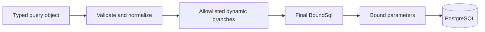
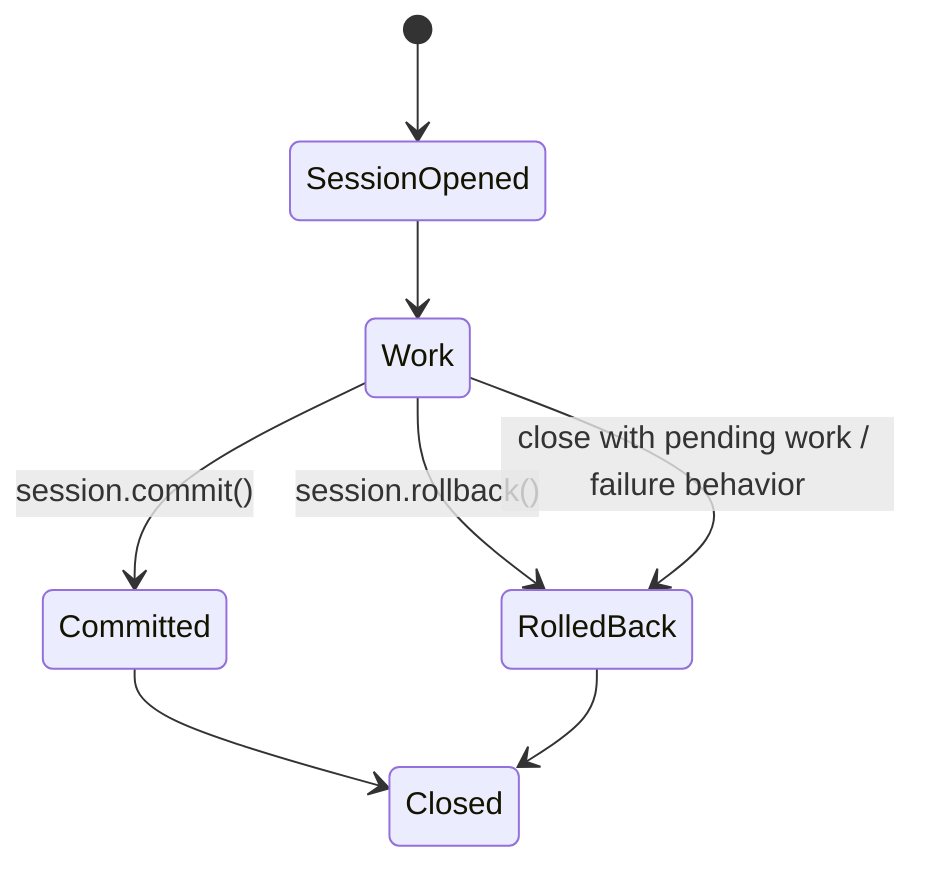
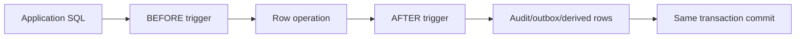
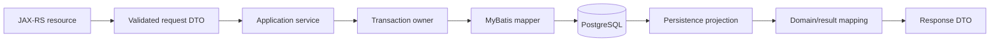

# Part 030 — MyBatis, Dynamic SQL, Functions, Procedures, and PL/pgSQL

> MyBatis mempertahankan SQL sebagai artefak engineering utama. Itu memberi kontrol besar atas query, locking, PostgreSQL features, dan performance—tetapi tidak menghilangkan complexity JDBC, transaction, schema evolution, atau database semantics. MyBatis yang sehat membuat SQL terlihat, teruji, dan dimiliki. MyBatis yang buruk hanya memindahkan string SQL, hidden cache, dynamic branching, dan implicit mappings ke tempat yang lebih sulit direview.

## Daftar Isi

1. [Target kompetensi](#target-kompetensi)
2. [Scope dan baseline](#scope-dan-baseline)
3. [Boundary dengan Part 028, 029, dan 031](#boundary-dengan-part-028-029-dan-031)
4. [Mental model MyBatis](#mental-model-mybatis)
5. [MyBatis bukan ORM penuh](#mybatis-bukan-orm-penuh)
6. [Core runtime objects](#core-runtime-objects)
7. [`SqlSessionFactory` lifecycle](#sqlsessionfactory-lifecycle)
8. [`SqlSession` lifecycle dan thread safety](#sqlsession-lifecycle-dan-thread-safety)
9. [Mapper proxy lifecycle](#mapper-proxy-lifecycle)
10. [Configuration model](#configuration-model)
11. [Environment dan `DataSource`](#environment-dan-datasource)
12. [Transaction manager ownership](#transaction-manager-ownership)
13. [Mapper XML versus annotations versus Java DSL](#mapper-xml-versus-annotations-versus-java-dsl)
14. [Mapped statement identity](#mapped-statement-identity)
15. [Parameter mapping](#parameter-mapping)
16. [`#{}` versus `${}`](#-versus-)
17. [Multiple parameters dan command objects](#multiple-parameters-dan-command-objects)
18. [Null dan JDBC types](#null-dan-jdbc-types)
19. [Result mapping fundamentals](#result-mapping-fundamentals)
20. [`resultType` versus `resultMap`](#resulttype-versus-resultmap)
21. [Constructor dan immutable mapping](#constructor-dan-immutable-mapping)
22. [Associations dan collections](#associations-dan-collections)
23. [Nested select dan N+1](#nested-select-dan-n1)
24. [Join mapping dan row multiplication](#join-mapping-dan-row-multiplication)
25. [Discriminators dan polymorphic rows](#discriminators-dan-polymorphic-rows)
26. [Type aliases](#type-aliases)
27. [Type handlers](#type-handlers)
28. [PostgreSQL UUID, JSONB, arrays, enum, dan range](#postgresql-uuid-jsonb-arrays-enum-dan-range)
29. [Temporal, currency, dan `BigDecimal`](#temporal-currency-dan-bigdecimal)
30. [Dynamic SQL mental model](#dynamic-sql-mental-model)
31. [`if`, `choose`, `where`, `trim`, dan `set`](#if-choose-where-trim-dan-set)
32. [`foreach`](#foreach)
33. [Dynamic filtering](#dynamic-filtering)
34. [Dynamic sorting dan identifier allowlist](#dynamic-sorting-dan-identifier-allowlist)
35. [Partial updates dan absent/null semantics](#partial-updates-dan-absentnull-semantics)
36. [Reusable SQL fragments](#reusable-sql-fragments)
37. [MyBatis Dynamic SQL library](#mybatis-dynamic-sql-library)
38. [Statement options](#statement-options)
39. [Generated keys dan PostgreSQL `RETURNING`](#generated-keys-dan-postgresql-returning)
40. [Batch execution](#batch-execution)
41. [Cursor dan result streaming](#cursor-dan-result-streaming)
42. [Local cache](#local-cache)
43. [Second-level cache](#second-level-cache)
44. [Lazy loading](#lazy-loading)
45. [Transaction lifecycle dengan plain MyBatis](#transaction-lifecycle-dengan-plain-mybatis)
46. [Transaction integration dengan framework/container](#transaction-integration-dengan-frameworkcontainer)
47. [Propagation dan isolation](#propagation-dan-isolation)
48. [MyBatis-Spring jika digunakan](#mybatis-spring-jika-digunakan)
49. [JTA/CDI/Jakarta runtime jika digunakan](#jtacdi-jakarta-runtime-jika-digunakan)
50. [Optimistic concurrency](#optimistic-concurrency)
51. [Pessimistic locking](#pessimistic-locking)
52. [Error handling dan exception translation](#error-handling-dan-exception-translation)
53. [SQL logging dan observability](#sql-logging-dan-observability)
54. [PostgreSQL function mental model](#postgresql-function-mental-model)
55. [Function versus procedure](#function-versus-procedure)
56. [Calling functions from MyBatis](#calling-functions-from-mybatis)
57. [Calling procedures from MyBatis](#calling-procedures-from-mybatis)
58. [Set-returning functions](#set-returning-functions)
59. [PL/pgSQL structure](#plpgsql-structure)
60. [Volatility dan parallel-safety declarations](#volatility-dan-parallel-safety-declarations)
61. [PL/pgSQL errors dan SQLState](#plpgsql-errors-dan-sqlstate)
62. [Exception blocks dan subtransactions](#exception-blocks-dan-subtransactions)
63. [Dynamic SQL di PL/pgSQL](#dynamic-sql-di-plpgsql)
64. [`SECURITY DEFINER` dan `search_path`](#security-definer-dan-search_path)
65. [Trigger mental model](#trigger-mental-model)
66. [BEFORE, AFTER, INSTEAD OF, row, dan statement triggers](#before-after-instead-of-row-dan-statement-triggers)
67. [Trigger recursion dan hidden side effects](#trigger-recursion-dan-hidden-side-effects)
68. [Audit, outbox, dan derived data melalui trigger](#audit-outbox-dan-derived-data-melalui-trigger)
69. [Database-side logic trade-offs](#database-side-logic-trade-offs)
70. [Versioning functions, procedures, dan triggers](#versioning-functions-procedures-dan-triggers)
71. [Tenant isolation](#tenant-isolation)
72. [JAX-RS application boundary](#jax-rs-application-boundary)
73. [Failure-model matrix](#failure-model-matrix)
74. [Debugging playbook](#debugging-playbook)
75. [Testing strategy](#testing-strategy)
76. [Architecture patterns](#architecture-patterns)
77. [Anti-patterns](#anti-patterns)
78. [PR review checklist](#pr-review-checklist)
79. [Trade-off yang harus dipahami senior engineer](#trade-off-yang-harus-dipahami-senior-engineer)
80. [Internal verification checklist](#internal-verification-checklist)
81. [Latihan verifikasi](#latihan-verifikasi)
82. [Ringkasan](#ringkasan)
83. [Referensi resmi](#referensi-resmi)

---

## Target kompetensi

Setelah menyelesaikan part ini, Anda harus mampu:

- menjelaskan alur dari mapper method ke `MappedStatement`, SQL generation, parameter handler, JDBC statement, result set, dan object mapping;
- membedakan lifecycle `SqlSessionFactory`, `SqlSession`, mapper proxy, JDBC connection, dan transaction manager;
- memilih mapper XML, annotation, atau dynamic SQL DSL berdasarkan complexity dan reviewability;
- menggunakan `#{}` untuk values dan membatasi `${}` hanya pada trusted allowlisted fragments;
- merancang `resultMap` yang eksplisit untuk immutable DTO, nested objects, joins, dan PostgreSQL-specific types;
- mengenali N+1, row multiplication, accidental lazy load, cache staleness, dan unsafe dynamic SQL;
- membuat filtering, sorting, pagination, partial update, dan batch statements yang bounded dan tenant-safe;
- mengintegrasikan MyBatis ke transaction manager tanpa double commit, session leak, atau context loss;
- menerapkan optimistic dan pessimistic concurrency melalui explicit SQL;
- memanggil PostgreSQL functions/procedures dengan contract yang jelas dan sesuai pgJDBC behavior;
- menulis/review PL/pgSQL dengan volatility, security, exception, dynamic SQL, dan transaction semantics yang benar;
- menilai trigger dari sisi hidden side effect, recursion, locking, observability, migration, dan ownership;
- memetakan database SQLState ke domain/technical errors tanpa membocorkan detail internal;
- menguji mapper dan database-side logic pada PostgreSQL nyata;
- menentukan kapan logic berada di Java, SQL statement, function, procedure, trigger, workflow, atau job.

---

## Scope dan baseline

Baseline:

- Java 17+ JAX-RS service;
- MyBatis 3.x;
- PostgreSQL modern;
- pgJDBC;
- Maven build;
- XML mapper, annotation mapper, atau MyBatis Dynamic SQL mungkin tersedia;
- transaction lifecycle dari Part 029;
- schema/data-model dari Part 028;
- migration lifecycle dari Part 031.

Part ini tidak mengasumsikan:

- penggunaan Spring/MyBatis-Spring;
- penggunaan CDI/JTA;
- exact MyBatis version/configuration;
- XML mapper sebagai standard internal;
- second-level cache;
- lazy loading;
- stored functions/procedures/triggers;
- PL/pgSQL sebagai domain layer;
- shared database ownership;
- custom type handlers;
- generated mapper code;
- database-side audit/outbox;
- exact PostgreSQL function volatility/security rules internal.

Semua hal tersebut harus diverifikasi dari dependencies, `mybatis-config.xml`, programmatic configuration, mapper packages/XML, transaction bootstrap, schema migrations, database catalog, tests, dan production telemetry.

---

## Boundary dengan Part 028, 029, dan 031

| Part | Fokus |
|---|---|
| Part 028 | Schema, constraints, indexes, query planning |
| Part 029 | JDBC, connection pool, transaction, isolation, locks |
| Part 030 | MyBatis mapping and PostgreSQL database-side logic |
| Part 031 | Deployment-safe database migrations |

MyBatis does not replace any of these layers. It orchestrates SQL and mapping on top of JDBC.

---

## Mental model MyBatis

```mermaid
flowchart LR
    CALL[Mapper method call] --> PROXY[Mapper proxy]
    PROXY --> MS[MappedStatement]
    MS --> SQLSOURCE[SqlSource / dynamic SQL]
    SQLSOURCE --> BOUND[BoundSql]
    BOUND --> EXEC[Executor]
    EXEC --> STMT[StatementHandler]
    STMT --> PARAM[ParameterHandler]
    PARAM --> JDBC[PreparedStatement]
    JDBC --> PG[(PostgreSQL)]
    PG --> RS[ResultSet]
    RS --> RESULT[ResultSetHandler]
    RESULT --> JAVA[DTO / domain projection]
```



MyBatis configuration pre-builds mappings. At runtime, each mapper call resolves a statement ID, generates final SQL, binds values, delegates to JDBC, and maps rows.

Every layer can fail differently:

- mapper ID not found;
- dynamic SQL generates invalid shape;
- parameter/type handler mismatch;
- statement timeout/constraint/lock failure;
- unexpected columns or nulls;
- nested mapping multiplies rows;
- transaction session not correctly bound;
- cache returns stale object.

---

## MyBatis bukan ORM penuh

MyBatis does not normally provide:

- automatic dirty checking;
- entity state persistence context like JPA;
- implicit relationship loading semantics as a primary model;
- automatic portable SQL generation for all operations;
- database-independent transaction semantics;
- schema migration;
- domain invariant design.

Its advantage is explicit control:

- exact SQL;
- exact joins and predicates;
- PostgreSQL syntax/features;
- lock clauses;
- result projections;
- query plans that are easier to relate to source.

Its cost is explicit responsibility:

- SQL correctness;
- mapping correctness;
- dynamic SQL safety;
- transaction ownership;
- compatibility;
- test coverage;
- database-specific knowledge.

---

## Core runtime objects

| Object | Typical lifecycle | Thread safety/ownership |
|---|---|---|
| `Configuration` | application lifetime | immutable-after-bootstrap expectation |
| `SqlSessionFactory` | application singleton | intended for reuse |
| `SqlSession` | one unit of work/transaction scope | not thread-safe |
| Mapper proxy | tied to session or managed proxy | depends on integration |
| `MappedStatement` | application lifetime | configuration metadata |
| `Executor` | session lifetime | internal execution/caching |
| JDBC `Connection` | transaction/session scope | not shared concurrently |

Never store a plain `SqlSession` in a singleton and reuse it across request threads.

---

## `SqlSessionFactory` lifecycle

Build once at bootstrap when using plain MyBatis:

```java
try (Reader reader = Resources.getResourceAsReader("mybatis-config.xml")) {
    SqlSessionFactory factory = new SqlSessionFactoryBuilder().build(reader);
}
```

Responsibilities:

- configuration validation;
- mapper registration;
- type aliases/handlers;
- environment/data source;
- plugins/interceptors;
- settings;
- mapped statements and caches.

Bootstrap should fail fast on:

- duplicate statement IDs;
- missing mapper resource;
- invalid XML;
- unresolved result map;
- type-handler registration defects;
- environment/data-source mismatch.

Do not rebuild `SqlSessionFactory` per request.

---

## `SqlSession` lifecycle dan thread safety

Plain MyBatis pattern:

```java
try (SqlSession session = sqlSessionFactory.openSession(false)) {
    QuoteMapper mapper = session.getMapper(QuoteMapper.class);
    try {
        mapper.updateStatus(command);
        mapper.insertOutbox(event);
        session.commit();
    } catch (RuntimeException failure) {
        session.rollback();
        throw failure;
    }
}
```

`SqlSession`:

- wraps executor/transaction behavior;
- provides mapper proxies;
- owns local cache;
- can commit/rollback/close in plain usage;
- is not safe for concurrent threads;
- must not escape its transaction/request scope.

When a framework manages it, manual `commit()`, `rollback()`, or `close()` may be forbidden or incorrect.

---

## Mapper proxy lifecycle

A mapper interface:

```java
public interface QuoteMapper {
    QuoteRow findById(@Param("tenantId") UUID tenantId,
                      @Param("quoteId") UUID quoteId);

    int updateStatus(UpdateQuoteStatusCommand command);
}
```

Mapper proxy maps method to statement ID:

```text
fully.qualified.QuoteMapper.findById
```

Questions:

- Is mapper proxy created per `SqlSession`?
- Is it injected as a managed thread-safe proxy?
- Which session/connection does it use?
- How is transaction context attached?
- What happens on executor thread switch?

The interface alone does not reveal transaction lifecycle.

---

## Configuration model

MyBatis configuration can include:

- properties;
- settings;
- type aliases;
- type handlers;
- object factory/wrapper/reflector factory;
- plugins;
- environments;
- transaction manager;
- data source;
- database ID provider;
- mappers.

Settings with large behavioral impact include:

- cache enabled;
- lazy loading;
- aggressive lazy loading;
- local cache scope;
- map underscore to camel case;
- unknown column behavior;
- default executor type;
- default statement timeout/fetch size;
- generated keys;
- null JDBC type;
- safe row bounds/result handler behavior.

Treat configuration as code. Record effective values and avoid relying on undocumented defaults.

---

## Environment dan `DataSource`

Plain MyBatis environments select transaction manager and data source definitions. Enterprise applications may instead construct `SqlSessionFactory` programmatically with an externally managed `DataSource`.

The key invariant:

> MyBatis, transaction manager, and repositories must use the same intended `DataSource` and transaction context.

Using two logically similar but distinct `DataSource` instances can produce separate connections and non-atomic writes.

Verify:

- data source identity;
- read/write routing;
- tenant routing;
- pool ownership;
- credentials;
- schema/search path;
- transaction manager binding.

---

## Transaction manager ownership

MyBatis transaction abstractions commonly include JDBC or managed transaction strategies. Exact integration determines whether MyBatis:

- calls connection commit/rollback;
- only closes/releases connection;
- participates in container/JTA transaction;
- binds session to thread/context;
- creates one session per mapper call or one per transaction.

Do not mix:

```text
framework transaction manager
+ manual SqlSession.commit()
+ repository-created independent session
```

This can cause premature commits, non-atomic work, unsupported operations, or connection leaks.

---

## Mapper XML versus annotations versus Java DSL

### XML mapper

Best when:

- SQL is complex/multiline;
- advanced result maps;
- reusable fragments;
- database-specific clauses;
- reviewer needs SQL-centric file.

Costs:

- string statement IDs;
- XML/Java drift;
- runtime mapping errors if tests are weak;
- dynamic OGNL complexity.

### Annotations

Best for small stable statements:

```java
@Select("""
    SELECT quote_id, quote_number, status
    FROM quote
    WHERE tenant_id = #{tenantId}
      AND quote_id = #{quoteId}
    """)
QuoteRow findById(UUID tenantId, UUID quoteId);
```

Costs:

- complex SQL becomes unreadable;
- result mapping options are less comfortable;
- Java source changes for every SQL edit.

### Java/Dynamic SQL DSL

Best when:

- compiler-assisted column references;
- composable filters;
- generated table metadata;
- team accepts generated/DSL complexity.

Costs:

- abstraction can obscure final SQL;
- learning/debugging burden;
- PostgreSQL-specific features may need extensions/raw fragments.

Choose one primary convention and documented exceptions.

---

## Mapped statement identity

XML namespace:

```xml
<mapper namespace="com.example.quote.QuoteMapper">
  <select id="findById" resultMap="quoteRowMap">
    ...
  </select>
</mapper>
```

Statement identity:

```text
com.example.quote.QuoteMapper.findById
```

Use stable operation names in telemetry. Statement ID is safer than raw SQL as a low-cardinality dimension, provided mapper methods do not encode IDs/customer data.

Avoid duplicate generic IDs across unrelated namespaces in logs without namespace.

---

## Parameter mapping

Preferred parameter object:

```java
public record UpdateQuoteStatusCommand(
        UUID tenantId,
        UUID quoteId,
        long expectedVersion,
        String newStatus,
        Instant changedAt) {}
```

Mapper:

```xml
<update id="updateStatus">
  UPDATE quote
     SET status = #{newStatus},
         changed_at = #{changedAt},
         version = version + 1
   WHERE tenant_id = #{tenantId}
     AND quote_id = #{quoteId}
     AND version = #{expectedVersion}
</update>
```

Benefits:

- meaningful contract;
- fewer `@Param` strings;
- easier validation/testing;
- stable refactoring boundary.

Do not pass unstructured `Map<String,Object>` for core commands unless dynamic shape is truly required.

---

## `#{}` versus `${}`

`#{value}`:

- creates JDBC parameter placeholder;
- values are bound through type handlers;
- protects against value SQL injection;
- preserves SQL structure.

`${fragment}`:

- performs literal text substitution;
- changes SQL structure;
- can cause SQL injection;
- can fragment statement/plan caches;
- must never receive untrusted raw input.

Unsafe:

```xml
ORDER BY ${sortField} ${direction}
```

Safe pattern: map external enum to internal constant SQL fragment in Java or `<choose>`.

```xml
<choose>
  <when test="sort == 'CREATED_AT'">ORDER BY created_at</when>
  <when test="sort == 'QUOTE_NUMBER'">ORDER BY quote_number</when>
  <otherwise>ORDER BY quote_id</otherwise>
</choose>
```

Direction should also be allowlisted, not interpolated directly.

---

## Multiple parameters dan command objects

Multiple mapper parameters can use `@Param`:

```java
QuoteRow findById(@Param("tenantId") UUID tenantId,
                  @Param("quoteId") UUID quoteId);
```

For more than a few parameters, prefer a command/query object. It captures semantics and avoids accidental name drift.

Do not rely on compiler-generated parameter names unless build configuration and MyBatis settings are verified.

---

## Null dan JDBC types

Null has no runtime Java type. Binding may require explicit `jdbcType`:

```xml
#{optionalText, jdbcType=VARCHAR}
```

Risks:

- driver cannot infer null type;
- PostgreSQL overloaded function resolution becomes ambiguous;
- JSONB/UUID/array type mismatch;
- null versus absent semantics collapse;
- primitive fields cannot represent null.

Use wrapper/optional domain types consciously and define nullability in schema + DTO + mapper consistently.

---

## Result mapping fundamentals

A result mapping is a data contract between SQL projection and Java type.

Prefer explicit columns:

```sql
SELECT q.quote_id,
       q.quote_number,
       q.status,
       q.version,
       q.created_at
FROM quote q
```

Avoid `SELECT *` because:

- schema changes alter projection;
- duplicate column names from joins;
- larger network/mapping cost;
- accidental sensitive data exposure;
- implicit mapping may silently ignore or overwrite fields.

---

## `resultType` versus `resultMap`

`resultType` works for straightforward projection where names/types align.

```xml
<select id="findSummary" resultType="com.example.QuoteSummaryRow">
  SELECT quote_id AS quoteId,
         quote_number AS quoteNumber,
         status
  FROM quote
  WHERE tenant_id = #{tenantId}
</select>
```

`resultMap` is better for:

- explicit column/property mapping;
- constructor mapping;
- nested objects;
- collections;
- discriminators;
- type handlers;
- column prefixes;
- complex joins.

```xml
<resultMap id="quoteRowMap" type="com.example.QuoteRow">
  <id property="quoteId" column="quote_id" javaType="java.util.UUID"/>
  <result property="quoteNumber" column="quote_number"/>
  <result property="status" column="status"/>
  <result property="version" column="version"/>
</resultMap>
```

Explicitness is valuable for PR review and compatibility.

---

## Constructor dan immutable mapping

Immutable records/classes reduce accidental mutation:

```java
public record QuoteRow(
        UUID quoteId,
        String quoteNumber,
        QuoteStatus status,
        long version,
        Instant createdAt) {}
```

Use constructor mapping or verified automatic constructor mapping. Review:

- parameter order/names;
- nullability;
- enum/type handler;
- primitive default behavior;
- added constructor arguments;
- compiler metadata requirements.

Test mapping at startup/integration level rather than discovering it from production traffic.

---

## Associations dan collections

Nested result mapping can build object graphs:

```xml
<resultMap id="quoteWithLines" type="QuoteAggregateRow">
  <id property="quoteId" column="q_id"/>
  <result property="quoteNumber" column="q_number"/>
  <collection property="lines"
              ofType="QuoteLineRow"
              columnPrefix="l_">
    <id property="lineId" column="id"/>
    <result property="productCode" column="product_code"/>
  </collection>
</resultMap>
```

Important:

- parent `<id>` is required for de-duplication;
- child identity must be stable;
- column aliases/prefixes must be unique;
- ordering may affect deterministic collection output;
- wide one-to-many-to-many joins can explode rows;
- pagination on joined rows can truncate child collections.

Often use two bounded queries instead of one enormous graph join.

---

## Nested select dan N+1

Nested select can execute another mapped statement per row:

```text
1 query for quotes
+ N queries for quote lines
```

This may be acceptable only when:

- N is tightly bounded;
- loading is intentional;
- cache/transaction behavior is understood;
- telemetry exposes query count;
- tests protect against regression.

Avoid accidental lazy-loading N+1 in list endpoints.

---

## Join mapping dan row multiplication

For parent with 100 lines and each line 10 attributes:

```text
join rows = 1 × 100 × 10 = 1,000
```

Costs:

- repeated parent columns;
- network bytes;
- mapping CPU/memory;
- pagination complexity;
- duplicate object identity handling.

Alternatives:

- query parent page, then child rows with bounded `IN`/array key;
- materialized read model;
- JSON aggregation for controlled projection;
- separate endpoint/resource;
- async export.

Measure final SQL and result cardinality.

---

## Discriminators dan polymorphic rows

`<discriminator>` can select result map based on a column. Use only when database schema intentionally represents a closed polymorphic hierarchy.

Risks:

- hidden subtype branching;
- added type not handled;
- nullable/inconsistent subtype columns;
- large conditional mapping files;
- tight schema-domain coupling.

A type column should have database constraints and explicit unknown-value policy.

---

## Type aliases

Type aliases reduce XML verbosity but can hide exact class/package and create collisions.

Use conventions:

- scoped packages;
- no ambiguous simple names;
- avoid aliasing core domain types across modules;
- startup validation;
- refactoring tests.

Aliases improve readability only when discoverability remains high.

---

## Type handlers

A `TypeHandler<T>` maps Java values to JDBC parameters and result values.

Use for:

- domain value objects;
- enums with stable database codes;
- JSONB documents;
- PostgreSQL arrays/ranges;
- encrypted/encoded values where architecture permits;
- custom temporal/money wrappers.

Responsibilities:

- null handling;
- JDBC type;
- database representation;
- backward compatibility;
- error classification;
- no hidden network/remote calls;
- thread safety if singleton/reused.

Avoid one global handler that guesses by runtime value.

---

## PostgreSQL UUID, JSONB, arrays, enum, dan range

### UUID

Prefer native UUID mapping when supported. Verify Java `UUID` binding/result behavior rather than converting through text everywhere.

### JSONB

Options:

- driver-specific `PGobject` type handler;
- bind JSON string with explicit PostgreSQL cast;
- custom handler using chosen JSON library;
- map to versioned DTO/document type.

Review:

- JSON schema/version;
- null versus JSON `null`;
- canonicalization;
- sensitive fields;
- size limits;
- partial updates;
- mapping exceptions;
- database index/query usage.

### Arrays

JDBC arrays require connection-created array or driver-specific handling. Ensure array resources are freed where required and empty-array/null semantics are explicit.

For large filter lists, compare:

- array parameter + `= ANY(?)`;
- bounded `foreach` placeholders;
- temporary/staging table;
- join to persisted filter set.

### PostgreSQL enum

PostgreSQL enum gives database constraint but has migration/order trade-offs. Application enums need stable labels and unknown-value strategy.

### Range/multirange

Useful for validity windows but often requires custom type handling. Ensure inclusive/exclusive boundaries match domain semantics from Part 020.

---

## Temporal, currency, dan `BigDecimal`

Mapping must preserve:

- `Instant` versus `OffsetDateTime` versus `LocalDateTime` semantics;
- database `timestamp with time zone` versus `timestamp without time zone` behavior;
- nanosecond/microsecond precision difference;
- `BigDecimal` precision and scale;
- currency stored separately from amount;
- no conversion through `double`;
- explicit rounding at domain boundary.

Mapper tests should include:

- DST overlap/gap if local time is used;
- maximum/minimum scale;
- trailing zeros if business-significant;
- negative and zero amounts;
- null/absence;
- timestamps around effective-date boundaries.

---

## Dynamic SQL mental model

Dynamic SQL should produce a finite, reviewable family of statement shapes.



Bad dynamic SQL creates effectively unbounded query variants based on raw user input.

Review final SQL shapes, not only mapper template.

---

## `if`, `choose`, `where`, `trim`, dan `set`

Example bounded filters:

```xml
<select id="searchQuotes" resultMap="quoteSummaryMap">
  SELECT quote_id,
         quote_number,
         status,
         created_at
  FROM quote
  <where>
    tenant_id = #{tenantId}
    <if test="statuses != null and !statuses.isEmpty()">
      AND status IN
      <foreach collection="statuses" item="status" open="(" close=")" separator=",">
        #{status}
      </foreach>
    </if>
    <if test="createdFrom != null">
      AND created_at &gt;= #{createdFrom}
    </if>
    <if test="createdToExclusive != null">
      AND created_at &lt; #{createdToExclusive}
    </if>
  </where>
  ORDER BY created_at DESC, quote_id DESC
  LIMIT #{limit}
</select>
```

`<where>` prevents malformed leading `AND`; it does not validate business semantics or bound the query.

`<set>` can trim trailing commas in updates, but partial updates still need absent/null/value semantics.

`<choose>` makes finite exclusive branches explicit.

---

## `foreach`

Common uses:

- bounded `IN` list;
- multi-row values;
- batch-related SQL;
- composite tuple filters.

Risks:

- too many bind parameters;
- huge SQL text;
- planner overhead;
- empty collection invalid SQL;
- duplicate values;
- unbounded API input;
- plan shape variability.

Validate collection size before mapper invocation.

For composite IDs:

```xml
AND (tenant_id, quote_id) IN
<foreach collection="keys" item="key" open="(" close=")" separator=",">
  (#{key.tenantId}, #{key.quoteId})
</foreach>
```

Ensure tenant cannot be omitted or mixed unexpectedly.

---

## Dynamic filtering

Design an API-level filter grammar, then map to typed query criteria.

Avoid generic input like:

```json
{
  "field": "anything",
  "operator": "raw SQL",
  "value": "..."
}
```

Prefer:

```java
public record QuoteSearchQuery(
        UUID tenantId,
        Set<QuoteStatus> statuses,
        Instant createdFrom,
        Instant createdToExclusive,
        String normalizedCustomerReference,
        QuoteSort sort,
        PageCursor cursor,
        int limit) {}
```

Each field maps to a controlled predicate and supported index strategy.

Unknown/unsupported filters should fail validation rather than silently being ignored.

---

## Dynamic sorting dan identifier allowlist

SQL parameter placeholders cannot bind a column identifier or keyword.

Safe Java mapping:

```java
public enum QuoteSort {
    CREATED_DESC("q.created_at DESC, q.quote_id DESC"),
    CREATED_ASC("q.created_at ASC, q.quote_id ASC"),
    NUMBER_ASC("q.quote_number ASC, q.quote_id ASC");

    private final String sql;

    QuoteSort(String sql) {
        this.sql = sql;
    }

    public String sql() {
        return sql;
    }
}
```

Even then, raw `${sort.sql}` should receive only enum-owned constants, never request strings. Alternatively use `<choose>` so mapper file shows all supported shapes.

Every sort must include deterministic tie-breaker for stable pagination.

---

## Partial updates dan absent/null semantics

PATCH-like inputs require three states:

```text
absent   → do not modify
null     → clear value, if allowed
value    → set value
```

A Java field alone often collapses absent and null. Use explicit wrapper/patch field model.

Dynamic update:

```xml
<update id="patchQuote">
  UPDATE quote
  <set>
    <if test="customerReference.present">
      customer_reference = #{customerReference.value, jdbcType=VARCHAR},
    </if>
    <if test="expiry.present">
      expires_at = #{expiry.value, jdbcType=TIMESTAMP_WITH_TIMEZONE},
    </if>
    version = version + 1
  </set>
  WHERE tenant_id = #{tenantId}
    AND quote_id = #{quoteId}
    AND version = #{expectedVersion}
</update>
```

Reject empty patches or make semantics explicit. Always retain version/authorization/tenant predicates.

---

## Reusable SQL fragments

`<sql>` and `<include>` reduce repetition:

```xml
<sql id="quoteSummaryColumns">
  q.quote_id,
  q.quote_number,
  q.status,
  q.version,
  q.created_at
</sql>
```

Risks:

- fragment dependencies become non-local;
- aliases assumed by fragment;
- dynamic properties/substitution create injection;
- one “universal column list” couples unrelated queries;
- refactoring fragment changes many statements unexpectedly.

Use small cohesive fragments and test all dependent statements.

---

## MyBatis Dynamic SQL library

MyBatis Dynamic SQL is a separate library/DSL that can generate SQL through Java types.

Potential advantages:

- generated table/column references;
- composable predicates;
- compiler feedback;
- reusable query builders;
- less raw XML branching.

Potential costs:

- generated source lifecycle;
- difficult final SQL inspection for newcomers;
- verbose complex joins;
- database-specific feature escape hatches;
- accidental generic repository abstraction;
- version compatibility.

**Internal verification checklist:** determine whether it is used, generated by which plugin, and what team conventions apply.

---

## Statement options

Mapped statement attributes can affect:

- statement type: `STATEMENT`, `PREPARED`, `CALLABLE`;
- timeout;
- fetch size;
- result set type;
- generated keys;
- cache usage/flush;
- result ordering;
- database ID variants.

Defaults may come from MyBatis configuration or driver. For critical statements, make essential behavior explicit and test it.

A mapper timeout is not the entire request deadline. It must align with JDBC/PostgreSQL/platform timeout hierarchy from Part 029.

---

## Generated keys dan PostgreSQL `RETURNING`

Prefer explicit PostgreSQL `RETURNING` for rich generated values:

```xml
<select id="insertQuote" resultType="QuoteInsertResult"
        affectData="true" flushCache="true">
  INSERT INTO quote (
      tenant_id,
      quote_number,
      status,
      created_at
  ) VALUES (
      #{tenantId},
      #{quoteNumber},
      'DRAFT',
      #{createdAt}
  )
  RETURNING quote_id, version, created_at
</select>
```

Exact MyBatis support/attributes depend on version; verify internal baseline.

`useGeneratedKeys` can be appropriate but driver and multi-row behavior must be tested.

Do not issue a second “find latest ID” query.

---

## Batch execution

MyBatis `ExecutorType.BATCH` can queue statements until flush/commit.

Risks:

- affected-row counts available only after flush;
- exceptions appear later than mapper call;
- memory grows with queued parameter objects;
- generated keys behavior needs testing;
- transaction holds locks for entire batch;
- mixing reads may force flush;
- retry after partial unknown state.

Use explicit chunk size and transaction policy:

```text
read 500 source rows
transform
write batch
flush
commit checkpoint
continue
```

One giant transaction is rarely optimal for archival/reconciliation.

---

## Cursor dan result streaming

MyBatis can expose cursor/result-handler APIs, but lifecycle remains bound to `SqlSession`/connection/transaction.

Safe pattern:

```java
try (SqlSession session = factory.openSession();
     Cursor<QuoteExportRow> cursor =
             session.getMapper(ExportMapper.class).streamQuotes(query)) {
    for (QuoteExportRow row : cursor) {
        writer.write(row);
    }
}
```

Review:

- fetch size and auto-commit;
- connection hold duration;
- transaction snapshot;
- client disconnect/cancellation;
- mapping allocation;
- result handler safety;
- pool isolation;
- timeout;
- whether async export is better.

Do not return a `Cursor` from a method after its session has closed.

---

## Local cache

MyBatis local cache is associated with `SqlSession`. Depending on configuration, repeated queries may reuse objects/results within the session.

Risks:

- stale reads after external/direct updates;
- mutable object shared from cache;
- behavior differs with `SESSION` versus `STATEMENT` scope;
- confusion during long sessions;
- nested query behavior.

Keep session scope short. Understand when updates flush cache and when `clearCache()` is used.

---

## Second-level cache

Namespace-level cache can outlive a session.

For distributed enterprise services, risks include:

- cross-pod invalidation;
- stale data after another service/database trigger changes rows;
- tenant key mistakes;
- mutable cached objects;
- cache serialization/versioning;
- memory pressure;
- transaction visibility;
- operational invisibility.

Do not enable because it appears easy. Prefer an explicit cache architecture with ownership, TTL, invalidation, and observability when needed.

---

## Lazy loading

Lazy loading can trigger SQL when a property is accessed, possibly far from repository boundary.

Problems:

- N+1 queries;
- session already closed;
- serialization accidentally traverses graph;
- unpredictable latency;
- authorization/tenant context ambiguity;
- database calls during logging/debugging;
- request thread versus async thread mismatch.

For APIs, explicit projections and explicit repository methods are usually easier to reason about.

---

## Transaction lifecycle dengan plain MyBatis

Plain MyBatis owns session and commit/rollback explicitly:



Pattern:

```java
public <T> T inTransaction(Function<SqlSession, T> work) {
    try (SqlSession session = factory.openSession(false)) {
        try {
            T result = work.apply(session);
            session.commit();
            return result;
        } catch (RuntimeException failure) {
            session.rollback();
            throw failure;
        }
    }
}
```

Need additional handling for checked SQL exceptions, rollback failure, isolation, timeout, telemetry, and retries.

---

## Transaction integration dengan framework/container

A managed integration may:

- bind `SqlSession` to current transaction;
- acquire connection from transaction-aware data source;
- create/close session automatically;
- commit/rollback through transaction manager;
- inject a thread-safe mapper proxy facade;
- translate exceptions.

Questions:

1. What creates transaction context?
2. Is it thread-local, CDI context, JTA transaction, or another mechanism?
3. Does async executor preserve it?
4. What happens when no transaction exists?
5. Are reads auto-committed per method?
6. Can one transaction span multiple mappers?
7. Is self-invocation/interceptor bypass relevant?
8. Which exceptions trigger rollback?

---

## Propagation dan isolation

MyBatis core maps statements and provides session transaction methods. Propagation semantics are supplied by integration/framework.

Do not write “MyBatis uses REQUIRED” without evidence.

Isolation can be set through:

- connection/transaction manager;
- framework annotation/configuration;
- session open options;
- SQL `SET TRANSACTION`, where appropriate.

Ensure exact transaction begins before isolation/`SET LOCAL` assumptions.

---

## MyBatis-Spring jika digunakan

MyBatis-Spring integrates sessions with Spring transaction management. With configured transaction manager, one `SqlSession` is typically used for the transaction and committed/rolled back when transaction completes. Injected managed sessions/mappers should not be manually committed, rolled back, or closed.

This is included only as a possible implementation.

**Internal verification checklist:**

- Is Spring present at all?
- Is `SqlSessionFactoryBean` used?
- Which `DataSourceTransactionManager`/transaction manager?
- Which mapper scanning mechanism?
- Proxy/interceptor boundaries?
- `@Transactional` defaults and rollback rules?
- Async context behavior?

Do not import Spring assumptions into Jersey/HK2/CDI runtime without proof.

---

## JTA/CDI/Jakarta runtime jika digunakan

In Jakarta runtime, MyBatis may participate through managed data source/JTA integration or custom CDI producers.

Verify:

- JTA versus resource-local;
- transaction synchronization;
- session producer scope;
- cleanup callback;
- exception-to-rollback marking;
- multiple resource participation;
- request/async context;
- container restrictions on direct connection commit.

A CDI bean annotated `@RequestScoped` does not automatically mean its mapper calls are one database transaction.

---

## Optimistic concurrency

Mapper statement:

```xml
<update id="acceptQuote">
  UPDATE quote
     SET status = 'ACCEPTED',
         accepted_at = #{acceptedAt},
         version = version + 1
   WHERE tenant_id = #{tenantId}
     AND quote_id = #{quoteId}
     AND status = 'ISSUED'
     AND version = #{expectedVersion}
</update>
```

Application:

```java
int updated = mapper.acceptQuote(command);
if (updated == 0) {
    throw new ConcurrentOrInvalidStateException(command.quoteId());
}
if (updated != 1) {
    throw new IllegalStateException("Unexpected affected row count: " + updated);
}
```

Do not ignore update count.

Distinguish not-found, forbidden, invalid-state, and version-conflict only if another safe lookup is justified and does not leak object existence.

---

## Pessimistic locking

Mapper:

```xml
<select id="lockQuote" resultMap="quoteRowMap">
  SELECT quote_id,
         quote_number,
         status,
         version,
         expires_at
    FROM quote
   WHERE tenant_id = #{tenantId}
     AND quote_id = #{quoteId}
   FOR UPDATE
</select>
```

Lock is meaningful only within a transaction that remains open through update/commit.

If mapper call opens/closes independent auto-commit session, lock is immediately released and gives false safety.

Review lock order, timeout, index, row count, and absence of remote calls while held.

---

## Error handling dan exception translation

MyBatis wraps many failures in persistence exceptions, but underlying `SQLException`/SQLState must remain inspectable.

Translation pipeline:

```text
PostgreSQL SQLState
  → JDBC SQLException
  → MyBatis PersistenceException
  → persistence error classifier
  → domain/technical exception
  → JAX-RS ExceptionMapper
```

Classify:

- unique/check/FK violation;
- invalid input/type;
- statement timeout/cancel;
- lock unavailable;
- deadlock;
- serialization failure;
- connection exception;
- syntax/missing object;
- privilege/security;
- PL/pgSQL raised business error, if policy allows.

Avoid:

- catching `Exception` in mapper layer and returning null;
- parsing human-readable message;
- exposing SQL and parameters;
- converting all failures to “not found”;
- retrying from mapper method without transaction context.

---

## SQL logging dan observability

MyBatis logging can expose statement templates and parameter values. Production policy must balance diagnosis with confidentiality.

Prefer telemetry fields:

- mapper statement ID;
- operation type;
- duration;
- row count bucket;
- SQLState class;
- timeout/retry;
- database endpoint/role;
- trace/span ID;
- sanitized query fingerprint if available.

Do not log:

- credentials/tokens;
- full quote/order/customer payload;
- PII;
- secrets;
- binary/large JSON documents;
- unbounded `IN` values.

Use PostgreSQL-side query statistics and application spans together.

---

## PostgreSQL function mental model

A function is a database routine invoked as an expression/query and returns a value, row, or set.

```sql
SELECT calculate_quote_total(?, ?, ?);
```

Potential uses:

- reusable data-local calculation;
- complex query encapsulation;
- set-returning read API;
- constraint/support function;
- trigger function;
- privileged narrow operation.

Functions execute under transaction context of caller. They do not create magical independent atomicity.

---

## Function versus procedure

Conceptual differences in PostgreSQL:

| Function | Procedure |
|---|---|
| Called in expressions/`SELECT` | Called with `CALL` |
| Returns value/set/table | Uses procedure arguments/result conventions |
| Common for query/computation | Common for command-like database routine |
| Cannot arbitrarily control transaction in normal function context | Procedure transaction control has strict invocation/context restrictions |

Do not choose “procedure” merely because operation writes data. A parameterized SQL statement or function may be clearer.

Transaction control inside PL/pgSQL routines is restricted and must be understood; application-managed transactions and procedure-level commits can conflict.

---

## Calling functions from MyBatis

Scalar function:

```xml
<select id="calculateTotal" resultType="java.math.BigDecimal">
  SELECT pricing.calculate_quote_total(
      #{tenantId}::uuid,
      #{quoteId}::uuid,
      #{asOf}::timestamptz
  )
</select>
```

Prefer schema qualification and explicit types where overload resolution may be ambiguous.

Function returning composite/table:

```xml
<select id="evaluatePrice" resultMap="priceResultMap">
  SELECT *
  FROM pricing.evaluate_price(
      #{tenantId}::uuid,
      #{productCode}::text,
      #{effectiveAt}::timestamptz,
      #{quantity}::numeric
  )
</select>
```

Contract needs:

- exact columns and types;
- volatility/security;
- error SQLState;
- tenant behavior;
- version/migration compatibility;
- performance plan;
- no hidden unbounded query.

---

## Calling procedures from MyBatis

MyBatis supports `CALLABLE` statement type for `CallableStatement` mappings.

Example form:

```xml
<select id="runReconciliation"
        statementType="CALLABLE"
        parameterType="ReconciliationCall">
  { call ops.run_reconciliation(
      #{tenantId, mode=IN, jdbcType=OTHER},
      #{runId, mode=IN, jdbcType=OTHER},
      #{processed, mode=OUT, jdbcType=BIGINT}
  ) }
</select>
```

Exact syntax and parameter types must be tested with pgJDBC/PostgreSQL version.

Important:

- pgJDBC documentation recommends normal statements for functions returning sets rather than `CallableStatement`;
- OUT/INOUT mappings and cache behavior need tests;
- transaction control restrictions apply;
- procedure call can hold locks and perform large work invisibly;
- result sets/update counts may require explicit handling;
- timeouts/cancellation must be set.

Often `CALL ...` via prepared statement is simpler than JDBC escape syntax, depending on driver settings.

---

## Set-returning functions

Set-returning functions should be treated as query sources:

```sql
SELECT r.quote_id, r.issue_code, r.details
FROM validation.validate_quote(?, ?) AS r;
```

Review like a view/query:

- row estimate and planner visibility;
- indexes used inside;
- bounded result size;
- stability of output columns;
- tenant filtering;
- pagination/sorting;
- execution privileges;
- function volatility;
- nested function calls.

Avoid using a function to hide an unreviewable universal query engine.

---

## PL/pgSQL structure

Example:

```sql
CREATE OR REPLACE FUNCTION quote.assert_transition(
    p_current text,
    p_target text
) RETURNS void
LANGUAGE plpgsql
IMMUTABLE
AS $$
BEGIN
    IF NOT (
        (p_current = 'DRAFT' AND p_target = 'ISSUED') OR
        (p_current = 'ISSUED' AND p_target IN ('ACCEPTED', 'EXPIRED'))
    ) THEN
        RAISE EXCEPTION USING
            ERRCODE = 'P0001',
            MESSAGE = 'invalid quote transition';
    END IF;
END;
$$;
```

PL/pgSQL supports:

- declarations;
- variables/records;
- conditionals;
- loops;
- SQL statements;
- diagnostics;
- exception blocks;
- dynamic SQL;
- return forms.

Keep functions cohesive. Hundreds of lines of hidden workflow logic become difficult to version, test, observe, and share with non-database code.

---

## Volatility dan parallel-safety declarations

Function volatility tells PostgreSQL what the function may observe/change:

| Declaration | Meaning directionally | Risk if declared incorrectly |
|---|---|---|
| `IMMUTABLE` | same inputs always same result, no database dependence | planner may fold/reuse invalid result |
| `STABLE` | stable within one statement, may read database | incorrect caching/planning assumptions |
| `VOLATILE` | may change each call or modify state | fewer optimizations; safest default for side effects |

Parallel-safety declarations also influence whether function can run in parallel query contexts.

Do not mark pricing/catalog lookup `IMMUTABLE` merely because it “usually” returns same value. If it reads tables or depends on time/configuration, declaration must reflect reality.

Other function properties:

- strict/null-input behavior;
- leakproof (high-security specialist area);
- execution cost;
- estimated rows for set-returning functions;
- security invoker/definer;
- configuration settings.

These are planner/security contracts, not documentation-only metadata.

---

## PL/pgSQL errors dan SQLState

Use structured errors:

```sql
RAISE EXCEPTION USING
    ERRCODE = 'P0001',
    MESSAGE = 'quote transition rejected',
    DETAIL = 'internal diagnostic detail',
    HINT = 'internal remediation hint';
```

Application policy should define:

- which custom SQLStates are allowed;
- mapping to domain errors;
- message stability;
- client-safe versus internal details;
- localization responsibility;
- telemetry/redaction.

Do not make application behavior depend on mutable human message text.

Prefer database constraints with standard SQLState when an invariant can be represented as a constraint.

---

## Exception blocks dan subtransactions

PL/pgSQL exception block:

```sql
BEGIN
    INSERT INTO ...;
EXCEPTION
    WHEN unique_violation THEN
        -- recovery logic
END;
```

An exception block introduces subtransaction behavior and has non-trivial cost/semantics.

Risks:

- swallowing real defects;
- converting all errors into success;
- locks/state retained differently than expected;
- using exceptions as normal control flow;
- losing original SQLState/context;
- partial-operation semantics becoming unclear.

PostgreSQL PL/pgSQL does not expose ordinary `SAVEPOINT` commands inside functions the same way application JDBC does; exception blocks are the common subtransaction mechanism.

Use `GET STACKED DIAGNOSTICS` when structured diagnostics are truly needed, then rethrow or translate deliberately.

---

## Dynamic SQL di PL/pgSQL

Use `EXECUTE` only when SQL structure genuinely varies.

Safe values:

```sql
EXECUTE
    'SELECT count(*) FROM quote WHERE tenant_id = $1 AND status = $2'
INTO v_count
USING p_tenant_id, p_status;
```

Safe identifiers require quoting through `format`:

```sql
EXECUTE format('SELECT count(*) FROM %I.%I', p_schema, p_table)
INTO v_count;
```

Even `%I` prevents injection but does not authorize arbitrary object access. Identifiers still need allowlisting/ownership checks.

Dynamic SQL costs:

- planning on each execution;
- dependency/search-path complexity;
- harder static review;
- privilege surface;
- telemetry fragmentation;
- migration coupling.

Avoid generic “execute any query” database APIs.

---

## `SECURITY DEFINER` dan `search_path`

`SECURITY DEFINER` executes with function owner privileges. It can expose severe privilege escalation if written incorrectly.

Controls:

- use only when narrow privilege elevation is required;
- owner must not be an overly powerful interactive role;
- revoke public execute unless intended;
- set safe `search_path`, typically trusted schemas plus `pg_temp` positioned safely according to security guidance;
- schema-qualify objects;
- validate all arguments;
- avoid unsafe dynamic SQL;
- review replacement/migration ownership;
- audit calls when sensitive.

Example direction:

```sql
CREATE FUNCTION security.perform_narrow_operation(...)
RETURNS ...
LANGUAGE plpgsql
SECURITY DEFINER
SET search_path = security, pg_temp
AS $$
BEGIN
    -- schema-qualified and tightly scoped
END;
$$;
```

Exact safe pattern must follow PostgreSQL version and internal security baseline.

---

## Trigger mental model



A trigger runs because a table event occurred, not because the calling application explicitly invoked it.

This can enforce cross-entry-point behavior but creates hidden execution paths.

Trigger types can respond to:

- `INSERT`;
- `UPDATE`;
- `DELETE`;
- `TRUNCATE`;
- DDL events through event triggers.

---

## BEFORE, AFTER, INSTEAD OF, row, dan statement triggers

### `BEFORE` row trigger

Can validate/modify `NEW` before row write. Useful for narrow derived/default logic, but hidden mutation can surprise application mappings.

### `AFTER` row trigger

Runs after row operation and is suitable for recording dependent rows requiring final values. Still part of same transaction.

### Statement trigger

Runs once per statement, not once per row. Transition tables can expose sets of changed rows for supported cases.

### `INSTEAD OF`

Typically used on views to define write behavior.

Questions:

- row or statement semantics?
- execution order among multiple triggers?
- changed columns condition?
- bulk update cost?
- recursive writes?
- output/`RETURNING` visibility?
- replica/logical replication behavior?

---

## Trigger recursion dan hidden side effects

Danger pattern:

```text
update table A
  → trigger updates B
      → trigger updates A
          → recursion/deadlock/unbounded work
```

Other risks:

- unexpected locks and deadlocks;
- one-row API update performs thousands of writes;
- bulk backfill triggers production integrations;
- direct maintenance SQL causes events unintentionally;
- mapper affected-row expectations differ;
- failure appears as error on original statement with obscure context;
- order of triggers changes result;
- trigger disabled or missing in environment.

Document trigger graph and test migration/backfill paths.

---

## Audit, outbox, dan derived data melalui trigger

### Audit trigger

Pros:

- captures writes from multiple clients;
- same transaction;
- harder for application path to forget.

Cons:

- actor/correlation context must reach database safely;
- row snapshots may contain sensitive/large data;
- session-context leakage;
- retention/storage growth;
- bulk jobs produce huge audit volume;
- semantic reason may be unavailable.

### Outbox trigger

Pros:

- captures table changes in same transaction;
- supports legacy/multi-writer tables.

Cons:

- event semantics inferred from storage mutation;
- multiple row updates may not map cleanly to domain event;
- replay/version/ownership complexity;
- bulk maintenance creates unwanted events;
- correlation/causation context must be supplied.

Application-level explicit outbox is often clearer for domain events. Trigger-based outbox may be justified for legacy/shared write paths.

### Derived data trigger

Good for narrow deterministic invariant-like derived columns. Poor for expensive network-independent workflow or broad aggregation that should be asynchronous/materialized.

---

## Database-side logic trade-offs

Place logic based on its nature:

| Logic | Candidate location |
|---|---|
| stable relational constraint | constraint/index |
| atomic conditional update | SQL statement |
| reusable data-local calculation | function |
| administrative batch command | procedure/job |
| cross-writer enforcement | constraint/trigger carefully |
| rich domain policy needing services/config | Java domain/application layer |
| long-running orchestration | workflow/job |
| event publication | explicit outbox + publisher |
| reconciliation | scheduled job/query |

Database-side logic advantages:

- close to data;
- atomic within transaction;
- fewer round trips;
- shared enforcement across writers;
- efficient set-based processing.

Costs:

- deployment coupling;
- specialized skills;
- observability/tooling differences;
- hidden behavior;
- test setup;
- source ownership ambiguity;
- scaling tied to database;
- harder external dependencies.

The answer is not “all logic in Java” or “all logic in database.” Choose the narrowest layer that can prove the invariant and remain operable.

---

## Versioning functions, procedures, dan triggers

Database routine is an API consumed by application versions.

Compatibility concerns:

- changed argument types/order/defaults;
- overloaded signature ambiguity;
- changed return columns/types/order;
- changed error SQLState;
- renamed schema/function;
- changed trigger side effects;
- grants/owner/search path;
- old app and new app during rolling deployment;
- prepared statement invalidation;
- backfill invoking new/old behavior.

Use migration strategy:

```text
add new routine/version
deploy compatible application
migrate callers/data
observe
remove old routine later
```

Avoid `CREATE OR REPLACE` changes that silently break old application pods in the same rollout window.

Routine definitions, grants, comments, tests, and rollback/roll-forward belong in migration source control.

---

## Tenant isolation

Every mapper path must preserve tenant scope.

Review:

- tenant parameter present and derived from trusted context;
- tenant predicate included in reads/writes/locks/deletes;
- composite foreign/unique keys;
- RLS/session context if used;
- type handler/cache keys include tenant;
- dynamic SQL cannot remove tenant predicate;
- function/procedure receives or derives tenant safely;
- `SECURITY DEFINER` cannot cross tenant;
- trigger writes tenant ID from trusted row/context;
- batch lists cannot mix tenants without explicit privileged workflow.

Unsafe reusable fragment:

```xml
<where>
  <if test="tenantId != null">
    tenant_id = #{tenantId}
  </if>
</where>
```

For tenant-owned table, tenant must not be optional.

---

## JAX-RS application boundary

Recommended:



Resource layer should not:

- select mapper statement dynamically from request string;
- pass raw sort/filter fragments;
- expose persistence row as public DTO automatically;
- manage `SqlSession` if transaction infrastructure owns it;
- map raw MyBatis/PostgreSQL messages to HTTP;
- trigger lazy database calls during JSON serialization;
- keep cursor open without bounded stream lifecycle.

Application service owns use-case semantics; mapper owns SQL contract.

---

## Failure-model matrix

| Failure mode | Symptom | Root cause | Detection | Corrective direction |
|---|---|---|---|---|
| Mapper statement not found | startup/runtime binding error | namespace/ID/resource mismatch | bootstrap test | align interface/XML and scanning |
| Invalid dynamic SQL | syntax error only for certain filters | branch/trim/empty collection | combination tests, SQLState 42 | finite typed branches |
| SQL injection | unexpected SQL/data access | `${}` with untrusted input | security review/test | parameters and allowlists |
| Silent unmapped column | missing/default Java field | implicit mapping/config | mapping tests, unknown-column policy | explicit `resultMap` |
| Wrong constructor mapping | runtime mapping/type error | parameter order/name drift | integration startup tests | explicit constructor mapping |
| N+1 query | latency/query count grows with rows | nested select/lazy loading | traces/query count | join/batch child query/read model |
| Join row explosion | memory/latency, duplicate children | multi-collection join | row count/profile | split queries/projections |
| Stale local cache | repeated read sees old object | session cache scope | reproducer/session analysis | short session/statement scope |
| Stale second-level cache | cross-pod inconsistency | invalidation gap | cache/database comparison | disable or explicit cache architecture |
| Session leak | pool exhaustion | unmanaged `SqlSession` | pool/session metrics | managed lifecycle/try-with-resources |
| Double commit/manual commit | partial/early transaction | framework + manual control | transaction traces | single transaction owner |
| Lock ineffective | concurrent update still races | mapper opens auto-commit session | concurrency test | lock inside shared transaction |
| Ignored update count | lost state/conflict hidden | update result unused | code review/test | assert exact count |
| Batch failure delayed | error at flush/commit | batch executor | flush telemetry | chunking and explicit flush handling |
| Cursor after close | runtime error mid-stream | lifecycle escaped | stream tests | keep session open or async export |
| Type-handler mismatch | cast/data errors | wrong JDBC/PG type | SQLState/type tests | explicit handler/type |
| Function overload ambiguity | wrong/no function resolved | null/unknown types | DB error | explicit casts/signature |
| Procedure transaction conflict | commit/rollback errors | routine controls tx under managed tx | integration test | one transaction owner/design change |
| Trigger recursion | stack/lock/write explosion | trigger updates triggering tables | catalog/trace/log | simplify graph/guards |
| Hidden trigger side effect | unexpected event/audit/write | unknown trigger | catalog/migration inspection | document/remove/explicit operation |
| `SECURITY DEFINER` escalation | unauthorized data/action | unsafe search path/dynamic SQL | security test/catalog | harden owner/path/grants |
| Swallowed PL/pgSQL exception | false success/partial semantics | broad exception handler | function tests/logs | narrow handlers/rethrow |
| Routine rollout incompatibility | old pods fail after migration | signature/result changed | canary/compat test | expand-contract routine versioning |

---

## Debugging playbook

### Scenario A — Mapper works locally but fails in deployment

1. Verify mapper XML is packaged in artifact.
2. Verify namespace matches interface fully qualified name.
3. Verify mapper scanning/registration.
4. Inspect duplicate/overridden resources.
5. Check classloader/module packaging.
6. Dump registered mapped statement IDs in diagnostic environment.
7. Add startup smoke test for mapper bootstrap.

### Scenario B — One filter combination causes SQL syntax error

1. Capture mapper statement ID and typed criteria, not sensitive raw values.
2. Render final `BoundSql` in safe test environment.
3. Test empty/null collections and every `<choose>` branch.
4. Inspect `<where>`, `<trim>`, comma, and parenthesis generation.
5. Convert dynamic input to finite typed query object.
6. Add combinatorial mapper tests.

### Scenario C — List endpoint issues hundreds of queries

1. Count database spans per request.
2. Inspect nested selects and lazy loading.
3. Check serializer traversing nested properties.
4. Measure N and returned row size.
5. Replace with bounded join, two-phase child query, or read projection.
6. Add query-count assertion.

### Scenario D — `FOR UPDATE` does not prevent race

1. Verify transaction starts before lock query.
2. Verify same `SqlSession`/connection is used for subsequent update.
3. Check auto-commit.
4. Check transaction manager proxy/interception.
5. Check async thread switch.
6. Add concurrency test proving lock duration.

### Scenario E — Database function suddenly slow

1. Inspect exact function signature and definition.
2. Use `EXPLAIN` on internal query or equivalent test invocation.
3. Check volatility/cost/rows declarations.
4. Inspect data/statistics/index changes.
5. Check nested function calls and dynamic SQL.
6. Correlate statement ID/function call with `pg_stat_statements`.
7. Version/fix function through migration.

### Scenario F — Write endpoint fails with obscure trigger error

1. Identify base statement and SQLState.
2. Inventory triggers on affected table.
3. Inspect trigger execution order and functions.
4. Reproduce with same row/action in transaction.
5. Inspect nested writes/constraints/privileges.
6. Improve structured error and observability.
7. Document trigger graph or move behavior explicit if justified.

### Scenario G — Cross-tenant result appears intermittently

1. Treat as security incident.
2. Inspect mapper SQL for optional/missing tenant predicates.
3. Inspect cache keys and result cache.
4. Inspect RLS/session tenant state.
5. Inspect function/trigger `SECURITY DEFINER` behavior.
6. Check dynamic fragments that can omit tenant.
7. Add cross-tenant concurrency and cache tests.

---

## Testing strategy

### Mapper bootstrap tests

Verify:

- all mapper resources load;
- no duplicate/missing statements;
- result maps resolve;
- type handlers register;
- expected settings are effective;
- database ID variants select correctly.

### SQL integration tests

Use real PostgreSQL for:

- CRUD statements;
- constraints/SQLState;
- affected-row counts;
- UUID/JSONB/array/range mapping;
- timestamp/numeric precision;
- dynamic filter combinations;
- keyset pagination;
- generated values/`RETURNING`;
- batch flush/results;
- cursor/fetch behavior.

### Result mapping tests

Include:

- null fields;
- multiple children;
- no children;
- duplicate join rows;
- unknown enum/type;
- large JSON;
- constructor mapping;
- column alias changes;
- row multiplication.

### Transaction/concurrency tests

- two mappers share one transaction;
- rollback reverts all mapper writes;
- optimistic conflict returns zero rows;
- row lock blocks or `NOWAIT` fails as expected;
- serialization/deadlock retry occurs at service/transaction layer;
- mapper does not open independent session unexpectedly.

### Function/procedure tests

- exact signature and casts;
- scalar/set/composite outputs;
- null behavior;
- errors/SQLState;
- permissions;
- tenant isolation;
- execution plan and boundedness;
- transaction participation;
- version compatibility.

### Trigger tests

- insert/update/delete behavior;
- bulk statement behavior;
- changed-column conditions;
- trigger order;
- recursion guard;
- audit/outbox content;
- rollback atomicity;
- backfill/migration behavior;
- disabled/missing trigger detection;
- actor/correlation context.

### Contract tests across application versions

During rolling migration, test:

```text
old app + new schema/routines
new app + transitional schema/routines
```

Part 031 will expand this.

---

## Architecture patterns

### Pattern 1 — Mapper as SQL contract, service as transaction owner

```text
Application service
  → transaction boundary
      → QuoteMapper
      → OrderMapper
      → OutboxMapper
```

Mappers contain no hidden commits or remote calls.

### Pattern 2 — Read projection mapper

Use dedicated immutable projection for list/detail endpoint rather than loading persistence aggregate and triggering nested queries.

```java
public record QuoteListRow(
        UUID quoteId,
        String quoteNumber,
        String status,
        BigDecimal total,
        String currency,
        Instant updatedAt) {}
```

### Pattern 3 — Finite query variants

Typed criteria + `<choose>`/allowlists produce bounded SQL families aligned with indexes.

### Pattern 4 — Database function as narrow set-based primitive

A function performs a data-local calculation/query with explicit versioned contract, while Java owns use-case orchestration and external integration.

### Pattern 5 — Trigger only for cross-writer invariant capture

Use trigger where every writer must produce same narrow database-side effect, with documented graph, tests, and operational visibility.

### Pattern 6 — Explicit outbox mapper

Application writes domain state and outbox event in one transaction, keeping event semantics visible in code.

---

## Anti-patterns

### Generic mapper for every table

```text
insert(any map)
update(any field map)
findBy(any string field)
```

Destroys domain semantics, type safety, authorization, and query governance.

### `${request.sort}`

Direct SQL injection surface.

### `SELECT *`

Implicit schema coupling and accidental exposure.

### One result map for entity, domain, API, event, and cache

Couples all boundaries and makes changes breaking everywhere.

### Nested select in unbounded list

Classic N+1.

### Second-level cache without distributed invalidation model

Creates silent stale state.

### Mapper calls `commit`

Breaks transaction composition.

### Lock query outside transaction

Provides no lasting protection.

### Stored procedure as opaque service replacement

Moves orchestration, remote concerns, and large domain logic into difficult operational boundary.

### Trigger performs broad workflow

Hidden latency, locks, recursion, and side effects.

### `SECURITY DEFINER` with default/searchable path

Privilege escalation risk.

### Catch all PL/pgSQL errors and return status code

Hides data/system defects and breaks transaction semantics.

### Function result changed in place during rolling deployment

Breaks old pods.

### MyBatis config defaults undocumented

Environment changes can alter cache/lazy/mapping behavior.

---

## PR review checklist

### Mapper structure

- [ ] Does mapper name represent a cohesive persistence capability?
- [ ] Is statement ID stable and meaningful?
- [ ] Is XML/annotation/DSL choice consistent with complexity?
- [ ] Are SQL and result mappings reviewable together?
- [ ] Is `SELECT *` avoided?
- [ ] Are all aliases explicit and unique?

### Parameters and dynamic SQL

- [ ] Are values bound with `#{}`?
- [ ] Is every `${}` source a trusted compile-time/allowlisted fragment?
- [ ] Are collection sizes bounded?
- [ ] Are empty/null cases defined?
- [ ] Can tenant predicate ever be omitted?
- [ ] Are filters/sorts tied to supported indexes?
- [ ] Are tie-breakers deterministic?
- [ ] Are PATCH absent/null/value semantics explicit?

### Result mapping

- [ ] Is persistence projection separate from public DTO/domain where needed?
- [ ] Are constructor/null/type semantics tested?
- [ ] Are parent/child IDs declared for joined collections?
- [ ] Could joins multiply rows excessively?
- [ ] Is N+1/lazy loading possible?
- [ ] Are enum/JSONB/array/range handlers explicit?
- [ ] Is unknown value behavior defined?

### Transactions and concurrency

- [ ] Who owns `SqlSession` and commit/rollback?
- [ ] Does mapper share the intended transaction/data source?
- [ ] Is any manual commit mixed with managed transactions?
- [ ] Are update counts checked?
- [ ] Are optimistic predicates atomic?
- [ ] Does pessimistic lock live through update/commit?
- [ ] Are lock order and timeout documented?
- [ ] Are retries outside mapper and around whole transaction?

### Performance and cache

- [ ] Is query bounded?
- [ ] Is final SQL plan reviewed for critical path?
- [ ] Are fetch size/cursor/batch options appropriate?
- [ ] Is batch chunked?
- [ ] Are local cache semantics understood?
- [ ] Is second-level cache justified and tenant-safe?
- [ ] Are query counts measured?
- [ ] Is result width/cardinality controlled?

### Functions/procedures

- [ ] Is database routine the correct layer?
- [ ] Is signature schema-qualified and version-compatible?
- [ ] Are null/overload casts explicit?
- [ ] Are volatility, strictness, cost, rows, and security correct?
- [ ] Are errors returned through structured SQLState?
- [ ] Does routine participate in intended transaction?
- [ ] Does it avoid hidden external/business orchestration?
- [ ] Are grants and ownership reviewed?

### PL/pgSQL security

- [ ] Is dynamic SQL parameterized with `USING`?
- [ ] Are identifiers allowlisted and quoted?
- [ ] Is `SECURITY DEFINER` necessary?
- [ ] Is safe `search_path` set?
- [ ] Are PUBLIC execute privileges appropriate?
- [ ] Are exception handlers narrow and rethrowing correctly?
- [ ] Are sensitive details redacted?

### Triggers

- [ ] Is trigger necessary versus constraint/application/outbox/job?
- [ ] Is row/statement timing correct?
- [ ] Are bulk operations bounded?
- [ ] Is recursion impossible/guarded?
- [ ] Are side effects documented and observable?
- [ ] Is actor/tenant/correlation context trustworthy?
- [ ] Does backfill/migration trigger unwanted behavior?
- [ ] Is trigger versioned and tested?

### Operations and tests

- [ ] Are mapper statement IDs included in telemetry?
- [ ] Are SQL parameters redacted?
- [ ] Are SQLState and duration captured?
- [ ] Do integration tests run on PostgreSQL?
- [ ] Are dynamic combinations and cross-tenant cases tested?
- [ ] Are old/new application-schema compatibility tests present?
- [ ] Is failure/rollback/cancellation tested?

---

## Trade-off yang harus dipahami senior engineer

| Decision | Benefit | Cost/risk |
|---|---|---|
| XML mappers | SQL/result maps highly visible | string IDs and runtime drift |
| Annotation SQL | close to Java method | poor readability for complex SQL |
| Dynamic SQL DSL | compiler assistance | abstraction/generated code complexity |
| Explicit `resultMap` | stable mapping contract | more verbose |
| Nested select | simple relationship mapping | N+1 and hidden queries |
| Wide join graph | one round trip | row explosion and pagination issues |
| Local cache | avoids repeated session query | stale/mutable session state |
| Second-level cache | cross-session reuse | distributed invalidation complexity |
| Batch executor | fewer round trips | delayed failures and memory/lock growth |
| Cursor streaming | bounded heap | holds session/connection longer |
| Database function | set-based reuse and atomicity | database coupling/versioning |
| Procedure | command-like DB operation | transaction/result complexity |
| Trigger | cross-writer automatic behavior | hidden side effects/locks/recursion |
| `SECURITY DEFINER` | narrow privilege bridge | severe escalation risk |
| Java domain logic | rich tooling and service integration | more round trips if poorly designed |
| Database-side calculation | close to data and set-efficient | specialized testing/ownership |

---

## Internal verification checklist

### MyBatis baseline

- [ ] MyBatis version.
- [ ] MyBatis-Spring or other integration version, if any.
- [ ] Configuration source: XML/programmatic/framework.
- [ ] Mapper XML resource locations.
- [ ] Mapper scanning/registration.
- [ ] Default executor type.
- [ ] Local cache scope.
- [ ] Second-level cache usage.
- [ ] Lazy loading settings.
- [ ] `mapUnderscoreToCamelCase` and unknown-column behavior.
- [ ] Default timeout/fetch size.

### Session and transactions

- [ ] `SqlSessionFactory` lifecycle.
- [ ] `SqlSession` ownership.
- [ ] Managed mapper proxy implementation.
- [ ] Data source identity.
- [ ] Transaction manager.
- [ ] Propagation/isolation conventions.
- [ ] Async/executor transaction behavior.
- [ ] Manual commit/rollback usages.
- [ ] Multiple factory/data source instances.

### Mapper conventions

- [ ] XML versus annotation versus DSL policy.
- [ ] Namespace/statement naming.
- [ ] Parameter command/query object convention.
- [ ] Reusable fragment policy.
- [ ] Pagination/filter/sort patterns.
- [ ] Optimistic version convention.
- [ ] Lock query convention.
- [ ] Batch/chunking convention.
- [ ] Cursor/export convention.

### Type and data mappings

- [ ] UUID handling.
- [ ] JSONB handler and serializer.
- [ ] Arrays/ranges/enums.
- [ ] `Instant`/offset/local timestamp policy.
- [ ] `BigDecimal` scale and currency mapping.
- [ ] Null JDBC type settings.
- [ ] Custom type-handler inventory.
- [ ] Immutable constructor/record mapping.

### PostgreSQL routines

- [ ] Function/procedure inventory and owners.
- [ ] Which application statements call them.
- [ ] Signatures and return contracts.
- [ ] Volatility/parallel/cost/rows declarations.
- [ ] Custom SQLStates.
- [ ] Transaction-control usage.
- [ ] `SECURITY DEFINER` routines.
- [ ] Grants and safe `search_path`.
- [ ] Dynamic SQL usages.
- [ ] Routine performance monitoring.

### Triggers

- [ ] Trigger inventory by table/event/timing.
- [ ] Trigger-function ownership.
- [ ] Recursion graph.
- [ ] Audit/outbox/derived data triggers.
- [ ] Actor/tenant/correlation context source.
- [ ] Bulk backfill behavior.
- [ ] Replication/CDC interaction.
- [ ] Disable/enable procedure and controls.
- [ ] Trigger tests and observability.

### Errors and observability

- [ ] MyBatis exception translation layer.
- [ ] SQLState mapping.
- [ ] Mapper statement ID in spans/logs.
- [ ] Parameter redaction policy.
- [ ] Query count/N+1 detection.
- [ ] Slow statement dashboards.
- [ ] Routine/trigger failure runbooks.
- [ ] Cache metrics/invalidation, if enabled.

### Deployment and compatibility

- [ ] Mapper/schema compatibility matrix.
- [ ] Function/procedure versioning strategy.
- [ ] Trigger rollout order.
- [ ] Old/new pod overlap support.
- [ ] Migration ownership and review.
- [ ] Generated mapper/DSL source lifecycle.
- [ ] Database object grants in migrations.
- [ ] Roll-forward/rollback procedure.

---

## Latihan verifikasi

### Latihan 1 — Trace one mapper call

For one mapper method, identify:

1. mapper proxy;
2. statement ID;
3. dynamic branches;
4. final SQL;
5. parameter handlers/types;
6. JDBC connection/transaction;
7. result map;
8. cache behavior;
9. telemetry.

### Latihan 2 — Dynamic SQL attack review

Search every `${...}` in mapper files. Classify:

- compile-time constant;
- allowlisted internal enum;
- mapper property;
- user-controlled unsafe input.

Remove or constrain unsafe substitutions.

### Latihan 3 — N+1 detection

Run one list endpoint with 1, 10, and 100 parent rows. Record SQL count. It should not grow linearly unless explicitly accepted and bounded.

### Latihan 4 — Result-map row explosion

Create parent with multiple child collections. Compare:

- one wide join;
- parent page + batched child query;
- JSON aggregation/read projection.

Measure rows, bytes, CPU, and mapping memory.

### Latihan 5 — Transaction ownership proof

Invoke two mappers, force second to fail, and prove first write rolls back. Repeat across async/thread boundary to expose context assumptions.

### Latihan 6 — Function contract test

For one function, document:

- signature;
- schema/owner/grants;
- volatility;
- return columns;
- null behavior;
- SQLState;
- plan/performance;
- tenant isolation;
- old/new compatibility.

### Latihan 7 — Trigger graph

For one table, draw all triggers and nested tables/functions they touch. Reproduce a bulk update and measure generated writes/locks.

### Latihan 8 — Security definer review

Inventory `SECURITY DEFINER` functions and verify:

- necessity;
- owner;
- grants;
- `search_path`;
- qualification;
- dynamic SQL;
- tenant authorization;
- tests.

---

## Ringkasan

- MyBatis keeps SQL explicit but does not remove JDBC, transaction, PostgreSQL, or schema complexity.
- `SqlSessionFactory` is application-scoped; plain `SqlSession` is short-lived and not thread-safe.
- Mapper proxies are meaningful only through their session/transaction integration.
- One transaction owner must control commit/rollback; managed sessions must not be manually committed.
- `#{}` binds values; `${}` changes SQL structure and must be restricted to trusted allowlisted fragments.
- Dynamic SQL should generate a finite, typed, reviewable family of query shapes.
- Explicit projections and `resultMap` improve compatibility and prevent accidental exposure.
- Nested selects and lazy loading can create hidden N+1 behavior.
- Wide join mappings can multiply rows and break pagination or memory budgets.
- Type handlers are contracts for PostgreSQL-specific and domain value types, not generic conversion hacks.
- Batch and cursor execution change failure timing and resource lifecycle.
- Local and second-level caches have correctness and invalidation semantics that must be understood.
- Optimistic and pessimistic locking remain explicit SQL/transaction concerns.
- Functions, procedures, triggers, and PL/pgSQL are versioned database APIs with security, performance, and operational contracts.
- `SECURITY DEFINER`, dynamic SQL, and trigger graphs require dedicated security review.
- Constraints and explicit outbox often communicate intent more clearly than broad trigger logic.
- Mapper, routine, and trigger behavior must be tested against real PostgreSQL and across rolling application/schema versions.
- All MyBatis configuration, transaction integration, type mappings, routine/trigger inventory, and internal conventions remain subject to **Internal verification checklist**.

---

## Referensi resmi

- [MyBatis 3 Reference Documentation](https://mybatis.org/mybatis-3/)
- [MyBatis 3 — Configuration](https://mybatis.org/mybatis-3/configuration.html)
- [MyBatis 3 — Mapper XML Files](https://mybatis.org/mybatis-3/sqlmap-xml.html)
- [MyBatis 3 — Dynamic SQL](https://mybatis.org/mybatis-3/dynamic-sql.html)
- [MyBatis 3 — Java API](https://mybatis.org/mybatis-3/java-api.html)
- [MyBatis Dynamic SQL Documentation](https://mybatis.org/mybatis-dynamic-sql/)
- [MyBatis-Spring — Transactions](https://mybatis.org/spring/transactions.html)
- [MyBatis-Spring — Using an SqlSession](https://mybatis.org/spring/sqlsession.html)
- [pgJDBC — Calling Stored Functions and Procedures](https://jdbc.postgresql.org/documentation/callproc/)
- [PostgreSQL — User-Defined Functions](https://www.postgresql.org/docs/current/xfunc.html)
- [PostgreSQL — SQL Functions](https://www.postgresql.org/docs/current/xfunc-sql.html)
- [PostgreSQL — PL/pgSQL](https://www.postgresql.org/docs/current/plpgsql.html)
- [PostgreSQL — PL/pgSQL Control Structures](https://www.postgresql.org/docs/current/plpgsql-control-structures.html)
- [PostgreSQL — PL/pgSQL Errors and Messages](https://www.postgresql.org/docs/current/plpgsql-errors-and-messages.html)
- [PostgreSQL — PL/pgSQL Trigger Functions](https://www.postgresql.org/docs/current/plpgsql-trigger.html)
- [PostgreSQL — Overview of Trigger Behavior](https://www.postgresql.org/docs/current/trigger-definition.html)
- [PostgreSQL — `CREATE FUNCTION`](https://www.postgresql.org/docs/current/sql-createfunction.html)
- [PostgreSQL — `CREATE PROCEDURE`](https://www.postgresql.org/docs/current/sql-createprocedure.html)
- [PostgreSQL — `CALL`](https://www.postgresql.org/docs/current/sql-call.html)
- [PostgreSQL — `CREATE TRIGGER`](https://www.postgresql.org/docs/current/sql-createtrigger.html)
- [PostgreSQL — Function Security](https://www.postgresql.org/docs/current/perm-functions.html)
