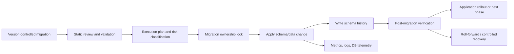
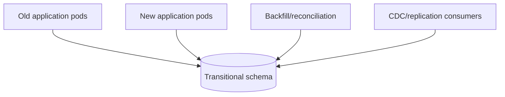
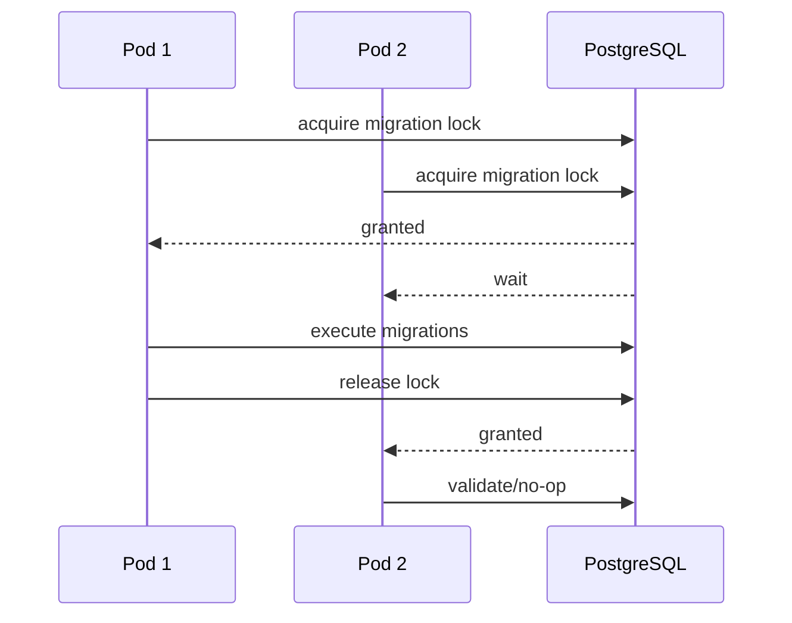
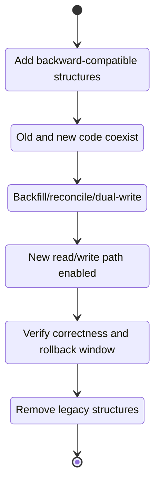
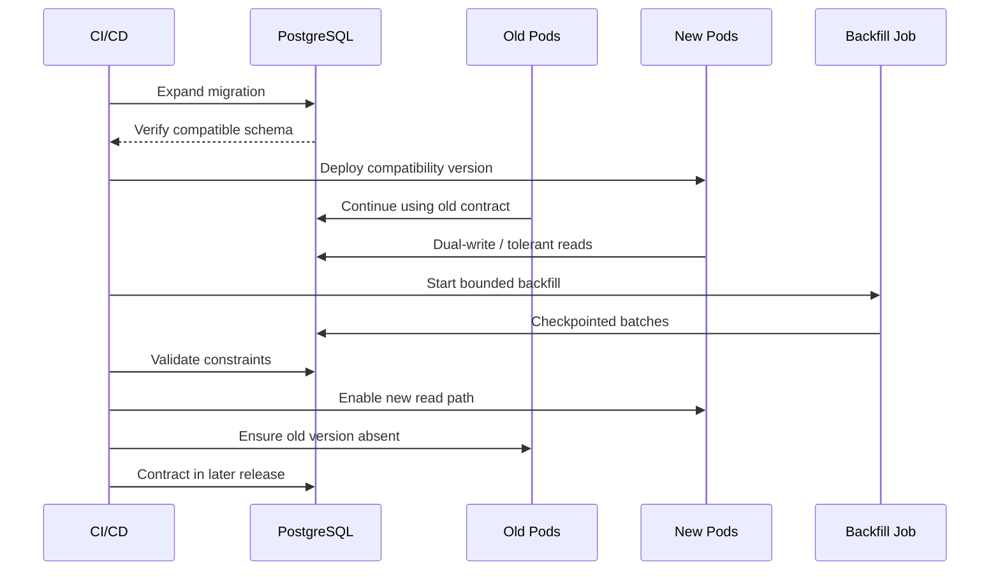

# Part 031 — Liquibase, Flyway, and Zero-Downtime Migration Safety

> Database migration adalah perubahan terhadap shared durable contract. Bahayanya bukan hanya SQL yang salah, tetapi juga lock yang tidak terduga, schema yang hanya kompatibel dengan satu versi aplikasi, backfill yang memenuhi WAL dan replica lag, migration runner ganda, checksum drift, serta rollback yang secara teknis tersedia tetapi secara bisnis tidak dapat mengembalikan data. Senior engineer harus mereview migration sebagai deployment protocol lintas versi, bukan sebagai lampiran PR.

## Daftar Isi

1. [Target kompetensi](#target-kompetensi)
2. [Scope dan baseline](#scope-dan-baseline)
3. [Boundary dengan Part 028–030 dan part berikutnya](#boundary-dengan-part-028030-dan-part-berikutnya)
4. [Mental model database migration](#mental-model-database-migration)
5. [Schema sebagai kontrak lintas versi](#schema-sebagai-kontrak-lintas-versi)
6. [Source of truth dan ownership](#source-of-truth-dan-ownership)
7. [Liquibase versus Flyway](#liquibase-versus-flyway)
8. [Liquibase changelog dan changeset](#liquibase-changelog-dan-changeset)
9. [Flyway versioned, repeatable, dan baseline migrations](#flyway-versioned-repeatable-dan-baseline-migrations)
10. [Schema history dan migration identity](#schema-history-dan-migration-identity)
11. [Applied migrations harus immutable](#applied-migrations-harus-immutable)
12. [Checksum, validation, dan drift](#checksum-validation-dan-drift)
13. [Repair dan clear-checksums bukan normal workflow](#repair-dan-clear-checksums-bukan-normal-workflow)
14. [Baseline existing databases](#baseline-existing-databases)
15. [Preconditions, contexts, labels, dan environment branching](#preconditions-contexts-labels-dan-environment-branching)
16. [Satu migration owner dan satu runner](#satu-migration-owner-dan-satu-runner)
17. [Startup migration versus deployment job](#startup-migration-versus-deployment-job)
18. [Migration locking](#migration-locking)
19. [PostgreSQL DDL transaction semantics](#postgresql-ddl-transaction-semantics)
20. [Commands yang tidak dapat digabung dalam transaction block](#commands-yang-tidak-dapat-digabung-dalam-transaction-block)
21. [Lock budget dan statement timeout](#lock-budget-dan-statement-timeout)
22. [Risk classification](#risk-classification)
23. [Metadata-only versus scan/rewrite operations](#metadata-only-versus-scanrewrite-operations)
24. [Menambah column secara aman](#menambah-column-secara-aman)
25. [Default value dan existing rows](#default-value-dan-existing-rows)
26. [Menambahkan `NOT NULL`](#menambahkan-not-null)
27. [CHECK dan foreign-key validation](#check-dan-foreign-key-validation)
28. [Index creation](#index-creation)
29. [`CREATE INDEX CONCURRENTLY`](#create-index-concurrently)
30. [Unique constraint melalui existing index](#unique-constraint-melalui-existing-index)
31. [Mengubah column type](#mengubah-column-type)
32. [Rename bukan selalu backward-compatible](#rename-bukan-selalu-backward-compatible)
33. [Drop column/table dan destructive changes](#drop-columntable-dan-destructive-changes)
34. [Expand–migrate–contract](#expandmigratecontract)
35. [Compatibility window dalam rolling deployment](#compatibility-window-dalam-rolling-deployment)
36. [Dual-read dan dual-write](#dual-read-dan-dual-write)
37. [Backfill sebagai production workload](#backfill-sebagai-production-workload)
38. [Chunking, checkpoint, dan resumability](#chunking-checkpoint-dan-resumability)
39. [Throttle dan resource budget](#throttle-dan-resource-budget)
40. [Data verification dan reconciliation](#data-verification-dan-reconciliation)
41. [Schema migration versus data migration](#schema-migration-versus-data-migration)
42. [Functions, procedures, views, dan triggers](#functions-procedures-views-dan-triggers)
43. [Partitioned tables](#partitioned-tables)
44. [Multi-tenant dan multi-schema migrations](#multi-tenant-dan-multi-schema-migrations)
45. [Replication, CDC, dan read replicas](#replication-cdc-dan-read-replicas)
46. [Rollback versus roll-forward](#rollback-versus-roll-forward)
47. [Backup dan restore bukan instant rollback](#backup-dan-restore-bukan-instant-rollback)
48. [Deployment sequencing](#deployment-sequencing)
49. [CI/CD dan GitOps gates](#cicd-dan-gitops-gates)
50. [Dry-run SQL dan review evidence](#dry-run-sql-dan-review-evidence)
51. [Observability](#observability)
52. [Failure-model matrix](#failure-model-matrix)
53. [Debugging playbook](#debugging-playbook)
54. [Testing strategy](#testing-strategy)
55. [Architecture patterns](#architecture-patterns)
56. [Anti-patterns](#anti-patterns)
57. [PR review checklist](#pr-review-checklist)
58. [Trade-off yang harus dipahami senior engineer](#trade-off-yang-harus-dipahami-senior-engineer)
59. [Internal verification checklist](#internal-verification-checklist)
60. [Latihan verifikasi](#latihan-verifikasi)
61. [Ringkasan](#ringkasan)
62. [Referensi resmi](#referensi-resmi)

---

## Target kompetensi

Setelah menyelesaikan part ini, Anda harus mampu:

- menjelaskan migration sebagai perubahan durable contract yang harus kompatibel dengan beberapa versi aplikasi selama rollout;
- membedakan schema change, data backfill, object replacement, dan destructive cleanup;
- membaca serta mereview Liquibase changelog/changeset atau Flyway versioned/repeatable migration;
- menjelaskan fungsi schema-history table, checksum, validation, baseline, migration lock, dan repair;
- menentukan apakah migration dijalankan oleh aplikasi, init container, Kubernetes Job, pipeline, atau operator;
- mengklasifikasikan risiko perubahan PostgreSQL berdasarkan lock, table scan, rewrite, WAL, replica lag, disk, dan duration;
- merancang expand–migrate–contract untuk column, constraint, type, index, function, dan contract data;
- membuat backfill yang chunked, restartable, idempotent, observable, dan dapat dihentikan;
- membedakan rollback executable dari recovery yang benar secara bisnis;
- mendesain compatibility matrix untuk old app/new app versus old schema/new schema;
- merencanakan deployment sequence dan verification gates;
- mendiagnosis migration lock, checksum mismatch, blocked DDL, invalid index, partial data backfill, dan schema drift;
- mereview migration PR dari sisi correctness, operability, security, tenancy, dan blast radius.

---

## Scope dan baseline

Baseline materi:

- Java 17+ JAX-RS service;
- PostgreSQL modern;
- Maven dan CI/CD;
- rolling deployment pada Kubernetes atau platform setara;
- Liquibase, Flyway, atau migration framework setara mungkin digunakan;
- schema/query fundamentals dari Part 028;
- JDBC transaction/locking dari Part 029;
- MyBatis serta database-side objects dari Part 030;
- production database tetap menerima traffic selama mayoritas rollout.

Part ini **tidak mengasumsikan**:

- Liquibase atau Flyway benar-benar digunakan di CSG Quote & Order;
- migration dijalankan saat application startup;
- satu service memiliki database/schema eksklusif;
- PostgreSQL major version tertentu;
- semua DDL transactional;
- automatic rollback selalu tersedia;
- semua environment memiliki schema identik;
- database managed cloud atau on-prem;
- single-tenant atau multi-tenant schema model;
- zero downtime berarti zero risk;
- tool edition atau commercial feature tertentu.

Semua detail tersebut harus dibuktikan melalui dependency graph, build files, changelog/migration directories, pipeline, Kubernetes manifests, database history tables, operational runbooks, dan release records.

---

## Boundary dengan Part 028–030 dan part berikutnya

| Part | Fokus |
|---|---|
| Part 028 | Data model, constraint, index, planner, query design |
| Part 029 | JDBC, transaction, isolation, lock, deadlock |
| Part 030 | MyBatis, SQL mapping, functions/procedures/triggers |
| Part 031 | Safe evolution dan deployment dari seluruh database contract |
| Part 032–035 | Kafka dan messaging lifecycle |
| Part 045 | Safe rollout application/container secara lebih luas |

Part ini tidak mengulang cara mendesain index atau transaction. Fokusnya adalah **bagaimana perubahan tersebut diperkenalkan ke database production tanpa memutus versi aplikasi yang masih hidup**.

---

## Mental model database migration



A migration has at least five contracts:

```text
1. Desired database state
2. Legal transition from previous state
3. Compatibility with application versions during transition
4. Operational resource/lock budget
5. Recovery and verification procedure
```

A script that reaches the desired schema in a local empty database proves only contract 1.

---

## Schema sebagai kontrak lintas versi

Dalam rolling deployment, old dan new pods dapat hidup bersamaan:



Schema transitional harus memenuhi semua active readers/writers.

Contoh compatibility matrix:

| Application | Old schema | Expanded schema | Contracted schema |
|---|---:|---:|---:|
| Old version | supported | must remain supported | usually unsupported |
| New version before flag | may be supported | supported | maybe supported |
| New version after cutover | usually unsupported | supported | supported |
| Rollback old version | possible | possible | blocked if old field removed |

**Invariant:**

> Contract phase hanya boleh dijalankan setelah tidak ada executable path, old pod, batch job, report, integration, atau rollback plan yang membutuhkan contract lama.

---

## Source of truth dan ownership

Migration artifacts harus memiliki owner yang jelas.

Pertanyaan ownership:

- repository mana yang menjadi source of truth;
- service mana yang memiliki object database;
- siapa yang approve;
- siapa yang mengeksekusi;
- siapa yang memantau;
- siapa yang dapat menghentikan;
- siapa yang menangani partial failure;
- siapa yang memutuskan contract cleanup;
- apakah external consumers membaca schema yang sama;
- apakah DBA dapat melakukan out-of-band changes.

Shared schema tanpa ownership menyebabkan:

- dua service membuat migration yang konflik;
- changelog order tidak deterministik;
- direct hotfix tidak kembali ke source control;
- rollback satu service merusak service lain;
- grants dan routines tidak memiliki owner.

---

## Liquibase versus Flyway

Keduanya menyelesaikan masalah versioned database change, tetapi model authoring berbeda.

| Area | Liquibase | Flyway |
|---|---|---|
| Unit utama | changelog + changeset | migration file/class |
| Format | XML, YAML, JSON, formatted SQL, custom changes | SQL, Java, dan fitur/tooling terkait |
| Identity | `id + author + changelog path` | migration version/description/type |
| Tracking | `DATABASECHANGELOG` | `flyway_schema_history` |
| Locking | `DATABASECHANGELOGLOCK` | schema-history/migration locking internal |
| Preconditions | built-in changeset/changelog constructs | script/config/callback/check mechanisms |
| Rollback declaration | dapat dinyatakan per changeset; tidak semua otomatis | umumnya forward migration; undo tergantung edition/workflow |
| Repeatable objects | `runOnChange`/related mechanisms | repeatable `R__...` |
| Database abstraction | structured change types dapat mengabstraksi SQL | SQL-first dan database-specific sangat natural |
| Review concern | generated SQL harus tetap diperiksa | raw SQL visibility tinggi tetapi portability rendah |

Tool choice tidak mengubah prinsip:

- applied migration tidak diedit sembarangan;
- DDL lock tetap milik PostgreSQL;
- compatibility tetap tanggung jawab desain;
- rollback data tetap sulit;
- backfill tetap production workload;
- schema drift tetap harus dideteksi.

---

## Liquibase changelog dan changeset

Contoh minimal:

```yaml
databaseChangeLog:
  - changeSet:
      id: 2026-07-quote-status-expand
      author: team-quote-order
      preConditions:
        - onFail: HALT
        - tableExists:
            tableName: quote
      changes:
        - addColumn:
            tableName: quote
            columns:
              - column:
                  name: status_v2
                  type: varchar(32)
                  constraints:
                    nullable: true
      rollback:
        - dropColumn:
            tableName: quote
            columnName: status_v2
```

Hal yang harus direview:

- identity changeset stabil;
- precondition tidak menyamarkan drift;
- generated SQL sesuai PostgreSQL;
- rollback benar-benar aman atau hanya sintaktis;
- changeset transaction mode sesuai command;
- labels/contexts tidak membuat environment divergen;
- change tidak mengandalkan urutan implicit include yang rapuh;
- permission/grants ikut dikelola;
- checksum tidak akan berubah setelah apply.

Structured change type membantu portability, tetapi tidak menjamin optimality. Untuk operasi PostgreSQL sensitif seperti concurrent index, explicit SQL sering lebih reviewable.

---

## Flyway versioned, repeatable, dan baseline migrations

Konvensi umum:

```text
V031_001__expand_quote_status.sql
V031_002__add_quote_status_check.sql
R__quote_projection_view.sql
B031__baseline.sql
```

Semantics:

| Type | Tujuan |
|---|---|
| Versioned migration | diterapkan sekali dalam version order |
| Repeatable migration | diterapkan ulang saat checksum/content berubah |
| Baseline migration | mewakili state awal untuk target baru/existing sesuai workflow |
| Java migration | transformation yang membutuhkan code atau streaming logic |

Repeatable migration cocok untuk views/functions yang definisinya dikelola utuh, tetapi:

- object replacement dapat mengambil locks;
- dependency chain dapat gagal;
- privilege/owner dapat berubah;
- repeatable migration yang berubah dapat berjalan pada waktu yang tidak terduga jika pipeline tidak dikendalikan;
- signature change tetap perlu expand-contract.

---

## Schema history dan migration identity

History table adalah audit execution, bukan seluruh audit bisnis.

Data penting:

- migration identity;
- checksum;
- installed/executed order;
- execution time;
- success/failure state;
- tool version;
- description/type;
- user/host, tergantung tool.

History table membantu menjawab:

```text
What was intended?
What was applied?
In what order?
With which checksum?
Did the tool record success?
```

Ia tidak otomatis menjawab:

```text
Was the DDL operationally safe?
Did every row backfill correctly?
Did old application versions remain compatible?
Did replicas catch up?
Was customer behavior correct?
```

---

## Applied migrations harus immutable

Normal rule:

> Setelah migration diterapkan ke shared environment, jangan edit migration tersebut. Tambahkan migration korektif baru.

Mengedit applied migration dapat menghasilkan:

- checksum mismatch;
- environment A dan B memiliki object state berbeda tetapi migration ID sama;
- rebuild database tidak sama dengan upgraded database;
- production repair tidak reproducible;
- audit trail menyesatkan.

Pengecualian hanya melalui controlled procedure dengan evidence bahwa:

- migration belum pernah diterapkan ke shared target; atau
- perubahan metadata non-semantic memang diizinkan tool; atau
- repair telah disetujui sebagai incident recovery dengan documented state.

---

## Checksum, validation, dan drift

Checksum melindungi integritas artifact, bukan integritas seluruh database.

Validate harus memeriksa:

- applied migration masih tersedia;
- checksum cocok;
- ordering legal;
- tidak ada failed migration yang belum direkonsiliasi;
- version collision tidak ada;
- repeatable state sesuai;
- target baseline benar.

Drift sources yang checksum tidak selalu deteksi:

- DBA hotfix;
- manual index;
- altered grants;
- trigger disabled;
- changed owner;
- changed sequence state;
- extension settings;
- environment-specific object;
- data invariant rusak.

Tambahkan schema diff/drift checks jika risk profile membutuhkannya.

---

## Repair dan clear-checksums bukan normal workflow

Commands seperti `repair`, `clear-checksums`, atau manual edit history table adalah **privileged recovery operations**.

Sebelum melakukan repair:

1. identifikasi actual database state;
2. bandingkan dengan migration artifact;
3. tentukan apakah SQL sebagian sudah berjalan;
4. verifikasi transaction behavior;
5. periksa dependencies;
6. dokumentasikan alasan checksum/history berbeda;
7. buat migration korektif bila memungkinkan;
8. review dengan database owner;
9. simpan evidence dan incident/change record.

Anti-pattern:

```text
Validation failed
  → clear all checksums
  → run update again
```

Ini menghapus alarm tanpa membuktikan bahwa schema benar.

---

## Baseline existing databases

Baselining berarti mengatakan kepada migration tool:

> Object sampai titik tertentu dianggap sudah tersedia, tanpa menjalankan seluruh historical migrations pada target ini.

Risiko:

- target sebenarnya tidak sama dengan baseline definition;
- beberapa object/grants hilang;
- data reference berbeda;
- environment fleets berada pada patch level berbeda;
- baseline version terlalu tinggi;
- rebuild path tidak pernah diuji.

Baseline procedure harus mencakup:

- schema inventory;
- object checksums/diff;
- required extension;
- grants/owners;
- reference data;
- current application compatibility;
- backup/recovery point;
- explicit approval.

---

## Preconditions, contexts, labels, dan environment branching

Precondition dapat mencegah perubahan diterapkan pada state yang salah.

Contoh useful preconditions:

- table/column exists or does not exist;
- database product/version supported;
- expected row count range;
- expected extension installed;
- no duplicate data before unique constraint;
- feature state compatible.

Namun precondition bukan pengganti migration correctness.

Bad pattern:

```text
if column exists → MARK_RAN
```

Tanpa memeriksa type/default/constraint, migration dapat dianggap selesai pada schema yang tidak sesuai.

Environment branching juga berbahaya:

```text
prod executes A
uat executes B
dev executes C
```

Contexts/labels sebaiknya digunakan untuk deployment topology yang jelas, bukan untuk membuat business schema berbeda secara permanen.

---

## Satu migration owner dan satu runner

Migration race:



Walaupun tool memiliki lock, startup migration pada setiap pod dapat menyebabkan:

- rollout tertahan;
- readiness timeout;
- deadlock dengan deployment;
- multiple pods waiting on DB;
- migration duration terikat startup timeout;
- application identity memiliki DDL privileges;
- incident ambigu: application failure atau migration failure.

Preferensi umum untuk production:

```text
Pipeline / dedicated Kubernetes Job
  → validate
  → acquire ownership
  → migrate
  → verify
  → release application rollout
```

Tetapi exact standard harus diverifikasi internal.

---

## Startup migration versus deployment job

| Model | Benefit | Risk |
|---|---|---|
| Application startup | sederhana, local dev convenient | race, privilege coupling, startup timeout |
| Init container | app waits for schema | setiap pod dapat mencoba, lifecycle coupling |
| Kubernetes Job | one controlled runner, observable | orchestration dan retry harus benar |
| CI/CD runner | approval/gates centralized | network/credential access ke DB |
| DBA-run script | strong operational control | drift dari source pipeline, manual delay |
| Database operator | standardized | abstraction dan platform dependency |

Decision criteria:

- DDL privilege boundary;
- deployment ordering;
- audit requirement;
- rollback/hold capability;
- multi-region/multi-tenant topology;
- network access;
- duration;
- tool licensing/standard;
- incident ownership.

---

## Migration locking

Dua jenis lock berbeda:

1. **Tool ownership lock**  
   Mencegah dua migration runners menulis history dan mengeksekusi change set bersamaan.

2. **PostgreSQL object locks**  
   Melindungi table/index/catalog saat DDL/DML dilakukan.

Tool lock sukses tidak berarti DDL tidak akan block traffic.

Liquibase menggunakan `DATABASECHANGELOGLOCK`. Jika runner mati, stale lock handling harus mengikuti runbook; jangan langsung release sebelum memastikan tidak ada process aktif.

Verification:

```sql
SELECT *
FROM databasechangeloglock;

SELECT pid, application_name, state, query_start, query
FROM pg_stat_activity
WHERE application_name ILIKE '%liquibase%'
   OR application_name ILIKE '%flyway%';
```

Nama table/application harus disesuaikan dengan tool/configuration aktual.

---

## PostgreSQL DDL transaction semantics

Banyak PostgreSQL DDL dapat berjalan dalam transaction:

```sql
BEGIN;

ALTER TABLE quote
    ADD COLUMN status_v2 text;

CREATE TABLE quote_status_history (...);

COMMIT;
```

Benefit:

- atomic metadata transition;
- error dapat rollback;
- history dan DDL dapat konsisten.

Tetapi transaction besar dapat:

- memegang lock sampai commit;
- memperpanjang blocked traffic;
- menahan dead tuples;
- menghasilkan WAL besar;
- membuat recovery lebih mahal.

Transactional bukan sinonim safe.

---

## Commands yang tidak dapat digabung dalam transaction block

Beberapa operasi concurrent/maintenance tidak boleh dijalankan di ordinary transaction block, misalnya:

```sql
CREATE INDEX CONCURRENTLY idx_quote_tenant_status
    ON quote (tenant_id, status_v2);
```

Tool configuration harus mendukung changeset/migration non-transactional dengan sadar.

Review questions:

- apakah command memang tidak transactional;
- jika step 2 gagal setelah step 1, state apa yang tersisa;
- apakah retry idempotent;
- bagaimana mendeteksi invalid index;
- apakah history ditulis sebelum/selepas command;
- bagaimana cleanup dilakukan;
- apakah concurrent operation tetap membutuhkan lock/wait.

---

## Lock budget dan statement timeout

Migration DDL dapat menunggu lock lama lalu tiba-tiba memperoleh lock pada peak traffic.

Gunakan explicit operational guardrails:

```sql
SET lock_timeout = '3s';
SET statement_timeout = '15min';
```

Nilai hanya contoh; internal standard harus diverifikasi.

Reasoning:

- `lock_timeout` membatasi waktu menunggu lock;
- `statement_timeout` membatasi total statement;
- retry harus dikendalikan pipeline, bukan tight loop;
- failed lock acquisition lebih baik daripada blocking outage tanpa batas.

Sebelum DDL:

```sql
SELECT
    a.pid,
    a.usename,
    a.application_name,
    a.state,
    a.xact_start,
    a.query_start,
    pg_blocking_pids(a.pid) AS blocking_pids,
    a.query
FROM pg_stat_activity a
WHERE a.datname = current_database()
ORDER BY a.xact_start NULLS LAST;
```

---

## Risk classification

Contoh matrix awal:

| Change | Lock risk | Scan/rewrite | Data risk | Compatibility risk |
|---|---:|---:|---:|---:|
| Add nullable column | low–medium | usually low | low | low |
| Add index normally | high write blocking | full scan/build | low | low |
| Add index concurrently | lower traffic blocking, longer | scans | low | low |
| Add validated FK directly | medium–high | table validation | medium | low |
| Add `NOT VALID` FK | lower initial | validation later | medium | low |
| Set `NOT NULL` | lock + possible scan | version/state dependent | medium | medium |
| Change column type | potentially high | possible rewrite | high | high |
| Rename column | metadata operation | low | low | very high |
| Drop column | lock + destructive | possible cleanup later | irreversible data | very high |
| Backfill all rows one transaction | write/row locks | large | high | medium |
| Replace function signature | dependency locks | low | medium | high |

Do not copy this matrix blindly. Confirm exact PostgreSQL version, table size, dependencies, and execution plan.

---

## Metadata-only versus scan/rewrite operations

Sebelum approval, classify:

```text
metadata-only?
requires table scan?
rewrites table?
builds index?
updates every row?
validates cross-table relation?
waits for old snapshots?
cannot run in transaction?
```

Evidence sources:

- official PostgreSQL docs;
- test on production-like data volume;
- `pg_locks`;
- progress views;
- WAL/disk measurement;
- execution rehearsal;
- object dependency queries.

Migration review tanpa size/cardinality evidence adalah incomplete.

---

## Menambah column secara aman

Safe default pattern:

```sql
ALTER TABLE quote
    ADD COLUMN status_v2 text;
```

Kemudian:

1. deploy readers/writers yang memahami optional column;
2. backfill existing rows;
3. verify;
4. add constraint/default;
5. switch reads;
6. contract old column later.

Hindari langsung mengikat semantic baru ke non-null column jika old pods belum mengisinya.

JAX-RS impact:

- old request DTO may not supply new field;
- new response must not break old clients;
- persistence mapper must handle null transitional state;
- event schema may need independent evolution;
- cache entries may use old representation.

---

## Default value dan existing rows

Default affects future inserts. Existing row behavior and physical rewrite characteristics depend on PostgreSQL version, expression volatility, and operation form.

Review:

- constant atau volatile expression;
- existing row semantics;
- old application inserts explicit null;
- default owned by DB atau application;
- future default changes;
- generated values;
- backfill requirement.

Safer sequence for complex default:

```sql
ALTER TABLE quote ADD COLUMN calculation_version integer;

ALTER TABLE quote
    ALTER COLUMN calculation_version SET DEFAULT 1;
```

Then backfill in controlled batches and enforce invariant later.

---

## Menambahkan `NOT NULL`

Direct:

```sql
ALTER TABLE quote
    ALTER COLUMN calculation_version SET NOT NULL;
```

May require checking existing rows and acquiring strong table lock.

Staged pattern:

```sql
ALTER TABLE quote
    ADD CONSTRAINT quote_calculation_version_nn
    CHECK (calculation_version IS NOT NULL) NOT VALID;

ALTER TABLE quote
    VALIDATE CONSTRAINT quote_calculation_version_nn;

ALTER TABLE quote
    ALTER COLUMN calculation_version SET NOT NULL;

ALTER TABLE quote
    DROP CONSTRAINT quote_calculation_version_nn;
```

Exact optimization and lock behavior depend on PostgreSQL version. Rehearse it.

Before validation:

```sql
SELECT count(*)
FROM quote
WHERE calculation_version IS NULL;
```

A count of zero at one moment does not guarantee old writers will not insert null. Application compatibility must be fixed first.

---

## CHECK dan foreign-key validation

Staged foreign key:

```sql
ALTER TABLE quote_item
    ADD CONSTRAINT fk_quote_item_quote
    FOREIGN KEY (tenant_id, quote_id)
    REFERENCES quote (tenant_id, id)
    NOT VALID;

ALTER TABLE quote_item
    VALIDATE CONSTRAINT fk_quote_item_quote;
```

`NOT VALID` separates:

- enforcement for new writes;
- validation of historical rows.

Benefits:

- shorter initial lock window;
- validation can be scheduled;
- bad historical data can be reconciled.

Still verify:

- required indexes on referencing/referenced columns;
- orphan count;
- lock mode;
- validation duration;
- write load;
- partition behavior;
- tenant composite keys.

---

## Index creation

Normal index build:

```sql
CREATE INDEX idx_quote_status
    ON quote (tenant_id, status_v2);
```

Can block writes depending on PostgreSQL lock semantics.

Review:

- expected query;
- selectivity;
- index size;
- write amplification;
- disk headroom;
- build duration;
- active long transactions;
- replicas;
- whether duplicate equivalent index exists.

Do not deploy speculative indexes without query evidence.

---

## `CREATE INDEX CONCURRENTLY`

```sql
CREATE INDEX CONCURRENTLY idx_quote_status_v2
    ON quote (tenant_id, status_v2)
    WHERE deleted_at IS NULL;
```

Properties:

- allows normal writes during most of build;
- takes longer and performs multiple phases/scans;
- cannot run in an ordinary transaction block;
- may wait for old transactions/snapshots;
- failure can leave an invalid index;
- only one concurrent index build per table at a time in common PostgreSQL behavior;
- adds CPU, I/O, WAL, and disk load.

Detect invalid indexes:

```sql
SELECT
    n.nspname,
    c.relname AS index_name,
    i.indisvalid,
    i.indisready
FROM pg_index i
JOIN pg_class c ON c.oid = i.indexrelid
JOIN pg_namespace n ON n.oid = c.relnamespace
WHERE NOT i.indisvalid OR NOT i.indisready;
```

Cleanup must be explicit and reviewed.

---

## Unique constraint melalui existing index

For a large table, a possible staged strategy:

```sql
CREATE UNIQUE INDEX CONCURRENTLY uq_quote_external_ref_idx
    ON quote (tenant_id, external_ref)
    WHERE external_ref IS NOT NULL;
```

Then attach a compatible index to a constraint when PostgreSQL syntax/semantics permit.

But partial unique indexes cannot always back ordinary unique constraints. Verify:

- null semantics;
- predicate;
- column order;
- included columns;
- collation/operator class;
- partitioning;
- exact `ALTER TABLE ... ADD CONSTRAINT ... USING INDEX` compatibility.

Before build:

```sql
SELECT tenant_id, external_ref, count(*)
FROM quote
WHERE external_ref IS NOT NULL
GROUP BY tenant_id, external_ref
HAVING count(*) > 1;
```

---

## Mengubah column type

Risky direct change:

```sql
ALTER TABLE quote
    ALTER COLUMN amount TYPE numeric(19,4)
    USING amount::numeric(19,4);
```

Potential risks:

- table rewrite;
- long `ACCESS EXCLUSIVE` lock;
- index rebuild;
- precision loss;
- application mapping mismatch;
- function/view dependency;
- WAL/disk spike;
- replica lag.

Expand-contract alternative:

```text
1. Add amount_v2 with target type
2. New code dual-writes
3. Backfill amount_v2
4. Verify exact conversion
5. Switch reads
6. Stop old writes
7. Remove old column later
```

For money, verify rounding and overflow before write.

---

## Rename bukan selalu backward-compatible

`ALTER TABLE ... RENAME COLUMN` may be fast, but application compatibility is high risk.

Old pods still execute:

```sql
SELECT old_name FROM quote;
```

Safer alternatives:

- add new column and dual-write;
- expose compatibility view;
- adjust mapper to read aliases;
- deploy all readers before rename;
- perform rename only during controlled non-overlap deployment if downtime accepted.

Metadata speed does not equal rollout safety.

---

## Drop column/table dan destructive changes

Before drop:

- no application binary references it;
- no dynamic SQL references it;
- no report/BI/query tool references it;
- no view/function/trigger dependency;
- no CDC consumer relies on it;
- no rollback binary needs it;
- retention/legal requirement satisfied;
- data archived if required;
- release has survived observation window.

Prefer:

```text
Stop use
  → stop writes
  → hide/deprecate
  → observe
  → archive
  → drop in later release
```

Never combine introduction and removal of a contract in one rollout unless deployment is truly atomic and verified.

---

## Expand–migrate–contract



Example:

| Phase | Database | Application |
|---|---|---|
| Expand | add `status_v2` nullable | old code unchanged |
| Mixed | both columns available | new code writes both |
| Migrate | backfill `status_v2` | reads still old/fallback |
| Cutover | data verified | flag switches reads to v2 |
| Observe | both retained | monitor |
| Contract | old column removed later | no old binary allowed |

---

## Compatibility window dalam rolling deployment

Model explicit compatibility:

```text
S0 = original schema
S1 = expanded transitional schema
S2 = contracted schema

A0 = old app
A1 = compatibility app
A2 = new-only app
```

Expected:

| Pair | Supported? |
|---|---|
| A0 + S0 | yes |
| A0 + S1 | yes |
| A1 + S0 | preferably yes during predeploy, or ordered rollout |
| A1 + S1 | yes |
| A2 + S1 | yes |
| A0 + S2 | no |
| A2 + S2 | yes |

This matrix belongs in technical design and migration PR.

---

## Dual-read dan dual-write

Dual-write risks:

- one write succeeds and the other fails;
- trigger and application both update;
- recursion;
- divergent transformations;
- ordering race;
- old writer updates only legacy column;
- backfill overwrites newer data.

Safer dual-write:

- one database transaction;
- version/updated timestamp condition;
- single canonical transformation function;
- metrics for mismatch;
- reconciliation query;
- deterministic conflict policy.

Dual-read pattern:

```java
String effectiveStatus =
        row.statusV2() != null ? row.statusV2() : mapLegacy(row.status());
```

This is transitional debt. Add removal criteria and owner.

---

## Backfill sebagai production workload

Backfill competes with live traffic for:

- connections;
- CPU;
- buffer cache;
- I/O;
- WAL;
- autovacuum;
- locks;
- replica bandwidth;
- CDC throughput;
- storage.

Backfill design document should contain:

- total rows and bytes;
- predicate;
- batch size;
- expected throughput;
- duration estimate;
- connection pool;
- lock behavior;
- WAL estimate;
- pause/stop mechanism;
- checkpoint;
- retry;
- verification;
- rollback/correction;
- dashboard and alerts.

---

## Chunking, checkpoint, dan resumability

Avoid:

```sql
UPDATE quote
SET status_v2 = map_status(status)
WHERE status_v2 IS NULL;
```

on a very large table without evidence.

Chunked pattern:

```sql
WITH candidates AS (
    SELECT id
    FROM quote
    WHERE status_v2 IS NULL
      AND id > :last_id
    ORDER BY id
    LIMIT :batch_size
    FOR UPDATE SKIP LOCKED
)
UPDATE quote q
SET status_v2 = map_status(q.status)
FROM candidates c
WHERE q.id = c.id
RETURNING q.id;
```

Requirements:

- stable cursor/checkpoint;
- idempotent transformation;
- bounded transaction;
- retry whole batch;
- progress persisted;
- no skipped gaps forever;
- final reconciliation scan;
- tenant fairness if multi-tenant;
- stop signal respected.

`SKIP LOCKED` changes semantics; it is suitable only when skipped rows are revisited.

---

## Throttle dan resource budget

Control knobs:

- batch size;
- sleep/jitter;
- max concurrent workers;
- connection pool dedicated to job;
- statement timeout;
- lock timeout;
- tenant quota;
- WAL/replica-lag threshold;
- CPU/I/O threshold;
- maintenance window;
- automatic pause.

Adaptive loop:

```text
if replica_lag > threshold
   or DB CPU > threshold
   or p95 app latency > threshold:
       pause/reduce rate
else:
       continue cautiously
```

Thresholds must be internal operational policy, not hard-coded guesses.

---

## Data verification dan reconciliation

Verification examples:

```sql
-- Completeness
SELECT count(*)
FROM quote
WHERE status_v2 IS NULL;

-- Semantic mismatch
SELECT count(*)
FROM quote
WHERE status_v2 IS DISTINCT FROM map_status(status);

-- Distribution
SELECT status_v2, count(*)
FROM quote
GROUP BY status_v2;

-- Tenant-level mismatch
SELECT tenant_id, count(*)
FROM quote
WHERE status_v2 IS DISTINCT FROM map_status(status)
GROUP BY tenant_id;
```

Also verify:

- new constraints valid;
- index valid and used where expected;
- old/new API results equivalent;
- events emitted correctly;
- cache invalidated;
- reports unaffected;
- replica caught up;
- no long-running job remains.

---

## Schema migration versus data migration

Prefer separating:

```text
Migration 1: introduce schema
Deployment: compatibility application
Job: backfill data
Verification gate
Migration 2: enforce constraint
Deployment: cutover
Migration 3: contract
```

Benefits:

- DDL transaction remains short;
- job can pause/resume;
- telemetry clearer;
- rollout can wait for data;
- failures are isolated;
- history accurately models phases.

Large backfill inside Flyway/Liquibase migration can hold migration ownership for hours and make recovery awkward.

---

## Functions, procedures, views, dan triggers

Object replacement is also a migration.

Review:

- signature compatibility;
- grants/owner;
- `SECURITY DEFINER`;
- `search_path`;
- dependent views/functions;
- prepared statement invalidation;
- return-column order/type;
- old/new callers;
- trigger recursion;
- lock timing;
- repeatable migration behavior.

For signature change, add new version:

```sql
CREATE FUNCTION calculate_quote_v2(...)
RETURNS ...
```

Migrate callers before dropping v1.

---

## Partitioned tables

Partition operations may acquire locks on parent/default/child tables and may scan partitions.

Review:

- attach/detach method;
- validated CHECK constraints to avoid scans;
- default partition;
- index creation per partition;
- parent index validity;
- FK/unique restrictions;
- maintenance automation;
- concurrent builds;
- partition routing by old/new pods.

Do not treat a partitioned table as a single ordinary table.

---

## Multi-tenant dan multi-schema migrations

Models:

| Model | Migration implication |
|---|---|
| Shared schema + tenant key | one migration, large shared blast radius |
| Schema per tenant | fan-out, version skew, partial fleet failure |
| Database per tenant | orchestration, credentials, long rollout |
| Hybrid tiering | multiple execution paths |

For fleet migrations:

- record target-by-target state;
- bounded parallelism;
- canary tenants;
- pause threshold;
- retry classification;
- failed-target quarantine;
- exact version inventory;
- tenant communication if needed.

Never use one global “success” flag when 2,000 tenant schemas may be at different versions.

---

## Replication, CDC, dan read replicas

Migration side effects:

- WAL surge;
- replica lag;
- standby query cancellation due to DDL conflicts;
- changed column order/type affecting fragile CDC consumers;
- table rewrite generating large change volume;
- trigger/outbox duplicate behavior;
- DDL events unsupported by connector;
- replica used by old application version.

Verification:

- replication lag before/during/after;
- CDC connector status;
- schema registry/connector compatibility;
- read replica query errors;
- logical slot growth;
- disk headroom;
- recovery point.

---

## Rollback versus roll-forward

Types of recovery:

| Type | Meaning |
|---|---|
| Tool rollback | executes declared inverse changes |
| Application rollback | deploys old binary |
| Data restore | restores database state from backup/PITR |
| Compensating migration | new change repairs forward |
| Feature rollback | disable new behavior while schema remains expanded |
| Traffic rollback | route traffic away |

A migration rollback may be unsafe when:

- new writes use new column;
- old data was transformed destructively;
- rows were deleted;
- external events already published;
- sequence IDs consumed;
- irreversible side effects occurred;
- old binary is incompatible with current schema.

Default production bias: **expand and roll forward**, while keeping application feature rollback possible.

---

## Backup dan restore bukan instant rollback

Backup/PITR considerations:

- restore duration;
- recovery point objective;
- all services sharing database are rolled back;
- external events are not rolled back;
- object storage/downstream systems diverge;
- transactions after restore point are lost;
- credentials/network for restore;
- replica promotion;
- customer impact.

“Backup exists” is not a migration rollback plan.

---

## Deployment sequencing

Common safe sequence:



Order may differ, but it must be explicit.

---

## CI/CD dan GitOps gates

Recommended gates:

1. syntax/parse changelog;
2. tool validate;
3. migration naming/order;
4. forbidden operation lint;
5. generated SQL review;
6. apply to empty database;
7. apply from supported previous versions;
8. old-app/new-schema compatibility test;
9. new-app/old-schema test if required;
10. production-size rehearsal for risky operations;
11. rollback/roll-forward rehearsal;
12. security/grant review;
13. approval based on risk class;
14. post-deploy verification;
15. contract gate after observation period.

GitOps nuance:

- Git desired state does not make DDL reversible;
- reconciliation retries can be dangerous;
- migration Job must not loop blindly;
- failed migration should stop rollout;
- force-sync must not bypass evidence.

---

## Dry-run SQL dan review evidence

Liquibase/Flyway abstractions should produce inspectable SQL when possible.

PR evidence:

```text
- generated SQL
- target PostgreSQL version
- table row count and size
- estimated duration
- lock mode expectation
- index/WAL/disk estimate
- compatibility matrix
- backfill plan
- verification SQL
- stop/recovery commands
- owners and execution window
```

For data-dependent DDL, include actual sample query plans and precondition counts.

---

## Observability

Migration telemetry:

- migration ID and phase;
- target database/schema/tenant;
- start/end/duration;
- tool version;
- runner identity;
- current SQL;
- rows processed;
- checkpoint;
- lock wait;
- blocked/blocking sessions;
- DB CPU/I/O;
- WAL rate;
- replica lag;
- invalid indexes;
- failed targets;
- application latency/error rate.

Avoid logging credentials or sensitive row values.

A migration dashboard should answer:

```text
Is it progressing?
Is it blocking traffic?
Is it saturating the database?
Can it be paused?
Which target failed?
Is data converging?
```

---

## Failure-model matrix

| Failure | Detection | Immediate response | Durable prevention |
|---|---|---|---|
| Tool lock stuck | history lock table, no active runner | verify runner, controlled release | single owner, lease/runbook |
| Checksum mismatch | validate failure | stop; compare artifact/state | immutable migrations |
| DDL blocked | `pg_stat_activity`, `pg_locks` | cancel before outage threshold | lock timeout, preflight |
| DDL blocks traffic | latency spike, blockers | cancel/rollback transaction | safer operation/staging |
| Invalid concurrent index | catalog flags | drop/rebuild controlled | verify each phase |
| Partial non-transactional migration | object/history mismatch | inventory actual state | idempotent recovery steps |
| Backfill stalls | checkpoint unchanged | pause, inspect locks/load | bounded batches/telemetry |
| Backfill overloads DB | CPU/WAL/lag/latency | throttle or stop | resource budget |
| Old pod fails on new schema | application errors | halt rollout, retain compatibility | explicit matrix/tests |
| New pod fails on old schema | startup/query errors | ordered deployment or rollback | compatibility version |
| Constraint validation fails | validation error/orphan query | reconcile data | preflight and staged constraints |
| Replica lag explodes | replication metrics | pause heavy writes | WAL-aware planning |
| Contract executed too early | old binary/report fails | restore compatibility if possible | delayed contract gate |
| Manual drift | schema diff | reconcile with approved migration | prohibit out-of-band changes |
| Multi-tenant partial fleet | target inventory | quarantine failed targets | per-target state machine |
| Rollback loses new data | reconciliation mismatch | stop destructive rollback | roll-forward design |

---

## Debugging playbook

### 1. Migration tidak mulai

Check:

- runner logs;
- DB connectivity/DNS/TLS;
- credentials and DDL grants;
- tool lock;
- schema-history version;
- configured changelog locations;
- environment labels/contexts;
- application/pipeline timeout.

### 2. Migration menunggu

```sql
SELECT
    pid,
    application_name,
    wait_event_type,
    wait_event,
    state,
    xact_start,
    query_start,
    pg_blocking_pids(pid) AS blockers,
    query
FROM pg_stat_activity
WHERE datname = current_database();
```

Then inspect blocker transaction age and business ownership. Do not kill blindly.

### 3. Migration failed midway

Determine:

- was command transactional;
- did transaction rollback;
- did tool mark failure;
- what object exists;
- is index invalid;
- did data partially update;
- are triggers enabled;
- did history table advance;
- can migration safely retry.

### 4. Checksum mismatch

Compare:

- source control version applied;
- current file;
- schema-history checksum;
- release artifact;
- generated SQL;
- manual hotfix records.

Do not clear checksum before state proof.

### 5. Application fails after migration

Classify:

- missing/renamed object;
- changed type;
- permission/owner;
- mapper mismatch;
- prepared statement/cache;
- old pod compatibility;
- view/function result change;
- tenant schema version skew.

### 6. Backfill slow

Inspect:

- rows per batch;
- query plan;
- missing index on predicate;
- row contention;
- bloat;
- WAL;
- autovacuum;
- replica lag;
- checkpoint logic;
- skipped-row starvation.

---

## Testing strategy

### Migration unit/static tests

- changelog parses;
- names and order valid;
- no duplicate IDs/versions;
- forbidden SQL lint;
- rollback declaration policy;
- contexts/labels policy;
- checksums stable.

### Empty database test

Proves latest schema can be created from nothing.

It does **not** prove upgrade safety.

### Upgrade-path tests

Apply from:

- current production version;
- oldest supported rolling version;
- intermediate patch version;
- baseline target;
- partially upgraded recovery fixture.

### Compatibility tests

Run:

- old app against expanded schema;
- new compatibility app against old schema if rollout requires;
- old and new concurrently against expanded schema;
- background jobs/reports;
- rollback binary against transitional schema.

### Production-like performance rehearsal

Use realistic:

- row count;
- distribution;
- indexes;
- table/DB size;
- concurrent writes;
- long transactions;
- replication;
- disk limits.

Measure lock, duration, WAL, CPU, I/O, and application latency.

### Failure injection

- kill runner during transactional step;
- kill during non-transactional index build;
- fail between schema and history write;
- force lock timeout;
- produce duplicate data before unique constraint;
- restart backfill from checkpoint;
- simulate tenant target failure;
- simulate rollback request after new writes.

---

## Architecture patterns

### Pattern 1 — Dedicated migration job

```text
deployment pipeline
  → migration Job
  → verification gate
  → application rollout
```

### Pattern 2 — Compatibility release

A dedicated application release supports both old and new schema/representations.

### Pattern 3 — Separate backfill job

Schema migration remains short; backfill owns independent lifecycle and metrics.

### Pattern 4 — Contract tombstone period

Legacy column/object remains unused for one or more releases before physical removal.

### Pattern 5 — Migration manifest

Each risky change ships with machine-readable metadata:

```yaml
risk: high
lockBudget: 3s
estimatedDuration: 45m
requiresBackfill: true
rollbackMode: roll-forward
compatibilityWindow: "A0/A1 with S1"
owner: quote-order-team
```

### Pattern 6 — Per-tenant migration state machine

```text
PENDING → RUNNING → VERIFIED
          ↘ FAILED → RETRYABLE / MANUAL
```

---

## Anti-patterns

- editing an applied migration;
- running destructive changes in the same release that introduces replacements;
- every pod running migration at startup without explicit platform policy;
- one huge transaction backfilling millions of rows;
- no `lock_timeout`;
- treating `CREATE INDEX CONCURRENTLY` as free;
- clearing checksums to make validation green;
- using `IF EXISTS`/`IF NOT EXISTS` to hide unexplained drift;
- environment-specific schema branches without long-term governance;
- renaming columns during rolling deployment;
- declaring rollback only as `DROP COLUMN`;
- assuming backup is instant rollback;
- ignoring reports, jobs, CDC, and read replicas;
- applying contract phase before rollback window closes;
- no owner for failed migration;
- migration credentials equal application credentials permanently;
- testing only against an empty database;
- using migration tool lock as proof DDL is non-blocking.

---

## PR review checklist

### Contract and compatibility

- [ ] Is the old/new app versus old/expanded/contracted schema matrix explicit?
- [ ] Can old pods continue reading and writing?
- [ ] Can new pods tolerate transitional null/dual fields?
- [ ] Are reports/jobs/integrations included?
- [ ] Is contract cleanup in a later release?
- [ ] Is rollback binary compatibility preserved?

### SQL and PostgreSQL behavior

- [ ] Expected lock mode documented?
- [ ] Scan/rewrite behavior known?
- [ ] Command transactional?
- [ ] `lock_timeout` and statement timeout defined?
- [ ] Table size/cardinality evidence included?
- [ ] Disk/WAL/replica impact estimated?
- [ ] Concurrent index failure cleanup defined?
- [ ] Constraints/indexes support actual access pattern?

### Tooling

- [ ] Migration identity unique?
- [ ] Applied artifacts immutable?
- [ ] Checksum/validate behavior understood?
- [ ] Preconditions strict enough to detect wrong state?
- [ ] Contexts/labels do not create hidden divergence?
- [ ] Transaction setting correct?
- [ ] Repair/clear-checksum not used casually?
- [ ] Tool lock and runner ownership defined?

### Backfill

- [ ] Separate from DDL where appropriate?
- [ ] Idempotent and restartable?
- [ ] Bounded batches/transactions?
- [ ] Checkpoint durable?
- [ ] Throttle/pause/stop available?
- [ ] Skipped rows revisited?
- [ ] Tenant fairness considered?
- [ ] Reconciliation query included?
- [ ] Expected duration and resource budget defined?

### Security and operations

- [ ] Least-privilege migration identity?
- [ ] Grants/owners explicitly managed?
- [ ] Sensitive data not logged?
- [ ] Execution owner and window defined?
- [ ] Dashboards/alerts ready?
- [ ] Recovery commands rehearsed?
- [ ] Audit/change ticket linked?
- [ ] Post-migration verification gate exists?

### Tests

- [ ] Empty create tested?
- [ ] Upgrade from production-like version tested?
- [ ] Mixed-version compatibility tested?
- [ ] Failure/partial execution tested?
- [ ] Production-size rehearsal done for high-risk changes?
- [ ] Roll-forward and feature rollback tested?

---

## Trade-off yang harus dipahami senior engineer

| Decision | Benefit | Cost/risk |
|---|---|---|
| Liquibase structured changes | abstraction, metadata, rollback constructs | generated SQL and tool semantics |
| Flyway SQL-first migrations | transparent database-specific SQL | less abstraction/automatic inversion |
| Startup migration | operational simplicity | app privilege and rollout coupling |
| Dedicated migration Job | controlled ownership | pipeline/orchestration complexity |
| Transactional migration | atomic rollback | locks held until commit |
| Non-transactional concurrent DDL | lower write blocking | partial state and complex retry |
| Direct type change | simple final schema | rewrite/lock/compatibility risk |
| Expand-contract | safe rolling compatibility | temporary complexity/debt |
| Dual-write | keeps representations synchronized | divergence and write-path complexity |
| Trigger-based dual-write | covers multiple writers | hidden side effects/lock/recursion |
| Application dual-write | explicit domain behavior | misses external writers |
| One large backfill | simple | long locks/WAL/failure recovery |
| Chunked backfill | bounded and restartable | orchestration/checkpoint complexity |
| Rollback migration | apparent reversibility | can destroy new data |
| Roll-forward | preserves evidence/data | requires prepared corrective path |
| Schema per tenant | isolation | migration fleet complexity |
| Shared schema | single rollout | large blast radius |
| Delayed contract | safer rollback window | storage and transitional code cost |

---

## Internal verification checklist

### Tool dan version

- [ ] Liquibase, Flyway, custom tool, atau combination.
- [ ] Exact version dan edition.
- [ ] Maven plugin, CLI, Java API, container image, atau platform operator.
- [ ] Changelog/migration locations.
- [ ] Naming and ordering convention.
- [ ] History-table names/schema.
- [ ] Checksum algorithm/version implications.
- [ ] Repeatable/run-on-change policy.

### Execution ownership

- [ ] Application startup, init container, Job, pipeline, DBA, atau operator.
- [ ] One-runner enforcement.
- [ ] Migration lock behavior and timeout.
- [ ] Service account/database role.
- [ ] DDL/DML/grant privileges.
- [ ] Network path from runner to database.
- [ ] Retry behavior.
- [ ] Failed-job retention/logs.
- [ ] Manual approval gates.

### PostgreSQL baseline

- [ ] PostgreSQL major/minor version.
- [ ] Managed cloud or on-prem.
- [ ] Primary/replica topology.
- [ ] Logical replication/CDC.
- [ ] Lock and statement timeout standard.
- [ ] Max connection/resource budget.
- [ ] Extension inventory.
- [ ] Partitioning usage.
- [ ] Backup/PITR capabilities and restore duration.

### Migration conventions

- [ ] Applied migration immutability policy.
- [ ] Preconditions/contexts/labels usage.
- [ ] Transactional versus non-transactional changes.
- [ ] Concurrent-index standard.
- [ ] `NOT VALID`/validation standard.
- [ ] Function/view/trigger versioning.
- [ ] Grants/owners management.
- [ ] Reference-data migrations.
- [ ] Baseline procedure.
- [ ] Drift detection and out-of-band change policy.

### Compatibility and rollout

- [ ] Supported old/new app schema matrix.
- [ ] Rolling deployment overlap duration.
- [ ] Feature-flag integration.
- [ ] Database contract deprecation period.
- [ ] Rollback binary retention.
- [ ] Contract cleanup approval.
- [ ] API/event/report/CDC dependencies.
- [ ] Multi-region deployment order.

### Backfill and jobs

- [ ] Backfill framework.
- [ ] Checkpoint storage.
- [ ] Batch size and concurrency.
- [ ] Dedicated pool/identity.
- [ ] Pause/stop controls.
- [ ] Resource/replica-lag thresholds.
- [ ] Tenant scheduling/fairness.
- [ ] Reconciliation and failed-row policy.
- [ ] Archival/retention interaction.

### Operations

- [ ] Migration dashboard.
- [ ] DB blocking/lock dashboard.
- [ ] WAL/replica-lag metrics.
- [ ] Invalid-index detection.
- [ ] Runbook for stale tool lock.
- [ ] Runbook for partial migration.
- [ ] Roll-forward playbook.
- [ ] Customer-impact/escalation process.
- [ ] Change/audit evidence retention.

---

## Latihan verifikasi

### Latihan 1 — Temukan migration runtime

Dari repository hingga production, identifikasi:

1. artifact migration;
2. tool version;
3. executor;
4. database identity;
5. lock table;
6. history table;
7. pipeline gate;
8. logs/dashboard;
9. failure owner.

### Latihan 2 — Compatibility matrix

Ambil satu migration terbaru dan tulis matrix:

```text
A_old / A_new
S_old / S_expand / S_contract
```

Buktikan setiap supported pair dengan integration test.

### Latihan 3 — Lock rehearsal

Pada database staging berukuran realistis:

1. buka long-running transaction;
2. jalankan DDL;
3. ukur wait;
4. lihat `pg_blocking_pids`;
5. verifikasi `lock_timeout`;
6. pastikan pipeline berhenti aman.

### Latihan 4 — Concurrent index failure

Batalkan `CREATE INDEX CONCURRENTLY` di tengah proses. Temukan invalid index, dokumentasikan cleanup, lalu retry secara aman.

### Latihan 5 — Restartable backfill

Jalankan beberapa batch, kill process, restart, dan buktikan:

- tidak ada duplicate corruption;
- checkpoint benar;
- skipped rows kembali diproses;
- final reconciliation zero mismatch.

### Latihan 6 — Contract gate

Cari column lama yang tampak tidak dipakai. Buktikan absence pada:

- source code;
- SQL logs;
- reports;
- jobs;
- views/functions;
- CDC;
- rollback binary;
- support scripts.

### Latihan 7 — Drift simulation

Lakukan controlled out-of-band schema change di test. Pastikan validate/drift tooling mendeteksi dan recovery workflow tidak sekadar membersihkan checksum.

### Latihan 8 — Rollback reality check

Untuk satu migration, bedakan:

- tool rollback;
- application rollback;
- feature rollback;
- data restore;
- compensating migration.

Tentukan mana yang benar-benar dapat digunakan setelah customer writes terjadi.

---

## Ringkasan

- Database migration adalah deployment protocol untuk durable shared contract.
- Tool history dan checksum membantu integrity, tetapi tidak membuktikan operational safety atau semantic correctness.
- Applied migrations harus immutable; koreksi normal dilakukan melalui migration baru.
- Liquibase dan Flyway memiliki authoring model berbeda, tetapi PostgreSQL lock, compatibility, dan data risk tetap sama.
- Migration ownership harus tunggal dan observable.
- Tool migration lock berbeda dari PostgreSQL DDL/object locks.
- Transactional DDL dapat rollback, tetapi juga menahan lock sampai commit.
- Concurrent DDL mengurangi beberapa blocking tetapi menambah phase, duration, dan partial-state risk.
- Semua migration harus diklasifikasikan berdasarkan lock, scan/rewrite, WAL, disk, replication, dan compatibility.
- Expand–migrate–contract adalah default pattern untuk rolling deployment.
- Rename/drop/type changes sering cepat secara metadata tetapi berbahaya secara application compatibility.
- Backfill adalah production workload dan harus chunked, restartable, throttled, serta reconciled.
- Old/new application compatibility harus diuji terhadap transitional schema.
- Rollback SQL tidak selalu dapat mengembalikan data atau external side effects.
- Prefer feature rollback dan roll-forward ketika destructive rollback tidak aman.
- Contract cleanup memerlukan observation period dan evidence bahwa tidak ada consumer lama.
- Multi-tenant/schema fleet migration membutuhkan per-target state machine.
- Exact tooling, PostgreSQL version, runtime, privilege, rollout, dan recovery standard tetap merupakan **Internal verification checklist**.

---

## Referensi resmi

- [Liquibase Documentation](https://docs.liquibase.com/)
- [Liquibase — What is a Changeset?](https://docs.liquibase.com/secure/user-guide-5-1/what-is-a-changeset)
- [Liquibase — Changeset Checksums](https://docs.liquibase.com/secure/user-guide-5-2/what-is-a-changeset-checksum)
- [Liquibase — DATABASECHANGELOGLOCK](https://docs.liquibase.com/secure/user-guide-5-2/what-is-the-database-changelog-lock-table)
- [Liquibase — Preconditions](https://docs.liquibase.com/secure/user-guide-5-1-1/what-are-preconditions)
- [Liquibase — Rollback](https://docs.liquibase.com/secure/reference-guide-5-2/init-update-and-rollback-commands/rollback)
- [Redgate Flyway Documentation](https://documentation.red-gate.com/fd)
- [Flyway — Migrations](https://documentation.red-gate.com/fd/migrations-271585107.html)
- [Flyway — Repeatable Migrations](https://documentation.red-gate.com/flyway/reference/tutorials/tutorial-repeatable-migrations)
- [Flyway — Commands](https://documentation.red-gate.com/flyway/reference/commands)
- [PostgreSQL — ALTER TABLE](https://www.postgresql.org/docs/current/sql-altertable.html)
- [PostgreSQL — CREATE INDEX](https://www.postgresql.org/docs/current/sql-createindex.html)
- [PostgreSQL — Explicit Locking](https://www.postgresql.org/docs/current/explicit-locking.html)
- [PostgreSQL — Table Partitioning](https://www.postgresql.org/docs/current/ddl-partitioning.html)
- [PostgreSQL — Monitoring Database Activity](https://www.postgresql.org/docs/current/monitoring-stats.html)
