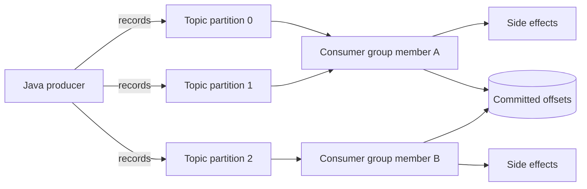
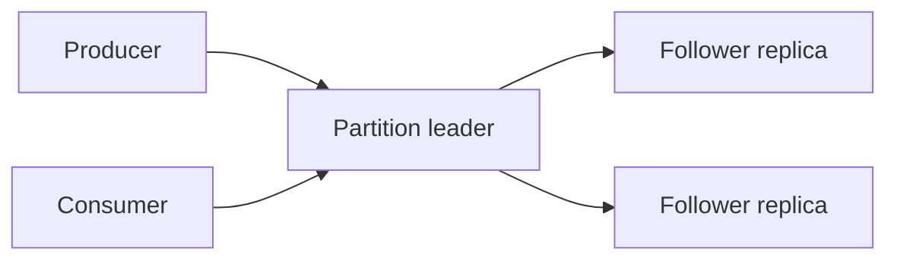
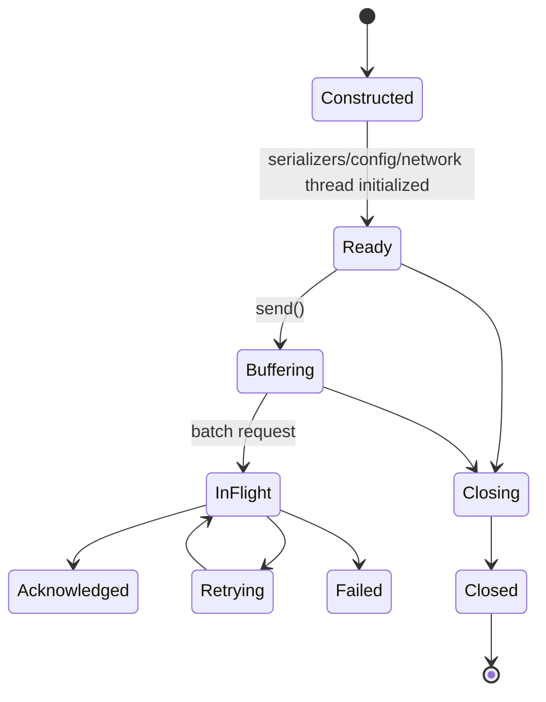
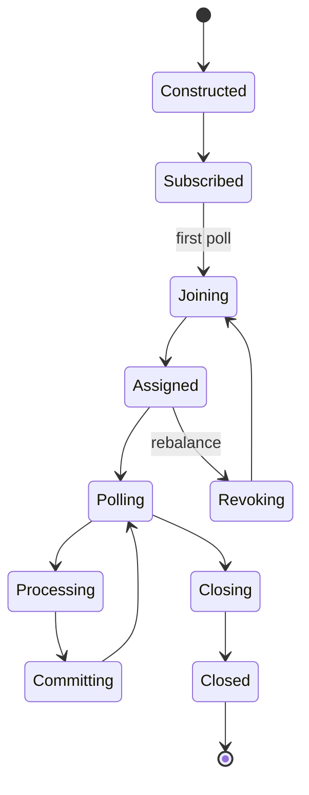
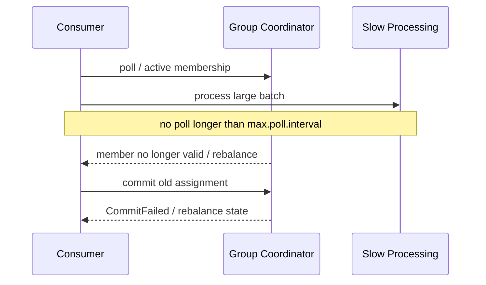
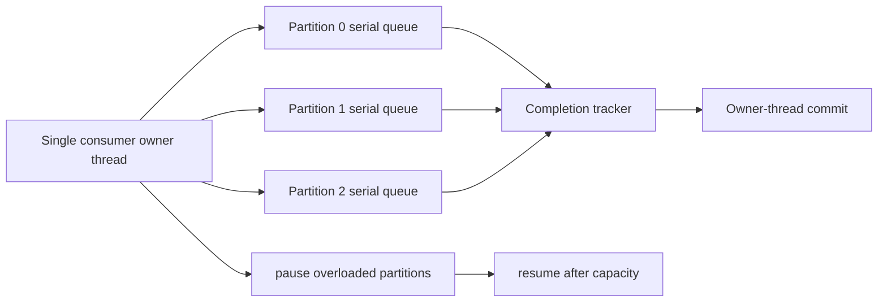
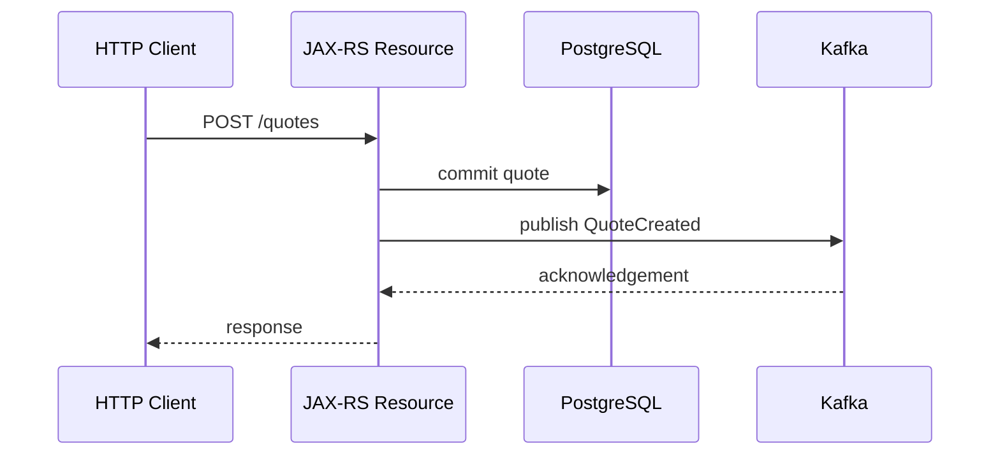

# Part 032 — Kafka Core: Producer, Consumer, Partition, and Offset Lifecycle

> Kafka bukan distributed method call dan bukan queue dengan satu global cursor. Kafka adalah replicated partitioned log. Correctness ditentukan oleh key, partition ownership, producer acknowledgement, consumer position, committed offset, processing side effects, rebalance, dan recovery. “Message sent” atau “message consumed” tidak cukup sebagai engineering statement sampai durability dan commit boundary-nya dijelaskan.

## Daftar Isi

1. [Target kompetensi](#target-kompetensi)
2. [Scope dan baseline](#scope-dan-baseline)
3. [Boundary dengan Part 033–035](#boundary-dengan-part-033035)
4. [Mental model Kafka](#mental-model-kafka)
5. [Event, record, dan log](#event-record-dan-log)
6. [Cluster, broker, controller, dan client](#cluster-broker-controller-dan-client)
7. [Topic](#topic)
8. [Partition](#partition)
9. [Offset](#offset)
10. [Record anatomy](#record-anatomy)
11. [Key dan partitioning](#key-dan-partitioning)
12. [Ordering guarantee](#ordering-guarantee)
13. [Replication, leader, follower, dan ISR](#replication-leader-follower-dan-isr)
14. [Retention dan compaction](#retention-dan-compaction)
15. [Producer lifecycle](#producer-lifecycle)
16. [Producer thread safety dan ownership](#producer-thread-safety-dan-ownership)
17. [`send()` asynchronous lifecycle](#send-asynchronous-lifecycle)
18. [Serialization](#serialization)
19. [Headers dan metadata](#headers-dan-metadata)
20. [Batching, `batch.size`, dan `linger.ms`](#batching-batchsize-dan-lingerms)
21. [Compression](#compression)
22. [`buffer.memory` dan `max.block.ms`](#buffermemory-dan-maxblockms)
23. [`acks`, replication, dan durability](#acks-replication-dan-durability)
24. [Retries dan `delivery.timeout.ms`](#retries-dan-deliverytimeoutms)
25. [Idempotent producer](#idempotent-producer)
26. [Producer transactions overview](#producer-transactions-overview)
27. [Producer error taxonomy](#producer-error-taxonomy)
28. [`flush()` dan `close()`](#flush-dan-close)
29. [Consumer lifecycle](#consumer-lifecycle)
30. [Consumer bukan thread-safe](#consumer-bukan-thread-safe)
31. [Subscription versus manual assignment](#subscription-versus-manual-assignment)
32. [Consumer group](#consumer-group)
33. [Partition assignment dan scaling](#partition-assignment-dan-scaling)
34. [`poll()` sebagai liveness contract](#poll-sebagai-liveness-contract)
35. [Heartbeat dan session timeout](#heartbeat-dan-session-timeout)
36. [`max.poll.interval.ms`](#maxpollintervalms)
37. [`max.poll.records` dan fetch sizing](#maxpollrecords-dan-fetch-sizing)
38. [Consumer position versus committed offset](#consumer-position-versus-committed-offset)
39. [Auto-commit](#auto-commit)
40. [Manual offset commit](#manual-offset-commit)
41. [Commit offset adalah next record](#commit-offset-adalah-next-record)
42. [`commitSync` versus `commitAsync`](#commitsync-versus-commitasync)
43. [At-most-once dan at-least-once](#at-most-once-dan-at-least-once)
44. [Processing models](#processing-models)
45. [One consumer per thread](#one-consumer-per-thread)
46. [Worker pool, pause, dan resume](#worker-pool-pause-dan-resume)
47. [Per-partition ordering dengan concurrency](#per-partition-ordering-dengan-concurrency)
48. [Rebalance lifecycle](#rebalance-lifecycle)
49. [`ConsumerRebalanceListener`](#consumerrebalancelistener)
50. [Eager, cooperative, dan static membership](#eager-cooperative-dan-static-membership)
51. [Offset reset, seek, dan replay](#offset-reset-seek-dan-replay)
52. [Lag](#lag)
53. [Poison records dan deserialization failure](#poison-records-dan-deserialization-failure)
54. [JAX-RS producer boundary](#jax-rs-producer-boundary)
55. [HTTP response semantics saat publish](#http-response-semantics-saat-publish)
56. [Consumer side effects dan database boundary](#consumer-side-effects-dan-database-boundary)
57. [Context propagation dan observability](#context-propagation-dan-observability)
58. [Authentication, authorization, dan TLS](#authentication-authorization-dan-tls)
59. [Startup, readiness, dan graceful shutdown](#startup-readiness-dan-graceful-shutdown)
60. [Kubernetes scaling](#kubernetes-scaling)
61. [Configuration governance](#configuration-governance)
62. [Failure-model matrix](#failure-model-matrix)
63. [Debugging playbook](#debugging-playbook)
64. [Testing strategy](#testing-strategy)
65. [Architecture patterns](#architecture-patterns)
66. [Anti-patterns](#anti-patterns)
67. [PR review checklist](#pr-review-checklist)
68. [Trade-off yang harus dipahami senior engineer](#trade-off-yang-harus-dipahami-senior-engineer)
69. [Internal verification checklist](#internal-verification-checklist)
70. [Latihan verifikasi](#latihan-verifikasi)
71. [Ringkasan](#ringkasan)
72. [Referensi resmi](#referensi-resmi)

---

## Target kompetensi

Setelah menyelesaikan part ini, Anda harus mampu:

- menjelaskan Kafka sebagai replicated partitioned append-only log;
- membedakan topic, partition, offset, key, record timestamp, header, dan consumer-group state;
- menjelaskan scope ordering: hanya di dalam satu partition;
- memilih key berdasarkan domain ordering dan distribution requirement;
- menjelaskan producer buffer, background I/O, batching, compression, acknowledgement, retry, dan delivery timeout;
- memahami bahwa `KafkaProducer` dapat dibagi antar-thread, sedangkan `KafkaConsumer` tidak thread-safe;
- menentukan lifecycle producer/consumer dari startup sampai graceful close;
- menjelaskan `poll()` sebagai contract untuk fetching, heartbeat/group progress, dan rebalance;
- membedakan current position dari committed offset;
- melakukan manual commit pada offset berikutnya setelah side effect selesai;
- memilih processing model yang menjaga ordering dan tidak membuat commit mendahului processing;
- mengenali duplicate, loss, lag, rebalance storm, partition skew, buffer exhaustion, dan poison record;
- memetakan Kafka producer/consumer lifecycle ke JAX-RS application lifecycle dan Kubernetes;
- mereview configuration berdasarkan correctness, latency, throughput, durability, dan operability;
- membuktikan internal Kafka topology/configuration melalui codebase dan platform evidence.

---

## Scope dan baseline

Baseline:

- Java 17+;
- Apache Kafka client modern;
- JAX-RS/Jersey service;
- Kafka producer dan/atau consumer embedded dalam application process;
- Kubernetes/cloud/on-prem deployment mungkin digunakan;
- OpenTelemetry/context propagation dari Part 023;
- resilience dari Part 024;
- authentication/service identity dari Part 025;
- schema governance dibahas pada Part 033;
- retry/DLQ/Streams/CDC/outbox dibahas pada Part 034;
- RabbitMQ dibahas pada Part 035.

Part ini **tidak mengasumsikan**:

- Kafka distribution/vendor tertentu;
- Kafka broker/client version tertentu;
- ZooKeeper atau KRaft deployment;
- serialization format;
- schema registry;
- exact producer/consumer defaults;
- exactly-once end-to-end;
- Spring Kafka;
- Kafka Streams;
- managed cloud service;
- one topic per aggregate;
- auto topic creation;
- partition count;
- replication factor;
- security protocol;
- group protocol/assignor;
- internal platform wrapper.

Kafka APIs dan defaults berkembang. Semua exact values harus diverifikasi dari client version, broker version, effective configuration, dan platform standard.

---

## Boundary dengan Part 033–035

| Part | Fokus |
|---|---|
| Part 032 | Core producer/consumer/topic/partition/offset lifecycle |
| Part 033 | Avro/JSON Schema/Protobuf, registry, compatibility, event ownership |
| Part 034 | retries, DLQ, idempotent consumers, transactions, Streams, CDC, outbox/inbox/saga |
| Part 035 | RabbitMQ, AMQP, RabbitMQ Stream, trade-offs |

Part 032 membahas idempotent producer dan transaction overview karena memengaruhi core lifecycle. End-to-end event-processing patterns dibahas lebih dalam pada Part 034.

---

## Mental model Kafka



Key distinctions:

```text
record offset        = location in one partition
consumer position    = next offset this consumer will fetch/return
committed offset     = recovery checkpoint for a consumer group
business completion  = side effect/invariant actually completed
```

These four values are not automatically identical.

---

## Event, record, dan log

Kafka stores records as bytes plus metadata. “Event” is a domain interpretation of a record.

A good event statement:

```text
QuotePriceCalculated v3 for quote Q123,
tenant T7,
caused by command C99,
recorded at event time E,
published with event id I.
```

A Kafka record alone does not guarantee:

- domain event is valid;
- schema compatible;
- consumer processed it;
- database side effect committed;
- external call completed;
- duplicate will not occur.

---

## Cluster, broker, controller, dan client

Conceptual components:

| Component | Responsibility |
|---|---|
| Broker | stores partition replicas and serves requests |
| Controller/quorum | cluster metadata and leadership management |
| Producer | serializes, partitions, batches, and publishes records |
| Consumer | fetches records and manages positions |
| Group coordinator | manages consumer-group membership and offsets |
| Admin client | creates/inspects topics and configuration |

Whether the cluster uses KRaft, a managed control plane, or older architecture is internal verification.

Application code should not couple to broker identity. Bootstrap servers are discovery entry points, not complete broker lists.

---

## Topic

Topic is a named logical stream.

Topic design decisions:

- semantic scope;
- ownership;
- partition count;
- replication;
- retention;
- compaction;
- max message size;
- ACL;
- schema subject strategy;
- consumer groups;
- deprecation.

A topic is not automatically one business transaction. Multiple records across topics/partitions may not be atomically visible unless transaction features are deliberately used.

---

## Partition

A partition is an ordered immutable log:

```text
partition 0:
offset 0 → offset 1 → offset 2 → offset 3 ...
```

Properties:

- each record gets one offset in one partition;
- a partition has one leader at a time;
- consumers in one group assign a partition to at most one ordinary group member at a time;
- partition count bounds ordinary consumer-group parallelism;
- increasing partition count can change key-to-partition mapping;
- partition count reduction is not a routine operation.

Partition is both:

- ordering domain;
- parallelism unit;
- recovery unit;
- throughput shard.

---

## Offset

Offset is a position within one partition, not a global sequence.

Never compare:

```text
topic-A partition-0 offset 100
topic-A partition-1 offset 99
```

to infer global order.

Offsets may have gaps because of:

- compacted records;
- aborted transactional records;
- retention;
- control batches/internal details;
- reading only committed records.

Code must not assume contiguous business sequence.

---

## Record anatomy

Conceptual record:

```java
ProducerRecord<String, byte[]> record = new ProducerRecord<>(
        "quote-events",
        null,                         // explicit partition or null
        System.currentTimeMillis(),   // timestamp or null
        tenantId + ":" + quoteId,     // key
        payloadBytes,
        headers
);
```

Fields:

| Field | Meaning |
|---|---|
| Topic | destination logical stream |
| Partition | explicit or selected by partitioner |
| Key | partitioning/compaction/domain identity input |
| Value | serialized payload |
| Timestamp | create/log-append semantics depending config |
| Headers | tracing, content type, event metadata |
| Offset | assigned by broker after append |

Do not place credentials or unbounded sensitive context in headers.

---

## Key dan partitioning

Default partition selection commonly uses key hashing when a key exists.

Key decision:

```text
Which records must be observed in order by the same consumer?
```

Examples:

| Requirement | Candidate key |
|---|---|
| Quote lifecycle ordering | `tenantId:quoteId` |
| Order lifecycle ordering | `tenantId:orderId` |
| Account balance ordering | `tenantId:accountId` |
| Tenant-global ordering | tenant ID, but risks hot partition |
| No relationship ordering | null/random distribution |

Bad key:

- low-cardinality status;
- current region;
- constant string;
- mutable attribute that changes during lifecycle;
- PII without hashing/governance;
- value causing one tenant to dominate a partition.

---

## Ordering guarantee

Kafka ordering guarantee is:

> Records acknowledged to a single partition are read in partition offset order.

Not guaranteed:

- global topic order;
- order across partitions;
- completion order when processing concurrently;
- database commit order across consumers;
- HTTP request order;
- event-time order;
- retry-topic order.

Application concurrency can break visible ordering even if fetch order is correct:

```text
offset 10 → worker slow
offset 11 → worker fast → side effect commits first
```

If per-aggregate ordering matters, keep same key and serialize processing per partition/key.

---

## Replication, leader, follower, dan ISR

Conceptual:



Durability depends on combination of:

- replication factor;
- in-sync replicas;
- `acks`;
- broker/topic `min.insync.replicas`;
- unclean leader election policy;
- disk/network health;
- producer timeout/error handling.

`acks=all` does not mean infinite durability. It means leader waits for the configured in-sync replication condition.

Internal verification must capture topic-level overrides, not just broker defaults.

---

## Retention dan compaction

Delete retention:

```text
records retained by time/size policy, independent of consumer acknowledgement
```

Kafka does not delete a record merely because one consumer read it.

Compaction:

```text
retains latest value per key over time, subject to compaction behavior
```

Compaction implications:

- keys are mandatory for meaningful compaction;
- tombstone values represent deletion semantics;
- old records may remain for some time;
- order is still per partition;
- compaction is not a database uniqueness constraint;
- replay result can differ depending starting offset and retained history.

Exact retention/compaction belongs to Part 033 governance and internal topic policy.

---

## Producer lifecycle



A producer owns:

- serializers;
- interceptors;
- buffer memory;
- metadata cache;
- accumulator/batches;
- network I/O thread;
- connections;
- metrics;
- optional transactional state.

Create it at application lifecycle scope, not per HTTP request.

---

## Producer thread safety dan ownership

`KafkaProducer` is designed to be thread-safe and shared.

Recommended:

```text
one configured producer instance per logical producer identity
```

Possible reasons for multiple producers:

- different credentials/cluster;
- different transactional identities;
- radically different serialization/config;
- strict traffic isolation.

Bad pattern:

```java
try (KafkaProducer<String, byte[]> producer = new KafkaProducer<>(props)) {
    producer.send(record).get();
}
```

per request causes:

- connection churn;
- metadata latency;
- lost batching;
- thread/resource churn;
- poor throughput;
- difficult shutdown.

DI scope must align with lifecycle.

---

## `send()` asynchronous lifecycle

```java
producer.send(record, (metadata, error) -> {
    if (error != null) {
        publishFailures.increment();
        log.error("Kafka publish failed", error);
        return;
    }

    log.debug(
            "Published topic={} partition={} offset={}",
            metadata.topic(),
            metadata.partition(),
            metadata.offset()
    );
});
```

`send()` normally:

1. validates/serializes;
2. obtains metadata if needed;
3. selects partition;
4. appends to local batch buffer;
5. returns a `Future`;
6. background I/O sends batch;
7. callback completes on acknowledgement/failure.

Important:

- synchronous errors may occur before return;
- asynchronous failure appears in future/callback;
- accepting into local buffer is not broker durability;
- callback must be fast and non-blocking;
- callback order follows producer rules per partition but application side effects in callback should be minimal.

---

## Serialization

Serializer transforms key/value to bytes.

Failure classes:

- unsupported domain value;
- schema mismatch;
- null handling;
- oversized record;
- non-deterministic serialization;
- time/decimal precision loss;
- PII leakage;
- incompatible headers.

Best boundary:

```text
domain model
  → explicit event DTO
  → schema validation
  → serializer
  → Kafka bytes
```

Do not serialize persistence entity or arbitrary polymorphic object graph.

Schema governance is Part 033.

---

## Headers dan metadata

Useful headers:

- trace context;
- correlation ID;
- causation ID;
- event ID;
- content type/schema version;
- producer service/version;
- tenant ID only if policy permits and authenticated.

Header caveats:

- duplicated keys may be allowed;
- header size contributes to record size;
- headers are not encrypted independently from transport/storage;
- consumers may ignore unknown headers;
- business-critical data should usually be in governed payload;
- do not trust tenant/user headers from arbitrary producers without ACL/identity policy.

---

## Batching, `batch.size`, dan `linger.ms`

Producer batches records per partition.

Trade-off:

```text
larger batches / linger
  → better throughput and compression
  → higher per-record latency and memory
```

`batch.size` is an upper target for per-partition batch allocation/aggregation. `linger.ms` allows waiting briefly for more records.

Batching already occurs under load even with small linger.

Tune with evidence:

- record size;
- active partitions;
- request rate;
- latency SLO;
- network efficiency;
- broker limits;
- buffer memory.

Do not copy internet tuning values.

---

## Compression

Common codecs depend on Kafka/client support and internal policy.

Compression benefits:

- network reduction;
- broker storage reduction;
- better batch throughput.

Costs:

- producer CPU;
- broker/consumer CPU depending flow;
- latency;
- decompression memory;
- compatibility/version constraints.

Compression effectiveness depends on batch size and payload similarity.

Monitor compression ratio, request size, CPU, and latency.

---

## `buffer.memory` dan `max.block.ms`

When producer sends faster than brokers accept, local buffer grows until bounded capacity.

At exhaustion:

- `send()` may block;
- metadata acquisition may also consume blocking budget;
- after `max.block.ms`, failure occurs.

This is application backpressure evidence.

Do not “solve” buffer exhaustion only by increasing memory. Investigate:

- broker/network latency;
- authorization;
- unavailable partitions;
- oversized records;
- publish rate;
- callback errors ignored;
- retry storm;
- cluster throttling.

For JAX-RS requests, blocking `send()` can consume request threads and propagate outage.

---

## `acks`, replication, dan durability

Conceptual:

| `acks` | Completion condition | Risk |
|---|---|---|
| `0` | no broker acknowledgement | loss invisible to client |
| `1` | leader acknowledges local append | leader loss can lose unreplicated data |
| `all`/`-1` | all required in-sync replicas acknowledge | stronger durability, higher latency/availability dependency |

`acks=all` should be considered with `min.insync.replicas`.

If available ISR drops below required minimum, produce may fail rather than accept less durable writes. That is a deliberate consistency/availability trade-off.

---

## Retries dan `delivery.timeout.ms`

Producer retries transient broker/network failures internally.

Modern guidance emphasizes bounding total delivery time with `delivery.timeout.ms`, while request and retry timing fit inside it.

Failure reasoning:

```text
send time
  + batching delay
  + request attempts
  + retry backoff
  ≤ delivery timeout
```

Application-level re-send after an ambiguous producer result can create duplicates, because producer idempotence covers a producer session/protocol sequence, not arbitrary reconstructed business sends across sessions.

Classify exceptions as:

- retriable by client internally;
- abortable transaction;
- fatal producer state;
- authorization/configuration;
- serialization/application;
- timeout with ambiguous outcome.

---

## Idempotent producer

Idempotent producer prevents duplicates caused by producer protocol retries within supported session semantics.

It does **not** prevent:

- application publishes the same business event twice;
- process restarts and reconstructs same event without event identity;
- two service instances publish same logical event;
- database commit and Kafka publish diverge;
- consumer side effect duplicates.

Use stable event IDs and downstream idempotency.

Modern clients commonly enable idempotence by default when compatible configs are used; exact effective config must be verified.

---

## Producer transactions overview

Transactional producer can atomically publish records across multiple partitions/topics, and can include consumer offsets in consume-transform-produce flows.

It does not make PostgreSQL and Kafka one atomic transaction.

Requires:

- unique stable `transactional.id` per active producer identity;
- fencing understanding;
- `initTransactions`;
- begin/commit/abort lifecycle;
- `read_committed` consumers for transactional visibility;
- topic durability;
- failure-state handling.

Deep patterns are in Part 034.

---

## Producer error taxonomy

| Error category | Example | Response |
|---|---|---|
| Serialization | invalid DTO/schema | reject/quarantine before retry |
| Authorization | topic/transaction denied | fail fast, fix identity/policy |
| Unknown topic/partition | missing or metadata issue | platform check; avoid blind retry |
| Record too large | exceeds client/broker/topic limits | redesign payload/chunk/object storage |
| Buffer exhaustion | downstream slower than publish rate | shed/throttle/investigate cluster |
| Retriable network/broker | leader transition/timeouts | client retry within budget |
| Fatal producer | fencing/out-of-order state | close and recreate/restart |
| Delivery timeout | no ack in total budget | outcome may be ambiguous |
| Callback bug | application exception | isolate; do not corrupt producer thread |

Expose the original Kafka exception category in internal telemetry, but map safely at API boundaries.

---

## `flush()` dan `close()`

`flush()` waits for buffered sends existing at invocation to complete. It is expensive on hot paths and harms batching.

Use cases:

- controlled test;
- explicit synchronization boundary;
- graceful shutdown;
- rare command requiring acknowledgement before next local action.

`close(timeout)`:

- stops accepting new work;
- attempts to complete pending sends;
- closes network/resources;
- may fail/timeout.

Shutdown sequence:

```text
stop ingress
  → stop creating records
  → wait bounded in-flight application work
  → flush/close producer
  → report incomplete sends
  → terminate
```

Never rely only on JVM process exit.

---

## Consumer lifecycle



A consumer owns:

- network connections;
- group membership;
- assignment;
- fetch buffers;
- current positions;
- commit requests;
- deserializers/interceptors;
- metrics.

---

## Consumer bukan thread-safe

`KafkaConsumer` is not thread-safe.

Safe pattern:

```text
one owner thread performs subscribe/poll/commit/pause/resume/close
```

`wakeup()` is designed as a thread-safe mechanism to interrupt a blocking consumer operation for shutdown.

Do not:

- inject one consumer singleton into request threads;
- call `commitSync` from worker threads;
- call `pause` concurrently without ownership protocol;
- interrupt randomly and assume clean close.

---

## Subscription versus manual assignment

`subscribe(...)`:

- uses consumer-group coordination;
- partitions assigned dynamically;
- rebalances on membership/topic changes;
- committed group offsets used for recovery.

`assign(...)`:

- application chooses partitions;
- no ordinary dynamic group assignment;
- useful for specialized replay/tooling;
- application owns partition allocation and failover.

Do not mix `subscribe` and `assign` in one lifecycle.

---

## Consumer group

Consumer group defines an independent logical view of a topic.

```text
group quote-projection
group billing
group fraud-screening
```

Each group maintains its own committed offsets.

Within one ordinary group:

- one partition assigned to at most one member;
- one member may own multiple partitions;
- more consumers than partitions creates idle members;
- adding partitions increases possible parallelism;
- changing group ID creates a new consumption lineage.

Group ID is durable business configuration, not random deployment identifier.

---

## Partition assignment dan scaling

Example:

```text
6 partitions
2 consumers → ~3 partitions each
6 consumers → ~1 partition each
10 consumers → 4 idle
```

Actual balance depends on assignor and topic subscription.

Scaling consumer pods cannot exceed partition parallelism for a group.

Partition-count decisions affect:

- throughput;
- ordering granularity;
- recovery time;
- open files/connections;
- producer batching;
- consumer assignment;
- future key mapping;
- operational cost.

---

## `poll()` sebagai liveness contract

`poll(Duration)` does more than fetch records:

- joins group;
- drives assignment/rebalance callbacks;
- advances consumer position;
- services network/group protocol;
- returns buffered/fetched records;
- demonstrates application progress relative to `max.poll.interval.ms`.

A consumer that processes too long without polling can lose assignment even if process is alive.

The poll loop is a protocol state machine, not an ordinary iterator.

---

## Heartbeat dan session timeout

Heartbeats indicate membership liveness.

If broker/coordinator does not receive heartbeats within session timeout, member is considered failed and partitions are reassigned.

Exact heartbeat behavior differs by consumer-group protocol/version. Verify:

- `group.protocol`;
- client/broker version;
- broker-controlled heartbeat settings;
- session timeout ranges;
- static membership.

Do not tune heartbeat/session in isolation from network, GC pauses, CPU throttling, and deployment termination.

---

## `max.poll.interval.ms`

This bounds the maximum delay between poll calls for group-managed consumers.

Failure sequence:



Options:

- reduce records per poll;
- make processing faster/bounded;
- increase interval with explicit worst-case evidence;
- move processing to workers while owner thread keeps polling;
- pause partitions and coordinate commits;
- split workload/topic.

Increasing timeout only hides unbounded processing.

---

## `max.poll.records` dan fetch sizing

`max.poll.records` limits records returned per poll, not necessarily underlying fetch bytes cached by client.

Related concerns:

- `fetch.min.bytes`;
- `fetch.max.wait.ms`;
- `max.partition.fetch.bytes`;
- `fetch.max.bytes`;
- broker/topic max record size.

Set based on:

```text
max records × worst-case processing duration < poll interval budget
```

Also account for variable record size, deserialization memory, and side-effect latency.

---

## Consumer position versus committed offset

Example:

```text
poll returns offsets 10, 11, 12
consumer position becomes 13
processing has completed only through 10
committed offset remains 10
```

After crash, recovery begins from committed offset according to semantics, possibly replaying records.

Do not commit `position()` blindly if workers are still processing earlier records.

---

## Auto-commit

With auto-commit, client periodically commits offsets according to its current consumed position.

Risk:

```text
poll returns records
auto-commit occurs
application crashes before side effects finish
restart begins after committed offsets
records effectively lost to this group
```

Auto-commit can be acceptable only for workloads where:

- processing is trivial and synchronous inside poll loop;
- loss semantics are explicitly accepted;
- framework behavior is fully understood.

For enterprise side effects, manual commit is usually more reviewable.

---

## Manual offset commit

Core pattern:

```java
while (running.get()) {
    ConsumerRecords<String, QuoteEvent> records =
            consumer.poll(Duration.ofMillis(500));

    Map<TopicPartition, OffsetAndMetadata> completed = new HashMap<>();

    for (ConsumerRecord<String, QuoteEvent> record : records) {
        process(record); // must complete or throw
        completed.put(
                new TopicPartition(record.topic(), record.partition()),
                new OffsetAndMetadata(record.offset() + 1)
        );
    }

    consumer.commitSync(completed);
}
```

This is simple but serial. Production code must handle per-partition completion, retries, and rebalance.

---

## Commit offset adalah next record

After successfully processing offset 42, commit 43.

```text
committed offset = next record to process
```

Off-by-one errors cause:

- reprocessing last record forever;
- skipping one record;
- confusing lag metrics.

Use `ConsumerRecords.nextOffsets()` where suitable and available in the client version, while still ensuring all corresponding records actually completed.

---

## `commitSync` versus `commitAsync`

| Method | Benefit | Risk |
|---|---|---|
| `commitSync` | clear success/failure before continue | blocks poll loop |
| `commitAsync` | lower latency | callback ordering/failure handling complexity |
| async during loop + sync on revoke/close | common compromise | implementation must track correct offsets |

`commitAsync` callbacks may arrive after later commits. Never let an older callback overwrite newer durable progress in an external offset store.

Kafka group offset commits are not business transaction commits.

---

## At-most-once dan at-least-once

At-most-once pattern:

```text
commit offset
  → process
```

Failure after commit loses processing.

At-least-once pattern:

```text
process side effect
  → commit offset
```

Failure between side effect commit and offset commit produces duplicate processing.

No ordering of two independent commits eliminates both.

Therefore:

- make side effects idempotent;
- use inbox/deduplication;
- use Kafka transactions for Kafka-to-Kafka flow;
- use outbox/inbox/reconciliation for DB integration.

Deep patterns: Part 034.

---

## Processing models

### Model A — poll and process synchronously

Simple, preserves partition order, but throughput and poll interval constrained.

### Model B — one consumer per thread

Each thread owns one consumer. Easy ownership, more connections/group members.

### Model C — one poll thread, worker pool

Higher utilization, but commit and partition-order coordination become difficult.

### Model D — partition-affine worker

Poll owner dispatches each partition to one serial queue. Better order semantics, more machinery.

### Model E — framework/container listener

Framework manages poll/commit. Must inspect actual ack mode and error handler; do not assume.

---

## One consumer per thread

Benefits:

- no synchronization around consumer;
- simple commits;
- partition ordering natural;
- failure scope clear.

Costs:

- consumer count;
- network connections;
- rebalance members;
- idle consumers beyond partition count;
- resource overhead.

Suitable when partition count and processing concurrency align.

---

## Worker pool, pause, dan resume

A safe-ish architecture:



Rules:

- only owner thread calls consumer API;
- bounded worker queues;
- pause before queue overflow;
- continue polling to maintain membership as required;
- commit only contiguous completed offsets per partition;
- on revoke, stop dispatch and settle/commit safely;
- pause state may need reapplication after rebalance;
- shutdown drains within termination budget.

---

## Per-partition ordering dengan concurrency

Completion tracker:

```text
partition 0 dispatched: 10,11,12
completed: 10 and 12
safe commit: 11
cannot commit 13 because 11 unfinished
```

Track highest **contiguous** completed offset, not maximum completed offset.

Key-level concurrency inside a partition is possible only with more complex sequencing; it can violate aggregate order and should be justified.

---

## Rebalance lifecycle

Rebalance happens when:

- member joins/leaves/fails;
- subscription/topic metadata changes;
- partition count changes;
- assignor/protocol requires;
- static member fencing/misconfiguration;
- max poll interval exceeded.

During rebalance:

- partitions may be revoked;
- in-flight work may still exist;
- commit can fail if assignment lost;
- new member starts from committed offset;
- duplicates can occur.

Treat rebalance as normal lifecycle, not exceptional noise.

---

## `ConsumerRebalanceListener`

Responsibilities commonly include:

### On partitions revoked

- stop dispatching new work for revoked partitions;
- wait bounded for in-flight work;
- commit safe contiguous offsets;
- release partition-local resources;
- checkpoint state.

### On partitions assigned

- initialize partition state;
- inspect committed offsets;
- optionally seek according to controlled replay;
- restore pause state/caches;
- start processing.

Callbacks run in consumer control flow. Long callbacks delay group progress.

---

## Eager, cooperative, dan static membership

Eager rebalance:

- partitions broadly revoked and reassigned;
- simpler model;
- larger stop-the-world effect.

Cooperative/incremental rebalance:

- tries to minimize revoked partitions;
- requires compatible assignor/config and correct callbacks;
- does not remove need for in-flight coordination.

Static membership (`group.instance.id`):

- can reduce rebalances on transient restarts;
- identity must be unique and stable;
- duplicate instance IDs cause fencing;
- delayed failure detection can retain partitions longer.

Kafka 4.x also evolves group protocols. Verify exact client/broker behavior and upgrade plan.

---

## Offset reset, seek, dan replay

When no committed offset or offset is out of retention:

- `auto.offset.reset` policy applies;
- earliest/latest/other supported modes vary by client version;
- `none` can force explicit failure.

`seek` changes next fetch position.

Replay must define:

- start/end offsets or timestamp;
- group ID;
- side-effect isolation;
- idempotency;
- output destination;
- rate limit;
- production traffic interaction;
- audit;
- stop criteria.

Never replay production side effects with an ad hoc group ID.

---

## Lag

Partition lag conceptually:

```text
log end offset - consumer position/committed offset
```

But choose metric carefully:

- current position lag;
- committed lag;
- oldest-event age;
- processing completion lag;
- end-to-end business latency.

High lag can mean:

- traffic spike;
- slow dependency;
- poison record;
- partition skew;
- too few partitions/consumers;
- rebalance loop;
- consumer paused;
- broker fetch problem;
- GC/CPU throttling;
- oversized records.

Zero lag does not prove side effects are correct.

---

## Poison records dan deserialization failure

If deserialization occurs inside `poll()`, one bad record can prevent progress before application sees a usable object.

Strategies:

- deserialize to bytes/envelope then validate explicitly;
- error-handling deserializer/framework if used;
- capture topic/partition/offset and safe metadata;
- quarantine raw bytes subject to security policy;
- do not commit past unknown failed record silently;
- define skip/DLQ authorization and audit.

Schema governance and DLQ patterns are covered next.

---

## JAX-RS producer boundary

Example application flow:



This naïve dual write can diverge:

- DB commits, Kafka fails;
- Kafka publishes, DB rolls back;
- HTTP times out after both succeed;
- client retries and creates duplicate event.

Prefer transactional outbox for DB-first domain changes; Part 034.

---

## HTTP response semantics saat publish

Possible contracts:

### Synchronous publish acknowledgement

Return success only after Kafka acknowledgement.

Benefit: caller knows broker accepted according to `acks`.

Risk: HTTP latency/coupling; DB dual-write still unresolved.

### `202 Accepted`

Persist command/outbox, then process asynchronously.

Benefit: bounded HTTP path and recoverability.

Requirement: status resource, idempotency, durable acceptance.

### Fire-and-forget local buffer

Return after `send()` without waiting.

This proves only local acceptance and is usually insufficient for critical command semantics unless explicitly documented.

Do not call a request successful merely because `send()` returned a future.

---

## Consumer side effects dan database boundary

Example:

```text
poll record
  → begin DB transaction
  → check inbox/event ID
  → apply state transition
  → record processed event
  → commit DB
  → commit Kafka offset
```

Crash after DB commit but before offset commit causes replay; inbox makes replay harmless.

Never keep Kafka poll thread blocked in unbounded external calls without `max.poll.interval` reasoning.

---

## Context propagation dan observability

Producer:

- inject trace context into headers;
- create producer span;
- record topic, operation, error;
- avoid high-cardinality event IDs as metric labels.

Consumer:

- extract context;
- create consumer/process span;
- use span links for batch/replay when parent semantics do not fit;
- propagate correlation/causation IDs;
- clear MDC after each record;
- record partition/offset in logs, not necessarily metric labels.

Useful metrics:

- send rate/error/retry;
- request latency;
- buffer available;
- batch size/compression;
- record size;
- consumer lag;
- poll interval;
- commit latency/failure;
- records processed/failed;
- rebalance count/duration;
- queue depth/in-flight work;
- paused partitions.

Kafka Java clients expose built-in metrics; integrate through platform standard.

---

## Authentication, authorization, dan TLS

Possible protocols:

- TLS server authentication;
- mTLS;
- SASL mechanisms;
- managed cloud identity;
- OAuth bearer depending platform.

Authorization controls:

- topic read/write;
- consumer group access;
- transactional ID;
- cluster/admin operations.

Internal verification:

- truststore/keystore source;
- certificate rotation;
- SASL callback/provider;
- secret handling;
- ACL provisioning;
- tenant isolation;
- producer/consumer principal names;
- DNS/private endpoint.

Never log JAAS config, tokens, keys, or full certificates.

---

## Startup, readiness, dan graceful shutdown

Producer readiness:

- config valid;
- credentials loaded;
- optional metadata/health check policy;
- producer initialized;
- transactional producer initialized if used.

Consumer readiness needs nuance:

- process alive;
- subscription configured;
- joined group;
- assignment received;
- dependencies ready;
- not permanently failed.

Do not make readiness flap on transient rebalance unless platform policy requires.

Graceful consumer shutdown:

```java
final class ConsumerLoop implements Runnable {
    private final AtomicBoolean closing = new AtomicBoolean();
    private final KafkaConsumer<String, QuoteEvent> consumer;

    void shutdown() {
        closing.set(true);
        consumer.wakeup();
    }

    @Override
    public void run() {
        try {
            while (!closing.get()) {
                var records = consumer.poll(Duration.ofMillis(500));
                process(records);
            }
        } catch (WakeupException e) {
            if (!closing.get()) {
                throw e;
            }
        } finally {
            commitSafeProgress();
            consumer.close();
        }
    }
}
```

Sequence:

1. mark not-ready/stop new external work;
2. stop consumer dispatch;
3. wake poll;
4. drain bounded in-flight work;
5. commit safe offsets;
6. close consumer;
7. close producer;
8. terminate before Kubernetes grace expires.

---

## Kubernetes scaling

Consumer replicas:

```text
desired replicas ≤ useful partition parallelism
```

Consider:

- rolling update temporarily adds members;
- short termination grace causes duplicate replay;
- HPA based only on CPU ignores lag;
- scale-up causes rebalance;
- scale-down revokes partitions;
- pod identity/static membership;
- PDB and node drains;
- consumer startup time;
- partition skew;
- max poll versus CPU throttling.

Useful autoscaling signals:

- lag per partition;
- oldest record age;
- processing throughput;
- in-flight queue;
- dependency saturation.

Avoid scaling faster than rebalance and stabilization can converge.

---

## Configuration governance

Effective producer configuration inventory:

- bootstrap servers;
- client ID;
- serializers;
- acks;
- idempotence;
- delivery/request timeout;
- retry backoff;
- linger/batch;
- compression;
- buffer/max block;
- max request size;
- security;
- transactional ID.

Consumer inventory:

- group ID;
- client ID;
- deserializers;
- auto-commit;
- offset reset;
- session/max poll;
- group protocol;
- assignor/static membership;
- max poll records;
- fetch sizes;
- isolation level;
- security.

Rules:

- typed configuration;
- startup validation;
- secrets referenced, not embedded;
- version-controlled defaults;
- environment overrides audited;
- effective config logged with redaction;
- compatibility with broker version tested.

---

## Failure-model matrix

| Failure | Effect | Detection | Response |
|---|---|---|---|
| Wrong key | broken ordering/hot partition | distribution and domain mismatch | migrate producer/key strategy carefully |
| Too few partitions | throughput ceiling | lag, maxed consumers | planned partition/topic evolution |
| Too many partitions | overhead/rebalance cost | broker/client metrics | capacity governance |
| Producer buffer exhausted | request blocking/failure | buffer metrics, timeout | throttle/shed/fix cluster |
| Record too large | publish rejected | exception/size metric | object storage/chunk/redesign |
| Authorization failure | no publish/consume | auth exception | fail fast, fix ACL/identity |
| Delivery timeout | ambiguous publish | callback/future | event ID/reconciliation |
| Producer not closed | resource leak/lost buffered sends | shutdown logs | lifecycle ownership |
| Consumer accessed concurrently | runtime errors/corruption | exceptions | single owner thread |
| Processing exceeds poll interval | rebalance/commit failure | poll metrics/rebalances | bound work/pause/workers |
| Auto-commit before side effect | effective message loss | audit mismatch | manual commit |
| Commit after side effect fails | duplicate replay | inbox/duplicate metrics | idempotent consumer |
| Commit maximum completed offset | skips unfinished records | state gap | contiguous per-partition tracker |
| Rebalance with in-flight work | duplicates/races | revoke logs | coordinated revoke |
| Poison deserialization | partition stuck | repeated same offset | controlled quarantine |
| Partition skew | one hot lagging partition | per-partition lag | key redesign/load isolation |
| Retention deletes unread records | unrecoverable gap | offset out of range | retention/capacity governance |
| Consumer group ID changed | unexpected replay/skip | new group offsets | immutable governed group ID |
| Shutdown too short | duplicates/lost buffered sends | termination logs | aligned grace/drain |
| Trace context leaks | wrong correlation | cross-event traces | context scope/cleanup |

---

## Debugging playbook

### Producer cannot publish

Check:

1. DNS/network/TLS;
2. authentication/ACL;
3. topic exists and partition leaders;
4. serializers;
5. record size;
6. buffer and `max.block`;
7. metadata age;
8. callback/future exceptions;
9. broker throttling;
10. effective acks/idempotence/timeouts.

### Publish latency increases

Correlate:

- request latency;
- batch/linger;
- broker request latency;
- retries;
- ISR/min ISR;
- network;
- compression CPU;
- buffer pressure;
- metadata refresh;
- cluster throttling.

### Consumer has no records

Check:

- topic/partition;
- subscription pattern;
- group ID;
- assignment;
- committed offsets;
- offset reset;
- ACL;
- paused partitions;
- isolation level;
- producer actually published;
- retention/compaction.

### Lag grows

Per partition:

```text
input rate
processing rate
oldest record age
assigned consumer
pause state
error/retry
side-effect latency
```

Then inspect hot keys, worker queues, DB/external dependencies, rebalances, and CPU throttling.

### Rebalance loop

Check:

- member start/stop;
- max poll exceeded;
- session timeout;
- network/GC;
- rolling deployment;
- assignor mismatch;
- duplicate static instance ID;
- subscription changes;
- broker coordinator health.

### Duplicate side effects

Trace event ID:

- producer duplicate;
- same record replayed;
- offset commit failed;
- rebalance;
- process crash;
- retry/DLQ;
- business command duplicate.

Kafka offset alone is not a universal event ID.

### Apparent message loss

Verify:

- correct topic/partition/group;
- committed offset;
- auto-commit;
- retention;
- offset reset;
- transaction isolation;
- deserialization skip;
- DLQ/quarantine;
- side effect audit;
- wrong environment/cluster.

---

## Testing strategy

### Unit tests

- key selection;
- serialization;
- header propagation;
- event ID;
- partition-affine completion tracker;
- error classification;
- config validation.

### Integration tests with real Kafka

Use containerized Kafka or approved test cluster for:

- produce/consume;
- partitioning;
- manual commit;
- restart/replay;
- rebalance;
- security if feasible;
- large record rejection;
- transactional visibility;
- graceful shutdown.

Mocks do not model group coordination, offsets, and broker errors.

### Failure tests

- broker unavailable;
- leader change;
- authorization revoked;
- serializer fails;
- consumer killed after DB commit before offset commit;
- worker exceeds poll interval;
- rebalance during in-flight work;
- poison record;
- retention gap;
- producer close timeout.

### Ordering tests

Publish interleaved events for multiple aggregates. Prove:

- same key stays ordered;
- different keys may interleave;
- worker concurrency preserves required aggregate order;
- retry/replay does not violate state-machine invariant.

### Load tests

Measure:

- records/sec;
- bytes/sec;
- producer request/batch/compression;
- p95/p99 publish latency;
- buffer pressure;
- consumer throughput;
- lag convergence;
- rebalance recovery;
- DB/external saturation.

---

## Architecture patterns

### Pattern 1 — Application-scoped producer

```text
DI singleton/application scope
  → shared KafkaProducer
  → bounded close during shutdown
```

### Pattern 2 — Single-owner consumer loop

All consumer APIs remain on one dedicated owner thread.

### Pattern 3 — Partition-affine workers

Each assigned partition has a serial bounded processing lane.

### Pattern 4 — Contiguous completion commit

Commit only the next offset after all preceding offsets complete.

### Pattern 5 — Durable acceptance

HTTP command persists state/outbox before returning `202`.

### Pattern 6 — Event envelope

```json
{
  "eventId": "uuid",
  "eventType": "QuotePriceCalculated",
  "eventVersion": 3,
  "tenantId": "tenant-7",
  "aggregateId": "quote-123",
  "occurredAt": "2026-07-11T12:00:00Z",
  "causationId": "command-99",
  "correlationId": "journey-8",
  "payload": {}
}
```

Exact contract is Part 033.

---

## Anti-patterns

- creating producer per request;
- sharing consumer across threads;
- treating topic as one globally ordered queue;
- using null/random key when aggregate order matters;
- constant key for all events;
- returning HTTP success immediately after local `send()` for critical commands;
- ignoring send callback/future;
- calling `flush()` after every record;
- unbounded producer buffer assumptions;
- auto-commit with non-trivial side effects;
- committing highest completed offset when earlier record unfinished;
- long blocking processing in poll thread without budget;
- increasing `max.poll.interval` instead of bounding work;
- random group IDs in production;
- relying on `latest` offset reset for correctness;
- replaying with production side effects without isolation;
- treating lag zero as business correctness;
- logging full payloads and credentials;
- HPA scaling beyond partitions;
- no graceful consumer revoke/shutdown;
- claiming exactly-once without defining side-effect boundary.

---

## PR review checklist

### Topic, key, dan ordering

- [ ] Topic owner and semantic scope clear?
- [ ] Key chosen from ordering requirement?
- [ ] Hot-key/tenant skew considered?
- [ ] Partition count and scaling assumptions documented?
- [ ] Global-order assumptions absent?
- [ ] Compaction/retention semantics understood?

### Producer

- [ ] Producer lifecycle application-scoped?
- [ ] Send failures observed?
- [ ] `acks`, idempotence, delivery timeout effective config known?
- [ ] Batching/compression intentional?
- [ ] Buffer exhaustion behavior handled?
- [ ] Record size bounded?
- [ ] Event ID stable?
- [ ] Shutdown flush/close bounded?
- [ ] Transactional ID unique if used?

### Consumer

- [ ] Consumer single-thread ownership?
- [ ] Group ID stable and governed?
- [ ] Auto-commit disabled for side effects?
- [ ] Commit happens after completion?
- [ ] Offset +1 semantics correct?
- [ ] Multi-thread completion contiguous per partition?
- [ ] Poll interval budget proven?
- [ ] Pause/resume queues bounded?
- [ ] Rebalance callbacks handle in-flight work?
- [ ] Shutdown uses wakeup/drain/commit/close?

### Correctness

- [ ] Duplicate processing policy?
- [ ] Loss semantics?
- [ ] DB/Kafka atomicity gap addressed?
- [ ] Poison record policy?
- [ ] Replay contract?
- [ ] Ordering policy?
- [ ] Old/new event compatibility delegated to governed schema?

### Operations

- [ ] Per-partition lag dashboard?
- [ ] Producer errors/retries/buffer metrics?
- [ ] Consumer poll/commit/rebalance metrics?
- [ ] Topic/ACL provisioning owned?
- [ ] Runbooks for lag, auth, poison, retention gap?
- [ ] Kubernetes grace/HPA aligned?
- [ ] Effective config visible with redaction?

---

## Trade-off yang harus dipahami senior engineer

| Decision | Benefit | Cost/risk |
|---|---|---|
| More partitions | higher parallelism | overhead, ordering granularity, rebalance |
| Stable aggregate key | preserves order | hot aggregate remains serial |
| Null key | distribution | no aggregate ordering |
| `acks=all` | stronger durability | latency and availability dependence |
| Idempotent producer | retry duplicate protection | not business deduplication |
| Larger batch/linger | throughput/compression | latency/memory |
| Compression | lower network/storage | CPU/latency |
| Shared producer | batching/resource efficiency | shared failure/config scope |
| Consumer per thread | simple ownership | more clients/resources |
| Worker pool | parallel processing | commit/order/rebalance complexity |
| Manual commit | explicit processing boundary | more code/failure handling |
| Auto-commit | simplicity | potential loss semantics |
| Sync commit | clear result | poll-loop blocking |
| Async commit | throughput | callback/order complexity |
| Static membership | fewer transient rebalances | identity/fencing complexity |
| Cooperative rebalance | less disruption | compatibility/callback complexity |
| Larger poll interval | tolerates slow batch | slower failure/rebalance detection |
| Smaller max poll records | bounded processing | lower batch efficiency |
| Longer retention | replay safety | storage cost |
| Compaction | latest-state reconstruction | not full history |
| Synchronous HTTP publish | acknowledgement evidence | latency/coupling |
| Durable async acceptance | recoverability | status/idempotency architecture |

---

## Internal verification checklist

### Cluster dan platform

- [ ] Kafka vendor/distribution.
- [ ] Broker version.
- [ ] Client version and compatibility policy.
- [ ] KRaft/managed topology.
- [ ] Regions/AZs.
- [ ] Bootstrap endpoints and private DNS.
- [ ] Topic creation ownership.
- [ ] Auto-create topics setting.
- [ ] Monitoring platform.
- [ ] Upgrade process.

### Topic configuration

- [ ] Topic inventory and owners.
- [ ] Partition count.
- [ ] Replication factor.
- [ ] `min.insync.replicas`.
- [ ] Retention time/size.
- [ ] Cleanup policy/compaction.
- [ ] Max message size.
- [ ] Compression policy.
- [ ] ACLs.
- [ ] Naming/deprecation policy.

### Producer

- [ ] Producer wrapper/factory.
- [ ] Scope and shutdown.
- [ ] Serializers/interceptors.
- [ ] Key strategy.
- [ ] `acks`.
- [ ] idempotence.
- [ ] retries/delivery timeout/request timeout.
- [ ] batch/linger/compression.
- [ ] buffer/max block.
- [ ] max request size.
- [ ] transactional IDs.
- [ ] callback/error handling.
- [ ] metrics/tracing.

### Consumer

- [ ] Consumer framework or raw client.
- [ ] Group IDs.
- [ ] `group.protocol`.
- [ ] assignor.
- [ ] static membership.
- [ ] auto-commit/ack mode.
- [ ] poll interval/session timeout.
- [ ] max poll records/fetch sizes.
- [ ] isolation level.
- [ ] concurrency model.
- [ ] pause/resume.
- [ ] commit tracker.
- [ ] rebalance callbacks.
- [ ] poison policy.
- [ ] shutdown sequence.

### Security

- [ ] TLS/mTLS/SASL mechanism.
- [ ] Credential source/rotation.
- [ ] Principal naming.
- [ ] Topic/group/transactional-ID ACL.
- [ ] Certificate trust.
- [ ] Secret redaction.
- [ ] Tenant authorization assumptions.

### Operations

- [ ] Producer/consumer dashboards.
- [ ] Per-partition lag and oldest age.
- [ ] Rebalance alerts.
- [ ] Buffer exhaustion alerts.
- [ ] DLQ/quarantine ownership.
- [ ] Retention-gap runbook.
- [ ] Replay approval process.
- [ ] Kubernetes termination grace.
- [ ] HPA signal and stabilization.
- [ ] Incident escalation.

---

## Latihan verifikasi

### Latihan 1 — Trace one record

For one real event, identify:

1. domain trigger;
2. event DTO;
3. serializer/schema;
4. key;
5. selected partition;
6. producer acknowledgement;
7. consumer group;
8. polled offset;
9. side effect;
10. committed offset;
11. trace/correlation IDs.

### Latihan 2 — Effective configuration

Dump/redact effective producer and consumer config. Compare with platform defaults and documentation. Identify values inherited implicitly.

### Latihan 3 — Crash boundary

Run consumer:

1. process DB side effect;
2. kill process before offset commit;
3. restart;
4. prove duplicate replay;
5. add inbox/idempotency;
6. prove safe replay.

### Latihan 4 — Poll interval failure

Make processing exceed `max.poll.interval.ms`. Observe rebalance, commit failure, and duplicate behavior. Then redesign with bounded records or worker coordination.

### Latihan 5 — Partition ordering

Publish 100 events for two aggregate keys. Run with multiple consumers/workers. Prove per-key order or document where application concurrency breaks it.

### Latihan 6 — Buffer exhaustion

Throttle/unavailable broker in a test environment. Observe producer buffer, blocking, `max.block.ms`, request-thread impact, and graceful degradation.

### Latihan 7 — Rebalance during work

Scale consumer group while records are in flight. Verify revoke handling and safe contiguous offset commit.

### Latihan 8 — Graceful Kubernetes shutdown

Terminate a consumer pod. Measure:

- readiness removal;
- wakeup latency;
- in-flight drain;
- commit;
- leave/rebalance;
- duplicate count;
- total termination time.

---

## Ringkasan

- Kafka is a replicated partitioned log, not a global queue or distributed method call.
- Topic partitions define ordering, parallelism, and recovery units.
- Offsets are partition-local positions.
- Key selection is a domain correctness decision.
- Ordering is guaranteed only within a partition; concurrent side effects can still reorder completion.
- Durability depends on replication, ISR, acks, and topic/broker policies.
- `KafkaProducer` owns buffers and a background I/O thread and is generally shared/thread-safe.
- `send()` is asynchronous; local buffering is not broker acknowledgement.
- Batching, compression, buffer limits, and delivery timeout must be tuned as one system.
- Idempotent producer prevents protocol-retry duplicates, not arbitrary business duplicates.
- `KafkaConsumer` is not thread-safe and requires one owner thread.
- `poll()` is part of group liveness and rebalance, not only data fetching.
- Consumer position differs from committed offset and business completion.
- The committed offset is the next record to process.
- Auto-commit can commit before side effects complete.
- At-least-once processing produces duplicates at the side-effect/offset boundary.
- Multi-threaded consumers require partition-affine ordering and contiguous completion tracking.
- Rebalances are normal lifecycle events and must coordinate in-flight work.
- Lag is an operational symptom, not proof of correctness.
- HTTP-to-DB-to-Kafka dual writes require outbox/reconciliation architecture.
- Producer/consumer startup, readiness, security, observability, and graceful shutdown are production contracts.
- Exact broker/client versions, defaults, topics, keys, groups, ACLs, and platform wrappers remain **Internal verification checklist**.

---

## Referensi resmi

- [Apache Kafka Documentation](https://kafka.apache.org/documentation/)
- [Apache Kafka Java Client Javadocs](https://kafka.apache.org/42/javadoc/)
- [KafkaProducer Javadoc](https://kafka.apache.org/42/javadoc/org/apache/kafka/clients/producer/KafkaProducer.html)
- [KafkaConsumer Javadoc](https://kafka.apache.org/42/javadoc/org/apache/kafka/clients/consumer/KafkaConsumer.html)
- [Apache Kafka Producer Configs](https://kafka.apache.org/42/configuration/producer-configs/)
- [Apache Kafka Consumer Configs](https://kafka.apache.org/42/configuration/consumer-configs/)
- [Apache Kafka Topic Configs](https://kafka.apache.org/42/configuration/topic-configs/)
- [Apache Kafka Monitoring](https://kafka.apache.org/42/operations/monitoring/)
- [Apache Kafka Security](https://kafka.apache.org/documentation/#security)
