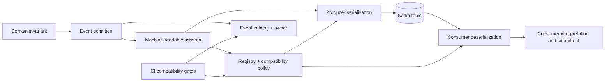
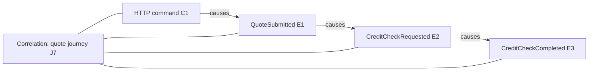
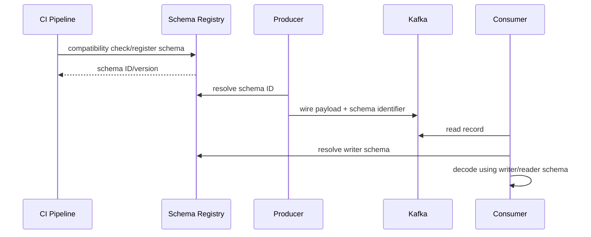
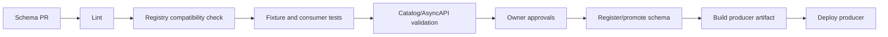
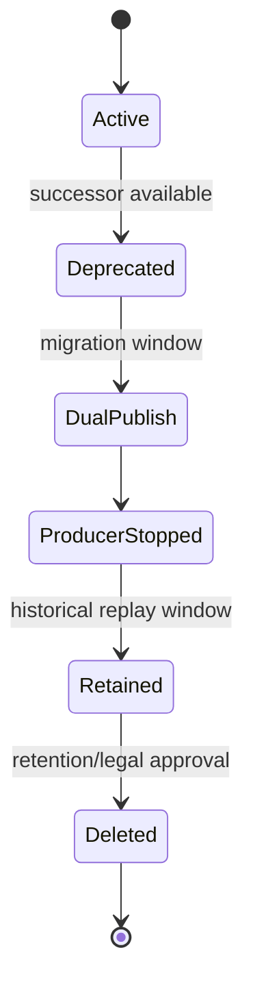

# Part 033 — Event and Schema Governance

> Event adalah durable public statement tentang sesuatu yang telah terjadi atau perlu diproses. Setelah event dipublikasikan dan dikonsumsi oleh service lain, ia menjadi distributed contract. Perubahan kecil pada field, key, timestamp, nullability, enum, subject naming, atau replay semantics dapat menjadi breaking change walaupun producer masih dapat melakukan publish. Governance bertujuan membuat perubahan tersebut eksplisit, dapat diuji, dimiliki, dan dapat dihentikan sebelum merusak consumer.

## Daftar Isi

1. [Target kompetensi](#target-kompetensi)
2. [Scope dan baseline](#scope-dan-baseline)
3. [Boundary dengan Part 032 dan Part 034](#boundary-dengan-part-032-dan-part-034)
4. [Mental model kontrak event](#mental-model-kontrak-event)
5. [Event bukan sekadar DTO yang diserialisasi](#event-bukan-sekadar-dto-yang-diserialisasi)
6. [Event taxonomy](#event-taxonomy)
7. [Fact event, command, notification, dan change event](#fact-event-command-notification-dan-change-event)
8. [Event envelope versus payload](#event-envelope-versus-payload)
9. [Event identity](#event-identity)
10. [Aggregate identity dan partition key](#aggregate-identity-dan-partition-key)
11. [Correlation dan causation](#correlation-dan-causation)
12. [Event time, processing time, dan publication time](#event-time-processing-time-dan-publication-time)
13. [Tenant dan security context](#tenant-dan-security-context)
14. [Schema sebagai executable contract](#schema-sebagai-executable-contract)
15. [Schema Registry mental model](#schema-registry-mental-model)
16. [Schema ID, version, subject, dan artifact identity](#schema-id-version-subject-dan-artifact-identity)
17. [Subject naming strategy](#subject-naming-strategy)
18. [Producer dan consumer schema](#producer-dan-consumer-schema)
19. [Backward, forward, dan full compatibility](#backward-forward-dan-full-compatibility)
20. [Transitive compatibility](#transitive-compatibility)
21. [Compatibility bukan semantic correctness](#compatibility-bukan-semantic-correctness)
22. [Avro mental model](#avro-mental-model)
23. [Avro schema evolution](#avro-schema-evolution)
24. [Avro defaults dan unions](#avro-defaults-dan-unions)
25. [Avro enums, logical types, dan aliases](#avro-enums-logical-types-dan-aliases)
26. [JSON Schema mental model](#json-schema-mental-model)
27. [JSON Schema evolution](#json-schema-evolution)
28. [JSON Schema openness dan unknown fields](#json-schema-openness-dan-unknown-fields)
29. [Protobuf mental model](#protobuf-mental-model)
30. [Protobuf field numbers dan wire compatibility](#protobuf-field-numbers-dan-wire-compatibility)
31. [Protobuf reserved fields dan enum evolution](#protobuf-reserved-fields-dan-enum-evolution)
32. [Choosing Avro, JSON Schema, or Protobuf](#choosing-avro-json-schema-or-protobuf)
33. [Canonical event naming](#canonical-event-naming)
34. [Event versioning strategy](#event-versioning-strategy)
35. [In-schema evolution versus new event type](#in-schema-evolution-versus-new-event-type)
36. [Topic versioning versus schema versioning](#topic-versioning-versus-schema-versioning)
37. [Semantic compatibility rules](#semantic-compatibility-rules)
38. [Null, absence, default, dan unknown](#null-absence-default-dan-unknown)
39. [Enum dan state-machine compatibility](#enum-dan-state-machine-compatibility)
40. [Numeric, currency, dan precision compatibility](#numeric-currency-dan-precision-compatibility)
41. [Date/time compatibility](#datetime-compatibility)
42. [Key schema evolution](#key-schema-evolution)
43. [Event ownership](#event-ownership)
44. [Producer ownership versus domain ownership](#producer-ownership-versus-domain-ownership)
45. [Consumer registration dan dependency inventory](#consumer-registration-dan-dependency-inventory)
46. [Event catalog](#event-catalog)
47. [AsyncAPI dan documentation-as-code](#asyncapi-dan-documentation-as-code)
48. [Generated classes and generated clients](#generated-classes-and-generated-clients)
49. [Code generation trade-offs](#code-generation-trade-offs)
50. [Contract compatibility matrix](#contract-compatibility-matrix)
51. [Consumer-driven compatibility tests](#consumer-driven-compatibility-tests)
52. [Golden records dan fixture corpus](#golden-records-dan-fixture-corpus)
53. [Schema linting](#schema-linting)
54. [CI/CD registration workflow](#cicd-registration-workflow)
55. [Runtime schema registration](#runtime-schema-registration)
56. [Auto-registration risks](#auto-registration-risks)
57. [Breaking-change approval](#breaking-change-approval)
58. [Event deprecation lifecycle](#event-deprecation-lifecycle)
59. [Producer migration](#producer-migration)
60. [Consumer migration](#consumer-migration)
61. [Replay contract](#replay-contract)
62. [Retention, compaction, dan contract longevity](#retention-compaction-dan-contract-longevity)
63. [Duplicate event policy](#duplicate-event-policy)
64. [Ordering policy](#ordering-policy)
65. [Deletion dan tombstone semantics](#deletion-dan-tombstone-semantics)
66. [PII, data classification, dan minimization](#pii-data-classification-dan-minimization)
67. [Authorization dan schema access](#authorization-dan-schema-access)
68. [Observability dan governance metrics](#observability-dan-governance-metrics)
69. [Failure-model matrix](#failure-model-matrix)
70. [Debugging playbook](#debugging-playbook)
71. [Testing strategy](#testing-strategy)
72. [Architecture patterns](#architecture-patterns)
73. [Anti-patterns](#anti-patterns)
74. [PR review checklist](#pr-review-checklist)
75. [Trade-off yang harus dipahami senior engineer](#trade-off-yang-harus-dipahami-senior-engineer)
76. [Internal verification checklist](#internal-verification-checklist)
77. [Latihan verifikasi](#latihan-verifikasi)
78. [Ringkasan](#ringkasan)
79. [Referensi resmi](#referensi-resmi)

---

## Target kompetensi

Setelah menyelesaikan part ini, Anda harus mampu:

- memperlakukan event sebagai durable distributed contract, bukan internal Java DTO;
- membedakan domain fact, command, notification, state-transfer event, dan CDC change event;
- merancang envelope yang memisahkan metadata lintas-event dari payload domain;
- mendefinisikan event identity, aggregate identity, correlation, causation, tenant, dan temporal semantics;
- menjelaskan peran Schema Registry, subject, schema ID, version, compatibility mode, dan serializers;
- membedakan backward, forward, full, serta transitive compatibility;
- mengenali bahwa schema-compatible change masih dapat semantic-breaking;
- mereview Avro, JSON Schema, dan Protobuf evolution rules;
- menentukan kapan perubahan cukup sebagai schema evolution dan kapan membutuhkan event type/topic baru;
- membuat compatibility matrix producer-consumer lintas versi;
- membangun CI gate untuk linting, compatibility, fixtures, generated code, dan registration;
- mendesain event deprecation dan migration lifecycle;
- mendefinisikan replay, duplicate, ordering, retention, compaction, dan tombstone contract;
- mengoperasikan event catalog sebagai dependency map dan ownership registry;
- mengidentifikasi PII, tenancy, authorization, retention, dan audit risks;
- melakukan PR review dengan standard senior/principal engineer.

---

## Scope dan baseline

Baseline:

- Kafka core lifecycle dari Part 032;
- Kafka producer/consumer pada Java/JAX-RS services;
- Schema Registry atau registry setara mungkin digunakan;
- Avro, JSON Schema, dan Protobuf dibahas sebagai candidate formats;
- AsyncAPI mungkin digunakan sebagai documentation/governance layer;
- multi-tenant enterprise CPQ/order system sebagai konteks, tanpa asumsi detail internal;
- event-processing reliability dan CDC dibahas lebih dalam di Part 034.

Part ini **tidak mengasumsikan**:

- Confluent Schema Registry digunakan;
- Apicurio atau registry tertentu digunakan;
- default compatibility mode tertentu di internal platform;
- satu topic memakai satu subject;
- Avro adalah format utama;
- schema auto-registration aktif;
- generated Java classes dipakai;
- event catalog tersedia;
- topic naming dan versioning tertentu;
- semua events bersifat domain facts;
- semua consumer diketahui producer;
- internal CSG architecture.

Setiap keputusan yang bergantung pada platform harus ditandai sebagai **Internal verification checklist**.

---

## Boundary dengan Part 032 dan Part 034

| Part | Fokus |
|---|---|
| Part 032 | Kafka record delivery: topic, partition, offset, producer, consumer, rebalance |
| Part 033 | Meaning, ownership, schema, compatibility, versioning, catalog, deprecation |
| Part 034 | Processing reliability: transactions, idempotency, Streams, CDC, outbox/inbox, saga |

Contoh pembagian:

```text
Part 032:
Why did record offset 812 replay?

Part 033:
Can consumer v2 interpret event schema v5 correctly?

Part 034:
Can repeated event 812 safely reapply its database side effect?
```

---

## Mental model kontrak event



Ada beberapa kontrak independen:

```text
Wire contract       = Bisakah bytes didekode?
Structural contract = Apakah fields/types legal?
Semantic contract   = Apa makna event dan setiap field?
Temporal contract   = Kapan fact berlaku?
Delivery contract   = Apa ekspektasi duplicate/order/replay?
Ownership contract  = Siapa yang boleh mengubah/deprecate?
Security contract   = Siapa yang boleh read/write dan data apa yang legal?
```

Schema Registry terutama melindungi structural/wire compatibility. Governance harus melindungi seluruh kontrak lainnya.

---

## Event bukan sekadar DTO yang diserialisasi

Mental model yang lemah:

```java
producer.send(new ProducerRecord<>("quote-events", quoteEntity));
```

Masalah:

- persistence fields bocor;
- lazy relationships atau internal identifiers bocor;
- schema berubah mengikuti refactor entity;
- PII dapat keluar tanpa sadar;
- makna domain implicit;
- consumer coupling tidak terkendali;
- replay semantics tidak jelas.

Gunakan event model eksplisit:

```java
public record QuotePriceCalculatedV1(
        String eventId,
        String tenantId,
        String quoteId,
        Instant occurredAt,
        String catalogRevision,
        String pricingRevision,
        MonetaryAmountDto total
) {}
```

Suffix `V1` adalah salah satu opsi organisasi code, bukan kewajiban versioning topic/schema.

---

## Event taxonomy

| Type | Meaning | Typical consumer assumption |
|---|---|---|
| Domain fact | sesuatu selesai di domain | immutable historical statement |
| Integration event | projection stabil untuk boundary eksternal | public service contract |
| Command | permintaan melakukan aksi | dapat ditolak; bukan fact |
| Notification | sinyal agar consumer memeriksa sesuatu | payload dapat minimal |
| State-transfer event | snapshot/current state | latest value dapat menggantikan lama |
| CDC event | perubahan row-level database | storage-oriented, tidak selalu domain intent |
| Audit event | bukti actor/action/outcome | retention dan immutability kritis |

Mencampurkan semuanya dalam satu topic tanpa semantics eksplisit membingungkan retry, replay, compaction, dan ownership.

---

## Fact event, command, notification, dan change event

### Fact

```text
QuoteApproved
```

Past tense, immutable claim.

### Command

```text
ApproveQuote
```

Intent. Processing dapat gagal atau ditolak.

### Notification

```text
QuoteDataChanged
```

Consumer dapat memanggil API/read model untuk detail.

### CDC change

```text
quote table row UPDATE, before/after image
```

Mewakili storage mutation, bukan selalu domain transition.

Row update `status=PENDING` menjadi `APPROVED` mungkin berkaitan dengan `QuoteApproved`, tetapi derivasi domain fact dari raw CDC membutuhkan mapping dan state semantics eksplisit.

---

## Event envelope versus payload

Contoh envelope:

```json
{
  "eventId": "018f...",
  "eventType": "QuotePriceCalculated",
  "eventVersion": 3,
  "tenantId": "tenant-7",
  "aggregateType": "Quote",
  "aggregateId": "quote-123",
  "occurredAt": "2026-07-11T12:00:00Z",
  "publishedAt": "2026-07-11T12:00:00.153Z",
  "correlationId": "journey-8",
  "causationId": "command-99",
  "producer": {
    "service": "quote-service",
    "version": "2026.07.11"
  },
  "payload": {
    "currency": "USD",
    "amount": "123.4500"
  }
}
```

Keuntungan envelope:

- telemetry konsisten;
- deduplication identity;
- common routing;
- replay metadata;
- security classification hooks;
- catalog tooling.

Risiko:

- metadata ganda antara Kafka headers dan payload;
- envelope membesar;
- generic envelope mengurangi schema specificity;
- envelope version berbeda dari payload version;
- consumer mempercayai producer fields yang spoofable.

Tetapkan metadata mana yang authoritative.

---

## Event identity

`eventId` harus mengidentifikasi satu logical event.

Sifat:

- cukup unik untuk retention horizon;
- stabil across producer retry dan outbox relay;
- tidak dibuat ulang pada setiap delivery attempt;
- bukan Kafka offset;
- tidak harus sama dengan command ID;
- dapat digunakan untuk inbox/deduplication;
- aman untuk log.

Bedakan:

```text
eventId       = identity dari fact
deliveryId    = identity satu delivery attempt, jika perlu
aggregateId   = identity domain entity
commandId     = identity originating request
correlationId = identity journey lebih luas
```

---

## Aggregate identity dan partition key

Payload dan Kafka key harus berhubungan secara sengaja.

Contoh:

```text
Kafka key = tenantId + ":" + quoteId
aggregateId = quoteId
tenantId = tenantId
```

Governance perlu mendefinisikan:

- canonical key encoding;
- tenant inclusion;
- null-key policy;
- partition-order guarantee;
- key schema;
- compaction meaning;
- key-change migration.

Mengubah key construction dapat mengubah order dan partition records di masa depan. Ini sering lebih berbahaya daripada menambah payload field.

---

## Correlation dan causation



Rules:

- causation menunjuk immediate trigger;
- correlation mengelompokkan journey lebih luas;
- tracing context adalah telemetry, bukan selalu durable business correlation;
- replay dapat membuat processing trace baru tetapi mempertahankan original event ID dan business causation;
- jangan gunakan mutable user session ID sebagai durable correlation.

---

## Event time, processing time, dan publication time

| Time | Meaning |
|---|---|
| Occurred/effective time | ketika domain fact menjadi benar |
| Transaction commit time | ketika durable source transaction commit |
| Publication time | ketika event dikirim ke Kafka |
| Broker record time | producer create time atau broker append time |
| Consumer processing time | ketika consumer menangani |
| Replay time | ketika record lama diproses ulang |

Dalam pricing/catalog/order, occurred time dan effective business date dapat berbeda.

Jangan overload satu field `timestamp`.

---

## Tenant dan security context

Event mungkin membutuhkan tenant context untuk:

- authorization;
- partitioning;
- data isolation;
- configuration/catalog selection;
- audit;
- routing.

Tetapi menyertakan user roles/tokens berbahaya:

- stale authorization;
- credential leakage;
- payload sensitif membesar;
- replay dengan permission lama.

Gunakan durable actor evidence, bukan access token.

---

## Schema sebagai executable contract

Schema dapat memvalidasi:

- names;
- types;
- required/optional structure;
- enum symbols;
- nested records;
- numeric/string constraints tergantung format;
- references/imports.

Schema biasanya tidak cukup untuk memvalidasi:

- catalog revision tersedia;
- status transition legal;
- tax amount cocok dengan components;
- actor authorized;
- field dependency kompleks;
- tenant ownership.

Gunakan schema validation dan domain validation.

---

## Schema Registry mental model



Registry dapat menyediakan:

- schema storage;
- immutable IDs;
- subject versions;
- compatibility enforcement;
- references;
- REST APIs;
- metadata/rules;
- authorization/audit.

Registry bukan broker event data.

---

## Schema ID, version, subject, dan artifact identity

```text
schema ID       = registry/content identity
subject         = versioned compatibility namespace
subject version = order schema di subject
event version   = semantic version domain
topic           = transport destination
```

Schema version `7` tidak otomatis berarti semantic event version `7`.

---

## Subject naming strategy

Strategi umum:

| Strategy | Benefit | Risk |
|---|---|---|
| Topic-based | sederhana | sulit multiple record types |
| Record-name | record reuse lintas topics | compatibility scope sangat luas |
| Topic-record | isolation per topic/type | subject lebih banyak |
| Custom | domain-aligned | tooling burden |

Verifikasi serializer config; subject naming sering tersembunyi dalam defaults.

---

## Producer dan consumer schema

Writer schema digunakan saat producer encode.

Reader schema adalah schema yang diharapkan consumer.

Ini memungkinkan evolution, tetapi compatibility direction bergantung rollout:

- new consumer membaca old data;
- old consumer membaca new data.

---

## Backward, forward, dan full compatibility

| Mode | Main question |
|---|---|
| Backward | Bisakah new consumer/schema membaca data dari older producer schema? |
| Forward | Bisakah old consumer/schema membaca data dari newer producer schema? |
| Full | Apakah kedua arah didukung? |
| None | Registry tidak memblokir incompatibility |

Mapping:

```text
consumer-first rollout → backward penting
producer-first rollout → forward penting
independent rollout → full mungkin diperlukan
```

Exact behavior berbeda per format dan registry.

---

## Transitive compatibility

Non-transitive check dapat hanya membandingkan latest prior version.

Transitive check membandingkan semua prior versions.

Risiko:

```text
v1 compatible v2
v2 compatible v3
v1 incompatible v3
```

Jika retained records atau old consumers dapat hidup lama, transitive compatibility lebih relevan.

---

## Compatibility bukan semantic correctness

Structurally compatible, semantically breaking:

```text
discountPercent tetap integer
makna berubah dari 0..100 menjadi basis points 0..10000
```

Contoh lain:

- amount berubah tax-exclusive menjadi tax-inclusive;
- timestamp berubah dari UTC instant ke local effective time;
- ID namespace berubah;
- empty string mulai berarti unknown;
- event dipublish sebelum commit;
- duplicate policy berubah.

Schema Registry tidak dapat melindungi ini.

---

## Avro mental model

```json
{
  "type": "record",
  "name": "QuotePriceCalculated",
  "namespace": "com.example.quote.events",
  "fields": [
    {"name": "eventId", "type": "string"},
    {"name": "quoteId", "type": "string"},
    {"name": "currency", "type": "string"},
    {
      "name": "amount",
      "type": {
        "type": "bytes",
        "logicalType": "decimal",
        "precision": 19,
        "scale": 4
      }
    }
  ]
}
```

Strengths:

- compact binary;
- reader/writer resolution;
- aliases/defaults;
- logical types.

Risks:

- union complexity;
- generated/generic record differences;
- logical type support;
- defaults disalahpahami.

---

## Avro schema evolution

Compatible changes tergantung direction:

- add field dengan valid default;
- remove field sesuai reader/writer rules;
- numeric promotions tertentu;
- aliases untuk rename;
- nested evolution hati-hati.

Test dengan real serializers.

---

## Avro defaults dan unions

Default digunakan ketika reader membutuhkan field yang tidak ada pada writer data. Default tidak selalu berarti producer menulis value itu.

Nullable pattern:

```json
{
  "name": "reason",
  "type": ["null", "string"],
  "default": null
}
```

Hindari:

- required field tanpa default;
- silent semantic default changes;
- complex catch-all unions.

---

## Avro enums, logical types, dan aliases

Enum addition dapat mematahkan old readers.

Strategi:

- `UNKNOWN`;
- string dengan semantic validation;
- new event type;
- consumer rollout terlebih dahulu.

Logical types seperti decimal/timestamp/date harus diverifikasi mapping-nya pada Java, database, dan API.

Alias membantu resolution tetapi tidak mengubah consumer business code.

---

## JSON Schema mental model

```json
{
  "$schema": "https://json-schema.org/draft/2020-12/schema",
  "$id": "urn:event:QuoteSubmitted:1",
  "type": "object",
  "additionalProperties": false,
  "required": ["eventId", "quoteId", "submittedAt"],
  "properties": {
    "eventId": {"type": "string", "format": "uuid"},
    "quoteId": {"type": "string", "minLength": 1},
    "submittedAt": {"type": "string", "format": "date-time"},
    "comment": {"type": ["string", "null"]}
  }
}
```

Advantages:

- readable;
- rich constraints;
- broad tooling.

Risks:

- JSON numeric ambiguity;
- draft differences;
- format handling berbeda;
- parser configuration menjadi contract.

---

## JSON Schema evolution

Review:

- new properties allowed?
- old consumers ignore unknown?
- `additionalProperties: false`?
- required field added?
- enum widened?
- range narrowed?
- integer berubah string?
- nullable semantics?
- references stable?

Jackson `FAIL_ON_UNKNOWN_PROPERTIES` dapat mematahkan runtime walaupun schema governance menganggap additive field aman.

---

## JSON Schema openness dan unknown fields

Open schema memudahkan additive evolution tetapi dapat membiarkan accidental fields.

Closed schema memperkuat strictness tetapi membuat evolution lebih sulit.

Possible policy:

- envelope strict;
- payload additive;
- controlled extensions;
- consumers ignore unknown but validate known fields.

---

## Protobuf mental model

```proto
syntax = "proto3";

package quote.events.v1;

message QuoteApproved {
  string event_id = 1;
  string tenant_id = 2;
  string quote_id = 3;
  string approved_at = 4;
  Money total = 5;
}

message Money {
  string currency = 1;
  string amount = 2;
}
```

Wire compatibility bergantung field number dan wire type.

---

## Protobuf field numbers dan wire compatibility

Rules:

- jangan reuse removed field number;
- jangan ubah menjadi incompatible wire type;
- rename dengan number sama dapat wire-compatible tetapi generated APIs berubah;
- repeated/singular changes perlu review;
- map fields memiliki generated entry representation.

---

## Protobuf reserved fields dan enum evolution

```proto
message QuoteApproved {
  reserved 6, 7;
  reserved "legacy_discount", "old_total";
}
```

Enum:

```proto
enum QuoteStatus {
  QUOTE_STATUS_UNSPECIFIED = 0;
  QUOTE_STATUS_DRAFT = 1;
  QUOTE_STATUS_APPROVED = 2;
}
```

Reserve removed numbers/names dan handle unknown values secara eksplisit.

---

## Choosing Avro, JSON Schema, or Protobuf

| Dimension | Avro | JSON Schema | Protobuf |
|---|---|---|---|
| Wire size | compact | larger JSON | compact |
| Human payload readability | no | yes | no |
| Evolution | reader/writer resolution | registry/parser dependent | field-number based |
| Code generation | optional/common | optional | central/common |
| Validation | moderate | rich structural | limited semantic |
| gRPC reuse | low | low | high |
| Decimal/time | logical types | conventions | custom/well-known |
| Ecosystem | Kafka strong | web/API broad | polyglot RPC |

Decision harus mempertimbangkan platform, languages, registry, codegen, debugging, dan governance.

---

## Canonical event naming

Good:

```text
QuoteSubmitted
QuotePriceCalculated
OrderActivated
CatalogOfferRetired
```

Avoid:

```text
QuoteUpdated
DataChanged
ProcessMessage
ServiceXEvent
QuoteEventV2Final
```

Nama generic menyembunyikan semantics.

---

## Event versioning strategy

| Layer | Example |
|---|---|
| Semantic event version | `eventVersion: 3` |
| Registry subject version | version 12 |
| Topic version | `quote-events-v2` |
| Java package | `.events.v3` |
| AsyncAPI document | `2.4.0` |
| Producer release | build version |

Tetapkan arti masing-masing.

---

## In-schema evolution versus new event type

Gunakan compatible evolution ketika:

- meaning tidak berubah;
- field optional/defaulted;
- old consumers dapat ignore;
- replay/key/order tetap.

Buat event baru ketika:

- meaning berubah;
- invariant berubah;
- amount/time semantics berubah;
- aggregate/key berubah;
- one fact split;
- field dipakai ulang;
- old/new perlu coexist.

---

## Topic versioning versus schema versioning

Topic baru mungkin dibutuhkan jika:

- key berubah;
- retention/compaction berubah;
- ACL/classification berubah;
- format berubah besar;
- dual processing diperlukan.

Cost:

- dual publish;
- consumer migration;
- ordering;
- monitoring;
- topic sprawl.

---

## Semantic compatibility rules

Flag atau prohibit:

- unit changes;
- rounding/scale changes;
- timezone changes;
- identifier namespace changes;
- list ordering changes;
- duplicate semantics changes;
- event timing changes;
- state meaning changes;
- security classification expansion;
- key changes.

---

## Null, absence, default, dan unknown

```text
absent → producer tidak menyediakan
null   → diketahui kosong/tidak applicable
0      → valid zero
unknown enum → producer lebih baru
```

Consumer tidak boleh collapse semuanya tanpa domain decision.

---

## Enum dan state-machine compatibility

New enum dapat:

- gagal deserialize;
- map unknown;
- jatuh ke default;
- salah diperlakukan.

Governance:

- unknown-safe consumer;
- consumer-first rollout;
- catalog impact;
- fixture untuk new symbol.

---

## Numeric, currency, dan precision compatibility

Tetapkan:

- representation;
- precision/scale;
- rounding;
- currency;
- tax inclusivity;
- FX source/time;
- negative semantics.

Jangan ubah unit dengan schema yang sama.

---

## Date/time compatibility

Tetapkan:

- instant/local date/time;
- timezone;
- effective date;
- boundary inclusivity;
- precision;
- offset;
- DST behavior;
- serialization.

---

## Key schema evolution

Key adalah contract untuk:

- partitioning;
- compaction;
- joins;
- state stores;
- order.

Perubahan key sering membutuhkan new topic, repartitioning, state rebuild, dan tombstone strategy.

---

## Event ownership

Setiap event perlu:

- domain owner;
- producer owner;
- schema owner;
- topic/platform owner;
- on-call;
- deprecation authority;
- data classification;
- retention owner;
- known consumers.

---

## Producer ownership versus domain ownership

Producer team mengimplementasikan publication, tetapi domain owner menentukan meaning.

Adapter yang menginfer domain event dari raw DB update harus memiliki governed mapping dan joint ownership.

---

## Consumer registration dan dependency inventory

Catalog entry:

```yaml
event: QuoteApproved
owner: quote-domain
producers:
  - quote-service
consumers:
  - order-orchestrator
  - billing-projection
  - audit-archive
compatibility: BACKWARD_TRANSITIVE
retention: 365d
classification: commercial-sensitive
```

Unknown consumers adalah risk untuk deprecation.

---

## Event catalog

Catalog harus menjawab:

- events;
- meaning;
- owner;
- topic/subject;
- schema format;
- versions;
- key;
- retention/compaction;
- producers/consumers;
- classification;
- replay policy;
- sample;
- dependency graph;
- deprecation.

Catalog harus terhubung ke CI/runtime evidence.

---

## AsyncAPI dan documentation-as-code

AsyncAPI dapat mendokumentasikan channels, messages, operations, schemas, bindings, dan security.

Hindari duplicate source of truth antara AsyncAPI dan registry.

---

## Generated classes and generated clients

Flows:

```text
schema → generated Java classes
```

atau:

```text
Java model → generated schema
```

Schema-first meningkatkan language neutrality.

Code-first meningkatkan convenience tetapi berisiko menjadikan Java refactor sebagai contract change.

---

## Code generation trade-offs

| Choice | Benefit | Risk |
|---|---|---|
| Specific Avro classes | type safety | generator/runtime coupling |
| Generic records | flexible | less compile-time safety |
| Protobuf generated messages | strong wire API | domain coupling |
| JSON POJOs | simple | parser config is contract |
| Shared event library | easy reuse | lockstep release |
| Independent generated artifacts | decoupled | artifact proliferation |

---

## Contract compatibility matrix

| Producer schema | Consumer v1 | Consumer v2 | Consumer v3 |
|---|---:|---:|---:|
| Schema 1 | supported | supported | supported |
| Schema 2 additive | maybe | supported | supported |
| Schema 3 new enum | unsafe | supported with unknown | supported |
| Schema 4 semantic change | unsupported | unsupported | supported |

Include decode, semantics, duplicate/replay, key/order, and retained history.

---

## Consumer-driven compatibility tests

Registry check tidak mengetahui consumer code behavior.

Consumer test harus:

1. menerima candidate schema/payload;
2. deserialize;
3. map ke domain;
4. assert semantics;
5. gate producer release.

---

## Golden records dan fixture corpus

Fixtures:

- oldest retained schema;
- current schema;
- optional absent;
- null/default;
- unknown enum;
- max decimal;
- timezone edge;
- duplicate;
- tombstone;
- malformed record.

Gunakan synthetic data.

---

## Schema linting

Lint rules:

- naming;
- namespace;
- envelope;
- required metadata;
- documentation;
- no ambiguous timestamp;
- no float for money;
- reserved Protobuf numbers;
- unknown enum;
- Avro default/null order;
- PII restrictions;
- max nesting/size;
- key schema.

---

## CI/CD registration workflow



---

## Runtime schema registration

Runtime registration memudahkan development tetapi:

- first request melakukan control-plane mutation;
- app identity butuh schema-write;
- incompatibility ditemukan terlambat;
- versions accidental;
- registry outage memengaruhi startup/request.

Prefer CI pre-registration untuk governed production contracts.

---

## Auto-registration risks

Verifikasi:

- auto-register;
- latest version;
- normalization;
- subject strategy;
- specific/generic reader;
- references.

Effective config harus terlihat dengan redaction.

---

## Breaking-change approval

Proposal perlu:

- rationale;
- affected event/topic/subject;
- consumers;
- retained-history impact;
- successor;
- dual publish/translator;
- rollout;
- deprecation;
- replay;
- rollback/roll-forward;
- classification;
- owner.

---

## Event deprecation lifecycle



Old schema harus tersedia selama retained records masih mereferensikannya.

---

## Producer migration

Options:

- compatible in-place;
- dual publish;
- translation bridge;
- new topic.

Dual publish membutuhkan one source of truth dan divergence monitoring.

---

## Consumer migration

Sequence:

1. deploy tolerant reader;
2. observe;
3. producer emits new fields/values;
4. activate new semantics;
5. remove fallback setelah horizon.

---

## Replay contract

Tetapkan:

- schema availability;
- original/current rules;
- catalog/pricing version;
- external side effects;
- destination;
- identity;
- timestamps;
- rate;
- audit;
- PII legality.

---

## Retention, compaction, dan contract longevity

Long retention membuat old schema relevan lebih lama.

Compaction membutuhkan stable key, tombstone semantics, and schema availability.

---

## Duplicate event policy

Tetapkan:

- duplicates possible;
- event ID stable;
- dedup/idempotency responsibility;
- retention;
- metrics;
- same ID different payload = corruption.

---

## Ordering policy

Dokumentasikan:

- key;
- ordering scope;
- retry behavior;
- multiple topics;
- late events;
- sequence/aggregate version;
- gap handling.

---

## Deletion dan tombstone semantics

Tombstone biasanya key + null value pada compacted topic.

Tetapkan meaning, retention, recreation, PII erasure, audit, dan consumer behavior.

---

## PII, data classification, dan minimization

Events tersebar ke brokers, replicas, caches, state stores, logs, DLQ, archive.

Minimalkan data. Jangan memasukkan tokens, secrets, full profiles, atau dokumen tanpa kebutuhan contract.

---

## Authorization dan schema access

Control plane:

- register/change compatibility/delete/read schemas;
- catalog updates;
- topic/ACL creation.

Data plane:

- produce;
- consume/group;
- replay;
- tenant access.

Schema sendiri dapat mengungkap domain structure.

---

## Observability dan governance metrics

Metrics:

- incompatible changes blocked;
- subjects on `NONE`;
- unowned subjects;
- deprecated events with traffic;
- deserialization by version;
- auto-registration;
- old schema usage;
- event size trend;
- unknown enum;
- duplicate IDs;
- catalog drift.

---

## Failure-model matrix

| Failure | Detection | Impact | Prevention |
|---|---|---|---|
| Incompatible schema registered | consumer failure | outage | CI gate |
| Semantic break passes registry | domain anomaly | silent corruption | semantic review |
| Wrong subject strategy | unexpected scope | coupled contracts | explicit config |
| Runtime auto-registration | surprise version | control-plane mutation | CI registration |
| Registry unavailable | lookup failure | publish/consume failure | cache/runbook |
| Schema deleted too early | decode failure | replay outage | retention-aware deletion |
| New enum breaks old consumer | deserialization/default | stuck processing | unknown-safe rollout |
| Key changes | reorder/repartition | state corruption | new topic/migration |
| Event ID regenerated | dedup failure | duplicate effects | stable identity |
| Same ID different payload | integrity breach | inconsistent state | hash check |
| PII added | compliance breach | broad exposure | lint/review |
| Unknown consumer | deprecation outage | dependency break | catalog/access evidence |
| Dual publish diverges | conflicting consumers | inconsistent system | one source/outbox |
| Replay current semantics | wrong historical state | corruption | explicit replay contract |

---

## Debugging playbook

### Deserialization failure

Check topic/partition/offset, schema ID, subject/version, serializer config, reader schema, compatibility, enum/unknown fields, registry access, and classpath versions.

### Compatibility passes but behavior breaks

Review units, enums, null/default, timestamp, key, event timing, duplicate/replay semantics.

### Compatibility fails unexpectedly

Check subject strategy, transitive mode, normalization, references, namespace/name, nullable/default syntax, and accidental old versions.

### Unknown schema ID

Check registry environment, replication, deletion, credentials, and wire framing.

### Catalog drift

Compare code, registry, topics, ACLs, groups, and deployment manifests.

### Same ID different payload

Treat as integrity incident and preserve evidence.

---

## Testing strategy

- Registry compatibility checks.
- Old writer/new reader.
- New writer/old reader when required.
- Old retained binary/newest consumer.
- Semantic fixtures.
- Generated code determinism.
- Registry auth/TLS/outage.
- Replay oldest retained data.
- PII/schema lint.
- Key/order migration tests.

---

## Architecture patterns

### Schema-first repository

```text
event-contracts/
  quote/
    QuoteSubmitted.avsc
    QuoteApproved.avsc
    asyncapi.yaml
    examples/
```

### Registry-linked event catalog

Catalog metadata references exact subjects/topics.

### Stable envelope + typed payload

Common metadata with event-specific schema.

### Compatibility release

Consumer learns new contract before producer activates it.

### Translation bridge

Old topic/schema translated to successor.

### Ownership file

```yaml
event: QuoteApproved
domainOwner: quote-domain
producerOwner: quote-service
schemaOwner: quote-platform
classification: commercial-sensitive
compatibility: BACKWARD_TRANSITIVE
orderingKey: tenantId:quoteId
duplicatePolicy: at-least-once
```

---

## Anti-patterns

- serializing entities;
- generic `EntityChanged`;
- event meaning hidden in arbitrary type string;
- schema version used as semantic version;
- changing units without new contract;
- enum addition without consumer analysis;
- relying only on registry;
- compatibility `NONE` globally;
- production auto-registration;
- deleting old schemas early;
- key change in place;
- new event ID each retry;
- tokens in headers;
- broad PII payload;
- shared event JAR forcing lockstep;
- topic-per-minor-version;
- no owner/catalog;
- undocumented replay.

---

## PR review checklist

### Meaning and identity

- [ ] Event type classified?
- [ ] Name domain-specific?
- [ ] Event ID stable?
- [ ] Aggregate/tenant/correlation/causation defined?
- [ ] Temporal semantics explicit?
- [ ] Publication relative to transaction commit clear?

### Schema

- [ ] Format/runtime version known?
- [ ] Null/default/unknown semantics explicit?
- [ ] Money/time safe?
- [ ] Enums unknown-safe?
- [ ] Key schema reviewed?
- [ ] Old payloads tested?

### Compatibility

- [ ] Mode appropriate?
- [ ] Transitive horizon?
- [ ] Old/new matrix?
- [ ] Semantic review?
- [ ] Consumer activation order?
- [ ] Fixtures updated?

### Governance

- [ ] Owners?
- [ ] Consumers?
- [ ] Catalog/AsyncAPI?
- [ ] CI registration?
- [ ] Deprecation?
- [ ] Breaking approval?

### Delivery and security

- [ ] Key/order?
- [ ] Duplicate/replay?
- [ ] Retention/compaction/tombstone?
- [ ] Size bounded?
- [ ] Data classification/PII?
- [ ] ACLs?

---

## Trade-off yang harus dipahami senior engineer

| Decision | Benefit | Cost/risk |
|---|---|---|
| Avro | compact/resolution | union/logical-type coupling |
| JSON Schema | readable/constraints | parser and payload size |
| Protobuf | compact/codegen | field-number governance |
| Closed JSON | strict | additive evolution harder |
| Backward transitive | retained history safety | restrictive evolution |
| Auto-registration | convenience | runtime/control-plane risk |
| CI registration | control | pipeline complexity |
| Shared library | reuse | release coupling |
| New event type | semantic clarity | migration |
| In-place evolution | low ops | semantic abuse risk |
| New topic | key/policy isolation | dual publish/sprawl |
| Long retention | replay | security/schema burden |
| Rich payload | autonomy | duplication/PII |
| Minimal notification | small | synchronous dependency |

---

## Internal verification checklist

### Registry

- [ ] Product/vendor/version.
- [ ] Topology/SLO.
- [ ] Environment endpoints.
- [ ] Auth/TLS.
- [ ] Wire framing.
- [ ] SerDes versions.
- [ ] Subject strategy.
- [ ] Auto-registration.
- [ ] Normalization/latest settings.
- [ ] Cache/deletion policy.

### Formats

- [ ] Avro/JSON Schema/Protobuf.
- [ ] JSON Schema draft.
- [ ] Protobuf syntax/runtime.
- [ ] Decimal/time rules.
- [ ] Null/default/unknown rules.
- [ ] Code generation.

### Compatibility

- [ ] Global mode.
- [ ] Overrides.
- [ ] Transitive rules.
- [ ] Breaking approval.
- [ ] Retained horizon.
- [ ] Consumer tests.
- [ ] Cross-language tests.

### Governance

- [ ] Naming/envelope.
- [ ] Event ID.
- [ ] Correlation/causation.
- [ ] Tenant/actor.
- [ ] Key/order.
- [ ] Duplicate/replay.
- [ ] Topic retention/compaction.
- [ ] Catalog/AsyncAPI.
- [ ] Consumer inventory.
- [ ] Deprecation.

### Security and operations

- [ ] Classification/PII.
- [ ] Registry/topic ACLs.
- [ ] DLQ/archive retention.
- [ ] Audit logs.
- [ ] Runbooks.
- [ ] Drift detection.
- [ ] Auto-registration alerts.
- [ ] Schema deletion protection.

---

## Latihan verifikasi

1. Rekonstruksi satu event contract dari domain hingga consumer.
2. Jalankan cross-version writer-reader matrix.
3. Tambahkan enum baru dan uji old consumers.
4. Buktikan subject naming strategy dari effective config.
5. Simulasikan schema deletion dengan retained data.
6. Buktikan event ID stabil across retries.
7. Bandingkan catalog dengan runtime evidence.
8. Rancang penggantian semantic-breaking tanpa mematikan consumer lama.

---

## Ringkasan

- Event adalah durable distributed contract, bukan internal DTO.
- Wire, structural, semantic, temporal, delivery, ownership, dan security contracts berbeda.
- Schema Registry melindungi structural compatibility, bukan seluruh semantics.
- Schema ID, subject version, event version, topic version, dan service version berbeda.
- Compatibility direction mengikuti deployment order.
- Transitive compatibility mengikuti retention dan supported consumer horizon.
- Avro, JSON Schema, dan Protobuf memiliki evolution rules berbeda.
- Null, default, enum, money, time, dan key semantics harus eksplisit.
- Key changes sering membutuhkan migration/topic baru.
- Event ownership dan consumer inventory diperlukan untuk deprecation.
- Event catalog harus terhubung ke CI dan runtime evidence.
- Production auto-registration meningkatkan risiko.
- Old schemas harus bertahan selama retained records membutuhkannya.
- Duplicate, ordering, replay, tombstone, retention, dan PII adalah contract.
- Exact internal registry and governance remain **Internal verification checklist**.

---

## Referensi resmi

- [Apache Kafka Documentation](https://kafka.apache.org/documentation/)
- [Confluent Schema Registry Documentation](https://docs.confluent.io/platform/current/schema-registry/index.html)
- [Schema Evolution and Compatibility Types](https://docs.confluent.io/platform/current/schema-registry/fundamentals/schema-evolution.html)
- [Schema Registry Concepts](https://docs.confluent.io/platform/current/schema-registry/fundamentals/index.html)
- [Schema Registry Data Contracts](https://docs.confluent.io/platform/current/schema-registry/fundamentals/data-contracts.html)
- [Schema Registry Formats and SerDes](https://docs.confluent.io/platform/current/schema-registry/fundamentals/serdes-develop/index.html)
- [Apache Avro Specification](https://avro.apache.org/docs/current/specification/)
- [JSON Schema Specification](https://json-schema.org/specification)
- [Protocol Buffers Language Guide](https://protobuf.dev/programming-guides/)
- [AsyncAPI Specification](https://www.asyncapi.com/docs/reference/specification/latest)
