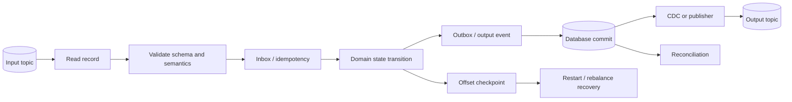
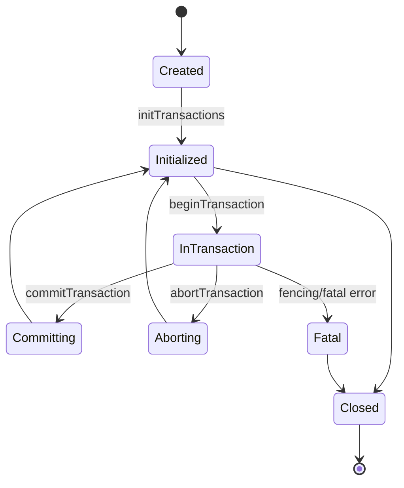
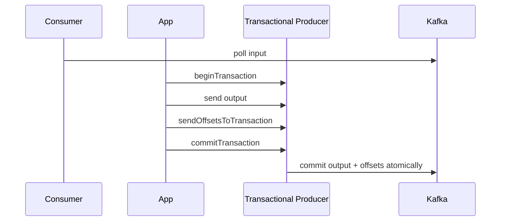
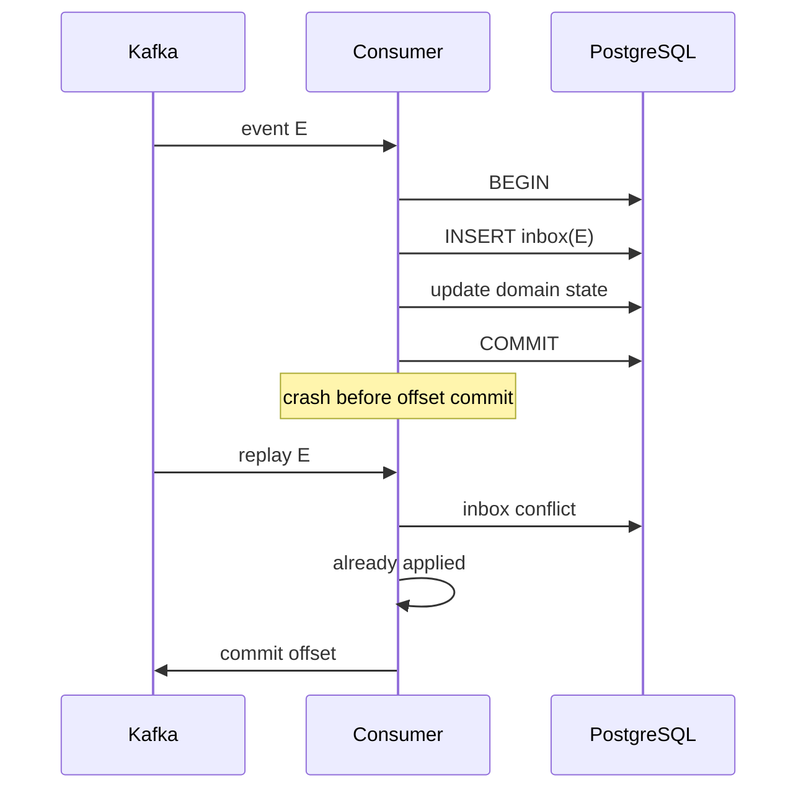
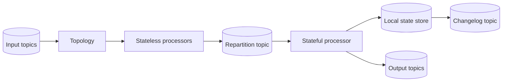
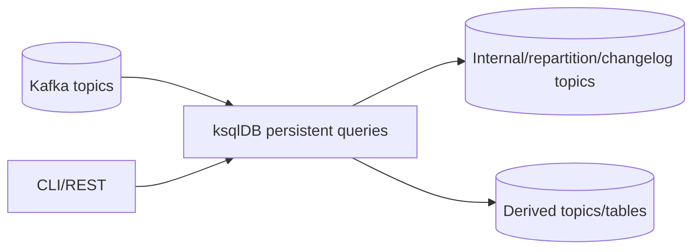
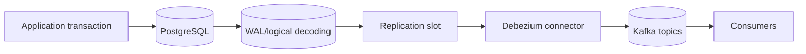
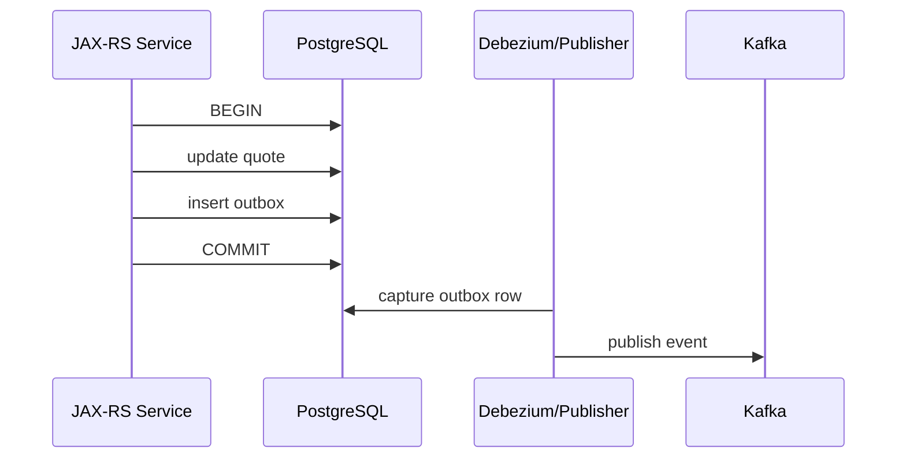
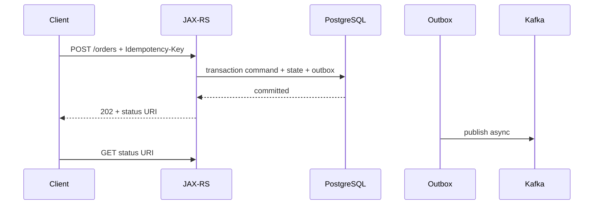

# Part 034 — Kafka Reliability, Kafka Streams, ksqlDB, CDC, and Transactional Patterns

> Reliable event processing bukan “consumer menerima record sekali”. Sistem harus menjaga hubungan antara input offset, domain side effects, output events, local state, retries, rebalances, deployment, schema evolution, dan recovery. Kafka dapat memberikan transactional guarantees untuk Kafka-to-Kafka processing, tetapi database, HTTP services, object storage, dan human workflows membutuhkan idempotency, outbox/inbox, reconciliation, atau compensation. Klaim exactly-once hanya bermakna jika boundary-nya dinyatakan secara presisi.

## Daftar Isi

1. [Target kompetensi](#target-kompetensi)
2. [Scope dan baseline](#scope-dan-baseline)
3. [Boundary dengan Part 032–033](#boundary-dengan-part-032033)
4. [Mental model reliable event processing](#mental-model-reliable-event-processing)
5. [Delivery, processing, dan effect semantics](#delivery-processing-dan-effect-semantics)
6. [At-most-once, at-least-once, dan exactly-once](#at-most-once-at-least-once-dan-exactly-once)
7. [Exactly-once boundary harus eksplisit](#exactly-once-boundary-harus-eksplisit)
8. [Producer idempotence versus business idempotency](#producer-idempotence-versus-business-idempotency)
9. [Kafka transactions](#kafka-transactions)
10. [Transactional producer lifecycle](#transactional-producer-lifecycle)
11. [Transactional ID dan fencing](#transactional-id-dan-fencing)
12. [`read_committed` dan last stable offset](#read_committed-dan-last-stable-offset)
13. [Consume-transform-produce transaction](#consume-transform-produce-transaction)
14. [`sendOffsetsToTransaction`](#sendoffsetstotransaction)
15. [Transaction timeout dan abort](#transaction-timeout-dan-abort)
16. [Kafka transaction limitations](#kafka-transaction-limitations)
17. [Database side effect gap](#database-side-effect-gap)
18. [Idempotent consumer](#idempotent-consumer)
19. [Inbox pattern](#inbox-pattern)
20. [Processed-event table design](#processed-event-table-design)
21. [Atomic inbox and domain update](#atomic-inbox-and-domain-update)
22. [Deduplication retention](#deduplication-retention)
23. [Same event ID with different payload](#same-event-id-with-different-payload)
24. [Retry taxonomy](#retry-taxonomy)
25. [Immediate retry](#immediate-retry)
26. [Delayed retry topics](#delayed-retry-topics)
27. [Retry headers and attempt identity](#retry-headers-and-attempt-identity)
28. [Ordering impact of retry topics](#ordering-impact-of-retry-topics)
29. [Dead-letter queue](#dead-letter-queue)
30. [DLQ is not resolution](#dlq-is-not-resolution)
31. [Poison event quarantine](#poison-event-quarantine)
32. [Manual replay and redrive](#manual-replay-and-redrive)
33. [Replay safety](#replay-safety)
34. [Kafka Streams mental model](#kafka-streams-mental-model)
35. [Topology, processor, stream, table, dan task](#topology-processor-stream-table-dan-task)
36. [KStream, KTable, dan GlobalKTable](#kstream-ktable-dan-globalktable)
37. [Stateless operations](#stateless-operations)
38. [Stateful operations](#stateful-operations)
39. [State stores](#state-stores)
40. [Changelog topics](#changelog-topics)
41. [Repartition topics](#repartition-topics)
42. [Joins](#joins)
43. [Windows, grace period, dan late events](#windows-grace-period-dan-late-events)
44. [Event time dan timestamp extractors](#event-time-dan-timestamp-extractors)
45. [Suppress dan final results](#suppress-dan-final-results)
46. [Streams application ID](#streams-application-id)
47. [Threads, tasks, partitions, dan scaling](#threads-tasks-partitions-dan-scaling)
48. [Standby replicas dan restoration](#standby-replicas-dan-restoration)
49. [Exactly-once v2 in Kafka Streams](#exactly-once-v2-in-kafka-streams)
50. [Streams exception handling](#streams-exception-handling)
51. [Uncaught exception and application state](#uncaught-exception-and-application-state)
52. [Interactive queries and queryable state](#interactive-queries-and-queryable-state)
53. [Kafka Streams lifecycle in JAX-RS service](#kafka-streams-lifecycle-in-jax-rs-service)
54. [Topology evolution and application upgrades](#topology-evolution-and-application-upgrades)
55. [State-store compatibility and rollback](#state-store-compatibility-and-rollback)
56. [ksqlDB mental model](#ksqldb-mental-model)
57. [Streams and tables in ksqlDB](#streams-and-tables-in-ksqldb)
58. [Persistent queries](#persistent-queries)
59. [Pull and push queries](#pull-and-push-queries)
60. [ksqlDB keys, repartitioning, joins, and windows](#ksqldb-keys-repartitioning-joins-and-windows)
61. [ksqlDB schema and governance](#ksqldb-schema-and-governance)
62. [ksqlDB operational trade-offs](#ksqldb-operational-trade-offs)
63. [Change Data Capture mental model](#change-data-capture-mental-model)
64. [Debezium PostgreSQL lifecycle](#debezium-postgresql-lifecycle)
65. [Initial snapshot](#initial-snapshot)
66. [Logical decoding, publication, dan replication slot](#logical-decoding-publication-dan-replication-slot)
67. [CDC event envelope](#cdc-event-envelope)
68. [CDC ordering and transaction metadata](#cdc-ordering-and-transaction-metadata)
69. [Schema changes and CDC](#schema-changes-and-cdc)
70. [Replication slot and WAL retention risk](#replication-slot-and-wal-retention-risk)
71. [CDC is not automatically a domain event](#cdc-is-not-automatically-a-domain-event)
72. [Transactional outbox](#transactional-outbox)
73. [Outbox table design](#outbox-table-design)
74. [Outbox with Debezium Event Router](#outbox-with-debezium-event-router)
75. [Polling publisher alternative](#polling-publisher-alternative)
76. [Outbox cleanup and retention](#outbox-cleanup-and-retention)
77. [Inbox plus outbox composition](#inbox-plus-outbox-composition)
78. [Saga state table](#saga-state-table)
79. [Choreography versus orchestration](#choreography-versus-orchestration)
80. [Compensation](#compensation)
81. [Reconciliation jobs](#reconciliation-jobs)
82. [Duplicate and ordering policies](#duplicate-and-ordering-policies)
83. [JAX-RS command acceptance](#jax-rs-command-acceptance)
84. [Observability](#observability)
85. [Failure-model matrix](#failure-model-matrix)
86. [Debugging playbook](#debugging-playbook)
87. [Testing strategy](#testing-strategy)
88. [Architecture patterns](#architecture-patterns)
89. [Anti-patterns](#anti-patterns)
90. [PR review checklist](#pr-review-checklist)
91. [Trade-off yang harus dipahami senior engineer](#trade-off-yang-harus-dipahami-senior-engineer)
92. [Internal verification checklist](#internal-verification-checklist)
93. [Latihan verifikasi](#latihan-verifikasi)
94. [Ringkasan](#ringkasan)
95. [Referensi resmi](#referensi-resmi)

---

## Target kompetensi

Setelah menyelesaikan part ini, Anda harus mampu:

- membedakan delivery, processing, dan externally visible effect semantics;
- menjelaskan exactly-once secara boundary-specific, bukan sebagai slogan global;
- menggunakan producer transactions untuk atomic Kafka writes dan offset commits;
- memahami transactional ID, fencing, abort, timeout, dan `read_committed`;
- mengenali bahwa Kafka transaction tidak mencakup PostgreSQL atau HTTP side effects;
- mendesain idempotent consumer menggunakan inbox/processed-event table;
- menentukan duplicate retention, payload integrity, dan replay behavior;
- mengklasifikasikan transient, permanent, poison, ordering-sensitive, dan operator-action failures;
- mendesain delayed retries, DLQ, quarantine, dan redrive;
- membangun mental model Kafka Streams topology, tasks, state stores, changelogs, repartition, joins, windows, restoration, dan exactly-once v2;
- menilai kapan ksqlDB lebih tepat daripada Java Streams service;
- menjelaskan Debezium snapshot, logical decoding, replication slot, CDC envelope, and WAL risks;
- menerapkan transactional outbox serta membandingkannya dengan polling publisher;
- menggabungkan inbox, outbox, saga state, compensation, dan reconciliation;
- mendesain JAX-RS asynchronous command acceptance dengan durable status;
- melakukan failure modelling, testing, production debugging, dan PR review.

---

## Scope dan baseline

Baseline:

- Kafka producer/consumer lifecycle dari Part 032;
- event/schema governance dari Part 033;
- PostgreSQL/JDBC/transaction fundamentals dari Part 028–031;
- Java 17+;
- Kafka Streams sebagai Java client library;
- ksqlDB sebagai optional streaming SQL platform;
- Debezium sebagai representative CDC platform;
- PostgreSQL sebagai source database example;
- JAX-RS service dan Kubernetes runtime.

Part ini **tidak mengasumsikan**:

- Kafka Streams digunakan internal;
- ksqlDB tersedia;
- Debezium/Connect dipakai;
- exactly-once v2 enabled;
- Confluent distribution;
- outbox table schema tertentu;
- retry/DLQ framework tertentu;
- one database per service;
- Saga implementation tertentu;
- internal CSG topology.

Exact versions dan capabilities harus diverifikasi karena Kafka, Streams, Connect, ksqlDB, dan Debezium terus berkembang.

---

## Boundary dengan Part 032–033

| Part | Fokus |
|---|---|
| Part 032 | How records are produced, assigned, consumed, and committed |
| Part 033 | What records mean and how schemas evolve |
| Part 034 | How processing remains correct through failures and state changes |

Part 034 mengasumsikan delivery dapat berulang.

---

## Mental model reliable event processing



Correctness questions:

```text
What was durably read?
What side effect committed?
What output became visible?
What checkpoint advanced?
What repeats after crash?
What repairs divergence?
```

---

## Delivery, processing, dan effect semantics

### Delivery

Berapa kali record diberikan ke application code?

### Processing

Berapa kali application code dieksekusi?

### Effect

Berapa kali intended external state transition terlihat?

Contoh:

```text
record delivered twice
consumer executes twice
unique constraint/inbox makes database effect happen once
```

Ini at-least-once delivery dengan effectively-once business effect.

---

## At-most-once, at-least-once, dan exactly-once

| Semantic | Typical ordering | Failure result |
|---|---|---|
| At-most-once | checkpoint lalu process | loss possible |
| At-least-once | process lalu checkpoint | duplicate replay |
| Kafka exactly-once | Kafka outputs dan offsets committed atomically | transaction-aware readers melihat satu committed result |
| Effectively-once | at-least-once + idempotent effect | repeated processing, one business result |

Jangan gunakan “exactly once delivery” tanpa boundary.

---

## Exactly-once boundary harus eksplisit

```text
Kafka input → Kafka output:
Kafka transaction dapat mencakup.

Kafka input → PostgreSQL:
butuh inbox/idempotency.

PostgreSQL → Kafka:
butuh outbox/CDC.

Kafka input → HTTP payment provider:
butuh provider idempotency + local state + reconciliation.
```

---

## Producer idempotence versus business idempotency

Producer idempotence menghapus duplicates karena protocol retries dalam producer session.

Business idempotency mengenali repeated logical event/command dan menjaga side effects across restart.

Keduanya berbeda.

---

## Kafka transactions

```java
producer.initTransactions();

producer.beginTransaction();
try {
    producer.send(outputRecord);
    producer.send(auditRecord);
    producer.commitTransaction();
} catch (RuntimeException e) {
    producer.abortTransaction();
    throw e;
}
```

Records menjadi committed atau aborted dari Kafka transaction perspective.

---

## Transactional producer lifecycle



Fatal transaction errors membutuhkan close/recreate, bukan continue secara buta.

---

## Transactional ID dan fencing

`transactional.id` mengidentifikasi producer lineage.

Syarat:

- unik per active producer;
- stable untuk lifecycle yang dimaksud;
- tidak random per record;
- sesuai Kubernetes scaling/replacement;
- ACL tersedia.

Producer baru dengan ID sama dapat fence producer lama.

---

## `read_committed` dan last stable offset

```properties
isolation.level=read_committed
```

Consumer hanya mengembalikan committed transactional records dan non-transactional records, bukan aborted records.

Open transaction dapat menunda visibility records berikutnya hingga last stable offset.

---

## Consume-transform-produce transaction



Crash sebelum commit membuat input replay dan output aborted.

---

## `sendOffsetsToTransaction`

Rules:

- commit next offset;
- outputs dan offsets dalam transaction sama;
- auto-commit disabled;
- rebalance handled;
- group metadata benar;
- API signature sesuai client version.

Kafka Streams mengabstraksikannya.

---

## Transaction timeout dan abort

Long transactions menyebabkan:

- timeout/abort;
- fencing;
- visibility delay;
- resource pressure;
- diagnosis sulit.

Jangan memasukkan unbounded HTTP call, DB migration, atau human wait ke Kafka transaction.

---

## Kafka transaction limitations

Tidak mencakup:

- PostgreSQL;
- Redis;
- S3;
- REST;
- email;
- billing;
- human task;
- Kubernetes job.

---

## Database side effect gap



---

## Idempotent consumer

Techniques:

- inbox unique constraint;
- natural unique key;
- aggregate version;
- conditional update;
- state-machine guard;
- provider idempotency key;
- deterministic upsert;
- ledger uniqueness.

Blind upsert dapat overwrite newer state dengan old replay.

---

## Inbox pattern

```sql
CREATE TABLE event_inbox (
    consumer_name text NOT NULL,
    event_id uuid NOT NULL,
    topic text NOT NULL,
    partition_id integer NOT NULL,
    offset_value bigint NOT NULL,
    payload_hash text NOT NULL,
    received_at timestamptz NOT NULL,
    processed_at timestamptz,
    status text NOT NULL,
    failure_code text,
    PRIMARY KEY (consumer_name, event_id)
);
```

---

## Processed-event table design

Review:

- consumer name scope;
- event ID uniqueness;
- status;
- payload hash;
- tenant;
- schema version;
- retention;
- partitioning;
- indexes;
- audit.

Offset bukan universal dedup key.

---

## Atomic inbox and domain update

Dalam satu DB transaction:

1. insert inbox;
2. detect existing;
3. validate hash;
4. update domain;
5. mark processed;
6. commit;
7. Kafka offset commit.

---

## Deduplication retention

Inbox retention harus mencakup:

- Kafka retention;
- replay horizon;
- delayed retry;
- DLQ redrive;
- disaster recovery;
- cross-region lag.

Terlalu pendek mengaktifkan duplicate effects lagi.

---

## Same event ID with different payload

Ini integrity failure:

- producer bug;
- ID collision;
- mutated outbox;
- translator issue;
- tampering.

Reject, quarantine, alert, preserve hashes.

---

## Retry taxonomy

| Failure | Retry? | Example |
|---|---:|---|
| Transient dependency | yes, bounded | failover/timeout |
| Rate limit | yes, delayed | 429 |
| Conflict | maybe | concurrent version |
| Invalid schema | no automatic | malformed |
| Unauthorized | no until fixed | ACL |
| Business rejection | generally no | invalid transition |
| Poison code bug | no tight loop | deterministic exception |
| Ambiguous external effect | reconcile | timeout after call |

---

## Immediate retry

Gunakan untuk transient singkat:

- few attempts;
- backoff/jitter;
- bounded by poll/transaction;
- no deterministic validation retry;
- metrics.

Mempertahankan order tetapi memblokir partition.

---

## Delayed retry topics

```text
main
  → retry-1m
  → retry-10m
  → retry-1h
  → DLQ
```

Metadata:

- original topic/partition/offset;
- event ID;
- attempt;
- first failure;
- next eligible;
- failure code;
- schema ID;
- correlation.

---

## Retry headers and attempt identity

Logical `eventId` tetap.

`deliveryAttemptId` boleh baru.

Prevent loops dengan max attempts dan explicit routing stages.

---

## Ordering impact of retry topics

Jika offset 10 pindah retry dan offset 11 lanjut, strict order rusak.

Options:

- pause/block partition;
- retry in place;
- aggregate-specific lane;
- version-based out-of-order handling;
- reconciliation.

---

## Dead-letter queue

DLQ contract:

- original bytes;
- schema;
- original location;
- event ID;
- failure;
- attempts;
- owner;
- tenant/classification;
- redrive eligibility.

---

## DLQ is not resolution

Perlu alert, triage, customer impact, fix, redrive, reconciliation, dan SLO age/count.

---

## Poison event quarantine

- stop tight loop;
- retain raw bytes securely;
- checksum;
- no full payload logging;
- producer alert;
- skip/halt policy;
- preserve gap evidence.

---

## Manual replay and redrive

Tool harus menyediakan:

- filter;
- preview;
- authorization;
- rate limit;
- destination;
- stable identity;
- dry run;
- audit;
- pause;
- duplicate protection;
- schema validation.

---

## Replay safety

Tetapkan apakah replay menggunakan original atau current rules, external side effects, destination, timestamps, and identity.

---

## Kafka Streams mental model



Kafka Streams adalah Java library yang menggunakan Kafka topics, groups, tasks, local stores, changelogs, dan transactions.

---

## Topology, processor, stream, table, dan task

- topology: processor graph;
- processor: transformation node;
- stream: sequence of records;
- table: latest value/changelog by key;
- task: partition-based work unit;
- thread: executes tasks;
- instance: JVM hosting threads.

---

## KStream, KTable, dan GlobalKTable

- `KStream`: each record as event;
- `KTable`: updates/current value by key;
- `GlobalKTable`: all partitions materialized per instance.

Global table multiplies storage/network dan cocok hanya untuk bounded reference data.

---

## Stateless operations

`filter`, `mapValues`, `branch`, `flatMap`, `selectKey`.

Key changes dapat memicu repartition pada downstream key-based operation. Review `Topology#describe()`.

---

## Stateful operations

Aggregate, reduce, count, joins, windows, deduplication, state machines.

State membutuhkan key correctness, store, changelog, restore, disk, retention, and serde compatibility.

---

## State stores

Stores dapat persistent/in-memory, key-value/window/session.

Risks:

- disk full;
- corruption;
- restoration slow;
- incompatible value serde;
- unbounded keys;
- wrong retention;
- ephemeral pod storage;
- query routing.

---

## Changelog topics

State changes direplikasi ke internal changelog topics.

Review replication, compaction, retention, ACL, application ID, naming, and restore throughput.

---

## Repartition topics

Dibuat ketika data perlu dikelompokkan ulang berdasarkan key.

Impact: network, storage, latency, schemas, partitions, and internal topic operations.

---

## Joins

Review key, co-partitioning, time/window semantics, table updates, nulls, retention, duplicates, and cardinality multiplication.

---

## Windows, grace period, dan late events

Window types:

- tumbling;
- hopping;
- sliding;
- session.

Define event time, size, advance, grace, retention, late policy, and final/update result.

---

## Event time dan timestamp extractors

Custom extractor mungkin membaca `occurredAt`.

Handle missing, invalid, future skew, replay, producer clock drift, and effective date confusion.

---

## Suppress dan final results

Suppression menahan intermediate window updates.

Trade-off: less noise versus buffer/state/latency and late-event semantics.

---

## Streams application ID

Menentukan consumer group, internal topics, dan state namespace.

Changing application ID berarti application baru dan dapat menyebabkan full replay/duplicate outputs.

---

## Threads, tasks, partitions, dan scaling

Parallelism dibatasi tasks/partitions.

Scaling memicu task migration dan state restoration.

Pertimbangkan disk, standby, warmup, rebalance, and partition skew.

---

## Standby replicas dan restoration

Standby mengurangi restore time tetapi menambah disk/network/broker load.

Tanpa standby, state dipulihkan dari changelog.

---

## Exactly-once v2 in Kafka Streams

`processing.guarantee=exactly_once_v2` untuk versions yang mendukung.

Mencakup:

- consumed offsets;
- output records;
- state-store changelog updates.

Tidak mencakup external DB/HTTP/email/storage.

---

## Streams exception handling

Failure classes:

- deserialization;
- processing;
- production;
- uncaught;
- restoration;
- schema;
- authorization.

Policy dapat fail, replace thread, skip, continue, or shutdown—exact APIs bergantung version.

Skipping dapat merusak invariant.

---

## Uncaught exception and application state

Tentukan replacement/shutdown, readiness, alerts, Kubernetes restart, poison handling, and state cleanup.

---

## Interactive queries and queryable state

Distributed query challenges:

- key owned by another instance;
- routing metadata;
- rebalance;
- standby staleness;
- auth/tenant isolation;
- restoration readiness.

JAX-RS endpoint atas state store adalah distributed serving system.

---

## Kafka Streams lifecycle in JAX-RS service

Same-process benefits: deployment sederhana, local query.

Risks: CPU/memory/disk and lifecycle coupling.

Lifecycle:

```text
build topology
  → start Streams
  → readiness based on state
  → serve API
  → drain HTTP
  → close Streams bounded
```

---

## Topology evolution and application upgrades

Changes dapat mengubah processor/store names, repartition/changelog topics, serde, task assignments, reset behavior, and output duplicates.

Gunakan explicit stable names dan official upgrade guide.

---

## State-store compatibility and rollback

New binary dapat menulis local store format yang old binary tidak baca.

Options:

- compatible serde;
- delete local state and restore;
- new application ID;
- migration;
- dual topology.

Pastikan changelog/source retention cukup.

---

## ksqlDB mental model



ksqlDB menjalankan distributed streaming SQL pada Kafka.

---

## Streams and tables in ksqlDB

```sql
CREATE STREAM quote_events (
  event_id STRING,
  tenant_id STRING,
  quote_id STRING KEY,
  event_type STRING,
  occurred_at TIMESTAMP
) WITH (
  KAFKA_TOPIC='quote-events',
  VALUE_FORMAT='AVRO'
);
```

Syntax bergantung version.

---

## Persistent queries

Continuous `CREATE STREAM/TABLE ... AS SELECT`.

Govern query ID, owner, source/sink, schema, partitions, deployment, capacity, rollback, and state cleanup.

---

## Pull and push queries

Pull membaca current materialized state.

Push stream updates.

Review consistency, routing, auth, tenant isolation, limits, long-lived connections, and result-schema evolution.

---

## ksqlDB keys, repartitioning, joins, and windows

SQL tidak menghapus distributed constraints.

Review `PARTITION BY`, keys, co-partitioning, internal topics, state, window/grace, tombstones, and emitted changes.

---

## ksqlDB schema and governance

Potential mismatch:

- SQL types vs registry;
- inference;
- subject evolution;
- sink naming;
- key/value formats;
- casing.

Derived topics adalah contracts baru.

---

## ksqlDB operational trade-offs

Benefit:

- fast SQL transformations;
- fewer custom services.

Cost:

- separate runtime;
- query governance;
- capacity/state;
- platform dependency;
- less suitable for complex domain code.

---

## Change Data Capture mental model



---

## Debezium PostgreSQL lifecycle

1. validate DB/slot/publication;
2. optional initial snapshot;
3. record source position;
4. stream committed changes;
5. persist connector offsets;
6. resume after restart.

---

## Initial snapshot

Review consistency, locks, duration, source load, captured tables, restart, duplicates, schema changes, and downstream bootstrap.

Snapshot row bukan domain event yang terjadi saat snapshot.

---

## Logical decoding, publication, dan replication slot

Concepts:

- WAL;
- `pgoutput` atau plugin lain;
- publication;
- replication slot;
- LSN/source offset.

Slot retains WAL yang belum dikonsumsi.

---

## CDC event envelope

Biasanya mencakup `before`, `after`, source metadata, operation, timestamps, transaction metadata, and schema.

Jangan couple ke semua connector metadata tanpa kebutuhan.

---

## CDC ordering and transaction metadata

Satu DB transaction dapat menjadi banyak records lintas tables/topics.

Jangan asumsikan satu CDC record sama dengan satu business transaction.

---

## Schema changes and CDC

DDL dapat memengaruhi connector schema history, serialization, renamed/dropped columns, snapshots, and consumers.

Coordinate dengan Part 031 dan 033.

---

## Replication slot and WAL retention risk

```text
connector offline
  → confirmed LSN berhenti
  → WAL retained
  → disk grows
  → database outage
```

Butuh slot lag alerts, connector SLO, disk headroom, dan resnapshot runbook.

Jangan drop slot secara buta.

---

## CDC is not automatically a domain event

Raw row change tidak selalu membawa actor, reason, policy version, transaction context, atau consumer intent.

Gunakan raw CDC untuk replication/projection bila storage semantics cukup. Gunakan outbox untuk explicit domain event.

---

## Transactional outbox



---

## Outbox table design

```sql
CREATE TABLE event_outbox (
    id uuid PRIMARY KEY,
    aggregate_type text NOT NULL,
    aggregate_id text NOT NULL,
    event_type text NOT NULL,
    event_version integer NOT NULL,
    tenant_id text NOT NULL,
    occurred_at timestamptz NOT NULL,
    payload jsonb NOT NULL,
    headers jsonb,
    created_at timestamptz NOT NULL DEFAULT now()
);
```

Outbox rows immutable.

Review key/routing, schema identity, payload, tenant, trace, ordering, partitioning, cleanup, indexes, and security.

---

## Outbox with Debezium Event Router

Benefits:

- log-based capture;
- no custom poller;
- standardized routing.

Risks:

- connector/SMT config critical;
- schema transformations;
- slot/WAL;
- duplicate delivery;
- routing mistakes;
- cleanup.

---

## Polling publisher alternative

Worker claims rows, publishes, marks published.

Crash setelah publish sebelum mark menyebabkan duplicate.

Gunakan stable event ID.

Trade-off: no CDC platform versus polling latency/DB load/recovery complexity.

---

## Outbox cleanup and retention

Cleanup setelah capture evidence, retry horizon, audit, connector progress, and no unsafe resnapshot dependency.

Monitor table/index growth.

---

## Inbox plus outbox composition

Dalam satu DB transaction:

```text
inbox + domain state + output outbox
```

Replay tidak menggandakan output logical event.

---

## Saga state table

```sql
CREATE TABLE order_saga (
    saga_id uuid PRIMARY KEY,
    tenant_id text NOT NULL,
    order_id text NOT NULL,
    state text NOT NULL,
    version bigint NOT NULL,
    last_event_id uuid,
    deadline_at timestamptz,
    updated_at timestamptz NOT NULL
);
```

Simpan steps, compensation, deadlines, failures, and ownership.

---

## Choreography versus orchestration

Choreography: autonomous reactions, tetapi flow implicit.

Orchestration: coordinator explicit, tetapi coupled/complex.

BPMN/Camunda dibahas Part 037.

---

## Compensation

Compensation adalah business action baru, bukan DB rollback.

Harus idempotent, observable, auditable, dan dapat gagal.

---

## Reconciliation jobs

Membandingkan expected vs actual:

- outbox vs Kafka;
- event vs projection;
- saga deadline;
- inbox failure;
- cross-system state;
- connector lag;
- duplicate hash.

Gunakan dry run, bounded scope, evidence, and governed repair.

---

## Duplicate and ordering policies

Dokumentasikan dedup key/horizon, key/order scope, retries, aggregate version, late-event, and gap handling.

---

## JAX-RS command acceptance



`202` berarti durable acceptance, bukan completion.

---

## Observability

Identifiers:

- event;
- command;
- saga;
- aggregate/version;
- topic/partition/offset;
- inbox/outbox;
- trace/correlation.

Metrics:

- transaction abort/fence;
- retry/DLQ;
- duplicates/hash mismatch;
- outbox backlog;
- slot lag/WAL;
- Streams restoration/state;
- ksqlDB query;
- saga stuck;
- reconciliation mismatch;
- replay.

---

## Failure-model matrix

| Failure | Result | Detection | Recovery |
|---|---|---|---|
| Kafka transaction abort | outputs/offsets invisible | metrics | replay |
| Producer fenced | instance fatal | exception | correct identity/recreate |
| DB commit, offset failure | replay | inbox duplicate | commit after recognize |
| Offset commit, DB rollback | effective loss | audit gap | avoid ordering |
| Retry reorders | invalid state | version/gap | block/reconcile |
| DLQ silent | business backlog | age/count | triage/redrive |
| Inbox expired | duplicate effect | audit | retention repair |
| Same ID different payload | integrity issue | hash mismatch | quarantine |
| Store corrupt | task failure | Streams state | restore |
| Changelog unavailable | restore blocked | lag/state | platform repair |
| App ID changed | full replay | new topics/groups | restore config |
| ksqlDB query failed | pipeline stop | query state | fix/restart |
| Debezium slot stalled | WAL growth | slot lag | restore connector |
| Slot deleted | CDC gap | connector | resnapshot/reconcile |
| Outbox relay duplicate | duplicate event | event ID | idempotent consumer |
| Outbox stops | backlog | oldest row | restore relay |
| Saga stuck | incomplete flow | deadline | retry/compensate |
| Replay external effect | duplicate charge | provider audit | idempotency |
| Bad auto-reconcile | corruption | audit | approval/dry-run |

---

## Debugging playbook

### Transactions abort

Check timeout, fencing, external calls, auth, coordinator, and fatal state.

### Duplicate DB effects

Trace event ID, inbox key, DB commit, offset commit, rebalance, and retention.

### Retry loop

Classify deterministic/transient, attempts, routing, ordering, and dependency state.

### Streams restore stuck

Check changelog, assignment, disk, permissions, network, serde, standby, app ID.

### Streams duplicate outputs

Check app ID, guarantee, reset, overlapping deployments, topology names, and event IDs.

### Debezium lag/WAL

Check connector task, worker, slot LSN, publication, Kafka blockage, auth, snapshot, and disk.

### Outbox backlog

Check insert rate, connector/poller, oldest row, topic/schema/ACL, locks, and cleanup.

### Saga stuck

Check state/version, last/expected event, deadline, DLQ, command publish, and compensation.

---

## Testing strategy

### Transactions

- commit/abort visibility;
- crash before/after commit;
- fencing;
- timeout;
- broker failover.

### Inbox

- duplicate replay;
- ID/hash mismatch;
- crash after DB commit;
- concurrent duplicates;
- retention;
- out-of-order.

### Retry/DLQ

- transient recovery;
- permanent DLQ;
- poison;
- ordering;
- redrive;
- no loop.

### Streams

Use `TopologyTestDriver` untuk logic, real Kafka untuk rebalances, transactions, restoration, scaling, and broker failures.

### State

- restore;
- schema evolution;
- local deletion;
- changelog loss;
- late windows;
- rollback.

### ksqlDB

- source-controlled queries;
- schemas;
- keys/repartition;
- windows;
- restart;
- auth;
- capacity.

### CDC/outbox

- atomic commit/rollback;
- connector restart;
- duplicate;
- snapshot;
- DDL evolution;
- slot lag;
- cleanup;
- routing.

### Saga/reconciliation

- transitions;
- duplicate/order;
- timeout;
- compensation failure;
- manual recovery;
- dry run.

---

## Architecture patterns

### Kafka-to-Kafka EOS

```text
input → Streams/transaction → output + state changelog + offsets
```

### Inbox transaction

```text
event → DB(inbox + state) → offset
```

### Transactional outbox

```text
HTTP/domain → DB(state + outbox) → CDC/poller → Kafka
```

### Inbox + outbox

```text
input → DB(inbox + state + outbox) → output
```

### Retry lanes

Delayed retries untuk order-insensitive; pause/aggregate lane untuk strict order.

### Saga + reconciliation

Durable saga state plus timeout and mismatch repair.

### Derived projection

Streams/ksqlDB materialized state dengan rebuild contract.

---

## Anti-patterns

- global exactly-once claim;
- assuming Kafka transaction includes DB/HTTP;
- offset before DB;
- no stable event ID;
- inbox outside domain transaction;
- dedup by offset only;
- short dedup retention;
- same ID different payload ignored;
- infinite immediate retry;
- DLQ without owner;
- generic retry topics for strict order;
- manual console redrive;
- side effects in Streams `peek`;
- unbounded stores;
- accidental application ID change;
- unstable store names;
- HPA ignores restoration;
- ad hoc production ksqlDB;
- raw CDC treated as domain fact;
- dropping slot blindly;
- mutable outbox;
- saga only in logs;
- compensation called rollback;
- automatic destructive reconciliation.

---

## PR review checklist

### Semantics

- [ ] Guarantee boundary explicit?
- [ ] Duplicate/order/replay explicit?
- [ ] External effect idempotent/reconciled?
- [ ] Event identity stable?

### Transactions

- [ ] Transactional ID safe?
- [ ] `read_committed` where required?
- [ ] Duration bounded?
- [ ] Fatal errors handled?
- [ ] Offsets/output atomic?
- [ ] No false DB atomicity claim?

### Inbox/outbox

- [ ] Atomic DB boundary?
- [ ] Payload hash?
- [ ] Index/retention?
- [ ] Backlog/cleanup?
- [ ] Duplicate tests?
- [ ] Reconciliation?

### Retry/DLQ

- [ ] Failure classification?
- [ ] Attempt budget?
- [ ] Ordering impact?
- [ ] DLQ owner/SLO?
- [ ] Redrive audit?
- [ ] Sensitive data?

### Streams

- [ ] Application ID stable?
- [ ] Topology reviewed?
- [ ] Key/join/window correct?
- [ ] Store/changelog capacity?
- [ ] Guarantee intentional?
- [ ] Exception policy?
- [ ] Restore/rollback tested?
- [ ] Stable names?

### CDC/ksqlDB

- [ ] Storage vs domain semantics intentional?
- [ ] Snapshot/slot/publication known?
- [ ] WAL alerts?
- [ ] DDL coordinated?
- [ ] Queries owned/source-controlled?
- [ ] Derived contracts cataloged?

### Saga/reconciliation

- [ ] Durable state?
- [ ] Idempotent commands/compensation?
- [ ] Deadlines/alerts?
- [ ] Dry-run repair?
- [ ] Manual audit?

---

## Trade-off yang harus dipahami senior engineer

| Decision | Benefit | Cost/risk |
|---|---|---|
| Kafka transactions | atomic Kafka state/output | complexity and bounded duration |
| Inbox | DB effect correctness | storage/duplicate processing |
| Immediate retry | order | partition blocking |
| Retry topics | delay | reordering/topics |
| DLQ | isolation | hidden backlog |
| Long inbox retention | replay safety | storage |
| Kafka Streams | integrated state | topology/store lifecycle |
| EOS v2 | Kafka correctness | overhead, external gap |
| Standby | faster failover | resources |
| ksqlDB | rapid SQL | separate platform |
| Raw CDC | simple replication | storage coupling |
| Outbox CDC | atomic intent | connector/slot ops |
| Polling outbox | no CDC platform | DB polling |
| Choreography | autonomy | implicit workflow |
| Orchestration | explicit state | coordinator coupling |
| Compensation | recover business | may fail |
| Auto reconciliation | fast convergence | bad repair risk |
| Same-process Streams/API | simple deploy | workload coupling |
| Separate stream service | independent scale | extra service |

---

## Internal verification checklist

### Kafka transactions

- [ ] Versions.
- [ ] Coordinator settings.
- [ ] Transactional ID convention.
- [ ] Timeout.
- [ ] ACLs.
- [ ] `read_committed`.
- [ ] EOS policy.
- [ ] Fencing handling.
- [ ] Metrics.

### Retry/DLQ

- [ ] Framework.
- [ ] Topic naming.
- [ ] Delay mechanism.
- [ ] Headers.
- [ ] Ordering.
- [ ] DLQ schema/ACL.
- [ ] Owner/SLO.
- [ ] Redrive tooling.
- [ ] Poison policy.

### Inbox/outbox

- [ ] Schemas.
- [ ] IDs/hash.
- [ ] Transaction boundaries.
- [ ] Retention/partitioning.
- [ ] Debezium/poller.
- [ ] Cleanup.
- [ ] Dashboard.
- [ ] Reconciliation.
- [ ] Tenant indexing.

### Kafka Streams

- [ ] Usage/version.
- [ ] Application ID.
- [ ] Processing guarantee.
- [ ] Threads/tasks.
- [ ] State storage.
- [ ] Store/processor names.
- [ ] Internal topic policies.
- [ ] Standby.
- [ ] Handlers.
- [ ] Readiness.
- [ ] Interactive queries.
- [ ] Upgrade/reset runbook.

### ksqlDB

- [ ] Version/owner.
- [ ] Topology.
- [ ] Query source control.
- [ ] Security.
- [ ] Registry integration.
- [ ] Query lifecycle.
- [ ] Capacity/state.
- [ ] Recovery.
- [ ] Derived topics.

### Debezium

- [ ] Version/deployment.
- [ ] PostgreSQL plugin.
- [ ] Publication/slot.
- [ ] Snapshot.
- [ ] Filters.
- [ ] Schema history.
- [ ] Offsets.
- [ ] Event Router/SMT.
- [ ] Slot/WAL alerts.
- [ ] Resnapshot.
- [ ] DDL coordination.

### Saga/reconciliation

- [ ] Implementation.
- [ ] State storage.
- [ ] IDs.
- [ ] Deadlines.
- [ ] Compensation.
- [ ] Alerts.
- [ ] Jobs.
- [ ] Manual recovery.
- [ ] Audit.

---

## Latihan verifikasi

1. Nyatakan guarantee satu consumer pada delivery/processing/DB/Kafka/external boundaries.
2. Kill consumer pada setiap crash boundary dan observasi replay.
3. Implement consume-transform-produce transaction dan abort.
4. Demonstrasikan retry-topic reordering.
5. Restore Kafka Streams state dari changelog.
6. Ubah topology/store name dan rancang migration.
7. Hentikan Debezium dan ukur slot/WAL growth.
8. Buktikan outbox atomic dan duplicate-safe.
9. Lakukan DLQ redrive dengan audit.
10. Jalankan reconciliation dry-run dan governed repair.

---

## Ringkasan

- Reliable event processing memisahkan delivery, processing, dan effect.
- Exactly-once harus menyebut boundary.
- Kafka transactions mencakup Kafka outputs/offsets, bukan PostgreSQL atau HTTP.
- Producer idempotence bukan business idempotency.
- Inbox membuat DB effects aman terhadap replay.
- Outbox membuat domain state dan event intent atomic di DB.
- Same event ID dengan payload berbeda adalah integrity failure.
- Retry harus classified dan bounded.
- Retry topics dapat merusak ordering.
- DLQ memerlukan owner, SLO, dan redrive.
- Kafka Streams menggunakan tasks, local state, changelogs, repartition, dan transactions.
- EOS v2 tidak mencakup external systems.
- Application ID, store names, internal topics, dan state formats adalah durable contracts.
- ksqlDB adalah streaming SQL runtime dengan governance dan operations sendiri.
- Debezium CDC menggunakan database logs dan replication slots; slot stall dapat memenuhi disk.
- Raw CDC bukan otomatis domain event.
- Transactional outbox adalah reliable DB-to-Kafka boundary.
- Inbox + state + outbox adalah strong local transaction pattern.
- Saga state, compensation, dan reconciliation menangani distributed business processes.
- Exact internal implementations remain **Internal verification checklist**.

---

## Referensi resmi

- [Apache Kafka Documentation](https://kafka.apache.org/documentation/)
- [Apache Kafka Design — Transactions and Exactly Once](https://kafka.apache.org/41/design/design/)
- [Apache Kafka Consumer Configuration](https://kafka.apache.org/41/configuration/consumer-configs/)
- [Kafka Streams Documentation](https://kafka.apache.org/documentation/streams/)
- [Kafka Streams Core Concepts](https://kafka.apache.org/43/streams/core-concepts/)
- [Kafka Streams Configuration](https://kafka.apache.org/40/streams/developer-guide/config-streams/)
- [Kafka Streams Upgrade Guide](https://kafka.apache.org/42/streams/upgrade-guide/)
- [Confluent Kafka Streams Developer Guide](https://docs.confluent.io/platform/current/streams/developer-guide/overview.html)
- [ksqlDB Overview](https://docs.confluent.io/platform/current/ksqldb/overview.html)
- [ksqlDB Stream Processing Concepts](https://docs.confluent.io/platform/current/ksqldb/concepts/overview.html)
- [Debezium Documentation](https://debezium.io/documentation/reference/stable/index.html)
- [Debezium PostgreSQL Connector](https://debezium.io/documentation/reference/stable/connectors/postgresql.html)
- [Debezium Outbox Event Router](https://debezium.io/documentation/reference/stable/transformations/outbox-event-router.html)
