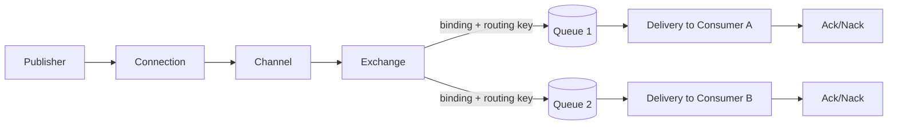
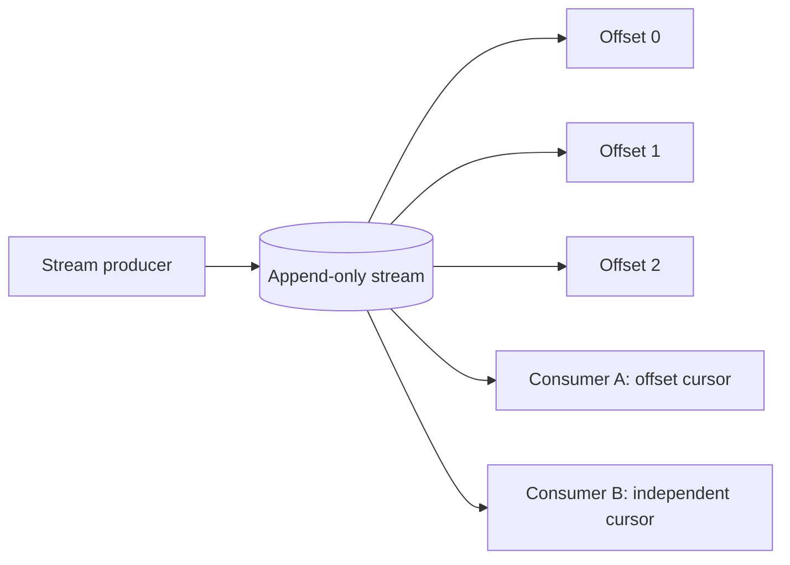
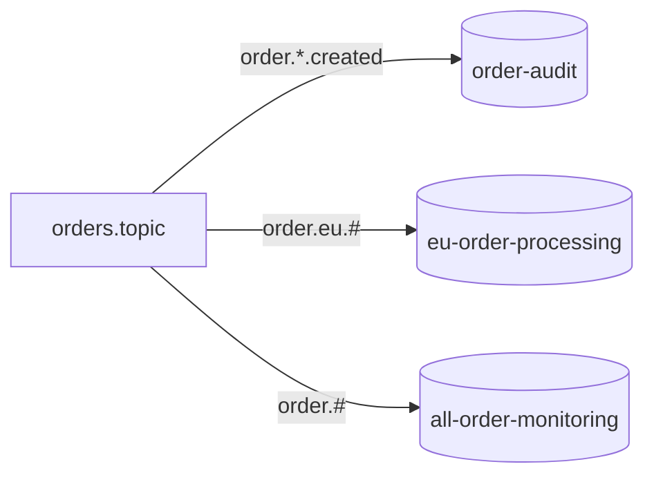
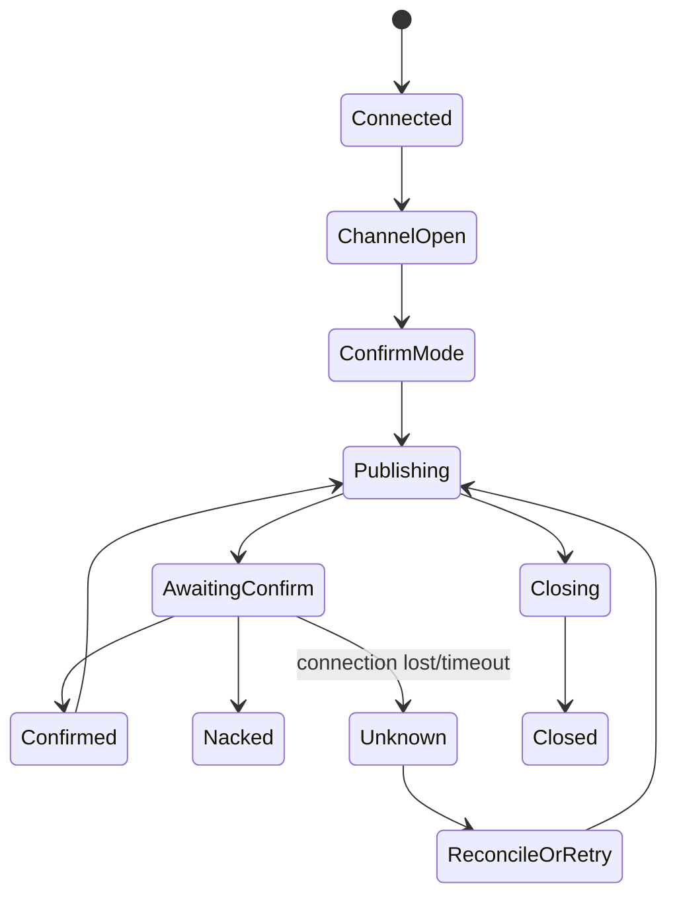
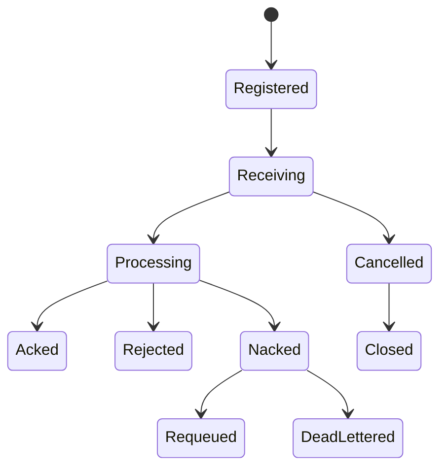
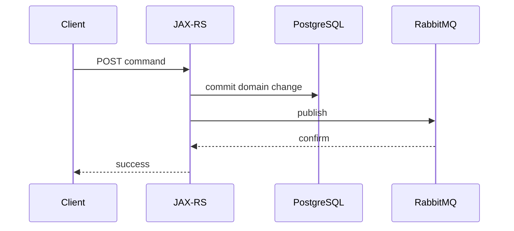

# Part 035 — RabbitMQ, RabbitMQ Stream, and Messaging Trade-offs

> RabbitMQ dapat berperan sebagai queue-oriented broker dan stream-oriented broker, tetapi kedua model tersebut tidak boleh disamakan. Queue mendistribusikan deliveries kepada competing consumers dan menghapus message setelah acknowledgement yang berhasil. Stream mempertahankan append-only records berdasarkan retention dan memungkinkan banyak consumers membaca ulang dari offset berbeda. Correctness bergantung pada topology, routing, publisher confirms, acknowledgement boundary, redelivery, queue type, ordering scope, retry policy, dan broker failure behavior.

## Daftar Isi

1. [Target kompetensi](#target-kompetensi)
2. [Scope dan baseline](#scope-dan-baseline)
3. [Boundary dengan Kafka dan event-governance parts](#boundary-dengan-kafka-dan-event-governance-parts)
4. [Mental model RabbitMQ](#mental-model-rabbitmq)
5. [Protocols, broker, virtual host, dan plugins](#protocols-broker-virtual-host-dan-plugins)
6. [Connection dan channel lifecycle](#connection-dan-channel-lifecycle)
7. [Java client thread ownership](#java-client-thread-ownership)
8. [Connection recovery dan topology recovery](#connection-recovery-dan-topology-recovery)
9. [Exchange](#exchange)
10. [Direct exchange](#direct-exchange)
11. [Topic exchange](#topic-exchange)
12. [Fanout exchange](#fanout-exchange)
13. [Headers exchange](#headers-exchange)
14. [Default exchange](#default-exchange)
15. [Queue](#queue)
16. [Binding dan routing key](#binding-dan-routing-key)
17. [Declare, bind, dan topology ownership](#declare-bind-dan-topology-ownership)
18. [Durable, exclusive, dan auto-delete](#durable-exclusive-dan-auto-delete)
19. [Server-named queues](#server-named-queues)
20. [Classic queues](#classic-queues)
21. [Quorum queues](#quorum-queues)
22. [Queue replication, quorum, dan availability](#queue-replication-quorum-dan-availability)
23. [Publisher lifecycle](#publisher-lifecycle)
24. [Publish routing dan unroutable messages](#publish-routing-dan-unroutable-messages)
25. [`mandatory` dan returned messages](#mandatory-dan-returned-messages)
26. [Publisher confirms](#publisher-confirms)
27. [Confirms versus AMQP transactions](#confirms-versus-amqp-transactions)
28. [Confirm sequence tracking](#confirm-sequence-tracking)
29. [Publish ambiguity dan idempotency](#publish-ambiguity-dan-idempotency)
30. [Consumer lifecycle](#consumer-lifecycle)
31. [Push consumers dan deliveries](#push-consumers-dan-deliveries)
32. [Automatic acknowledgement](#automatic-acknowledgement)
33. [Manual acknowledgement](#manual-acknowledgement)
34. [`basicAck`, `basicReject`, dan `basicNack`](#basicack-basicreject-dan-basicnack)
35. [Delivery tags dan channel scope](#delivery-tags-dan-channel-scope)
36. [Redelivery semantics](#redelivery-semantics)
37. [Prefetch dan flow control](#prefetch-dan-flow-control)
38. [Consumer capacity dan concurrency](#consumer-capacity-dan-concurrency)
39. [Ordering guarantees](#ordering-guarantees)
40. [Single Active Consumer](#single-active-consumer)
41. [Consumer cancellation](#consumer-cancellation)
42. [Acknowledgement timeout](#acknowledgement-timeout)
43. [Poison-message loops](#poison-message-loops)
44. [Dead-letter exchanges](#dead-letter-exchanges)
45. [Dead-letter routing and cycles](#dead-letter-routing-and-cycles)
46. [Queue and message TTL](#queue-and-message-ttl)
47. [Queue length limits and overflow](#queue-length-limits-and-overflow)
48. [Message priorities](#message-priorities)
49. [Quorum queue delivery limit](#quorum-queue-delivery-limit)
50. [Retry topologies](#retry-topologies)
51. [Delayed-message strategies](#delayed-message-strategies)
52. [Request-reply and correlation](#request-reply-and-correlation)
53. [RPC over RabbitMQ trade-offs](#rpc-over-rabbitmq-trade-offs)
54. [RabbitMQ Stream mental model](#rabbitmq-stream-mental-model)
55. [Stream queue versus Stream Protocol](#stream-queue-versus-stream-protocol)
56. [Stream append and offset](#stream-append-and-offset)
57. [Stream retention](#stream-retention)
58. [Stream producers](#stream-producers)
59. [Publisher deduplication](#publisher-deduplication)
60. [Stream consumers and offset tracking](#stream-consumers-and-offset-tracking)
61. [Consumer names and stored offsets](#consumer-names-and-stored-offsets)
62. [Stream filtering](#stream-filtering)
63. [Super streams](#super-streams)
64. [Partition routing in super streams](#partition-routing-in-super-streams)
65. [Stream replication and availability](#stream-replication-and-availability)
66. [RabbitMQ queue versus stream](#rabbitmq-queue-versus-stream)
67. [RabbitMQ Stream versus Kafka](#rabbitmq-stream-versus-kafka)
68. [Protocol and client selection](#protocol-and-client-selection)
69. [JAX-RS command boundary](#jax-rs-command-boundary)
70. [Database and broker atomicity](#database-and-broker-atomicity)
71. [Security and multi-tenancy](#security-and-multi-tenancy)
72. [TLS, credentials, and virtual hosts](#tls-credentials-and-virtual-hosts)
73. [Resource alarms and backpressure](#resource-alarms-and-backpressure)
74. [Cluster, Kubernetes, and storage](#cluster-kubernetes-and-storage)
75. [Topology policies and operator policies](#topology-policies-and-operator-policies)
76. [Observability](#observability)
77. [Failure-model matrix](#failure-model-matrix)
78. [Debugging playbook](#debugging-playbook)
79. [Testing strategy](#testing-strategy)
80. [Architecture patterns](#architecture-patterns)
81. [Anti-patterns](#anti-patterns)
82. [PR review checklist](#pr-review-checklist)
83. [Trade-off yang harus dipahami senior engineer](#trade-off-yang-harus-dipahami-senior-engineer)
84. [Internal verification checklist](#internal-verification-checklist)
85. [Latihan verifikasi](#latihan-verifikasi)
86. [Ringkasan](#ringkasan)
87. [Referensi resmi](#referensi-resmi)

---

## Target kompetensi

Setelah menyelesaikan part ini, Anda harus mampu:

- menjelaskan path publisher → exchange → binding → queue/stream → consumer;
- membedakan broker, virtual host, connection, channel, exchange, queue, binding, delivery, dan acknowledgement;
- memilih exchange type berdasarkan routing invariant;
- menjelaskan classic queue, quorum queue, stream, dan super stream;
- memisahkan publisher confirms dari consumer acknowledgements;
- menangani unroutable publish, returned messages, confirm ambiguity, dan duplicate publication;
- menentukan acknowledgement boundary berdasarkan side effect;
- menggunakan prefetch dan bounded concurrency untuk mengontrol in-flight messages;
- mendeteksi poison-message redelivery loop;
- mendesain DLX, TTL, retry lanes, dan terminal quarantine;
- memahami queue ordering limits dan Single Active Consumer;
- menjelaskan RabbitMQ Stream offset, retention, producer deduplication, consumers, filtering, dan partitioning;
- membandingkan queue, stream, RabbitMQ Stream, dan Kafka berdasarkan delivery model;
- menghubungkan RabbitMQ lifecycle dengan JAX-RS request, database transaction, Kubernetes shutdown, dan observability;
- mereview topology/configuration tanpa mengasumsikan internal CSG architecture.

---

## Scope dan baseline

Baseline:

- Java 17+;
- official RabbitMQ Java client atau wrapper setara;
- AMQP 0-9-1 sebagai model queue utama;
- RabbitMQ Stream Protocol/Java client sebagai model streaming;
- RabbitMQ modern;
- JAX-RS service;
- Kubernetes/cloud/on-prem dapat digunakan;
- reliability principles dari Part 024 dan Part 034.

Part ini **tidak mengasumsikan**:

- RabbitMQ digunakan di CSG Quote & Order;
- exact server/client version;
- classic, quorum, atau stream queue type;
- mirrored classic queues;
- automatic recovery settings;
- managed RabbitMQ atau self-hosted;
- delayed-message plugin tersedia;
- one vhost per tenant;
- exact retry/DLX naming;
- RabbitMQ Operator;
- stream protocol digunakan langsung;
- topology dideklarasikan aplikasi atau platform.

> Classic queue mirroring lama telah dihapus pada RabbitMQ 4.x; jangan menyalin konfigurasi HA lama. Verifikasi exact version dan support policy internal.

---

## Boundary dengan Kafka dan event-governance parts

| Part | Fokus |
|---|---|
| Part 032 | Kafka producer/consumer/offset lifecycle |
| Part 033 | Event/schema governance |
| Part 034 | Kafka reliability, Streams, CDC, outbox |
| Part 035 | RabbitMQ queues, streams, routing, acknowledgements, broker operations |

RabbitMQ dapat membawa event contracts yang sama, tetapi delivery and retention semantics berbeda.

---

## Mental model RabbitMQ

Queue path:



Stream path:



Queue principle:

```text
delivery acknowledged → broker may remove queue copy
```

Stream principle:

```text
records remain according to retention → consumers maintain independent positions
```

---

## Protocols, broker, virtual host, dan plugins

RabbitMQ supports multiple protocols through core and plugins, including AMQP 0-9-1, AMQP 1.0, MQTT, STOMP, and RabbitMQ Stream Protocol.

A virtual host provides a logical namespace and authorization boundary for:

- exchanges;
- queues;
- bindings;
- policies;
- permissions.

Vhost is not automatically a strong tenant-isolation mechanism for noisy-neighbor resource usage. Cluster resources remain shared.

---

## Connection dan channel lifecycle

Connection:

- TCP/TLS connection;
- authentication;
- heartbeat;
- network I/O;
- expensive relative to channel.

Channel:

- virtual AMQP session multiplexed on connection;
- publishing;
- consuming;
- acknowledgements;
- confirms;
- transaction mode;
- delivery-tag namespace.

Typical ownership:

```text
application process
  → small number of long-lived connections
  → channels per publisher/consumer owner
```

Avoid connection per request/message.

---

## Java client thread ownership

Official Java client connections are intended to be long-lived. Channel use requires deliberate concurrency ownership.

Safe rules:

- one consumer callback channel is not shared for arbitrary concurrent acknowledgements;
- publishing concurrently on one channel can interleave protocol frames and complicate confirm tracking;
- prefer channel per publisher thread or a bounded channel pool if justified;
- delivery tag must be acknowledged on the same channel;
- connection can host multiple channels;
- callbacks should not block connection I/O indefinitely.

Exact thread-safety guarantees depend on Java client version; verify Javadocs and wrapper behavior.

---

## Connection recovery dan topology recovery

Automatic recovery may restore:

- connection;
- channels;
- consumers;
- declared topology, depending configuration.

It does not automatically recover:

- application side effect;
- messages not confirmed;
- business idempotency;
- externally modified topology;
- in-memory delivery state;
- exact consumer progress beyond broker queue semantics.

Recovery can race with application shutdown or custom reconnect logic. Do not stack two independent recovery loops.

---

## Exchange

Exchange routes publications to queues/streams based on exchange type, bindings, and routing attributes.

Exchange does not persist messages independently after routing. Durability resides in destination queue/stream and publication properties.

Important attributes:

- name;
- type;
- durable;
- auto-delete;
- internal;
- arguments.

---

## Direct exchange

Routes when routing key exactly matches binding key.

Use for:

- command routing;
- exact category;
- one logical destination key.

Example:

```text
routing key: order.activate
binding key: order.activate
```

Multiple queues can bind the same key and each receives a copy.

---

## Topic exchange

Matches dot-separated routing keys using patterns:

- `*` matches one segment;
- `#` matches zero or more segments.

Example:

```text
quote.eu.approved
quote.*.approved
quote.#
```

Risks:

- broad bindings unintentionally duplicate traffic;
- undocumented routing taxonomy;
- key segment changes break consumers;
- wildcard overlap.

Routing keys are contracts and require governance.

---

## Fanout exchange

Routes to all bound queues and ignores routing key.

Use for broadcast where each consumer group has its own queue.

Do not place multiple consumers needing independent copies on one queue; they will compete instead of broadcast.

---

## Headers exchange

Routes using message headers.

Trade-offs:

- flexible matching;
- harder operational visibility;
- header type/encoding issues;
- routing policy spread across producers;
- message-header growth.

Prefer direct/topic unless header semantics are clearly justified.

---

## Default exchange

The default nameless direct exchange automatically binds queue names as routing keys.

Publishing to queue name via default exchange is convenient but can hide architecture:

```text
publisher → implicit default exchange → queue
```

Explicit exchanges improve decoupling and routing governance.

---

## Queue

A queue stores messages until:

- delivered and acknowledged;
- expired;
- dead-lettered;
- evicted by limits/overflow;
- purged/deleted;
- lost under failure semantics.

Queue properties and policies determine durability, availability, and resource usage.

---

## Binding dan routing key

Binding connects exchange to queue with routing criteria.

Topology example:



One publish may route to multiple queues, creating independent copies.

---

## Declare, bind, dan topology ownership

Declarations are idempotent only when existing entity properties match.

Redeclaring same queue name with incompatible attributes causes channel-level error.

Choose owner:

- application startup;
- infrastructure pipeline;
- RabbitMQ definitions;
- operator;
- platform team.

Avoid hidden topology mutation by every service unless standard explicitly allows it.

---

## Durable, exclusive, dan auto-delete

Durable:

- queue/exchange definition survives broker restart;
- message durability also depends on persistent publication and queue type.

Exclusive:

- scoped to declaring connection;
- deleted when connection closes;
- useful for temporary reply/subscription queues.

Auto-delete:

- deleted after qualifying consumer lifecycle conditions;
- race-prone with recovery and fixed names.

These flags are not interchangeable.

---

## Server-named queues

Declare empty queue name to receive generated name.

Useful for:

- temporary exclusive consumers;
- reply queues;
- transient fanout subscriptions.

Generated name must be captured and used for binding/consumer registration.

---

## Classic queues

Classic queue can be suitable for:

- non-replicated workloads;
- transient/low-criticality queues;
- specific compatibility cases.

Do not assume classic queue is HA. Modern RabbitMQ guidance generally uses quorum queues for replicated durable queues.

---

## Quorum queues

Quorum queues use a replicated consensus-based design.

Characteristics:

- durable and replicated;
- publisher confirms integrate with quorum durability;
- manual consumer acknowledgements recommended;
- leader and followers;
- majority required for progress;
- poison-message delivery limits supported;
- some classic-queue features differ or are unsupported.

Use for critical queue semantics where replicated safety matters.

---

## Queue replication, quorum, dan availability

With quorum queues, successful publisher confirm indicates the message has met quorum safety conditions according to broker semantics.

Trade-off:

```text
more replicas
  → stronger failure tolerance
  → more network/disk/write cost
```

Loss of majority reduces availability. Replication does not replace backups, topology governance, or consumer idempotency.

---

## Publisher lifecycle



Publisher owns:

- connection/channel;
- serialization;
- routing;
- confirm sequence state;
- returned-message handling;
- retry/idempotency;
- metrics;
- shutdown drain.

---

## Publish routing dan unroutable messages

A publish can be accepted by exchange but routed to zero queues.

Without `mandatory` or alternate exchange, unroutable messages can be discarded according to broker behavior.

“Publish succeeded” must distinguish:

- protocol accepted;
- routed;
- persisted/replicated;
- confirmed;
- consumed;
- business effect completed.

---

## `mandatory` dan returned messages

With `mandatory=true`, unroutable publication is returned to publisher.

Publisher must register return callback and correlate returned message.

Returned message is separate from confirm semantics:

- confirm can acknowledge exchange acceptance while message is returned as unroutable;
- application must process both signals correctly.

---

## Publisher confirms

Publisher confirm mode gives asynchronous acknowledgements from broker for published messages.

Confirms are orthogonal to consumer acknowledgements.

```text
publisher confirm:
broker accepted/safely handled publish according to destination semantics

consumer acknowledgement:
consumer completed handling delivery sufficiently for broker to remove/release it
```

Use confirms for reliable publishing.

---

## Confirms versus AMQP transactions

AMQP channel transactions provide `tx.select`, `tx.commit`, `tx.rollback`.

Trade-off:

- simple conceptual atomic batches;
- significantly lower throughput/latency;
- not distributed transaction with database;
- still requires consumer idempotency.

Publisher confirms are generally preferred for high-throughput reliable publishing.

---

## Confirm sequence tracking

Efficient asynchronous publisher:

1. read next publish sequence number;
2. map sequence → message/event ID;
3. publish;
4. handle ack/nack callbacks;
5. use `multiple` flag to clear ranges;
6. bound outstanding confirms;
7. timeout/reconcile unknown outcomes.

Use ordered data structure for range confirmation.

Callbacks must be fast and thread-safe.

---

## Publish ambiguity dan idempotency

Connection can fail after broker accepted a publish but before publisher receives confirm.

Outcome is unknown.

Retry can duplicate message.

Therefore:

- stable message/event ID;
- consumer idempotency;
- publisher outbox;
- reconciliation;
- never assume timeout means not published.

---

## Consumer lifecycle



---

## Push consumers dan deliveries

RabbitMQ commonly pushes deliveries to registered consumers.

A delivery contains:

- consumer tag;
- envelope;
- delivery tag;
- redelivery flag;
- exchange;
- routing key;
- properties/headers;
- body.

Consumer callback should hand off only to bounded processing capacity.

---

## Automatic acknowledgement

Auto-ack considers delivery handled when sent to client.

If process dies before side effect, message is lost from queue perspective.

Use only when loss is acceptable or handling is immediate/non-critical.

---

## Manual acknowledgement

Manual ack lets consumer acknowledge after durable side effect.

Typical pattern:

```text
delivery
  → validate
  → perform idempotent DB transaction
  → ack
```

Crash after DB commit before ack causes redelivery, requiring idempotency.

---

## `basicAck`, `basicReject`, dan `basicNack`

- `basicAck`: acknowledge delivery; may acknowledge multiple deliveries.
- `basicReject`: reject one delivery, requeue or discard/dead-letter.
- `basicNack`: RabbitMQ extension supporting multiple flag and requeue.

Avoid multi-ack unless completion ordering is tracked. Acknowledging delivery tag N with `multiple=true` also acknowledges all unacked lower tags on that channel.

---

## Delivery tags dan channel scope

Delivery tags are scoped per channel.

Acknowledging on a different channel causes protocol error and channel closure.

Worker-pool designs must return completion to channel owner or preserve channel affinity.

---

## Redelivery semantics

Redelivery can occur after:

- consumer connection loss;
- channel closure;
- negative acknowledgement with requeue;
- acknowledgement timeout;
- broker recovery/failover;
- application restart.

`redelivered=true` indicates possible previous delivery, not exact attempt count.

Messages may have been processed before redelivery. Use stable business ID.

---

## Prefetch dan flow control

Prefetch limits unacknowledged deliveries.

```text
prefetch too high:
  large in-flight memory
  unfair distribution
  slow recovery
  many duplicates after crash

prefetch too low:
  lower utilization/throughput
```

Set based on:

```text
consumer concurrency × processing latency × memory/duplicate budget
```

RabbitMQ prefetch semantics can be applied per consumer/channel depending API and configuration. Verify exact code.

---

## Consumer capacity dan concurrency

Capacity is bounded by:

- consumers;
- channels;
- prefetch;
- worker threads;
- downstream DB/API;
- message size;
- ordering constraints.

Scaling consumers beyond queue throughput or downstream capacity amplifies contention.

---

## Ordering guarantees

Queue order is not equal to side-effect completion order.

Ordering can be affected by:

- multiple consumers;
- redelivery;
- priorities;
- requeue;
- failover;
- concurrent workers;
- retry queues.

Strict order requires constrained architecture, commonly one active consumer and sequential processing, with throughput cost.

---

## Single Active Consumer

Single Active Consumer allows one consumer to receive deliveries while others wait as failover candidates.

Useful for:

- order-sensitive queue;
- active-passive consumption;
- simplified state ownership.

It does not eliminate duplicates after failure and does not make external effects transactional.

---

## Consumer cancellation

Broker can cancel consumer when queue is deleted or unavailable.

Client must handle cancellation callback and decide:

- fail readiness;
- retry topology recovery;
- alert;
- shut down;
- wait for recovery.

Do not silently remain “healthy” with no active consumer.

---

## Acknowledgement timeout

RabbitMQ can enforce consumer delivery acknowledgement timeout.

Long processing beyond timeout can close channel and requeue deliveries.

Design:

- bounded processing;
- appropriate timeout;
- split long tasks;
- checkpoint externally;
- avoid human/manual wait inside delivery;
- monitor oldest unacked delivery.

---

## Poison-message loops

Failure loop:

```text
deliver → deterministic failure → requeue → deliver → failure ...
```

Effects:

- CPU/log amplification;
- queue starvation;
- downstream overload;
- no progress.

Use attempt/delivery limit, DLX, classification, and terminal quarantine.

---

## Dead-letter exchanges

A message may be dead-lettered due to:

- consumer reject/nack without requeue;
- TTL expiry;
- queue length overflow;
- quorum delivery limit;
- other supported conditions.

DLX is a normal exchange configured by policy/arguments.

Use policies where possible for operational flexibility rather than hard-coded queue arguments.

---

## Dead-letter routing and cycles

Dead-letter routing can preserve or replace routing key.

Risks:

- cycle back to original queue;
- missing DLX exchange/permission;
- unroutable dead letters;
- headers grow with history;
- repeated loop.

Terminal DLQ should have owner, retention, alerts, and redrive procedure.

---

## Queue and message TTL

TTL may apply to:

- queue expiration;
- per-queue message TTL;
- per-message expiration.

Expiry timing and ordering can be subtle, especially with head-of-line messages and queue type/version.

TTL is not precise scheduling.

---

## Queue length limits and overflow

Limits can be based on message count/bytes.

Overflow policy may:

- reject new publishes;
- drop/dead-letter older messages;
- interact with confirms.

Choose based on data-loss policy. Monitor before hard limit.

---

## Message priorities

Priority queues can reorder delivery.

Costs:

- extra internal priority buckets/resources;
- starvation risk;
- ordering complexity.

Use small bounded priority range and only when business semantics justify it.

---

## Quorum queue delivery limit

Quorum queues can track redeliveries and apply delivery limit.

After limit, message can be dropped or dead-lettered based on configuration.

Verify exact defaults/version and DLX policy. Do not rely on unlimited poison retries.

---

## Retry topologies

### Requeue in place

Simple, preserves queue but can hot-loop.

### Retry queue with TTL + DLX

```text
main → retry queue (TTL) → DLX back to main
```

Provides delay but can affect order and create head-of-line behavior.

### Multiple retry stages

```text
5s → 1m → 10m → terminal DLQ
```

### Scheduled application retry

Persist next attempt in database/job scheduler.

Best choice depends on delay precision, ordering, volume, and operability.

---

## Delayed-message strategies

The delayed-message exchange plugin may exist, but plugin availability/support must be verified.

Core alternatives:

- TTL/DLX queues;
- scheduler/database;
- stream consumer selecting by timestamp;
- external workflow engine.

Do not make a critical architecture depend on an unverified plugin.

---

## Request-reply and correlation

RabbitMQ RPC uses:

- request queue/routing key;
- `correlationId`;
- reply queue or direct reply-to;
- timeout;
- duplicate response handling.

Client must handle:

- late response;
- missing response;
- responder duplication;
- caller restart;
- reply queue deletion;
- ambiguous command effect.

---

## RPC over RabbitMQ trade-offs

Advantages:

- decoupled transport;
- buffering;
- broker routing.

Risks:

- synchronous coupling remains;
- hard timeout/cancellation;
- no natural HTTP/gRPC status contract;
- request/reply queue lifecycle;
- tracing complexity;
- backlog creates stale requests.

Use commands/events for async workflows; use HTTP/gRPC for request-response unless broker RPC has a specific operational reason.

---

## RabbitMQ Stream mental model

A stream is a replicated append-only log with retention.

Consumers can:

- begin from first;
- last;
- next;
- explicit offset;
- timestamp;
- stored offset.

Multiple consumers independently replay.

---

## Stream queue versus Stream Protocol

RabbitMQ streams can be accessed through:

- AMQP clients using stream queue semantics;
- native Stream Protocol/client optimized for high throughput, offsets, and stream features.

Native Stream client commonly provides richer producer/consumer stream capabilities and lower overhead.

Verify which path internal code uses.

---

## Stream append and offset

Broker assigns monotonically increasing offsets within a stream.

Offset is stream-local and not global across super-stream partitions.

Publication confirm indicates broker handling according to stream semantics, but producer retry ambiguity still needs deduplication.

---

## Stream retention

Streams retain by configured size and/or age.

Retention is independent of individual consumer acknowledgement.

Capacity planning:

```text
ingress bytes/sec × retention duration × replicas
```

plus segment/index overhead and headroom.

Slow consumer does not itself prevent retention deletion; it can fall behind retained history.

---

## Stream producers

Stream producer lifecycle includes:

- environment/connection;
- stream declaration verification;
- producer name if deduplication used;
- publishing IDs;
- confirmations/errors;
- bounded outstanding messages;
- close/drain.

Do not create producer per event.

---

## Publisher deduplication

RabbitMQ Stream supports producer-side deduplication using stable producer name and monotonically increasing publishing IDs.

It protects supported retransmission cases, not arbitrary business duplicates from multiple producers.

Business event ID remains required.

---

## Stream consumers and offset tracking

Consumer reads from configured offset specification and can store offsets.

Processing semantics remain:

```text
read record
  → side effect
  → store/advance offset
```

Crash after side effect before offset store causes replay.

Use idempotency.

---

## Consumer names and stored offsets

Stable consumer name enables broker-side stored offset association in supported clients.

Changing consumer name can create new cursor/replay behavior.

Treat consumer identity as durable configuration.

---

## Stream filtering

Filtering can reduce deliveries using producer-provided filter values and consumer criteria.

Caveats:

- false positives may be delivered depending mechanism;
- filtering is not authorization;
- producer must populate filter values correctly;
- filtered consumers still need schema/key semantics;
- availability/version support must be verified.

---

## Super streams

A super stream partitions a logical stream across multiple underlying streams.

Benefits:

- parallelism;
- throughput scaling;
- partitioned consumption.

Costs:

- no global order;
- routing-key design;
- partition count/topology;
- consumer coordination;
- more replicas/storage.

---

## Partition routing in super streams

Routing commonly hashes or maps a routing key to partition.

Choose key from ordering requirement.

Changing partition count or routing algorithm can redistribute future messages and affect order continuity.

---

## Stream replication and availability

Streams are replicated across nodes.

Data safety and confirm behavior differ from quorum queues and depend on leader/replica state.

Use official version-specific guidance and failure testing. Do not infer quorum-queue guarantees automatically.

---

## RabbitMQ queue versus stream

| Dimension | Queue | Stream |
|---|---|---|
| Consumption | competing delivery | independent cursors |
| Removal | after ack/expiry | retention policy |
| Replay | limited/requeue/DLQ | native offset replay |
| Ordering | queue delivery, disrupted by concurrency/requeue | per stream/partition offset |
| Parallelism | consumers on queue | partitions/super stream |
| State | broker tracks unacked deliveries | consumers track offsets |
| Use | commands/work distribution | event log/replay/fan-out |

---

## RabbitMQ Stream versus Kafka

| Dimension | RabbitMQ Stream | Kafka |
|---|---|---|
| Broker ecosystem | RabbitMQ unified queue/stream broker | log-centric platform |
| Protocol | Stream Protocol / AMQP access | Kafka protocol |
| Partitioning | super streams | topic partitions |
| Consumer state | offsets, stream clients | consumer groups/offsets |
| Processing library | client-focused | Kafka Streams/Connect ecosystem |
| Queue semantics | same broker also supports queues | not native work queue semantics |
| Operational fit | mixed queue + stream estate | large event-log ecosystem |

Selection should consider platform skills, throughput, retention, replay, ecosystem, and existing standards—not brand preference.

---

## Protocol and client selection

Questions:

- AMQP 0-9-1 or AMQP 1.0?
- native Java client or framework wrapper?
- native Stream client or AMQP stream queue?
- managed client recovery?
- reactive client?
- OpenTelemetry instrumentation?
- TLS/SASL mechanism?
- supported server/client matrix?

Keep messaging abstraction thin enough to expose ack, confirm, routing, and failure semantics.

---

## JAX-RS command boundary

Naïve path:



DB and RabbitMQ are not one transaction.

Prefer outbox where durable state and publish intent must be atomic.

`202 Accepted` should mean durable acceptance, not merely local channel publish call.

---

## Database and broker atomicity

Patterns:

- transactional outbox + publisher;
- broker-first plus idempotent command store, if semantics allow;
- inbox for consumer;
- reconciliation.

AMQP transaction does not include PostgreSQL.

XA/distributed transaction should be used only under explicit platform architecture and operational acceptance.

---

## Security and multi-tenancy

Controls:

- vhosts;
- users/service identities;
- configure/write/read permissions;
- topic/queue naming;
- TLS;
- network policy;
- management API permissions;
- stream permissions;
- policy ownership.

Tenant ID inside routing key is not sufficient authorization. Broker principal and application-level tenant checks remain necessary.

---

## TLS, credentials, and virtual hosts

Verify:

- endpoint and port;
- TLS minimum/version;
- trust chain;
- hostname verification;
- client certificates;
- username/password or external auth;
- rotation;
- heartbeat;
- connection name;
- vhost;
- permissions.

Do not place credentials in URI logs.

---

## Resource alarms and backpressure

RabbitMQ can raise memory/disk alarms and block publishers/connections.

Application symptoms:

- publish latency;
- blocked connection callback;
- confirm delay;
- timeout;
- buffer growth;
- request-thread exhaustion.

Respond with load shedding and operational recovery, not infinite retry.

---

## Cluster, Kubernetes, and storage

Stateful RabbitMQ requires:

- stable identity;
- persistent volumes;
- anti-affinity;
- network reliability;
- quorum placement;
- disk IOPS/latency;
- graceful node maintenance;
- upgrade sequencing;
- backup definitions/config;
- monitoring.

Kubernetes pod restart is not a universal repair for broker state.

---

## Topology policies and operator policies

Policies can manage:

- queue type;
- DLX;
- TTL;
- length;
- overflow;
- replication/stream settings;
- limits.

Operator policies may constrain user policies.

Prefer policies for mutable operational settings; use application declarations for stable logical topology according to internal standard.

---

## Observability

Publisher metrics:

- connections/channels;
- publish rate/bytes;
- confirms/nacks;
- outstanding confirms;
- returned unroutable;
- blocked duration;
- connection recovery;
- serialization failures.

Queue metrics:

- ready;
- unacked;
- ingress/delivery/ack;
- redelivery;
- consumers;
- consumer capacity;
- memory/disk;
- quorum health;
- DLQ age/count.

Stream metrics:

- publish/confirm;
- offsets;
- retention/storage;
- consumer lag;
- replicas;
- filter ratio;
- super-stream partition skew.

Trace/log identifiers:

- message/event ID;
- exchange;
- routing key;
- queue/stream;
- consumer;
- redelivery;
- delivery tag/offset;
- correlation/causation.

Avoid high-cardinality message IDs in metrics.

---

## Failure-model matrix

| Failure | Effect | Detection | Response |
|---|---|---|---|
| Unroutable publish | silent loss without mandatory/alternate | return metrics | mandatory + topology tests |
| Confirm unknown | possible duplicate on retry | timeout/connection loss | stable ID + idempotent consumer |
| Publisher nack | message not accepted safely | confirm callback | bounded retry/fail |
| Queue declaration mismatch | channel closes | protocol exception | centralized topology |
| Auto-ack crash | message loss | audit gap | manual ack |
| Ack before DB commit | effective loss | inconsistent state | ack after durable effect |
| DB commit before ack crash | duplicate replay | inbox duplicate | idempotent consumer |
| Ack on wrong channel | channel protocol error | channel closed | channel ownership |
| Prefetch too high | memory/unfairness/duplicates | unacked count | tune/bound |
| Requeue poison loop | no progress | redelivery rate | DLX/delivery limit |
| Missing DLX | dead messages dropped/unroutable | policy/topology | verify terminal route |
| Retry cycle | infinite loop | x-death/history | max attempts |
| Priority starvation | low-priority stuck | age by priority | bounded priorities |
| Quorum loses majority | queue unavailable | cluster health | topology/capacity |
| Resource alarm | publishers blocked | broker alarm | shed load/restore resources |
| Consumer cancellation ignored | service healthy but inactive | callback/readiness | fail/repair |
| Stream retention overtakes consumer | replay gap | offset/lag | retention/capacity |
| Stream producer name collision | dedup/fencing confusion | publish errors | unique identity |
| Super-stream hot partition | uneven lag | partition metrics | key redesign |
| Broker restart during shutdown | duplicate/unknown state | lifecycle logs | confirms/idempotency |

---

## Debugging playbook

### Publish succeeds in code but no consumer receives

Check:

1. exchange exists/type;
2. vhost;
3. routing key;
4. bindings;
5. `mandatory` returns;
6. alternate exchange;
7. queue exists/type;
8. publish confirm;
9. consumer active;
10. correct environment.

### Messages remain ready

Check:

- consumers;
- consumer cancellation;
- permissions;
- prefetch;
- channel/connection;
- delivery rate;
- queue leader;
- application readiness.

### Unacked grows

Check:

- processing latency;
- downstream DB/API;
- stuck worker;
- prefetch;
- ack path;
- wrong channel;
- acknowledgement timeout;
- graceful shutdown.

### Redelivery storm

Inspect:

- redelivered flag;
- nack/requeue logic;
- consumer crashes;
- ack timeout;
- queue delivery count/x-death;
- poison payload;
- DLX route.

### Quorum queue unavailable

Check:

- leader;
- replicas;
- majority;
- network partition;
- disk;
- node maintenance;
- membership;
- placement.

Do not delete/redeclare without data-loss assessment.

### Publisher blocked

Check:

- memory/disk alarms;
- connection blocked callback;
- disk free;
- queue backlog;
- stream retention;
- confirm latency;
- network.

### Stream consumer cannot resume

Check:

- consumer name;
- stored offset;
- retention;
- stream identity;
- offset specification;
- client/server version;
- super-stream partition mapping.

---

## Testing strategy

### Topology tests

- exchange/queue declarations;
- bindings;
- mismatch failure;
- policy application;
- DLX routing;
- permissions.

### Publisher tests

- mandatory return;
- confirm ack/nack;
- connection loss after publish;
- outstanding confirm bounds;
- retry duplicate;
- graceful close.

### Consumer tests

- crash before/after DB commit;
- ack/nack/reject;
- wrong-channel prevention;
- prefetch;
- consumer cancellation;
- poison loop;
- acknowledgement timeout.

### Quorum tests

- node loss;
- leader change;
- loss of minority;
- loss of majority;
- recovery;
- delivery-limit/DLX.

### Stream tests

- offset start;
- consumer restart;
- publisher dedup;
- retention gap;
- filtering;
- super-stream partition/order;
- replica loss.

Use a real RabbitMQ broker/container; mocks do not model confirms, redeliveries, topology, or quorum.

---

## Architecture patterns

### Work queue

```text
direct exchange → quorum queue → competing idempotent consumers
```

### Broadcast

```text
fanout/topic exchange → one queue per consumer group
```

### Retry lanes

```text
main queue → retry queues with TTL/DLX → terminal DLQ
```

### Outbox publisher

```text
DB state + outbox → RabbitMQ publisher confirms → mark/retain evidence
```

### Single Active Consumer

One active ordered consumer with standby consumers.

### Event stream

Native stream/super stream with independent replayable consumers.

---

## Anti-patterns

- connection per request;
- channel shared indiscriminately across threads;
- no publisher confirms;
- no `mandatory` handling for critical routing;
- auto-ack before side effect;
- acknowledgement on worker-created different channel;
- unlimited prefetch;
- `requeue=true` for every exception;
- DLQ without owner;
- TTL used as precise scheduler;
- hard-coded DLX arguments everywhere;
- classic queue assumed replicated;
- mirrored classic queue configuration copied to modern RabbitMQ;
- priority queue for ordinary business ordering;
- broker RPC for long-running workflows;
- queue name as hidden API contract;
- using vhost as complete tenant isolation;
- ignoring resource alarms;
- stream treated like queue acknowledgements;
- changing super-stream key/partitions without migration;
- claiming no duplicates because confirms/dedup are enabled.

---

## PR review checklist

### Topology

- [ ] Exchange type and routing invariant explicit?
- [ ] Queue type selected deliberately?
- [ ] Durable/exclusive/auto-delete correct?
- [ ] Bindings tested?
- [ ] Topology owner known?
- [ ] Policy versus arguments chosen intentionally?
- [ ] Unroutable behavior defined?

### Publishing

- [ ] Long-lived connection/channel ownership?
- [ ] Confirm mode enabled where required?
- [ ] Outstanding confirms bounded?
- [ ] Mandatory/return callback handled?
- [ ] Stable message/event ID?
- [ ] Unknown outcome policy?
- [ ] Persistent message properties and queue durability aligned?
- [ ] Shutdown drains confirms?

### Consumption

- [ ] Manual ack boundary after durable side effect?
- [ ] Idempotency/inbox?
- [ ] Ack occurs on owner channel?
- [ ] Prefetch evidence?
- [ ] Worker queues bounded?
- [ ] Redelivery and poison policy?
- [ ] Cancellation/readiness?
- [ ] Graceful drain?

### Retry/DLQ

- [ ] Retry classification?
- [ ] Attempts bounded?
- [ ] Delay semantics acceptable?
- [ ] Ordering impact?
- [ ] DLX route cannot cycle?
- [ ] Terminal DLQ owner/SLO/redrive?
- [ ] Sensitive payload protected?

### Queue/stream

- [ ] Quorum majority and placement?
- [ ] Single Active Consumer requirement?
- [ ] Stream retention sizing?
- [ ] Offset identity and restart policy?
- [ ] Publisher dedup identity?
- [ ] Super-stream routing/partitions?
- [ ] Queue versus stream choice justified?

### Operations/security

- [ ] TLS/auth/vhost/permissions?
- [ ] Resource alarm behavior?
- [ ] Dashboards/alerts?
- [ ] Kubernetes storage/anti-affinity?
- [ ] Client/server compatibility?
- [ ] Recovery/runbook tested?

---

## Trade-off yang harus dipahami senior engineer

| Decision | Benefit | Cost/risk |
|---|---|---|
| Direct exchange | predictable exact routing | less flexible fanout taxonomy |
| Topic exchange | expressive routing | wildcard complexity |
| Fanout | simple broadcast | copies and storage per queue |
| Quorum queue | replicated safety | majority/resource cost |
| Classic queue | lower/simple overhead | no quorum HA |
| Publisher confirms | reliable asynchronous evidence | confirm tracking complexity |
| AMQP transaction | simple atomic channel batch | low throughput, no DB atomicity |
| Auto ack | high throughput | loss on crash |
| Manual ack | recoverability | duplicates and in-flight state |
| High prefetch | throughput | unfairness/memory/duplicates |
| Low prefetch | bounded work | lower utilization |
| Requeue | immediate recovery | poison loop |
| TTL/DLX retry | broker-native delay | order/head-of-line/topology |
| Priority queue | urgent work | starvation/resource cost |
| Single Active Consumer | ordering/failover | serial throughput |
| Queue | work distribution | weak native replay |
| Stream | replay/fan-out | retention/offset operations |
| Super stream | scale | partition/order complexity |
| RabbitMQ unified platform | queue + stream in one estate | mixed semantics/operations |
| Kafka | broad log ecosystem | different work-queue fit |

---

## Internal verification checklist

### Platform

- [ ] RabbitMQ server version/support timeline.
- [ ] Java AMQP client version.
- [ ] Stream client version.
- [ ] Managed or self-hosted.
- [ ] Cluster nodes/AZs.
- [ ] Kubernetes Operator/StatefulSet.
- [ ] Protocols/plugins enabled.
- [ ] Definitions/policy source of truth.

### Connections and clients

- [ ] Connection factory/wrapper.
- [ ] Automatic recovery.
- [ ] Topology recovery.
- [ ] Heartbeat.
- [ ] Connection/channel ownership.
- [ ] Channel pooling.
- [ ] Executor/callback model.
- [ ] Shutdown ordering.
- [ ] OpenTelemetry instrumentation.

### Topology

- [ ] Exchanges/bindings.
- [ ] Queue types.
- [ ] Durable/exclusive/auto-delete.
- [ ] Quorum replica settings.
- [ ] Single Active Consumer.
- [ ] Prefetch.
- [ ] DLX/TTL/length/overflow policies.
- [ ] Priority settings.
- [ ] Alternate exchanges.
- [ ] Server-named queues.

### Reliability

- [ ] Publisher confirms.
- [ ] Mandatory returns.
- [ ] Persistent messages.
- [ ] Stable event IDs.
- [ ] Consumer ack policy.
- [ ] Inbox/idempotency.
- [ ] Delivery limits.
- [ ] Retry stages.
- [ ] DLQ/redrive.
- [ ] Outbox/reconciliation.

### Streams

- [ ] Streams enabled.
- [ ] Native protocol or AMQP.
- [ ] Retention.
- [ ] Replication.
- [ ] Producer names/publishing IDs.
- [ ] Consumer names/offset stores.
- [ ] Filtering.
- [ ] Super streams.
- [ ] Routing strategy.
- [ ] Lag dashboards.

### Security and operations

- [ ] Vhosts.
- [ ] Users/service identities.
- [ ] Configure/write/read permissions.
- [ ] TLS/mTLS.
- [ ] Secret/certificate rotation.
- [ ] Resource alarms.
- [ ] Disk/memory capacity.
- [ ] Queue/stream alerts.
- [ ] Backup/recovery.
- [ ] Node-maintenance runbook.
- [ ] Incident ownership.

---

## Latihan verifikasi

1. Trace one publication from exchange to binding, queue, delivery, DB commit, and ack.
2. Publish an unroutable message with and without `mandatory`.
3. Kill connection after broker acceptance but before confirm and observe duplicate risk.
4. Crash consumer after DB commit before ack; prove inbox safety.
5. Create poison message and verify delivery limit/DLX prevents hot loop.
6. Tune prefetch under slow DB and compare throughput, unacked, and duplicates.
7. Lose one quorum node, then majority, and document behavior.
8. Publish/read RabbitMQ Stream from first, timestamp, and stored offset.
9. Simulate retention overtaking a slow stream consumer.
10. Build super stream with skewed and balanced keys; compare partition lag.

---

## Ringkasan

- RabbitMQ queue and stream semantics are different.
- Exchange routes; queue/stream stores.
- Connections are long-lived; channels are lighter protocol sessions with scoped delivery tags.
- Exchange type and routing key are contract decisions.
- Durable declaration alone does not make messages safe.
- Quorum queues provide replicated durable queue semantics and integrate with confirms.
- Publisher confirms and consumer acknowledgements solve different boundaries.
- Unroutable publish must be handled explicitly.
- Publish timeout/connection loss can produce ambiguous outcome and duplicates.
- Manual ack after durable side effect gives at-least-once behavior.
- Prefetch controls in-flight work and recovery blast radius.
- Requeue without classification creates poison loops.
- DLX/TTL/retry topologies require bounded attempts, terminal ownership, and ordering analysis.
- Single Active Consumer helps ordered active-passive processing but does not remove duplicates.
- RabbitMQ Streams retain append-only data by policy and support offset replay.
- Producer deduplication is not business deduplication.
- Super streams add partitioned scale and remove global order.
- Database and RabbitMQ need outbox/inbox/reconciliation for reliable integration.
- Exact RabbitMQ version, queue types, policies, clients, and deployment remain **Internal verification checklist**.

---

## Referensi resmi

- [RabbitMQ Documentation](https://www.rabbitmq.com/docs)
- [RabbitMQ Queues](https://www.rabbitmq.com/docs/queues)
- [RabbitMQ Exchanges](https://www.rabbitmq.com/docs/exchanges)
- [RabbitMQ Consumer Acknowledgements and Publisher Confirms](https://www.rabbitmq.com/docs/confirms)
- [RabbitMQ Consumers](https://www.rabbitmq.com/docs/consumers)
- [RabbitMQ Quorum Queues](https://www.rabbitmq.com/docs/quorum-queues)
- [RabbitMQ Dead Letter Exchanges](https://www.rabbitmq.com/docs/dlx)
- [RabbitMQ TTL](https://www.rabbitmq.com/docs/ttl)
- [RabbitMQ Queue Length](https://www.rabbitmq.com/docs/maxlength)
- [RabbitMQ Priority Queues](https://www.rabbitmq.com/docs/priority)
- [RabbitMQ Streams](https://www.rabbitmq.com/docs/streams)
- [RabbitMQ Streams and Super Streams](https://www.rabbitmq.com/docs/streams)
- [RabbitMQ Stream Core Plugin Comparison](https://www.rabbitmq.com/docs/stream-core-plugin-comparison)
- [RabbitMQ Java Client Guide](https://www.rabbitmq.com/client-libraries/java-api-guide)
- [RabbitMQ Configurable Limits and Timeouts](https://www.rabbitmq.com/docs/limits)
