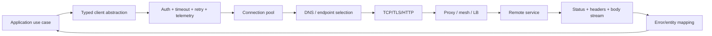
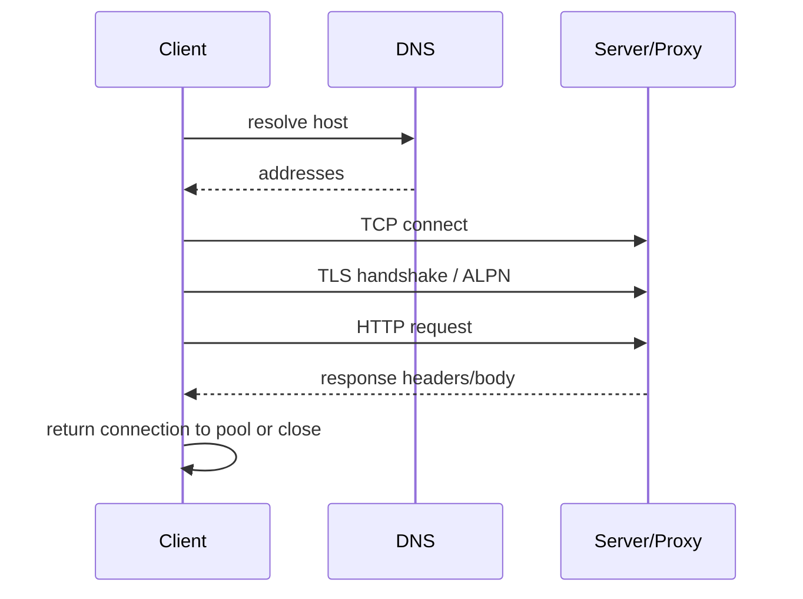
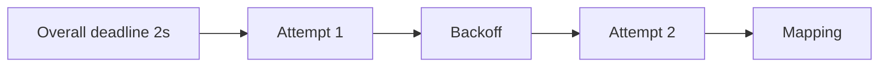
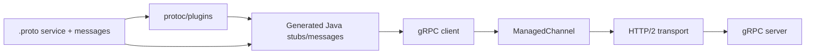
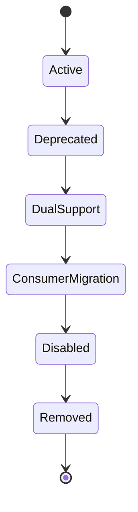

# Part 036 — HTTP Clients and Multi-Protocol Contract Governance

> HTTP client annotation atau generated stub hanya menyederhanakan cara membentuk request. Ia tidak menghapus DNS, connection pools, TLS, proxies, timeouts, retries, redirects, streaming ownership, partial responses, status mapping, ambiguous outcomes, or contract evolution. Senior engineer harus melihat outbound client sebagai long-lived resource, resilience boundary, security principal, and versioned distributed contract. OpenAPI, AsyncAPI, and Protobuf describe different interaction models and should be governed coherently without forcing them into one universal schema.

## Daftar Isi

1. [Target kompetensi](#target-kompetensi)
2. [Scope dan baseline](#scope-dan-baseline)
3. [Mental model outbound integration](#mental-model-outbound-integration)
4. [Standard versus implementation versus library](#standard-versus-implementation-versus-library)
5. [Client lifecycle and ownership](#client-lifecycle-and-ownership)
6. [One client per request is an anti-pattern](#one-client-per-request-is-an-anti-pattern)
7. [DNS lifecycle](#dns-lifecycle)
8. [TCP/TLS connection lifecycle](#tcptls-connection-lifecycle)
9. [HTTP/1.1 and HTTP/2 implications](#http11-and-http2-implications)
10. [Connection pooling](#connection-pooling)
11. [Pool acquisition timeout](#pool-acquisition-timeout)
12. [Keep-alive and stale connections](#keep-alive-and-stale-connections)
13. [Proxy and service-mesh behavior](#proxy-and-service-mesh-behavior)
14. [TLS and trust](#tls-and-trust)
15. [mTLS and service identity](#mtls-and-service-identity)
16. [Jakarta REST Client mental model](#jakarta-rest-client-mental-model)
17. [`ClientBuilder`, `Client`, `WebTarget`, and `Invocation`](#clientbuilder-client-webtarget-and-invocation)
18. [Registration of providers and filters](#registration-of-providers-and-filters)
19. [Synchronous invocation](#synchronous-invocation)
20. [Asynchronous invocation](#asynchronous-invocation)
21. [Response and entity ownership](#response-and-entity-ownership)
22. [Generic types and entity mapping](#generic-types-and-entity-mapping)
23. [Jersey Client-specific architecture](#jersey-client-specific-architecture)
24. [Jersey connector providers](#jersey-connector-providers)
25. [Jersey client properties](#jersey-client-properties)
26. [Jersey filters, features, and authentication](#jersey-filters-features-and-authentication)
27. [Retrofit mental model](#retrofit-mental-model)
28. [Retrofit annotations and converters](#retrofit-annotations-and-converters)
29. [Retrofit call adapters and execution](#retrofit-call-adapters-and-execution)
30. [Retrofit and OkHttp boundary](#retrofit-and-okhttp-boundary)
31. [OpenFeign mental model](#openfeign-mental-model)
32. [Feign contracts, encoders, decoders, and clients](#feign-contracts-encoders-decoders-and-clients)
33. [Feign error decoder and retryer](#feign-error-decoder-and-retryer)
34. [Framework wrappers versus core OpenFeign](#framework-wrappers-versus-core-openfeign)
35. [Selecting Jersey Client, Retrofit, or Feign](#selecting-jersey-client-retrofit-or-feign)
36. [Request construction](#request-construction)
37. [Headers and content negotiation](#headers-and-content-negotiation)
38. [Authentication and credential injection](#authentication-and-credential-injection)
39. [Request signing](#request-signing)
40. [Idempotency keys](#idempotency-keys)
41. [Timeout taxonomy](#timeout-taxonomy)
42. [Deadline budget](#deadline-budget)
43. [Retry classification](#retry-classification)
44. [Retry storm prevention](#retry-storm-prevention)
45. [Circuit breaker and bulkhead](#circuit-breaker-and-bulkhead)
46. [Rate limiting and load shedding](#rate-limiting-and-load-shedding)
47. [Hedged requests](#hedged-requests)
48. [Redirects](#redirects)
49. [HTTP status and error taxonomy](#http-status-and-error-taxonomy)
50. [Problem Details and error mapping](#problem-details-and-error-mapping)
51. [Ambiguous outcome](#ambiguous-outcome)
52. [Partial response and truncation](#partial-response-and-truncation)
53. [Streaming response](#streaming-response)
54. [Streaming request and uploads](#streaming-request-and-uploads)
55. [Multipart and binary clients](#multipart-and-binary-clients)
56. [Backpressure and bounded buffering](#backpressure-and-bounded-buffering)
57. [Cancellation](#cancellation)
58. [Context propagation](#context-propagation)
59. [Logging and redaction](#logging-and-redaction)
60. [Metrics and tracing](#metrics-and-tracing)
61. [Service discovery and endpoint selection](#service-discovery-and-endpoint-selection)
62. [Client-side load balancing](#client-side-load-balancing)
63. [Configuration and secret rotation](#configuration-and-secret-rotation)
64. [Health and dependency readiness](#health-and-dependency-readiness)
65. [Graceful shutdown](#graceful-shutdown)
66. [Contract source of truth](#contract-source-of-truth)
67. [OpenAPI mental model](#openapi-mental-model)
68. [OpenAPI operation contract](#openapi-operation-contract)
69. [OpenAPI schema and JSON Schema alignment](#openapi-schema-and-json-schema-alignment)
70. [OpenAPI 3.0, 3.1, and 3.2 compatibility](#openapi-30-31-and-32-compatibility)
71. [AsyncAPI mental model](#asyncapi-mental-model)
72. [AsyncAPI channels, operations, and messages](#asyncapi-channels-operations-and-messages)
73. [Protobuf and gRPC mental model](#protobuf-and-grpc-mental-model)
74. [gRPC service lifecycle](#grpc-service-lifecycle)
75. [Unary and streaming RPCs](#unary-and-streaming-rpcs)
76. [gRPC deadlines, cancellation, and status](#grpc-deadlines-cancellation-and-status)
77. [gRPC retries and wait-for-ready](#grpc-retries-and-wait-for-ready)
78. [Protobuf compatibility](#protobuf-compatibility)
79. [HTTP, gRPC, and event contract boundaries](#http-grpc-and-event-contract-boundaries)
80. [Canonical model versus protocol-specific models](#canonical-model-versus-protocol-specific-models)
81. [API linting](#api-linting)
82. [Breaking-change detection](#breaking-change-detection)
83. [Generated clients](#generated-clients)
84. [Generated server interfaces and stubs](#generated-server-interfaces-and-stubs)
85. [Generated code ownership](#generated-code-ownership)
86. [Codegen reproducibility](#codegen-reproducibility)
87. [Contract compatibility matrix](#contract-compatibility-matrix)
88. [Consumer-driven contract testing](#consumer-driven-contract-testing)
89. [Mock servers and simulators](#mock-servers-and-simulators)
90. [Contract publication and artifact versioning](#contract-publication-and-artifact-versioning)
91. [Deprecation and migration](#deprecation-and-migration)
92. [External vendor integration](#external-vendor-integration)
93. [Failure-model matrix](#failure-model-matrix)
94. [Debugging playbook](#debugging-playbook)
95. [Testing strategy](#testing-strategy)
96. [Architecture patterns](#architecture-patterns)
97. [Anti-patterns](#anti-patterns)
98. [PR review checklist](#pr-review-checklist)
99. [Trade-off yang harus dipahami senior engineer](#trade-off-yang-harus-dipahami-senior-engineer)
100. [Internal verification checklist](#internal-verification-checklist)
101. [Latihan verifikasi](#latihan-verifikasi)
102. [Ringkasan](#ringkasan)
103. [Referensi resmi](#referensi-resmi)

---

## Target kompetensi

Setelah menyelesaikan part ini, Anda harus mampu:

- menelusuri outbound call dari application method sampai DNS, pool, socket, TLS, proxy, server, body stream, dan response close;
- membedakan Jakarta REST Client standard, Jersey-specific APIs, Retrofit, OpenFeign, underlying transports, dan framework wrappers;
- menentukan lifecycle `Client`, connection pool, executors, interceptors, and credentials;
- menetapkan connect, pool-acquisition, TLS, request, read, write, and total deadline budgets;
- mengklasifikasikan retry-safe versus ambiguous operations;
- mengintegrasikan circuit breaker, bulkhead, rate limit, load shedding, and idempotency;
- memetakan protocol/network/application errors ke domain-safe error model;
- mengelola streaming, multipart, binary, cancellation, and backpressure;
- menerapkan trace/correlation context and secure logging;
- memilih OpenAPI, AsyncAPI, and Protobuf/gRPC according to interaction model;
- membangun linting, breaking-change checks, code generation, artifact publication, and compatibility matrices;
- mereview generated clients without surrendering network semantics;
- mendesain migration and deprecation across protocol versions;
- menentukan hal yang harus diverifikasi di internal CSG.

---

## Scope dan baseline

Baseline:

- Java 17+;
- Jakarta REST Client API;
- Jersey as one implementation;
- Retrofit with an HTTP transport such as OkHttp;
- core OpenFeign and possible wrappers;
- HTTP/1.1 and HTTP/2;
- OpenAPI, AsyncAPI, Protobuf/gRPC;
- resilience from Part 024;
- authentication from Part 025;
- serialization from Part 022;
- event governance from Part 033.

Part ini **tidak mengasumsikan**:

- Jersey Client, Retrofit, or Feign is used internally;
- specific connector/HTTP engine;
- specific versions;
- service mesh;
- generated clients;
- OpenAPI 3.2 adoption;
- AsyncAPI version;
- gRPC usage;
- Buf/Spectral/OpenAPI Generator;
- internal shared client library;
- resilience defaults;
- cloud/private endpoint topology.

All version-dependent and platform-specific details remain **Internal verification checklist**.

---

## Mental model outbound integration



A client method hides multiple state machines:

```text
contract resolution
configuration
credential acquisition
pool acquisition
DNS
connect
TLS handshake
request write
server queueing
response headers
response body
mapping
close/reuse
```

---

## Standard versus implementation versus library

| Layer | Example |
|---|---|
| Jakarta standard | `jakarta.ws.rs.client.Client`, `WebTarget`, `Invocation` |
| Jersey implementation | `org.glassfish.jersey.client.*`, connector providers, Jersey properties |
| Retrofit library | annotated interface + converters + call adapters |
| OpenFeign library | contract + proxy + encoder/decoder + `Client` |
| HTTP engine | JDK HTTP client, Apache HttpClient, OkHttp, Jetty, Netty |
| Resilience | Resilience4j, mesh, gateway, custom |
| Contract tooling | OpenAPI Generator, Spectral, Buf, proprietary platform |

Never attribute transport behavior to annotation library without identifying underlying engine.

---

## Client lifecycle and ownership

Client objects typically own or reference:

- pool;
- DNS behavior;
- TLS context;
- proxy;
- executors;
- provider/converter registry;
- interceptors/filters;
- metrics;
- credential provider;
- caches.

Preferred lifecycle:

```text
application startup → construct validated clients → reuse → drain/close at shutdown
```

---

## One client per request is an anti-pattern

Creating per request causes:

- no connection reuse;
- repeated TLS handshakes;
- ephemeral port pressure;
- thread/executor leaks;
- DNS churn;
- latency;
- unstable metrics;
- poor shutdown.

Create per logical configuration/security identity, not per endpoint invocation.

---

## DNS lifecycle

DNS can change due to:

- service discovery;
- failover;
- Kubernetes service;
- private endpoint;
- blue/green;
- regional routing.

Effective caching may exist in JVM, HTTP engine, OS, and proxy.

Risks:

- stale IP;
- connection pool pins old destination;
- NXDOMAIN caching;
- split-horizon DNS;
- short TTL ignored;
- DNS outage;
- IPv4/IPv6 mismatch.

Document DNS owner and failover behavior.

---

## TCP/TLS connection lifecycle



A timeout at each stage has different meaning.

---

## HTTP/1.1 and HTTP/2 implications

HTTP/1.1:

- connection reuse;
- one or limited in-flight behavior per connection depending client;
- head-of-line at connection level;
- pool size matters.

HTTP/2:

- multiplexed streams;
- connection-level limits;
- stream resets;
- flow control;
- ALPN/TLS;
- one connection failure affects many RPCs;
- server `MAX_CONCURRENT_STREAMS`.

Do not tune HTTP/2 using HTTP/1.1 pool assumptions blindly.

---

## Connection pooling

Pool decisions:

- max total;
- max per route/origin;
- idle timeout;
- max lifetime;
- validation;
- eviction;
- pending acquisition queue;
- HTTP/2 streams;
- proxy routes.

Pool size must align with remote concurrency and local request threads.

---

## Pool acquisition timeout

A request may wait before obtaining connection.

This timeout is distinct from connect/read timeout.

Pool exhaustion indicates:

- leaked responses;
- downstream slow;
- pool too small;
- unbounded callers;
- long streaming requests;
- remote saturation.

Increasing pool size may amplify downstream overload.

---

## Keep-alive and stale connections

Idle connection may be closed by:

- server;
- load balancer;
- NAT;
- mesh;
- firewall.

Client may discover closure only on reuse.

Use engine-supported stale detection/retry carefully. A retry after partial request write can be unsafe.

---

## Proxy and service-mesh behavior

Proxy/mesh may add:

- retries;
- timeout;
- circuit breaker;
- TLS termination/mTLS;
- headers;
- buffering;
- max body;
- redirects;
- tracing;
- DNS/service discovery.

Application and platform policies can stack, causing retry amplification and mismatched deadlines.

---

## TLS and trust

Verify:

- hostname verification;
- truststore;
- CA rotation;
- certificate chain;
- protocol/ciphers;
- SNI;
- ALPN;
- certificate expiry;
- private CA;
- clock skew.

Never disable hostname verification as production fix.

---

## mTLS and service identity

mTLS provides channel authentication, but application authorization still needs service identity policy.

Client certificate lifecycle:

- loading;
- reload/rotation;
- pool reconnection;
- key protection;
- expiration monitoring.

Long-lived pooled connections may continue using old certificate until reconnect.

---

## Jakarta REST Client mental model

Portable API:

```java
try (Client client = ClientBuilder.newBuilder()
        .connectTimeout(Duration.ofSeconds(2))
        .readTimeout(Duration.ofSeconds(5))
        .build()) {

    WebTarget target = client.target(baseUri)
            .path("quotes")
            .path(quoteId);

    try (Response response = target
            .request(MediaType.APPLICATION_JSON_TYPE)
            .header("X-Correlation-ID", correlationId)
            .get()) {

        // inspect status before reading entity
    }
}
```

In production, `Client` should generally be application-scoped; the try-with-resources example illustrates ownership, not per-call construction.

---

## `ClientBuilder`, `Client`, `WebTarget`, and `Invocation`

- `ClientBuilder`: constructs configured client.
- `Client`: heavyweight reusable entry point.
- `WebTarget`: immutable-style target URI/config derivation.
- `Invocation.Builder`: request headers/media types.
- `Invocation`: prepared request.
- `Response`: response status/headers/entity ownership.

Verify implementation support for standard timeout builder methods.

---

## Registration of providers and filters

Client can register:

- message body readers/writers;
- JSON provider;
- request/response filters;
- reader/writer interceptors;
- features;
- context resolvers.

Client-side provider ordering and registration may differ from server.

Avoid registering server-only filters accidentally.

---

## Synchronous invocation

Synchronous call occupies caller thread until:

- result;
- timeout;
- cancellation/interruption behavior;
- mapping completes.

In JAX-RS request path, synchronous downstream call consumes server request capacity.

Use bulkheads and deadlines.

---

## Asynchronous invocation

Jakarta REST Client provides async invocation APIs.

Async does not guarantee non-blocking transport. Implementation may use worker threads.

Inspect:

- executor;
- callback thread;
- cancellation;
- context propagation;
- body mapping;
- pool usage;
- exception wrapping.

---

## Response and entity ownership

Always close `Response` when entity/body resources are not fully consumed or buffering rules do not guarantee release.

Patterns:

```java
try (Response response = target.request().get()) {
    if (response.getStatusInfo().getFamily() == SUCCESSFUL) {
        return response.readEntity(QuoteDto.class);
    }
    throw mapError(response);
}
```

Leaked responses cause pool exhaustion.

---

## Generic types and entity mapping

For generic payload:

```java
List<QuoteDto> quotes =
        response.readEntity(new GenericType<List<QuoteDto>>() {});
```

Mapping failures are separate from transport failures.

Capture safe body excerpt for diagnosis, with limits and redaction.

---

## Jersey Client-specific architecture

Jersey adds:

- Jersey client configuration;
- connector provider SPI;
- implementation-specific properties;
- authentication features;
- tracing/instrumentation integrations;
- multipart modules.

Portable code should isolate Jersey APIs behind composition layer.

---

## Jersey connector providers

Connector determines underlying HTTP engine behavior.

Potential connectors include JDK, Apache, Jetty, Netty, or others depending Jersey version/modules.

Connector changes:

- pooling;
- proxy;
- TLS;
- async behavior;
- redirects;
- HTTP version;
- streaming;
- timeout properties.

Verify actual module and connector selected.

---

## Jersey client properties

Jersey-specific properties may configure:

- connect/read timeout;
- buffering;
- chunked encoding;
- redirects;
- request entity processing;
- connector details.

Do not mix property names from Jersey 2/3 or connector-specific libraries without version evidence.

---

## Jersey filters, features, and authentication

Client filters can inject:

- auth token;
- correlation;
- tenant;
- signing;
- logging.

Risks:

- retries reuse stale tokens/signatures;
- logging body consumes stream;
- filters mutate shared state;
- token refresh stampede;
- hidden headers.

Keep filters deterministic and thread-safe.

---

## Retrofit mental model

Retrofit turns annotated interfaces into callable client implementations.

```java
interface QuoteApi {
    @GET("quotes/{id}")
    Call<QuoteDto> getQuote(@Path("id") String id);
}
```

Retrofit handles declaration and conversion. Underlying transport, commonly OkHttp, owns network lifecycle.

---

## Retrofit annotations and converters

Annotations define:

- method;
- path;
- query;
- headers;
- body;
- form;
- multipart.

Converters map body to/from Java types.

Converter ordering matters. A broad converter can capture types intended for another converter.

---

## Retrofit call adapters and execution

Call adapters expose:

- `Call<T>`;
- synchronous/async styles;
- `CompletableFuture`;
- reactive types depending module.

Adapter affects cancellation, error representation, and context propagation.

---

## Retrofit and OkHttp boundary

Retrofit does not itself define all:

- pool;
- DNS;
- TLS;
- interceptors;
- retries;
- cache;
- proxy;
- timeouts.

Those often belong to OkHttp.

Review both configurations.

---

## OpenFeign mental model

Feign creates an implementation from an interface contract.

Components:

- `Contract`;
- `Encoder`;
- `Decoder`;
- `ErrorDecoder`;
- `Client`;
- `Retryer`;
- request interceptors;
- logger;
- options.

Underlying Feign client determines transport.

---

## Feign contracts, encoders, decoders, and clients

A Feign “contract” interprets annotations; it is not the same as business/API contract.

Custom encoder/decoder must preserve:

- media type;
- charset;
- null semantics;
- error body;
- streaming;
- generic types.

---

## Feign error decoder and retryer

`ErrorDecoder` maps non-success responses.

`Retryer` behavior is dangerous if applied to non-idempotent calls.

Do not mark every timeout/5xx retryable. Retry classification needs method semantics and idempotency.

---

## Framework wrappers versus core OpenFeign

Frameworks can add:

- dependency injection;
- discovery;
- load balancing;
- resilience;
- metrics;
- annotation contracts.

Identify whether code uses core OpenFeign, MicroProfile Rest Client, Spring Cloud OpenFeign, or internal wrapper. Defaults differ.

---

## Selecting Jersey Client, Retrofit, or Feign

| Criterion | Jersey Client | Retrofit | OpenFeign |
|---|---|---|---|
| Jakarta portability | strongest API alignment | no | no |
| Programmatic requests | strong | interface-oriented | interface-oriented |
| Provider reuse | JAX-RS providers | converters | encoders/decoders |
| Transport | connector-dependent | commonly OkHttp | pluggable clients |
| Annotation style | builder + JAX-RS client | Retrofit annotations | configurable contract |
| Streaming control | explicit Response/entities | transport/converter dependent | client/decoder dependent |
| Ecosystem fit | Jersey/Jakarta stack | OkHttp-centric | declarative integrations |

Choose from platform standard, not syntax preference.

---

## Request construction

Centralize:

- base URI;
- encoded paths;
- query serialization;
- headers;
- content type;
- user agent/client version;
- request ID;
- auth;
- deadline.

Avoid string concatenation that causes double encoding or SSRF.

---

## Headers and content negotiation

Set:

- `Accept`;
- `Content-Type`;
- `Accept-Encoding`;
- conditional headers;
- idempotency;
- tracing;
- correlation.

Do not forward all inbound headers blindly. Use allowlist.

---

## Authentication and credential injection

Credential types:

- OAuth access token;
- mTLS;
- API key;
- signed request;
- workload identity.

Token provider must handle:

- caching;
- expiry;
- skew;
- refresh;
- failure;
- audience/scope;
- concurrent refresh;
- secret redaction.

---

## Request signing

Signing often includes:

- method;
- canonical URI/query;
- selected headers;
- body hash;
- timestamp;
- credential scope.

Retries may require new timestamp/signature while retaining idempotency key.

Streaming body may need precomputed hash or alternate signing mode.

---

## Idempotency keys

For retryable non-idempotent commands:

- stable per logical operation;
- unique across retention horizon;
- same payload hash;
- server stores outcome;
- retry returns original outcome;
- conflicting payload rejected.

Do not regenerate key per attempt.

---

## Timeout taxonomy

| Timeout | Boundary |
|---|---|
| Pool acquisition | wait for local connection capacity |
| DNS | name resolution |
| Connect | TCP establishment |
| TLS handshake | secure session |
| Write | sending headers/body |
| Response header | server first response |
| Read | body progress |
| Idle | no progress |
| Total request | whole attempt |
| Deadline | whole user operation across attempts |

One “timeout” setting is insufficient.

---

## Deadline budget



Ensure:

```text
attempt timeouts + backoff + mapping < remaining deadline
```

Propagate deadline downstream where protocol supports it.

---

## Retry classification

Retry candidates:

- connect failure before request write;
- selected idempotent methods;
- explicit 429/503 with policy;
- transient reset;
- gRPC retryable status per service config.

Unsafe/ambiguous:

- timeout after request body sent;
- POST without idempotency;
- external payment;
- partial upload;
- streaming RPC with consumed messages.

---

## Retry storm prevention

Controls:

- one retry owner;
- low attempt count;
- exponential backoff;
- jitter;
- retry budget;
- circuit breaker;
- load shedding;
- honor `Retry-After`;
- no nested app + mesh + gateway retries.

---

## Circuit breaker and bulkhead

Circuit breaker classifies outcomes and temporarily rejects calls.

Bulkhead bounds concurrency.

Important:

- breaker must not count expected 4xx business responses as infrastructure failure;
- separate breakers per dependency/operation where needed;
- pool limit and bulkhead must be aligned;
- fallback cannot violate domain invariant.

---

## Rate limiting and load shedding

Outbound client may enforce:

- per-dependency concurrency;
- request rate;
- tenant quota;
- queue bound.

On overload, fail early rather than occupying all JAX-RS threads waiting for dependency.

---

## Hedged requests

Hedging sends duplicate request after delay to reduce tail latency.

Only use for safe/idempotent reads and when remote capacity can absorb duplicate load.

Cancel losing attempt and measure amplification.

---

## Redirects

Redirect handling affects:

- method rewriting;
- body replay;
- auth header leakage;
- cross-host requests;
- SSRF;
- idempotency;
- signing.

Disable or restrict automatic redirects for sensitive clients unless contract requires them.

---

## HTTP status and error taxonomy

Distinguish:

- transport failure;
- TLS/DNS;
- timeout/cancel;
- HTTP protocol response;
- remote validation;
- remote domain rejection;
- authentication/authorization;
- rate limit;
- server error;
- mapping failure;
- ambiguous outcome.

Avoid converting all to `RemoteServiceException`.

---

## Problem Details and error mapping

If remote uses Problem Details, map:

- type;
- title;
- status;
- detail;
- instance;
- extensions;
- correlation.

Do not expose remote internal detail directly to your API caller.

Preserve stable internal error category and retryability.

---

## Ambiguous outcome

Example:

```text
client sends POST
server commits
response lost
client gets timeout
```

Client cannot know whether operation succeeded.

Solutions:

- idempotency key;
- query-by-command ID;
- reconciliation;
- asynchronous accepted resource;
- do not blindly retry.

---

## Partial response and truncation

Failures can occur after headers or part of body.

Checks:

- `Content-Length`;
- chunk termination;
- checksum;
- JSON parser EOF;
- compressed stream error;
- range response;
- HTTP/2 stream reset.

Do not treat status `200` alone as complete success.

---

## Streaming response

Use response stream when body is large.

Rules:

- close stream/response;
- copy with bounded buffer;
- enforce size/decompression limits;
- checksum;
- cancellation;
- no automatic body logging;
- connection reuse may require full consume/close.

---

## Streaming request and uploads

Avoid buffering large request bodies into heap.

Need:

- repeatability classification;
- content length/chunking;
- signing;
- progress;
- write timeout;
- retry policy;
- server limits;
- cancellation.

Non-repeatable stream cannot be automatically retried safely.

---

## Multipart and binary clients

Verify library-specific multipart module.

Handle:

- filename encoding;
- content disposition;
- MIME;
- boundaries;
- per-part limits;
- total limits;
- checksum;
- object storage alternative.

---

## Backpressure and bounded buffering

Async client is not automatically backpressured.

Bound:

- in-flight calls;
- pending queue;
- response buffers;
- upload buffers;
- callback executor;
- retries.

Reject before memory exhaustion.

---

## Cancellation

Cancellation may stop local wait but remote operation may continue.

Propagate when supported:

- HTTP connection/stream cancel;
- gRPC cancellation;
- downstream deadline.

Never assume cancellation rolled back server transaction.

---

## Context propagation

Propagate allowlisted:

- W3C trace context;
- correlation;
- causation where relevant;
- tenant context;
- deadline;
- request ID.

Do not propagate:

- inbound access token to unrelated audience;
- arbitrary baggage;
- all headers;
- MDC without cleanup.

---

## Logging and redaction

Log:

- dependency/operation;
- method;
- normalized route;
- status/error category;
- duration;
- attempt;
- trace/correlation;
- response size.

Redact:

- Authorization;
- cookies;
- API keys;
- signatures;
- PII;
- bodies by default;
- sensitive query parameters.

---

## Metrics and tracing

Metrics:

- call rate;
- latency;
- status/error;
- timeout stage;
- retries;
- circuit state;
- bulkhead saturation;
- pool leased/idle/pending;
- DNS/connect/TLS where available;
- body bytes;
- cancellation.

Avoid raw URI IDs as labels.

Create client spans with stable operation name.

---

## Service discovery and endpoint selection

Sources:

- static config;
- DNS;
- Kubernetes Service;
- cloud service discovery;
- gateway;
- mesh;
- client registry.

Decide who performs:

- discovery;
- load balancing;
- health;
- failover;
- locality.

Do not duplicate policies at every layer.

---

## Client-side load balancing

Client-side balancing may use:

- round robin;
- weighted;
- least requests;
- locality;
- consistent hash.

Risks:

- stale endpoint list;
- per-client unevenness;
- connection stickiness;
- retry to same endpoint;
- health false positives.

Often delegated to LB/mesh.

---

## Configuration and secret rotation

Configuration includes:

- base URI;
- proxy;
- timeouts;
- pool;
- retries;
- TLS;
- auth;
- limits;
- feature flags.

Runtime reload must use atomic client generation or safely rebuild pools. Mutating shared client config in place is risky.

---

## Health and dependency readiness

Do not make service readiness depend on every optional downstream being healthy.

Classify dependencies:

- startup-critical;
- request-critical;
- optional/degradable;
- async.

Health checks must not create load or mutate state.

---

## Graceful shutdown

Sequence:

```text
stop ingress
  → reject new outbound work
  → wait bounded in-flight calls
  → cancel remaining
  → close clients/pools/executors
  → clear credentials
```

Streaming calls need explicit drain policy.

---

## Contract source of truth

Possible sources:

- OpenAPI;
- `.proto`;
- AsyncAPI;
- schema registry;
- code annotations;
- generated artifacts;
- internal catalog.

Choose one authoritative source per protocol contract and derive documentation/code where possible.

Do not hand-maintain three divergent copies.

---

## OpenAPI mental model

OpenAPI is a language-agnostic interface description for HTTP APIs.

It can describe:

- paths;
- methods;
- parameters;
- request/response bodies;
- schemas;
- security;
- servers;
- examples;
- callbacks/webhooks depending version;
- extensions.

It does not execute server behavior or prove semantics.

---

## OpenAPI operation contract

For each operation define:

- operation ID;
- method/path;
- parameters and encoding;
- request body/media types;
- responses/status;
- headers;
- errors;
- security;
- idempotency;
- pagination;
- examples;
- deprecation.

Stable `operationId` matters for code generation.

---

## OpenAPI schema and JSON Schema alignment

OpenAPI 3.1 aligned its Schema Object more closely with JSON Schema 2020-12. OpenAPI 3.0 had a distinct schema dialect/subset.

Tool support may lag specification.

Verify linter, generator, documentation, gateway, and runtime validator compatibility before upgrading.

---

## OpenAPI 3.0, 3.1, and 3.2 compatibility

As of modern OpenAPI publications, 3.2 exists, but organization tooling may standardize 3.0 or 3.1.

Do not adopt latest syntax solely because specification exists.

Create support matrix:

| Tool | 3.0 | 3.1 | 3.2 |
|---|---:|---:|---:|
| Linter | verify | verify | verify |
| Generator | verify | verify | verify |
| Gateway import | verify | verify | verify |
| Docs | verify | verify | verify |

---

## AsyncAPI mental model

AsyncAPI describes message-driven APIs independent of protocol.

It models:

- application;
- servers;
- channels;
- operations;
- messages;
- schemas;
- bindings;
- security.

It complements schema registry and event catalog.

---

## AsyncAPI channels, operations, and messages

AsyncAPI 3.x separates channel and operation concepts more explicitly than older documents.

Govern:

- actual topic/exchange/queue binding;
- publish/subscribe perspective;
- message refs;
- Kafka/AMQP bindings;
- headers;
- examples;
- security;
- correlation IDs.

Verify exact spec version and tooling.

---

## Protobuf and gRPC mental model



Protobuf describes messages; gRPC service definitions describe RPC methods.

---

## gRPC service lifecycle

Java client commonly owns a long-lived `ManagedChannel` and generated stubs.

Lifecycle:

- build channel;
- configure TLS/name resolver/LB/interceptors;
- create stubs;
- reuse;
- set deadlines per call;
- shutdown and await termination.

Do not create channel per RPC.

---

## Unary and streaming RPCs

- unary: one request, one response;
- server streaming;
- client streaming;
- bidirectional streaming.

Streaming requires:

- flow control;
- cancellation;
- half-close;
- observer thread safety;
- message limits;
- deadlines;
- reconnect/resume protocol;
- idempotency.

---

## gRPC deadlines, cancellation, and status

gRPC clients should set deadlines.

Server can observe cancellation/deadline, but completed external side effects may remain.

Map gRPC status carefully:

- `INVALID_ARGUMENT`;
- `NOT_FOUND`;
- `ALREADY_EXISTS`;
- `FAILED_PRECONDITION`;
- `ABORTED`;
- `UNAVAILABLE`;
- `DEADLINE_EXCEEDED`;
- `RESOURCE_EXHAUSTED`;
- auth statuses.

Do not map every `UNKNOWN` to retry.

---

## gRPC retries and wait-for-ready

gRPC can support configured retries and wait-for-ready behavior.

Wait-for-ready queues calls until transport becomes ready, still bounded by deadline.

Risks:

- hidden queueing;
- stale requests;
- retry amplification;
- non-idempotent RPC.

Use service config and explicit governance.

---

## Protobuf compatibility

Rules:

- never reuse field numbers;
- reserve removed names/numbers;
- avoid incompatible wire-type changes;
- package/service/method changes can break generated code;
- enum unknown handling;
- presence semantics;
- oneof evolution;
- streaming method type changes are breaking.

Use lint and breaking-change detection such as Buf if platform standard allows.

---

## HTTP, gRPC, and event contract boundaries

| Protocol | Interaction | Primary contract |
|---|---|---|
| HTTP | request-response/resource | OpenAPI + HTTP semantics |
| gRPC | typed RPC/streaming | Protobuf service/messages |
| Kafka/RabbitMQ events | asynchronous durable messages | AsyncAPI + schema registry/catalog |
| WebSocket/SSE | long-lived event delivery | protocol-specific schema + docs |

Do not force one canonical schema to erase protocol semantics.

---

## Canonical model versus protocol-specific models

A shared conceptual model can define:

- quote ID;
- money;
- tenant;
- status vocabulary.

But protocol DTOs should remain separate:

```text
HTTP QuoteResponse
gRPC Quote message
Kafka QuoteApproved event
DB QuoteRow
```

They evolve for different consumers and timing semantics.

Use mapping, not shared class leakage.

---

## API linting

Lint can enforce:

- operation IDs;
- naming;
- error responses;
- security;
- pagination;
- headers;
- examples;
- no inline duplicate schemas;
- deprecation metadata;
- forbidden sensitive fields;
- Protobuf style;
- AsyncAPI channel/message rules.

Spectral supports custom JSON/YAML rulesets for OpenAPI and AsyncAPI. Protobuf ecosystems may use Buf lint.

---

## Breaking-change detection

Tools compare candidate contract against baseline.

Detectable:

- removed path/operation;
- required parameter added;
- response schema narrowed;
- Protobuf field/type changes;
- removed messages/services;
- AsyncAPI channel/message changes depending tooling.

Not automatically detectable:

- semantic unit change;
- timeout/SLO change;
- idempotency change;
- authorization policy;
- event timing;
- performance constraints.

---

## Generated clients

Generated clients can provide:

- types;
- serialization;
- operations;
- auth hooks;
- documentation.

Still review:

- underlying HTTP engine;
- timeout defaults;
- response closing;
- retries;
- nullable semantics;
- unknown fields;
- generated method names;
- streaming support;
- exception model.

Wrap generated code behind domain-facing adapter.

---

## Generated server interfaces and stubs

Server generation can create:

- JAX-RS interfaces/resources;
- DTOs;
- validation annotations;
- gRPC bases;
- routing skeletons.

Generated code does not enforce domain authorization, transaction, idempotency, or production error model.

---

## Generated code ownership

Choose:

- committed generated source;
- generated during build;
- separately published client artifact.

Trade-offs:

- reproducibility;
- review visibility;
- build tooling;
- artifact versioning;
- language consumers;
- customization.

Do not manually edit generated files unless generator workflow supports it.

---

## Codegen reproducibility

Pin:

- specification version;
- generator version;
- templates;
- options;
- language runtime;
- formatting;
- dependencies.

CI should regenerate and fail on diff.

Template customization is code and needs tests.

---

## Contract compatibility matrix

Example:

| Server/API version | Client v1 | Client v2 | Client v3 |
|---|---:|---:|---:|
| HTTP v1 additive | supported | supported | supported |
| HTTP new required request field | unsafe | supported | supported |
| gRPC new optional field | supported | supported | supported |
| gRPC method renamed | broken | broken | supported |
| Event new enum | unknown handling required | supported | supported |

Include runtime configuration, not schema only.

---

## Consumer-driven contract testing

Consumer specifies interactions it relies on.

Useful for:

- endpoint/status/header expectations;
- optional fields;
- error behavior;
- backward compatibility.

Risks:

- contracts ossify accidental behavior;
- test provider state unrealistic;
- not all consumers registered;
- no load/security semantics.

Combine provider verification with OpenAPI linting and integration tests.

---

## Mock servers and simulators

Mocks help local development but often miss:

- TLS;
- redirects;
- slow body;
- partial responses;
- malformed headers;
- pool exhaustion;
- retries;
- rate limits;
- streaming;
- DNS;
- real auth.

Use fault-capable simulators and real integration environments.

---

## Contract publication and artifact versioning

Publish:

- OpenAPI document;
- AsyncAPI document;
- Protobuf module/descriptors;
- generated artifacts;
- changelog;
- compatibility report.

Version independently from service deployment while maintaining traceability.

---

## Deprecation and migration

Lifecycle:



Define:

- announcement;
- replacement;
- sunset;
- usage telemetry;
- consumer inventory;
- compatibility period;
- rollback;
- documentation.

---

## External vendor integration

Vendor APIs often have:

- undocumented rate limits;
- weak idempotency;
- unstable error formats;
- certificate/IP allowlists;
- maintenance windows;
- sandbox differences;
- version sunsets.

Build anti-corruption adapter, durable audit, and reconciliation.

Do not expose vendor DTO/error directly through internal domain.

---

## Failure-model matrix

| Failure | Effect | Detection | Response |
|---|---|---|---|
| Client created per request | latency/resource leak | connection metrics | application scope |
| Response not closed | pool exhaustion | pending acquisition | try-with-resources |
| Stale DNS/IP | failed/old endpoint | DNS/connect logs | caching/pool strategy |
| TLS expiry/CA change | all calls fail | handshake error | rotation monitoring |
| Pool too large | downstream overload | remote saturation | bulkhead alignment |
| Pool too small/leak | local queue timeout | pool metrics | close/tune |
| Timeout after server commit | ambiguous result | command lookup | idempotency/reconcile |
| Nested retries | cascading load | attempt headers/metrics | one retry owner |
| Redirect leaks auth | credential exposure | security logs | restrict redirects |
| Error decoder consumes body incorrectly | lost diagnostics/pool leak | mapping failure | bounded body handling |
| Streaming body buffered | OOM | heap/profile | streaming connector/config |
| Cancellation assumed rollback | duplicate/unknown state | audit | status query/idempotency |
| Unknown-field parser strictness | additive change breaks | deserialization | compatibility config |
| Generated client default timeout absent | hung threads | latency/thread dump | explicit deadline |
| Contract and runtime drift | clients fail | conformance test | source-of-truth gate |
| Generator upgrade changes API | build/runtime break | generated diff | pin tool/templates |
| gRPC no deadline | resource accumulation | long calls | deadline policy |
| Protobuf field number reused | wire corruption | breaking check | reserve numbers |
| AsyncAPI docs stale | wrong integration | catalog/runtime diff | CI publication |
| Vendor sandbox differs | production incident | integration evidence | staged canary/runbook |

---

## Debugging playbook

### Timeout

Determine stage:

- pool acquisition;
- DNS;
- connect;
- TLS;
- request write;
- response header;
- response body;
- total deadline;
- remote queueing.

Use client pool metrics, traces, proxy logs, and remote evidence.

### Connection pool exhaustion

Check:

- response/stream close;
- long streaming calls;
- downstream latency;
- pool max;
- pending queue;
- bulkhead;
- connection eviction;
- thread dumps.

### TLS failure

Check:

- hostname/SNI;
- trust chain;
- cert expiry;
- client cert;
- protocol/cipher;
- clock;
- proxy termination;
- private CA rollout.

### HTTP 2xx but mapping fails

Capture:

- media type;
- charset;
- content encoding;
- schema/version;
- bounded redacted body;
- converter/provider selected;
- truncation;
- numeric/time format.

### Retry duplicate

Trace idempotency key, attempts, proxy retries, response loss, remote audit, and client exception stage.

### gRPC `UNAVAILABLE`

Check:

- channel state;
- resolver/LB;
- TLS;
- server health;
- proxy HTTP/2 support;
- retry config;
- deadline;
- connection churn.

### Contract drift

Compare deployed endpoint behavior against published OpenAPI/proto/AsyncAPI and generated artifact version.

---

## Testing strategy

### Client unit tests

- URI/query/header construction;
- auth/signing;
- error classification;
- idempotency;
- redaction;
- deadline budget;
- retry policy.

### Protocol integration tests

Use real/fault-capable server for:

- TLS;
- redirects;
- slow headers/body;
- resets;
- malformed/truncated responses;
- streaming;
- multipart;
- max sizes;
- rate limit;
- connection reuse.

### Pool tests

- leak response intentionally;
- saturation;
- idle close;
- stale reuse;
- shutdown;
- HTTP/2 concurrency.

### Contract tests

- schema lint;
- breaking changes;
- old/new client-server matrix;
- generated-code compile;
- runtime conformance;
- error responses.

### Chaos/failure tests

- DNS failover;
- expired certificate;
- endpoint partial outage;
- proxy retry;
- timeout after commit;
- token refresh stampede;
- dependency overload.

### gRPC tests

- deadlines;
- cancellation;
- streaming flow control;
- status mapping;
- retry/wait-for-ready;
- protobuf compatibility.

---

## Architecture patterns

### Application-scoped client registry

```text
configuration → typed client instances → adapters → domain use cases
```

### Anti-corruption adapter

Generated/protocol client is wrapped by domain-specific interface.

### Deadline-aware call context

Every outbound operation receives remaining deadline and correlation context.

### Contract-first pipeline

```text
contract PR → lint → breaking check → generate → compile/test → publish artifact
```

### One retry owner

Application or mesh owns retries, with explicit exclusions.

### Durable command integration

Idempotency key + status lookup for ambiguous remote commands.

---

## Anti-patterns

- client/channel per request;
- no explicit timeout/deadline;
- retry every exception;
- retry POST without idempotency;
- application and mesh both retry;
- pool unbounded;
- response body not closed;
- whole large body logged/buffered;
- trust-all TLS;
- forward all inbound headers;
- auth token for wrong audience;
- automatic cross-host redirect;
- generated client exposed directly to domain;
- shared DTO across HTTP/gRPC/events/DB;
- OpenAPI generated from runtime but never diffed;
- contract generated from Java and changed accidentally by refactor;
- generator `latest`;
- manual edits to generated code;
- breaking check disabled;
- no consumer inventory/deprecation telemetry;
- gRPC call without deadline;
- Protobuf field number reused;
- mock-only integration tests.

---

## PR review checklist

### Lifecycle and transport

- [ ] Client/pool application-scoped?
- [ ] Underlying engine/connector identified?
- [ ] HTTP version/proxy/mesh known?
- [ ] Response and streams always closed?
- [ ] Pool/bulkhead aligned?
- [ ] Shutdown drains/closes resources?

### Timeouts and resilience

- [ ] Timeout taxonomy explicit?
- [ ] Overall deadline?
- [ ] Retry classification and owner?
- [ ] Jitter/budget?
- [ ] Circuit breaker outcomes correct?
- [ ] Rate limit/load shedding?
- [ ] Ambiguous outcome strategy?
- [ ] Idempotency key stable?

### Security

- [ ] TLS hostname verification?
- [ ] Credential audience/scope?
- [ ] Secret/cert rotation?
- [ ] Redirect restrictions?
- [ ] SSRF/URI validation?
- [ ] Header allowlist?
- [ ] Logging redaction?
- [ ] Tenant propagation safe?

### Mapping and streaming

- [ ] Content negotiation?
- [ ] Error taxonomy?
- [ ] Problem Details/status mapping?
- [ ] Unknown fields/null/time/money?
- [ ] Body size/decompression limits?
- [ ] Multipart/stream repeatability?
- [ ] Cancellation semantics?
- [ ] Bounded buffers?

### Contract governance

- [ ] Source of truth identified?
- [ ] Spec version supported by tools?
- [ ] Linting?
- [ ] Breaking-change check?
- [ ] Semantic review?
- [ ] Stable operation/method/message IDs?
- [ ] Generated artifacts reproducible?
- [ ] Old/new compatibility matrix?
- [ ] Deprecation/consumer inventory?
- [ ] Runtime conformance test?

### Library-specific

- [ ] Jersey connector/properties verified?
- [ ] Retrofit converter/adapter and OkHttp config verified?
- [ ] Feign Client/Contract/Retryer/ErrorDecoder verified?
- [ ] gRPC channel/deadline/service config verified?
- [ ] No framework default assumed?

---

## Trade-off yang harus dipahami senior engineer

| Decision | Benefit | Cost/risk |
|---|---|---|
| Jakarta REST Client | portable JAX-RS model | implementation connector details |
| Jersey Client | stack alignment/features | Jersey coupling |
| Retrofit | concise typed interfaces | OkHttp/converter coupling |
| OpenFeign | customizable declarative clients | hidden wrapper/retry defaults |
| Programmatic client | explicit dynamic control | more boilerplate |
| Generated client | contract alignment | generator/transport defaults |
| HTTP/2 | multiplexing | connection-wide failure/flow control |
| Large pool | concurrency | downstream amplification |
| Small pool | bounded load | local queue latency |
| Async calls | thread decoupling | executor/context complexity |
| Retry | transient recovery | duplicates/load |
| Circuit breaker | fast failure | false opens/config complexity |
| Hedging | tail latency | duplicate load |
| Streaming | low memory | lifecycle/cancellation complexity |
| OpenAPI | HTTP interoperability | tooling/version drift |
| AsyncAPI | message API documentation | runtime enforcement separate |
| Protobuf/gRPC | typed efficient RPC | codegen/HTTP2/platform coupling |
| Shared canonical DTO | reuse | protocol coupling |
| Protocol-specific DTOs | evolvability | mapping code |
| Code-first | developer convenience | accidental contract changes |
| Contract-first | explicit governance | workflow/tooling investment |
| Committed generated code | review visibility | repository noise |
| Build-generated code | clean source | tooling reproducibility need |

---

## Internal verification checklist

### Client libraries

- [ ] Jakarta REST/Jersey version.
- [ ] Jersey connector.
- [ ] Retrofit version and OkHttp version/config.
- [ ] OpenFeign core or framework wrapper.
- [ ] gRPC Java/Protobuf versions.
- [ ] Shared internal client SDK.
- [ ] DI scope/lifecycle.
- [ ] Executor ownership.
- [ ] Close/shutdown hooks.

### Network

- [ ] DNS/service discovery.
- [ ] HTTP/1.1 or HTTP/2.
- [ ] Proxy/mesh/LB.
- [ ] Connection pool.
- [ ] Idle/max lifetime.
- [ ] Private endpoints.
- [ ] TLS/mTLS.
- [ ] Certificate/CA rotation.
- [ ] Egress/network policies.

### Resilience

- [ ] Connect/read/write/pool/total timeouts.
- [ ] Deadline propagation.
- [ ] Retry owner/defaults.
- [ ] Circuit breaker/bulkhead.
- [ ] Rate limit/load shedding.
- [ ] Idempotency.
- [ ] Redirect behavior.
- [ ] Cancellation.
- [ ] Fallback.
- [ ] Metrics/alerts.

### Authentication

- [ ] OAuth/token provider.
- [ ] Audience/scopes.
- [ ] mTLS identity.
- [ ] Request signing.
- [ ] API keys.
- [ ] Refresh/rotation.
- [ ] Header allowlist/redaction.
- [ ] Tenant context.

### Contracts and tooling

- [ ] OpenAPI version/source.
- [ ] AsyncAPI version/source.
- [ ] Protobuf syntax/edition.
- [ ] Schema registry relationship.
- [ ] Linter/rulesets.
- [ ] Breaking-change tools.
- [ ] OpenAPI Generator/config/templates.
- [ ] Buf/protoc plugins.
- [ ] Generated artifacts publication.
- [ ] Consumer-driven contract tooling.
- [ ] Service/event catalog.
- [ ] Deprecation policy.

### Operations

- [ ] Client pool dashboards.
- [ ] Dependency SLOs.
- [ ] Timeout-stage observability.
- [ ] Vendor runbooks.
- [ ] Certificate alerts.
- [ ] Endpoint failover.
- [ ] Contract drift detection.
- [ ] Generated artifact traceability.
- [ ] Incident ownership.

---

## Latihan verifikasi

1. Trace one Jersey/Retrofit/Feign call from method to pool, DNS, TLS, server, mapping, and close.
2. Leak responses in test and observe pool exhaustion.
3. Simulate timeout after remote commit and prove idempotency/status lookup.
4. Compare application, mesh, and gateway retries; calculate amplification.
5. Rotate CA/client certificate and observe pooled connection behavior.
6. Stream a large response and prove heap remains bounded.
7. Generate Java client from OpenAPI with pinned version; regenerate and diff.
8. Run breaking-change checks for OpenAPI and Protobuf.
9. Deploy old/new client-server compatibility matrix.
10. Add gRPC deadline/cancellation and verify remote side-effect semantics.

---

## Ringkasan

- Declarative clients simplify request declaration, not network semantics.
- `Client`, pools, channels, executors, and credentials are long-lived resources.
- Underlying connector/HTTP engine determines critical behavior.
- Pool acquisition, connect, TLS, read, write, and total deadlines are different.
- Response/entity streams must be closed.
- Async APIs may still use blocking transports and worker executors.
- Retries require idempotency, one owner, budget, and jitter.
- Timeout after request commit creates ambiguous outcome.
- Streaming and multipart require bounded memory and repeatability analysis.
- Trace and security context must be allowlisted and redacted.
- OpenAPI describes HTTP APIs, AsyncAPI message APIs, and Protobuf/gRPC typed RPCs.
- Protocol-specific models should not be replaced by one shared DTO.
- Linting and structural breaking checks do not replace semantic review.
- Generated clients require pinned generators, templates, configuration, and transport review.
- Consumer-driven contracts complement provider specs but can ossify accidental behavior.
- Deprecation requires inventory, telemetry, migration period, and rollback.
- Exact internal clients, connectors, proxies, resilience policies, and contract tooling remain **Internal verification checklist**.

---

## Referensi resmi

- [Jakarta RESTful Web Services Specification](https://jakarta.ee/specifications/restful-ws/)
- [Jakarta REST Client API](https://jakarta.ee/specifications/restful-ws/4.0/apidocs/jakarta.ws.rs/jakarta/ws/rs/client/package-summary)
- [Jersey Client API User Guide](https://eclipse-ee4j.github.io/jersey.github.io/documentation/latest/client.html)
- [Jersey API Documentation](https://eclipse-ee4j.github.io/jersey.github.io/apidocs/latest/jersey/)
- [Retrofit Documentation](https://square.github.io/retrofit/)
- [Retrofit Declarations](https://square.github.io/retrofit/declarations/)
- [OpenFeign](https://github.com/OpenFeign/feign)
- [OpenAPI Specification](https://spec.openapis.org/)
- [OpenAPI Specification 3.2](https://spec.openapis.org/oas/v3.2.0.html)
- [AsyncAPI Specification](https://www.asyncapi.com/docs/reference/specification/latest)
- [Protocol Buffers Documentation](https://protobuf.dev/)
- [Protobuf Programming Guides](https://protobuf.dev/programming-guides/)
- [gRPC Documentation](https://grpc.io/docs/)
- [gRPC Core Concepts](https://grpc.io/docs/what-is-grpc/core-concepts/)
- [gRPC Deadlines](https://grpc.io/docs/guides/deadlines/)
- [gRPC Retry](https://grpc.io/docs/guides/retry/)
- [gRPC Status Codes](https://grpc.io/docs/guides/status-codes/)
- [OpenAPI Generator](https://openapi-generator.tech/docs/)
- [OpenAPI Generator Java Client](https://openapi-generator.tech/docs/generators/java/)
- [Spectral](https://github.com/stoplightio/spectral)
- [Buf Breaking Change Detection](https://buf.build/docs/breaking/)
