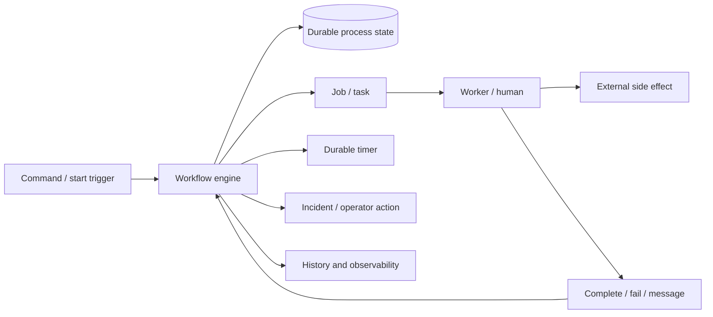
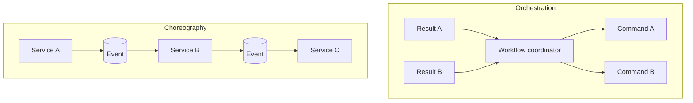
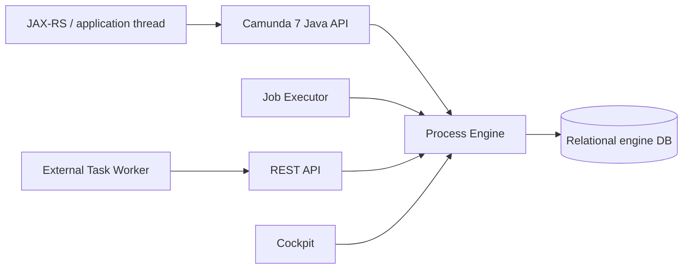
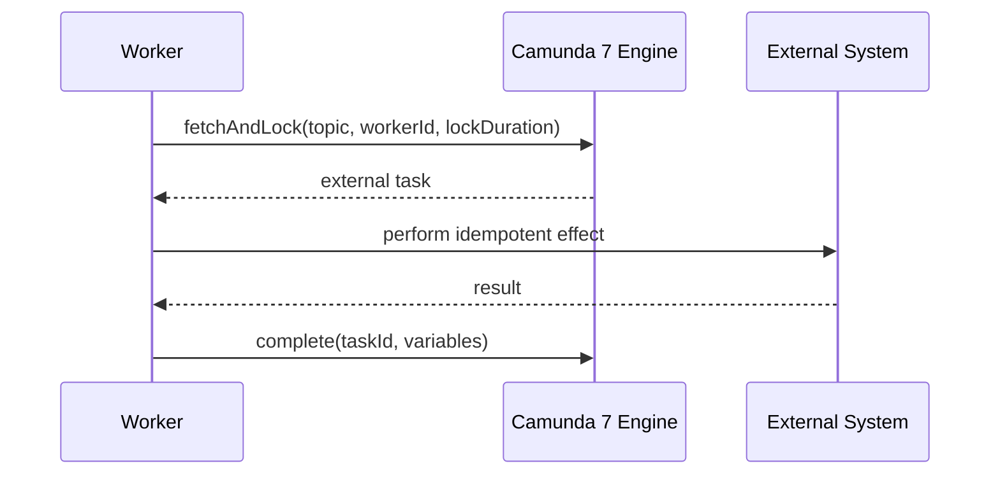
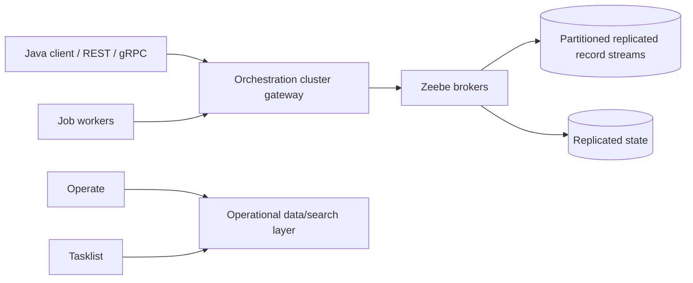
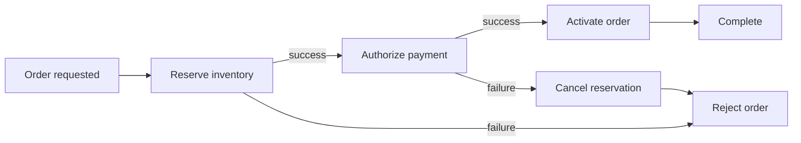

# Part 037 — BPMN, Camunda 7, Camunda 8, and Workflow Boundaries

> Workflow engine bukan pengganti domain model, database transaction, message broker, atau generic scheduler. Ia adalah durable state machine yang mengingat posisi proses, menunggu external events, menjadwalkan timers, mengalokasikan work, dan membantu recovery lintas failure. Model BPMN yang bagus memperlihatkan business milestones dan failure boundaries. Model yang buruk hanya memindahkan imperative code ke diagram, menyimpan payload tak terbatas sebagai variables, dan menjadikan operator sebagai retry mechanism.

## Daftar Isi

1. [Target kompetensi](#target-kompetensi)
2. [Scope dan baseline](#scope-dan-baseline)
3. [Current product and version reality](#current-product-and-version-reality)
4. [Mental model durable orchestration](#mental-model-durable-orchestration)
5. [Workflow versus domain service](#workflow-versus-domain-service)
6. [Orchestration versus choreography](#orchestration-versus-choreography)
7. [When a workflow engine is justified](#when-a-workflow-engine-is-justified)
8. [When not to use a workflow engine](#when-not-to-use-a-workflow-engine)
9. [BPMN collaboration and process boundaries](#bpmn-collaboration-and-process-boundaries)
10. [Pools, lanes, participants, and ownership](#pools-lanes-participants-and-ownership)
11. [Sequence flow versus message flow](#sequence-flow-versus-message-flow)
12. [Tokens and execution semantics](#tokens-and-execution-semantics)
13. [Start events](#start-events)
14. [End events](#end-events)
15. [Service tasks](#service-tasks)
16. [User tasks](#user-tasks)
17. [Receive and send tasks](#receive-and-send-tasks)
18. [Business rule tasks and DMN](#business-rule-tasks-and-dmn)
19. [Script tasks](#script-tasks)
20. [Exclusive gateway](#exclusive-gateway)
21. [Parallel gateway](#parallel-gateway)
22. [Inclusive gateway](#inclusive-gateway)
23. [Event-based gateway](#event-based-gateway)
24. [Embedded subprocess and call activity](#embedded-subprocess-and-call-activity)
25. [Event subprocess](#event-subprocess)
26. [Multi-instance activities](#multi-instance-activities)
27. [Boundary events](#boundary-events)
28. [Timer events](#timer-events)
29. [Message events and correlation](#message-events-and-correlation)
30. [Signal events](#signal-events)
31. [Error and escalation events](#error-and-escalation-events)
32. [Compensation](#compensation)
33. [BPMN transaction subprocess](#bpmn-transaction-subprocess)
34. [Process variables as durable contract](#process-variables-as-durable-contract)
35. [Variable scope](#variable-scope)
36. [Variable serialization and data size](#variable-serialization-and-data-size)
37. [Business key and correlation key](#business-key-and-correlation-key)
38. [Idempotency and command identity](#idempotency-and-command-identity)
39. [Camunda 7 architecture](#camunda-7-architecture)
40. [Camunda 7 embedded versus shared engine](#camunda-7-embedded-versus-shared-engine)
41. [Camunda 7 command and transaction model](#camunda-7-command-and-transaction-model)
42. [Camunda 7 wait states](#camunda-7-wait-states)
43. [Camunda 7 asynchronous continuations](#camunda-7-asynchronous-continuations)
44. [Camunda 7 job executor](#camunda-7-job-executor)
45. [Camunda 7 exclusive jobs](#camunda-7-exclusive-jobs)
46. [Camunda 7 Java delegates](#camunda-7-java-delegates)
47. [Camunda 7 external tasks](#camunda-7-external-tasks)
48. [External-task fetch-and-lock lifecycle](#external-task-fetch-and-lock-lifecycle)
49. [External-task lock extension and completion](#external-task-lock-extension-and-completion)
50. [Camunda 7 retries and incidents](#camunda-7-retries-and-incidents)
51. [Camunda 7 optimistic locking](#camunda-7-optimistic-locking)
52. [Camunda 7 history and cleanup](#camunda-7-history-and-cleanup)
53. [Camunda 7 REST and JAX-RS integration](#camunda-7-rest-and-jax-rs-integration)
54. [Camunda 7 process-definition versioning](#camunda-7-process-definition-versioning)
55. [Camunda 7 process-instance migration](#camunda-7-process-instance-migration)
56. [Camunda 8 architecture](#camunda-8-architecture)
57. [Zeebe partitioned replicated log](#zeebe-partitioned-replicated-log)
58. [Camunda 8 command and event processing](#camunda-8-command-and-event-processing)
59. [Camunda 8 process deployment and instances](#camunda-8-process-deployment-and-instances)
60. [Camunda 8 job workers](#camunda-8-job-workers)
61. [Job type and worker ownership](#job-type-and-worker-ownership)
62. [Job activation timeout](#job-activation-timeout)
63. [Job completion, failure, and rejection](#job-completion-failure-and-rejection)
64. [Camunda 8 retries and retry backoff](#camunda-8-retries-and-retry-backoff)
65. [Camunda 8 incidents](#camunda-8-incidents)
66. [Camunda 8 backpressure](#camunda-8-backpressure)
67. [Camunda 8 messages and correlation](#camunda-8-messages-and-correlation)
68. [Camunda 8 variables and document handling](#camunda-8-variables-and-document-handling)
69. [Camunda 8 user tasks and human workflow](#camunda-8-user-tasks-and-human-workflow)
70. [Operate, Tasklist, Identity, and Optimize](#operate-tasklist-identity-and-optimize)
71. [Camunda 8 Java client lifecycle](#camunda-8-java-client-lifecycle)
72. [REST versus gRPC and current client APIs](#rest-versus-grpc-and-current-client-apis)
73. [Camunda 7 versus Camunda 8](#camunda-7-versus-camunda-8)
74. [Migration is a redesign, not a library upgrade](#migration-is-a-redesign-not-a-library-upgrade)
75. [Worker implementation pattern](#worker-implementation-pattern)
76. [Worker idempotency](#worker-idempotency)
77. [Long-running work and heartbeats](#long-running-work-and-heartbeats)
78. [External APIs and ambiguous outcomes](#external-apis-and-ambiguous-outcomes)
79. [Database transactions and workflow commands](#database-transactions-and-workflow-commands)
80. [Outbox and workflow integration](#outbox-and-workflow-integration)
81. [Workflow as saga coordinator](#workflow-as-saga-coordinator)
82. [Timers, deadlines, and business calendars](#timers-deadlines-and-business-calendars)
83. [DMN and FEEL boundaries](#dmn-and-feel-boundaries)
84. [Decision versioning](#decision-versioning)
85. [Human tasks, assignment, and authorization](#human-tasks-assignment-and-authorization)
86. [Multi-tenancy](#multi-tenancy)
87. [Secrets and connector configuration](#secrets-and-connector-configuration)
88. [Process-model governance](#process-model-governance)
89. [Element IDs as durable identifiers](#element-ids-as-durable-identifiers)
90. [Modeling conventions](#modeling-conventions)
91. [Deployment and compatibility](#deployment-and-compatibility)
92. [Rolling deployment of workers](#rolling-deployment-of-workers)
93. [Process cancellation and termination](#process-cancellation-and-termination)
94. [Manual intervention and operations](#manual-intervention-and-operations)
95. [Observability](#observability)
96. [Capacity and performance](#capacity-and-performance)
97. [Failure-model matrix](#failure-model-matrix)
98. [Debugging playbook](#debugging-playbook)
99. [Testing strategy](#testing-strategy)
100. [Architecture patterns](#architecture-patterns)
101. [Anti-patterns](#anti-patterns)
102. [PR review checklist](#pr-review-checklist)
103. [Trade-off yang harus dipahami senior engineer](#trade-off-yang-harus-dipahami-senior-engineer)
104. [Internal verification checklist](#internal-verification-checklist)
105. [Latihan verifikasi](#latihan-verifikasi)
106. [Ringkasan](#ringkasan)
107. [Referensi resmi](#referensi-resmi)

---

## Target kompetensi

Setelah menyelesaikan part ini, Anda harus mampu:

- menjelaskan workflow engine sebagai durable state-machine/orchestration runtime;
- memilih apakah business process perlu BPMN engine atau cukup application state machine;
- membaca token movement, gateway, event, subprocess, message, timer, error, escalation, dan compensation semantics;
- menentukan wait states dan durable transaction boundaries;
- membedakan process variable, domain state, document, dan transient execution data;
- menjelaskan Camunda 7 relational process engine dan transaction borrowing model;
- menggunakan async continuation, job executor, external tasks, retries, and incidents secara benar;
- menjelaskan Camunda 8/Zeebe sebagai distributed stream-processing workflow engine;
- membangun job worker yang bounded, idempotent, timeout-aware, and observable;
- memahami duplicate execution akibat worker timeout dan recovery;
- mendesain message correlation, business keys, and command idempotency;
- mengintegrasikan JAX-RS, database transactions, outbox, and workflow commands;
- menggunakan workflow sebagai saga coordinator tanpa mengklaim distributed transaction;
- mengelola process/decision versioning and migration;
- mendesain human-task authorization, multitenancy, audit, history, and operations;
- membandingkan Camunda 7 and 8 without treating them as API-compatible products;
- melakukan testing and production debugging.

---

## Scope dan baseline

Baseline:

- Java 17+;
- JAX-RS/Jersey application;
- BPMN 2.0 and DMN/FEEL;
- Camunda 7 and Camunda 8 as distinct platforms;
- PostgreSQL or supported relational database for Camunda 7;
- Zeebe-based orchestration cluster for Camunda 8;
- external integrations via HTTP, Kafka/RabbitMQ, and databases;
- reliability/idempotency concepts from Parts 024, 029, 034–036.

Part ini **tidak mengasumsikan**:

- Camunda is used internally;
- exact Camunda edition/version;
- embedded or remote engine;
- Spring Boot;
- Camunda SaaS or Self-Managed;
- Connectors are enabled;
- user-task product/version;
- multi-tenancy mode;
- Operate/Tasklist/Optimize availability;
- process instances should be migrated;
- engine database may be queried directly;
- internal CSG process architecture.

---

## Current product and version reality

As of July 2026:

- Camunda 7 `manual/latest` resolves to the 7.24 documentation.
- Official Camunda 7 docs display an End-of-Life warning and migration guidance toward Camunda 8.
- Camunda 8 documentation and APIs continue to evolve independently.
- Camunda 7 and Camunda 8 are not drop-in runtime replacements.

Therefore:

```text
Camunda 7 knowledge remains necessary for existing estates.
New platform decisions must include lifecycle/EOL risk.
Camunda 8 migration requires model, worker, data, operational, and product redesign.
```

Exact support deadlines and enterprise terms must be verified from official lifecycle pages and contracts.

---

## Mental model durable orchestration



Workflow engine owns:

- process position;
- active subscriptions;
- timers;
- task/job lifecycle;
- retries/incidents;
- correlations;
- process version;
- variables needed to continue.

Workflow engine does not automatically own:

- domain source of truth;
- external transaction;
- consumer idempotency;
- file/document storage;
- authorization of every domain action;
- semantic correctness of workers.

---

## Workflow versus domain service

Domain service should own:

- aggregate invariants;
- pricing/calculation;
- data validation;
- authorization;
- database state;
- domain events.

Workflow should own:

- sequence and coordination;
- waiting;
- timeout/escalation;
- manual approval;
- compensation path;
- long-running status;
- retries and operator visibility.

Bad boundary:

```text
BPMN variables contain full quote entity,
scripts calculate price,
gateways implement all domain rules,
engine database becomes source of truth.
```

Good boundary:

```text
workflow stores quoteId + command/event IDs + required milestones
worker calls quote domain service
domain service validates and commits
workflow records orchestration result
```

---

## Orchestration versus choreography



Orchestration:

- explicit process state;
- visible timeout/compensation;
- central coordination;
- easier business monitoring;
- coordinator coupling.

Choreography:

- service autonomy;
- no central workflow;
- implicit flow;
- cycle and observability risk.

Hybrid is common: workflow coordinates high-level milestones while events integrate services.

---

## When a workflow engine is justified

Good candidates:

- process lasts minutes to months;
- waits for humans/external messages;
- timers/deadlines/escalations;
- compensating steps;
- many observable milestones;
- regulated audit;
- process changes independent of domain releases;
- support team needs operational visibility;
- state must survive restarts.

---

## When not to use a workflow engine

Avoid for:

- a short synchronous transaction;
- simple CRUD;
- deterministic in-memory calculation;
- one database transaction;
- high-volume per-record mapping better suited to streaming;
- cron job with no durable process state;
- low-value diagram of existing imperative code;
- domain rules that belong in code/DMN but are modeled as dozens of technical gateways.

---

## BPMN collaboration and process boundaries

A BPMN process represents behavior of one participant.

A collaboration can show multiple participants and message flows.

Avoid drawing sequence flows across service/organization boundaries. Use message flows to represent communication.

---

## Pools, lanes, participants, and ownership

Pool:

- participant/process boundary.

Lane:

- responsibility classification within process;
- not necessarily runtime authorization;
- not deployment unit.

Names should represent business actors or systems, not Java classes.

---

## Sequence flow versus message flow

Sequence flow:

- token movement inside one process.

Message flow:

- communication between participants.

A message flow does not mean synchronous HTTP. It can be Kafka, RabbitMQ, API callback, email, or manual input.

---

## Tokens and execution semantics

Token is a conceptual marker of process execution.

Parallel gateway creates multiple active paths.

Join waits according to gateway semantics.

Do not interpret BPMN token as Java thread. Durable process execution may pause between steps.

---

## Start events

Types include:

- none;
- message;
- timer;
- conditional;
- signal;
- error/escalation in event subprocess contexts.

Start semantics determine:

- how process is instantiated;
- correlation;
- duplicate start behavior;
- timer schedule;
- authorization.

---

## End events

End event can:

- end one path;
- throw message/signal/error/escalation;
- terminate scope;
- compensate/cancel depending context.

Terminate end event kills active tokens in its scope; use deliberately.

---

## Service tasks

Service task represents automated work.

Implementation can be:

- in-process delegate in Camunda 7;
- external task;
- Zeebe job worker;
- connector;
- expression/script, though code ownership matters.

Name should express business action:

```text
Reserve Inventory
Calculate Quote Price
Create Order
```

not:

```text
Call REST API
Execute Java Delegate
```

Technical detail belongs to properties/documentation.

---

## User tasks

User task represents human work requiring:

- assignment;
- authorization;
- due date;
- form/input validation;
- completion semantics;
- audit;
- escalation.

Task completion is a business command, not merely clicking a UI button.

Revalidate authorization and process state at completion.

---

## Receive and send tasks

Receive task waits for message/correlation.

Send task models outgoing message action; implementation and delivery reliability still require outbox/idempotency.

---

## Business rule tasks and DMN

Business rule task delegates a decision.

Use DMN when:

- inputs/outputs are clear;
- decision table is explainable;
- policy changes independently;
- test matrix is valuable.

Do not place side effects inside a decision.

---

## Script tasks

Risks:

- runtime language dependency;
- weak static analysis;
- security;
- hidden domain code;
- migration portability;
- debugging;
- classpath differences.

Use scripts for small, deterministic transformations only under policy.

---

## Exclusive gateway

Selects one outgoing path based on conditions.

Rules:

- mutually exclusive conditions preferred;
- default flow;
- deterministic variables;
- no side effects in expressions;
- failure if no condition and no default.

---

## Parallel gateway

Fork activates all outgoing paths.

Join waits for all relevant incoming tokens.

It does not create distributed transactions and may create concurrency/optimistic locking pressure.

---

## Inclusive gateway

Activates one or more matching paths and joins only paths that could be active.

Semantics are more complex. Use only when business meaning needs dynamic subset of parallel branches.

---

## Event-based gateway

Waits for the first event among alternatives, such as:

- message received;
- timeout.

Once one wins, other subscriptions are cancelled.

Useful for “response or timeout” patterns.

---

## Embedded subprocess and call activity

Embedded subprocess:

- scope within same process definition;
- local variables/events;
- model organization.

Call activity:

- invokes separate process definition;
- independent version binding and variable mapping;
- reusable process contract.

Avoid call-activity explosion that creates deeply coupled version trees.

---

## Event subprocess

Can react to events while scope is active.

Interrupting event subprocess cancels active work in scope.

Non-interrupting event subprocess creates additional path.

Use for timeout, escalation, cancellation, and exception handling.

---

## Multi-instance activities

Sequential or parallel repetitions over a collection/count.

Risks:

- unbounded fan-out;
- variable collisions;
- external rate limits;
- incident explosion;
- transaction/optimistic locking;
- output aggregation;
- cancellation.

Bound cardinality and isolate each item identity.

---

## Boundary events

Attached to activity:

- interrupting;
- non-interrupting.

Examples:

- timer;
- error;
- escalation;
- message;
- signal;
- compensation.

Model what happens to underlying external work when activity is interrupted. BPMN cancellation does not automatically cancel remote HTTP/payment.

---

## Timer events

Timers are durable schedules, not precise real-time guarantees.

Consider:

- timezone;
- daylight saving;
- due-date calculation;
- business calendar;
- engine load;
- clock skew;
- retry after downtime;
- thundering herd;
- cancellation.

Use absolute dates/instants with explicit business semantics.

---

## Message events and correlation

Correlation identifies waiting process instance.

Possible keys:

- business key;
- tenant + aggregate ID;
- command ID;
- external reference;
- message ID.

Message must be idempotent. Duplicate correlation may:

- find no subscription after first delivery;
- start duplicate process;
- correlate wrong instance if key not unique.

Persist inbound message identity where critical.

---

## Signal events

Signal is broadcast semantics.

Use sparingly. A signal can affect many instances and produce large fan-out.

Prefer message correlation for targeted interaction.

---

## Error and escalation events

BPMN error:

- modeled business/technical outcome;
- caught by error boundary/event subprocess;
- not equivalent to arbitrary Java exception.

Escalation:

- communicates exceptional condition without necessarily terminating scope.

Define error codes as durable contracts.

---

## Compensation

Compensation invokes handlers for completed compensatable activities.

Compensation:

- is not database rollback;
- can fail;
- can be partial;
- must be idempotent;
- must be auditable;
- may require manual resolution.

---

## BPMN transaction subprocess

BPMN transaction/cancel semantics model a business transaction protocol.

It is not automatically XA/ACID across services.

Use compensation and cancel events according to engine support and business semantics.

---

## Process variables as durable contract

Variables survive deployment and may be read by:

- later tasks;
- workers;
- operations tools;
- expressions;
- forms;
- migrated process versions.

Treat variable names/types as schema.

---

## Variable scope

Use narrow local scope where possible.

Global variable collisions occur in:

- parallel branches;
- call activities;
- multi-instance tasks;
- event subprocesses.

Use explicit input/output mappings.

---

## Variable serialization and data size

Avoid storing:

- large documents;
- full HTTP bodies;
- secrets/tokens;
- database entities;
- unbounded collections;
- binary files.

Store references:

```json
{
  "quoteId": "Q123",
  "documentRef": "s3://.../...",
  "catalogRevision": "2026-07-11.4"
}
```

Large variables increase persistence, network, indexing, history, and incident payload cost.

---

## Business key and correlation key

Business key is a searchable external identity, not necessarily unique unless governed.

Prefer composite tenant-aware uniqueness:

```text
tenantId + orderId
```

Do not use PII as business key.

---

## Idempotency and command identity

Start/complete/correlate commands may be retried after timeout.

Use stable command ID and durable command receipt to avoid:

- duplicate process instance;
- duplicate message correlation;
- repeated user-task completion side effect;
- repeated worker effect.

---

## Camunda 7 architecture



Camunda 7 engine is Java code using a relational database for runtime/history/jobs.

---

## Camunda 7 embedded versus shared engine

Embedded:

- engine in application;
- shared transaction/classpath;
- tight lifecycle coupling.

Shared/container:

- engine managed centrally;
- process applications deployed;
- classloading/container integration.

Remote REST:

- service accesses engine via HTTP;
- network and API contract;
- no shared DB transaction.

---

## Camunda 7 command and transaction model

The engine borrows the caller thread for synchronous API commands.

It advances until wait state and participates in transaction context.

Unhandled exception rolls current transaction back to previous persisted wait state.

Therefore a service task without async boundary may execute in the same transaction as task completion/start call.

---

## Camunda 7 wait states

Always/commonly durable waits include:

- user task;
- receive task;
- message/timer/signal events;
- event-based gateway;
- external task.

At wait state, state is persisted and caller can return.

---

## Camunda 7 asynchronous continuations

`asyncBefore` and `asyncAfter` add job-executor transaction boundaries.

Use to:

- separate user command from risky integration;
- create retryable job;
- limit transaction scope;
- enable parallel multi-instance work.

Example:

```xml
<bpmn:serviceTask
    id="reserveInventory"
    name="Reserve Inventory"
    camunda:asyncBefore="true"
    camunda:exclusive="true"
    camunda:class="com.example.ReserveInventoryDelegate" />
```

Element IDs and extension namespace depend on model/runtime version.

---

## Camunda 7 job executor

Job executor:

- acquires due jobs;
- locks jobs;
- executes;
- retries failures;
- creates incidents when retries exhausted;
- handles timers and async continuations.

Capacity depends on:

- acquisition settings;
- thread pool;
- DB indexes/locks;
- due-job volume;
- deployment awareness;
- execution duration;
- external dependencies.

---

## Camunda 7 exclusive jobs

Exclusive jobs for the same process instance help avoid concurrent execution and optimistic-lock conflicts.

They do not serialize external work across multiple process instances or services.

Understand acquisition batching and process-instance scope.

---

## Camunda 7 Java delegates

Java delegate executes inside engine command/transaction unless asynchronous boundary separates it.

Requirements:

- stateless/thread-safe bean where shared;
- no long unbounded I/O in engine transaction;
- map business BPMN error separately from technical exception;
- idempotent if job retries;
- bounded variables;
- secure expression resolution.

---

## Camunda 7 external tasks

External tasks decouple work from engine JVM.

Worker:

1. subscribes to topic;
2. fetches and locks tasks;
3. performs work;
4. completes or reports failure/BPMN error;
5. optionally extends lock.

Benefits:

- language/platform isolation;
- worker scaling;
- engine classpath separation;
- independent deployment.

---

## External-task fetch-and-lock lifecycle



If lock expires before completion, another worker can acquire the task.

---

## External-task lock extension and completion

Long work should:

- estimate lock duration;
- extend lock before expiry;
- stop if ownership lost;
- avoid huge lock durations hiding dead workers;
- use external idempotency.

Completion after lock loss may fail even if external effect succeeded. Reconciliation is required.

---

## Camunda 7 retries and incidents

On job failure, retries decrement according to configuration/cycle.

At zero retries, incident can be created and execution stops until operator action.

External tasks report retries/retry timeout explicitly.

Do not use immediate retries for long dependency outage.

---

## Camunda 7 optimistic locking

Parallel updates to same execution/process state may throw optimistic-lock exception.

Sources:

- parallel gateways;
- multi-instance;
- concurrent message correlation;
- duplicate task completion;
- job concurrency.

Use async/exclusive boundaries and idempotent retry; do not simply disable concurrency protection.

---

## Camunda 7 history and cleanup

History supports audit and operations but grows with:

- process volume;
- variable updates;
- incidents;
- tasks;
- decisions;
- byte arrays.

Configure history level, time-to-live, cleanup, legal retention, and archive.

History database is not a business analytics source without governance.

---

## Camunda 7 REST and JAX-RS integration

Options:

- call embedded Java API;
- call Camunda REST API;
- expose custom JAX-RS facade.

Facade should:

- authenticate/authorize;
- validate business command;
- enforce tenant;
- use idempotency;
- hide engine internals;
- map errors;
- return durable process/command status.

Do not expose generic engine REST directly to untrusted product clients without policy.

---

## Camunda 7 process-definition versioning

Deploying same process definition key creates new version.

New instances usually select latest unless version specified.

Existing instances remain on old version unless migrated.

Worker/delegate compatibility must support active versions.

---

## Camunda 7 process-instance migration

Migration requires mapping old activity IDs to new activity IDs and validating semantics.

Risks:

- changed variable expectations;
- active jobs;
- event subscriptions;
- timers;
- called processes;
- history/audit;
- external worker topic changes.

Not every instance should be migrated. Long-running processes can finish on old definition.

---

## Camunda 8 architecture



Exact Camunda 8 component topology varies by version and SaaS/Self-Managed distribution.

---

## Zeebe partitioned replicated log

Zeebe distributes process instances across partitions.

Each partition:

- processes commands sequentially;
- writes events;
- maintains state;
- replicates data;
- has leadership.

Partitioning provides scale but no global transaction/order across partitions.

---

## Camunda 8 command and event processing

Clients send commands:

- deploy resource;
- create process instance;
- publish message;
- complete/fail job;
- modify/cancel instance.

Broker validates command against current state. Accepted command produces events and follow-up commands that drive execution.

This is not Camunda 7 caller-thread transaction semantics.

---

## Camunda 8 process deployment and instances

Deploy BPMN/DMN/forms/resources according to version support.

Process-definition versions coexist.

Starting by BPMN process ID commonly selects a version according to API behavior; explicit version/key may be available.

Record exact deployed resource digest and release.

---

## Camunda 8 job workers

Service task with job type creates job.

Worker subscribes to type, activates jobs, performs work, then:

- completes;
- fails with retries/backoff;
- throws BPMN error where modeled;
- allows activation timeout to expire.

Workers are independent services/threads and should be long-lived.

---

## Job type and worker ownership

Job type is durable integration contract.

Good:

```text
quote.calculate-price.v1
order.reserve-inventory.v2
```

Avoid Java class names.

Govern:

- owner;
- request variables;
- output variables;
- timeout;
- retries;
- idempotency;
- version compatibility;
- authorization.

---

## Job activation timeout

Activated job is leased to worker for timeout duration.

If not completed/failed before timeout, it becomes available again without necessarily decrementing retries.

Two workers can execute same job concurrently after timeout. Only one completion may succeed; external side effects can still duplicate.

---

## Job completion, failure, and rejection

Complete only after durable intended effect.

Fail when technical work did not complete, with remaining retries and backoff.

Throw BPMN error for modeled business outcome.

A command can be rejected because job no longer exists/owned, even when external effect succeeded.

---

## Camunda 8 retries and retry backoff

Worker controls retry decrement and can specify retry backoff.

Policy should classify:

- transient;
- permanent technical;
- business BPMN error;
- poison variable/schema;
- ambiguous external outcome.

Retries must be bounded and observable.

---

## Camunda 8 incidents

When retries reach zero or execution cannot progress, incident is created.

Incident requires root-cause correction plus appropriate state/retry update and resolution.

Resolving incident without fixing cause creates recurrence.

---

## Camunda 8 backpressure

Zeebe applies backpressure/admission controls under load.

Client symptoms include rejected/resource-exhausted commands or latency.

Use:

- bounded worker activation;
- max active jobs;
- client retry with backoff;
- rate limit;
- capacity planning;
- partition-aware metrics.

Do not retry aggressively against overloaded cluster.

---

## Camunda 8 messages and correlation

Message publication commonly includes:

- message name;
- correlation key;
- variables;
- time-to-live;
- message ID for deduplication where supported.

A message may be buffered until subscription exists according to TTL.

Define whether duplicate message ID is reused on retry.

---

## Camunda 8 variables and document handling

Variables are often JSON-like records and transported between client, broker, workers, and operational components.

Keep bounded.

Use object/document storage for large files and store references/checksums.

Variable updates should be scoped to avoid replacing unrelated state.

---

## Camunda 8 user tasks and human workflow

User-task capabilities evolve by platform version.

Govern:

- assignee/candidate;
- forms;
- authorization;
- due/follow-up;
- completion validation;
- task implementation type;
- migration from legacy task behavior;
- audit.

Verify current version APIs and Tasklist integration.

---

## Operate, Tasklist, Identity, and Optimize

Conceptual roles:

- Operate: process operations/incidents;
- Tasklist: human task experience;
- Identity/security integration;
- Optimize: analytics/optimization.

Packaging and capabilities vary by edition/version. Do not assume component availability.

---

## Camunda 8 Java client lifecycle

Client owns:

- connections/channels;
- authentication;
- worker threads/executors;
- job workers;
- serialization;
- metrics.

Create application-scoped client.

Shutdown:

1. stop accepting new work;
2. close job workers;
3. wait bounded handlers;
4. close client;
5. terminate.

---

## REST versus gRPC and current client APIs

Camunda 8 APIs have evolved toward unified orchestration APIs and REST capabilities while Java client behavior can involve supported transports according to version.

Do not copy old Zeebe client examples without verifying:

- artifact coordinates;
- endpoint;
- authentication;
- protocol;
- long-poll/job-worker limitations;
- API version.

---

## Camunda 7 versus Camunda 8

| Dimension | Camunda 7 | Camunda 8 |
|---|---|---|
| Core engine | relational Java process engine | Zeebe distributed stream processor |
| Execution | caller thread + job executor | commands/events + job workers |
| State | engine relational DB | replicated partition state/log |
| In-process delegate | common | worker/connector model |
| External work | External Tasks | Job Workers |
| Transaction boundary | DB command/wait states | engine state-machine records |
| Operations | Cockpit | Operate |
| Human tasks | Tasklist 7 | Tasklist/Orchestration APIs version-dependent |
| Migration | process-instance migration API | version/migration capabilities differ |
| Scaling | engine nodes + shared DB | partitioned brokers/gateways |
| EOL direction | 7 is reaching EOL | strategic current platform |

---

## Migration is a redesign, not a library upgrade

Migration workstreams:

- BPMN support differences;
- delegation code → workers;
- variable serialization;
- expressions/FEEL;
- tasklist/forms;
- identity/auth;
- REST APIs;
- incidents/operations;
- history/reporting;
- connectors;
- message correlation;
- process-instance migration or coexistence;
- infrastructure;
- licensing/support;
- testing.

Use coexistence/strangler strategy where appropriate.

---

## Worker implementation pattern

```java
final class ReserveInventoryWorker {
    private final InventoryGateway inventory;
    private final ProcessedJobRepository processedJobs;

    void handle(ActivatedJob job, JobClient client) {
        String commandId = requiredString(job, "commandId");
        String orderId = requiredString(job, "orderId");

        try {
            ReservationResult result =
                    processedJobs.executeOnce(commandId, () ->
                            inventory.reserve(orderId, commandId));

            client.newCompleteCommand(job.getKey())
                    .variables(Map.of(
                            "reservationId", result.reservationId(),
                            "reservationStatus", result.status()))
                    .send()
                    .join();
        } catch (TransientInventoryException e) {
            int remaining = Math.max(0, job.getRetries() - 1);
            client.newFailCommand(job.getKey())
                    .retries(remaining)
                    .retryBackoff(Duration.ofSeconds(30))
                    .errorMessage(safeMessage(e))
                    .send()
                    .join();
        }
    }
}
```

Exact API names depend on Camunda version. The pattern matters:

- stable command ID;
- idempotent side effect;
- bounded variables;
- classified failure;
- completion after durable effect.

---

## Worker idempotency

Worker can execute repeatedly due to:

- retry;
- timeout;
- worker crash;
- response loss;
- process modification;
- operator action.

Use:

- command/job business ID;
- unique DB constraint;
- external API idempotency key;
- compare-and-set state;
- inbox/processed-command table;
- reconciliation.

Job key alone may not be stable across process redesign/retries for business deduplication.

---

## Long-running work and heartbeats

For work longer than activation/lock:

- split into asynchronous external job;
- extend lock/timeout if API supports;
- use polling status;
- avoid one worker thread blocked for hours;
- store external operation ID;
- complete workflow after callback/message.

Do not set one-day lock as substitute for durable external state.

---

## External APIs and ambiguous outcomes

```text
worker calls CreateOrder
remote commits
response is lost
worker fails
workflow retries
```

Use:

- idempotency key;
- query operation status;
- command resource;
- reconciliation;
- BPMN branch for unknown outcome;
- manual incident only after automated evidence exhausted.

---

## Database transactions and workflow commands

No implicit atomicity between:

- domain DB;
- Camunda 8 command;
- remote Camunda 7 REST;
- external task completion;
- message publication.

Embedded Camunda 7 may share local transaction under specific integration, but this creates coupling and must be verified.

---

## Outbox and workflow integration

Patterns:

### DB → workflow

Domain transaction stores outbox command/event. Relay starts/correlates workflow idempotently.

### Workflow → DB

Worker uses DB inbox/command table and then completes job.

### Workflow → event

Worker/domain transaction writes outbox; relay publishes.

Do not dual-write without recovery plan.

---

## Workflow as saga coordinator



Workflow stores orchestration state. Services remain owners of local transactions.

Compensation is explicit and may require further retries/incidents.

---

## Timers, deadlines, and business calendars

Distinguish:

- technical retry delay;
- SLA deadline;
- due date;
- escalation;
- offer expiry;
- business-day schedule;
- timeout of external task/job.

Use a `Clock` in application code and explicit timezone/calendar service for business dates.

---

## DMN and FEEL boundaries

FEEL/DMN should be deterministic and side-effect free.

Inputs:

- versioned DTO/map;
- explicit dates/numbers;
- no hidden database query.

Outputs:

- typed;
- validated;
- mapped to domain decision.

Avoid dynamically invoking arbitrary beans/functions without governance.

---

## Decision versioning

New decision versions may coexist.

Process should specify whether decision binding is:

- latest;
- deployment;
- version;
- tag/key, depending platform.

For replay/audit, record decision definition/version and relevant input hash.

---

## Human tasks, assignment, and authorization

Assignment metadata is not sufficient authorization.

On claim/complete:

- authenticate;
- verify tenant;
- verify role/relationship;
- check task state;
- validate payload;
- optimistic concurrency;
- audit actor/delegation.

Support impersonation/break-glass must be explicit.

---

## Multi-tenancy

Models vary:

- tenant ID on definitions/instances;
- separate clusters/namespaces;
- application-level tenant variables;
- separate databases in Camunda 7;
- platform tenancy features by edition/version.

Never trust tenant variable alone for access control.

---

## Secrets and connector configuration

Do not put secrets in BPMN variables or model XML.

Use secret references and platform identity.

Connector templates/configuration should expose only safe fields and enforce URL/credential policies.

---

## Process-model governance

A BPMN file is executable source code.

Require:

- version control;
- code review;
- model lint;
- element IDs;
- ownership;
- documentation;
- compatibility;
- tests;
- deployment artifact digest;
- migration plan.

---

## Element IDs as durable identifiers

Element IDs are referenced by:

- incidents;
- process-instance migration;
- modification;
- analytics;
- tests;
- variable mappings;
- operations.

Do not let Modeler regenerate IDs casually.

Names can change for readability; IDs require compatibility review.

---

## Modeling conventions

Good conventions:

- happy path left-to-right;
- business names;
- errors/timers visible;
- bounded subprocesses;
- no crossing flows where avoidable;
- explicit default gateways;
- documented variables;
- consistent message/error codes;
- technical detail hidden from high-level collaboration.

---

## Deployment and compatibility

Before deploying:

- validate BPMN/DMN;
- ensure workers for new job types are ready;
- ensure old workers support active versions;
- confirm variable contracts;
- confirm forms/task APIs;
- test messages/timers;
- ensure operational tools recognize version;
- ensure rollback/coexistence.

Deploy worker compatibility before activating process paths that require it.

---

## Rolling deployment of workers

During rollout, old/new worker versions may receive same job type.

Options:

- backward-compatible worker;
- versioned job type;
- worker version routing;
- new process version only after worker readiness.

Changing job-variable requirements under same type can break old workers.

---

## Process cancellation and termination

Cancellation should define:

- active external jobs;
- remote operations;
- timers;
- human tasks;
- compensation;
- retained audit;
- idempotent repeated cancel;
- authorization.

Engine cancellation does not automatically undo external systems.

---

## Manual intervention and operations

Operator actions include:

- retry/reset;
- incident resolution;
- variable correction;
- message correlation;
- process modification;
- cancellation;
- migration.

Each action needs:

- authorization;
- reason;
- audit;
- precondition;
- blast radius;
- reconciliation;
- post-verification.

Avoid direct engine DB edits.

---

## Observability

Identifiers:

- process definition/key/version;
- process instance key/ID;
- business key;
- tenant;
- activity/element ID;
- job/external task key;
- worker/job type;
- incident;
- command/event ID;
- correlation/trace.

Metrics:

- active instances;
- starts/completions;
- duration;
- jobs activated/completed/failed;
- retries/incidents;
- worker latency;
- activation timeout;
- message correlation failures;
- timer backlog;
- job executor acquisition;
- optimistic locking;
- partition/backpressure;
- history growth.

Do not use process instance ID as metric label.

---

## Capacity and performance

Capacity factors:

### Camunda 7

- engine DB latency/locks;
- job executor threads;
- acquisition;
- history level;
- variable size;
- timer density;
- cluster nodes;
- indexes/cleanup.

### Camunda 8

- partitions/replication;
- broker CPU/disk/network;
- gateway;
- worker max active jobs;
- variable size;
- exporter/Operate ingestion;
- backpressure;
- state growth.

Performance test realistic process shape, not only starts/sec.

---

## Failure-model matrix

| Failure | Impact | Detection | Response |
|---|---|---|---|
| Domain logic hidden in BPMN | model fragility | review/change pain | move to domain service/DMN |
| Large variables | DB/log/state pressure | size metrics | externalize document |
| Duplicate process start | parallel business flow | command/business-key audit | idempotency store |
| Wrong message correlation | wrong/stuck instance | correlation errors | tenant-aware unique key |
| Timer storm | engine overload | due timer backlog | spread/batch/capacity |
| Camunda 7 delegate fails synchronously | caller transaction rollback | API error | async boundary where appropriate |
| Camunda 7 job retries hot-loop | dependency amplification | failed jobs | retry cycle/backoff |
| External task lock expires | duplicate work | duplicate worker logs | idempotency/lock extension |
| Optimistic locking storm | throughput loss | exceptions | exclusive/async/model redesign |
| History cleanup absent | database growth | table/storage metrics | TTL/cleanup |
| Camunda 8 job timeout | concurrent duplicate execution | activation/NOT_FOUND completion | idempotent worker |
| Camunda 8 retries zero | incident/stuck process | Operate/metrics | fix + reset/resolve |
| Worker completion lost | effect done, workflow retries | external audit | idempotency/reconciliation |
| Job type changed in place | no compatible worker | activation backlog | versioned contract |
| Process deployed before worker | jobs accumulate/incidents | no worker metrics | deployment gate |
| Old worker processes new variables | mapping failure | worker errors | compatibility rollout |
| Incident resolved without fix | repeated incident | recurrence | root-cause gate |
| Engine cancel leaves external operation | orphan effect | reconciliation | cancellation protocol |
| Direct engine DB edit | corrupted state | audit/schema anomaly | APIs/runbook |
| EOL platform ignored | support/security risk | lifecycle review | migration plan |

---

## Debugging playbook

### Process instance does not advance

Check:

1. current element;
2. incident;
3. active job/task;
4. retries;
5. waiting message/timer;
6. worker subscription/job type;
7. variable mapping;
8. authorization;
9. external dependency;
10. engine cluster health.

### Camunda 7 job executor is slow

Inspect:

- due jobs;
- locks/lock owner;
- acquisition;
- thread pool;
- DB connection pool;
- long-running delegates;
- history writes;
- deployment awareness;
- optimistic locking;
- job priority.

### External task repeatedly redelivers

Check:

- lock duration;
- worker ID;
- lock extension;
- processing duration;
- worker crash;
- completion error;
- external side-effect idempotency;
- task retries.

### Camunda 8 worker receives duplicate jobs

Check activation timeout, worker pause/GC, network, completion latency, retries, and external command ID.

Duplicate activation after timeout is expected failure behavior; fix idempotency.

### Message is not correlated

Check:

- message name;
- correlation key type/value;
- tenant;
- active subscription;
- TTL;
- process version;
- duplicate message ID;
- transaction timing;
- start message versus intermediate catch.

### Incident returns after resolution

Root cause remains:

- variable invalid;
- worker missing;
- dependency unavailable;
- retry reset only;
- model error;
- unauthorized action.

### New process version is unused

Check start API version selection, tenant, deployment resource/key, process ID, cached config, and explicit version binding.

### Worker has jobs but no throughput

Check max active jobs, handler executor, downstream dependency, retries, backpressure, variable size, and thread dumps.

---

## Testing strategy

### BPMN model tests

- happy path;
- every gateway;
- error/escalation;
- timeout;
- compensation;
- parallel join;
- multi-instance;
- cancellation.

### Camunda 7 tests

- engine unit/integration;
- transaction rollback;
- async boundaries;
- job execution;
- failed job/retries;
- external task lock;
- optimistic locking;
- process migration.

Use real database for lock/history/performance behavior.

### Camunda 8 tests

- official test utilities where appropriate;
- real/local Camunda runtime for job activation, messages, incidents, retries, backpressure;
- worker duplicate execution;
- process version coexistence;
- operational APIs.

### Contract tests

- job type;
- input/output variables;
- message name/correlation;
- error codes;
- DMN inputs/outputs;
- forms;
- task completion commands.

### Failure injection

- kill worker after external commit before completion;
- expire job lock/activation timeout;
- duplicate message;
- dependency outage;
- broker/engine restart;
- worker version mismatch;
- invalid variable;
- timer backlog.

### Migration tests

- old active process + new workers;
- new process + mixed workers;
- instance migration mappings;
- rollback/coexistence;
- EOL-to-new-platform translation.

---

## Architecture patterns

### Thin orchestration

BPMN coordinates; domain services own decisions and state.

### External worker boundary

Engine has durable job; independent worker executes idempotent command.

### Command + status resource

JAX-RS persists command and returns workflow/process status URI.

### Workflow outbox/inbox

Commands/messages enter through durable relay; worker effects are deduplicated.

### Versioned worker contracts

Job type or variable schema versions support rolling deployment.

### Human approval with timeout

User task plus boundary timer and escalation path.

### Saga orchestration

Workflow records completed steps and invokes idempotent compensation.

---

## Anti-patterns

- BPMN as giant application code;
- full domain entity in variables;
- secrets in variables;
- synchronous long I/O inside Camunda 7 transaction;
- no async boundary around retryable work;
- generic job type such as `execute`;
- worker not idempotent;
- retrying business rejection as technical failure;
- zero-backoff retries;
- incident as normal branch;
- manual variable edits as standard operation;
- process element IDs regenerated;
- all processes always migrated;
- deploying process before workers;
- old/new workers incompatible under same job type;
- direct engine DB queries for domain decisions;
- signal used for targeted correlation;
- unbounded parallel multi-instance;
- cancellation assumed to undo remote effects;
- assuming Camunda 7 and 8 have equivalent semantics;
- ignoring Camunda 7 EOL.

---

## PR review checklist

### Business and model

- [ ] Is workflow engine justified?
- [ ] Are domain invariants outside BPMN?
- [ ] Are process boundaries/participants correct?
- [ ] Are gateways deterministic/defaulted?
- [ ] Are error, timeout, and cancellation paths modeled?
- [ ] Is compensation a valid business action?
- [ ] Is multi-instance bounded?

### Variables and contracts

- [ ] Variables bounded and typed?
- [ ] Documents externalized?
- [ ] No secrets/tokens?
- [ ] Tenant/business/correlation IDs clear?
- [ ] Job types/messages/error codes governed?
- [ ] Element IDs stable?
- [ ] Old/new worker compatibility?

### Reliability

- [ ] Worker/delegate idempotent?
- [ ] External ambiguous outcome handled?
- [ ] Retries classified/backed off?
- [ ] Incident ownership?
- [ ] Activation/lock timeout aligned?
- [ ] DB/workflow dual write addressed?
- [ ] Cancellation protocol?
- [ ] Reconciliation?

### Camunda 7

- [ ] Transaction boundaries known?
- [ ] Async continuation where needed?
- [ ] Job executor capacity?
- [ ] External task lock?
- [ ] Optimistic locking?
- [ ] History TTL/cleanup?
- [ ] EOL/migration impact?

### Camunda 8

- [ ] Partitions/cluster/client version known?
- [ ] Worker max active jobs/executor bounded?
- [ ] Job timeout and duplicate execution tested?
- [ ] Retry backoff/incidents?
- [ ] Message TTL/dedup/correlation?
- [ ] Variables scoped?
- [ ] Operate/Tasklist operational path?

### Security and operations

- [ ] Start/correlate/complete authorization?
- [ ] Tenant isolation?
- [ ] Human-task authorization?
- [ ] Operator action audit?
- [ ] Dashboards/alerts?
- [ ] Deployment rollback/coexistence?
- [ ] Runbooks tested?

---

## Trade-off yang harus dipahami senior engineer

| Decision | Benefit | Cost/risk |
|---|---|---|
| Workflow engine | durable visibility/timers | platform/operational complexity |
| Choreography | service autonomy | implicit process |
| Orchestration | explicit state | coordinator coupling |
| Embedded Camunda 7 | shared transaction/simple calls | lifecycle/classpath/DB coupling |
| Remote engine | separation | network and dual-write gaps |
| Java delegate | low latency | engine transaction/classpath coupling |
| External task/job worker | independent scaling | at-least-once/idempotency |
| Async continuation | retryable boundary | more jobs/latency |
| Parallel branches | throughput | conflicts/fan-out |
| Single serial path | ordering | lower throughput |
| Variables as data | easy continuation | storage/schema pressure |
| IDs/references only | bounded state | extra domain lookups |
| Latest process version | simple start | nondeterministic release coupling |
| Explicit version | repeatability | deployment management |
| Migrate instances | unified model | operational risk |
| Let old instances finish | safer | long coexistence |
| DMN | visible policy | version/data governance |
| Script | quick logic | maintainability/security risk |
| Camunda 7 retention | mature estate | EOL/support risk |
| Camunda 8 | distributed strategic platform | migration and operational redesign |

---

## Internal verification checklist

### Product and runtime

- [ ] Camunda 7, Camunda 8, both, or neither.
- [ ] Exact versions/editions/support dates.
- [ ] SaaS or Self-Managed.
- [ ] Embedded/shared/remote architecture.
- [ ] Engine/cluster endpoints.
- [ ] Database/search/storage dependencies.
- [ ] Modeler version.
- [ ] BPMN/DMN supported features.

### Camunda 7

- [ ] Process engine configuration.
- [ ] Database and transaction manager.
- [ ] Job executor settings.
- [ ] Async/exclusive convention.
- [ ] Delegate/CDI/Spring integration.
- [ ] External task client version/config.
- [ ] REST authentication.
- [ ] History level/TTL/cleanup.
- [ ] Cockpit/Tasklist access.
- [ ] Process-instance migration runbook.
- [ ] EOL migration plan.

### Camunda 8

- [ ] Cluster version/topology/partitions/replication.
- [ ] Gateway/API endpoints and protocol.
- [ ] Java client artifact/version.
- [ ] Authentication/OAuth.
- [ ] Worker types/owners.
- [ ] Max active jobs/timeouts/executors.
- [ ] Retry/backoff policy.
- [ ] Incident operations.
- [ ] Message TTL/dedup.
- [ ] Variable/document limits.
- [ ] Operate/Tasklist/Identity/Optimize.
- [ ] Exporter/search retention.
- [ ] Backpressure monitoring.

### Model governance

- [ ] Repository/source of truth.
- [ ] BPMN linting.
- [ ] Element ID policy.
- [ ] Naming conventions.
- [ ] Job/message/error schemas.
- [ ] Process/decision versioning.
- [ ] Deployment gate.
- [ ] Migration/coexistence.
- [ ] Test framework.
- [ ] Model owner/on-call.

### Integration and reliability

- [ ] JAX-RS start/status/cancel APIs.
- [ ] Command idempotency.
- [ ] Outbox/inbox.
- [ ] Worker idempotency store.
- [ ] External API idempotency.
- [ ] Kafka/RabbitMQ correlation.
- [ ] Timer/business calendar.
- [ ] Reconciliation.
- [ ] Compensation.
- [ ] Manual resolution.

### Security and operations

- [ ] Tenant model.
- [ ] Start/correlate/task/operate authorization.
- [ ] Secrets/connector policy.
- [ ] PII in variables/history.
- [ ] Audit/operator log.
- [ ] Metrics/traces/logs.
- [ ] Incident SLO.
- [ ] Backup/restore.
- [ ] DR and cross-region behavior.
- [ ] Capacity/load tests.

---

## Latihan verifikasi

1. Ambil satu business process dan pisahkan domain state dari orchestration state.
2. Tandai semua Camunda 7 wait states and transaction boundaries.
3. Tambahkan async boundary dan buktikan rollback/retry behavior.
4. Expire external-task/Zeebe job lock after external commit and prove idempotency.
5. Publish duplicate message and verify correlation/dedup semantics.
6. Deploy new process version while old instances/workers remain active.
7. Trigger incident, fix root cause, reset retries, resolve, and audit.
8. Cancel process during external operation and reconcile orphan effect.
9. Measure variable/history/state growth with oversized payload.
10. Draft Camunda 7-to-8 coexistence plan without assuming direct instance migration.

---

## Ringkasan

- Workflow engine is a durable state machine and orchestration runtime.
- Domain state and invariants should remain in domain services.
- BPMN sequence flow stays inside process; message flow crosses participants.
- Wait states, messages, timers, errors, compensation, and human tasks are durable contracts.
- Process variables require schema, size, security, and version discipline.
- Camunda 7 uses a relational Java process engine with caller-thread commands, wait states, and job executor boundaries.
- Async continuations create transaction and retry boundaries in Camunda 7.
- External tasks and Camunda 8 jobs are leased at-least-once work.
- Worker timeout can create concurrent duplicate external execution.
- Worker idempotency and stable command identity are mandatory.
- Incidents are operator-visible blocked states, not ordinary business branches.
- Camunda 8/Zeebe uses partitioned replicated command/event processing.
- Camunda 7 and Camunda 8 have materially different runtime and operational semantics.
- Migration is a redesign and coexistence exercise, not dependency replacement.
- Workflow/database/broker commands need outbox, inbox, and reconciliation.
- Compensation is a new business action, not transaction rollback.
- Element IDs, job types, messages, error codes, process versions, and variable schemas are durable contracts.
- Camunda 7 current documentation warns of EOL; lifecycle risk must be included in architecture.
- Exact internal platform, versions, topology, and governance remain **Internal verification checklist**.

---

## Referensi resmi

- [Camunda 7 Documentation](https://docs.camunda.org/manual/latest/)
- [Camunda 7 — Transactions in Processes](https://docs.camunda.org/manual/latest/user-guide/process-engine/transactions-in-processes/)
- [Camunda 7 — The Job Executor](https://docs.camunda.org/manual/latest/user-guide/process-engine/the-job-executor/)
- [Camunda 7 — External Tasks](https://docs.camunda.org/manual/latest/user-guide/process-engine/external-tasks/)
- [Camunda 7 — Incidents](https://docs.camunda.org/manual/latest/user-guide/process-engine/incidents/)
- [Camunda 7 — Process Versioning](https://docs.camunda.org/manual/latest/user-guide/process-engine/process-versioning/)
- [Camunda 7 — Process Instance Migration](https://docs.camunda.org/manual/latest/user-guide/process-engine/process-instance-migration/)
- [Camunda 8 Documentation](https://docs.camunda.io/)
- [Camunda 8 — Job Workers](https://docs.camunda.io/docs/components/concepts/job-workers/)
- [Camunda 8 — Java Job Worker](https://docs.camunda.io/docs/apis-tools/java-client/job-worker/)
- [Camunda 8 — Incidents](https://docs.camunda.io/docs/components/concepts/incidents/)
- [Camunda 8 — Internal Processing](https://docs.camunda.io/docs/components/zeebe/technical-concepts/internal-processing/)
- [Camunda 8 — Writing Good Workers](https://docs.camunda.io/docs/components/best-practices/development/writing-good-workers/)
- [Camunda 8 — Dealing with Problems and Exceptions](https://docs.camunda.io/docs/components/best-practices/development/dealing-with-problems-and-exceptions/)
- [OMG BPMN 2.0.2 Specification](https://www.omg.org/spec/BPMN/2.0.2/)
- [OMG DMN Specification](https://www.omg.org/dmn/)
