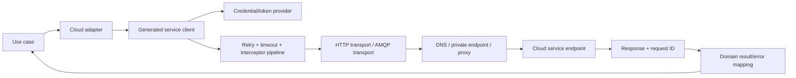
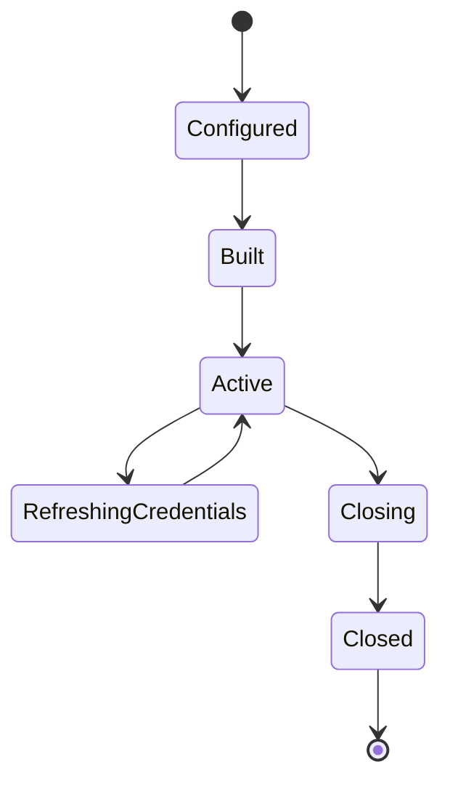
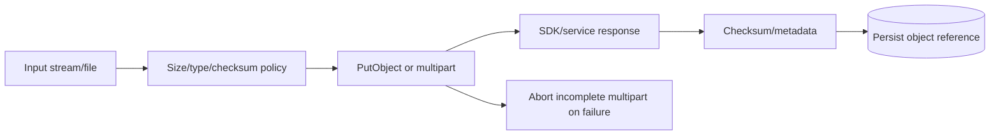
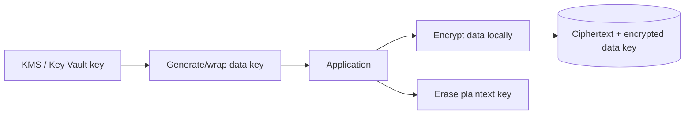

# Part 038 — AWS and Azure SDK Integration

> Cloud SDK adalah generated, signed, retried, and transport-backed remote client stack. Memanggil `s3.putObject()`, `secretClient.getSecret()`, atau `serviceBusSender.sendMessage()` tetap merupakan distributed operation dengan identity, region, DNS, connection pool, timeout, throttling, retries, partial transfer, ambiguous outcome, service-specific consistency, and billing implications. Production integration harus mengelola lifecycle clients, credentials, endpoint selection, concurrency, streaming ownership, error taxonomy, idempotency, and observability sebagai satu architecture boundary.

## Daftar Isi

1. [Target kompetensi](#target-kompetensi)
2. [Scope dan baseline](#scope-dan-baseline)
3. [Mental model cloud SDK call](#mental-model-cloud-sdk-call)
4. [Shared principles across AWS and Azure](#shared-principles-across-aws-and-azure)
5. [SDK version and dependency governance](#sdk-version-and-dependency-governance)
6. [BOM and module selection](#bom-and-module-selection)
7. [Client lifecycle](#client-lifecycle)
8. [Thread safety and client reuse](#thread-safety-and-client-reuse)
9. [Client-per-region and client-per-identity](#client-per-region-and-client-per-identity)
10. [Synchronous versus asynchronous clients](#synchronous-versus-asynchronous-clients)
11. [Async does not remove capacity limits](#async-does-not-remove-capacity-limits)
12. [Underlying HTTP transports](#underlying-http-transports)
13. [Connection pools and concurrency](#connection-pools-and-concurrency)
14. [HTTP client ownership](#http-client-ownership)
15. [DNS, proxies, private endpoints, and service mesh](#dns-proxies-private-endpoints-and-service-mesh)
16. [TLS and certificate trust](#tls-and-certificate-trust)
17. [Credential principles](#credential-principles)
18. [Temporary credentials and token rotation](#temporary-credentials-and-token-rotation)
19. [AWS default credentials provider chain](#aws-default-credentials-provider-chain)
20. [AWS workload identity](#aws-workload-identity)
21. [IAM roles, STS, and assume-role](#iam-roles-sts-and-assume-role)
22. [AWS credential scope and least privilege](#aws-credential-scope-and-least-privilege)
23. [Azure Identity and TokenCredential](#azure-identity-and-tokencredential)
24. [DefaultAzureCredential](#defaultazurecredential)
25. [Azure managed identity and workload identity](#azure-managed-identity-and-workload-identity)
26. [Azure service principals](#azure-service-principals)
27. [Azure RBAC and data-plane authorization](#azure-rbac-and-data-plane-authorization)
28. [Credential-chain debugging](#credential-chain-debugging)
29. [Credential failure modes](#credential-failure-modes)
30. [Region, location, and endpoint selection](#region-location-and-endpoint-selection)
31. [AWS region provider chain](#aws-region-provider-chain)
32. [AWS endpoint override](#aws-endpoint-override)
33. [Azure service endpoint and sovereign clouds](#azure-service-endpoint-and-sovereign-clouds)
34. [Multi-region architecture](#multi-region-architecture)
35. [Request lifecycle and signing](#request-lifecycle-and-signing)
36. [Retry semantics](#retry-semantics)
37. [AWS retry strategies](#aws-retry-strategies)
38. [Azure retry policies](#azure-retry-policies)
39. [Nested retry amplification](#nested-retry-amplification)
40. [Timeout taxonomy](#timeout-taxonomy)
41. [AWS API call and attempt timeouts](#aws-api-call-and-attempt-timeouts)
42. [Azure pipeline and service timeouts](#azure-pipeline-and-service-timeouts)
43. [Deadline budgets](#deadline-budgets)
44. [Throttling](#throttling)
45. [Adaptive concurrency and load shedding](#adaptive-concurrency-and-load-shedding)
46. [Error taxonomy](#error-taxonomy)
47. [AWS service and client exceptions](#aws-service-and-client-exceptions)
48. [Azure response and client exceptions](#azure-response-and-client-exceptions)
49. [Request IDs and support evidence](#request-ids-and-support-evidence)
50. [Execution interceptors and pipeline policies](#execution-interceptors-and-pipeline-policies)
51. [Observability and OpenTelemetry](#observability-and-opentelemetry)
52. [Logging and wire logging](#logging-and-wire-logging)
53. [Pagination](#pagination)
54. [Paginators and backpressure](#paginators-and-backpressure)
55. [Waiters and long-running operations](#waiters-and-long-running-operations)
56. [Polling, deadlines, and cancellation](#polling-deadlines-and-cancellation)
57. [AWS S3 client choices](#aws-s3-client-choices)
58. [S3 object-key and bucket boundary](#s3-object-key-and-bucket-boundary)
59. [S3 upload lifecycle](#s3-upload-lifecycle)
60. [S3 streaming and unknown content length](#s3-streaming-and-unknown-content-length)
61. [S3 multipart upload](#s3-multipart-upload)
62. [S3 Transfer Manager](#s3-transfer-manager)
63. [S3 download and range requests](#s3-download-and-range-requests)
64. [S3 checksums and integrity](#s3-checksums-and-integrity)
65. [S3 pre-signed URLs](#s3-pre-signed-urls)
66. [S3 metadata, tags, encryption, and retention](#s3-metadata-tags-encryption-and-retention)
67. [Azure Blob client choices](#azure-blob-client-choices)
68. [Azure Blob upload and download](#azure-blob-upload-and-download)
69. [Azure Blob streaming and transfer options](#azure-blob-streaming-and-transfer-options)
70. [Azure Blob SAS versus Entra authorization](#azure-blob-sas-versus-entra-authorization)
71. [Object-storage JAX-RS patterns](#object-storage-jax-rs-patterns)
72. [Do not proxy every large object through the JVM](#do-not-proxy-every-large-object-through-the-jvm)
73. [AWS SQS core semantics](#aws-sqs-core-semantics)
74. [SQS visibility timeout and acknowledgement](#sqs-visibility-timeout-and-acknowledgement)
75. [SQS long polling, batching, and DLQ](#sqs-long-polling-batching-and-dlq)
76. [SQS standard versus FIFO](#sqs-standard-versus-fifo)
77. [AWS SNS and fan-out](#aws-sns-and-fan-out)
78. [Azure Service Bus client lifecycle](#azure-service-bus-client-lifecycle)
79. [Service Bus settlement and PeekLock](#service-bus-settlement-and-peeklock)
80. [Service Bus lock renewal, concurrency, and sessions](#service-bus-lock-renewal-concurrency-and-sessions)
81. [Service Bus retries and dead-lettering](#service-bus-retries-and-dead-lettering)
82. [Cloud messaging and outbox](#cloud-messaging-and-outbox)
83. [AWS DynamoDB client patterns](#aws-dynamodb-client-patterns)
84. [DynamoDB idempotency and conditional writes](#dynamodb-idempotency-and-conditional-writes)
85. [DynamoDB pagination and capacity](#dynamodb-pagination-and-capacity)
86. [Azure Cosmos DB considerations](#azure-cosmos-db-considerations)
87. [AWS Systems Manager Parameter Store](#aws-systems-manager-parameter-store)
88. [AWS Secrets Manager](#aws-secrets-manager)
89. [AWS KMS](#aws-kms)
90. [Azure Key Vault](#azure-key-vault)
91. [Azure App Configuration](#azure-app-configuration)
92. [Secret and configuration caching](#secret-and-configuration-caching)
93. [Secret rotation](#secret-rotation)
94. [Envelope encryption and data keys](#envelope-encryption-and-data-keys)
95. [Cloud events and EventBridge or Event Grid](#cloud-events-and-eventbridge-or-event-grid)
96. [Infrastructure control-plane calls](#infrastructure-control-plane-calls)
97. [Data-plane versus management-plane SDKs](#data-plane-versus-management-plane-sdks)
98. [JAX-RS dependency boundary](#jax-rs-dependency-boundary)
99. [Cloud anti-corruption adapters](#cloud-anti-corruption-adapters)
100. [Multi-cloud abstraction](#multi-cloud-abstraction)
101. [When not to abstract](#when-not-to-abstract)
102. [Configuration and client registry](#configuration-and-client-registry)
103. [Readiness and startup](#readiness-and-startup)
104. [Graceful shutdown](#graceful-shutdown)
105. [Kubernetes and metadata-service traffic](#kubernetes-and-metadata-service-traffic)
106. [IMDS, identity endpoints, and connection pressure](#imds-identity-endpoints-and-connection-pressure)
107. [Local development and emulators](#local-development-and-emulators)
108. [Testing strategy](#testing-strategy)
109. [Cost and quota awareness](#cost-and-quota-awareness)
110. [Failure-model matrix](#failure-model-matrix)
111. [Debugging playbook](#debugging-playbook)
112. [Architecture patterns](#architecture-patterns)
113. [Anti-patterns](#anti-patterns)
114. [PR review checklist](#pr-review-checklist)
115. [Trade-off yang harus dipahami senior engineer](#trade-off-yang-harus-dipahami-senior-engineer)
116. [Internal verification checklist](#internal-verification-checklist)
117. [Latihan verifikasi](#latihan-verifikasi)
118. [Ringkasan](#ringkasan)
119. [Referensi resmi](#referensi-resmi)

---

## Target kompetensi

Setelah menyelesaikan part ini, Anda harus mampu:

- memperlakukan AWS/Azure service client sebagai long-lived network resource;
- memilih synchronous atau asynchronous client berdasarkan workload and threading model;
- mengidentifikasi underlying HTTP transport, pool, DNS, TLS, proxy, and executor behavior;
- menggunakan temporary workload identity, IAM roles, managed identity, and RBAC;
- memahami default credential/region chains and their debugging risks;
- menetapkan region/endpoints explicitly where correctness requires;
- mengkonfigurasi layered retries, timeouts, deadlines, and load shedding;
- memetakan cloud SDK exceptions ke retryability and domain error model;
- menggunakan request IDs, interceptors/policies, metrics, and traces;
- menangani pagination, waiters, pollers, long-running operations, and cancellation;
- mendesain S3/Azure Blob large-object transfer with multipart, checksums, streaming, and pre-signed/SAS access;
- memahami SQS/SNS/Service Bus delivery and settlement;
- mengakses parameters, secrets, and keys without exposing values or creating request storms;
- membedakan data-plane and management-plane SDK use;
- membuat anti-corruption adapter rather than leaking vendor models into domain;
- menilai multi-cloud abstraction pragmatically;
- mengintegrasikan cloud clients with JAX-RS lifecycle, Kubernetes identity, testing, cost, and quota governance.

---

## Scope dan baseline

Baseline:

- AWS SDK for Java 2.x;
- Azure SDK for Java modern client libraries;
- Java 17+;
- JAX-RS/Jersey service;
- Kubernetes, EKS, AKS, VM, container, or on-prem may host applications;
- cloud services may include object storage, messaging, NoSQL, secrets, configuration, encryption, and management APIs;
- resilience from Part 024;
- HTTP-client concepts from Part 036;
- messaging reliability from Parts 032–035.

Part ini **tidak mengasumsikan**:

- one cloud provider;
- exact SDK versions;
- exact HTTP clients;
- IRSA, EKS Pod Identity, AKS Workload Identity, VM managed identity, or static secrets;
- one region;
- specific S3/Blob consistency assumptions beyond official service contracts;
- SQS, Service Bus, DynamoDB, or Cosmos DB usage;
- secret caching library;
- LocalStack/Azurite;
- internal CSG cloud account/subscription structure;
- direct internet/private endpoints/service mesh.

---

## Mental model cloud SDK call



A single SDK method may include:

```text
credential refresh
endpoint resolution
request marshalling
request signing/token injection
pool acquisition
DNS/connect/TLS
retry attempts
response unmarshalling
checksum validation
pagination/polling
telemetry
```

---

## Shared principles across AWS and Azure

1. Reuse service clients.
2. Prefer temporary workload identity.
3. Explicitly bound retries and total operation deadlines.
4. Know the transport and pool.
5. Stream large data; do not buffer blindly.
6. Capture service request IDs.
7. Distinguish throttling from validation/auth.
8. Use idempotency/conditional operations for ambiguous outcomes.
9. Do not expose vendor DTOs to domain/API.
10. Test with real cloud integration for security and service semantics.

---

## SDK version and dependency governance

Cloud SDKs consist of many modules updated independently under a coordinated release train/BOM.

Risks:

- transitive version skew;
- Netty/Reactor/Jackson conflicts;
- native library differences;
- generated service model changes;
- retry/default changes;
- security advisories;
- support/EOL.

Pin and upgrade deliberately.

---

## BOM and module selection

AWS:

```xml
<dependencyManagement>
  <dependencies>
    <dependency>
      <groupId>software.amazon.awssdk</groupId>
      <artifactId>bom</artifactId>
      <version>${aws.sdk.version}</version>
      <type>pom</type>
      <scope>import</scope>
    </dependency>
  </dependencies>
</dependencyManagement>
```

Azure uses `azure-sdk-bom` for supported GA library alignment.

Import only required service and HTTP transport modules. Avoid an all-services bundle unless justified.

---

## Client lifecycle



Client construction can initialize:

- configuration;
- transport;
- pools;
- identity provider;
- background threads;
- native resources.

Build at application startup/composition root.

---

## Thread safety and client reuse

AWS SDK for Java 2.x service clients are designed to be thread-safe and shared.

Azure clients are generally designed for reuse, but exact thread-safety/lifecycle must be confirmed from library docs.

Create separate clients when configuration differs by:

- region;
- endpoint;
- identity;
- tenant/subscription/account;
- retry/timeout;
- transport;
- workload isolation.

---

## Client-per-region and client-per-identity

AWS client region is immutable after build.

Pattern:

```java
record AwsClientKey(
        String service,
        Region region,
        String roleArn
) {}
```

Use bounded registry/cache. Do not create unbounded clients for arbitrary tenant-supplied regions/roles.

For Azure, endpoint/account/vault/namespace usually belongs to client builder and often yields one client per resource endpoint.

---

## Synchronous versus asynchronous clients

Sync:

- simpler imperative code;
- blocks caller thread;
- use bounded request/executor capacity.

Async:

- `CompletableFuture` in AWS;
- Reactor `Mono`/`Flux` in many Azure async clients;
- non-blocking transport common;
- requires callback/event-loop discipline;
- cancellation and context propagation need care.

Do not call `.join()` on async client inside event-loop thread.

---

## Async does not remove capacity limits

Async can still exhaust:

- event loops;
- completion executors;
- connection concurrency;
- pending acquisition queue;
- heap buffers;
- service quotas;
- downstream throughput.

Use semaphore/bulkhead and bounded in-flight operations.

---

## Underlying HTTP transports

AWS SDK 2.x supports pluggable sync/async HTTP clients, such as:

- Apache-based sync;
- URLConnection sync;
- AWS CRT sync/async;
- Netty async.

Azure SDK uses Azure Core HTTP abstraction, commonly Netty by default, with alternative transports depending libraries/configuration.

Transport choice affects:

- HTTP versions;
- pooling;
- proxy;
- TLS/native dependencies;
- async behavior;
- DNS;
- metrics;
- startup footprint.

---

## Connection pools and concurrency

Align:

```text
application bulkhead
≤ SDK max concurrency/connections
≤ network/NAT capacity
≤ service quota
```

If application allows 500 calls but SDK pool supports 50, 450 wait locally.

If pool is enlarged without service capacity, throttling increases.

---

## HTTP client ownership

If each service client builds its own dedicated HTTP client through builder, SDK often owns lifecycle.

If one HTTP client is shared across service clients, application typically owns and must close it after all clients.

Document ownership explicitly to avoid premature close or leak.

---

## DNS, proxies, private endpoints, and service mesh

Verify:

- public/private endpoint;
- VPC/VNet DNS;
- PrivateLink/Private Endpoint;
- proxy;
- NAT;
- firewall;
- service mesh egress;
- hostname/SNI;
- DNS TTL/cache;
- IPv4/IPv6;
- regional endpoint.

Signature failures can occur if a proxy modifies signed AWS path/query/headers.

---

## TLS and certificate trust

Cloud endpoints rely on public or private trust chains.

For Azure private/self-managed endpoints and enterprise proxies, custom trust may be involved.

Never disable certificate or hostname verification.

Monitor CA/certificate rotation and native TLS dependencies.

---

## Credential principles

Prefer:

```text
workload identity
  → short-lived token/credentials
  → least-privilege role
  → SDK automatic refresh
```

Avoid:

```text
long-lived access key/client secret in source, image, or ordinary config
```

Credential provider is part of runtime dependency and can fail independently.

---

## Temporary credentials and token rotation

Credentials expire.

Client/provider should refresh before expiry.

Failure modes:

- endpoint unavailable;
- refresh throttled;
- token file not rotated;
- clock skew;
- role trust changed;
- pod identity agent unavailable;
- client secret expired;
- audience/tenant mismatch.

Do not cache raw credentials beyond provider lifecycle.

---

## AWS default credentials provider chain

AWS SDK 2.x default chain checks a defined sequence of providers, including environment/system configuration and workload/platform sources.

The first provider with complete credentials wins.

Benefits:

- environment portability;
- local/profile and workload identity support.

Risks:

- unexpected credential source;
- slow/failing metadata probes;
- developer credential used accidentally;
- stale environment variables override role;
- hard-to-debug chain.

In production, consider explicit intended provider when it improves security and predictability.

---

## AWS workload identity

Common patterns:

- web identity token with IAM role;
- container/task role credentials;
- EC2 instance profile;
- EKS-specific workload identity mechanisms;
- Lambda execution role.

Exact mechanism must be verified.

Never assume node role equals pod role.

---

## IAM roles, STS, and assume-role

AssumeRole creates temporary credentials for another role.

Use cases:

- cross-account access;
- privilege separation;
- tenant/account boundary;
- short session.

Govern:

- trust policy;
- external ID where relevant;
- session name/tags;
- duration;
- source identity;
- role chaining;
- STS endpoint/region;
- refresh concurrency.

---

## AWS credential scope and least privilege

IAM policy should scope:

- service actions;
- resource ARNs;
- conditions;
- KMS permissions;
- bucket/key prefix;
- queue/topic;
- account/region;
- tags;
- network endpoint conditions where used.

SDK permission errors should not be retried as transient outages.

---

## Azure Identity and TokenCredential

Azure Identity exposes `TokenCredential`.

Service clients request access token for required resource scope/audience.

Credential types cover:

- managed identity;
- workload identity;
- developer tools;
- service principal;
- certificate;
- chained credentials.

Token caching/refresh is handled by credential/client libraries according to implementation.

---

## DefaultAzureCredential

`DefaultAzureCredential` is a convenient ordered chain.

It is excellent for local development and portable setup, but production should understand exactly which credential is expected and which are excluded/enabled.

Risks:

- chain probes unavailable sources;
- unexpected developer credential;
- managed identity timeout;
- tenant ambiguity;
- logging noise;
- environment-specific behavior.

Use builder exclusions or a specific credential where predictability is required.

---

## Azure managed identity and workload identity

Azure-hosted applications should generally prefer managed identity.

Kubernetes may use federated workload identity.

Benefits:

- no application secret;
- Entra token;
- RBAC assignment;
- automatic rotation.

Verify:

- identity client/object/resource ID;
- federated credential;
- service account annotation/config;
- tenant;
- token file;
- role assignment propagation;
- endpoint/network.

---

## Azure service principals

For on-premises or non-Azure runtime, service principal may be used.

Prefer certificate/federation over client secret when platform permits.

Manage:

- tenant ID;
- client ID;
- secret/certificate;
- expiry;
- rotation overlap;
- RBAC;
- vault/storage of credential.

---

## Azure RBAC and data-plane authorization

Azure management-plane role may not grant data-plane access, and vice versa.

Examples:

- Storage Blob Data Contributor versus general resource-management role;
- Key Vault data access depending RBAC/access-policy model;
- Service Bus data sender/receiver roles.

Verify scope at subscription/resource group/resource/account/entity.

---

## Credential-chain debugging

Enable SDK identity logging carefully.

Record:

- credential type attempted;
- endpoint;
- tenant/client identity;
- final category;
- elapsed time.

Never log tokens, secrets, access keys, assertion contents, or signed requests.

---

## Credential failure modes

| Failure | Likely category |
|---|---|
| No provider available | environment/config |
| Token endpoint unreachable | network/identity service |
| Access denied | IAM/RBAC |
| Expired secret/cert | credential lifecycle |
| Wrong audience/scope | client/service config |
| Role trust failure | policy |
| Metadata endpoint throttling | workload/IMDS pressure |
| Clock skew | host time |
| Token file unreadable | mount/permissions |

---

## Region, location, and endpoint selection

Region affects:

- latency;
- data residency;
- service availability;
- cost;
- failover;
- signing;
- replication semantics.

Do not derive region from untrusted request input.

---

## AWS region provider chain

AWS SDK can resolve region from:

- explicit builder;
- system/environment configuration;
- shared profile;
- platform metadata.

Client region is immutable.

Explicit region is preferred when data/resource location is fixed.

---

## AWS endpoint override

Use for:

- local emulator;
- test endpoint;
- special service endpoint;
- controlled proxy.

Region is still needed for signing even with endpoint override.

Never allow arbitrary user-supplied endpoint override; SSRF and credential-signing exposure risk.

---

## Azure service endpoint and sovereign clouds

Azure resource clients often use explicit service URL:

```text
https://account.blob.core.windows.net
https://vault.vault.azure.net
namespace.servicebus.windows.net
```

Sovereign/private clouds use different authorities/endpoints.

Configure authority host and service audience consistently.

---

## Multi-region architecture

Patterns:

- active-passive;
- active-active;
- regional clients;
- write-primary/read-local;
- object replication;
- queue/event replication;
- failover endpoint.

SDK retry does not perform business-level cross-region failover automatically unless service/client feature explicitly supports it.

Failover can create duplicates and consistency gaps.

---

## Request lifecycle and signing

AWS requests are cryptographically signed, commonly SigV4.

Azure requests commonly use bearer tokens, SAS, keys, or service-specific signing.

Interceptors/proxies must not mutate signed components unexpectedly.

Clock accuracy matters.

---

## Retry semantics

SDK retries can happen below application code.

Review:

- default enabled;
- attempt count;
- retryable errors;
- backoff;
- throttling;
- idempotency;
- body repeatability;
- total timeout;
- metrics.

Never wrap SDK call with another generic retry without accounting for built-in attempts.

---

## AWS retry strategies

AWS SDK 2.x provides retry strategies such as standard/adaptive/legacy depending version.

Standard is a general default choice; adaptive behavior should be isolated to appropriate resource dimensions because shared throttling can affect unrelated resources.

Exact defaults vary by version and service.

---

## Azure retry policies

Azure Core pipeline commonly includes a `RetryPolicy`.

Service libraries may expose service-specific retry options.

Retries can cover transport failures and selected status codes.

Policy location relative to timeout policy determines whether timeout is per retry or per call.

---

## Nested retry amplification

Example:

```text
JAX-RS handler: 3 attempts
AWS/Azure SDK: 3 attempts
mesh: 2 attempts
service: internal retries

potential downstream attempts = 3 × 3 × 2 = 18
```

Choose one primary retry owner and set budgets.

---

## Timeout taxonomy

- pool acquisition;
- connection;
- TLS;
- socket/read/write;
- response;
- per-attempt;
- total API call;
- async future/Reactor timeout;
- waiter/poller total;
- JAX-RS request deadline.

---

## AWS API call and attempt timeouts

AWS SDK 2.x separates:

- `apiCallAttemptTimeout`: one attempt;
- `apiCallTimeout`: whole operation including retries.

HTTP client has lower-level timeouts.

Example:

```java
ClientOverrideConfiguration override =
        ClientOverrideConfiguration.builder()
                .apiCallAttemptTimeout(Duration.ofSeconds(2))
                .apiCallTimeout(Duration.ofSeconds(6))
                .build();
```

Numbers are examples only.

---

## Azure pipeline and service timeouts

Azure Core supports timeout policies at different pipeline positions and service methods may accept total timeout.

Async Reactor calls can use `.timeout(...)`, but understand whether lower-level operation continues/cancels.

Align per-retry and per-call timeout.

---

## Deadline budgets

```text
JAX-RS remaining deadline
  > SDK total call timeout
  > attempt timeout
  > connect/read sub-timeouts
```

Leave time for error mapping and response.

Background workflows should have their own deadline independent of HTTP request.

---

## Throttling

Cloud services return throttling/rate-limit signals.

Response:

- obey SDK retry/backoff;
- inspect service-specific retry-after;
- reduce concurrency;
- batch;
- shard only when architecture allows;
- request quota increase;
- cache;
- shed non-critical work.

Do not create synchronized retry storms.

---

## Adaptive concurrency and load shedding

Use:

- semaphore;
- bounded queues;
- per-service bulkhead;
- per-tenant quota;
- SDK concurrency limit;
- circuit breaker;
- oldest-work rejection.

Cloud quota is shared resource; one tenant can cause noisy neighbor.

---

## Error taxonomy

Map to:

- validation;
- not found;
- conflict/precondition;
- unauthorized/forbidden;
- throttled;
- transient service;
- transport;
- timeout;
- cancellation;
- ambiguous outcome;
- integrity/checksum;
- configuration;
- quota.

Preserve service error code and request ID internally.

---

## AWS service and client exceptions

AWS SDK distinguishes broadly:

- `AwsServiceException`: service returned error response;
- `SdkClientException`: client/transport/credentials/marshalling issues;
- service-specific exception subclasses.

Retryability cannot be inferred solely from base class.

---

## Azure response and client exceptions

Azure SDK commonly uses:

- `HttpResponseException` and service-specific subclasses;
- `ResourceNotFoundException`;
- `ClientAuthenticationException`;
- service-specific messaging exceptions;
- Reactor terminal errors.

Inspect status, error code, retryability, and response headers.

---

## Request IDs and support evidence

Capture:

- AWS request ID and extended request ID where relevant;
- Azure request/correlation IDs;
- timestamp;
- region/endpoint;
- operation;
- attempt count;
- error code;
- client version.

These are critical for cloud support investigations.

---

## Execution interceptors and pipeline policies

AWS `ExecutionInterceptor` hooks request/response lifecycle.

Azure `HttpPipelinePolicy` participates in pipeline.

Use for:

- telemetry;
- safe metadata;
- request modification;
- correlation.

Avoid:

- secrets logging;
- mutable shared state;
- blocking event loops;
- silently overriding SDK auth/headers;
- independent retries inside interceptor.

---

## Observability and OpenTelemetry

Trace attributes:

- cloud provider;
- service;
- operation;
- region;
- endpoint class, not secret URL;
- status/error;
- retry count;
- request ID.

Metrics:

- call latency;
- attempts;
- throttles;
- auth failures;
- pool pending;
- concurrency;
- bytes;
- pagination pages;
- transfer progress;
- credential refresh.

Use supported instrumentation and avoid double spans.

---

## Logging and wire logging

SDK debug/wire logging can expose:

- headers;
- signed request;
- query parameters;
- payload;
- tokens/keys;
- object names.

Enable only in controlled environment, redact, time-bound, and protect output.

---

## Pagination

List APIs return pages and continuation tokens.

Correctness:

- do not assume one call returns all;
- continuation token is opaque;
- data may change between pages;
- duplicates/missing can occur under concurrent mutation depending service;
- page size affects latency/cost;
- stop/cancel supported.

---

## Paginators and backpressure

AWS paginators provide iterable/publisher forms.

Azure often provides `PagedIterable`/`PagedFlux`.

Do not collect all items blindly.

Process page/item with bounded memory and deadline.

---

## Waiters and long-running operations

AWS waiters poll resource state.

Azure long-running operations commonly expose pollers such as sync/async poller abstractions.

A waiter/poller:

- is repeated API traffic;
- needs total deadline;
- can be cancelled;
- may outlive HTTP request;
- must handle terminal failure state.

For long operations, persist operation ID/status rather than blocking JAX-RS request.

---

## Polling, deadlines, and cancellation

Do not poll every second from thousands of requests.

Use:

- service-provided events where possible;
- workflow timer;
- bounded poll interval/backoff;
- durable status;
- shared poller;
- cancellation semantics.

---

## AWS S3 client choices

Options include:

- `S3Client` synchronous;
- `S3AsyncClient`;
- Java-based async multipart support;
- AWS CRT-based S3 client;
- S3 Transfer Manager.

Choose based on:

- object size;
- known/unknown length;
- throughput;
- async architecture;
- native dependency;
- multipart;
- checksums;
- startup/memory;
- proxy compatibility.

---

## S3 object-key and bucket boundary

Object key is not a filesystem path, even if it contains `/`.

Validate:

- tenant prefix;
- canonical naming;
- no user-controlled bucket;
- key length/encoding;
- PII;
- overwrite policy;
- versioning;
- lifecycle;
- encryption;
- access.

---

## S3 upload lifecycle



Order between DB reference and object creation needs compensation/reconciliation.

---

## S3 streaming and unknown content length

Synchronous upload often needs exact content length or may buffer to determine it.

Async multipart clients can handle unknown-length streams more efficiently depending configuration/version.

Never pass unbounded user stream without:

- maximum size;
- cancellation;
- executor ownership;
- timeout;
- checksum;
- multipart cleanup.

---

## S3 multipart upload

Multipart:

1. create upload;
2. upload parts;
3. complete with part list;
4. abort on failure.

Benefits:

- parallelism;
- retry individual part;
- large objects.

Risks:

- orphan incomplete uploads;
- memory/concurrency;
- part ordering;
- checksum semantics;
- cost;
- completion ambiguity.

Configure lifecycle rule to abort old incomplete multipart uploads as defense-in-depth.

---

## S3 Transfer Manager

S3 Transfer Manager uses async client and can improve multipart/parallel transfer.

Use application-scoped transfer manager and close it.

Monitor transfer progress and completion.

Do not block JAX-RS thread for very large transfer; use async job/status or direct client upload.

---

## S3 download and range requests

Download options:

- full response body;
- stream;
- file;
- async transformer;
- byte range;
- pre-signed URL.

Validate:

- content length;
- ETag/checksum semantics;
- range status;
- conditional request;
- decompression;
- response close.

---

## S3 checksums and integrity

Use supported checksum algorithms for upload/download integrity.

Do not assume ETag is always an MD5, especially for multipart/encrypted objects.

Store business checksum separately where needed.

---

## S3 pre-signed URLs

Pre-signed URL grants temporary access without giving caller AWS credentials.

Govern:

- short expiry;
- method;
- exact bucket/key;
- content constraints where applicable;
- one-time business policy;
- HTTPS;
- logging/referrer exposure;
- object existence;
- revocation limitations;
- tenant authorization before generation.

A URL can be reused until expiry unless additional controls exist.

---

## S3 metadata, tags, encryption, and retention

Metadata is returned with object and may expose sensitive data.

Tags can drive lifecycle/access policies but have limits/cost.

Encryption:

- service-managed;
- KMS-managed key;
- client-side/envelope where required.

Govern retention/object lock/versioning/deletion.

---

## Azure Blob client choices

Common clients:

- `BlobServiceClient`;
- `BlobContainerClient`;
- `BlobClient`;
- async equivalents;
- specialized block/page/append blob clients.

Build from endpoint + credential.

Reuse clients.

---

## Azure Blob upload and download

Operations include:

- upload from stream/file;
- upload with overwrite/conditions;
- stage blocks + commit block list;
- download stream/file/range;
- properties/metadata/tags;
- leases;
- snapshots/versions.

Use request conditions to prevent accidental overwrite.

---

## Azure Blob streaming and transfer options

Configure:

- block size;
- max concurrency;
- memory;
- progress;
- timeout;
- checksums;
- retry;
- length.

Reactive streaming must respect backpressure and avoid blocking Netty event loop.

---

## Azure Blob SAS versus Entra authorization

SAS delegates scoped temporary access.

Types and exact capabilities vary.

Govern:

- resource;
- permissions;
- start/expiry;
- protocol/IP;
- signing key/user delegation;
- revocation;
- leakage.

Prefer Entra/RBAC for service-to-service where possible; use SAS for delegated direct access.

---

## Object-storage JAX-RS patterns

### Direct upload

API validates and creates pre-signed/SAS upload URL. Client uploads directly. Callback/status confirms.

### Proxy upload

JAX-RS streams to object storage for small/controlled cases.

### Async ingestion

API stores command; worker scans/uploads/validates.

Choose by trust, file size, network, malware scanning, and user experience.

---

## Do not proxy every large object through the JVM

Proxying duplicates network path and consumes:

- request threads;
- buffers;
- egress;
- connection pools;
- timeout budget.

Direct upload reduces service load but requires upload authorization, object validation, completion verification, and quarantine workflow.

---

## AWS SQS core semantics

SQS is a managed queue service.

Messages can be delivered more than once.

Consumer:

- receives messages;
- processes;
- deletes after success;
- visibility timeout hides in-flight message temporarily.

Use message ID/business ID and idempotency.

---

## SQS visibility timeout and acknowledgement

Delete is acknowledgement.

If visibility expires before delete, message can redeliver.

Extend visibility for long work, but prefer bounded tasks.

Deleting after external side effect can fail ambiguously; duplicate-safe consumer required.

---

## SQS long polling, batching, and DLQ

Use long polling to reduce empty responses/cost.

Batch send/delete can partially succeed; inspect per-entry results.

DLQ redrive policy needs max receives, owner, alarm, retention, and controlled replay.

---

## SQS standard versus FIFO

Standard:

- high scale;
- at-least-once;
- best-effort order.

FIFO:

- message group ordering;
- deduplication window/ID semantics;
- throughput constraints/service features.

FIFO dedup does not replace long-horizon business idempotency.

---

## AWS SNS and fan-out

SNS publishes to subscriptions such as SQS, HTTP, Lambda, and others.

Delivery/retry depends on subscription protocol.

Use SQS subscription for durable worker buffering.

Filter policies are routing, not authorization.

---

## Azure Service Bus client lifecycle

Clients are long-lived and require time/resources to establish AMQP connections.

Client types include sender, receiver, async variants, and processor.

Sharing one builder can share connection; under high load shared I/O thread/connection can become bottleneck. Verify workload-specific connection topology.

---

## Service Bus settlement and PeekLock

PeekLock:

- message locked;
- process;
- complete, abandon, defer, or dead-letter.

Complete only after durable effect.

Receive-and-delete is at-most-once and loses message if processing fails after receipt.

---

## Service Bus lock renewal, concurrency, and sessions

Long processing may require auto/manual lock renewal.

Sessions provide ordered/stateful grouping.

Configure:

- max concurrent calls/sessions;
- prefetch;
- lock duration/renewal;
- processor ownership;
- settlement;
- session ID as business ordering key.

---

## Service Bus retries and dead-lettering

AMQP retry options handle transient operations.

Application processing retry is separate.

Dead-letter queue requires owner and redrive.

Do not retry authorization/business validation as transient AMQP failure.

---

## Cloud messaging and outbox

SQS/SNS/Service Bus send is not atomic with domain DB.

Use transactional outbox and relay.

Consumer uses inbox/idempotency and settles/deletes after local commit.

---

## AWS DynamoDB client patterns

Client options include sync/async and enhanced client.

Model:

- partition key;
- sort key;
- consistency;
- conditional writes;
- transactions;
- capacity;
- pagination;
- indexes.

Do not model relational joins into repeated scans.

---

## DynamoDB idempotency and conditional writes

Use conditional expression:

```text
attribute_not_exists(commandId)
```

or version checks to prevent duplicate state transitions.

Transactional writes are within DynamoDB scope, not external systems.

---

## DynamoDB pagination and capacity

Query/scan results paginate.

`LastEvaluatedKey` is continuation state.

Avoid full scans in request path.

Track consumed capacity, throttling, hot partitions, item size, and retry amplification.

---

## Azure Cosmos DB considerations

Cosmos DB client has substantial connection and consistency configuration.

Review:

- endpoint/key or Entra identity;
- direct/gateway mode;
- preferred regions;
- consistency level;
- partition key;
- RU throttling;
- async Reactor usage;
- client singleton;
- diagnostics.

Do not build client per request.

---

## AWS Systems Manager Parameter Store

Use for configuration parameters and secure strings where appropriate.

Consider:

- hierarchical names;
- version;
- decryption;
- IAM/KMS;
- API rate;
- caching;
- change propagation;
- size;
- fail-open/fail-closed.

Do not call Parameter Store for every request.

---

## AWS Secrets Manager

Provides versioned secrets and rotation integration.

Client responsibilities:

- retrieve by name/version stage;
- cache safely;
- handle rotation;
- avoid logging;
- least privilege;
- KMS access;
- endpoint availability.

Secret retrieval success does not mean downstream connection using old secret has rotated.

---

## AWS KMS

KMS operations include encrypt/decrypt/data-key generation/sign/verify depending key.

For bulk data, use envelope encryption:

- generate data key;
- encrypt locally;
- store encrypted data key;
- discard plaintext key.

KMS calls have quota/latency; do not call per tiny field without design.

---

## Azure Key Vault

Key Vault clients handle secrets, keys, and certificates through separate libraries.

Prefer Entra/managed identity.

Secret operations are versioned.

Cache only under explicit rotation and failure policy.

Do not print secret values as many documentation snippets do for demonstration.

---

## Azure App Configuration

App Configuration can host key-values, labels, feature flags, and references.

Integrate with:

- typed config;
- refresh triggers;
- cache;
- snapshot/version;
- Key Vault references;
- failover;
- startup validation.

Dynamic configuration must use atomic snapshots and audit.

---

## Secret and configuration caching

Cache reduces latency/quota and protects identity endpoints.

Define:

- TTL;
- refresh-ahead;
- stale-on-error;
- maximum stale;
- negative cache;
- per-key locking;
- cache size;
- encryption/memory handling;
- metrics.

Stale secret can cause auth outage; no cache can cause request storm.

---

## Secret rotation

Rotation sequence:

1. create new secret version;
2. downstream accepts old+new if possible;
3. refresh clients/pools;
4. verify;
5. revoke old;
6. monitor.

Database credentials may require connection pool rebuild.

Long-lived cloud SDK credentials should be provider-managed, not manually snapshotted.

---

## Envelope encryption and data keys



Store key ID/version and algorithm metadata.

---

## Cloud events and EventBridge or Event Grid

Cloud event routers can integrate SaaS/cloud services.

Govern:

- event source;
- schema;
- delivery/retry;
- filtering;
- authorization;
- archive/replay;
- cross-account/subscription;
- target idempotency.

Do not assume cloud-native event bus replaces Kafka/RabbitMQ requirements.

---

## Infrastructure control-plane calls

Creating/deleting cloud resources from request path is risky:

- long-running;
- eventual state;
- quota;
- IAM privilege;
- cost;
- ambiguous outcome.

Prefer asynchronous workflow, IaC, approval, and poller.

---

## Data-plane versus management-plane SDKs

Data plane:

- read/write object;
- send message;
- get secret;
- query data.

Management plane:

- create account/bucket/namespace;
- assign policy;
- configure resource.

Separate identities, libraries, and operational ownership.

Product service should rarely need broad management-plane privilege.

---

## JAX-RS dependency boundary

Resource should call domain port:

```java
public interface DocumentStore {
    StoredDocument put(DocumentUpload upload);
    InputStream open(DocumentRef ref);
    URI createDownloadGrant(DocumentRef ref, Duration ttl);
}
```

Adapter maps to S3 or Blob.

Do not return `PutObjectResponse` or `BlobProperties` from domain/API.

---

## Cloud anti-corruption adapters

Adapter owns:

- SDK request construction;
- cloud error mapping;
- retry assumptions;
- metadata/tag conventions;
- encryption;
- tenant key prefix;
- observability;
- pagination;
- resource closing.

Domain owns business semantics.

---

## Multi-cloud abstraction

Abstract stable capabilities:

- object put/get/grant;
- secret lookup;
- queue send/receive;
- key-value config.

Expose provider-specific features through capability interfaces or explicit extensions.

Lowest-common-denominator abstraction can discard valuable semantics.

---

## When not to abstract

Do not hide:

- S3 multipart tuning;
- Blob leases;
- DynamoDB conditional updates;
- Service Bus sessions;
- KMS grant/encryption context;
- provider-specific consistency.

If application fundamentally depends on one feature, make dependency explicit.

---

## Configuration and client registry

Typed config:

```java
public record S3StoreConfig(
        Region region,
        String bucket,
        Duration apiCallTimeout,
        int maxConcurrency,
        String kmsKeyArn
) {}
```

Registry builds clients once and validates endpoints/identities.

Do not allow arbitrary dynamic resource names from HTTP input.

---

## Readiness and startup

Startup checks:

- configuration;
- client construction;
- credential availability only if required;
- endpoint DNS/TLS;
- mandatory resource access;
- bucket/container/queue existence according to ownership.

Avoid mutating health checks.

Optional cloud dependency should not block whole service readiness.

---

## Graceful shutdown

Sequence:

1. stop ingress;
2. stop cloud message processors;
3. drain in-flight SDK calls/transfers;
4. settle only completed messages;
5. close transfer managers/processors;
6. close service clients;
7. close shared HTTP clients/executors last.

---

## Kubernetes and metadata-service traffic

Many pods starting simultaneously can call identity/metadata endpoints.

Risks:

- packets-per-second limits;
- metadata throttling;
- DNS;
- token refresh storm;
- node-level contention;
- init/startup failure.

Reuse providers/clients and cache credentials/config appropriately.

---

## IMDS, identity endpoints, and connection pressure

Do not poll metadata service per request.

Investigate:

- default credential chain probes;
- IMDS version/settings;
- hop limits/network policy;
- identity agent;
- token file;
- sidecar/proxy;
- PPS limits;
- SDK cache.

A metadata outage can cascade to all cloud calls if credentials expire simultaneously.

---

## Local development and emulators

Options:

- AWS profiles/SSO;
- Azure developer credentials;
- LocalStack or service emulators;
- Azurite;
- test containers;
- dedicated cloud sandbox.

Emulators do not fully reproduce:

- IAM/RBAC;
- TLS/private endpoints;
- service quotas;
- eventual behavior;
- multipart edge cases;
- managed identity;
- global service errors.

Use real cloud integration tests for critical paths.

---

## Testing strategy

### Unit tests

- adapter request mapping;
- error classification;
- key/resource naming;
- idempotency;
- pagination loop;
- retry/deadline policy;
- secret redaction.

### HTTP/transport tests

- connection pool;
- timeouts;
- retries;
- proxy;
- TLS;
- partial stream;
- cancellation.

### Cloud sandbox tests

- real workload identity;
- IAM/RBAC;
- encryption;
- S3/Blob upload/download/checksum;
- queue redelivery/lock;
- DLQ;
- secret rotation;
- throttling;
- request IDs.

### Failure injection

- credential expiry;
- metadata endpoint unavailable;
- region outage simulation;
- service throttling;
- connection reset;
- multipart failure;
- response loss after write;
- lock/visibility expiry;
- stale secret;
- KMS denied.

### Contract tests

- domain adapter behavior independent of vendor response classes;
- multi-cloud implementations pass shared capability tests;
- provider-specific tests cover extensions.

---

## Cost and quota awareness

Cloud calls cost and consume quota.

Track:

- requests;
- bytes/egress;
- storage;
- multipart parts;
- KMS operations;
- secret/config reads;
- queue API calls;
- DynamoDB capacity;
- Service Bus units;
- cross-region transfer;
- NAT/private endpoint cost.

A cache or batch optimization can be a reliability improvement and cost improvement.

---

## Failure-model matrix

| Failure | Impact | Detection | Response |
|---|---|---|---|
| Client per request | connection/thread leak | pool/startup metrics | singleton lifecycle |
| Wrong credential provider wins | privilege/security issue | identity logs | explicit provider/exclusions |
| Metadata endpoint unavailable | auth failure after expiry | credential metrics | workload identity runbook/cache |
| Static key leaked | security incident | secret scanning/audit | revoke/rotate/roles |
| Wrong region | latency/not found/data residency | endpoint logs | explicit config |
| Proxy modifies signed AWS request | signature mismatch | canonical request/support | proxy config |
| Nested retries | load amplification | attempts/trace | one retry owner |
| Throttling ignored | outage/latency | service error code | backoff/concurrency control |
| API call timeout absent | hung requests | thread/future metrics | total deadline |
| Shared HTTP client closed early | all clients fail | connection pool shut down | ownership order |
| Paginator collected fully | memory/cost | heap/pages | stream/bounded processing |
| Waiter in HTTP request | thread timeout | long request | async status workflow |
| S3 unknown-length sync upload buffers | OOM | heap | async multipart/file |
| Multipart not aborted | storage cost | incomplete upload inventory | abort/lifecycle rule |
| Presigned/SAS URL too broad | data exposure | access logs | least privilege/short TTL |
| Object written, DB reference fails | orphan object | reconciliation | staged state/cleanup |
| DB commits, queue send fails | missing event | outbox backlog | transactional outbox |
| Message visibility/lock expires | duplicate processing | receive count/lock lost | idempotency/renewal |
| Secret cache stale | downstream auth failure | secret version/connection errors | refresh/rebuild |
| Secret fetched every request | quota/latency storm | call metrics | bounded cache |
| KMS per-record hot path | throttle/cost | KMS metrics | envelope encryption/cache |
| Management client in product path | excessive privilege/cost | IAM/audit | separate control plane |
| Emulator-only tests | production auth failure | release incident | cloud sandbox tests |

---

## Debugging playbook

### Unable to load AWS credentials

Check:

- explicit provider;
- system/env variables;
- web identity token file/role ARN;
- profile;
- container credentials;
- IMDS;
- file permissions;
- trust policy;
- clock;
- SDK credential-chain logs.

### Azure credential unavailable/authentication failed

Check:

- selected `TokenCredential`;
- tenant/client ID;
- managed/workload identity;
- federated token;
- authority host;
- RBAC;
- network to Entra/identity endpoint;
- clock;
- chain logs.

### Access denied

Identify:

- authenticated principal;
- resource;
- action;
- IAM/RBAC scope;
- resource policy;
- KMS/key permissions;
- network endpoint policy;
- explicit deny;
- propagation delay.

Do not retry indefinitely.

### Connection pool timeout

Check:

- response/stream closure;
- max concurrency;
- pending acquisitions;
- downstream latency;
- async callbacks;
- large transfers;
- shared client load;
- proxy/NAT.

### AWS signature mismatch

Check:

- clock;
- region/service;
- endpoint override;
- proxy mutation;
- encoded path/query;
- credentials;
- canonical request;
- signing interceptor.

### Object transfer slow/fails

Check:

- object size;
- part size/concurrency;
- network;
- region;
- proxy;
- checksums;
- retry;
- unknown content length;
- native transport;
- throttling;
- disk/input source.

### Message duplicates

Trace:

- message/business ID;
- visibility/lock timeout;
- processor duration;
- delete/settlement response;
- worker crash;
- SDK retries;
- outbox relay;
- inbox.

### Secret rotation breaks application

Check:

- secret version/stage;
- cache TTL;
- connection pool;
- old/new acceptance overlap;
- client rebuild;
- RBAC/KMS;
- rollout order.

### Request throttled

Capture service-specific code/request ID, quota dimension, resource key/partition, concurrency, retry attempts, and account/subscription metrics.

---

## Architecture patterns

### Cloud client registry

One validated service client per `(provider, service, region/endpoint, identity, policy)`.

### Domain port plus cloud adapter

Vendor SDK remains in infrastructure layer.

### Direct object upload grant

JAX-RS authorizes and issues short-lived pre-signed/SAS URL, then verifies final object.

### Transactional outbox to cloud queue

Domain DB commits state + outbox; relay publishes and records evidence.

### Secret snapshot

Startup/refresh job creates immutable validated config snapshot; request paths read memory.

### Regional adapter

Route requests to explicit regional clients with business-level failover policy.

### Envelope encryption

KMS/Key Vault protects data keys; bulk encryption happens locally.

---

## Anti-patterns

- AWS/Azure client per HTTP request;
- static cloud keys in source/image;
- parameterless credential chain with no production identity understanding;
- user-provided endpoint override;
- no region;
- unlimited async calls;
- generic retry around SDK retry;
- no total call timeout;
- collecting paginators into one list;
- waiter blocking JAX-RS request;
- full large file in heap;
- unbounded multipart concurrency;
- ETag assumed MD5;
- long-lived broad pre-signed/SAS URL;
- queue settlement before DB commit;
- no inbox/outbox;
- secret read per request;
- secret value in logs;
- KMS call per small field without quota model;
- domain returns cloud SDK DTO;
- fake multi-cloud abstraction hiding critical semantics;
- management-plane credentials in product runtime;
- emulator-only security tests;
- ignoring request IDs and cost metrics.

---

## PR review checklist

### Dependencies and lifecycle

- [ ] SDK/BOM versions pinned?
- [ ] Only required modules?
- [ ] Client application-scoped?
- [ ] Sync/async choice justified?
- [ ] HTTP transport identified?
- [ ] HTTP ownership/close order?
- [ ] Connection/concurrency bounds?

### Identity and endpoint

- [ ] Workload identity instead of static secrets?
- [ ] Exact credential source known?
- [ ] Least privilege IAM/RBAC?
- [ ] Region/endpoint explicit?
- [ ] Private endpoint/DNS/proxy?
- [ ] Sovereign cloud/authority if relevant?
- [ ] Rotation and expiry alerts?

### Resilience

- [ ] SDK built-in retry understood?
- [ ] No nested retry amplification?
- [ ] Attempt and total timeout?
- [ ] Deadline propagation?
- [ ] Throttling/load shedding?
- [ ] Idempotency/ambiguous outcome?
- [ ] Service quota considered?
- [ ] Request IDs captured?

### Data transfer

- [ ] Streaming, not whole-body buffering?
- [ ] Size and concurrency bounds?
- [ ] Multipart cleanup?
- [ ] Checksum/integrity?
- [ ] Encryption/KMS?
- [ ] Metadata/tags classified?
- [ ] Pre-signed/SAS scope/expiry?
- [ ] Object/DB orphan reconciliation?

### Messaging

- [ ] Visibility/lock and processing duration aligned?
- [ ] Delete/settle after durable effect?
- [ ] Idempotent consumer?
- [ ] Outbox?
- [ ] DLQ/redrive?
- [ ] Ordering/session/FIFO assumptions?
- [ ] Batch partial failures handled?

### Secrets/configuration

- [ ] No values logged?
- [ ] Cache/refresh policy?
- [ ] Rotation overlap?
- [ ] Pool/client rebuild?
- [ ] Fail-open/fail-closed?
- [ ] Quota/latency?
- [ ] Version/snapshot audit?

### Architecture and operations

- [ ] Vendor DTO isolated?
- [ ] Multi-cloud abstraction preserves semantics?
- [ ] Readiness classification?
- [ ] Graceful close?
- [ ] Metrics/traces/cloud IDs?
- [ ] Cloud sandbox tests?
- [ ] Cost/quota dashboard?
- [ ] Runbook and owner?

---

## Trade-off yang harus dipahami senior engineer

| Decision | Benefit | Cost/risk |
|---|---|---|
| Default credential chain | portability | unexpected source/probe latency |
| Explicit credential | predictability | environment-specific config |
| Managed/workload identity | no long-lived secret | identity platform dependency |
| Sync client | simple | blocked threads |
| Async client | scalable I/O | event-loop/context complexity |
| Shared HTTP transport | resource efficiency | shared failure/ownership |
| Dedicated transport | isolation | more pools/threads |
| SDK retry | standardized | hidden attempts |
| No retry | predictable | lower transient recovery |
| Explicit region | deterministic | per-region client registry |
| Auto region | portability | metadata/config dependence |
| Direct object upload | low service load | delegated-access governance |
| Proxy upload | full control | JVM/network resource cost |
| Multipart | large-transfer resilience | cleanup/concurrency |
| Pre-signed/SAS | delegated temporary access | leakage/revocation limitations |
| Secret cache | latency/quota protection | staleness |
| No cache | freshness | quota/outage amplification |
| Outbox | reliable state-to-message | relay/backlog complexity |
| Cloud abstraction | portability/testing | lowest-common-denominator risk |
| Provider-specific adapter | feature fidelity | vendor coupling |
| Emulator | fast local tests | semantic/security gaps |
| Real sandbox | fidelity | cost/setup/flakiness |

---

## Internal verification checklist

### AWS

- [ ] AWS SDK 2.x version/BOM.
- [ ] Service modules.
- [ ] Sync/async HTTP clients.
- [ ] Default or explicit credentials provider.
- [ ] EKS/EC2/ECS/Lambda identity mechanism.
- [ ] STS/assume-role.
- [ ] Region provider and endpoints.
- [ ] VPC endpoints/proxy/NAT.
- [ ] Retry strategy/timeouts.
- [ ] Client concurrency.
- [ ] IAM/resource/KMS policies.
- [ ] S3/SQS/SNS/DynamoDB/SSM/Secrets/KMS usage.
- [ ] Request-ID and CloudWatch/OpenTelemetry integration.

### Azure

- [ ] Azure SDK BOM/library versions.
- [ ] Azure Core/Netty/Reactor versions.
- [ ] `TokenCredential` type.
- [ ] Managed/workload identity.
- [ ] Tenant/client identity.
- [ ] RBAC/data-plane roles.
- [ ] Service endpoints/private endpoints.
- [ ] Authority/sovereign cloud.
- [ ] Retry/timeout/pipeline policies.
- [ ] Blob/Service Bus/Cosmos/Key Vault/App Configuration usage.
- [ ] Azure Monitor/OpenTelemetry integration.

### Object storage

- [ ] Bucket/container/account names.
- [ ] Tenant prefix and naming.
- [ ] Object size limits.
- [ ] Sync/async/multipart path.
- [ ] Part size/concurrency.
- [ ] Checksums.
- [ ] Encryption/key.
- [ ] Versioning/retention/lifecycle.
- [ ] Pre-signed/SAS policy.
- [ ] Malware/quarantine.
- [ ] Orphan reconciliation.

### Messaging

- [ ] Queue/topic/entity inventory.
- [ ] Standard/FIFO/session/order.
- [ ] Visibility/lock duration.
- [ ] Processor concurrency/prefetch.
- [ ] Delete/settlement.
- [ ] DLQ/redrive.
- [ ] Inbox/outbox.
- [ ] Message size/batching.
- [ ] Quotas/alerts.

### Secrets/configuration

- [ ] Parameter/secret stores.
- [ ] Naming/version/stage.
- [ ] Cache and refresh.
- [ ] Rotation.
- [ ] KMS/Key Vault permissions.
- [ ] Downstream pool rebuild.
- [ ] Failover/stale policy.
- [ ] Audit/access logs.
- [ ] Sensitive logging controls.

### Runtime and operations

- [ ] JAX-RS composition root.
- [ ] Client registry.
- [ ] Startup/readiness.
- [ ] Graceful shutdown.
- [ ] Metadata/identity endpoint pressure.
- [ ] Pool/concurrency metrics.
- [ ] Throttling/quota dashboards.
- [ ] Cost allocation.
- [ ] Cloud sandbox.
- [ ] Incident/support runbooks.
- [ ] Multi-region/DR behavior.

---

## Latihan verifikasi

1. Trace one AWS and one Azure SDK call from credential resolution to service response/request ID.
2. Prove service clients are reused and closed only at application shutdown.
3. Disable workload identity endpoint and observe cached-token expiry behavior.
4. Configure nested retries deliberately and calculate actual attempt amplification.
5. Upload an unknown-length large stream with bounded memory and failure cleanup.
6. Kill transfer mid-multipart and verify incomplete-upload lifecycle cleanup.
7. Crash an SQS/Service Bus consumer after DB commit before delete/complete; prove idempotency.
8. Rotate a secret while connection pool is active and verify safe pool/client refresh.
9. Throttle DynamoDB/Service Bus or a sandbox service and validate load shedding.
10. Compare cloud abstraction against provider-specific capabilities and identify where semantics leak.

---

## Ringkasan

- Cloud SDK clients are long-lived network and identity resources.
- Use coordinated BOMs and pinned versions.
- Sync/async choice changes threading but not service quotas or memory bounds.
- Underlying HTTP/AMQP transport determines pools, TLS, DNS, and concurrency.
- Prefer temporary workload identity and least privilege.
- Default credential chains improve portability but must be understood and observable.
- AWS clients are region-specific and immutable after construction.
- Azure resource clients are generally endpoint-specific and use `TokenCredential`.
- SDK retries must be combined with total deadlines and one retry owner.
- Throttling requires concurrency reduction, not only more retries.
- Capture cloud service request IDs.
- Pagination and waiters/pollers need bounded processing and cancellation.
- Large object transfers require streaming, multipart cleanup, checksums, and encryption.
- Pre-signed URLs and SAS are delegated credentials and require short, narrow scope.
- SQS visibility and Service Bus locks create at-least-once duplicate possibilities.
- Domain database and cloud messaging require outbox/inbox/reconciliation.
- Secret/config access needs cache, refresh, rotation, and safe client rebuild.
- KMS/Key Vault should be used with quota-aware envelope-encryption patterns.
- Separate data-plane and management-plane privileges.
- Hide vendor SDK types behind domain adapters without erasing important semantics.
- Metadata/identity endpoints are shared infrastructure and can be overloaded during fleet startup.
- Exact AWS/Azure services, identities, regions, transports, and policies remain **Internal verification checklist**.

---

## Referensi resmi

- [AWS SDK for Java 2.x Developer Guide](https://docs.aws.amazon.com/sdk-for-java/latest/developer-guide/home.html)
- [AWS SDK — Singleton Service Clients](https://docs.aws.amazon.com/sdk-for-java/latest/developer-guide/singleton-service-clients.html)
- [AWS SDK — Default Credentials Provider Chain](https://docs.aws.amazon.com/sdk-for-java/latest/developer-guide/credentials-chain.html)
- [AWS SDK — Credentials Providers](https://docs.aws.amazon.com/sdk-for-java/latest/developer-guide/credentials.html)
- [AWS SDK — Region Selection](https://docs.aws.amazon.com/sdk-for-java/latest/developer-guide/region-selection.html)
- [AWS SDK — Configure HTTP Clients](https://docs.aws.amazon.com/sdk-for-java/latest/developer-guide/http-configuration.html)
- [AWS SDK — Retry Strategy](https://docs.aws.amazon.com/sdk-for-java/latest/developer-guide/retry-strategy.html)
- [AWS SDK — Timeouts](https://docs.aws.amazon.com/sdk-for-java/latest/developer-guide/timeouts.html)
- [AWS SDK — Asynchronous Programming](https://docs.aws.amazon.com/sdk-for-java/latest/developer-guide/asynchronous.html)
- [AWS SDK — Handling Exceptions](https://docs.aws.amazon.com/sdk-for-java/latest/developer-guide/handling-exceptions.html)
- [AWS SDK — Execution Interceptors](https://docs.aws.amazon.com/sdk-for-java/latest/developer-guide/interceptors.html)
- [AWS SDK — S3 Transfer Manager](https://docs.aws.amazon.com/sdk-for-java/latest/developer-guide/transfer-manager.html)
- [AWS SDK — S3 Streaming Uploads](https://docs.aws.amazon.com/sdk-for-java/latest/developer-guide/best-practices-s3-uploads.html)
- [AWS SDK — S3 Checksums](https://docs.aws.amazon.com/sdk-for-java/latest/developer-guide/s3-checksums.html)
- [AWS SDK — S3 Pre-signed URLs](https://docs.aws.amazon.com/sdk-for-java/latest/developer-guide/examples-s3-presign.html)
- [Azure SDK for Java](https://learn.microsoft.com/en-us/azure/developer/java/sdk/)
- [Azure Java Authentication Overview](https://learn.microsoft.com/en-us/azure/developer/java/sdk/authentication/overview)
- [Azure Identity Credential Chains](https://learn.microsoft.com/en-us/azure/developer/java/sdk/authentication/credential-chains)
- [Azure Core Library for Java](https://learn.microsoft.com/en-us/java/api/overview/azure/core-readme)
- [Azure Blob Storage Java](https://learn.microsoft.com/en-us/azure/storage/blobs/storage-blob-java-get-started)
- [Azure Service Bus Client Library for Java](https://learn.microsoft.com/en-us/java/api/overview/azure/messaging-servicebus-readme)
- [Azure Key Vault Secrets Client Library for Java](https://learn.microsoft.com/en-us/java/api/overview/azure/security-keyvault-secrets-readme)
- [Azure App Configuration Java](https://learn.microsoft.com/en-us/azure/azure-app-configuration/quickstart-java-spring-app)
