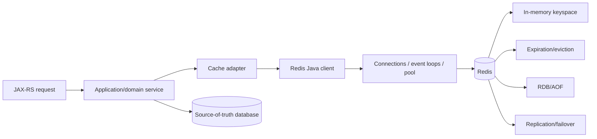
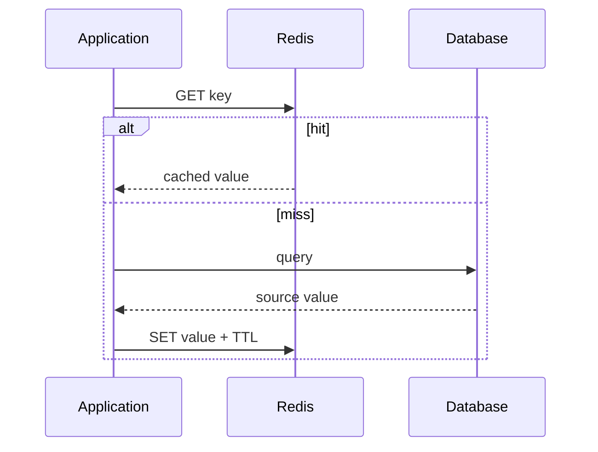

# Part 039 — Redis, Caching, Data Structures, and Java Client Lifecycle

> Redis bukan “HashMap di network” dan cache hit bukan bukti correctness. Redis adalah remote state engine dengan finite memory, command semantics, expiration, eviction, persistence, replication, failover, sharding, client connection lifecycle, dan data-loss/staleness trade-offs. Desain production harus menjawab siapa source of truth, berapa lama stale data legal, apa yang terjadi saat key hilang, bagaimana cache diisi ulang, bagaimana tenant diisolasi, dan apakah application tetap benar ketika Redis unavailable atau mengalami failover.

## Daftar Isi

1. [Target kompetensi](#target-kompetensi)
2. [Scope dan baseline](#scope-dan-baseline)
3. [Boundary dengan Part 024 dan Part 040](#boundary-dengan-part-024-dan-part-040)
4. [Mental model Redis](#mental-model-redis)
5. [Redis as cache, data structure server, or primary store](#redis-as-cache-data-structure-server-or-primary-store)
6. [Source of truth dan reconstructability](#source-of-truth-dan-reconstructability)
7. [Command atomicity](#command-atomicity)
8. [Redis server concurrency model](#redis-server-concurrency-model)
9. [Database numbers and logical isolation](#database-numbers-and-logical-isolation)
10. [Key naming](#key-naming)
11. [Tenant-aware keys](#tenant-aware-keys)
12. [Key versioning and namespace migration](#key-versioning-and-namespace-migration)
13. [Key cardinality](#key-cardinality)
14. [Strings](#strings)
15. [Hashes](#hashes)
16. [Lists](#lists)
17. [Sets](#sets)
18. [Sorted sets](#sorted-sets)
19. [Bitmaps, HyperLogLog, and probabilistic structures](#bitmaps-hyperloglog-and-probabilistic-structures)
20. [Geospatial and search modules](#geospatial-and-search-modules)
21. [Redis Streams boundary](#redis-streams-boundary)
22. [Pub/Sub boundary](#pubsub-boundary)
23. [JSON and module-specific data types](#json-and-module-specific-data-types)
24. [Choosing a data type](#choosing-a-data-type)
25. [Serialization contract](#serialization-contract)
26. [Compression](#compression)
27. [Large keys and large values](#large-keys-and-large-values)
28. [Expiration and TTL](#expiration-and-ttl)
29. [Expiration accuracy and clock](#expiration-accuracy-and-clock)
30. [TTL refresh policies](#ttl-refresh-policies)
31. [TTL jitter](#ttl-jitter)
32. [Eviction and `maxmemory`](#eviction-and-maxmemory)
33. [Eviction policies](#eviction-policies)
34. [Expiration versus eviction](#expiration-versus-eviction)
35. [Cache-aside](#cache-aside)
36. [Read-through](#read-through)
37. [Write-through](#write-through)
38. [Write-behind](#write-behind)
39. [Refresh-ahead and stale-while-revalidate](#refresh-ahead-and-stale-while-revalidate)
40. [Negative caching](#negative-caching)
41. [Cache stampede](#cache-stampede)
42. [Single-flight and request coalescing](#single-flight-and-request-coalescing)
43. [Hot keys](#hot-keys)
44. [Cache penetration](#cache-penetration)
45. [Cache pollution](#cache-pollution)
46. [Invalidation strategies](#invalidation-strategies)
47. [Versioned cache keys](#versioned-cache-keys)
48. [Event-driven invalidation](#event-driven-invalidation)
49. [Database transaction and cache invalidation](#database-transaction-and-cache-invalidation)
50. [Read-after-write semantics](#read-after-write-semantics)
51. [Local near-cache and client-side caching](#local-near-cache-and-client-side-caching)
52. [Cache consistency levels](#cache-consistency-levels)
53. [Pipelining](#pipelining)
54. [Batching and partial failure](#batching-and-partial-failure)
55. [Transactions with `MULTI` and `EXEC`](#transactions-with-multi-and-exec)
56. [Optimistic concurrency with `WATCH`](#optimistic-concurrency-with-watch)
57. [Lua scripting](#lua-scripting)
58. [Redis Functions](#redis-functions)
59. [Script and function safety](#script-and-function-safety)
60. [Blocking commands](#blocking-commands)
61. [Lettuce mental model](#lettuce-mental-model)
62. [Lettuce client and connection lifecycle](#lettuce-client-and-connection-lifecycle)
63. [Lettuce synchronous, asynchronous, and reactive APIs](#lettuce-synchronous-asynchronous-and-reactive-apis)
64. [Lettuce connection multiplexing](#lettuce-connection-multiplexing)
65. [Lettuce blocking and Pub/Sub connections](#lettuce-blocking-and-pubsub-connections)
66. [Lettuce event-loop safety](#lettuce-event-loop-safety)
67. [Jedis mental model](#jedis-mental-model)
68. [Jedis pooling and ownership](#jedis-pooling-and-ownership)
69. [Redisson mental model](#redisson-mental-model)
70. [Choosing Lettuce, Jedis, or Redisson](#choosing-lettuce-jedis-or-redisson)
71. [Connection timeouts and command deadlines](#connection-timeouts-and-command-deadlines)
72. [Reconnect behavior](#reconnect-behavior)
73. [Backpressure and pending commands](#backpressure-and-pending-commands)
74. [Standalone topology](#standalone-topology)
75. [Replication](#replication)
76. [Read replicas and stale reads](#read-replicas-and-stale-reads)
77. [Redis Sentinel](#redis-sentinel)
78. [Sentinel-aware clients](#sentinel-aware-clients)
79. [Redis Cluster](#redis-cluster)
80. [Hash slots and hash tags](#hash-slots-and-hash-tags)
81. [`MOVED`, `ASK`, and topology refresh](#moved-ask-and-topology-refresh)
82. [Multi-key commands in Cluster](#multi-key-commands-in-cluster)
83. [Cluster resharding and hot slots](#cluster-resharding-and-hot-slots)
84. [Persistence](#persistence)
85. [RDB snapshots](#rdb-snapshots)
86. [AOF](#aof)
87. [Persistence does not equal zero data loss](#persistence-does-not-equal-zero-data-loss)
88. [Failover consistency](#failover-consistency)
89. [Backup and restore](#backup-and-restore)
90. [Security and ACLs](#security-and-acls)
91. [TLS](#tls)
92. [Network isolation](#network-isolation)
93. [JAX-RS cache integration](#jax-rs-cache-integration)
94. [HTTP caching versus Redis caching](#http-caching-versus-redis-caching)
95. [Graceful degradation](#graceful-degradation)
96. [Startup, readiness, and shutdown](#startup-readiness-and-shutdown)
97. [Observability](#observability)
98. [Latency and slow commands](#latency-and-slow-commands)
99. [Memory diagnosis](#memory-diagnosis)
100. [Failure-model matrix](#failure-model-matrix)
101. [Debugging playbook](#debugging-playbook)
102. [Testing strategy](#testing-strategy)
103. [Architecture patterns](#architecture-patterns)
104. [Anti-patterns](#anti-patterns)
105. [PR review checklist](#pr-review-checklist)
106. [Trade-off yang harus dipahami senior engineer](#trade-off-yang-harus-dipahami-senior-engineer)
107. [Internal verification checklist](#internal-verification-checklist)
108. [Latihan verifikasi](#latihan-verifikasi)
109. [Ringkasan](#ringkasan)
110. [Referensi resmi](#referensi-resmi)

---

## Target kompetensi

Setelah menyelesaikan part ini, Anda harus mampu:

- menentukan apakah Redis berfungsi sebagai disposable cache, durable-enough operational state, coordination service, stream, atau primary data store;
- memilih Redis data type berdasarkan invariant dan access pattern;
- merancang key naming, tenant prefix, schema version, dan cardinality;
- membedakan expiration, eviction, invalidation, and deletion;
- menentukan TTL dari stale-data budget, bukan angka kebiasaan;
- mendesain cache-aside, negative caching, refresh-ahead, and stale-while-revalidate;
- mencegah cache stampede, hot-key overload, penetration, and pollution;
- menghubungkan database transaction dengan cache invalidation menggunakan after-commit/outbox/reconciliation;
- memahami pipelining, transactions, `WATCH`, Lua, and Redis Functions;
- mengelola Java Redis clients as long-lived resources;
- membedakan Lettuce multiplexed connections, Jedis pooled ownership, and Redisson high-level abstractions;
- memahami standalone, replication, Sentinel, Redis Cluster, hash slots, and failover semantics;
- menilai RDB/AOF and recovery guarantees;
- mendeteksi stale reads, evictions, large keys, slow commands, memory fragmentation, and pending-command growth;
- menjaga correctness ketika Redis unavailable or cache contents disappear;
- membuat tests and PR review yang membuktikan cache behavior.

---

## Scope dan baseline

Baseline:

- Java 17+;
- JAX-RS/Jersey service;
- Redis Open Source, managed Redis-compatible service, Redis Enterprise, atau equivalent belum dikonfirmasi;
- Lettuce, Jedis, or Redisson may be used;
- PostgreSQL remains likely source of truth for core quote/order state;
- multiple service replicas;
- Kubernetes/cloud/on-prem deployment;
- multi-tenancy and security from Parts 019, 025–027;
- resilience from Part 024;
- distributed coordination is Part 040.

Part ini **tidak mengasumsikan**:

- Redis version or edition;
- Redis versus another protocol-compatible implementation;
- standalone/Sentinel/Cluster/managed topology;
- persistence enabled;
- replicas used for reads;
- cache can safely fail open;
- data is reconstructable;
- Redis modules available;
- one Redis database shared across all applications;
- exact Java client;
- client-side caching;
- local near-cache;
- cache invalidation events;
- internal CSG key naming.

---

## Boundary dengan Part 024 dan Part 040

| Part | Fokus |
|---|---|
| Part 024 | Generic timeout, retry, circuit breaker, backpressure, and cascading failure |
| Part 039 | Redis data/cache semantics and client/platform lifecycle |
| Part 040 | Distributed rate limiting, locks, leases, fencing, and coordination |

Part 039 may mention stampede locks, but correctness-critical distributed locks and rate limiters are treated separately in Part 040.

---

## Mental model Redis



Always answer:

```text
What is authoritative?
What can disappear?
What can be stale?
How is it rebuilt?
What happens during failover?
What is the maximum legal memory/cardinality?
```

---

## Redis as cache, data structure server, or primary store

| Role | Correctness expectation |
|---|---|
| Disposable cache | deletion/eviction must not break correctness |
| Session/state store | loss changes user/system behavior |
| Idempotency store | loss may duplicate effects |
| Coordination store | failover/lease semantics affect concurrency |
| Stream/queue | delivery and pending state matter |
| Primary database | persistence, backup, durability, query, and recovery are first-class |

Do not use one operational standard for every role.

---

## Source of truth dan reconstructability

A key is safely disposable only when:

- authoritative source exists;
- reconstruction is deterministic;
- source can tolerate refill load;
- refill latency is acceptable;
- historical version required for reconstruction remains available;
- authorization/tenant context is preserved;
- cache absence is handled.

“Can be recomputed” is incomplete if recomputation overloads PostgreSQL or uses changed pricing rules.

---

## Command atomicity

Redis executes an individual command atomically relative to other commands.

Examples:

```text
INCR
HSET
SET key value NX PX ...
ZADD
```

Atomic command does not make a multi-step client sequence atomic:

```text
GET
calculate
SET
```

Other clients may interleave.

Use a single command, transaction with assumptions, script, or function where required.

---

## Redis server concurrency model

Avoid the slogan “Redis is entirely single-threaded.”

Useful mental model:

- command execution and keyspace mutation have strong serialized semantics within relevant execution path;
- network I/O, persistence, replication, modules, and background work may use additional threads;
- one slow/blocking command or script can delay unrelated commands on that shard;
- Cluster adds multiple independent shards/nodes.

Operationally, command complexity and payload size matter.

---

## Database numbers and logical isolation

Standalone Redis can expose numbered logical databases.

They are weak isolation:

- same process/memory/configuration;
- ACL and cluster support considerations;
- no per-database resource isolation;
- key collisions still possible within selected DB;
- Redis Cluster supports only database zero.

Prefer explicit key namespaces and separate deployments for stronger isolation.

---

## Key naming

Example:

```text
qao:{tenant-42}:quote:Q123:summary:v3
```

Good key contains:

- bounded domain prefix;
- tenant boundary;
- entity/aggregate ID;
- representation purpose;
- schema/version;
- optional revision.

Avoid:

- raw access token;
- email/PII;
- giant serialized query;
- unordered map converted to key;
- environment duplicated when deployment already isolates;
- unbounded free text.

---

## Tenant-aware keys

Every shared-cache key must include validated tenant identity.

Bad:

```text
quote:Q123
```

Safer:

```text
quote:{tenant-42}:Q123:v2
```

Use the tenant resolved from trusted context, never an arbitrary request field.

Cache value must also be validated for tenant where defense-in-depth matters.

---

## Key versioning and namespace migration

Versioning avoids unsafe in-place serialization changes:

```text
quote-summary:v1:{tenant}:{id}
quote-summary:v2:{tenant}:{id}
```

Migration options:

- lazy refill;
- dual read with v2 preference;
- dual write temporarily;
- background warmup;
- old namespace TTL/cleanup.

Do not run full-key deletion with `KEYS` in production.

---

## Key cardinality

Estimate:

```text
tenants × entities × representations × versions × variants
```

Cardinality impacts:

- memory;
- metadata overhead;
- expiration work;
- cluster slots;
- observability;
- backup;
- invalidation.

A tiny value with millions of keys can still consume large memory.

---

## Strings

Strings support:

- opaque bytes;
- counters;
- flags;
- serialized objects;
- bit operations.

Useful commands include `GET`, `SET`, `MGET`, `INCR`, `GETEX`, and conditional `SET`.

Avoid using one giant string for independently updated fields.

---

## Hashes

Hashes map fields to values under one key.

Useful for:

- compact small objects;
- partial field updates;
- counters/metadata.

Trade-offs:

- one key TTL for the hash unless newer field-expiration features are explicitly used and supported;
- large hash can become hot;
- whole-object versioning is less explicit;
- serialization per field.

---

## Lists

Lists support ordered push/pop and blocking operations.

Use for bounded/simple queue patterns only after understanding delivery loss and recovery.

For durable consumer-group processing, compare Redis Streams or a dedicated broker.

---

## Sets

Sets support uniqueness and membership.

Use cases:

- dedup set;
- tags;
- membership;
- intersections/unions.

Retention/cardinality must be bounded. A permanent dedup set grows forever.

---

## Sorted sets

Sorted sets associate members with scores.

Use cases:

- leaderboard;
- delayed-work index;
- priority/time ordering;
- sliding-window event timestamps.

Score precision and duplicate-member semantics must fit domain.

---

## Bitmaps, HyperLogLog, and probabilistic structures

Use compact probabilistic/counting types when approximate answers are acceptable.

Never use approximate structures for:

- financial correctness;
- authorization;
- exact idempotency;
- legally required counts.

Document error bounds.

---

## Geospatial and search modules

Redis can support geospatial, JSON, full-text, vector, time-series, and probabilistic capabilities depending version/product/modules.

Do not assume availability or equivalent behavior across Redis-compatible services.

Treat index schema and module version as durable contracts.

---

## Redis Streams boundary

Redis Streams are append-only-log-like data structures with consumer groups.

Use when:

- modest stream workload;
- Redis already operated;
- replay/pending-entry behavior fits;
- retention and scale are sufficient.

Kafka/RabbitMQ trade-offs remain Parts 032–035.

Do not use Streams merely because Redis is already connected.

---

## Pub/Sub boundary

Redis Pub/Sub is transient broadcast.

If subscriber is disconnected, messages are not durably queued for it.

Use for:

- best-effort invalidation hints;
- live notifications where loss is acceptable.

Do not use ordinary Pub/Sub for critical command delivery without recovery.

---

## JSON and module-specific data types

Redis JSON allows path-level document operations where supported.

Risks:

- module/version dependency;
- document growth;
- index cost;
- schema drift;
- partial-update semantics;
- portability.

Do not turn Redis into an ungoverned document dump.

---

## Choosing a data type

Choose by operations, not Java class shape.

| Need | Candidate |
|---|---|
| opaque cached DTO | string |
| partial small object updates | hash |
| exact membership | set |
| rank/time score | sorted set |
| ordered ends | list |
| replayable records | stream |
| document paths/search | JSON/module |
| approximate cardinality | HyperLogLog |

---

## Serialization contract

Define:

- format;
- schema version;
- null behavior;
- date/time;
- money;
- compression;
- max size;
- unknown fields;
- backward compatibility.

JSON is debuggable but larger. Binary formats are compact but require tooling.

Never use native Java serialization for untrusted or long-lived distributed cache contracts.

---

## Compression

Compression reduces network/memory but adds CPU and latency.

Use only above size threshold and record encoding metadata/version.

Tiny values often grow after compression framing.

---

## Large keys and large values

Large objects cause:

- command latency;
- event-loop blocking;
- network bursts;
- replication lag;
- AOF/RDB cost;
- cluster migration cost;
- deletion latency;
- memory fragmentation.

Use bounded size and split only when atomicity/access pattern remains correct.

---

## Expiration and TTL

TTL expresses lifetime, not invalidation correctness.

Set TTL atomically with value:

```text
SET key value EX seconds
```

Avoid:

```text
SET key value
EXPIRE key seconds
```

if a crash between commands leaves immortal key.

---

## Expiration accuracy and clock

Redis stores expiration based on time and expires keys through passive/active mechanisms.

Consequences:

- key may remain physically present briefly after logical expiry;
- clock stability matters;
- failover and restored data interact with absolute expiration;
- application should not use cache TTL as legal/audit timer.

---

## TTL refresh policies

Policies:

- fixed from write;
- sliding on access;
- refresh only near expiry;
- no refresh;
- source-version based.

Sliding TTL can make stale data live indefinitely under frequent access.

---

## TTL jitter

Add bounded randomness:

```text
ttl = base + random(0, jitter)
```

This reduces synchronized expiration.

Jitter must not violate maximum stale duration.

---

## Eviction and `maxmemory`

When memory exceeds configured limit, Redis applies eviction policy or rejects writes under `noeviction`.

Eviction is an overload behavior, not ordinary invalidation.

Monitor evictions as correctness/capacity signal.

---

## Eviction policies

Families include:

- no eviction;
- all-keys LRU/LFU/random;
- volatile-only policies;
- TTL-based policies.

Exact available names depend on version.

Choose from workload:

- mixed cache and durable keys in one instance is dangerous;
- volatile-only assumes all disposable keys have TTL;
- noeviction converts memory pressure to command failures.

---

## Expiration versus eviction

| Mechanism | Trigger |
|---|---|
| Expiration | key TTL reaches time |
| Eviction | memory limit pressure |
| Invalidation | application/source change |
| Deletion | explicit lifecycle/cleanup |

A key can be invalid but unexpired, or valid but evicted.

---

## Cache-aside



Pros:

- simple;
- source remains authoritative;
- Redis outage can fall back.

Risks:

- stampede;
- stale after writes;
- cache population race;
- source overload.

---

## Read-through

A cache layer/library loads source automatically.

It can standardize behavior but may hide:

- transaction/tenant context;
- source query cost;
- loader retries;
- serialization;
- stampede;
- cache error policy.

---

## Write-through

Write cache and source synchronously through one abstraction.

Unless one transaction spans both, partial failure remains.

Do not claim atomicity.

---

## Write-behind

Cache accepts write and asynchronously persists source.

High risk for core transactional data:

- loss;
- reordering;
- conflict;
- failover;
- audit;
- recovery.

Use only with a durable queue/log and explicit ownership.

---

## Refresh-ahead and stale-while-revalidate

Serve cached data while refreshing asynchronously.

Useful for expensive, slightly stale reads.

Requirements:

- stale upper bound;
- one refresh owner;
- failed refresh telemetry;
- source version;
- no security-sensitive stale authorization;
- bounded refresh queue.

---

## Negative caching

Cache not-found result for short TTL.

Benefits:

- protects source from repeated misses.

Risks:

- newly created resource remains invisible;
- authorization failure confused with not found;
- attacker creates high-cardinality misses.

Use shorter TTL and bounded keys.

---

## Cache stampede

Many requests miss same key and hit source simultaneously.

Triggers:

- expiration;
- eviction;
- restart;
- namespace version change;
- failover;
- mass invalidation.

Controls:

- TTL jitter;
- local single-flight;
- distributed lease for refill;
- refresh-ahead;
- stale serving;
- source bulkhead;
- warmup.

Distributed lease details are Part 040.

---

## Single-flight and request coalescing

Within one process:

```text
Map<Key, CompletableFuture<Value>>
```

One loader runs; others await.

Requirements:

- remove completed/failed entry;
- deadline per waiter;
- cancellation does not cancel shared load incorrectly;
- bounded map;
- tenant-aware key.

Local single-flight does not coordinate replicas.

---

## Hot keys

One key can dominate:

- one shard CPU/network;
- one client connection;
- source refill;
- lock contention.

Mitigations:

- local near-cache;
- replicate immutable value;
- shard counters;
- redesign key;
- precompute;
- request coalescing.

Do not add random suffix if correctness requires one logical value.

---

## Cache penetration

Repeated requests for nonexistent/un-cacheable keys bypass cache.

Controls:

- negative caching;
- input validation;
- authorization before lookup;
- Bloom filter where approximate membership is acceptable;
- rate limiting;
- bounded key cardinality.

---

## Cache pollution

Rare values displace hot values.

Controls:

- admission policy;
- shorter TTL;
- separate cache;
- LFU;
- cache only after repeated access;
- size-aware policy.

---

## Invalidation strategies

Options:

- delete on write;
- update on write;
- version namespace;
- event-driven invalidation;
- TTL only;
- source revision embedded;
- periodic reconciliation.

No universal answer.

---

## Versioned cache keys

Include source revision:

```text
catalog:{tenant}:{catalogRevision}:offer:{id}
```

Old keys become unreachable and expire naturally.

Advantages:

- atomic logical cutover;
- simple invalidation.

Cost:

- temporary duplicate memory;
- revision propagation;
- cleanup.

---

## Event-driven invalidation

Database/application publishes change event; cache consumers delete/update.

Delivery can be delayed or duplicated.

Use:

- idempotent invalidation;
- event ID/version;
- TTL as safety net;
- consumer lag metrics;
- reconciliation.

---

## Database transaction and cache invalidation

Danger:

```text
delete cache
DB transaction rolls back
```

or:

```text
DB commits
process crashes before cache delete
```

Safer:

- after-commit invalidation;
- transactional outbox event;
- versioned keys;
- short bounded TTL;
- reconciliation.

---

## Read-after-write semantics

After write, caller may read stale cache.

Options:

- return committed representation directly;
- bypass cache for writer/request;
- update cache after commit;
- use version token;
- wait for invalidation only if bounded and necessary.

Document consistency.

---

## Local near-cache and client-side caching

Near-cache lowers network and hot-key pressure.

Risks:

- per-pod stale copies;
- invalidation loss;
- memory duplication;
- rolling-version serialization;
- tenant leakage;
- no global memory visibility.

Redis client-side caching/tracking can provide invalidation assistance where supported, but correctness still needs stale policy.

---

## Cache consistency levels

Define:

- strongly fresh within transaction/request;
- read-your-writes;
- bounded stale;
- eventual;
- best effort.

“Cached” is not a consistency level.

---

## Pipelining

Pipelining sends multiple commands without waiting each reply, reducing network round trips.

It does not make commands atomic.

Bound pipeline size to avoid:

- client memory;
- server output buffers;
- long event-loop stalls;
- error ambiguity.

---

## Batching and partial failure

A batch/pipeline may contain mixed results.

Inspect each reply.

Do not treat one transport success as all commands succeeded.

---

## Transactions with `MULTI` and `EXEC`

Redis transactions queue commands and execute them together without interleaving.

They do not provide relational rollback semantics:

- command runtime errors can appear in result;
- no automatic undo;
- reads for conditional logic often require `WATCH`;
- network failure after `EXEC` can make outcome ambiguous.

---

## Optimistic concurrency with `WATCH`

`WATCH` aborts transaction if watched keys change before `EXEC`.

Pattern:

1. `WATCH`;
2. read;
3. compute;
4. `MULTI`;
5. writes;
6. `EXEC`;
7. retry on null/abort.

Use bounded retries and same connection/session context.

Scripts/functions are often simpler for server-local atomic logic.

---

## Lua scripting

Lua scripts can perform multi-key conditional operations atomically on one Redis execution context.

Requirements:

- declare keys explicitly;
- bounded runtime;
- deterministic behavior;
- no unbounded loops;
- cluster keys in same slot;
- script cache/reload handling;
- version/test scripts.

Long script blocks other commands on shard.

---

## Redis Functions

Redis Functions package server-side code as managed libraries and, in Redis 7+, supersede many application use cases formerly implemented with ad hoc `EVAL`.

Benefits:

- server-managed library;
- named functions;
- deployment/version lifecycle.

Costs:

- operational deployment;
- compatibility;
- governance;
- cluster rollout;
- server-side code risk.

Verify availability/version and managed-service policy.

---

## Script and function safety

Never pass untrusted code.

Enforce:

- key count;
- argument size;
- execution complexity;
- timeout controls;
- source control;
- checksum/version;
- rollout;
- observability.

A script is executable production code.

---

## Blocking commands

Commands such as blocking list/stream reads require dedicated or appropriately managed connections.

Do not run blocking operations on a multiplexed connection used for ordinary latency-sensitive commands.

---

## Lettuce mental model

Lettuce supports synchronous, asynchronous, and reactive APIs over Netty-based connections.

Core objects:

- `RedisClient` or `RedisClusterClient`;
- connection;
- command API;
- event-loop/client resources;
- codec;
- topology refresh.

---

## Lettuce client and connection lifecycle

Typical:

```java
RedisClient client = RedisClient.create(redisUri);
StatefulRedisConnection<String, byte[]> connection =
        client.connect(new StringByteArrayCodec());

RedisCommands<String, byte[]> commands = connection.sync();

// application shutdown:
connection.close();
client.shutdown();
```

Create client and stable connections at application scope.

---

## Lettuce synchronous, asynchronous, and reactive APIs

All APIs can share underlying connection mechanics.

Sync blocks caller.

Async returns futures.

Reactive exposes publishers.

Do not block a Netty event-loop thread with sync calls or `.join()`.

---

## Lettuce connection multiplexing

Lettuce connections can multiplex concurrent non-blocking commands.

Consequences:

- explicit pool may be unnecessary for ordinary commands;
- one slow/blocking command can affect shared connection;
- pending-command queue must be bounded/observed;
- connection state such as transaction/blocking mode complicates sharing.

Use dedicated connections for stateful modes.

---

## Lettuce blocking and Pub/Sub connections

Blocking commands and Pub/Sub alter connection behavior.

Use dedicated connections and lifecycle.

Pub/Sub connection is not a general command connection.

---

## Lettuce event-loop safety

Callbacks run on library threads unless offloaded.

Do not:

- perform blocking DB/HTTP calls;
- execute expensive mapping;
- log giant payloads;
- acquire contended locks.

Offload bounded work while preserving context.

---

## Jedis mental model

Jedis offers synchronous APIs.

A physical Jedis connection should not be shared unsafely across request threads.

Use the current client/pool API appropriate for installed Jedis version.

---

## Jedis pooling and ownership

Pattern:

```text
application-scoped pool/client
  → borrow connection
  → execute bounded operations
  → return/close logical resource
```

Configure:

- max total/idle;
- acquisition timeout;
- validation;
- abandoned/leak diagnostics;
- TLS;
- topology.

A pool is a bulkhead, not merely performance tuning.

---

## Redisson mental model

Redisson provides high-level distributed Java objects and services over Redis:

- maps/caches;
- locks;
- semaphores;
- rate limiters;
- queues;
- executors;
- reactive/Rx APIs.

Convenience does not remove Redis failover/consistency assumptions.

Part 040 covers coordination objects.

---

## Choosing Lettuce, Jedis, or Redisson

| Need | Candidate |
|---|---|
| sync/async/reactive low-level Redis | Lettuce |
| straightforward synchronous command use | Jedis |
| high-level distributed Java abstractions | Redisson |
| framework-managed cache | verify framework and underlying client |

Choose internal standard, topology support, observability, and failure semantics—not benchmark headline.

---

## Connection timeouts and command deadlines

Separate:

- DNS/connect;
- TLS;
- command timeout;
- pool acquisition;
- topology/Sentinel discovery;
- total JAX-RS deadline.

Default timeouts may be much longer than API SLO.

Set explicitly and align with Part 024.

---

## Reconnect behavior

Reconnect can restore transport but not application certainty.

During disconnect:

- commands may fail;
- commands may be queued depending client;
- in-flight outcome may be unknown;
- topology may change;
- transaction state is lost;
- Pub/Sub subscriptions may recover with gaps.

Define offline queue policy and bounded memory.

---

## Backpressure and pending commands

Async clients can enqueue faster than Redis processes.

Monitor and bound:

- pending commands;
- pool waiters;
- in-flight bytes;
- callback executor;
- pipeline size;
- retry queue.

Fail early rather than heap exhaustion.

---

## Standalone topology

One node is simple but a single failure domain.

Suitable for:

- local development;
- disposable cache where downtime is acceptable;
- explicitly low-criticality workload.

Persistence alone does not provide HA.

---

## Replication

Redis replication is asynchronous by default.

Replica can lag.

Failover may lose acknowledged writes depending topology/persistence.

`WAIT` can improve replica acknowledgement evidence but does not make Redis a strongly consistent CP system.

---

## Read replicas and stale reads

Replica reads can return:

- stale value;
- missing recent write;
- key not yet expired/evicted equivalently during lag;
- old authorization/configuration.

Use only where bounded stale reads are acceptable.

Do not read security revocation or lock ownership from replicas.

---

## Redis Sentinel

Sentinel provides monitoring, notification, configuration discovery, and failover for non-Cluster Redis deployments.

It does not shard data.

Clients must use Sentinel-aware discovery and handle master change.

Sentinel failover remains subject to asynchronous replication loss windows.

---

## Sentinel-aware clients

Verify:

- Sentinel quorum;
- master name;
- Sentinel endpoints;
- authentication/TLS to Sentinel and Redis;
- topology refresh;
- connection migration;
- retry/timeout;
- split-brain behavior;
- DNS/network.

Do not configure a static master endpoint and assume automatic failover.

---

## Redis Cluster

Redis Cluster shards keyspace across hash slots and provides failover per shard.

Implications:

- multi-key operations require same slot unless command supports otherwise;
- clients follow redirects;
- topology changes;
- resharding;
- multiple masters;
- per-slot hot spots;
- no database numbers beyond zero.

---

## Hash slots and hash tags

Cluster has 16,384 hash slots.

Hash tags force a substring into slot calculation:

```text
quote:{tenant42:Q123}:summary
quote:{tenant42:Q123}:items
```

Use hash tags only when multi-key atomicity is required.

Over-broad tag can create hot slot.

---

## `MOVED`, `ASK`, and topology refresh

Cluster redirects clients during stable topology or migration.

Client must:

- understand redirects;
- refresh topology;
- retry within deadline;
- avoid infinite loops;
- preserve command idempotency.

Inspect client cluster support and refresh settings.

---

## Multi-key commands in Cluster

Keys used by transaction/script/multi-key command generally must be in same slot.

Design key tags intentionally.

Do not discover cross-slot failure only in production.

---

## Cluster resharding and hot slots

Resharding moves slots and can add latency/redirects.

Hot slot may remain hot even after adding nodes if one logical key dominates.

Scale data model, not only node count.

---

## Persistence

Redis persistence options include:

- no persistence;
- RDB snapshots;
- AOF;
- combined approaches.

Choose from recovery point, recovery time, write latency, storage, and operational complexity.

---

## RDB snapshots

RDB creates point-in-time snapshots.

Pros:

- compact;
- fast transfer/restart;
- backup friendly.

Risks:

- writes after last snapshot can be lost;
- fork/copy-on-write memory pressure;
- disk I/O;
- snapshot corruption/backup testing.

---

## AOF

AOF logs write operations for replay.

Options affect fsync durability/latency.

AOF rewrite compacts history and consumes resources.

AOF does not eliminate failover/replication loss or operational mistakes.

---

## Persistence does not equal zero data loss

Data can be lost through:

- async replication failover;
- fsync policy;
- node/storage failure;
- operator deletion;
- bad restore;
- application overwrite;
- Cluster partition;
- managed-service configuration.

Document RPO/RTO.

---

## Failover consistency

During failover:

- new primary may lack latest writes;
- clients reconnect at different times;
- old primary may still be reachable in partition;
- locks/idempotency keys may disappear;
- cache may revert to old state.

Core correctness must not depend on uninterrupted monotonic Redis state unless architecture provides stronger guarantees.

---

## Backup and restore

Backup plan must include:

- RDB/AOF artifacts or managed snapshots;
- encryption;
- retention;
- restore rehearsal;
- version compatibility;
- Cluster topology;
- ACL/configuration;
- point-in-time expectations;
- application reconciliation.

Cache-only Redis may prefer rebuild rather than restore.

---

## Security and ACLs

Use ACL users with least command/key access.

Separate:

- application data client;
- operations/admin;
- migration;
- monitoring.

Restrict dangerous commands and key patterns.

Do not rely on one shared password.

---

## TLS

Redis supports TLS for client connections and can secure replication/Cluster links when configured.

Validate:

- CA;
- hostname;
- client cert if required;
- Sentinel/Cluster TLS;
- rotation;
- performance;
- client library settings.

AUTH without TLS does not protect credentials from network eavesdropping.

---

## Network isolation

Redis should not be exposed publicly.

Use:

- private network;
- firewall/security group;
- Kubernetes NetworkPolicy;
- endpoint allowlists;
- ACL;
- TLS;
- management-plane isolation.

---

## JAX-RS cache integration

Resource should not contain raw Redis commands.

Use:

```java
public interface QuoteSummaryCache {
    Optional<QuoteSummary> get(TenantId tenantId, QuoteId quoteId);
    void put(QuoteSummary summary, Duration ttl);
    void invalidate(TenantId tenantId, QuoteId quoteId);
}
```

Adapter handles key, serialization, errors, telemetry, and topology.

---

## HTTP caching versus Redis caching

HTTP caching controls client/intermediary representation reuse through:

- `Cache-Control`;
- `ETag`;
- `Last-Modified`;
- `Vary`;
- conditional requests.

Redis is server-side application caching.

Use both where semantics permit; they solve different boundaries.

---

## Graceful degradation

If Redis is disposable cache:

- short timeout;
- circuit breaker;
- source fallback;
- source bulkhead;
- no endless retry;
- cache writes best effort.

If Redis holds sessions/idempotency/coordination:

- failure may require fail closed or degraded unavailability.

Classify per operation.

---

## Startup, readiness, and shutdown

Startup:

- validate configuration;
- create client/resources;
- optional connectivity check;
- verify mandatory topology/security.

Readiness should not fail permanently for optional cache.

Shutdown:

1. stop ingress/refill;
2. drain bounded operations;
3. close dedicated connections;
4. close shared client/pool;
5. stop event-loop resources if owned.

---

## Observability

Application metrics:

- hit/miss;
- negative hit;
- load duration;
- refill count/failure;
- stale served;
- invalidation lag;
- key/value size distribution;
- command latency/error;
- timeout;
- pending commands/pool wait;
- reconnect/topology changes;
- evictions.

Redis metrics:

- memory/fragmentation;
- connected/blocked clients;
- ops/sec;
- keyspace hit/miss;
- evicted/expired keys;
- replication lag;
- persistence status;
- Cluster health;
- CPU;
- network;
- slowlog/latency.

Do not label metrics by raw key or tenant ID at high cardinality.

---

## Latency and slow commands

Use:

- command latency histograms;
- `SLOWLOG`;
- latency monitor/doctor;
- command stats;
- client-side tracing;
- network and event-loop metrics.

A slow client call can be caused by pool wait, DNS, GC, network, server command, persistence fork, failover, or callback blocking.

---

## Memory diagnosis

Investigate:

- `used_memory`;
- RSS;
- fragmentation;
- allocator;
- key count;
- value/key size;
- eviction;
- expiration;
- replication/AOF buffers;
- client buffers;
- module indexes;
- copy-on-write during fork.

Do not estimate memory from serialized payload only.

---

## Failure-model matrix

| Failure | Impact | Detection | Response |
|---|---|---|---|
| Tenant missing from key | data leak | cross-tenant test | trusted tenant prefix |
| Serialization changed in place | decode outage | deserialization errors | versioned namespace |
| TTL absent | memory/stale growth | TTL audit | atomic SET+TTL |
| TTL synchronized | source stampede | miss/load spike | jitter/refresh |
| Eviction treated as impossible | unexpected misses | evicted keys | capacity/fallback |
| Cache write before DB commit | stale invalidation error | audit | after-commit/outbox |
| DB commit then crash before invalidate | stale read | version mismatch | outbox/TTL/version key |
| Negative cache too long | new entity invisible | creation/read mismatch | short TTL/invalidate |
| Hot key | shard overload | per-key sampling/hotkeys | near-cache/coalescing |
| Large value | latency/replication lag | size metrics/slowlog | redesign/bounds |
| Pipeline unbounded | memory/output buffer | pending bytes | bounded batches |
| `MULTI` assumed rollback | partial logical error | EXEC replies | validate/script |
| Lua script loops | shard stall | latency/slow script | bounded script |
| Shared connection uses blocking command | all callers stall | pending commands | dedicated connection |
| Jedis connection shared unsafely | protocol errors | exceptions | pool/ownership |
| Async callback blocks event loop | latency cascade | thread dumps | offload bounded |
| Reconnect queues unbounded commands | heap growth | pending queue | offline queue limit |
| Replica read after write | stale result | revision mismatch | primary/read policy |
| Sentinel failover loses recent write | missing key | failover audit | tolerate/reconcile |
| Cluster cross-slot command | runtime failure | CROSSSLOT | hash tags/redesign |
| AOF/RDB assumed zero-loss | recovery gap | restore test | explicit RPO |
| Redis unavailable overloads DB | cascading failure | DB/cache metrics | source bulkhead/stale mode |
| ACL too broad | security breach | audit | least privilege |

---

## Debugging playbook

### Cache hit rate suddenly falls

Check:

- namespace/version deployment;
- TTL changes;
- evictions;
- flush/restart/failover;
- key serialization;
- tenant/key construction;
- Cluster slot/topology;
- source data distribution;
- client errors hidden as misses.

Do not convert every Redis exception into cache miss without metrics.

### Redis latency increases

Separate:

- client pool/pending;
- DNS/connect/TLS;
- event-loop blockage;
- network;
- slow command/script;
- large payload;
- persistence fork/AOF;
- replication/failover;
- hot key/shard;
- server CPU/memory.

### Memory reaches limit

Inspect:

- key cardinality;
- missing TTL;
- large keys;
- wrong eviction policy;
- near-cache/module indexes;
- client buffers;
- fragmentation;
- fork copy-on-write;
- workload growth.

### Stale value after write

Trace:

1. DB commit;
2. cache invalidation/update;
3. event/outbox;
4. key version;
5. replica read;
6. local near-cache;
7. request race;
8. TTL.

### Cluster `MOVED` or `CROSSSLOT`

Check:

- cluster-aware client;
- topology refresh;
- endpoint/NAT;
- hash tags;
- transaction/script keys;
- resharding;
- stale topology.

### Timeouts after failover

Check:

- Sentinel/Cluster discovery;
- reconnect;
- DNS;
- auth/TLS;
- stale pool connections;
- offline queue;
- retries/deadline;
- old primary reachability.

### Deserialization errors after rollout

Check:

- key namespace version;
- mixed app versions;
- serializer config;
- compression header;
- null/time/enum;
- old keys;
- local near-cache.

---

## Testing strategy

### Unit tests

- key format;
- tenant isolation;
- serializer compatibility;
- TTL calculation/jitter;
- negative cache;
- error classification;
- source fallback;
- versioned namespace.

### Real Redis integration tests

Use actual Redis/container for:

- expiration;
- eviction;
- transactions;
- `WATCH`;
- Lua/Functions;
- Pub/Sub/Streams if used;
- ACL/TLS where feasible;
- client reconnect.

Mocks do not reproduce Redis semantics.

### Concurrency tests

- stampede;
- local single-flight;
- concurrent cache population;
- read/write races;
- callback/event-loop blocking;
- pool exhaustion;
- pipeline partial results.

### Topology tests

- replica lag;
- Sentinel failover;
- Cluster redirects;
- resharding;
- cross-slot failure;
- node restart;
- persistence restore.

### Failure tests

- Redis unavailable;
- timeout;
- eviction;
- key deletion;
- malformed value;
- failover after write;
- source overload during cold cache;
- invalidation consumer lag.

### Compatibility tests

Run old/new application versions against old/new key namespaces and serializer fixtures.

---

## Architecture patterns

### Cache-aside with source bulkhead

```text
Redis miss
  → local single-flight
  → bounded DB loader
  → SET with TTL+jitter
```

### Versioned immutable cache

Key includes source/config revision; old data expires.

### Stale-while-revalidate

Serve bounded stale value while one worker refreshes.

### Event-driven invalidation plus TTL

Outbox event invalidates; TTL protects against lost event.

### Separate Redis roles

Different deployments for disposable cache versus coordination/idempotency state.

### Thin Redis adapter

Domain-facing interface hides commands but exposes freshness/failure semantics.

---

## Anti-patterns

- treating Redis as local map;
- same key across tenants;
- no TTL on disposable keys;
- TTL-only invalidation for sensitive state;
- one Redis deployment mixing evictable cache and critical locks;
- `KEYS *` in production path;
- caching authorization indefinitely;
- storing access tokens/secrets as ordinary values;
- giant JSON/entity blob;
- Java native serialization;
- unbounded key variants;
- cache miss for every Redis exception;
- cache stampede with no source bulkhead;
- write cache before database commit;
- unbounded pipeline;
- one shared Lettuce connection for blocking and normal commands;
- Jedis physical connection shared across threads;
- blocking in Netty callback;
- reading lock/security state from replica;
- assuming Sentinel/Cluster failover has no loss;
- assuming RDB/AOF means zero data loss;
- using Redis Pub/Sub for critical delivery;
- application readiness tied to optional cache permanently.

---

## PR review checklist

### Data and keys

- [ ] Redis role explicitly classified?
- [ ] Source of truth/rebuild path?
- [ ] Tenant in every shared key?
- [ ] Key version/namespace?
- [ ] Cardinality and size estimate?
- [ ] Data type chosen by operations?
- [ ] Serialization compatibility?
- [ ] Sensitive data minimized?

### Cache semantics

- [ ] Freshness/staleness contract?
- [ ] TTL from business requirement?
- [ ] TTL set atomically?
- [ ] Jitter?
- [ ] Eviction tolerated?
- [ ] Negative caching bounded?
- [ ] Stampede/source bulkhead?
- [ ] Hot-key plan?
- [ ] Invalidation after commit?
- [ ] Read-after-write policy?

### Atomic operations

- [ ] Multi-step race identified?
- [ ] Pipeline versus transaction distinguished?
- [ ] `WATCH` retries bounded?
- [ ] Script/function keys and complexity bounded?
- [ ] Cluster same-slot requirement?
- [ ] Ambiguous outcome considered?

### Java clients

- [ ] Exact client/version?
- [ ] Application-scoped lifecycle?
- [ ] Sync/async/reactive use safe?
- [ ] Dedicated blocking/PubSub connections?
- [ ] Pool/acquisition/concurrency bounds?
- [ ] Pending/offline queue bounds?
- [ ] Timeouts/deadline?
- [ ] Event-loop callbacks non-blocking?
- [ ] Shutdown ownership?

### Topology/durability

- [ ] Standalone/Sentinel/Cluster/managed?
- [ ] Replica read policy?
- [ ] Failover loss tolerated?
- [ ] Hash tags/slots?
- [ ] Persistence/RPO/RTO?
- [ ] Backup/restore tested?
- [ ] Memory/eviction policy?

### Security/operations

- [ ] TLS and hostname verification?
- [ ] ACL user/key/command scope?
- [ ] Private network?
- [ ] Metrics/slowlog/latency?
- [ ] Cold-cache and failover runbook?
- [ ] Capacity and alerts?
- [ ] No raw keys/values in telemetry?

---

## Trade-off yang harus dipahami senior engineer

| Decision | Benefit | Cost/risk |
|---|---|---|
| Cache-aside | simple/source authoritative | stampede/stale invalidation |
| Write-through | immediate cache update | dual-write failure |
| Refresh-ahead | low tail latency | background load/complexity |
| Short TTL | fresher | source load |
| Long TTL | high hit rate | stale risk |
| No eviction | protects key presence | write failures |
| LRU/LFU eviction | bounded cache | unpredictable misses |
| JSON values | readable | size/parsing |
| Binary values | compact | tooling/schema |
| Hash | partial updates | one-key hotness/versioning |
| Pipelining | fewer RTTs | memory/partial errors |
| Lua/Functions | atomic server logic | shard blocking/governance |
| Lettuce multiplexing | few connections/async | event-loop/pending queue risk |
| Jedis pool | simple sync ownership | pool sizing/wait |
| Redisson abstractions | rich primitives | hidden coordination assumptions |
| Replica reads | scale/read latency | staleness |
| Sentinel | HA without sharding | async failover loss |
| Cluster | horizontal scale | slots/cross-key complexity |
| RDB | compact snapshots | wider RPO |
| AOF | finer recovery | I/O/rewrite/latency |
| Near-cache | hot-read latency | distributed staleness |

---

## Internal verification checklist

### Product and topology

- [ ] Redis/compatible product and version.
- [ ] Open Source, managed, or enterprise edition.
- [ ] Standalone, Sentinel, Cluster, or active-active.
- [ ] Node/replica count and AZ placement.
- [ ] Persistence settings.
- [ ] Memory/eviction settings.
- [ ] Backup/restore.
- [ ] Failover behavior and RPO/RTO.
- [ ] Modules/features enabled.

### Java client

- [ ] Lettuce/Jedis/Redisson/framework.
- [ ] Exact version.
- [ ] Client/connection/pool lifecycle.
- [ ] Sync/async/reactive APIs.
- [ ] Event-loop/executors.
- [ ] Blocking/PubSub/transaction connections.
- [ ] Cluster/Sentinel discovery.
- [ ] Topology refresh.
- [ ] Offline queue/reconnect.
- [ ] Timeouts.
- [ ] Metrics/tracing.

### Key and cache standards

- [ ] Naming convention.
- [ ] Tenant prefix.
- [ ] Hash tags.
- [ ] Schema/version.
- [ ] TTL/jitter.
- [ ] Maximum value/key size.
- [ ] Serialization/compression.
- [ ] Negative cache.
- [ ] Invalidation.
- [ ] Near-cache/client-side caching.
- [ ] Hot-key detection.
- [ ] Namespace cleanup.

### Security

- [ ] ACL users.
- [ ] Key/command restrictions.
- [ ] TLS/mTLS.
- [ ] Certificate rotation.
- [ ] Private network/NetworkPolicy.
- [ ] Secret source/rotation.
- [ ] Admin command access.
- [ ] Audit and sensitive-data policy.

### Operations

- [ ] Redis dashboards.
- [ ] Hit/miss/refill metrics.
- [ ] Eviction/expiration.
- [ ] Memory/fragmentation.
- [ ] Slowlog/latency monitor.
- [ ] Replication/Cluster/Sentinel health.
- [ ] Persistence status.
- [ ] Cold-cache runbook.
- [ ] Failover game day.
- [ ] Capacity ownership.

---

## Latihan verifikasi

1. Trace one cache key from JAX-RS request to Redis command, source load, TTL, and invalidation.
2. Estimate total memory from key cardinality and measured serialized sizes.
3. Force synchronized expiration and observe source stampede; add jitter and single-flight.
4. Commit DB write, kill process before invalidation, and validate outbox/version-key recovery.
5. Run blocking command on shared connection in test and observe unrelated latency.
6. Trigger Sentinel or Cluster failover and inspect stale/missing writes.
7. Run cross-slot transaction/script and redesign keys with a bounded hash tag.
8. Change serializer incompatibly and migrate using namespace versioning.
9. Fill Redis to eviction threshold and prove application correctness on random misses.
10. Restore RDB/AOF backup and reconcile expected cache/operational state.

---

## Ringkasan

- Redis is remote finite state, not a local map.
- First classify whether data is disposable, reconstructable, durable, or coordination-critical.
- Individual Redis commands are atomic, but client-side command sequences are not.
- Key naming, tenant isolation, schema version, cardinality, and value size are architecture contracts.
- Expiration, eviction, invalidation, and deletion are distinct.
- TTL should follow stale-data budget and use bounded jitter where synchronized expiry is harmful.
- Cache-aside requires stampede control and source bulkheads.
- Database/cache dual writes require after-commit handling, outbox, versioned keys, and reconciliation.
- Pipelining reduces round trips but is not atomic.
- `MULTI`/`EXEC` is not relational rollback.
- Lua and Functions can provide bounded server-side atomicity but can block a shard.
- Lettuce, Jedis, and Redisson have different connection and abstraction models.
- Long-lived clients/connections must be owned and closed by application lifecycle.
- Replication is asynchronous by default; replica reads and failover can be stale or lose recent state.
- Sentinel provides HA discovery/failover; Cluster provides sharding and per-shard availability.
- RDB/AOF improve recovery but do not guarantee zero data loss.
- Core business correctness must survive cache loss, eviction, reconnect, and cold start.
- Exact product, version, topology, client, key conventions, and operational guarantees remain **Internal verification checklist**.

---

## Referensi resmi

- [Redis Documentation](https://redis.io/docs/latest/)
- [Redis Data Types](https://redis.io/docs/latest/develop/data-types/)
- [Redis Key Expiration](https://redis.io/docs/latest/commands/expire/)
- [Redis Key Eviction](https://redis.io/docs/latest/develop/reference/eviction/)
- [Redis Transactions](https://redis.io/docs/latest/develop/using-commands/transactions/)
- [Redis Pipelining](https://redis.io/docs/latest/develop/using-commands/pipelining/)
- [Redis Lua Scripting](https://redis.io/docs/latest/develop/programmability/eval-intro/)
- [Redis Functions](https://redis.io/docs/latest/develop/programmability/functions-intro/)
- [Redis Persistence](https://redis.io/docs/latest/operate/oss_and_stack/management/persistence/)
- [Redis Replication](https://redis.io/docs/latest/operate/oss_and_stack/management/replication/)
- [Redis Sentinel](https://redis.io/docs/latest/operate/oss_and_stack/management/sentinel/)
- [Redis Cluster](https://redis.io/docs/latest/operate/oss_and_stack/management/scaling/)
- [Redis Security](https://redis.io/docs/latest/operate/oss_and_stack/management/security/)
- [Redis Latency Diagnosis](https://redis.io/docs/latest/operate/oss_and_stack/management/optimization/latency/)
- [Redis Streams](https://redis.io/docs/latest/develop/data-types/streams/)
- [Redis Lettuce Guide](https://redis.io/docs/latest/develop/clients/lettuce/)
- [Lettuce Connections and Pooling](https://redis.io/docs/latest/develop/clients/lettuce/connect/)
- [Lettuce Production Usage](https://redis.io/docs/latest/develop/clients/lettuce/produsage/)
- [Redis Jedis Guide](https://redis.io/docs/latest/develop/clients/jedis/)
- [Redisson Reference Guide](https://redisson.pro/docs/)
