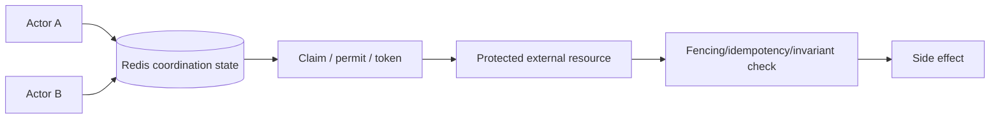
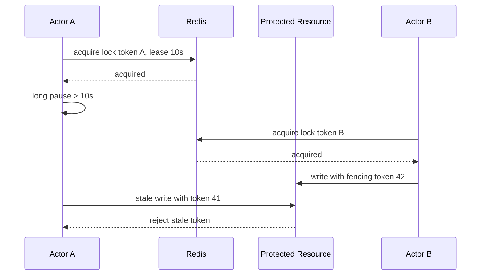

# Part 040 — Distributed Rate Limiting, Locking, Leases, and Coordination with Redis

> Distributed coordination is a protocol, not a Redis command. `SET NX PX` can create a time-bounded claim, but process pauses, network partitions, delayed packets, asynchronous failover, lease expiry, duplicated retries, and external resources can still allow a stale owner to act. Rate limiting has similar traps: a counter script may be atomic, yet identity, clock, cluster slot, retry, fail-open policy, multi-region topology, and response semantics determine whether the system is fair and safe. Every coordination primitive must state its consistency assumptions and failure behavior.

## Daftar Isi

1. [Target kompetensi](#target-kompetensi)
2. [Scope dan baseline](#scope-dan-baseline)
3. [Boundary with Part 024 and Part 039](#boundary-with-part-024-and-part-039)
4. [Mental model distributed coordination](#mental-model-distributed-coordination)
5. [Safety, liveness, and fault tolerance](#safety-liveness-and-fault-tolerance)
6. [Coordination is not business correctness](#coordination-is-not-business-correctness)
7. [Choose the authoritative invariant first](#choose-the-authoritative-invariant-first)
8. [Rate limit versus concurrency limit versus quota](#rate-limit-versus-concurrency-limit-versus-quota)
9. [Rate-limit dimensions](#rate-limit-dimensions)
10. [Trusted identity and tenant dimensions](#trusted-identity-and-tenant-dimensions)
11. [Cost-weighted limits](#cost-weighted-limits)
12. [Fixed-window counter](#fixed-window-counter)
13. [Fixed-window boundary burst](#fixed-window-boundary-burst)
14. [Sliding-window log](#sliding-window-log)
15. [Sliding-window counter](#sliding-window-counter)
16. [Token bucket](#token-bucket)
17. [Leaky bucket](#leaky-bucket)
18. [GCRA](#gcra)
19. [Selecting a rate-limiting algorithm](#selecting-a-rate-limiting-algorithm)
20. [Atomic fixed-window implementation](#atomic-fixed-window-implementation)
21. [Atomic token-bucket implementation](#atomic-token-bucket-implementation)
22. [Lua versus Redis Functions for limiters](#lua-versus-redis-functions-for-limiters)
23. [Redis Cluster key locality](#redis-cluster-key-locality)
24. [TTL and limiter-state cleanup](#ttl-and-limiter-state-cleanup)
25. [Rate-limit response contract](#rate-limit-response-contract)
26. [`429` and `Retry-After`](#429-and-retry-after)
27. [RateLimit response fields](#ratelimit-response-fields)
28. [Local and global limits](#local-and-global-limits)
29. [Hierarchical limits](#hierarchical-limits)
30. [Per-tenant fairness](#per-tenant-fairness)
31. [Multi-region rate limiting](#multi-region-rate-limiting)
32. [Fail-open versus fail-closed](#fail-open-versus-fail-closed)
33. [Limiter overload and backpressure](#limiter-overload-and-backpressure)
34. [Limiter observability](#limiter-observability)
35. [Redisson rate limiter boundary](#redisson-rate-limiter-boundary)
36. [Concurrency limiter](#concurrency-limiter)
37. [Distributed semaphore](#distributed-semaphore)
38. [Permit leases](#permit-leases)
39. [Queueing versus rejection](#queueing-versus-rejection)
40. [Distributed lock mental model](#distributed-lock-mental-model)
41. [Lock, lease, mutex, and ownership token](#lock-lease-mutex-and-ownership-token)
42. [Single-instance Redis lock](#single-instance-redis-lock)
43. [Unique ownership value](#unique-ownership-value)
44. [Atomic compare-and-delete unlock](#atomic-compare-and-delete-unlock)
45. [Why plain `DEL` is unsafe](#why-plain-del-is-unsafe)
46. [Lease duration](#lease-duration)
47. [Lease renewal](#lease-renewal)
48. [Watchdog behavior](#watchdog-behavior)
49. [Process pauses and lease expiry](#process-pauses-and-lease-expiry)
50. [Network partitions](#network-partitions)
51. [Asynchronous replication and failover](#asynchronous-replication-and-failover)
52. [`WAIT` and durability evidence](#wait-and-durability-evidence)
53. [Redlock algorithm](#redlock-algorithm)
54. [Redlock assumptions and limits](#redlock-assumptions-and-limits)
55. [Fencing tokens](#fencing-tokens)
56. [Protected-resource enforcement](#protected-resource-enforcement)
57. [Generating fencing tokens](#generating-fencing-tokens)
58. [Why a lock without fencing can be insufficient](#why-a-lock-without-fencing-can-be-insufficient)
59. [Lock scope and key design](#lock-scope-and-key-design)
60. [Lock granularity](#lock-granularity)
61. [Fairness and starvation](#fairness-and-starvation)
62. [Reentrancy](#reentrancy)
63. [Read-write locks](#read-write-locks)
64. [Spin locks](#spin-locks)
65. [Multi-locks](#multi-locks)
66. [Redisson locks and synchronizers](#redisson-locks-and-synchronizers)
67. [Redisson `RLock`](#redisson-rlock)
68. [Redisson fenced lock](#redisson-fenced-lock)
69. [Redisson semaphore and permits](#redisson-semaphore-and-permits)
70. [Lock acquisition API contract](#lock-acquisition-api-contract)
71. [`tryLock` versus indefinite wait](#trylock-versus-indefinite-wait)
72. [Interruptibility and cancellation](#interruptibility-and-cancellation)
73. [Lock release in `finally`](#lock-release-in-finally)
74. [Ownership-loss handling](#ownership-loss-handling)
75. [Distributed lock and database transactions](#distributed-lock-and-database-transactions)
76. [Database constraints before distributed locks](#database-constraints-before-distributed-locks)
77. [Advisory locks versus Redis locks](#advisory-locks-versus-redis-locks)
78. [Optimistic concurrency versus locks](#optimistic-concurrency-versus-locks)
79. [Idempotency versus locking](#idempotency-versus-locking)
80. [Deduplication records](#deduplication-records)
81. [Reservation and claim patterns](#reservation-and-claim-patterns)
82. [Leader election](#leader-election)
83. [Singleton scheduled jobs](#singleton-scheduled-jobs)
84. [Why a lock is not a scheduler](#why-a-lock-is-not-a-scheduler)
85. [Cron overlap and missed executions](#cron-overlap-and-missed-executions)
86. [Durable job ownership](#durable-job-ownership)
87. [Distributed latch and barrier](#distributed-latch-and-barrier)
88. [Pub/Sub wake-up versus durable state](#pubsub-wake-up-versus-durable-state)
89. [Cache stampede lease](#cache-stampede-lease)
90. [Request coalescing across replicas](#request-coalescing-across-replicas)
91. [Inventory and capacity reservations](#inventory-and-capacity-reservations)
92. [Quotas and usage accounting](#quotas-and-usage-accounting)
93. [JAX-RS rate-limiting filter boundary](#jax-rs-rate-limiting-filter-boundary)
94. [Authentication before rate limiting](#authentication-before-rate-limiting)
95. [Rate-limit placement](#rate-limit-placement)
96. [Gateway, mesh, and application ownership](#gateway-mesh-and-application-ownership)
97. [JAX-RS lock use-case boundary](#jax-rs-lock-use-case-boundary)
98. [Cancellation after response timeout](#cancellation-after-response-timeout)
99. [Security and abuse resistance](#security-and-abuse-resistance)
100. [Key cardinality attacks](#key-cardinality-attacks)
101. [Clock and time semantics](#clock-and-time-semantics)
102. [Observability and audit](#observability-and-audit)
103. [Failure-model matrix](#failure-model-matrix)
104. [Debugging playbook](#debugging-playbook)
105. [Testing and fault injection](#testing-and-fault-injection)
106. [Architecture patterns](#architecture-patterns)
107. [Anti-patterns](#anti-patterns)
108. [PR review checklist](#pr-review-checklist)
109. [Trade-off yang harus dipahami senior engineer](#trade-off-yang-harus-dipahami-senior-engineer)
110. [Internal verification checklist](#internal-verification-checklist)
111. [Latihan verifikasi](#latihan-verifikasi)
112. [Ringkasan](#ringkasan)
113. [Referensi resmi](#referensi-resmi)

---

## Target kompetensi

Setelah menyelesaikan part ini, Anda harus mampu:

- membedakan safety, liveness, and fault-tolerance requirements;
- membedakan request rate, concurrent in-flight work, long-term quota, and resource reservation;
- memilih fixed window, sliding window, token bucket, leaky bucket, or GCRA;
- menerapkan rate limiter atomically with Lua/Functions and bounded key state;
- menentukan trusted identity, tenant, operation cost, and hierarchy;
- memilih fail-open/fail-closed policy based on risk;
- menghindari double limiting across gateway, mesh, and application;
- mendesain local plus global limiter without exceeding downstream capacity;
- menjelaskan single-instance lock using conditional `SET` and ownership token;
- melepaskan lock only through atomic compare-and-delete;
- menjelaskan why lease expiry, GC pause, and network partitions can create multiple active actors;
- memahami asynchronous replication/failover risks;
- explain Redlock as an algorithm with explicit timing and majority assumptions, not universal correctness;
- use fencing tokens and protected-resource validation;
- compare Redis lock with database constraints, optimistic versioning, advisory locks, and idempotency;
- use Redisson abstractions without treating Java `Lock` semantics as local-memory equivalence;
- design distributed semaphores, leader election, singleton jobs, and stampede control;
- test with pauses, partitions, failover, duplicate retries, and stale owners;
- perform evidence-driven PR review and incident debugging.

---

## Scope dan baseline

Baseline:

- Redis concepts and Java clients from Part 039;
- multiple JAX-RS replicas;
- Redis standalone/Sentinel/Cluster/managed service are possibilities;
- Lua or Redis Functions may implement atomic state transition;
- Redisson may provide high-level primitives;
- PostgreSQL/database constraints remain available;
- Kubernetes and external gateways may already enforce some limits;
- clock, timeout, retry, and resilience concepts from Parts 017, 020, and 024.

Part ini **tidak mengasumsikan**:

- Redis locking is acceptable for every invariant;
- Redlock is used;
- Redisson is installed;
- Redis is strongly consistent;
- failover never loses lock/limiter state;
- multi-region active-active semantics;
- gateway/application limits are coordinated;
- HTTP draft RateLimit fields are an internal standard;
- one tenant equals one customer;
- locks can replace idempotency;
- singleton cron is business-durable scheduling;
- exact internal CSG policies.

---

## Boundary with Part 024 and Part 039

Part 024 covers generic resilience and admission control.

Part 039 covers Redis data/cache and client lifecycle.

Part 040 asks whether Redis-backed coordination remains correct when:

- clients pause;
- leases expire;
- Redis fails over;
- commands time out;
- actors retry;
- protected resource is outside Redis.

---

## Mental model distributed coordination



Redis decides claim state.

The protected resource decides whether a stale claim is still accepted.

Without protected-resource verification, a stale actor can still act after losing Redis ownership.

---

## Safety, liveness, and fault tolerance

### Safety

Nothing bad happens.

Examples:

- no two writers commit conflicting state;
- rate never exceeds hard legal quota;
- stale owner cannot write.

### Liveness

Something good eventually happens.

Examples:

- lock eventually becomes available;
- request eventually receives permit;
- job is not permanently abandoned.

### Fault tolerance

Safety/liveness under:

- process crash;
- network partition;
- Redis failover;
- clock skew;
- long pause;
- message duplication;
- timeout.

A design may improve liveness by sacrificing safety, or vice versa.

---

## Coordination is not business correctness

A lock can reduce concurrency, but database invariant should still reject invalid state.

Examples:

- unique constraint for one active order number;
- optimistic version for quote update;
- idempotency key for command;
- balance check within database transaction;
- state-transition condition in SQL.

Use coordination as optimization/control, not sole proof where durable invariant can be encoded at source.

---

## Choose the authoritative invariant first

Ask:

```text
Which system can finally reject an invalid effect?
```

Possible answers:

- PostgreSQL constraint;
- conditional DynamoDB write;
- versioned aggregate;
- external provider idempotency key;
- object-store conditional write;
- durable workflow state;
- fencing-aware storage service.

Redis claim is advisory unless protected resource enforces it.

---

## Rate limit versus concurrency limit versus quota

| Mechanism | Measures |
|---|---|
| Rate limit | operations per time |
| Concurrency limit | simultaneous in-flight operations |
| Quota | cumulative usage over longer period |
| Reservation | temporary ownership of finite capacity |
| Circuit breaker | dependency health/failure state |
| Queue bound | admitted waiting work |

One number cannot replace all.

---

## Rate-limit dimensions

Dimensions may include:

- authenticated subject;
- tenant;
- API client;
- IP/network;
- operation;
- resource;
- region;
- cost class;
- downstream account/quota.

Composite key:

```text
rl:{tenant}:{subject}:{operation}:{window}
```

Cardinality must be bounded.

---

## Trusted identity and tenant dimensions

Rate-limit key must use authenticated/validated identity.

Do not trust arbitrary:

- `X-Tenant-ID`;
- forwarded IP without trusted proxy chain;
- client-supplied user ID;
- access-token content not validated;
- mutable resource name.

Anonymous limits may use normalized trusted source IP plus device/session controls, with NAT fairness implications.

---

## Cost-weighted limits

Not all requests cost one unit.

Example:

```text
GET quote summary = 1
complex search = 5
export = 50
pricing recomputation = 20
```

Token bucket can consume variable token amounts.

Cost must be stable and not chosen by caller.

---

## Fixed-window counter

Key per window:

```text
rl:{subject}:{operation}:20260711T1200
```

Increment counter and set TTL atomically.

Pros:

- simple;
- low memory;
- fast.

Cons:

- burst at boundary;
- window-key cardinality;
- coarse fairness.

---

## Fixed-window boundary burst

A client can send limit requests at end of window and again at start of next, approximately doubling short-interval burst.

If downstream cannot tolerate this, use token bucket or sliding algorithm.

---

## Sliding-window log

Store each request timestamp in sorted set.

Algorithm:

1. remove entries older than interval;
2. count current entries;
3. add new timestamp if under limit;
4. set TTL.

Pros:

- accurate.

Cons:

- memory proportional to requests;
- cleanup cost;
- unique member requirements;
- hot key.

Use bounded scope.

---

## Sliding-window counter

Approximate sliding window using adjacent fixed-window counts weighted by elapsed time.

Pros:

- low memory;
- smoother than fixed window.

Cons:

- approximation;
- more math/state;
- boundary semantics.

Document error tolerance.

---

## Token bucket

State:

- current tokens;
- last refill time.

Each request refills according to elapsed time, then consumes cost.

Allows controlled bursts up to capacity while enforcing average rate.

Good for API admission.

---

## Leaky bucket

Models a queue draining at fixed rate.

Useful to smooth output, but waiting queue requires:

- bound;
- timeout;
- cancellation;
- fairness;
- durability.

Often a queue plus worker rate is clearer.

---

## GCRA

GCRA tracks theoretical arrival time to enforce a smooth rate with burst tolerance using compact state.

Useful when predictable spacing is desired.

Implementation must use atomic time/state update and clearly define burst parameter.

---

## Selecting a rate-limiting algorithm

| Need | Algorithm |
|---|---|
| simple coarse API cap | fixed window |
| accurate requests in interval | sliding log |
| smooth estimate with low state | sliding counter |
| burst plus average rate | token bucket |
| output pacing/queue | leaky bucket |
| compact smooth schedule | GCRA |

Also consider whether gateway already implements it.

---

## Atomic fixed-window implementation

Lua sketch:

```lua
local current = redis.call('INCR', KEYS[1])
if current == 1 then
  redis.call('PEXPIRE', KEYS[1], ARGV[1])
end
local allowed = current <= tonumber(ARGV[2])
local ttl = redis.call('PTTL', KEYS[1])
return {allowed and 1 or 0, current, ttl}
```

Requirements:

- key from trusted dimension;
- bounded TTL;
- cluster same slot;
- script version;
- response mapping;
- no separate `INCR`/`EXPIRE` race.

---

## Atomic token-bucket implementation

State can be one hash or packed value:

```text
tokens
last_refill_ms
```

Atomic script:

1. obtain trusted server time or pass controlled time;
2. calculate elapsed;
3. refill capped at capacity;
4. check requested cost;
5. consume or reject;
6. store state;
7. set cleanup TTL;
8. return remaining and retry time.

Use integer/fixed-point arithmetic where floating precision matters.

---

## Lua versus Redis Functions for limiters

Lua `EVAL`/`EVALSHA`:

- application owns script loading/cache recovery;
- portable across older Redis versions.

Redis Functions:

- server-managed libraries;
- version/deployment lifecycle;
- available in Redis 7+.

Both execute atomically and can block shard if slow.

---

## Redis Cluster key locality

All keys in one script/function/multi-key operation must satisfy Cluster key-slot rules.

Use bounded hash tag:

```text
rl:{tenant42:user17}:search
quota:{tenant42:user17}:daily
```

Do not tag an entire high-volume tenant if it creates one hot slot unnecessarily.

---

## TTL and limiter-state cleanup

Limiter state must expire after it can no longer affect decisions.

TTL should exceed:

- window;
- burst recovery;
- clock tolerance;
- delayed retries where relevant.

No TTL creates unbounded identity-cardinality memory.

---

## Rate-limit response contract

Response should explain:

- rejected/allowed;
- limit scope;
- retry delay;
- remaining capacity where safe;
- policy identifier;
- correlation.

Avoid revealing sensitive global capacity or other tenant usage.

---

## `429` and `Retry-After`

HTTP `429 Too Many Requests` is appropriate for rate limiting.

`Retry-After` can be delta seconds or HTTP date.

Use conservative bounded value.

Clients must not retry immediately regardless of header.

Concurrency saturation may also use `429` or `503` depending ownership/contract; choose consistently.

---

## RateLimit response fields

Emerging/standardized RateLimit fields have evolved over time.

Before using them, verify:

- current RFC/specification status;
- gateway/client support;
- internal API standard;
- semantics for multiple policies.

Do not invent incompatible headers casually.

---

## Local and global limits

Local in-process limiter:

- fast;
- protects one pod;
- not globally exact.

Global Redis limiter:

- coordinates replicas;
- network dependency;
- central hot key.

Hybrid:

```text
small local budget
  + global authoritative budget
```

Must prove combined maximum and refill semantics.

---

## Hierarchical limits

Possible hierarchy:

```text
global service
  → tenant
    → subject
      → operation
```

A request consumes from several buckets atomically or in controlled order.

Partial consumption across separate calls can leak tokens.

Use one script with same-slot keys or redesign.

---

## Per-tenant fairness

Fairness goals:

- one tenant cannot exhaust all capacity;
- reserved minimum plus shared burst;
- weighted plans;
- expensive operation costs.

Rate limiter must align with commercial entitlement but not store pricing contract only in ephemeral Redis.

---

## Multi-region rate limiting

Strong global limit across regions requires coordination latency or quota partitioning.

Options:

- regional sub-budgets whose sum ≤ global;
- one home region;
- asynchronous approximate counters;
- strongly consistent global store;
- fail closed for legal/security quota;
- bounded overage.

Active-active Redis conflict resolution may not provide strict hard global counters. Verify product semantics.

---

## Fail-open versus fail-closed

### Fail open

Allow request when limiter unavailable.

Use when availability is more important and downstream still protected.

### Fail closed

Reject when limiter unavailable.

Use for abuse/security/legal hard limits.

### Degraded local limit

Fallback to conservative in-process budget.

Policy must be per operation and observable.

---

## Limiter overload and backpressure

If limiter Redis becomes slow:

- all requests may wait;
- request threads saturate;
- retries amplify load.

Use:

- short timeout;
- bulkhead;
- no generic retry;
- local emergency limit;
- circuit state;
- fail policy;
- metrics.

---

## Limiter observability

Metrics:

- allowed/rejected;
- limiter errors;
- fail-open/fail-closed;
- remaining distribution;
- retry-after;
- Redis latency;
- script duration;
- key cardinality;
- per-policy utilization;
- local/global divergence;
- hot dimensions.

Avoid raw subject/tenant metric labels.

---

## Redisson rate limiter boundary

Redisson exposes distributed rate-limiter abstractions.

Verify exact mode/version:

- overall versus per-client behavior;
- rate interval;
- permit acquisition;
- async/reactive APIs;
- configuration persistence;
- failover;
- Cluster support.

A library API does not decide business identity or fail policy.

---

## Concurrency limiter

Concurrency limiter bounds in-flight operations:

```text
acquire permit
  → perform bounded operation
  → release permit
```

Unlike rate limiter, duration matters.

Use for:

- downstream connection limit;
- expensive export;
- external vendor concurrency;
- per-tenant active jobs.

---

## Distributed semaphore

State tracks available permits and owners.

Correct implementation needs:

- atomic acquire;
- bounded wait;
- lease/expiry;
- ownership identity;
- release only own permit;
- recovery after crash;
- fairness policy;
- protected-resource enforcement where needed.

---

## Permit leases

Without lease, crashed holder leaks permit.

With lease, long pause can expire permit while holder still acts.

Fencing or idempotent protected resource may be necessary.

---

## Queueing versus rejection

Waiting for a distributed permit adds a hidden distributed queue.

Bound:

- maximum waiters;
- timeout/deadline;
- cancellation;
- fairness;
- shutdown behavior.

Often reject early and let explicit durable queue handle backlog.

---

## Distributed lock mental model



Lock ownership in Redis and authorization to mutate external resource are separate.

---

## Lock, lease, mutex, and ownership token

- mutex: mutual exclusion concept;
- lock: claim granting exclusive access;
- lease: lock expires automatically after time;
- ownership token: unique value proving which acquisition owns key;
- fencing token: monotonically ordered token checked by resource;
- lock key: Redis state representing current claim.

---

## Single-instance Redis lock

Canonical acquisition:

```text
SET resource-lock unique-token NX PX lease-ms
```

It succeeds only if key absent and sets expiry atomically.

This is a lease, not eternal lock.

---

## Unique ownership value

Token must be unique per acquisition, such as cryptographically random ID.

Do not use:

- constant service name;
- pod name alone;
- thread ID;
- timestamp alone.

A new acquisition by same pod still needs new token.

---

## Atomic compare-and-delete unlock

Lua:

```lua
if redis.call("GET", KEYS[1]) == ARGV[1] then
  return redis.call("DEL", KEYS[1])
else
  return 0
end
```

Only owner token can delete current lease.

---

## Why plain `DEL` is unsafe

Sequence:

1. A acquires lease.
2. A pauses until lease expires.
3. B acquires new lease.
4. A resumes and calls `DEL`.
5. A deletes B's lock.

Compare-and-delete prevents step 5.

It does not prevent A from writing external resource after expiry.

---

## Lease duration

Lease must exceed normal critical-section duration plus uncertainty, but short enough for crash recovery.

Long lease:

- slow recovery;
- blocks liveness.

Short lease:

- expiry during valid work;
- duplicate actors.

Measure p99/p99.9 plus pauses/network, not average only.

---

## Lease renewal

Owner may renew before expiry.

Renewal must atomically verify token.

Failure to renew means ownership is uncertain/lost.

Application must stop or switch to reconciliation path.

---

## Watchdog behavior

Redisson `RLock` can use a watchdog to extend lock when acquired without explicit lease time, according to configuration.

Watchdog helps process-alive long work but cannot prove external side effect safety under:

- long JVM pause;
- network partition;
- Redis failover;
- event-loop starvation;
- process still executing while renewal failed.

---

## Process pauses and lease expiry

Pauses include:

- GC;
- CPU starvation;
- container freeze;
- debugger;
- host suspension;
- network stall;
- stop-the-world safepoint.

After resume, code may not know lease expired unless it checks.

Fencing protects resource from stale owner.

---

## Network partitions

Actor may be unable to reach Redis but still reach protected DB/service, or vice versa.

A local assumption “Redis connection alive” does not model partition topology.

Define behavior when ownership cannot be confirmed.

---

## Asynchronous replication and failover

Failure example:

1. primary grants lock;
2. key not replicated yet;
3. primary fails;
4. replica promoted without key;
5. second actor acquires same lock.

This violates mutual exclusion.

Redis replication is asynchronous by default. Critical lock designs must account for it.

---

## `WAIT` and durability evidence

`WAIT` can request acknowledgements from replicas for prior writes.

It improves evidence that copies received the write.

It does not convert Redis replication into strong consensus or guarantee no loss after failover.

Do not present it as complete lock-safety solution.

---

## Redlock algorithm

Redlock acquires the same uniquely identified lease across multiple independent Redis masters and requires majority success within bounded elapsed time.

Remaining validity is reduced by acquisition duration and clock-drift allowance.

Release attempts all instances.

Use a mature implementation if this model is chosen.

---

## Redlock assumptions and limits

Redlock safety depends on assumptions including:

- independent instances;
- bounded clock drift;
- bounded acquisition time;
- majority availability;
- lease validity;
- client behavior;
- external effect duration.

It is not universal replacement for consensus or fencing.

For correctness-critical writes, require protected-resource fencing/conditional update.

---

## Fencing tokens

A fencing token is monotonically increasing per accepted acquisition.

Protected resource stores highest accepted token and rejects lower tokens.

Example:

```sql
UPDATE protected_resource
SET payload = :payload,
    last_fencing_token = :token
WHERE id = :id
  AND last_fencing_token < :token;
```

Check affected row count.

---

## Protected-resource enforcement

Fencing works only if every writer supplies token and resource enforces monotonicity.

If one bypass path writes without token, guarantee is broken.

Possible protected resources:

- database row;
- object metadata/version;
- custom service;
- workflow state.

---

## Generating fencing tokens

Possible allocator:

- database sequence;
- strongly consistent consensus service;
- atomic Redis `INCR` under assumptions;
- Redisson fenced-lock implementation.

Caution:

Redis failover can lose/repeat counter state depending persistence/replication. For strict global monotonicity, use allocator whose guarantees match invariant.

---

## Why a lock without fencing can be insufficient

A lease controls who Redis currently believes is owner.

It cannot revoke CPU instructions already running on stale owner.

Only the protected resource can reject stale operation.

---

## Lock scope and key design

Key example:

```text
lock:{tenant42}:quote:Q123:reprice
```

Include:

- tenant;
- exact resource;
- operation when different operations can coexist;
- schema/version if protocol changes.

Avoid one global lock unless true global exclusion is required.

---

## Lock granularity

Coarse lock:

- simple;
- lower concurrency;
- hotspot.

Fine lock:

- more concurrency;
- more keys/deadlock/order complexity.

Prefer database/aggregate granularity.

---

## Fairness and starvation

Basic Redis lock acquisition is not necessarily fair.

Retrying clients can race repeatedly.

Fair lock adds queue/state and failure recovery complexity.

Fairness may reduce throughput.

---

## Reentrancy

Local Java reentrant lock associates ownership with thread.

Distributed reentrancy must define:

- process/client/thread identity;
- hold count;
- lease renewal;
- crash cleanup;
- cross-thread behavior.

Do not assume Redisson/JVM semantics apply to another client/library.

---

## Read-write locks

Distributed read/write lock allows concurrent readers and exclusive writer.

Risks:

- reader leak;
- writer starvation;
- failover state;
- lease expiry;
- ownership tracking;
- external fencing.

Use only with clear need.

---

## Spin locks

Spin lock repeatedly checks acquisition, often with backoff.

High contention can overload Redis.

Prefer notification/queue-based primitive or bounded retries.

---

## Multi-locks

Acquiring several locks creates ordering and partial-acquisition problems.

Use deterministic order and release partial set.

Distributed multi-resource atomicity may be better expressed as database transaction or workflow reservation.

---

## Redisson locks and synchronizers

Redisson offers abstractions including locks, fair locks, read/write locks, fenced locks, semaphores, latches, and others.

Exact feature availability differs by version/edition.

Review implementation, watchdog, lease, failure, and topology semantics.

---

## Redisson `RLock`

Usage pattern:

```java
RLock lock = redisson.getLock(lockKey);
boolean acquired = lock.tryLock(waitTime, leaseTime, TimeUnit.MILLISECONDS);

if (!acquired) {
    throw new ResourceBusyException();
}

try {
    performIdempotentBoundedWork();
} finally {
    if (lock.isHeldByCurrentThread()) {
        lock.unlock();
    }
}
```

Still require fencing/idempotency for critical external effects.

---

## Redisson fenced lock

A fenced lock provides an ordered token intended for protected-resource rejection of stale owners.

Verify:

- exact API/version;
- token type;
- supported topology;
- persistence/failover semantics;
- resource integration.

Do not acquire token and then ignore it.

---

## Redisson semaphore and permits

Redisson provides semaphore/permit-expirable constructs.

Prefer expirable permits for crash recovery where appropriate.

A permit ID is ownership evidence; release only matching permit.

---

## Lock acquisition API contract

Return states should distinguish:

- acquired;
- busy;
- timed out;
- cancelled;
- Redis unavailable;
- ownership lost;
- internal error.

Do not map all to `409`.

---

## `tryLock` versus indefinite wait

Indefinite blocking violates JAX-RS deadlines and can exhaust threads.

Use:

- zero-wait attempt;
- bounded wait less than remaining deadline;
- explicit busy/retry response;
- durable queue for long wait.

---

## Interruptibility and cancellation

Acquisition should observe interruption/cancellation where client API supports it.

If HTTP client disconnects after lock acquired, application work may continue. Decide whether to cancel safely.

Never release another thread's ownership.

---

## Lock release in `finally`

Release in `finally`, but only if:

- current acquisition owns token;
- ownership not transferred;
- release errors are logged/handled;
- work completion state is known.

A failed release is not always fatal because TTL expires, but it affects latency/liveness.

---

## Ownership-loss handling

If renewal fails or lease expires:

1. mark ownership lost;
2. stop starting new side effects;
3. cancel interruptible work;
4. do not claim success;
5. reconcile any ambiguous external effect;
6. let protected resource reject stale token.

---

## Distributed lock and database transactions

Danger:

```text
acquire Redis lock
begin DB transaction
long DB work
Redis lease expires
second actor acquires
both transactions commit
```

Use DB constraint/version/fencing inside transaction.

Keep critical section bounded.

---

## Database constraints before distributed locks

For durable invariant, prefer:

```sql
UNIQUE (tenant_id, external_command_id)
```

or:

```sql
UPDATE quote
SET status = 'APPROVED', version = version + 1
WHERE id = :id
  AND version = :expected
  AND status = 'PENDING';
```

Redis lock can reduce conflict but database enforces truth.

---

## Advisory locks versus Redis locks

PostgreSQL advisory lock:

- tied to DB session/transaction;
- same database failure domain;
- useful for DB-centric coordination;
- not automatically visible outside DB.

Redis lock:

- cross-system accessible;
- separate failure domain;
- lease semantics;
- async failover concerns.

Choose authority nearest protected resource.

---

## Optimistic concurrency versus locks

Optimistic versioning:

- no pre-lock;
- conflict detected at commit;
- good when contention low;
- durable source enforcement.

Locking:

- prevents/reduces concurrent work;
- requires wait/lease/failure protocol;
- can improve expensive-work efficiency.

Often use optimistic correctness plus optional lock optimization.

---

## Idempotency versus locking

Lock prevents simultaneous attempts during lease.

Idempotency handles duplicate attempts across time and crashes.

Critical commands usually need idempotency even when locked.

---

## Deduplication records

A dedup record should store:

- command/event ID;
- request hash;
- status;
- result reference;
- created/expiry;
- owner;
- tenant;
- failure/retry state.

Redis can store it for bounded horizon, but losing it can re-enable duplicates. Use durable database if effect is irreversible or horizon is long.

---

## Reservation and claim patterns

Reservation has lifecycle:

```text
AVAILABLE → RESERVED(owner, expiry) → COMMITTED
                         ↘ EXPIRED/CANCELLED
```

Use atomic state transition and durable source.

A lock around “check then reserve” is weaker than conditional reservation update.

---

## Leader election

A leader lease selects one active coordinator.

Requirements:

- unique identity;
- lease/renewal;
- fencing epoch;
- leadership-loss callback;
- stop work promptly;
- protected-resource epoch check;
- observe current leader.

Do not assume leader remains leader because process is healthy.

---

## Singleton scheduled jobs

A Redis lock can suppress overlapping execution:

```text
scheduler fires on every pod
  → one acquires lease
  → job runs
```

But it does not guarantee:

- job runs at least once;
- missed schedule recovery;
- exactly one external effect;
- durable progress;
- ordered retries.

Use durable job scheduler/workflow for critical jobs.

---

## Why a lock is not a scheduler

Scheduler concerns:

- due time;
- persistence;
- missed runs;
- retries;
- history;
- catch-up;
- timezone;
- cancellation;
- ownership;
- result.

Lock only controls concurrent claim.

---

## Cron overlap and missed executions

Policies:

- skip if previous running;
- queue one;
- catch up all;
- coalesce;
- fail/alert.

Encode policy explicitly.

A lock expiry during long run can create overlap.

---

## Durable job ownership

Better pattern:

```sql
UPDATE job
SET owner = :worker,
    lease_until = :expiry,
    fencing_token = nextval('job_fence')
WHERE id = :id
  AND status = 'READY'
  AND (lease_until IS NULL OR lease_until < now())
RETURNING ...;
```

Database stores durable schedule and fencing.

Redis may accelerate notification.

---

## Distributed latch and barrier

Latch/barrier coordinates multiple participants.

Risks:

- participant crashes;
- count never reaches zero;
- duplicate decrement;
- dynamic membership;
- timeout;
- reset;
- failover loss.

Use workflows/message aggregation for long-running business coordination.

---

## Pub/Sub wake-up versus durable state

Use Pub/Sub as wake-up hint:

```text
durable state in DB/Redis key
Pub/Sub says "recheck"
```

If notification is lost, polling/reconciliation still progresses.

---

## Cache stampede lease

One actor obtains short refill lease.

Others:

- serve stale value;
- wait bounded;
- fall back;
- retry later.

Refiller writes cache only if source revision still current.

This is availability optimization, not durable business lock.

---

## Request coalescing across replicas

Distributed coalescing requires:

- one refill owner;
- bounded wait;
- stale fallback;
- ownership token;
- source bulkhead;
- no herd polling.

Local single-flight is often simpler and enough when source can tolerate one request per pod.

---

## Inventory and capacity reservations

Do not model scarce inventory solely with ephemeral Redis lock.

Use durable atomic reservation in inventory source.

Redis can:

- rate-limit;
- provide hot availability cache;
- reduce contention;
- notify.

Final inventory invariant belongs to durable storage/service.

---

## Quotas and usage accounting

Hard commercial quota requires durable usage ledger or authoritative counter with appropriate consistency.

Redis can provide fast admission estimate.

Reconcile with durable billing/usage.

Define overage behavior during Redis outage/failover.

---

## JAX-RS rate-limiting filter boundary

A filter can reject before resource method.

But identity may not be available in pre-matching filter.

Placement:

- after authentication for subject/tenant limit;
- before expensive entity parsing if safe identity exists;
- resource/service layer for cost/domain-aware limits.

Do not consume full upload before checking an upload limit.

---

## Authentication before rate limiting

Order depends on attack model.

Possible layers:

1. edge IP limit before authentication;
2. credential-validation protection;
3. authenticated subject/tenant limit;
4. operation cost limit;
5. downstream concurrency limit.

One limiter cannot cover all.

---

## Rate-limit placement

| Layer | Strength |
|---|---|
| CDN/WAF/gateway | blocks early, broad traffic |
| Service mesh | workload/service traffic |
| JAX-RS filter | application identity and route |
| Domain service | semantic/cost-aware |
| Downstream adapter | protects exact dependency |

Coordinate policies.

---

## Gateway, mesh, and application ownership

Inventory:

- attempts;
- key dimensions;
- window;
- status/header;
- fail policy;
- exemptions.

Nested independent limits can surprise customers and complicate diagnosis.

Choose one authoritative layer per policy, with complementary local safety limits.

---

## JAX-RS lock use-case boundary

Resource method should not expose raw Redis lock API.

Use application service:

```java
QuoteResult repriceQuote(
        TenantId tenant,
        QuoteId quoteId,
        CommandId commandId,
        Deadline deadline);
```

Service chooses optimistic update, idempotency, optional lock, and fencing.

---

## Cancellation after response timeout

Client timeout does not cancel lock-holder effect automatically.

If resource continues:

- lease may expire;
- client retries;
- second actor starts;
- original completes.

Use command ID and status resource for long operations.

---

## Security and abuse resistance

Rate limiter is security-sensitive.

Protect:

- Redis ACL;
- script/function deployment;
- key namespace;
- bypass roles;
- admin reset;
- trusted proxy IP;
- policy configuration;
- metrics/logs.

Attackers can target limiter key cardinality and hot keys.

---

## Key cardinality attacks

Untrusted IDs can create millions of limiter keys.

Controls:

- authenticate/validate before key;
- normalize;
- cap length;
- hash bounded identity;
- short TTL;
- reject invalid;
- IP prefix aggregation where appropriate;
- memory alerts;
- local pre-limit.

---

## Clock and time semantics

Rate limiter may use:

- Redis server `TIME`;
- client wall clock;
- monotonic elapsed time locally;
- external time.

For distributed atomic algorithm, server time avoids client clock disagreement, but failover clocks must be synchronized.

Lease safety cannot assume perfectly synchronized clocks.

---

## Observability and audit

Rate limiter:

- policy ID;
- decision;
- cost;
- limit/remaining/retry;
- fallback mode;
- Redis latency/error;
- identity class, not raw ID metric.

Lock/coordination:

- key category;
- acquisition wait;
- success/busy/error;
- lease duration;
- renewal;
- ownership lost;
- hold duration;
- stale-token rejection;
- contention;
- failover;
- release errors.

Audit administrative bypass/reset and critical leader changes.

---

## Failure-model matrix

| Failure | Impact | Detection | Response |
|---|---|---|---|
| `INCR` then `EXPIRE` non-atomic | immortal limiter key | TTL audit | script/function |
| Boundary burst | downstream overload | short-window traffic | token/sliding algorithm |
| Untrusted key dimension | bypass/cardinality attack | key growth | trusted normalized identity |
| Local limits summed incorrectly | global overshoot | aggregate metrics | explicit partitioned budget |
| Multi-region async counter | hard quota exceeded | reconciliation | regional allocation/strong store |
| Limiter Redis slow | request-thread saturation | latency/pending | short timeout/fallback |
| Fail-open undocumented | abuse/quota breach | fallback metrics | per-policy decision |
| Rate-limit state evicted | extra traffic allowed | evictions | separate no-eviction store |
| Plain `DEL` unlock | deletes new owner's lock | owner mismatch | compare-and-delete |
| Lease expires during GC pause | two active actors | token/hold metrics | fencing/idempotency |
| Renewal fails but work continues | stale side effect | ownership-loss event | stop/fence/reconcile |
| Primary fails before replication | duplicate lock holders | failover incident | stronger design/fencing |
| `WAIT` treated as consensus | false safety | review | explicit guarantees |
| Same lock token reused | incorrect unlock/ownership | token audit | unique per acquisition |
| Global lock hot key | throughput collapse | contention | finer granularity |
| Indefinite `lock()` | exhausted threads | thread dump | bounded `tryLock` |
| Multi-lock partial acquisition | deadlock/leak | held-lock inventory | deterministic order/release |
| Semaphore permit leaked | capacity shrink | permit metrics | expirable permits |
| Permit expires during work | capacity oversubscription | stale fence | fenced resource |
| Lock replaces DB constraint | invalid durable state | reconciliation | source invariant |
| Idempotency only in volatile Redis | duplicates after loss | failover/restore | durable idempotency |
| Cron lock expires | overlapping jobs | execution IDs | durable scheduler/fence |
| Leader loses lease silently | split brain | epoch rejection | leadership-loss stop/fence |
| Pub/Sub used as durable barrier | stuck participants | missing event | durable state/polling |

---

## Debugging playbook

### Requests are unexpectedly rate limited

Check:

- policy/dimension;
- authenticated tenant/subject;
- key normalization;
- cost;
- window/refill math;
- clock;
- previous retries;
- gateway/mesh duplicate policy;
- Redis state/TTL;
- client response headers.

### Limit is exceeded

Check:

- local versus global layers;
- multi-region budgets;
- non-atomic sequence;
- fail-open;
- state eviction;
- Cluster key mismatch;
- retries counted or not;
- race in token bucket;
- time source;
- bypass identity.

### Limiter causes latency

Inspect:

- Redis command/script latency;
- hot key;
- pending client commands;
- retry;
- Cluster redirects;
- script complexity;
- pool/event loop;
- failover;
- request-thread queue.

### Two lock holders appear

Timeline:

1. acquisition tokens;
2. lease duration;
3. renewals;
4. JVM/process pauses;
5. Redis primary/failover;
6. network reachability to Redis/resource;
7. protected-resource fencing;
8. unlock command.

Do not diagnose from current lock key only.

### Lock cannot be acquired

Check:

- current owner token/TTL;
- lease renewal;
- stale long lease;
- wrong namespace/tenant;
- lost release;
- Redis clock;
- high contention;
- indefinite waiter;
- client reconnect.

### New owner's lock disappeared

Look for stale actor using plain `DEL` or incorrect token reuse.

### Job ran twice

Check:

- lock expiry;
- GC/pod pause;
- scheduler fired multiple times;
- manual trigger;
- failover;
- command ID/idempotency;
- fenced job state;
- previous response timeout.

### Redisson lock never expires

Check watchdog, client still alive, event-loop/network, `lockWatchdogTimeout`, explicit lease, holder thread, and topology.

Do not delete key manually without owner/effect assessment.

---

## Testing and fault injection

### Rate limiter tests

- exact limit;
- boundary burst;
- concurrent requests;
- variable cost;
- TTL cleanup;
- script atomicity;
- Cluster same-slot;
- fail-open/closed;
- Redis timeout;
- key-cardinality abuse;
- multi-layer attempt count.

### Lock tests

- only one normal owner;
- wrong token cannot unlock;
- lease expiry;
- renewal;
- process kill;
- pause beyond lease;
- network partition;
- Sentinel/Cluster failover;
- stale owner write rejected by fencing;
- lock acquisition timeout/cancel;
- release failure.

### Semaphore tests

- concurrent permit cap;
- leaked holder;
- expirable permit;
- duplicate release;
- fairness/starvation;
- failover.

### Scheduler tests

- pod overlap;
- long run beyond lease;
- missed schedule;
- restart;
- duplicate trigger;
- external effect idempotency;
- fencing epoch.

Use real Redis topology. Unit mocks cannot model leases or failover.

---

## Architecture patterns

### Atomic Redis rate limiter

One bounded script/function computes and updates decision.

### Edge plus domain limit

Gateway protects volumetric abuse; application applies authenticated cost-aware policy.

### Local safety + partitioned global budget

Global quota allocates conservative sub-budgets to regions/pods.

### Optimistic correctness plus lock optimization

Database version/constraint is authoritative; Redis lock avoids duplicated expensive work.

### Fenced lease

Redis lease grants token; protected DB/service rejects stale token.

### Durable idempotent command

Command ID in database protects irreversible effect regardless of lock.

### Durable scheduler with Redis wake-up

Database/workflow stores jobs; Redis/PubSub accelerates notification.

### Cache refill lease

Short lease plus stale-while-revalidate protects source from stampede.

---

## Anti-patterns

- one `INCR` and separate `EXPIRE`;
- rate-limit key from arbitrary header;
- no TTL on limiter keys;
- hard global quota on eventually convergent regional counters;
- retrying limiter command repeatedly during outage;
- undocumented fail open;
- gateway, mesh, and app all retry/limit independently;
- distributed lock using `SETNX` without TTL;
- unlock with plain `DEL`;
- constant lock token;
- lease longer than all incident detection;
- no fencing for critical external write;
- assuming watchdog prevents every stale owner;
- assuming `WAIT` creates strong consistency;
- assuming Redlock is consensus;
- one global lock for all tenants;
- indefinite blocking lock in JAX-RS thread;
- lock around long remote call without idempotency;
- distributed lock replacing unique constraint;
- volatile Redis idempotency for irreversible payment/order creation;
- Redis lock as sole scheduler/history;
- Pub/Sub as durable barrier;
- manually deleting lock key during incident without owner analysis;
- using Java `Lock` intuition without distributed failure model.

---

## PR review checklist

### Rate limiting

- [ ] Rate, concurrency, quota, or reservation clearly distinguished?
- [ ] Trusted identity/tenant dimension?
- [ ] Algorithm justified?
- [ ] Atomic script/function?
- [ ] Key TTL/cardinality?
- [ ] Cost and hierarchy?
- [ ] Local/global/multi-region math?
- [ ] Fail-open/closed policy?
- [ ] HTTP status/retry fields?
- [ ] Gateway/mesh/app ownership?
- [ ] Throttling and limiter failure metrics?

### Locking and leases

- [ ] Lock truly needed after DB/idempotency alternatives?
- [ ] Conditional `SET` with TTL?
- [ ] Unique token per acquisition?
- [ ] Atomic compare-and-delete?
- [ ] Lease duration evidence?
- [ ] Renewal and ownership-loss handling?
- [ ] Bounded acquisition wait?
- [ ] Release in `finally` with owner check?
- [ ] Failover/replication assumptions?
- [ ] Stale owner prevented by fencing/idempotency?

### Protected resource

- [ ] Fencing token generated with adequate guarantees?
- [ ] Resource rejects stale token atomically?
- [ ] Every writer participates?
- [ ] Durable constraint/version remains?
- [ ] Ambiguous external outcome reconciled?
- [ ] Token persisted/audited where needed?

### Higher-level primitives

- [ ] Redisson version/edition/API verified?
- [ ] Watchdog semantics understood?
- [ ] Fair/reentrant/read-write behavior required?
- [ ] Semaphore permit ownership/expiry?
- [ ] Leader-election epoch?
- [ ] Scheduler persistence/missed-run policy?
- [ ] Latch/barrier crash behavior?

### Operations/security

- [ ] Coordination Redis separated from evictable cache?
- [ ] ACL/TLS/private network?
- [ ] Key-cardinality attack controls?
- [ ] Contention/hold/renewal dashboards?
- [ ] Failover/pause tests?
- [ ] Manual reset runbook with audit?
- [ ] Incident owner?

---

## Trade-off yang harus dipahami senior engineer

| Decision | Benefit | Cost/risk |
|---|---|---|
| Fixed window | simple/cheap | boundary burst |
| Sliding log | accurate | memory and cleanup |
| Token bucket | burst + average control | state/math complexity |
| Local limiter | low latency | per-pod overshoot |
| Global Redis limiter | coordinated | central dependency/hot key |
| Fail open | availability | abuse/quota breach |
| Fail closed | safety | outage amplification |
| Queue for permit | smoother admission | hidden waiting state |
| Reject early | bounded system | client-visible failures |
| Redis lease | simple cross-process claim | pause/failover uncertainty |
| Lease renewal | supports longer work | stale-owner risk remains |
| Watchdog | automatic extension | hidden timing dependency |
| Fencing | stale-write protection | resource integration/token allocator |
| Redlock | tolerance across independent Redis masters | timing/majority complexity |
| DB advisory lock | near DB authority | DB coupling/session limits |
| Optimistic version | durable conflict detection | repeated expensive work |
| Coarse lock | simple | low concurrency/hot key |
| Fine locks | concurrency | key/deadlock complexity |
| Fair lock | reduced starvation | queue/throughput cost |
| Expirable semaphore | crash recovery | permit expiry while active |
| Cron + lock | easy overlap suppression | no durable scheduling guarantee |
| Workflow/job table | durable history/retry | infrastructure complexity |

---

## Internal verification checklist

### Redis coordination platform

- [ ] Product/version/topology.
- [ ] Separate cache and coordination deployments?
- [ ] Persistence and eviction policy.
- [ ] Sentinel/Cluster/active-active semantics.
- [ ] Replication/failover RPO.
- [ ] Lua/Functions availability.
- [ ] ACL/TLS/network.
- [ ] Time synchronization.
- [ ] Capacity and hot-key monitoring.

### Rate limiting

- [ ] Policy owners.
- [ ] Gateway/mesh/application limits.
- [ ] Identity and tenant source.
- [ ] Algorithms and scripts.
- [ ] Limits/costs/hierarchy.
- [ ] TTL/key naming/hash tags.
- [ ] Fail-open/closed.
- [ ] Local/global/multi-region.
- [ ] Exemptions/admin reset.
- [ ] HTTP headers/status.
- [ ] Metrics and customer visibility.

### Locking

- [ ] Lock library/custom scripts.
- [ ] Redisson version/edition.
- [ ] Lock key/token format.
- [ ] Lease and watchdog settings.
- [ ] Renewal interval.
- [ ] Acquisition wait/deadline.
- [ ] Unlock script.
- [ ] Failover assumptions.
- [ ] Fencing-token allocator.
- [ ] Protected-resource enforcement.
- [ ] Contention and ownership-loss metrics.

### Coordination use cases

- [ ] Cache stampede.
- [ ] Scheduled jobs.
- [ ] Leader election.
- [ ] Semaphores/concurrency.
- [ ] Idempotency/deduplication.
- [ ] Inventory/reservation.
- [ ] Quota.
- [ ] Latch/barrier.
- [ ] Durable alternatives and invariants.
- [ ] Reconciliation.

### Testing and operations

- [ ] Real topology integration tests.
- [ ] GC/process pause injection.
- [ ] Network partition.
- [ ] Primary failover.
- [ ] Clock skew.
- [ ] Stale owner.
- [ ] Lock reset runbook.
- [ ] Rate-limit outage runbook.
- [ ] Audit and alerting.
- [ ] Incident ownership.

---

## Latihan verifikasi

1. Implement fixed-window script and prove no immortal key after crash.
2. Demonstrate fixed-window boundary burst; compare token bucket.
3. Calculate maximum global traffic with N pods and local-only limits.
4. Pause lock owner beyond lease, let another owner acquire, and prove fencing rejects stale write.
5. Fail over Redis immediately after lock acquisition and observe mutual-exclusion assumptions.
6. Replace distributed lock with a database unique/version invariant and compare behavior.
7. Run long cron job beyond lease and show why duplicate execution occurs.
8. Leak a semaphore permit, then test expirable permit recovery and active-work risk.
9. Trigger limiter-key cardinality attack with random IDs and validate defenses.
10. Inventory gateway, mesh, SDK, and application retries/limits for one endpoint and remove conflicting ownership.

---

## Ringkasan

- Distributed coordination is a failure-sensitive protocol, not a convenience command.
- Rate, concurrency, quota, and reservation are different controls.
- Fixed window is simple but allows boundary bursts; token bucket and sliding methods provide different trade-offs.
- Atomic Redis scripts/functions are required for multi-step limiter state.
- Rate-limit dimensions must use trusted identity and bounded cardinality.
- Multi-region hard limits need budget partitioning or stronger coordination.
- Limiter failure requires explicit fail-open, fail-closed, or degraded-local policy.
- `SET ... NX PX` creates a lease, not an irrevocable lock.
- Ownership tokens and atomic compare-and-delete are mandatory for safe release.
- A paused actor can continue after its lease expires.
- Asynchronous Redis failover can create multiple lock holders.
- `WAIT` improves replica acknowledgement evidence but is not consensus.
- Redlock has explicit timing and majority assumptions and is not universal correctness.
- Fencing tokens let the protected resource reject stale actors.
- Durable database constraints, optimistic versions, and idempotency usually remain authoritative.
- Locks suppress concurrency; idempotency handles duplicates across time.
- Redisson abstractions simplify APIs but do not remove distributed failure semantics.
- A lock is not a durable scheduler, workflow, or quota ledger.
- Real tests must inject pause, partition, failover, timeout, and stale-owner behavior.
- Exact internal algorithms, topology, libraries, and failure policy remain **Internal verification checklist**.

---

## Referensi resmi

- [Redis Distributed Locks](https://redis.io/docs/latest/develop/clients/patterns/distributed-locks/)
- [Redis `SET` Command](https://redis.io/docs/latest/commands/set/)
- [Redis `WAIT` Command](https://redis.io/docs/latest/commands/wait/)
- [Redis Transactions](https://redis.io/docs/latest/develop/using-commands/transactions/)
- [Redis Lua Scripting](https://redis.io/docs/latest/develop/programmability/eval-intro/)
- [Redis Functions](https://redis.io/docs/latest/develop/programmability/functions-intro/)
- [Redis Cluster](https://redis.io/docs/latest/operate/oss_and_stack/management/scaling/)
- [Redis Replication](https://redis.io/docs/latest/operate/oss_and_stack/management/replication/)
- [Redis Sentinel](https://redis.io/docs/latest/operate/oss_and_stack/management/sentinel/)
- [Redis Key Eviction](https://redis.io/docs/latest/develop/reference/eviction/)
- [Redisson Locks and Synchronizers](https://redisson.pro/docs/data-and-services/locks-and-synchronizers/)
- [Redisson Configuration](https://redisson.pro/docs/configuration/)
- [Redisson Objects and Rate Limiter](https://redisson.pro/docs/data-and-services/objects/)
- [HTTP Semantics](https://www.rfc-editor.org/rfc/rfc9110)
