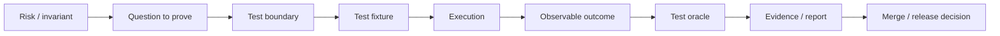

# Part 041 — Unit, Integration, Contract, and Migration Testing

> Test suite bukan kumpulan method beranotasi `@Test`, dan code coverage bukan bukti correctness. Testing strategy adalah portfolio of evidence yang membuktikan invariant pada boundary yang tepat: pure domain logic, serialization, JAX-RS request lifecycle, database constraints, transaction behavior, message delivery, schema compatibility, migrations, authentication, concurrency, retries, dan recovery. Test yang terlalu banyak mock dapat lulus ketika sistem nyata gagal; test end-to-end yang terlalu luas dapat gagal tanpa menunjukkan penyebab. Senior engineer memilih level test berdasarkan risiko, bukan berdasarkan tren atau persentase pyramid.

## Daftar Isi

1. [Target kompetensi](#target-kompetensi)
2. [Scope dan baseline](#scope-dan-baseline)
3. [Boundary dengan Part 042 dan Part 043](#boundary-dengan-part-042-dan-part-043)
4. [Mental model testing sebagai evidence](#mental-model-testing-sebagai-evidence)
5. [Risk-based test portfolio](#risk-based-test-portfolio)
6. [Test pyramid, trophy, and honeycomb](#test-pyramid-trophy-and-honeycomb)
7. [Test taxonomy](#test-taxonomy)
8. [Test scope versus test speed](#test-scope-versus-test-speed)
9. [Determinism](#determinism)
10. [Test isolation](#test-isolation)
11. [Repeatability dan reproducibility](#repeatability-dan-reproducibility)
12. [Observable outcomes](#observable-outcomes)
13. [Test naming](#test-naming)
14. [Arrange-Act-Assert and Given-When-Then](#arrange-act-assert-and-given-when-then)
15. [One behavior, not one assertion](#one-behavior-not-one-assertion)
16. [JUnit Platform, Jupiter, and engines](#junit-platform-jupiter-and-engines)
17. [JUnit 6 and Java baseline](#junit-6-and-java-baseline)
18. [JUnit lifecycle](#junit-lifecycle)
19. [Per-method versus per-class test instances](#per-method-versus-per-class-test-instances)
20. [Assertions](#assertions)
21. [Exception assertions](#exception-assertions)
22. [Grouped and soft assertions](#grouped-and-soft-assertions)
23. [Parameterized tests](#parameterized-tests)
24. [Dynamic tests](#dynamic-tests)
25. [Nested tests](#nested-tests)
26. [Tags and test suites](#tags-and-test-suites)
27. [Timeouts](#timeouts)
28. [Parallel execution](#parallel-execution)
29. [JUnit extensions](#junit-extensions)
30. [Test fixtures](#test-fixtures)
31. [Fixture builders and object mothers](#fixture-builders-and-object-mothers)
32. [Random data and reproducible seeds](#random-data-and-reproducible-seeds)
33. [Time and Clock](#time-and-clock)
34. [UUID and identifier generation](#uuid-and-identifier-generation)
35. [Test doubles taxonomy](#test-doubles-taxonomy)
36. [Stub](#stub)
37. [Fake](#fake)
38. [Mock](#mock)
39. [Spy](#spy)
40. [Dummy](#dummy)
41. [Mockito mental model](#mockito-mental-model)
42. [Stubbing versus verification](#stubbing-versus-verification)
43. [Strict stubbing](#strict-stubbing)
44. [Argument matching and captors](#argument-matching-and-captors)
45. [Mocking final, static, and constructors](#mocking-final-static-and-constructors)
46. [Over-mocking](#over-mocking)
47. [Behavioral coupling](#behavioral-coupling)
48. [Ports and fakes](#ports-and-fakes)
49. [Unit testing domain invariants](#unit-testing-domain-invariants)
50. [State-machine tests](#state-machine-tests)
51. [Money and rounding tests](#money-and-rounding-tests)
52. [Date/time boundary tests](#datetime-boundary-tests)
53. [Authorization decision tests](#authorization-decision-tests)
54. [Idempotency tests](#idempotency-tests)
55. [Retry and timeout policy tests](#retry-and-timeout-policy-tests)
56. [Property-based testing](#property-based-testing)
57. [Generators and shrinking](#generators-and-shrinking)
58. [Metamorphic properties](#metamorphic-properties)
59. [Stateful property testing](#stateful-property-testing)
60. [Mutation testing](#mutation-testing)
61. [Mutation score and equivalent mutants](#mutation-score-and-equivalent-mutants)
62. [Code coverage](#code-coverage)
63. [JaCoCo counters](#jacoco-counters)
64. [Coverage thresholds](#coverage-thresholds)
65. [Coverage exclusions](#coverage-exclusions)
66. [Architecture tests](#architecture-tests)
67. [Static analysis versus executable tests](#static-analysis-versus-executable-tests)
68. [JAX-RS resource unit tests](#jax-rs-resource-unit-tests)
69. [JAX-RS in-process tests](#jax-rs-in-process-tests)
70. [JerseyTest and runtime-specific tests](#jerseytest-and-runtime-specific-tests)
71. [Black-box HTTP tests](#black-box-http-tests)
72. [Request matching and parameter-binding tests](#request-matching-and-parameter-binding-tests)
73. [Provider and serialization tests](#provider-and-serialization-tests)
74. [Filter and interceptor tests](#filter-and-interceptor-tests)
75. [ExceptionMapper tests](#exceptionmapper-tests)
76. [Bean Validation tests](#bean-validation-tests)
77. [Authentication and authorization tests](#authentication-and-authorization-tests)
78. [Multipart and streaming tests](#multipart-and-streaming-tests)
79. [SSE and asynchronous endpoint tests](#sse-and-asynchronous-endpoint-tests)
80. [Testcontainers mental model](#testcontainers-mental-model)
81. [Container lifecycle](#container-lifecycle)
82. [Static containers and singleton pattern](#static-containers-and-singleton-pattern)
83. [Reusable containers](#reusable-containers)
84. [Wait strategy versus startup strategy](#wait-strategy-versus-startup-strategy)
85. [Dynamic host and mapped ports](#dynamic-host-and-mapped-ports)
86. [Container networks and aliases](#container-networks-and-aliases)
87. [Image pinning](#image-pinning)
88. [Testcontainers cleanup and Ryuk](#testcontainers-cleanup-and-ryuk)
89. [CI container runtime](#ci-container-runtime)
90. [PostgreSQL integration tests](#postgresql-integration-tests)
91. [Database schema setup](#database-schema-setup)
92. [Transaction tests](#transaction-tests)
93. [Isolation and locking tests](#isolation-and-locking-tests)
94. [Deadlock tests](#deadlock-tests)
95. [Constraint tests](#constraint-tests)
96. [Query-plan and index tests](#query-plan-and-index-tests)
97. [MyBatis integration tests](#mybatis-integration-tests)
98. [Migration tests](#migration-tests)
99. [Empty-database migration](#empty-database-migration)
100. [Upgrade-path migration](#upgrade-path-migration)
101. [Expand-contract compatibility tests](#expand-contract-compatibility-tests)
102. [Rollback and roll-forward tests](#rollback-and-roll-forward-tests)
103. [Backfill tests](#backfill-tests)
104. [Kafka integration tests](#kafka-integration-tests)
105. [Kafka duplicate, ordering, and replay tests](#kafka-duplicate-ordering-and-replay-tests)
106. [Schema Registry tests](#schema-registry-tests)
107. [RabbitMQ integration tests](#rabbitmq-integration-tests)
108. [Redis integration tests](#redis-integration-tests)
109. [Camunda workflow tests](#camunda-workflow-tests)
110. [Cloud-service integration tests](#cloud-service-integration-tests)
111. [HTTP dependency tests with WireMock](#http-dependency-tests-with-wiremock)
112. [Fault simulation](#fault-simulation)
113. [Toxiproxy and network failure tests](#toxiproxy-and-network-failure-tests)
114. [Contract testing](#contract-testing)
115. [OpenAPI conformance tests](#openapi-conformance-tests)
116. [Consumer-driven contracts](#consumer-driven-contracts)
117. [Pact provider states](#pact-provider-states)
118. [Message contract tests](#message-contract-tests)
119. [Schema tests versus behavior contracts](#schema-tests-versus-behavior-contracts)
120. [End-to-end tests](#end-to-end-tests)
121. [Journey tests for quote-to-order](#journey-tests-for-quote-to-order)
122. [End-to-end data ownership](#end-to-end-data-ownership)
123. [Security tests](#security-tests)
124. [Concurrency tests](#concurrency-tests)
125. [Race-condition tests](#race-condition-tests)
126. [Deterministic concurrency coordination](#deterministic-concurrency-coordination)
127. [Failure injection and recovery tests](#failure-injection-and-recovery-tests)
128. [Test data management](#test-data-management)
129. [Synthetic data and PII](#synthetic-data-and-pii)
130. [Cleanup and test pollution](#cleanup-and-test-pollution)
131. [Parallel-test resource naming](#parallel-test-resource-naming)
132. [Flaky tests](#flaky-tests)
133. [Flake diagnosis](#flake-diagnosis)
134. [Retrying tests](#retrying-tests)
135. [Quarantine policy](#quarantine-policy)
136. [Test-order dependence](#test-order-dependence)
137. [CI test stages](#ci-test-stages)
138. [Surefire and Failsafe boundary](#surefire-and-failsafe-boundary)
139. [Fast feedback versus complete evidence](#fast-feedback-versus-complete-evidence)
140. [Changed-code test selection](#changed-code-test-selection)
141. [Test reports and artifacts](#test-reports-and-artifacts)
142. [Failure-model matrix](#failure-model-matrix)
143. [Debugging playbook](#debugging-playbook)
144. [Architecture patterns](#architecture-patterns)
145. [Anti-patterns](#anti-patterns)
146. [PR review checklist](#pr-review-checklist)
147. [Trade-off yang harus dipahami senior engineer](#trade-off-yang-harus-dipahami-senior-engineer)
148. [Internal verification checklist](#internal-verification-checklist)
149. [Latihan verifikasi](#latihan-verifikasi)
150. [Ringkasan](#ringkasan)
151. [Referensi resmi](#referensi-resmi)

---

## Target kompetensi

Setelah menyelesaikan part ini, Anda harus mampu:

- menyusun test portfolio berdasarkan business and production risk;
- membedakan unit, component, integration, contract, migration, end-to-end, and recovery tests;
- menggunakan JUnit lifecycle, parameterization, extensions, tags, suites, timeouts, and parallel execution secara aman;
- memilih stub, fake, mock, spy, or real dependency;
- mengenali over-mocking and behavior-coupled tests;
- menguji domain state machines, money, time, authorization, idempotency, and retries;
- menggunakan property-based testing and mutation testing untuk menemukan blind spots;
- menafsirkan JaCoCo coverage without treating percentages as correctness;
- menguji JAX-RS lifecycle, providers, filters, validation, security, streaming, and async behavior;
- mengoperasikan Testcontainers deterministically in local and CI environments;
- menguji PostgreSQL constraints, transactions, locks, deadlocks, MyBatis mappings, and migrations;
- menguji Kafka, RabbitMQ, Redis, workflow, and cloud adapters using real dependencies or faithful emulators;
- menggunakan WireMock and Toxiproxy for protocol and failure behavior;
- membangun OpenAPI/schema and consumer-driven contract gates;
- mengendalikan test data, parallelism, flaky tests, cleanup, and CI stages;
- melakukan PR review yang berfokus pada evidence, not test count.

---

## Scope dan baseline

Baseline:

- Java 17+;
- JUnit 6 as current-generation conceptual baseline, while codebase may use JUnit 5 or older;
- Mockito may be used;
- Testcontainers for Java;
- Maven Surefire/Failsafe, with full Maven lifecycle deferred to Part 043;
- JAX-RS/Jersey application;
- PostgreSQL, Kafka, RabbitMQ, Redis, Camunda, and cloud adapters from prior parts;
- container runtime available locally or in CI;
- no assumption of Spring Test.

Part ini **tidak mengasumsikan**:

- exact testing framework versions;
- 100% coverage target;
- one test pyramid ratio;
- every dependency must use Testcontainers;
- reusable containers enabled;
- Docker socket availability in CI;
- database tests rollback after each test;
- end-to-end environment is stable;
- Pact, WireMock, jqwik, PIT, ArchUnit, or REST Assured are installed;
- internal naming conventions;
- current CSG test coverage or quality gates.

---

## Boundary dengan Part 042 dan Part 043

| Part | Fokus |
|---|---|
| Part 041 | Functional correctness, compatibility, integration, migration, and recovery evidence |
| Part 042 | Performance, capacity, scalability, profiling, and regression measurement |
| Part 043 | Maven model, lifecycle, dependencies, plugins, multi-module build, and reproducibility |

A test that asserts p99 latency belongs primarily to Part 042, even if executed in CI.

---

## Mental model testing sebagai evidence



A strong test states:

```text
Given a controlled initial state,
when a behavior occurs through a meaningful boundary,
then observable invariants hold,
including failure and recovery behavior.
```

---

## Risk-based test portfolio

Start with failure consequences:

| Risk | Strong evidence |
|---|---|
| Wrong pricing/rounding | unit + property + golden examples |
| Cross-tenant leak | repository + API + negative authorization integration |
| Duplicate order creation | DB constraint + idempotency integration + crash test |
| Schema break | compatibility + old/new consumer tests |
| Migration lock/outage | migration rehearsal and load behavior |
| Lost Kafka/Rabbit event | outbox/consumer crash integration |
| Redis stale authorization | expiry/invalidation/failover tests |
| Worker duplicate effect | lock-expiry/idempotency test |
| Broken route/provider | real JAX-RS runtime test |
| Vendor timeout ambiguity | WireMock/fault injection + reconciliation |

Test the expensive failure, not just easy branches.

---

## Test pyramid, trophy, and honeycomb

These are heuristics.

Do not enforce:

```text
70% unit
20% integration
10% E2E
```

without domain evidence.

For microservices, many high-value defects exist at boundaries:

- serialization;
- SQL;
- migrations;
- broker semantics;
- auth configuration;
- runtime registration;
- generated contracts.

A healthy portfolio usually contains many fast tests, a meaningful integration layer, contract gates, and a small number of end-to-end journeys.

---

## Test taxonomy

Definitions should be local and explicit.

Suggested:

- unit: one behavior, no process/network/external engine;
- component: application component with in-memory/fake collaborators;
- integration: real interaction with one or more infrastructure components;
- contract: compatibility at service/message boundary;
- migration: schema/data upgrade behavior;
- end-to-end: deployed journey across owned systems;
- recovery: crash/failover/replay correctness;
- performance: non-functional behavior under measured workload.

Names matter less than execution guarantees.

---

## Test scope versus test speed

Speed depends on:

- startup;
- container/image pull;
- database migration;
- test data;
- network;
- JVM forks;
- parallelism;
- cleanup.

A focused real PostgreSQL test can be faster and more valuable than a huge mocked test.

Optimize feedback without replacing evidence.

---

## Determinism

Control:

- time;
- random seed;
- locale;
- timezone;
- ordering;
- IDs;
- network;
- external state;
- concurrency barriers;
- database state;
- image versions.

Do not use `Thread.sleep()` as the primary synchronization mechanism.

---

## Test isolation

Tests must not depend on:

- execution order;
- shared mutable singleton;
- previous database rows;
- fixed broker consumer group;
- fixed ports;
- stale Redis keys;
- reused tenant IDs;
- wall clock.

Isolation can be achieved through reset, transaction, unique namespace, immutable fixture, or fresh dependency.

---

## Repeatability dan reproducibility

Repeatable: same environment, same result.

Reproducible: another machine/CI can recreate result.

Capture:

- seed;
- versions;
- container image digest/tag;
- JDK;
- timezone;
- feature flags;
- schema revision;
- failing payload;
- logs/traces.

---

## Observable outcomes

Prefer public/meaningful observations:

- returned value;
- domain state;
- database row;
- emitted event;
- HTTP contract;
- persisted command status.

Avoid asserting private method calls unless interaction itself is the contract.

---

## Test naming

Example:

```java
void approvingExpiredQuote_isRejectedWithoutPublishingOrderEvent()
```

Name communicates:

- scenario;
- expected outcome;
- important negative effect.

---

## Arrange-Act-Assert and Given-When-Then

Keep phases visible.

Avoid test setup that hides the decisive input inside shared fixtures.

---

## One behavior, not one assertion

Multiple assertions are valid when they prove one behavior atomically:

```text
status is rejected
version unchanged
no event published
audit rejection created
```

Splitting can duplicate expensive setup and hide holistic invariant.

---

## JUnit Platform, Jupiter, and engines

JUnit architecture:

- Platform launches test engines;
- Jupiter provides programming and extension model;
- other engines can coexist;
- build tools and IDEs launch through Platform.

This separation matters when discovering no tests, mixing Vintage, or configuring suites.

---

## JUnit 6 and Java baseline

JUnit 6 is the current generation and requires Java 17.

A codebase may remain on JUnit 5; do not upgrade implicitly.

Check:

- engine;
- API;
- platform;
- Surefire provider;
- extensions;
- third-party compatibility.

---

## JUnit lifecycle

Common callbacks:

```text
@BeforeAll
@BeforeEach
@Test
@AfterEach
@AfterAll
```

Cleanup must run even after failure.

Use extension-managed resources for reusable infrastructure.

---

## Per-method versus per-class test instances

Per-method is safer for isolation.

Per-class allows non-static `@BeforeAll` and shared expensive fixture, but mutable instance state can leak between tests.

Parallel execution increases risk.

---

## Assertions

Assert business semantics with diagnostic messages.

Avoid `assertTrue(complexBoolean)` when separate expected/actual assertion is clearer.

---

## Exception assertions

```java
QuoteExpiredException error = assertThrows(
        QuoteExpiredException.class,
        () -> quote.approve(clock.instant()));

assertEquals(quote.id(), error.quoteId());
```

Also verify no forbidden side effects.

---

## Grouped and soft assertions

`assertAll` reports multiple related failures.

Use for one logical result, not unrelated behaviors.

---

## Parameterized tests

Good for:

- equivalence classes;
- boundary values;
- currencies;
- statuses;
- roles;
- timezones;
- media types.

Name cases clearly.

---

## Dynamic tests

Useful when cases are discovered/generated at runtime.

They have lifecycle differences from ordinary methods; use carefully.

---

## Nested tests

Organize state-machine contexts:

```text
QuoteApprovalTest
  WhenDraft
  WhenExpired
  WhenApprovalRequired
```

Do not create deeply nested fixture inheritance.

---

## Tags and test suites

Tags enable:

- unit;
- integration;
- contract;
- slow;
- destructive;
- cloud;
- migration.

Build profiles should select explicitly.

---

## Timeouts

A test timeout detects hangs but may leave external work running.

Use:

- operation deadline;
- JUnit timeout;
- thread dumps on timeout;
- cleanup;
- bounded containers.

Do not set universally tiny timeout that causes CI flakes.

---

## Parallel execution

Parallel tests require:

- independent fixture;
- unique resource names;
- thread-safe extensions;
- sufficient DB/container capacity;
- no shared port;
- no static mutable mock.

Measure before enabling globally.

---

## JUnit extensions

Extensions can manage:

- dependency injection;
- clocks;
- containers;
- temporary resources;
- logging on failure;
- retries, though retries are dangerous;
- security context.

Extensions are test infrastructure code and need tests.

---

## Test fixtures

A fixture should express valid defaults and allow only relevant overrides.

Do not use production dumps.

---

## Fixture builders and object mothers

Builder:

```java
Quote quote = QuoteFixture.validQuote()
        .currency("USD")
        .expiresAt(now.minusSeconds(1))
        .build();
```

Defaults must remain valid and visible.

Avoid giant object-mother with hidden coupling.

---

## Random data and reproducible seeds

Randomness finds variants only when seed is captured.

Use bounded domain generators.

Avoid random sleeps and random infrastructure names without reporting.

---

## Time and Clock

Inject `Clock`.

Test:

- exact boundary;
- before/after;
- leap day;
- DST;
- tenant business timezone;
- expiry inclusive/exclusive.

Never depend on `Instant.now()` in domain test.

---

## UUID and identifier generation

Inject generator when identity affects assertions/idempotency.

Do not mock UUID merely for aesthetics if behavior does not depend on value.

---

## Test doubles taxonomy

| Double | Purpose |
|---|---|
| Dummy | fills parameter, unused |
| Stub | returns controlled result |
| Fake | working simplified implementation |
| Mock | verifies interaction contract |
| Spy | wraps real object and observes/overrides |

Use the least powerful double.

---

## Stub

Stub controls input from collaborator.

Do not verify every stub invocation unless interaction matters.

---

## Fake

Examples:

- in-memory repository enforcing same uniqueness/version semantics;
- fake clock;
- fake event publisher recording events.

A fake must be tested against the real implementation contract or it can lie.

---

## Mock

Mock is useful for:

- irreversible external command;
- verifying no event sent;
- narrow port interaction.

Mocking data/value objects is usually poor design.

---

## Spy

Spies execute real behavior unless overridden.

They can hide complexity and cause partial-state surprises.

Use rarely.

---

## Dummy

Use explicit harmless values, not `null`, when null is not contractually legal.

---

## Mockito mental model

Mockito creates test doubles and records interactions.

It does not validate distributed behavior or framework wiring.

Use `MockitoExtension` with JUnit where appropriate.

---

## Stubbing versus verification

Stubbing:

```java
when(repository.findById(id)).thenReturn(Optional.of(quote));
```

Verification:

```java
verify(outbox).append(event);
verifyNoInteractions(paymentGateway);
```

Verify only collaboration that is behaviorally meaningful.

---

## Strict stubbing

Strict stubbing identifies unused/mismatched setup.

Avoid global leniency, which hides obsolete fixtures.

---

## Argument matching and captors

Use captor when inspecting constructed command/event.

Prefer value equality when type is a proper immutable value object.

Do not use `any()` everywhere; it can allow wrong tenant/ID.

---

## Mocking final, static, and constructors

Modern Mockito can mock more constructs, but capability is not design endorsement.

Static/constructor mocking often signals hidden dependency or poor composition root.

Use as migration seam, then refactor.

---

## Over-mocking

Symptoms:

- test reproduces implementation line by line;
- every collaborator mocked;
- test passes after breaking serialization/SQL;
- refactor requires rewriting all tests;
- impossible setup.

Replace key mocks with fake or real integration.

---

## Behavioral coupling

Bad:

```text
verify repository called once
verify mapper called once
verify publisher called after mapper
```

unless ordering is actual contract.

Prefer output and durable effect.

---

## Ports and fakes

Domain ports make focused tests possible:

```java
interface QuoteRepository { ... }
interface OrderCommandGateway { ... }
interface QuoteEventOutbox { ... }
```

Fake implementations can test orchestration without network while integration tests prove adapters.

---

## Unit testing domain invariants

Test:

- legal transitions;
- illegal transitions;
- unchanged state on rejection;
- emitted domain events;
- version increments;
- boundary values;
- invariant after every operation.

---

## State-machine tests

Create transition matrix:

| Current | Command | Expected |
|---|---|---|
| DRAFT | submit | SUBMITTED |
| EXPIRED | submit | rejection |
| APPROVED | cancel | policy-specific |

Property: no command produces undefined state.

---

## Money and rounding tests

Include:

- scale;
- currency mismatch;
- non-terminating division;
- tax/discount order;
- allocation sum;
- negative/zero;
- large precision.

Use exact expected values.

---

## Date/time boundary tests

Test exact instant at expiration.

Do not only test one second far from boundary.

---

## Authorization decision tests

Matrix:

```text
subject role × tenant relation × resource state × action
```

Test deny by default and missing attributes.

---

## Idempotency tests

Same command ID and payload:

- one effect;
- same result.

Same ID, different payload:

- conflict/integrity error.

Concurrent duplicate:

- still one durable effect.

---

## Retry and timeout policy tests

Use deterministic fake scheduler/clock where possible.

Assert:

- retryable classification;
- max attempts;
- backoff/jitter bounds;
- remaining deadline;
- no retry for ambiguous unsafe command;
- cancellation.

---

## Property-based testing

Property-based testing generates many inputs against invariants.

Example properties:

- allocation parts sum to total;
- serialize-deserialize preserves DTO;
- applying duplicate event is idempotent;
- quote total never changes currency;
- legal transition preserves invariant.

jqwik integrates with the JUnit Platform ecosystem.

---

## Generators and shrinking

Generator must create meaningful domain cases.

Shrinking reduces failing input to minimal example.

Capture seed and shrunk case in CI artifact.

---

## Metamorphic properties

When exact output is hard to predict, test relationship:

- adding zero-priced item does not change total;
- permutation of independent items preserves sum;
- serializing twice is stable;
- retrying idempotent command preserves result.

---

## Stateful property testing

Generate sequences of commands and compare:

- model state;
- system state.

Useful for:

- state machines;
- caches;
- idempotency;
- inventory reservation;
- rate limiters.

---

## Mutation testing

Mutation testing changes bytecode/source behavior and runs tests.

Killed mutation means tests detected change.

Survived mutation reveals weak oracle or untested behavior.

PIT is a Java mutation-testing tool.

---

## Mutation score and equivalent mutants

Do not demand 100%.

Some mutants are equivalent or irrelevant generated code.

Use mutation analysis on critical domain code and changed code.

---

## Code coverage

Coverage answers what executed, not what was asserted.

A test can execute a branch without validating outcome.

---

## JaCoCo counters

JaCoCo derives counters from Java bytecode and debug information.

Counters include:

- instruction;
- branch;
- line;
- complexity;
- method;
- class.

Branch coverage is often more useful than line-only coverage.

---

## Coverage thresholds

Use thresholds to prevent regression, not reward trivial tests.

Possible policy:

- changed-code coverage;
- critical package branch coverage;
- no global threshold for generated DTOs;
- review uncovered error paths.

---

## Coverage exclusions

Exclude only with explicit reason:

- generated code;
- trivial configuration adapters;
- impossible instrumentation artifacts.

Do not exclude difficult code merely to improve score.

---

## Architecture tests

Executable architecture rules can assert:

- domain does not depend on JAX-RS/JDBC;
- resources depend on application services;
- no direct SDK types in domain;
- package cycles absent;
- annotation restrictions.

Tools such as ArchUnit can help, but rules must reflect intended architecture.

---

## Static analysis versus executable tests

Static analysis finds:

- nullability;
- dependency issues;
- security patterns;
- code smells.

Tests execute behavior.

Use both; do not label static analysis as unit tests.

---

## JAX-RS resource unit tests

Directly calling resource method can test mapping to application service.

It does not test:

- path matching;
- providers;
- filters;
- validation integration;
- content negotiation;
- runtime lifecycle.

Keep these tests narrow.

---

## JAX-RS in-process tests

Start actual Jersey/JAX-RS runtime in same JVM and send HTTP requests.

Proves:

- registration;
- matching;
- providers;
- filters;
- exception mapping;
- serialization.

Still may differ from production connector/container.

---

## JerseyTest and runtime-specific tests

`JerseyTest` can boot Jersey test containers/providers.

Treat it as Jersey-specific, not Jakarta standard.

Verify test container implementation and lifecycle.

---

## Black-box HTTP tests

Start packaged service and call network endpoint.

Proves more production wiring:

- actual server;
- config;
- DI;
- port;
- health;
- HTTP engine.

Costs more startup/time.

---

## Request matching and parameter-binding tests

Test:

- overlapping templates;
- encoded path;
- repeated query params;
- missing/default;
- invalid enum/number;
- matrix/header/cookie if used;
- trailing slash;
- media-type selection.

---

## Provider and serialization tests

Test actual registered provider:

- JSON-B/Jackson choice;
- date/time;
- decimal;
- enum unknown;
- null/absent;
- generic collections;
- XML namespace;
- malformed body;
- size limit.

---

## Filter and interceptor tests

Verify ordering and boundary:

- authentication;
- tenant;
- authorization;
- trace;
- request/response headers;
- compression;
- entity interceptors.

Use runtime test; direct method calls miss ordering.

---

## ExceptionMapper tests

Map:

- malformed request;
- validation;
- domain rejection;
- conflict;
- dependency timeout;
- unexpected defect.

Assert no stack trace/secret leak.

---

## Bean Validation tests

Test:

- DTO constraints;
- cascading;
- method validation;
- groups;
- clock provider;
- violation-to-error mapping.

Do not duplicate Hibernate Validator's own implementation tests.

---

## Authentication and authorization tests

Include:

- missing token;
- malformed token;
- wrong issuer/audience;
- expired/not-yet-valid;
- key rotation;
- wrong tenant;
- object-level denial;
- support/break-glass audit;
- no detail leakage.

Use real verifier configuration where possible.

---

## Multipart and streaming tests

Test:

- boundary parsing;
- size;
- filename;
- MIME;
- partial body;
- client disconnect;
- checksum;
- cleanup;
- no heap buffering.

---

## SSE and asynchronous endpoint tests

Test:

- event sequence;
- reconnect/last-event ID;
- timeout;
- cancellation;
- shutdown;
- bounded subscribers;
- context propagation.

---

## Testcontainers mental model

Testcontainers starts disposable real services in containers controlled by test code.

It improves fidelity for protocol/storage behavior.

It does not make test automatically isolated or deterministic.

---

## Container lifecycle

Options:

- per test;
- per class;
- suite/singleton;
- manually managed.

Trade-off startup versus isolation.

---

## Static containers and singleton pattern

Static container can be shared across tests/classes.

Reset application data/state between tests.

Beware combining singleton patterns with extension lifecycle in ways that stop a container while later tests still reference it.

---

## Reusable containers

Reusable containers are experimental and intended for local optimization, not a default CI guarantee.

They preserve state unless explicitly reset.

Do not rely on them for test isolation.

---

## Wait strategy versus startup strategy

Startup strategy determines whether process/container is running.

Wait strategy determines whether service is ready for test.

Port-open alone may not mean database migration or broker cluster readiness.

---

## Dynamic host and mapped ports

Use:

```java
container.getHost()
container.getMappedPort(port)
```

Do not assume `localhost` or fixed ports in remote CI.

---

## Container networks and aliases

Use shared network for multi-container topology.

Container-to-container uses alias/internal port.

Test JVM uses host/mapped port.

---

## Image pinning

Pin known compatible image version, ideally governed digest for reproducibility.

Avoid `latest`.

Security updates require deliberate refresh.

---

## Testcontainers cleanup and Ryuk

Testcontainers uses cleanup mechanisms for resources.

CI security may restrict privileged/container operations.

Do not disable cleanup casually.

---

## CI container runtime

Verify:

- Docker/compatible environment;
- socket/remote daemon;
- network;
- image registry access;
- CPU/memory;
- nested container restrictions;
- cleanup;
- architecture.

---

## PostgreSQL integration tests

Use real supported major version.

Test actual:

- types;
- constraints;
- isolation;
- SQL;
- query mapping;
- extensions;
- timezone;
- collation;
- functions/triggers.

H2 is not PostgreSQL.

---

## Database schema setup

Prefer production migration tool.

This proves migration and test schema stay aligned.

Avoid hand-maintained `schema-test.sql`.

---

## Transaction tests

Test commit/rollback boundaries through real service/repository.

Include crash-relevant sequence and outbox/inbox atomicity.

---

## Isolation and locking tests

Run concurrent transactions using separate connections.

Test:

- lost update prevention;
- optimistic version;
- `SELECT FOR UPDATE`;
- serialization failure;
- lock timeout.

---

## Deadlock tests

Deliberately acquire rows in reverse order.

Assert:

- database detects;
- one transaction aborts;
- application classifies/retries safely;
- no partial effect.

---

## Constraint tests

Constraints are executable invariants:

- unique;
- foreign key;
- check;
- not null;
- exclusion;
- tenant composite keys.

Test expected SQL state/error mapping.

---

## Query-plan and index tests

Plan tests can detect missing index or sequential scan on controlled data, but plans vary with statistics/version.

Use for critical queries with representative data, not brittle exact-plan string matching.

---

## MyBatis integration tests

Test:

- parameter binding;
- result maps;
- nulls;
- dynamic SQL;
- generated keys;
- transaction participation;
- functions/procedures;
- tenant predicates;
- large data types.

---

## Migration tests

Migration is production code.

Test:

- fresh install;
- every supported upgrade path;
- repeatability/checksum;
- mixed app versions;
- data backfill;
- lock duration;
- rollback/roll-forward.

---

## Empty-database migration

Start from no schema and run all migrations.

Validate expected objects and application startup.

---

## Upgrade-path migration

Restore representative old schema/data version, then migrate.

This catches assumptions hidden by fresh install.

---

## Expand-contract compatibility tests

Run:

```text
old app + expanded schema
new app + expanded schema
then contract cleanup only after old app gone
```

Test read/write compatibility.

---

## Rollback and roll-forward tests

Many data migrations cannot safely roll back.

Test roll-forward repair, not only `down` scripts.

---

## Backfill tests

Test:

- restartability;
- batching;
- checkpoint;
- duplicate execution;
- concurrent writes;
- null/invalid old data;
- performance on representative scale.

---

## Kafka integration tests

Use real broker for:

- partitioning;
- consumer groups;
- commits;
- rebalances;
- transactions;
- schemas;
- retries.

Embedded mocks miss protocol behavior.

---

## Kafka duplicate, ordering, and replay tests

Kill consumer:

- before effect;
- after DB commit;
- before offset commit.

Prove idempotency and ordering/gap policy.

---

## Schema Registry tests

Test candidate compatibility and actual serializers with retained schemas.

---

## RabbitMQ integration tests

Test:

- routing/bindings;
- confirms;
- mandatory returns;
- manual ack;
- redelivery;
- DLX;
- quorum behavior where feasible.

---

## Redis integration tests

Test:

- TTL;
- eviction behavior;
- scripts/functions;
- transactions;
- Cluster slots;
- failover;
- serialization;
- cache fallback.

---

## Camunda workflow tests

Test process paths and real worker/engine boundaries.

Inject duplicate jobs, incidents, timeouts, messages, cancellation, and migration/version coexistence.

---

## Cloud-service integration tests

Use emulator for fast behavior where faithful.

Use real cloud sandbox for:

- IAM/RBAC;
- workload identity;
- TLS/private endpoint;
- service quotas;
- encryption;
- request IDs.

---

## HTTP dependency tests with WireMock

WireMock can simulate controlled HTTP server behavior.

Test:

- status/body/headers;
- matching;
- delays;
- resets/faults;
- malformed/truncated response;
- retries;
- request signing inputs;
- verification.

Do not over-specify irrelevant headers.

---

## Fault simulation

Important faults:

- connection refused;
- slow headers;
- slow body;
- reset after request;
- 429 with retry-after;
- 500/503;
- malformed JSON;
- duplicate response;
- redirect;
- TLS failure.

---

## Toxiproxy and network failure tests

Testcontainers Toxiproxy module can inject network latency, cutoff, and connection disruption.

Use to test timeout/reconnect/ambiguous outcomes, not to “prove the network is reliable.”

---

## Contract testing

Contract test proves compatibility between independent deployables.

It should not become full business journey.

---

## OpenAPI conformance tests

Validate:

- request/response schema;
- documented status/media types;
- required headers;
- examples;
- unknown fields;
- runtime spec drift.

Schema conformance does not prove domain semantics.

---

## Consumer-driven contracts

Consumer writes examples it needs; provider verifies them.

Pact is one implementation.

Benefits:

- catches used interaction breakage;
- supports independent deployment.

Risks:

- missing consumers;
- accidental behavior ossification;
- provider state complexity;
- no load/security guarantee.

---

## Pact provider states

Provider state prepares deterministic data for interaction.

Do not call production-like external dependencies during verification.

State setup must be idempotent and isolated.

---

## Message contract tests

Test event producer serialization and consumer interpretation.

Include:

- schema;
- headers;
- key;
- event type/version;
- enum unknown;
- null/default;
- duplicate/replay.

---

## Schema tests versus behavior contracts

OpenAPI/Avro/Protobuf validation proves structure.

Consumer-driven tests prove concrete behavior.

Use both.

---

## End-to-end tests

Use few high-value deployed journeys.

E2E is slow and diagnostically broad.

It cannot replace focused tests.

---

## Journey tests for quote-to-order

Possible journey:

```text
create quote
configure products
calculate price
submit
approve
create order
observe event/status
```

Include one failure/fallout journey.

---

## End-to-end data ownership

Every test run needs unique tenant/account/order namespace and cleanup/expiry.

Avoid shared “test customer.”

---

## Security tests

Test negative paths and misconfiguration:

- auth bypass;
- cross-tenant IDs;
- mass assignment;
- oversized payload;
- path traversal;
- SSRF allowlist;
- log redaction;
- secret scanning;
- dependency vulnerabilities.

Use authorized security tools/pipelines.

---

## Concurrency tests

Concurrency tests need coordinated starts and observable invariant.

Use latches/barriers in test harness, not sleeps.

---

## Race-condition tests

Examples:

- double approval;
- duplicate idempotency key;
- cache invalidation race;
- lock expiry;
- concurrent migration/application write;
- two consumers.

Run repeatedly and preserve failing seed/timeline.

---

## Deterministic concurrency coordination

Use:

- `CountDownLatch`;
- `CyclicBarrier`;
- controlled fake collaborator;
- database lock;
- test hooks narrowly scoped.

Do not expose unsafe production hooks.

---

## Failure injection and recovery tests

Inject failure at commit boundaries:

- DB commit then response loss;
- outbox publish then mark failure;
- consumer commit gap;
- worker timeout;
- Redis failover;
- process kill.

Assert final convergence.

---

## Test data management

Test data should be:

- minimal;
- valid;
- explicit;
- versioned;
- tenant-scoped;
- generated reproducibly;
- cleaned or naturally expired.

---

## Synthetic data and PII

Never copy production PII into ordinary test fixtures.

Synthetic data must not accidentally resemble live credentials/accounts.

---

## Cleanup and test pollution

Strategies:

- transaction rollback;
- truncate;
- unique schema/database;
- container reset;
- TTL;
- explicit delete;
- immutable namespace.

Rollback does not test commit-time behavior.

---

## Parallel-test resource naming

Use test-run ID:

```text
it-${runId}-${testId}
```

for topics, consumer groups, buckets, tenants, and keys.

---

## Flaky tests

A flaky test has nondeterministic outcome.

Causes:

- race;
- time;
- order;
- shared state;
- environment capacity;
- network;
- fixed port;
- eventual consistency;
- random without seed;
- weak wait.

Treat flake as defect.

---

## Flake diagnosis

Capture:

- seed;
- timing;
- environment;
- container logs;
- thread dump;
- database locks;
- broker offsets;
- trace;
- test order;
- retries.

Repeat under controlled stress.

---

## Retrying tests

Automatic retry can hide real defect and distort pass rate.

If used temporarily:

- report original failure;
- track flake rate;
- owner and expiry;
- never use to certify destructive migration/security correctness.

---

## Quarantine policy

Quarantine must:

- keep visibility;
- assign owner;
- have deadline;
- not silently remove critical evidence;
- block release if risk requires.

---

## Test-order dependence

Run random/reversed order periodically.

Clear static/shared state.

---

## CI test stages

Example:


Performance gates are Part 042.

---

## Surefire and Failsafe boundary

Maven convention:

- Surefire runs unit tests in `test`;
- Failsafe runs integration tests in `integration-test` and evaluates results in `verify`.

Failsafe's separation allows post-integration cleanup before build failure is finalized.

Exact plugin configuration belongs to Part 043.

---

## Fast feedback versus complete evidence

PR path:

- changed unit/property;
- focused integration;
- contract;
- schema/migration checks.

Nightly/release:

- wider integration;
- mutation;
- recovery;
- cloud sandbox;
- E2E;
- long-running tests.

Do not defer every valuable test to nightly.

---

## Changed-code test selection

Selection can improve speed but risks missing indirect impact.

Use dependency graph plus periodic full suite.

Never skip migration/contracts solely because source package unchanged.

---

## Test reports and artifacts

Retain:

- JUnit XML;
- logs;
- container logs;
- coverage;
- mutation report;
- contract diff;
- migration report;
- seed;
- thread dump;
- failure timeline.

Redact secrets and PII.

---

## Failure-model matrix

| Failure | Impact | Detection | Response |
|---|---|---|---|
| Tests mirror implementation | refactor pain, weak evidence | many interaction verifications | assert behavior |
| Over-mocking infrastructure | false confidence | prod-only failures | real integration |
| Shared mutable fixture | order flakes | randomized order | isolate/reset |
| Wall-clock dependency | intermittent boundary failures | reruns/timezone | inject Clock |
| Random seed lost | unreproducible failure | CI logs missing | capture seed |
| Fixed test port | parallel conflict | bind error | dynamic port |
| H2 used as PostgreSQL proof | SQL/locking mismatch | production integration defect | real PostgreSQL |
| Migration tests only fresh DB | upgrade failure | staging/prod | old-version fixtures |
| Transaction rollback fixture | commit behavior untested | commit-time failure | explicit committed tests |
| Testcontainers port assumed localhost | remote CI failure | connection error | host/mapped port |
| Reusable container in CI | state pollution | order-dependent data | disposable lifecycle |
| Container ready only by open port | startup race | early failures | semantic wait |
| Pact over-specifies response | provider evolution blocked | contract churn | minimal consumer need |
| E2E owns shared customer | collision/flakes | cross-run state | unique namespace |
| Flaky test retried silently | false green | retry statistics | root-cause/quarantine |
| Coverage target gamed | trivial tests | mutation survives | risk/mutation review |
| Parallel tests share consumer group | missing messages | broker evidence | unique groups |
| Mock auth replaces real verifier always | config gap | deployed auth failure | verifier integration |
| Sleep-based concurrency | slow/flaky | timing sensitivity | barriers/events |
| Cleanup failure hidden | polluted environment | next-run failure | artifacts/TTL/cleanup gate |

---

## Debugging playbook

### Test passes locally, fails in CI

Compare:

- JDK;
- timezone/locale;
- CPU/memory;
- container architecture;
- Docker host;
- network;
- parallelism;
- test order;
- image availability;
- environment variables;
- filesystem case sensitivity;
- clock.

### Test suite hangs

Capture thread dump.

Check:

- non-daemon executors;
- unclosed client/container;
- blocked database lock;
- future without timeout;
- consumer poll;
- Testcontainers wait;
- server shutdown;
- event-loop deadlock.

### Integration test sees wrong database state

Check:

- transaction commit;
- connection/schema/search path;
- reused container;
- cleanup;
- parallel test;
- replica read;
- migration;
- tenant ID.

### Testcontainers startup fails

Check:

- container runtime;
- image;
- registry credentials;
- architecture;
- mount/socket;
- wait strategy;
- logs;
- port mapping;
- cleanup service;
- CI security policy.

### Consumer test times out

Check:

- topic/queue;
- unique group;
- offset start;
- schema;
- transaction visibility;
- ack/commit;
- routing;
- container readiness;
- trace/event ID.

### Test is flaky only under full suite

Suspect shared static state, fixed resource names, global config, port, clock, container lifecycle, or parallel executor saturation.

### Migration test fails on old snapshot

Preserve fixture and identify:

- unsupported source version;
- checksum drift;
- invalid historic data;
- non-idempotent backfill;
- lock;
- extension/version.

---

## Architecture patterns

### Domain core with fast property tests

Pure values/aggregates tested without framework.

### Adapter contract suite

Every repository/messaging/cloud implementation must pass shared behavior tests.

### Real infrastructure slice

JAX-RS + application + PostgreSQL/broker, with external vendors stubbed.

### Contract gate

OpenAPI/schema diff plus consumer/provider verification.

### Migration matrix

Fresh install and supported old-version upgrades.

### Recovery harness

Kill process at named checkpoints and assert eventual state.

### Unique test namespace

One run ID propagates through tenant, topics, groups, keys, and object paths.

---

## Anti-patterns

- testing private methods;
- mock every class;
- assert only status code;
- snapshots for all JSON without semantic assertions;
- 100% line coverage as quality goal;
- no negative authorization tests;
- real production service in unit test;
- `Thread.sleep` for eventual result;
- shared mutable `@BeforeAll` fixture;
- H2 as PostgreSQL substitute;
- hand-written test schema diverging from migrations;
- fixed ports;
- `latest` container images;
- reusable containers in CI by default;
- integration tests skipped on every PR;
- deleting failed test evidence;
- test retry with no flake metric;
- end-to-end test for every branch;
- production PII fixtures;
- no recovery/crash tests for idempotency;
- consumer contract generated but never provider-verified.

---

## PR review checklist

### Strategy

- [ ] What production risk does each test prove?
- [ ] Is test boundary appropriate?
- [ ] Is a real dependency needed?
- [ ] Are failure and negative paths covered?
- [ ] Is observable outcome business-relevant?
- [ ] Are duplicate/retry/recovery boundaries tested?

### Unit tests

- [ ] Deterministic Clock/IDs/random?
- [ ] Domain invariants and boundaries?
- [ ] No over-mocking?
- [ ] Strict stubbing?
- [ ] No implementation-order coupling?
- [ ] Property/mutation opportunity considered?

### JAX-RS

- [ ] Runtime test for matching/providers/filters?
- [ ] Error mapping?
- [ ] validation?
- [ ] auth/tenant?
- [ ] content negotiation?
- [ ] streaming/size/cancellation?

### Infrastructure

- [ ] Actual production-compatible version?
- [ ] Schema via migrations?
- [ ] Real transaction/lock behavior?
- [ ] Broker ack/offset/replay?
- [ ] Redis TTL/script/failover?
- [ ] Dynamic ports/names?
- [ ] deterministic wait and cleanup?

### Contracts/migrations

- [ ] OpenAPI/event/proto compatibility?
- [ ] Consumer needs minimal?
- [ ] Provider verification?
- [ ] Fresh and upgrade migration?
- [ ] mixed-version compatibility?
- [ ] backfill restartability?

### CI quality

- [ ] Tags/stages correct?
- [ ] Test timeout?
- [ ] Parallel-safe?
- [ ] Artifacts captured?
- [ ] No silent retry?
- [ ] Flake owner?
- [ ] Coverage interpreted correctly?
- [ ] Secrets/PII redacted?

---

## Trade-off yang harus dipahami senior engineer

| Decision | Benefit | Cost/risk |
|---|---|---|
| Pure unit test | fast/diagnostic | misses wiring |
| Real integration | fidelity | startup/environment cost |
| Mock | precise interaction | implementation coupling |
| Fake | realistic behavior | can diverge from real adapter |
| Testcontainers per test | isolation | slow |
| Shared container | speed | reset/pollution complexity |
| Reusable container | local speed | experimental/state leakage |
| Transaction rollback | fast cleanup | misses commit behavior |
| Unique schema/database | strong isolation | setup cost |
| Contract test | deploy compatibility | not full semantics |
| E2E journey | high confidence path | broad/flaky diagnosis |
| Property testing | broad input search | generator design |
| Mutation testing | oracle strength | compute cost |
| Coverage threshold | regression signal | gaming |
| Parallel suite | speed | resource/race complexity |
| Quarantine | restores pipeline | hidden risk if unmanaged |
| Real cloud sandbox | identity fidelity | cost/flakiness |
| Emulator | speed | service-semantic gap |

---

## Internal verification checklist

### Framework and build

- [ ] JUnit version and engines.
- [ ] Mockito/version/strictness.
- [ ] Surefire/Failsafe versions and patterns.
- [ ] Test tags/profiles.
- [ ] Parallel execution.
- [ ] JUnit extensions.
- [ ] JaCoCo and coverage rules.
- [ ] Mutation/property/architecture tools.
- [ ] CI test stages and artifacts.

### JAX-RS/runtime

- [ ] JerseyTest or other harness.
- [ ] Standalone/Servlet test runtime.
- [ ] Test DI/container.
- [ ] Providers/filters registration.
- [ ] Auth test keys/issuer.
- [ ] HTTP client for black-box tests.
- [ ] Streaming/multipart/SSE tests.

### Infrastructure

- [ ] Testcontainers version.
- [ ] CI container runtime.
- [ ] Image source/pinning.
- [ ] PostgreSQL version/extensions.
- [ ] Kafka/Schema Registry.
- [ ] RabbitMQ.
- [ ] Redis topology.
- [ ] Camunda.
- [ ] Cloud emulators/sandboxes.
- [ ] Toxiproxy/fault tools.

### Database/migrations

- [ ] Test schema setup.
- [ ] Supported upgrade snapshots.
- [ ] Liquibase/Flyway checks.
- [ ] backfill fixtures.
- [ ] transaction/locking/deadlock tests.
- [ ] MyBatis integration.
- [ ] query-plan checks.
- [ ] cleanup strategy.

### Contracts and E2E

- [ ] OpenAPI conformance.
- [ ] Pact/CDC tooling.
- [ ] Event-schema compatibility.
- [ ] Provider states.
- [ ] deployed test environments.
- [ ] test tenant/data ownership.
- [ ] E2E journeys and owners.
- [ ] flake/quarantine policy.

### Governance

- [ ] Coverage baseline.
- [ ] critical invariant test map.
- [ ] security test policy.
- [ ] test-data/PII policy.
- [ ] failed artifact retention.
- [ ] test ownership.
- [ ] release-blocking criteria.
- [ ] periodic recovery/game-day tests.

---

## Latihan verifikasi

1. Map ten production risks to the test boundary that best proves each.
2. Replace an over-mocked repository test with a shared fake contract and PostgreSQL integration test.
3. Write property tests for money allocation and state-machine transitions.
4. Run mutation testing on one critical pricing/authorization package and fix weak oracles.
5. Start JAX-RS with actual providers and verify malformed JSON, validation, auth, and error mapping.
6. Run old-schema-to-current migration with realistic invalid legacy data.
7. Kill a consumer after DB commit before offset/ack and prove idempotency.
8. Simulate HTTP response loss after remote commit using WireMock/fault proxy.
9. Randomize test order and parallelize with unique resource names; diagnose every failure.
10. Create a flake dashboard and quarantine policy with owner and expiry.

---

## Ringkasan

- Testing strategy is a portfolio of evidence based on risk.
- Test pyramid ratios are heuristics, not architecture laws.
- Determinism, isolation, and observable outcomes are test-design fundamentals.
- JUnit Platform and Jupiter are separate layers; JUnit 6 is the current Java-17 baseline generation.
- Use the least powerful test double; prefer behavior over implementation verification.
- Property-based tests explore invariant space; mutation tests assess oracle strength.
- Coverage reports execution, not correctness.
- Direct resource tests do not prove JAX-RS runtime behavior.
- Real runtime tests are required for matching, providers, filters, validation, and error mapping.
- Testcontainers improves infrastructure fidelity but lifecycle, readiness, image version, ports, and state isolation remain your responsibility.
- PostgreSQL tests must use PostgreSQL for transaction, type, locking, and migration behavior.
- Migration tests require fresh and supported upgrade paths.
- Contract tests complement, not replace, schemas and integration tests.
- End-to-end tests should cover a small number of high-value journeys.
- Flaky tests are defects; retries are not a permanent fix.
- Recovery tests should kill processes at transaction and acknowledgement boundaries.
- Surefire and Failsafe separate unit and integration lifecycle; full Maven design follows in Part 043.
- Exact internal test stack, quality gates, and CI policies remain **Internal verification checklist**.

---

## Referensi resmi

- [JUnit](https://junit.org/)
- [JUnit 6 User Guide](https://docs.junit.org/6.1.1/)
- [Mockito](https://site.mockito.org/)
- [Mockito Javadoc](https://javadoc.io/doc/org.mockito/mockito-core/latest/index.html)
- [Testcontainers for Java](https://java.testcontainers.org/)
- [Testcontainers JUnit 5 Quickstart](https://java.testcontainers.org/quickstart/junit_5_quickstart/)
- [Testcontainers Lifecycle Management](https://testcontainers.com/guides/testcontainers-container-lifecycle/)
- [Testcontainers Manual Lifecycle](https://java.testcontainers.org/test_framework_integration/manual_lifecycle_control/)
- [Testcontainers Reusable Containers](https://java.testcontainers.org/features/reuse/)
- [Testcontainers Wait Strategies](https://java.testcontainers.org/features/startup_and_waits/)
- [Testcontainers Networking](https://java.testcontainers.org/features/networking/)
- [Testcontainers Toxiproxy](https://java.testcontainers.org/modules/toxiproxy/)
- [Maven Surefire Plugin](https://maven.apache.org/surefire/maven-surefire-plugin/)
- [Maven Failsafe Plugin](https://maven.apache.org/surefire/maven-failsafe-plugin/)
- [JaCoCo Documentation](https://www.jacoco.org/jacoco/trunk/doc/)
- [JaCoCo Coverage Counters](https://www.jacoco.org/jacoco/trunk/doc/counters.html)
- [jqwik](https://jqwik.net/)
- [jqwik User Guide](https://jqwik.net/docs/current/user-guide.html)
- [PIT Mutation Testing](https://pitest.org/)
- [WireMock Documentation](https://wiremock.org/docs/)
- [WireMock Fault Simulation](https://wiremock.org/docs/simulating-faults/)
- [Pact Documentation](https://docs.pact.io/)
- [Pact JVM](https://docs.pact.io/implementation_guides/jvm/readme)
