# Part 042 — Performance, Benchmarking, Load, and Capacity Engineering

> Performance engineering bukan mencari angka “request per second terbesar”. Tujuannya adalah membuktikan bahwa sistem memenuhi SLO pada workload yang representatif, menemukan resource yang menjadi bottleneck, memahami failure mode saat saturation, dan menentukan kapasitas serta guardrail sebelum traffic production mencapainya. Microbenchmark yang benar dapat mengukur satu operasi JVM, tetapi tidak memprediksi kapasitas endpoint. Load test yang besar dapat menghasilkan angka meyakinkan namun salah jika workload model, dataset, warmup, generator, retries, coordinated omission, atau observability tidak valid.

## Daftar Isi

1. [Target kompetensi](#target-kompetensi)
2. [Scope dan baseline](#scope-dan-baseline)
3. [Boundary dengan Part 041, 043, and container parts](#boundary-dengan-part-041-043-and-container-parts)
4. [Mental model performance engineering](#mental-model-performance-engineering)
5. [Performance is a system property](#performance-is-a-system-property)
6. [Latency, throughput, concurrency, and utilization](#latency-throughput-concurrency-and-utilization)
7. [Service time versus response time](#service-time-versus-response-time)
8. [Queueing time](#queueing-time)
9. [Percentiles](#percentiles)
10. [Average is not enough](#average-is-not-enough)
11. [Tail latency](#tail-latency)
12. [Coordinated omission](#coordinated-omission)
13. [Little's Law](#littles-law)
14. [Utilization and nonlinear latency](#utilization-and-nonlinear-latency)
15. [Universal Scalability Law](#universal-scalability-law)
16. [Saturation](#saturation)
17. [Performance requirements](#performance-requirements)
18. [SLO-derived thresholds](#slo-derived-thresholds)
19. [Workload model](#workload-model)
20. [Open workload model](#open-workload-model)
21. [Closed workload model](#closed-workload-model)
22. [Arrival rate versus virtual users](#arrival-rate-versus-virtual-users)
23. [Think time and pacing](#think-time-and-pacing)
24. [User journeys and operation mix](#user-journeys-and-operation-mix)
25. [Data distribution](#data-distribution)
26. [Hot and cold paths](#hot-and-cold-paths)
27. [Cache state](#cache-state)
28. [Payload and response-size distribution](#payload-and-response-size-distribution)
29. [Tenant and key skew](#tenant-and-key-skew)
30. [Environment fidelity](#environment-fidelity)
31. [Performance-test taxonomy](#performance-test-taxonomy)
32. [Smoke test](#smoke-test)
33. [Baseline test](#baseline-test)
34. [Load test](#load-test)
35. [Stress test](#stress-test)
36. [Spike test](#spike-test)
37. [Soak test](#soak-test)
38. [Capacity test](#capacity-test)
39. [Scalability test](#scalability-test)
40. [Failover and resilience performance test](#failover-and-resilience-performance-test)
41. [Benchmark versus load test](#benchmark-versus-load-test)
42. [Microbenchmark boundary](#microbenchmark-boundary)
43. [JMH mental model](#jmh-mental-model)
44. [Why ordinary timing loops lie](#why-ordinary-timing-loops-lie)
45. [JIT compilation and warmup](#jit-compilation-and-warmup)
46. [Forks](#forks)
47. [Benchmark modes](#benchmark-modes)
48. [JMH state scopes](#jmh-state-scopes)
49. [Setup and teardown levels](#setup-and-teardown-levels)
50. [Blackhole and dead-code elimination](#blackhole-and-dead-code-elimination)
51. [Constant folding](#constant-folding)
52. [Benchmark parameters](#benchmark-parameters)
53. [Batch size and invocation level](#batch-size-and-invocation-level)
54. [Threads and contention benchmarks](#threads-and-contention-benchmarks)
55. [False sharing](#false-sharing)
56. [Allocation measurement](#allocation-measurement)
57. [Compiler-control and profilers](#compiler-control-and-profilers)
58. [JMH result interpretation](#jmh-result-interpretation)
59. [Statistical noise](#statistical-noise)
60. [Benchmark environment control](#benchmark-environment-control)
61. [JMH anti-patterns](#jmh-anti-patterns)
62. [When not to use JMH](#when-not-to-use-jmh)
63. [Macrobenchmark and component benchmark](#macrobenchmark-and-component-benchmark)
64. [JAX-RS endpoint performance model](#jax-rs-endpoint-performance-model)
65. [Request lifecycle latency budget](#request-lifecycle-latency-budget)
66. [Load generators](#load-generators)
67. [k6 mental model](#k6-mental-model)
68. [k6 scenarios](#k6-scenarios)
69. [k6 checks and thresholds](#k6-checks-and-thresholds)
70. [Gatling mental model](#gatling-mental-model)
71. [Gatling open and closed injection](#gatling-open-and-closed-injection)
72. [Gatling checks and assertions](#gatling-checks-and-assertions)
73. [JMeter boundary](#jmeter-boundary)
74. [Choosing a load tool](#choosing-a-load-tool)
75. [Load-generator capacity](#load-generator-capacity)
76. [Distributed load generation](#distributed-load-generation)
77. [Connection reuse in tests](#connection-reuse-in-tests)
78. [Authentication and token generation](#authentication-and-token-generation)
79. [Retries in load tests](#retries-in-load-tests)
80. [Validation under load](#validation-under-load)
81. [Test phases](#test-phases)
82. [Warmup, ramp, steady state, and cooldown](#warmup-ramp-steady-state-and-cooldown)
83. [Stopping criteria](#stopping-criteria)
84. [Test contamination](#test-contamination)
85. [Production-like data](#production-like-data)
86. [Data reset and cleanup](#data-reset-and-cleanup)
87. [Observability during performance tests](#observability-during-performance-tests)
88. [RED and USE methods](#red-and-use-methods)
89. [Latency decomposition](#latency-decomposition)
90. [Tracing under load](#tracing-under-load)
91. [Sampling](#sampling)
92. [Java Flight Recorder](#java-flight-recorder)
93. [JDK Mission Control](#jdk-mission-control)
94. [JFR events to inspect](#jfr-events-to-inspect)
95. [Custom JFR events](#custom-jfr-events)
96. [Async-profiler and sampling profilers](#async-profiler-and-sampling-profilers)
97. [CPU profiling](#cpu-profiling)
98. [Wall-clock profiling](#wall-clock-profiling)
99. [Allocation profiling](#allocation-profiling)
100. [Lock and contention profiling](#lock-and-contention-profiling)
101. [Native memory and off-heap](#native-memory-and-off-heap)
102. [Safepoints and pauses](#safepoints-and-pauses)
103. [GC analysis](#gc-analysis)
104. [Heap sizing and allocation rate](#heap-sizing-and-allocation-rate)
105. [Thread pools and queues](#thread-pools-and-queues)
106. [Virtual threads boundary](#virtual-threads-boundary)
107. [HTTP server and connector limits](#http-server-and-connector-limits)
108. [HTTP client pools](#http-client-pools)
109. [Database performance](#database-performance)
110. [Connection-pool sizing](#connection-pool-sizing)
111. [SQL and query plans under load](#sql-and-query-plans-under-load)
112. [Locking and transaction contention](#locking-and-transaction-contention)
113. [Database cache and test warm state](#database-cache-and-test-warm-state)
114. [Kafka performance](#kafka-performance)
115. [RabbitMQ performance](#rabbitmq-performance)
116. [Redis performance](#redis-performance)
117. [Cloud SDK and object-transfer performance](#cloud-sdk-and-object-transfer-performance)
118. [Workflow-engine performance](#workflow-engine-performance)
119. [Serialization performance](#serialization-performance)
120. [Compression trade-offs](#compression-trade-offs)
121. [Logging overhead](#logging-overhead)
122. [Telemetry overhead](#telemetry-overhead)
123. [Security overhead](#security-overhead)
124. [Container CPU limits](#container-cpu-limits)
125. [CPU throttling](#cpu-throttling)
126. [Memory limits and OOM](#memory-limits-and-oom)
127. [Kubernetes noise and placement](#kubernetes-noise-and-placement)
128. [Autoscaling behavior](#autoscaling-behavior)
129. [Cold start and startup performance](#cold-start-and-startup-performance)
130. [Horizontal scalability](#horizontal-scalability)
131. [Vertical scalability](#vertical-scalability)
132. [Stateful bottlenecks](#stateful-bottlenecks)
133. [Amdahl's Law](#amdahls-law)
134. [Capacity model](#capacity-model)
135. [Headroom](#headroom)
136. [Failure-domain capacity](#failure-domain-capacity)
137. [Peak, burst, and growth](#peak-burst-and-growth)
138. [Cost-performance](#cost-performance)
139. [Performance regression testing](#performance-regression-testing)
140. [Baseline and comparison](#baseline-and-comparison)
141. [Noise-aware CI gates](#noise-aware-ci-gates)
142. [Performance budgets](#performance-budgets)
143. [Benchmark artifact retention](#benchmark-artifact-retention)
144. [Production verification](#production-verification)
145. [Canary performance](#canary-performance)
146. [Continuous profiling](#continuous-profiling)
147. [Failure-model matrix](#failure-model-matrix)
148. [Debugging playbook](#debugging-playbook)
149. [Architecture patterns](#architecture-patterns)
150. [Anti-patterns](#anti-patterns)
151. [PR review checklist](#pr-review-checklist)
152. [Trade-off yang harus dipahami senior engineer](#trade-off-yang-harus-dipahami-senior-engineer)
153. [Internal verification checklist](#internal-verification-checklist)
154. [Latihan verifikasi](#latihan-verifikasi)
155. [Ringkasan](#ringkasan)
156. [Referensi resmi](#referensi-resmi)

---

## Target kompetensi

Setelah menyelesaikan part ini, Anda harus mampu:

- mengubah business traffic and SLO menjadi workload model and pass/fail thresholds;
- membedakan latency, service time, queue time, throughput, concurrency, utilization, and saturation;
- menggunakan percentiles and tail behavior rather than average-only reporting;
- mengenali coordinated omission and invalid virtual-user models;
- menggunakan Little's Law for sanity checks;
- memilih smoke, load, stress, spike, soak, capacity, scalability, and failover tests;
- menggunakan JMH correctly with warmup, forks, states, modes, Blackhole, and profilers;
- membedakan microbenchmark result from endpoint/system capacity;
- menggunakan k6 or Gatling with realistic scenarios, checks, and thresholds;
- membuktikan load generator itself is not bottleneck;
- membangun realistic datasets, tenant skew, payload distribution, cache states, and operation mix;
- melakukan latency decomposition using application metrics, traces, JFR, JMC, and profilers;
- mendiagnosis CPU, allocation, GC, lock, thread pool, connection pool, SQL, broker, Redis, and network bottlenecks;
- memahami container CPU throttling, memory limits, autoscaling lag, and noisy neighbors;
- membuat capacity model with failure-domain headroom and growth;
- membuat noise-aware performance regression gates and production canary validation;
- melakukan PR review against measurement validity, not impressive graphs.

---

## Scope dan baseline

Baseline:

- Java 17+ application, while JDK 21/25 features may be mentioned as version-dependent;
- JAX-RS/Jersey service;
- JMH for JVM microbenchmarks;
- JFR/JMC for JVM diagnostics;
- k6, Gatling, or equivalent load tool;
- PostgreSQL, Kafka, RabbitMQ, Redis, Camunda, and cloud integrations;
- container/Kubernetes runtime may host service;
- functional correctness tests from Part 041.

Part ini **tidak mengasumsikan**:

- exact SLO;
- current production traffic;
- one load-testing tool;
- dedicated performance environment;
- fixed JVM/GC;
- Kubernetes limits;
- current autoscaling;
- database size;
- cache hit rate;
- workload distribution;
- cloud instance type;
- OpenTelemetry sampling policy;
- internal CSG performance baseline.

---

## Boundary dengan Part 041, 043, and container parts

| Part | Fokus |
|---|---|
| Part 041 | Correctness and compatibility evidence |
| Part 042 | Measured latency, throughput, scalability, and capacity |
| Part 043 | Maven build and plugin lifecycle |
| Part 044–045 | Docker/JVM container packaging, runtime, and rollout |
| Part 046+ | Kubernetes lifecycle and infrastructure |

Part 042 references container limits but does not replace container/Kubernetes deep dives.

---

## Mental model performance engineering

```mermaid
flowchart LR
    SLO[Business SLO and traffic] --> MODEL[Workload model]
    MODEL --> ENV[Test environment]
    ENV --> RUN[Controlled experiment]
    RUN --> METRICS[System and workload metrics]
    METRICS --> PROFILE[Profiles/traces/plans]
    PROFILE --> BOTTLENECK[Bottleneck hypothesis]
    BOTTLENECK --> CHANGE[One controlled change]
    CHANGE --> RERUN[Repeat and compare]
    RERUN --> CAPACITY[Capacity and guardrails]
```



Performance work is iterative hypothesis testing.

---

## Performance is a system property

Endpoint latency depends on:

- request queue;
- authentication;
- serialization;
- thread scheduling;
- database;
- brokers;
- caches;
- cloud APIs;
- network;
- GC;
- CPU limits;
- retries;
- downstream saturation.

Optimizing one method may not move end-to-end percentile.

---

## Latency, throughput, concurrency, and utilization

- latency: time per operation;
- throughput: completed operations per time;
- concurrency: operations in progress;
- utilization: fraction of resource capacity busy;
- saturation: queued/rejected work because capacity exhausted.

Measure all together.

---

## Service time versus response time

Service time is active processing duration at a component.

Response time includes queueing and waiting.

At saturation, service time can remain similar while response time explodes.

---

## Queueing time

Queues exist in:

- load generator;
- LB;
- server accept queue;
- request executor;
- DB connection pool;
- HTTP client pool;
- broker;
- database locks;
- autoscaler.

A queue hides overload temporarily and increases tail latency.

---

## Percentiles

p99 means 99% of observed values are at or below threshold.

It does not mean every user sees only 1% slow requests; a multi-call journey amplifies tail exposure.

Report sample count and interval.

---

## Average is not enough

Example:

```text
99 requests = 20 ms
1 request   = 10,000 ms
average     ≈ 120 ms
p99/p100 reveal severe tail
```

Average hides multimodal and tail distributions.

---

## Tail latency

Tail can arise from:

- queueing;
- GC;
- lock contention;
- retries;
- cache miss;
- slow query plan;
- network retransmit;
- cold connection;
- noisy neighbor;
- throttling.

Use exemplars/traces to connect slow percentile to cause.

---

## Coordinated omission

A closed-loop generator may wait for slow response before sending next request, reducing offered load exactly when system slows.

Observed latency then under-reports backlog impact.

Use arrival-rate/open workload when modelling independent arrivals, and tools/histograms that account for expected schedule.

---

## Little's Law

For stable system:

```text
L = λ × W
```

Where:

- L = average concurrency/in-system work;
- λ = throughput/arrival rate;
- W = average response time.

Sanity check:

```text
1,000 req/s × 0.2 s = 200 concurrent requests
```

If metrics disagree greatly, definitions/queues/sampling may differ.

---

## Utilization and nonlinear latency

As utilization approaches capacity, queueing delay often grows nonlinearly.

Running a critical dependency at 99% average utilization leaves no headroom for variance or failover.

---

## Universal Scalability Law

USL models throughput degradation from contention and coherency as concurrency increases.

Useful for reasoning about why scale-out becomes sublinear or negative.

Do not fit formulas without enough measured points.

---

## Saturation

Signals:

- executor queue;
- DB pool wait;
- HTTP pool pending;
- CPU throttling;
- disk queue;
- broker lag;
- Redis pending;
- rejected requests;
- timeout.

Saturation metric often predicts latency before error rate rises.

---

## Performance requirements

Requirements must specify:

- operation;
- percentile;
- maximum error;
- arrival rate/concurrency;
- payload/data distribution;
- duration;
- cache state;
- environment;
- downstream assumptions.

“Endpoint must be fast” is not testable.

---

## SLO-derived thresholds

Example:

```text
At 300 quote calculations/s,
with production-like product distribution,
p95 < 400 ms,
p99 < 900 ms,
error rate < 0.1%,
DB pool wait p99 < 50 ms,
no queue growth in 30-minute steady state.
```

Thresholds should reflect user/business SLO and component budget.

---

## Workload model

Document:

- arrivals;
- journeys;
- operation mix;
- data;
- think time;
- session behavior;
- retries;
- tenant skew;
- cache;
- background jobs;
- geographic latency.

---

## Open workload model

Requests arrive independently at a rate.

Use for public APIs, events, and external traffic where users do not stop arriving because server slows.

---

## Closed workload model

Fixed users issue next request after prior completes and think time.

Use for bounded worker pools or interactive sessions where feedback loop is real.

---

## Arrival rate versus virtual users

Virtual-user count does not uniquely determine RPS.

Throughput depends on response time and think time.

For target RPS, use arrival-rate executors or calculate sufficient VUs.

---

## Think time and pacing

Think time models user delay.

Pacing controls iteration frequency.

Omitting think time can create unrealistic tight loops.

---

## User journeys and operation mix

Performance must include realistic mix:

```text
60% quote reads
20% configuration changes
10% price calculations
5% submit/approval
5% order creation/status
```

One hot endpoint benchmark does not model shared DB/cache/broker contention.

---

## Data distribution

Use:

- common and worst-case product counts;
- tenant sizes;
- historical states;
- active/expired quotes;
- skewed catalog;
- large orders.

Uniform random IDs often miss hotspots.

---

## Hot and cold paths

Measure:

- JIT cold;
- application warm;
- cache warm;
- cache cold;
- new connection;
- established connection;
- first tenant/catalog load;
- steady state.

Do not mix without labeling.

---

## Cache state

Cache hit ratio changes downstream load and latency.

Run:

- warm normal ratio;
- cold start;
- mass expiry;
- Redis unavailable;
- hot-key case.

---

## Payload and response-size distribution

Network, parsing, allocation, and compression scale with size.

Use distribution, not one tiny payload.

---

## Tenant and key skew

A few tenants/resources may dominate.

Model Zipf-like/historical skew where relevant.

---

## Environment fidelity

Match or normalize:

- CPU architecture;
- cores/limits;
- memory;
- GC/JDK;
- network;
- database size;
- indexes;
- broker partitions;
- storage;
- TLS;
- sidecars;
- autoscaling.

Results from laptop are not production capacity.

---

## Performance-test taxonomy

Different tests answer different questions.

---

## Smoke test

Very low load verifies script and environment.

It is not capacity evidence.

---

## Baseline test

Stable small workload records reference latency/resource behavior.

Useful for regression comparison.

---

## Load test

Expected normal/peak workload with SLO assertions.

---

## Stress test

Increase beyond expected load to find breaking point and failure mode.

Goal includes graceful rejection/recovery.

---

## Spike test

Sudden rapid traffic change.

Tests queues, autoscaling lag, connection creation, cache, and admission control.

---

## Soak test

Long steady workload finds:

- leaks;
- fragmentation;
- connection drift;
- AOF/history growth;
- GC degradation;
- timer accumulation;
- token refresh;
- cache changes.

---

## Capacity test

Find maximum sustainable throughput under defined SLO, not maximum instantaneous throughput.

---

## Scalability test

Measure throughput/latency as resources or replicas increase.

Calculate scaling efficiency.

---

## Failover and resilience performance test

Measure during:

- pod loss;
- node/zone loss;
- DB failover;
- broker leader change;
- Redis failover;
- downstream throttling.

Capacity after failure must still meet critical SLO or degrade predictably.

---

## Benchmark versus load test

Benchmark compares operation/system under controlled conditions.

Load test exercises workload and capacity.

Not every benchmark needs network; not every load test is a valid benchmark.

---

## Microbenchmark boundary

Use JMH for:

- algorithms;
- serialization;
- mapping;
- data structures;
- contention primitives;
- parsing;
- allocations.

Do not use JMH to simulate HTTP server, database, or network capacity.

---

## JMH mental model

JMH is OpenJDK's harness for JVM benchmarks.

It manages:

- warmup;
- measurement;
- forks;
- iterations;
- modes;
- state;
- compiler effects;
- profilers.

---

## Why ordinary timing loops lie

Naive `System.nanoTime()` loops suffer from:

- JIT warmup;
- dead-code elimination;
- constant folding;
- loop optimizations;
- GC;
- timer granularity;
- shared state;
- OS noise;
- no forks.

---

## JIT compilation and warmup

JVM profiles code and recompiles hot methods.

Warmup should reach representative compilation/state.

Inspect results rather than choosing arbitrary large warmup.

---

## Forks

Fork starts independent JVM.

It isolates:

- compilation history;
- static state;
- JVM flags;
- classloading.

Use multiple forks for reliable comparison.

---

## Benchmark modes

Common modes:

- throughput;
- average time;
- sample time;
- single-shot time;
- all.

Choose from question.

Single-shot is useful for cold operation but needs careful setup.

---

## JMH state scopes

- benchmark: shared across threads;
- group: shared in thread group;
- thread: one per benchmark thread.

State scope changes contention and correctness.

---

## Setup and teardown levels

Levels:

- trial;
- iteration;
- invocation.

Invocation-level setup can distort timing and is expensive.

---

## Blackhole and dead-code elimination

Consume results or return them so compiler cannot remove work.

`Blackhole` is one mechanism.

Do not feed constants that allow precomputation.

---

## Constant folding

Use state/parameters not compile-time constants.

Verify generated assembly/profile if result seems impossible.

---

## Benchmark parameters

`@Param` runs cases across values.

Use representative sizes and distributions.

Too many combinations create long/noisy suite.

---

## Batch size and invocation level

Batching can measure very small operations but changes cache/branch behavior.

Document unit of reported operation.

---

## Threads and contention benchmarks

Use multiple benchmark threads and shared state to model contention.

Pinning/CPU topology can affect results.

---

## False sharing

Independent counters on same cache line can contend.

JMH has facilities/patterns for contention experiments.

Do not optimize padding without real evidence.

---

## Allocation measurement

Allocation rate often predicts GC pressure.

Use JMH GC profiler/JFR/allocation profiler.

Object count alone is less useful than bytes/op and lifetime.

---

## Compiler-control and profilers

JMH supports profilers and compiler-control mechanisms.

Use to explain, not merely rank, results.

---

## JMH result interpretation

Report:

- score;
- error/confidence;
- unit;
- forks;
- threads;
- params;
- JVM/JDK;
- flags;
- machine;
- profilers.

A 2% difference within noise is not a win.

---

## Statistical noise

Sources:

- frequency scaling;
- turbo;
- thermal;
- OS tasks;
- virtualization;
- NUMA;
- GC;
- background agents.

Repeat and compare distributions.

---

## Benchmark environment control

For serious benchmarks:

- dedicated host;
- stable power mode;
- controlled CPU;
- same JDK;
- same flags;
- no debugger;
- record kernel/hardware;
- sufficient forks.

---

## JMH anti-patterns

- no forks;
- one iteration;
- benchmark includes logging;
- constant input;
- setup inside timed method;
- comparing different semantic behavior;
- reading external network;
- using results as endpoint capacity;
- reporting only best run.

---

## When not to use JMH

Use component/load test when question includes:

- database;
- HTTP;
- queue;
- file system;
- cloud;
- connection pool;
- full application.

---

## Macrobenchmark and component benchmark

Component benchmark can start service and dependencies on controlled host, then measure one component under realistic protocol.

It sits between JMH and full distributed load test.

---

## JAX-RS endpoint performance model


Measure each boundary.

---

## Request lifecycle latency budget

Example budget:

```text
edge/proxy        20 ms
server queue      20 ms
auth/filter       15 ms
DB/application   250 ms
serialization     20 ms
network buffer    25 ms
tail reserve     150 ms
```

Budgets are not independent at saturation but force ownership.

---

## Load generators

Candidates:

- k6;
- Gatling;
- JMeter;
- custom protocol clients;
- vendor platforms.

Choose based on protocol, workload model, team language, distribution, observability, and CI.

---

## k6 mental model

k6 scripts use JavaScript APIs and scenarios to schedule virtual users/iterations.

Checks validate correctness.

Thresholds make performance criteria pass/fail.

---

## k6 scenarios

Scenarios support distinct executors, start times, tags, and workloads.

Use separate scenarios for read/write/background mixes.

---

## k6 checks and thresholds

Checks do not fail test by themselves unless threshold policy does.

Threshold examples:

- p95 latency;
- error rate;
- checks rate;
- custom business failures.

---

## Gatling mental model

Gatling models scenarios, sessions, checks, injection profiles, and assertions.

It has Java/Kotlin/Scala/JavaScript SDK options depending release.

---

## Gatling open and closed injection

Open injection specifies arrivals independent of response.

Closed injection specifies concurrent users.

Choose from real traffic model.

---

## Gatling checks and assertions

Checks validate individual responses/extract data.

Assertions define global/group/request acceptance criteria.

---

## JMeter boundary

JMeter is mature and protocol-rich.

GUI is for authoring/debugging, not high-load execution.

Use non-GUI mode and control plugins/versioning.

---

## Choosing a load tool

| Need | Option |
|---|---|
| simple HTTP and thresholds | k6 |
| JVM/Java scenario DSL | Gatling |
| broad legacy protocols/plugins | JMeter |
| Kafka/custom binary protocol | dedicated/custom client |
| browser rendering | browser performance tool |

Tool popularity is secondary to model validity.

---

## Load-generator capacity

Monitor generator:

- CPU;
- memory;
- network;
- sockets;
- GC;
- event-loop;
- dropped iterations;
- scheduling lag.

If generator saturates, SUT result is invalid.

---

## Distributed load generation

Needed for high traffic or regional latency.

Synchronize:

- clocks;
- scripts;
- data partition;
- result aggregation;
- generator capacity;
- network path.

Avoid duplicate use of same test IDs/accounts.

---

## Connection reuse in tests

Real clients reuse connections.

Opening new TLS connection per request measures handshake capacity, not normal API traffic.

Run separate connection-churn test if needed.

---

## Authentication and token generation

Do not overload identity provider unless that is test objective.

Options:

- pre-generate tokens;
- controlled token pool;
- include realistic refresh scenario separately;
- preserve tenant/roles.

Do not share one token if subject-level caches/limits matter.

---

## Retries in load tests

Retries change offered load and hide first failures.

Usually disable client retries for capacity characterization or record every attempt distinctly.

Run separate resilience scenario with production retry policy.

---

## Validation under load

Validate enough content to ensure work is real.

Avoid parsing huge bodies unnecessarily in generator if it becomes bottleneck.

Use checks on status, IDs, and business state.

---

## Test phases

Typical:

1. setup/data;
2. warmup;
3. ramp;
4. steady;
5. stress/failure event;
6. recovery;
7. cooldown;
8. cleanup/analysis.

---

## Warmup, ramp, steady state, and cooldown

Warmup:

- JIT;
- pools;
- caches;
- DB buffers.

Ramp avoids artificial instantaneous shock unless spike is objective.

Steady state must be long enough to observe stable queues/GC.

---

## Stopping criteria

Stop automatically on safety conditions:

- error explosion;
- DB storage danger;
- queue runaway;
- data corruption;
- load generator saturation;
- cloud cost/quota;
- irreversible side effect.

---

## Test contamination

Performance test can be contaminated by:

- backup;
- deployment;
- autoscaler;
- maintenance;
- other tenants;
- shared CI;
- noisy host;
- cache warming;
- log level.

Record concurrent events.

---

## Production-like data

Need representative:

- cardinality;
- distribution;
- indexes/statistics;
- catalog sizes;
- history;
- tenant skew;
- payload.

Do not use production PII.

---

## Data reset and cleanup

Reset can alter caches/statistics/storage.

Measure after environment reaches intended state.

Cleanup itself may be expensive.

---

## Observability during performance tests

Collect synchronized:

- load-tool results;
- app metrics;
- JVM/JFR;
- container/node;
- DB;
- broker;
- Redis;
- proxy/LB;
- traces;
- deployment/events.

---

## RED and USE methods

RED for services:

- Rate;
- Errors;
- Duration.

USE for resources:

- Utilization;
- Saturation;
- Errors.

Use together.

---

## Latency decomposition

Calculate component contribution and queue waits.

Trace slow requests; compare p50 versus p99 dependency spans.

---

## Tracing under load

100% tracing can distort load and storage.

Use controlled sampling, tail sampling, or targeted windows.

Ensure benchmark includes production-like telemetry configuration.

---

## Sampling

Sampling changes visibility and overhead.

Record policy with results.

Profiles and traces answer different questions.

---

## Java Flight Recorder

JFR is built into the JDK and records JVM/application/OS events with configurable settings.

It supports low-overhead diagnostics and custom events.

---

## JDK Mission Control

JMC visualizes and analyzes JFR recordings.

Use automated exports/retention for repeatable comparison where possible.

---

## JFR events to inspect

Depending JDK/settings:

- CPU load;
- execution samples;
- allocations;
- GC;
- heap summary;
- monitor enter;
- thread park;
- socket/file I/O;
- exceptions;
- class loading;
- safepoints;
- container configuration;
- native memory-related evidence.

---

## Custom JFR events

Create events for expensive business operations:

```java
@Name("com.example.QuotePricing")
@Label("Quote Pricing")
class QuotePricingEvent extends Event {
    String tenantClass;
    int itemCount;
    boolean cacheHit;
}
```

Avoid PII/high-cardinality raw IDs.

Use `shouldCommit()` for expensive field computation.

---

## Async-profiler and sampling profilers

Sampling profilers can inspect CPU, wall-clock, allocation, locks, and native stacks depending tool/platform.

async-profiler is commonly used on HotSpot/Linux but availability/security must be verified.

---

## CPU profiling

CPU profile answers where on-CPU time is spent.

It does not reveal waiting time fully.

---

## Wall-clock profiling

Wall-clock profile includes blocked/sleeping/waiting stacks and is useful for I/O-heavy services.

---

## Allocation profiling

Find bytes allocated by path.

Reduce allocations only when they move GC/CPU/latency metrics.

---

## Lock and contention profiling

Inspect:

- Java monitors;
- `LockSupport.park`;
- connection pool;
- database locks;
- synchronized serializers;
- shared caches.

---

## Native memory and off-heap

Total process memory includes:

- heap;
- metaspace;
- code cache;
- thread stacks;
- direct buffers;
- native libraries;
- mmap;
- allocator fragmentation.

Container OOM can occur below Java heap expectations.

---

## Safepoints and pauses

Safepoints can pause threads for GC and other VM operations.

Inspect cause/duration rather than attributing every pause to GC.

---

## GC analysis

Measure:

- allocation rate;
- young/old collections;
- pause percentiles;
- concurrent cycle;
- promotion;
- heap after GC;
- humongous/large objects;
- CPU overhead.

Choose GC from SLO and workload, not folklore.

---

## Heap sizing and allocation rate

Larger heap:

- more headroom;
- potentially longer cycles;
- less container memory for native components.

Allocation reduction may improve throughput more than heap growth.

---

## Thread pools and queues

For each pool measure:

- active;
- max;
- queue depth;
- wait;
- task duration;
- rejection;
- caller behavior.

Unbounded queue hides saturation.

---

## Virtual threads boundary

Virtual threads can improve scalability for blocking I/O on supported JDKs.

They do not increase:

- DB connections;
- remote service capacity;
- CPU;
- memory bandwidth.

Pinning and ThreadLocal usage require measurement.

Baseline Java 17 code cannot assume availability.

---

## HTTP server and connector limits

Inspect:

- accept backlog;
- worker threads;
- selector/event loops;
- max connections;
- keep-alive;
- HTTP/2 streams;
- request size;
- compression;
- TLS.

---

## HTTP client pools

A downstream pool can be the bottleneck.

Measure leased/idle/pending, connect creation, and response close.

---

## Database performance

Database bottlenecks:

- CPU;
- I/O;
- connection saturation;
- query plan;
- locks;
- WAL;
- vacuum;
- temp files;
- buffer cache;
- hot rows.

---

## Connection-pool sizing

More connections can reduce local waiting until DB becomes saturated, then worsen throughput.

Size from DB capacity and query concurrency.

Little's Law can estimate required concurrency, but validate.

---

## SQL and query plans under load

Use `EXPLAIN (ANALYZE, BUFFERS)` in controlled environment.

Plans depend on data/statistics/parameters.

Track slow query and row estimates.

---

## Locking and transaction contention

Long transactions increase:

- lock wait;
- deadlocks;
- MVCC bloat;
- pool occupancy.

Profile transaction duration and lock graphs.

---

## Database cache and test warm state

Cold OS/database cache differs from steady production.

Label runs.

Restarting DB before every run may be unrealistic.

---

## Kafka performance

Measure:

- produce latency;
- batch size;
- compression;
- request size;
- broker CPU/disk/network;
- partition skew;
- consumer lag;
- poll processing;
- rebalances;
- transactions.

---

## RabbitMQ performance

Measure:

- publish confirms;
- queue type;
- ready/unacked;
- prefetch;
- consumer capacity;
- quorum replication;
- disk/memory alarms;
- redelivery.

---

## Redis performance

Measure:

- command latency;
- hot keys;
- payload size;
- pending commands;
- Cluster slot skew;
- memory/eviction;
- persistence fork;
- network;
- scripts.

---

## Cloud SDK and object-transfer performance

Measure:

- SDK concurrency;
- pool wait;
- retries/throttles;
- part size;
- multipart concurrency;
- region/network;
- checksum;
- KMS calls;
- service quota.

---

## Workflow-engine performance

Measure:

- starts/completions;
- jobs;
- worker activation;
- retries/incidents;
- timer backlog;
- DB/job executor or Zeebe partition;
- variable size;
- history/exporter lag.

---

## Serialization performance

JMH can compare serialization cost/size with representative objects.

End-to-end tests must include network/compression and provider wiring.

---

## Compression trade-offs

Compression reduces bytes but consumes CPU and may increase small-response latency.

Measure by payload size and CPU saturation.

---

## Logging overhead

Costs:

- formatting;
- stack traces;
- synchronization;
- JSON allocation;
- disk/network;
- backend ingestion.

Load test with production log level and sampling.

---

## Telemetry overhead

Metrics cardinality, trace sampling, exporters, and instrumentation add cost.

Do not disable all telemetry in benchmark if production uses it.

---

## Security overhead

Measure:

- TLS;
- JWT verification;
- JWKS cache miss;
- policy lookup;
- password/key operations;
- mTLS handshake;
- request signing.

Security must not be removed to win benchmark.

---

## Container CPU limits

JVM sees container limits in modern JDKs, but behavior depends on JDK/runtime.

CPU limit may be fractional and scheduling-based.

---

## CPU throttling

Cgroup CPU quota can throttle even when node has idle CPU.

Symptoms:

- rising latency;
- lower reported process CPU;
- throttled periods;
- GC/concurrent thread delay.

---

## Memory limits and OOM

Container OOM can kill process without Java `OutOfMemoryError`.

Budget heap plus native/direct/thread/metaspace.

---

## Kubernetes noise and placement

Node contention, CPU manager, storage, network, sidecars, and topology affect results.

Record pod/node placement and requests/limits.

---

## Autoscaling behavior

Autoscaling is delayed control loop.

Test:

- metric lag;
- startup/readiness;
- connection/cache warmup;
- scale-up;
- scale-down;
- rebalance;
- stabilization.

Do not count future pods as immediate capacity.

---

## Cold start and startup performance

Measure:

- JVM startup;
- classloading/JIT;
- migration;
- DI/runtime boot;
- client connections;
- cache warmup;
- readiness;
- first-request latency.

---

## Horizontal scalability

Scale replicas while holding workload and dependencies.

Measure marginal throughput and shared bottlenecks.

---

## Vertical scalability

Increase CPU/memory and observe throughput/latency.

Single-threaded/hot-lock paths may not scale.

---

## Stateful bottlenecks

Database, one partition, hot key, leader, or lock can cap horizontal scale.

---

## Amdahl's Law

Maximum speedup is limited by serial fraction.

Do not expect linear scaling if 20% of path is serialized.

---

## Capacity model

A capacity model maps:

```text
resource configuration
+ workload distribution
+ SLO
→ sustainable throughput
```

Include dependencies and failure modes.

---

## Headroom

Headroom absorbs:

- variance;
- failover;
- deployment;
- traffic burst;
- growth;
- noisy neighbor;
- maintenance.

Define minimum headroom per resource.

---

## Failure-domain capacity

If one node/AZ/pod is lost, remaining capacity should satisfy critical workload or deliberate degraded mode.

N+1 capacity is not always enough for AZ-level loss.

---

## Peak, burst, and growth

Model:

- normal peak;
- event burst;
- retry storm;
- batch overlap;
- annual growth;
- tenant onboarding.

---

## Cost-performance

Compare cost per successful business operation, not only req/s.

Include database, broker, network, observability, and cloud API costs.

---

## Performance regression testing

Choose stable scenarios and metrics.

Regression can be:

- latency;
- throughput;
- allocation;
- CPU/op;
- DB calls;
- object bytes;
- startup;
- image memory.

---

## Baseline and comparison

Compare against:

- same hardware/environment;
- same dataset;
- same JDK/config;
- same workload;
- multiple runs;
- commit/artifact metadata.

---

## Noise-aware CI gates

Shared CI is noisy.

Strategies:

- broad guardrails;
- repeated runs;
- statistical comparison;
- dedicated runners for sensitive benchmarks;
- changed microbenchmarks;
- nightly macro runs.

Avoid failing build on 1% single-run difference.

---

## Performance budgets

Budgets can constrain:

- p95/p99;
- CPU/op;
- allocations/op;
- SQL count;
- payload size;
- startup;
- memory;
- error;
- queue wait.

Budgets need owner and rationale.

---

## Benchmark artifact retention

Store:

- raw histograms;
- JMH JSON;
- load-tool output;
- JFR;
- profiles;
- configs;
- environment metadata;
- dashboards;
- logs;
- commit/image.

Aggregated screenshots are insufficient.

---

## Production verification

Lab results must be verified against production-like canary/telemetry.

Do not run unsafe unbounded load against production.

---

## Canary performance

Compare canary and baseline under similar traffic, accounting for low sample size and cache warmup.

Use automated rollback only with robust signals.

---

## Continuous profiling

Continuous profiling can reveal changes under real workloads.

Govern overhead, retention, PII, and access.

---

## Failure-model matrix

| Failure | Impact | Detection | Response |
|---|---|---|---|
| Average-only reporting | hidden tail | percentile histogram | report distribution |
| Closed model for open traffic | coordinated omission | arrival-rate comparison | open model |
| Generator saturated | false low throughput | generator metrics | scale/distribute |
| One tiny payload | invalid capacity | payload histogram | representative distribution |
| Cache always warm | underestimates dependency | cold/miss scenario | multiple states |
| Client retries enabled silently | amplified/hidden errors | attempt metrics | disable or count |
| No correctness checks | fast error responses look good | checks/business validation | threshold checks |
| JMH no forks | compilation-state bias | config review | multiple forks |
| Constant-folded benchmark | impossible speed | profile/assembly | state/Blackhole |
| Benchmark includes setup | wrong operation timing | code review | setup level |
| 2% change within noise | false optimization | confidence/repeated runs | significance |
| Load test environment shared | contaminated result | event timeline | isolate/record |
| DB dataset too small | unrealistic plan/cache | plan/data stats | representative scale |
| Connection pool raised blindly | DB saturation | pool+DB metrics | tune end-to-end |
| Autoscaler omitted | spike failure | replica timeline | test control loop |
| CPU throttling ignored | mysterious tail | cgroup metrics | requests/limits |
| Heap sized to limit | native OOM | RSS/native metrics | memory budget |
| Telemetry disabled | unrealistic capacity | config diff | production-like telemetry |
| JFR/profile started too late | missed event | run timeline | planned capture |
| No failure-domain test | capacity collapse on outage | failover test | headroom |
| Performance gate too sensitive | CI flakes | run variance | noise-aware threshold |
| Best run reported | misleading baseline | raw runs | report median/distribution |

---

## Debugging playbook

### Throughput stops increasing while latency rises

Find saturation:

- CPU/throttling;
- request queue;
- DB pool;
- downstream pool;
- DB CPU/locks;
- broker partition;
- Redis hot key;
- network;
- load generator.

### p99 spikes periodically

Correlate with:

- GC;
- autoscaling;
- token refresh;
- connection eviction;
- scheduled jobs;
- checkpoint/AOF;
- database maintenance;
- DNS;
- deployment;
- sampling/export.

### CPU low but latency high

Likely waiting:

- pool;
- lock;
- I/O;
- throttling;
- downstream;
- queue;
- DNS/TLS.

Use wall-clock profile and traces.

### CPU high after change

Compare flame graphs, allocation, request mix, retries, serialization, logging, and JIT.

### Memory grows during soak

Distinguish:

- live heap;
- cache;
- thread/future leak;
- direct buffers;
- native;
- metaspace;
- client pending queues;
- history/outbox;
- OS page cache.

### JMH result is implausibly fast

Check dead-code elimination, constant folding, setup, unit, forks, benchmark state, and compiler profile.

### Load-test RPS below target

Check generator dropped iterations, insufficient VUs, connection limits, network, auth, and SUT backpressure.

### Scale-out gives no improvement

Check shared DB, lock, partition, hot key, load balancer, CPU limit, and connection cap.

---

## Architecture patterns

### SLO-to-workload specification

One versioned document maps traffic and pass/fail criteria.

### Layered experiment

JMH for local operation, component benchmark for service, load test for system, canary for production.

### Saturation-first dashboard

Every performance run tracks queues and resource saturation alongside latency.

### Failure-domain capacity test

Remove one replica/node/AZ-equivalent during steady peak.

### Regression artifact bundle

Raw load results + JFR + environment metadata per release.

### Controlled one-change loop

Change one hypothesis at a time and rerun.

---

## Anti-patterns

- optimize before measuring;
- use average latency only;
- report max RPS with 20% errors;
- closed-loop model for independent arrivals;
- no coordinated-omission awareness;
- one uniform tiny dataset;
- no load-generator monitoring;
- retries hide failures;
- benchmark with debug/log spam;
- use JMH for network calls;
- no warmup/forks;
- compare different machines casually;
- tune GC without allocation evidence;
- increase thread/connection pools independently;
- disable security/telemetry for benchmark;
- run only warm cache;
- no soak/failover;
- scale pods while DB remains bottleneck;
- treat autoscaler as instant;
- size heap equal to container memory;
- CI gate on single noisy run;
- retain screenshots only;
- use production traffic without safety controls.

---

## PR review checklist

### Requirements and model

- [ ] Operation and business SLO?
- [ ] Arrival/open or closed model?
- [ ] realistic operation mix?
- [ ] payload/data/tenant skew?
- [ ] cache and connection state?
- [ ] retries/auth/background work?
- [ ] failure-domain scenario?
- [ ] pass/fail thresholds?

### Experiment validity

- [ ] Generator capacity monitored?
- [ ] Correctness checks?
- [ ] warmup/ramp/steady duration?
- [ ] environment/config recorded?
- [ ] no concurrent contamination?
- [ ] raw histograms/artifacts?
- [ ] multiple runs/noise?
- [ ] coordinated omission handled?

### JMH

- [ ] JMH rather than manual timer?
- [ ] forks and warmup?
- [ ] appropriate mode/unit?
- [ ] state scope?
- [ ] no constant folding/dead-code?
- [ ] setup outside measurement?
- [ ] representative params?
- [ ] profiler/allocation evidence?

### JVM/application

- [ ] JFR/profile?
- [ ] CPU/allocation/GC/locks?
- [ ] executor queues?
- [ ] HTTP/DB pools?
- [ ] SQL plans/locks?
- [ ] serialization/logging/telemetry?
- [ ] timeout/retry saturation behavior?

### Container/platform

- [ ] CPU/memory requests/limits?
- [ ] throttling and OOM?
- [ ] placement/noisy neighbors?
- [ ] autoscaling lag?
- [ ] startup/readiness?
- [ ] headroom after failure?
- [ ] cost per operation?

### Regression/release

- [ ] comparable baseline?
- [ ] noise-aware gate?
- [ ] budget owner?
- [ ] canary/production verification?
- [ ] rollback signal?
- [ ] artifacts retained?

---

## Trade-off yang harus dipahami senior engineer

| Decision | Benefit | Cost/risk |
|---|---|---|
| Open workload | realistic independent arrivals | needs enough VUs/generator |
| Closed workload | models bounded users | coordinated omission risk |
| p99 target | protects tail | more samples/capacity |
| JMH | JVM measurement rigor | narrow scope |
| Component benchmark | protocol realism | environment complexity |
| Full load test | system evidence | cost/diagnosis breadth |
| Warm cache | steady realism | misses cold failure |
| Cold cache | recovery evidence | may overstate normal cost |
| Dedicated environment | low noise | cost |
| Shared CI | convenient | variance |
| High sampling | diagnostic detail | overhead/storage |
| Low sampling | low overhead | missed tails |
| More DB connections | less local wait initially | DB contention |
| More threads | concurrent work | queues/context/memory |
| Larger heap | fewer cycles | native budget/longer recovery |
| Horizontal scale | availability/throughput | shared bottlenecks/cost |
| Vertical scale | simple | limit/failure domain |
| Aggressive autoscaling | faster response | churn/cost |
| Large headroom | resilience | cost |
| Hard CI performance gate | regression prevention | flakiness/noise |
| Canary verification | real workload | sample/confounding risk |

---

## Internal verification checklist

### Requirements and workload

- [ ] API/event SLOs.
- [ ] production traffic and peak.
- [ ] operation/journey mix.
- [ ] tenant/product/catalog skew.
- [ ] payload sizes.
- [ ] cache hit ratios.
- [ ] retry and timeout policy.
- [ ] growth forecast.
- [ ] failure-domain target.
- [ ] performance owner.

### Tooling

- [ ] JMH version/configuration.
- [ ] JFR/JMC availability.
- [ ] async-profiler or profiler policy.
- [ ] k6/Gatling/JMeter/current platform.
- [ ] distributed load infrastructure.
- [ ] result storage/dashboards.
- [ ] continuous profiling.
- [ ] CI regression tooling.

### JVM and application

- [ ] JDK/GC/flags.
- [ ] heap/native/direct memory.
- [ ] server executor/connector.
- [ ] virtual threads if any.
- [ ] client pools.
- [ ] serialization/compression.
- [ ] logging/telemetry configuration.
- [ ] startup/readiness.
- [ ] feature flags.

### Data and dependencies

- [ ] PostgreSQL size/statistics/indexes.
- [ ] connection pool and DB capacity.
- [ ] Kafka partitions/config.
- [ ] RabbitMQ queue types/prefetch.
- [ ] Redis topology/hot keys.
- [ ] Camunda capacity.
- [ ] cloud quotas/regions.
- [ ] external vendor limits.
- [ ] background jobs/batches.

### Container/platform

- [ ] CPU/memory requests/limits.
- [ ] throttling metrics.
- [ ] node/instance type.
- [ ] sidecars.
- [ ] network/LB/ingress.
- [ ] HPA/KEDA/autoscaling.
- [ ] pod startup.
- [ ] topology spread/AZ.
- [ ] load-test environment fidelity.
- [ ] cost allocation.

### Governance

- [ ] baseline artifacts.
- [ ] performance budgets.
- [ ] regression thresholds.
- [ ] release gates.
- [ ] canary criteria.
- [ ] safe production test policy.
- [ ] data/PII policy.
- [ ] capacity review cadence.
- [ ] incident-to-benchmark feedback loop.

---

## Latihan verifikasi

1. Derive an open-workload model from one week of production-like traffic.
2. Use Little's Law to compare measured RPS, latency, and in-flight requests.
3. Write a JMH benchmark for one serializer/mapper, then deliberately demonstrate constant folding or dead-code elimination.
4. Create k6 or Gatling smoke, load, stress, and soak scenarios with thresholds.
5. Saturate a DB connection pool and distinguish pool wait from query service time.
6. Record JFR under load and identify CPU, allocation, GC, lock, and socket contributors.
7. Apply CPU limit and demonstrate cgroup throttling's effect on p99.
8. Scale replicas from 1 to N, calculate scaling efficiency, and find shared bottleneck.
9. Kill one replica/dependency leader during peak and measure recovery/headroom.
10. Build a capacity report containing workload, raw histograms, JFR, bottleneck, safe capacity, cost, and guardrails.

---

## Ringkasan

- Performance engineering begins with business SLO and representative workload.
- Latency, throughput, concurrency, utilization, queueing, and saturation must be interpreted together.
- Percentiles and tail latency matter; average alone is misleading.
- Closed-loop tests can suffer coordinated omission for open-arrival systems.
- Little's Law provides a powerful sanity check.
- Different tests answer different questions: smoke, load, stress, spike, soak, capacity, scalability, and failover.
- JMH is the correct JVM microbenchmark harness, but it does not predict endpoint capacity.
- Warmup, forks, state, dead-code elimination, constant folding, and noise determine JMH validity.
- Load generators must be measured as systems.
- Checks prove correct work; thresholds turn SLOs into pass/fail criteria.
- Dataset, payload, tenant skew, cache state, retries, and connection reuse must match workload.
- JFR/JMC and sampling profilers explain CPU, allocation, GC, lock, I/O, and pause behavior.
- Queue and pool saturation often drive p99 before CPU reaches an obvious maximum.
- Database, broker, Redis, cloud SDK, and workflow capacity are part of endpoint capacity.
- Container CPU throttling and native memory can invalidate JVM-only interpretation.
- Autoscaling is delayed and must be tested during spikes and failures.
- Capacity must include headroom for variance, growth, deployment, and failure-domain loss.
- Regression gates must account for statistical and environmental noise.
- Raw artifacts and environment metadata are required for defensible comparisons.
- Exact internal workload, SLO, tooling, runtime limits, and capacity remain **Internal verification checklist**.

---

## Referensi resmi

- [OpenJDK JMH](https://openjdk.org/projects/code-tools/jmh/)
- [OpenJDK JMH Source](https://github.com/openjdk/jmh)
- [JDK 25 Documentation](https://docs.oracle.com/en/java/javase/25/)
- [Java Flight Recorder API Guide](https://docs.oracle.com/en/java/javase/25/jfapi/)
- [Troubleshoot Performance with JFR](https://docs.oracle.com/en/java/javase/25/troubleshoot/troubleshoot-performance-issues-using-jfr.html)
- [JDK Mission Control](https://docs.oracle.com/en/java/java-components/jdk-mission-control/)
- [async-profiler](https://github.com/async-profiler/async-profiler)
- [Grafana k6 Documentation](https://grafana.com/docs/k6/latest/)
- [k6 Scenarios](https://grafana.com/docs/k6/latest/using-k6/scenarios/)
- [k6 Checks](https://grafana.com/docs/k6/latest/using-k6/checks/)
- [k6 Thresholds](https://grafana.com/docs/k6/latest/using-k6/thresholds/)
- [k6 API Load Testing](https://grafana.com/docs/k6/latest/testing-guides/api-load-testing/)
- [Gatling Documentation](https://docs.gatling.io/)
- [Gatling Injection Models](https://docs.gatling.io/concepts/injection/)
- [Gatling Assertions](https://docs.gatling.io/concepts/assertions/)
- [Gatling Realistic Tests](https://docs.gatling.io/guides/optimize-scripts/writing-realistic-tests/)
- [Apache JMeter](https://jmeter.apache.org/)
- [Jakarta RESTful Web Services](https://jakarta.ee/specifications/restful-ws/)
