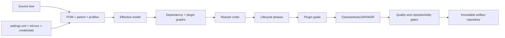
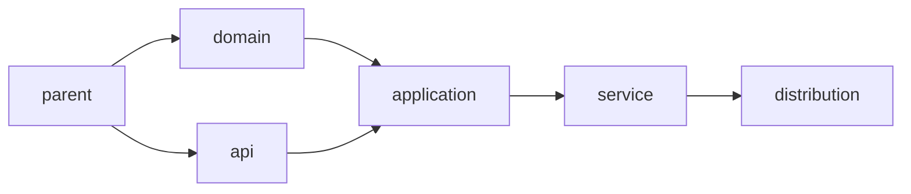
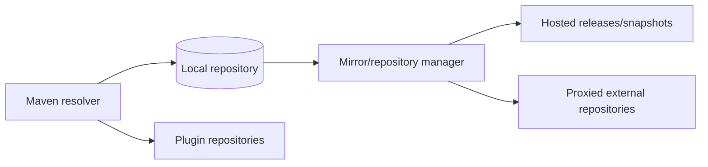

# Part 043 — Maven Build, Dependency, Plugin, and Multi-Module Engineering

> Maven bukan sekadar perintah `mvn clean package`. Maven membentuk effective project model dari POM, parent, profiles, settings, repositories, dependency metadata, plugin defaults, dan command-line properties; kemudian menjalankan plugin goals melalui lifecycle dan reactor. Build dapat lulus di laptop namun gagal di CI atau production ketika dependency graph, plugin version, JDK toolchain, repository mirror, annotation processor, test fork, shading, atau artifact publication berbeda. Build engineering bertujuan membuat hasil dapat diprediksi, diaudit, direproduksi, dan dipromosikan sebagai artifact yang sama—bukan dibangun ulang secara diam-diam pada setiap environment.

## Daftar Isi

1. [Target kompetensi](#target-kompetensi)
2. [Scope dan baseline](#scope-dan-baseline)
3. [Current Maven release reality](#current-maven-release-reality)
4. [Boundary dengan Part 041, 042, and 044](#boundary-dengan-part-041-042-and-044)
5. [Mental model Maven build](#mental-model-maven-build)
6. [Maven model versus Maven execution](#maven-model-versus-maven-execution)
7. [Coordinates and artifact identity](#coordinates-and-artifact-identity)
8. [POM as declarative project model](#pom-as-declarative-project-model)
9. [Super POM and default conventions](#super-pom-and-default-conventions)
10. [Effective POM](#effective-pom)
11. [Parent inheritance](#parent-inheritance)
12. [Aggregation versus inheritance](#aggregation-versus-inheritance)
13. [Relative parent resolution](#relative-parent-resolution)
14. [Properties and interpolation](#properties-and-interpolation)
15. [Model interpolation boundaries](#model-interpolation-boundaries)
16. [Profiles](#profiles)
17. [Profile activation](#profile-activation)
18. [Profiles are not deployment configuration](#profiles-are-not-deployment-configuration)
19. [Settings and effective settings](#settings-and-effective-settings)
20. [Global, user, and project settings](#global-user-and-project-settings)
21. [Lifecycle mental model](#lifecycle-mental-model)
22. [Built-in lifecycles](#built-in-lifecycles)
23. [Default lifecycle phases](#default-lifecycle-phases)
24. [Phase versus goal](#phase-versus-goal)
25. [Packaging and default lifecycle bindings](#packaging-and-default-lifecycle-bindings)
26. [Plugin executions](#plugin-executions)
27. [Execution IDs and merge behavior](#execution-ids-and-merge-behavior)
28. [PluginManagement versus plugins](#pluginmanagement-versus-plugins)
29. [Plugin versions](#plugin-versions)
30. [Plugin dependencies](#plugin-dependencies)
31. [Build extensions](#build-extensions)
32. [Maven core extensions](#maven-core-extensions)
33. [Reactor mental model](#reactor-mental-model)
34. [Reactor sort order](#reactor-sort-order)
35. [Selected-project builds](#selected-project-builds)
36. [Resume and failure behavior](#resume-and-failure-behavior)
37. [Parallel reactor builds](#parallel-reactor-builds)
38. [Thread-safe plugins](#thread-safe-plugins)
39. [Multi-module architecture](#multi-module-architecture)
40. [Parent POM module](#parent-pom-module)
41. [BOM module](#bom-module)
42. [Library and service modules](#library-and-service-modules)
43. [Dependency mechanism](#dependency-mechanism)
44. [Transitive dependencies](#transitive-dependencies)
45. [Nearest-definition mediation](#nearest-definition-mediation)
46. [Dependency scopes](#dependency-scopes)
47. [Compile scope](#compile-scope)
48. [Provided scope](#provided-scope)
49. [Runtime scope](#runtime-scope)
50. [Test scope](#test-scope)
51. [System and import scopes](#system-and-import-scopes)
52. [Optional dependencies](#optional-dependencies)
53. [Exclusions](#exclusions)
54. [DependencyManagement](#dependencymanagement)
55. [Bill of Materials](#bill-of-materials)
56. [BOM import order and ownership](#bom-import-order-and-ownership)
57. [Direct dependency declarations](#direct-dependency-declarations)
58. [Version ranges and dynamic versions](#version-ranges-and-dynamic-versions)
59. [Snapshots](#snapshots)
60. [Dependency convergence](#dependency-convergence)
61. [Upper-bound dependency rules](#upper-bound-dependency-rules)
62. [Duplicate classes and split packages](#duplicate-classes-and-split-packages)
63. [Dependency tree and effective classpath](#dependency-tree-and-effective-classpath)
64. [Plugin classpath versus project classpath](#plugin-classpath-versus-project-classpath)
65. [Annotation processors](#annotation-processors)
66. [Generated sources](#generated-sources)
67. [JPMS and module path](#jpms-and-module-path)
68. [JAX-RS API and implementation dependencies](#jax-rs-api-and-implementation-dependencies)
69. [Provided APIs and runtime ownership](#provided-apis-and-runtime-ownership)
70. [Jersey modules and provider discovery](#jersey-modules-and-provider-discovery)
71. [ServiceLoader resources](#serviceloader-resources)
72. [Compile plugin](#compile-plugin)
73. [`--release` versus source and target](#release-versus-source-and-target)
74. [Toolchains](#toolchains)
75. [Maven runtime JDK versus build toolchain JDK](#maven-runtime-jdk-versus-build-toolchain-jdk)
76. [Multi-release JAR boundary](#multi-release-jar-boundary)
77. [Resource processing](#resource-processing)
78. [Resource filtering risks](#resource-filtering-risks)
79. [Encoding and locale](#encoding-and-locale)
80. [Surefire](#surefire)
81. [Failsafe](#failsafe)
82. [Test discovery conventions](#test-discovery-conventions)
83. [Forked JVMs](#forked-jvms)
84. [Test classpath and module path](#test-classpath-and-module-path)
85. [JaCoCo and instrumentation order](#jacoco-and-instrumentation-order)
86. [JAR packaging](#jar-packaging)
87. [WAR packaging](#war-packaging)
88. [Thin JAR versus fat JAR](#thin-jar-versus-fat-jar)
89. [Shade plugin](#shade-plugin)
90. [Relocation](#relocation)
91. [Resource transformers](#resource-transformers)
92. [Minimization risks](#minimization-risks)
93. [Assembly and dependency-copy patterns](#assembly-and-dependency-copy-patterns)
94. [Application server packaging](#application-server-packaging)
95. [Manifest and main class](#manifest-and-main-class)
96. [Source and Javadoc artifacts](#source-and-javadoc-artifacts)
97. [Repository mental model](#repository-mental-model)
98. [Local repository](#local-repository)
99. [Remote repositories](#remote-repositories)
100. [Mirrors](#mirrors)
101. [Repository managers](#repository-managers)
102. [Plugin repositories](#plugin-repositories)
103. [Repository policy and snapshots](#repository-policy-and-snapshots)
104. [Credentials and servers](#credentials-and-servers)
105. [Encrypted Maven passwords](#encrypted-maven-passwords)
106. [Checksums and signatures](#checksums-and-signatures)
107. [Offline builds](#offline-builds)
108. [Repository poisoning and shadowing](#repository-poisoning-and-shadowing)
109. [Maven Wrapper](#maven-wrapper)
110. [Wrapper distribution modes](#wrapper-distribution-modes)
111. [Maven Daemon boundary](#maven-daemon-boundary)
112. [CI-friendly versions](#ci-friendly-versions)
113. [Release versioning](#release-versioning)
114. [Release artifact immutability](#release-artifact-immutability)
115. [Deploy versus install](#deploy-versus-install)
116. [Staging and promotion](#staging-and-promotion)
117. [Reproducible builds](#reproducible-builds)
118. [`project.build.outputTimestamp`](#projectbuildoutputtimestamp)
119. [Sources of nondeterminism](#sources-of-nondeterminism)
120. [Rebuild verification](#rebuild-verification)
121. [Build provenance and SBOM](#build-provenance-and-sbom)
122. [Dependency vulnerability scanning](#dependency-vulnerability-scanning)
123. [License and policy checks](#license-and-policy-checks)
124. [Maven Enforcer](#maven-enforcer)
125. [Common Enforcer rules](#common-enforcer-rules)
126. [Ban and allow-list policies](#ban-and-allow-list-policies)
127. [Build caching](#build-caching)
128. [Maven build cache boundary](#maven-build-cache-boundary)
129. [CI workspace and local-repository caching](#ci-workspace-and-local-repository-caching)
130. [Cache poisoning and stale metadata](#cache-poisoning-and-stale-metadata)
131. [Maven 4 migration boundary](#maven-4-migration-boundary)
132. [Maven 4 model and build changes](#maven-4-model-and-build-changes)
133. [Maven Upgrade Tool](#maven-upgrade-tool)
134. [Troubleshooting toolkit](#troubleshooting-toolkit)
135. [`help:effective-pom`](#helpeffective-pom)
136. [`help:effective-settings`](#helpeffective-settings)
137. [`dependency:tree`](#dependencytree)
138. [`dependency:analyze`](#dependencyanalyze)
139. [Debug logging](#debug-logging)
140. [Build consumer versus producer behavior](#build-consumer-versus-producer-behavior)
141. [Failure-model matrix](#failure-model-matrix)
142. [Debugging playbook](#debugging-playbook)
143. [Architecture patterns](#architecture-patterns)
144. [Anti-patterns](#anti-patterns)
145. [PR review checklist](#pr-review-checklist)
146. [Trade-off yang harus dipahami senior engineer](#trade-off-yang-harus-dipahami-senior-engineer)
147. [Internal verification checklist](#internal-verification-checklist)
148. [Latihan verifikasi](#latihan-verifikasi)
149. [Ringkasan](#ringkasan)
150. [Referensi resmi](#referensi-resmi)

---

## Target kompetensi

Setelah menyelesaikan part ini, Anda harus mampu:

- menjelaskan bagaimana Maven membentuk effective model dari POM, parent, profiles, settings, dan CLI;
- membedakan lifecycle phase, plugin goal, execution, packaging binding, dan reactor;
- mendesain multi-module structure yang memisahkan parent, BOM, libraries, service, and distribution modules;
- memahami transitive dependency mediation, scopes, optional dependencies, exclusions, and dependency management;
- mengelola BOM import without losing ownership of versions;
- mendeteksi dependency convergence, duplicate classes, split packages, and runtime classpath drift;
- membedakan project dependency classpath, plugin classpath, annotation-processor path, and module path;
- menggunakan toolchains so Maven runtime JDK and compilation/test JDK are explicit;
- mengkonfigurasi Surefire, Failsafe, JaCoCo, compiler, resources, JAR/WAR, and Shade deliberately;
- memilih thin JAR, fat JAR, WAR, or distribution layout based on runtime architecture;
- mengoperasikan local/remote repositories, mirrors, repository managers, credentials, and snapshot policies;
- menggunakan Maven Wrapper and CI-friendly versions;
- membuat immutable release and promote the same artifact;
- menghasilkan reproducible JAR/WAR artifacts and verify rebuilds;
- menambahkan Enforcer, dependency policy, SBOM, signature, and vulnerability gates;
- mendiagnosis effective POM, dependency tree, plugin execution, and CI/local differences;
- memahami bahwa Maven 4 remains a preview boundary until officially declared production-safe.

---

## Scope dan baseline

Baseline:

- Java 17+ source baseline;
- Maven 3.9.x as current stable family;
- Maven 4 concepts are discussed as migration/preview boundary;
- multi-module JAX-RS/Jersey backend;
- JUnit/Surefire/Failsafe from Part 041;
- Docker image assembly follows in Part 044;
- internal artifact repository manager may exist;
- CI/CD and release pipelines are external to Maven but invoke it.

Part ini **tidak mengasumsikan**:

- Maven 4 is production-approved;
- exact stable Maven patch version in internal agents;
- one parent/BOM architecture;
- one artifact repository vendor;
- Maven Central direct access is allowed;
- WAR or fat JAR packaging;
- Spring Boot plugin;
- Shade plugin is required;
- internal shared parent POM;
- build cache is enabled;
- release plugin is used;
- dependency lockfile exists;
- current CSG repository topology.

---

## Current Maven release reality

As of July 2026, the official Maven download page lists:

- Maven 3.9.16 as current stable/recommended release;
- Maven 4.0.0-rc-5 as preview;
- Maven 4 requiring JDK 17 to execute;
- official warning that Maven 4 preview is not yet safe for production use.

Do not hard-code these exact versions into long-lived architecture policy. Instead maintain a verified supported-version matrix.

---

## Boundary dengan Part 041, 042, and 044

| Part | Fokus |
|---|---|
| Part 041 | Test strategy and evidence |
| Part 042 | Performance measurement and capacity |
| Part 043 | Build model, dependencies, plugins, artifacts, repositories, release |
| Part 044 | Container image construction, runtime filesystem/process, and supply chain |

Maven should produce a deterministic application artifact. Docker should consume that artifact or execute a controlled Maven build stage without changing application semantics.

---

## Mental model Maven build



Build correctness requires both the model and execution environment.

---

## Maven model versus Maven execution

Model answers:

- project identity;
- dependencies;
- plugins;
- modules;
- repositories;
- properties;
- profiles.

Execution answers:

- requested phase/goal;
- reactor selection;
- Maven/JDK versions;
- settings and credentials;
- available repositories;
- environment and CLI properties;
- parallelism;
- filesystem and locale.

The same POM can behave differently under different execution context.

---

## Coordinates and artifact identity

Canonical coordinates:

```text
groupId:artifactId:packaging:classifier:version
```

Examples:

```text
com.example.quote:quote-domain:jar:1.4.2
com.example.quote:quote-service:jar:tests:1.4.2
```

Coordinates must identify immutable release content.

---

## POM as declarative project model

POM declares what a project is and how plugins participate.

Avoid turning POM into an imperative shell-script replacement through excessive Ant executions or OS-specific command chains.

---

## Super POM and default conventions

Every POM inherits defaults from Maven's Super POM and packaging lifecycle mappings.

Defaults may change across major Maven/plugin versions. Explicitly pin production-relevant plugin versions and inspect effective POM.

---

## Effective POM

Effective POM results from merging:

- Super POM;
- parent hierarchy;
- current POM;
- active profiles;
- interpolation;
- model rules.

Use it to answer “what Maven actually sees.”

---

## Parent inheritance

Inherited elements include many properties, dependency/plugin management, build configuration, and metadata.

Not every element inherits identically. Module aggregation is separate.

Parent should define organization-wide defaults and policies, not application-specific dependencies that every child accidentally receives.

---

## Aggregation versus inheritance

Aggregator:

```xml
<packaging>pom</packaging>
<modules>
  <module>quote-domain</module>
  <module>quote-service</module>
</modules>
```

Parent inheritance uses `<parent>`.

A project can be aggregator, parent, both, or neither.

Keep distinction explicit because reactor and model inheritance solve different problems.

---

## Relative parent resolution

Maven may resolve parent from relative path before repository, depending configuration.

For released reusable parent, consider explicit empty `<relativePath/>` to avoid accidentally using a local sibling POM.

Verify internal standard.

---

## Properties and interpolation

Use properties for governed versions and common settings:

```xml
<properties>
  <maven.compiler.release>17</maven.compiler.release>
  <project.build.sourceEncoding>UTF-8</project.build.sourceEncoding>
  <junit.version>6.1.1</junit.version>
</properties>
```

Avoid creating a second programming language in property indirection.

---

## Model interpolation boundaries

Interpolation timing differs between model fields and plugin runtime parameters.

Environment and system properties can make model non-reproducible.

Do not embed secrets in POM properties.

---

## Profiles

Profiles modify the effective model.

Use for build-environment concerns such as:

- optional integration tests;
- JDK-specific compilation;
- artifact-signing in release;
- platform-native modules.

Avoid using profiles for DEV/UAT/PROD application configuration.

---

## Profile activation

Activation sources include:

- explicit `-P`;
- property;
- JDK;
- OS;
- file existence;
- active profiles in settings.

Implicit activation can surprise CI. Report active profiles in build diagnostics.

---

## Profiles are not deployment configuration

Bad:

```xml
<profile id="prod">
  <properties>
    <database.password>...</database.password>
  </properties>
</profile>
```

The build artifact should remain environment-neutral. Runtime config belongs to deployment/configuration systems.

---

## Settings and effective settings

`settings.xml` configures execution-user/environment concerns:

- local repository;
- mirrors;
- proxies;
- servers/credentials;
- profiles;
- plugin groups.

Do not commit personal credentials.

---

## Global, user, and project settings

Maven supports global and user settings; newer Maven tooling may support project-scoped settings patterns depending version.

CI should supply a controlled settings file and disclose its hash/source without exposing secrets.

---

## Lifecycle mental model

Lifecycle is ordered phases. Plugins bind goals to phases.

Invoking a later phase executes earlier phases in that lifecycle.

---

## Built-in lifecycles

Maven defines three built-in lifecycles:

- `clean`;
- `default`;
- `site`.

`clean package` invokes phases from two separate lifecycles sequentially.

---

## Default lifecycle phases

Important phases include:

```text
validate
compile
test
package
verify
install
deploy
```

There are additional integration-test setup/teardown phases.

Prefer invoking `verify` for full local/CI correctness rather than `package` if integration/quality gates bind later.

---

## Phase versus goal

Phase:

```text
mvn verify
```

Goal:

```text
mvn dependency:tree
mvn help:effective-pom
```

Direct goal invocation may bypass lifecycle assumptions.

---

## Packaging and default lifecycle bindings

Packaging such as `jar`, `war`, and `pom` determines default plugin bindings.

A custom packaging type can require extensions and adds maintenance risk.

---

## Plugin executions

A plugin can have multiple executions with:

- ID;
- goals;
- phase;
- configuration.

Example:

```xml
<plugin>
  <groupId>org.apache.maven.plugins</groupId>
  <artifactId>maven-failsafe-plugin</artifactId>
  <version>${maven.failsafe.version}</version>
  <executions>
    <execution>
      <id>integration-tests</id>
      <goals>
        <goal>integration-test</goal>
        <goal>verify</goal>
      </goals>
    </execution>
  </executions>
</plugin>
```

---

## Execution IDs and merge behavior

Parent and child executions with same ID can merge/override according to model rules.

Use stable, meaningful IDs and inspect effective POM after parent changes.

---

## PluginManagement versus plugins

`pluginManagement` defines versions/default configuration for child opt-in.

`plugins` activates/configures plugin in current project and can be inherited.

Do not assume a plugin in `pluginManagement` runs.

---

## Plugin versions

Pin plugin versions.

Unpinned plugins make builds dependent on Maven defaults or repository metadata and weaken reproducibility.

Govern compiler, resources, Surefire, Failsafe, JAR/WAR, Shade, Enforcer, source, Javadoc, deploy, and release-related plugins.

---

## Plugin dependencies

Plugins have their own dependency graph.

Overriding plugin dependencies can fix compatibility but may break plugin internals. Document why and remove when upstream resolves it.

---

## Build extensions

Build extensions can participate in artifact handlers, transports, lifecycle, and model resolution.

They execute with powerful access to the build. Pin, review, and minimize them.

---

## Maven core extensions

`.mvn/extensions.xml` can load core extensions.

Core extensions affect the entire build and supply-chain trust boundary.

---

## Reactor mental model

The reactor collects selected projects, sorts them by inter-project relationships, and builds them in order.



---

## Reactor sort order

Sort order considers actual project references such as dependencies and plugin relationships, not simply `<modules>` order.

Dependency management alone generally does not create build ordering without an actual reference.

---

## Selected-project builds

Common options:

```text
-pl module
-am
-amd
-rf
```

Selected builds can skip required quality gates or produce misleading local repository state. CI should define supported commands.

---

## Resume and failure behavior

Maven can fail fast, fail at end, or resume depending flags/version.

A resumed build may reuse artifacts in local repository from prior partial execution. Clean workspace or verify provenance when correctness matters.

---

## Parallel reactor builds

`-T` can build modules concurrently.

Risks:

- non-thread-safe plugins;
- shared generated files;
- fixed ports;
- integration test resource collisions;
- repository-manager pressure;
- nondeterministic logs.

Measure and verify.

---

## Thread-safe plugins

Plugin metadata may declare thread safety, but custom scripts/extensions and external resources may still conflict.

Parallel-safe build is an end-to-end property.

---

## Multi-module architecture

Example:

```text
quote-order-parent/
  pom.xml
  quote-order-bom/
  quote-domain/
  quote-application/
  quote-adapter-jaxrs/
  quote-adapter-postgres/
  quote-service/
  quote-distribution/
```

Avoid one module per package or a single module containing unrelated deployables.

---

## Parent POM module

Parent owns:

- plugin versions/configuration;
- Java/toolchain policy;
- encoding;
- quality gates;
- organization metadata;
- common properties.

Parent should not force runtime dependencies into every child.

---

## BOM module

BOM owns dependency versions and compatibility set.

It should not contain build plugin configuration as its primary purpose.

Separate parent and BOM when consumers need version alignment without inheriting build policy.

---

## Library and service modules

Library module publishes reusable API/implementation.

Service module produces deployable artifact and should own runtime closure.

Do not let internal module boundaries become accidental public APIs.

---

## Dependency mechanism

Maven resolves dependency graph from direct POM declarations and transitive metadata.

Resolution is not simply “highest version wins.”

---

## Transitive dependencies

A direct dependency can bring many artifacts.

Treat each transitive artifact as supply-chain and classpath input.

---

## Nearest-definition mediation

When multiple versions appear, Maven typically chooses the nearest definition in dependency tree; ties can depend on declaration order.

Declare important versions directly or in dependency management.

---

## Dependency scopes

Scope controls availability across compile, runtime, test, and transitivity.

Mis-scoping often causes production `ClassNotFoundException` or artifact bloat.

---

## Compile scope

Default scope. Available in compile/runtime/test and generally transitive.

Use only when consumers or runtime truly require the dependency.

---

## Provided scope

Compile/test available, expected from runtime container/platform.

Typical for Jakarta APIs when deploying to a compliant application server.

Incorrect use in standalone runtime causes missing classes.

---

## Runtime scope

Not needed to compile application code but needed at runtime, such as some drivers/implementations.

Ensure packaging/container includes it.

---

## Test scope

Only test compilation/execution.

Test utility APIs accidentally referenced from main code expose scope mistakes.

---

## System and import scopes

`system` uses local filesystem path and is non-portable; avoid.

`import` is for POM dependencies inside `dependencyManagement`, typically BOM imports.

---

## Optional dependencies

Optional means downstream consumers do not inherit it transitively.

It does not mean optional at runtime for the declaring module.

Use for feature integrations where consumer must opt in.

---

## Exclusions

Exclusion removes one transitive edge.

Every exclusion needs a reason and compatibility test. It can create runtime gaps.

---

## DependencyManagement

Dependency management supplies versions and other defaults when dependency is declared.

It does not add the dependency to classpath by itself.

---

## Bill of Materials

BOM is a POM imported in `dependencyManagement`:

```xml
<dependency>
  <groupId>com.example.platform</groupId>
  <artifactId>enterprise-bom</artifactId>
  <version>${platform.version}</version>
  <type>pom</type>
  <scope>import</scope>
</dependency>
```

Use a BOM as tested compatibility set.

---

## BOM import order and ownership

Multiple BOMs can manage the same artifact. Effective result can depend on management order and explicit overrides.

Define ownership:

- Jakarta platform;
- Jersey;
- observability;
- cloud SDK;
- testing.

Avoid uncontrolled “BOM soup.”

---

## Direct dependency declarations

Declare libraries your code directly uses even if currently transitive.

This documents API dependency and protects against parent dependency graph changes.

---

## Version ranges and dynamic versions

Avoid ranges, `LATEST`, `RELEASE`, and floating versions for production builds.

They make rebuild content time-dependent.

---

## Snapshots

Snapshots are mutable development versions.

Repository metadata resolves timestamped snapshot builds.

Do not release production from unresolved mutable snapshots unless policy explicitly accepts it.

---

## Dependency convergence

Convergence means one selected version per coordinate path as required by policy.

Even when Maven mediates one version, callers compiled against another can be incompatible.

Use Enforcer and integration tests.

---

## Upper-bound dependency rules

“Require upper bound” policies try to ensure resolved version is not lower than versions requested transitively.

Higher is not automatically compatible. Use it as signal, not semantic proof.

---

## Duplicate classes and split packages

Different artifacts can contain same class/package.

Symptoms:

- classpath-order behavior;
- linkage errors;
- service discovery confusion;
- JPMS split-package failure.

Scan packaged artifact and dependency graph.

---

## Dependency tree and effective classpath

Use filtered verbose trees and classpath output to understand:

- omitted versions;
- scopes;
- optional/excluded paths;
- conflict winner;
- duplicate sources.

Do not debug only from top-level dependency list.

---

## Plugin classpath versus project classpath

Plugin code runs in plugin realm with its own dependencies.

Adding dependency to project does not necessarily change plugin behavior, and vice versa.

---

## Annotation processors

Processors execute during compilation and can generate code/resources.

Pin versions and isolate processor path where supported.

They are build-time executable code with supply-chain risk.

---

## Generated sources

Generated sources must be:

- deterministic;
- added to compile roots;
- cleaned;
- not manually edited;
- version-compatible;
- included/excluded from source control by policy.

---

## JPMS and module path

Maven/compiler/Surefire can use classpath or module path.

Automatic module names, split packages, reflection, and test patching can differ.

Decide explicitly; do not accidentally enter module-path mode after adding `module-info.java`.

---

## JAX-RS API and implementation dependencies

Separate:

- Jakarta REST API;
- Jersey server/client modules;
- servlet/container integration;
- JSON/XML providers;
- HK2/CDI integration;
- Grizzly/Jetty/other runtime.

Do not depend on implementation transitively through unrelated module.

---

## Provided APIs and runtime ownership

Application server deployment:

```text
Jakarta APIs → provided
server implementation → platform-owned
```

Standalone deployment:

```text
JAX-RS implementation and server connector → runtime dependencies/package
```

Test both actual packaging modes.

---

## Jersey modules and provider discovery

Jersey features/providers may require explicit modules and registration.

A successful compile does not prove runtime provider discovery.

---

## ServiceLoader resources

Fat JAR assembly must merge `META-INF/services/*` when required.

Overwriting instead of merging can remove providers, logging bindings, drivers, or annotation metadata.

---

## Compile plugin

Pin compiler plugin and configure `release`/annotation processors/warnings deliberately.

Enable warnings policy without making generated code unusable.

---

## `--release` versus source and target

`--release` constrains language, bytecode, and documented JDK API surface for target release.

`source` + `target` alone can still compile against APIs unavailable on target runtime.

---

## Toolchains

Toolchains let plugins select JDK tools independently of the JDK running Maven.

Use to standardize compile/test/Javadoc JDKs across developer and CI.

---

## Maven runtime JDK versus build toolchain JDK

Example:

```text
Maven 3.9 runs on JDK 21
compiler toolchain builds --release 17
integration tests run on JDK 17 and 21 matrix
```

Record both in build provenance.

---

## Multi-release JAR boundary

Multi-release JAR can contain version-specific classes under `META-INF/versions`.

It adds testing and packaging complexity. Use only for library needs with multi-JDK matrix.

---

## Resource processing

Resources plugin copies/filter resources.

Separate filtered configuration templates from binary/static resources.

---

## Resource filtering risks

Filtering can corrupt binary files or replace `${...}` intended for runtime/framework.

Use explicit includes and delimiters.

Never filter secrets into artifact.

---

## Encoding and locale

Set source/resource/report encodings and test locale/timezone where behavior matters.

Build should not depend on workstation default encoding.

---

## Surefire

Surefire runs unit-style tests during `test`.

Pin version and configure JUnit Platform, forks, module path, system properties, and reports.

---

## Failsafe

Failsafe runs integration tests across `integration-test` and `verify`.

Failure is finalized in `verify`, allowing post-integration cleanup phases.

Invoke `verify`, not direct `integration-test`, in CI.

---

## Test discovery conventions

File naming controls default discovery.

Use explicit conventions such as:

```text
*Test.java
*Tests.java
*IT.java
```

Align Surefire/Failsafe to avoid double execution or missing tests.

---

## Forked JVMs

Forks isolate tests but consume memory/processes.

Configure:

- fork count;
- reuse;
- heap/native limits;
- argLine;
- environment;
- parallelism.

CI OOM can originate from test forks plus containers.

---

## Test classpath and module path

Test execution may differ from production classpath due to test-scope libraries and module-path patching.

Add packaged-artifact smoke test.

---

## JaCoCo and instrumentation order

JaCoCo agent commonly injects `argLine` for test forks.

Other plugins/profiles overriding `argLine` can remove it.

Use late property evaluation patterns supported by plugins and inspect command line.

---

## JAR packaging

JAR includes compiled classes/resources and manifest.

A normal JAR does not automatically contain dependencies.

---

## WAR packaging

WAR can package web resources and libraries under standard layout.

Use when Servlet/application server owns runtime.

Review duplicate platform libraries and `provided` scopes.

---

## Thin JAR versus fat JAR

Thin JAR:

- dependencies external;
- smaller app artifact;
- runtime classpath assembly needed.

Fat JAR:

- single distributable;
- resource/class collisions;
- larger rebuild/layer churn;
- license/metadata concerns.

---

## Shade plugin

Shade builds uber JAR and can relocate packages/transform resources.

Test runtime discovery and signatures.

---

## Relocation

Relocation changes package names to isolate dependency conflicts.

It can break:

- reflection;
- serialized names;
- service descriptors;
- config strings;
- JPMS metadata.

Use only for deliberate library isolation.

---

## Resource transformers

Transformers may merge:

- services;
- manifests;
- properties;
- license/notice files.

Review all collision behavior.

---

## Minimization risks

Shade minimization attempts remove apparently unused classes.

Reflection, CDI, JAX-RS provider discovery, JAXB, ServiceLoader, and serialization may look unused statically.

Avoid unless extensive runtime tests prove correctness.

---

## Assembly and dependency-copy patterns

Alternative distribution:

```text
app.jar
lib/*.jar
conf/
```

This improves Docker layer caching and classpath visibility but requires launcher/classpath management.

---

## Application server packaging

For external container, package only app-owned libraries and APIs according to server contract.

Test against exact server version.

---

## Manifest and main class

Define:

- `Main-Class` if executable;
- implementation/build metadata;
- automatic module name if needed;
- classpath only if deployment strategy uses it.

Avoid timestamps or environment-specific metadata in reproducible artifact unless controlled.

---

## Source and Javadoc artifacts

Libraries/public artifacts often publish source and Javadoc JARs.

Pin plugins and use same release toolchain.

---

## Repository mental model



Repository resolution is part of the software supply chain.

---

## Local repository

Local repository is cache plus installed artifacts/metadata.

It can be corrupted or polluted by locally installed unreleased versions.

CI should use controlled cache/workspace and avoid relying on developer-local installs.

---

## Remote repositories

Prefer centrally managed repositories.

Do not add arbitrary third-party repositories to application POM because they affect every consumer and widen trust.

---

## Mirrors

Settings mirrors redirect repository requests to approved repository manager.

Mirror patterns and ordering require testing.

A mirror is not merely a faster cache; it is a policy boundary.

---

## Repository managers

Repository manager can provide:

- proxy/cache;
- hosted releases/snapshots;
- quarantine;
- policy/scanning;
- retention;
- access control;
- audit.

Separate immutable releases from mutable snapshots.

---

## Plugin repositories

Plugins resolve separately from project dependencies.

Avoid untrusted plugin repositories. Plugins execute code during build.

---

## Repository policy and snapshots

Configure release/snapshot enablement, update policy, and checksum policy.

CI release build should not silently resolve newer snapshot metadata mid-run.

---

## Credentials and servers

Credentials belong in settings `<servers>` referenced by server ID.

Use CI secret injection and least privilege.

Never place plaintext credentials in POM or command logs.

---

## Encrypted Maven passwords

Maven supports password encryption mechanisms, but encryption key handling and threat model must be understood.

CI secret managers are usually stronger than committed encrypted values.

---

## Checksums and signatures

Verify Maven distribution signatures/checksums and artifact repository integrity according to policy.

A checksum detects corruption, not publisher trust by itself.

---

## Offline builds

`-o` proves dependencies/plugins are locally available but does not guarantee clean-room reproducibility.

A controlled repository snapshot or dependency preload is needed.

---

## Repository poisoning and shadowing

Risks:

- malicious coordinate in public repository;
- internal/public namespace collision;
- mutable snapshot;
- compromised repository credential;
- plugin execution.

Reserve internal group IDs and route through policy-controlled manager.

---

## Maven Wrapper

Wrapper provides project-pinned Maven distribution invocation:

```text
./mvnw verify
mvnw.cmd verify
```

Commit wrapper scripts/config according to security policy.

---

## Wrapper distribution modes

Wrapper can use different download/distribution modes depending wrapper version.

Pin URL/version/checksum and avoid opaque unverified downloads.

---

## Maven Daemon boundary

`mvnd` can improve local/repeated build startup and parallelism.

Daemon state can retain JDK/environment/classloader effects. CI adoption requires reproducibility and isolation review.

---

## CI-friendly versions

Maven supports placeholders such as:

```text
${revision}
${sha1}
${changelist}
```

Use only supported patterns and flatten/publish consumer POM correctly when required.

---

## Release versioning

Version should identify source and artifact immutably.

Do not reuse a released version.

Choose semantic/calendar/release-train convention and document compatibility meaning.

---

## Release artifact immutability

Build once, test once, sign once, then promote the same bytes across environments.

Do not rebuild JAR/WAR for UAT and PROD with different profile properties.

---

## Deploy versus install

`install` writes artifact into local repository.

`deploy` publishes to remote repository.

CI stages should prevent accidental snapshot/release destination confusion.

---

## Staging and promotion

Preferred flow:

```text
build candidate
  → verify
  → publish immutable candidate
  → policy/signature approval
  → promote repository metadata/tag
```

Promotion should not alter bytes.

---

## Reproducible builds

A reproducible build produces byte-for-byte identical output from identical declared inputs and controlled environment.

It improves audit and tamper detection.

---

## `project.build.outputTimestamp`

Set a controlled timestamp for ZIP/JAR entries:

```xml
<project.build.outputTimestamp>
  ${env.SOURCE_DATE_EPOCH}
</project.build.outputTimestamp>
```

or a fixed/CI-provided value according to Maven/plugin support.

---

## Sources of nondeterminism

Examples:

- archive timestamps;
- file order;
- generated metadata;
- locale/timezone;
- random IDs;
- absolute paths;
- non-pinned dependencies/plugins;
- generated source order;
- manifest build host/user;
- resource line endings;
- JDK version.

---

## Rebuild verification

Process:

1. clean environment;
2. fetch declared source/dependencies;
3. build with pinned toolchain;
4. compare hashes;
5. inspect differences with archive diff tools;
6. retain evidence.

---

## Build provenance and SBOM

Generate component inventory and provenance at JAR/image layers.

Maven dependency SBOM and container SBOM answer overlapping but different questions.

Link source commit, Maven artifact hash, image digest, and attestations.

---

## Dependency vulnerability scanning

Scan direct and transitive dependencies.

Policy needs:

- severity;
- exploitability/context;
- suppression owner/expiry;
- fix availability;
- runtime reachability limitations;
- snapshot freshness.

Do not blindly fail on every database entry without triage.

---

## License and policy checks

Track licenses, notices, prohibited groups/artifacts, and cryptography/export concerns where applicable.

Generated fat JAR/image must retain required notices.

---

## Maven Enforcer

Enforcer runs policy rules during build.

Use early `validate` phase for fast feedback.

---

## Common Enforcer rules

Examples:

- require Maven/JDK versions;
- dependency convergence;
- require upper-bound dependencies;
- banned dependencies;
- require release dependencies;
- duplicate classes via additional rules;
- enforce bytecode version.

Rule availability depends on plugin/additional-rule version.

---

## Ban and allow-list policies

Ban known-problematic artifacts/groups and require approved APIs.

Every exception must have rationale, owner, and expiry.

---

## Build caching

Caching can reuse outputs when inputs match.

Correct cache key must include:

- source/resources;
- POM/effective config;
- JDK/toolchain;
- plugin/dependency versions;
- environment inputs;
- generated-code inputs.

---

## Maven build cache boundary

Maven build-cache capabilities vary by extension/version and may still require organizational evaluation.

Do not assume experimental cache produces release-safe evidence.

---

## CI workspace and local-repository caching

Caching `.m2/repository` speeds downloads but can preserve:

- corrupted artifacts;
- stale metadata;
- locally installed modules;
- snapshots;
- partial downloads.

Use immutable cache keys and periodic clean rebuild.

---

## Cache poisoning and stale metadata

Treat CI caches as untrusted acceleration, not authoritative repository.

Verify checksums and repository source; do not cache secrets/settings.

---

## Maven 4 migration boundary

Maven 4 introduces model/execution improvements and stricter behavior, but as of July 2026 official download guidance still treats release candidates as preview and not production-safe.

Run compatibility CI without replacing stable release until approved.

---

## Maven 4 model and build changes

Potential migration areas include:

- stricter model validation;
- new POM/model capabilities;
- root project semantics;
- reactor behavior;
- plugin compatibility;
- consumer/build POM separation;
- JDK 17 runtime requirement.

Use official migration documentation for selected RC/final version.

---

## Maven Upgrade Tool

Official Maven site exposes an Upgrade Tool for migration assistance.

Generated changes still require review and full build/release verification.

---

## Troubleshooting toolkit

Always capture:

```text
mvn -version
wrapper configuration
active profiles
effective POM/settings
dependency tree
plugin versions
JDK/toolchain
repository/mirror IDs
full error with -e/-X when needed
```

Redact credentials.

---

## `help:effective-pom`

Use to inspect inherited and profile-activated model.

Optionally include verbose origin comments where supported.

---

## `help:effective-settings`

Use to confirm mirrors, profiles, proxies, and server IDs without exposing secret values.

---

## `dependency:tree`

Use filters and verbose output to locate mediation path.

Example:

```text
mvn dependency:tree -Dincludes=com.fasterxml.jackson.core
```

---

## `dependency:analyze`

Find used-undeclared and unused-declared dependencies.

Reflection, ServiceLoader, annotation processors, and runtime-only use can cause false positives; review rather than auto-delete.

---

## Debug logging

`-X` reveals model/resolver/plugin details but can expose environment, URLs, or headers.

Use temporarily and protect logs.

---

## Build consumer versus producer behavior

A project build can consume rich parent/profile model, while published consumers should receive a clean POM with resolvable versions and no local-only placeholders.

Validate published POM, not just JAR.

---

## Failure-model matrix

| Failure | Impact | Detection | Response |
|---|---|---|---|
| Plugin version unpinned | build changes over time | effective POM diff | pin in parent |
| Parent adds runtime dependency globally | classpath bloat/coupling | dependency tree | use management, not dependencies |
| BOM conflict hidden by order | wrong library family | effective management | explicit owner/override tests |
| Transitive API used undeclared | break after graph change | dependency analyze/compile | direct declaration |
| `provided` in standalone app | runtime missing class | packaged smoke test | runtime scope/package |
| Platform API packaged in WAR | classloader conflict | server integration | provided scope |
| Duplicate classes | unpredictable class loading | scan/enforcer | converge/exclude |
| Shade overwrites services | missing provider | runtime test | service transformer |
| Shade minimization removes reflective class | production failure | integration/native path | disable/keep rules |
| Annotation processor floats | generated-code drift | build diff | pin processor path |
| `source/target` uses newer API | runtime linkage error | target-JDK test | `--release`/toolchain |
| Profile embeds environment config | different artifacts per env | hash comparison | runtime config |
| Integration tests bound but CI runs package | missing verification | pipeline audit | run verify |
| `integration-test` called directly | cleanup/verification skipped | CI command | invoke verify |
| Local installed artifact masks missing repo | CI-only failure | clean repo build | isolated local repo |
| Mutable snapshot in release | unreproducible binary | dependency policy | release-only dependencies |
| Direct public repositories | supply-chain bypass | POM scan | mirror/repository manager |
| CI `.m2` cache poisoned | wrong/corrupt input | clean rebuild | verify/purge cache |
| Release version redeployed | artifact ambiguity | repository policy | immutable repository |
| Rebuild per environment | untraceable drift | digest mismatch | promote same artifact |
| Maven 4 RC used as stable silently | plugin/build risk | version gate | approved stable matrix |

---

## Debugging playbook

### Works locally, fails in CI

Compare:

- Maven and JDK versions;
- wrapper usage;
- toolchains;
- settings/mirrors;
- active profiles;
- local repository pollution;
- filesystem case/line endings;
- locale/timezone;
- reactor selection;
- CI secrets/proxies.

### `ClassNotFoundException` in packaged service

Check:

- dependency scope;
- fat/thin packaging;
- Shade transformers;
- runtime dependency copy;
- provided APIs;
- classloader/container;
- duplicate versions;
- module path.

### `NoSuchMethodError` or `LinkageError`

Inspect selected runtime version and all paths in dependency tree.

Check plugin-generated/shaded copies and application-server libraries.

### Maven downloads from unexpected repository

Inspect effective settings, mirrors, POM repositories, transitive POM repositories according to resolver behavior, and plugin repositories.

### Tests missing

Check naming patterns, Surefire/Failsafe versions, JUnit engine, tags, profiles, module selection, and direct phase invocation.

### JaCoCo report empty

Check agent `argLine`, fork settings, plugin execution order, property override, excluded tests, and report phase.

### Reactor module not rebuilt

Check `-pl`, `-am`, actual dependency edge, module path, installed local artifact, and resume flags.

### Reproducible hash differs

Unpack and compare archive entries, timestamps, ordering, manifest, generated files, toolchain, line endings, and dependency/plugin versions.

---

## Architecture patterns

### Parent plus BOM separation

Parent defines build policy; BOM defines dependency compatibility.

### Layered module graph

Domain → application → adapters → service/distribution, with no reverse framework leakage.

### Build once, promote

Immutable Maven artifact becomes the input to image build/promotion.

### Enforced dependency platform

BOM + Enforcer + dependency tree report + integration tests.

### Clean-room release verification

Release pipeline uses wrapper, pinned JDK/toolchains, isolated repository, reproducible settings, and hash comparison.

### Published-POM verification

Consumer sample resolves released artifact from repository and compiles/runs.

---

## Anti-patterns

- `mvn clean package` as universal release command;
- unpinned plugins;
- dependencies declared in parent for convenience;
- dozens of overlapping BOMs;
- arbitrary repositories in POM;
- using system scope;
- dynamic/range versions;
- release with snapshots;
- environment-specific Maven profiles;
- secrets in POM/filtering;
- local JAR committed to repository;
- direct use of transitive dependencies;
- blanket exclusions without tests;
- dependency convergence ignored;
- fat JAR without service/resource merge;
- Shade minimization in reflection-heavy app without tests;
- Maven runtime JDK assumed equal target JDK;
- CI uses system Maven instead of wrapper without policy;
- calling Failsafe `integration-test` without `verify`;
- same release version overwritten;
- rebuilding artifact for each environment;
- trusting `.m2` cache as source of truth;
- adopting Maven 4 preview silently.

---

## PR review checklist

### Model and modules

- [ ] Coordinates/version/packaging correct?
- [ ] Aggregation and inheritance distinguished?
- [ ] Parent contains policy, not accidental runtime deps?
- [ ] BOM ownership clear?
- [ ] Module graph respects architecture?
- [ ] Effective POM reviewed after parent/profile changes?

### Dependencies

- [ ] Direct dependencies declared?
- [ ] Scopes match runtime?
- [ ] Optional/exclusions justified?
- [ ] No snapshot/range for release?
- [ ] Convergence/upper-bound checks?
- [ ] Duplicate-class/split-package risk?
- [ ] API/implementation boundary correct?
- [ ] Annotation processors pinned?

### Plugins and lifecycle

- [ ] Plugin versions pinned?
- [ ] Execution phase/ID deliberate?
- [ ] `pluginManagement` versus `plugins` correct?
- [ ] Thread-safe in parallel build?
- [ ] Surefire/Failsafe discovery correct?
- [ ] `verify` is CI gate?
- [ ] JaCoCo argLine preserved?
- [ ] Toolchain and compiler release explicit?

### Packaging

- [ ] JAR/WAR/thin/fat choice justified?
- [ ] ServiceLoader/resources merged?
- [ ] Provided libraries align with runtime?
- [ ] Packaged artifact smoke tested?
- [ ] Manifest/build metadata deterministic?
- [ ] Published POM usable?

### Repositories and supply chain

- [ ] Wrapper/version pinned?
- [ ] Mirror/repository manager used?
- [ ] No arbitrary plugin repositories?
- [ ] Credentials only in settings/CI secrets?
- [ ] Release repository immutable?
- [ ] SBOM/vulnerability/license policy?
- [ ] Reproducible-build controls?
- [ ] CI cache treated as acceleration only?

### Release

- [ ] Build once/promote same bytes?
- [ ] Source commit ↔ artifact hash traceable?
- [ ] No mutable snapshot inputs?
- [ ] Signature/checksum/provenance retained?
- [ ] Maven 4 compatibility tested separately?

---

## Trade-off yang harus dipahami senior engineer

| Decision | Benefit | Cost/risk |
|---|---|---|
| Shared parent | consistent policy | inheritance coupling |
| Separate BOM | reusable version alignment | more release coordination |
| Direct versions per module | explicit local control | drift |
| Imported platform BOM | tested ecosystem | override complexity |
| Thin JAR | layer/classpath clarity | runtime assembly |
| Fat JAR | single artifact | collisions/layer churn |
| WAR | container-managed platform | server coupling |
| Provided API | no duplicate platform | missing standalone runtime |
| Shade relocation | conflict isolation | reflection/metadata breakage |
| Reactor parallelism | build speed | plugin/resource races |
| More test forks | isolation/parallelism | memory/process cost |
| Wrapper | consistent Maven | wrapper supply-chain maintenance |
| mvnd | local speed | daemon-state differences |
| Snapshot dependency | fast integration | mutable/non-reproducible |
| Immutable release | auditability | disciplined promotion |
| Repository mirror | policy/control | central dependency |
| CI local-repo cache | faster downloads | stale/poison risk |
| Strict Enforcer | early consistency | exception governance |
| Reproducible build | tamper verification | plugin/environment work |
| Maven 4 early adoption | future capabilities | preview/plugin risk |

---

## Internal verification checklist

### Maven and JDK

- [ ] Maven stable version in developers/CI.
- [ ] Maven Wrapper version/distribution/checksum.
- [ ] Maven 4 evaluation status.
- [ ] Maven runtime JDK.
- [ ] compiler/test/Javadoc toolchains.
- [ ] locale/timezone/encoding.
- [ ] mvnd usage.

### Project model

- [ ] Root aggregator.
- [ ] Parent POMs.
- [ ] BOMs and import order.
- [ ] Module graph.
- [ ] Profile inventory and activation.
- [ ] CI-friendly version variables.
- [ ] effective-POM review process.

### Dependencies

- [ ] Jakarta API/platform versions.
- [ ] Jersey and server modules.
- [ ] dependency-convergence rules.
- [ ] banned dependencies/groups.
- [ ] optional/exclusion policy.
- [ ] duplicate-class scanning.
- [ ] annotation processors.
- [ ] vulnerability/license tooling.

### Plugins and tests

- [ ] compiler/resources.
- [ ] Surefire/Failsafe.
- [ ] JaCoCo.
- [ ] JAR/WAR/Shade/Assembly.
- [ ] source/Javadoc.
- [ ] Enforcer.
- [ ] SBOM/signing.
- [ ] plugin version policy.
- [ ] reactor parallelism.

### Repositories

- [ ] repository manager vendor/topology.
- [ ] mirrors and allowed remotes.
- [ ] releases/snapshots repositories.
- [ ] plugin repositories.
- [ ] checksum/signature policy.
- [ ] credentials/server IDs.
- [ ] local-repository/cache policy.
- [ ] retention/quarantine/audit.

### Packaging and release

- [ ] thin JAR/fat JAR/WAR strategy.
- [ ] runtime dependency ownership.
- [ ] manifest/build info.
- [ ] service-resource transformations.
- [ ] release versioning.
- [ ] artifact immutability.
- [ ] staging/promotion.
- [ ] reproducibility verification.
- [ ] source/artifact/image traceability.

---

## Latihan verifikasi

1. Generate effective POM and explain the origin of every production plugin execution.
2. Remove a direct dependency currently supplied transitively and observe dependency-analysis/runtime impact.
3. Introduce two incompatible transitive versions, then resolve using BOM/management and compatibility tests.
4. Build the same artifact with two clean workspaces and compare byte hashes/archive differences.
5. Run compile with Maven on one JDK and toolchain on another; prove target-runtime compatibility.
6. Package a Jersey fat JAR and validate all `META-INF/services` providers after shading.
7. Execute `package`, `integration-test`, and `verify`; document differences and cleanup behavior.
8. Build selected reactor module with and without `-am`, then identify local-repository masking.
9. Simulate repository-manager outage and verify offline/cache behavior without accepting stale snapshot silently.
10. Run a Maven 4 preview compatibility build in a non-release lane and catalog every warning/plugin issue.

---

## Ringkasan

- Maven builds an effective model before executing lifecycle/plugin goals.
- Aggregation, inheritance, lifecycle, plugin execution, and reactor are distinct concepts.
- Pin Maven through wrapper policy and pin production-relevant plugin versions.
- `dependencyManagement` and BOMs manage versions but do not add dependencies.
- Maven dependency mediation is nearest-definition based, not simply highest version.
- Directly used APIs should be direct dependencies.
- Scope must reflect who supplies runtime classes.
- Jakarta/JAX-RS API and Jersey/runtime implementation ownership must remain explicit.
- Plugin classpath, project classpath, annotation processors, and module path are different.
- Use compiler `--release` and Maven toolchains for target-JDK correctness.
- Surefire runs unit tests; Failsafe completes integration verification through `verify`.
- Fat JAR shading requires careful resource merging and reflection-aware testing.
- Repository mirrors/managers are supply-chain policy boundaries.
- Snapshots and dynamic versions weaken release reproducibility.
- Build once and promote the exact same immutable artifact.
- Reproducibility requires controlled timestamps, ordering, generated metadata, toolchains, and dependencies.
- Enforcer, SBOM, vulnerability, license, and signature gates turn build policy into executable evidence.
- CI caches accelerate resolution but are not authoritative inputs.
- As of July 2026, Maven 3.9.16 is stable while Maven 4.0.0-rc-5 remains preview/not production-safe according to official guidance.
- Exact internal versions, parent/BOM structure, repository topology, and release process remain **Internal verification checklist**.

---

## Referensi resmi

- [Apache Maven](https://maven.apache.org/)
- [Download Apache Maven](https://maven.apache.org/download.cgi)
- [Maven POM Reference](https://maven.apache.org/pom.html)
- [Introduction to the POM](https://maven.apache.org/guides/introduction/introduction-to-the-pom.html)
- [Introduction to the Build Lifecycle](https://maven.apache.org/guides/introduction/introduction-to-the-lifecycle.html)
- [Introduction to the Dependency Mechanism](https://maven.apache.org/guides/introduction/introduction-to-dependency-mechanism.html)
- [Maven Settings Reference](https://maven.apache.org/settings.html)
- [Maven Toolchains Guide](https://maven.apache.org/guides/mini/guide-using-toolchains.html)
- [Maven Wrapper](https://maven.apache.org/wrapper/)
- [Maven CI Friendly Versions](https://maven.apache.org/maven-ci-friendly.html)
- [Configuring Maven for Reproducible Builds](https://maven.apache.org/guides/mini/guide-reproducible-builds.html)
- [Maven Surefire Plugin](https://maven.apache.org/surefire/maven-surefire-plugin/)
- [Maven Failsafe Plugin](https://maven.apache.org/surefire/maven-failsafe-plugin/)
- [Maven Compiler Plugin](https://maven.apache.org/plugins/maven-compiler-plugin/)
- [Maven Shade Plugin](https://maven.apache.org/plugins/maven-shade-plugin/)
- [Maven Dependency Plugin](https://maven.apache.org/plugins/maven-dependency-plugin/)
- [Maven Enforcer Plugin](https://maven.apache.org/enforcer/maven-enforcer-plugin/)
- [Maven Enforcer Rules](https://maven.apache.org/enforcer/enforcer-rules/)
- [Maven Resolver](https://maven.apache.org/resolver/)
- [Reproducible Builds — JVM](https://reproducible-builds.org/docs/jvm/)
