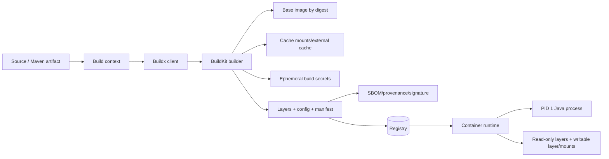
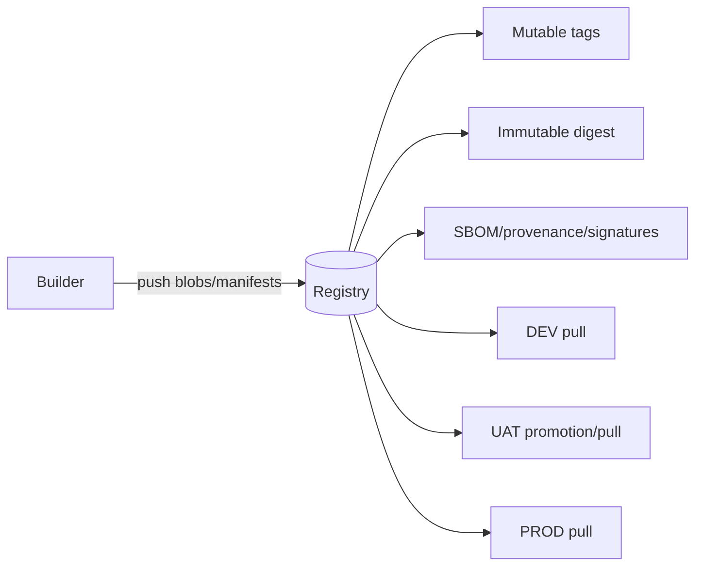

# Part 044 — Docker Images, BuildKit, and Container Supply Chain

> Container image bukan virtual machine mini dan Dockerfile bukan shell script biasa. Image adalah immutable content-addressed filesystem/config graph yang dibangun dari context, base image, instructions, build arguments, mounted caches/secrets, and builder state; container adalah runtime instance whose writable layer, PID 1 behavior, user identity, filesystem permissions, signals, resource limits, and platform architecture determine actual behavior. Production image engineering harus membuat image minimal namun operable, non-root, deterministic, traceable from source and Maven artifact, free of build secrets, compatible with runtime architecture, and promotable by digest with SBOM and provenance evidence.

## Daftar Isi

1. [Target kompetensi](#target-kompetensi)
2. [Scope dan baseline](#scope-dan-baseline)
3. [Boundary dengan Part 043, 045, and Kubernetes parts](#boundary-dengan-part-043-045-and-kubernetes-parts)
4. [Mental model image build and runtime](#mental-model-image-build-and-runtime)
5. [Container versus virtual machine](#container-versus-virtual-machine)
6. [OCI image components](#oci-image-components)
7. [Layers](#layers)
8. [Image configuration](#image-configuration)
9. [Manifest and image index](#manifest-and-image-index)
10. [Tags versus digests](#tags-versus-digests)
11. [Container writable layer](#container-writable-layer)
12. [Build context](#build-context)
13. [`.dockerignore`](#dockerignore)
14. [Remote and named contexts](#remote-and-named-contexts)
15. [Dockerfile frontend and syntax directive](#dockerfile-frontend-and-syntax-directive)
16. [Dockerfile instruction semantics](#dockerfile-instruction-semantics)
17. [`FROM`](#from)
18. [`ARG`](#arg)
19. [`ENV`](#env)
20. [`WORKDIR`](#workdir)
21. [`COPY`](#copy)
22. [`ADD`](#add)
23. [`RUN`](#run)
24. [`USER`](#user)
25. [`ENTRYPOINT`](#entrypoint)
26. [`CMD`](#cmd)
27. [`EXPOSE`](#expose)
28. [`VOLUME`](#volume)
29. [`HEALTHCHECK`](#healthcheck)
30. [`STOPSIGNAL`](#stopsignal)
31. [`LABEL`](#label)
32. [Exec form versus shell form](#exec-form-versus-shell-form)
33. [Environment-variable expansion](#environment-variable-expansion)
34. [Instruction ordering](#instruction-ordering)
35. [Multi-stage builds](#multi-stage-builds)
36. [Named stages](#named-stages)
37. [Builder stage versus runtime stage](#builder-stage-versus-runtime-stage)
38. [External build artifact versus in-image Maven build](#external-build-artifact-versus-in-image-maven-build)
39. [Java application packaging choices](#java-application-packaging-choices)
40. [Fat JAR image](#fat-jar-image)
41. [Thin JAR and dependency layers](#thin-jar-and-dependency-layers)
42. [WAR and application-server image](#war-and-application-server-image)
43. [Exploded application layout](#exploded-application-layout)
44. [JDK, JRE, and custom runtime images](#jdk-jre-and-custom-runtime-images)
45. [`jlink` boundary](#jlink-boundary)
46. [Base-image selection](#base-image-selection)
47. [Distribution and support policy](#distribution-and-support-policy)
48. [glibc versus musl](#glibc-versus-musl)
49. [Distroless and minimal images](#distroless-and-minimal-images)
50. [Debuggability versus minimalism](#debuggability-versus-minimalism)
51. [Pinning base images](#pinning-base-images)
52. [Base-image update policy](#base-image-update-policy)
53. [BuildKit mental model](#buildkit-mental-model)
54. [Build graph and parallelism](#build-graph-and-parallelism)
55. [Cache keys and invalidation](#cache-keys-and-invalidation)
56. [Layer cache optimization](#layer-cache-optimization)
57. [Bind mounts in builds](#bind-mounts-in-builds)
58. [Cache mounts](#cache-mounts)
59. [Maven repository cache mount](#maven-repository-cache-mount)
60. [External cache](#external-cache)
61. [Inline and registry cache](#inline-and-registry-cache)
62. [Cache poisoning and trust](#cache-poisoning-and-trust)
63. [Build secrets](#build-secrets)
64. [Why `ARG` and `ENV` are not secrets](#why-arg-and-env-are-not-secrets)
65. [SSH mounts](#ssh-mounts)
66. [Secret lifetime and leakage tests](#secret-lifetime-and-leakage-tests)
67. [Network access during build](#network-access-during-build)
68. [Hermetic-build boundary](#hermetic-build-boundary)
69. [Maven and Docker layering strategy](#maven-and-docker-layering-strategy)
70. [Dependency resolution before source copy](#dependency-resolution-before-source-copy)
71. [Reactor and module-cache considerations](#reactor-and-module-cache-considerations)
72. [Build artifact verification](#build-artifact-verification)
73. [Non-root runtime](#non-root-runtime)
74. [UID and GID strategy](#uid-and-gid-strategy)
75. [Filesystem ownership](#filesystem-ownership)
76. [`COPY --chown`](#copy---chown)
77. [Read-only root filesystem](#read-only-root-filesystem)
78. [Writable paths and temporary files](#writable-paths-and-temporary-files)
79. [Linux capabilities](#linux-capabilities)
80. [Privileged containers](#privileged-containers)
81. [Seccomp and LSM boundary](#seccomp-and-lsm-boundary)
82. [PID 1 responsibilities](#pid-1-responsibilities)
83. [Signal propagation](#signal-propagation)
84. [Java graceful shutdown](#java-graceful-shutdown)
85. [Shell wrappers](#shell-wrappers)
86. [Init processes](#init-processes)
87. [Exit codes](#exit-codes)
88. [Healthchecks](#healthchecks)
89. [Docker health versus orchestrator probes](#docker-health-versus-orchestrator-probes)
90. [Startup and readiness](#startup-and-readiness)
91. [Configuration](#configuration)
92. [Runtime secrets](#runtime-secrets)
93. [Do not bake environment configuration](#do-not-bake-environment-configuration)
94. [Java options and container awareness](#java-options-and-container-awareness)
95. [Heap and native-memory budget](#heap-and-native-memory-budget)
96. [CPU detection and throttling](#cpu-detection-and-throttling)
97. [Timezone, locale, and certificates](#timezone-locale-and-certificates)
98. [CA trust and certificate rotation](#ca-trust-and-certificate-rotation)
99. [File permissions and umask](#file-permissions-and-umask)
100. [Logging](#logging)
101. [Standard output and standard error](#standard-output-and-standard-error)
102. [Log files inside containers](#log-files-inside-containers)
103. [Image metadata and OCI annotations](#image-metadata-and-oci-annotations)
104. [Source, revision, version, and licenses labels](#source-revision-version-and-licenses-labels)
105. [Multi-platform images](#multi-platform-images)
106. [Buildx builders](#buildx-builders)
107. [Native builds versus emulation](#native-builds-versus-emulation)
108. [QEMU boundary](#qemu-boundary)
109. [Architecture-dependent dependencies](#architecture-dependent-dependencies)
110. [JVM portability across architectures](#jvm-portability-across-architectures)
111. [Manifest-list testing](#manifest-list-testing)
112. [Reproducible container images](#reproducible-container-images)
113. [Sources of image nondeterminism](#sources-of-image-nondeterminism)
114. [Timestamp and file-order controls](#timestamp-and-file-order-controls)
115. [Content-addressability and rebuilds](#content-addressability-and-rebuilds)
116. [SBOM attestations](#sbom-attestations)
117. [Provenance attestations](#provenance-attestations)
118. [Attestation storage and registry support](#attestation-storage-and-registry-support)
119. [Image signing](#image-signing)
120. [Signature verification policy](#signature-verification-policy)
121. [Vulnerability scanning](#vulnerability-scanning)
122. [OS packages versus application dependencies](#os-packages-versus-application-dependencies)
123. [Vulnerability triage](#vulnerability-triage)
124. [Image freshness and patching](#image-freshness-and-patching)
125. [Registry mental model](#registry-mental-model)
126. [Push, pull, and content blobs](#push-pull-and-content-blobs)
127. [Immutable tags and digest promotion](#immutable-tags-and-digest-promotion)
128. [Registry retention and garbage collection](#registry-retention-and-garbage-collection)
129. [Cross-environment promotion](#cross-environment-promotion)
130. [Air-gapped and mirrored registries](#air-gapped-and-mirrored-registries)
131. [Image pull authentication](#image-pull-authentication)
132. [Supply-chain trust boundary](#supply-chain-trust-boundary)
133. [Docker Compose boundary](#docker-compose-boundary)
134. [Compose for local integration](#compose-for-local-integration)
135. [`depends_on` and readiness](#depends-on-and-readiness)
136. [One service per container](#one-service-per-container)
137. [Debug images and ephemeral tooling](#debug-images-and-ephemeral-tooling)
138. [Build and runtime testing](#build-and-runtime-testing)
139. [Dockerfile linting](#dockerfile-linting)
140. [Image structure tests](#image-structure-tests)
141. [Runtime smoke tests](#runtime-smoke-tests)
142. [Security tests](#security-tests)
143. [Multi-architecture tests](#multi-architecture-tests)
144. [Failure-model matrix](#failure-model-matrix)
145. [Debugging playbook](#debugging-playbook)
146. [Architecture patterns](#architecture-patterns)
147. [Anti-patterns](#anti-patterns)
148. [PR review checklist](#pr-review-checklist)
149. [Trade-off yang harus dipahami senior engineer](#trade-off-yang-harus-dipahami-senior-engineer)
150. [Internal verification checklist](#internal-verification-checklist)
151. [Latihan verifikasi](#latihan-verifikasi)
152. [Ringkasan](#ringkasan)
153. [Referensi resmi](#referensi-resmi)

---

## Target kompetensi

Setelah menyelesaikan part ini, Anda harus mampu:

- menjelaskan image as OCI content graph, not a VM snapshot;
- membedakan image layer, config, manifest, index, tag, digest, and container writable layer;
- mengontrol build context and `.dockerignore` to prevent leakage and cache invalidation;
- menggunakan Dockerfile instructions with correct exec/shell and metadata semantics;
- membangun multi-stage Java image and choose fat JAR, thin JAR, WAR, exploded layout, JRE, or `jlink` runtime;
- memilih base image based on support, libc, certificates, debug needs, vulnerability surface, and architecture;
- menggunakan BuildKit build graph, bind/cache mounts, external caches, and multi-platform builders;
- memasukkan Maven cache without copying `.m2` into final image;
- menggunakan secret/SSH mounts instead of `ARG`/`ENV` for build credentials;
- menjalankan Java process as non-root with explicit UID/GID and read-only filesystem plan;
- menangani PID 1, signals, graceful shutdown, exit codes, and health behavior;
- membedakan Docker healthcheck from Kubernetes startup/readiness/liveness;
- menetapkan JVM heap/native/CPU configuration under container limits;
- membuat multi-platform image and test native architecture behavior;
- menghasilkan reproducible images, SBOM and provenance attestations;
- sign and promote images by immutable digest;
- triage vulnerabilities across OS and Maven/application layers;
- menguji Dockerfile, image structure, runtime, permissions, graceful shutdown, and architecture;
- mendiagnosis build-cache, startup, signal, certificate, permission, and platform failures.

---

## Scope dan baseline

Baseline:

- Docker Buildx/BuildKit-based builds;
- OCI-compatible registry/runtime;
- Java 17+ JAX-RS/Jersey application;
- Maven artifact from Part 043;
- Linux containers;
- deployment may later run on Kubernetes;
- CI may use ephemeral builders and registry cache;
- SBOM/provenance/signature tooling may be introduced.

Part ini **tidak mengasumsikan**:

- exact Docker Engine/Desktop/BuildKit version;
- Docker runtime in production rather than containerd/CRI-O;
- one base-image vendor;
- Alpine/distroless/Ubuntu/UBI choice;
- fat JAR or WAR;
- rootless runtime;
- Kubernetes probes;
- one registry vendor;
- Cosign/Notary implementation;
- Docker Scout or other scanner;
- reproducible image is already achieved;
- internal CSG image standards.

---

## Boundary dengan Part 043, 045, and Kubernetes parts

| Part | Fokus |
|---|---|
| Part 043 | Maven source-to-JAR/WAR build and artifact publication |
| Part 044 | Image build, filesystem, process, runtime identity, and supply chain |
| Part 045 | Java/JVM behavior inside containers and operational runtime tuning |
| Part 046+ | Kubernetes workload, probes, resources, scheduling, and delivery |

Part 044 covers enough JVM/container integration to produce a correct image; detailed runtime tuning continues later.

---

## Mental model image build and runtime



---

## Container versus virtual machine

Container shares host kernel and isolates processes/resources through namespaces, cgroups, and security controls.

Image does not include its own kernel.

Kernel compatibility and host/runtime security remain part of execution environment.

---

## OCI image components

An image commonly consists of:

- content blobs/layers;
- configuration JSON;
- manifest;
- optional image index for platforms;
- annotations/attestations in registry ecosystem.

All content is addressed by digest.

---

## Layers

A filesystem layer represents a content diff.

Layers are immutable and shared across images/containers.

Deleting a secret/file in a later layer does not remove bytes from earlier layer history.

---

## Image configuration

Config stores runtime defaults such as:

- environment;
- user;
- entrypoint/CMD;
- working directory;
- exposed ports;
- labels;
- stop signal;
- healthcheck.

These are defaults and can be overridden by runtime.

---

## Manifest and image index

Manifest references config and layers for one platform.

Image index/manifest list references multiple platform-specific manifests.

Same tag can select different digest on AMD64 and ARM64.

---

## Tags versus digests

Tag is mutable human-readable reference.

Digest is immutable content identity.

Deploy and promote by digest; use tags as aliases.

---

## Container writable layer

At runtime, a thin writable layer sits above image layers.

It is ephemeral unless backed by mount/volume.

Do not store durable application state there.

---

## Build context

Build context is the set of files BuildKit can access.

Large context increases transfer, cache invalidation, leak risk, and build time.

Use smallest possible context.

---

## `.dockerignore`

Exclude:

```text
.git
.idea
.vscode
target/
*.log
.env
secrets/
local-data/
```

If building from pre-produced JAR, include only Dockerfile and artifact/metadata needed.

Test that credentials and source artifacts are excluded.

---

## Remote and named contexts

BuildKit supports local, Git/remote, and named contexts depending command/frontend.

Remote context introduces trust and reproducibility concerns:

- exact commit/ref;
- authentication;
- submodules;
- network;
- context checksum.

---

## Dockerfile frontend and syntax directive

Use syntax directive where BuildKit Dockerfile features are needed:

```dockerfile
# syntax=docker/dockerfile:1
```

Pinning frontend digest/version may improve reproducibility but increases maintenance. Follow platform policy.

---

## Dockerfile instruction semantics

Each instruction affects build graph, layer, or image configuration.

Combining commands only to reduce layer count can harm readability/cache and is less important than removing actual unwanted content.

---

## `FROM`

Defines base/stage:

```dockerfile
FROM eclipse-temurin:21-jdk AS build
FROM eclipse-temurin:21-jre AS runtime
```

Pin digest for immutable base in controlled release builds.

---

## `ARG`

Build-time variable.

Values can appear in history/provenance/cache and are not secret storage.

Scope begins after declaration and per stage rules apply.

---

## `ENV`

Persists runtime default in image config and affects subsequent build instructions.

Do not store secrets.

Use for safe defaults only.

---

## `WORKDIR`

Sets working directory and creates it if needed.

Prefer absolute paths:

```dockerfile
WORKDIR /opt/app
```

---

## `COPY`

Copies files from context/stage/context source.

Prefer `COPY` for ordinary files.

Use ownership and link options only when supported and justified.

---

## `ADD`

Adds extra behavior such as archive extraction and remote sources in supported cases.

Use `COPY` unless those semantics are explicitly required.

Implicit archive extraction can surprise security/reproducibility review.

---

## `RUN`

Executes build command and commits resulting filesystem diff.

With BuildKit, mounts can provide temporary bind/cache/secret/SSH inputs not persisted as ordinary layers.

---

## `USER`

Sets default user/group for subsequent build and runtime instructions.

The default container user is root if not changed.

Use non-root for runtime.

---

## `ENTRYPOINT`

Defines executable container identity.

For Java service:

```dockerfile
ENTRYPOINT ["java", "-jar", "/opt/app/app.jar"]
```

---

## `CMD`

Provides default command or arguments.

With exec-form ENTRYPOINT:

```dockerfile
ENTRYPOINT ["java"]
CMD ["-jar", "/opt/app/app.jar"]
```

Runtime arguments can replace CMD.

---

## `EXPOSE`

Documents intended listening port/protocol.

It does not publish port by itself.

---

## `VOLUME`

Declares mount point but can make image behavior and build changes harder to reason about.

Prefer deployment-controlled mounts unless image contract truly requires volume semantics.

---

## `HEALTHCHECK`

Defines Docker-level health command.

It adds process/network overhead and may not be consumed by Kubernetes runtime path.

Use only with platform standard.

---

## `STOPSIGNAL`

Sets signal runtime sends on stop.

Java normally handles `SIGTERM`; use non-default only with evidence.

---

## `LABEL`

Use OCI annotations/labels for source, revision, version, licenses, and documentation.

Do not place secrets or mutable environment data.

---

## Exec form versus shell form

Exec form:

```dockerfile
ENTRYPOINT ["java", "-jar", "/opt/app/app.jar"]
```

Java becomes PID 1 and receives signals directly.

Shell form:

```dockerfile
ENTRYPOINT java -jar /opt/app/app.jar
```

Runs through shell and can break signal propagation/argument handling unless `exec` is used.

---

## Environment-variable expansion

JSON exec form does not perform shell expansion.

Bad expectation:

```dockerfile
ENTRYPOINT ["java", "$JAVA_OPTS", "-jar", "app.jar"]
```

Use runtime-supported `JAVA_TOOL_OPTIONS`, a carefully written `exec` wrapper, or explicit args.

---

## Instruction ordering

Put stable dependency inputs before frequently changing source when building inside image.

Example:

```text
copy pom/wrapper
resolve dependencies
copy source
compile/package
```

But multi-module effective graph can complicate this; ensure correctness before cache cleverness.

---

## Multi-stage builds

Multi-stage separates build tools from runtime content.

```dockerfile
FROM maven:3.9-eclipse-temurin-21 AS build
WORKDIR /src
COPY . .
RUN mvn -B -ntp verify

FROM eclipse-temurin:21-jre
COPY --from=build /src/target/app.jar /opt/app/app.jar
ENTRYPOINT ["java", "-jar", "/opt/app/app.jar"]
```

Final image excludes Maven/source/JDK if not needed.

---

## Named stages

Use semantic names:

```text
deps
build
test
runtime
debug
```

Avoid numeric `--from=0` coupling.

---

## Builder stage versus runtime stage

Builder can contain compilers, Maven, Git, shell, and package managers.

Runtime should contain only runtime, app, trust/config defaults, and essential diagnostics according to policy.

---

## External build artifact versus in-image Maven build

### External artifact

```text
CI Maven build → repository/artifact → Docker COPY
```

Pros:

- build concerns separated;
- artifact independently verified;
- simpler image context.

### In-image build

```text
source → BuildKit Maven stage → runtime stage
```

Pros:

- one build graph;
- strong cache integration;
- easy local reproducibility.

Both can be correct. Ensure one authoritative artifact/provenance chain.

---

## Java application packaging choices

Options:

- fat executable JAR;
- thin JAR + `lib/`;
- exploded classes/resources/libs;
- WAR + server;
- custom runtime image.

Image-layer behavior should follow artifact architecture.

---

## Fat JAR image

Simple:

```dockerfile
COPY app.jar /opt/app/app.jar
```

Every dependency/app change changes one large layer.

Ensure Maven Shade/provider metadata correctness from Part 043.

---

## Thin JAR and dependency layers

Example:

```text
/opt/app/lib/*.jar
/opt/app/app.jar
```

Dependencies can cache separately from app classes.

Launcher/classpath must be deterministic and tested.

---

## WAR and application-server image

Base image contains server; deploy WAR into server-specific path.

Risks:

- server-owned libraries;
- duplicate Jakarta APIs;
- admin/default apps;
- server configuration;
- patch lifecycle.

Prefer vendor-supported immutable server image and exact version.

---

## Exploded application layout

Exploded layout enables granular layers and diagnostics but increases file count and potential mutation.

Keep runtime filesystem read-only.

---

## JDK, JRE, and custom runtime images

JDK image includes compiler/tools useful for build/debug but larger attack surface.

JRE/runtime image is smaller.

Custom runtime can reduce modules but requires complete runtime dependency analysis.

---

## `jlink` boundary

`jlink` creates custom Java runtime from modules.

Risks:

- reflection/service/provider modules omitted;
- TLS/charset/management modules missing;
- native architecture output;
- JDK patch updates require rebuild;
- automatic-module/classpath analysis limitations.

Test all runtime paths and operational tools.

---

## Base-image selection

Evaluate:

- vendor/JDK support;
- update cadence;
- OS lifecycle;
- libc;
- CA/timezone packages;
- architecture;
- vulnerability handling;
- debug requirements;
- provenance/signing;
- internal allow-list.

---

## Distribution and support policy

A small image from an unsupported distribution may be riskier than a slightly larger supported image.

Track both JDK and OS/base lifecycle.

---

## glibc versus musl

Alpine commonly uses musl; many enterprise Java images use glibc.

Potential differences:

- native libraries;
- DNS behavior/history;
- locale;
- performance;
- debugging;
- JNI agents.

Benchmark and integration-test before switching for size alone.

---

## Distroless and minimal images

Minimal images omit shell/package manager and reduce runtime surface.

Benefits:

- fewer tools/packages;
- lower accidental mutation.

Costs:

- harder interactive diagnosis;
- certificate/timezone/user setup;
- limited debugging.

Use separate debug workflow rather than shipping every tool.

---

## Debuggability versus minimalism

Production diagnosis can use:

- JFR/JMX/metrics;
- ephemeral debug container;
- debug image variant from same build stage;
- process namespace tooling at platform layer.

Do not keep curl/bash/package manager solely because incident procedures are undefined.

---

## Pinning base images

Tag can move. Digest pins exact content:

```dockerfile
FROM eclipse-temurin:21-jre@sha256:...
```

Digest pin improves audit/reproducibility but stops automatic base patch uptake.

---

## Base-image update policy

Use automated monitored proposals:

1. discover new vendor digest;
2. rebuild;
3. scan/test;
4. compare;
5. approve;
6. promote.

Do not choose between “always latest” and “never update.”

---

## BuildKit mental model

Buildx sends build request to BuildKit backend.

BuildKit resolves a dependency graph, executes independent work concurrently, and reuses content-addressed cache.

---

## Build graph and parallelism

Multi-stage branches can run in parallel if independent.

Build output/log ordering may differ.

Custom scripts must not assume sequential execution across independent stages.

---

## Cache keys and invalidation

Cache depends on instruction, inputs, mounts, metadata, and frontend semantics.

A changed early `COPY . .` invalidates all later stages.

Secrets generally should not become cache content; secret value changes may not automatically invalidate a step unless explicitly modeled.

---

## Layer cache optimization

Principles:

- small context;
- stable instructions first;
- specific COPY;
- cache dependency downloads;
- no needless package-index layers;
- deterministic inputs.

Do not sacrifice correctness/readability for tiny build speed.

---

## Bind mounts in builds

BuildKit bind mount exposes source temporarily to one `RUN` without persisting mount contents into layer/cache.

Useful for generating output from large source context under controlled command.

Only command output written outside/appropriately persists.

---

## Cache mounts

Cache mount persists package-manager/compiler caches across builds without copying them into final image layer.

Examples:

- Maven local repository;
- apt cache;
- compiler cache.

Cache contents are acceleration and must tolerate empty/stale state.

---

## Maven repository cache mount

Example:

```dockerfile
RUN --mount=type=cache,target=/root/.m2/repository \
    ./mvnw -B -ntp verify
```

For non-root build user, target/ownership must match.

Do not copy `.m2` into final image.

---

## External cache

Ephemeral CI builders can import/export cache using registry/local/GHA or supported backends.

External cache can drastically speed builds but widens trust and retention concerns.

---

## Inline and registry cache

Inline cache stores limited cache metadata with image; registry cache can store richer build cache separately.

Choose according to builder and registry support.

Do not deploy cache manifest as runtime image accidentally.

---

## Cache poisoning and trust

An attacker or another branch may inject cache output if cache namespace and permissions are weak.

Protect:

- cache repository;
- branch/trust scope;
- builder identity;
- build secrets;
- dependency checksums;
- final artifact verification.

Release builds may use clean/reverified cache policy.

---

## Build secrets

Use BuildKit secret mounts:

```dockerfile
RUN --mount=type=secret,id=maven_settings,target=/root/.m2/settings.xml \
    ./mvnw -B -s /root/.m2/settings.xml verify
```

Secret is mounted for command and should not persist in layer.

---

## Why `ARG` and `ENV` are not secrets

Docker documentation explicitly warns that build arguments and environment variables are inappropriate for secrets because values can persist in image metadata/history/provenance/cache.

Use secret or SSH mounts.

---

## SSH mounts

SSH mount exposes agent/socket credentials to a build step for private Git access without copying key.

Pin host keys and exact commits.

Avoid broad forwarding to untrusted build commands.

---

## Secret lifetime and leakage tests

After build inspect:

- image history;
- environment;
- filesystem layers;
- provenance parameters;
- build logs;
- cache exports;
- final artifact.

Search for known canary secret in CI test.

---

## Network access during build

Network enables dependency resolution but weakens hermeticity.

Policy options:

- repository allow-list;
- proxy/mirror;
- no network after dependency stage;
- vendored/locked inputs;
- isolated release builder.

---

## Hermetic-build boundary

A fully hermetic build uses only declared immutable inputs and controlled tools.

Maven repository metadata, base tags, remote Git, package indexes, and time can break hermeticity.

Use incremental controls even if full hermeticity is not feasible.

---

## Maven and Docker layering strategy

Two common models:

### Build outside

```text
Maven produces immutable JAR → Docker only packages
```

### Build inside

```text
Docker/BuildKit controls Maven/JDK/source/cache
```

Link provenance either way.

---

## Dependency resolution before source copy

For single-module Maven:

```dockerfile
COPY pom.xml mvnw .mvn/ ./
RUN --mount=type=cache,target=/root/.m2 ./mvnw dependency:go-offline
COPY src ./src
RUN --mount=type=cache,target=/root/.m2 ./mvnw package
```

`go-offline` may not capture every dynamically used plugin/test dependency. Real build remains authoritative.

---

## Reactor and module-cache considerations

Multi-module builds need all relevant POMs to calculate graph.

Copying only root POM may fail/model wrong.

Use generated dependency layer or external Maven build if Dockerfile becomes fragile.

---

## Build artifact verification

Before copying to runtime:

- run tests/verify;
- inspect expected JAR/WAR;
- verify checksum;
- ensure one artifact selected;
- reject snapshot/unexpected classifier;
- record Maven artifact hash.

Avoid wildcard `COPY target/*.jar` when multiple JARs exist.

---

## Non-root runtime

Default root process increases blast radius and creates host-mounted permission risks.

Create/use non-root UID/GID and set `USER`.

---

## UID and GID strategy

Use stable numeric ID where deployment security context and filesystem ownership require consistency.

Avoid collision with reserved base users.

Kubernetes may override UID; application must tolerate policy.

---

## Filesystem ownership

Only grant write permission to required directories.

Do not recursively `chmod 777`.

---

## `COPY --chown`

Set ownership during copy:

```dockerfile
COPY --chown=10001:10001 app.jar /opt/app/app.jar
```

Avoid extra `RUN chown` layer and ensure base supports ownership semantics.

---

## Read-only root filesystem

Design image to run with read-only root.

Identify writable paths:

- `/tmp`;
- generated reports;
- uploaded staging files;
- JFR dumps;
- truststore mutation;
- application caches.

Mount explicit ephemeral/persistent storage.

---

## Writable paths and temporary files

Use controlled temp directory and size limits.

Clean on completion and shutdown.

Do not assume unlimited `/tmp`.

---

## Linux capabilities

Most Java HTTP services need no additional capabilities.

Drop all and add only proven requirements.

Binding low ports can be solved through service mapping or specific capability rather than root.

---

## Privileged containers

Privileged mode largely removes isolation boundaries.

A regular JAX-RS service should never require it.

---

## Seccomp and LSM boundary

Runtime security profiles can block syscalls/files.

Image should not disable them globally. Test with production profile and investigate denied operation.

---

## PID 1 responsibilities

PID 1 has special signal and child-reaping behavior.

Java can be PID 1 when exec form is used and app does not spawn unmanaged child processes.

---

## Signal propagation

Runtime sends stop signal to PID 1.

Shell wrapper without `exec` may receive signal while Java does not.

Test actual stop path.

---

## Java graceful shutdown

On SIGTERM:

- stop ingress;
- mark not ready at orchestrator level;
- drain requests/workers;
- close clients/pools;
- flush bounded telemetry;
- exit before grace deadline.

Image must not swallow signal.

---

## Shell wrappers

Use only when dynamic argument construction is required.

Correct wrapper:

```sh
#!/bin/sh
set -eu
exec java ${JAVA_OPTS:-} -jar /opt/app/app.jar "$@"
```

Unquoted expansion has hazards. Prefer `JAVA_TOOL_OPTIONS` or structured args where possible.

---

## Init processes

Tiny init can reap children and forward signals.

Use only if process tree needs it. Java-only service often can run directly.

---

## Exit codes

Exit non-zero for fatal startup/runtime failure so orchestrator detects it.

Do not catch fatal error and keep a dead-but-running process.

---

## Healthchecks

Health command must be:

- fast;
- bounded;
- non-mutating;
- low dependency cost;
- available in minimal image.

A curl-based healthcheck requires curl in image; consider application/native probes or orchestrator config.

---

## Docker health versus orchestrator probes

Docker image healthcheck is image metadata/runtime feature.

Kubernetes defines startup/readiness/liveness probes separately and may not consume Docker `HEALTHCHECK` automatically.

Do not assume one config covers both.

---

## Startup and readiness

Container process running is not service ready.

Readiness may require:

- JAX-RS server bound;
- configuration valid;
- migrations policy complete;
- critical clients initialized;
- workers ready;
- caches optional.

Detailed probes follow in Kubernetes parts.

---

## Configuration

Runtime configuration should enter through environment, files, mounted config, or secret provider according to Part 018.

Image defaults should be safe and environment-neutral.

---

## Runtime secrets

Runtime secrets should be mounted/injected at deployment, not baked into image.

Application must support rotation and avoid logging.

---

## Do not bake environment configuration

Do not build separate image for DEV/UAT/PROD by replacing config during `docker build`.

Promote same digest and supply runtime configuration.

---

## Java options and container awareness

Modern JVMs are container-aware, but flags and JDK versions matter.

Use explicit policy for:

- heap percentages/limits;
- GC;
- error/JFR files;
- timezone;
- DNS;
- truststore;
- observability agents.

---

## Heap and native-memory budget

Container memory includes:

- heap;
- metaspace;
- code cache;
- thread stacks;
- direct buffers;
- native libraries;
- agents;
- filesystem/page cache effects.

Do not set `-Xmx` equal to memory limit.

---

## CPU detection and throttling

JVM parallelism uses detected processor availability, but cgroup quotas and runtime versions affect behavior.

Measure GC/common-pool/thread settings under actual limits.

---

## Timezone, locale, and certificates

Minimal image may omit timezone data/locales/CA packages.

Java runtime can contain some data but native tools/libraries may differ.

Explicitly test TLS and business timezone behavior.

---

## CA trust and certificate rotation

Trust sources can be:

- JDK truststore;
- OS CA bundle;
- custom mounted truststore;
- service mesh.

Know which one Java HTTP client uses.

Do not mutate immutable image truststore manually in production; rebuild or mount governed trust.

---

## File permissions and umask

Set directory/file permissions for non-root user and sensitive outputs.

Runtime umask may affect created files on mounted volumes.

---

## Logging

Container logs should be structured, bounded, and directed to runtime collection path.

No secrets, tokens, or unbounded stack floods.

---

## Standard output and standard error

Write application logs to stdout/stderr unless platform standard uses another sidecar/agent contract.

Orchestrator captures streams.

---

## Log files inside containers

File logs consume writable layer, are lost on replacement, and can fill disk.

Use only with explicit mounted volume/rotation/collector.

---

## Image metadata and OCI annotations

Attach machine-readable metadata:

- source URL;
- revision;
- version;
- created timestamp if controlled;
- licenses;
- documentation/vendor/title.

Use OCI annotation keys where supported.

---

## Source, revision, version, and licenses labels

Example:

```dockerfile
LABEL org.opencontainers.image.source="https://example/repo" \
      org.opencontainers.image.revision="$VCS_REF" \
      org.opencontainers.image.version="$VERSION" \
      org.opencontainers.image.licenses="Apache-2.0"
```

Build args are safe here only for non-secret metadata and should be provenance-controlled.

---

## Multi-platform images

A single image reference can expose platform manifests for:

```text
linux/amd64
linux/arm64
```

Each platform has distinct digest/layers.

---

## Buildx builders

Buildx manages BuildKit backends/builders:

- local docker driver;
- container driver;
- remote/cloud builders;
- multi-node builders.

Builder selection affects cache, secrets, network, and trust.

---

## Native builds versus emulation

Native builder is fastest and most faithful.

Cross-compilation can work for architecture-neutral Java artifact while base layers remain platform-specific.

---

## QEMU boundary

Emulation enables foreign-architecture `RUN` but is slower and can expose behavior differences.

Do not treat successful emulated build as full native runtime test.

---

## Architecture-dependent dependencies

JNI, agents, compression, DNS/native transports, shell binaries, and libc packages differ by architecture.

Scan/test each platform.

---

## JVM portability across architectures

Java bytecode is portable, but JVM distribution/native dependencies are platform-specific.

Performance and default ergonomics can differ.

---

## Manifest-list testing

Pull/run exact platform image on native or representative environment.

Verify manifest selection and architecture labels.

---

## Reproducible container images

Reproducible image means identical declared inputs yield identical image content/config/digest, within builder/attestation design.

Maven reproducible JAR is necessary but not sufficient.

---

## Sources of image nondeterminism

Examples:

- moving base tag;
- package-manager latest indexes;
- file timestamps/order;
- build time labels;
- generated random metadata;
- non-reproducible JAR;
- architecture/emulation;
- remote Git branch;
- mutable dependency repository;
- frontend/builder version.

---

## Timestamp and file-order controls

Control source archive/JAR timestamps, build context metadata, generated files, and package-manager behavior where possible.

Do not add `date` output to image.

---

## Content-addressability and rebuilds

Same bytes/config create same digest.

Attestations can contain build timestamps and may have separate artifact identities from image manifest.

Define what must be reproducible and what is independently attested.

---

## SBOM attestations

BuildKit supports build-time SBOM attestations.

Docker documentation describes SBOM attestations as SPDX-formatted statements attached to image through registry metadata mechanisms.

SBOM inventory does not prove vulnerability or license acceptability.

---

## Provenance attestations

BuildKit supports provenance attestations with information about build process, parameters, and materials.

Use minimum/full modes according to privacy and audit needs.

Review whether build args/environment expose sensitive metadata.

---

## Attestation storage and registry support

Attestations are registry artifacts/metadata related to image manifest.

Registry, copy, promotion, and garbage-collection tooling must preserve them.

Test across environments.

---

## Image signing

Sign image digest, not mutable tag.

Key models:

- managed key/KMS;
- keyless identity/OIDC;
- offline key.

Exact tool may be Cosign, Notary, or platform service.

---

## Signature verification policy

Admission/deployment should verify:

- trusted identity/key;
- repository;
- digest;
- provenance predicate/policy;
- expiry/revocation;
- environment/branch.

A valid signature only proves signer, not software safety.

---

## Vulnerability scanning

Scan:

- OS packages;
- JDK/runtime;
- Maven dependencies;
- binaries/scripts;
- configuration where supported.

Scan at build and continuously because new CVEs appear after release.

---

## OS packages versus application dependencies

Container scanner may find package-manager and language dependencies differently.

Fat JAR nested libraries can require Java-aware scanner/SBOM.

Compare Maven SBOM and image SBOM.

---

## Vulnerability triage

Evaluate:

- installed/reachable component;
- runtime use;
- fixed version;
- base vendor backport;
- exploitability;
- compensating controls;
- owner/expiry.

Do not delete required certificates/tools blindly to reduce count.

---

## Image freshness and patching

Rebuild image regularly even without application changes to consume patched base/JDK.

Track image age and base digest freshness.

---

## Registry mental model



---

## Push, pull, and content blobs

Registry deduplicates content-addressed blobs.

A manifest references exact layers/config.

Partial/missing artifact retention can break pulls.

---

## Immutable tags and digest promotion

Registry can enforce immutable release tags.

Preferred:

```text
build digest D
assign candidate tag → test D
promote same D to release/environment reference
```

No rebuild.

---

## Registry retention and garbage collection

Retention must account for:

- rollback images;
- attestations/signatures;
- cache manifests;
- multi-platform child manifests;
- legal/audit retention.

Aggressive cleanup can remove needed artifacts.

---

## Cross-environment promotion

Options:

- same registry namespace and digest;
- copy manifest/blobs preserving digest;
- registry replication.

Verify signatures/attestations remain attached.

---

## Air-gapped and mirrored registries

Mirror/import must preserve:

- manifests/indexes;
- all platform layers;
- signatures;
- attestations;
- digest identity.

Document trust transfer.

---

## Image pull authentication

Use workload/node identity or scoped pull secret.

Avoid developer credentials embedded in deployment.

Rotate and scope registry permissions.

---

## Supply-chain trust boundary

Trust inputs include:

- source repository;
- Maven dependencies/plugins;
- base image;
- Dockerfile frontend;
- BuildKit builder;
- cache;
- CI runner;
- registry;
- signing identity.

One signed final image does not erase compromised inputs.

---

## Docker Compose boundary

Compose is useful for local/multi-container integration and some non-Kubernetes deployments.

Do not assume Compose semantics equal Kubernetes.

---

## Compose for local integration

Use pinned images, healthchecks, named networks, and ephemeral data.

Do not put production secrets in committed Compose file.

---

## `depends_on` and readiness

Compose controls startup order; advanced conditions can wait for health depending format/version.

A container start dependency is not application-level eventual readiness for every operation.

---

## One service per container

Docker guidance favors separating concerns into services/containers.

Java process may create child/helper processes, but do not bundle database, nginx, cron, and app into one image by default.

---

## Debug images and ephemeral tooling

Build a separate debug target:

```dockerfile
FROM runtime AS debug
USER root
RUN install-approved-debug-tools
USER 10001
```

Do not deploy debug variant accidentally. Sign/tag distinctly.

---

## Build and runtime testing

Test both image content and actual container lifecycle.

A successful `docker build` does not prove startup or graceful stop.

---

## Dockerfile linting

Lint for:

- unpinned tags;
- secrets;
- root user;
- shell form;
- package cleanup;
- unsafe ADD/curl pipe shell;
- missing labels;
- ignored health/runtime requirements.

Rules need justified exceptions.

---

## Image structure tests

Assert:

- expected files only;
- no source/.git/.m2/secrets;
- non-root user;
- permissions;
- entrypoint;
- labels;
- no package manager if forbidden;
- artifact checksum.

---

## Runtime smoke tests

Run image and verify:

- application starts;
- port/health;
- config injection;
- TLS trust;
- read-only root filesystem;
- non-root;
- temp/mount paths;
- SIGTERM exit within deadline;
- no fatal log leaks.

---

## Security tests

Check:

- scanner policy;
- SBOM completeness;
- signature/provenance;
- capabilities;
- writable paths;
- privileged requirement;
- secret canary absence;
- UID;
- package inventory.

---

## Multi-architecture tests

For every published platform:

- pull exact digest;
- start on native architecture;
- execute smoke/integration;
- validate JNI/agent/TLS;
- compare functional artifact hash;
- record platform manifest digest.

---

## Failure-model matrix

| Failure | Impact | Detection | Response |
|---|---|---|---|
| Build context includes `.git`/secret | leakage/cache churn | image/context scan | `.dockerignore`/small context |
| Secret passed with ARG | history/provenance exposure | canary scan | secret mount |
| Secret deleted in later layer | bytes remain in old layer | layer inspection | never COPY secret |
| Moving base tag | non-reproducible/security drift | digest diff | pin + update automation |
| Base digest never updated | known vulnerabilities | freshness policy | rebuild cadence |
| `COPY target/*.jar` selects wrong artifact | startup/runtime mismatch | structure test | exact artifact path |
| Maven cache copied to runtime | bloat/credentials | image scan | cache mount/multi-stage |
| Fat JAR services overwritten | missing providers | runtime test | Maven transformer |
| Alpine/musl switch untested | native/DNS/perf issue | integration/load | supported base evidence |
| Root runtime | privilege escalation impact | user inspection | non-root USER |
| `chmod 777` | unauthorized writes | permission test | least privilege |
| Shell-form ENTRYPOINT | SIGTERM not delivered | stop test | exec form/exec wrapper |
| Wrapper forgets `exec` | shutdown timeout | process tree | exec Java |
| Read-only root not tested | prod startup failure | runtime test | explicit writable mounts |
| Heap equals memory limit | container OOM | RSS/cgroup metrics | native headroom |
| Missing CA/timezone | TLS/business-time failure | smoke tests | governed runtime content |
| Healthcheck requires absent curl | always unhealthy | health logs | native/probe alternative |
| Cache imported from untrusted PR | poisoned output | provenance/cache audit | cache isolation |
| Emulated ARM build only | native runtime defect | platform test | native validation |
| SBOM misses nested JARs | blind vulnerability inventory | compare Maven/image SBOM | Java-aware tooling |
| Signature attached to tag assumption | tag retarget attack | digest verification | sign/verify digest |
| Promotion rebuilds image | environment drift | digest mismatch | copy/promote same digest |
| Registry GC removes attestations | policy verification fails | registry audit | retention policy |
| Debug image deployed | expanded attack surface | admission/tag policy | distinct signed target |

---

## Debugging playbook

### Docker build cache does not hit

Check:

- context changes;
- instruction ordering;
- file metadata;
- build args;
- frontend/builder;
- platform;
- cache import/export;
- branch cache scope;
- secret-dependent output;
- base digest.

Use plain progress and BuildKit diagnostics.

### Build succeeds locally, fails in CI

Compare:

- builder driver/version;
- architecture;
- context path/case;
- secret/SSH mount;
- proxy/DNS;
- registry auth;
- cache;
- available memory/disk;
- Git metadata;
- Maven repository/settings.

### Container exits immediately

Inspect:

- exit code;
- ENTRYPOINT/CMD composition;
- artifact path;
- Java runtime version;
- permissions;
- missing config/secrets;
- dynamic libraries;
- logs.

### Container does not stop gracefully

Inspect process tree and PID 1.

Send SIGTERM manually and capture thread dump/log timeline.

Check shell wrapper, shutdown hooks, blocked non-daemon threads, and grace duration.

### Permission denied under non-root

Check numeric UID/GID, copied file ownership, mounted volume ownership, read-only filesystem, `/tmp`, and security context override.

Do not solve with root/777 without understanding.

### TLS works on host but fails in image

Check JDK truststore, OS CA bundle, proxy CA, hostname, clock, minimal-base packages, and mounted trust.

### `exec format error`

Usually wrong architecture or invalid script shebang/line endings.

Inspect image platform and executable architecture.

### Image scan reports old fixed CVE

Check vendor backport/version mapping, scanner database, layer containing package, unused build-stage versus final image, and JDK/Maven nested dependency.

### Image digest differs between rebuilds

Compare base digest, Maven artifact hash, config labels/env, file timestamps/order, builder/frontend/platform, and package-manager inputs.

---

## Architecture patterns

### Artifact-first image

Verified Maven artifact copied into minimal runtime image; source/build tools remain outside.

### Hermetic multi-stage build

BuildKit uses pinned wrapper/JDK/base, repository mirror, secret/cache mounts, then copies verified output.

### Runtime plus debug targets

Same application/base lineage, separate minimal production and controlled debug images.

### Non-root read-only image

Only explicit temp/data mounts writable; all capabilities dropped.

### Digest promotion

One multi-platform digest/index is tested, signed, attested, and promoted unchanged.

### Dual SBOM

Maven SBOM for Java graph and image SBOM for complete runtime filesystem; reconcile both.

### Scheduled base refresh

Automated PR rebuilds image on base/JDK updates even without application source changes.

---

## Anti-patterns

- treat container as VM;
- `COPY . .` from repository root without ignore;
- bake `.git`, source, tests, `.m2`, or secrets into runtime;
- use ARG/ENV for passwords/tokens;
- `curl ... | sh` without verification;
- install compiler/Maven/package manager in runtime unnecessarily;
- run as root;
- `chmod -R 777`;
- mutable `latest` base for release;
- pin digest and never patch;
- one container running app + nginx + database + cron;
- shell-form Java ENTRYPOINT;
- wrapper without `exec`;
- write durable data to container layer;
- log to unbounded file inside image;
- depend on Docker HEALTHCHECK for Kubernetes readiness;
- set `-Xmx` to full memory limit;
- assume Java bytecode means every native dependency is multi-platform;
- trust emulated build only;
- scan only OS packages;
- sign tag instead of digest;
- rebuild per environment;
- remove shell/debug tools without creating incident workflow;
- deploy debug target to production.

---

## PR review checklist

### Build context and Dockerfile

- [ ] Context minimal and `.dockerignore` complete?
- [ ] Dockerfile syntax/version policy?
- [ ] Exact `COPY` inputs?
- [ ] No secrets/credentials in ARG/ENV/layers/logs?
- [ ] Multi-stage separation?
- [ ] Instruction order/cache sensible?
- [ ] No arbitrary remote ADD/curl installer?

### Java artifact

- [ ] Maven artifact already verified?
- [ ] Exact artifact path/hash?
- [ ] Fat/thin/WAR layout justified?
- [ ] Runtime Java version compatible?
- [ ] JRE/JDK/jlink choice tested?
- [ ] Jersey providers/services available?

### Base and runtime security

- [ ] Approved supported base/vendor?
- [ ] Base tag and digest recorded?
- [ ] Update/freshness process?
- [ ] Non-root numeric UID/GID?
- [ ] Correct ownership/no 777?
- [ ] Read-only-root compatibility?
- [ ] Capabilities/privileged requirements?
- [ ] CA/timezone/native libraries?

### Process lifecycle

- [ ] Exec-form ENTRYPOINT or correct `exec` wrapper?
- [ ] Java is PID 1 or init justified?
- [ ] SIGTERM reaches application?
- [ ] Graceful stop tested?
- [ ] Exit codes correct?
- [ ] Health/probe boundary understood?
- [ ] Logs to stdout/stderr?

### BuildKit and cache

- [ ] Cache mounts used safely?
- [ ] External cache scoped/trusted?
- [ ] Maven settings via secret mount?
- [ ] SSH mount host/commit verified?
- [ ] Network/repository allow-list?
- [ ] Cache not authoritative release input?
- [ ] Builder identity/version recorded?

### Supply chain and registry

- [ ] OCI labels/source revision/version?
- [ ] Multi-platform targets and native tests?
- [ ] Reproducibility controls?
- [ ] SBOM and provenance generated?
- [ ] Image signed by digest?
- [ ] Vulnerability/license policy?
- [ ] Registry immutable tags/retention?
- [ ] Promotion preserves digest and attestations?

---

## Trade-off yang harus dipahami senior engineer

| Decision | Benefit | Cost/risk |
|---|---|---|
| Artifact-first build | clear Maven/image boundary | two pipeline artifacts |
| In-image Maven build | one BuildKit graph/cache | larger context/build trust |
| Fat JAR | simple runtime | poor dependency-layer reuse |
| Thin/exploded layout | efficient layers | launcher complexity |
| JRE image | smaller runtime | fewer diagnostics |
| JDK image | tools/JFR utilities | larger surface |
| `jlink` runtime | smallest tailored Java | module-analysis/patch burden |
| Alpine/musl | small packages | native compatibility risk |
| Distroless | minimal mutation/surface | debugging difficulty |
| Digest pin | immutable base | manual/automated update needed |
| Floating tag | automatic updates | non-reproducible build |
| External BuildKit cache | fast CI | trust/poisoning/retention |
| Clean build | strongest isolation | slower/costlier |
| Non-root | reduced privilege | permission planning |
| Read-only root | strong immutability | explicit writable mounts |
| Direct Java PID 1 | simple signal path | child reaping if spawned |
| Tiny init | child/signal handling | extra binary/process |
| Multi-platform index | deployment flexibility | build/test complexity |
| Emulation | convenient cross-build | slow/less faithful |
| SBOM/provenance | transparency/audit | registry/tooling/storage |
| Minimal production image | smaller surface | separate debug workflow |

---

## Internal verification checklist

### Builder and CI

- [ ] Docker/Buildx/BuildKit versions.
- [ ] Builder driver/location/identity.
- [ ] Dockerfile frontend policy.
- [ ] Architecture builders/QEMU.
- [ ] Network/proxy/repository access.
- [ ] Cache backend/namespaces/retention.
- [ ] Secret and SSH mount support.
- [ ] CI disk/memory limits.

### Image architecture

- [ ] Fat JAR/thin JAR/WAR/exploded layout.
- [ ] Maven artifact source/hash.
- [ ] Base image vendor/tag/digest.
- [ ] JDK/JRE/jlink.
- [ ] OS distribution/libc.
- [ ] runtime packages/CA/timezone.
- [ ] application user UID/GID.
- [ ] filesystem paths/permissions.
- [ ] entrypoint/CMD/stop signal.

### Runtime contract

- [ ] listening ports.
- [ ] stdout/stderr logging.
- [ ] config and secret mounts.
- [ ] writable temp/data/JFR paths.
- [ ] read-only root.
- [ ] capabilities/seccomp.
- [ ] graceful shutdown duration.
- [ ] Docker healthcheck usage.
- [ ] JVM container flags/native memory.

### Supply chain

- [ ] registry vendor/repositories.
- [ ] immutable tags/digest promotion.
- [ ] image retention/rollback.
- [ ] registry mirrors/air gap.
- [ ] OCI labels.
- [ ] SBOM formats/tools.
- [ ] provenance mode.
- [ ] signing/keyless identity.
- [ ] admission verification.
- [ ] vulnerability/license triage.
- [ ] base freshness automation.

### Testing and operations

- [ ] Dockerfile linter.
- [ ] image structure tests.
- [ ] secret canary scan.
- [ ] non-root/read-only smoke test.
- [ ] SIGTERM/shutdown test.
- [ ] TLS/trust test.
- [ ] multi-architecture test.
- [ ] debug-image workflow.
- [ ] rebuild reproducibility comparison.
- [ ] incident runbook.

---

## Latihan verifikasi

1. Inspect one image manifest, config, layers, tags, and digest; explain each object.
2. Add a secret through `ARG`, prove it leaks in metadata/history, then replace with BuildKit secret mount.
3. Build fat-JAR and thin-layer images; compare cache reuse and pull delta after one class change.
4. Run image as random/non-root UID with read-only root and explicit temp mount; fix every permission assumption.
5. Send SIGTERM to container and capture the full JAX-RS shutdown timeline and exit code.
6. Pin a base digest, automate update to a new digest, and prove test/signature/provenance flow.
7. Build AMD64 and ARM64 manifests, then execute smoke tests on native hosts.
8. Generate Maven and image SBOMs and reconcile OS/JDK/nested JAR component differences.
9. Rebuild twice from clean builders and explain every digest difference.
10. Promote the same signed digest from candidate to production without rebuilding and verify attestations survive.

---

## Ringkasan

- Image is an OCI content graph of layers, config, manifests, and optional multi-platform index.
- Tags are mutable; digests identify immutable content.
- Build context is a security and cache boundary; keep it small with `.dockerignore`.
- Dockerfile instructions modify either filesystem layers or runtime configuration.
- Use exec-form ENTRYPOINT so Java receives signals directly.
- Multi-stage builds keep Maven, source, compiler, and build tools out of runtime image.
- Choose fat JAR, thin JAR, WAR, or exploded layout based on runtime and layer behavior.
- Base-image size is not the only criterion; support, libc, CA, architecture, and update policy matter.
- Pin base digests for release reproducibility and automate safe refresh.
- BuildKit uses a concurrent build graph and supports bind/cache/secret/SSH mounts.
- Maven repository cache mounts accelerate builds without becoming runtime content.
- `ARG` and `ENV` are not safe channels for build secrets.
- Runtime Java service should be non-root, least-privilege, and compatible with read-only root filesystem.
- PID 1, signal propagation, and bounded graceful shutdown must be tested from the actual image.
- Docker health metadata and Kubernetes probes are separate concerns.
- JVM heap is only part of container memory; retain native headroom.
- Multi-platform images need native architecture tests, especially for JNI/agents/libc.
- Reproducible Maven artifacts do not automatically make reproducible images.
- BuildKit can create SBOM and provenance attestations; signatures should bind immutable digests.
- Scan OS, JDK, and Java application dependencies, then triage with context.
- Build once and promote the same digest while preserving signatures and attestations.
- Exact builder, base image, registry, signing, scanning, and runtime standards remain **Internal verification checklist**.

---

## Referensi resmi

- [Docker Build Overview](https://docs.docker.com/build/concepts/overview/)
- [BuildKit](https://docs.docker.com/build/buildkit/)
- [Dockerfile Reference](https://docs.docker.com/reference/dockerfile/)
- [Build Context](https://docs.docker.com/build/concepts/context/)
- [Multi-stage Builds](https://docs.docker.com/build/building/multi-stage/)
- [Building Best Practices](https://docs.docker.com/build/building/best-practices/)
- [Optimize Build Cache](https://docs.docker.com/build/cache/optimize/)
- [Build Cache Backends](https://docs.docker.com/build/cache/backends/)
- [Build Secrets](https://docs.docker.com/build/building/secrets/)
- [Buildx Build Reference](https://docs.docker.com/reference/cli/docker/buildx/build/)
- [Multi-platform Builds](https://docs.docker.com/build/building/multi-platform/)
- [Build Attestations](https://docs.docker.com/build/metadata/attestations/)
- [SBOM Attestations](https://docs.docker.com/build/metadata/attestations/sbom/)
- [Provenance Attestations](https://docs.docker.com/build/metadata/attestations/slsa-provenance/)
- [Docker Container Run Reference](https://docs.docker.com/engine/containers/run/)
- [Run Multiple Processes in a Container](https://docs.docker.com/engine/containers/multi-service_container/)
- [Docker Compose Startup Order](https://docs.docker.com/compose/how-tos/startup-order/)
- [OCI Image Specification](https://github.com/opencontainers/image-spec)
- [OCI Runtime Specification](https://github.com/opencontainers/runtime-spec)
- [OCI Image Format Specification — Annotations](https://github.com/opencontainers/image-spec/blob/main/annotations.md)
