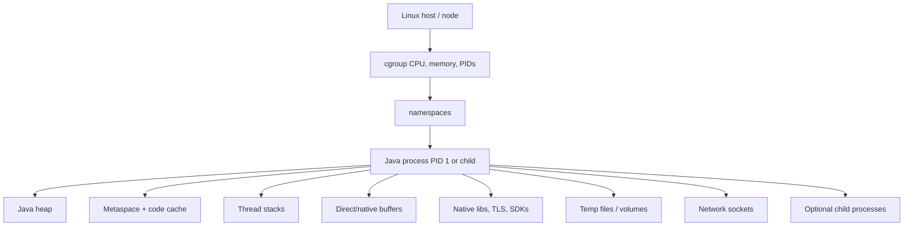
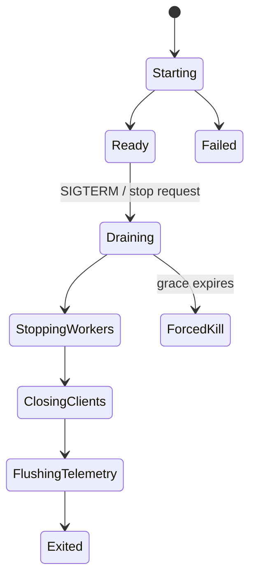
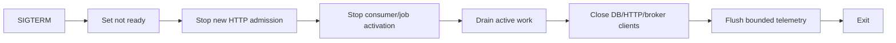

# Part 045 — JVM Runtime in Containers, Graceful Shutdown, Health, and Production Operations

> Image yang berhasil dibangun belum berarti Java process dapat bertahan di production. Runtime correctness bergantung pada cgroup CPU/memory limits, heap plus native-memory budget, process and signal semantics, shutdown ordering, connection draining, health-state modeling, filesystem assumptions, diagnostics, and platform termination behavior. Container bukan mini-VM: container adalah isolated process tree yang dapat dihentikan secara paksa, dijadwalkan ulang, di-throttle, atau di-OOM-kill tanpa kesempatan recovery application-level.

## Daftar Isi

1. [Target kompetensi](#target-kompetensi)
2. [Scope dan baseline](#scope-dan-baseline)
3. [Boundary dengan Part 044 dan Part 046](#boundary-dengan-part-044-dan-part-046)
4. [Mental model Java process inside a container](#mental-model-java-process-inside-a-container)
5. [Container is a process isolation boundary](#container-is-a-process-isolation-boundary)
6. [Host, namespace, and cgroup boundaries](#host-namespace-and-cgroup-boundaries)
7. [Container-aware JVM](#container-aware-jvm)
8. [`UseContainerSupport`](#usecontainersupport)
9. [Effective CPU count](#effective-cpu-count)
10. [`ActiveProcessorCount`](#activeprocessorcount)
11. [CPU request, CPU limit, and JVM perception](#cpu-request-cpu-limit-and-jvm-perception)
12. [CPU throttling](#cpu-throttling)
13. [Thread-pool sizing under CPU quotas](#thread-pool-sizing-under-cpu-quotas)
14. [Memory is more than Java heap](#memory-is-more-than-java-heap)
15. [Container memory budget](#container-memory-budget)
16. [`-Xmx` versus percentage-based heap sizing](#xmx-versus-percentage-based-heap-sizing)
17. [`MaxRAMPercentage`](#maxrampercentage)
18. [`InitialRAMPercentage` and `MinRAMPercentage`](#initialrampercentage-and-minrampercentage)
19. [Heap headroom](#heap-headroom)
20. [Metaspace](#metaspace)
21. [Code cache](#code-cache)
22. [Thread stacks](#thread-stacks)
23. [Direct and mapped buffers](#direct-and-mapped-buffers)
24. [Native libraries and allocators](#native-libraries-and-allocators)
25. [JIT and compiler threads](#jit-and-compiler-threads)
26. [TLS, compression, and SDK native memory](#tls-compression-and-sdk-native-memory)
27. [Memory fragmentation](#memory-fragmentation)
28. [RSS versus committed heap](#rss-versus-committed-heap)
29. [Native Memory Tracking](#native-memory-tracking)
30. [Container OOM versus Java OutOfMemoryError](#container-oom-versus-java-outofmemoryerror)
31. [Exit codes and OOM evidence](#exit-codes-and-oom-evidence)
32. [`ExitOnOutOfMemoryError` and crash policy](#exitonoutofmemoryerror-and-crash-policy)
33. [Heap dumps](#heap-dumps)
34. [Heap-dump storage and security](#heap-dump-storage-and-security)
35. [Garbage collector selection](#garbage-collector-selection)
36. [G1 in containers](#g1-in-containers)
37. [ZGC and generational ZGC](#zgc-and-generational-zgc)
38. [GC thread count and constrained CPU](#gc-thread-count-and-constrained-cpu)
39. [GC logs](#gc-logs)
40. [Allocation rate and live set](#allocation-rate-and-live-set)
41. [Humongous and large objects](#humongous-and-large-objects)
42. [PID 1 semantics](#pid-1-semantics)
43. [Exec-form entrypoint](#exec-form-entrypoint)
44. [Shell wrappers and `exec`](#shell-wrappers-and-exec)
45. [Zombie process reaping](#zombie-process-reaping)
46. [Tiny init processes](#tiny-init-processes)
47. [Linux signals](#linux-signals)
48. [`SIGTERM` and `SIGKILL`](#sigterm-and-sigkill)
49. [Signal delivery to Java](#signal-delivery-to-java)
50. [Shutdown hooks](#shutdown-hooks)
51. [Shutdown hook limitations](#shutdown-hook-limitations)
52. [Graceful shutdown state machine](#graceful-shutdown-state-machine)
53. [Stop admission before draining](#stop-admission-before-draining)
54. [HTTP connection draining](#http-connection-draining)
55. [In-flight request deadline](#in-flight-request-deadline)
56. [Background workers and message consumers](#background-workers-and-message-consumers)
57. [Database and HTTP client shutdown](#database-and-http-client-shutdown)
58. [Outbox, buffers, and asynchronous telemetry](#outbox-buffers-and-asynchronous-telemetry)
59. [Shutdown ordering](#shutdown-ordering)
60. [Forced termination](#forced-termination)
61. [Idempotency after forced termination](#idempotency-after-forced-termination)
62. [Startup lifecycle](#startup-lifecycle)
63. [Configuration validation](#configuration-validation)
64. [Dependency initialization](#dependency-initialization)
65. [Lazy versus eager initialization](#lazy-versus-eager-initialization)
66. [Warmup](#warmup)
67. [JIT and cold-start behavior](#jit-and-cold-start-behavior)
68. [Cache and connection warmup](#cache-and-connection-warmup)
69. [Health-state model](#health-state-model)
70. [Liveness](#liveness)
71. [Readiness](#readiness)
72. [Startup health](#startup-health)
73. [Health endpoints versus orchestration probes](#health-endpoints-versus-orchestration-probes)
74. [Dependency health](#dependency-health)
75. [Critical versus optional dependencies](#critical-versus-optional-dependencies)
76. [Avoid restart storms](#avoid-restart-storms)
77. [Health endpoint security](#health-endpoint-security)
78. [Health response payload](#health-response-payload)
79. [JAX-RS health resource pattern](#jax-rs-health-resource-pattern)
80. [Application state transitions](#application-state-transitions)
81. [Filesystem assumptions](#filesystem-assumptions)
82. [Read-only root filesystem](#read-only-root-filesystem)
83. [Temporary directories](#temporary-directories)
84. [Writable volumes](#writable-volumes)
85. [Log files versus standard streams](#log-files-versus-standard-streams)
86. [Configuration and secret files](#configuration-and-secret-files)
87. [File watching and atomic replacement](#file-watching-and-atomic-replacement)
88. [Time, timezone, locale, and encoding](#time-timezone-locale-and-encoding)
89. [DNS behavior](#dns-behavior)
90. [Hostname and instance identity](#hostname-and-instance-identity)
91. [Randomness and entropy](#randomness-and-entropy)
92. [User and permissions](#user-and-permissions)
93. [Linux capabilities and privileged operations](#linux-capabilities-and-privileged-operations)
94. [Native libraries and CPU architecture](#native-libraries-and-cpu-architecture)
95. [Container logs](#container-logs)
96. [Structured logging](#structured-logging)
97. [Log backpressure](#log-backpressure)
98. [Metrics](#metrics)
99. [JVM metrics](#jvm-metrics)
100. [Process and cgroup metrics](#process-and-cgroup-metrics)
101. [Tracing and context](#tracing-and-context)
102. [Java Flight Recorder](#java-flight-recorder)
103. [Continuous JFR](#continuous-jfr)
104. [`jcmd` and diagnostic commands](#jcmd-and-diagnostic-commands)
105. [Thread dumps](#thread-dumps)
106. [Heap histograms](#heap-histograms)
107. [JMX](#jmx)
108. [Remote debugging](#remote-debugging)
109. [Crash files and core dumps](#crash-files-and-core-dumps)
110. [Ephemeral container diagnostics boundary](#ephemeral-container-diagnostics-boundary)
111. [Runtime configuration flags](#runtime-configuration-flags)
112. [Safe JVM flag governance](#safe-jvm-flag-governance)
113. [`JAVA_TOOL_OPTIONS` and environment injection](#java-tool-options-and-environment-injection)
114. [Container runtime smoke tests](#container-runtime-smoke-tests)
115. [Termination tests](#termination-tests)
116. [Memory-limit tests](#memory-limit-tests)
117. [CPU-limit tests](#cpu-limit-tests)
118. [Cold-start tests](#cold-start-tests)
119. [Soak and leak tests](#soak-and-leak-tests)
120. [Failure-model matrix](#failure-model-matrix)
121. [Debugging playbook](#debugging-playbook)
122. [Architecture patterns](#architecture-patterns)
123. [Anti-patterns](#anti-patterns)
124. [PR review checklist](#pr-review-checklist)
125. [Trade-off yang harus dipahami senior engineer](#trade-off-yang-harus-dipahami-senior-engineer)
126. [Internal verification checklist](#internal-verification-checklist)
127. [Latihan verifikasi](#latihan-verifikasi)
128. [Ringkasan](#ringkasan)
129. [Referensi resmi](#referensi-resmi)

---

## Target kompetensi

Setelah menyelesaikan part ini, Anda harus mampu:

- menjelaskan Linux container sebagai isolated process tree, not mini-VM;
- menentukan effective CPU and memory available to JVM;
- membedakan cgroup memory limit, Java heap, RSS, native memory, and filesystem cache;
- membuat total memory budget covering heap, metaspace, code cache, stacks, direct buffers, native clients, and safety headroom;
- memilih explicit `-Xmx` or percentage-based sizing with evidence;
- memahami container CPU throttling and its effect on pools, JIT, and GC;
- mengoperasikan G1/ZGC based on measured SLO rather than folklore;
- menjelaskan PID 1, exec-form entrypoint, signal forwarding, and zombie reaping;
- membangun graceful shutdown with admission stop, drain, worker stop, client close, and bounded deadline;
- mendesain liveness, readiness, and startup states without restart loops;
- membedakan Java `OutOfMemoryError` from external container OOM kill;
- mengelola read-only filesystem, temp files, logs, secrets, timezone, DNS, and permissions;
- mengumpulkan JFR, thread dumps, NMT, heap histograms, and crash evidence safely;
- menguji runtime under termination, memory limit, CPU quota, cold start, and long soak;
- melakukan PR review atas runtime flags and lifecycle.

---

## Scope dan baseline

Baseline:

- Linux containers built through Part 044;
- Java 17+ and potentially Java 21/25 runtime;
- JAX-RS/Jersey application;
- one primary Java process per application container;
- orchestrator may be Docker, Kubernetes, ECS, or another platform;
- health checks and signal-driven termination available;
- application uses databases, HTTP clients, messaging consumers, caches, and telemetry.

Part ini **tidak mengasumsikan**:

- exact JDK distribution/version;
- G1 or ZGC;
- fixed heap size;
- Kubernetes deployment;
- shell wrapper;
- tini/dumb-init;
- root or non-root user;
- read-only root filesystem;
- JFR/JMX enabled;
- exact health library;
- server/runtime graceful-shutdown support;
- internal CSG JVM flags;
- cgroup v1 or v2;
- `-Xmx` equals memory limit.

---

## Boundary dengan Part 044 dan Part 046

| Part | Fokus |
|---|---|
| Part 044 | Building immutable OCI images and supply-chain evidence |
| Part 045 | Running the Java process correctly inside a container |
| Part 046 | Scheduling and managing containers as Kubernetes Pods/Deployments/Services |

Dockerfile choices influence runtime, but Pod rollout and probe configuration belong primarily to Part 046.

---

## Mental model Java process inside a container



The container memory limit applies to the whole process/container accounting, not only heap.

---

## Container is a process isolation boundary

A container generally provides:

- process namespace;
- filesystem view;
- network namespace;
- cgroup resource accounting;
- security controls.

It shares the host kernel.

An application can be killed by runtime/orchestrator without a normal JVM exception.

---

## Host, namespace, and cgroup boundaries

Different observations may report:

- host total CPU/memory;
- cgroup quota/limit;
- process usage;
- namespace-local PID/hostname;
- mounted filesystem capacity.

Use container-aware JVM and cgroup metrics.

---

## Container-aware JVM

Modern HotSpot detects container resource limits on supported Linux configurations.

Verify with:

```bash
java -XshowSettings:system -version
java -XshowSettings:vm -version
```

and diagnostic logs such as:

```bash
-Xlog:os+container=trace
```

Exact output depends on JDK.

---

## `UseContainerSupport`

Container support is enabled by default on modern Linux HotSpot JDKs.

Do not disable it unless a controlled benchmark or platform requirement proves need.

A custom JVM distribution or very old JDK may behave differently.

---

## Effective CPU count

JVM uses an effective processor count to size:

- GC threads;
- ForkJoin common pool;
- compiler threads;
- some framework defaults;
- parallel streams;
- executors.

Effective CPU may be influenced by cgroup quota, cpuset, and JVM flags.

---

## `ActiveProcessorCount`

`-XX:ActiveProcessorCount=N` overrides CPU count used by JVM subsystems even when container support is enabled.

Use only when:

- JVM detection does not match intended concurrency;
- CPU quota is fractional but workload needs conservative whole-number sizing;
- benchmarking requires stable configuration.

It does not grant additional CPU.

---

## CPU request, CPU limit, and JVM perception

Container orchestrators can distinguish:

- requested/scheduled CPU;
- hard or quota-based CPU limit.

JVM may perceive quota rather than request.

Application could be scheduled with low request but allowed to burst, or throttled by limit.

Exact behavior depends on runtime and cgroup mode.

---

## CPU throttling

CPU limit can enforce quota over time windows.

Symptoms:

- p99 latency;
- delayed GC/JIT;
- request queues;
- low-looking application CPU compared with demand;
- stalled heartbeats;
- lease renewal delays.

Measure cgroup throttling, not only JVM CPU.

---

## Thread-pool sizing under CPU quotas

Avoid:

```text
poolSize = host CPUs × arbitrary factor
```

Size separately for:

- CPU-bound work;
- blocking I/O;
- server requests;
- database connections;
- outbound HTTP;
- worker callbacks.

Concurrency must respect downstream capacity, not only CPU count.

---

## Memory is more than Java heap

Process memory includes:

```text
heap
+ metaspace
+ compressed class space
+ code cache
+ thread stacks
+ direct buffers
+ native libraries
+ TLS/compression
+ memory-mapped files
+ allocator fragmentation
+ diagnostics
+ child processes
```

---

## Container memory budget

Example for a 2 GiB container, not a universal recommendation:

```text
heap                         1,200 MiB
metaspace + code cache         180 MiB
thread stacks                  120 MiB
direct/native buffers          220 MiB
native libraries/allocator      80 MiB
diagnostics/variation/headroom 248 MiB
--------------------------------------
total                        2,048 MiB
```

Measure real workload before fixing numbers.

---

## `-Xmx` versus percentage-based heap sizing

Explicit `-Xmx`:

- predictable across environments;
- requires per-size configuration;
- makes non-heap budget visible.

Percentage:

- adapts to limit;
- can be convenient across shapes;
- may allocate too much after native growth;
- behavior depends on JVM ergonomics and detected memory.

---

## `MaxRAMPercentage`

`-XX:MaxRAMPercentage=p` influences maximum heap as a percentage of memory available to JVM.

Do not assume default percentage gives safe total process memory.

Example only:

```bash
java -XX:MaxRAMPercentage=60.0 -jar app.jar
```

The remaining 40% is not automatically reserved; it is simply outside max heap.

---

## `InitialRAMPercentage` and `MinRAMPercentage`

These flags influence ergonomic initial/max heap decisions under certain memory-size conditions.

They are frequently misunderstood.

Inspect effective values:

```bash
java -XX:+PrintFlagsFinal -version
```

Prefer explicit documented policy.

---

## Heap headroom

Headroom is needed for:

- traffic burst;
- changed allocation;
- classloading;
- direct buffers;
- connection growth;
- diagnostic recording;
- GC transient behavior;
- native fragmentation.

Do not tune container to steady-state average.

---

## Metaspace

Metaspace stores class metadata in native memory.

Growth sources:

- many classes;
- generated proxies;
- classloader leaks;
- redeployment;
- scripting;
- dynamic compilation.

Monitor loaded classes and metaspace.

---

## Code cache

JIT-compiled machine code consumes native code cache.

Exhaustion can disable compilation and degrade performance.

Do not arbitrarily shrink it for image-size concerns; code cache is runtime memory, not image layer size.

---

## Thread stacks

Each platform thread reserves stack memory according to JVM/OS settings.

Thousands of threads can consume substantial virtual and resident memory.

Reducing `-Xss` risks `StackOverflowError`; fix excessive thread count first.

---

## Direct and mapped buffers

NIO, Netty, HTTP clients, compression, file mapping, TLS, Kafka, and cloud SDKs can allocate outside heap.

Direct-memory pressure can occur while heap looks healthy.

`-XX:MaxDirectMemorySize` may bound some direct buffer behavior, but library/native allocations require broader accounting.

---

## Native libraries and allocators

JNI, crypto, DNS, compression, native transports, and libc allocator arenas affect RSS.

Native memory may not return promptly to OS.

---

## JIT and compiler threads

JIT improves steady-state speed but consumes CPU and native memory.

Constrained startup can delay readiness.

Do not disable compilation without benchmark evidence.

---

## TLS, compression, and SDK native memory

Native/native-like memory users include:

- OpenSSL/crypto providers;
- Netty direct buffers;
- AWS CRT;
- compression codecs;
- database client buffers;
- broker clients.

Inventory them.

---

## Memory fragmentation

RSS can remain high after application frees memory.

Different causes:

- heap committed size;
- native allocator fragmentation;
- direct-buffer lifecycle;
- mmap;
- page cache accounting;
- glibc arenas.

Use NMT and OS/cgroup data.

---

## RSS versus committed heap

Definitions:

- used heap: live/currently occupied JVM heap;
- committed heap: memory reserved/committed to heap;
- max heap: upper bound;
- RSS: resident process pages;
- cgroup usage: container-accounted memory, which may include more.

Do not compare `heap used` directly to container limit.

---

## Native Memory Tracking

NMT can categorize HotSpot native memory.

Typical startup:

```bash
-XX:NativeMemoryTracking=summary
```

Query:

```bash
jcmd <pid> VM.native_memory summary
jcmd <pid> VM.native_memory baseline
jcmd <pid> VM.native_memory summary.diff
```

NMT has overhead and does not track every third-party native allocation.

---

## Container OOM versus Java OutOfMemoryError

Java OOME occurs when JVM cannot satisfy allocation under its managed limits.

Container OOM kill occurs when kernel/runtime kills process for cgroup memory pressure.

Container OOM kill may produce:

- no Java exception;
- no shutdown hook;
- no heap dump;
- abrupt exit.

---

## Exit codes and OOM evidence

A process killed by `SIGKILL` often appears as exit status `137` in container environments, but do not diagnose solely from code.

Correlate:

- runtime reason;
- cgroup memory events;
- orchestrator status;
- node kernel logs;
- RSS;
- heap/native metrics.

---

## `ExitOnOutOfMemoryError` and crash policy

`-XX:+ExitOnOutOfMemoryError` terminates JVM after OOME.

This can be appropriate because process state after OOME may be unreliable.

Alternative flags and crash behavior must be reviewed carefully.

A restart does not fix a leak or undersized limit.

---

## Heap dumps

Possible configuration:

```bash
-XX:+HeapDumpOnOutOfMemoryError
-XX:HeapDumpPath=/diagnostics
```

Dump may fail if:

- no space;
- read-only path;
- process is kernel-killed;
- permissions;
- dump exceeds volume.

---

## Heap-dump storage and security

Heap dumps may contain:

- tokens;
- passwords;
- PII;
- customer data;
- encryption material.

Use encrypted restricted storage, retention, audited access, and secure deletion.

---

## Garbage collector selection

Choose by:

- latency SLO;
- heap/live set;
- allocation;
- CPU budget;
- JDK;
- operational skill;
- pause tolerance.

Benchmark with production-like load.

---

## G1 in containers

G1 is a common default on modern server-class HotSpot.

Observe:

- pause targets;
- young sizing;
- concurrent cycles;
- mixed collections;
- humongous regions;
- evacuation failures;
- CPU overhead.

Do not hard-code many legacy tuning flags before measuring.

---

## ZGC and generational ZGC

ZGC targets very low pauses with concurrent work.

Generational ZGC is available in recent JDKs and has evolved across releases.

Trade-offs:

- CPU;
- memory headroom;
- JDK baseline;
- diagnostics;
- workload behavior.

Do not apply JDK 25 settings to Java 17 runtime.

---

## GC thread count and constrained CPU

GC worker/concurrent threads consume effective CPUs.

CPU throttling can delay concurrent collectors.

Inspect ergonomics and use `ActiveProcessorCount` only with evidence.

---

## GC logs

Unified logging example:

```bash
-Xlog:gc*,safepoint:file=/diagnostics/gc.log:time,uptime,level,tags:filecount=5,filesize=20m
```

If root filesystem is read-only, use writable volume or stdout.

Protect logs from unbounded growth.

---

## Allocation rate and live set

Allocation rate determines GC work.

Live set determines minimum retained heap.

Measure both.

A low pause time with rising live set may still end in OOM.

---

## Humongous and large objects

Large JSON/XML bodies, byte arrays, compression buffers, and documents can create special GC behavior.

Stream and bound input rather than only increasing heap.

---

## PID 1 semantics

The first process in container has PID 1 in its PID namespace.

PID 1 has special Linux signal and child-reaping behavior.

If a shell is PID 1 and does not forward signals, Java may not receive termination.

---

## Exec-form entrypoint

Prefer:

```dockerfile
ENTRYPOINT ["java", "-jar", "/app/app.jar"]
```

over shell form:

```dockerfile
ENTRYPOINT java -jar /app/app.jar
```

Exec form makes Java the primary process and preserves signal behavior.

---

## Shell wrappers and `exec`

If a wrapper is required:

```sh
#!/bin/sh
set -eu
exec java ${JAVA_OPTS:-} -jar /app/app.jar
```

`exec` replaces shell process with Java.

Avoid unsafe unquoted expansion for complex arguments; arrays require a shell supporting them or a different launcher design.

---

## Zombie process reaping

If Java launches child processes and does not wait for them, exited children can become zombies.

Use proper `ProcessHandle`/wait logic or a tiny init process when child-process behavior warrants it.

---

## Tiny init processes

An init such as `tini` can:

- forward signals;
- reap children.

It adds another process and configuration.

Do not add one automatically when Java is the only process and handles lifecycle correctly; test actual need.

---

## Linux signals

Important:

- `SIGTERM`: graceful termination request;
- `SIGKILL`: immediate, cannot be handled;
- `SIGINT`: interactive interrupt;
- `SIGHUP`: convention-specific reload;
- `SIGQUIT`: JVM commonly prints thread dump on Unix-like systems.

Signal behavior can differ by JVM/platform.

---

## `SIGTERM` and `SIGKILL`

Container stop generally sends termination signal, waits grace period, then sends `SIGKILL`.

Shutdown must finish inside platform deadline.

Never rely on hooks after `SIGKILL`.

---

## Signal delivery to Java

Requirements:

- Java or signal-forwarding init is target process;
- shell does not swallow signal;
- runtime sends expected signal;
- JVM handler remains responsive;
- process is not stuck in uninterruptible kernel state.

---

## Shutdown hooks

Java shutdown hooks can run during orderly JVM shutdown and selected signals.

Use for:

- initiate server stop;
- close clients;
- flush bounded telemetry;
- release local resources.

---

## Shutdown hook limitations

Hooks:

- run concurrently unless coordinated;
- may deadlock;
- have no inherent timeout;
- do not run on `SIGKILL`, kernel OOM kill, power loss, or severe crash;
- should not perform unbounded network work;
- must tolerate partially failed state.

Prefer one orchestrated lifecycle manager.

---

## Graceful shutdown state machine



---

## Stop admission before draining

First mark process not ready / stop accepting new work.

Otherwise new requests arrive while waiting for old ones.

---

## HTTP connection draining

Drain includes:

- remove from routing;
- reject new requests;
- allow in-flight work;
- close keep-alive listeners/connections according to server;
- stop HTTP/2 streams safely;
- handle client disconnect.

Exact Jersey/Grizzly/Servlet behavior must be verified.

---

## In-flight request deadline

Set drain timeout below platform termination grace:

```text
termination grace 60s
readiness removal propagation 5s
in-flight drain 40s
client/telemetry close 10s
safety margin 5s
```

Numbers are examples.

Requests exceeding deadline must be cancelled or allowed to be retried idempotently.

---

## Background workers and message consumers

Shutdown order:

1. stop polling/activating new records/jobs;
2. wait bounded active handlers;
3. commit/ack only completed effects;
4. leave incomplete work for redelivery;
5. close consumers.

Do not acknowledge work merely to make shutdown quick.

---

## Database and HTTP client shutdown

Close connection pools after in-flight application work.

Closing early creates failures during drain.

Close shared HTTP clients after adapters/workers stop.

---

## Outbox, buffers, and asynchronous telemetry

Flush only bounded buffers.

Durable outbox should not require full publication before shutdown.

Telemetry loss may be acceptable; business-event loss is not.

---

## Shutdown ordering



---

## Forced termination

Design assuming forced termination can occur at every instruction.

Use:

- transactions;
- idempotency;
- outbox/inbox;
- message redelivery;
- temporary-file atomic rename;
- reconciliation.

---

## Idempotency after forced termination

Critical boundary:

```text
external effect committed
process killed before response/ack
```

Retry may duplicate.

Runtime lifecycle cannot replace idempotency.

---

## Startup lifecycle

Stages:

1. JVM starts;
2. configuration loads;
3. dependency graph builds;
4. server binds;
5. migrations/initialization according to policy;
6. clients connect lazily/eagerly;
7. warmup;
8. readiness becomes true.

---

## Configuration validation

Fail fast on:

- malformed endpoint;
- missing required secret reference;
- invalid timeout;
- incompatible feature flags;
- duplicate routes/providers;
- unsupported JDK/runtime;
- unwritable mandatory path.

Do not log secret values.

---

## Dependency initialization

Eager initialization catches failure before readiness but can amplify startup storms.

Lazy initialization reduces startup time but moves first failure to user request.

Choose per dependency.

---

## Lazy versus eager initialization

| Eager | Lazy |
|---|---|
| early evidence | faster startup |
| startup dependency coupling | first-request latency/failure |
| can warm pools | less initial load |
| restart storm risk | hidden configuration error |

---

## Warmup

Warmup may include:

- classloading;
- route/provider initialization;
- JSON serializers;
- database pool minimum;
- TLS connections;
- caches;
- selected compiled hot paths.

Do not send synthetic writes to real business resources.

---

## JIT and cold-start behavior

Early requests may be slower due to:

- class loading;
- verification;
- profiling;
- compilation;
- cache miss.

Readiness delay or controlled warmup can protect SLO, but excessive delay slows rollout.

---

## Cache and connection warmup

Warm only bounded high-value data/connections.

Fleet-wide warmup can overload dependencies.

Add jitter and concurrency limits.

---

## Health-state model

Model at least:

```text
STARTING
READY
NOT_READY / DEGRADED
DRAINING
FAILED
```

Health should be stateful and reason-coded internally.

---

## Liveness

Liveness asks:

```text
Can this process make forward progress, or should the platform restart it?
```

Good liveness is local and cheap.

Examples:

- event loop/deadlock watchdog;
- internal fatal state;
- required server thread unavailable.

Do not fail liveness merely because database is temporarily unavailable.

---

## Readiness

Readiness asks:

```text
Should new traffic/work be routed to this instance now?
```

It can be false during:

- startup;
- drain;
- critical local initialization failure;
- severe overload;
- mandatory dependency unavailable, if no safe degraded behavior.

---

## Startup health

Startup health protects slow-starting applications from premature liveness failure.

Once startup succeeds, normal liveness applies.

---

## Health endpoints versus orchestration probes

An internal health model can expose multiple views.

Orchestrator endpoints should be:

- fast;
- bounded;
- stable;
- unauthenticated only on restricted management interface/network if policy permits;
- free of expensive fan-out.

---

## Dependency health

Avoid synchronous call to every downstream on every health probe.

This creates:

- probe storm;
- cascading restart;
- false outage;
- added load during dependency incident.

Use recent observed state, circuit status, or dedicated low-rate checks.

---

## Critical versus optional dependencies

Classify:

- mandatory to serve any request;
- mandatory for one operation;
- optional/degradable;
- asynchronous.

Readiness should reflect the process's routable capabilities and platform routing granularity.

---

## Avoid restart storms

If database fails and every pod fails liveness:

```text
DB outage → all pods restart → startup connection storm → DB recovery delayed
```

Keep liveness local.

---

## Health endpoint security

Health detail can expose:

- dependency names;
- versions;
- topology;
- error messages;
- resource pressure.

Expose minimal public response; keep detailed diagnostics behind protected management access.

---

## Health response payload

Minimal:

```json
{
  "status": "UP"
}
```

Internal detail may include reason codes and timestamps, not secrets.

---

## JAX-RS health resource pattern

```java
@Path("/health")
@Produces(MediaType.APPLICATION_JSON)
public final class HealthResource {
    private final ApplicationHealth health;

    @GET
    @Path("/live")
    public Response live() {
        return health.isLive()
                ? Response.ok(Map.of("status", "UP")).build()
                : Response.status(503).entity(Map.of("status", "DOWN")).build();
    }

    @GET
    @Path("/ready")
    public Response ready() {
        return health.isReady()
                ? Response.ok(Map.of("status", "UP")).build()
                : Response.status(503).entity(Map.of("status", "OUT_OF_SERVICE")).build();
    }
}
```

Use standard health technology if platform has one; do not duplicate inconsistent endpoints.

---

## Application state transitions

State updates must be thread-safe.

Shutdown must make readiness false before accepting more work.

Expose transition reason in internal telemetry.

---

## Filesystem assumptions

Container writable layer is usually ephemeral and capacity-limited.

Never treat it as durable business storage.

---

## Read-only root filesystem

A read-only root improves security.

Application must explicitly provide writable locations for:

- `/tmp`;
- diagnostics;
- generated files;
- caches;
- uploads;
- keystores if modified.

---

## Temporary directories

Java uses `java.io.tmpdir`.

Set and mount a bounded writable temp path.

Clean files and defend against filename/path attacks.

---

## Writable volumes

Use volumes only for data that must outlive process or exceed writable-layer expectations.

Define:

- ownership;
- permissions;
- capacity;
- retention;
- backup;
- concurrent access;
- cleanup.

---

## Log files versus standard streams

Prefer stdout/stderr for container log collection.

File logging may be justified for JFR/GC/crash artifacts, with mounted bounded storage.

Avoid duplicate console and file logs unintentionally.

---

## Configuration and secret files

Mounted files may update via symlink/atomic directory replacement.

Application must not assume in-place byte modification.

Do not copy mounted secrets to world-readable temp files.

---

## File watching and atomic replacement

File watcher must handle:

- rename;
- symlink swap;
- partial update avoidance;
- permission;
- reload failure;
- old/new overlap.

Reload immutable configuration snapshot atomically.

---

## Time, timezone, locale, and encoding

Set explicit:

- UTC or business timezone semantics;
- `file.encoding`/UTF-8 policy;
- locale for parsing/formatting;
- clock synchronization.

Do not rely on base-image local timezone.

---

## DNS behavior

JVM, OS resolver, HTTP client, and connection pools may cache DNS differently.

A long-lived connection can remain on old IP after DNS changes.

Verify TTL and failover behavior.

---

## Hostname and instance identity

Container hostname/pod name is ephemeral.

Do not use it as durable business identity or idempotency key.

It is useful as telemetry instance ID.

---

## Randomness and entropy

Modern Linux random sources are generally suitable, but validate cryptographic provider behavior in minimal images and unusual startup environments.

Do not use predictable random for security tokens.

---

## User and permissions

Run non-root where possible.

Ensure runtime user can:

- read app artifacts;
- read secrets;
- bind configured port;
- write approved temp/diagnostic volume.

Avoid blanket `chmod 777`.

---

## Linux capabilities and privileged operations

Drop capabilities by default.

Java HTTP service usually does not need privileged mode.

Binding below port 1024 or packet-level operations should be explicitly justified.

---

## Native libraries and CPU architecture

Multi-architecture images require native dependencies for each architecture.

Test:

- JNI;
- crypto;
- Netty native transport;
- compression;
- fonts;
- libc compatibility.

---

## Container logs

Logs should go to standard streams and include:

- timestamp;
- level;
- service/version;
- instance;
- trace/correlation;
- event category.

Do not rely on multiline stack trace parsing without collector support.

---

## Structured logging

Use stable fields and bounded values.

Avoid per-request giant JSON, bodies, tokens, and PII.

---

## Log backpressure

If stdout pipe or logging backend blocks, application threads may slow.

Prefer asynchronous bounded logging only when drop/block policy is explicit.

Never let logging buffer grow without bound.

---

## Metrics

Expose metrics on a management endpoint/port.

Include application and runtime views.

Avoid high-cardinality path IDs, tenant IDs, and exception messages.

---

## JVM metrics

Useful:

- heap used/committed/max;
- pool usage;
- allocation;
- GC count/time/pause;
- threads;
- classes;
- safepoints if available;
- direct buffers;
- code cache;
- process CPU.

---

## Process and cgroup metrics

Include:

- RSS;
- cgroup memory current/limit/events;
- CPU usage/quota/throttling;
- file descriptors;
- PIDs;
- disk/temp;
- network.

---

## Tracing and context

Telemetry exporters use memory, threads, buffers, and shutdown time.

Configure bounded queues and fail-safe export.

---

## Java Flight Recorder

JFR records JVM, OS, and custom application events with controlled overhead.

Use for:

- CPU;
- allocation;
- GC;
- locks;
- I/O;
- exceptions;
- thread behavior.

---

## Continuous JFR

A rolling recording can preserve evidence before an incident.

Example:

```bash
-XX:StartFlightRecording=name=continuous,settings=profile,disk=true,maxage=30m,maxsize=512m,filename=/diagnostics/continuous.jfr
```

Validate path, overhead, and retention.

---

## `jcmd` and diagnostic commands

`jcmd` can request:

- thread dump;
- heap info/histogram;
- GC actions;
- JFR start/dump/check;
- NMT;
- VM flags/system properties.

Tools may not exist in a jlink/minimal runtime image.

Use a diagnostic strategy rather than bloating every image without policy.

---

## Thread dumps

Acquire through:

- `jcmd <pid> Thread.print`;
- `jstack` where available;
- `SIGQUIT` on supported Unix JVMs;
- JFR/profiler.

Capture multiple dumps several seconds apart for deadlock/stall diagnosis.

---

## Heap histograms

Class histogram helps identify dominant object counts/bytes.

It does not replace heap-dump reference analysis.

---

## JMX

Remote JMX can expose powerful management operations and sensitive data.

If enabled:

- authentication;
- TLS;
- network restriction;
- fixed ports;
- no public exposure.

Often metrics/JFR are safer.

---

## Remote debugging

JDWP can pause application and permit code execution.

Never expose production debug port publicly.

Use temporary authorized diagnostic workflow only.

---

## Crash files and core dumps

JVM fatal-error logs (`hs_err_pid`) and core dumps can reveal secrets and consume large storage.

Configure secure writable location and retention.

---

## Ephemeral container diagnostics boundary

Kubernetes ephemeral containers may help inspect a live pod, but that belongs to platform operations and exact cluster policy.

Application image should still expose safe diagnostics where required.

---

## Runtime configuration flags

Classify flags:

- memory;
- GC;
- diagnostics;
- security;
- compatibility;
- system properties;
- application arguments.

Document owner and reason.

---

## Safe JVM flag governance

For each non-default flag record:

- JDK/version support;
- purpose;
- measured evidence;
- rollback;
- environment;
- owner;
- deprecation.

Remove obsolete “cargo-cult” flags.

---

## `JAVA_TOOL_OPTIONS` and environment injection

`JAVA_TOOL_OPTIONS` can inject JVM options even when launcher command is fixed.

Risks:

- hidden behavior;
- unsafe flags;
- secret exposure in environment/process diagnostics;
- duplicate/conflicting options.

Prefer explicit generated argument list with observable effective config.

---

## Container runtime smoke tests

Test the built image:

- starts as intended user;
- correct Java version;
- binds port;
- health states;
- read-only filesystem;
- temp/diagnostic path;
- TLS trust;
- DNS;
- no missing native library;
- receives signal;
- exits cleanly.

---

## Termination tests

Automate:

1. start active HTTP request/message;
2. send `SIGTERM`;
3. verify readiness false;
4. ensure no new work;
5. completed work is acknowledged;
6. incomplete work is retriable;
7. process exits within grace;
8. no corruption.

---

## Memory-limit tests

Run under realistic hard memory limit and load.

Measure heap, RSS, NMT, direct buffers, and OOM reason.

---

## CPU-limit tests

Apply quota and observe:

- throttling;
- p99;
- GC/JIT;
- pools;
- heartbeats/leases;
- readiness.

---

## Cold-start tests

Measure from container start to:

- server bind;
- startup healthy;
- ready;
- first request;
- steady performance.

---

## Soak and leak tests

Run long enough to detect:

- heap live-set growth;
- native/RSS growth;
- threads;
- file descriptors;
- connections;
- temp files;
- telemetry queues;
- classloader leaks.

---

## Failure-model matrix

| Failure | Impact | Detection | Response |
|---|---|---|---|
| Heap sized to entire memory limit | container OOM | cgroup/RSS | total-memory budget |
| JVM sees too many CPUs | excess threads/GC | JVM settings | container support/override |
| CPU limit throttles process | p99 and lease delays | cgroup throttling | resource/tuning |
| Native/direct memory grows | OOM with healthy heap | RSS/NMT | bound/investigate |
| Kernel OOM kill | abrupt loss/no hook | runtime reason | headroom/idempotency |
| Heap dump path unavailable | no evidence | OOME logs | writable secure volume |
| Shell remains PID 1 | Java misses SIGTERM | process tree | exec form |
| Child zombies accumulate | PID exhaustion | process metrics | reap/init |
| Shutdown hook blocks | forced kill | termination timeline | one bounded coordinator |
| Readiness remains true during drain | new work on terminating pod | access logs | state transition first |
| Client pool closed before drain | in-flight failures | shutdown logs | ordered close |
| Consumer acks during shutdown before effect | message loss | audit gap | ack after commit |
| Dependency outage fails liveness | restart storm | restart count | local liveness |
| Probe performs expensive fan-out | dependency/probe storm | probe traces | cached/local checks |
| Temp path read-only/full | request failure | filesystem metrics | explicit bounded volume |
| File log fills layer | eviction/crash | disk usage | stdout/rotation |
| DNS cached too long | stale endpoint | connection evidence | resolver/pool policy |
| JFR/log unbounded | disk/memory pressure | file metrics | max age/size |
| Debug/JMX public | security compromise | network scan | restricted workflow |
| Mixed JDK flags | startup failure/undefined tuning | effective flags | version governance |

---

## Debugging playbook

### Container exits with code 137

Check:

- orchestrator reason;
- cgroup `memory.events`;
- node kernel logs;
- RSS and heap;
- direct buffers;
- native clients;
- `SIGKILL` from operator;
- termination grace expiry.

Do not assume Java heap OOME.

### Heap looks low but container memory is high

Inspect:

- committed heap;
- NMT;
- direct buffers;
- thread stacks/count;
- native libraries;
- mmap;
- child processes;
- allocator fragmentation;
- page cache accounting.

### `SIGTERM` does not stop Java

Inspect process tree and Docker entrypoint.

Check shell-form command, missing `exec`, PID 1, signal, deadlocked shutdown hook, and server stop behavior.

### Pod/container takes full grace period

Create shutdown timeline:

- readiness off;
- HTTP accept stop;
- active requests;
- worker polling;
- client close;
- telemetry flush;
- hooks;
- non-daemon threads.

### Repeated restarts during database outage

Check whether liveness calls DB or readiness/liveness are shared.

Separate local process health from dependency availability.

### p99 worsens only under CPU limit

Check cgroup throttling, effective processors, GC/compiler threads, pool queues, and context switches.

### Container OOM after enabling telemetry

Inspect exporter queues, direct buffers, spans/log batches, JFR files, and native instrumentation.

### First requests are slow

Check classloading, JIT, serializer initialization, TLS/DNS, DB pool, cache, and readiness timing.

---

## Architecture patterns

### Explicit runtime memory budget

One document/config derives heap and native headroom from container limit.

### Single lifecycle coordinator

Owns readiness, HTTP drain, worker stop, client close, and telemetry flush.

### Local liveness, capability readiness

Liveness checks process; readiness checks whether instance should receive work.

### Durable work with abrupt-stop tolerance

Transactions, idempotency, and redelivery handle force kill.

### Rolling JFR evidence

Bounded continuous recording on protected volume.

### Read-only runtime

Immutable root with explicit `/tmp` and diagnostics mounts.

---

## Anti-patterns

- `-Xmx` equal to memory limit;
- tune heap from average use only;
- ignore direct/native memory;
- diagnose every exit 137 as Java OOME;
- disable container support;
- size all pools from host CPU;
- cargo-cult GC flags from another JDK;
- shell-form entrypoint;
- wrapper script without `exec`;
- many unrelated shutdown hooks;
- liveness checks database;
- same endpoint for startup/readiness/liveness without semantics;
- acknowledge message before drain completes;
- write durable data to container layer;
- log to unbounded files;
- run as root by default;
- expose JMX/JDWP publicly;
- dump heap to ephemeral tiny filesystem;
- inject unreviewed `JAVA_TOOL_OPTIONS`;
- no signal/memory/CPU tests of final image.

---

## PR review checklist

### CPU and memory

- [ ] Container-aware JDK verified?
- [ ] Effective CPU known?
- [ ] CPU request/limit behavior documented?
- [ ] Total memory budget, not heap-only?
- [ ] Heap strategy explicit?
- [ ] Native/direct/thread headroom?
- [ ] GC and JDK compatibility?
- [ ] OOM evidence/dump path?
- [ ] cgroup metrics and alerts?

### Process and shutdown

- [ ] Exec-form entrypoint or correct `exec`?
- [ ] PID 1 behavior tested?
- [ ] Child processes/reaping?
- [ ] SIGTERM reaches JVM?
- [ ] Readiness disabled before drain?
- [ ] New HTTP/message work stopped?
- [ ] In-flight deadline below grace?
- [ ] Client close ordering?
- [ ] Force-kill correctness/idempotency?

### Health and startup

- [ ] Distinct startup/liveness/readiness semantics?
- [ ] Liveness local?
- [ ] Dependency classification?
- [ ] No expensive probe fan-out?
- [ ] Startup validation?
- [ ] Warmup bounded?
- [ ] Detailed health protected?
- [ ] Restart-storm scenario tested?

### Filesystem/security

- [ ] Non-root user?
- [ ] Read-only root?
- [ ] Explicit temp/diagnostic volume?
- [ ] File size/retention?
- [ ] Secret mounts/permissions?
- [ ] No privileged capability?
- [ ] Timezone/encoding?
- [ ] Native architecture tested?

### Diagnostics

- [ ] JVM + cgroup metrics?
- [ ] JFR policy?
- [ ] NMT policy?
- [ ] Thread/heap diagnostic path?
- [ ] Logs bounded/redacted?
- [ ] JMX/JDWP restricted?
- [ ] Effective flags visible?
- [ ] Final-image smoke/termination test?

---

## Trade-off yang harus dipahami senior engineer

| Decision | Benefit | Cost/risk |
|---|---|---|
| Explicit `-Xmx` | predictable budget | per-size configuration |
| Percentage heap | portable sizing | hidden native headroom risk |
| Larger heap | fewer GCs | more memory/longer recovery |
| Smaller heap | lower footprint | GC/OOM pressure |
| G1 | mature balanced default | pause/live-set behavior |
| ZGC | low pauses | JDK/CPU/memory trade-offs |
| More threads | concurrency | stack/context/queue cost |
| CPU limit | cost/isolation | throttling/tail latency |
| No CPU limit | burst performance | noisy neighbor/scheduling policy |
| Java as PID 1 | simple signals | must reap children if any |
| Tiny init | signal/reaping | extra component |
| Long shutdown grace | drain more work | slow rollout/node drain |
| Short grace | fast replacement | forced termination |
| Eager dependency init | early failure | startup coupling/storm |
| Lazy init | fast start | first-request failure |
| Continuous JFR | incident evidence | disk/overhead/security |
| Minimal runtime image | smaller attack surface | fewer diagnostic tools |
| Read-only root | hardening | explicit writable mounts |
| stdout logging | platform integration | collector backpressure |

---

## Internal verification checklist

### JDK and JVM

- [ ] Distribution/version.
- [ ] cgroup v1/v2 support.
- [ ] `UseContainerSupport`.
- [ ] Effective CPU.
- [ ] Heap flags.
- [ ] GC and GC flags.
- [ ] Thread stack/direct memory.
- [ ] NMT/JFR settings.
- [ ] OOME/crash settings.
- [ ] Effective-flag inventory.

### Image and process

- [ ] Entrypoint/CMD.
- [ ] PID 1.
- [ ] Wrapper/init.
- [ ] Runtime user/group.
- [ ] Capabilities/seccomp.
- [ ] Root filesystem.
- [ ] temp/diagnostic paths.
- [ ] native dependencies/architectures.
- [ ] Java tools included or diagnostic alternative.

### Application lifecycle

- [ ] Server runtime and graceful-stop API.
- [ ] lifecycle coordinator.
- [ ] readiness state transition.
- [ ] HTTP drain.
- [ ] worker/consumer drain.
- [ ] DB/HTTP/broker close order.
- [ ] telemetry flush.
- [ ] shutdown deadline.
- [ ] forced-kill recovery behavior.

### Health and startup

- [ ] Health framework/endpoints.
- [ ] startup/readiness/liveness definitions.
- [ ] management port/network.
- [ ] dependency classification.
- [ ] warmup.
- [ ] startup timeout.
- [ ] probe/restart dashboards.
- [ ] health detail access.

### Observability and operations

- [ ] JVM metrics.
- [ ] cgroup/process metrics.
- [ ] GC logs.
- [ ] JFR retention.
- [ ] heap dump storage.
- [ ] thread-dump runbook.
- [ ] logs and redaction.
- [ ] exit-code/OOM diagnosis.
- [ ] signal and resource-limit tests.

---

## Latihan verifikasi

1. Print effective JVM container settings under multiple CPU/memory limits.
2. Build a full memory budget and compare it against measured RSS/NMT during peak.
3. Run with `-Xmx` equal to the memory limit and demonstrate why native headroom matters.
4. Send `SIGTERM` during a long HTTP request and a message handler; verify correct drain/redelivery.
5. Wrap Java in a shell without `exec`, observe signal behavior, then correct it.
6. Make the database unavailable and prove liveness stays healthy while readiness/degraded capability behaves as designed.
7. Apply CPU quota and correlate throttling with GC, p99, and worker lease renewal.
8. Enable bounded rolling JFR and extract CPU, allocation, lock, and socket evidence.
9. Fill temp/diagnostic volume and verify failure remains bounded and observable.
10. Force `SIGKILL` at transaction boundaries and prove idempotency/recovery.

---

## Ringkasan

- A container is an isolated process environment, not a mini-VM.
- Modern HotSpot can use cgroup CPU and memory limits, but effective settings must be verified.
- CPU quota changes latency, GC, JIT, and pool behavior through throttling.
- Container memory includes heap and all native/off-heap/process memory.
- `-Xmx` must leave measured native and safety headroom.
- RSS and cgroup memory are not equivalent to heap used.
- NMT helps categorize HotSpot native memory but does not explain every third-party allocation.
- Kernel/container OOM kill can happen without Java OOME, heap dump, or shutdown hooks.
- GC selection and tuning must match JDK, SLO, allocation, live set, and CPU limits.
- Exec-form entrypoint and PID 1 semantics determine signal delivery.
- Shutdown begins by stopping admission, then draining, stopping workers, closing clients, and flushing bounded telemetry.
- Forced termination must be safe through transactions, idempotency, and redelivery.
- Liveness is a restart decision; readiness is a routing/admission decision; startup health protects initialization.
- Dependency outages should not trigger fleet-wide liveness restart storms.
- Container writable storage is ephemeral unless an explicit volume provides required semantics.
- Logs, JFR, heap dumps, and temp files need bounded secure storage.
- JFR, NMT, thread dumps, heap histograms, JVM metrics, and cgroup metrics provide complementary evidence.
- Exact JDK, flags, limits, server lifecycle, and operational policy remain **Internal verification checklist**.

---

## Referensi resmi

- [Java 25 `java` Command](https://docs.oracle.com/en/java/javase/25/docs/specs/man/java.html)
- [Java 25 Monitoring and Management Guide](https://docs.oracle.com/en/java/javase/25/management/)
- [Java Flight Recorder API Guide](https://docs.oracle.com/en/java/javase/25/jfapi/)
- [JDK Mission Control](https://docs.oracle.com/en/java/java-components/jdk-mission-control/)
- [G1 Garbage Collector Tuning](https://docs.oracle.com/en/java/javase/25/gctuning/garbage-first-g1-garbage-collector1.html)
- [Z Garbage Collector](https://docs.oracle.com/en/java/javase/25/gctuning/z-garbage-collector.html)
- [Docker Running Containers](https://docs.docker.com/engine/containers/run/)
- [Dockerfile Reference](https://docs.docker.com/reference/dockerfile/)
- [Docker Build Best Practices](https://docs.docker.com/build/building/best-practices/)
- [Docker `container stop`](https://docs.docker.com/reference/cli/docker/container/stop/)
- [Docker JSON Arguments Recommended Check](https://docs.docker.com/reference/build-checks/json-args-recommended/)
- [Jakarta RESTful Web Services](https://jakarta.ee/specifications/restful-ws/)
