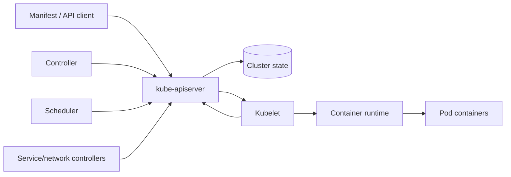
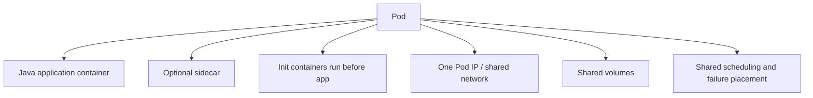
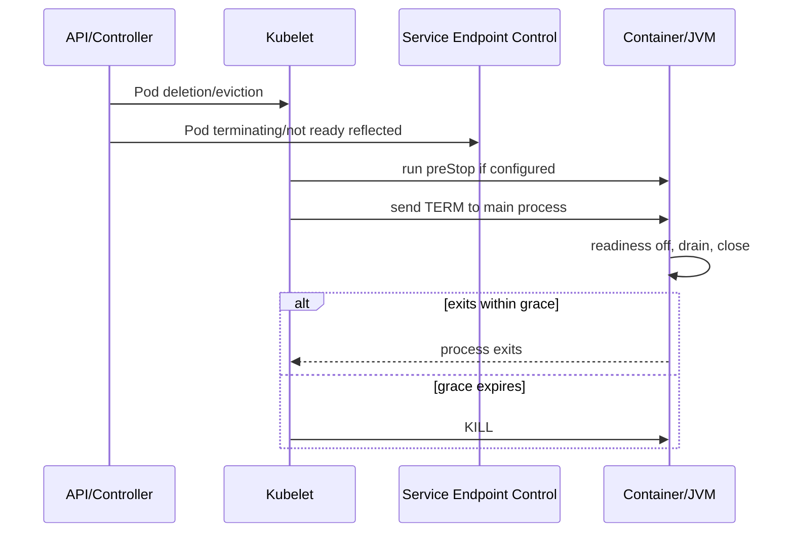
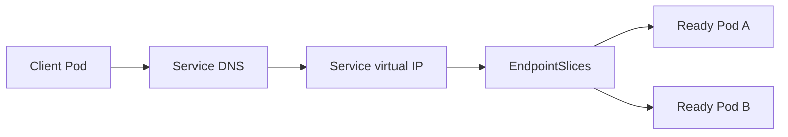
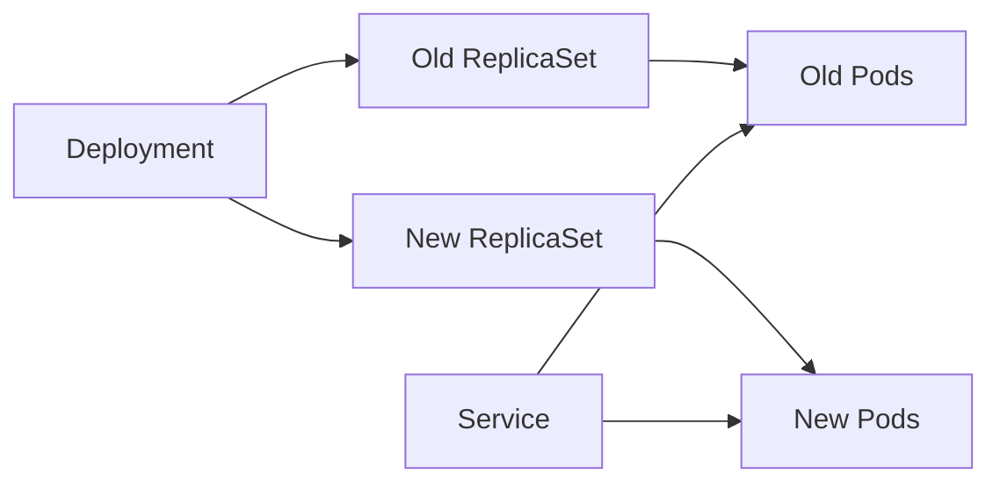

# Part 046 — Kubernetes Workloads, Pods, Deployments, Services, and Lifecycle

> Kubernetes tidak menjalankan “aplikasi”; Kubernetes merekonsiliasi API objects menuju desired state melalui controllers, scheduler, kubelet, container runtime, and networking components. Pod adalah unit scheduling and failure, bukan durable server identity. Deployment rollout bukan otomatis zero-downtime, probe bukan dependency monitor generik, resource request bukan kapasitas sebenarnya, Service bukan load balancer yang memahami transaksi, dan PodDisruptionBudget bukan jaminan bahwa Pod tidak pernah hilang. Correctness membutuhkan alignment antara application lifecycle dari Part 045 dan Kubernetes reconciliation semantics.

## Daftar Isi

1. [Target kompetensi](#target-kompetensi)
2. [Scope dan baseline](#scope-dan-baseline)
3. [Current Kubernetes version boundary](#current-kubernetes-version-boundary)
4. [Mental model Kubernetes reconciliation](#mental-model-kubernetes-reconciliation)
5. [Desired state versus observed state](#desired-state-versus-observed-state)
6. [Kubernetes API object anatomy](#kubernetes-api-object-anatomy)
7. [`apiVersion`, `kind`, `metadata`, `spec`, and `status`](#apiversion-kind-metadata-spec-and-status)
8. [Declarative updates](#declarative-updates)
9. [Controllers and reconciliation loops](#controllers-and-reconciliation-loops)
10. [Namespaces](#namespaces)
11. [Labels](#labels)
12. [Selectors](#selectors)
13. [Annotations](#annotations)
14. [Owner references and garbage collection](#owner-references-and-garbage-collection)
15. [Finalizers](#finalizers)
16. [Pod mental model](#pod-mental-model)
17. [Pod is an ephemeral scheduling unit](#pod-is-an-ephemeral-scheduling-unit)
18. [Pod network and shared namespaces](#pod-network-and-shared-namespaces)
19. [Multi-container Pods](#multi-container-pods)
20. [Main application containers](#main-application-containers)
21. [Init containers](#init-containers)
22. [Sidecar containers](#sidecar-containers)
23. [Native sidecar lifecycle](#native-sidecar-lifecycle)
24. [When not to use a sidecar](#when-not-to-use-a-sidecar)
25. [Pod phases](#pod-phases)
26. [Container states](#container-states)
27. [Container restart policy](#container-restart-policy)
28. [Restart backoff](#restart-backoff)
29. [CrashLoopBackOff](#crashloopbackoff)
30. [Pod conditions](#pod-conditions)
31. [Readiness gates](#readiness-gates)
32. [Pod scheduling lifecycle](#pod-scheduling-lifecycle)
33. [Pending Pods](#pending-pods)
34. [Image pull lifecycle](#image-pull-lifecycle)
35. [Container lifecycle hooks](#container-lifecycle-hooks)
36. [`postStart`](#poststart)
37. [`preStop`](#prestop)
38. [Termination grace period](#termination-grace-period)
39. [Pod termination sequence](#pod-termination-sequence)
40. [Endpoint removal and traffic propagation](#endpoint-removal-and-traffic-propagation)
41. [Application drain timing](#application-drain-timing)
42. [Force deletion](#force-deletion)
43. [Node-pressure termination](#node-pressure-termination)
44. [Liveness probe](#liveness-probe)
45. [Readiness probe](#readiness-probe)
46. [Startup probe](#startup-probe)
47. [Probe handlers](#probe-handlers)
48. [HTTP probes](#http-probes)
49. [TCP probes](#tcp-probes)
50. [Exec probes](#exec-probes)
51. [gRPC probes](#grpc-probes)
52. [Probe timing fields](#probe-timing-fields)
53. [Probe design](#probe-design)
54. [Probe anti-dependency pattern](#probe-anti-dependency-pattern)
55. [Startup and liveness interaction](#startup-and-liveness-interaction)
56. [Probe-level termination grace](#probe-level-termination-grace)
57. [Resource requests](#resource-requests)
58. [Resource limits](#resource-limits)
59. [CPU resources](#cpu-resources)
60. [Memory resources](#memory-resources)
61. [Ephemeral-storage resources](#ephemeral-storage-resources)
62. [Requests and scheduler placement](#requests-and-scheduler-placement)
63. [Limits and runtime enforcement](#limits-and-runtime-enforcement)
64. [CPU throttling](#cpu-throttling)
65. [Memory OOM](#memory-oom)
66. [JVM memory alignment](#jvm-memory-alignment)
67. [Resource overcommit](#resource-overcommit)
68. [Quality of Service classes](#quality-of-service-classes)
69. [Guaranteed](#guaranteed)
70. [Burstable](#burstable)
71. [BestEffort](#besteffort)
72. [QoS limitations](#qos-limitations)
73. [LimitRange](#limitrange)
74. [ResourceQuota](#resourcequota)
75. [Pod-level resources boundary](#pod-level-resources-boundary)
76. [In-place Pod resize boundary](#in-place-pod-resize-boundary)
77. [Volumes](#volumes)
78. [`emptyDir`](#emptydir)
79. [ConfigMap volumes](#configmap-volumes)
80. [Secret volumes](#secret-volumes)
81. [PersistentVolume boundary](#persistentvolume-boundary)
82. [Projected volumes](#projected-volumes)
83. [Volume permissions](#volume-permissions)
84. [Environment variables](#environment-variables)
85. [Downward API](#downward-api)
86. [Configuration update semantics](#configuration-update-semantics)
87. [Secrets are not automatically secure](#secrets-are-not-automatically-secure)
88. [ServiceAccount](#serviceaccount)
89. [Pod security context](#pod-security-context)
90. [Container security context](#container-security-context)
91. [Non-root and read-only filesystem](#non-root-and-read-only-filesystem)
92. [Linux capabilities](#linux-capabilities)
93. [Seccomp](#seccomp)
94. [Service mental model](#service-mental-model)
95. [ClusterIP Service](#clusterip-service)
96. [Service selectors](#service-selectors)
97. [EndpointSlices](#endpointslices)
98. [Readiness and Service endpoints](#readiness-and-service-endpoints)
99. [Session affinity](#session-affinity)
100. [Headless Services](#headless-services)
101. [NodePort and LoadBalancer boundary](#nodeport-and-loadbalancer-boundary)
102. [Service port naming](#service-port-naming)
103. [DNS for Services](#dns-for-services)
104. [Service routing limitations](#service-routing-limitations)
105. [Deployment mental model](#deployment-mental-model)
106. [ReplicaSet](#replicaset)
107. [Deployment selector immutability](#deployment-selector-immutability)
108. [Pod-template hash](#pod-template-hash)
109. [RollingUpdate strategy](#rollingupdate-strategy)
110. [`maxUnavailable`](#maxunavailable)
111. [`maxSurge`](#maxsurge)
112. [`minReadySeconds`](#minreadyseconds)
113. [`progressDeadlineSeconds`](#progressdeadlineseconds)
114. [Revision history and rollback](#revision-history-and-rollback)
115. [Rollout pause and resume](#rollout-pause-and-resume)
116. [Recreate strategy](#recreate-strategy)
117. [Zero-downtime requirements](#zero-downtime-requirements)
118. [Mixed-version compatibility](#mixed-version-compatibility)
119. [Database migration during rollout](#database-migration-during-rollout)
120. [Capacity during rollout](#capacity-during-rollout)
121. [Rollout stuck scenarios](#rollout-stuck-scenarios)
122. [StatefulSet boundary](#statefulset-boundary)
123. [DaemonSet boundary](#daemonset-boundary)
124. [Job boundary](#job-boundary)
125. [CronJob boundary](#cronjob-boundary)
126. [Choosing a workload controller](#choosing-a-workload-controller)
127. [Scheduling](#scheduling)
128. [Node selectors](#node-selectors)
129. [Node affinity](#node-affinity)
130. [Pod affinity and anti-affinity](#pod-affinity-and-anti-affinity)
131. [Topology spread constraints](#topology-spread-constraints)
132. [Taints and tolerations](#taints-and-tolerations)
133. [Priority classes](#priority-classes)
134. [Preemption](#preemption)
135. [Scheduling trade-offs](#scheduling-trade-offs)
136. [Disruptions](#disruptions)
137. [Voluntary and involuntary disruptions](#voluntary-and-involuntary-disruptions)
138. [PodDisruptionBudget](#poddisruptionbudget)
139. [`minAvailable` versus `maxUnavailable`](#minavailable-versus-maxunavailable)
140. [PDB limitations](#pdb-limitations)
141. [Node drain](#node-drain)
142. [Eviction](#eviction)
143. [Node-pressure eviction](#node-pressure-eviction)
144. [Availability across failure domains](#availability-across-failure-domains)
145. [Autoscaling boundary](#autoscaling-boundary)
146. [HorizontalPodAutoscaler](#horizontalpodautoscaler)
147. [HPA and resource requests](#hpa-and-resource-requests)
148. [Autoscaling and rollout interaction](#autoscaling-and-rollout-interaction)
149. [Cold-start and scale-up lag](#cold-start-and-scale-up-lag)
150. [Application observability in Kubernetes](#application-observability-in-kubernetes)
151. [Events](#events)
152. [Pod logs](#pod-logs)
153. [Previous container logs](#previous-container-logs)
154. [Status and conditions](#status-and-conditions)
155. [Metrics](#metrics)
156. [Tracing workload identity](#tracing-workload-identity)
157. [Debugging with ephemeral containers](#debugging-with-ephemeral-containers)
158. [Manifest design](#manifest-design)
159. [One source of truth](#one-source-of-truth)
160. [Server-side apply boundary](#server-side-apply-boundary)
161. [Immutable image references](#immutable-image-references)
162. [Configuration checksum rollout](#configuration-checksum-rollout)
163. [Environment overlays](#environment-overlays)
164. [Policy and admission boundary](#policy-and-admission-boundary)
165. [Failure-model matrix](#failure-model-matrix)
166. [Debugging playbook](#debugging-playbook)
167. [Testing strategy](#testing-strategy)
168. [Architecture patterns](#architecture-patterns)
169. [Anti-patterns](#anti-patterns)
170. [PR review checklist](#pr-review-checklist)
171. [Trade-off yang harus dipahami senior engineer](#trade-off-yang-harus-dipahami-senior-engineer)
172. [Internal verification checklist](#internal-verification-checklist)
173. [Latihan verifikasi](#latihan-verifikasi)
174. [Ringkasan](#ringkasan)
175. [Referensi resmi](#referensi-resmi)

---

## Target kompetensi

Setelah menyelesaikan part ini, Anda harus mampu:

- menjelaskan Kubernetes as declarative API plus reconciliation loops;
- membaca `apiVersion`, `kind`, metadata, spec, status, owner reference, and finalizer;
- memperlakukan Pod sebagai ephemeral scheduling/failure unit;
- menentukan kapan init container, native sidecar, or separate workload is appropriate;
- menjelaskan Pod phases, container states, restart behavior, and CrashLoopBackOff;
- menyelaraskan Java graceful shutdown with Kubernetes endpoint removal and termination grace;
- mendesain startup, readiness, and liveness probes with correct restart/routing semantics;
- menentukan CPU, memory, and ephemeral-storage requests/limits from measured workload;
- menjelaskan QoS, eviction, overcommit, and OOM behavior;
- menggunakan ConfigMaps, Secrets, projected volumes, ServiceAccounts, and security contexts safely;
- menjelaskan Service, selectors, EndpointSlices, readiness routing, DNS, and headless Services;
- mengoperasikan Deployment, ReplicaSet, rolling update, surge/unavailable capacity, readiness, progress, and rollback;
- menjaga mixed-version and schema compatibility during rollout;
- memilih Deployment, StatefulSet, DaemonSet, Job, or CronJob;
- menggunakan affinity, topology spread, taints/tolerations, priority, and preemption deliberately;
- memahami voluntary/involuntary disruption and PDB limitations;
- menilai HPA as delayed control loop, not instant capacity;
- melakukan debugging from events, conditions, logs, metrics, rollout state, and node pressure;
- melakukan PR review terhadap workload manifests without inventing internal architecture.

---

## Scope dan baseline

Baseline:

- Java container runtime from Part 045;
- stateless JAX-RS API as primary example;
- Kubernetes-managed cluster;
- Linux container runtime;
- Deployment and Service are common;
- multiple replicas expected for availability;
- application may use ConfigMaps, Secrets, ServiceAccounts, and external stateful services;
- ingress, NGINX, service mesh, detailed network flow, EKS/AKS, policy, and advanced autoscaling will be deepened in later parts.

Part ini **tidak mengasumsikan**:

- exact Kubernetes version;
- managed provider;
- Helm or Kustomize;
- ingress controller;
- service mesh;
- CNI;
- internal load balancer type;
- HPA enabled;
- Pod-level resources feature;
- in-place resource resize support;
- native sidecars enabled/used;
- PDB or topology spread configured;
- internal CSG namespaces, labels, or policies.

---

## Current Kubernetes version boundary

Kubernetes APIs and feature maturity evolve quickly.

As of mid-2026, current official documentation includes features associated with Kubernetes 1.36 and earlier, but a real cluster can be several releases behind.

For every manifest verify:

- cluster server version;
- API availability;
- feature gates;
- managed-provider support;
- admission policies;
- client/tool version skew.

Do not copy a current-doc beta/alpha field into an older production cluster.

---

## Mental model Kubernetes reconciliation



Controllers repeatedly compare desired and observed state and issue changes.

---

## Desired state versus observed state

`spec` states intent.

`status` reports observation.

A successful API update does not mean rollout is complete.

---

## Kubernetes API object anatomy

Example:

```yaml
apiVersion: apps/v1
kind: Deployment
metadata:
  name: quote-api
  labels:
    app.kubernetes.io/name: quote-api
spec:
  replicas: 4
  selector:
    matchLabels:
      app.kubernetes.io/name: quote-api
  template:
    metadata:
      labels:
        app.kubernetes.io/name: quote-api
    spec:
      containers:
        - name: app
          image: registry.example/quote-api@sha256:...
status: {}
```

Clients normally do not author `status`.

---

## `apiVersion`, `kind`, `metadata`, `spec`, and `status`

- `apiVersion`: API group/version;
- `kind`: resource type;
- `metadata`: identity, labels, annotations, ownership;
- `spec`: desired state;
- `status`: observed state managed by controllers;
- `metadata.generation`: desired-spec revision;
- `status.observedGeneration`: revision processed by controller where supported.

---

## Declarative updates

Declare end state, do not script every create/delete step.

Imperative commands remain useful for diagnosis and controlled operations, but source-of-truth manifests should be versioned.

---

## Controllers and reconciliation loops

A controller can retry after conflict/failure.

Kubernetes provides eventual convergence, not instantaneous transaction across resources.

---

## Namespaces

Namespaces scope names and support policy/quota boundaries.

They are not complete security isolation by themselves.

Cluster-scoped resources remain shared.

---

## Labels

Labels are indexed identifiers for selection and organization.

Use stable low-cardinality labels.

Recommended conventions often include `app.kubernetes.io/*`.

Do not put secrets or rapidly changing timestamps in labels.

---

## Selectors

Selectors connect:

- Deployment to Pods;
- Service to Pods;
- policies to workloads;
- monitoring to targets.

A wrong selector can route traffic to unintended Pods or leave workload unselected.

---

## Annotations

Annotations hold non-identifying metadata:

- tooling;
- checksums;
- ownership;
- documentation;
- scrape configuration.

They can be large relative to labels but still require size discipline.

---

## Owner references and garbage collection

Controllers set owner references, for example:

```text
Deployment → ReplicaSet → Pod
```

Deleting owner can cause dependent garbage collection according to propagation policy.

Do not manually adopt/edit ownership casually.

---

## Finalizers

Finalizer prevents deletion completion until a controller performs cleanup and removes it.

A broken finalizer can leave resource stuck `Terminating`.

Never remove finalizer blindly without understanding external cleanup.

---

## Pod mental model



Containers in a Pod are co-scheduled and share lifecycle/failure domain.

---

## Pod is an ephemeral scheduling unit

Pod name/IP can disappear and be replaced.

Do not store durable business identity in Pod identity.

Use Service, stable external storage, and application IDs.

---

## Pod network and shared namespaces

Containers in a Pod generally share:

- network namespace;
- IP;
- localhost;
- port space;
- volumes configured for sharing.

PID namespace sharing is optional.

Port collisions inside Pod are possible.

---

## Multi-container Pods

Use when containers are tightly coupled in:

- lifecycle;
- locality;
- shared network;
- shared volume;
- scaling.

Do not combine independently scalable services into one Pod.

---

## Main application containers

All ordinary app containers affect Pod readiness according to their readiness states.

One failing required container can make Pod not ready.

---

## Init containers

Init containers run sequentially before application containers.

Use for:

- generating configuration;
- waiting for strictly required local setup;
- permissions/volume initialization;
- one-time bootstrap.

Avoid using init container to wait indefinitely for an optional remote dependency.

---

## Sidecar containers

Sidecars provide supporting functions such as:

- proxy;
- log/telemetry agent;
- config sync;
- certificate helper.

They consume resources and alter shutdown/startup.

---

## Native sidecar lifecycle

Kubernetes supports sidecar containers represented as init containers with restart policy `Always` on versions where feature is available.

Kubelet manages startup and terminates sidecars after main containers, in reverse order.

Verify cluster version and feature support.

---

## When not to use a sidecar

Avoid sidecar when:

- function can be node-level DaemonSet;
- library is simpler;
- independent scaling is needed;
- sidecar doubles resource footprint unnecessarily;
- lifecycle coupling creates risk.

---

## Pod phases

Pod phases include:

- `Pending`;
- `Running`;
- `Succeeded`;
- `Failed`;
- `Unknown`.

Phase is a coarse summary, not complete health.

A `Running` Pod may not be ready.

---

## Container states

Container can be:

- Waiting;
- Running;
- Terminated.

Inspect reason, exit code, start/finish time, and last state.

---

## Container restart policy

Pod `restartPolicy`:

- `Always`;
- `OnFailure`;
- `Never`.

Deployments use `Always`.

Jobs use `OnFailure` or `Never` depending design.

---

## Restart backoff

Kubelet applies restart backoff for repeatedly failing containers.

Exact backoff behavior can vary by version/configuration.

Do not treat restart as immediate.

---

## CrashLoopBackOff

`CrashLoopBackOff` is a status/reason indicating repeated crash with restart backoff.

Root causes:

- bad config;
- missing secret;
- port conflict;
- OOM;
- failing startup;
- liveness kill;
- incompatible image;
- permissions.

Restart count is symptom, not diagnosis.

---

## Pod conditions

Conditions can include:

- PodScheduled;
- Initialized;
- ContainersReady;
- Ready;
- custom readiness gates.

Inspect status, reason, message, and transition time.

---

## Readiness gates

Readiness gates add custom Pod conditions.

Useful when external controller must confirm readiness.

Risk: no controller updates condition, so Pods never become ready.

---

## Pod scheduling lifecycle

Simplified:

```text
Pod created
→ admission/defaulting/policy
→ scheduler selects node
→ kubelet sees Pod
→ volumes/network/image
→ init containers
→ app/sidecars
→ probes/ready
```

---

## Pending Pods

Pending can mean:

- no fitting node;
- image/volume preparation;
- admission issue;
- quota;
- unbound volume;
- node selector/affinity conflict;
- taint not tolerated;
- insufficient request capacity.

Use events.

---

## Image pull lifecycle

`imagePullPolicy` and image reference affect pulling.

Digest-pinned image provides immutable content identity.

Registry auth/network/rate limits can delay startup.

---

## Container lifecycle hooks

Hooks:

- `postStart`;
- `preStop`.

They run in container context and consume resources.

Their exact timing relative to entrypoint/probes must be understood.

---

## `postStart`

`postStart` runs after container created, but it is not guaranteed to run before entrypoint activity.

If hook fails, container can be terminated/restarted.

Do not use it for initialization that must precede application start; use init container or application lifecycle.

---

## `preStop`

`preStop` runs before container termination for management events, not when container already crashed.

Termination grace countdown begins before hook.

A long hook consumes drain budget.

---

## Termination grace period

`terminationGracePeriodSeconds` bounds graceful termination before force kill.

Default is commonly 30 seconds unless configured.

Set from measured application drain, not copy-paste.

---

## Pod termination sequence

Simplified:



Endpoint removal and signal delivery are asynchronous processes; design overlap safely.

---

## Endpoint removal and traffic propagation

Traffic can still arrive briefly because:

- EndpointSlice update propagation;
- kube-proxy/data plane;
- external load balancer;
- ingress;
- client keep-alive;
- DNS;
- connection already established.

Application must reject/drain safely after readiness changes.

---

## Application drain timing

Part 045 lifecycle should fit inside grace.

Example:

```text
readiness propagation 5s
active request drain 35s
worker/client close 10s
safety margin 10s
total 60s
```

Measure actual platform.

---

## Force deletion

Force deletion can remove API object without waiting for kubelet confirmation and may leave process running temporarily on unreachable node.

Use only with incident understanding.

Never assume forced deletion means external effects stopped.

---

## Node-pressure termination

Under hard node-pressure eviction, graceful shutdown and PDB behavior can differ from ordinary API eviction.

Design for abrupt termination.

---

## Liveness probe

Failure triggers container restart after thresholds.

Use only for unrecoverable local process failure.

A false-positive liveness probe can amplify outage.

---

## Readiness probe

Failure removes Pod from Service-ready endpoints but does not restart container.

Use for routing/admission.

---

## Startup probe

While startup probe has not succeeded, liveness/readiness probe behavior is gated according to Kubernetes semantics.

Use for applications with slow/variable startup rather than huge liveness delay.

---

## Probe handlers

Supported handlers can include:

- HTTP;
- TCP;
- exec;
- gRPC.

Exact fields and feature support depend on cluster version.

---

## HTTP probes

Kubelet sends request directly to Pod IP/port by default, not through Service.

Avoid requiring external auth token.

Use dedicated management port/path where policy allows.

---

## TCP probes

TCP probe only proves connection can be opened.

It cannot prove application semantics.

---

## Exec probes

Exec starts a process inside container.

Costs:

- process creation;
- image tools;
- shell dependency;
- possible resource amplification.

Prefer HTTP/gRPC for application health where feasible.

---

## gRPC probes

Built-in gRPC probes use gRPC health checking protocol on supported versions.

They do not support every named-port/TLS configuration combination; verify exact docs/version.

---

## Probe timing fields

Important:

- `initialDelaySeconds`;
- `periodSeconds`;
- `timeoutSeconds`;
- `successThreshold`;
- `failureThreshold`;
- optionally probe-level termination grace where supported.

Defaults can be surprisingly aggressive.

---

## Probe design

Probe must be:

- fast;
- bounded;
- low allocation;
- independent of large thread pool if possible;
- observable;
- stable under load;
- semantically correct.

---

## Probe anti-dependency pattern

Bad liveness:

```text
GET DB
GET Redis
GET Kafka
GET vendor
```

During one dependency outage, every Pod restarts.

Use local liveness and capability/readiness model.

---

## Startup and liveness interaction

Startup probe gives application time to initialize without liveness restarts.

Once startup succeeds, it normally does not run again for that container lifecycle.

---

## Probe-level termination grace

Modern Kubernetes supports probe-level `terminationGracePeriodSeconds` for liveness/startup where enabled/supported.

Use cautiously; keep overall shutdown expectations clear.

---

## Resource requests

Request informs scheduler and resource accounting.

It is not a hard reservation of exclusive CPU cycles in every runtime sense.

Memory request influences placement and QoS.

---

## Resource limits

Limit constrains or accounts maximum resource consumption according to resource semantics.

CPU and memory enforcement differ.

---

## CPU resources

CPU is compressible:

- application can be throttled;
- it is not normally killed solely for exceeding CPU limit.

Units:

```text
1 CPU = 1000m
```

---

## Memory resources

Memory is incompressible.

Exceeding cgroup memory can lead to OOM kill.

Request and limit must include total Java/container memory from Part 045.

---

## Ephemeral-storage resources

Writable layer, logs, and `emptyDir` can consume local ephemeral storage.

Configure request/limit where platform supports and monitor node disk/inodes.

Exceeding can contribute to eviction.

---

## Requests and scheduler placement

Scheduler sums requests, not measured future usage, to decide fit.

Overstated request wastes capacity.

Understated request overcommits node and increases eviction/noisy-neighbor risk.

---

## Limits and runtime enforcement

CPU limit is commonly implemented through cgroup quota/throttling.

Memory limit through cgroup accounting/OOM.

Do not infer one from the other.

---

## CPU throttling

A Pod with low CPU limit can show high latency even if node appears idle.

Part 045 and Part 042 apply.

---

## Memory OOM

`OOMKilled` reason can appear in container status.

Distinguish container OOM from Java heap OOME.

Inspect previous state and node/cgroup metrics.

---

## JVM memory alignment

Example:

```yaml
resources:
  requests:
    cpu: "1000m"
    memory: "2Gi"
  limits:
    cpu: "2000m"
    memory: "2Gi"
```

Then configure JVM total-memory budget below 2 GiB.

This example is not a recommendation.

---

## Resource overcommit

Clusters often overcommit CPU and sometimes memory through request/limit design.

Application team must know platform policy and failure behavior.

---

## Quality of Service classes

Pod QoS is derived from container resource requests/limits.

Classes:

- Guaranteed;
- Burstable;
- BestEffort.

QoS influences eviction priority under some node-pressure situations but does not guarantee application availability.

---

## Guaranteed

For a Pod to be `Guaranteed`, each container must have CPU and memory requests and limits, with request equal to limit for each resource according to documented criteria.

Trade-off: predictable accounting versus less burst flexibility and potential CPU throttling.

---

## Burstable

At least one container has request/limit, but Guaranteed criteria not met.

Common for applications requiring CPU burst.

---

## BestEffort

No CPU or memory requests/limits on containers.

High risk under contention and poor capacity planning.

---

## QoS limitations

QoS:

- does not override Pod priority;
- does not protect from all evictions;
- does not replace PDB;
- does not mean resource is dedicated;
- does not fix bad JVM sizing.

---

## LimitRange

LimitRange can provide/default/min/max resources in a namespace.

Applied defaults may surprise application if manifests omit values.

Inspect effective Pod.

---

## ResourceQuota

ResourceQuota constrains aggregate namespace resource usage and object counts.

Deployment can fail to create new surge Pods if quota has no headroom.

---

## Pod-level resources boundary

Recent Kubernetes versions include Pod-level resource request/limit features with version-specific maturity.

Do not use until cluster support, scheduler behavior, policy, and tooling are verified.

Container-level resources remain the portable baseline.

---

## In-place Pod resize boundary

Modern Kubernetes has in-place resource resize features with version/feature constraints.

It can change resources without Pod recreation in supported cases.

Do not assume every workload, resource, runtime, or managed provider supports it.

---

## Volumes

Pod volumes outlive individual container restarts but usually not Pod deletion unless backed by persistent storage.

---

## `emptyDir`

Created for Pod and removed when Pod is removed.

Useful for:

- temp;
- shared files;
- diagnostics;
- cache.

It may use node disk or memory depending medium.

Size and eviction impact must be managed.

---

## ConfigMap volumes

Mount non-secret configuration.

Updates are eventually projected; application reload behavior is separate.

`subPath` mounts have update limitations.

Verify exact semantics.

---

## Secret volumes

Secret volume projects Kubernetes Secret data.

File presence does not mean secret is encrypted end-to-end or correctly authorized.

Use workload identity/external secret systems where appropriate.

---

## PersistentVolume boundary

PV/PVC provides persistent storage abstractions.

Stateful storage, access modes, topology, backup, reclaim, and performance deserve separate design.

Stateless JAX-RS API should avoid local persistence.

---

## Projected volumes

Projected volume can combine:

- Secret;
- ConfigMap;
- downward API;
- service-account token.

Useful for bounded atomic view.

---

## Volume permissions

Non-root containers need correct ownership/mode.

`fsGroup` can affect mount ownership and startup time.

Avoid privileged init `chmod -R 777`.

---

## Environment variables

Environment variables are captured at container start.

ConfigMap/Secret changes do not update existing environment variables.

A rollout is required.

---

## Downward API

Expose Pod metadata/resources as env or files:

- name;
- namespace;
- labels/annotations;
- requests/limits;
- service account.

Use for telemetry, not durable identity.

---

## Configuration update semantics

Choose:

- immutable config + rollout;
- file projection + application reload;
- external config service;
- dynamic feature flags.

Avoid half-reloaded mutable global state.

---

## Secrets are not automatically secure

Kubernetes Secret is base64-encoded API data and security depends on:

- etcd encryption;
- RBAC;
- admission;
- audit;
- node access;
- volume permissions;
- backup;
- external secret integration.

Never print Secret values.

---

## ServiceAccount

Pod runs with a ServiceAccount identity.

Control:

- `serviceAccountName`;
- token automount;
- workload/cloud identity binding;
- RBAC.

Disable token automount when unnecessary.

---

## Pod security context

Pod-level defaults can define:

- run-as user/group;
- `fsGroup`;
- seccomp;
- supplemental groups.

Container-level settings can override some fields.

---

## Container security context

Use:

- `runAsNonRoot`;
- `allowPrivilegeEscalation: false`;
- read-only root filesystem;
- drop capabilities;
- seccomp;
- no privileged mode.

Verify image UID and writable paths.

---

## Non-root and read-only filesystem

Align with Part 044/045.

Example:

```yaml
securityContext:
  runAsNonRoot: true
  allowPrivilegeEscalation: false
  readOnlyRootFilesystem: true
  capabilities:
    drop: ["ALL"]
```

Exact policy may be enforced by admission.

---

## Linux capabilities

Add only required capabilities.

Typical JAX-RS service should need none.

---

## Seccomp

Use `RuntimeDefault` where platform policy supports.

Custom profiles require operational ownership.

---

## Service mental model



Service provides stable discovery and routing to backend endpoints.

---

## ClusterIP Service

Default Service type exposes a virtual cluster-internal IP.

It is not externally reachable without additional networking path.

---

## Service selectors

Selector identifies Pods.

If selector is wrong:

- no endpoints;
- unintended endpoints;
- mixed versions/applications.

Keep Service selector and Deployment Pod labels explicit.

---

## EndpointSlices

EndpointSlice API represents scalable Service backend endpoints.

Controllers update endpoint readiness and topology metadata.

Do not manually edit managed EndpointSlices.

---

## Readiness and Service endpoints

Not-ready Pods are generally not used as ready Service endpoints.

Special flags and headless/service-specific behavior can alter publication.

Verify exact Service configuration.

---

## Session affinity

`ClientIP` affinity is coarse and time-limited.

It does not replace application session/state design and may behave poorly through proxies/NAT.

Prefer stateless service or external session store.

---

## Headless Services

`clusterIP: None` provides DNS records for individual endpoints rather than virtual IP load balancing.

Useful for stateful/discovery protocols.

Not normally required for stateless JAX-RS Deployment.

---

## NodePort and LoadBalancer boundary

These types expose Service beyond cluster in different ways.

Managed implementations, firewall, health checks, source IP, and annotations vary by provider.

Detailed cloud/ingress networking is later.

---

## Service port naming

Name ports consistently, especially when protocols, probes, or mesh tooling use names.

Names must satisfy API rules.

---

## DNS for Services

Typical DNS:

```text
service.namespace.svc.cluster.local
```

Search paths allow shorter names.

Cross-namespace calls should usually be explicit.

DNS discovery does not guarantee backend readiness after a connection is established.

---

## Service routing limitations

Service routing does not understand:

- transaction state;
- request idempotency;
- Pod drain beyond readiness propagation;
- tenant locality;
- application backpressure;
- in-flight HTTP/2 streams.

Application and ingress/client policies remain necessary.

---

## Deployment mental model



During rollout, old and new versions can serve simultaneously.

---

## ReplicaSet

ReplicaSet keeps a target number of matching Pods.

Normally manage through Deployment, not directly.

---

## Deployment selector immutability

Deployment selector is effectively a durable identity and immutable in `apps/v1`.

Changing application ownership often requires new Deployment.

---

## Pod-template hash

Deployment creates hash label for Pod template to distinguish ReplicaSets.

Do not modify it manually.

---

## RollingUpdate strategy

Deployment gradually scales new ReplicaSet up and old down.

Availability depends on readiness, capacity, and compatibility.

---

## `maxUnavailable`

Maximum desired replicas unavailable during update, absolute or percentage.

Default behavior may be 25% if omitted, but verify effective manifest and Kubernetes version.

For small replica counts, percentage rounding matters.

---

## `maxSurge`

Maximum extra Pods above desired replicas during update.

Surge requires:

- namespace quota;
- node capacity;
- database/downstream capacity;
- license/port resources.

---

## `minReadySeconds`

A Pod must remain ready for minimum seconds before considered available for rollout.

Helps catch immediate flapping.

It is not a soak test.

---

## `progressDeadlineSeconds`

Deployment reports progress deadline exceeded when rollout does not progress within configured time.

It does not automatically roll back by itself in ordinary Kubernetes behavior.

Deployment tooling may implement rollback.

---

## Revision history and rollback

Deployment keeps old ReplicaSets according to revision history.

Rollback restores Pod template, not external database/schema/config side effects.

---

## Rollout pause and resume

Pause can batch multiple template changes before new rollout.

Operational tooling must track who paused and why.

---

## Recreate strategy

All old Pods stop before new Pods start.

Use when versions cannot coexist, accepting downtime or external blue/green strategy.

---

## Zero-downtime requirements

Requires all:

- at least multiple replicas;
- correct readiness;
- sufficient surge/capacity;
- graceful termination;
- endpoint propagation tolerance;
- mixed-version API/schema compatibility;
- dependency capacity;
- no exclusive local state;
- stable Service.

Kubernetes cannot manufacture compatibility.

---

## Mixed-version compatibility

During rollout:

```text
old clients ↔ new servers
new clients ↔ old servers
old app ↔ expanded DB schema
new app ↔ expanded DB schema
old event consumer ↔ new event payload
```

Use expand-contract.

---

## Database migration during rollout

Avoid destructive migration before old Pods terminate.

Preferred:

1. expand schema;
2. deploy compatible application;
3. backfill;
4. switch behavior;
5. remove old Pods;
6. contract later.

Migration Jobs need idempotency and ownership.

---

## Capacity during rollout

`replicas + maxSurge` can temporarily increase:

- CPU/memory;
- DB connections;
- Kafka consumers/rebalances;
- cache warmup;
- cloud calls.

Plan downstream and quota.

---

## Rollout stuck scenarios

Causes:

- unschedulable surge;
- image pull;
- startup probe;
- readiness failure;
- quota;
- missing secret/config;
- crash;
- PDB/drain interaction;
- admission rejection;
- dependency outage.

Inspect Deployment conditions, ReplicaSets, Pods, and events.

---

## StatefulSet boundary

Use for workloads needing:

- stable ordinal identity;
- stable storage association;
- ordered rollout;
- headless discovery.

A JAX-RS stateless API generally uses Deployment.

---

## DaemonSet boundary

Runs one Pod per selected node.

Use for node agents:

- logging;
- monitoring;
- networking;
- storage.

Do not deploy ordinary horizontally scaled API as DaemonSet merely to “spread.”

---

## Job boundary

Job runs work to completion and retries Pods according to policy.

Use for:

- migration;
- batch;
- one-time task.

Application-level idempotency remains necessary.

---

## CronJob boundary

CronJob creates Jobs on schedule.

Need:

- concurrency policy;
- missed schedule;
- timezone/version support;
- history;
- idempotency;
- deadline.

Do not use API Deployment replica plus Redis lock as substitute for critical scheduled work without durable job semantics.

---

## Choosing a workload controller

| Need | Controller |
|---|---|
| stateless long-running API | Deployment |
| stable identity/storage | StatefulSet |
| node-level agent | DaemonSet |
| run-to-completion | Job |
| scheduled run-to-completion | CronJob |

---

## Scheduling

Scheduler chooses node based on:

- requests;
- selectors/affinity;
- taints/tolerations;
- volumes;
- topology;
- priority;
- plugins/policies.

It does not know application SLO directly.

---

## Node selectors

Hard label constraint.

Simple but can make Pods unschedulable if capacity absent.

---

## Node affinity

Supports required and preferred rules.

Use stable node labels and avoid provider-specific constraints without need.

---

## Pod affinity and anti-affinity

Place Pods near/apart from matching Pods.

Inter-pod affinity can be expensive and create scheduling deadlocks.

---

## Topology spread constraints

Control distribution across zones/nodes/failure domains.

Key fields include topology key, max skew, unsatisfiable behavior, and selector.

Use to avoid all replicas on one node/zone.

---

## Taints and tolerations

Taint repels Pods unless tolerated.

Toleration permits scheduling but does not require a tainted node.

Use with affinity/selectors for dedicated pools.

---

## Priority classes

Priority influences scheduling order and preemption.

High priority should be quota/policy controlled.

Priority is not QoS.

---

## Preemption

Scheduler may evict lower-priority Pods so a higher-priority Pod can schedule.

Victims may receive graceful termination but preemption can still violate availability assumptions.

PDB handling during preemption is best effort, not absolute.

---

## Scheduling trade-offs

Hard constraints improve placement guarantees but reduce schedulability.

Preferred constraints improve flexibility but can concentrate replicas under pressure.

Test node/AZ failure and rolling surge.

---

## Disruptions

Pod loss can be:

- application crash;
- node failure;
- eviction;
- update;
- drain;
- preemption;
- administrator deletion;
- network partition.

---

## Voluntary and involuntary disruptions

Voluntary examples:

- node drain;
- Deployment update;
- administrative eviction.

Involuntary:

- hardware failure;
- kernel crash;
- power loss;
- some node-pressure conditions.

PDB primarily controls selected voluntary evictions.

---

## PodDisruptionBudget

PDB limits concurrent voluntary disruption for selected Pods through eviction API.

It does not create replicas.

---

## `minAvailable` versus `maxUnavailable`

Use one.

- `minAvailable`: minimum healthy count/percentage;
- `maxUnavailable`: maximum unavailable.

Percentages on small replica counts can produce unexpected rounding.

---

## PDB limitations

PDB does not protect against:

- node failure;
- application crash;
- Deployment rollout controlled by Deployment strategy;
- force delete;
- every eviction scenario;
- insufficient replicas;
- unready Pods indefinitely.

A strict PDB can block node maintenance.

---

## Node drain

Drain typically evicts Pods while respecting policies/PDB where applicable.

Workloads must terminate within grace.

DaemonSets and local storage require special handling.

---

## Eviction

Eviction API initiates graceful Pod termination and can honor PDB.

Deletion and eviction are not identical.

---

## Node-pressure eviction

Kubelet can terminate Pods to reclaim memory/disk/inodes.

Hard pressure can bypass ordinary grace/PDB expectations.

Requests, QoS, priority, and actual usage influence risk.

---

## Availability across failure domains

Availability requires:

- enough replicas;
- spread across nodes/zones;
- capacity after one domain loss;
- Service/ingress path;
- stateful dependencies also resilient;
- PDB/drain compatibility.

Three replicas on one node are not highly available.

---

## Autoscaling boundary

Autoscaling changes desired replicas/resources based on metrics and policies.

It is a delayed control system with startup and warmup.

Detailed design follows later.

---

## HorizontalPodAutoscaler

HPA commonly adjusts Deployment replicas from CPU, memory, or custom/external metrics.

It manages desired replicas while Deployment manages ReplicaSets during rollout.

---

## HPA and resource requests

CPU utilization-based HPA commonly uses usage relative to requests.

Bad requests produce misleading scaling.

---

## Autoscaling and rollout interaction

During rollout:

- new Pods warm;
- old/new metrics mix;
- surge changes capacity;
- HPA changes desired replicas;
- consumers rebalance;
- DB pools grow.

Test interaction.

---

## Cold-start and scale-up lag

Scale-up time includes:

```text
metric window
+ HPA decision
+ scheduler
+ image pull
+ init
+ JVM startup
+ readiness
+ connection/cache warmup
```

Admission control and headroom handle traffic before new Pods are ready.

---

## Application observability in Kubernetes

Include:

- namespace;
- workload;
- pod;
- container;
- image digest/version;
- node/zone;
- restart count;
- rollout revision.

Do not use Pod name as high-cardinality business metric dimension.

---

## Events

Kubernetes Events provide recent operational evidence:

- scheduling;
- pull;
- probe;
- eviction;
- mount;
- backoff.

Events have limited retention and are not a permanent audit log.

---

## Pod logs

Container logs expose current container stdout/stderr.

Use central aggregation for durable search.

---

## Previous container logs

After restart, previous logs may be accessible:

```bash
kubectl logs pod-name -c app --previous
```

Capture before Pod replacement/deletion where possible.

---

## Status and conditions

Use:

```bash
kubectl get
kubectl describe
kubectl get -o yaml
```

Compare desired replicas, updated, ready, available, unavailable, and conditions.

---

## Metrics

Need:

- pod/container CPU, memory, throttling;
- restarts/OOM;
- requests/limits;
- scheduler pending;
- probe;
- rollout;
- node pressure;
- Service/ingress;
- application RED/USE.

---

## Tracing workload identity

Attach resource attributes:

- cluster;
- namespace;
- workload;
- pod;
- container;
- node/zone where permitted.

Avoid trusting telemetry identity for authorization.

---

## Debugging with ephemeral containers

Ephemeral containers can attach diagnostic tools to a running Pod under authorized policy.

They do not restart automatically and are not normal app containers.

Use audited access and protect process data.

---

## Manifest design

Manifest should be explicit about:

- image digest/tag policy;
- ports;
- probes;
- resources;
- security;
- ServiceAccount;
- lifecycle;
- volumes;
- labels;
- rollout;
- scheduling.

---

## One source of truth

Use GitOps/CD or version-controlled deployment source.

Do not hand-edit production resources without reconciliation plan.

---

## Server-side apply boundary

Server-side apply tracks field managers and merges declarative configuration.

Conflicts reveal multiple owners.

Understand tooling ownership before adopting.

---

## Immutable image references

Prefer digest-pinned promotion for deterministic content.

Tag can remain human-readable metadata but must not be sole immutable identity.

---

## Configuration checksum rollout

Annotations containing config hash can trigger Pod-template change and rollout when config changes.

Ensure secret hash handling does not leak value.

---

## Environment overlays

Overlays should change intentional environment parameters without duplicating entire manifest.

Validate rendered output.

---

## Policy and admission boundary

Admission can enforce:

- allowed registries;
- signatures;
- resources;
- security context;
- labels;
- probes;
- prohibited privileges.

Application teams must test against production-equivalent policies.

---

## Failure-model matrix

| Failure | Impact | Detection | Response |
|---|---|---|---|
| Wrong selector | traffic missing/leak | Service endpoints | label governance |
| Pod identity treated as durable | lost state/duplicate | replacement event | external identity/state |
| Init waits forever for optional DB | rollout blocked | init logs | bounded/critical-only init |
| Sidecar not included in resource plan | node pressure | pod metrics | total Pod budget |
| Liveness checks DB | restart storm | restart timeline | local liveness |
| Readiness becomes true too early | failed traffic | first-request errors | startup/warmup state |
| `preStop` sleeps entire grace | no app drain | termination timeline | app-controlled drain |
| Grace shorter than requests | forced kills | exit/trace | deadline alignment |
| Endpoint removal assumed instant | requests hit terminating Pod | access logs | reject/drain safely |
| CPU request too low | bad HPA/scheduling | utilization/throttle | measured request |
| CPU limit too low | p99 throttling | cgroup metrics | tune/remove per policy |
| JVM heap equals memory limit | OOMKilled | previous state | total-memory budget |
| No ephemeral-storage limit | node disk pressure | eviction/events | bounded storage |
| Secret env expected to update | stale credential | config/version | rollout/reload design |
| ServiceAccount token auto-mounted | unnecessary credential | pod spec | disable if unused |
| `maxSurge` exceeds quota | stuck rollout | quota/events | rollout capacity |
| `maxUnavailable` rounds badly | availability drop | rollout state | absolute values/review |
| Destructive DB migration during rollout | old Pods fail | mixed-version errors | expand-contract |
| PDB too strict | node drain blocked | eviction errors | availability/maintenance balance |
| PDB assumed absolute | involuntary outage | node failure | replicas/spread/headroom |
| Hard anti-affinity no capacity | Pending Pods | scheduler events | preferred/fleet capacity |
| All replicas one zone | zone outage | placement | topology spread |
| HPA reacts after overload | queue/error spike | scaling timeline | headroom/admission |
| Manual production edit drifts | unexpected reconcile | managed fields/diff | one source of truth |

---

## Debugging playbook

### Pod is Pending

Check in order:

1. `kubectl describe pod`;
2. scheduler events;
3. requests versus node allocatable;
4. quota/LimitRange;
5. selectors/affinity;
6. taints/tolerations;
7. PVC/topology;
8. image/volume preparation;
9. admission rejection.

### Pod is CrashLoopBackOff

Inspect:

- current and previous logs;
- last termination reason/exit code;
- config/secret;
- command/args;
- permissions;
- OOM;
- probe failure;
- startup dependency;
- process PID/entrypoint.

### Pod is Running but not Ready

Check:

- readiness probe response;
- startup completion;
- all containers;
- readiness gates;
- management port;
- network policy;
- dependency state;
- probe timeout under load.

### Service has no endpoints

Check:

- Service selector;
- Pod labels;
- namespace;
- readiness;
- EndpointSlices;
- headless/publish settings;
- port mapping.

### Requests fail during rollout

Inspect:

- old/new mixed compatibility;
- readiness timing;
- endpoint propagation;
- termination grace;
- in-flight requests;
- surge capacity;
- DB schema;
- session/local state;
- ingress retry.

### Deployment rollout is stuck

Check:

```bash
kubectl rollout status deployment/quote-api
kubectl describe deployment quote-api
kubectl get rs
kubectl get pods
```

Then inspect scheduling, image, probes, quota, crash, and dependency.

### Pod was OOMKilled

Check:

- `lastState.terminated.reason`;
- memory limit/request;
- container RSS;
- JVM heap/native budget;
- node pressure;
- sidecars;
- prior logs/JFR.

### Node drain is blocked

Check:

- PDB;
- unready Pods;
- `unhealthyPodEvictionPolicy`;
- DaemonSets;
- local volumes;
- terminating/finalizer;
- grace period.

### Replicas do not spread

Check topology labels, selector, `topologyKey`, `whenUnsatisfiable`, eligible nodes, existing Pods, and capacity.

---

## Testing strategy

### Manifest validation

- schema/API validation;
- policy/admission;
- rendered overlays;
- required labels/resources/security/probes;
- immutable image reference.

### Container-in-Pod tests

- startup;
- readiness;
- liveness failure;
- read-only filesystem;
- non-root;
- resource limits;
- Secret/ConfigMap mount.

### Rollout tests

- mixed old/new traffic;
- slow startup;
- readiness flap;
- `maxSurge` capacity;
- rollback;
- DB expand-contract;
- config-triggered rollout.

### Termination tests

- active requests;
- long message handler;
- endpoint propagation;
- `preStop`;
- grace expiry;
- forced kill;
- incomplete-work redelivery.

### Failure tests

- delete Pod;
- kill node equivalent;
- zone capacity reduction;
- dependency outage;
- image-pull failure;
- Secret missing;
- OOM;
- CPU throttling;
- node pressure.

### Service tests

- selector;
- readiness endpoint inclusion;
- DNS;
- port mapping;
- session-affinity assumptions;
- headless only if used.

### Disruption tests

- drain node;
- PDB;
- unready Pod eviction;
- preemption/priority where possible;
- capacity after failure domain loss.

---

## Architecture patterns

### Stateless Deployment + Service

Multiple replicas, external state, proper readiness and graceful termination.

### Startup probe + local liveness + capability readiness

Protects slow boot without dependency-induced restart storms.

### Expand-contract rollout

Schema remains compatible while old/new Pods coexist.

### Surge with failure-domain spread

Extra capacity placed across nodes/zones, not one hotspot.

### Immutable config rollout

Config hash changes Pod template and creates traceable revision.

### Separate Job for migration

Idempotent migration/batch separated from API startup, with release coordination.

---

## Anti-patterns

- create naked Pod for application;
- one Pod with multiple independently scalable services;
- init container waiting forever for every dependency;
- sidecar for behavior better implemented as library/DaemonSet;
- liveness and readiness identical;
- probes call all downstream dependencies;
- no resource requests/limits understanding;
- heap equals memory limit;
- BestEffort critical API;
- ConfigMap/Secret environment expected to hot update;
- default ServiceAccount token everywhere;
- run privileged/root unnecessarily;
- Service selector broader than Deployment;
- session affinity used as session architecture;
- `latest` image tag;
- rollout declared zero-downtime with one replica;
- destructive migration in same rollout;
- default 25% strategy accepted without small-replica math;
- strict anti-affinity with insufficient nodes;
- PDB used as replica or disaster-recovery guarantee;
- HPA treated as instant spike protection;
- manual edits outside source-of-truth pipeline.

---

## PR review checklist

### API objects and identity

- [ ] Supported API version?
- [ ] Namespace/labels/annotations standard?
- [ ] Selector exact and immutable?
- [ ] Owner/source of truth?
- [ ] Image digest/version?
- [ ] Rendered manifest reviewed?

### Pod lifecycle

- [ ] Correct controller, not naked Pod?
- [ ] Init/sidecar justified?
- [ ] Startup command and PID 1?
- [ ] startup/readiness/liveness distinct?
- [ ] `preStop` and grace aligned?
- [ ] application drain tested?
- [ ] force-kill recovery/idempotency?

### Resources

- [ ] CPU/memory/ephemeral requests and limits evidence?
- [ ] JVM total memory below limit?
- [ ] sidecar/init resources included?
- [ ] QoS intentional?
- [ ] LimitRange/Quota impact?
- [ ] CPU throttling and OOM alerts?
- [ ] rollout surge capacity?

### Configuration/security

- [ ] ConfigMap/Secret update model?
- [ ] ServiceAccount least privilege?
- [ ] token automount needed?
- [ ] non-root/read-only root?
- [ ] capabilities dropped?
- [ ] seccomp?
- [ ] volume permissions and size?
- [ ] no secrets in labels/annotations/logs?

### Service/network discovery

- [ ] selector and ports?
- [ ] readiness affects endpoints as intended?
- [ ] DNS name explicit?
- [ ] session affinity justified?
- [ ] headless/NodePort/LoadBalancer justified?
- [ ] endpoint propagation tolerated?

### Deployment/availability

- [ ] replica count supports availability?
- [ ] `maxSurge`/`maxUnavailable` math?
- [ ] `minReadySeconds` and progress deadline?
- [ ] mixed-version compatibility?
- [ ] DB migration sequence?
- [ ] rollback limitations understood?
- [ ] topology spread/anti-affinity?
- [ ] PDB and node drain?
- [ ] failure-domain headroom?

### Operations

- [ ] events/logs/metrics/traces?
- [ ] previous-log and OOM runbook?
- [ ] rollout dashboard?
- [ ] autoscaling interaction?
- [ ] policy/admission tested?
- [ ] disaster/drain tests?

---

## Trade-off yang harus dipahami senior engineer

| Decision | Benefit | Cost/risk |
|---|---|---|
| Deployment | simple stateless rollout | no stable identity |
| StatefulSet | stable identity/order | slower/complex operations |
| Init container | pre-start isolation | rollout blocking |
| Sidecar | local support capability | resource/lifecycle coupling |
| Startup probe | protects slow start | delayed fault detection if oversized |
| Aggressive liveness | fast restart | false-positive storms |
| Dependency readiness | avoid routing unusable pod | fleet outage if dependency global |
| CPU limit | isolation/cost | throttling |
| No CPU limit | burst | noisy-neighbor policy |
| Memory limit | containment | OOM if budget wrong |
| Guaranteed QoS | predictable accounting | no CPU burst if equal limits |
| Burstable | flexibility | eviction/throttling variation |
| `maxSurge` | rollout capacity | quota/downstream burst |
| `maxUnavailable=0` | availability | needs extra capacity |
| Recreate | version isolation | downtime |
| Hard anti-affinity | strong spread | unschedulable |
| Preferred spread | schedulable | concentration under pressure |
| Strict PDB | maintenance protection | drain blockage |
| Loose PDB | operational flexibility | concurrent disruption |
| HPA | adaptive replicas | lag/metric complexity |
| Config rollout | deterministic | restart cost |
| Hot reload | low disruption | state consistency complexity |

---

## Internal verification checklist

### Cluster and API

- [ ] Kubernetes server versions.
- [ ] managed provider/distribution.
- [ ] feature gates.
- [ ] admission policies.
- [ ] API deprecations.
- [ ] namespaces and quotas.
- [ ] default LimitRanges.
- [ ] Pod Security/admission standards.
- [ ] deployment tooling/source of truth.

### Workload

- [ ] Controller type.
- [ ] replicas.
- [ ] init/sidecars.
- [ ] container runtime/image architecture.
- [ ] command/args.
- [ ] ports.
- [ ] restart policy.
- [ ] health endpoints.
- [ ] lifecycle hooks.
- [ ] termination grace.

### Resources and scheduling

- [ ] CPU/memory/ephemeral requests/limits.
- [ ] JVM memory flags.
- [ ] QoS.
- [ ] node pools/labels.
- [ ] affinity/anti-affinity.
- [ ] topology spread.
- [ ] taints/tolerations.
- [ ] priority/preemption.
- [ ] zone/node failure capacity.

### Configuration and security

- [ ] ConfigMaps/Secrets/external secret tooling.
- [ ] config reload/rollout.
- [ ] ServiceAccount/RBAC.
- [ ] cloud workload identity.
- [ ] token automount.
- [ ] security context.
- [ ] seccomp/capabilities.
- [ ] volumes/permissions.
- [ ] image policy/signature.

### Service and rollout

- [ ] Service type/selectors/ports.
- [ ] EndpointSlice behavior.
- [ ] DNS.
- [ ] external LB/ingress relationship.
- [ ] rollout strategy.
- [ ] surge/unavailable.
- [ ] min ready/progress deadline.
- [ ] migration compatibility.
- [ ] rollback.
- [ ] PDB and drain policy.

### Operations

- [ ] HPA/autoscaler.
- [ ] events retention.
- [ ] log aggregation.
- [ ] metrics/alerts.
- [ ] OOM/throttle dashboards.
- [ ] rollout dashboards.
- [ ] ephemeral-container access.
- [ ] node drain/failure game day.
- [ ] runbooks and ownership.

---

## Latihan verifikasi

1. Trace one Deployment change from API object to ReplicaSet, Pod, readiness, EndpointSlice, and Service traffic.
2. Break the Service selector and diagnose it only through labels, EndpointSlices, and events.
3. Configure startup, liveness, and readiness separately; simulate slow startup and database outage.
4. Send traffic while deleting a Pod and measure endpoint-removal propagation plus graceful drain.
5. Apply CPU and memory limits; correlate throttling/OOM with JVM metrics from Part 045.
6. Calculate `maxSurge` and `maxUnavailable` for replica counts 2, 3, 4, and 10 using percentages and absolute values.
7. Deploy old/new application versions against expanded schema and prove mixed-version compatibility.
8. Drain a node under PDB and observe behavior with healthy versus unready Pods.
9. Remove one zone/node capacity and verify topology spread plus remaining headroom.
10. Compare HPA scale-up time with traffic spike and determine required static headroom/load shedding.

---

## Ringkasan

- Kubernetes reconciles declarative desired state; API acceptance is not rollout completion.
- Pod is an ephemeral scheduling and failure unit.
- Containers in one Pod share placement, network, and lifecycle coupling.
- Init containers run before app containers; sidecars require version-aware lifecycle and resource planning.
- Pod phase is coarse; conditions, container states, and events provide real diagnosis.
- Kubernetes termination, endpoint removal, and application signal handling are asynchronous and must be aligned.
- Liveness restarts; readiness routes; startup probes protect initialization.
- Resource requests drive scheduling; limits drive runtime enforcement; CPU and memory behave differently.
- JVM heap must fit inside total Pod/container memory, not equal it.
- QoS affects resource-pressure behavior but is not an availability guarantee.
- ConfigMap/Secret projection and environment variables have different update semantics.
- Service provides stable discovery and routing through EndpointSlices, but does not understand application transactions or backpressure.
- Deployment rollouts run old and new versions simultaneously under RollingUpdate.
- `maxSurge`, `maxUnavailable`, readiness, quota, and downstream capacity jointly determine rollout availability.
- Database and event contracts must use expand-contract during mixed versions.
- PDB limits selected voluntary disruptions but does not prevent involuntary failures or create capacity.
- Topology spread and sufficient headroom are required for node/zone availability.
- HPA is a delayed control loop and cannot replace admission control or baseline headroom.
- Exact cluster version, provider, policies, resources, and networking remain **Internal verification checklist**.

---

## Referensi resmi

- [Kubernetes Workloads](https://kubernetes.io/docs/concepts/workloads/)
- [Kubernetes Pods](https://kubernetes.io/docs/concepts/workloads/pods/)
- [Pod Lifecycle](https://kubernetes.io/docs/concepts/workloads/pods/pod-lifecycle/)
- [Init Containers](https://kubernetes.io/docs/concepts/workloads/pods/init-containers/)
- [Sidecar Containers](https://kubernetes.io/docs/concepts/workloads/pods/sidecar-containers/)
- [Container Lifecycle Hooks](https://kubernetes.io/docs/concepts/containers/container-lifecycle-hooks/)
- [Liveness, Readiness, and Startup Probes](https://kubernetes.io/docs/concepts/workloads/pods/probes/)
- [Configure Probes](https://kubernetes.io/docs/tasks/configure-pod-container/configure-liveness-readiness-startup-probes/)
- [Resource Management for Pods and Containers](https://kubernetes.io/docs/concepts/configuration/manage-resources-containers/)
- [Assign CPU Resources](https://kubernetes.io/docs/tasks/configure-pod-container/assign-cpu-resource/)
- [Assign Memory Resources](https://kubernetes.io/docs/tasks/configure-pod-container/assign-memory-resource/)
- [Pod QoS Classes](https://kubernetes.io/docs/concepts/workloads/pods/pod-qos/)
- [Configure Quality of Service](https://kubernetes.io/docs/tasks/configure-pod-container/quality-service-pod/)
- [Services](https://kubernetes.io/docs/concepts/services-networking/service/)
- [EndpointSlices](https://kubernetes.io/docs/concepts/services-networking/endpoint-slices/)
- [Deployments](https://kubernetes.io/docs/concepts/workloads/controllers/deployment/)
- [StatefulSets](https://kubernetes.io/docs/concepts/workloads/controllers/statefulset/)
- [Jobs](https://kubernetes.io/docs/concepts/workloads/controllers/job/)
- [CronJobs](https://kubernetes.io/docs/concepts/workloads/controllers/cron-jobs/)
- [Assigning Pods to Nodes](https://kubernetes.io/docs/concepts/scheduling-eviction/assign-pod-node/)
- [Topology Spread Constraints](https://kubernetes.io/docs/concepts/scheduling-eviction/topology-spread-constraints/)
- [Pod Priority and Preemption](https://kubernetes.io/docs/concepts/scheduling-eviction/pod-priority-preemption/)
- [Disruptions](https://kubernetes.io/docs/concepts/workloads/pods/disruptions/)
- [PodDisruptionBudget](https://kubernetes.io/docs/tasks/run-application/configure-pdb/)
- [Node-pressure Eviction](https://kubernetes.io/docs/concepts/scheduling-eviction/node-pressure-eviction/)
- [Horizontal Pod Autoscaling](https://kubernetes.io/docs/concepts/workloads/autoscaling/horizontal-pod-autoscale/)
- [Kubernetes API Reference](https://kubernetes.io/docs/reference/kubernetes-api/)
