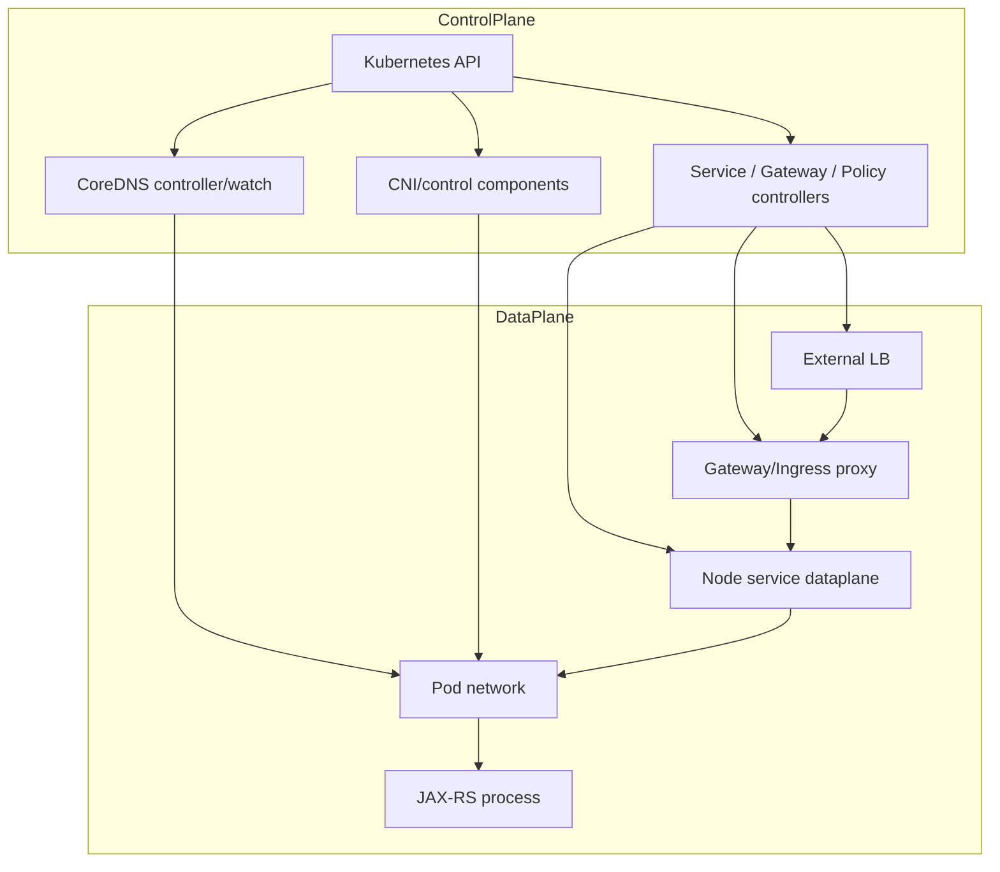
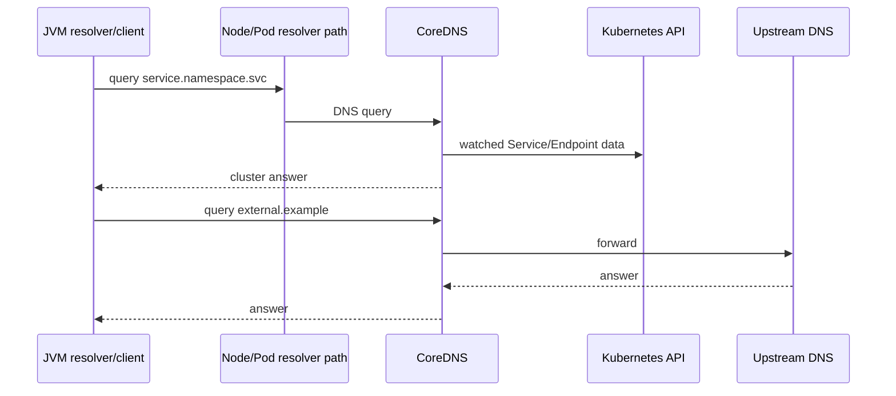
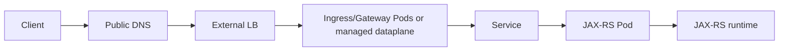
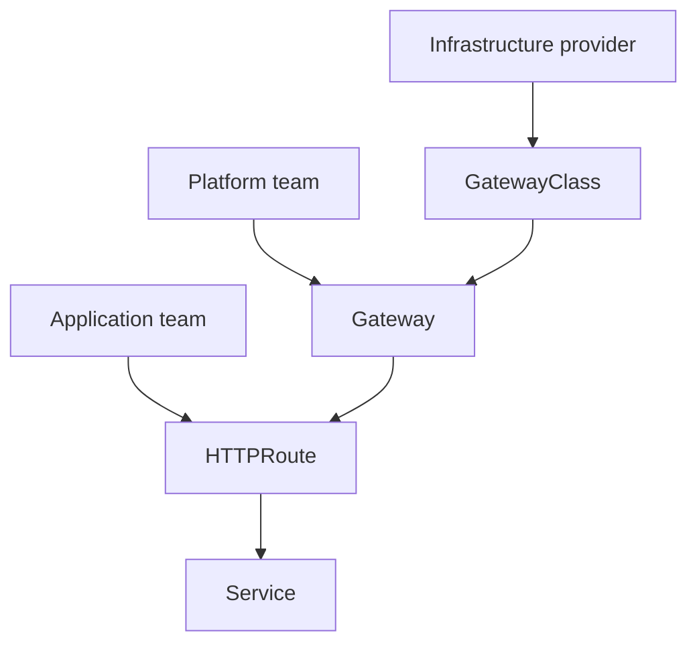
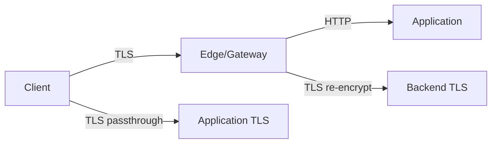

# Part 047 — Kubernetes Networking, DNS, Services, Ingress, Gateway API, and NetworkPolicy

> Kubernetes networking bukan satu proxy atau satu YAML. Sebuah request dapat melewati cloud load balancer, node dataplane, ingress/gateway controller, Service VIP, EndpointSlice, Pod network, sidecar, JAX-RS server, lalu outbound DNS, NAT, proxy, atau private endpoint. Setiap hop memiliki timeout, connection reuse, source-address behavior, health, retries, MTU, policy, observability, dan failure domain sendiri. Debugging yang benar dimulai dengan menggambar packet/request path dan memisahkan control plane dari data plane.

## Daftar Isi

1. [Target kompetensi](#target-kompetensi)
2. [Scope dan baseline](#scope-dan-baseline)
3. [Boundary dengan Part 046 dan Part 048](#boundary-dengan-part-046-dan-part-048)
4. [Current networking API reality](#current-networking-api-reality)
5. [Mental model control plane versus data plane](#mental-model-control-plane-versus-data-plane)
6. [Four Kubernetes networking problems](#four-kubernetes-networking-problems)
7. [Pod-to-Pod model](#pod-to-pod-model)
8. [Pod IP is ephemeral](#pod-ip-is-ephemeral)
9. [CNI boundary](#cni-boundary)
10. [IP address management](#ip-address-management)
11. [Overlay versus routed networking](#overlay-versus-routed-networking)
12. [VPC-native and cloud-native Pod networking](#vpc-native-and-cloud-native-pod-networking)
13. [MTU and fragmentation](#mtu-and-fragmentation)
14. [Encapsulation overhead](#encapsulation-overhead)
15. [Source address preservation](#source-address-preservation)
16. [SNAT and masquerading](#snat-and-masquerading)
17. [Conntrack](#conntrack)
18. [Ephemeral ports](#ephemeral-ports)
19. [Node-local failure domains](#node-local-failure-domains)
20. [Service mental model](#service-mental-model)
21. [ClusterIP](#clusterip)
22. [NodePort](#nodeport)
23. [LoadBalancer](#loadbalancer)
24. [ExternalName](#externalname)
25. [Headless Service](#headless-service)
26. [Service selectors and endpoint ownership](#service-selectors-and-endpoint-ownership)
27. [EndpointSlices](#endpointslices)
28. [Endpoint readiness](#endpoint-readiness)
29. [Endpoint terminating and serving conditions](#endpoint-terminating-and-serving-conditions)
30. [Service port, targetPort, and named ports](#service-port-targetport-and-named-ports)
31. [Service protocol](#service-protocol)
32. [Session affinity](#session-affinity)
33. [Internal traffic policy](#internal-traffic-policy)
34. [External traffic policy](#external-traffic-policy)
35. [Traffic distribution hints](#traffic-distribution-hints)
36. [Service without selector](#service-without-selector)
37. [EndpointSlice security boundary](#endpointslice-security-boundary)
38. [kube-proxy mental model](#kube-proxy-mental-model)
39. [iptables mode](#iptables-mode)
40. [IPVS mode boundary](#ipvs-mode-boundary)
41. [nftables mode boundary](#nftables-mode-boundary)
42. [eBPF service data planes](#ebpf-service-data-planes)
43. [Service virtual IP is not a process](#service-virtual-ip-is-not-a-process)
44. [Connection-level load balancing](#connection-level-load-balancing)
45. [HTTP keep-alive and uneven traffic](#http-keep-alive-and-uneven-traffic)
46. [HTTP/2 and long-lived streams](#http2-and-long-lived-streams)
47. [Service failover behavior](#service-failover-behavior)
48. [Readiness propagation](#readiness-propagation)
49. [DNS mental model](#dns-mental-model)
50. [CoreDNS boundary](#coredns-boundary)
51. [Service DNS records](#service-dns-records)
52. [Headless Service DNS](#headless-service-dns)
53. [Pod DNS records](#pod-dns-records)
54. [DNS search paths](#dns-search-paths)
55. [`ndots`](#ndots)
56. [Absolute names](#absolute-names)
57. [DNS TTL and caching](#dns-ttl-and-caching)
58. [JVM DNS caching](#jvm-dns-caching)
59. [HTTP connection pools versus DNS changes](#http-connection-pools-versus-dns-changes)
60. [Negative DNS caching](#negative-dns-caching)
61. [CoreDNS scaling](#coredns-scaling)
62. [NodeLocal DNSCache boundary](#nodelocal-dnscache-boundary)
63. [DNS failure modes](#dns-failure-modes)
64. [Ingress traffic path](#ingress-traffic-path)
65. [Egress traffic path](#egress-traffic-path)
66. [East-west traffic](#east-west-traffic)
67. [North-south traffic](#north-south-traffic)
68. [Service mesh boundary](#service-mesh-boundary)
69. [Ingress API mental model](#ingress-api-mental-model)
70. [Ingress requires a controller](#ingress-requires-a-controller)
71. [IngressClass](#ingressclass)
72. [Host and path matching](#host-and-path-matching)
73. [`pathType`](#pathtype)
74. [Ingress default backend](#ingress-default-backend)
75. [Ingress TLS](#ingress-tls)
76. [Ingress annotations](#ingress-annotations)
77. [Ingress API is frozen](#ingress-api-is-frozen)
78. [Community ingress-nginx retirement](#community-ingress-nginx-retirement)
79. [Ingress controller naming confusion](#ingress-controller-naming-confusion)
80. [Gateway API mental model](#gateway-api-mental-model)
81. [Gateway API is an add-on API family](#gateway-api-is-an-add-on-api-family)
82. [Role-oriented ownership](#role-oriented-ownership)
83. [GatewayClass](#gatewayclass)
84. [Gateway](#gateway)
85. [Listeners](#listeners)
86. [Routes](#routes)
87. [HTTPRoute](#httproute)
88. [GRPCRoute](#grpcroute)
89. [TLSRoute and TCPRoute boundary](#tlsroute-and-tcproute-boundary)
90. [UDPRoute boundary](#udproute-boundary)
91. [ParentRefs](#parentrefs)
92. [BackendRefs](#backendrefs)
93. [Cross-namespace routing](#cross-namespace-routing)
94. [ReferenceGrant](#referencegrant)
95. [AllowedRoutes](#allowedroutes)
96. [Route status and conditions](#route-status-and-conditions)
97. [Accepted and ResolvedRefs](#accepted-and-resolvedrefs)
98. [Hostname matching](#hostname-matching)
99. [HTTP path matching](#http-path-matching)
100. [Method, header, and query matching](#method-header-and-query-matching)
101. [Request and response header modifiers](#request-and-response-header-modifiers)
102. [Redirects](#redirects)
103. [URL rewrites](#url-rewrites)
104. [Traffic splitting](#traffic-splitting)
105. [Request mirroring](#request-mirroring)
106. [Timeouts](#timeouts)
107. [Retries](#retries)
108. [Session persistence boundary](#session-persistence-boundary)
109. [Gateway API conformance](#gateway-api-conformance)
110. [Standard versus experimental channels](#standard-versus-experimental-channels)
111. [Implementation-specific capabilities](#implementation-specific-capabilities)
112. [Ingress versus Gateway API](#ingress-versus-gateway-api)
113. [Migration from Ingress](#migration-from-ingress)
114. [Ingress2Gateway boundary](#ingress2gateway-boundary)
115. [Behavioral migration testing](#behavioral-migration-testing)
116. [TLS termination models](#tls-termination-models)
117. [Edge TLS termination](#edge-tls-termination)
118. [Re-encryption to backend](#re-encryption-to-backend)
119. [TLS passthrough](#tls-passthrough)
120. [Backend TLS policy](#backend-tls-policy)
121. [Certificates and secret references](#certificates-and-secret-references)
122. [SNI](#sni)
123. [mTLS boundary](#mtls-boundary)
124. [Certificate rotation](#certificate-rotation)
125. [HTTP semantics at the gateway](#http-semantics-at-the-gateway)
126. [Forwarded headers](#forwarded-headers)
127. [Original client IP](#original-client-ip)
128. [Host and authority](#host-and-authority)
129. [Path normalization](#path-normalization)
130. [Request body limits](#request-body-limits)
131. [Header limits](#header-limits)
132. [Compression](#compression)
133. [WebSocket](#websocket)
134. [Server-Sent Events](#server-sent-events)
135. [gRPC and HTTP/2](#grpc-and-http2)
136. [Timeout alignment](#timeout-alignment)
137. [Retry ownership](#retry-ownership)
138. [Connection draining](#connection-draining)
139. [NetworkPolicy mental model](#networkpolicy-mental-model)
140. [NetworkPolicy requires enforcement implementation](#networkpolicy-requires-enforcement-implementation)
141. [Pod selector scope](#pod-selector-scope)
142. [Ingress and egress isolation](#ingress-and-egress-isolation)
143. [Default deny](#default-deny)
144. [Namespace selectors](#namespace-selectors)
145. [Pod and namespace selector combination](#pod-and-namespace-selector-combination)
146. [IPBlock](#ipblock)
147. [Ports and protocols](#ports-and-protocols)
148. [NetworkPolicy is additive](#networkpolicy-is-additive)
149. [Reply traffic](#reply-traffic)
150. [DNS egress](#dns-egress)
151. [Cloud metadata and identity endpoints](#cloud-metadata-and-identity-endpoints)
152. [Egress allow-list limitations](#egress-allow-list-limitations)
153. [FQDN policies are implementation-specific](#fqdn-policies-are-implementation-specific)
154. [Layer 7 policy boundary](#layer-7-policy-boundary)
155. [NetworkPolicy and host networking](#networkpolicy-and-host-networking)
156. [Policy rollout strategy](#policy-rollout-strategy)
157. [Dual-stack networking](#dual-stack-networking)
158. [IPv4 and IPv6 Service policy](#ipv4-and-ipv6-service-policy)
159. [Happy Eyeballs and client behavior](#happy-eyeballs-and-client-behavior)
160. [Network observability](#network-observability)
161. [Golden traffic identifiers](#golden-traffic-identifiers)
162. [Metrics](#metrics)
163. [Flow logs](#flow-logs)
164. [Packet capture](#packet-capture)
165. [DNS diagnostics](#dns-diagnostics)
166. [Service and EndpointSlice diagnostics](#service-and-endpointslice-diagnostics)
167. [Gateway and Route diagnostics](#gateway-and-route-diagnostics)
168. [Policy diagnostics](#policy-diagnostics)
169. [Connection tracking diagnostics](#connection-tracking-diagnostics)
170. [Latency decomposition](#latency-decomposition)
171. [JAX-RS application boundary](#jax-rs-application-boundary)
172. [Trusted proxy configuration](#trusted-proxy-configuration)
173. [Client IP and security decisions](#client-ip-and-security-decisions)
174. [Application-generated redirects](#application-generated-redirects)
175. [Health and management endpoints](#health-and-management-endpoints)
176. [Outbound client configuration](#outbound-client-configuration)
177. [Failure-model matrix](#failure-model-matrix)
178. [Debugging playbook](#debugging-playbook)
179. [Testing strategy](#testing-strategy)
180. [Architecture patterns](#architecture-patterns)
181. [Anti-patterns](#anti-patterns)
182. [PR review checklist](#pr-review-checklist)
183. [Trade-off yang harus dipahami senior engineer](#trade-off-yang-harus-dipahami-senior-engineer)
184. [Internal verification checklist](#internal-verification-checklist)
185. [Latihan verifikasi](#latihan-verifikasi)
186. [Ringkasan](#ringkasan)
187. [Referensi resmi](#referensi-resmi)

---

## Target kompetensi

Setelah menyelesaikan part ini, Anda harus mampu:

- menggambar ingress, east-west, and egress traffic paths end to end;
- memisahkan Kubernetes networking control plane from packet/request data plane;
- menjelaskan Pod IP, CNI, IPAM, overlay, routed/VPC-native networking, MTU, SNAT, conntrack, and ephemeral ports;
- menjelaskan Service types, EndpointSlices, endpoint readiness, traffic policies, and connection-level balancing;
- mendiagnosis uneven traffic caused by keep-alive and HTTP/2;
- memahami CoreDNS, Service records, search paths, `ndots`, JVM DNS cache, and connection-pool interactions;
- membedakan Ingress API, ingress controller, Gateway API, GatewayClass, Gateway, and Route ownership;
- mendesain HTTPRoute matching, traffic split, redirects, rewrites, headers, retries, timeouts, and cross-namespace references;
- memahami Ingress API freeze and community ingress-nginx retirement;
- membedakan community ingress-nginx from F5 NGINX Ingress Controller;
- merencanakan migration from Ingress to Gateway API based on runtime behavior;
- mendesain TLS termination, passthrough, re-encryption, SNI, certificates, and backend trust;
- menerapkan NetworkPolicy default-deny and explicit ingress/egress with CNI support;
- memahami limits of IPBlock, FQDN policies, host networking, and Layer 7 controls;
- mengoperasikan dual-stack and network observability;
- mengamankan JAX-RS trusted-proxy and original-client metadata handling;
- melakukan evidence-based debugging using Services, EndpointSlices, DNS, routes, policies, flow logs, and packet captures.

---

## Scope dan baseline

Baseline:

- Kubernetes workload fundamentals from Part 046;
- Java/JAX-RS application runtime from Part 045;
- one or more Kubernetes Services;
- cluster DNS;
- a conformant CNI and Service dataplane;
- external ingress may use cloud LB, ingress controller, or Gateway API implementation;
- NetworkPolicy implementation may or may not be active;
- service mesh is not assumed.

Part ini **tidak mengasumsikan**:

- kube-proxy mode;
- Cilium, Calico, AWS VPC CNI, Azure CNI, or another CNI;
- IPv4-only or dual-stack;
- cloud provider;
- specific ingress/gateway implementation;
- community ingress-nginx;
- F5 NGINX Ingress Controller;
- service mesh;
- TLS termination location;
- source-IP preservation;
- NetworkPolicy enforcement;
- cross-namespace routing;
- exact internal CSG traffic path.

---

## Boundary dengan Part 046 dan Part 048

| Part | Fokus |
|---|---|
| Part 046 | Workload lifecycle, Pod, Deployment, Service object foundations |
| Part 047 | Generic Kubernetes traffic, DNS, Ingress/Gateway API, and NetworkPolicy |
| Part 048 | NGINX itself and F5 NGINX Ingress Controller implementation details |

This part stays implementation-neutral where Kubernetes standards permit.

---

## Current networking API reality

As of July 2026:

- Ingress API remains stable but frozen; Kubernetes recommends Gateway API for new feature evolution.
- Gateway API is an official Kubernetes project and add-on API family for L4/L7 routing.
- `HTTPRoute` is in the Standard channel.
- community `kubernetes/ingress-nginx` was retired on March 24, 2026 and its repository is archived/read-only.
- F5 NGINX Ingress Controller is a separate active implementation and must not be confused with community ingress-nginx.

Exact Gateway API version and implementation conformance must be verified per cluster.

---

## Mental model control plane versus data plane



Control plane programs desired routing.

Data plane carries actual packets and connections.

A healthy controller does not guarantee a healthy dataplane, and vice versa.

---

## Four Kubernetes networking problems

Kubernetes networking must solve:

1. container-to-container in one Pod;
2. Pod-to-Pod;
3. Pod-to-Service;
4. external-to-Service/Pod.

Egress and policy add further operational dimensions.

---

## Pod-to-Pod model

Kubernetes network model expects each Pod to have a unique cluster IP and communicate without application-level NAT assumptions in the basic model.

The actual implementation can route, encapsulate, or integrate with cloud networking.

---

## Pod IP is ephemeral

Pod IP changes on replacement.

Never configure downstream allow-list or business identity using one Pod IP unless a controller updates it.

Use Service, workload identity, or stable egress architecture.

---

## CNI boundary

Container Network Interface plugins configure Pod networking.

They may handle:

- interface creation;
- routes;
- IP allocation;
- policy;
- encryption;
- observability;
- Service load balancing;
- eBPF.

Kubernetes standard does not prescribe one implementation.

---

## IP address management

IPAM allocates Pod IPs from:

- node-local ranges;
- overlay pools;
- VPC/VNet subnets;
- delegated prefixes;
- dual-stack pools.

Capacity exhaustion creates Pending/failed sandbox Pods.

Monitor available IPs, not only node CPU/memory.

---

## Overlay versus routed networking

Overlay:

- encapsulates Pod traffic;
- easier address independence;
- MTU overhead;
- extra dataplane processing.

Routed/native:

- Pod IP is routable in underlying network;
- simpler packet visibility;
- consumes infrastructure address space;
- cloud route/security integration complexity.

---

## VPC-native and cloud-native Pod networking

Cloud CNIs can assign VPC/VNet addresses to Pods or route prefixes.

Implications:

- subnet IP capacity;
- security groups/policies;
- ENI/interface/prefix limits;
- routing;
- source-IP visibility;
- startup latency.

Detailed EKS/AKS treatment follows later.

---

## MTU and fragmentation

MTU mismatch causes:

- large requests hanging;
- TLS/gRPC failures;
- retransmits;
- asymmetric behavior;
- only cross-node failure.

Calculate physical MTU minus encapsulation overhead.

Path MTU discovery can be blocked by firewalls.

---

## Encapsulation overhead

VXLAN, Geneve, IP-in-IP, IPsec, WireGuard, and tunnels reduce payload MTU and consume CPU.

Do not copy a 1500 MTU blindly.

---

## Source address preservation

At each hop, source may be preserved or replaced:

```text
client
→ cloud LB
→ ingress/gateway
→ Service dataplane
→ Pod
```

Use standardized forwarding headers only from trusted proxies.

---

## SNAT and masquerading

SNAT may occur for:

- Pod egress;
- cross-node Service;
- external traffic policy;
- cloud NAT;
- proxy.

It affects:

- client IP;
- firewall;
- return path;
- port exhaustion;
- observability.

---

## Conntrack

Stateful NAT/service routing commonly relies on connection tracking unless replaced by a different dataplane model.

Problems:

- table exhaustion;
- stale entries;
- long timeouts;
- asymmetric routing;
- burst connection churn.

Monitor node conntrack where relevant.

---

## Ephemeral ports

High outbound connection churn through one source IP/NAT can exhaust ephemeral ports.

Connection pooling and HTTP/2 can reduce churn, but long-lived connections affect load distribution.

---

## Node-local failure domains

A Pod request may depend on:

- node CNI;
- kube-proxy/eBPF;
- conntrack;
- DNS cache;
- NAT;
- kernel;
- sidecar.

One node can fail while others are healthy.

Use node-level comparison.

---

## Service mental model

A Service is a stable logical frontend over dynamic backends.

It usually does not accept application connections itself; the dataplane intercepts and routes.

---

## ClusterIP

Internal virtual IP for cluster clients.

It is stable during Service lifetime.

The backend set comes from EndpointSlices.

---

## NodePort

Exposes a port on cluster nodes and forwards to Service.

Cloud LBs and ingress controllers may use NodePort, though implementation alternatives exist.

NodePort alone is not a full edge-security architecture.

---

## LoadBalancer

Requests external load-balancer provisioning through provider/controller integration.

Behavior varies:

- health;
- source IP;
- cross-zone;
- target mode;
- annotations;
- private/public;
- firewall.

---

## ExternalName

Maps Service DNS to an external DNS name through CNAME-like behavior.

No proxying or endpoint health.

HTTP/TLS Host/SNI can surprise when Service name differs from external hostname.

---

## Headless Service

`clusterIP: None`.

DNS returns individual endpoint addresses instead of a virtual IP.

Used for stateful/discovery protocols.

Clients become responsible for endpoint selection and DNS change behavior.

---

## Service selectors and endpoint ownership

Selector-based Services have EndpointSlices managed from matching Pods.

Selectorless Services require explicit EndpointSlices or other controller integration.

---

## EndpointSlices

EndpointSlices scale endpoint representation and include:

- addresses;
- ports;
- readiness/serving/terminating;
- topology;
- hints;
- address type.

They are the source of truth for many Service dataplanes.

---

## Endpoint readiness

Ready endpoints normally receive traffic.

Readiness is eventually propagated.

An already established connection can continue after readiness changes.

---

## Endpoint terminating and serving conditions

Modern EndpointSlice conditions can distinguish termination and whether endpoint still serves.

Implementations may use this to drain more gracefully.

Verify dataplane support.

---

## Service port, targetPort, and named ports

- `port`: Service port;
- `targetPort`: backend port/name;
- `nodePort`: optional node port;
- named ports improve decoupling and route references.

A wrong `targetPort` yields endpoints but failed connections.

---

## Service protocol

Common protocol values include TCP, UDP, and SCTP where supported.

HTTP awareness belongs to ingress/gateway/proxy, not ordinary Service.

---

## Session affinity

`ClientIP` can keep source to backend for a period.

It is affected by NAT/proxies and does not guarantee durable user session.

---

## Internal traffic policy

Can prefer or require node-local endpoints depending policy.

`Local` can reduce hops/preserve locality but drops traffic on nodes without local endpoint.

Verify behavior and use cases.

---

## External traffic policy

`Local` can preserve source IP and avoid extra hops but requires healthy local endpoints on LB-targeted nodes.

`Cluster` can route across nodes but may SNAT.

---

## Traffic distribution hints

Newer Service APIs support preferences such as topology-aware routing.

Treat as hints unless documented otherwise.

Check cluster version and dataplane support.

---

## Service without selector

Useful for external/legacy backend abstraction.

Security restrictions apply to API proxying and arbitrary endpoint addresses.

Manage endpoints carefully.

---

## EndpointSlice security boundary

Creating EndpointSlices can route Service traffic to arbitrary IPs.

RBAC must restrict it.

Cross-namespace and non-Pod addresses require review.

---

## kube-proxy mental model

kube-proxy watches Services and EndpointSlices and programs node rules in supported modes.

Some CNIs replace kube-proxy functionality.

---

## iptables mode

Programs packet-filter/NAT rules.

Performance and debugging depend on rule count, kernel, conntrack, and implementation optimizations.

---

## IPVS mode boundary

IPVS historically provided kernel virtual-server behavior.

Support status and future direction vary; verify current cluster/distribution rather than assuming it is recommended.

---

## nftables mode boundary

Recent Kubernetes versions support nftables-based kube-proxy mode with version-specific maturity.

Verify feature status, kernel requirements, and provider support.

---

## eBPF service data planes

Some CNIs implement Service routing and policy with eBPF.

Benefits can include observability and reduced iptables dependence.

Semantics, maps, DSR, source IP, and policy are implementation-specific.

---

## Service virtual IP is not a process

You cannot generally:

- `ping` it as a server assumption;
- inspect a listening process on that IP;
- expect TCP reset from a Service object.

Debug backend endpoints and node dataplane.

---

## Connection-level load balancing

Ordinary Service load balancing typically chooses a backend per connection/flow.

Multiple HTTP requests on one keep-alive connection stay on one backend.

---

## HTTP keep-alive and uneven traffic

A small number of clients/connections can produce uneven Pod request counts.

Solutions depend on:

- more connections;
- proxy layer;
- connection lifetime;
- HTTP/2 behavior;
- application load.

Do not blame Service algorithm before inspecting connection cardinality.

---

## HTTP/2 and long-lived streams

One HTTP/2 connection can multiplex many requests to one backend after Service selection.

gRPC channels can stay pinned for long periods.

Use client-side load balancing, proxy, connection rotation, or xDS where appropriate.

---

## Service failover behavior

If backend disappears:

- new connections select remaining endpoints;
- existing connection can fail;
- client retry/reconnect required;
- stale dataplane/DNS may delay.

No transparent replay of application request is guaranteed.

---

## Readiness propagation

Sequence:

```text
application sets not ready
→ kubelet observes probe/state
→ Pod condition
→ EndpointSlice update
→ dataplane updates
→ new connections avoid Pod
```

Each step has latency.

---

## DNS mental model



---

## CoreDNS boundary

CoreDNS is a cluster add-on, not part of JAX-RS.

It watches Kubernetes objects and serves cluster DNS plus upstream forwarding/plugins.

Config is cluster-specific.

---

## Service DNS records

Normal Service:

```text
service.namespace.svc.cluster-domain
```

returns ClusterIP records.

SRV records may exist for named ports.

---

## Headless Service DNS

Returns endpoint IPs/hostnames depending Service and endpoint configuration.

Clients must handle multiple answers and TTL.

---

## Pod DNS records

Pod-specific DNS depends on hostname, subdomain, and cluster settings.

Do not rely on undocumented Pod A-record patterns.

---

## DNS search paths

Pod `/etc/resolv.conf` includes search domains.

A short name can trigger multiple queries.

---

## `ndots`

Common Kubernetes DNS config uses a high `ndots` value.

Names with fewer dots may be tried through search suffixes before absolute resolution.

For external FQDNs, trailing dot or resolver/client config can reduce extra queries where safe.

---

## Absolute names

`example.com.` is absolute DNS form.

Application libraries may normalize differently.

Do not append a dot blindly to URLs without testing TLS/Host behavior.

---

## DNS TTL and caching

Caches exist at:

- CoreDNS;
- node-local cache;
- OS/library;
- JVM;
- HTTP client connection.

DNS TTL does not terminate existing connections.

---

## JVM DNS caching

Java security properties influence positive and negative DNS caching.

Exact defaults can depend on security manager history, JDK, and configuration.

Inspect effective behavior rather than assuming.

---

## HTTP connection pools versus DNS changes

Even if DNS cache expires, an existing pooled connection can continue to old IP.

Configure connection lifetime/health and failover behavior.

---

## Negative DNS caching

A transient NXDOMAIN can be cached and prolong outage.

Monitor negative responses and JVM behavior.

---

## CoreDNS scaling

Capacity drivers:

- Pod/query count;
- search-path amplification;
- external forwarding latency;
- cache hit rate;
- DNSSEC/plugins;
- logging;
- autoscaling;
- node-local cache.

---

## NodeLocal DNSCache boundary

Node-local DNS cache can reduce latency and conntrack pressure.

It introduces another local component and configuration/failure mode.

Verify whether cluster uses it.

---

## DNS failure modes

- CoreDNS unavailable;
- no endpoints for `kube-dns`;
- upstream timeout;
- loop/misconfiguration;
- search amplification;
- MTU/TCP fallback;
- network policy blocks UDP/TCP 53;
- node-local cache issue;
- JVM negative cache.

---

## Ingress traffic path

Generic:



Some implementations route directly to Pod endpoints, bypassing Service VIP dataplane.

Verify actual path.

---

## Egress traffic path

```text
JAX-RS Pod
→ sidecar/egress proxy if any
→ node CNI/routing
→ SNAT/NAT gateway/firewall/private endpoint
→ destination
```

Identity endpoint and private service paths can differ.

---

## East-west traffic

Service-to-service inside cluster/VPC.

Concerns:

- DNS;
- mTLS;
- NetworkPolicy;
- connection pools;
- Service load balancing;
- mesh;
- retries.

---

## North-south traffic

External ingress/egress.

Concerns:

- public/private LB;
- WAF;
- TLS;
- source IP;
- DDoS;
- ingress policy;
- NAT;
- data residency.

---

## Service mesh boundary

A mesh can add sidecar/ambient proxies, mTLS, retries, policy, and telemetry.

It changes traffic path and ownership.

Do not assume mesh in generic Kubernetes design.

---

## Ingress API mental model

Ingress maps HTTP(S) hosts and paths to Services.

It is configuration consumed by an ingress controller.

Ingress object itself does not proxy traffic.

---

## Ingress requires a controller

Without a matching controller, an Ingress has no effect.

Multiple controllers require `IngressClass` ownership.

---

## IngressClass

Identifies controller and optional parameters.

Avoid legacy annotation-only class selection for new resources where standard field is supported.

---

## Host and path matching

Rules combine host and HTTP paths.

Controller behavior must follow spec plus implementation details.

---

## `pathType`

Values:

- `Exact`;
- `Prefix`;
- `ImplementationSpecific`.

Avoid `ImplementationSpecific` for portable rules.

---

## Ingress default backend

Can handle unmatched requests.

Implementation/controller deployment may also define a default backend.

Distinguish resource-level from controller-level fallback.

---

## Ingress TLS

Ingress TLS references Secrets and hosts.

The controller decides termination/configuration details.

Cross-namespace Secret references are not standard Ingress behavior.

---

## Ingress annotations

Annotations fill feature gaps:

- rewrite;
- timeout;
- body size;
- auth;
- snippets;
- canary.

They are implementation-specific, weakly typed, and migration-heavy.

---

## Ingress API is frozen

Ingress remains supported under GA compatibility but no new feature evolution is planned.

Gateway API is the preferred evolution path.

---

## Community ingress-nginx retirement

The Kubernetes community ingress-nginx project was retired on March 24, 2026.

Consequences:

- no future bugfixes;
- no security updates;
- repository archived/read-only;
- artifacts remain but are not maintained;
- new deployments should choose Gateway API implementation or another maintained ingress controller;
- existing installations need migration planning.

---

## Ingress controller naming confusion

Distinguish:

### `kubernetes/ingress-nginx`

- community project;
- used NGINX;
- retired March 2026.

### F5 NGINX Ingress Controller

- separate F5 project/product;
- supports NGINX Open Source/NGINX Plus variants;
- active lifecycle and documentation;
- different annotations/CRDs/configuration.

Names are not interchangeable.

---

## Gateway API mental model



Ownership separation is a core design goal.

---

## Gateway API is an add-on API family

Gateway API CRDs are installed separately from core Kubernetes.

A controller/implementation must support them.

Installing CRDs alone does not create a dataplane.

---

## Role-oriented ownership

Typical roles:

- infrastructure provider: GatewayClass/controller;
- cluster/platform operator: Gateway/listeners/policy;
- application developer: Route/backend;
- security: certificate/policy governance.

---

## GatewayClass

Cluster-scoped class bound to a controller.

It is analogous to, but more expressive than, IngressClass.

---

## Gateway

Represents traffic-handling infrastructure with addresses and listeners.

One Gateway can serve multiple Routes and namespaces according to policy.

---

## Listeners

Listener defines:

- protocol;
- port;
- hostname;
- TLS;
- allowed Routes.

Listener status indicates support/conflicts.

---

## Routes

Protocol-specific Route attaches to Gateway or other parent where supported.

Routing resources are namespace-scoped.

---

## HTTPRoute

Defines HTTP matching and forwarding.

It is a Standard-channel API.

---

## GRPCRoute

Defines gRPC routing based on service/method and headers where supported.

Verify implementation conformance.

---

## TLSRoute and TCPRoute boundary

These route Layer 4/TLS traffic and may be in different release channels depending Gateway API version.

Do not assume production support from type name alone.

---

## UDPRoute boundary

UDP routing support is implementation/version dependent.

---

## ParentRefs

Route references parent Gateway/listener.

Attachment is accepted only if parent policy permits it.

---

## BackendRefs

Route forwards to Services or supported backend kinds.

Weight enables traffic split.

Invalid references appear in status.

---

## Cross-namespace routing

Route may attach to Gateway in another namespace if `AllowedRoutes` permits.

Backend reference across namespaces requires `ReferenceGrant` in target namespace.

---

## ReferenceGrant

Allows a namespace's resource to be referenced from another namespace.

It is deliberately target-owned to prevent reference hijacking.

---

## AllowedRoutes

Gateway listener limits which namespaces and route kinds may attach.

Use explicit policy in multi-tenant clusters.

---

## Route status and conditions

Inspect status parents and conditions.

A syntactically valid Route may not be accepted or programmed.

---

## Accepted and ResolvedRefs

Common conditions indicate:

- route accepted by parent;
- backend references resolved.

Implementation may add `Programmed` or other conditions.

---

## Hostname matching

Gateway listener and Route hostnames must intersect.

Wildcard and exact matching follow spec.

Test conflicts and precedence.

---

## HTTP path matching

Gateway API supports path matching types such as exact and prefix, with precedence rules.

Avoid implementation-specific regex unless explicitly supported.

---

## Method, header, and query matching

HTTPRoute can support richer matches than Ingress.

Conformance for optional/extended features must be checked.

---

## Request and response header modifiers

Filters can add, set, or remove headers.

Protect hop-by-hop and security headers.

Do not allow app teams to forge trusted identity headers.

---

## Redirects

Redirect changes client-visible URL/status.

Use for HTTP→HTTPS, host, path, or scheme according to support.

---

## URL rewrites

Rewrite changes upstream request without client redirect.

It can break application-generated links and routing assumptions.

---

## Traffic splitting

Weighted backends support canary/blue-green.

Weights are approximate distribution over sufficient traffic, not per-user guarantees.

Long connections distort split.

---

## Request mirroring

Mirrors traffic to another backend without using mirrored response.

Risks:

- duplicate side effects;
- sensitive data;
- extra load;
- non-idempotent requests.

Mirror safe/read-only traffic or sanitize.

---

## Timeouts

Gateway API supports timeout concepts with version/implementation conformance.

Align:

```text
client > edge/gateway total > application > downstream attempt
```

---

## Retries

Retry support is evolving and implementation-specific beyond standard conformance details.

Never retry unsafe requests without idempotency.

---

## Session persistence boundary

Session persistence features vary by Gateway API version and implementation.

Prefer stateless applications.

---

## Gateway API conformance

Implementations publish supported:

- core;
- extended;
- implementation-specific features;
- conformance profiles.

Read conformance reports, not marketing only.

---

## Standard versus experimental channels

Standard channel contains stable API resources/fields.

Experimental can change and may not be installed.

Pin CRD version and upgrade policy.

---

## Implementation-specific capabilities

Examples:

- WAF;
- auth;
- advanced retries;
- rate limiting;
- custom policies;
- L4 features.

Use typed policy CRDs where possible and document portability.

---

## Ingress versus Gateway API

| Dimension | Ingress | Gateway API |
|---|---|---|
| API evolution | frozen | active |
| Ownership | one resource often mixes roles | role-oriented |
| Routing | HTTP(S) basic | protocol-specific Routes |
| Cross-namespace | limited | explicit policy and grants |
| Extension | annotations/CRDs | typed resources/policies plus extensions |
| Status | limited/controller-specific | richer parent conditions |
| Portability | controller differences | conformance profiles, still implementation variance |

---

## Migration from Ingress

Inventory:

- classes/controllers;
- hosts/paths;
- annotations;
- snippets;
- TLS;
- redirects/rewrites;
- auth;
- WAF;
- body limits;
- timeouts;
- canary;
- TCP/UDP;
- source IP;
- default backend;
- metrics/logs.

Translate behavior, not only YAML fields.

---

## Ingress2Gateway boundary

`ingress2gateway` can assist translation and report unsupported behaviors.

Generated resources require human review and runtime comparison.

It cannot prove application semantics, TLS ownership, or operational capacity automatically.

---

## Behavioral migration testing

Run old and new paths in parallel where possible.

Compare:

- status;
- headers;
- redirect;
- path;
- body;
- TLS;
- client IP;
- retries/timeouts;
- WebSocket/gRPC;
- load;
- logs/metrics.

---

## TLS termination models



Choose trust and observability boundary.

---

## Edge TLS termination

Gateway holds certificate and forwards HTTP/internal protocol.

Simple application runtime but plaintext exists behind gateway unless network controls or mesh encryption protect it.

---

## Re-encryption to backend

Gateway terminates client TLS then starts TLS to backend.

Requires backend CA/SAN validation and SNI.

---

## TLS passthrough

Gateway routes encrypted TLS based on SNI without HTTP visibility.

No HTTP path routing/header manipulation at that hop.

Application owns certificates and TLS.

---

## Backend TLS policy

Gateway API supports typed backend TLS policy concepts in current versions/channels.

Verify implementation and field maturity.

---

## Certificates and secret references

TLS certificate Secrets require RBAC and namespace ownership.

Cross-namespace references require supported policy mechanisms.

Automated issuers and rotation are implementation/tool specific.

---

## SNI

Client SNI selects certificate/listener and backend in TLS scenarios.

Test unknown/missing SNI.

---

## mTLS boundary

mTLS can exist:

- client-to-edge;
- edge-to-backend;
- service mesh;
- application direct.

Identity translation must be explicit.

---

## Certificate rotation

Controller should reload certificates without dropping traffic where supported.

Test:

- overlapping validity;
- Secret update;
- stale replicas;
- TLS session reuse;
- rollback.

---

## HTTP semantics at the gateway

Gateway/proxy may alter:

- Host;
- path;
- scheme;
- client IP headers;
- hop-by-hop headers;
- content length/encoding;
- HTTP version;
- timeout;
- retry.

Application must know trusted contract.

---

## Forwarded headers

Relevant standards/headers:

- `Forwarded`;
- `X-Forwarded-For`;
- `X-Forwarded-Proto`;
- `X-Forwarded-Host`.

Only trust values inserted/overwritten by known proxies.

---

## Original client IP

Can come from:

- source socket;
- PROXY protocol;
- forwarding headers;
- cloud LB metadata.

Do not use untrusted `X-Forwarded-For` for authorization or rate limiting.

---

## Host and authority

Preserve/validate expected host.

Host-header attacks can affect redirects, tenant routing, and links.

---

## Path normalization

Differences in:

- percent encoding;
- duplicate slash;
- dot segments;
- case;
- decoded reserved characters;
- regex.

can create auth-routing mismatch.

Test gateway and JAX-RS interpretation together.

---

## Request body limits

Set at earliest layer and application.

Gateway rejection status/body may differ.

Streaming limits still need application enforcement.

---

## Header limits

Protect against oversized header count/size.

Align LB, proxy, server, and application.

---

## Compression

Gateway compression saves bandwidth but consumes CPU and changes observability.

Avoid double compression.

---

## WebSocket

Requires upgrade and long-lived connection support.

Rolling/drain behavior must handle long connections.

---

## Server-Sent Events

Requires long response timeout, buffering disabled where appropriate, and drain semantics.

---

## gRPC and HTTP/2

Ensure:

- HTTP/2 support;
- h2/h2c backend semantics;
- keepalive;
- max message;
- timeout;
- trailers;
- load balancing.

---

## Timeout alignment

A shorter outer timeout can hide inner completion and cause retries.

Document each hop.

---

## Retry ownership

Possible retries:

- client;
- cloud LB;
- gateway;
- mesh;
- application SDK.

Avoid multiplication.

---

## Connection draining

During Gateway/controller update:

- stop new connections;
- preserve active where possible;
- maintain readiness;
- respect LB deregistration;
- handle HTTP/2/WebSocket.

---

## NetworkPolicy mental model

NetworkPolicy declares allowed traffic for selected Pods.

It requires a network plugin that enforces it.

---

## NetworkPolicy requires enforcement implementation

Creating policy with a non-enforcing CNI gives false confidence.

Verify enforcement through tests.

---

## Pod selector scope

`podSelector` selects Pods in the policy's namespace.

An empty selector selects all Pods in that namespace.

---

## Ingress and egress isolation

A Pod becomes isolated for a direction when selected by a policy containing that policy type.

Allowed traffic is the union of applicable policies.

---

## Default deny

Create policy selecting all Pods with no allowed peers for direction, then add explicit allow policies.

Roll out carefully to preserve DNS, monitoring, ingress, and dependencies.

---

## Namespace selectors

Select namespaces by labels.

Use immutable/governed namespace labels for security boundaries.

---

## Pod and namespace selector combination

Within one `from` item, combined selectors mean Pods matching selector in namespaces matching selector.

Separate list items mean OR, a common YAML mistake.

---

## IPBlock

Allows CIDR except ranges.

Behavior relative to pre/post-NAT source can vary by dataplane and traffic path.

Do not use Pod IP ranges in `ipBlock` as a substitute for selectors.

---

## Ports and protocols

Policy can restrict ports and protocols.

Named ports may be supported for selected directions/implementations according to spec.

Test actual enforcement.

---

## NetworkPolicy is additive

Policies do not establish ordered firewall rules.

There is no standard deny rule that overrides allow union; isolation plus allows determine result.

---

## Reply traffic

Replies to allowed connections are normally allowed by stateful enforcement.

Exact implementation for unusual protocols should be tested.

---

## DNS egress

Default-deny egress must allow DNS to actual resolver endpoints over UDP and TCP where needed.

Hard-coding one IP can break NodeLocal DNSCache or provider changes.

---

## Cloud metadata and identity endpoints

Workload identity may require:

- projected token;
- local agent;
- metadata IP;
- STS/Entra endpoint;
- DNS/HTTPS.

Egress policy must allow intended identity path and deny unintended node metadata access.

---

## Egress allow-list limitations

IP-based allow-lists struggle with:

- SaaS changing IPs;
- CDNs;
- dual-stack;
- DNS;
- shared endpoints;
- redirects.

Use egress proxy/private endpoints/provider controls where stronger semantics are needed.

---

## FQDN policies are implementation-specific

Standard NetworkPolicy does not select DNS names.

Some CNIs provide FQDN policies.

Understand DNS cache, TTL, CNAME, and enforcement timing.

---

## Layer 7 policy boundary

HTTP method/path/identity policy is beyond standard NetworkPolicy.

Use gateway, mesh, application, or CNI-specific L7 features.

---

## NetworkPolicy and host networking

`hostNetwork` Pods and node traffic have implementation-specific policy interactions.

Avoid assumptions; test and consult CNI docs.

---

## Policy rollout strategy

1. observe flows;
2. label identities;
3. apply audit/visibility where available;
4. default deny in non-prod;
5. add explicit DNS/telemetry/dependencies;
6. failure test;
7. staged prod rollout;
8. monitor denied flows.

---

## Dual-stack networking

Kubernetes can support IPv4, IPv6, or dual-stack.

Cluster, CNI, Service, DNS, LB, applications, and dependencies must all support it.

---

## IPv4 and IPv6 Service policy

Services can define IP-family policy and families according to cluster support.

Do not hard-code IPv4 literals in application/config.

---

## Happy Eyeballs and client behavior

Dual-stack clients may race/prefer address families.

Java/client behavior and network health affect latency.

Test partial IPv6 failure.

---

## Network observability

Need evidence at:

- cloud LB;
- Gateway/Ingress;
- Service/EndpointSlice;
- node dataplane;
- CNI;
- DNS;
- Pod;
- JAX-RS;
- outbound NAT/firewall.

---

## Golden traffic identifiers

Correlate:

- trace ID;
- request ID;
- client connection;
- gateway route;
- Service;
- source/destination Pod;
- node;
- response status;
- retry attempt.

---

## Metrics

Track:

- connections;
- requests;
- bytes;
- errors/resets;
- DNS latency/errors;
- Endpoint count/readiness;
- LB health;
- route accepted/programmed;
- policy drops;
- conntrack;
- NAT ports;
- retransmits;
- MTU symptoms.

---

## Flow logs

CNI/cloud flow logs can show L3/L4 accept/drop.

They do not show full HTTP semantics unless L7 observability exists.

Protect metadata and cost.

---

## Packet capture

Use authorized `tcpdump`/eBPF capture at correct network namespace/hop.

TLS hides application payload.

Capture minimal duration and protect sensitive data.

---

## DNS diagnostics

From a diagnostic Pod:

```bash
cat /etc/resolv.conf
getent hosts quote-api.default.svc.cluster.local
dig quote-api.default.svc.cluster.local
dig +trace external.example
```

Tools may not exist in minimal app image.

---

## Service and EndpointSlice diagnostics

```bash
kubectl get svc quote-api -o yaml
kubectl get endpointslice -l kubernetes.io/service-name=quote-api -o yaml
kubectl get pods -l app.kubernetes.io/name=quote-api -o wide
```

Check ports, addresses, readiness, node, and labels.

---

## Gateway and Route diagnostics

Inspect:

```bash
kubectl get gateway,httproute -A
kubectl describe gateway ...
kubectl describe httproute ...
```

Read conditions per parent.

Controller logs and implementation status are necessary.

---

## Policy diagnostics

List policies selecting source/destination Pods.

Remember union semantics and both ingress and egress sides may need allows.

Use CNI policy tracing where available.

---

## Connection tracking diagnostics

Node-level tools may include conntrack tables, socket stats, NAT rules, eBPF maps, and kernel counters.

Access requires platform privileges.

---

## Latency decomposition

Separate:

```text
client DNS
TLS/edge
gateway queue/upstream connect
Service/node dataplane
application queue
dependency
response write
```

Use traces plus proxy timing logs.

---

## JAX-RS application boundary

Application must not depend on Kubernetes-specific classes.

It should receive a normalized trusted request context from infrastructure adapters/filters.

---

## Trusted proxy configuration

Configure exact trusted proxy CIDRs/hops.

Strip untrusted forwarding headers at edge.

Application then reads normalized scheme/host/client IP.

---

## Client IP and security decisions

Client IP is weak identity due to NAT, proxies, and spoofing.

Use it for abuse signals, not primary authentication.

---

## Application-generated redirects

Use trusted external scheme/host configuration or normalized forwarded metadata.

Avoid reflecting arbitrary Host header.

---

## Health and management endpoints

Expose through separate internal route/listener where possible.

Do not publish detailed management endpoints on public Gateway.

---

## Outbound client configuration

Use Service FQDN for cluster services and explicit external endpoint/private DNS for cloud services.

Set connection lifetime, DNS policy, timeout, and proxy according to failover model.

---

## Failure-model matrix

| Failure | Impact | Detection | Response |
|---|---|---|---|
| Pod IP treated as stable | outage after reschedule | stale config | Service/discovery |
| CNI IP pool exhausted | Pods cannot start | sandbox events | capacity/IPAM |
| MTU mismatch | large/TLS requests hang | retransmits/capture | align MTU |
| Conntrack full | random connection failures | node metrics | capacity/churn tuning |
| NAT ephemeral ports exhausted | egress failures | NAT/port metrics | pooling/scale egress |
| Service selector wrong | no/wrong backends | EndpointSlices | label governance |
| `targetPort` wrong | connection refused | endpoint+socket check | named/correct port |
| Readiness assumed immediate | traffic during drain | endpoint timeline | graceful overlap |
| HTTP/2 pinned to one Pod | imbalance | connection/request metrics | proxy/client LB |
| JVM caches stale DNS | failover delay | DNS vs socket evidence | TTL/lifetime policy |
| `ndots` amplifies DNS | latency/QPS | CoreDNS metrics | FQDN/search policy |
| Ingress exists without controller | no routing | class/status | install/ownership |
| New ingress-nginx deployment | unmaintained exposure | inventory | migrate/alternative |
| F5 NIC confused with ingress-nginx | wrong config/migration | controller image/class | explicit product identity |
| Route not Accepted | no traffic | Route conditions | fix attachment/policy |
| Cross-namespace backend lacks grant | unresolved ref | `ResolvedRefs=False` | ReferenceGrant |
| Header rewrite forges identity | auth bypass | config audit | reserved-header policy |
| Gateway retries POST | duplicate effect | attempt IDs | idempotency/retry policy |
| TLS re-encryption skips validation | MITM | config/test | CA/SAN validation |
| Default-deny blocks DNS | all name resolution fails | policy drops | explicit DNS allow |
| NetworkPolicy unsupported | false security | enforcement test | capable CNI |
| `IPBlock` sees NAT address | policy mismatch | flow logs | path-aware policy |
| FQDN policy assumed standard | portability failure | CNI inventory | explicit extension |
| Dual-stack partial failure | high tail timeout | family metrics | test/fix both families |

---

## Debugging playbook

### Service name resolves but connection fails

Check:

1. DNS answer;
2. Service port/targetPort;
3. EndpointSlices;
4. Pod readiness;
5. app listening address/port;
6. NetworkPolicy;
7. node dataplane;
8. sidecar;
9. TLS/protocol mismatch.

### Service works from one node only

Suspect node CNI, kube-proxy/eBPF, conntrack, routes, MTU, or local traffic policy.

Compare endpoint locality and node logs/maps.

### External traffic returns 502/503

Trace:

```text
public DNS
→ LB target health
→ controller listener
→ route accepted
→ Service endpoints
→ backend connect
→ application readiness
```

Read gateway upstream error details.

### DNS intermittently fails

Check CoreDNS Pods, Service endpoints, node-local cache, NetworkPolicy, UDP/TCP 53, upstream latency, search amplification, conntrack, and JVM negative cache.

### Route exists but has no effect

Check GatewayClass controller, Gateway listener, `AllowedRoutes`, `ParentRefs`, hostname intersection, `Accepted`, `ResolvedRefs`, and implementation logs.

### Only large requests fail

Check MTU, body/header limits, proxy buffering, timeout, TLS fragmentation, and application limits.

### Original client IP is wrong

Map every NAT/proxy hop, external traffic policy, PROXY protocol, forwarding headers, and trusted-proxy configuration.

### Traffic still reaches terminating Pod

Inspect readiness timestamp, EndpointSlice conditions, controller/data-plane propagation, keep-alive connection, ingress upstream cache, and application drain.

### NetworkPolicy blocks unexpected traffic

Evaluate source egress and destination ingress policies, namespace labels, YAML selector grouping, ports, NAT address, DNS, and CNI-specific logs.

---

## Testing strategy

### Service tests

- selectors;
- named ports;
- readiness;
- terminating endpoints;
- keep-alive distribution;
- node failure;
- local/cluster traffic policy.

### DNS tests

- short and FQDN names;
- search paths;
- external resolution;
- negative caching;
- CoreDNS restart;
- NodeLocal cache;
- dual-stack;
- connection-pool failover.

### Gateway/Ingress tests

- host/path precedence;
- headers;
- redirects/rewrites;
- body/header limits;
- TLS/SNI;
- WebSocket/SSE/gRPC;
- timeouts;
- retries;
- canary split;
- default backend;
- controller restart.

### Migration tests

Replay production-like request corpus through old/new controller.

Compare behavior and performance.

### NetworkPolicy tests

- default deny;
- exact allowed flows;
- DNS;
- telemetry;
- identity metadata;
- namespace isolation;
- egress;
- host-network edge;
- policy enforcement after CNI restart.

### Failure tests

- node dataplane failure;
- endpoint churn;
- CoreDNS loss;
- LB target loss;
- MTU reduction;
- conntrack pressure;
- certificate rotation;
- route invalidation;
- policy rollout.

---

## Architecture patterns

### Gateway API role separation

Platform owns Gateway; teams own Routes; security owns grants/policies.

### Internal and external Gateways

Separate listeners, certificates, policies, and exposure.

### Default-deny with explicit dependency map

Network flows are versioned architecture contracts.

### Service FQDN plus bounded connection lifetime

Balances stable discovery with endpoint changes.

### Behavioral ingress migration

Dual-run and compare before cutover.

### Layered source-IP trust

Edge overwrites forwarding headers; application trusts only known hop.

---

## Anti-patterns

- call Pod IP directly;
- assume one universal Kubernetes packet path;
- ignore MTU and conntrack;
- use fixed outbound connections forever;
- expect Service to balance each HTTP request;
- use session affinity as session storage;
- expose NodePort directly without edge policy;
- create Ingress without identifying controller/class;
- deploy retired community ingress-nginx for a new platform;
- call F5 NGINX Ingress Controller “ingress-nginx”;
- depend on dozens of opaque annotations without inventory;
- assume Gateway API feature because CRD field exists;
- cross-namespace routing without ownership grants;
- gateway retries unsafe writes;
- trust client-supplied forwarding headers;
- use liveness endpoint as public backend;
- apply default-deny before DNS/telemetry mapping;
- assume NetworkPolicy works without enforcement test;
- use `IPBlock` without NAT-path analysis;
- treat FQDN policy as portable Kubernetes standard;
- ignore IPv6 while cluster is dual-stack.

---

## PR review checklist

### Traffic path

- [ ] Ingress/east-west/egress path documented?
- [ ] CNI and Service dataplane known?
- [ ] source-IP/NAT behavior?
- [ ] MTU/encapsulation?
- [ ] conntrack/NAT capacity?
- [ ] failure domains?

### Services and DNS

- [ ] selector, ports, protocol correct?
- [ ] EndpointSlice/readiness behavior?
- [ ] keep-alive/HTTP2 distribution?
- [ ] traffic policies intentional?
- [ ] Service DNS/FQDN?
- [ ] JVM DNS and pool lifetime?
- [ ] CoreDNS/NodeLocal capacity?

### Ingress/Gateway

- [ ] maintained controller identified?
- [ ] no new retired ingress-nginx?
- [ ] IngressClass/GatewayClass ownership?
- [ ] Route conditions and conformance?
- [ ] cross-namespace grants?
- [ ] host/path precedence?
- [ ] timeout/retry ownership?
- [ ] redirect/rewrite/header security?
- [ ] migration behavior tested?

### TLS and HTTP

- [ ] termination/re-encryption/passthrough explicit?
- [ ] certificate ownership/rotation?
- [ ] backend CA/SAN validation?
- [ ] trusted proxy headers?
- [ ] body/header limits?
- [ ] WebSocket/SSE/gRPC?
- [ ] drain/long connections?

### NetworkPolicy

- [ ] enforcing CNI confirmed?
- [ ] default deny staged?
- [ ] DNS/telemetry/identity flows?
- [ ] namespace labels governed?
- [ ] ingress and egress both evaluated?
- [ ] IPBlock/NAT behavior?
- [ ] FQDN/L7 extensions explicit?
- [ ] tests and policy-drop telemetry?

### Operations

- [ ] LB/Gateway/Service/Pod metrics?
- [ ] DNS metrics?
- [ ] flow logs?
- [ ] packet-capture runbook?
- [ ] route/controller upgrade policy?
- [ ] dual-stack test?
- [ ] incident ownership?

---

## Trade-off yang harus dipahami senior engineer

| Decision | Benefit | Cost/risk |
|---|---|---|
| Overlay CNI | address flexibility | MTU/encapsulation |
| VPC-native CNI | native routing | subnet/IP limits |
| ClusterIP | stable internal frontend | connection-level balancing |
| Headless Service | direct discovery | client complexity |
| `externalTrafficPolicy: Local` | source IP/local hop | uneven/no local endpoint |
| Long keep-alive | low handshake cost | backend imbalance/stale connection |
| Short connection lifetime | faster rebalance | connection/TLS churn |
| Ingress | simple/stable API | frozen/annotation extensions |
| Gateway API | richer typed ownership | CRDs/controller/conformance complexity |
| TLS at edge | centralized certs | plaintext inner hop unless re-encrypted |
| TLS passthrough | end-to-end app TLS | no L7 routing/inspection |
| Default-deny | strong isolation | rollout/operational complexity |
| IP allow-list | simple | NAT/CDN/address churn |
| FQDN CNI policy | SaaS usability | implementation coupling |
| Dual-stack | future/address flexibility | two-family operational burden |
| Source IP preservation | audit/rate signals | routing/locality constraints |
| Gateway retry | transient recovery | duplicate/amplification |
| Request mirroring | safe comparison for reads | duplicate load/data exposure |

---

## Internal verification checklist

### Cluster network

- [ ] Kubernetes versions.
- [ ] CNI and version.
- [ ] IPAM and subnet/pool capacity.
- [ ] overlay/native mode.
- [ ] MTU.
- [ ] encryption.
- [ ] kube-proxy or replacement.
- [ ] dataplane mode.
- [ ] conntrack/NAT design.
- [ ] IPv4/IPv6.

### Services and DNS

- [ ] Service inventory/types.
- [ ] traffic policies.
- [ ] topology hints.
- [ ] EndpointSlice settings.
- [ ] CoreDNS version/config.
- [ ] NodeLocal DNSCache.
- [ ] DNS autoscaling.
- [ ] JVM DNS properties.
- [ ] client connection lifetime.
- [ ] DNS/Service dashboards.

### Ingress and Gateway

- [ ] controllers and versions.
- [ ] community ingress-nginx inventory/migration.
- [ ] F5 NGINX or other implementation identity.
- [ ] IngressClasses.
- [ ] Gateway API CRD version.
- [ ] GatewayClasses/conformance.
- [ ] public/private Gateways.
- [ ] Route ownership.
- [ ] annotations/policies/CRDs.
- [ ] upgrade and rollback.

### TLS and edge

- [ ] certificate issuers/Secrets.
- [ ] TLS termination points.
- [ ] backend TLS validation.
- [ ] mTLS.
- [ ] PROXY protocol.
- [ ] forwarded-header trust.
- [ ] request/header limits.
- [ ] timeout/retry matrix.
- [ ] WebSocket/SSE/gRPC.
- [ ] WAF/rate limiting ownership.

### NetworkPolicy and egress

- [ ] enforcement implementation.
- [ ] default-deny namespaces.
- [ ] policy inventory.
- [ ] namespace labels.
- [ ] DNS/telemetry/identity rules.
- [ ] metadata endpoint policy.
- [ ] FQDN/L7 extensions.
- [ ] egress gateway/NAT.
- [ ] flow logs/drop metrics.
- [ ] policy test suite.

### Operations

- [ ] packet/flow debugging access.
- [ ] LB/Gateway logs and metrics.
- [ ] CoreDNS runbook.
- [ ] Service/EndpointSlice runbook.
- [ ] certificate rotation tests.
- [ ] controller failover.
- [ ] migration test corpus.
- [ ] network game days.
- [ ] incident ownership.

---

## Latihan verifikasi

1. Draw the exact packet/request path from public client to JAX-RS Pod and from Pod to an external API.
2. Prove whether Service balancing is per request or per connection using keep-alive and HTTP/2 tests.
3. Change Endpoint readiness during active connections and measure propagation plus drain.
4. Measure DNS queries generated by short names versus absolute FQDNs under current `ndots`.
5. Rotate a Service backend IP and observe JVM DNS cache and pooled-connection behavior.
6. Create Gateway, HTTPRoute, and cross-namespace backend; prove `ReferenceGrant` ownership.
7. Translate one annotation-heavy Ingress to Gateway API and compare runtime behavior.
8. Apply default-deny ingress/egress and restore only documented DNS, telemetry, identity, and dependency flows.
9. Introduce MTU mismatch or blocked ICMP and diagnose large-payload failure.
10. Fail one node dataplane/CoreDNS instance and verify blast radius, observability, and recovery.

---

## Ringkasan

- Kubernetes networking is a multi-hop control-plane/data-plane system.
- Pod IPs are ephemeral; Services and DNS provide stable discovery.
- CNI, IPAM, MTU, SNAT, conntrack, and ephemeral ports are capacity and correctness concerns.
- Services usually balance connections, not individual HTTP requests.
- Long-lived keep-alive, HTTP/2, gRPC, and SSE can pin traffic.
- Endpoint readiness propagates asynchronously and does not close existing connections.
- CoreDNS, search paths, `ndots`, JVM caches, and connection pools jointly determine name-based failover.
- Ingress is a stable but frozen API and requires a controller.
- Community ingress-nginx was retired on March 24, 2026 and should not be selected for new deployments.
- F5 NGINX Ingress Controller is a separate active implementation.
- Gateway API provides role-oriented, protocol-aware, typed routing with richer status and cross-namespace controls.
- Gateway API conformance and release channels must be checked per implementation.
- Ingress migration must preserve runtime behavior, not only YAML shape.
- TLS termination, passthrough, re-encryption, client IP, forwarding headers, timeouts, and retries must be explicit.
- NetworkPolicy requires an enforcing CNI and is additive.
- Standard NetworkPolicy does not provide FQDN or Layer 7 policy.
- Default-deny rollout requires a documented dependency map and flow visibility.
- Exact CNI, dataplane, controllers, policies, and cloud path remain **Internal verification checklist**.

---

## Referensi resmi

- [Kubernetes Cluster Networking](https://kubernetes.io/docs/concepts/cluster-administration/networking/)
- [Services, Load Balancing, and Networking](https://kubernetes.io/docs/concepts/services-networking/)
- [Kubernetes Service](https://kubernetes.io/docs/concepts/services-networking/service/)
- [EndpointSlices](https://kubernetes.io/docs/concepts/services-networking/endpoint-slices/)
- [DNS for Services and Pods](https://kubernetes.io/docs/concepts/services-networking/dns-pod-service/)
- [IPv4/IPv6 Dual Stack](https://kubernetes.io/docs/concepts/services-networking/dual-stack/)
- [Ingress](https://kubernetes.io/docs/concepts/services-networking/ingress/)
- [Ingress Controllers](https://kubernetes.io/docs/concepts/services-networking/ingress-controllers/)
- [Gateway API in Kubernetes](https://kubernetes.io/docs/concepts/services-networking/gateway/)
- [Gateway API Project](https://gateway-api.sigs.k8s.io/)
- [Gateway API API Reference](https://gateway-api.sigs.k8s.io/reference/api-spec/main/spec/)
- [HTTPRoute](https://gateway-api.sigs.k8s.io/reference/api-types/httproute/)
- [Gateway API TLS Guide](https://gateway-api.sigs.k8s.io/guides/user-guides/tls/)
- [Gateway API Security Model](https://gateway-api.sigs.k8s.io/docs/concepts/security/)
- [Gateway API Implementations and Conformance](https://gateway-api.sigs.k8s.io/docs/implementations/list/)
- [Network Policies](https://kubernetes.io/docs/concepts/services-networking/network-policies/)
- [Declare Network Policy](https://kubernetes.io/docs/tasks/administer-cluster/declare-network-policy/)
- [NetworkPolicy API Reference](https://kubernetes.io/docs/reference/kubernetes-api/networking-resources/network-policy-v1/)
- [Ingress NGINX Retirement](https://kubernetes.io/blog/2025/11/11/ingress-nginx-retirement/)
- [Ingress NGINX Steering and Security Statement](https://kubernetes.io/blog/2026/01/29/ingress-nginx-statement/)
- [Ingress2Gateway 1.0](https://kubernetes.io/blog/2026/03/20/ingress2gateway-1-0-release/)
