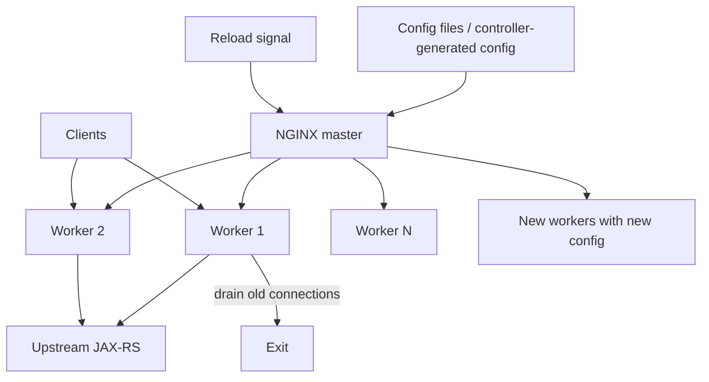
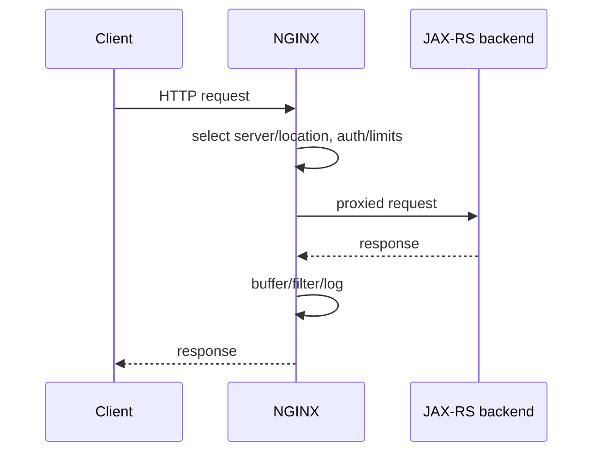
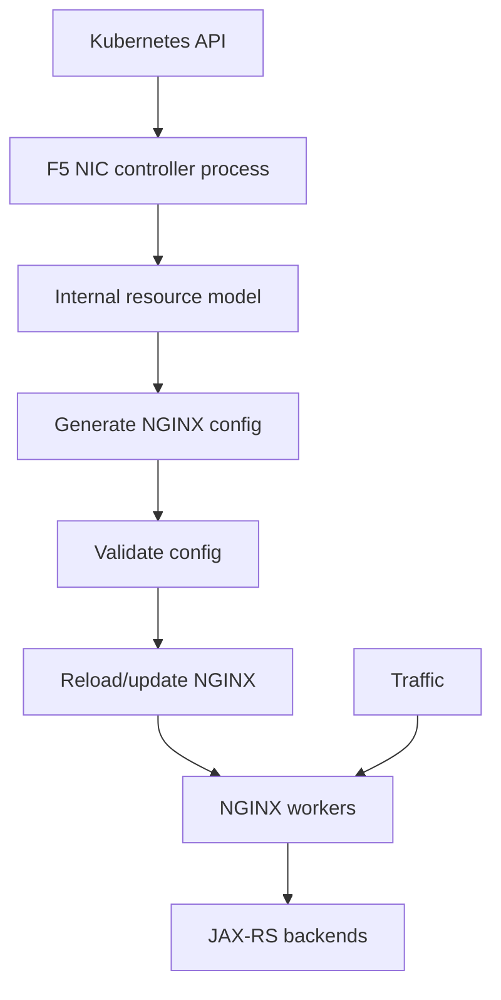

# Part 048 — NGINX, NGINX Ingress Controller, Reverse Proxy, and Edge Traffic Engineering

> NGINX bukan sekadar file `nginx.conf`, dan “NGINX Ingress” bukan satu proyek tunggal. NGINX core adalah event-driven reverse proxy and web server dengan master/worker lifecycle, connection pools, buffering, temporary files, upstream selection, TLS, and reload semantics. F5 NGINX Ingress Controller adalah controller Kubernetes terpisah yang menerjemahkan Ingress, custom resources, policies, and supported Gateway APIs menjadi konfigurasi NGINX/NGINX Plus. Community `kubernetes/ingress-nginx` telah retired dan tidak boleh disamakan dengan F5 NGINX Ingress Controller. Production correctness membutuhkan pemahaman controller reconciliation **dan** NGINX data plane.

## Daftar Isi

1. [Target kompetensi](#target-kompetensi)
2. [Scope dan baseline](#scope-dan-baseline)
3. [Boundary dengan Part 047](#boundary-dengan-part-047)
4. [Product and naming reality](#product-and-naming-reality)
5. [NGINX Open Source versus NGINX Plus](#nginx-open-source-versus-nginx-plus)
6. [Community ingress-nginx versus F5 NGINX Ingress Controller](#community-ingress-nginx-versus-f5-nginx-ingress-controller)
7. [Mental model NGINX control and data plane](#mental-model-nginx-control-and-data-plane)
8. [Master process](#master-process)
9. [Worker processes](#worker-processes)
10. [Event-driven architecture](#event-driven-architecture)
11. [Worker connections](#worker-connections)
12. [File descriptor limits](#file-descriptor-limits)
13. [Connection accounting](#connection-accounting)
14. [`worker_processes`](#worker-processes)
15. [`worker_cpu_affinity` boundary](#worker-cpu-affinity-boundary)
16. [`multi_accept` and accept mutex boundary](#multi-accept-and-accept-mutex-boundary)
17. [Configuration hierarchy](#configuration-hierarchy)
18. [Main, events, http, server, and location contexts](#main-events-http-server-and-location-contexts)
19. [Directive inheritance](#directive-inheritance)
20. [Include files](#include-files)
21. [Configuration validation](#configuration-validation)
22. [Reload semantics](#reload-semantics)
23. [Graceful reload](#graceful-reload)
24. [Graceful shutdown](#graceful-shutdown)
25. [Binary upgrade boundary](#binary-upgrade-boundary)
26. [Request processing phases](#request-processing-phases)
27. [Server selection](#server-selection)
28. [Location matching](#location-matching)
29. [Exact, prefix, and regular-expression locations](#exact-prefix-and-regular-expression-locations)
30. [URI normalization](#uri-normalization)
31. [`rewrite` and internal redirects](#rewrite-and-internal-redirects)
32. [`return` versus `rewrite`](#return-versus-rewrite)
33. [Reverse proxy mental model](#reverse-proxy-mental-model)
34. [`proxy_pass`](#proxy-pass)
35. [`proxy_pass` URI behavior](#proxy-pass-uri-behavior)
36. [Request headers to upstream](#request-headers-to-upstream)
37. [Host header](#host-header)
38. [Forwarded and X-Forwarded headers](#forwarded-and-x-forwarded-headers)
39. [Hop-by-hop headers](#hop-by-hop-headers)
40. [Request body forwarding](#request-body-forwarding)
41. [Request buffering](#request-buffering)
42. [Response buffering](#response-buffering)
43. [Temporary files](#temporary-files)
44. [Buffer sizing](#buffer-sizing)
45. [Streaming responses](#streaming-responses)
46. [Server-Sent Events](#server-sent-events)
47. [WebSocket proxying](#websocket-proxying)
48. [gRPC proxying](#grpc-proxying)
49. [HTTP version to upstream](#http-version-to-upstream)
50. [Upstream groups](#upstream-groups)
51. [Round robin](#round-robin)
52. [Least connections](#least-connections)
53. [IP hash and sticky behavior](#ip-hash-and-sticky-behavior)
54. [Random and advanced algorithms boundary](#random-and-advanced-algorithms-boundary)
55. [Upstream weights](#upstream-weights)
56. [Passive health checks](#passive-health-checks)
57. [Active health checks boundary](#active-health-checks-boundary)
58. [`max_fails` and `fail_timeout`](#max-fails-and-fail-timeout)
59. [`proxy_next_upstream`](#proxy-next-upstream)
60. [Retry safety](#retry-safety)
61. [Upstream keepalive](#upstream-keepalive)
62. [Keepalive pool semantics](#keepalive-pool-semantics)
63. [Connection lifetime and backend churn](#connection-lifetime-and-backend-churn)
64. [DNS resolver](#dns-resolver)
65. [Static DNS resolution at configuration load](#static-dns-resolution-at-configuration-load)
66. [Runtime DNS resolution](#runtime-dns-resolution)
67. [Kubernetes Service DNS and NGINX](#kubernetes-service-dns-and-nginx)
68. [Direct Pod endpoints versus Service VIP](#direct-pod-endpoints-versus-service-vip)
69. [Timeout taxonomy](#timeout-taxonomy)
70. [Client header and body timeouts](#client-header-and-body-timeouts)
71. [`proxy_connect_timeout`](#proxy-connect-timeout)
72. [`proxy_send_timeout`](#proxy-send-timeout)
73. [`proxy_read_timeout`](#proxy-read-timeout)
74. [`send_timeout`](#send-timeout)
75. [Keepalive timeouts](#keepalive-timeouts)
76. [Timeout alignment with JAX-RS](#timeout-alignment-with-jax-rs)
77. [Client cancellation](#client-cancellation)
78. [Large uploads](#large-uploads)
79. [`client_max_body_size`](#client-max-body-size)
80. [Disk and temp-path capacity](#disk-and-temp-path-capacity)
81. [Header size limits](#header-size-limits)
82. [TLS architecture](#tls-architecture)
83. [TLS protocols and ciphers](#tls-protocols-and-ciphers)
84. [Certificates and keys](#certificates-and-keys)
85. [SNI](#sni)
86. [TLS session reuse](#tls-session-reuse)
87. [OCSP stapling boundary](#ocsp-stapling-boundary)
88. [TLS to upstream](#tls-to-upstream)
89. [Upstream certificate verification](#upstream-certificate-verification)
90. [Client certificate authentication](#client-certificate-authentication)
91. [HTTP/2](#http2)
92. [HTTP/3 boundary](#http3-boundary)
93. [PROXY protocol](#proxy-protocol)
94. [Real IP module](#real-ip-module)
95. [Trusted proxy chain](#trusted-proxy-chain)
96. [Caching](#caching)
97. [Proxy cache keys](#proxy-cache-keys)
98. [Cache validity](#cache-validity)
99. [Cache bypass and no-cache](#cache-bypass-and-no-cache)
100. [Cache locking and stampede](#cache-locking-and-stampede)
101. [Stale cache responses](#stale-cache-responses)
102. [Cache safety for JAX-RS APIs](#cache-safety-for-jax-rs-apis)
103. [Rate limiting](#rate-limiting)
104. [Request rate zones](#request-rate-zones)
105. [Burst and delay](#burst-and-delay)
106. [Connection limiting](#connection-limiting)
107. [Rate-limit keys](#rate-limit-keys)
108. [Distributed limit boundary](#distributed-limit-boundary)
109. [Access control](#access-control)
110. [Basic authentication boundary](#basic-authentication-boundary)
111. [External authentication boundary](#external-authentication-boundary)
112. [CORS boundary](#cors-boundary)
113. [Security headers](#security-headers)
114. [WAF boundary](#waf-boundary)
115. [Configuration snippets risk](#configuration-snippets-risk)
116. [Open redirects and header injection](#open-redirects-and-header-injection)
117. [Request smuggling and parser differences](#request-smuggling-and-parser-differences)
118. [Logging](#logging)
119. [Access logs](#access-logs)
120. [Error logs](#error-logs)
121. [Upstream timing fields](#upstream-timing-fields)
122. [Request IDs](#request-ids)
123. [Log buffering and stdout](#log-buffering-and-stdout)
124. [Metrics](#metrics)
125. [NGINX status boundary](#nginx-status-boundary)
126. [OpenTelemetry boundary](#opentelemetry-boundary)
127. [Tracing propagation](#tracing-propagation)
128. [Capacity and performance](#capacity-and-performance)
129. [Worker saturation](#worker-saturation)
130. [CPU and TLS cost](#cpu-and-tls-cost)
131. [Memory and buffers](#memory-and-buffers)
132. [Disk I/O](#disk-io)
133. [Long-lived connection capacity](#long-lived-connection-capacity)
134. [Kernel and socket tuning boundary](#kernel-and-socket-tuning-boundary)
135. [F5 NGINX Ingress Controller mental model](#f5-nginx-ingress-controller-mental-model)
136. [Controller watch and reconciliation](#controller-watch-and-reconciliation)
137. [Generated NGINX configuration](#generated-nginx-configuration)
138. [Configuration validation and reload](#configuration-validation-and-reload)
139. [Controller and NGINX process lifecycle](#controller-and-nginx-process-lifecycle)
140. [NGINX versus NGINX Plus mode](#nginx-versus-nginx-plus-mode)
141. [Installation topology](#installation-topology)
142. [Deployment, DaemonSet, and StatefulSet boundary](#deployment-daemonset-and-statefulset-boundary)
143. [IngressClass ownership](#ingressclass-ownership)
144. [Watching namespaces](#watching-namespaces)
145. [Leader election and replicas](#leader-election-and-replicas)
146. [External Service and load balancer](#external-service-and-load-balancer)
147. [Status reporting](#status-reporting)
148. [Global command-line configuration](#global-command-line-configuration)
149. [ConfigMap configuration](#configmap-configuration)
150. [Annotations](#annotations)
151. [VirtualServer and VirtualServerRoute](#virtualserver-and-virtualserverroute)
152. [TransportServer](#transportserver)
153. [Policy resources](#policy-resources)
154. [GlobalConfiguration boundary](#globalconfiguration-boundary)
155. [Gateway API support boundary](#gateway-api-support-boundary)
156. [Custom resources versus standard APIs](#custom-resources-versus-standard-apis)
157. [Cross-namespace resources](#cross-namespace-resources)
158. [TLS Secrets and default certificate](#tls-secrets-and-default-certificate)
159. [Certificate-management integration](#certificate-management-integration)
160. [WebSocket, gRPC, TCP, and UDP](#websocket-grpc-tcp-and-udp)
161. [Reload frequency and configuration churn](#reload-frequency-and-configuration-churn)
162. [Endpoint updates](#endpoint-updates)
163. [Readiness and graceful termination](#readiness-and-graceful-termination)
164. [Controller metrics](#controller-metrics)
165. [NGINX metrics](#nginx-metrics)
166. [Controller logs versus access/error logs](#controller-logs-versus-accesserror-logs)
167. [Event and resource status](#event-and-resource-status)
168. [Debug mode](#debug-mode)
169. [Security model](#security-model)
170. [RBAC](#rbac)
171. [Snippet governance](#snippet-governance)
172. [Multi-tenancy](#multi-tenancy)
173. [Namespace delegation](#namespace-delegation)
174. [Default server](#default-server)
175. [Management and metrics exposure](#management-and-metrics-exposure)
176. [Image and release lifecycle](#image-and-release-lifecycle)
177. [LTS and continuous releases boundary](#lts-and-continuous-releases-boundary)
178. [Version compatibility](#version-compatibility)
179. [Upgrade strategy](#upgrade-strategy)
180. [Migration from community ingress-nginx](#migration-from-community-ingress-nginx)
181. [Annotation translation](#annotation-translation)
182. [Behavioral differences](#behavioral-differences)
183. [Dual-controller migration](#dual-controller-migration)
184. [DNS and load-balancer cutover](#dns-and-load-balancer-cutover)
185. [Rollback](#rollback)
186. [JAX-RS integration patterns](#jax-rs-integration-patterns)
187. [Trusted forwarding metadata](#trusted-forwarding-metadata)
188. [Timeout and cancellation contract](#timeout-and-cancellation-contract)
189. [SSE and streaming contract](#sse-and-streaming-contract)
190. [Upload contract](#upload-contract)
191. [Error response ownership](#error-response-ownership)
192. [Health and management routing](#health-and-management-routing)
193. [Failure-model matrix](#failure-model-matrix)
194. [Debugging playbook](#debugging-playbook)
195. [Testing strategy](#testing-strategy)
196. [Architecture patterns](#architecture-patterns)
197. [Anti-patterns](#anti-patterns)
198. [PR review checklist](#pr-review-checklist)
199. [Trade-off yang harus dipahami senior engineer](#trade-off-yang-harus-dipahami-senior-engineer)
200. [Internal verification checklist](#internal-verification-checklist)
201. [Latihan verifikasi](#latihan-verifikasi)
202. [Ringkasan](#ringkasan)
203. [Referensi resmi](#referensi-resmi)

---

## Target kompetensi

Setelah menyelesaikan part ini, Anda harus mampu:

- membedakan NGINX core, NGINX Open Source, NGINX Plus, F5 NGINX Ingress Controller, and retired community ingress-nginx;
- menjelaskan master/worker process and event-driven connection handling;
- menghitung worker connection/file-descriptor capacity;
- memahami configuration contexts, inheritance, validation, reload, and old-worker draining;
- menjelaskan server/location selection and URI rewrite effects;
- mengkonfigurasi reverse proxy headers, request/response buffering, temporary files, streaming, WebSocket, and gRPC;
- memilih upstream load-balancing and keepalive behavior;
- memahami passive versus active health and retry safety;
- mengelola runtime DNS resolution and Kubernetes endpoint churn;
- menyelaraskan client, proxy, application, and downstream timeouts;
- mendesain TLS termination, upstream validation, mTLS, PROXY protocol, and real-client-IP trust;
- menggunakan caching and rate limiting only with correct identity and API semantics;
- membangun safe logs/metrics/traces and capacity model;
- memahami F5 NGINX Ingress Controller reconciliation, generated config, Ingress/VirtualServer/TransportServer/Policy/Gateway boundaries;
- mengelola controller replicas, class ownership, namespace watch, status, reload churn, and graceful termination;
- melakukan migration from retired community ingress-nginx through behavioral comparison;
- mengintegrasikan NGINX with JAX-RS streaming, uploads, health, redirects, error mapping, and cancellation;
- melakukan incident debugging from client through NGINX and backend.

---

## Scope dan baseline

Baseline:

- generic Kubernetes networking from Part 047;
- JAX-RS/Jersey workloads;
- NGINX may run as standalone reverse proxy or through F5 NGINX Ingress Controller;
- Kubernetes Service and EndpointSlices exist;
- public/private LB may front controller;
- TLS can terminate at NGINX;
- NGINX Open Source or NGINX Plus mode is not assumed;
- configuration may use standard Ingress or F5 custom resources.

Part ini **tidak mengasumsikan**:

- F5 NGINX Ingress Controller is internally deployed;
- NGINX Plus license;
- exact NIC version or release channel;
- Helm;
- snippets enabled;
- App Protect/WAF;
- Gateway API support enabled;
- cert-manager;
- active health checks;
- upstream Service VIP or direct Pod endpoint mode;
- public exposure;
- exact internal CSG NGINX settings.

---

## Boundary dengan Part 047

Part 047 explains Kubernetes-standard routing and policy concepts.

Part 048 explains one concrete proxy/controller family and how NGINX behavior changes traffic.

Do not generalize NGINX directives as Kubernetes standards.

---

## Product and naming reality

Use explicit names:

- **NGINX Open Source**: open-source NGINX data plane/server.
- **NGINX Plus**: commercial NGINX distribution with additional capabilities.
- **F5 NGINX Ingress Controller**: Kubernetes controller using NGINX or NGINX Plus.
- **community ingress-nginx**: retired Kubernetes community controller, unrelated governance/codebase.

As of 2026, F5 NIC uses LTS and Continuous Release lifecycle models; exact version support must be checked from its compatibility matrix.

---

## NGINX Open Source versus NGINX Plus

Capabilities vary by version and product.

Common distinction areas can include:

- active health checks;
- dynamic upstream management;
- richer metrics/API;
- session persistence;
- JWT/OIDC or commercial modules;
- support and licensing.

Never copy a Plus-only directive into Open Source configuration.

---

## Community ingress-nginx versus F5 NGINX Ingress Controller

| Dimension | community ingress-nginx | F5 NGINX Ingress Controller |
|---|---|---|
| Governance | Kubernetes community | F5 |
| Status in July 2026 | retired/archived | active |
| Config | Ingress annotations/ConfigMap/templates | Ingress, annotations, ConfigMap, F5 CRDs/policies, supported Gateway APIs |
| NGINX code/config templates | project-specific | separate implementation |
| Migration | source platform | maintained target option |
| Names | `ingress-nginx` | `nginx-ingress` / F5 NIC terminology |

Do not assume annotation compatibility.

---

## Mental model NGINX control and data plane



Master manages configuration and workers.

Workers process connections and requests.

---

## Master process

Responsibilities:

- read/validate configuration;
- bind/listen sockets;
- start workers;
- receive control signals;
- reload configuration;
- manage worker lifecycle.

Master should not handle ordinary request processing.

---

## Worker processes

Workers handle:

- client connections;
- request parsing;
- proxy I/O;
- TLS;
- buffering;
- logging;
- upstream connections.

Each worker is event-driven.

---

## Event-driven architecture

A worker can manage many connections with non-blocking event mechanisms.

This does not make every operation free:

- TLS crypto;
- regex;
- compression;
- disk temp files;
- logging;
- modules;
- synchronous DNS/config behavior;
- WAF.

---

## Worker connections

`worker_connections` limits simultaneous connections per worker, but total capacity is also bounded by:

- file descriptors;
- upstream connections;
- listeners;
- keepalive;
- HTTP/2 streams;
- memory.

A proxied request can consume one client and one upstream connection.

---

## File descriptor limits

Need:

```text
worker_rlimit_nofile
OS/container ulimit
worker_connections
upstream/client connection count
log/temp descriptors
```

The smallest effective limit wins.

---

## Connection accounting

Approximation:

```text
max active proxied TCP pairs
≈ workers × worker_connections / 2
```

This is not exact because connections and files include more than pairs.

Measure actual workload.

---

## `worker_processes`

`auto` usually maps to available CPUs.

In containers, verify CPU visibility and quotas.

More workers than usable CPU can increase context switching.

---

## `worker_cpu_affinity` boundary

CPU pinning can reduce migration in specialized workloads but conflicts with dynamic container scheduling and quotas.

Avoid without benchmark and platform support.

---

## `multi_accept` and accept mutex boundary

These event directives influence how workers accept connections.

Modern defaults and event methods are usually sufficient.

Do not cargo-cult legacy tuning.

---

## Configuration hierarchy

NGINX configuration is block-based.

Directive validity depends on context.

---

## Main, events, http, server, and location contexts

Common structure:

```nginx
worker_processes auto;

events {
    worker_connections 4096;
}

http {
    upstream quote_backend {
        server quote-api:8080;
    }

    server {
        listen 8443 ssl;
        server_name quote.example.com;

        location /api/ {
            proxy_pass http://quote_backend;
        }
    }
}
```

---

## Directive inheritance

Inheritance differs by module/directive.

A child context can replace rather than merge parent values.

Read directive documentation.

---

## Include files

Includes support modular config.

Risks:

- ordering;
- duplicate directives;
- unreviewed generated snippets;
- secrets;
- path mistakes.

Validate final expanded configuration.

---

## Configuration validation

Before reload:

```bash
nginx -t
nginx -T
```

`-T` prints configuration and can expose secrets/cert paths; protect output.

---

## Reload semantics

Reload generally:

1. master validates new config;
2. starts new workers;
3. new workers accept new connections;
4. old workers stop accepting and drain existing connections;
5. old workers exit.

Invalid config should leave old workers serving.

---

## Graceful reload

Long-lived WebSocket/SSE/HTTP2 connections can keep old workers alive for a long time.

Repeated reloads can accumulate old workers and memory.

---

## Graceful shutdown

`QUIT` requests graceful shutdown.

`TERM`/`INT` cause faster termination semantics.

In Kubernetes, controller/process integration decides signals and grace.

---

## Binary upgrade boundary

NGINX supports advanced binary-upgrade procedures in standalone environments.

Container image replacement usually uses orchestrator rolling updates instead.

Do not combine without operational design.

---

## Request processing phases

NGINX HTTP request passes phases such as:

- rewrite;
- access;
- content;
- filters;
- logging.

Modules hook phases.

Order explains surprising auth/rewrite behavior.

---

## Server selection

NGINX chooses server block based on listen address/port, SNI/Host, and defaults.

Unknown Host can reach default server.

---

## Location matching

Location precedence is nuanced.

Test exact runtime config.

---

## Exact, prefix, and regular-expression locations

Types include:

```nginx
location = /exact { }
location /prefix/ { }
location ^~ /static/ { }
location ~ \.json$ { }
location ~* \.jpg$ { }
```

Regex order and prefix selection affect security/routing.

---

## URI normalization

NGINX normalizes URI for location matching.

Encoded paths, duplicate slashes, and upstream URI generation can differ from JAX-RS interpretation.

Test traversal and auth boundaries.

---

## `rewrite` and internal redirects

`rewrite` can restart location search and create loops.

Use bounded, understandable rules.

---

## `return` versus `rewrite`

Use `return` for simple redirects/status.

It is clearer and avoids regex rewrite complexity.

---

## Reverse proxy mental model



---

## `proxy_pass`

Defines upstream destination.

It can point to:

- static host;
- upstream group;
- variable-resolved target;
- Unix socket.

Avoid user-controlled arbitrary target.

---

## `proxy_pass` URI behavior

Trailing URI behavior matters.

Example:

```nginx
location /api/ {
    proxy_pass http://backend/;
}
```

can replace matching prefix differently from:

```nginx
proxy_pass http://backend;
```

Test exact upstream path.

---

## Request headers to upstream

Explicitly define:

- `Host`;
- `X-Request-ID`;
- forwarding headers;
- connection/upgrade;
- trace context.

Strip spoofable identity headers.

---

## Host header

Options:

- original host;
- upstream host;
- fixed service host.

JAX-RS may use Host for redirects/tenant routing; only trust normalized values.

---

## Forwarded and X-Forwarded headers

NGINX can append/overwrite client metadata.

Use one trusted policy.

Avoid appending attacker-provided chain without trusted-hop parsing.

---

## Hop-by-hop headers

Headers such as `Connection` are hop-specific.

Proxy modules manage them, but WebSocket requires explicit upgrade mapping.

---

## Request body forwarding

NGINX may read/buffer body before upstream.

This protects backend but adds disk/latency.

---

## Request buffering

When enabled, NGINX reads request body before proxying.

Benefits:

- backend protected from slow clients;
- retry potential where safe;
- stable upstream occupancy.

Costs:

- latency;
- temp disk;
- large upload storage;
- client disconnect work.

Disable selectively for true streaming.

---

## Response buffering

When enabled, NGINX reads upstream response into memory and potentially temp files while sending to client.

Benefits:

- frees upstream sooner;
- shields backend from slow client;
- enables caching/filtering.

Costs:

- memory/disk;
- delayed streaming.

---

## Temporary files

Response/request bodies can spill to temp paths.

In Kubernetes:

- writable filesystem required;
- `emptyDir` capacity;
- ephemeral-storage limits;
- disk latency;
- cleanup.

---

## Buffer sizing

Buffers are per active request/connection context.

Large values multiplied by concurrency can consume substantial memory.

Tune with payload distribution.

---

## Streaming responses

Disable buffering only for endpoints that require progressive delivery.

Application and NGINX must flush correctly.

---

## Server-Sent Events

SSE requires:

- buffering disabled or controlled;
- sufficiently long read timeout;
- no response compression issue;
- heartbeat;
- graceful drain;
- bounded connections.

---

## WebSocket proxying

Requires forwarding `Upgrade` and appropriate `Connection` value.

Long-lived sessions complicate reload and rollout.

---

## gRPC proxying

Use gRPC proxy support and correct HTTP/2 semantics.

Preserve trailers/status.

Timeout directives differ from HTTP proxy module.

---

## HTTP version to upstream

HTTP proxy defaults historically may not match desired keepalive/WebSocket behavior.

Set supported upstream HTTP version explicitly when needed.

---

## Upstream groups

Example:

```nginx
upstream quote_backend {
    least_conn;
    server 10.0.0.10:8080 max_fails=3 fail_timeout=10s;
    server 10.0.0.11:8080 max_fails=3 fail_timeout=10s;
    keepalive 64;
}
```

Kubernetes controller generates equivalent configuration dynamically.

---

## Round robin

Default distribution by requests/connections across available servers.

Weights can alter share.

---

## Least connections

Selects backend with fewer active connections.

Useful when request durations vary.

Long-lived connections can still dominate.

---

## IP hash and sticky behavior

Maps client IP to backend.

NAT/proxy can collapse many users.

Backend changes remap clients.

Do not use as durable session design.

---

## Random and advanced algorithms boundary

Capabilities differ by NGINX version/product/modules.

Verify actual build.

---

## Upstream weights

Weight influences selection probability.

It does not impose hard capacity.

Canary ratios need enough samples and connection churn.

---

## Passive health checks

NGINX infers failure from proxied request results.

A backend receives traffic before being marked failed.

---

## Active health checks boundary

Active periodic health checks are associated with NGINX Plus capabilities and controller/product configuration.

Do not assume availability in Open Source.

---

## `max_fails` and `fail_timeout`

Control passive failure marking window and temporary unavailability.

Semantics depend on upstream group size and failure types.

---

## `proxy_next_upstream`

Defines when NGINX tries another backend.

Default/config can retry on connection/read conditions.

Inspect exact config.

---

## Retry safety

Retry is safe only if:

- request not sent, or
- method/effect idempotent, or
- application idempotency key handles duplicates.

Response loss after backend commit is ambiguous.

---

## Upstream keepalive

Caches idle upstream connections per worker.

Benefits:

- lower connect/TLS latency;
- less ephemeral port churn.

Costs:

- backend imbalance;
- stale connections;
- per-worker multiplied pool;
- resource occupancy.

---

## Keepalive pool semantics

`keepalive N` is idle connections per worker/upstream group, not a global hard max.

Total can be roughly workers × N plus active connections.

---

## Connection lifetime and backend churn

Kubernetes Pod endpoints change.

Long-lived upstream connections can target terminating Pods until closed.

Controller-generated configuration and reload/dynamic updates determine behavior.

---

## DNS resolver

NGINX resolver directive enables runtime DNS for variable/dynamic scenarios.

Configure:

- resolver address;
- validity;
- timeout;
- IPv4/IPv6;
- trust.

---

## Static DNS resolution at configuration load

A hostname in certain `proxy_pass`/upstream forms may resolve when config loads and remain until reload, depending feature/version.

Do not assume DNS TTL automatically rotates all upstreams.

---

## Runtime DNS resolution

Variable-based or supported dynamic upstream resolution can refresh according to resolver behavior.

It has different validation/performance semantics.

---

## Kubernetes Service DNS and NGINX

If NGINX proxies to Service ClusterIP, Kubernetes dataplane selects Pods.

If controller renders Pod endpoints directly, NGINX performs upstream selection.

These architectures have different observability and connection behavior.

---

## Direct Pod endpoints versus Service VIP

### Direct endpoints

- NGINX sees each Pod;
- richer backend selection;
- controller must update config/state;
- reload/dynamic update on churn.

### Service VIP

- simpler config;
- double load-balancing possibility;
- NGINX sees one virtual target;
- Service chooses connection backend.

Verify F5 NIC mode/version.

---

## Timeout taxonomy

Timeouts are inactivity or operation-specific, not universally total deadlines.

Read exact directive semantics.

---

## Client header and body timeouts

Protect against slow clients.

Set with upload/user-network needs in mind.

---

## `proxy_connect_timeout`

Time to establish connection to upstream.

Usually should be short relative to request SLO.

---

## `proxy_send_timeout`

Timeout between write operations while sending request to upstream.

Not necessarily total request-send duration.

---

## `proxy_read_timeout`

Timeout between read operations from upstream.

Long-poll/SSE requires larger value or heartbeat.

It is not a total response deadline.

---

## `send_timeout`

Timeout between writes to client.

Protects against slow receiver.

---

## Keepalive timeouts

Client and upstream keepalive have separate directives and lifecycle.

---

## Timeout alignment with JAX-RS

Example:

```text
client deadline             30s
NGINX total policy          28s
JAX-RS application deadline 25s
downstream attempt          5s
```

NGINX core directives may need multiple controls to approximate total deadline.

---

## Client cancellation

If client disconnects, NGINX may close upstream request depending configuration/state.

Backend effect can continue.

JAX-RS must remain idempotent.

---

## Large uploads

Choose:

- edge buffer;
- stream through;
- direct object storage upload;
- asynchronous ingestion.

Protect disk, memory, timeout, and malware-scanning path.

---

## `client_max_body_size`

Rejects oversized request before backend.

Set application limit too.

A value of zero/disabling limits is dangerous without another control.

---

## Disk and temp-path capacity

Plan:

- request bodies;
- response buffers;
- cache;
- logs;
- config;
- crash artifacts.

In Kubernetes, request/limit ephemeral storage and volume sizing matter.

---

## Header size limits

Large JWTs/cookies can exceed buffers.

Increasing limits raises per-connection memory and attack surface.

Fix token/cookie bloat where possible.

---

## TLS architecture

NGINX can terminate TLS and optionally establish TLS upstream.

It centralizes certificates and policy.

---

## TLS protocols and ciphers

Use current organizational baseline.

Avoid obsolete protocols/ciphers.

OpenSSL/build version matters.

---

## Certificates and keys

Protect permissions and Secrets.

Validate certificate-key match.

Default certificate behavior must not accidentally serve wrong tenant.

---

## SNI

Used to select virtual server/certificate.

Unknown SNI should reach a safe rejecting/default server.

---

## TLS session reuse

Session cache/tickets reduce handshake CPU.

Ticket-key rotation and multi-replica behavior require policy.

---

## OCSP stapling boundary

Requires resolver, certificate chain, and responder availability/configuration.

Test failure behavior.

---

## TLS to upstream

Use:

- SNI;
- trusted CA;
- certificate verification;
- protocol/cipher;
- client certificate where mTLS.

---

## Upstream certificate verification

Never enable HTTPS upstream while disabling identity verification without explicit risk decision.

Validate SAN against expected service identity.

---

## Client certificate authentication

NGINX can validate client cert and pass normalized identity metadata.

Strip any client-supplied equivalent headers.

JAX-RS must trust only NGINX-authenticated channel.

---

## HTTP/2

HTTP/2 multiplexes streams and changes connection/load distribution.

Configure limits and observe head-of-line at application/upstream boundaries.

---

## HTTP/3 boundary

HTTP/3/QUIC support depends on NGINX build/version/product/controller.

Do not assume standard image includes it.

---

## PROXY protocol

Carries original connection metadata from supporting LB.

Both sender and listener must agree.

Sending PROXY bytes to non-enabled listener breaks TLS/HTTP.

---

## Real IP module

Replaces client address from trusted headers/PROXY protocol.

Misconfigured trusted ranges allow spoofing.

---

## Trusted proxy chain

Define:

- trusted LB/proxy CIDRs;
- recursive parsing;
- overwrite/append policy;
- application-visible metadata.

---

## Caching

NGINX can cache upstream responses.

Use only when HTTP and business semantics permit.

---

## Proxy cache keys

Key must include all representation dimensions:

- scheme/host/path/query;
- method;
- tenant/user where cacheable;
- relevant headers;
- API version.

Avoid caching authenticated private data globally.

---

## Cache validity

Respect upstream cache headers where intended or define explicit policy.

TTL is not invalidation correctness.

---

## Cache bypass and no-cache

Different directives control whether cache is read or response stored.

Test authentication, cookies, and error responses.

---

## Cache locking and stampede

Cache lock can allow one request to populate a missing item while others wait/stale.

This is per NGINX cache zone, not global across independent controller Pods unless shared storage semantics exist.

---

## Stale cache responses

Serving stale can improve availability during upstream failure.

Do not serve stale authorization, pricing, or revoked data beyond business policy.

---

## Cache safety for JAX-RS APIs

Good candidates:

- public immutable catalog version;
- static metadata;
- generated files with versioned URL.

Bad candidates:

- personalized quote/order;
- authorization decision;
- mutation response;
- rapidly changing inventory without policy.

---

## Rate limiting

NGINX request rate limiting is local to configured shared-memory zones within one NGINX instance/Pod.

Across multiple replicas, effective global limit can multiply.

---

## Request rate zones

`limit_req_zone` stores state keyed by a selected value.

Zone size bounds tracked keys.

---

## Burst and delay

Burst permits temporary queue/rejection behavior.

`nodelay` changes pacing.

Understand latency versus rejection.

---

## Connection limiting

`limit_conn` limits concurrent connections by key.

HTTP/2 streams complicate “connection equals request” interpretation.

---

## Rate-limit keys

Possible:

- normalized client IP;
- authenticated subject header from trusted auth layer;
- tenant;
- API key hash.

Never trust arbitrary incoming header.

---

## Distributed limit boundary

For strict multi-replica/global limits, use gateway architecture with one shared dataplane, external rate-limit service, or distributed store.

Part 040 covers distributed rate limiting.

---

## Access control

NGINX can allow/deny IP ranges and integrate authentication.

Network source alone is weak user identity.

---

## Basic authentication boundary

Useful for narrow admin/test use but requires password-file lifecycle and TLS.

Not a modern end-user identity architecture.

---

## External authentication boundary

Subrequest-based auth can centralize policy.

Risks:

- latency;
- auth service outage;
- header trust;
- body access limitations;
- caching;
- recursion.

---

## CORS boundary

CORS is browser policy, not server-to-server authorization.

Prefer one owner—application or edge—and test preflight.

---

## Security headers

Edge can add HSTS and other headers.

Avoid duplicate/conflicting values.

CSP is primarily frontend-specific.

---

## WAF boundary

WAF capabilities vary by product/module.

WAF is defense-in-depth, not replacement for input validation, authorization, and safe parsing.

---

## Configuration snippets risk

Raw snippets can inject arbitrary NGINX directives.

In multi-tenant clusters, snippet permission can become cluster-wide proxy configuration privilege.

F5 NIC disables snippet capability by default unless explicitly enabled in relevant current versions/settings.

---

## Open redirects and header injection

Do not build `return`/headers from unvalidated variables.

Normalize external host and scheme.

---

## Request smuggling and parser differences

Different interpretations between LB, NGINX, and JAX-RS can create security issues.

Keep software updated and reject ambiguous malformed requests.

---

## Logging

Separate:

- controller reconciliation logs;
- NGINX access logs;
- NGINX error logs;
- audit/config events.

---

## Access logs

Include:

- request ID;
- client/proxy IP;
- host;
- method/path template or safe URI;
- status;
- bytes;
- request time;
- upstream address/status/times;
- TLS/protocol;
- route/workload metadata.

Avoid tokens/query secrets.

---

## Error logs

Levels range from debug to emerg.

Debug logs can be high-volume and sensitive.

---

## Upstream timing fields

Useful variables:

- `$request_time`;
- `$upstream_connect_time`;
- `$upstream_header_time`;
- `$upstream_response_time`;
- `$upstream_status`;
- `$upstream_addr`.

Multiple upstream attempts produce multiple values.

---

## Request IDs

If trusted incoming ID exists, validate length/format; otherwise generate at edge/application.

Propagate consistently.

---

## Log buffering and stdout

In containers, stdout/stderr integrates with platform.

Logging can block or consume CPU.

Use bounded collector and sampling.

---

## Metrics

Need both controller and data-plane metrics.

---

## NGINX status boundary

Open Source basic status and Plus API provide different detail.

Do not expose status publicly.

---

## OpenTelemetry boundary

F5 NIC/NGINX modules can support OpenTelemetry in supported modes/versions.

Verify module, exporter, and config.

Avoid double instrumentation.

---

## Tracing propagation

Preserve W3C `traceparent` and related fields according to policy.

Do not trust baggage blindly.

---

## Capacity and performance

Capacity depends on:

- connections;
- request rate;
- TLS;
- compression;
- buffering;
- payload;
- logs;
- WAF;
- retries;
- long streams;
- upstream latency;
- worker CPU/memory;
- disk.

---

## Worker saturation

Observe:

- active connections;
- accepts/handled;
- worker CPU;
- file descriptors;
- event-loop latency;
- queued LB connections;
- 499/502/503/504;
- upstream timing.

---

## CPU and TLS cost

TLS handshake, RSA/ECDSA, compression, regex, WAF, and logging consume CPU.

Session reuse and keepalive shift cost.

---

## Memory and buffers

Approximate memory from:

```text
workers
× active requests
× request/response buffers
+ TLS state
+ caches/shared zones
+ controller process
+ Lua/modules if any
```

---

## Disk I/O

Temp files and proxy cache can saturate ephemeral disk.

Monitor bytes, latency, and inode usage.

---

## Long-lived connection capacity

SSE/WebSocket/gRPC streams consume:

- client socket;
- possibly upstream socket;
- buffers;
- worker connection slots;
- LB entries;
- old-worker drain time.

---

## Kernel and socket tuning boundary

Backlog, TCP keepalive, TIME_WAIT, ephemeral ports, and sysctls matter at scale.

Kubernetes/node ownership controls many settings.

Do not apply unsafe sysctls at Pod level casually.

---

## F5 NGINX Ingress Controller mental model



Controller is not the packet proxy itself; NGINX workers are the dataplane.

---

## Controller watch and reconciliation

Controller watches selected resources:

- Ingress;
- Services;
- EndpointSlices/Endpoints;
- Secrets;
- ConfigMaps;
- custom resources;
- policies;
- Gateway API resources where enabled/supported.

RBAC and namespace scope determine visibility.

---

## Generated NGINX configuration

Resource changes update internal model and generated config.

The generated config is implementation detail but crucial for debugging.

Use official dump/debug methods securely.

---

## Configuration validation and reload

Safe controller should validate NGINX config before reload.

Invalid resource may be rejected/ignored while last valid config remains, depending resource/type/version.

Inspect events/status/logs.

---

## Controller and NGINX process lifecycle

Controller Pod may contain controller binary managing NGINX master/workers.

Both need:

- liveness/readiness;
- signal handling;
- config state;
- logs;
- shutdown.

---

## NGINX versus NGINX Plus mode

Controller behavior/features differ.

Image, command flags, licensing, management ConfigMap, metrics, and active-health capabilities can differ.

---

## Installation topology

Common:

- Deployment behind `LoadBalancer` Service;
- DaemonSet on edge nodes;
- other controller-supported topology.

Each changes source IP, capacity, rollouts, and failure domains.

---

## Deployment, DaemonSet, and StatefulSet boundary

Use controller documentation and platform requirements.

Deployment is common for replicated stateless controllers.

DaemonSet can align node-local exposure but couples replicas to nodes.

StatefulSet is uncommon unless specific stable identity/storage mode is documented.

---

## IngressClass ownership

Set unique controller/class values.

Multiple ingress controllers must not race over same resources.

---

## Watching namespaces

Controller can watch all or selected namespaces depending configuration.

Restricted scope improves tenancy and RBAC but affects shared routes/certificates.

---

## Leader election and replicas

Controller replicas may use leader election for status or singleton control-plane actions, while each dataplane replica still processes traffic/config.

Verify exact implementation.

Do not assume only leader serves traffic.

---

## External Service and load balancer

Controller Service defines public/private exposure.

Design:

- LoadBalancer/NodePort;
- source IP;
- cross-zone;
- health port;
- PROXY protocol;
- external traffic policy;
- annotations;
- static address.

---

## Status reporting

F5 NIC can report external addresses into Ingress/custom resource status when configured with address/source.

Stale status can remain after shutdown according to implementation notes; use current controller/Service state.

---

## Global command-line configuration

Flags control controller-wide behavior:

- class;
- namespace watch;
- ConfigMap;
- snippets;
- metrics;
- status;
- CRDs/features;
- default TLS;
- logging.

Changes normally require controller rollout.

---

## ConfigMap configuration

ConfigMap tunes NGINX global behavior:

- workers;
- logs;
- timeouts;
- buffers;
- protocols;
- resolver;
- snippets/templates depending support.

Global changes affect every hosted application.

---

## Annotations

Annotations customize standard Ingress.

Trade-offs:

- easy;
- stringly typed;
- controller-specific;
- hard governance;
- host-wide interactions;
- migration burden.

---

## VirtualServer and VirtualServerRoute

F5 custom resources provide typed richer HTTP routing and route delegation.

Capabilities vary by release.

Use status and schema validation.

---

## TransportServer

Configures TCP/UDP/TLS-passthrough style services according to product support.

Requires listeners/global configuration.

Do not expose arbitrary ports without platform governance.

---

## Policy resources

Typed policies can centralize features such as access control, rate limiting, JWT/OIDC, WAF, or others depending product/version.

Some policies require NGINX Plus or modules.

---

## GlobalConfiguration boundary

Custom resource can define listeners and global controller parameters in supported modes.

It is cluster/platform-owned due to blast radius.

---

## Gateway API support boundary

F5 NIC supports a set of Gateway API resources/features according to its current release and conformance.

Check:

- enabled feature flags;
- CRD version;
- GatewayClass controller name;
- supported Routes;
- core/extended features;
- status;
- migration path.

---

## Custom resources versus standard APIs

Standard Ingress/Gateway:

- portability;
- ecosystem tooling.

F5 CRDs:

- richer NGINX-specific capabilities;
- typed configuration;
- vendor/controller coupling.

Choose intentionally.

---

## Cross-namespace resources

Route delegation, TLS Secrets, policies, and backends have resource-specific namespace rules.

Use explicit grants/delegation and RBAC.

---

## TLS Secrets and default certificate

Configure safe default behavior.

If default Secret is missing/unreadable, controller startup or TLS default-server behavior can fail depending configuration.

Unknown hosts should not receive another tenant's certificate/content.

---

## Certificate-management integration

Controller can integrate with certificate tools in supported modes.

Separate responsibilities:

- issuer;
- Secret;
- route reference;
- reload;
- expiry alert;
- rotation.

---

## WebSocket, gRPC, TCP, and UDP

F5 NIC supports these application types through standard/CRD resources according to documentation.

Each requires protocol-specific timeouts and health.

---

## Reload frequency and configuration churn

High endpoint/resource churn can trigger frequent config processing/reloads or dynamic updates.

Risks:

- CPU;
- old-worker accumulation;
- delayed convergence;
- config queue;
- error noise.

Measure reconcile/reload duration.

---

## Endpoint updates

Controller may consume Endpoints/EndpointSlices and update upstreams.

Exact behavior differs between NGINX and NGINX Plus/version.

Test Pod churn and long connections.

---

## Readiness and graceful termination

Controller readiness should reflect ability to serve valid configuration.

On termination:

- LB endpoint removal;
- stop new connections;
- NGINX graceful quit;
- drain long connections;
- terminate before grace.

---

## Controller metrics

Examples:

- resource counts;
- sync/reload duration;
- config errors;
- rejected resources;
- leader/status behavior;
- Kubernetes API errors.

---

## NGINX metrics

Examples:

- requests;
- status;
- connections;
- upstream latency;
- TLS;
- reload/generation metadata;
- Plus upstream health where available.

F5 NIC can expose Prometheus metrics on configured management port/path.

---

## Controller logs versus access/error logs

Controller logs explain why config was generated/rejected.

Access/error logs explain runtime traffic.

Use both.

---

## Event and resource status

Invalid Ingress/VirtualServer/Route should produce Kubernetes Events/status where supported.

Events have short retention; centralize important controller errors.

---

## Debug mode

NGINX debug binary/logging and controller debug levels are powerful but expensive/sensitive.

Enable temporarily.

---

## Security model

Controller often has broad read access to:

- Secrets;
- Services;
- routes;
- endpoints.

Compromise has high blast radius.

Harden image, RBAC, network, admission, and snippets.

---

## RBAC

Scope controller to required resources/namespaces.

Separate platform-owned and app-owned CRDs/policies.

---

## Snippet governance

Raw snippets can escape typed policy and affect NGINX configuration.

Keep disabled unless trusted-admin-only and reviewed.

---

## Multi-tenancy

Risks:

- hostname collision;
- annotations/snippets;
- Secret references;
- shared global ConfigMap;
- default server;
- policy references;
- resource precedence.

Use separate controllers/Gateways/classes for strong isolation where needed.

---

## Namespace delegation

VirtualServerRoute/Gateway Routes can delegate application-owned paths under platform-owned listener/host.

Define conflict and ownership policy.

---

## Default server

Default server should reject unknown hosts safely.

Do not expose admin/status or another app.

---

## Management and metrics exposure

Management endpoints must be internal, authenticated/network-restricted, and excluded from public routes.

---

## Image and release lifecycle

Track:

- controller version;
- NGINX version;
- OpenSSL;
- base image;
- modules;
- Helm/chart if used;
- CRDs;
- compatibility;
- CVEs.

---

## LTS and continuous releases boundary

F5 NIC introduced/uses LTS and Continuous Release models in 2026.

Choose based on support cadence and feature needs.

Verify exact support dates and compatibility matrix.

---

## Version compatibility

Check controller against:

- Kubernetes versions;
- NGINX/NGINX Plus;
- chart;
- CRDs;
- Gateway API;
- modules/WAF;
- architecture.

---

## Upgrade strategy

1. read changelog/security notes;
2. test rendered manifests/CRDs;
3. validate config compatibility;
4. canary controller/class/Gateway;
5. replay traffic;
6. monitor reload/status;
7. cut over;
8. retain rollback artifacts.

---

## Migration from community ingress-nginx

Because community ingress-nginx is retired, migration is a security/lifecycle requirement for existing deployments.

Targets can include Gateway API implementation, F5 NIC, cloud-native controllers, or others.

---

## Annotation translation

Do not mechanically rename prefix.

Inventory each annotation and map to:

- standard Ingress;
- F5 annotation;
- VirtualServer/Policy;
- Gateway API;
- unsupported redesign.

---

## Behavioral differences

Compare:

- regex/path precedence;
- rewrite;
- canary;
- CORS;
- auth;
- snippets;
- headers;
- source IP;
- timeouts;
- body limits;
- TLS;
- default backend;
- TCP/UDP;
- logs.

---

## Dual-controller migration

Run controllers with distinct classes and external addresses.

Duplicate/canary traffic or test hosts.

Avoid both claiming same Ingress.

---

## DNS and load-balancer cutover

Use:

- reduced DNS TTL ahead of time;
- stable LB address where possible;
- weighted DNS/LB;
- certificate ready;
- health checks;
- rollback window.

Existing connections may outlive DNS change.

---

## Rollback

Rollback requires:

- old controller artifacts still safe/available;
- old config/class;
- certificates;
- DNS/LB path;
- no irreversible API/config migration.

Because retired ingress-nginx no longer receives security fixes, rollback should be time-bounded.

---

## JAX-RS integration patterns

### Edge-normalized request context

NGINX overwrites trusted headers; JAX-RS filter parses only trusted contract.

### Streaming route class

SSE/download routes use separate buffering/timeouts.

### Upload route class

Body size, temp disk, timeouts, and direct-upload design are explicit.

### Idempotent mutation route

NGINX retries disabled or application idempotency key enforced.

---

## Trusted forwarding metadata

JAX-RS should know:

- external scheme;
- host;
- client IP chain;
- request ID;
- mTLS identity where used.

Do not expose raw proxy headers directly to domain logic.

---

## Timeout and cancellation contract

Define:

```text
NGINX timeout status
application cancellation
downstream timeout
idempotent retry
client response
```

Distinguish NGINX-generated 499/502/503/504 from JAX-RS errors.

---

## SSE and streaming contract

Route must specify:

- buffering;
- compression;
- read/send timeout;
- heartbeat;
- max duration;
- drain.

---

## Upload contract

Specify:

- max body;
- buffering/direct stream;
- temp path;
- content type/checksum;
- timeout;
- client disconnect;
- object-store handoff.

---

## Error response ownership

NGINX can intercept and replace upstream errors.

This may hide JAX-RS Problem Details and trace IDs.

Choose one owner per error class.

---

## Health and management routing

LB health can target a minimal NGINX/controller endpoint.

Backend app health should not expose detailed management publicly.

---

## Failure-model matrix

| Failure | Impact | Detection | Response |
|---|---|---|---|
| Product names confused | wrong migration/config | image/class inventory | explicit identity |
| Worker/file descriptor under-sized | refused/stalled connections | FD/connection metrics | capacity tuning |
| Reload invalid config | stale old config | controller/error logs | validate/status |
| Long streams retain old workers | memory/process buildup | worker generations | connection policy |
| Location precedence wrong | auth/routing bypass | request corpus | simplify/test |
| `proxy_pass` slash wrong | upstream 404/wrong path | upstream URI logs | explicit path tests |
| Forwarded headers appended blindly | IP/auth spoof | header audit | overwrite/trusted chain |
| Request buffering fills disk | upload outage/eviction | temp storage | limits/direct upload |
| Buffering enabled for SSE | delayed events | proxy timing | disable route buffering |
| Retry after backend commit | duplicate mutation | idempotency IDs | retry policy |
| Keepalive pool multiplied per worker | backend connection surge | backend sockets | calculate/tune |
| Static DNS stale | old endpoint traffic | resolver/socket evidence | runtime resolution/reload |
| `proxy_read_timeout` treated as total | unexpectedly long request | trace | deadline layer |
| Header limits raised globally | memory/DoS | buffer metrics | reduce token/cookies |
| Upstream TLS no verification | MITM | config scan | CA/SAN validation |
| PROXY protocol mismatch | broken HTTP/TLS | packet first bytes | align LB/listener |
| Cache key omits tenant/auth | data leak | cross-tenant test | safe key/no cache |
| Local rate limit assumed global | multiplied quota | per-replica metrics | centralized/distributed design |
| Snippets enabled for tenants | config compromise | admission/audit | disable/restrict |
| Controller watches unintended namespaces | cross-tenant exposure | flags/RBAC | scope/classes |
| Global ConfigMap change | all apps regress | rollout/reload timeline | platform review/canary |
| Controller config churn | CPU/reload backlog | reload metrics | batch/tune/version |
| Default cert serves wrong host | information leak | unknown-host test | reject default |
| Migration copies annotations blindly | behavior outage | dual-run diff | semantic mapping |
| Error interception hides API body | broken client contract | contract test | ownership policy |

---

## Debugging playbook

### NGINX returns 502

Check:

- `$upstream_addr`;
- connect error;
- Service/Pod endpoint;
- target port;
- NetworkPolicy;
- upstream TLS;
- DNS;
- reset;
- backend readiness.

### NGINX returns 504

Check upstream connect/header/response times and timeout directive.

Determine whether backend was queued, slow, or completed after proxy timeout.

### Client reports 499

499 is NGINX convention for client closing request.

Investigate client deadline, upstream latency, proxy buffering, and retry.

It is not a standard HTTP status returned to the client.

### Configuration resource has no effect

Check:

- class/controller;
- namespace watch;
- RBAC;
- validation Event;
- resource status;
- controller logs;
- generated config;
- snippets/features enabled;
- conflict.

### Reload causes connection drops

Verify graceful signal, worker shutdown timeout, LB health, Pod termination, long protocols, and resource limits.

### SSE events arrive in batches

Check response buffering, compression, application flush, proxy read timeout, and intermediary LB.

### Upload fails only when large

Check `client_max_body_size`, request buffering, temp path/storage, LB limit, app limit, timeout, and chunked behavior.

### Client IP is controller/LB IP

Check external traffic policy, PROXY protocol, Real IP trusted CIDRs, forwarding headers, and cloud LB mode.

### Traffic is uneven across backend Pods

Check direct endpoint versus Service VIP mode, upstream keepalive, HTTP/2, long connections, weights, and worker-local pools.

### Old backend Pod still receives requests

Check long upstream/client connections, config reload, endpoint update, readiness, NGINX old worker generation, and Service dataplane.

### Controller Pod is ready but routes fail

Controller readiness may prove process/config baseline, not every app route.

Inspect specific resource status, NGINX config, upstream endpoints, and TLS.

---

## Testing strategy

### NGINX core tests

- `nginx -t`;
- server/location precedence;
- rewrite/proxy path;
- headers;
- buffering;
- timeouts;
- retry;
- TLS;
- client IP;
- logs.

### Protocol tests

- HTTP/1.1 keepalive;
- HTTP/2;
- gRPC;
- WebSocket;
- SSE;
- large upload/download;
- slow client/upstream;
- client disconnect.

### Controller tests

- class/watch scope;
- valid and invalid resources;
- config reload;
- endpoint churn;
- Secret rotation;
- default server;
- status/events;
- controller restart;
- multiple replicas.

### Capacity tests

- connection count;
- TLS handshakes;
- long streams;
- buffer memory;
- temp disk;
- log throughput;
- reload churn;
- upstream connection count.

### Migration tests

- replay old ingress request corpus;
- compare responses/headers/redirects;
- canary load;
- DNS cutover;
- rollback;
- security policies.

### Failure tests

- backend connection refused/reset;
- slow headers/body;
- controller API watch interruption;
- invalid config;
- missing TLS Secret;
- LB deregistration;
- disk full;
- worker OOM/CPU throttling;
- forced Pod termination.

---

## Architecture patterns

### Separate public and private controllers

Different classes, Services, policies, certificates, and RBAC.

### Typed route policy

Use Gateway API or F5 CRDs/Policies instead of raw snippets.

### Edge-normalized identity headers

Controller strips incoming identity headers and inserts trusted values.

### Route-specific streaming profile

SSE/WebSocket/gRPC gets explicit buffering/timeouts.

### Direct-to-object-storage upload

NGINX/JAX-RS authorizes; client transfers large object directly.

### Dual-controller migration

Distinct classes and LB endpoints allow safe comparison/cutover.

### Safe default server

Reject unknown Host/SNI without leaking another app.

---

## Anti-patterns

- call every NGINX-based controller “ingress-nginx”;
- deploy retired community ingress-nginx as new solution;
- use unvalidated configuration snippets;
- tune workers/connections without file descriptors;
- copy legacy event directives blindly;
- rely on regex location for security boundary;
- ignore `proxy_pass` trailing slash;
- trust incoming `X-Forwarded-*`;
- buffer unbounded uploads to tiny `emptyDir`;
- globally disable buffering for all routes;
- use one timeout value everywhere;
- allow NGINX retry unsafe POST;
- assume upstream keepalive limit is global;
- assume DNS TTL rotates established connections;
- cache authenticated API response globally;
- assume per-Pod rate limit is cluster-global;
- disable upstream TLS verification;
- expose status/metrics/debug publicly;
- let every namespace modify global ConfigMap;
- use snippets as substitute for controller upgrade;
- migrate annotations by string replacement;
- hide JAX-RS errors through blanket interception;
- no behavioral cutover tests.

---

## PR review checklist

### NGINX core

- [ ] Worker/FD/connection capacity?
- [ ] Config contexts and inheritance?
- [ ] `nginx -t`/generated config validation?
- [ ] reload and old-worker behavior?
- [ ] location/path tests?
- [ ] proxy headers normalized?
- [ ] buffering/temp disk?
- [ ] upstream keepalive and DNS?
- [ ] timeout/retry matrix?
- [ ] TLS verification?

### Protocol and security

- [ ] HTTP/2/gRPC/WebSocket/SSE?
- [ ] body/header limits?
- [ ] PROXY/Real IP trust?
- [ ] unknown Host/SNI default?
- [ ] cache key/private data?
- [ ] rate-limit identity/global semantics?
- [ ] snippets disabled/restricted?
- [ ] WAF/auth ownership?
- [ ] error-response ownership?

### F5 NIC

- [ ] Exact product/version/release channel?
- [ ] Open Source or Plus?
- [ ] IngressClass/GatewayClass?
- [ ] watched namespaces/RBAC?
- [ ] global flags/ConfigMap ownership?
- [ ] standard versus CRD resources?
- [ ] policies and product requirements?
- [ ] status/events/metrics?
- [ ] endpoint/reload behavior?
- [ ] graceful controller rollout?

### Migration

- [ ] community ingress-nginx inventory?
- [ ] annotation semantic mapping?
- [ ] behavioral diff corpus?
- [ ] dual-controller classes?
- [ ] TLS/default backend?
- [ ] DNS/LB cutover?
- [ ] capacity comparison?
- [ ] rollback time-boxed?
- [ ] no unsupported behavior hidden?

### JAX-RS contract

- [ ] trusted external request context?
- [ ] idempotency for proxy retries?
- [ ] app/proxy deadlines aligned?
- [ ] client cancellation handled?
- [ ] streaming/upload routes explicit?
- [ ] health management exposure?
- [ ] trace/request IDs preserved?
- [ ] Problem Details not unintentionally replaced?

---

## Trade-off yang harus dipahami senior engineer

| Decision | Benefit | Cost/risk |
|---|---|---|
| NGINX Open Source | no Plus license | fewer commercial features |
| NGINX Plus | active health/dynamic/rich features | license/operations |
| Standard Ingress | ecosystem portability | frozen/annotation limits |
| Gateway API | typed modern ownership | implementation/conformance |
| F5 CRDs | rich NGINX features | controller coupling |
| Response buffering | frees backend/shields slow client | memory/disk/no streaming |
| No buffering | streaming | backend held by slow client |
| Request buffering | protects backend | temp disk/latency |
| Upstream keepalive | low connect cost | imbalance/stale sockets |
| Short connection lifetime | endpoint freshness | handshake churn |
| Passive health | simple/no probes | failed request required |
| Active health | early detection | Plus/product/config cost |
| Edge TLS | centralized policy | inner plaintext unless re-encrypt |
| Upstream TLS verification | end-to-end trust | cert/DNS complexity |
| Proxy cache | latency/offload | stale/leak/invalidation |
| Local rate limit | fast | per-replica multiplication |
| Snippets | flexibility | arbitrary config/security |
| Separate controllers | strong isolation | resource/cost duplication |
| One shared controller | efficient | global blast radius |
| Graceful reload | no immediate drop | old workers/long streams |
| Dual-controller migration | safe comparison | temporary complexity/cost |

---

## Internal verification checklist

### Product and lifecycle

- [ ] NGINX Open Source/Plus.
- [ ] F5 NIC version.
- [ ] LTS/Continuous release.
- [ ] Kubernetes compatibility.
- [ ] NGINX/OpenSSL/module versions.
- [ ] chart/manifests.
- [ ] Gateway API/CRD versions.
- [ ] license/support.
- [ ] upgrade/security process.

### Runtime and capacity

- [ ] workers/connections/FDs.
- [ ] CPU/memory limits.
- [ ] temp/cache volumes.
- [ ] worker shutdown/reload.
- [ ] keepalive pools.
- [ ] resolver.
- [ ] TLS/session configuration.
- [ ] long-lived connection capacity.
- [ ] kernel/LB limits.

### Kubernetes controller

- [ ] topology/replicas.
- [ ] IngressClass/GatewayClass.
- [ ] namespace watch.
- [ ] leader election.
- [ ] Service/LB annotations.
- [ ] source IP/PROXY.
- [ ] global flags.
- [ ] ConfigMaps.
- [ ] status reporting.
- [ ] default server/cert.

### Resource model

- [ ] Ingress annotations.
- [ ] VirtualServer/Routes.
- [ ] TransportServer/listeners.
- [ ] Policies.
- [ ] Gateway Routes.
- [ ] cross-namespace grants.
- [ ] snippets.
- [ ] cert-manager/integration.
- [ ] WAF/auth/rate-limit ownership.

### JAX-RS traffic contract

- [ ] Host/path rewrite.
- [ ] forwarding headers.
- [ ] request/trace ID.
- [ ] body/header limits.
- [ ] timeout/retry.
- [ ] buffering.
- [ ] SSE/WebSocket/gRPC.
- [ ] error interception.
- [ ] health/management paths.

### Observability and operations

- [ ] controller logs/events/status.
- [ ] access/error log formats.
- [ ] upstream timing.
- [ ] Prometheus metrics.
- [ ] OpenTelemetry.
- [ ] config dump/debug access.
- [ ] reload metrics.
- [ ] certificate expiry.
- [ ] runbooks/game days.

### Migration

- [ ] community ingress-nginx remaining.
- [ ] annotation inventory.
- [ ] unsupported snippets.
- [ ] migration target.
- [ ] dual-run tests.
- [ ] DNS/LB plan.
- [ ] rollback.
- [ ] security deadline/owner.
- [ ] retirement-risk register.

---

## Latihan verifikasi

1. Calculate maximum connection capacity from workers, `worker_connections`, file descriptors, and proxied client/upstream pairs.
2. Build a location/proxy-path test matrix and demonstrate the effect of a trailing slash in `proxy_pass`.
3. Compare request and response buffering for large uploads, slow clients, and SSE.
4. Keep an HTTP/2 or WebSocket connection open across reload and inspect old-worker lifetime.
5. Rotate Kubernetes backend endpoints and compare Service-VIP versus direct-endpoint controller behavior.
6. Trigger an ambiguous backend timeout after a POST commit and prove application idempotency prevents duplication.
7. Configure upstream TLS with CA/SAN verification and test wrong SNI/certificate.
8. Enable a per-Pod rate limit across multiple controller replicas and calculate effective cluster limit.
9. Migrate one annotation-heavy community ingress-nginx route to F5 NIC or Gateway API and compare runtime output.
10. Fill temp storage, terminate controller Pod under load, and verify logs, graceful drain, recovery, and no cross-tenant leakage.

---

## Ringkasan

- NGINX core and Kubernetes ingress controllers are separate layers.
- F5 NGINX Ingress Controller is not community ingress-nginx.
- Community ingress-nginx is retired and unmaintained after March 2026.
- NGINX master validates config and manages worker generations; workers handle traffic.
- Event-driven architecture still consumes CPU, memory, file descriptors, buffers, disk, and upstream connections.
- Configuration contexts, inheritance, location precedence, and `proxy_pass` URI behavior must be tested.
- Request and response buffering trade backend occupancy against memory/disk and streaming latency.
- Upstream retries can duplicate non-idempotent effects.
- Keepalive pools are per worker and can pin traffic to changing Kubernetes backends.
- DNS refresh and connection lifetime are distinct.
- NGINX timeout directives are often inactivity timeouts, not total deadlines.
- TLS, SNI, upstream verification, PROXY protocol, and Real IP trust need explicit configuration.
- Cache and rate limiting are dangerous when tenant/auth/global semantics are misunderstood.
- F5 NIC watches Kubernetes resources, generates/validates configuration, and operates NGINX as dataplane.
- Standard Ingress, Gateway API, and F5 custom resources provide different portability and capability trade-offs.
- Global ConfigMaps, snippets, class ownership, namespace scope, and default certificates have broad blast radius.
- Migration from ingress-nginx requires behavioral testing, not annotation renaming.
- JAX-RS and NGINX must share contracts for forwarding headers, deadlines, retries, streaming, uploads, errors, and health.
- Exact internal product, version, topology, and settings remain **Internal verification checklist**.

---

## Referensi resmi

- [NGINX Documentation](https://nginx.org/en/docs/)
- [NGINX Beginner's Guide](https://nginx.org/en/docs/beginners_guide.html)
- [NGINX Control Signals](https://nginx.org/en/docs/control.html)
- [NGINX Request Processing](https://nginx.org/en/docs/http/request_processing.html)
- [NGINX Proxy Module](https://nginx.org/en/docs/http/ngx_http_proxy_module.html)
- [NGINX Upstream Module](https://nginx.org/en/docs/http/ngx_http_upstream_module.html)
- [NGINX Real IP Module](https://nginx.org/en/docs/http/ngx_http_realip_module.html)
- [NGINX Rate Limit Module](https://nginx.org/en/docs/http/ngx_http_limit_req_module.html)
- [NGINX Connection Limit Module](https://nginx.org/en/docs/http/ngx_http_limit_conn_module.html)
- [NGINX Proxy Cache](https://nginx.org/en/docs/http/ngx_http_proxy_module.html#proxy_cache)
- [NGINX SSL Module](https://nginx.org/en/docs/http/ngx_http_ssl_module.html)
- [F5 NGINX Ingress Controller](https://docs.nginx.com/nginx-ingress-controller/)
- [F5 NIC About](https://docs.nginx.com/nginx-ingress-controller/overview/about/)
- [F5 NIC Design](https://docs.nginx.com/nginx-ingress-controller/overview/design/)
- [F5 NIC Changelog and Compatibility](https://docs.nginx.com/nginx-ingress-controller/changelog/)
- [F5 NIC Command-line Arguments](https://docs.nginx.com/nginx-ingress-controller/configuration/global-configuration/command-line-arguments/)
- [F5 NIC ConfigMap Resource](https://docs.nginx.com/nginx-ingress-controller/configuration/global-configuration/configmap-resource/)
- [F5 NIC Annotations](https://docs.nginx.com/nginx-ingress-controller/configuration/ingress-resources/advanced-configuration-with-annotations/)
- [F5 NIC VirtualServer and VirtualServerRoute](https://docs.nginx.com/nginx-ingress-controller/configuration/virtualserver-and-virtualserverroute-resources/)
- [F5 NIC TransportServer](https://docs.nginx.com/nginx-ingress-controller/configuration/transportserver-resource/)
- [F5 NIC Policy Resources](https://docs.nginx.com/nginx-ingress-controller/configuration/policy-resource/)
- [F5 NIC Prometheus Metrics](https://docs.nginx.com/nginx-ingress-controller/logging-and-monitoring/prometheus/)
- [F5 NIC Logging](https://docs.nginx.com/nginx-ingress-controller/logging-and-monitoring/logging/)
- [F5 NIC Migration from Ingress-NGINX](https://docs.nginx.com/nginx-ingress-controller/install/migrate-ingress-nginx/)
- [Kubernetes Ingress NGINX Retirement](https://kubernetes.io/blog/2025/11/11/ingress-nginx-retirement/)
- [Kubernetes Gateway API](https://gateway-api.sigs.k8s.io/)
