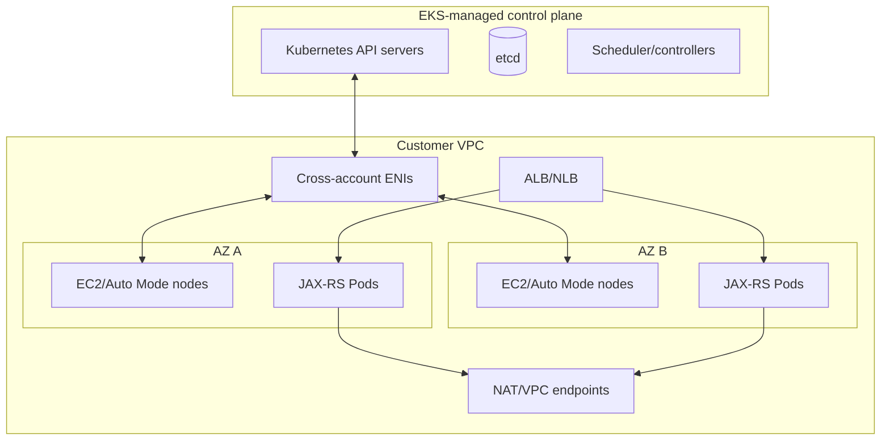
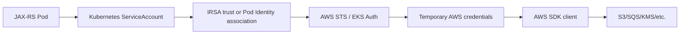
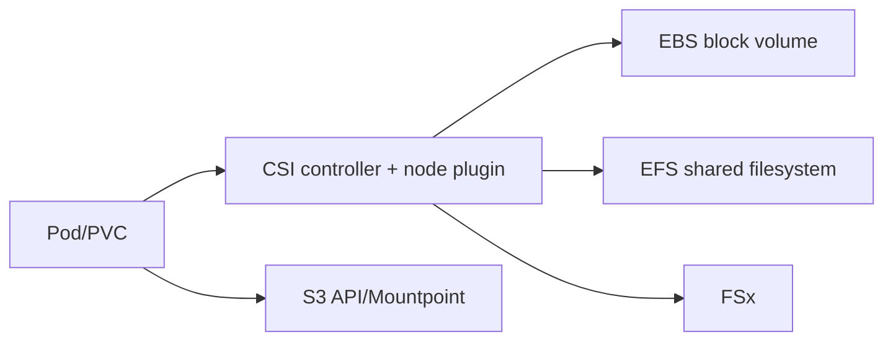
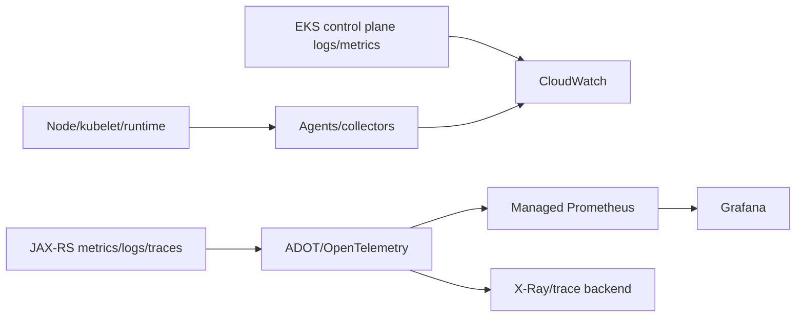

# Part 049 — Amazon EKS Architecture, Identity, Networking, and Operations

> Amazon EKS mengelola Kubernetes control plane, bukan seluruh platform aplikasi. AWS menjalankan API server dan etcd, tetapi customer tetap bertanggung jawab atas cluster access, workload identity, node capacity, Pod scheduling, add-ons, VPC and subnet design, IP exhaustion, security groups, network policy, load balancers, storage, observability, upgrades, cost, application availability, and disaster recovery. EKS Auto Mode memperluas area yang dikelola AWS ke compute, networking/load balancing, dan block storage, tetapi tidak menghapus kebutuhan untuk memahami ownership, feature boundaries, migration semantics, and failure modes.

## Daftar Isi

1. [Target kompetensi](#target-kompetensi)
2. [Scope dan baseline](#scope-dan-baseline)
3. [Boundary dengan Kubernetes generik](#boundary-dengan-kubernetes-generik)
4. [Current EKS operating models](#current-eks-operating-models)
5. [Shared responsibility model](#shared-responsibility-model)
6. [Mental model EKS architecture](#mental-model-eks-architecture)
7. [Managed control plane](#managed-control-plane)
8. [EKS-managed VPC](#eks-managed-vpc)
9. [Control-plane availability zones](#control-plane-availability-zones)
10. [Cluster subnets and cross-account ENIs](#cluster-subnets-and-cross-account-enis)
11. [Kubernetes API endpoint](#kubernetes-api-endpoint)
12. [Public endpoint](#public-endpoint)
13. [Private endpoint](#private-endpoint)
14. [Public-and-private endpoint mode](#public-and-private-endpoint-mode)
15. [Private cluster with limited internet](#private-cluster-with-limited-internet)
16. [DNS and endpoint resolution](#dns-and-endpoint-resolution)
17. [Control-plane logs](#control-plane-logs)
18. [Cluster lifecycle and platform versions](#cluster-lifecycle-and-platform-versions)
19. [EKS Standard](#eks-standard)
20. [EKS Auto Mode](#eks-auto-mode)
21. [Auto Mode ownership boundary](#auto-mode-ownership-boundary)
22. [Migrating to or from Auto Mode](#migrating-to-or-from-auto-mode)
23. [Compute choices](#compute-choices)
24. [Managed node groups](#managed-node-groups)
25. [Self-managed nodes](#self-managed-nodes)
26. [Karpenter](#karpenter)
27. [EKS Auto Mode NodePools and NodeClasses](#eks-auto-mode-nodepools-and-nodeclasses)
28. [AWS Fargate](#aws-fargate)
29. [Hybrid Nodes boundary](#hybrid-nodes-boundary)
30. [On-Demand and Spot](#on-demand-and-spot)
31. [Mixed capacity strategy](#mixed-capacity-strategy)
32. [Node operating systems](#node-operating-systems)
33. [Bottlerocket boundary](#bottlerocket-boundary)
34. [Amazon Linux node images](#amazon-linux-node-images)
35. [Windows nodes boundary](#windows-nodes-boundary)
36. [CPU architecture](#cpu-architecture)
37. [Node bootstrap](#node-bootstrap)
38. [Node IAM role](#node-iam-role)
39. [System and critical add-ons](#system-and-critical-add-ons)
40. [Dedicated system capacity](#dedicated-system-capacity)
41. [Node-group design](#node-group-design)
42. [Node labels and taints](#node-labels-and-taints)
43. [Availability-zone placement](#availability-zone-placement)
44. [Node scaling](#node-scaling)
45. [Cluster Autoscaler boundary](#cluster-autoscaler-boundary)
46. [Karpenter provisioning model](#karpenter-provisioning-model)
47. [Consolidation and disruption](#consolidation-and-disruption)
48. [Capacity reservations and instance diversity](#capacity-reservations-and-instance-diversity)
49. [Authentication versus authorization](#authentication-versus-authorization)
50. [AWS IAM authentication](#aws-iam-authentication)
51. [EKS access entries](#eks-access-entries)
52. [Access policies](#access-policies)
53. [Kubernetes RBAC](#kubernetes-rbac)
54. [Legacy `aws-auth` ConfigMap](#legacy-aws-auth-configmap)
55. [Cluster creator access](#cluster-creator-access)
56. [Break-glass access](#break-glass-access)
57. [Human identity lifecycle](#human-identity-lifecycle)
58. [CI/CD identity](#cicd-identity)
59. [Workload identity mental model](#workload-identity-mental-model)
60. [Node-role credential risk](#node-role-credential-risk)
61. [IAM Roles for Service Accounts](#iam-roles-for-service-accounts)
62. [IRSA OIDC trust](#irsa-oidc-trust)
63. [EKS Pod Identity](#eks-pod-identity)
64. [Pod Identity agent](#pod-identity-agent)
65. [Pod Identity associations](#pod-identity-associations)
66. [IRSA versus EKS Pod Identity](#irsa-versus-eks-pod-identity)
67. [AWS SDK credential chain](#aws-sdk-credential-chain)
68. [Least-privilege policies](#least-privilege-policies)
69. [Cross-account access](#cross-account-access)
70. [Session tags and ABAC boundary](#session-tags-and-abac-boundary)
71. [Credential rotation and caching](#credential-rotation-and-caching)
72. [VPC design](#vpc-design)
73. [Cluster subnets versus node subnets](#cluster-subnets-versus-node-subnets)
74. [Public and private subnets](#public-and-private-subnets)
75. [Subnet IP capacity](#subnet-ip-capacity)
76. [Amazon VPC CNI](#amazon-vpc-cni)
77. [VPC CNI node components](#vpc-cni-node-components)
78. [ENIs and secondary IPs](#enis-and-secondary-ips)
79. [Prefix delegation](#prefix-delegation)
80. [`maxPods`](#maxpods)
81. [Warm IP and prefix targets](#warm-ip-and-prefix-targets)
82. [IPv4 exhaustion](#ipv4-exhaustion)
83. [Custom networking boundary](#custom-networking-boundary)
84. [IPv6 clusters](#ipv6-clusters)
85. [Alternative CNIs boundary](#alternative-cnis-boundary)
86. [Security groups for Pods](#security-groups-for-pods)
87. [Cluster security group](#cluster-security-group)
88. [Node security groups](#node-security-groups)
89. [NetworkPolicy](#networkpolicy)
90. [VPC CNI network-policy enforcement](#vpc-cni-network-policy-enforcement)
91. [Cilium or Calico boundary](#cilium-or-calico-boundary)
92. [DNS and CoreDNS](#dns-and-coredns)
93. [NodeLocal DNS boundary](#nodelocal-dns-boundary)
94. [Egress architecture](#egress-architecture)
95. [NAT Gateway cost and port capacity](#nat-gateway-cost-and-port-capacity)
96. [VPC endpoints and PrivateLink](#vpc-endpoints-and-privatelink)
97. [Restricted-egress clusters](#restricted-egress-clusters)
98. [Load-balancing options](#load-balancing-options)
99. [AWS Load Balancer Controller](#aws-load-balancer-controller)
100. [Application Load Balancer](#application-load-balancer)
101. [Network Load Balancer](#network-load-balancer)
102. [Instance versus IP targets](#instance-versus-ip-targets)
103. [IngressClass and `loadBalancerClass`](#ingressclass-and-loadbalancerclass)
104. [EKS Auto Mode load balancing](#eks-auto-mode-load-balancing)
105. [Gateway API boundary](#gateway-api-boundary)
106. [NGINX and other ingress controllers](#nginx-and-other-ingress-controllers)
107. [AWS WAF boundary](#aws-waf-boundary)
108. [TLS and ACM](#tls-and-acm)
109. [Source IP and proxy headers](#source-ip-and-proxy-headers)
110. [Health checks](#health-checks)
111. [Deregistration and draining](#deregistration-and-draining)
112. [Cross-zone traffic and topology](#cross-zone-traffic-and-topology)
113. [Storage mental model](#storage-mental-model)
114. [Amazon EBS CSI](#amazon-ebs-csi)
115. [EBS availability-zone affinity](#ebs-availability-zone-affinity)
116. [EBS volume types and performance](#ebs-volume-types-and-performance)
117. [EBS snapshots](#ebs-snapshots)
118. [Amazon EFS CSI](#amazon-efs-csi)
119. [EFS access points](#efs-access-points)
120. [Amazon FSx boundary](#amazon-fsx-boundary)
121. [S3 and Mountpoint boundary](#s3-and-mountpoint-boundary)
122. [Instance-store CSI boundary](#instance-store-csi-boundary)
123. [Fargate storage limitations](#fargate-storage-limitations)
124. [StorageClass governance](#storageclass-governance)
125. [Volume expansion](#volume-expansion)
126. [CSI snapshots](#csi-snapshots)
127. [Stateful workload placement](#stateful-workload-placement)
128. [EKS add-ons](#eks-add-ons)
129. [Managed versus self-managed add-ons](#managed-versus-self-managed-add-ons)
130. [CoreDNS add-on](#coredns-add-on)
131. [`kube-proxy` add-on](#kube-proxy-add-on)
132. [VPC CNI add-on](#vpc-cni-add-on)
133. [CSI add-ons](#csi-add-ons)
134. [Observability and security add-ons](#observability-and-security-add-ons)
135. [Add-on compatibility](#add-on-compatibility)
136. [Add-on configuration ownership](#add-on-configuration-ownership)
137. [Add-on upgrades](#add-on-upgrades)
138. [Secrets management](#secrets-management)
139. [Kubernetes Secrets and KMS boundary](#kubernetes-secrets-and-kms-boundary)
140. [AWS Secrets Manager and ASCP](#aws-secrets-manager-and-ascp)
141. [SSM Parameter Store boundary](#ssm-parameter-store-boundary)
142. [CSI Secrets Store](#csi-secrets-store)
143. [Secret rotation](#secret-rotation)
144. [Observability mental model](#observability-mental-model)
145. [CloudWatch control-plane logs](#cloudwatch-control-plane-logs)
146. [Audit logs](#audit-logs)
147. [CloudWatch Container Insights](#cloudwatch-container-insights)
148. [Prometheus](#prometheus)
149. [Amazon Managed Service for Prometheus](#amazon-managed-service-for-prometheus)
150. [Amazon Managed Grafana boundary](#amazon-managed-grafana-boundary)
151. [AWS Distro for OpenTelemetry](#aws-distro-for-opentelemetry)
152. [EKS observability dashboard](#eks-observability-dashboard)
153. [Cluster insights](#cluster-insights)
154. [Application logs](#application-logs)
155. [Node and system logs](#node-and-system-logs)
156. [Cost and cardinality](#cost-and-cardinality)
157. [Security posture](#security-posture)
158. [Private API and network segmentation](#private-api-and-network-segmentation)
159. [IAM least privilege](#iam-least-privilege)
160. [Pod Security Admission](#pod-security-admission)
161. [Image provenance and ECR boundary](#image-provenance-and-ecr-boundary)
162. [Admission policy](#admission-policy)
163. [Runtime security boundary](#runtime-security-boundary)
164. [GuardDuty and Security Hub boundary](#guardduty-and-security-hub-boundary)
165. [AWS CloudTrail](#aws-cloudtrail)
166. [Encryption](#encryption)
167. [Multi-account architecture](#multi-account-architecture)
168. [Multi-tenancy](#multi-tenancy)
169. [Reliability mental model](#reliability-mental-model)
170. [Multi-AZ data plane](#multi-az-data-plane)
171. [Topology spread](#topology-spread)
172. [Control-plane versus data-plane availability](#control-plane-versus-data-plane-availability)
173. [Regional outage](#regional-outage)
174. [Multi-region boundary](#multi-region-boundary)
175. [Critical add-on availability](#critical-add-on-availability)
176. [Pod disruption and node replacement](#pod-disruption-and-node-replacement)
177. [EC2 capacity shortages](#ec2-capacity-shortages)
178. [Spot interruptions](#spot-interruptions)
179. [Failure-domain headroom](#failure-domain-headroom)
180. [Backups and recovery](#backups-and-recovery)
181. [Infrastructure as code](#infrastructure-as-code)
182. [AWS Backup for EKS boundary](#aws-backup-for-eks-boundary)
183. [Application-data backup](#application-data-backup)
184. [Restore rehearsal](#restore-rehearsal)
185. [Cluster recreation](#cluster-recreation)
186. [Version upgrades](#version-upgrades)
187. [Kubernetes version policy](#kubernetes-version-policy)
188. [Upgrade insights](#upgrade-insights)
189. [Control-plane upgrade](#control-plane-upgrade)
190. [Node upgrade](#node-upgrade)
191. [Managed node-group update strategies](#managed-node-group-update-strategies)
192. [Add-on upgrade ordering](#add-on-upgrade-ordering)
193. [PDB and drain behavior](#pdb-and-drain-behavior)
194. [EKS Auto Mode upgrades](#eks-auto-mode-upgrades)
195. [Control-plane rollback boundary](#control-plane-rollback-boundary)
196. [Blue-green cluster upgrade](#blue-green-cluster-upgrade)
197. [Deprecation and API scanning](#deprecation-and-api-scanning)
198. [Cost model](#cost-model)
199. [Cluster and support fees](#cluster-and-support-fees)
200. [EC2 and Fargate cost](#ec2-and-fargate-cost)
201. [Load balancer cost](#load-balancer-cost)
202. [NAT and data-transfer cost](#nat-and-data-transfer-cost)
203. [Storage and snapshots](#storage-and-snapshots)
204. [Logs and metrics](#logs-and-metrics)
205. [Spot and Graviton](#spot-and-graviton)
206. [Rightsizing and consolidation](#rightsizing-and-consolidation)
207. [Cost allocation](#cost-allocation)
208. [JAX-RS workload integration](#jax-rs-workload-integration)
209. [Java SDK identity](#java-sdk-identity)
210. [AWS SDK client lifecycle](#aws-sdk-client-lifecycle)
211. [Metadata-service protection](#metadata-service-protection)
212. [Health and load balancers](#health-and-load-balancers)
213. [Graceful termination](#graceful-termination)
214. [Connection pools and node churn](#connection-pools-and-node-churn)
215. [S3, SQS, SNS, and KMS calls](#s3-sqs-sns-and-kms-calls)
216. [Failure-model matrix](#failure-model-matrix)
217. [Debugging playbook](#debugging-playbook)
218. [Testing strategy](#testing-strategy)
219. [Architecture patterns](#architecture-patterns)
220. [Anti-patterns](#anti-patterns)
221. [PR review checklist](#pr-review-checklist)
222. [Trade-off yang harus dipahami senior engineer](#trade-off-yang-harus-dipahami-senior-engineer)
223. [Internal verification checklist](#internal-verification-checklist)
224. [Latihan verifikasi](#latihan-verifikasi)
225. [Ringkasan](#ringkasan)
226. [Referensi resmi](#referensi-resmi)

---

## Target kompetensi

Setelah menyelesaikan part ini, Anda harus mampu:

- menjelaskan managed EKS control plane and customer-owned data plane;
- memilih EKS Standard or Auto Mode with explicit ownership and migration boundaries;
- memilih managed node groups, Karpenter/Auto Mode NodePools, Fargate, Spot, or dedicated capacity;
- mendesain multi-AZ node pools, system capacity, instance diversity, taints, and disruption policy;
- memisahkan IAM authentication, EKS access entries, access policies, Kubernetes RBAC, and legacy `aws-auth`;
- memisahkan node IAM role, IRSA, and EKS Pod Identity;
- mengimplementasikan Java AWS SDK credential resolution without static keys;
- merencanakan VPC/subnet/IP capacity for VPC CNI, prefix delegation, IPv6, and Pod security groups;
- membedakan AWS Load Balancer Controller, EKS Auto Mode load balancing, NGINX, Service NLB, and Ingress ALB;
- memilih EBS, EFS, FSx, S3/Mountpoint, or ephemeral storage according to semantics;
- mengoperasikan EKS add-ons and compatibility;
- mengintegrasikan CloudWatch, Prometheus, ADOT, audit logs, and cluster insights;
- menjalankan cluster/node/add-on upgrade with PDB, capacity, and rollback planning;
- mendesain private/restricted-egress EKS with VPC endpoints;
- menilai reliability, regional DR, backup, and cluster recreation;
- mengendalikan EKS cost from compute, NAT, load balancers, logs, storage, and transfer;
- mendiagnosis node join, IP exhaustion, identity, load balancing, storage, DNS, and upgrade incidents.

---

## Scope dan baseline

Baseline:

- Kubernetes workload/networking knowledge from Parts 046–048;
- JAX-RS/Jersey application in OCI images;
- AWS account, VPC, IAM, EC2, ECR, and CloudWatch concepts;
- infrastructure provisioned through IaC, although exact tool is not assumed;
- EKS Standard or Auto Mode;
- Linux workloads as primary example.

Part ini **tidak mengasumsikan**:

- current CSG deployment is EKS;
- EKS Auto Mode is enabled;
- `eksctl`, Terraform, CloudFormation, or CDK;
- public or private cluster endpoint;
- one CNI/network-policy implementation;
- managed node groups or Karpenter;
- AWS Load Balancer Controller;
- IRSA or Pod Identity;
- EBS/EFS;
- CloudWatch-only observability;
- exact region, subnet, account, instance type, or Kubernetes version.

---

## Boundary dengan Kubernetes generik

This part does not repeat generic Deployment, Service, probe, NetworkPolicy, or Gateway semantics.

It focuses on AWS-specific implementation and ownership:

- managed control plane;
- IAM;
- VPC CNI;
- EC2/Fargate/Auto Mode;
- ALB/NLB;
- EBS/EFS;
- CloudWatch;
- EKS upgrades and service lifecycle.

---

## Current EKS operating models

### EKS Standard

Customer/platform team selects and operates data-plane components:

- compute;
- autoscaling;
- load balancers/controllers;
- storage drivers;
- networking configuration;
- add-ons.

### EKS Auto Mode

AWS manages broader data-plane capabilities:

- compute provisioning and node lifecycle;
- VPC networking and load balancing integration;
- block storage integration;
- selected operational components.

Auto Mode still requires workload manifests, NodePool/NodeClass policy, security, observability, application SLOs, and migration governance.

---

## Shared responsibility model

| Layer | AWS-managed baseline | Customer responsibility |
|---|---|---|
| Control plane | API server, etcd, managed availability | access, API usage, audit/log enablement |
| Cluster API endpoint | service endpoint | public/private exposure and allow-list |
| Nodes | depends on MNG/Fargate/Auto Mode | workloads, resources, disruption, capacity policy |
| Kubernetes objects | none | all workload/config/security policies |
| IAM | AWS service | role/policy/trust design |
| Networking | AWS primitives | VPC/subnets/routes/CNI/policy/LB architecture |
| Storage | AWS service | StorageClasses, encryption, backup, topology |
| Observability | service integrations | enablement, retention, alerts, cardinality |
| Application | none | correctness, upgrades, resilience, security |

---

## Mental model EKS architecture



---

## Managed control plane

EKS manages:

- API server;
- scheduler;
- controller manager;
- etcd;
- control-plane patching;
- availability of control-plane components.

Customer cannot SSH to control-plane nodes or manage etcd directly.

---

## EKS-managed VPC

The control plane runs in an EKS-managed VPC, separate from customer VPC.

Cross-account network interfaces in customer cluster subnets support communication for cluster management traffic.

---

## Control-plane availability zones

AWS distributes API server and etcd components across multiple Availability Zones.

This protects control plane from an individual AZ fault, but application availability still depends on customer data-plane placement and stateful dependencies.

---

## Cluster subnets and cross-account ENIs

Cluster creation requires subnets in at least two AZs.

EKS creates ENIs in selected cluster subnets for control-plane-to-data-plane communication.

Do not consume every subnet address with Pods/nodes.

---

## Kubernetes API endpoint

Endpoint policy defines how administrators, nodes, and automation reach Kubernetes API.

---

## Public endpoint

Publicly resolvable/reachable endpoint can be restricted by CIDR.

Risks:

- broad internet exposure;
- corporate egress changes;
- CI runner addresses;
- authentication brute force;
- policy drift.

IAM authentication does not replace network restriction.

---

## Private endpoint

Private access routes through VPC.

Administrators need:

- VPN/Direct Connect;
- bastion/SSM;
- VPC-connected CI;
- private DNS;
- routes/security groups.

---

## Public-and-private endpoint mode

Nodes can use private endpoint while approved operators use public endpoint.

Ensure public CIDR allow-list is narrow and maintained.

---

## Private cluster with limited internet

A private cluster without general internet egress needs VPC endpoints or controlled egress for:

- ECR API and registry;
- S3 layers;
- STS;
- EKS Auth for Pod Identity;
- CloudWatch Logs/metrics;
- EC2;
- Elastic Load Balancing;
- KMS;
- Secrets Manager/SSM;
- other application dependencies.

The exact list depends on enabled capabilities.

---

## DNS and endpoint resolution

Private endpoint and service endpoints rely on VPC DNS.

Validate:

- DNS hostnames/support;
- Route 53 Resolver;
- hybrid DNS;
- private hosted zones;
- split-horizon behavior.

---

## Control-plane logs

EKS can send selected control-plane logs to CloudWatch Logs:

- API server;
- audit;
- authenticator;
- controller manager;
- scheduler.

Delivery is not instant and CloudWatch ingestion/retention costs apply.

---

## Cluster lifecycle and platform versions

EKS Kubernetes minor version and EKS platform version are separate concepts.

AWS can release platform revisions with control-plane improvements while keeping same Kubernetes minor version.

Track both.

---

## EKS Standard

Benefits:

- maximum implementation choice;
- alternative CNIs;
- custom autoscaling;
- custom load-balancer controllers;
- custom storage and node configuration.

Costs:

- add-on compatibility;
- lifecycle ownership;
- node AMIs;
- controller upgrades;
- broader operational burden.

---

## EKS Auto Mode

Auto Mode automates selected compute, load balancing/networking, and block-storage capabilities.

It uses AWS-managed implementations and Kubernetes resources such as NodePools/NodeClasses for compute policy.

Benefits:

- reduced controller/node lifecycle work;
- integrated security and updates;
- standardized capabilities.

Costs:

- supported-feature boundary;
- migration differences;
- AWS-specific resource classes/provisioners;
- reduced low-level control;
- pricing model that must be reviewed.

---

## Auto Mode ownership boundary

Do not manually mutate AWS resources that Auto Mode owns unless documented.

External references to managed security groups or resources can complicate cleanup.

Use Kubernetes/AWS APIs intended by Auto Mode.

---

## Migrating to or from Auto Mode

Migration can require changing:

- EBS provisioner from `ebs.csi.aws.com` to `ebs.csi.eks.amazonaws.com`;
- `loadBalancerClass`;
- IngressClass/controller;
- node provisioning resources;
- CNI assumptions;
- IAM/access entries.

Storage migration can require snapshot/recreate procedures.

Test non-production first.

---

## Compute choices

| Compute | Operational model |
|---|---|
| Managed node group | AWS manages ASG lifecycle integration, customer chooses shape/AMI policy |
| Self-managed nodes | customer owns launch/bootstrap/update/drain |
| Karpenter | dynamic EC2 provisioning based on pending Pods |
| EKS Auto Mode | AWS-managed compute capability with NodePools/NodeClasses |
| Fargate | per-Pod serverless compute |
| Hybrid Nodes | external/on-prem compute attached to EKS control plane |

---

## Managed node groups

Managed node groups automate provisioning and lifecycle operations for EC2 worker nodes.

Customer still owns:

- instance/AMI choices;
- launch templates;
- labels/taints;
- scaling bounds;
- PDBs;
- capacity;
- workload scheduling;
- update timing.

---

## Self-managed nodes

Use only when requirements cannot be met by managed alternatives.

You own:

- AMI;
- bootstrap;
- ASG;
- health replacement;
- Kubernetes version;
- drain/update;
- security patching;
- lifecycle automation.

---

## Karpenter

Karpenter observes unschedulable Pods and provisions EC2 capacity matching scheduling constraints.

It optimizes around:

- instance types;
- AZs;
- architectures;
- capacity types;
- NodePools/NodeClasses;
- consolidation/disruption.

It is not a workload autoscaler; HPA/VPA control Pod demand.

---

## EKS Auto Mode NodePools and NodeClasses

Auto Mode exposes managed compute policy through NodePool and NodeClass resources.

Define:

- allowed instances;
- zones;
- capacity type;
- architecture;
- labels/taints;
- subnet/security-group selectors;
- disruption.

Verify supported fields and managed defaults.

---

## AWS Fargate

Fargate runs selected Pods without customer-managed EC2 nodes.

Strengths:

- workload-level isolation;
- no node lifecycle;
- simple burst for compatible Pods.

Constraints:

- feature/DaemonSet limitations;
- storage limitations;
- sizing granularity;
- startup/cost;
- networking and observability differences;
- no EBS mount to Fargate Pods.

---

## Hybrid Nodes boundary

Hybrid Nodes connect external/on-prem compute to EKS.

VPC CNI and some storage/add-ons are not compatible.

Treat as separate architecture, not a normal node group.

---

## On-Demand and Spot

On-Demand offers capacity continuity subject to regional capacity.

Spot is interruptible and lower cost.

Use Spot for interruption-tolerant replicated workloads.

---

## Mixed capacity strategy

Separate NodePools/node groups:

- system/critical On-Demand;
- baseline application On-Demand;
- burst application Spot;
- memory-optimized;
- compute-optimized;
- ARM64.

Use taints/affinity and topology spread.

---

## Node operating systems

Node OS affects:

- patching;
- packages;
- container runtime;
- kernel;
- diagnostics;
- CIS posture;
- support lifecycle.

---

## Bottlerocket boundary

Bottlerocket is container-focused and reduces general-purpose package surface.

Operational access and configuration differ from Amazon Linux.

Validate agents, CSI, CNI, debugging, and kernel requirements.

---

## Amazon Linux node images

Use current EKS-optimized supported generation.

Track deprecation and Kubernetes-version compatibility.

Do not rely on unpatched custom AMI.

---

## Windows nodes boundary

Windows node pools have different:

- networking;
- storage;
- security;
- DaemonSet;
- version;
- image;
- container constraints.

Keep Linux and Windows workloads explicitly separated.

---

## CPU architecture

ARM64/Graviton can improve price/performance.

Requirements:

- multi-arch images;
- native libraries;
- Java distribution;
- observability agents;
- sidecars.

Use architecture labels/affinity.

---

## Node bootstrap

Bootstrap config includes:

- cluster endpoint/CA;
- kubelet args;
- labels/taints;
- DNS;
- max Pods;
- container runtime;
- node role credentials.

Managed methods reduce but do not eliminate validation.

---

## Node IAM role

Node role allows kubelet and node components to interact with AWS/ECR and required services.

Do not attach application permissions to node role.

Pods may otherwise inherit node credentials depending metadata access and SDK behavior.

---

## System and critical add-ons

CoreDNS, CNI, kube-proxy, CSI controllers, autoscalers, and observability agents need reliable capacity.

A cluster can have healthy API but unusable system add-ons.

---

## Dedicated system capacity

Use dedicated On-Demand nodes/Auto Mode system pool where appropriate.

Taint system nodes and tolerate only critical add-ons.

Avoid starvation by application Pods.

---

## Node-group design

Group by operational property, not one group per microservice.

Dimensions:

- OS;
- architecture;
- capacity type;
- instance family;
- security;
- AZ;
- GPU/special device;
- lifecycle.

Too many groups reduce bin-packing and increase complexity.

---

## Node labels and taints

Use immutable/provider labels carefully.

Taints enforce placement only when Pods lack toleration.

Labels without affinity do not place workloads.

---

## Availability-zone placement

Spread nodes and Pods across AZs.

A multi-AZ node group does not guarantee every application replica is spread; use topology constraints.

---

## Node scaling

Scaling must account for:

- pending Pods;
- daemon overhead;
- Pod IPs;
- EBS AZ binding;
- quotas;
- EC2 capacity;
- bootstrap time;
- PDB/disruption;
- max Pods.

---

## Cluster Autoscaler boundary

Cluster Autoscaler changes ASG/node-group size based on unschedulable Pods and utilization assumptions.

It works best with homogeneous groups and accurate resource requests.

---

## Karpenter provisioning model

Karpenter chooses concrete EC2 capacity after evaluating pending Pods.

It can reduce over-provisioning and diversify instances.

Capacity policy must limit unacceptable families, generations, zones, and prices.

---

## Consolidation and disruption

Consolidation can replace/remove nodes for cost efficiency.

Protect:

- PDBs;
- long jobs;
- local storage;
- single replicas;
- expensive warmup;
- Kafka/Rabbit/Camunda workers;
- graceful termination.

---

## Capacity reservations and instance diversity

Critical workloads may require reservations or multiple viable instance types.

A NodePool allowing one rare instance can fail during AZ shortage.

---

## Authentication versus authorization

EKS authenticates AWS IAM principals and maps them to Kubernetes identity/access.

Kubernetes RBAC or EKS access policies authorize actions.

---

## AWS IAM authentication

`kubectl` commonly uses an AWS token generated from IAM credentials.

Credential source can be SSO, assumed role, or CI role.

---

## EKS access entries

Access entries manage cluster access through EKS API.

Benefits:

- central IAM-principal mapping;
- revocation through EKS API;
- predefined access policies;
- reduced dependence on manually editing `aws-auth`;
- cluster-creator access governance.

---

## Access policies

EKS access policies provide permission sets scoped to cluster/namespaces according to association.

They coexist with Kubernetes RBAC depending authentication mode.

Do not grant broad admin by default.

---

## Kubernetes RBAC

Use Kubernetes RBAC for fine-grained resource/action rules and service-account permissions.

Access policy names are not equivalent to arbitrary RBAC rules.

---

## Legacy `aws-auth` ConfigMap

Older clusters may map roles/users through `aws-auth`.

Risks:

- lockout;
- manual drift;
- limited AWS API visibility;
- difficult automation.

Plan migration to access entries where supported.

---

## Cluster creator access

Do not leave permanent hidden/unreviewed cluster-admin ownership with one creator.

Use managed access entries and break-glass role.

---

## Break-glass access

Require:

- protected role;
- MFA/approval;
- limited session;
- CloudTrail/audit;
- post-incident review;
- tested access path.

---

## Human identity lifecycle

Use IAM Identity Center/federated roles rather than long-lived access keys.

Align AWS role and Kubernetes namespace access.

---

## CI/CD identity

CI role should have only required EKS API and Kubernetes permissions.

Separate deploy, platform admin, and read-only roles.

---

## Workload identity mental model



---

## Node-role credential risk

If a Pod can reach instance metadata and no workload-specific credentials win the chain, it can obtain node-role credentials.

Reduce with:

- Pod Identity/IRSA;
- metadata controls;
- IMDSv2;
- hop limit/network policy where supported;
- no app permissions on node role.

---

## IAM Roles for Service Accounts

IRSA uses:

- cluster OIDC issuer;
- IAM OIDC provider;
- IAM role trust policy;
- Kubernetes ServiceAccount annotation;
- projected service-account token;
- AWS SDK web-identity provider.

---

## IRSA OIDC trust

Trust should scope:

- issuer;
- namespace;
- ServiceAccount subject;
- audience.

Avoid wildcarding every ServiceAccount.

---

## EKS Pod Identity

EKS Pod Identity associates IAM role with Kubernetes ServiceAccount using EKS APIs and a node agent.

It removes the need to create one IAM OIDC provider trust relationship per cluster for this mechanism.

Credentials remain temporary.

---

## Pod Identity agent

Agent runs on each eligible node and uses EKS Auth API to provide credentials.

Requirements include:

- agent availability;
- node role permissions;
- endpoint/egress;
- supported SDK credential chain;
- no port conflicts.

---

## Pod Identity associations

Association binds:

```text
cluster + namespace + ServiceAccount → IAM role
```

Keep ServiceAccount names stable and review cross-account trust.

---

## IRSA versus EKS Pod Identity

| Dimension | IRSA | EKS Pod Identity |
|---|---|---|
| Trust | IAM OIDC provider and subject conditions | EKS association plus service principal trust |
| Cluster setup | OIDC provider | Pod Identity agent |
| SDK | web-identity support | container credential provider support |
| Cross-account | direct role trust or chain | often role chaining/delegation pattern |
| Portability | EKS-specific trust but standard projected token pattern | more EKS-specific |
| Migration | annotation/trust change | association/agent/SDK validation |

Choose organization standard and SDK compatibility.

---

## AWS SDK credential chain

Java SDK should use default provider chain or explicit workload provider, not static keys.

Verify it selects Pod Identity/IRSA before node metadata.

Log provider type, never credentials.

---

## Least-privilege policies

Scope by:

- resource ARN;
- prefix;
- queue/topic;
- KMS key;
- Secrets Manager secret;
- conditions;
- tags;
- source VPC endpoint where appropriate.

Separate runtime and admin permissions.

---

## Cross-account access

Use role assumption and explicit trust.

Avoid sharing static credentials or broad resource policies.

Model session duration and retry.

---

## Session tags and ABAC boundary

IAM session tags can enable attribute-based policies.

Verify whether identity mechanism propagates required tags and avoid caller-controlled privilege tags.

---

## Credential rotation and caching

AWS credentials rotate automatically.

Long-lived SDK clients refresh.

Do not copy temporary credentials into static fields/files.

Handle clock skew and STS/EKS Auth availability.

---

## VPC design

Plan:

- CIDRs;
- AZs;
- cluster/node/Pod subnets;
- routing;
- NAT/endpoints;
- load balancer subnets;
- hybrid connectivity;
- future growth;
- IPv6.

---

## Cluster subnets versus node subnets

Cluster subnets host EKS control-plane ENIs.

Nodes/Pods can use additional subnets according to configuration.

Do not confuse API ENI capacity with Pod IP pools.

---

## Public and private subnets

Common:

- public subnets for internet-facing LBs;
- private subnets for nodes/internal LBs;
- NAT or endpoints for egress.

Subnet tags/controller discovery must be governed.

---

## Subnet IP capacity

Capacity includes:

- nodes;
- Pod IPs;
- load balancers;
- ENIs;
- control-plane ENIs;
- other VPC workloads.

Autoscaling fails if subnet is full.

---

## Amazon VPC CNI

VPC CNI assigns VPC-routable IP addresses to Pods on EC2 nodes.

It runs node components that manage ENIs, addresses/prefixes, routes, and policy features.

---

## VPC CNI node components

`aws-node` DaemonSet includes networking components according to version/config.

It needs IAM permissions.

Prefer dedicated IAM role through Pod Identity/IRSA rather than broad node role.

---

## ENIs and secondary IPs

Each EC2 type has ENI/IP limits.

These affect `maxPods`.

Larger instances may support more Pods but application CPU/memory still matter.

---

## Prefix delegation

Prefix delegation assigns IPv4 prefixes to ENIs, improving Pod IP scale and allocation latency.

It requires subnet contiguous addresses and correct CNI/node configuration.

---

## `maxPods`

Kubelet max Pods should align with networking capacity and node resources.

Do not increase beyond CNI/ENI limits.

DaemonSets consume slots.

---

## Warm IP and prefix targets

VPC CNI can pre-allocate addresses/prefixes.

Higher warm targets speed Pod startup but reserve more subnet IPs.

---

## IPv4 exhaustion

Symptoms:

- Pod sandbox creation failure;
- nodes healthy but Pods pending;
- CNI errors;
- autoscaler adds nodes without usable IPs.

Capacity planning must include peak and rollout surge.

---

## Custom networking boundary

Custom networking can use secondary subnets/CIDRs for Pods.

It increases routing/security/operations complexity.

AWS guidance increasingly favors evaluating IPv6 for long-term exhaustion.

---

## IPv6 clusters

EKS IPv6 gives Pods IPv6 addresses while preserving compatibility mechanisms for IPv4 destinations.

Requirements:

- VPC/subnets/routes;
- security groups;
- load balancers;
- dependencies;
- application/client support;
- observability.

Migration is architecture work, not a toggle.

---

## Alternative CNIs boundary

Alternative CNI may provide overlay/eBPF features.

It changes support, add-ons, Auto Mode compatibility, security groups, and troubleshooting.

---

## Security groups for Pods

Allows AWS security groups to apply to selected Pods.

Useful for AWS-resource network authorization.

Trade-offs:

- branch ENI capacity;
- startup;
- mode/source NAT behavior;
- policy layering;
- supported instances.

---

## Cluster security group

EKS creates/uses cluster security group for control-plane and node communication.

Tightening rules must preserve required flows.

---

## Node security groups

Node SGs control:

- control-plane communication;
- inter-node;
- load balancer;
- egress;
- management.

Avoid one broad SG for every trust boundary.

---

## NetworkPolicy

Use Kubernetes NetworkPolicy with an enforcing engine.

VPC security groups do not replace Pod-level east-west policy.

---

## VPC CNI network-policy enforcement

Recent VPC CNI versions can enforce standard NetworkPolicy with supported configuration.

Verify:

- add-on version;
- feature enablement;
- node OS/kernel;
- metrics/logs;
- mode limitations.

---

## Cilium or Calico boundary

Alternative policy/dataplane provides additional capabilities.

Document ownership and coexistence with VPC CNI/security groups.

---

## DNS and CoreDNS

EKS installs CoreDNS by default/self-managed or as managed add-on depending creation path.

Run multiple replicas across AZs/system nodes.

Monitor throttling and upstream VPC DNS.

---

## NodeLocal DNS boundary

Can reduce latency/conntrack load but adds node-local component.

Verify support and implementation.

---

## Egress architecture

Options:

- NAT Gateway;
- NAT instance/appliance;
- VPC endpoints;
- Transit Gateway;
- AWS Network Firewall;
- egress proxy;
- direct IPv6 egress with controls.

---

## NAT Gateway cost and port capacity

NAT charges and cross-AZ routing can dominate.

One destination/source combination has finite connection capacity.

Use connection pooling, VPC endpoints, zonal design, and metrics.

---

## VPC endpoints and PrivateLink

Endpoints reduce public/NAT path for AWS APIs.

Need:

- endpoint policies;
- security groups;
- private DNS;
- route tables;
- service coverage;
- cost.

---

## Restricted-egress clusters

Maintain an explicit matrix for:

- node bootstrap;
- image pulls;
- STS/EKS Auth;
- EKS/EC2/ELB;
- CloudWatch;
- S3;
- KMS/secrets;
- certificate/DNS;
- package updates;
- application APIs.

---

## Load-balancing options

| Requirement | Common AWS mechanism |
|---|---|
| Kubernetes Service L4 | NLB |
| HTTP host/path L7 | ALB through AWS LBC or Auto Mode |
| NGINX features | NGINX controller behind NLB |
| Global edge | CloudFront/Global Accelerator plus regional LB |
| Private internal | internal ALB/NLB |

---

## AWS Load Balancer Controller

Controller watches Kubernetes resources and provisions ALB/NLB.

Requires IAM workload identity and subnet/security configuration.

Own its version and compatibility.

---

## Application Load Balancer

ALB provides HTTP/HTTPS L7 routing, health checks, TLS, WAF integration, and target groups.

Ingress/Gateway support depends on controller.

---

## Network Load Balancer

NLB provides L4 TCP/TLS/UDP characteristics and high connection scale.

Can target instances or Pod IPs according to mode.

---

## Instance versus IP targets

Instance targets route to node/NodePort then Pod.

IP targets register Pod IPs directly.

Differences:

- hops;
- source IP;
- health;
- security groups;
- Fargate support;
- endpoint updates.

---

## IngressClass and `loadBalancerClass`

Use explicit class ownership when multiple controllers/Auto Mode coexist.

Migration requires changing class/provisioner without both controllers claiming same resource.

---

## EKS Auto Mode load balancing

Auto Mode can provision load balancers from supported Service/Ingress resources and AWS-specific classes/annotations.

Supported annotations differ from AWS Load Balancer Controller.

Review migration table and unsupported fields.

---

## Gateway API boundary

AWS controller/Auto Mode Gateway support evolves.

Check exact version and conformance before choosing Gateway resources.

---

## NGINX and other ingress controllers

NGINX/Envoy/HAProxy controllers run as workloads and are typically exposed by NLB.

You own controller lifecycle unless delivered as managed capability.

---

## AWS WAF boundary

WAF can attach to supported edge/load-balancer resources.

It does not replace JAX-RS input validation, auth, or rate limiting.

---

## TLS and ACM

ACM manages certificates for supported AWS load balancers.

For TLS inside Pod/NGINX, use Kubernetes Secrets/cert manager/Private CA according to design.

---

## Source IP and proxy headers

Map:

- NLB source preservation/PROXY;
- ALB `X-Forwarded-*`;
- NGINX trusted proxy;
- JAX-RS normalization.

Never trust arbitrary incoming headers.

---

## Health checks

LB health may target:

- Pod IP;
- NodePort;
- ingress controller;
- application route.

Ensure health endpoint semantics and security.

---

## Deregistration and draining

Align:

```text
Pod readiness
→ target deregistration
→ deregistration delay
→ application termination grace
```

Long connections and async propagation matter.

---

## Cross-zone traffic and topology

Cross-zone load balancing and target distribution affect:

- availability;
- data transfer cost;
- latency;
- zonal failure.

Measure actual target mode and LB settings.

---

## Storage mental model



Choose storage semantics before provider.

---

## Amazon EBS CSI

EBS CSI provisions and attaches block volumes to EC2 nodes.

Use managed add-on where appropriate.

Driver needs IAM workload identity.

Auto Mode uses a different EBS provisioner and managed capability.

---

## EBS availability-zone affinity

EBS volume belongs to an AZ.

A Pod using it must schedule to compatible AZ.

Use `WaitForFirstConsumer` StorageClass and topology-aware scheduling.

---

## EBS volume types and performance

Define:

- IOPS;
- throughput;
- size;
- encryption;
- filesystem;
- queue depth;
- burst behavior.

Do not benchmark empty small volume as production.

---

## EBS snapshots

Snapshots provide block-level recovery.

Application consistency may require quiesce/database-native backup.

---

## Amazon EFS CSI

EFS provides multi-AZ shared file storage.

Trade-offs:

- network latency;
- throughput modes;
- POSIX permissions;
- access points;
- cost;
- small-file behavior.

---

## EFS access points

Use access points for isolated root paths and identities.

Still enforce tenant/application authorization.

---

## Amazon FSx boundary

FSx variants serve high-performance or Windows/file-system-specific use cases.

Operational and cost model differs greatly.

---

## S3 and Mountpoint boundary

S3 is object storage, not POSIX filesystem.

Mountpoint/CSI exposes selected filesystem-like behavior with limits.

JAX-RS should prefer S3 API for object semantics.

---

## Instance-store CSI boundary

Instance store is node-local ephemeral NVMe.

Fast but data disappears with node.

Use for reconstructable cache/scratch.

---

## Fargate storage limitations

Fargate Pods cannot mount EBS.

EFS support exists with specific behavior.

Verify driver/controller requirements.

---

## StorageClass governance

Platform owns approved classes:

- provisioner;
- volume type;
- encryption;
- KMS;
- reclaim policy;
- binding mode;
- expansion;
- topology;
- tags.

---

## Volume expansion

CSI/StorageClass and filesystem must support it.

Expansion does not automatically solve application partitioning or performance.

---

## CSI snapshots

Need:

- CSI driver snapshot support;
- snapshot controller;
- `VolumeSnapshotClass`;
- IAM;
- backup lifecycle.

---

## Stateful workload placement

Combine volume topology, Pod spread, PDB, backups, and application replication.

Kubernetes rescheduling cannot move zonal EBS instantly across AZ.

---

## EKS add-ons

EKS add-ons are AWS-managed installations of curated operational software.

They are versioned separately from Kubernetes.

---

## Managed versus self-managed add-ons

Managed add-on:

- AWS validation;
- EKS API lifecycle;
- configurable supported fields;
- compatibility metadata.

Self-managed:

- full control;
- full upgrade/security responsibility;
- potential conflicts during conversion.

---

## CoreDNS add-on

CoreDNS availability is required for most workloads.

Set replicas/resources/spread and protect with system capacity.

---

## `kube-proxy` add-on

Programs Service dataplane unless alternative replaces it.

Version compatibility follows cluster policy.

---

## VPC CNI add-on

Critical for EC2 Pod networking.

IAM, IP configuration, logs, metrics, and version are first-class operations.

---

## CSI add-ons

AWS provides managed add-ons for storage drivers/controller components according to service/version.

Check compatibility and IAM.

---

## Observability and security add-ons

Examples include ADOT, CloudWatch agents, GuardDuty agent, CSI drivers, snapshot controller, and ecosystem add-ons.

Every DaemonSet consumes node resources.

---

## Add-on compatibility

Use EKS API to query versions compatible with Kubernetes version/architecture.

Do not upgrade cluster and assume old add-on remains supported.

---

## Add-on configuration ownership

Managed fields and customer-customizable fields can coexist through server-side apply.

Direct edits to managed fields may be overwritten or block update.

---

## Add-on upgrades

Sequence with:

- control-plane version;
- compatibility;
- configuration diff;
- PDB;
- rollout capacity;
- rollback version;
- CRD changes.

---

## Secrets management

Classify whether application consumes:

- Kubernetes Secret;
- Secrets Manager;
- SSM Parameter Store;
- CSI-mounted secret;
- runtime AWS SDK retrieval.

---

## Kubernetes Secrets and KMS boundary

EKS supports envelope encryption features according to current platform behavior and KMS integration.

Verify whether encryption is default/managed for cluster version and whether customer-managed key is required.

Kubernetes Secret remains readable to authorized API clients.

---

## AWS Secrets Manager and ASCP

AWS Secrets and Configuration Provider works with Secrets Store CSI driver to mount Secrets Manager/Parameter Store values.

It uses Pod identity/IAM.

Mounted-file rotation semantics must be tested.

---

## SSM Parameter Store boundary

Useful for configuration and SecureString.

Distinguish latency, quotas, hierarchy, KMS, and caching.

---

## CSI Secrets Store

CSI mount avoids storing secret in image but still exposes plaintext file in Pod.

Sync-to-Kubernetes-Secret can increase copies.

---

## Secret rotation

Plan:

- source rotation;
- mounted/runtime refresh;
- connection re-auth;
- old/new overlap;
- rollback;
- audit.

---

## Observability mental model



---

## CloudWatch control-plane logs

Enable required types from cluster creation when possible.

Audit logs support security investigation.

Set retention and subscription policy.

---

## Audit logs

Audit logs can be high-volume and sensitive.

Use for:

- access;
- Secret reads;
- privilege changes;
- admission;
- workload mutations.

---

## CloudWatch Container Insights

Collects container/node metrics and logs depending agent configuration.

Understand daemon resource overhead and ingestion cost.

---

## Prometheus

Use managed or self-hosted Prometheus.

Protect cardinality and retention.

---

## Amazon Managed Service for Prometheus

Provides managed Prometheus-compatible ingestion/query storage.

Collectors still run in/near cluster and require IAM/network access.

---

## Amazon Managed Grafana boundary

Managed visualization/auth integration.

Dashboard ownership and data-source permissions remain customer responsibilities.

---

## AWS Distro for OpenTelemetry

ADOT provides supported OpenTelemetry components/instrumentation integration.

Use collector deployment modes and bounded queues.

---

## EKS observability dashboard

EKS console provides cluster observability/insight views for supported clusters and configured logs/metrics.

It supplements, not replaces, alerting/runbooks.

---

## Cluster insights

EKS provides configuration, upgrade, and rollback-readiness insights according to supported features.

Use upgrade insights before version change, then verify manually.

---

## Application logs

Prefer stdout plus centralized agent.

Use structured fields:

- cluster;
- namespace;
- workload;
- Pod;
- image digest;
- trace ID.

---

## Node and system logs

Need access to:

- kubelet;
- containerd;
- kernel;
- CNI;
- autoscaler/Karpenter;
- CSI;
- bootstrap.

Managed replacements can remove evidence quickly.

---

## Cost and cardinality

CloudWatch custom metrics, logs, traces, and high-cardinality labels can become major cost.

Set budgets and drop unsafe labels.

---

## Security posture

Security layers:

- AWS account/IAM;
- cluster endpoint;
- access entries/RBAC;
- ServiceAccount IAM;
- Pod admission;
- network;
- node OS;
- image;
- secret;
- runtime;
- audit.

---

## Private API and network segmentation

Private endpoint limits API network reachability.

It does not secure workload Services or IAM automatically.

---

## IAM least privilege

Review:

- cluster role;
- node role;
- add-on roles;
- workload roles;
- LB/CSI/controller roles;
- CI/admin roles.

---

## Pod Security Admission

Enforce restricted/baseline profiles per namespace according to workload needs.

EKS does not automatically make Pods secure.

---

## Image provenance and ECR boundary

Use:

- private ECR;
- vulnerability scanning;
- immutable tags/digests;
- signing/attestation;
- admission verification;
- lifecycle policies.

---

## Admission policy

Options:

- ValidatingAdmissionPolicy;
- policy controllers;
- managed security integrations;
- custom webhooks.

Admission webhook outages can block cluster changes; design failure policy.

---

## Runtime security boundary

Use kernel/runtime agents only with measured resource and privilege implications.

Fargate and Auto Mode may limit DaemonSet/host access.

---

## GuardDuty and Security Hub boundary

AWS security services can analyze EKS audit/runtime findings depending enablement.

They do not replace incident response or Kubernetes controls.

---

## AWS CloudTrail

CloudTrail records EKS/IAM/AWS API activity.

Kubernetes API audit logs are separate.

Use both.

---

## Encryption

Cover:

- EBS/EFS/FSx encryption;
- Secrets/KMS;
- TLS;
- S3;
- log destinations;
- backup;
- keys and grants.

---

## Multi-account architecture

Separate production/non-production/platform workloads by account where needed.

Benefits:

- IAM blast radius;
- billing;
- quotas;
- audit;
- network boundaries.

Costs:

- connectivity;
- shared services;
- deployment complexity.

---

## Multi-tenancy

Strong tenant isolation may require separate clusters/accounts.

Namespace-only tenancy is not enough for hostile tenants.

---

## Reliability mental model

Application availability requires:

```text
control plane
+ node capacity
+ CNI/IP
+ DNS
+ load balancer
+ storage
+ dependencies
+ workload replicas/spread
```

---

## Multi-AZ data plane

Place nodes and replicas across at least multiple AZs.

Stateful dependencies must be multi-AZ too.

---

## Topology spread

Use zone and hostname spread.

Ensure each AZ has sufficient instance/IP capacity.

---

## Control-plane versus data-plane availability

EKS control plane can be healthy while:

- no nodes;
- CNI broken;
- IP exhausted;
- CoreDNS down;
- LB unhealthy;
- Pods unschedulable.

---

## Regional outage

EKS is regional but one cluster does not survive total regional outage.

Need separate region/cluster and data replication.

---

## Multi-region boundary

Choose:

- active/passive;
- active/active;
- cell-based;
- per-region tenants.

Global routing, data consistency, IAM, artifacts, secrets, and deployment must be designed.

---

## Critical add-on availability

Set replicas, spread, PDB, priority, resources, and system-node capacity.

---

## Pod disruption and node replacement

Managed updates, Karpenter consolidation, Spot, and failures all terminate nodes.

Applications need PDB plus actual multiple replicas and graceful shutdown.

---

## EC2 capacity shortages

Mitigate:

- instance diversity;
- multiple AZs;
- reservations;
- On-Demand baseline;
- fallback NodePools;
- proactive headroom.

---

## Spot interruptions

Use interruption handling through managed mechanisms/controllers.

Keep workloads checkpointable/idempotent.

---

## Failure-domain headroom

Capacity after losing one AZ/node group must still serve critical traffic or deliberately shed load.

---

## Backups and recovery

Separate:

- cluster configuration;
- Kubernetes objects;
- persistent volumes;
- external databases;
- object stores;
- secrets;
- IAM/network;
- DNS/load balancers.

---

## Infrastructure as code

Cluster recreation requires versioned:

- VPC;
- IAM;
- EKS;
- access entries;
- node pools;
- add-ons;
- manifests;
- DNS/certificates;
- observability.

---

## AWS Backup for EKS boundary

AWS Backup supports EKS backup capabilities according to current feature coverage.

Verify included Kubernetes resources, volumes, cross-account/region support, and restore semantics.

---

## Application-data backup

Use database-native backup for RDS/Aurora/etc.

Do not assume cluster backup includes external services.

---

## Restore rehearsal

Test:

- new cluster;
- IAM/access;
- storage;
- DNS;
- secrets;
- workload identity;
- application consistency;
- RTO/RPO.

---

## Cluster recreation

Often safer than restoring mutable control-plane state.

IaC plus GitOps and data backups make clusters replaceable.

---

## Version upgrades

EKS upgrades are staged across control plane, add-ons, and nodes.

Do not skip supported-version policy.

---

## Kubernetes version policy

Track:

- EKS standard/extended support;
- deprecated APIs;
- node skew;
- add-on versions;
- admission webhooks;
- client tooling.

Costs/support conditions can change after standard support.

---

## Upgrade insights

Use EKS upgrade insights to identify deprecated/incompatible usage.

It is a signal, not exhaustive proof.

---

## Control-plane upgrade

Upgrade one supported minor step according to EKS rules.

Validate API compatibility and webhooks before.

---

## Node upgrade

After control plane, update managed node groups/AMI or replace Karpenter nodes.

Nodes must not exceed supported skew.

---

## Managed node-group update strategies

Update drains/replaces nodes.

Tune maximum unavailable and ensure:

- spare capacity;
- PDB;
- AZ;
- EBS topology;
- daemon readiness;
- bootstrap.

---

## Add-on upgrade ordering

Use compatibility matrix.

Common plan:

1. pre-upgrade compatible add-ons;
2. control plane;
3. nodes;
4. post-upgrade add-ons;
5. workloads.

Exact order depends on versions.

---

## PDB and drain behavior

Strict PDB can block node upgrades.

A missing PDB can allow excessive simultaneous disruption.

Test maintenance path.

---

## EKS Auto Mode upgrades

After control-plane upgrade, Auto Mode incrementally updates managed nodes and capabilities according to AWS behavior.

It respects PDBs but application capacity/compatibility still matter.

---

## Control-plane rollback boundary

EKS supports rollback to previous Kubernetes minor under current eligibility and readiness conditions.

Rollback does not revert:

- application manifests;
- CRDs;
- node versions;
- add-ons;
- database changes.

Treat as emergency option, not normal plan.

---

## Blue-green cluster upgrade

New cluster migration provides:

- complete rollback;
- network/add-on redesign;
- clean state.

Costs:

- duplicate infrastructure;
- DNS/LB cutover;
- data/state migration;
- identity duplication.

---

## Deprecation and API scanning

Scan Git, live objects, Helm/rendered output, operators, and webhooks.

Audit logs can reveal deprecated API use.

---

## Cost model

Cost categories are distributed and easy to miss.

---

## Cluster and support fees

EKS charges cluster fees and can apply different support pricing by version lifecycle.

Use current AWS pricing; do not hard-code assumptions.

---

## EC2 and Fargate cost

Consider:

- instance price;
- Savings Plans/Reserved/Spot;
- unused requests;
- daemon overhead;
- Fargate per-resource pricing;
- Auto Mode charges;
- architecture.

---

## Load balancer cost

Every ALB/NLB, capacity unit, public address, and cross-zone/data processing contributes.

Shared ALB saves cost but increases blast radius.

---

## NAT and data-transfer cost

NAT processing, cross-AZ, internet, inter-region, and log export can dominate.

Use zonal endpoints and VPC endpoints where justified.

---

## Storage and snapshots

Track provisioned EBS IOPS/throughput, orphan volumes, snapshots, EFS modes, and backup retention.

---

## Logs and metrics

Set retention, filters, metric cardinality, sampling, and archive.

---

## Spot and Graviton

Use for compatible workloads with benchmarks and interruption design.

---

## Rightsizing and consolidation

Accurate Pod requests enable bin packing.

Karpenter/Auto Mode consolidation must preserve reliability and warmup.

---

## Cost allocation

Tag AWS resources and label Kubernetes workloads.

Map shared cluster/LB/NAT costs through platform FinOps model.

---

## JAX-RS workload integration

### ServiceAccount

One application/workload capability per ServiceAccount, not namespace default.

### AWS clients

Application-scoped SDK clients use default credential provider.

### Network

Use VPC endpoints/private DNS where required.

### Lifecycle

Load balancer deregistration and Pod drain align.

---

## Java SDK identity

Use AWS SDK for Java 2.x workload credentials.

Do not set access-key environment variables in normal EKS workloads.

---

## AWS SDK client lifecycle

Reuse thread-safe service clients.

Configure:

- region;
- endpoint only when intentional;
- connection pools;
- timeout;
- retry;
- telemetry;
- shutdown.

---

## Metadata-service protection

Ensure app cannot fall through to node IAM credentials.

Review IMDS hop limit and host-network Pods.

---

## Health and load balancers

LB target health and Kubernetes readiness can differ.

Choose one authoritative backend readiness path.

---

## Graceful termination

Align:

- readiness;
- ALB/NLB target deregistration;
- controller endpoint update;
- `preStop`;
- Java shutdown;
- termination grace.

---

## Connection pools and node churn

Long-lived connections to RDS/Redis/services survive Pod, not node, only while process lives.

Rolling updates create connection storms; use pool warmup/jitter.

---

## S3, SQS, SNS, and KMS calls

Each service has IAM, endpoint, quota, retry, timeout, and cost.

Cloud SDK integration is covered in Part 038; EKS adds identity/network context.

---

## Failure-model matrix

| Failure | Impact | Detection | Response |
|---|---|---|---|
| Public API endpoint open to world | attack surface | endpoint config | private/CIDR restriction |
| Private cluster misses VPC endpoint | node/add-on failure | timeout/flow logs | endpoint-egress matrix |
| Cluster subnet exhausted | control-plane ENI issue | subnet metrics | reserved capacity |
| Node role contains app permissions | lateral credential exposure | IAM review | Pod identity |
| `aws-auth` manually broken | admin/node lockout | auth logs | access entries/IaC |
| Pod Identity agent unavailable | AWS SDK auth failures | agent/SDK metrics | HA/endpoint/fallback policy |
| IRSA trust wildcard | privilege escalation | IAM analyzer | exact subject/audience |
| SDK falls through to IMDS | node-role privilege | CloudTrail/provider logs | metadata protection |
| VPC CNI IP exhaustion | Pods cannot start | CNI logs/IP metrics | prefix/IPv6/subnet |
| `maxPods` exceeds ENI capacity | sandbox failures | kubelet/CNI | supported sizing |
| Spot used for all CoreDNS | DNS outage | placement | On-Demand system nodes |
| Karpenter single instance type | capacity outage | pending Pods | diversity/reservation |
| Node consolidation kills warm workload | latency/error spike | disruption timeline | budgets/headroom |
| LB controller IAM too broad | AWS-resource compromise | IAM audit | scoped role |
| Auto Mode and self-managed controllers claim same resource | duplicate/conflict | class/status | explicit ownership |
| EBS volume in wrong AZ | Pod Pending | scheduler/CSI events | topology/binding |
| EBS snapshot assumed app-consistent | corrupt restore | recovery test | app-native coordination |
| Managed add-on upgraded blindly | cluster networking/DNS issue | rollout | compatibility/canary |
| Audit logs disabled | weak investigation | config | enable/retain |
| Log cardinality explodes | cost/ingestion failure | billing/metrics | label governance |
| Strict PDB blocks node upgrade | stale/unpatched nodes | update error | replicas/PDB review |
| Control-plane upgrade without API scan | broken controllers | insights/logs | deprecation gate |
| NAT failure or port exhaustion | broad egress outage | NAT metrics | endpoints/pooling/multi-AZ |
| One AZ holds all Pods | AZ outage | placement | topology spread |
| Cluster backup excludes external DB | incomplete DR | restore rehearsal | workload-specific backup |

---

## Debugging playbook

### Nodes do not join

Check:

1. cluster endpoint access/DNS;
2. node role and authentication/access mapping;
3. security groups/routes/NACL;
4. bootstrap/user data;
5. supported AMI/version;
6. time sync;
7. CNI/container runtime;
8. private endpoints/egress;
9. kubelet logs.

### Pods remain Pending although CPU exists

Check:

- subnet/Pod IP;
- `maxPods`;
- taints/affinity;
- AZ-bound EBS;
- Karpenter/ASG limits;
- EC2 quota/capacity;
- architecture;
- daemon overhead;
- PDB not relevant to scheduling;
- topology spread.

### AWS SDK returns credential errors

Check:

- ServiceAccount name/namespace;
- Pod Identity association or IRSA annotation;
- agent;
- role trust;
- SDK version/provider chain;
- STS/EKS Auth endpoint;
- node metadata fallback;
- clock;
- role policy.

### ALB/NLB is not provisioned

Check:

- controller/Auto Mode ownership class;
- IAM;
- subnet tags/discovery;
- annotations;
- security-group quota;
- resource status/events;
- controller logs;
- target type;
- unsupported annotation.

### Load balancer returns 503

Check target health, readiness, EndpointSlices, security groups, target port, health path, deregistration, and application logs.

### Pods fail with `FailedCreatePodSandBox`

Check VPC CNI logs, available subnet addresses/prefixes, ENI quota, security groups for Pods, node IAM, and network-policy mode.

### EBS volume cannot attach

Check:

- AZ;
- CSI controller/node;
- IAM;
- volume state/attachment limit;
- StorageClass;
- encryption KMS grants;
- node type/Fargate;
- topology.

### Upgrade is blocked

Check EKS insights, node/control-plane versions, add-ons, deprecated APIs, PDB, capacity, admission webhooks, and managed-node update events.

### Private cluster image pull fails

Check ECR API/DKR endpoints, S3 gateway endpoint, private DNS, endpoint SG, image architecture, and ECR permissions.

---

## Testing strategy

### Cluster foundation tests

- endpoint public/private access;
- access-entry roles;
- private DNS;
- node join;
- multi-AZ capacity;
- subnet/IP headroom;
- VPC endpoints.

### Workload identity tests

- positive least privilege;
- denied action;
- wrong ServiceAccount;
- cross-namespace;
- credential rotation;
- agent restart;
- blocked STS/EKS Auth;
- no node-role fallback.

### Networking tests

- Pod IP scale/surge;
- NetworkPolicy;
- SG for Pods;
- DNS;
- NAT failure;
- VPC endpoint;
- ALB/NLB target health;
- source IP;
- IPv6 where used.

### Compute tests

- managed update;
- Spot interruption;
- Karpenter/Auto Mode provisioning;
- AZ capacity failure;
- consolidation;
- system add-on isolation;
- ARM64 scheduling.

### Storage tests

- dynamic provisioning;
- AZ reschedule;
- expansion;
- snapshot/restore;
- KMS denial;
- CSI controller loss;
- Fargate limitation.

### Upgrade tests

- API deprecation;
- add-on compatibility;
- control-plane upgrade;
- node replacement;
- PDB;
- rollback eligibility;
- workload mixed version;
- restore in blue-green cluster.

### DR tests

- recreate cluster from IaC;
- restore manifests and data;
- rebind IAM;
- DNS/LB cutover;
- regional failover;
- RTO/RPO measurement.

---

## Architecture patterns

### Private EKS with VPC endpoints

API private, nodes private, AWS-service access through endpoints and controlled firewall.

### Dedicated system On-Demand nodes

Critical add-ons isolated from Spot/application churn.

### EKS Pod Identity per ServiceAccount

No static credentials or application permissions on node role.

### Karpenter diversified pools

Baseline On-Demand plus diversified Spot burst with disruption budgets.

### ALB at edge, NLB for protocol-specific traffic

Explicit controller/class ownership.

### Replaceable cluster

IaC, GitOps, external managed databases, backups, and tested recreation.

### Cell/account isolation

Separate accounts/clusters for high-blast-radius tenants/domains.

---

## Anti-patterns

- treat managed control plane as managed application platform;
- expose API endpoint to `0.0.0.0/0`;
- put nodes and all Pods in tiny subnets;
- attach application IAM policies to node role;
- use long-lived AWS keys in Kubernetes Secrets;
- wildcard IRSA trust;
- use default ServiceAccount for all workloads;
- ignore SDK credential-provider fallback;
- run CoreDNS and CNI only on Spot;
- one node group with one instance type/AZ;
- increase `maxPods` without CNI capacity;
- run both Auto Mode and self-managed controller on same resource class;
- use unversioned self-managed add-ons;
- assume EBS volume can move across AZ;
- assume EKS backup covers external application data;
- enable every control-plane log forever without retention/cost policy;
- upgrade control plane before API/add-on scan;
- make PDB impossible to satisfy;
- rely on NAT for every AWS API without cost/availability review;
- call cluster multi-AZ while application replicas are co-located;
- use Spot interruption handling as data consistency mechanism.

---

## PR review checklist

### Cluster and access

- [ ] Standard or Auto Mode ownership explicit?
- [ ] API endpoint exposure?
- [ ] cluster subnets across AZs and IP headroom?
- [ ] access entries/RBAC?
- [ ] legacy `aws-auth` migration?
- [ ] break-glass?
- [ ] control-plane logs/audit?
- [ ] IaC source of truth?

### Compute

- [ ] MNG/Karpenter/Auto Mode/Fargate choice?
- [ ] system capacity On-Demand?
- [ ] instance/AZ diversity?
- [ ] Spot tolerance?
- [ ] OS/architecture?
- [ ] requests/max Pods/IPs?
- [ ] topology spread?
- [ ] update/consolidation disruption?

### Identity and security

- [ ] one ServiceAccount per capability?
- [ ] Pod Identity or IRSA?
- [ ] exact role trust?
- [ ] least-privilege IAM?
- [ ] no app permissions on node role?
- [ ] IMDS protection?
- [ ] private endpoints/egress?
- [ ] Pod Security/admission?

### Networking and edge

- [ ] VPC CNI version/config?
- [ ] prefix/IPv6/custom-networking decision?
- [ ] SG for Pods/NetworkPolicy?
- [ ] LB controller/class ownership?
- [ ] target type?
- [ ] TLS/client IP/health/drain?
- [ ] NAT/VPC endpoint capacity and cost?
- [ ] DNS/CoreDNS availability?

### Storage/add-ons

- [ ] EBS/EFS/FSx/S3 semantics?
- [ ] AZ topology?
- [ ] encryption/KMS?
- [ ] CSI IAM?
- [ ] snapshots/backup?
- [ ] managed add-on compatibility?
- [ ] add-on configuration ownership?
- [ ] system add-on resources/spread?

### Operations

- [ ] CloudWatch/Prometheus/ADOT?
- [ ] log retention/cardinality?
- [ ] upgrade policy and insights?
- [ ] node/add-on sequencing?
- [ ] restore rehearsal?
- [ ] regional DR?
- [ ] cost allocation/budgets?
- [ ] runbooks/game days?

---

## Trade-off yang harus dipahami senior engineer

| Decision | Benefit | Cost/risk |
|---|---|---|
| EKS Standard | maximum control | controller/node/add-on burden |
| EKS Auto Mode | reduced operations | AWS-specific boundaries/migration |
| Managed node groups | predictable lifecycle | less dynamic bin packing |
| Karpenter | fast diverse provisioning | disruption/policy complexity |
| Fargate | no nodes | feature/cost/storage constraints |
| On-Demand | stable baseline | higher unit cost |
| Spot | lower cost | interruption/capacity |
| IRSA | established OIDC model | per-cluster IAM trust |
| Pod Identity | simpler EKS association | agent/SDK/EKS-specific |
| VPC CNI native IP | VPC integration | subnet/ENI limits |
| Prefix delegation | more Pods/faster allocation | subnet fragmentation/config |
| IPv6 | address scale | ecosystem migration |
| SG for Pods | AWS-network identity | ENI/performance complexity |
| ALB | rich HTTP routing | controller/LB cost |
| NLB | L4 scale/source options | less L7 behavior |
| EBS | high-performance block | zonal/single-writer constraints |
| EFS | shared multi-AZ file | latency/cost |
| Managed add-ons | validated lifecycle | managed-field constraints |
| Private cluster | smaller attack surface | access/endpoints complexity |
| VPC endpoints | private/lower NAT path | endpoint cost/policy |
| Blue-green cluster | clean rollback | duplicate cost/cutover |

---

## Internal verification checklist

### Account and cluster

- [ ] AWS accounts/regions.
- [ ] EKS cluster names/versions/platform versions.
- [ ] Standard/Auto Mode.
- [ ] endpoint modes/CIDRs.
- [ ] cluster IAM role.
- [ ] access-entry authentication mode.
- [ ] cluster logs.
- [ ] KMS/encryption.
- [ ] IaC/GitOps ownership.

### VPC and networking

- [ ] VPC CIDRs.
- [ ] cluster/node/Pod/LB subnets.
- [ ] per-AZ IP capacity.
- [ ] VPC CNI version/config.
- [ ] prefix/custom/IPv6.
- [ ] security groups.
- [ ] Pod SG.
- [ ] NetworkPolicy engine.
- [ ] NAT/endpoints/firewalls.
- [ ] DNS/CoreDNS.

### Compute

- [ ] managed/self-managed/Karpenter/Auto/Fargate.
- [ ] node pools/groups/classes.
- [ ] instance families/architecture.
- [ ] On-Demand/Spot.
- [ ] AMI/OS.
- [ ] bootstrap.
- [ ] scaling/consolidation.
- [ ] system-node isolation.
- [ ] AZ/headroom/reservations.

### Identity

- [ ] human/CI roles.
- [ ] access policies/RBAC.
- [ ] ServiceAccounts.
- [ ] IRSA OIDC providers.
- [ ] Pod Identity agent/associations.
- [ ] node roles.
- [ ] IMDS controls.
- [ ] cross-account assumptions.
- [ ] CloudTrail/audit.

### Edge and storage

- [ ] AWS LBC/Auto Mode/NGINX.
- [ ] IngressClass/loadBalancerClass.
- [ ] ALB/NLB target mode.
- [ ] TLS/ACM/WAF.
- [ ] EBS/EFS/FSx/S3.
- [ ] StorageClasses.
- [ ] CSI add-ons/IAM.
- [ ] snapshots/backups.
- [ ] Fargate storage.

### Operations

- [ ] add-on versions/compatibility.
- [ ] CloudWatch/Prometheus/ADOT.
- [ ] log retention/cost.
- [ ] upgrade calendar.
- [ ] cluster insights.
- [ ] PDB/drain tests.
- [ ] backup/restore.
- [ ] multi-region plan.
- [ ] FinOps and chargeback.

---

## Latihan verifikasi

1. Draw the EKS control-plane, cross-account ENI, node, Pod, LB, NAT, and VPC-endpoint paths for one JAX-RS request.
2. Migrate one workload from node-role credentials to IRSA or EKS Pod Identity and prove denied actions remain denied.
3. Calculate subnet IP capacity for normal load, Deployment surge, Karpenter burst, and one-AZ failure.
4. Exhaust a test Pod subnet and diagnose VPC CNI behavior before changing capacity.
5. Compare ALB instance targets and IP targets for source address, hop count, health, and drain.
6. Provision EBS with `WaitForFirstConsumer`, fail an AZ scheduling path, and validate recovery.
7. Upgrade control plane, add-ons, and managed nodes in a test cluster while observing PDB and capacity.
8. Block internet egress and restore only required VPC endpoints for image pull, identity, logs, and application AWS APIs.
9. Interrupt Spot nodes and run Karpenter/Auto Mode consolidation while measuring JAX-RS availability.
10. Recreate a cluster from IaC and restore workloads/data within measured RTO/RPO.

---

## Ringkasan

- EKS manages the Kubernetes control plane; workload platform responsibilities remain with the customer.
- EKS Standard and Auto Mode provide different control-versus-management trade-offs.
- Managed node groups, Karpenter, Auto Mode, and Fargate solve different compute problems.
- System add-ons need dedicated reliable capacity and multi-AZ placement.
- EKS access entries are the modern AWS-API-managed cluster-access mechanism; Kubernetes RBAC remains relevant.
- Node IAM role must not carry application permissions.
- IRSA and EKS Pod Identity both provide temporary workload credentials with different trust and agent models.
- VPC CNI integrates Pods with VPC networking but makes ENI/subnet/IP capacity a scheduling dependency.
- Prefix delegation and IPv6 address scale; both require deliberate planning.
- AWS Load Balancer Controller and Auto Mode have different class/annotation ownership.
- EBS is zonal block storage; EFS is shared network file storage; S3 remains object storage.
- EKS add-ons are separately versioned and must be checked for compatibility.
- Private clusters need an explicit VPC-endpoint/egress dependency matrix.
- CloudWatch control-plane logs, Prometheus, ADOT, and cluster insights provide complementary evidence.
- Upgrade order spans APIs, control plane, nodes, add-ons, and workloads.
- PDBs and capacity determine whether node maintenance can progress safely.
- Regional DR requires another region/cluster and replicated application data.
- Compute, NAT, LBs, transfer, storage, and observability all materially affect cost.
- Exact AWS account, cluster mode, identity, CNI, load balancer, storage, and operational policy remain **Internal verification checklist**.

---

## Referensi resmi

- [Amazon EKS User Guide](https://docs.aws.amazon.com/eks/latest/userguide/)
- [Amazon EKS Best Practices Guide](https://docs.aws.amazon.com/eks/latest/best-practices/introduction.html)
- [EKS Control Plane Best Practices](https://docs.aws.amazon.com/eks/latest/best-practices/control-plane.html)
- [EKS Reliability Best Practices](https://docs.aws.amazon.com/eks/latest/best-practices/reliability.html)
- [EKS Security Best Practices](https://docs.aws.amazon.com/eks/latest/best-practices/security.html)
- [EKS Networking Best Practices](https://docs.aws.amazon.com/eks/latest/best-practices/networking.html)
- [EKS Cost Optimization](https://docs.aws.amazon.com/eks/latest/best-practices/cost-opt.html)
- [EKS Auto Mode](https://docs.aws.amazon.com/eks/latest/userguide/automode.html)
- [EKS Managed Node Groups](https://docs.aws.amazon.com/eks/latest/userguide/managed-node-groups.html)
- [AWS Fargate on EKS](https://docs.aws.amazon.com/eks/latest/userguide/fargate.html)
- [EKS Access Entries](https://docs.aws.amazon.com/eks/latest/userguide/access-entries.html)
- [EKS Pod Identity](https://docs.aws.amazon.com/eks/latest/userguide/pod-identities.html)
- [EKS Pod Identity Agent](https://docs.aws.amazon.com/eks/latest/userguide/pod-id-agent-setup.html)
- [IAM Roles for Service Accounts](https://docs.aws.amazon.com/eks/latest/userguide/iam-roles-for-service-accounts.html)
- [Amazon VPC CNI](https://docs.aws.amazon.com/eks/latest/userguide/managing-vpc-cni.html)
- [VPC CNI Best Practices](https://docs.aws.amazon.com/eks/latest/best-practices/vpc-cni.html)
- [EKS Cluster API Endpoint](https://docs.aws.amazon.com/eks/latest/userguide/cluster-endpoint.html)
- [Private Clusters with Limited Internet](https://docs.aws.amazon.com/eks/latest/userguide/private-clusters.html)
- [EKS Security Group Requirements](https://docs.aws.amazon.com/eks/latest/userguide/sec-group-reqs.html)
- [EKS Add-ons](https://docs.aws.amazon.com/eks/latest/userguide/eks-add-ons.html)
- [EBS CSI](https://docs.aws.amazon.com/eks/latest/userguide/ebs-csi.html)
- [EFS CSI](https://docs.aws.amazon.com/eks/latest/userguide/efs-csi.html)
- [EKS Storage](https://docs.aws.amazon.com/eks/latest/userguide/storage.html)
- [CSI Snapshot Controller](https://docs.aws.amazon.com/eks/latest/userguide/csi-snapshot-controller.html)
- [EKS Control-plane Logs](https://docs.aws.amazon.com/eks/latest/userguide/control-plane-logs.html)
- [Monitoring Amazon EKS](https://docs.aws.amazon.com/eks/latest/userguide/eks-observe.html)
- [EKS Cluster Insights](https://docs.aws.amazon.com/eks/latest/userguide/cluster-insights.html)
- [Upgrade an EKS Cluster](https://docs.aws.amazon.com/eks/latest/userguide/update-cluster.html)
- [Rollback an EKS Cluster](https://docs.aws.amazon.com/eks/latest/userguide/rollback-cluster.html)
- [AWS Secrets Manager with EKS](https://docs.aws.amazon.com/eks/latest/userguide/manage-secrets.html)
- [EKS Troubleshooting](https://docs.aws.amazon.com/eks/latest/userguide/troubleshooting.html)
